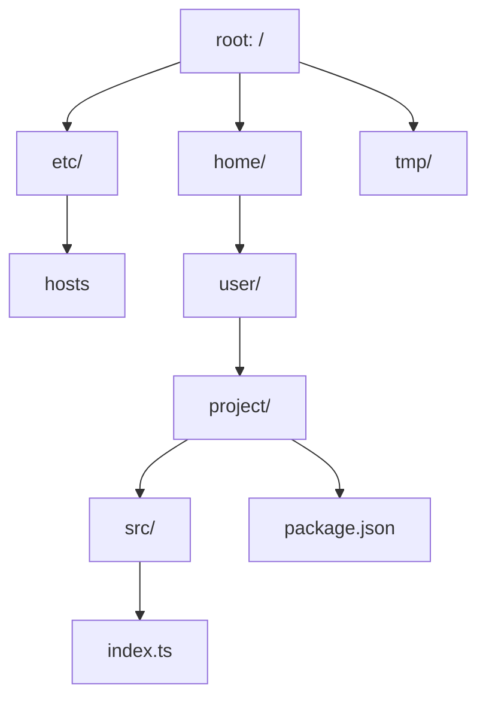
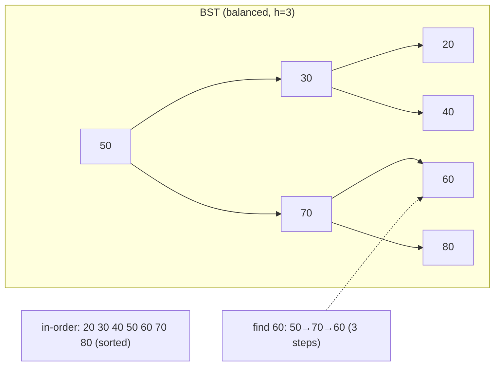
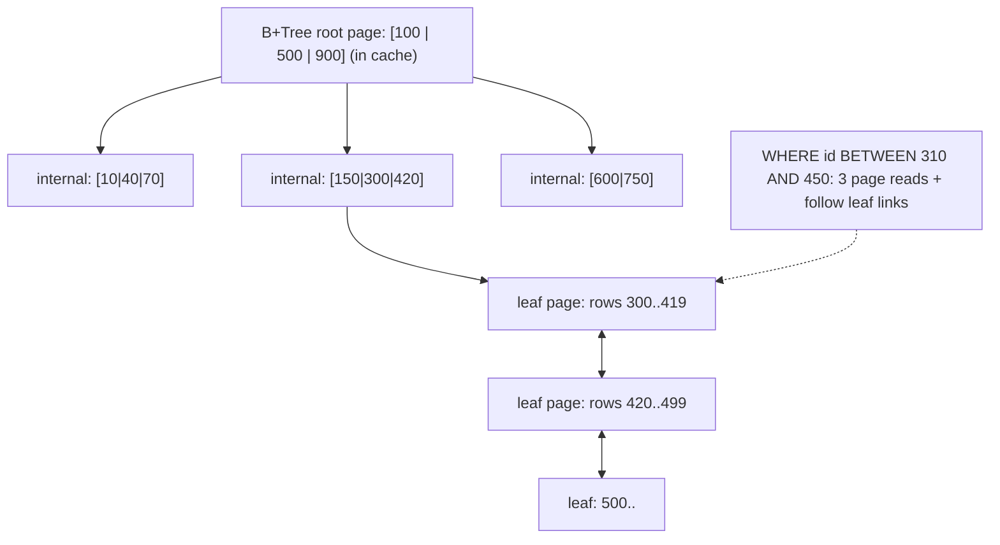

# Module 3.4 — الأشجار
## Trees: hierarchy everywhere (DOM, file systems, JSON, ASTs), traversals, BST idea, and a B-Tree preview for indexes

> **المستوى:** Level 3 | **الموقع:** [4 من 14]
> **السابق:** [M3.3 — Linked Lists](module-3.3-linked-lists.md) | **التالي:** [M3.5 — Heaps & Priority Queues](module-3.5-heaps-priority-queues.md)

---

## 1. المتطلبات
- [ ] التكرار (recursion) ومكدس الاستدعاء — [L1-M1.4](../level-1-programming/module-1.4-functions-scope-closures.md), [L2-M2.3](../level-2-computer-systems/module-2.3-memory-stack-heap-gc.md)
- [ ] المكدس والطابور (DFS/BFS يحتاجانهما) — [M3.2](module-3.2-sets-stacks-queues.md)
- [ ] العقد والمؤشرات — [M3.3](module-3.3-linked-lists.md)

## 2. أهداف التعلّم
- التعرف على **الشجرة** (tree) كهيكل التسلسل الهرمي: جذر، عقد، أبناء، أوراق، عمق/ارتفاع، وأنك تتعامل معها يوميًا: نظام الملفات، DOM، JSON، شجرة الصياغة (AST)، شجرة المكوّنات، شجرة العمليات، التعليقات المتداخلة، التصنيفات.
- كتابة **الاجتيازات الأربعة** وفهم متى كلٌّ منها: pre-order (نسخ/تسلسل/طباعة هرمية)، post-order (حذف/حساب أحجام/تقييم تعبيرات)، in-order (BST مرتّب)، level-order/BFS (الأقرب أولًا، بالطابور).
- تحويل التكرار إلى حلقة بمكدس صريح لتجنّب `Maximum call stack` على الأشجار العميقة.
- فهم فكرة **شجرة البحث الثنائية** (BST): بحث/إدراج O(log n) **إذا كانت متوازنة**، ولماذا الإدراج المرتّب يحوّلها إلى قائمة O(n) → الحاجة للتوازن (AVL/Red-Black كمفهوم).
- **B-Tree preview**: لماذا تستخدم قواعد البيانات شجرة بعقد عريضة (مئات المفاتيح لكل عقدة = صفحة قرص) بدل ثنائية — ليكون M3.13 (Indexes) طبيعيًا.
- تمثيل الأشجار في DB كجدول (`parent_id`، path، closure) — جسر إلى M3.12.

---

## 3. شرح للمبتدئ

### ما الشجرة؟
قائمة مرتبطة حيث العقدة تملك **عدة** `next` (أبناء) ولا دورات: كل عقدة لها أب واحد إلا **الجذر** (root). عقدة بلا أبناء = **ورقة** (leaf). **العمق** depth = المسافة من الجذر، **الارتفاع** height = أطول مسار للأسفل. الشجرة **تعريف تكراري**: شجرة = جذر + قائمة أشجار فرعية. لذلك **كل خوارزمية شجرة تكرارية طبيعيًا** — وهذا سبب تعلّمك التكرار.

أنت داخل أشجار طوال الوقت:
- **نظام الملفات** (L0-M0.4): مجلدات = عقد داخلية، ملفات = أوراق. `du -sh` = post-order (حجم المجلد = مجموع الأبناء).
- **DOM/React component tree**: `querySelector` = DFS؛ "re-render subtree" = عملية على شجرة فرعية.
- **JSON** (L1-M1.10): كل `{}`/`[]` عقدة، القيم البدائية أوراق. `JSON.stringify` = pre-order؛ `structuredClone` = اجتياز كامل.
- **AST**: المصرّف يحوّل `a + b * 2` إلى شجرة `+(a, *(b, 2))`؛ TypeScript، ESLint، Prettier، Babel كلها تمشي على AST (post-order للتقييم/التحويل).
- **شجرة العمليات** (L2-M2.5): `fork` يبني شجرة؛ قتل الأب يترك أيتامًا.
- **تعليقات متداخلة، تصنيفات منتجات، هيكل المؤسسة** — بياناتك في Project 4 ستكون شجرة تُخزَّن في جدول.

### الاجتيازات: ترتيب الزيارة هو كل شيء
لعقدة بأبناء، أين تضع "عالج هذه العقدة" بالنسبة لمعالجة الأبناء؟
- **Pre-order** (العقدة ثم الأبناء): طباعة بشكل هرمي، نسخ/تسلسل الشجرة، إنشاء مجلد قبل محتوياته.
- **Post-order** (الأبناء ثم العقدة): حذف (لا تحذف مجلدًا قبل محتوياته)، حساب أحجام/ارتفاعات، تقييم AST (احسب العوامل قبل العملية)، تحرير الموارد، ترتيب بناء الاعتماديات.
- **In-order** (يسار، العقدة، يمين — للأشجار الثنائية): في BST يعطي **الترتيب المفروز**.
- **Level-order / BFS** (بالطابور): مستوى فمستوى: "أقرب تطابق"، عمق محدود، طباعة المستويات، أقصر مسار في شجرة.
الثلاثة الأولى **DFS** (عميقًا أولًا) وتُنفَّذ بالتكرار (مكدس الاستدعاء) أو بمكدس صريح. BFS **تحتاج طابورًا** — ولذلك درست M3.2 أولًا.

**العمق مشكلة عملية**: شجرة JSON متداخلة 20k مستوى (هجوم أو بيانات سيئة) تُسقط `JSON.parse` التكراري/دالتك بـ `RangeError`. الحلول: مكدس صريح، أو حد أقصى للعمق (في Project 4: ارفض JSON أعمق من 32 مستوى — قرار أمني).

### BST: الشجرة التي تجعل البحث O(log n)
شجرة ثنائية حيث **يسار < العقدة < يمين**. البحث عن x: قارن بالجذر، اذهب يسارًا أو يمينًا، كرر — كل خطوة تستبعد نصف الشجرة → O(h) حيث h الارتفاع. **إن كانت متوازنة** h ≈ log₂n (مليون عنصر = 20 مقارنة). وبعكس المصفوفة المرتبة (بحث ثنائي O(log n) لكن إدراج O(n))، الإدراج في BST أيضًا O(h). وبعكس خريطة التجزئة، BST تعطي **ترتيبًا ونطاقات**: "كل المفاتيح بين a وb"، "الأصغر الأكبر من x"، "أول 10 بعد y" — وهذا ما لا تعرفه التجزئة (M3.1).

**المشكلة**: أدرج 1,2,3,4,5 بالترتيب → كل عقدة ابن أيمن → قائمة مرتبطة، h = n، O(n). والبيانات الحقيقية **غالبًا مرتبة** (IDs تصاعدية، طوابع زمنية). الحل: **أشجار متوازنة ذاتيًا** (AVL، Red-Black) تعيد ترتيب العقد عند الإدراج لتبقى h = O(log n) — هذا ما داخل `std::map` في C++، `TreeMap` في Java، جدولة العمليات في Linux (CFS = red-black tree). في JS لا توجد مدمجة (ولهذا `Map` تجزئة بلا ترتيب)؛ تحتاج مكتبة (مثل `sorted-btree`) نادرًا.

### B-Tree: لماذا الشجرة الثنائية سيئة للقرص
شجرة ثنائية متوازنة بمليون مفتاح: 20 مستوى = 20 قفزة. في الذاكرة كل قفزة ~100ns؛ على القرص كل قفزة **قراءة صفحة** (~100μs SSD، ~10ms HDD — L0 latency table). 20 قراءة لكل بحث = كارثة. الحل: اجعل كل عقدة **صفحة كاملة** (8KB في PostgreSQL) تحمل **مئات المفاتيح** مرتبة ومؤشرات لمئات الأبناء. تفرّع 500 → مليون مفتاح في **3 مستويات**؛ مليار في 4. المستويات العليا دائمًا في الكاش → بحث = قراءة قرص واحدة أو اثنتان. هذه **B-Tree** (و**B+Tree** حيث الأوراق مربوطة كقائمة مرتبطة للمسح بالنطاق — القائمة المرتبطة عادت!). **كل فهرس DB تقريبًا هو B+Tree** (M3.13)، وكذلك أنظمة الملفات (ext4، NTFS، APFS). النقطة الآن: الشجرة أداة بحث مرتّب، وشكل العقدة يُحدَّد بتكلفة الوصول للمستوى الأدنى من الذاكرة.

### الأشجار في جدول علاقي (جسر إلى M3.12)
الجداول مسطّحة؛ الشجرة تُخزَّن كـ: **قائمة مجاورة** `parent_id` (بسيطة، "كل الأحفاد" يتطلب استعلامًا تكراريًا `WITH RECURSIVE`)، **مسار مادي** `path = '/1/7/42/'` (البحث بالبادئة سريع، النقل مكلف)، أو **closure table**. Project 4: تصنيفات المنتجات بـ `parent_id` + استعلام تكراري.

---

## 4. النموذج الذهني

```
Tree = root + subtrees (تعريف تكراري) → خوارزمياتها تكرارية؛ عمق كبير → مكدس صريح/حد أقصى
DFS: pre (أنا ثم أبنائي: نسخ/طباعة/إنشاء)  post (أبنائي ثم أنا: حذف/حساب/تقييم AST)  in (BST مرتّب)
BFS: طابور، مستوى فمستوى: الأقرب أولًا
BST: يسار < عقدة < يمين → بحث/إدراج/نطاق O(h)؛ متوازنة h=log n، مرتّبة الإدخال h=n → AVL/RB
B-Tree: عقدة = صفحة قرص بمئات المفاتيح → 3–4 مستويات لمليار → كل فهرس DB (M3.13)
```

## 5. الرسم التوضيحي







## 6. مثال بسيط

```typescript
// src/traversals.ts — شجرة عامة (n أبناء) + الاجتيازات الأربعة على مثال نظام ملفات
type FsNode = { name: string; size?: number; children?: FsNode[] };
const fs: FsNode = { name: "/", children: [
  { name: "etc", children: [{ name: "hosts", size: 200 }] },
  { name: "home", children: [{ name: "user", children: [{ name: "a.txt", size: 1000 }, { name: "b.txt", size: 3000 }] }] },
]};

function preOrder(n: FsNode, depth = 0) {              // أنا ثم أبنائي: طباعة هرمية (tree command)
  console.log("  ".repeat(depth) + n.name); n.children?.forEach(c => preOrder(c, depth + 1));
}
function totalSize(n: FsNode): number {                // أبنائي ثم أنا: حجم المجلد (du)
  return n.size ?? (n.children ?? []).reduce((s, c) => s + totalSize(c), 0);
}
function bfsFind(root: FsNode, name: string): FsNode | undefined {   // الأقرب أولًا، بطابور (M3.2)
  const q: FsNode[] = [root]; let head = 0;
  while (head < q.length) { const n = q[head++]!; if (n.name === name) return n; q.push(...(n.children ?? [])); }
}
function dfsIterative(root: FsNode): string[] {        // pre-order بمكدس صريح: لا RangeError مهما كان العمق
  const out: string[] = [], stack: FsNode[] = [root];
  while (stack.length) { const n = stack.pop()!; out.push(n.name); for (let i = (n.children?.length ?? 0) - 1; i >= 0; i--) stack.push(n.children![i]!); }
  return out;
}
preOrder(fs); console.log(totalSize(fs), bfsFind(fs, "b.txt")?.size, dfsIterative(fs));   // 4200 3000 ["/","etc","hosts","home","user","a.txt","b.txt"]

// حد العمق كقرار أمني: JSON متداخل 100k مستوى يسقط التكرار
const deep = "[".repeat(100_000) + "]".repeat(100_000);
try { JSON.parse(deep); } catch (e) { console.log("JSON.parse:", (e as Error).constructor.name); }   // RangeError في V8
function depthOf(v: unknown, d = 0, max = 32): number {   // تحقق من العمق قبل المعالجة (Project 4 body validation)
  if (d > max) throw new RangeError(`JSON deeper than ${max}`);
  if (Array.isArray(v)) return Math.max(d, ...v.map(x => depthOf(x, d + 1, max)));
  if (v && typeof v === "object") return Math.max(d, ...Object.values(v).map(x => depthOf(x, d + 1, max)));
  return d;
}
console.log(depthOf({ a: [{ b: 1 }] }));                 // 3
```

## 7. مثال كود

```typescript
// src/bst.ts — BST بسيطة: بحث/إدراج/نطاق، وإثبات أن الإدراج المرتّب يدمّرها (→ لماذا AVL/RB/B-Tree)
type N = { key: number; left: N | null; right: N | null };
class BST {
  root: N | null = null; size = 0;
  insert(key: number) {
    const node: N = { key, left: null, right: null };
    if (!this.root) { this.root = node; this.size++; return; }
    let cur = this.root;
    for (;;) {
      if (key === cur.key) return;                                   // بلا تكرار
      const side = key < cur.key ? "left" : "right";
      if (!cur[side]) { cur[side] = node; this.size++; return; }
      cur = cur[side]!;
    }
  }
  has(key: number): boolean { let c = this.root, steps = 0; while (c) { steps++; if (key === c.key) { this.lastSteps = steps; return true; } c = key < c.key ? c.left : c.right; } this.lastSteps = steps; return false; }
  lastSteps = 0;
  height(n = this.root): number { return n ? 1 + Math.max(this.height(n.left), this.height(n.right)) : 0; }
  *range(lo: number, hi: number, n = this.root): Generator<number> {   // in-order مقيّد: ما لا تستطيعه Map
    if (!n) return;
    if (n.key > lo) yield* this.range(lo, hi, n.left);
    if (n.key >= lo && n.key <= hi) yield n.key;
    if (n.key < hi) yield* this.range(lo, hi, n.right);
  }
  *inOrder(n = this.root): Generator<number> { if (!n) return; yield* this.inOrder(n.left); yield n.key; yield* this.inOrder(n.right); }
}

const N_KEYS = 4000;
const random = new BST(), ordered = new BST();
const keys = Array.from({ length: N_KEYS }, (_, i) => i);
for (const k of keys.toSorted(() => Math.random() - 0.5)) random.insert(k);
for (const k of keys) ordered.insert(k);                              // IDs تصاعدية كما في الواقع
random.has(3999); ordered.has(3999);
console.log({ randomHeight: random.height(), orderedHeight: ordered.height(), log2n: Math.ceil(Math.log2(N_KEYS)) });
// randomHeight ≈ 25–30 (≈2·log n)، orderedHeight = 4000 (قائمة!) ← حافز الأشجار المتوازنة
console.log([...random.range(100, 105)], [...random.inOrder()].slice(0, 5));   // [100..105] [0,1,2,3,4]

// حساب B-Tree بالأرقام: صفحة 8KB، مفتاح+مؤشر ≈ 16B → تفرّع ≈ 500
const fanout = Math.floor(8192 / 16);
for (const n of [1e6, 1e9]) console.log(n, "keys →", Math.ceil(Math.log(n) / Math.log(fanout)), "levels (binary:", Math.ceil(Math.log2(n)), ")");
// 1e6 → 3 levels (binary: 20) ; 1e9 → 4 levels (binary: 30)
```

## 8. مثال من العالم الحقيقي
- **React reconciliation**: مقارنة شجرتين (الافتراضية القديمة/الجديدة) بـ DFS مع استكشافات (`key`) لتجنّب O(n³).
- **TypeScript/ESLint/Prettier**: كلها "اجتياز AST + زائر (visitor)". تعلّم `@typescript-eslint` = pre/post-order على عقد الصياغة.
- **Git**: الالتزام يشير إلى **tree object** (مجلد) يشير إلى blobs/أشجار — Merkle tree؛ تجزئة المجلد = post-order.
- **Linux CFS scheduler**: red-black tree مرتّبة بوقت التشغيل الافتراضي؛ أقل عقدة = العملية التالية.
- **PostgreSQL/MySQL/SQLite**: B+Tree لكل فهرس وغالبًا للجدول نفسه (clustered في InnoDB).
- **Nested comments (Reddit/HN)**: شجرة في جدول بـ `parent_id` و`WITH RECURSIVE` أو materialized path.

## 9. مثال من الإنتاج
**حادثة "طلب واحد يُسقط الخادم":** API يقبل JSON ويمر عليه بدالة تكرارية للتطبيع (snake→camel). مهاجم أرسل `{"a":{"a":{"a":...}}}` بعمق 50k (بضعة مئات KB فقط). `JSON.parse` نجح (V8 يتحمّل عمقًا كبيرًا لكن ليس لانهائيًا)، ثم دالة التطبيع التكرارية رمت `RangeError: Maximum call stack size exceeded` **غير مُلتقَط** داخل معالج غير متزامن → العملية انهارت (L1-M1.9 unhandled rejection) → كل الطلبات المتزامنة فشلت. أسوأ: المهاجم كرره 10 مرات/ثانية. الإصلاح: (1) حد حجم الجسم (`1MB`) **و**حد عمق (32) يُرفض بـ 400 قبل أي معالجة؛ (2) تحويل التطبيع إلى مكدس صريح؛ (3) التقاط الأخطاء في طبقة الـ middleware الأخيرة وتحويلها إلى 500 بدل الانهيار؛ (4) اختبار fuzz ببيانات عميقة. **الدرس:** كل شجرة من مدخلات غير موثوقة (L0-M0.7 trust boundary) تحتاج **حدًا للعمق والحجم** — التكرار على مدخلات المستخدم ثغرة DoS.

## 10. مفاهيم خاطئة شائعة

| ❌ | ✅ |
|---|---|
| "الأشجار للمقابلات فقط" | DOM، JSON، AST، ملفات، Git، فهارس DB، React — تمشي عليها يوميًا. |
| "BST دائمًا O(log n)" | فقط إن كانت متوازنة؛ الإدراج المرتّب يجعلها O(n). لهذا AVL/RB/B-Tree. |
| "التكرار دائمًا الطريقة الصحيحة للأشجار" | أنيق، لكن العمق غير الموثوق يتطلب مكدسًا صريحًا أو حدًا. |
| "فهرس DB = شجرة ثنائية" | B+Tree عريضة (مئات المفاتيح/عقدة) بسبب تكلفة قراءة الصفحة. |
| "BFS وDFS متكافئان" | BFS = الأقرب أولًا (طابور، ذاكرة بعرض المستوى)؛ DFS = الأعمق أولًا (مكدس، ذاكرة بالعمق). |

## 11. أخطاء شائعة
1. تكرار بلا حد عمق على مدخلات المستخدم.
2. حذف/إغلاق بـ pre-order (حذف المجلد قبل محتوياته).
3. BFS بـ `queue.shift()` (M3.2).
4. تعديل الشجرة أثناء اجتيازها (حذف أبناء داخل `forEach`).
5. دورة في "شجرة" (مرجع أب داخل الابن + `JSON.stringify` → `TypeError: circular`)؛ تتبّع `visited` إن لم تضمن غياب الدورات (M3.6).
6. تخزين شجرة في DB بـ `parent_id` ثم جلب كل مستوى باستعلام منفصل في حلقة (N+1 — M3.11).

## 12. تمرين تصحيح

```typescript
// حساب حجم مجلد: يعيد أرقامًا خاطئة أحيانًا ويعلّق أحيانًا على بعض الأقراص
async function dirSize(p: string): Promise<number> {
  let total = 0;
  for (const e of await readdir(p, { withFileTypes: true })) {
    const full = join(p, e.name);
    if (e.isDirectory()) total += await dirSize(full);
    else total += (await stat(full)).size;
  }
  return total;
}
```

<details><summary>💡 الحل</summary>

1. **يعلّق**: الروابط الرمزية (symlinks) `e.isSymbolicLink()` قد تشير إلى الأب → **دورة** → تكرار لا نهائي (الشجرة أصبحت رسمًا بيانيًا). الحل: تجاهل الروابط أو تتبّع `Set` للـ `inode`/المسارات الحقيقية (`realpath`) المزارة.
2. **أرقام خاطئة**: `stat` يتبع الرابط (حجم الهدف) بينما `lstat` يعطي الرابط نفسه؛ وملفات تُحذف أثناء المسح ترمي `ENOENT` تُسقط كل الحساب — التقطها وتجاوز.
3. **الأداء**: تسلسلي بالكامل؛ `Promise.all` على المدخلات مع حد تزامن (L1-M1.11) لأن 100k ملف مفتوح معًا = `EMFILE` (L2-M2.4).
4. عمق كبير جدًا (نادر لكن ممكن) → مكدس صريح.
</details>

## 13. تمرين معماري
صمّم تخزين تصنيفات المنتجات (شجرة بعمق ≤ 5، 10k عقدة، قراءات 1000:1 كتابات) لـ Project 4: `parent_id` vs materialized path vs closure table — لكل منها تكلفة "كل أحفاد X"، "مسار X للجذر"، "نقل شجرة فرعية"، وحجم التخزين؛ ماذا تختار ولماذا، وكيف تمنع الدورات (قيد على مستوى التطبيق أم DB؟). ACTRR.

## 14. الصلة بعصر AI
AI يكتب اجتيازات صحيحة بسهولة، لكنه نادرًا ما يضيف **حد العمق** أو يتعامل مع الدورات/الروابط الرمزية إلا إذا طلبت. أضف "مدخلات غير موثوقة: حد عمق/حجم + التقاط" لمواصفاتك. وعندما تطلب "فهرس" في SQL من AI، الآن تفهم ما سينشئه (B+Tree) وتستطيع الحكم إن كان مناسبًا (M3.13).

## 15–17. Master / Understand / Defer
- 🔴 الشجرة كتعريف تكراري وأين تراها؛ pre/post/BFS ومتى كلٌّ؛ مكدس صريح وحد عمق للمدخلات؛ فكرة BST وO(h)؛ لماذا الإدراج المرتّب يدمّرها؛ فكرة B-Tree = صفحة عريضة (3–4 مستويات).
- 🟠 in-order وrange على BST؛ تمثيل الأشجار في DB الثلاثة؛ AST visitor؛ Merkle tree في Git؛ دورات/روابط رمزية.
- ⚪ كتابة AVL/Red-Black بنفسك؛ B-Tree splits/merges؛ tries، segment trees، R-trees، LSM trees (ستذكر في M3.13 كمقابل).

## 18. الخلاصة
1. الشجرة = تسلسل هرمي بتعريف تكراري؛ نظام الملفات، DOM، JSON، AST، Git، فهارس DB.
2. ترتيب الزيارة هو الخوارزمية: pre (إنشاء/نسخ)، post (حذف/حساب/تقييم)، in (مرتّب)، BFS (الأقرب أولًا بطابور).
3. التكرار طبيعي لكن العمق غير الموثوق = DoS: مكدس صريح + حد عمق/حجم.
4. BST تعطي بحثًا **ونطاقات** O(h)؛ التوازن ضروري (AVL/RB) لأن البيانات الحقيقية مرتّبة.
5. B+Tree: عقدة = صفحة بمئات المفاتيح → مليار صف في 4 مستويات؛ أوراق مربوطة للنطاقات — أساس M3.13.

## 19. مراجع رسمية
- MDN — Document Object Model (tree): https://developer.mozilla.org/en-US/docs/Web/API/Document_Object_Model/Introduction
- TypeScript — Using the Compiler API (AST walk): https://github.com/microsoft/TypeScript/wiki/Using-the-Compiler-API
- PostgreSQL — B-Tree index internals: https://www.postgresql.org/docs/current/btree.html
- Git Book — Git Objects (tree objects): https://git-scm.com/book/en/v2/Git-Internals-Git-Objects
- Open Data Structures — Binary Trees / Red-Black Trees: https://opendatastructures.org/ods-java/6_Binary_Trees.html

## المصطلحات
| العربية | English |
|---|---|
| شجرة | Tree |
| جذر / ورقة | Root / Leaf |
| أب / ابن / شجرة فرعية | Parent / Child / Subtree |
| عمق / ارتفاع | Depth / Height |
| اجتياز | Traversal |
| سابق / لاحق / وسطي الترتيب | Pre-order / Post-order / In-order |
| بحث بالعمق أولًا / بالعرض أولًا | DFS / BFS |
| شجرة بحث ثنائية | Binary Search Tree (BST) |
| شجرة متوازنة ذاتيًا | Self-balancing tree (AVL, Red-Black) |
| شجرة الصياغة المجردة | Abstract Syntax Tree (AST) |
| شجرة B / B+ | B-Tree / B+Tree |
| تفرّع | Fanout |
| مسار مادي | Materialized path |
| جدول الإغلاق | Closure table |

> **التالي:** [Module 3.5 — Heaps & Priority Queues](module-3.5-heaps-priority-queues.md)
