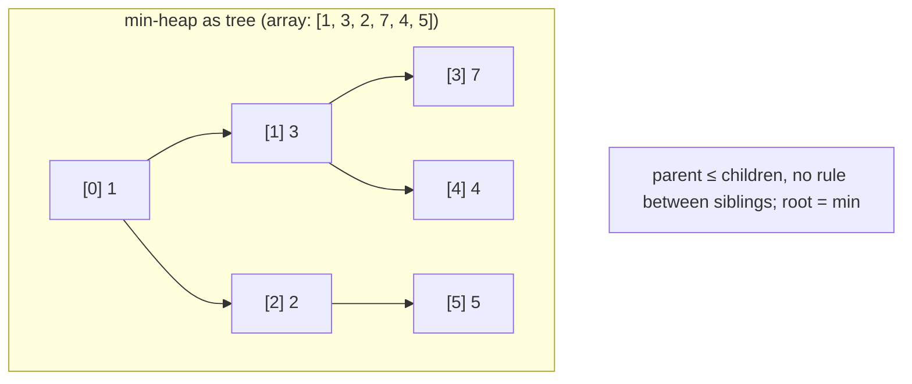
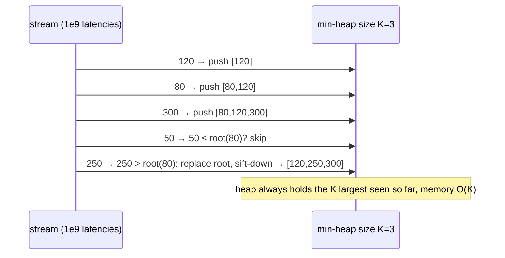
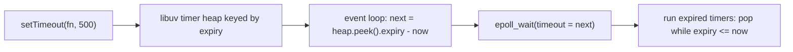

# Module 3.5 — الأكوام وطوابير الأولوية
## Heaps & Priority Queues: "give me the most urgent thing next" in O(log n) — schedulers, timers, top-K, priority job queues

> **المستوى:** Level 3 | **الموقع:** [5 من 14]
> **السابق:** [M3.4 — Trees](module-3.4-trees.md) | **التالي:** [M3.6 — Graphs](module-3.6-graphs.md)

---

## 1. المتطلبات
- [ ] الطابور FIFO ولماذا `shift()` O(n) — [M3.2](module-3.2-sets-stacks-queues.md)
- [ ] الشجرة الثنائية والارتفاع log n — [M3.4](module-3.4-trees.md)
- [ ] مصفوفات متجاورة وخطوط الكاش — [M3.1](module-3.1-arrays-hash-maps.md)

## 2. أهداف التعلّم
- تعريف **طابور الأولوية** (priority queue) بعملياته: `push(item, priority)`، `pop()` الأعلى أولوية، `peek()` — وتمييزه عن FIFO.
- شرح **الكومة الثنائية** (binary heap): شجرة شبه كاملة مخزّنة **في مصفوفة** (أبناء i هما 2i+1 و2i+2)، `push`/`pop` O(log n)، `peek` O(1)، بناء O(n).
- معرفة لماذا الكومة وليس "مصفوفة مرتبة" (إدراج O(n)) ولا "فرز عند كل pop" (O(n log n) لكل عملية).
- تطبيق الأنماط الأربعة: **top-K** من تدفق كبير بكومة بحجم K؛ **دمج K قوائم مرتبة**؛ **المؤقتات** (أقرب موعد انتهاء أولًا)؛ **جدولة بالأولوية** (مهام، Dijkstra في M3.6).
- التعرف على الكومة في الأنظمة: مؤقتات libuv/Node، جدولة النواة، `ORDER BY ... LIMIT k` في PostgreSQL (top-N heapsort)، طوابير مهام بأولوية (BullMQ)، Dijkstra.

---

## 3. شرح للمبتدئ

### المشكلة
لديك مهام تصل باستمرار بأولويات مختلفة، وتريد دائمًا تنفيذ **الأعلى أولوية** التالية. FIFO (M3.2) خطأ (يتجاهل الأولوية). الخيارات الساذجة:
- مصفوفة غير مرتبة: `push` O(1) لكن `pop` = ابحث عن الأقصى O(n).
- مصفوفة مرتبة: `pop` O(1) من النهاية لكن `push` في الموضع الصحيح O(n) (إزاحة).
- فرز عند كل `pop`: O(n log n) **لكل عملية**.
مع 100k مهمة ومليون عملية، كلها غير مقبولة. نريد **الاثنين** O(log n).

### الكومة الثنائية: شجرة تعيش في مصفوفة
**Min-heap**: شجرة ثنائية حيث **كل أب ≤ أبنائه** (لا شرط بين الأشقاء — وهذا ما يميزها عن BST؛ شرط أضعف = صيانة أرخص). النتيجة: **الجذر هو الأصغر دائمًا** (`peek` O(1)). الشجرة "كاملة" (كل المستويات ممتلئة إلا الأخير من اليسار)، لذلك تُخزَّن **في مصفوفة بلا مؤشرات**: العقدة i أبناؤها `2i+1`, `2i+2` وأبوها `floor((i-1)/2)`. متجاورة = صديقة للكاش (M3.1)، لا overhead عقد (M3.3).
- **push**: ضع في نهاية المصفوفة، ثم **sift-up**: ما دام أصغر من أبيه بادل. ≤ h = log n خطوات.
- **pop**: خذ الجذر؛ انقل الأخير إلى الجذر؛ **sift-down**: بادل مع الأصغر من أبنائه حتى يستقر. O(log n).
- **heapify** (بناء من n عنصر): sift-down من المنتصف إلى البداية = **O(n)** (لا n log n) — مفيد لـ top-K.
- **max-heap** = نفس الشيء بعكس المقارنة، أو min-heap بمقارِن مخصص.

### الأنماط الأربعة
1. **Top-K من تدفق كبير** (أكبر 10 طلبات زمنًا من مليار سجل): كومة **min** بحجم K؛ لكل عنصر: إن كان أكبر من الجذر → استبدل الجذر وsift-down. الذاكرة O(K)، الزمن O(n log K). مقابل فرز الكل O(n log n) وذاكرة O(n). PostgreSQL يفعل هذا بالضبط لـ `ORDER BY x LIMIT 10` ("top-N heapsort" في `EXPLAIN`).
2. **دمج K تدفقات مرتبة** (سجلات من 50 خادمًا مرتبة زمنيًا → تدفق واحد مرتب): كومة بحجم K تحمل رأس كل تدفق؛ pop الأصغر، push التالي من تدفقه. O(N log K). هذا داخل external sort وLSM compaction وmerge في Git.
3. **المؤقتات**: `setTimeout` بآلاف المؤقتات — libuv يحفظها في كومة مرتبة بوقت الانتهاء؛ حلقة الأحداث تسأل "أقرب موعد؟" O(1) وتحسب مهلة `epoll_wait` منه (L2-M2.7). الإلغاء = وسم lazy أو حذف بفهرس.
4. **جدولة بالأولوية**: مهام ذات أولوية مع **كسر التعادل بوقت الوصول** (وإلا فالتساوي يُفقد FIFO وتظهر المجاعة starvation: مهام الأولوية المنخفضة لا تُنفَّذ أبدًا تحت الحمل — الحل: **aging** رفع الأولوية مع الانتظار). Dijkstra (M3.6) = "أقرب عقدة غير مزارة التالية" = طابور أولوية.

### ما ليست عليه الكومة
- ليست مرتبة: المصفوفة الداخلية `[1, 5, 2, 9, 6, 3]` كومة صحيحة لكن ليست مفروزة. المرور عليها لا يعطي ترتيبًا؛ الفرز = pop متكرر (**heapsort** O(n log n)).
- لا بحث سريع عن عنصر عشوائي ولا "غيّر أولوية x" إلا بفهرس إضافي (`Map<item, index>` — indexed heap) — لازم لـ Dijkstra الفعّال وإلغاء المؤقتات.
- JS لا يملك كومة مدمجة؛ تكتب ~40 سطرًا أو تستخدم `heap-js`/`@datastructures-js/priority-queue`. (مصفوفة + `sort()` عند كل pop شائع في كود AI — O(n log n) لكل عملية.)

---

## 4. النموذج الذهني

```
Priority queue = "الأهم التالي" (ليس الأول التالي). push/pop O(log n)، peek O(1)
Binary heap  = شجرة كاملة في مصفوفة: children(i)=2i+1,2i+2 ; parent(i)=(i-1)>>1 ; أب ≤ أبناء (min)
push = append + sift-up      pop = root ← last + sift-down      heapify = O(n)
أنماط: top-K (min-heap بحجم K) | merge K sorted | timers (أقرب موعد) | priority scheduling (+aging)
ليست مرتبة؛ لا بحث؛ لا تغيير أولوية بلا indexed heap
```

## 5. الرسم التوضيحي







## 6. مثال بسيط

```typescript
// src/heap.ts — كومة ثنائية عامة بمقارِن (~40 سطرًا)؛ هذه هي النسخة التي تستخدمها في كل الأمثلة التالية
export class Heap<T> {
  private a: T[] = [];
  constructor(private less: (x: T, y: T) => boolean, items: Iterable<T> = []) {   // less(x,y): x له أولوية أعلى من y
    this.a = [...items];
    for (let i = (this.a.length >> 1) - 1; i >= 0; i--) this.down(i);           // heapify O(n)
  }
  get size() { return this.a.length; }
  peek(): T | undefined { return this.a[0]; }
  push(x: T): void { this.a.push(x); this.up(this.a.length - 1); }
  pop(): T | undefined {
    const top = this.a[0], last = this.a.pop();
    if (this.a.length && last !== undefined) { this.a[0] = last; this.down(0); }
    return top;
  }
  replaceTop(x: T): T | undefined { const top = this.a[0]; this.a[0] = x; this.down(0); return top; }   // top-K بلا pop+push
  private up(i: number) { for (let p; i > 0 && this.less(this.a[i]!, this.a[(p = (i - 1) >> 1)]!); i = p) this.swap(i, p); }
  private down(i: number) {
    const n = this.a.length;
    for (;;) {
      let m = i; const l = 2 * i + 1, r = l + 1;
      if (l < n && this.less(this.a[l]!, this.a[m]!)) m = l;
      if (r < n && this.less(this.a[r]!, this.a[m]!)) m = r;
      if (m === i) return; this.swap(i, m); i = m;
    }
  }
  private swap(i: number, j: number) { const t = this.a[i]!; this.a[i] = this.a[j]!; this.a[j] = t; }
}

const h = new Heap<number>((x, y) => x < y, [5, 3, 8, 1, 9, 2]);
const out: number[] = []; while (h.size) out.push(h.pop()!);
console.log(out);                                                 // [1,2,3,5,8,9] ← heapsort

// Top-K: أكبر 5 قيم من مليون رقم (متبعثرة) بذاكرة 5 عناصر فقط
const K = 5, topK = new Heap<number>((x, y) => x < y);           // min-heap: الجذر = أضعف الناجين
// (لا تضرب في أعداد ضخمة لتوليد القيم: i × 2^31 يتجاوز 2^53 ويفقد الدقة — L2-M2.1)
for (let i = 0; i < 1_000_000; i++) { const v = (i * 7919 + 13) % 1_000_003; if (topK.size < K) topK.push(v); else if (v > topK.peek()!) topK.replaceTop(v); }
console.log([...Array.from({ length: K }, () => topK.pop()!)].reverse());   // [1000002, 1000001, 1000000, 999999, 999998]
```

## 7. مثال كود

```typescript
// src/scheduler.ts — طابور مهام بأولوية مع كسر تعادل FIFO وaging ضد المجاعة، ودمج K تدفقات مرتبة
import { Heap } from "./heap.js";

type Job = { id: string; priority: number; enqueuedAt: number; run: () => Promise<void> };
export class PriorityScheduler {
  private seq = 0;
  // الأولوية الفعلية = priority + rate × (الآن − وقت الوصول). الفرق بين مهمتين لا يعتمد على "الآن"
  // (الشيخوخة خطية بنفس المعدل للجميع) → مفتاح ثابت يُحسب مرة واحدة عند الإدراج: key = priority − rate × enqueuedAt
  private heap = new Heap<Job & { seq: number; key: number }>((a, b) => a.key !== b.key ? a.key > b.key : a.seq < b.seq);   // مفتاح أعلى، ثم الأقدم (FIFO)
  constructor(private agingPerSecond = 0.5) {}
  submit(job: Omit<Job, "enqueuedAt">, now = Date.now()) {
    this.heap.push({ ...job, enqueuedAt: now, seq: this.seq++, key: job.priority - this.agingPerSecond * (now / 1000) });
  }
  next() { return this.heap.pop(); }
  effective(j: Job, now = Date.now()) { return j.priority + this.agingPerSecond * ((now - j.enqueuedAt) / 1000); }   // للعرض/المقاييس
  get depth() { return this.heap.size; }                           // مقياس العمق (M3.2) — يُصدَّر إلى المراقبة
}
const s = new PriorityScheduler(1);                                 // +1 أولوية لكل ثانية انتظار
const noop = async () => {};
s.submit({ id: "low-old", priority: 1, run: noop }, 0);
s.submit({ id: "high-1", priority: 5, run: noop }, 100);
s.submit({ id: "high-2", priority: 5, run: noop }, 200);
console.log(s.next()?.id, s.next()?.id);                            // high-1 high-2 (نفس الأولوية → FIFO)
s.submit({ id: "high-4", priority: 5, run: noop }, 6000);           // مهمة عالية تصل بعد 6 ثوانٍ
console.log(s.next()?.id);                                          // low-old ← انتظر 6s: فعليًا 7 > 5 (لا مجاعة أمام الوافدين الجدد)
// لاحظ: الشيخوخة لا تُعيد ترتيب مهمتين موجودتين معًا (الفرق ثابت)؛ أثرها أن القديمة المنخفضة تسبق **الجديدة** العالية في النهاية

// دمج K تدفقات مرتبة (سجلات من خوادم متعددة مرتبة زمنيًا) بذاكرة O(K)
export function* mergeSorted<T>(streams: Iterator<T>[], less: (a: T, b: T) => boolean): Generator<T> {
  type Head = { v: T; i: number };
  const h = new Heap<Head>((a, b) => less(a.v, b.v));
  streams.forEach((it, i) => { const r = it.next(); if (!r.done) h.push({ v: r.value, i }); });
  while (h.size) { const { v, i } = h.pop()!; yield v; const r = streams[i]!.next(); if (!r.done) h.push({ v: r.value, i }); }
}
const logsA = [1, 4, 9][Symbol.iterator](), logsB = [2, 3, 10][Symbol.iterator](), logsC = [0, 11][Symbol.iterator]();
console.log([...mergeSorted([logsA, logsB, logsC], (a, b) => a < b)]);   // [0,1,2,3,4,9,10,11]
```

## 8. مثال من العالم الحقيقي
- **libuv timers**: كومة (min-heap) بوقت الانتهاء؛ `setTimeout` بملايين المؤقتات يبقى O(log n).
- **PostgreSQL** `ORDER BY created_at DESC LIMIT 20` → `Sort Method: top-N heapsort` في `EXPLAIN ANALYZE` (M3.13) — ذاكرة بحجم 20 بدل الجدول.
- **Linux CFS**: red-black tree تعمل كطابور أولوية بأدنى `vruntime` (كومة بإمكانية حذف عشوائي).
- **BullMQ/Sidekiq** طوابير أولوية فوق Redis (sorted sets = skip list كطابور أولوية).
- **Dijkstra/A\*** في الخرائط والشبكات؛ **Huffman coding** في الضغط؛ **Kubernetes scheduler** (priority + preemption).

## 9. مثال من الإنتاج
**حادثة "رسائل OTP تتأخر 20 دقيقة":** طابور إشعارات واحد FIFO يحمل OTP (حرج، ثوانٍ) وحملات تسويق (مليون رسالة، غير عاجلة). حملة واحدة تُدفع قبل OTP → OTP ينتظر خلف مليون. الإصلاح الأول: مصفوفة + `sort` بالأولوية عند كل سحب → CPU 100% (O(n log n) لكل سحب على مليون). الإصلاح الصحيح: طابور أولوية (كومة) + كسر تعادل FIFO + **aging** حتى لا تجوع الحملات إلى الأبد + **طوابير منفصلة** لأصناف SLA مختلفة بعمال مخصصين (أبسط وأقوى من أولوية داخل طابور واحد: الحرج لا يتنافس أصلًا). مقاييس: عمر أقدم عنصر لكل أولوية (oldest-age) لا العمق فقط. **الدرس:** الأولوية قرار منتج قبل أن تكون هيكل بيانات؛ وفصل الطوابير غالبًا يغني عن الذكاء داخلها.

## 10. مفاهيم خاطئة شائعة

| ❌ | ✅ |
|---|---|
| "الكومة مرتبة" | فقط الجذر مضمون؛ المصفوفة الداخلية غير مفروزة. |
| "الكومة = BST" | شرط أضعف (أب ≤ أبناء)، مصفوفة بلا مؤشرات، لا بحث. |
| "sort عند كل pop مقبول" | O(n log n) لكل عملية؛ الكومة O(log n). |
| "الأولوية تحل مشكلة التأخير" | بلا aging/طوابير منفصلة تخلق مجاعة. |
| "heap هنا = heap الذاكرة" | تشابه اسم فقط (L2-M2.3 heap = منطقة الذاكرة). |

## 11. أخطاء شائعة
1. مقارِن غير متسق (`a.p < b.p` في مكان و`<=` في آخر) → كومة فاسدة بصمت. اختبر الخاصية: pop متكرر يعطي ترتيبًا.
2. نسيان كسر التعادل → فقدان FIFO داخل الأولوية الواحدة.
3. تعديل أولوية عنصر داخل الكومة دون re-sift (الكومة لا تعرف).
4. top-K بكومة max بحجم n (ذاكرة O(n)) بدل min بحجم K.
5. مؤقتات ملغاة تبقى في الكومة بلا وسم → "تنفيذ شبح".

## 12. تمرين تصحيح

```typescript
// Dijkstra-like worker: يختار "أرخص" مهمة؛ أحيانًا ينفّذ مهمة أغلى من أخرى موجودة، وبطيء جدًا على 200k مهمة
const pending: { cost: number; id: string }[] = [];
function add(t: { cost: number; id: string }) { pending.push(t); pending.sort((a, b) => b.cost - a.cost); }
function take() { return pending.shift(); }
function decreaseCost(id: string, cost: number) { const t = pending.find(x => x.id === id); if (t) t.cost = cost; }
```

<details><summary>💡 الحل</summary>

1. **الاتجاه**: `sort((a,b)=>b.cost-a.cost)` تنازلي ثم `shift()` يأخذ **الأغلى** — عكس المطلوب. (ولو كان صحيحًا فـ `sort` عند كل `add` O(n log n) + `shift` O(n).)
2. **decreaseCost يعدّل في المكان** دون إعادة ترتيب → المصفوفة لم تعد مرتبة → `take` يعيد غير الأرخص "أحيانًا" (فقط عندما يحدث تعديل).
3. الإصلاح: كومة min بـ `less = a.cost < b.cost`؛ لـ `decreaseCost` إما indexed heap (Map id→index + sift-up) أو **lazy**: push نسخة جديدة ووسم القديمة ملغاة وتجاهلها عند pop (الطريقة الشائعة في Dijkstra — M3.6).
4. اختبار خاصية: لأي تسلسل add/decrease، `take()` يعيد دائمًا أدنى تكلفة حالية.
</details>

## 13. تمرين معماري
صمّم نظام إشعارات بثلاثة أصناف SLA (OTP ≤ 5s، معاملات ≤ 1min، تسويق ≤ 24h) بحجم مليون/يوم: طابور واحد بأولوية أم ثلاثة؟ كيف تمنع التسويق من تجويع نفسه (aging) ومن احتكار المزوّد الخارجي (rate limits، M3.2)؟ ما المقاييس (oldest-age لكل صنف) والتنبيهات؟ ماذا يحدث عند إعادة التشغيل — الكومة في الذاكرة تضيع (L2-M2.5) → أين الاستمرارية؟ ACTRR.

## 14. الصلة بعصر AI
"رتّب المصفوفة ثم خذ الأول" هو ما يقترحه AI غالبًا لأي أولوية. اسأل: كم عملية في الثانية؟ إذا > بضع مئات على آلاف العناصر، اطلب كومة واطلب كسر تعادل FIFO وaging صراحةً. وفي مراجعة `ORDER BY ... LIMIT` ضخم، تحقق من `EXPLAIN` أنه top-N heapsort لا فرزًا كاملًا على القرص.

## 15–17. Master / Understand / Defer
- 🔴 طابور الأولوية ≠ FIFO؛ الكومة = شجرة في مصفوفة بـ push/pop O(log n) وpeek O(1)؛ نمط top-K بكومة min بحجم K؛ لماذا `sort` لكل pop خطأ؛ كسر التعادل والمجاعة/aging.
- 🟠 sift-up/down وheapify O(n)؛ دمج K تدفقات؛ المؤقتات في libuv؛ indexed heap/lazy deletion؛ فصل الطوابير حسب SLA.
- ⚪ Fibonacci/pairing heaps، d-ary heaps، skip lists (Redis ZSET)، heapsort مقابل quicksort عمليًا.

## 18. الخلاصة
1. طابور الأولوية يعطي "الأهم التالي"؛ الكومة الثنائية تنفذه بـ O(log n) في مصفوفة متجاورة.
2. أنماط تراها فعلًا: top-K (ذاكرة O(K))، دمج K مرتبة، مؤقتات، جدولة بأولوية، Dijkstra.
3. الكومة ليست مرتبة ولا تبحث؛ تغيير الأولوية يحتاج فهرسًا أو lazy deletion.
4. الأولوية بلا كسر تعادل FIFO وaging = مجاعة؛ وطوابير منفصلة لكل SLA غالبًا أبسط.
5. `sort` في كل عملية هو O(n²log n) مخفي — تعرّف عليه في كودك وكود AI.

## 19. مراجع رسمية
- libuv — Design overview (timers in event loop): https://docs.libuv.org/en/v1.x/design.html
- PostgreSQL — Using EXPLAIN (Sort methods incl. top-N heapsort): https://www.postgresql.org/docs/current/using-explain.html
- Open Data Structures — Binary Heaps: https://opendatastructures.org/ods-java/10_1_BinaryHeap_Implicit_Bi.html
- Python docs — `heapq` (excellent theory notes applicable to any language): https://docs.python.org/3/library/heapq.html
- Redis — Sorted sets (skip list as priority queue): https://redis.io/docs/latest/develop/data-types/sorted-sets/

## المصطلحات
| العربية | English |
|---|---|
| طابور أولوية | Priority queue |
| كومة ثنائية | Binary heap |
| كومة الحد الأدنى / الأقصى | Min-heap / Max-heap |
| ترشيح لأعلى / لأسفل | Sift-up / Sift-down |
| بناء الكومة | Heapify |
| أكبر K عنصر | Top-K |
| كسر التعادل | Tie-breaking |
| مجاعة | Starvation |
| شيخوخة (رفع الأولوية بالانتظار) | Aging |
| حذف كسول | Lazy deletion |
| كومة مفهرسة | Indexed heap |
| فرز بالكومة | Heapsort |

> **التالي:** [Module 3.6 — Graphs](module-3.6-graphs.md)
