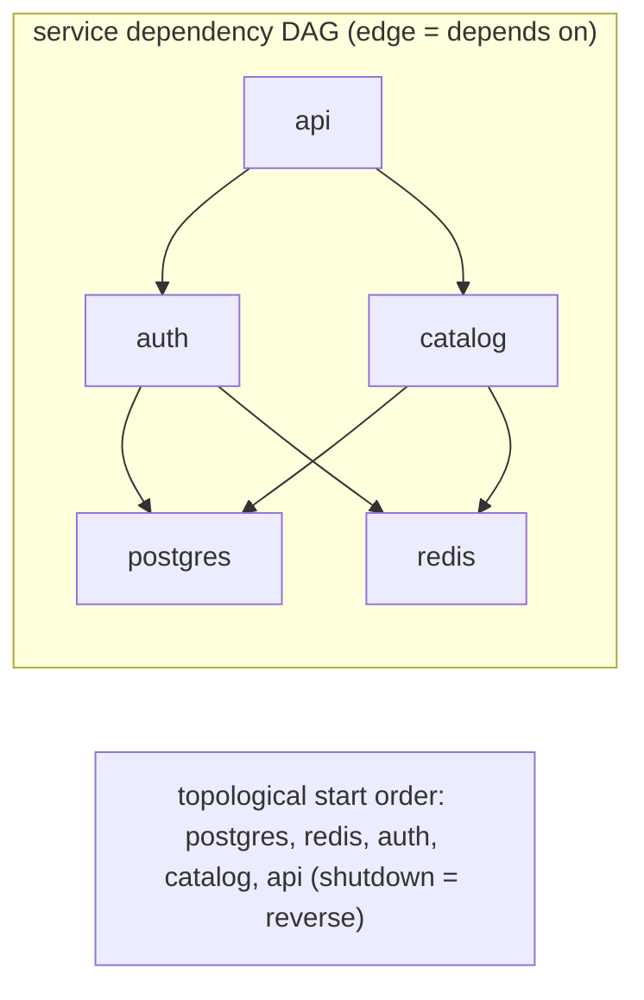
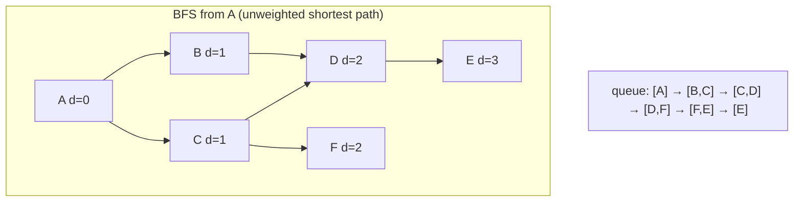
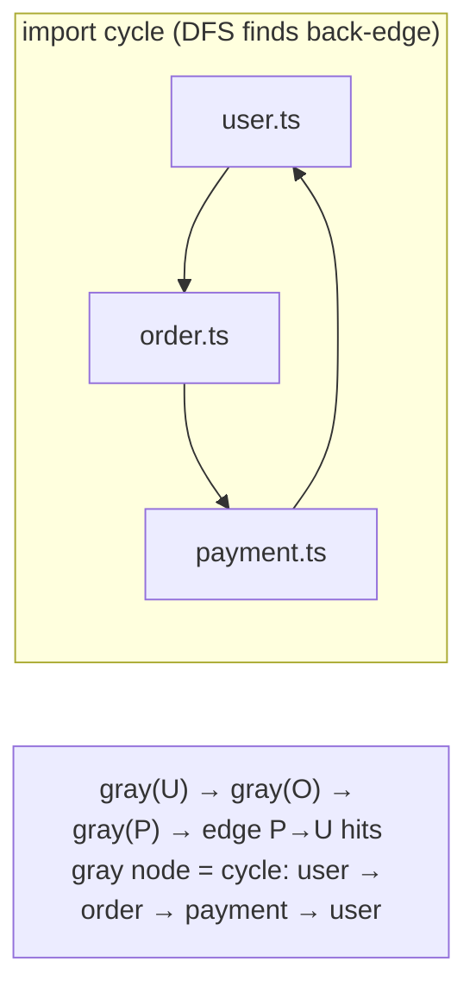

# Module 3.6 — الرسوم البيانية
## Graphs: nodes + edges — dependencies, routes, social graphs, service maps; BFS/DFS, cycle detection, topological sort, shortest path

> **المستوى:** Level 3 | **الموقع:** [6 من 14]
> **السابق:** [M3.5 — Heaps](module-3.5-heaps-priority-queues.md) | **التالي:** [M3.7 — Algorithmic Thinking](module-3.7-algorithmic-thinking.md)

---

## 1. المتطلبات
> **قبل أن تتعلم هذا، يجب أن تفهم:**
- [ ] `Map`/`Set` — [M3.1](module-3.1-arrays-hash-maps.md); المكدس والطابور — [M3.2](module-3.2-sets-stacks-queues.md)
- [ ] الأشجار وDFS/BFS عليها — [M3.4](module-3.4-trees.md); الكومة — [M3.5](module-3.5-heaps-priority-queues.md)

## 2. أهداف التعلّم
- تعريف **الرسم البياني** (graph): عقد (nodes/vertices) وحواف (edges)؛ موجّه/غير موجّه، موزون/غير موزون، ولماذا الشجرة حالة خاصة (متصلة بلا دورات).
- اختيار التمثيل: **قائمة الجوار** (adjacency list = `Map<Node, Node[]>`) للرسوم المتفرقة (الواقع)، ومصفوفة الجوار للكثيفة الصغيرة.
- تنفيذ **BFS** (أقصر مسار بعدد الحواف، "درجات الفصل") و**DFS** (اكتشاف دورات، مكوّنات) مع `visited` — وفهم أن غياب `visited` = حلقة لا نهائية.
- تنفيذ **الترتيب الطوبولوجي** (topological sort) لحل **الاعتماديات**: ترتيب تنفيذ migrations، بناء الحزم، مهام CI، تحميل الوحدات — واكتشاف الدورات (الأهم عمليًا).
- فهم **Dijkstra** كمفهوم (BFS + كومة بأوزان) ومتى تحتاجه، ومتى الرسم البياني يعيش في DB (M3.12) وكيف يُستعلم (`WITH RECURSIVE`).
- التعرف على الرسوم حولك: `package-lock.json`، `import` graph، service dependency map، خريطة الصلاحيات، شبكات اجتماعية، الـ heap (GC reachability = DFS من الجذور!).

---

## 3. شرح للمبتدئ

### من الشجرة إلى الرسم البياني
الشجرة: كل عقدة أب واحد، لا دورات. أزل القيدين: عقدة قد تشير إلى عدة عقد تشير إليها عدة عقد، وقد تعود إليك **دورة** (cycle). هذا **رسم بياني**. أنواعه:
- **موجّه** (directed): الحافة لها اتجاه (A يعتمد على B، A يتبع B، صفحة A تربط إلى B). **غير موجّه**: صداقة متبادلة، طريق ذو اتجاهين.
- **موزون** (weighted): كل حافة بتكلفة (مسافة، كمون، سعر). غير موزون: الحافة موجودة أو لا.
- **DAG** (Directed Acyclic Graph): موجّه بلا دورات = **شجرة الاعتماديات الحقيقية** (حزمة قد تكون اعتمادية لعشر حزم). Git history أيضًا DAG.

أمثلة تعيش معها: `node_modules` (DAG اعتماديات — وأحيانًا دورات!)، `import` بين ملفاتك (الدورات = `undefined` غامض في CommonJS)، خريطة خدماتك (A→B→C; عطل C يصعد لـ A)، GC (L2-M2.3: الكائنات الحية = ما يصل إليه DFS من الجذور — الرسم البياني يعمل داخل لغتك الآن)، migrations بـ `depends_on`، سير العمل (workflow states)، خريطة الصلاحيات/الأدوار، الخرائط والطرق، الشبكات الاجتماعية، شبكة الحاسوب (L2-M2.8: routing = أقصر مسار).

### التمثيل: قائمة الجوار
`Map<string, string[]>`: لكل عقدة قائمة جيرانها (الحواف الخارجة). ذاكرة O(V + E). الواقع **متفرق** (sparse): مليون مستخدم بمتوسط 200 صديق = 200M حافة، لا 10¹² خلية مصفوفة. **مصفوفة الجوار** `boolean[V][V]` فقط للرسوم الصغيرة الكثيفة أو عندما تحتاج "هل A→B؟" O(1) (أو `Set` داخل القائمة). للحواف الموزونة: `Map<string, {to: string; w: number}[]>`.

### BFS وDFS: نفس ما في الأشجار + `visited`
في الشجرة لا تعود لعقدة. في الرسم البياني **تعود** — بلا `Set<visited>` تدور إلى الأبد أو تنفجر أسيًا (مسارات متعددة لنفس العقدة). 
- **BFS** (طابور): يزور بترتيب المسافة → **أقصر مسار بعدد الحواف** في رسم غير موزون ("درجات الفصل"، أقل عدد تحويلات، أقرب خادم). احفظ `parent` لإعادة بناء المسار.
- **DFS** (مكدس/تكرار): اكتشاف **الدورات** (عقدة في المكدس الحالي تظهر مجددًا = دورة في الموجّه)، **المكوّنات المتصلة** (مجموعات معزولة)، الترتيب الطوبولوجي، "هل يمكن الوصول" (reachability = GC!).

### الترتيب الطوبولوجي: الخوارزمية التي ستكتبها فعلًا
"نفّذ المهام بحيث تسبق كل اعتمادية معتمدها": migrations، بناء monorepo، خطوات CI، تهيئة الخدمات (DB قبل الكاش قبل HTTP — L2-M2.13، والإغلاق بالعكس!)، تحميل الوحدات، حل تعارضات الـ schema. **خوارزمية Kahn**: احسب **in-degree** (عدد الاعتماديات) لكل عقدة؛ ضع ذوات الصفر في طابور؛ اسحب واحدة، أخرجها، أنقص in-degree لمعتمديها، وما بلغ صفرًا يدخل الطابور. إن انتهيت وبقيت عقد → **دورة** (أهم مخرج عمليًا: "A يعتمد على B يعتمد على A" يجب أن يفشل البناء برسالة تسمّي الدورة، لا أن يعلّق). الترتيب ليس وحيدًا؛ للاستقرار (نفس المخرج كل مرة) استخدم طابور أولوية بالاسم أو رتّب الأصفار.

### أقصر مسار بأوزان: Dijkstra كمفهوم
BFS يفترض كل حافة = 1. مع أوزان (كمون بين خوادم، مسافات)، استبدل الطابور بـ **كومة min** (M3.5) مرتبة بالمسافة المؤقتة؛ عند سحب عقدة مسافتها نهائية؛ خفّض مسافات جيرانها (relax). O((V+E) log V). يفشل مع أوزان سالبة (Bellman-Ford حينها). تستخدمه: التوجيه (OSPF)، الخرائط (+A\* بتقدير)، "أرخص مسار دفع"، تخطيط الاستعلامات. تعرف اسمه وفكرته؛ تكتبه نادرًا.

### الرسم البياني في قاعدة البيانات
الحواف = جدول `edges(from_id, to_id)` (أو `follows(follower_id, followee_id)`). "كل الأحفاد/كل ما يعتمد على X" = `WITH RECURSIVE` (M3.11)؛ عمق كبير أو استعلامات رسم ثقيلة → DB رسوم (Neo4j) **نادرًا** ما تحتاجها قبل L7. الفخ الشائع: حلقة JS تجلب جيران كل عقدة باستعلام = N+1 بأبعاد رسم بياني.

---

## 4. النموذج الذهني

```
Graph = nodes + edges (directed? weighted? cyclic?) ; Tree = connected acyclic ; DAG = deps/history
تمثيل: adjacency list Map<node, neighbors[]> (sparse = الواقع) ; matrix للصغير الكثيف
BFS + visited → أقصر مسار بالحواف | DFS + visited → دورات، مكوّنات، reachability (GC!)
Topological sort (Kahn: in-degree + queue) → ترتيب الاعتماديات ; بقايا = دورة → افشل بوضوح
Dijkstra = BFS + min-heap بالأوزان ; في DB: جدول حواف + WITH RECURSIVE
```

## 5. الرسم التوضيحي







## 6. مثال بسيط

```typescript
// src/graph-basics.ts — قائمة جوار + BFS أقصر مسار + DFS اكتشاف دورة
export type Graph = Map<string, string[]>;
export function graphFrom(edges: [string, string][], directed = true): Graph {
  const g: Graph = new Map();
  const add = (a: string, b: string) => { if (!g.has(a)) g.set(a, []); if (!g.has(b)) g.set(b, []); g.get(a)!.push(b); };
  for (const [a, b] of edges) { add(a, b); if (!directed) add(b, a); }
  return g;
}

export function shortestPath(g: Graph, from: string, to: string): string[] | null {   // BFS + parent map
  const parent = new Map<string, string | null>([[from, null]]);               // visited = مفاتيح parent
  const q = [from]; let head = 0;                                                // طابور بمؤشر رأس (M3.2)
  while (head < q.length) {
    const cur = q[head++]!;
    if (cur === to) { const path: string[] = []; for (let n: string | null = to; n !== null; n = parent.get(n)!) path.push(n); return path.reverse(); }
    for (const nb of g.get(cur) ?? []) if (!parent.has(nb)) { parent.set(nb, cur); q.push(nb); }
  }
  return null;
}

export function findCycle(g: Graph): string[] | null {        // DFS ثلاثي الألوان: white/gray/black
  const color = new Map<string, 0 | 1 | 2>(), stack: string[] = [];
  const visit = (n: string): string[] | null => {
    color.set(n, 1); stack.push(n);
    for (const nb of g.get(n) ?? []) {
      const c = color.get(nb) ?? 0;
      if (c === 1) return [...stack.slice(stack.indexOf(nb)), nb];   // عقدة رمادية = في المسار الحالي = دورة
      if (c === 0) { const r = visit(nb); if (r) return r; }
    }
    color.set(n, 2); stack.pop(); return null;
  };
  for (const n of g.keys()) if (!color.get(n)) { const r = visit(n); if (r) return r; }
  return null;
}

const social = graphFrom([["ali", "sara"], ["sara", "omar"], ["ali", "lina"], ["lina", "omar"], ["omar", "zed"]], false);
console.log(shortestPath(social, "ali", "zed"));            // ["ali","sara","omar","zed"] (أو عبر lina — نفس الطول)
const imports = graphFrom([["user.ts", "order.ts"], ["order.ts", "payment.ts"], ["payment.ts", "user.ts"], ["main.ts", "user.ts"]]);
console.log(findCycle(imports));                           // ["user.ts","order.ts","payment.ts","user.ts"]
```

## 7. مثال كود

```typescript
// src/toposort.ts — Kahn's algorithm: ترتيب migrations/خدمات/مهام CI، مستقر، ويسمّي الدورة عند الفشل
export class CycleError extends Error { constructor(readonly nodes: string[]) { super(`dependency cycle: ${nodes.join(" → ")}`); } }

/** deps: node → nodes it depends on. Returns an order where every dependency comes before its dependents. */
export function topoSort(deps: Map<string, string[]>): string[] {
  const inDegree = new Map<string, number>(), dependents = new Map<string, string[]>();
  for (const [n, ds] of deps) {
    inDegree.set(n, (inDegree.get(n) ?? 0) + ds.length);
    for (const d of ds) { if (!inDegree.has(d)) inDegree.set(d, 0); (dependents.get(d) ?? dependents.set(d, []).get(d)!).push(n); }
  }
  const ready = [...inDegree].filter(([, d]) => d === 0).map(([n]) => n).sort();   // sort = مخرج حتمي (نفس الترتيب كل مرة)
  const order: string[] = [];
  while (ready.length) {
    const n = ready.shift()!;                      // ready صغير (عرض الطبقة)، وإلا استخدم كومة بالاسم (M3.5)
    order.push(n);
    for (const m of (dependents.get(n) ?? []).sort()) { const d = inDegree.get(m)! - 1; inDegree.set(m, d); if (d === 0) ready.push(m); }
  }
  if (order.length !== inDegree.size) {
    const stuck = [...inDegree].filter(([, d]) => d > 0).map(([n]) => n);         // ما تبقى يحتوي الدورة
    const sub = new Map(stuck.map(n => [n, (deps.get(n) ?? []).filter(d => stuck.includes(d))]));
    throw new CycleError(findCycleIn(sub) ?? stuck);
  }
  return order;
}
function findCycleIn(g: Map<string, string[]>): string[] | null {   // نفس DFS الملوّن من المثال البسيط
  const color = new Map<string, number>(), path: string[] = [];
  const visit = (n: string): string[] | null => {
    color.set(n, 1); path.push(n);
    for (const nb of g.get(n) ?? []) {
      if (color.get(nb) === 1) return [...path.slice(path.indexOf(nb)), nb];
      if (!color.get(nb)) { const r = visit(nb); if (r) return r; }
    }
    color.set(n, 2); path.pop(); return null;
  };
  for (const n of g.keys()) if (!color.get(n)) { const r = visit(n); if (r) return r; }
  return null;
}

// Project 4: migrations بـ depends_on؛ وتهيئة الخدمات بالترتيب ثم الإغلاق بالعكس (L2-M2.5 graceful shutdown)
const migrations = new Map<string, string[]>([
  ["003_order_items", ["002_orders", "001_products"]], ["002_orders", ["000_users"]], ["001_products", []], ["000_users", []],
]);
console.log(topoSort(migrations));                 // ["000_users","001_products","002_orders","003_order_items"]
const services = new Map<string, string[]>([["api", ["auth", "catalog"]], ["auth", ["postgres", "redis"]], ["catalog", ["postgres", "redis"]], ["postgres", []], ["redis", []]]);
const start = topoSort(services); console.log({ start, stop: [...start].reverse() });
try { topoSort(new Map([["a", ["b"]], ["b", ["c"]], ["c", ["a"]], ["d", []]])); } catch (e) { console.log((e as Error).message); }   // dependency cycle: a → b → c → a (أو تدوير له)
```

## 8. مثال من العالم الحقيقي
- **npm/pnpm/Turborepo/Nx**: رسم بياني للحزم؛ `turbo run build` = topological sort + تنفيذ متوازٍ للمستقلّين؛ **circular dependency** تحذير/فشل.
- **ESLint `import/no-cycle`، Madge**: DFS على رسم الـ imports.
- **Docker Compose `depends_on`، systemd units، Kubernetes init**: ترتيب طوبولوجي.
- **GC** في V8: mark = DFS/BFS من الجذور عبر رسم الكائنات؛ غير المزار = قمامة (L2-M2.3).
- **Service mesh/observability** (Jaeger service map): رسم الاعتماديات وقت التشغيل؛ تحليل "انفجار نصف القطر" = reachability عكسي.
- **DB query planner**: ترتيب الـ JOINs = بحث في رسم بياني من الخطط.
- **Git**: `git log` يمشي على DAG الالتزامات؛ `merge-base` = lowest common ancestor.

## 9. مثال من الإنتاج
**حادثة "الإصدار يعلّق في 30% من المرات":** monorepo بأداة بناء داخلية تنفّذ الحزم "بالترتيب الأبجدي ثم تعيد المحاولة لما فشل". حزمتان `utils` و`core` أصبحتا تعتمدان على بعضهما بعد refactor. النتيجة: فشل عشوائي حسب التوقيت، ثم إعادة محاولات لا نهائية. لم يُكتشف لأن الأداة لم تبنِ **رسمًا بيانيًا** أصلًا. الإصلاح: topological sort بـ Kahn + فشل صريح بـ `CycleError` يطبع الدورة (`core → utils → core`) + فحص CI يرفض الدورات في PR + تنفيذ متوازٍ للطبقات المستقلة (قلّص زمن البناء 60%). **الدرس:** الاعتماديات رسم بياني؛ من لا يمثّلها صراحةً يكتشف دوراتها في الإنتاج.

## 10. مفاهيم خاطئة شائعة

| ❌ | ✅ |
|---|---|
| "الرسوم البيانية للخرائط والشبكات الاجتماعية فقط" | اعتمادياتك، imports، خدماتك، GC، Git — كلها رسوم. |
| "DFS على رسم بياني مثل الشجرة" | بلا `visited` حلقة لا نهائية/انفجار أسي. |
| "الترتيب الطوبولوجي وحيد" | عدة ترتيبات صحيحة؛ اجعله حتميًا بكسر تعادل. |
| "دورة الاعتماديات مشكلة نظرية" | تسبب `undefined` في CommonJS، تعليق البناء، deadlock في التهيئة. |
| "أحتاج DB رسوم بيانية لأي علاقة" | جدول حواف + `WITH RECURSIVE` يكفي لمعظم الحالات حتى L7. |

## 11. أخطاء شائعة
1. نسيان `visited` أو وضعه عند **السحب** لا عند **الإضافة** في BFS (تكرارات في الطابور → O(V·E)).
2. تمثيل رسم متفرق بمصفوفة V×V (ذاكرة V²).
3. BFS بـ `shift()` على طوابير كبيرة (M3.2 مجددًا).
4. ترتيب طوبولوجي يعلّق بدل أن يفشل عند الدورة.
5. جلب جيران كل عقدة باستعلام DB داخل الحلقة (N+1 رسومي) بدل `WITH RECURSIVE` أو جلب الحواف دفعة واحدة.
6. التكرار العميق على رسوم كبيرة → `RangeError` (M3.4: مكدس صريح).

## 12. تمرين تصحيح

```typescript
// "من يتأثر إذا سقطت الخدمة X؟" (reverse reachability). النتائج ناقصة أحيانًا وتتضاعف أحيانًا، وبطيئة على 500 خدمة
function impacted(deps: Map<string, string[]>, down: string): string[] {
  const result: string[] = [];
  for (const [svc, ds] of deps) if (ds.includes(down)) { result.push(svc); result.push(...impacted(deps, svc)); }
  return result;
}
```

<details><summary>💡 الحل</summary>

1. **تتضاعف**: لا `visited` → خدمة تصل عبر مسارين تُدرج مرتين (وعند الدورات: تكرار لا نهائي). استخدم `Set`.
2. **ناقصة؟** ليست ناقصة فعلًا لكن المكرّرات تُخفي ذلك عند `length`؛ وعند دورة تنفجر بـ RangeError تُلتقط في مكان ما وتعيد جزءًا.
3. **بطيئة**: لكل مستوى تمرّ على **كل** الخريطة (`for … deps`) = O(V·E) أسوأ من ذلك مع التكرار. ابنِ **الرسم العكسي** مرة واحدة (`dependents: Map<string, string[]>`) ثم BFS منه = O(V+E).
4. اختبار: رسم فيه ماسة (A→B→D, A→C→D) + دورة؛ توقّع كل عقدة مرة واحدة وإنهاء مضمون.
</details>

## 13. تمرين معماري
صمّم نظام "خريطة الاعتماديات الحية" لـ 40 خدمة: مصدر الحواف (تهيئة يدوية؟ من traces؟)، أين تُخزَّن (جدول حواف)، الاستعلامات (من يتأثر بسقوط X؟ ما ترتيب الإقلاع؟ هل توجد دورة؟)، كيف تمنع إدخال دورة جديدة (فحص في CI على `depends_on`)، وكيف تُعرض. اربطه بـ L2-M2.13 (ترتيب التهيئة/الإغلاق) وL7 (انفجار نصف القطر). ACTRR.

## 14. الصلة بعصر AI
AI ممتاز في كتابة BFS/DFS/toposort الكلاسيكية. ما يغفله: `visited` عند الإضافة، الفشل الصريح على الدورات، والمكدس الصريح للعمق. وأخطر شيء: عندما تطلب "خريطة الاعتماديات" يختلق AI حوافًا غير موجودة — مصدر الحواف يجب أن يكون **الكود/التهيئة الفعلية** (import graph، `depends_on`)، وتتحقق منه.

## 15. ما يجب إتقانه (Must Master) 🔴
- 🔴 ما الرسم البياني وأين تراه (deps، imports، services، GC)؛ قائمة الجوار؛ BFS/DFS مع `visited`؛ الترتيب الطوبولوجي بـ Kahn واكتشاف الدورة والفشل الصريح؛ أن الاعتماديات رسم بياني يجب تمثيله.

## 16. ما يجب فهمه (Should Understand) 🟠
- 🟠 DFS ثلاثي الألوان؛ إعادة بناء المسار؛ Dijkstra كمفهوم ومتى؛ الرسم العكسي؛ تمثيل الحواف في DB و`WITH RECURSIVE`؛ التنفيذ المتوازي للطبقات.

## 17. ما يمكن تأجيله (Can Defer) ⚪
- ⚪ Bellman-Ford، A\*، Floyd–Warshall، MST (Kruskal/Prim)، strongly connected components (Tarjan)، max-flow، DBs رسومية.

## 18. الخلاصة
1. الرسم البياني = عقد + حواف؛ الشجرة حالة خاصة؛ DAG = اعتماديات وتاريخ.
2. قائمة الجوار للواقع المتفرق؛ `visited` إلزامي في أي اجتياز.
3. BFS = أقصر مسار بالحواف؛ DFS = دورات/مكوّنات/reachability (وهو ما يفعله GC).
4. الترتيب الطوبولوجي (Kahn) هو الخوارزمية الرسومية التي ستكتبها فعلًا: migrations، خدمات، بناء — وافشل بوضوح على الدورات.
5. Dijkstra = BFS بكومة؛ اعرفه كمفهوم. الرسوم في DB = جدول حواف + استعلام تكراري.

## 19. مراجع رسمية
- Node.js — Modules: cycles (CommonJS circular dependency behavior): https://nodejs.org/api/modules.html#cycles
- Turborepo — Task graph / dependency ordering: https://turbo.build/repo/docs/core-concepts/package-and-task-graph
- PostgreSQL — `WITH` queries (recursive CTEs): https://www.postgresql.org/docs/current/queries-with.html
- V8 blog — Trash talk: the Orinoco garbage collector (marking = graph traversal): https://v8.dev/blog/trash-talk
- Open Data Structures — Graphs (adjacency list, BFS/DFS): https://opendatastructures.org/ods-java/12_Graphs.html

## المصطلحات
| العربية | English |
|---|---|
| رسم بياني | Graph |
| عقدة / رأس | Node / Vertex |
| حافة | Edge |
| موجّه / غير موجّه | Directed / Undirected |
| موزون | Weighted |
| رسم موجّه بلا دورات | DAG (Directed Acyclic Graph) |
| قائمة الجوار / مصفوفة الجوار | Adjacency list / Adjacency matrix |
| دورة | Cycle |
| مزار | Visited |
| ترتيب طوبولوجي | Topological sort |
| درجة الدخول | In-degree |
| إمكانية الوصول | Reachability |
| أقصر مسار | Shortest path |
| تخفيف الحافة | Edge relaxation |
| مكوّن متصل | Connected component |

> **التالي:** [Module 3.7 — Algorithmic Thinking](module-3.7-algorithmic-thinking.md)
