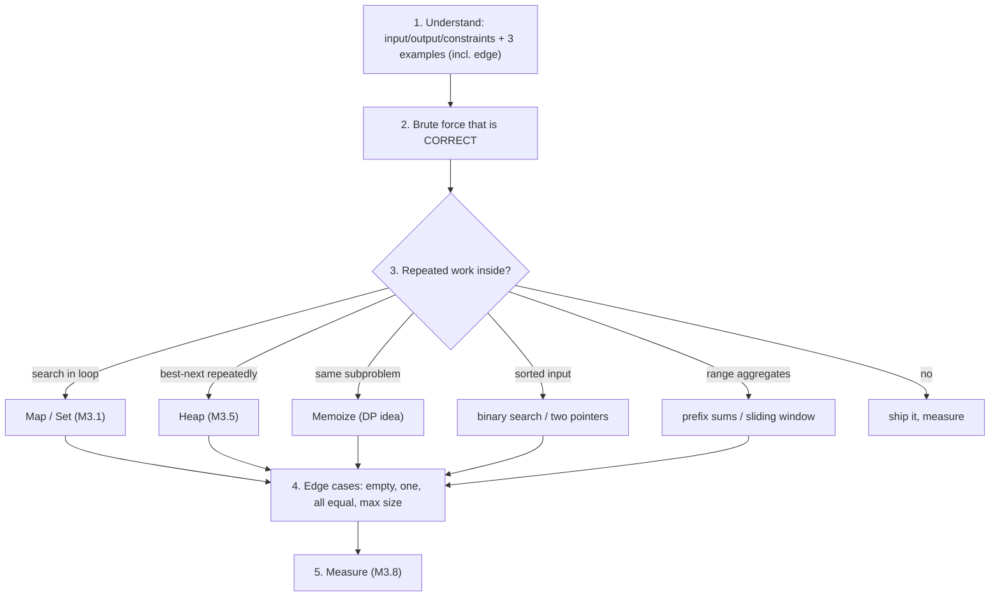
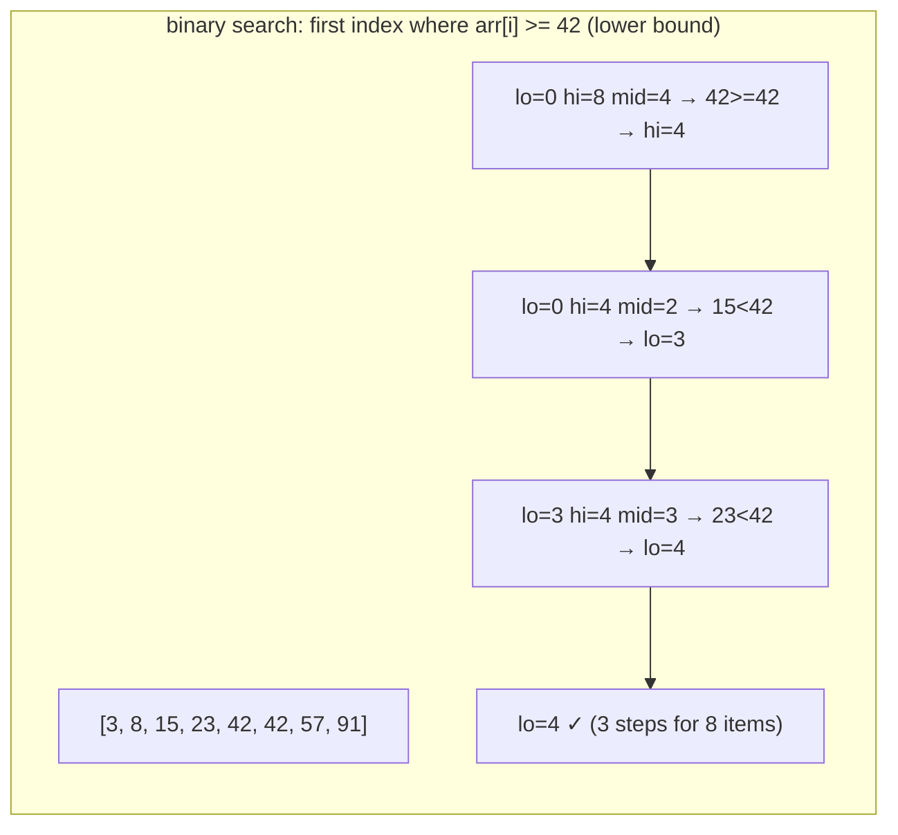
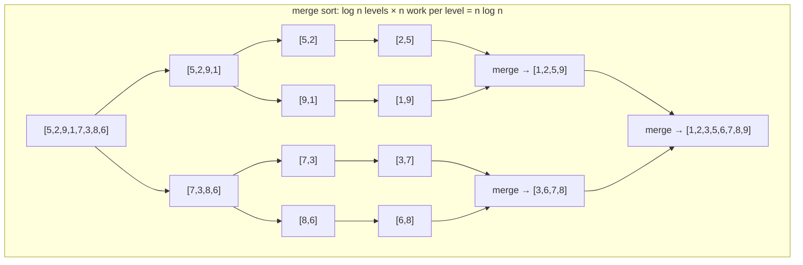

# Module 3.7 — التفكير الخوارزمي
## Algorithmic Thinking: decomposition, searching, sorting (what the built-in does), recursion vs iteration, divide & conquer, brute force → better

> **المستوى:** Level 3 | **الموقع:** [7 من 14]
> **السابق:** [M3.6 — Graphs](module-3.6-graphs.md) | **التالي:** [M3.8 — Big-O From Intuition](module-3.8-big-o.md)

---

## 1. المتطلبات
> **قبل أن تتعلم هذا، يجب أن تفهم:**
- [ ] الحلقات والدوال والتكرار — [L1-M1.3](../level-1-programming/module-1.3-loops.md), [L1-M1.4](../level-1-programming/module-1.4-functions-scope-closures.md)
- [ ] الهياكل الستة السابقة (M3.1–M3.6) — خاصة "الهيكل = مقايضة عمليات"
- [ ] المنهج التجريبي Observe→Evidence→Hypothesis→Experiment — [L1-M1.12](../level-1-programming/module-1.12-debugging.md)

## 2. أهداف التعلّم
- تطبيق **منهج حل المشكلات**: افهم (مدخلات/مخرجات/قيود/أمثلة) → حل ساذج صحيح (brute force) → حدّد العمل المكرر → اختر هيكلًا/تقنية تلغيه → تحقق بالأمثلة الحدّية → قس.
- التمييز بين **البحث الخطي** و**البحث الثنائي** (binary search) وشرطه (مرتّب)، وكتابة بحث ثنائي صحيح (الخطأ الكلاسيكي في الحدود) واستخدامه على "دالة أحادية" لا على مصفوفة فقط (أول إصدار معطوب = `git bisect`).
- معرفة **ماذا يفعل `sort()` المدمج** (TimSort، مستقر، O(n log n))، كيف تكتب مقارِنًا صحيحًا، وفخ الفرز الافتراضي للأرقام كنصوص؛ ومتى لا تفرز أصلًا (top-K بكومة، عدّ بـ Map).
- المقارنة بين **التكرار (recursion) والحلقة**: متى كلٌّ طبيعي، تحويل أحدهما للآخر، و**memoization** كجسر للبرمجة الديناميكية (كمفهوم).
- فهم **فرّق تسُد** (divide & conquer) عبر merge sort، و**الطمع** (greedy) ومتى يفشل، و**نافذة منزلقة/مؤشرين** كتقنيات يومية.

---

## 3. شرح للمبتدئ

### الخوارزمية = خطة؛ التفكير الخوارزمي = كيف تصل إليها
الخوارزمية وصفة خطوات تحوّل مدخلًا إلى مخرج. "التفكير الخوارزمي" ليس حفظ 50 خوارزمية بل **عادة ذهنية**:
1. **افهم**: ما المدخل بالضبط (نوعه، حجمه، مرتّب؟ مكرّرات؟ فارغ؟)، ما المخرج، ما القيود (زمن، ذاكرة، تدفق لا يُحمَّل كله؟)، اكتب 3 أمثلة بينها حالة حدّية.
2. **حل ساذج صحيح أولًا** (brute force): حلقات متداخلة، جرّب كل شيء. الصحة قبل السرعة؛ كثيرًا ما يكفي (n = 100).
3. **أين العمل المكرر؟** نفس البحث يتكرر داخل حلقة؟ نفس الحساب الفرعي يُعاد؟ تفرز ثم تفرز؟ هذا هو السؤال الذي تولد منه كل التحسينات.
4. **ألغِ التكرار بهيكل أو تقنية**: بحث متكرر → `Map`/`Set` (M3.1)؛ "الأهم التالي" → كومة (M3.5)؛ حساب فرعي متكرر → memo؛ مرتّب → بحث ثنائي/مؤشرين؛ مجاميع نطاقات → prefix sums؛ ترتيب اعتماديات → toposort (M3.6).
5. **تحقق** بالأمثلة الحدّية (فارغ، عنصر واحد، كله متساوٍ، أكبر حجم)، ثم **قس** (M3.8) — الحدس يخطئ.

### البحث: خطي vs ثنائي
- **خطي**: افحص كل عنصر، O(n). صحيح على أي شيء، وممتاز حتى آلاف العناصر (الكاش!).
- **ثنائي**: على **مرتّب** فقط؛ قارن بالوسط، استبعد نصفًا، كرر: log₂n خطوة (مليار → 30). الفخ: الحدود (`lo <= hi`؟ `mid + 1`؟ overflow في لغات أخرى). النمط الأقوى: **"أول موضع تصبح فيه الدالة صحيحة"** (lower bound) — يعمل على أي شيء **أحادي** (monotonic): أول commit أدخل الخطأ (`git bisect`)، أدنى سعة خادم تحقق SLA، أول طابع زمني بعد T في سجل مرتّب، إدراج في مصفوفة مرتبة. وفي DB: B-Tree = بحث ثنائي عريض (M3.4).
- JS: لا يوجد `binarySearch` مدمج؛ `indexOf/includes/find` كلها خطية — حتى على مصفوفة مرتبة.

### الفرز: ما يفعله المدمج ومتى لا تفرز
`Array.prototype.sort` في V8 = **TimSort**: O(n log n) أسوأ حالة، **مستقر** (العناصر المتساوية تحتفظ بترتيبها — مهم للفرز متعدد المفاتيح: افرز بالاسم ثم بالقسم = مرتّب بالقسم ثم الاسم داخله)، يستغل الأجزاء المرتبة مسبقًا (O(n) على مرتّب تقريبًا). فخاخ:
- **بلا مقارِن = فرز نصي**: `[10, 9, 1].sort()` → `[1, 10, 9]`. دائمًا `(a, b) => a - b` للأرقام، `localeCompare` للنصوص (مع `Intl.Collator` للأداء والعربية).
- المقارِن يجب أن يكون **متسقًا** (إن a<b وb<c فـ a<c، و`cmp(a,b) === -cmp(b,a)`): `Math.random() - 0.5` للخلط **خطأ** (توزيع منحاز) — استخدم Fisher–Yates.
- `sort` يعدّل في المكان؛ `toSorted` ينسخ (L1-M1.7).
- `undefined` يُدفع للنهاية دائمًا؛ `NaN` يفسد المقارِن العددي.
- **متى لا تفرز**: تحتاج الأكبر K؟ كومة O(n log K). تحتاج التكرارات/العدّ؟ `Map` O(n). تحتاج الوسيط فقط؟ quickselect O(n) (نادرًا). تحتاج "هل مرتّب؟" مرور واحد. والفرز في DB (`ORDER BY` بفهرس) غالبًا أرخص من الفرز في Node.
- **Counting/bucket sort** O(n) عندما المفاتيح أعداد صغيرة (الدرجات 0–100، البايتات) — فرز بلا مقارنات.

### التكرار vs الحلقة
التكرار طبيعي عندما **المشكلة معرّفة تكراريًا** (أشجار، JSON، تعبيرات، فرّق تسُد، permutations). الحلقة طبيعية للتسلسلات. كل تكرار يتحول لحلقة بمكدس صريح (M3.4) — ضروري عند العمق غير الموثوق. التكرار الساذج قد يكون **أسيًا** عندما يعيد نفس الحسابات (fibonacci، مسارات في شبكة): الحل **memoization** (`Map` من الوسائط إلى النتيجة) → O(عدد الحالات المميزة). هذا جوهر **البرمجة الديناميكية**: مسألة تتكوّن من مسائل فرعية **متداخلة** → احسب كلًّا مرة. تعرف الاسم والفكرة؛ المواجهات العملية: تشابه نصوص (diff، Levenshtein للبحث التقريبي)، أرخص مسار، تقسيم أمثل — نادرة في CRUD، شائعة في أدوات (Git diff، spell check).

### تقنيات تراها كل أسبوع
- **فرّق تسُد**: قسّم، حُلّ كلًّا، ادمج. **Merge sort** مثاله النقي (ويشرح لماذا الفرز O(n log n): log n مستوى × n عمل للدمج). ونفس "الدمج" هو دمج K تدفقات (M3.5) وexternal sort في DB.
- **مؤشران** (two pointers) على مرتّب: تقاطع قائمتين مرتبتين O(n+m) بدل O(n·m)، إزالة التكرارات، "زوج مجموعه X" — وهو حرفيًا **merge join** في DB (M3.13).
- **نافذة منزلقة**: إحصاء على آخر N/آخر T ثانية بتحديث تدريجي (أضف الداخل، اطرح الخارج) O(1) لكل خطوة بدل إعادة الحساب O(N) — rate limiting (M3.2)، متوسط متحرك للمقاييس.
- **Prefix sums**: مجموع أي نطاق O(1) بعد تحضير O(n) — تقارير "الإيرادات بين يومين".
- **الطمع** (greedy): اختر الأفضل محليًا الآن. يعمل أحيانًا (جدولة فترات بأبكر انتهاء، Dijkstra، Huffman، الفكّة بعملات قياسية) ويفشل أحيانًا (الفكّة بعملات غريبة، حقائب الظهر). القاعدة: الطمع يحتاج **إثباتًا أو مثالًا مضادًا**؛ لا تفترض.

---

## 4. النموذج الذهني

```
افهم (مدخل/مخرج/قيود/3 أمثلة) → ساذج صحيح → أين العمل المكرر؟ → هيكل/تقنية يلغيه → حالات حدّية → قس
بحث: خطي (أي شيء، صغير) | ثنائي (مرتّب/أحادي: lower bound، bisect) — JS لا يملكه مدمجًا
فرز: TimSort O(n log n) مستقر؛ مقارِن دائمًا؛ لا تفرز لو كفت كومة/Map/مرور واحد
تكرار ↔ حلقة+مكدس؛ تكرار متداخل → memo (DP كفكرة)
أدوات: divide&conquer (merge) | two pointers (merge join) | sliding window | prefix sums | greedy (أثبته)
```

## 5. الرسم التوضيحي







## 6. مثال بسيط

```typescript
// src/search-sort.ts — بحث ثنائي صحيح (lower bound) + فخاخ sort + مؤشران + نافذة منزلقة
/** أول فهرس i بحيث pred(i) صحيح، بافتراض أن pred أحادية (false...false true...true). يعيد n إن لم يوجد. */
export function lowerBound(n: number, pred: (i: number) => boolean): number {
  let lo = 0, hi = n;                                   // نصف مفتوح [lo, hi): الإجابة في [lo, hi]
  while (lo < hi) { const mid = lo + ((hi - lo) >> 1); if (pred(mid)) hi = mid; else lo = mid + 1; }
  return lo;
}
const sorted = [3, 8, 15, 23, 42, 42, 57, 91];
console.log(lowerBound(sorted.length, i => sorted[i]! >= 42));          // 4 ← أول 42 (وموضع الإدراج لـ 42)
console.log(lowerBound(sorted.length, i => sorted[i]! > 42));           // 6 ← upper bound؛ عدد الـ42 = 6-4
// git bisect كفكرة: الإصدارات 0..999، الخطأ ظهر من الإصدار 613 — نجد أول إصدار معطوب بـ 10 فحوصات
const isBroken = (v: number) => v >= 613; let checks = 0;
console.log(lowerBound(1000, v => (checks++, isBroken(v))), "found with", checks, "checks");   // 613 found with 10 checks

// sort: الفخاخ الثلاثة
console.log([10, 9, 1].sort(), [10, 9, 1].toSorted((a, b) => a - b));                   // [1,10,9] [1,9,10]
const people = [{ n: "Ali", d: "B" }, { n: "Sara", d: "A" }, { n: "Omar", d: "B" }, { n: "Lina", d: "A" }];
console.log(people.toSorted((a, b) => a.n.localeCompare(b.n)).toSorted((a, b) => a.d.localeCompare(b.d)).map(p => p.d + ":" + p.n));
// ["A:Lina","A:Sara","B:Ali","B:Omar"] ← الاستقرار: الفرز الثاني يحفظ ترتيب الأول داخل كل قسم
function shuffle<T>(a: T[]): T[] { for (let i = a.length - 1; i > 0; i--) { const j = Math.floor(Math.random() * (i + 1)); [a[i], a[j]] = [a[j]!, a[i]!]; } return a; }   // Fisher–Yates، لا sort(random)
console.log(shuffle([1, 2, 3, 4, 5]).length);

// مؤشران: تقاطع قائمتين مرتبتين O(n+m) (هذا هو merge join في DB)
function intersectSorted(a: number[], b: number[]): number[] { const out: number[] = []; let i = 0, j = 0; while (i < a.length && j < b.length) { if (a[i]! < b[j]!) i++; else if (a[i]! > b[j]!) j++; else { out.push(a[i]!); i++; j++; } } return out; }
console.log(intersectSorted([1, 3, 5, 7, 9], [3, 4, 5, 9, 10]));                          // [3,5,9]

// نافذة منزلقة: متوسط آخر 3 قراءات بتحديث O(1)
function movingAvg(xs: number[], k: number): number[] { const out: number[] = []; let sum = 0; for (let i = 0; i < xs.length; i++) { sum += xs[i]!; if (i >= k) sum -= xs[i - k]!; if (i >= k - 1) out.push(sum / k); } return out; }
console.log(movingAvg([10, 20, 30, 40, 50], 3));                                           // [20,30,40]
```

## 7. مثال كود

```typescript
// src/techniques.ts — merge sort (فرّق تسُد)، memoization، prefix sums، والطمع عندما يفشل
export function mergeSort<T>(a: T[], less: (x: T, y: T) => boolean): T[] {
  if (a.length <= 1) return a;
  const mid = a.length >> 1, l = mergeSort(a.slice(0, mid), less), r = mergeSort(a.slice(mid), less);
  const out: T[] = []; let i = 0, j = 0;                                  // الدمج = مؤشران على مرتّبين
  while (i < l.length && j < r.length) out.push(less(r[j]!, l[i]!) ? r[j++]! : l[i++]!);   // "!" في less يحفظ الاستقرار
  return out.concat(l.slice(i), r.slice(j));
}
console.log(mergeSort([5, 2, 9, 1, 7, 3, 8, 6], (x, y) => x < y));

// Memoization: من أسّي إلى خطي — "عدد الطرق لصعود n درجة بخطوة 1 أو 2" (نفس بنية fibonacci / مسارات)
let calls = 0;
const waysNaive = (n: number): number => (calls++, n <= 1 ? 1 : waysNaive(n - 1) + waysNaive(n - 2));
waysNaive(25); console.log("naive calls:", calls);                        // 242785
const memo = new Map<number, number>(); calls = 0;
const ways = (n: number): number => { if (n <= 1) return 1; const m = memo.get(n); if (m !== undefined) return m; calls++; const v = ways(n - 1) + ways(n - 2); memo.set(n, v); return v; };
ways(25); console.log("memo calls:", calls);                              // 24
// حلقة (bottom-up): بلا تكرار ولا Map — O(1) ذاكرة
const waysLoop = (n: number) => { let a = 1, b = 1; for (let i = 2; i <= n; i++) [a, b] = [b, a + b]; return b; };
console.log(waysLoop(25) === ways(25));

// Prefix sums: إيرادات بين يومين بأي عدد من الاستعلامات O(1) بعد O(n)
const daily = [120, 80, 200, 50, 90, 300, 10];
const prefix = [0]; for (const d of daily) prefix.push(prefix[prefix.length - 1]! + d);
const revenue = (from: number, to: number) => prefix[to + 1]! - prefix[from]!;     // شامل الطرفين
console.log(revenue(2, 4), revenue(0, 6));                                // 340 850

// الطمع: الفكّة — يعمل مع [25,10,5,1]، يفشل مع [25,10,1] لـ 30 (الطمع 25+1×5 = 6 قطع؛ الأمثل 10×3 = 3)
function greedyChange(coins: number[], amount: number) { const used: number[] = []; for (const c of coins.toSorted((a, b) => b - a)) while (amount >= c) { amount -= c; used.push(c); } return used; }
function optimalChange(coins: number[], amount: number): number { const best = new Array<number>(amount + 1).fill(Infinity); best[0] = 0; for (let a = 1; a <= amount; a++) for (const c of coins) if (c <= a) best[a] = Math.min(best[a]!, best[a - c]! + 1); return best[amount]!; }   // DP بسيطة
console.log(greedyChange([25, 10, 1], 30).length, optimalChange([25, 10, 1], 30));   // 6 3 ← الطمع يحتاج إثباتًا
```

## 8. مثال من العالم الحقيقي
- **`git bisect`**: بحث ثنائي على التاريخ (أحادية: قبل الخطأ سليم، بعده معطوب) — ألف commit في 10 فحوصات.
- **V8 `Array.prototype.sort`** = TimSort (منذ 2018)؛ قبلها كان quicksort غير مستقر لـ n > 10 — كود اعتمد على الاستقرار انكسر بين إصدارات.
- **PostgreSQL**: `Sort` (quicksort/external merge sort عند تجاوز `work_mem`)، `Merge Join` (مؤشران)، `Hash Join` (Map)، `Index Scan` (بحث ثنائي عريض) — `EXPLAIN` يريك هذه الوحدة تعمل (M3.13).
- **Diff** (Git، React reconciliation، `jest` snapshots): LCS/Myers — برمجة ديناميكية على نصين.
- **Rate limiters، متوسطات المقاييس، Kafka consumer lag**: نوافذ منزلقة.
- **Memoization في React (`useMemo`)، `lodash.memoize`، كاش الاستعلامات**: نفس الفكرة بتسمية مختلفة.

## 9. مثال من الإنتاج
**حادثة "تقرير التسوية يستغرق 40 دقيقة":** مطابقة 300k معاملة بنكية مع 300k سجل داخلي: لكل معاملة `internal.find(r => r.ref === t.ref && Math.abs(r.amount - t.amount) < 0.01)` → 9×10¹⁰ مقارنة. التفكير الخوارزمي: (1) أين العمل المكرر؟ البحث نفسه 300k مرة → `Map<ref, record[]>` O(1) → 2 ثانية. (2) لكن 8% بلا `ref` تحتاج مطابقة بالمبلغ والتاريخ ±2 يوم: افرز الطرفين بالتاريخ ثم **مؤشران/نافذة منزلقة** O(n log n) → ثوانٍ. (3) ما تبقى بلا تطابق → تقرير يدوي. (4) ثم لاحظوا أن DB تفعل الأول بـ `JOIN` بفهرس على `ref` (M3.13) فنقلوا 90% من المنطق إلى SQL. **الدرس:** نفس الأسئلة دائمًا: ما المكرر؟ أي هيكل يلغيه؟ هل الطرف الآخر (DB) يفعله أفضل؟

## 10. مفاهيم خاطئة شائعة

| ❌ | ✅ |
|---|---|
| "التفكير الخوارزمي = حفظ خوارزميات LeetCode" | = عادة: افهم، ساذج، أين المكرر، ألغه، تحقق، قس. |
| "`sort()` يرتّب الأرقام" | بلا مقارِن يرتّب نصيًا. |
| "البحث الثنائي للمصفوفات فقط" | لأي شيء أحادي: إصدارات، سعات، أزمنة. |
| "التكرار بطيء، الحلقة سريعة" | التكرار **المتداخل** بطيء (أسّي)؛ memo/حلقة يصلحانه. التكرار البسيط O(n) مثل الحلقة. |
| "الطمع الحل البديهي الصحيح" | يحتاج إثباتًا أو مثالًا مضادًا. |

## 11. أخطاء شائعة
1. تحسين قبل قياس أو قبل حل ساذج صحيح.
2. بحث ثنائي بحدود خاطئة (حلقة لا نهائية/يفوّت العنصر الأول) — استخدم نموذج lower bound الواحد دائمًا.
3. `sort()` بلا مقارِن؛ مقارِن غير متسق؛ `sort` في المكان على بيانات مشتركة.
4. إعادة حساب نافذة كاملة في كل خطوة.
5. تكرار بلا شرط توقف واضح أو بعمق غير محدود.
6. فرز 10M سجل في Node بينما `ORDER BY` بفهرس في DB أرخص.

## 12. تمرين تصحيح

```typescript
// بحث ثنائي "يعمل غالبًا": أحيانًا حلقة لا نهائية، وأحيانًا لا يجد العنصر الأول
function bsearch(a: number[], x: number): number {
  let lo = 0, hi = a.length - 1;
  while (lo < hi) {
    const mid = Math.floor((lo + hi) / 2);
    if (a[mid] < x) lo = mid; else hi = mid;
  }
  return a[lo] === x ? lo : -1;
}
```

<details><summary>💡 الحل</summary>

1. **حلقة لا نهائية**: عندما `hi = lo + 1` و`a[mid] < x` → `mid = lo` → `lo = mid` لا يتغير. يجب `lo = mid + 1` (استبعد mid لأنه أصغر).
2. **لا يجد الأول/الأخير**: مع `hi = a.length - 1` ومصفوفة فارغة `hi = -1` → `a[0] === x` على مصفوفة فارغة false — صدفة تعمل، لكن المزج بين نصف مفتوح ومغلق يولّد هذه الأخطاء. اعتمد نموذجًا واحدًا: `[lo, hi)` مع `hi = a.length`، `pred(mid) ? hi = mid : lo = mid + 1`.
3. العنصر غير موجود وأكبر من الكل: `lo` يصل `a.length - 1` ونرجع -1 صدفة؛ في النموذج النصف مفتوح `lo === a.length` صريح.
4. اختبار خاصية: لكل مصفوفة مرتبة عشوائية وكل x، النتيجة تساوي `a.indexOf(x)`. (ستكتب اختبارات خاصية في L4-M4.11.)
</details>

## 13. تمرين معماري
Project 4 يحتاج "اقتراحات منتجات أثناء الكتابة" (prefix search على 200k اسم، ≤ 50ms): حلول: `filter(startsWith)` خطي، مصفوفة مرتبة + lower bound (نطاق بالبادئة)، trie، أو DB (`LIKE 'abc%'` بفهرس B-Tree — يعمل للبادئة فقط، لماذا؟ M3.13). قارن الذاكرة، زمن التحديث عند إضافة منتج، التعامل مع الأحرف العربية/حالة الأحرف، وأين يعيش (Node vs DB vs خدمة بحث). ACTRR.

## 14. الصلة بعصر AI
AI يعرف كل خوارزمية كلاسيكية — ما يحتاجه منك هو **الخطوة 1 و3**: تعريف المشكلة بقيودها الحقيقية (حجم، تدفق، ذاكرة) وتحديد أين المكرر. اطلب "الحل الساذج أولًا ثم المحسّن مع شرح العمل المكرر الذي أُلغي"، واطلب حالات حدّية صريحة، وتحقق بالقياس (M3.8). ولا تقبل `sort(() => Math.random() - 0.5)` أو بحثًا ثنائيًا بلا اختبار خاصية.

## 15. ما يجب إتقانه (Must Master) 🔴
- 🔴 المنهج الخماسي؛ البحث الثنائي بنموذج lower bound وعلى أي شيء أحادي؛ `sort` يحتاج مقارِنًا، مستقر، O(n log n)، ومتى لا تفرز؛ تكرار ↔ حلقة، memoization؛ مؤشران ونافذة منزلقة.

## 16. ما يجب فهمه (Should Understand) 🟠
- 🟠 merge sort وسبب n log n؛ prefix sums؛ الطمع وحدوده؛ فكرة DP (مسائل فرعية متداخلة)؛ counting sort؛ Fisher–Yates.

## 17. ما يمكن تأجيله (Can Defer) ⚪
- ⚪ quickselect، DP متقدمة (knapsack، LCS تفصيليًا)، backtracking، التحليل المطفأ (amortized) رسميًا، خوارزميات النصوص (KMP، suffix arrays).

## 18. الخلاصة
1. التفكير الخوارزمي عادة: افهم → ساذج صحيح → أين المكرر؟ → ألغه بهيكل/تقنية → حالات حدّية → قس.
2. البحث الثنائي = lower bound على أي دالة أحادية (مصفوفات، إصدارات، سعات)؛ JS لا يملكه مدمجًا.
3. `sort` = TimSort مستقر O(n log n)؛ مقارِن دائمًا؛ كومة/Map/مرور واحد غالبًا أرخص من الفرز.
4. التكرار المتداخل أسّي → memo أو حلقة؛ هذه فكرة البرمجة الديناميكية.
5. فرّق تسُد، مؤشران، نافذة منزلقة، prefix sums أدوات أسبوعية؛ الطمع يحتاج إثباتًا.

## 19. مراجع رسمية
- MDN — `Array.prototype.sort()` (comparator contract, stability): https://developer.mozilla.org/en-US/docs/Web/JavaScript/Reference/Global_Objects/Array/sort
- V8 blog — Getting things sorted in V8 (TimSort): https://v8.dev/blog/array-sort
- Git — `git bisect` (binary search over history): https://git-scm.com/docs/git-bisect
- Open Data Structures — Sorting Algorithms (merge/quick/heap, counting/radix): https://opendatastructures.org/ods-java/11_Sorting_Algorithms.html
- MDN — `Intl.Collator` (locale-aware comparison incl. Arabic): https://developer.mozilla.org/en-US/docs/Web/JavaScript/Reference/Global_Objects/Intl/Collator

## المصطلحات
| العربية | English |
|---|---|
| خوارزمية | Algorithm |
| القوة الغاشمة / الحل الساذج | Brute force / Naive solution |
| بحث خطي / ثنائي | Linear / Binary search |
| الحد الأدنى (أول موضع صحيح) | Lower bound |
| دالة أحادية | Monotonic predicate |
| فرز مستقر | Stable sort |
| مقارِن | Comparator |
| تكرار (استدعاء ذاتي) | Recursion |
| تذكير (حفظ النتائج) | Memoization |
| برمجة ديناميكية | Dynamic programming |
| فرّق تسُد | Divide and conquer |
| مؤشران | Two pointers |
| نافذة منزلقة | Sliding window |
| مجاميع البادئة | Prefix sums |
| خوارزمية طمّاعة | Greedy algorithm |
| مثال مضاد | Counterexample |

> **التالي:** [Module 3.8 — Big-O From Intuition](module-3.8-big-o.md)
