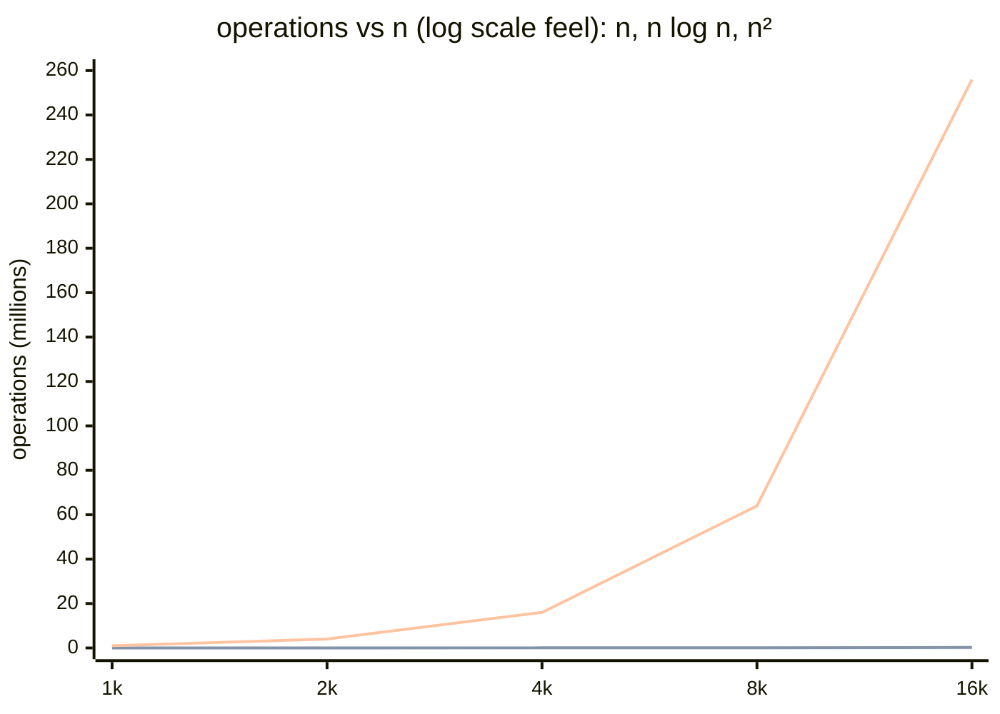
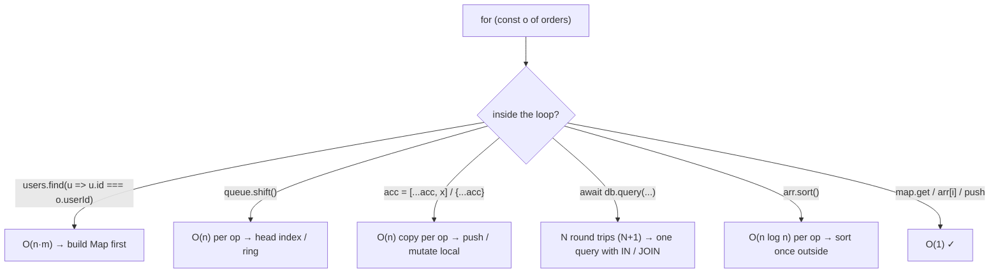
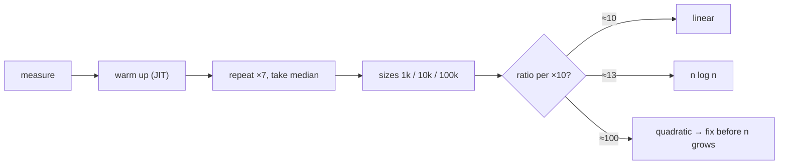

# Module 3.8 — Big-O من الحدس
## Big-O From Intuition: count the operations, scale n by 10, know the 6 shapes, spot the hidden n², and measure

> **المستوى:** Level 3 | **الموقع:** [8 من 14]
> **السابق:** [M3.7 — Algorithmic Thinking](module-3.7-algorithmic-thinking.md) | **التالي:** [M3.9 — Algorithms That Matter](module-3.9-algorithms-that-matter.md)

---

## 1. المتطلبات
> **قبل أن تتعلم هذا، يجب أن تفهم:**
- [ ] تكاليف العمليات على Array/Map/Set/Stack/Queue/Heap/Tree/Graph — M3.1–M3.6
- [ ] جدول الكمون (RAM ns، SSD μs، شبكة ms) وخطوط الكاش — [L2-M2.2](../level-2-computer-systems/module-2.2-cpu-cache-ram.md)
- [ ] حلقة الأحداث وأن العمل المتزامن الطويل يحجبها — [L2-M2.7](../level-2-computer-systems/module-2.7-concurrency-event-loop.md)

## 2. أهداف التعلّم
- شرح **Big-O** كـ "كيف ينمو العمل عندما ينمو المدخل" (ليس زمنًا بالثواني)، وقراءة كود وتقدير تعقيده بالحدس بعدّ الحلقات والاستدعاءات **المخفية**.
- حفظ **الأشكال الستة** بأرقام: لـ n = 1k / 1M: O(1)، O(log n)، O(n)، O(n log n)، O(n²)، O(2ⁿ) — واستخدام اختبار "ضاعف n ×10: كم يزيد الزمن؟".
- اكتشاف **O(n²) المخفي**: `includes/find/indexOf` داخل حلقة، `shift/unshift/splice(0)` في حلقة، تجميع نصوص/مصفوفات بـ `+=`/`[...acc, x]`/`concat` في `reduce`، استعلام DB داخل حلقة (N+1)، `sort` داخل حلقة.
- فهم **تعقيد الذاكرة** (space) و**الثوابت** (constants) ولماذا O(n) بكاش سيئ قد يخسر أمام O(n log n) متجاور، ولماذا "الأسوأ حالة" مهم للأمان (hash flooding، ReDoS).
- **القياس الصحيح**: `performance.now()`/`console.time`، التسخين (JIT)، التكرار، الوسيط لا المتوسط، مقارنة أحجام متعددة لرسم المنحنى.

---

## 3. شرح للمبتدئ

### Big-O ليس سرعة؛ إنه شكل النمو
سؤال Big-O: **إذا ضاعفت المدخل، كيف يتغير العمل؟** لا يهتم بالثواني (تعتمد على الجهاز) ولا بالثوابت (3n أو 300n كلاهما O(n)) — يهتم بالـ **شكل**: خط؟ منحنى؟ انفجار؟ ذلك لأن الشكل هو ما يقرر مصيرك عندما ينتقل النظام من 1k مستخدم إلى 1M: الثوابت تُشترى بخادم أكبر، الشكل لا.

### الأشكال الستة بالأرقام (احفظ هذا الجدول)

| الشكل | المعنى | n = 1,000 | n = 1,000,000 | ×10 المدخل → | أمثلة |
|---|---|---|---|---|---|
| **O(1)** | ثابت | 1 | 1 | نفس الزمن | `arr[i]`, `map.get`, `push/pop`, heap `peek` |
| **O(log n)** | يستبعد نصفًا كل خطوة | 10 | 20 | +خطوة واحدة | بحث ثنائي، B-Tree lookup، heap push/pop، BST متوازنة |
| **O(n)** | مرور واحد | 1k | 1M | ×10 | `for`, `find/includes`, `map/filter`, BFS/DFS (V+E), hash build |
| **O(n log n)** | n مرات log n | 10k | 20M | ×10 تقريبًا (×13) | `sort`, merge sort, heap على كل عنصر, بناء فهرس |
| **O(n²)** | حلقة داخل حلقة | 1M | 10¹² | ×100 | `find` داخل `for`, `shift` في حلقة, nested loops, فقاعي |
| **O(2ⁿ)** | كل التركيبات | 10³⁰⁰ | — | ×1000 لكل +10 | تكرار متداخل بلا memo، brute force على المجموعات الجزئية، ReDoS |

قاعدة ذهبية: **O(n²) عند مليون = 10¹² عملية ≈ 15 دقيقة على CPU حديث لعملية واحدة بسيطة** — وأي شيء فوق بضعة ملايين عملية داخل معالج طلب HTTP يحجب حلقة الأحداث لعشرات الميلي ثانية (L2-M2.7). بينما O(n log n) عند مليون = 20M ≈ 20–50ms. الفرق بين "يعمل" و"الخادم ميت" يبدأ غالبًا بين n = 10k و100k.

### كيف تقدّر بالحدس: عدّ الحلقات، **خاصة المخفية**
1. حلقة واحدة على n → n. حلقتان متداخلتان على n → n². حلقتان متتاليتان → n + n = O(n).
2. حلقة تقسّم المشكلة نصفين → log n. حلقة على n تفعل داخلها شيئًا log n → n log n.
3. **الاستدعاءات التي تخفي حلقة** (الفخ الحقيقي): `arr.includes/indexOf/find/filter/some` = n؛ `arr.shift/unshift/splice(0, k)` = n؛ `[...arr, x]`/`arr.concat`/`Object.assign({}, acc)`/`{...acc}` = n (نسخ)؛ `str += piece` في حلقة قد يكون n (V8 يستخدم ropes فيُخفّفه، لكن `JSON.stringify` كبير داخل حلقة لا)؛ `arr.sort` = n log n؛ `new Set(arr)` = n؛ `await db.query` = **رحلة شبكة** (ms = مليون ns؛ داخل حلقة = N+1، M3.11)؛ `JSON.parse(big)` = حجم النص؛ `querySelectorAll` = حجم DOM؛ regex بتراجع (backtracking) = قد يكون أسيًّا.
4. إذًا `for (x of a) if (b.includes(x))` = n·m. `reduce((acc, x) => [...acc, x], [])` = n². `for (u of users) await db.query(...)` = n رحلة.

### الذاكرة، الثوابت، والحالة الأسوأ
- **Space complexity**: ذاكرة إضافية مقابل المدخل. `new Set(arr)` O(n) ذاكرة مقابل O(n·m) زمن — المقايضة الكلاسيكية (M3.1). merge sort O(n) ذاكرة، heapsort O(1). Top-K بكومة O(K). الذاكرة تهم لأن OOM يقتل (L2-M2.4).
- **الثوابت**: Big-O يخفيها لكن الواقع لا. مصفوفة 1k عنصر: `includes` خطي (1k مقارنة متجاورة ≈ 1μs) قد يهزم `Set.has` بكاش سيئ؟ لا — لكن لمصفوفة 10 عناصر، `includes` أسرع من إنشاء Set. القائمة المرتبطة O(1) إدراج تخسر أمام المصفوفة O(n) حتى آلاف (M3.3). القاعدة: Big-O يقرر عند n كبير؛ الثوابت والكاش تقرر عند n صغير — **والقياس يقرر دائمًا**.
- **الحالة الأسوأ (worst case) أمنية**: `Map` O(1) **في المتوسط**؛ مهاجم يختار مفاتيح تتصادم → O(n) لكل عملية = hash flooding (V8 يستخدم بذرة عشوائية للتجزئة لهذا السبب). Regex `(a+)+$` على `"aaaa…!"` = أسّي = **ReDoS** (طلب واحد يحجب الخادم ثوانيَ). Quicksort O(n²) على مدخل خبيث. عند معالجة مدخلات غير موثوقة اسأل عن **الأسوأ**، لا المتوسط.
- **التحليل المطفأ** (amortized): `push` أحيانًا O(n) (إعادة تخصيص) لكن O(1) في المتوسط على سلسلة عمليات — وكذلك rehash في Map. اعرف المصطلح.

### القياس الصحيح (الحدس يخطئ)
1. `performance.now()` أو `console.time` حول الجزء المعني فقط.
2. **سخّن** (JIT يحسّن بعد تكرارات؛ أول تشغيل بطيء 10×).
3. كرر 5–10 مرات وخذ **الوسيط** (p50) — المتوسط يتأثر بـ GC وبنظام التشغيل.
4. **قس عند أحجام متعددة** (1k, 10k, 100k): النسبة بين النتائج تكشف الشكل أفضل من أي رقم مفرد. ×10 مدخل → ×10 زمن = خطي؛ ×100 = تربيعي.
5. على بيانات شبيهة بالواقع (التوزيع والترتيب يهمان: `sort` على مرتّب O(n)).
6. في الإنتاج: p99 لا المتوسط (L2-M2.13)؛ `--cpu-prof` لمعرفة **أين** (L2-M2.2). القياس الدقيق للـ micro: `node --allow-natives-syntax` و`tinybench`/`mitata` — تأجَّل.

---

## 4. النموذج الذهني

```
Big-O = شكل النمو (×10 n → ؟ زمن): 1 | log n (+1) | n (×10) | n log n (×13) | n² (×100) | 2ⁿ (انفجار)
n=1M: n² = 10¹² ≈ دقائق؛ n log n = 20M ≈ ms   ← الحد الفاصل يبدأ عند 10k–100k
عدّ الحلقات + المخفية: includes/find/shift/splice/[...acc]/concat/sort/await db داخل حلقة
Space: Set/Map O(n) ذاكرة تشتري O(1) زمن ; Worst case أمني: hash flooding، ReDoS
قس: سخّن، كرر، وسيط، أحجام متعددة، بيانات واقعية ; الثوابت تحكم n الصغير، الشكل يحكم n الكبير
```

## 5. الرسم التوضيحي







## 6. مثال بسيط

```typescript
// src/bigo-lab.ts — "ضاعف n ×10 وشاهد": القياس يكشف الشكل
function bench(label: string, n: number, fn: (n: number) => void, reps = 5): number {
  fn(Math.min(n, 1000));                                             // تسخين JIT
  const t: number[] = [];
  for (let r = 0; r < reps; r++) { const s = performance.now(); fn(n); t.push(performance.now() - s); }
  const median = t.toSorted((a, b) => a - b)[reps >> 1]!;
  console.log(label.padEnd(26), String(n).padStart(8), median.toFixed(2).padStart(10), "ms");
  return median;
}
const data = (n: number) => Array.from({ length: n }, (_, i) => ({ id: i, userId: (i * 7919) % n }));

const cases: [string, (n: number) => void][] = [
  ["find in loop  O(n·m)", n => { const users = data(n), orders = data(n); let c = 0; for (const o of orders) if (users.find(u => u.id === o.userId)) c++; }],
  ["Map lookup    O(n+m)", n => { const users = data(n), orders = data(n); const m = new Map(users.map(u => [u.id, u])); let c = 0; for (const o of orders) if (m.get(o.userId)) c++; }],
  ["spread reduce O(n²)", n => { data(n).reduce<number[]>((acc, x) => [...acc, x.id], []); }],
  ["push reduce   O(n)", n => { data(n).reduce<number[]>((acc, x) => { acc.push(x.id); return acc; }, []); }],
  ["shift queue   O(n²)", n => { const q = data(n); while (q.length) q.shift(); }],
  ["sort          O(n log n)", n => { data(n).map(x => x.userId).sort((a, b) => a - b); }],
];
for (const [label, fn] of cases) {
  const a = bench(label, 2_000, fn), b = bench(label, 20_000, fn);
  console.log("   ratio ×10 n →", (b / a).toFixed(1), "× time\n");
}
// توقّع (جهاز عادي): spread ≈ ×300، shift ≈ ×90، find-in-loop ≈ ×20–100 (تربيعي؛ عند n الصغير تختلط الثوابت وتوليد البيانات بالقياس)
// Map وpush ≈ ×5–10 ؛ sort ≈ ×9–13. جرّب 200_000 للتربيعيات: ستنتظر ثوانيَ — هذا ما يحدث لمعالج HTTP عندما تكبر الجداول
```

## 7. مثال كود

```typescript
// src/worst-case.ts — الحالة الأسوأ كمسألة أمنية: ReDoS، وحد زمني/حجمي للمدخلات غير الموثوقة
// 1) ReDoS: regex بتراجع أسّي. لا تشغّل بأكثر من 28 — كل حرف إضافي يضاعف الزمن
const evil = /^(\w+\s?)+$/;                                           // نمط "تحقق من اسم" شائع في كود حقيقي وفي كود AI
for (const n of [20, 24, 28]) {
  const input = "a".repeat(n) + "!";                                  // "!" يجبر التراجع عبر كل التقسيمات
  const s = performance.now(); evil.test(input);
  console.log(`n=${n}`, (performance.now() - s).toFixed(0), "ms");   // يتضاعف تقريبًا مع كل حرف: ~60ms → ~120ms → ~1.7s → دقائق عند 32، سنوات عند 50
}
// الحل: نمط بلا غموض (/^\w+(\s\w+)*$/ لا يزال خطرًا؟ لا — \s إلزامي يفصل التكرارات)، أو RE2 (مكتبة re2)، أو حد طول + مهلة في worker
const safe = /^\w+( \w+)*$/;
console.log(safe.test("a".repeat(100_000) + "!"));                    // فوري

// 2) hash-flooding كمفهوم: V8 يبذر التجزئة عشوائيًا، لكن كائنك الخاص لا. SimpleHashMap من M3.1 بمفاتيح متصادمة = O(n)
//    الدرس العام: أي O(1) "في المتوسط" على مدخلات المهاجم يحتاج (أ) عشوائية سرية، أو (ب) حدًا على n، أو (ج) هيكل O(log n) أسوأ حالة

// 3) الحماية العملية في Project 4: حدود على الحجم قبل أي خوارزمية — لأن الحالة الأسوأ تأتي من الخارج
export const limits = { bodyBytes: 1_000_000, jsonDepth: 32, arrayItems: 10_000, stringChars: 10_000, pageSize: 100, regexInputChars: 1_000 };
export function assertLimits(body: unknown) {
  const walk = (v: unknown, d: number) => {
    if (d > limits.jsonDepth) throw new RangeError("too deep");
    if (typeof v === "string" && v.length > limits.stringChars) throw new RangeError("string too long");
    if (Array.isArray(v)) { if (v.length > limits.arrayItems) throw new RangeError("array too long"); v.forEach(x => walk(x, d + 1)); }
    else if (v && typeof v === "object") Object.values(v).forEach(x => walk(x, d + 1));
  };
  walk(body, 0);
}
assertLimits({ items: [1, 2, 3], name: "ok" });
try { assertLimits({ items: new Array(20_000).fill(0) }); } catch (e) { console.log((e as Error).message); }   // array too long
```

## 8. مثال من العالم الحقيقي
- **GTA Online 2021**: تحميل 6 دقائق — `sscanf` + `strlen` داخل حلقة على JSON بـ 10MB (O(n²) مخفي في مكتبة قياسية) + فحص تكرار بـ `includes` على 63k عنصر. مطوّر خارجي أصلحه → 70% أسرع. أشهر مثال لـ "n² مخفي".
- **Node.js `http` header parsing** (CVE-2018-12116 وغيرها) وأدوات regex كثيرة: ReDoS في `validator`, `moment`, `semver` — كلها "حالة أسوأ" على مدخلات غير موثوقة.
- **PostgreSQL** يُقدّر التعقيد قبل التنفيذ: `EXPLAIN` يطبع `cost=` بالضبط لاختيار Hash Join (n+m) vs Nested Loop (n·m) — M3.13 ستقرأه.
- **Cloudflare 2019**: regex بتراجع في WAF حجب CPU عالميًا 27 دقيقة.
- **React `key` warnings**: reconciliation بلا مفاتيح يتحوّل لمقارنات O(n²) على القوائم.

## 9. مثال من الإنتاج
**حادثة "صفحة الفواتير تنتهي مهلتها للعملاء الكبار فقط":** `GET /invoices` يجلب 5k فاتورة ثم لكل فاتورة `lineItems.filter(li => li.invoiceId === inv.id)` على 200k بند = 10⁹ مقارنة ≈ 3–5 ثوانٍ **متزامنة** → حلقة الأحداث محجوبة → كل الطلبات الأخرى تنتظر (L2-M2.7) → p99 ينفجر للجميع عند زيارة عميل كبير. العملاء الصغار (50 فاتورة) لم يلاحظوا شيئًا — **التربيعي يختبئ عند n الصغير**. الإصلاح: `Map<invoiceId, LineItem[]>` ببناء واحد O(n) → 40ms؛ ثم نقل التجميع إلى SQL (`JOIN` + `GROUP BY` بفهرس على `invoice_id` — M3.11/M3.13) → 8ms + ترقيم صفحات (لا 5k في طلب واحد أصلًا). أُضيف اختبار أداء بـ n = 10× أكبر عميل. **الدرس:** اختبر بأحجام الإنتاج ×10، وراقب event loop lag — التربيعي لا يظهر في بيئة التطوير.

## 10. مفاهيم خاطئة شائعة

| ❌ | ✅ |
|---|---|
| "Big-O = الزمن بالثواني" | شكل النمو؛ الثوابت والجهاز خارجه. |
| "O(1) دائمًا أسرع من O(n)" | عند n صغير الثوابت تحكم؛ `includes` على 10 عناصر أسرع من Set. |
| "كودي حلقة واحدة إذن O(n)" | `includes/shift/[...acc]/await db` داخلها تجعله n² أو N+1. |
| "المتوسط يكفي" | المدخلات غير الموثوقة تستهدف الأسوأ (hash flooding، ReDoS). |
| "لن يصل n إلى ذلك" | n ينمو بصمت؛ التربيعي يعمل لسنة ثم يسقط الخادم في يوم. |

## 11. أخطاء شائعة
1. قياس بلا تسخين/تكرار/أحجام متعددة.
2. تحسين O(n) إلى O(log n) حيث n = 20 بينما N+1 إلى DB بجانبه.
3. regex على مدخل المستخدم بلا حد طول.
4. اختبار على 100 صف فقط.
5. تجاهل الذاكرة: تحميل مليون صف لتصفيتها في Node (stream/DB بدلًا).
6. حساب `arr.length` أو `Object.keys(o).length` داخل شرط حلقة ثقيلة (الثاني O(n) كل مرة).

## 12. تمرين تصحيح

```typescript
// إزالة التكرار من أحداث وفرزها زمنيًا. مقبولة لـ 10k حدث؛ 2M حدث = لا تنتهي أبدًا
function dedupeSorted(events: { id: string; ts: number }[]) {
  const out: typeof events = [];
  for (const e of events) {
    if (!out.some(o => o.id === e.id)) out.push(e);
    out.sort((a, b) => a.ts - b.ts);
  }
  return out;
}
```

<details><summary>💡 الحل</summary>

1. `out.some` داخل الحلقة → O(n²) (2M² = 4×10¹²).
2. `out.sort` **داخل** الحلقة → O(n · n log n) = أسوأ من تربيعي (n² log n).
3. الإصلاح: `const seen = new Set<string>(); const out = events.filter(e => !seen.has(e.id) && seen.add(e.id)); out.sort((a,b)=>a.ts-b.ts);` → O(n log n) (الفرز مرة واحدة خارج الحلقة). لو كانت الأحداث شبه مرتبة أصلًا TimSort قريب من O(n).
4. تحقق: لـ n = 20k و200k يجب أن تكون النسبة ≈ 11–13؛ وقاعدة عامة في المراجعة: **أي `sort`/`some`/`find`/`includes` داخل حلقة = علامة حمراء**.
</details>

## 13. تمرين معماري
Project 4 سيعرض "أفضل 10 منتجات مبيعًا هذا الشهر" من 50M سطر طلب. قارن: (أ) تحميل الكل إلى Node وفرز؛ (ب) `GROUP BY ... ORDER BY SUM DESC LIMIT 10` في PostgreSQL (ما تعقيده؟ ماذا يفعل top-N heapsort؟ أي فهرس يساعد؟)؛ (ج) جدول مجمّع يُحدَّث تدريجيًا؛ (د) كاش بـ TTL. لكل خيار: التعقيد، الذاكرة، حداثة البيانات، تكلفة الكتابة. ACTRR، مع تقدير رقمي لزمن كل خيار.

## 14. الصلة بعصر AI
AI يولّد `find` داخل حلقات وspread في `reduce` بكثافة لأنها "قابلة للقراءة". اطلب صراحةً: *"n قد يصل 1M؛ بلا O(n²)؛ اذكر تعقيد كل دالة"* — ثم **تحقق** بالقياس عند ×10، لأن AI قد يدّعي O(n) لكود O(n²). وعلى regex من AI على مدخلات المستخدم: افترض ReDoS حتى تثبت العكس (اختبر بـ `"a".repeat(40)+"!"`).

## 15. ما يجب إتقانه (Must Master) 🔴
- 🔴 Big-O = شكل النمو؛ جدول الأشكال الستة بأرقام 1k/1M؛ اختبار ×10؛ عدّ الحلقات المخفية (`includes/find/shift/spread/sort/await db` داخل حلقة)؛ القياس الصحيح بأحجام متعددة؛ الحالة الأسوأ على مدخلات غير موثوقة (ReDoS، حدود الحجم).

## 16. ما يجب فهمه (Should Understand) 🟠
- 🟠 تعقيد الذاكرة؛ الثوابت والكاش؛ amortized؛ hash flooding؛ لماذا `sort` n log n؛ event loop lag كأثر مباشر؛ `--cpu-prof`.

## 17. ما يمكن تأجيله (Can Defer) ⚪
- ⚪ الترميز الرسمي (Θ، Ω، إثباتات)؛ master theorem؛ micro-benchmarking دقيق (`mitata`، deopt)؛ تحليل تعقيد خوارزميات متقدمة.

## 18. الخلاصة
1. Big-O يصف كيف ينمو العمل مع n؛ الجدول الستّي بأرقام هو أداتك اليومية: n² عند مليون = كارثة، n log n = ملّي ثوانٍ.
2. التربيعي يختبئ في استدعاءات تبدو O(1): `includes`, `shift`, `[...acc]`, `sort`, `await db` داخل حلقة.
3. الثوابت والكاش يحكمان n الصغير؛ الشكل يحكم الكبير؛ القياس بأحجام ×10 يكشف الحقيقة.
4. على مدخلات غير موثوقة: الحالة الأسوأ هي ما يهم — حدود حجم/عمق/طول وregex آمنة.
5. اختبر بأحجام الإنتاج ×10 وراقب event loop lag؛ لا تنتظر العميل الكبير ليكتشف لك.

## 19. مراجع رسمية
- MDN — `performance.now()` / Performance API: https://developer.mozilla.org/en-US/docs/Web/API/Performance/now
- Node.js — `perf_hooks` (incl. `monitorEventLoopDelay`): https://nodejs.org/api/perf_hooks.html
- OWASP — Regular expression Denial of Service (ReDoS): https://owasp.org/www-community/attacks/Regular_expression_Denial_of_Service_-_ReDoS
- "How I cut GTA Online loading times by 70%" (t0st, 2021 — the canonical hidden-n² story): https://nee.lv/2021/02/28/How-I-cut-GTA-Online-loading-times-by-70/
- Big-O Cheat Sheet (structures & sorts table): https://www.bigocheatsheet.com/

## المصطلحات
| العربية | English |
|---|---|
| تعقيد زمني / مكاني | Time / Space complexity |
| ترميز O الكبير | Big-O notation |
| ثابت / لوغاريتمي / خطي | Constant / Logarithmic / Linear |
| شبه خطي (n log n) | Linearithmic |
| تربيعي / أسّي | Quadratic / Exponential |
| الحالة الأسوأ / المتوسطة | Worst case / Average case |
| تحليل مطفأ | Amortized analysis |
| الثوابت المخفية | Hidden constants |
| إغراق التجزئة | Hash flooding |
| حجب الخدمة بالتعبيرات النمطية | ReDoS |
| تسخين | Warm-up (JIT) |
| الوسيط | Median |
| قياس مرجعي | Benchmark |

> **التالي:** [Module 3.9 — Algorithms That Matter](module-3.9-algorithms-that-matter.md)
