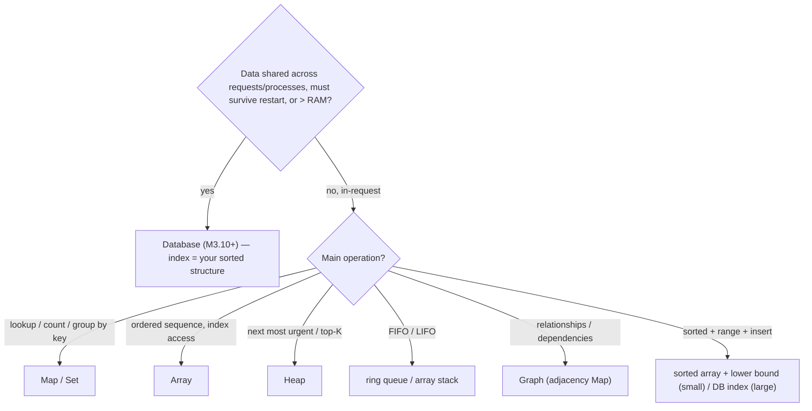
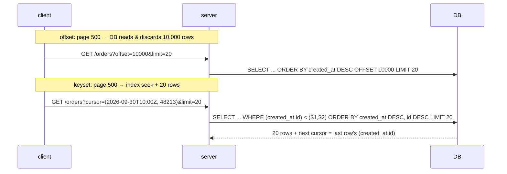
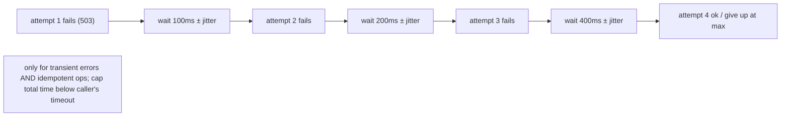

# Module 3.9 — الخوارزميات التي تهم فعلًا
## Algorithms That Matter: the structure-choice table, work-reduction patterns, the backend algorithm toolbox — and what NOT to master

> **المستوى:** Level 3 | **الموقع:** [9 من 14]
> **السابق:** [M3.8 — Big-O](module-3.8-big-o.md) | **التالي:** [M3.10 — Databases From Zero](module-3.10-databases-from-zero.md)

---

## 1. المتطلبات
- [ ] الهياكل الثمانية وتكاليفها — M3.1–M3.6
- [ ] المنهج الخوارزمي وتقنياته — [M3.7](module-3.7-algorithmic-thinking.md); Big-O والقياس — [M3.8](module-3.8-big-o.md)
- [ ] الشبكة تفشل وتتأخر؛ idempotency — [L0-M0.6](../level-0-absolute-foundations/module-06-network-client-server.md), [L2-M2.12](../level-2-computer-systems/module-2.12-http.md)

## 2. أهداف التعلّم
- استخدام **جدول اختيار الهيكل** من العمليات المطلوبة (lookup بالمفتاح؟ ترتيب؟ نطاق؟ الأهم التالي؟ FIFO؟ علاقات؟) وتبرير الاختيار بجملة.
- تطبيق **أنماط تقليل العمل** الخمسة: لا تفعله (early exit/limit)، افعله مرة (precompute/cache/memo)، افعله دفعة (batch)، افعله لاحقًا/أقل (debounce/throttle/queue)، افعله في المكان الصحيح (DB vs Node vs client).
- إتقان **صندوق أدوات الـ backend**: ترقيم الصفحات (offset vs keyset)، إعادة المحاولة بتراجع أسّي + jitter، debounce/throttle، التجميع (batching/DataLoader)، إزالة التكرار بمفتاح idempotency، التجزئة للتوزيع (consistent hashing كمفهوم)، Bloom filter كمفهوم، المعرّفات (sequential vs UUID vs ULID).
- معرفة **ما لا تتقنه** الآن (وليس أبدًا): تنفيذ red-black/B-Tree، DP متقدمة، تدفقات الشبكات، خوارزميات النصوص المتقدمة، التشفير بنفسك — واستخدام المكتبات/DB بوعي بدلها.

---

## 3. شرح للمبتدئ

### جدول اختيار الهيكل (العمليات أولًا)
السؤال ليس "ما أفضل هيكل؟" بل **"ما العمليات التي سأفعلها كثيرًا؟"** (M3.1 الخيط الأساسي):

| تحتاج غالبًا… | الهيكل | التكلفة | ليس |
|---|---|---|---|
| وصول بالفهرس، مرور مرتّب، نهاية فقط | `Array` | O(1) index/push/pop؛ O(n) وسط | إدراج في المقدمة/الوسط كثيرًا |
| بحث بالمفتاح، عدّ، تجميع | `Map` (أو `Record` لمفاتيح ثابتة) | O(1) متوسط؛ بلا ترتيب بالقيمة | نطاقات، أصغر/أكبر |
| عضوية، dedup، فروق | `Set` | O(1) | عدّ، ترتيب |
| LIFO (undo، parser، DFS) | `Array` كمكدس | O(1) | — |
| FIFO (مهام، BFS، buffers) | head-index / ring buffer | O(1) | `shift()` |
| "الأهم/الأقرب/الأبكر التالي"، top-K | Heap | O(log n) | بحث عن عنصر |
| مرتّب + نطاقات + إدراج | BST متوازنة (مكتبة) أو **DB index** | O(log n) | في JS نادر؛ اذهب للـ DB |
| O(1) إدراج/حذف عند عقدة تمسكها | Doubly linked list (+Map) | O(1) | وصول بالفهرس |
| علاقات متشابكة، اعتماديات، مسارات | Graph (adjacency Map) | O(V+E) للاجتياز | — |
| تسلسل هرمي | Tree (كائنات متداخلة / `parent_id`) | O(n) اجتياز | عمق غير محدود بلا حدّ |
| بيانات تتجاوز الذاكرة / مشتركة بين عمليات / يجب أن تبقى | **قاعدة بيانات** (M3.10+) | رحلة شبكة ms | كل ما سبق هو **داخل** الطلب فقط |

قاعدة: ابدأ بـ Array/Map/Set (تحل 90%)، أضف Heap/Graph عند الحاجة، واذهب إلى DB حين تكون البيانات مشتركة أو دائمة أو كبيرة.

### أنماط تقليل العمل الخمسة
أسرع عملية هي التي لا تحدث. بالترتيب:
1. **لا تفعله**: `LIMIT`/ترقيم صفحات، `early return`، `some` بدل `filter().length > 0`، تحقق رخيص قبل غالٍ (طول قبل regex، كاش قبل DB)، لا تجلب أعمدة لا تحتاجها (`SELECT *`).
2. **افعله مرة**: precompute (جدول مجمّع، `prefix sums`، فهرس)، memoize/cache (LRU M3.3، HTTP cache L2-M2.12)، ارفع الثابت خارج الحلقة (`new RegExp`، `new Intl.Collator`، `Map` من المصفوفة).
3. **افعله دفعة**: استعلام واحد بـ `IN (...)`/`JOIN` بدل N (N+1، M3.11)؛ `INSERT` متعدد الصفوف؛ **DataLoader**: اجمع كل `load(id)` في نفس tick ثم استعلام واحد (L2-M2.7 microtask)؛ كتابة سجلات بدفعات؛ `Promise.all` بحد تزامن.
4. **افعله لاحقًا أو أقل**: **debounce** (نفّذ بعد سكون: بحث أثناء الكتابة)، **throttle** (مرة كل T: مقاييس، scroll)، طابور للعمل غير العاجل (إيميل، صور — L5)، sampling للسجلات.
5. **افعله في المكان الصحيح**: التصفية/الفرز/التجميع في **DB** (فهرس، لا نقل بيانات)، التحقق من الشكل في **الحافة**، العرض في **العميل**، الحسابات الثقيلة في **worker** (L2-M2.6). الخطأ الشائع: جلب 100k صف لتصفيتها في Node.

### صندوق أدوات الـ backend (ستستخدمها في Project 4–6)
- **ترقيم الصفحات**: `OFFSET n` يقرأ ويرمي n صفًا (الصفحة 1000 = O(n) وتتزحزح عند الإدراج). **Keyset/cursor**: `WHERE (created_at, id) < ($1, $2) ORDER BY created_at DESC, id DESC LIMIT 20` بفهرس = O(log n + 20) مستقر. استخدم cursor للتدفقات اللانهائية وAPIs؛ offset لواجهات إدارة صغيرة.
- **إعادة المحاولة**: فقط للأخطاء العابرة (timeout، 503، `ECONNRESET`) و**العمليات idempotent**؛ **تراجع أسّي** (100ms, 200, 400…) + **jitter** عشوائي (وإلا "عاصفة إعادة المحاولة" المتزامنة — thundering herd) + حد أقصى للمحاولات والزمن الكلي (مهلة تنازلية L2-M2.13). التفاصيل في L7-M7.2.
- **Idempotency key** + `Set`/جدول مفاتيح مُعالجة = dedup للطلبات المكررة (L2-M2.12).
- **Debounce/Throttle**: مؤقت يُعاد ضبطه / طابع زمني آخر تنفيذ — 10 أسطر، تُكتب أسبوعيًا.
- **التجزئة للتوزيع**: `hash(key) % N` لتوزيع المفاتيح على N خادم/قسم؛ مشكلة: تغيير N يعيد توزيع كل شيء → **consistent hashing** (حلقة؛ تغيير N يحرّك 1/N فقط) — مفهوم يكفي الآن (L7).
- **Bloom filter** (مفهوم): "بالتأكيد لا / ربما نعم" بذاكرة صغيرة جدًا — "هل هذا URL مزار؟"، "هل المفتاح في هذا SSTable؟" قبل قراءة القرص.
- **المعرّفات**: `SERIAL/BIGSERIAL` (صغير، مرتّب، صديق للـ B-Tree، لكن يكشف العدد ويُخمَّن — IDOR L5)، `UUIDv4` (عشوائي، غير قابل للتخمين، لكن 16B وإدراج عشوائي في الفهرس = صفحات مبعثرة)، `UUIDv7/ULID` (عشوائي + مرتّب زمنيًا = أفضل الاثنين). Project 4: `BIGSERIAL` داخليًا + معرّف عام غير قابل للتخمين عند الحاجة، أو UUIDv7.
- **التجزئة التشفيرية وكلمات المرور**: `sha256` للبصمات/ETag؛ `scrypt/argon2/bcrypt` **فقط** لكلمات المرور (L2-M2.6، L5-M5.2)؛ `crypto.randomUUID`/`randomBytes` للرموز؛ **لا تكتب تشفيرًا بنفسك**.

### ما لا تتقنه الآن (قرار صريح)
- تنفيذ أشجار متوازنة/B-Tree/skip list → DB والمكتبات. افهم الفكرة (M3.4) لتقرأ `EXPLAIN`.
- DP متقدمة، تدفقات الشبكات، هندسة الرسوم المتقدمة، خوارزميات النصوص (KMP، suffix) → تحتاجها في مجالات محددة؛ تتعلّمها حينها.
- خوارزميات التشفير والعشوائية بنفسك → **أبدًا** في الإنتاج؛ `node:crypto` ومكتبات مراجَعة.
- تحسين micro (bit tricks، SIMD) → بعد profiler يثبت الحاجة.
- "حل 300 مسألة" → ليس هدف هذا المسار؛ 30 مسألة تمثّل الأنماط أعلاه تكفي للمهارة؛ الباقي للمقابلات إن أردت (مسار منفصل).

---

## 4. النموذج الذهني

```
اختر الهيكل من العمليات: Array/Map/Set (90%) → Heap/Graph/List عند الحاجة → DB عندما مشتركة/دائمة/كبيرة
قلّل العمل: لا تفعله → مرة (precompute/cache) → دفعة (batch/IN/DataLoader) → لاحقًا/أقل (debounce/queue) → المكان الصحيح (DB!)
Backend toolbox: keyset pagination | retry+backoff+jitter (idempotent فقط) | idempotency key | debounce/throttle
                 hash % N → consistent hashing | bloom (ربما/لا) | IDs: serial vs UUIDv4 vs v7/ULID | crypto من المكتبة
لا تتقن الآن: تنفيذ أشجار متوازنة، DP متقدمة، تشفير يدوي، micro-opt، 300 مسألة
```

## 5. الرسم التوضيحي







## 6. مثال بسيط

```typescript
// src/toolbox.ts — debounce، throttle، retry بتراجع أسّي + jitter، وDataLoader مصغّر (batching عبر microtask)
export function debounce<A extends unknown[]>(fn: (...a: A) => void, ms: number) {
  let t: NodeJS.Timeout | undefined;
  return (...a: A) => { clearTimeout(t); t = setTimeout(() => fn(...a), ms); };     // نفّذ بعد سكون ms
}
export function throttle<A extends unknown[]>(fn: (...a: A) => void, ms: number) {
  let last = -Infinity;
  return (...a: A) => { const now = Date.now(); if (now - last >= ms) { last = now; fn(...a); } };   // مرة كل ms على الأكثر
}

export async function retry<T>(op: () => Promise<T>, opts = { attempts: 4, baseMs: 100, maxMs: 2000, isTransient: (e: unknown) => true as boolean }): Promise<T> {
  for (let i = 1; ; i++) {
    try { return await op(); }
    catch (e) {
      if (i >= opts.attempts || !opts.isTransient(e)) throw e;                   // لا تعِد غير العابر، ولا إلى الأبد
      const backoff = Math.min(opts.maxMs, opts.baseMs * 2 ** (i - 1));
      const jitter = Math.random() * backoff;                                     // "full jitter": يفرّق العملاء المتزامنين
      await new Promise(r => setTimeout(r, jitter));
    }
  }
}
let fails = 2;
console.log(await retry(async () => { if (fails-- > 0) throw Object.assign(new Error("503"), { transient: true }); return "ok"; },
  { attempts: 4, baseMs: 50, maxMs: 500, isTransient: e => (e as { transient?: boolean }).transient === true }));

// DataLoader مصغّر: كل load(id) في نفس الـ tick يتجمّع في استعلام واحد (N+1 → 1)
export class Loader<K, V> {
  private pending = new Map<K, { resolve: (v: V | undefined) => void }[]>(); private scheduled = false;
  constructor(private batchFn: (keys: K[]) => Promise<Map<K, V>>) {}
  load(key: K): Promise<V | undefined> {
    return new Promise(resolve => {
      (this.pending.get(key) ?? this.pending.set(key, []).get(key)!).push({ resolve });
      if (!this.scheduled) { this.scheduled = true; queueMicrotask(() => this.flush()); }   // L2-M2.7: بعد انتهاء الكود المتزامن الحالي
    });
  }
  private async flush() {
    const batch = this.pending; this.pending = new Map(); this.scheduled = false;
    const result = await this.batchFn([...batch.keys()]);
    for (const [k, waiters] of batch) for (const w of waiters) w.resolve(result.get(k));
  }
}
const userLoader = new Loader<number, string>(async ids => { console.log("ONE query for ids", ids); return new Map(ids.map(id => [id, `user${id}`])); });
console.log(await Promise.all([1, 2, 1, 3].map(id => userLoader.load(id))));   // ONE query for ids [1,2,3] → ["user1","user2","user1","user3"]
```

## 7. مثال كود

```typescript
// src/pagination-ids.ts — keyset pagination مع cursor مشفّر، ومقارنة المعرّفات (Project 4 سيستخدم هذا)
import { randomUUID, randomBytes, createHash } from "node:crypto";

type Order = { id: number; createdAt: string };
type Cursor = { createdAt: string; id: number };
const encodeCursor = (c: Cursor) => Buffer.from(JSON.stringify(c)).toString("base64url");       // غير شفّاف للعميل؛ لا يُعدَّل
const decodeCursor = (s: string): Cursor | null => { try { const c = JSON.parse(Buffer.from(s, "base64url").toString()); return typeof c.id === "number" && typeof c.createdAt === "string" ? c : null; } catch { return null; } };

// نسخة في الذاكرة توضح المنطق؛ في Project 4 نفس الشرط يصبح SQL: WHERE (created_at, id) < ($1, $2) ORDER BY created_at DESC, id DESC LIMIT $3
export function pageOrders(all: Order[], limit: number, cursor?: string): { items: Order[]; nextCursor: string | null } {
  const lim = Math.min(Math.max(1, limit), 100);                                                  // حد أعلى دائمًا (M3.8 limits)
  const c = cursor ? decodeCursor(cursor) : null;
  if (cursor && !c) throw new RangeError("invalid cursor");
  const sorted = all.toSorted((a, b) => b.createdAt.localeCompare(a.createdAt) || b.id - a.id);  // (created_at, id) tie-break = ترتيب كلي مستقر
  const start = c ? sorted.filter(o => o.createdAt < c.createdAt || (o.createdAt === c.createdAt && o.id < c.id)) : sorted;
  const items = start.slice(0, lim + 1);                                                          // +1 لمعرفة إن كانت هناك صفحة تالية
  const hasMore = items.length > lim; if (hasMore) items.pop();
  const last = items[items.length - 1];
  return { items, nextCursor: hasMore && last ? encodeCursor({ createdAt: last.createdAt, id: last.id }) : null };
}
const orders: Order[] = Array.from({ length: 7 }, (_, i) => ({ id: i + 1, createdAt: `2026-09-${String(10 + (i % 3)).padStart(2, "0")}` }));
let page = pageOrders(orders, 3); console.log(page.items.map(o => o.id), page.nextCursor);
page = pageOrders(orders, 3, page.nextCursor!); console.log(page.items.map(o => o.id), page.nextCursor);
// الصفحات مستقرة حتى لو أُدرجت طلبات جديدة أثناء التصفح (offset كان سيكرّر/يفوّت عناصر)

// المعرّفات: ماذا تكشف وكيف تُفهرس
console.log({ serial: 48213, uuidv4: randomUUID(), token: randomBytes(32).toString("base64url") });
// serial: صغير ومرتّب (B-Tree سعيد) لكن قابل للتخمين (/orders/48214 ← IDOR، L5) ويكشف الحجم
// uuidv4: غير قابل للتخمين، 16B، إدراج عشوائي في الفهرس (صفحات مبعثرة عند ملايين الصفوف)
// uuidv7 (Node 24+ randomUUID لا يدعمه بعد؛ مكتبة `uuid` v7 أو PostgreSQL 18 uuidv7()): مرتّب زمنيًا + عشوائي
// token: للجلسات/الروابط — عشوائية تشفيرية، تُخزَّن مجزّأة:
console.log(createHash("sha256").update("token-value").digest("hex").slice(0, 16), "…  ← خزّن البصمة، لا الرمز");
```

## 8. مثال من العالم الحقيقي
- **GitHub/Stripe/Slack APIs**: cursor pagination؛ Stripe `starting_after=obj_id`. Twitter هجر offset مبكرًا (تكرار العناصر أثناء التمرير).
- **AWS SDK**: retry بـ "full jitter" افتراضيًا — ورقة AWS "Exponential Backoff and Jitter" هي المرجع.
- **GraphQL DataLoader** (Facebook): نفس `Loader` أعلاه؛ حلّ N+1 القياسي في GraphQL.
- **Redis Cluster / Cassandra / Memcached clients**: consistent hashing لتوزيع المفاتيح.
- **Chrome Safe Browsing، Cassandra، RocksDB، PostgreSQL BRIN/bloom**: Bloom filters لتجنّب قراءات القرص.
- **UUIDv7 في PostgreSQL 18، ULID في Shopify/Stripe-style IDs (`cus_…` + عشوائي)**.

## 9. مثال من الإنتاج
**حادثة "عاصفة إعادة المحاولة تُسقط ما كان على وشك التعافي":** خدمة دفع أعادت 503 لمدة 20 ثانية. 3k عميل (خدمات داخلية) كلهم بـ retry فوري ×5 بلا تراجع ولا jitter → 15k طلب في نفس الثانية عند التعافي → الخدمة تسقط مجددًا → حلقة لمدة 40 دقيقة. وبعض الطلبات كانت `POST /charge` **غير idempotent** → عملاء خُصم منهم مرتين. الإصلاح: تراجع أسّي + full jitter + حد زمني كلي أقل من مهلة المستدعي؛ `Idempotency-Key` إلزامي على `/charge` مع جدول مفاتيح (dedup)؛ circuit breaker (L7-M7.5) يوقف المحاولات عند فشل متتالٍ. **الدرس:** إعادة المحاولة خوارزمية لها شروط (عابر + idempotent + تراجع + jitter + حد)، وبدونها تحوّل عطلًا صغيرًا إلى حادثة كبيرة.

## 10. مفاهيم خاطئة شائعة

| ❌ | ✅ |
|---|---|
| "الهيكل الأفضل هو الأسرع نظريًا" | الأفضل = الأرخص للعمليات **التي تفعلها كثيرًا**، وبثوابت الواقع. |
| "التحسين = خوارزمية أذكى" | غالبًا = لا تفعل العمل (limit)، افعله مرة (cache)، دفعة (batch)، في DB. |
| "OFFSET بسيط ويكفي" | O(n) للصفحات البعيدة وغير مستقر؛ keyset للـ APIs. |
| "أعد المحاولة عند أي خطأ" | عابر + idempotent + تراجع + jitter + حد — وإلا عاصفة وتكرار خصم. |
| "يجب أن أتقن كل خوارزمية كتاب CLRS" | 30 نمطًا تغطي الـ backend؛ الباقي عند الحاجة أو للمقابلات. |

## 11. أخطاء شائعة
1. تصفية/فرز/تجميع في Node بعد جلب كل الصفوف.
2. `retry` على `POST` غير idempotent أو على 400/401/403.
3. debounce حيث يلزم throttle (مقاييس لا تصل أبدًا أثناء نشاط مستمر) أو العكس.
4. cursor غير مشفّر يعدّله العميل أو يحمل بيانات حساسة.
5. UUIDv4 كمفتاح أساسي لجدول بمئات الملايين دون فهم أثره على الفهرس (أو serial مكشوف في URL بلا تفويض).
6. كتابة "تشفير" أو "عشوائية" بـ `Math.random`.

## 12. تمرين تصحيح

```typescript
// بحث أثناء الكتابة: الخادم يتلقى 10× طلبات أكثر من المتوقع، والنتائج أحيانًا "قديمة" (تظهر نتيجة كلمة سابقة)
input.addEventListener("input", async () => {
  const res = await fetch(`/search?q=${input.value}`);
  results.innerHTML = render(await res.json());
});
```

<details><summary>💡 الحل</summary>

1. **10× طلبات**: طلب لكل حرف → **debounce** (~250ms) يرسل بعد توقف الكتابة.
2. **نتائج قديمة**: سباق — الطلب لـ "ab" قد يصل بعد "abc" ويستبدله (الشبكة لا تحفظ الترتيب، L0-M0.6). الحل: `AbortController` يلغي الطلب السابق عند إرسال جديد، **و/أو** رقم تسلسلي: تجاهل أي استجابة ليست لأحدث استعلام.
3. `q` غير مشفّر → `encodeURIComponent`؛ `innerHTML` بنتائج الخادم → XSS (L5) — استخدم `textContent`/قوالب آمنة.
4. على الخادم: حد طول `q`، `LIMIT`، وفهرس مناسب (M3.13) — تقليل العمل من الطرفين.
</details>

## 13. تمرين معماري
Project 4: `GET /orders` لمتجر بـ 20M طلب، واجهة "تمرير لانهائي" + لوحة إدارة تقفز لصفحات. صمّم: نوع الترقيم لكل واجهة (ولماذا ليسا متطابقين)، شكل الـ cursor وحمايته، الفهرس المطلوب (M3.13 لاحقًا — خمّن الآن)، الحد الأقصى لـ `limit`، كيف تتعامل مع الفلاتر (`?status=paid`) مع keyset، وكيف تعيد "العدد الكلي" (هل تحتاجه فعلًا؟ تكلفته؟ تقدير؟). ACTRR.

## 14. الصلة بعصر AI
هذه الوحدة هي **قاموسك لمراجعة كود AI**: ابحث عن offset في APIs، retry بلا jitter/idempotency، fetch بلا debounce/abort، فرز في Node بدل DB، `Math.random` للرموز، UUIDv4 كمفتاح ضخم بلا تبرير. واطلب من AI صراحةً: *"keyset pagination، retry بـ full jitter للأخطاء العابرة فقط، batch الاستعلامات"* — المصطلحات الصحيحة تُخرج الكود الصحيح.

## 15–17. Master / Understand / Defer
- 🔴 جدول اختيار الهيكل من العمليات؛ أنماط تقليل العمل الخمسة؛ keyset vs offset؛ شروط retry الخمسة؛ debounce/throttle؛ batching/N+1؛ `node:crypto` للعشوائية والتجزئة؛ قائمة "لا تتقن الآن".
- 🟠 DataLoader عبر microtask؛ تصميم cursor؛ المعرّفات الثلاثة وأثرها على الفهرس والأمان؛ consistent hashing وBloom كمفاهيم؛ full jitter لماذا.
- ⚪ تنفيذ consistent hashing/Bloom؛ HyperLogLog، count-min sketch؛ rate limiting الموزّع؛ خوارزميات التوزيع (L7).

## 18. الخلاصة
1. اختر الهيكل من **العمليات**؛ Array/Map/Set تغطي 90%؛ DB عندما تكون البيانات مشتركة/دائمة/كبيرة.
2. أسرع عمل هو الذي لا يحدث: لا تفعله → مرة → دفعة → لاحقًا → في المكان الصحيح (DB).
3. صندوق الـ backend: keyset pagination، retry (عابر+idempotent+backoff+jitter+حد)، debounce/throttle، batching، idempotency key، معرّفات واعية، crypto من المكتبة.
4. ما لا تتقنه الآن قرار صريح: الأشجار المتوازنة في DB، التشفير في المكتبة، DP المتقدمة عند الحاجة.
5. من هنا تنتقل البيانات من داخل الطلب إلى **قاعدة البيانات** — النصف الثاني من هذا المستوى.

## 19. مراجع رسمية
- AWS Architecture Blog — Exponential Backoff and Jitter: https://aws.amazon.com/blogs/architecture/exponential-backoff-and-jitter/
- Use The Index, Luke — Paging through results (offset vs seek/keyset): https://use-the-index-luke.com/no-offset
- GraphQL DataLoader (batching & caching pattern): https://github.com/graphql/dataloader
- RFC 9562 — UUIDs (incl. UUIDv7): https://www.rfc-editor.org/rfc/rfc9562
- Node.js — `crypto` (randomUUID, randomBytes, scrypt): https://nodejs.org/api/crypto.html

## المصطلحات
| العربية | English |
|---|---|
| حساب مسبق | Precomputation |
| تجميع (دفعات) | Batching |
| كبح (بعد سكون) | Debounce |
| تقنين (مرة كل فترة) | Throttle |
| ترقيم بالإزاحة / بالمفتاح | Offset / Keyset (cursor) pagination |
| مؤشر صفحة | Cursor |
| إعادة المحاولة | Retry |
| تراجع أسّي | Exponential backoff |
| تشويش عشوائي | Jitter |
| عاصفة إعادة المحاولة | Retry storm / Thundering herd |
| خطأ عابر | Transient error |
| تجزئة متسقة | Consistent hashing |
| مرشّح بلوم | Bloom filter |
| معرّف تسلسلي / عالمي فريد | Sequential ID / UUID |
| مفهرس ترتيبيًا زمنيًا | Time-ordered (UUIDv7 / ULID) |

> **التالي:** [Module 3.10 — Databases From Zero](module-3.10-databases-from-zero.md)
