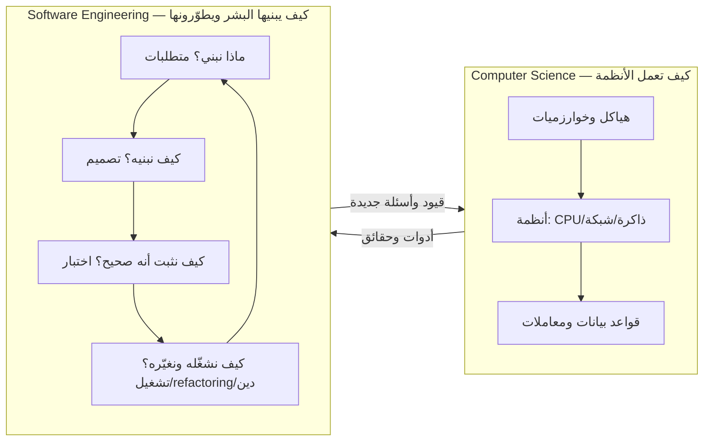

# Module 4.0 — من علوم الحاسوب إلى هندسة البرمجيات
## CS vs SE — The Transition: why "it works" is the beginning, not the end; engineering judgment

> **المستوى:** Level 4 | **الموقع:** [1 من 16]
> **السابق:** [Checkpoint 3](../level-3-core-computer-science/checkpoint-3.md) | **التالي:** [M4.1 — SDLC in Detail](module-4.1-sdlc.md)

---

## 1. المتطلبات
> **قبل أن تتعلم هذا، يجب أن تفهم:**
- [ ] Project 4 مكتمل (API على PostgreSQL بمعاملات وفهارس) — [Project 4](../projects/project-4-db-api/README.md)
- [ ] حادثة "السعر المجاني" وحدود الثقة — [L0-M0.7](../level-0-absolute-foundations/module-07-database-api-web-app.md), [L2-M2.13](../level-2-computer-systems/module-2.13-web-app-architecture.md)
- [ ] إجابات معمارية بصيغة ACTRR (Assumption / Constraint / Tradeoff / Risk / Recommendation) — [L3-M3.7](../level-3-core-computer-science/module-3.7-algorithmic-thinking.md)
- [ ] Git: فروع، commits صغيرة، تاريخ قابل للقراءة — [L1-M1.14](../level-1-programming/module-1.14-git-2.md)

## 2. أهداف التعلّم
- التمييز بين **البرمجة** (جعل الآلة تفعل شيئًا) و**الهندسة** (جعل *نظامًا* يفعل الشيء الصحيح، لأناس حقيقيين، بتكلفة ومخاطر مقبولة، وقابلًا للتغيير بعد سنوات).
- معرفة **الأبعاد الستة** التي تُقاس بها القطعة البرمجية بعد أن "تعمل": الصحة، قابلية التغيير، قابلية التشغيل، الأمان، التكلفة/الزمن، البشر.
- تطبيق **الحكم الهندسي** (engineering judgment): لا توجد إجابة صحيحة عالميًا، توجد مقايضة مناسبة لسياق — وتعلّم صياغة السياق أولًا.
- قراءة Project 4 الذي بنيته بعينين: أين كان *علمًا* (هياكل، تعقيد، معاملات) وأين كان *هندسة* (قرارات، حدود، اختبارات، توثيق)، وأين **لم تكن مهندسًا بعد**.
- فهم خريطة المستوى 4: لماذا نبدأ بـ SDLC والمتطلبات قبل التصميم والكود.

---

## 3. شرح للمبتدئ

### "يعمل" — عند من، ومتى، وبأي ثمن؟
في المستويات 1–3 كان معيار النجاح واضحًا: المخرج صحيح، الاختبار يمرّ، `EXPLAIN` يُظهر Index Scan. هذا معيار **علوم الحاسوب**: هل الحل صحيح وفعّال؟ لكن اسأل عن أي قطعة كود في الإنتاج:
- تعمل **عند من**؟ على جهازك بـ 3 صفوف، أم عند 10k مستخدم متزامن بـ 50M صف؟
- تعمل **متى**؟ اليوم، أم بعد أن يغيّر زميلك schema، أم بعد ترقية Node، أم عندما تتأخر الشبكة 3 ثوانٍ؟
- تعمل **بأي ثمن**؟ كم ساعة لإضافة ميزة بجانبها؟ كم تكلف الخوادم؟ من يُوقَظ ليلًا عندما تتعطل؟
- تعمل **لمن**؟ هل حلّت مشكلة المستخدم أصلًا، أم بنيت الشيء الخطأ بإتقان؟

**علوم الحاسوب تشرح كيف تعمل الأنظمة. هندسة البرمجيات تشرح كيف يبني البشر الأنظمة ويطوّرونها عبر الزمن** — بمتطلبات ناقصة، وفرق تتغير، وميزانيات، ومنافسين، وأخطاء بشرية مضمونة. الفرق ليس في *الذكاء* بل في *ما تُحسب له الحساب*.

### الأبعاد الستة بعد "يعمل"
| البعد | السؤال | أين تعلّمته / ستتعلّمه |
|---|---|---|
| **Correctness** الصحة | هل يفعل الشيء المطلوب في **كل** الحالات التي تهم، ويفشل بوضوح في الباقي؟ | L1 أخطاء، L3 قيود DB، **M4.2 المتطلبات، M4.11 الاختبار** |
| **Changeability** قابلية التغيير | كم يكلّف تغييره بعد 6 أشهر على يد شخص آخر؟ | **M4.6–4.10 التصميم، M4.13 Refactoring** |
| **Operability** قابلية التشغيل | هل نعرف أنه يعمل؟ هل نفهم لماذا توقف؟ هل يُعاد تشغيله بأمان؟ | L2 إغلاق متدرّج، **M4.12، L5-M5.7، L6-M6.6** |
| **Security** الأمان | من يستطيع إساءة استخدامه، وكم يخسر صاحبه؟ | L2 حدود الثقة، L3 حقن SQL، **L5-M5.2–5.5** |
| **Cost & time** التكلفة والزمن | هل يُبنى بالميزانية والوقت المتاحين؟ هل تشغيله أرخص من قيمته؟ | **M4.4 التقدير، M4.15 الدين التقني** |
| **People** البشر | هل يفهمه الفريق؟ هل يُراجَع؟ هل يُوثَّق قراره؟ | **M4.3، L6 كاملًا** |

كود يحقق البعد الأول فقط اسمه **نموذج أولي** (prototype) أو **سكربت**. ليس عيبًا — لكنه ليس منتجًا، وتسميته منتجًا هي أصل نصف حوادث الإنتاج.

### الحكم الهندسي: المقايضة بدل الإجابة
المبتدئ يسأل: "ما الأفضل، REST أم GraphQL؟ Postgres أم Mongo؟ Monolith أم microservices؟". المهندس يسأل أولًا: **ما السياق؟** حجم الفريق، معدل التغيير، الحمل، تكلفة الخطأ، المهارات المتاحة، العمر المتوقع للنظام. ثم يختار **المقايضة** التي تناسبه ويوثّقها (ستتعلّم ADR في L6-M6.3). هذا ما تدرّبت عليه بصيغة ACTRR منذ L3؛ المستوى 4 يعطيك المفردات والأدوات لتجعل تلك الإجابات أدقّ: متطلبات مكتوبة، معايير قبول، تقدير بمخاطر، تصميم بحدود، اختبارات تحوّل "أعتقد" إلى "أثبتُّ".

### قصة قصيرة: نفس الدالة، شخصان
مطوّر يكتب `applyDiscount(order, code)` تعمل مع الكوبونات الثلاثة في بيانات الاختبار. مهندس يكتب الدالة نفسها ثم يسأل: ماذا لو انتهى الكوبون أثناء الطلب؟ ماذا لو أُرسل الطلب مرتين (L2 idempotency)؟ ماذا لو تجاوز الخصم السعر (سعر سالب = "السعر المجاني" مرة أخرى)؟ من يُنشئ الكوبونات ومن يراقب إساءة استخدامها؟ كيف نعرف غدًا كم خصمًا طُبّق؟ أي من هذه الأسئلة *تستحق* الإجابة الآن وأيها يُؤجَّل بوعي؟ الكود الذي ينتجه قد يكون أطول بـ 20 سطرًا فقط — الفرق في **الأسئلة**، لا في السطور.

### لماذا يبدأ المستوى 4 بـ SDLC والمتطلبات وليس بـ SOLID؟
لأن أغلى خطأ في البرمجيات ليس خطأ في الكود بل **بناء الشيء الخطأ**: ميزة لم يطلبها أحد، أو فُهمت عكسيًا، أو حُلّت المشكلة السهلة بدل الحقيقية. تنظيف كود ميزة خاطئة = إتقان الخطأ. لذلك الترتيب: كيف تجري العملية (M4.1) → ماذا نبني فعلًا (M4.2–4.3) → بكم (M4.4) → كيف نصمّمه (M4.5–4.9) → كيف نكتبه ونثبته ونحافظ عليه (M4.10–4.15).

---

## 4. النموذج الذهني

```
   البرمجة                               الهندسة
   ────────                               ────────
   مدخل → كود → مخرج صحيح                 مشكلة بشرية → متطلبات → تصميم → كود → اختبار → تشغيل → تغيير → ... (سنوات)
   المعيار: "يعمل"                        المعيار: صحيح + قابل للتغيير + قابل للتشغيل + آمن + بتكلفة مقبولة + مفهوم للفريق
   السؤال: كيف؟                           السؤال: ماذا، لمن، لماذا، بكم، وبأي مقايضة — ثم كيف
```

**"يعمل" هو شرط الدخول، لا خط النهاية.** كل وحدة في هذا المستوى تضيف بعدًا من الأبعاد الستة.

---

## 5. الرسم التوضيحي



```
   تكلفة إصلاح خطأ بحسب مرحلة اكتشافه (ترتيب الأحجام، لا أرقام دقيقة)
   المتطلبات  ▏█
   التصميم    ▏███
   الكود      ▏██████
   الاختبار   ▏████████████
   الإنتاج    ▏████████████████████████████████  (+ عملاء، + سمعة، + ليلة بلا نوم)
```

---

## 6. مثال بسيط

المهمة: "أضف endpoint لتصدير طلبات المستخدم كـ CSV".

**قراءة المبرمج:** `SELECT` → حوّل إلى CSV → `res.end()`. 20 دقيقة. يعمل.

**قراءة المهندس (5 دقائق أسئلة قبل الكود):**
| سؤال | البعد | أثره على الكود |
|---|---|---|
| كم طلبًا للمستخدم الأكبر؟ 50؟ 500k؟ | الصحة/التشغيل | streaming (L0 whole-file vs streaming، L2 backpressure) بدل بناء نص في الذاكرة |
| من يحق له التصدير؟ المستخدم لطلباته فقط؟ موظف للمؤسسة كلها؟ | الأمان | شرط `user_id`/`organization_id` في SQL لا في الواجهة (حدود الثقة) |
| هل يفتحه Excel عربيًا؟ | الصحة | BOM + UTF-8، فاصلة أم فاصلة منقوطة، تهريب الحقول التي تحوي فواصل/أسطر |
| ماذا لو ضغط المستخدم "تصدير" 20 مرة؟ | التكلفة | حد معدّل، أو تصدير غير متزامن بطابور (L5-M5.9) |
| كيف نعرف أنه يُستخدم أو يفشل؟ | التشغيل | سجل منظّم + مقياس (L6-M6.6) |
| ما الذي **لا** نبنيه الآن؟ | التكلفة/الزمن | لا جدولة، لا تنسيقات أخرى — مكتوب في التذكرة كـ out of scope |

الكود الناتج ربما 60 سطرًا بدل 20. لكن الثلاث أسئلة الأولى كانت ستصبح **حوادث** (OOM، تسريب بيانات، "الملف معطوب") لو لم تُسأل.

---

## 7. مثال كود

نفس الدالة بمرحلتين. ليس "الإصدار 2 أفضل دائمًا" — بل: **ماذا أضاف كل سطر، وأي بُعد يخدم، وهل يستحقه سياقك؟**

```typescript
// src/discount.ts — v1 "تعمل" ثم v2 "مهندَسة": اقرأ التعليقات على أنها أسئلة أُجيب عنها، لا زخارف
export type Order = { id: string; subtotalCents: number; userId: string };
export type Coupon = { code: string; percentOff: number; expiresAt: Date; maxUses: number; uses: number };

// v1 — تعمل مع بيانات الاختبار
export function applyDiscountV1(order: Order, coupon: Coupon) {
  return order.subtotalCents - order.subtotalCents * coupon.percentOff / 100;
}
// ماذا لو percentOff = 150؟ سعر سالب. 33% من 100 سنت = 33.33 سنت؟ المال كسور (L3-M3.10). انتهى الكوبون؟ تجاوز maxUses؟ لا أحد يعرف.

// v2 — نفس المنطق + قرارات صريحة. كل قرار يحمل البُعد الذي يخدمه.
export class DiscountError extends Error { constructor(readonly reason: "expired" | "exhausted" | "invalid") { super(`coupon ${reason}`); } }

export function applyDiscountV2(order: Order, coupon: Coupon, now = new Date()): { totalCents: number; discountCents: number } {
  // [الصحة] الحالات التي تهم العمل، بأخطاء مُسمّاة (L1-M1.9) تتحول إلى 409/422 في الطبقة الخارجية
  if (!Number.isInteger(coupon.percentOff) || coupon.percentOff < 1 || coupon.percentOff > 100) throw new DiscountError("invalid");
  if (coupon.expiresAt <= now) throw new DiscountError("expired");
  if (coupon.uses >= coupon.maxUses) throw new DiscountError("exhausted");
  // [الصحة] المال أعداد صحيحة بالسنت؛ التقريب قرار عمل مُعلَن: لصالح العميل (floor على الإجمالي)
  const discountCents = Math.ceil(order.subtotalCents * coupon.percentOff / 100);
  const totalCents = Math.max(0, order.subtotalCents - discountCents);       // [الأمان] لا سعر سالب مهما حدث
  return { totalCents, discountCents };
  // [قابلية التغيير] `now` معامل → قابلة للاختبار بلا ساعة حقيقية (M4.11)، ولا تقرأ DB → نقية (L1-M1.7)
  // [التشغيل] ما ليس هنا عمدًا: زيادة `uses` ليست مسؤولية هذه الدالة — إنها UPDATE ذري بشرط في المعاملة (L3-M3.14):
  //   UPDATE coupons SET uses = uses + 1 WHERE code = $1 AND uses < max_uses AND expires_at > now()  → rowCount 0 = ارفض
  //   وإلا عاد سباق "القطعة الأخيرة" باسم جديد.
}

// الحكم الهندسي: هل كل هذا ضروري لسكربت داخلي يُشغَّل مرة؟ لا. لمسار الدفع في متجر؟ الحد الأدنى.
```

```typescript
// src/discount.test.ts — "أثبتُّ" بدل "أعتقد" (node:test مدمج؛ التفصيل في M4.11)
import { test } from "node:test"; import assert from "node:assert/strict";
import { applyDiscountV2, DiscountError, type Coupon, type Order } from "./discount.js";

const order: Order = { id: "o1", subtotalCents: 1000, userId: "u1" };
const coupon = (over: Partial<Coupon> = {}): Coupon => ({ code: "X", percentOff: 10, expiresAt: new Date("2030-01-01"), maxUses: 5, uses: 0, ...over });

test("10% of 1000 cents", () => assert.deepEqual(applyDiscountV2(order, coupon()), { totalCents: 900, discountCents: 100 }));
test("rounding favours the customer: 33% of 1000 = 330, of 1001 = 331", () => {
  assert.equal(applyDiscountV2(order, coupon({ percentOff: 33 })).discountCents, 330);
  assert.equal(applyDiscountV2({ ...order, subtotalCents: 1001 }, coupon({ percentOff: 33 })).discountCents, 331);
});
test("never negative", () => assert.equal(applyDiscountV2({ ...order, subtotalCents: 1 }, coupon({ percentOff: 100 })).totalCents, 0));
test("expired at the exact second is expired", () => assert.throws(() => applyDiscountV2(order, coupon({ expiresAt: new Date("2030-01-01") }), new Date("2030-01-01")), (e: unknown) => e instanceof DiscountError && e.reason === "expired"));
test("exhausted", () => assert.throws(() => applyDiscountV2(order, coupon({ maxUses: 1, uses: 1 })), /exhausted/));
test("invalid percent rejected", () => { for (const p of [0, 101, 12.5, NaN]) assert.throws(() => applyDiscountV2(order, coupon({ percentOff: p })), /invalid/); });
```

---

## 8. مثال من العالم الحقيقي
ميزة "تذكّرني" في تطبيق ويب. علميًا: cookie طويل العمر. هندسيًا: ما مدة الصلاحية ولماذا؟ ما الذي يحدث عند تغيير كلمة المرور (إبطال الجلسات الأخرى)؟ أين تُخزَّن الرموز (hash لا نص صريح — L3-M3.9)؟ كيف يسحب المستخدم جهازًا مفقودًا؟ ما سجل التدقيق؟ هذا كله **المتطلبات غير الوظيفية والأمنية** التي لا يكتبها أحد في التذكرة "أضف تذكّرني" — ومهمتك كمهندس أن تستخرجها (M4.2) قبل أن يستخرجها مهاجم.

## 9. مثال من الإنتاج
فريق أطلق تحسينًا جعل endpoint أسرع ×5 (علوم حاسوب ممتازة: فهرس مركّب + keyset). بعد أسبوع: فاتورة التخزين تضاعفت لأن الفهرس على جدول 2TB أضاف 400GB، وأبطأ الكتابات 20%، ولم يستخدم الصفحة أحد تقريبًا — كانت شاشة إدارة تُفتح 10 مرات يوميًا. القرار الصحيح هندسيًا كان: قِس من يستخدمها أولًا (بُعد التكلفة والبشر). **الحل الأمثل لمشكلة لا تستحق الحل هو هدر.** هذا لا يلغي ما تعلّمته في L3 — يضع له سياقًا.

---

## 10. مفاهيم خاطئة شائعة
1. **"الهندسة = عمليات وبيروقراطية تبطئ البرمجة."** الهندسة = *أسئلة مناسبة للسياق*. لسكربت يُرمى: صفر عملية. لنظام دفع: عملية كثيفة. القدرة على اختيار الجرعة هي الهندسة نفسها.
2. **"المهندس الجيد يعرف الإجابة الصحيحة."** يعرف الأسئلة الصحيحة والمقايضات، ويوثّق لماذا اختار — فيستطيع غيره مراجعته لاحقًا.
3. **"سأضيف الاختبارات/التوثيق/المعالجة لاحقًا عندما يعمل."** "لاحقًا" له تاريخ انتهاء اسمه "الميزة التالية". ما لا يُبنى مع الكود نادرًا ما يُبنى.
4. **"الكود النظيف هو الهندسة."** هو بُعد واحد (قابلية التغيير). كود نظيف لميزة خاطئة أو غير آمنة أو غير قابلة للتشغيل ليس هندسة.
5. **"كلما زادت الأبعاد المغطّاة كان أفضل."** الإفراط (over-engineering) تكلفة حقيقية: تجريدات لمستقبل لن يأتي، ومرونة لا يطلبها أحد. الحكم في الموازنة لا في التكديس.

## 11. أخطاء شائعة
1. القفز إلى الكود قبل كتابة سطرين عن المشكلة ومن يملكها.
2. تقدير بناءً على "المسار السعيد" فقط، ثم تضاعف الوقت بسبب الحالات الحدّية التي كانت واضحة لو سُئل عنها.
3. "تعمل على جهازي" كمعيار تسليم — بلا بيانات بحجم الإنتاج، بلا شبكة بطيئة، بلا مستخدم خبيث.
4. اتخاذ قرار معماري غير قابل للتراجع (DB، لغة، إطار) في اليوم الأول لأنه "الأشهر".
5. قياس التقدّم بعدد الأسطر أو الميزات بدل المشكلات المحلولة.
6. الخلط بين "لا أعرف المتطلب" و"المتطلب غير موجود" — الأول يُحلّ بسؤال، الثاني بقرار موثّق.

## 12. تمرين تصحيح
PR بعنوان "إصلاح: الخصم لا يُطبَّق أحيانًا" يغيّر `if (coupon.uses >= coupon.maxUses)` إلى `if (coupon.uses > coupon.maxUses)`. الاختبارات (الموجودة) تمرّ، والمبلّغ يقول إن المشكلة اختفت.
1. **لاحظ:** ما السلوك الذي تغيّر فعلًا؟ (كوبون بـ `maxUses: 1` يُستخدم الآن مرتين.)
2. **دليل:** اطلب الحالة الأصلية: المستخدم اشتكى أن كوبونه "الصالح" رُفض. استعلم: `SELECT uses, max_uses FROM coupons WHERE code = ...` → `uses = 1, max_uses = 1`، وسجل الطلبات يُظهر طلبًا سابقًا **فشل بعد** زيادة `uses` (خطأ في الدفع، لكن الزيادة لم تتراجع).
3. **فرضية:** الخطأ ليس في المقارنة بل في أن زيادة `uses` تحدث خارج معاملة الطلب (L3-M3.14 الذرية).
4. **تجربة:** أعد الحالة: ابدأ طلبًا، أفشل الدفع، تحقق من `uses`.
5. **الاستنتاج:** الـ PR يخفي العرض ويُدخل ثغرة (استخدام مضاعف). الإصلاح: الزيادة داخل المعاملة أو تعويض عند الفشل، + اختبار يصف السيناريو. لاحظ البعدين اللذين غابا عن المصلّح: الصحة في كل الحالات، والأمان.

## 13. تمرين معماري
افتح Project 4 الخاص بك واملأ جدولًا بثلاثة أعمدة: **القرار** (مثلًا keyset pagination، idempotency key، migrations runner، `EXPLAIN` guard، التحقق من المدخلات، أكواد الأخطاء) / **البعد الذي خدمه** / **ما كان سيحدث بدونه ومتى** (بعد كم مستخدم/شهر). ثم أضف عمودًا رابعًا: **ما لم أفعله وأعرف أنه ناقص** (اختبارات؟ توثيق القرارات؟ مراقبة؟ حدود معدّل؟). رتّب النواقص بـ "تكلفة الحادث × احتماله". هذا الجدول هو أول **سجل دين تقني** لك (M4.15) وسيكون مدخل Project 5.

## 14. الصلة بعصر AI
AI يرفع سقف "البرمجة" (الكود يُولَّد بسرعة) ولا يرفع سقف "الهندسة" إلا بقدر ما تطرح أنت الأسئلة. النموذج سينفّذ `applyDiscountV1` بكفاءة إن طلبته هكذا، و`V2` إن أعطيته السياق والقيود والحالات. معظم ما يُسمّى "كود AI سيئ" هو **طلب بلا أبعاد**. المستوى 4 يعلّمك صياغة الأبعاد (متطلبات، معايير قبول، تصميم، اختبارات) — وهي نفسها ما ستعطيه للوكيل في L8 بوصفه *عقدًا* ثم تتحقق منه. مهندس بلا هذه المهارة + AI = مبرمج أسرع في بناء الشيء الخطأ.

## 15. ما يجب إتقانه (Must Master) 🔴
- 🔴 الفرق بين "يعمل" والهندسة؛ الأبعاد الستة وأسئلتها؛ الحكم الهندسي كمقايضة في سياق؛ لماذا المتطلبات قبل الكود؛ تمرين "الأسئلة الخمس قبل أي ميزة".

## 16. ما يجب فهمه (Should Understand) 🟠
- 🟠 منحنى تكلفة الخطأ بحسب المرحلة؛ over-engineering كتكلفة؛ قراءة مشروعك بأبعاده؛ سجل النواقص كمدخل للدين التقني.

## 17. ما يمكن تأجيله (Can Defer) ⚪
- ⚪ تاريخ "أزمة البرمجيات" ونشأة المصطلح (NATO 1968)، نماذج النضج (CMMI)، المعايير الرسمية (ISO/IEC 25010 لجودة البرمجيات — تعرف اسمها فقط).

## 18. الخلاصة
1. "يعمل" شرط الدخول. بعده ستة أبعاد: صحة، قابلية تغيير، قابلية تشغيل، أمان، تكلفة/زمن، بشر.
2. CS = كيف تعمل الأنظمة؛ SE = كيف يبنيها البشر ويطوّرونها لسنوات بمتطلبات ناقصة وفرق متغيرة.
3. الحكم الهندسي = اختيار المقايضة المناسبة للسياق وتوثيقها، لا معرفة "الإجابة".
4. أغلى خطأ: بناء الشيء الخطأ. لذلك SDLC والمتطلبات أولًا، والتصميم والكود بعدها.
5. الجرعة المناسبة من الهندسة تختلف بين سكربت ونظام دفع — والقدرة على اختيارها هي المهارة.

## 19. مراجع رسمية
- SWEBOK v4 (IEEE Computer Society) — Guide to the Software Engineering Body of Knowledge: https://www.computer.org/education/bodies-of-knowledge/software-engineering
- ISO/IEC 25010 — Systems and software quality models (overview): https://iso25000.com/index.php/en/iso-25000-standards/iso-25010
- Google — Software Engineering at Google, Ch. 1 "What Is Software Engineering?" (programming integrated over time): https://abseil.io/resources/swe-book/html/ch01.html
- Fred Brooks — "No Silver Bullet" (essential vs accidental complexity): https://www.cs.unc.edu/techreports/86-020.pdf
- NATO Software Engineering Conference 1968 report (origin of the term): http://homepages.cs.ncl.ac.uk/brian.randell/NATO/nato1968.PDF

## المصطلحات
| العربية | English |
|---|---|
| هندسة البرمجيات | Software Engineering |
| الحكم الهندسي | Engineering judgment |
| مقايضة | Tradeoff |
| نموذج أولي | Prototype |
| قابلية التغيير / الصيانة | Changeability / Maintainability |
| قابلية التشغيل | Operability |
| الإفراط في الهندسة | Over-engineering |
| خارج النطاق | Out of scope |
| التعقيد الجوهري / العرضي | Essential / Accidental complexity |
