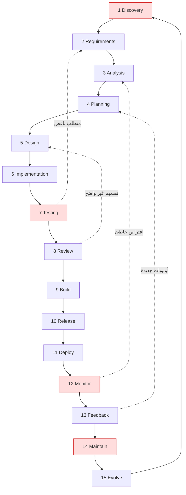

# Module 4.1 — دورة حياة تطوير البرمجيات بالتفصيل
## SDLC in Detail: Discovery → Requirements → Analysis → Planning → Design → Implementation → Testing → Review → Build → Release → Deploy → Monitor → Feedback → Maintain → Evolve

> **المستوى:** Level 4 | **الموقع:** [2 من 16]
> **السابق:** [M4.0 — CS vs SE](module-4.0-cs-vs-se.md) | **التالي:** [M4.2 — Requirements](module-4.2-requirements.md)

---

## 1. المتطلبات
> **قبل أن تتعلم هذا، يجب أن تفهم:**
- [ ] الأبعاد الستة والحكم الهندسي — [M4.0](module-4.0-cs-vs-se.md)
- [ ] Git: فروع، PR، تاريخ — [L1-M1.14](../level-1-programming/module-1.14-git-2.md)
- [ ] خبرة بناء مشروع كامل من المتطلبات إلى القياس — [Project 4](../projects/project-4-db-api/README.md) (لاحظ أن ملف المشروع نفسه كان مرتبًا بمراحل SDLC)
- [ ] نظرة SDLC الأولى في الخريطة — [07-sdlc-progression](../00-course-overview/07-sdlc-progression.md)

## 2. أهداف التعلّم
- تسمية **المراحل الخمس عشرة** وشرح *ما يدخل* كل مرحلة و*ما يخرج* منها (artifact) و*السؤال الذي تجيب عنه* و*كيف يفشل المشروع فيها*.
- فهم لماذا الدورة **تكرارية** (iterative) لا خطية: كل مرحلة تُغذّي السابقة؛ "الشلال" (waterfall) الصارم يفشل لأن المعرفة تأتي متأخرة.
- التمييز بين **المنهجيات** (Waterfall, Agile/Scrum/Kanban, DevOps) كترتيبات مختلفة *لنفس المراحل* بإيقاعات مختلفة — لا كأديان.
- تحديد **أين تموت المشاريع** فعليًا (الاكتشاف، التكامل المتأخر، الإطلاق بلا مراقبة، الصيانة بلا ملكية) وما الذي يمنع ذلك.
- تطبيق "**SDLC مصغّر**" على مهمة بحجم تذكرة واحدة: تعريف → معايير قبول → تصميم بسطرين → كود → اختبار → مراجعة → نشر → تحقق.

---

## 3. شرح للمبتدئ

### لماذا "دورة" وليس "خطوات"؟
تخيّل بناء جسر: تدرس، تصمم، تبني، تسلّم. البرمجيات تختلف في شيء جوهري: **تكلفة التغيير منخفضة نسبيًا ومتطلباتها تتغير فعلًا** — السوق يتحرك، المستخدم يكتشف ما يريد عندما يرى شيئًا يعمل، والفريق يتعلّم المجال أثناء البناء. لذلك أي عملية تفترض أننا نعرف كل شيء في البداية (الشلال الصارم) تنتج الشيء الذي طُلب قبل سنة لا الذي يُحتاج اليوم. **SDLC = نفس المراحل، تُدار كحلقة تتكرر بسرعة** (أسبوعان، يوم، أو ساعات في فرق ناضجة).

### المراحل الخمس عشرة — ماذا يدخل وماذا يخرج
| # | المرحلة | السؤال | المخرج (artifact) | كيف يفشل المشروع هنا |
|---|---|---|---|---|
| 1 | **Discovery** الاكتشاف | ما المشكلة ولمن ولماذا الآن؟ | بيان مشكلة، أصحاب المصلحة، مقياس نجاح | حل مشكلة غير موجودة؛ "المدير قال" |
| 2 | **Requirements** المتطلبات | ماذا يجب أن يفعل النظام وبأي قيود؟ | FR/NFR/قيود/افتراضات (M4.2) | غموض ("سريع")، متطلبات ضمنية |
| 3 | **Analysis** التحليل | هل المتطلبات متسقة، كاملة، ممكنة؟ ما المجال؟ | نموذج مجال، تعارضات محلولة، أسئلة مفتوحة | تعارضات تُكتشف في الكود |
| 4 | **Planning** التخطيط | ما الترتيب، من، بكم، وما المخاطر؟ | backlog مرتّب، تقدير بمدى (M4.4)، سجل مخاطر | مواعيد قبل التفكيك؛ المخاطر في النهاية |
| 5 | **Design** التصميم | ما الحدود والمكونات والبيانات والواجهات؟ | design doc/ADR، schema، عقود API (M4.5) | تصميم في الرأس؛ قرارات لا رجعة فيها بلا نقاش |
| 6 | **Implementation** التنفيذ | كيف نكتبه بجودة وبخطوات صغيرة؟ | commits صغيرة، كود مع اختباراته | فروع تعيش أسابيع؛ "سأختبر لاحقًا" |
| 7 | **Testing** الاختبار | هل يفعل ما طُلب ولا يفعل ما لم يُطلب؟ | اختبارات آلية بطبقاتها (M4.11) | اختبار يدوي فقط؛ اختبار المسار السعيد |
| 8 | **Review** المراجعة | هل يفهمه شخص آخر ويوافق عليه؟ | PR مراجَع بتعليقات محلولة (L6-M6.2) | مراجعة شكلية؛ PR بـ 3000 سطر |
| 9 | **Build** البناء | هل يُبنى من الصفر آليًا وبشكل حتمي؟ | artifact قابل للنشر (صورة، حزمة) (L5-M5.12) | "يعمل على جهازي"؛ تبعيات غير مثبّتة |
| 10 | **Release** الإصدار | ماذا يحتوي، وما رقمه، وما تغيّر؟ | نسخة مرقّمة + changelog + خطة تراجع | نشر بلا معرفة ما تغيّر |
| 11 | **Deploy** النشر | كيف يصل للإنتاج بلا توقف وبقابلية تراجع؟ | نشر تدريجي/قابل للرجوع (L5-M5.10) | big bang؛ migration تقفل الجدول |
| 12 | **Monitor** المراقبة | هل يعمل الآن؟ هل يفعل ما توقعنا؟ | سجلات، مقاييس، تنبيهات، SLO (L6-M6.6) | أول من يعرف بالعطل هو العميل |
| 13 | **Feedback** التغذية الراجعة | ماذا تعلّمنا من المستخدمين والبيانات؟ | قياس الاستخدام، شكاوى، حوادث → backlog | الميزة تُطلق ولا يُنظر إليها |
| 14 | **Maintain** الصيانة | إصلاح، ترقية تبعيات، أمان، دين | إصدارات صيانة، سجل دين (M4.15) | لا مالك؛ تبعيات بثغرات لسنوات |
| 15 | **Evolve** التطوّر | ما الذي يجب أن يصبح عليه النظام تاليًا؟ | قرارات إعادة هيكلة/تقاعد/إعادة بناء | إعادة كتابة كاملة بدافع الملل |

كل سهم في الجدول يعود للأعلى: الاختبار يكشف متطلبًا ناقصًا، المراقبة تكشف تصميمًا خاطئًا، التغذية الراجعة تفتح اكتشافًا جديدًا. **المشروع الصحي يمرّ بالحلقة كلها كثيرًا** بدل أن يمرّ بها مرة واحدة ببطء.

### المنهجيات = إيقاعات لنفس الحلقة
- **Waterfall**: مرة واحدة، مراحل ببوابات. يصلح عندما المتطلبات ثابتة فعلًا وتكلفة التغيير هائلة (برمجيات طائرة مع تنظيم رقابي). يفشل في منتجات السوق.
- **Agile** (قيم) → **Scrum** (sprints 1–4 أسابيع، أدوار، احتفالات) / **Kanban** (تدفق مستمر، حد WIP): الحلقة كاملة كل sprint أو كل تذكرة. الفكرة الجوهرية: **تقصير زمن التعلّم** بين الفكرة والتحقق منها.
- **DevOps / Continuous Delivery**: أتمتة المراحل 9–12 حتى تصبح الحلقة بالساعات؛ "من يبنيه يشغّله" يُغلق حلقة Feedback.
- **Shape Up / Lean / XP**: تنويعات؛ ما يهمك: أي منهجية تجيب عن نفس 15 سؤالًا، فقط بترتيب وتردد مختلفين. عندما تنضم لفريق، اسأل "كيف نُجيب هنا عن كل سؤال؟" بدل "أي منهجية تتبعون؟".

### أين تموت المشاريع فعليًا
1. **قبل السطر الأول**: اكتشاف غائب → حل لمشكلة غير موجودة (أكثر أسباب فشل الشركات الناشئة شيوعًا: "لا حاجة في السوق").
2. **التكامل المتأخر**: كل واحد يبني جزءه لشهور ثم "ندمج" → أسابيع من المفاجآت. العلاج: دمج يومي، فروع قصيرة، CI.
3. **90% جاهز لمدة 6 أشهر**: لا تعريف لـ "منتهٍ" (Definition of Done، M4.3) → النهاية تبتعد كلما اقتربت.
4. **الإطلاق بلا مراقبة**: يعمل؟ لا أحد يعرف حتى يتصل العميل.
5. **الصيانة بلا ملكية**: المطوّر رحل، لا توثيق، لا اختبارات → كل تغيير مخاطرة → لا أحد يغيّر → النظام يموت واقفًا (M4.14).

### SDLC مصغّر لتذكرة واحدة (ما ستفعله يوميًا)
1. **اقرأ التذكرة واسأل**: من المستخدم؟ ما المشكلة الفعلية؟ ما غير المطلوب؟ (اكتشاف + متطلبات، 10 دقائق)
2. **اكتب معايير القبول** إن لم تكن موجودة، واتفق عليها (M4.3).
3. **تصميم بسطرين**: أي ملفات/جداول تتأثر؟ هل يتغير عقد API؟ هل يحتاج migration؟ أي خطر؟
4. **فرع قصير العمر**: كود + اختبار في نفس الـ commits.
5. **PR صغير** بوصف: المشكلة، الحل، كيف اختُبر، ما لم يُفعل.
6. **مراجعة → دمج → CI يبني وينشر** (أو staging).
7. **تحقق في الإنتاج**: سجل/مقياس/شاشة. أغلق التذكرة بدليل.
8. **ما تعلّمته** يرجع كتذكرة/ملاحظة.

---

## 4. النموذج الذهني

```
   فكرة ──▶ [اكتشف ▸ حدّد ▸ حلّل ▸ خطّط ▸ صمّم ▸ نفّذ ▸ اختبر ▸ راجع ▸ ابنِ ▸ أصدر ▸ انشر ▸ راقب ▸ تعلّم ▸ صُن ▸ طوّر] ──▶ فكرة أدق
                 ▲                                                                                              │
                 └──────────────────────────────  كل دورة أقصر = تعلّم أسرع = خطأ أرخص  ◀─────────────────────────┘
```

**SDLC = حلقة تعلّم.** جودة الفريق تُقاس بـ **زمن الدورة** (من فكرة إلى تحقق في الإنتاج) و**ما يتعلّمه في كل دورة**، لا بطول الوثائق.

---

## 5. الرسم التوضيحي


(الأحمر = المراحل التي تُهمَل أكثر وتُسقط المشاريع.)

```
   نفس المراحل، إيقاعات مختلفة:

   Waterfall   |████ D R A P ████|████ G ████|████████ I ████████|███ T ███|R|B|L|Y|  M...        (دورة واحدة، أشهر/سنوات)
   Scrum       |D R A P G I T V B L Y M F|D R A P G I T V B L Y M F|D R A P ...                    (دورة كل 2 أسابيع)
   CD/DevOps   |drapgitvblymf|drapgitvblymf|drapgitvblymf|...                                       (دورة كل تذكرة، ساعات)
```

---

## 6. مثال بسيط

تذكرة: "المستخدمون يشتكون أن البحث لا يجد المنتجات".
- **Discovery (10 د):** أي مستخدمين؟ (موظفو المستودع.) أي كلمات؟ (أكواد SKU جزئية مثل `PN-12`.) الحالي يبحث بالاسم فقط. مقياس النجاح: نسبة بحث بلا نتائج تنخفض من 40% إلى < 10%.
- **Requirements:** FR: البحث يطابق SKU جزئيًا والاسم. NFR: < 200ms p95 على 500k منتج. قيد: بدون خدمة بحث جديدة هذا الربع. افتراض: SKU بادئة ثابتة.
- **Analysis:** هل `PN-12` يجب أن يطابق `PN-120`؟ (نعم.) `pn-12`؟ (نعم، غير حساس للحالة.) تعارض: البحث بالاسم الحالي يستخدم `ILIKE '%x%'` وهو بطيء — هل نحافظ عليه؟
- **Planning:** مهمة واحدة، يومان، خطر: فهرس على 500k صف في الإنتاج (CONCURRENTLY).
- **Design:** فهرس `(lower(sku) text_pattern_ops)` للبادئة + GIN trigram للاسم إن لزم (L3-M3.13)؛ عقد API: `?q=` يبحث في الاثنين. ADR قصير.
- **Implementation/Testing:** استعلام + اختبار بحالات (`PN-12`, `pn-12`, فارغ، 1000 حرف) + `EXPLAIN` guard.
- **Review/Build/Release/Deploy:** PR صغير، migration CONCURRENTLY، نشر.
- **Monitor/Feedback:** لوحة "بحث بلا نتائج". بعد أسبوع: 12% — جيد؛ الباقي أخطاء إملائية → تذكرة جديدة (fuzzy) → الحلقة من جديد.

لاحظ: 60% من العمل كان قبل الكود، والكود نفسه ساعتان.

---

## 7. مثال كود

الكود هنا **أداة عملية**: فاحص بسيط يتأكد أن كل ميزة في مستودعك تحمل آثار المراحل الأساسية — لأن ما لا يُفحَص يُنسى. (ستُدمج فكرته في CI في L5-M5.12.)

```typescript
// src/sdlc-check.ts — هل تحمل الميزة آثار الحلقة؟ (مجلد features/<name>/ بملفات متفق عليها) — فاحص صغير لا بديل عن الحكم
import { readdir, readFile, stat } from "node:fs/promises"; import { join } from "node:path";

type Check = { stage: string; file: string; mustContain?: RegExp[] };
const CHECKS: Check[] = [
  { stage: "Discovery",    file: "problem.md",      mustContain: [/##\s*Problem/i, /##\s*Users?/i, /##\s*Success metric/i] },
  { stage: "Requirements", file: "requirements.md", mustContain: [/##\s*Functional/i, /##\s*Non-functional/i, /##\s*Out of scope/i] },
  { stage: "Acceptance",   file: "acceptance.md",   mustContain: [/Given/, /When/, /Then/] },
  { stage: "Design",       file: "design.md",       mustContain: [/##\s*(Boundaries|Components)/i, /##\s*(Risks|Tradeoffs)/i] },
  { stage: "Testing",      file: "tests",           },                                       // مجلد
  { stage: "Rollout",      file: "rollout.md",      mustContain: [/rollback/i, /monitor/i] },
];

export async function checkFeature(dir: string) {
  const missing: string[] = [];
  for (const c of CHECKS) {
    const p = join(dir, c.file);
    const s = await stat(p).catch(() => null);
    if (!s) { missing.push(`${c.stage}: ${c.file} غير موجود`); continue; }
    if (s.isDirectory()) { if ((await readdir(p)).length === 0) missing.push(`${c.stage}: ${c.file}/ فارغ`); continue; }
    const text = await readFile(p, "utf8");
    for (const re of c.mustContain ?? []) if (!re.test(text)) missing.push(`${c.stage}: ${c.file} بلا قسم ${re.source}`);
  }
  return missing;
}

if (process.argv[1]?.endsWith("sdlc-check.ts") || process.argv[1]?.endsWith("sdlc-check.js")) {
  const root = process.argv[2] ?? "features";
  let bad = 0;
  for (const f of await readdir(root).catch(() => [] as string[])) {
    const missing = await checkFeature(join(root, f));
    console.log(missing.length ? `✗ ${f}` : `✓ ${f}`); missing.forEach(m => console.log("   -", m)); bad += missing.length ? 1 : 0;
  }
  process.exitCode = bad ? 1 : 0;        // في CI: PR يضيف ميزة بلا مشكلة/معايير قبول/خطة نشر لا يُدمج (L5-M5.12)
}
```

```bash
# قالب ميزة جديدة (bash لأنه مجرد نسخ ملفات — L0-M0.4)
mkdir -p features/sku-search/tests && cd features/sku-search
printf '## Problem\n\n## Users\n\n## Success metric\n' > problem.md
printf '## Functional\n\n## Non-functional\n\n## Constraints\n\n## Assumptions\n\n## Out of scope\n' > requirements.md
printf '### Scenario: ...\nGiven ...\nWhen ...\nThen ...\n' > acceptance.md
printf '## Boundaries\n\n## Data\n\n## API contract\n\n## Risks\n' > design.md
printf '## Rollout\n- flag/gradual?\n## Rollback\n## Monitor\n' > rollout.md
```

> ملاحظة: لا تحوّل هذا إلى بيروقراطية. لإصلاح خطأ إملائي لا تحتاج ستة ملفات — تحتاج سطرًا في وصف PR. القالب لميزات تمسّ المستخدم أو البيانات أو الأمان. **الجرعة بحسب المخاطرة** (M4.0).

---

## 8. مثال من العالم الحقيقي
Project 4 الذي بنيته كان SDLC كاملًا بلا أن نسمّيه: المشكلة (ملف JSON يفشل) → المتطلبات F1–F… وNFR → التحليل (schema والعلاقات) → التخطيط (S1–S4) → التصميم (migrations، keyset، idempotency) → التنفيذ → الاختبار (تزامن، `EXPLAIN` guard) → المراجعة (قائمة التحقق) → القياس (تقرير الأداء). ما غاب: Release/Deploy/Monitor/Feedback — وهذا بالضبط ما يضيفه L5 وL6. افتح README المشروع وضع رقم المرحلة أمام كل قسم.

## 9. مثال من الإنتاج
فريق ينشر كل أسبوعين "إصدارًا كبيرًا" يدمج 40 PR. كل نشر = ليلة توتر، وعند الفشل لا أحد يعرف أي تغيير من الأربعين هو السبب، فيتراجعون عن الكل. التحوّل إلى **نشر كل PR على حدة** خلف feature flags مع مراقبة: الإصدارات صارت 15 يوميًا، كل فشل يُعزل في دقائق إلى تغيير واحد، والتراجع يصبح `git revert` واحدًا. لم تتغير المراحل — تغيّر **حجم الدفعة** و**زمن الدورة**. (أبحاث DORA تربط هذا مباشرة بأداء المنظمات — انظر المراجع.)

---

## 10. مفاهيم خاطئة شائعة
1. **"Agile = بلا توثيق ولا تخطيط."** البيان يقول "*أكثر من*" لا "*بدلًا من*". الفرق الناضجة توثّق القرارات (ADR) ومعايير القبول وتخطّط كل دورة.
2. **"SDLC شيء للمدراء."** أنت تمارسه في كل تذكرة؛ الفرق أن تفعله بوعي أو بالصدفة.
3. **"الاختبار مرحلة بعد التنفيذ."** الاختبار يبدأ في المتطلبات (معايير القبول هي اختبارات بلغة بشرية) ويستمر في الإنتاج (المراقبة).
4. **"المراقبة مهمة Ops."** من كتب الكود يعرف أي سجل ومقياس يُثبت أنه يعمل. Deploy بلا Monitor = إطلاق في الظلام.
5. **"إذا اتبعنا العملية بدقة نجح المشروع."** العملية تقلّل أنواعًا من الفشل؛ لا تعوّض اكتشافًا خاطئًا أو فريقًا لا يتحدث.

## 11. أخطاء شائعة
1. تذكرة بلا "لماذا" ولا مقياس نجاح → تُنفَّذ حرفيًا وتخطئ الهدف.
2. فروع تعيش أسبوعين → دمج مؤلم وتعارضات ومراجعة مستحيلة.
3. "Done" = الكود مدمج. الصحيح: في الإنتاج، مُراقَب، ومُتحقَّق منه.
4. تخطّي التحليل: اكتشاف أن متطلبين متعارضان بعد بناء كليهما.
5. تغيير schema في نفس PR مع تغيير الكود الذي يعتمد عليه بلا expand/contract (L3-M3.12) → نشر ينكسر بين الخطوتين.
6. حلقة تغذية راجعة مقطوعة: الميزة تُطلق ولا يعرف أحد إن استُخدمت.

## 12. تمرين تصحيح
مشروع "تأخر 3 أشهر وهو 90% جاهز منذ شهرين". المطلوب تشخيص *المرحلة* المعطوبة لا الكود:
- **لاحظ:** backlog 120 تذكرة "شبه منتهية"؛ لا يوجد تعريف Done؛ الدمج مرة في الأسبوعين؛ آخر عرض للمستخدمين قبل 4 أشهر؛ لا بيئة staging.
- **دليل:** `git log --since=3.months --merges | wc -l` صغير، وأعمار الفروع (`git for-each-ref --sort=committerdate refs/remotes --format='%(refname) %(committerdate:relative)'`) بالأسابيع.
- **فرضيات مرتّبة:** (أ) غياب Done + التكامل المتأخر، (ب) متطلبات تتغير بلا حلقة تغذية راجعة رسمية، (ج) تصميم بلا حدود يجعل كل ميزة تلمس كل شيء.
- **تجربة:** أسبوع واحد: عرّف Done (مدمج + مختبر + في staging + مُتحقَّق)، حد WIP = 3، دمج يومي، عرض للمستخدمين يوم الجمعة.
- **استنتاج:** إن انخفض عدد "شبه المنتهي" وزاد المدمج → المرحلة 6–8 كانت العلة؛ إن ظهرت تغييرات اتجاه عند العرض → المرحلة 1–2. غالبًا الاثنان.

## 13. تمرين معماري
صمّم SDLC لثلاثة سياقات واشرح الاختلاف بـ ACTRR: (1) سكربت داخلي يرحّل بيانات مرة واحدة، (2) ميزة في تطبيق بنكي خاضع لتدقيق، (3) تجربة A/B في صفحة تسويقية تُطرح لأسبوع. لكل سياق: أي المراحل الـ 15 تُكثَّف وأيها يُختصر لسطر، ما زمن الدورة المستهدف، أي artifacts إلزامية، وما الخطر الأكبر لو أُسقطت مرحلة. الهدف: إثبات أن SDLC جرعة لا وصفة.

## 14. الصلة بعصر AI
AI يسرّع المرحلة 6 (التنفيذ) أكثر من غيرها بكثير، فيكشف ضعف المراحل الأخرى: متطلبات غامضة تتحول إلى كود خاطئ *أسرع*، وغياب الاختبار يعني أن كودًا أكثر يصل للإنتاج بلا تحقق. الفرق الناجحة مع AI تستثمر في 1–5 (ما نبني ولماذا، بأي معايير) و7–8 (التحقق والمراجعة) و12–13 (هل نجح فعلًا). في L8 سترى "AI-assisted SDLC" مرحلةً مرحلة: أين يساعد النموذج (تحليل، مسودات، اختبارات، مراجعة أولى) وأين يبقى القرار بشريًا (الاكتشاف، المقايضات، القبول).

## 15. ما يجب إتقانه (Must Master) 🔴
- 🔴 المراحل الـ 15 بسؤالها ومخرجها وفشلها؛ لماذا تكرارية؛ SDLC المصغّر للتذكرة؛ Done الحقيقي؛ أين تموت المشاريع؛ حجم الدفعة وزمن الدورة.

## 16. ما يجب فهمه (Should Understand) 🟠
- 🟠 المنهجيات كإيقاعات (Waterfall/Scrum/Kanban/CD)؛ مقاييس DORA الأربعة (تكرار النشر، زمن التغيير، معدل الفشل، زمن الاستعادة)؛ feature flags كأداة لفصل النشر عن الإصدار.

## 17. ما يمكن تأجيله (Can Defer) ⚪
- ⚪ أُطر الحجم الكبير (SAFe, LeSS)، شهادات Scrum، نماذج Spiral/V-Model تاريخيًا، إدارة المحافظ (portfolio management).

## 18. الخلاصة
1. SDLC = 15 سؤالًا يجب أن يُجاب عنها، كلٌّ بمخرج؛ المنهجيات تختلف في الترتيب والتردد فقط.
2. الحلقة تكرارية لأن المعرفة تأتي متأخرة؛ تقصير الدورة = تعلّم أسرع وخطأ أرخص.
3. المشاريع تموت في الاكتشاف الغائب، التكامل المتأخر، غياب Done، الإطلاق بلا مراقبة، الصيانة بلا مالك.
4. طبّق SDLC مصغّرًا على كل تذكرة: اسأل → معايير قبول → تصميم بسطرين → كود+اختبار → PR صغير → نشر → تحقق → تعلّم.
5. الجرعة بحسب المخاطرة: سكربت ≠ مسار دفع.

## 19. مراجع رسمية
- Agile Manifesto and its 12 principles: https://agilemanifesto.org/principles.html
- The Scrum Guide (official): https://scrumguides.org/scrum-guide.html
- DORA — Accelerate State of DevOps research (four key metrics): https://dora.dev/research/
- Martin Fowler — Continuous Delivery / Feature Toggles: https://martinfowler.com/bliki/ContinuousDelivery.html , https://martinfowler.com/articles/feature-toggles.html
- Google SRE Book — Release Engineering & Monitoring chapters: https://sre.google/sre-book/release-engineering/

## المصطلحات
| العربية | English |
|---|---|
| دورة حياة تطوير البرمجيات | Software Development Life Cycle (SDLC) |
| مخرج/أثر مرحلة | Artifact |
| تكراري | Iterative |
| الشلال | Waterfall |
| رشيق / Scrum / Kanban | Agile / Scrum / Kanban |
| التسليم المستمر | Continuous Delivery |
| زمن الدورة | Cycle time / Lead time |
| حجم الدفعة | Batch size |
| تعريف المنتهي | Definition of Done |
| مفتاح ميزة | Feature flag |
| حد العمل الجاري | WIP limit |
