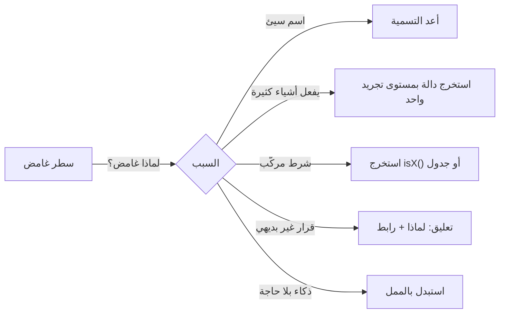

# Module 4.10 — الكود النظيف
## Clean Code: naming, function size & shape, duplication (and when it's OK), side effects, cyclomatic complexity, readability > cleverness

> **المستوى:** Level 4 | **الموقع:** [11 من 16]
> **السابق:** [M4.9 — Design Patterns](module-4.9-design-patterns.md) | **التالي:** [M4.11 — Testing From Zero](module-4.11-testing.md)

---

## 1. المتطلبات
- [ ] الحالة والآثار الجانبية والدوال النقية — [L1-M1.7](../level-1-programming/module-1.7-state-side-effects-immutability.md)
- [ ] الأخطاء كقيم مسمّاة، لا سلاسل — [L1-M1.9](../level-1-programming/module-1.9-errors.md)
- [ ] التماسك والاقتران وإخفاء القرار — [M4.6](module-4.6-abstraction-encapsulation-modularity.md), [M4.7](module-4.7-coupling-cohesion.md)
- [ ] TypeScript: الأنواع كتوثيق، الاتحادات المميّزة — [L1-M1.15](../level-1-programming/module-1.15-typescript-types.md)

## 2. أهداف التعلّم
- تعريف "النظيف" تعريفًا قابلًا للقياس: **الكود يُقرأ أكثر مما يُكتب بعشر مرات**؛ النظيف = أقل وقت لفهمه وتغييره بأمان لشخص غيرك (أو أنت بعد 6 أشهر).
- تطبيق قواعد **التسمية** (تكشف النية، بمستوى التجريد الصحيح، بلا ترميز، متسقة مع المجال)، و**شكل الدوال** (مستوى تجريد واحد، guard clauses، معاملات قليلة، لا أعلام منطقية)، و**الآثار الجانبية** (مفصولة ومُعلنة).
- فهم **التكرار**: متى هو عدوّ (نفس *المعرفة* في مكانين) ومتى هو مقبول أو أفضل (تشابه عرضي، "التجريد الخاطئ أغلى من التكرار").
- قياس **التعقيد الدوري** (cyclomatic complexity) و**عمق التداخل** وتقليلهما؛ وتعريف **القابلية للقراءة فوق الذكاء**.
- استخدام **الأنواع كتوثيق** و**التعليقات للـ"لماذا"** لا "ماذا"؛ وأتمتة الأسلوب (formatter + linter) حتى لا يُناقش في المراجعة.

---

## 3. شرح للمبتدئ

### ما "النظيف" فعلًا
ليس جماليات. كل سطر ستكتبه سيُقرأ عشرات المرات: في المراجعة، في التصحيح، عند إضافة ميزة، عند حادث في الثالثة فجرًا. **التكلفة الحقيقية للكود هي وقت فهمه**، وهذا الوقت يدفعه أشخاص غيرك في الغالب. الكود النظيف = الكود الذي يقلّل هذا الوقت ويقلّل احتمال الخطأ عند تغييره. وبما أن المعيار هو *القارئ*، فالقاعدة الأم: **اكتب للقارئ، لا للمترجم ولا لإعجابك بنفسك.**

### التسمية: 80% من الوضوح
- **تكشف النية**: `d` ✗ → `elapsedDays` ✓؛ `data`/`info`/`item`/`handle`/`process` ✗ (لا تقول شيئًا) → `pendingOrders`, `applyDiscount`.
- **بمستوى التجريد الصحيح**: في المجال `reserveStock` لا `updateProductsTableQty`؛ في الـ repository العكس مقبول.
- **بلا ترميز**: لا `strName`, `IUser`, `userArr`؛ الأنواع يحملها النظام.
- **الاختلاف ذو معنى**: `getUser`/`fetchUser`/`loadUser` معًا = ارتباك؛ اختر فعلًا واحدًا لكل معنى في المشروع (**قاموس المجال** — ubiquitous language): `order`, `line`, `customer` ولا `purchase`/`item`/`client` كمرادفات.
- **الدوال أفعال، القيم أسماء، المنطقيات أسئلة**: `isExpired`, `hasStock`, `canCancel`.
- **الطول يتناسب مع النطاق**: `i` في حلقة 3 أسطر مقبول؛ متغير يعيش 80 سطرًا يحتاج اسمًا كاملًا.
- **الثوابت السحرية مسمّاة**: `if (attempts > 3)` ✗ → `const MAX_PAYMENT_ATTEMPTS = 3`.

### شكل الدوال
- **مستوى تجريد واحد لكل دالة**: دالة تمزج `SELECT` مع قاعدة خصم مع تنسيق JSON تُقرأ بثلاث عقليات. افصل.
- **Guard clauses أولًا، المسار السعيد في النهاية بلا تداخل**: `if (!order) return 404; if (order.status === "shipped") return 409; …` بدل `if (order) { if (status !== shipped) { … } }`.
- **المعاملات**: 0–2 مثالي، 3 مقبول، 4+ = كائن خيارات مسمّى. **لا أعلام منطقية** (`save(user, true)`) — دالتان أو خيار مسمّى.
- **الطول**: ليس رقمًا سحريًا؛ المعيار: هل تُفهم من اسمها وتُرى كاملة بلا تمرير؟ دالة 40 سطرًا خطية ومتماسكة أفضل من 6 دوال بـ 7 أسطر تقفز بينها (M4.6 الضحالة).
- **الأمر أو الاستعلام** (CQS): دالة إما تُرجع قيمة بلا تغيير، أو تغيّر بلا إرجاع مفاجئ. `getUser()` التي تُنشئ المستخدم إن لم يوجد = مفاجأة.
- **الآثار الجانبية مُعلنة ومعزولة**: الحساب نقي (`decideCancel`)، والكتابة/الشبكة في طبقة تنسيق (M4.5). اسم الدالة يُظهر الأثر: `sendEmail` لا `processOrder`.

### التكرار: المعرفة لا الأسطر
DRY تعني **لا تكرّر *المعرفة***: قاعدة الضريبة في مكانين = خطأ مؤجّل. لكن سطرين متشابهين في سياقين مختلفين قد يكونان **تشابهًا عرضيًا** سيفترق غدًا؛ دمجهما في دالة بمعاملات وأعلام ينتج **التجريد الخاطئ** — وهو أغلى من التكرار لأن فكّه لاحقًا مؤلم. قاعدة عملية: **قاعدة الثلاثة** (انتظر التكرار الثالث)، واسأل: "إن تغيّر أحدهما، *يجب* أن يتغير الآخر؟" إن نعم → معرفة واحدة → ادمج. إن لا → اتركهما. وفي الاختبارات التكرار مقبول أكثر (الوضوح أهم من الاختصار).

### التعقيد: قسه
**التعقيد الدوري** = عدد المسارات المستقلة ≈ 1 + عدد `if/else if/for/while/case/&&/||/?:/catch`. دالة بـ 15 = 15 حالة اختبار على الأقل ويستحيل حملها في الرأس. العتبة الشائعة 10؛ الأفضل < 7. **عمق التداخل** ≥ 3 مؤشر أوضح. العلاج: guard clauses، استخراج دالة مسمّاة للشرط المركّب (`if (isEligibleForFreeShipping(order))`)، جدول/Map بدل سلسلة `else if`، استراتيجية (M4.9)، وأنواع تمنع الحالات (`switch` شامل على اتحاد بدل `if` متداخلة على حقول اختيارية).

### القابلية للقراءة فوق الذكاء
`~~x`, `!!x`, `a = b || c && d`, سلسلة `reduce` بـ 5 مستويات، regex بلا اسم، تقنيات "سطر واحد" — كلها توفّر أحرفًا وتكلّف دقائق قراءة. **الكود الممل جيد.** إن احتجت أداءً بتعبير غامض، عزله في دالة مسمّاة مع تعليق "لماذا".

### الأنواع والتعليقات
- الأنواع **توثيق لا يكذب**: `function pay(cents: Cents, method: PaymentMethod): Promise<PaymentResult>` تُغني عن فقرة. الاتحاد المميّز يوثّق الحالات الممكنة.
- التعليقات للـ **لماذا** (قرار، قيد خارجي، حل التفافي لعلّة مكتبة، رابط التذكرة)، لا للـ **ماذا** (الكود يقوله). التعليق الذي يشرح كودًا غامضًا إشارة إلى إعادة التسمية. `// TODO` بلا تذكرة ومالك = كذبة.
- **لا كود ميت** ولا كود معلّق "للرجوع" — Git يتذكر.

### أتمتة ما يمكن أتمتته
Prettier (التنسيق) + ESLint (قواعد: `complexity`, `max-depth`, `max-params`, `no-magic-numbers` بحذر، `@typescript-eslint/no-explicit-any`, `eqeqeq`) + `tsc --strict`. **الأسلوب الذي يُفرض آليًا لا يُناقش في المراجعة** — فتبقى المراجعة للتصميم والصحة (L6-M6.2).

---

## 4. النموذج الذهني

```
   الكود يُقرأ ×10 مما يُكتب  →  حسّن للقارئ:
   أسماء تكشف النية ▸ دالة بمستوى تجريد واحد ▸ guard clauses ▸ آثار جانبية مُعلنة ومعزولة ▸ تعقيد < 7 ▸ عمق < 3
   DRY = لا تكرّر المعرفة (لا الأسطر)؛ التجريد الخاطئ أغلى من التكرار.
   الأنواع للـ"ماذا"، التعليقات للـ"لماذا"، الأدوات للأسلوب.     الكود الممل جيد.
```

---

## 5. الرسم التوضيحي

```
   تعقيد دوري = 1 + القرارات                     بعد guard clauses + استخراج + جدول
   function ship(o) {                             function ship(o) {
     if (o) {                                       if (!o) return err(404);
       if (o.status === "paid") {                   if (o.status !== "paid") return err(409);
         if (o.country === "DZ") {                  if (!isServiceable(o)) return err(422);
           if (o.kg < 30) { ... }                   const fee = FEE_BY_CARRIER[o.carrier] ?? FEE_DEFAULT;
           else { ... }                             return ok(fee);
         } else if (o.country === "FR") {...}     }
         ...                                       // تعقيد ≈ 4، عمق 1، كل سطر يُقرأ وحده
       } else { ... }
     } else { ... }
   }   // تعقيد ≈ 11، عمق 4
```



---

## 6. مثال بسيط

```typescript
// src/naming.ts — قبل/بعد: نفس المنطق، زمن فهم مختلف
// ✗
export function proc(d: any[], f: boolean) { let r = 0; for (const x of d) { if (x.s === 2 && (!f || x.t > Date.now() - 2592000000)) r += x.q * x.p; } return r; }

// ✓
type Line = { status: "pending" | "paid" | "cancelled"; paidAt: number; quantity: number; unitPriceCents: number };
const THIRTY_DAYS_MS = 30 * 24 * 60 * 60 * 1000;
const isPaid = (l: Line) => l.status === "paid";
const paidWithin = (l: Line, windowMs: number, now: number) => l.paidAt > now - windowMs;

export function paidRevenueCents(lines: Line[], opts: { lastThirtyDaysOnly?: boolean; now?: number } = {}): number {
  const now = opts.now ?? Date.now();
  return lines
    .filter(isPaid)
    .filter(l => !opts.lastThirtyDaysOnly || paidWithin(l, THIRTY_DAYS_MS, now))
    .reduce((sum, l) => sum + l.quantity * l.unitPriceCents, 0);
}
// ما تغيّر: أسماء تكشف النية، لا أرقام سحرية (2، 2592000000)، لا علم منطقي بلا اسم، لا any، الزمن قابل للحقن (اختبار)، كل سطر مستوى تجريد واحد
```

---

## 7. مثال كود

refactoring دالة حقيقية "تعمل" بتعقيد عالٍ إلى شكل مقروء، مع **قياس** التعقيد قبل/بعد بأداة صغيرة.

```typescript
// src/complexity.ts — عدّاد تعقيد دوري وعمق تداخل بسيط لكل دالة (تقريبي، يكفي للتنبيه؛ ESLint `complexity` للدقة)
import ts from "typescript"; import { readFileSync } from "node:fs";

const DECISION = new Set([ts.SyntaxKind.IfStatement, ts.SyntaxKind.ForStatement, ts.SyntaxKind.ForOfStatement, ts.SyntaxKind.ForInStatement, ts.SyntaxKind.WhileStatement, ts.SyntaxKind.DoStatement, ts.SyntaxKind.CaseClause, ts.SyntaxKind.ConditionalExpression, ts.SyntaxKind.CatchClause]);
const NESTING = new Set([ts.SyntaxKind.IfStatement, ts.SyntaxKind.ForStatement, ts.SyntaxKind.ForOfStatement, ts.SyntaxKind.WhileStatement, ts.SyntaxKind.SwitchStatement, ts.SyntaxKind.TryStatement]);

export function analyse(file: string) {
  const sf = ts.createSourceFile(file, readFileSync(file, "utf8"), ts.ScriptTarget.Latest, true);
  const out: { name: string; complexity: number; maxDepth: number; lines: number }[] = [];
  const visitFn = (fn: ts.FunctionLikeDeclaration, name: string) => {
    let complexity = 1, maxDepth = 0;
    const walk = (n: ts.Node, depth: number) => {
      if (DECISION.has(n.kind)) complexity++;
      if (ts.isBinaryExpression(n) && (n.operatorToken.kind === ts.SyntaxKind.AmpersandAmpersandToken || n.operatorToken.kind === ts.SyntaxKind.BarBarToken || n.operatorToken.kind === ts.SyntaxKind.QuestionQuestionToken)) complexity++;
      const d = NESTING.has(n.kind) ? depth + 1 : depth; maxDepth = Math.max(maxDepth, d);
      n.forEachChild(c => { if (!ts.isFunctionLike(c)) walk(c, d); });                        // الدوال الداخلية تُحسب وحدها
    };
    if (fn.body) walk(fn.body, 0);
    const { line: a } = sf.getLineAndCharacterOfPosition(fn.getStart()), { line: b } = sf.getLineAndCharacterOfPosition(fn.getEnd());
    out.push({ name, complexity, maxDepth, lines: b - a + 1 });
  };
  sf.forEachChild(function visit(n) {
    if (ts.isFunctionDeclaration(n) && n.name) visitFn(n, n.name.text);
    else if (ts.isVariableDeclaration(n) && n.initializer && ts.isFunctionLike(n.initializer) && ts.isIdentifier(n.name)) visitFn(n.initializer, n.name.text);
    else if (ts.isMethodDeclaration(n) && ts.isIdentifier(n.name)) visitFn(n, n.name.text);
    n.forEachChild(visit);
  });
  return out;
}
if (process.argv[1]?.match(/complexity\.(ts|js)$/)) {
  const rows = process.argv.slice(2).flatMap(analyse).sort((a, b) => b.complexity - a.complexity);
  console.table(rows); const bad = rows.filter(r => r.complexity > 10 || r.maxDepth > 3);
  if (bad.length) { console.log(`✗ ${bad.length} function(s) over budget (complexity > 10 or depth > 3)`); process.exitCode = 1; }
}
```

```typescript
// src/shipping-before.ts — ✗ تعمل. تعقيد 14، عمق 5، أرقام سحرية، علمان منطقيان، آثار جانبية مخفية (console + mutation)
export function shippingBefore(o: any, express: boolean, gift: boolean) {
  let fee = 0;
  if (o) {
    if (o.status === "paid") {
      if (o.country === "DZ") { if (o.weightKg < 1) fee = 400; else if (o.weightKg < 5) fee = 800; else fee = 800 + Math.ceil(o.weightKg - 5) * 150; }
      else if (o.country === "FR" || o.country === "ES") { fee = 2500 + Math.ceil(o.weightKg) * 600; if (o.weightKg > 30) { console.log("too heavy"); return -1; } }
      else { return -2; }
      if (express) fee = fee * 2; if (gift) fee = fee + 300; if (o.total > 20000 && o.country === "DZ" && !express) fee = 0;
      o.fee = fee; return fee;
    } else { return -3; }
  } else { return -4; }
}
```

```typescript
// src/shipping-after.ts — ✓ نفس القواعد: guard clauses، جدول أسعار، نتائج مسمّاة بدل -1/-2، خيارات مسمّاة، لا آثار جانبية
export type Order = { status: "pending" | "paid" | "shipped"; country: string; weightKg: number; totalCents: number };
export type ShippingOptions = { express?: boolean; giftWrap?: boolean };
export type ShippingQuote = { ok: true; feeCents: number } | { ok: false; reason: "not_paid" | "unserviceable_country" | "too_heavy" };

const DZ_TIERS = [{ maxKg: 1, cents: 400 }, { maxKg: 5, cents: 800 }] as const;      // الجدول يحمل المعرفة، لا سلسلة if
const DZ_EXTRA_PER_KG = 150, EU_BASE = 2500, EU_PER_KG = 600, EU_MAX_KG = 30, GIFT_WRAP = 300, DZ_FREE_SHIPPING_MIN = 20_000;
const EU = new Set(["FR", "ES"]);

const dzFee = (kg: number) => DZ_TIERS.find(t => kg < t.maxKg)?.cents ?? 800 + Math.ceil(kg - 5) * DZ_EXTRA_PER_KG;
const euFee = (kg: number) => EU_BASE + Math.ceil(kg) * EU_PER_KG;
const qualifiesForFreeShipping = (o: Order, opts: ShippingOptions) => o.country === "DZ" && o.totalCents > DZ_FREE_SHIPPING_MIN && !opts.express;

export function quoteShipping(o: Order, opts: ShippingOptions = {}): ShippingQuote {
  if (o.status !== "paid") return { ok: false, reason: "not_paid" };
  if (o.country !== "DZ" && !EU.has(o.country)) return { ok: false, reason: "unserviceable_country" };
  if (EU.has(o.country) && o.weightKg > EU_MAX_KG) return { ok: false, reason: "too_heavy" };
  if (qualifiesForFreeShipping(o, opts)) return { ok: true, feeCents: 0 };
  let fee = o.country === "DZ" ? dzFee(o.weightKg) : euFee(o.weightKg);
  if (opts.express) fee *= 2;
  if (opts.giftWrap) fee += GIFT_WRAP;
  return { ok: true, feeCents: fee };
}
// node --import tsx src/complexity.ts src/shipping-before.ts src/shipping-after.ts  → before: complexity 14 / depth 5 ; after: quoteShipping 10 / depth 1 (نفس عدد القرارات تقريبًا — لكنها مسطّحة ومسمّاة وكل سطر يُقرأ وحده)
```

لاحظ ما **لم** نفعله: لم نقسّم `quoteShipping` إلى 8 دوال من سطرين؛ استخرجنا فقط ما له اسم ذو معنى في المجال (`qualifiesForFreeShipping`, `dzFee`). ولاحظ أن `-1/-2/-3` صارت اتحادًا مميّزًا — المترجم الآن يجبر كل مستدعٍ على معالجة الأسباب.

---

## 8. مثال من العالم الحقيقي
دالة `validate(input, mode)` بـ 300 سطر و`mode` بسبع قيم، كُتبت على مدى 3 سنوات. كل إصلاح أدخل خطأً في وضع آخر لأن لا أحد يحمل المسارات الـ 40 في رأسه. التعقيد الدوري المقاس: 47. التفكيك إلى 7 مدقّقات مسمّاة (واحد لكل وضع) + تركيبها بجدول: التعقيد الأقصى 6، وصار كل وضع قابلًا للاختبار وحده، واختفت الأخطاء المتبادلة. لم يتغير سلوك واحد — فقط صار **قابلًا للرؤية**.

## 9. مثال من الإنتاج
الفرق الكبيرة تفرض `complexity` و`max-depth` في ESLint كـ**بوابة CI** لا كتوصية، وتُعفي الكود القديم بقائمة استثناءات تتقلص (ratchet: لا ملف جديد يتجاوز، والقديم لا يسوء). النتيجة بعد سنة: متوسط التعقيد للدوال الجديدة نصف القديمة، وزمن مراجعة PR أقل لأن القارئ لا يصارع الشكل. **ما يُقاس ويُفرض آليًا يتحسن؛ ما يُترك للذوق يتدهور.**

---

## 10. مفاهيم خاطئة شائعة
1. **"الدالة ≤ 5 أسطر دائمًا."** قاعدة ميكانيكية تنتج ضحالة وقفزات؛ المعيار مستوى تجريد واحد واسم صادق.
2. **"DRY = لا سطر مكرر."** DRY عن المعرفة؛ التجريد الخاطئ أسوأ من التكرار.
3. **"التعليقات الكثيرة = كود موثّق."** التعليقات التي تشرح "ماذا" تتقادم وتكذب؛ الأسماء والأنواع لا تكذب. علّق على "لماذا".
4. **"الكود النظيف أبطأ."** نادرًا ما يهم؛ وحين يهم، قِس (L3-M3.8) وعزل التحسين في دالة مسمّاة.
5. **"الأسلوب مسألة ذوق."** جزء منه؛ اجعل الذوق قرارًا مؤتمتًا مرة واحدة ثم انسَه.

## 11. أخطاء شائعة
1. أسماء عامة: `data`, `result`, `temp`, `handle`, `manager`, `util`.
2. أرقام وسلاسل سحرية مبعثرة (`2`, `"paid"`, `86400000`).
3. أعلام منطقية في التوقيع؛ دوال بـ 6 معاملات موضعية.
4. تداخل 4 مستويات بدل guard clauses.
5. دالة `get*` ذات أثر جانبي؛ دالة `process*` تفعل 5 أشياء.
6. `any` للهروب من المترجم؛ `!` بلا سبب موثّق.
7. كود معلّق، `TODO` بلا تذكرة، دوال غير مستخدمة "قد نحتاجها".
8. ذكاء بلا حاجة: تعبيرات مكثّفة، regex بلا اسم، سلاسل اختصارية.

## 12. تمرين تصحيح
خطأ في الإنتاج: عملاء في فرنسا يحصلون على شحن مجاني. الكود هو `shippingBefore`.
- **لاحظ:** الشرط `o.total > 20000 && o.country === "DZ" && !express` يبدو صحيحًا.
- **دليل:** استدعاء في مكان آخر: `shippingBefore(order, false, true)` — لكن المستدعي ظنّ أن الوسيط الثاني هو `gift`؛ وفي مكان ثالث مرّروا `order.total` بالدينار لا بالسنت. وبحث آخر: `o.total` غير معرّف لأن الحقل اسمه `totalCents` في الطلبات الجديدة → `undefined > 20000` false… بينما الحالة الفرنسية جاءت من `fee = fee * 2` حيث `fee` كان 0 لأن `weightKg` كان `undefined` → `Math.ceil(NaN)`… (نعم، `any` يسمح بكل هذا.)
- **فرضية:** ليس خطأً واحدًا بل **بيئة** تسمح بالأخطاء: `any`، أعلام موضعية، حقول غير مُتحقَّقة، أرقام بلا وحدات.
- **تجربة:** حوّل إلى `quoteShipping` بأنواع صارمة وخيارات مسمّاة؛ المترجم يُظهر فورًا كل استدعاء خاطئ (الوسائط الموضعية، الحقل المسمّى خطأ).
- **استنتاج:** النظافة ليست جمالًا: الأنواع والأسماء والخيارات المسمّاة **تمنع فئات كاملة من الأخطاء** قبل التشغيل.

## 13. تمرين معماري
شغّل `complexity.ts` على Project 4 كاملًا. خذ أعلى 3 دوال تعقيدًا واكتب لكل واحدة: ما سبب التعقيد (حالات مجال حقيقية؟ معالجة أخطاء؟ خلط مستويات تجريد؟)، وخطة تخفيضه (guard/جدول/استخراج/اتحاد/استراتيجية) مع ACTRR — بما فيها الحالة التي **تترك فيها الدالة كما هي** لأن التعقيد جوهري ومتماسك. ثم اكتب إعداد ESLint لمشروعك (`complexity: 10`, `max-depth: 3`, `max-params: 3`, `eqeqeq`, `no-explicit-any`) مع آلية ratchet للقديم.

## 14. الصلة بعصر AI
الكود المولَّد غالبًا **نظيف سطحيًا** (تنسيق، أسماء معقولة) لكنه يميل إلى: أعلام منطقية، `any`/`as` للهروب، تكرار بدل استخراج (أو العكس: تجريد مبكر)، وتعليقات تشرح "ماذا". ضع معاييرك في السياق (قاموس المجال، "خيارات مسمّاة، لا أعلام"، "اتحادات مميّزة للنتائج") وشغّل linter/complexity آليًا على مخرجاته. والأهم: الكود الذي ستقرأه أنت لتتحقق منه (L8-M8.7) يجب أن يكون نظيفًا **أكثر** من الذي تكتبه — لأن قراءته هي كل عملك.

## 15–17. Master / Understand / Defer
- 🔴 "يُقرأ ×10"؛ قواعد التسمية وقاموس المجال؛ guard clauses ومستوى تجريد واحد؛ خيارات مسمّاة لا أعلام؛ CQS والآثار الجانبية المُعلنة؛ DRY = معرفة، قاعدة الثلاثة، التجريد الخاطئ؛ التعقيد الدوري والعمق وعلاجهما؛ التعليقات للـ"لماذا"؛ أتمتة الأسلوب.
- 🟠 الأنواع كتوثيق والاتحادات بدل أكواد سحرية؛ ratchet لتحسين القديم تدريجيًا؛ قياس التعقيد آليًا؛ متى يكون التكرار في الاختبارات أفضل.
- ⚪ مقاييس أخرى (Halstead، cognitive complexity تفصيليًا)، أدلة أسلوب شركات بعينها حرفيًا، أدوات تحليل ساكن متقدمة (SonarQube) وتهيئتها.

## 18. الخلاصة
1. النظيف = أقل وقت فهم وتغيير آمن للقارئ؛ الكود يُقرأ أكثر مما يُكتب بكثير.
2. أسماء تكشف النية بقاموس مجال واحد؛ لا أرقام سحرية؛ لا أعلام منطقية.
3. دالة بمستوى تجريد واحد، guard clauses، آثار جانبية مُعلنة ومعزولة، تعقيد < 10 وعمق < 3 — مقاسة.
4. DRY للمعرفة لا للأسطر؛ التجريد الخاطئ أغلى من التكرار؛ انتظر الثالثة.
5. الأنواع للـ"ماذا"، التعليقات للـ"لماذا"، الأدوات للأسلوب؛ والكود الممل جيد.

## 19. مراجع رسمية
- Google TypeScript Style Guide: https://google.github.io/styleguide/tsguide.html
- ESLint — `complexity`, `max-depth`, `max-params` rules: https://eslint.org/docs/latest/rules/complexity
- typescript-eslint — recommended & strict configs: https://typescript-eslint.io/users/configs/
- Thomas McCabe — "A Complexity Measure" (cyclomatic complexity, 1976): https://ieeexplore.ieee.org/document/1702388
- Sandi Metz — "The Wrong Abstraction": https://sandimetz.com/blog/2016/1/20/the-wrong-abstraction

## المصطلحات
| العربية | English |
|---|---|
| كود نظيف | Clean code |
| تسمية تكشف النية | Intention-revealing naming |
| قاموس المجال الموحّد | Ubiquitous language |
| شروط الحراسة | Guard clauses |
| أعلام منطقية | Boolean flags |
| فصل الأمر عن الاستعلام | Command–Query Separation (CQS) |
| لا تكرّر نفسك | DRY (Don't Repeat Yourself) |
| قاعدة الثلاثة | Rule of three |
| التجريد الخاطئ | The wrong abstraction |
| التعقيد الدوري | Cyclomatic complexity |
| عمق التداخل | Nesting depth |
| أرقام سحرية | Magic numbers |
| كود ميت | Dead code |
| منسّق / مدقّق | Formatter / Linter |
| سقف متناقص للقديم | Ratchet |
