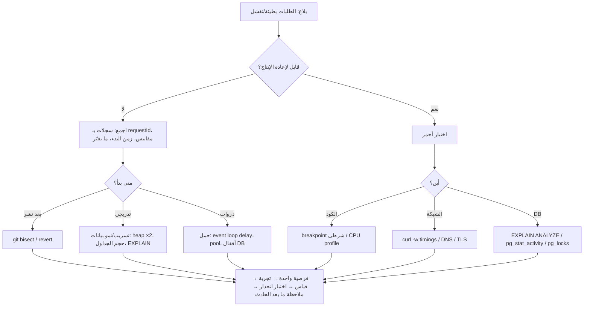

# Module 4.12 — التصحيح بعمق
## Debugging Deeply: stack traces (async!), structured logs, breakpoints & logpoints, CPU/memory profilers, network tools, DB query inspection, bisecting

> **المستوى:** Level 4 | **الموقع:** [13 من 16]
> **السابق:** [M4.11 — Testing](module-4.11-testing.md) | **التالي:** [M4.13 — Refactoring](module-4.13-refactoring.md)

---

## 1. المتطلبات
- [ ] المنهج العلمي للتصحيح: Observe → Evidence → Hypothesis → Experiment → Conclusion — [L1-M1.12](../level-1-programming/module-1.12-debugging.md)
- [ ] الأخطاء والـ stack trace وcause — [L1-M1.9](../level-1-programming/module-1.9-errors.md)
- [ ] حلقة الأحداث، الـ event loop lag، الذاكرة/GC/تسريبات — [L2-M2.7](../level-2-computer-systems/module-2.7-concurrency-event-loop.md), [L2-M2.3](../level-2-computer-systems/module-2.3-memory-stack-heap-gc.md)
- [ ] HTTP بـ curl، TCP/DNS/TLS أخطاؤها — [L2-M2.12](../level-2-computer-systems/module-2.12-http.md), [L2-M2.9](../level-2-computer-systems/module-2.9-tcp-udp.md)
- [ ] `EXPLAIN`، الأقفال، `pg_stat_activity` — [L3-M3.13](../level-3-core-computer-science/module-3.13-indexes.md), [L3-M3.14](../level-3-core-computer-science/module-3.14-transactions-acid.md)
- [ ] `git bisect` كبحث ثنائي — [L3-M3.7](../level-3-core-computer-science/module-3.7-algorithmic-thinking.md)

## 2. أهداف التعلّم
- تطبيق **منهج التصحيح** على مشكلات إنتاجية بلا "تخمين وتعديل": إعادة إنتاج أولًا، تضييق النطاق بالثنائية، تغيير متغير واحد، وتسجيل ما تعلّمت.
- قراءة **stack traces** بما فيها غير المتزامنة (`async` frames، `--enable-source-maps`، `Error.cause`)، وفهم لماذا تُفقد الأطر ومتى.
- كتابة **سجلات منظّمة** (structured logs: JSON بحقول ثابتة + `requestId`/correlation) تجعل الأسئلة قابلة للإجابة بالاستعلام لا بالقراءة.
- استخدام **المصحّح**: `node --inspect`، breakpoints، **conditional breakpoints**، **logpoints**، `debugger`، فحص الإغلاقات — ومتى يكون `console.log` كافيًا.
- **profilers**: `--cpu-prof` لمعرفة أين يذهب الوقت، `--heap-prof`/heap snapshots لتسريبات الذاكرة، `monitorEventLoopDelay` لحجب الحلقة.
- أدوات الشبكة (`curl -v`, `--trace-time`, DevTools Network, `tcpdump` بالاسم) وفحص DB (`EXPLAIN (ANALYZE, BUFFERS)`, `pg_stat_activity`, `pg_locks`, `pg_stat_statements`, `auto_explain`).
- **التنصيف** (bisecting): `git bisect run` على اختبار آلي؛ وتنصيف البيانات/الإعدادات/المدخلات.

---

## 3. شرح للمبتدئ

### التصحيح العميق = نفس المنهج، أدوات أقوى، وانضباط أشد
في L1 تعلّمت: **لاحظ** (ما السلوك بالضبط؟) → **دليل** (ما الذي أراه فعلًا، لا ما أظنه؟) → **فرضية** واحدة قابلة للدحض → **تجربة** تغيّر شيئًا واحدًا → **استنتاج** مكتوب. الفرق في الإنتاج: المشكلة لا تحدث على جهازك، تحدث مرة كل 1000 طلب، في الثالثة فجرًا، وتختفي عند إعادة التشغيل. لذلك تحتاج: (1) **إعادة الإنتاج** كأولوية مطلقة (اختبار أحمر، أو حمل مصطنع، أو نفس البيانات)، (2) **أدلة من النظام الحي** (سجلات، مقاييس، لقطات) لأنك لا تستطيع إيقافه تحت المصحّح، (3) **تضييق ثنائي**: أي نصف المسار/الإصدارات/البيانات يحوي الخطأ؟، (4) **انضباط التوثيق**: ماذا جرّبت وماذا استبعدت — لأن التصحيح الطويل ينسى.

### اقرأ الـ stack trace كاملًا — خاصة غير المتزامن
- السطر الأول: النوع والرسالة. الأطر من الأعلى (مكان الرمي) إلى الأسفل (من استدعى). ابحث عن **أول إطار في كودك** لا في `node_modules`.
- **async**: V8 يحفظ أطر `await` ("async stack traces") — إن رأيت `at async createOrder (…)` فأنت ترى سلسلة الانتظار. **تُفقد** عند: callbacks القديمة، `setTimeout`، `EventEmitter`، `.then()` بلا await في منتصف السلسلة، و`new Promise` يدوية. العلاج: `await` كل شيء، و**`Error.cause`**: عند إعادة الرمي من طبقة أعلى `throw new AppError("order failed", { cause: e })` فتحتفظ بالسلسلة كاملة.
- TypeScript: شغّل بـ `--enable-source-maps` (أو tsx يفعلها) وإلا فالأرقام تشير إلى JS المترجم.
- `Error.captureStackTrace`/`Error.stackTraceLimit = 50` عندما تحتاج أعمق من 10 أطر.
- أخطاء بلا stack مفيد (`ECONNRESET` من عمق libuv، `unhandledRejection`): ابحث عن **السياق** (أي طلب؟ أي مضيف؟) من السجل المنظّم لا من الـ trace.

### السجلات المنظّمة: اجعل الأسئلة استعلامات
`console.log("user logged in " + id)` لا يُستعلم. السجل المنظّم: سطر JSON بحقول ثابتة: `{"ts","level","msg","requestId","userId","route","durationMs","err":{"name","message","stack","code"}}`. مع **requestId** واحد يُولَّد عند دخول الطلب ويُمرَّر لكل سجل وكل استدعاء خارجي (رأس `x-request-id`) تستطيع سؤال النظام: "أرني كل ما حدث لهذا الطلب الفاشل عبر كل الطبقات" — هذا هو أساس التتبّع الموزّع في L6-M6.6. قواعد: مستويات (`debug/info/warn/error`) بمعنى ثابت؛ **لا بيانات حساسة** (كلمات مرور، رموز، بطاقات)؛ لا سجل داخل حلقات ساخنة (الأداء)؛ الأخطاء بـ stack كاملًا؛ **سجّل القرار لا الخطوة** ("رُفض الطلب: مخزون غير كافٍ productId=7 have=0 want=2" يُجيب عن السؤال وحده). مكتبة: `pino` (سريعة، JSON) — المثال في §7 يبني الأساس بيدك لتفهمها.

### المصحّح التفاعلي
`node --inspect-brk --import tsx src/index.ts` → افتح `chrome://inspect` أو VS Code (`"type":"node","request":"attach"`). ما يتفوّق به على `console.log`: **conditional breakpoint** (توقّف فقط عندما `orderId === "o_123"` — مستحيل عمليًا بالطباعة عند 1000 طلب/ث)، **logpoint** (طباعة بلا تعديل الكود ولا إعادة التشغيل)، فحص **الإغلاقات** والـ `this`، **تعديل القيم** حيًّا وتكرار الدالة، وتوقّف عند **الاستثناءات غير الملتقطة** (pause on uncaught exceptions — يُظهر الحالة لحظة الانفجار بدل بعدها). `debugger;` في الكود = breakpoint مبرمج. متى يكفي `console.log`؟ عندما تعرف أين تنظر وتحتاج قيمة أو اثنتين — ولا بأس، لكن احذفها قبل الـ commit (linter: `no-console`).

### Profilers: لا تخمّن أين الوقت/الذاكرة
- **CPU**: `node --cpu-prof src/index.ts` (أو `--cpu-prof-dir`) → ملف `.cpuprofile` يُفتح في DevTools → Performance/JavaScript Profiler: **flame chart** (ما يستدعي ماذا وكم) و**bottom-up** (أثقل الدوال ذاتيًا). ابحث عن: دالة واحدة تأكل 40% (خوارزمية L3)، JSON.parse/stringify ضخمة، regex (ReDoS L3-M3.8)، `JSON` في حلقة، GC كثيف (علامة ضغط ذاكرة).
- **الذاكرة**: تسريب = heap يرتفع بين GCs ولا يعود. `--heap-prof` للتخصيصات، أو **heap snapshot** مرتين (قبل/بعد N طلب) ومقارنة: ما الذي زاد عدده؟ (Map تكبر، listeners تتراكم، closures تحتفظ بـ buffers). `process.memoryUsage()` في السجل كل دقيقة أرخص إنذار مبكر. `--heapsnapshot-signal=SIGUSR2` لأخذ لقطة من عملية حية.
- **حلقة الأحداث**: `perf_hooks.monitorEventLoopDelay` — p99 > 100ms = شيء يحجب (L2-M2.7): حساب ثقيل، `JSON.parse` لـ 50MB، `fs.*Sync`، regex. اكتشف من بـ CPU profile.
- قاعدة ذهبية: **قِس في ظروف شبيهة بالإنتاج** (بيانات بحجمه، `NODE_ENV=production`)؛ وprofile = **فرضية بالأدلة**، ثم تجربة، ثم قياس بعدي.

### الشبكة
`curl -v` (الرؤوس، إعادة التوجيه، TLS handshake)، `curl -w "@fmt.txt"` بـ `time_namelookup/time_connect/time_appconnect/time_starttransfer/time_total` لتفكيك زمن الطلب إلى DNS/TCP/TLS/خادم/نقل (L2-M2.12 "الزمن = جولات × RTT")، `--resolve host:443:IP` لتجاوز DNS، `-H "x-request-id: dbg-1"` لربط السجل. DevTools Network: Waterfall، Timing، "Disable cache"، throttling. `dig`/`nslookup` لـ DNS، `openssl s_client -connect host:443 -servername host` لـ TLS، `ss -tlnp`/`lsof -i :3000` لمن يستمع (L0-M0.5)، `tcpdump`/Wireshark بالاسم لما تحت HTTP.

### قاعدة البيانات
الأسئلة الأربعة وأدواتها: **ما الذي يعمل الآن ومنذ متى؟** `SELECT pid, now()-query_start AS age, state, wait_event_type, left(query,80) FROM pg_stat_activity WHERE state <> 'idle' ORDER BY age DESC;` — **من ينتظر من؟** `pg_locks` + `pg_blocking_pids(pid)` — **أي استعلام يأكل الوقت إجمالًا؟** امتداد `pg_stat_statements` (`total_exec_time`, `calls`, `mean_exec_time`) — **لماذا هذا الاستعلام بطيء؟** `EXPLAIN (ANALYZE, BUFFERS)` (L3-M3.13). و`auto_explain` يسجّل خطة أي استعلام تجاوز N ms تلقائيًا في سجل الخادم — أعظم أداة تصحيح DB في الإنتاج. تذكّر: الاستعلام "البطيء" أحيانًا ينتظر قفلًا لا يحسب (`wait_event_type = Lock`).

### التنصيف
"كان يعمل الأسبوع الماضي": `git bisect start; git bisect bad; git bisect good v1.4.0; git bisect run node --import tsx --test src/x.test.ts` → log₂(200 commit) = 8 خطوات آلية تجد الـ commit المسبّب (البحث الثنائي على التاريخ، L3-M3.7 — يتطلب اختبارًا يعيد الإنتاج). نفس الفكرة على **البيانات** (أي نصف ملف الإدخال يُسقط المحلّل؟)، **الإعدادات** (أي متغير بيئة؟)، **الطلبات** (أي رأس؟)، **التبعيات** (أي ترقية في `package-lock` — `npm ls`، تثبيت إصدار إصدارًا).

---

## 4. النموذج الذهني

```
   لاحظ ▸ أعد الإنتاج (اختبار أحمر/حمل/بيانات) ▸ دليل من النظام (سجل منظّم بـ requestId، مقاييس، لقطة، خطة)
   ▸ ضيّق ثنائيًا (نصف المسار/التاريخ/البيانات) ▸ فرضية واحدة ▸ تجربة بمتغير واحد ▸ استنتاج مكتوب ▸ اختبار يمنع العودة

   أداة لكل سؤال:  أين انفجر؟ stack (+cause +async)   ماذا حدث لهذا الطلب؟ سجل منظّم   أين الوقت؟ CPU profile
                   أين الذاكرة؟ heap snapshot ×2        ما الذي يحجب؟ event loop delay    لماذا بطيء في DB؟ EXPLAIN / pg_stat_activity / locks
                   أين على الشبكة؟ curl -w timings      متى بدأ؟ git bisect run
```

---

## 5. الرسم التوضيحي



```
   تفكيك زمن طلب HTTP بـ curl (-w):
   namelookup 0.012 │ connect 0.041 │ appconnect(TLS) 0.118 │ starttransfer 1.930 │ total 1.945
        DNS 12ms        TCP 29ms          TLS 77ms            الخادم 1.81s ←── هنا المشكلة (DB؟ حلقة محجوبة؟)   النقل 15ms
```

---

## 6. مثال بسيط

```typescript
// src/async-trace.ts — لماذا يختفي السياق من الـ stack، وكيف يعود بـ await + cause
async function fetchPrice(id: number): Promise<number> { if (id === 0) throw new Error("price not found"); return id * 100; }

// ✗ 1) .then بلا await في المنتصف + إعادة رمي تمسح الأصل
export function totalV1(ids: number[]) { return Promise.all(ids.map(id => fetchPrice(id))).then(ps => ps.reduce((a, b) => a + b, 0)).catch(() => { throw new Error("total failed"); }); }
// ✓ 2) await في كل طبقة + cause: الـ trace يحمل السلسلة كاملة والأصل محفوظ
export async function totalV2(ids: number[]) {
  try { const ps = await Promise.all(ids.map(id => fetchPrice(id))); return ps.reduce((a, b) => a + b, 0); }
  catch (e) { throw new Error(`total failed for ids=${JSON.stringify(ids)}`, { cause: e }); }           // السياق (أي ids) + السبب الأصلي
}
if (process.argv[1]?.match(/async-trace\.(ts|js)$/)) {
  await totalV1([1, 0]).catch(e => console.log("V1:", e.message, "| cause:", e.cause ?? "(lost)"));
  await totalV2([1, 0]).catch(e => { console.log("V2:", e.message, "| cause:", (e.cause as Error).message); console.log((e.cause as Error).stack?.split("\n").slice(0, 3).join("\n")); });
  // V2 يُظهر: total failed for ids=[1,0] | cause: price not found  + إطار fetchPrice ومكان استدعائه. (أطر "at async fn" تظهر عندما يمرّ الخطأ عبر await فعلي في دالة async — جرّب: await fetchPrice(0) مباشرة داخل totalV2)
}
```

---

## 7. مثال كود

```typescript
// src/logger.ts — سجل منظّم بيدك (60 سطرًا تشرح ما يفعله pino): JSON، حقول ثابتة، requestId عبر AsyncLocalStorage، أخطاء بـ stack وcause، تنقيح الحساس
import { AsyncLocalStorage } from "node:async_hooks";
type Level = "debug" | "info" | "warn" | "error"; const ORDER: Record<Level, number> = { debug: 10, info: 20, warn: 30, error: 40 };
const ctx = new AsyncLocalStorage<{ requestId: string; userId?: string }>();          // السياق يتبع الطلب عبر كل await بلا تمرير يدوي
const REDACT = new Set(["password", "token", "authorization", "card", "secret"]);

const serializeErr = (e: unknown): unknown => e instanceof Error ? { name: e.name, message: e.message, stack: e.stack, code: (e as { code?: string }).code, cause: e.cause ? serializeErr(e.cause) : undefined } : e;
const redact = (o: Record<string, unknown>) => Object.fromEntries(Object.entries(o).map(([k, v]) => [k, REDACT.has(k.toLowerCase()) ? "[REDACTED]" : v]));

export function makeLogger(opts: { level?: Level; out?: (line: string) => void } = {}) {
  const min = ORDER[opts.level ?? (process.env.LOG_LEVEL as Level) ?? "info"], out = opts.out ?? (l => process.stdout.write(l + "\n"));
  const log = (level: Level, msg: string, fields: Record<string, unknown> = {}) => {
    if (ORDER[level] < min) return;
    const { err, ...rest } = fields;
    out(JSON.stringify({ ts: new Date().toISOString(), level, msg, ...ctx.getStore(), ...redact(rest), ...(err !== undefined ? { err: serializeErr(err) } : {}) }));
  };
  return { debug: log.bind(null, "debug"), info: log.bind(null, "info"), warn: log.bind(null, "warn"), error: log.bind(null, "error"),
           runWithRequest<T>(requestId: string, fn: () => T, userId?: string) { return ctx.run({ requestId, userId }, fn); } };
}
export const log = makeLogger();
```

```typescript
// src/debug-server.ts — خادم فيه ثلاث علل مزروعة (بطء DB وهمي، حجب الحلقة، تسريب) + الأدوات التي تكشف كلًّا منها
import { createServer } from "node:http"; import { randomUUID } from "node:crypto"; import { monitorEventLoopDelay } from "node:perf_hooks";
import { log } from "./logger.js";

const leak: Buffer[] = [];                                                              // علّة 3: "cache" بلا حدّ (L3-M3.3 LRU كان الحل)
const h = monitorEventLoopDelay({ resolution: 10 }); h.enable();
setInterval(() => { const m = process.memoryUsage(); log.info("health", { loopP99Ms: +(h.percentiles.get(99)! / 1e6).toFixed(1), heapMB: +(m.heapUsed / 1048576).toFixed(0), rss: +(m.rss / 1048576).toFixed(0) }); h.reset(); }, 5000).unref();   // إنذار مبكر رخيص

export const server = createServer((req, res) => {
  const requestId = (req.headers["x-request-id"] as string) ?? randomUUID(); const t = performance.now();
  log.runWithRequest(requestId, async () => {
    res.setHeader("x-request-id", requestId);
    try {
      if (req.url === "/slow")  await new Promise(r => setTimeout(r, 800));            // علّة 1: "DB" بطيء → يظهر في durationMs لا في CPU profile (انتظار، ليس عملًا)
      if (req.url === "/block") { const s = performance.now(); while (performance.now() - s < 300) {} }   // علّة 2: يحجب الحلقة → loopP99Ms يقفز وكل الطلبات الأخرى تتأخر
      if (req.url === "/leak")  leak.push(Buffer.alloc(5 * 1048576));                  // علّة 3: heapMB/rss يرتفعان ولا يعودان
      if (req.url === "/boom")  throw Object.assign(new Error("inventory service timeout"), { code: "ETIMEDOUT" });
      res.writeHead(200, { "content-type": "application/json" }); res.end(JSON.stringify({ ok: true }));
      log.info("request", { route: req.url, status: 200, durationMs: +(performance.now() - t).toFixed(1) });
    } catch (e) {
      res.writeHead(502); res.end();
      log.error("request failed", { route: req.url, status: 502, durationMs: +(performance.now() - t).toFixed(1), err: new Error("handler failed", { cause: e }), password: "should-not-leak" });
    }
  });
});
if (process.argv[1]?.match(/debug-server\.(ts|js)$/)) server.listen(3000, "127.0.0.1", () => log.info("listening", { port: 3000 }));
```

```bash
# جلسة تصحيح نموذجية (كل أمر يجيب عن سؤال واحد)
node --import tsx src/debug-server.ts | tee server.log &            # السجل JSON → قابل للاستعلام
curl -s -H 'x-request-id: dbg-1' localhost:3000/boom; grep dbg-1 server.log | jq '.err.cause.code, .password'   # "ETIMEDOUT", "[REDACTED]" — السياق كاملًا بسطر
curl -s -o /dev/null -w 'dns %{time_namelookup} tcp %{time_connect} ttfb %{time_starttransfer} total %{time_total}\n' localhost:3000/slow   # ttfb ≈ 0.8 → الخادم ينتظر شيئًا
for i in 1 2 3; do curl -s localhost:3000/block & done; wait; grep health server.log | tail -1 | jq .loopP99Ms      # p99 ≈ 300ms → حجب
for i in $(seq 20); do curl -s localhost:3000/leak >/dev/null; done; grep health server.log | jq -c '[.heapMB,.rss]' | tail -3   # يرتفع ولا يعود → تسريب
node --cpu-prof --cpu-prof-dir=prof --import tsx src/debug-server.ts   # ثم حمّل /block واضغط Ctrl+C → prof/*.cpuprofile → DevTools: Performance → Load → الدالة المجهولة بـ while تتصدّر bottom-up
node --inspect-brk --import tsx src/debug-server.ts                    # chrome://inspect → breakpoint شرطي على `req.url === "/boom"` → افحص الإغلاق
git bisect start && git bisect bad && git bisect good v1.4.0 && git bisect run node --import tsx --test src/orders.test.ts   # من أدخل الخطأ؟ 8 خطوات لـ 200 commit
```

```sql
-- فحص DB أثناء الحادث (psql على الإنتاج بصلاحية قراءة)
SELECT pid, now() - query_start AS age, state, wait_event_type, wait_event, left(query, 90) AS q
FROM pg_stat_activity WHERE state <> 'idle' AND pid <> pg_backend_pid() ORDER BY age DESC LIMIT 20;       -- من يعمل ومنذ متى، ومن ينتظر قفلًا
SELECT pid, pg_blocking_pids(pid) AS blocked_by, left(query, 60) FROM pg_stat_activity WHERE cardinality(pg_blocking_pids(pid)) > 0;   -- سلسلة الانتظار
SELECT calls, round(mean_exec_time) AS mean_ms, round(total_exec_time) AS total_ms, left(query, 80) FROM pg_stat_statements ORDER BY total_exec_time DESC LIMIT 10;   -- CREATE EXTENSION pg_stat_statements
-- auto_explain في postgresql.conf: shared_preload_libraries='auto_explain'; auto_explain.log_min_duration='200ms'; auto_explain.log_analyze=on  → الخطط البطيئة تُسجَّل وحدها
```

---

## 8. مثال من العالم الحقيقي
"API بطيء منذ الصباح". بلا منهج: إعادة تشغيل (يتحسّن دقيقة ثم يعود)، ثم "زيادة الخوادم". بالمنهج: السجل المنظّم يُظهر `durationMs` مرتفعًا في مسار واحد فقط؛ `pg_stat_activity` يُظهر 30 اتصالًا في `wait_event_type = Lock`؛ `pg_blocking_pids` يشير إلى معاملة واحدة عمرها 40 دقيقة: سكربت تقارير فتح `BEGIN` ونسي `COMMIT` ويحمل قفلًا على `orders`. `pg_terminate_backend(pid)` أنهى الحادث في 10 ثوانٍ؛ والإصلاح الدائم: `idle_in_transaction_session_timeout` + `statement_timeout` (L3-M3.14 المهل التنازلية). الخوادم الإضافية كانت ستزيد المنتظرين فقط.

## 9. مثال من الإنتاج
تسريب ذاكرة يُسقط العملية كل 6 ساعات (OOM killer، L2-M2.4). الفريق أضاف إعادة تشغيل كل 4 ساعات ("حل"). المهندس: `heapMB` في سجل الصحة يرتفع خطيًا مع عدد الطلبات؛ heap snapshot عند 10 دقائق و60 دقيقة ومقارنة: `(closure)` × 40,000 تحتفظ بـ `Buffer` — مستمع `on("data")` يُضاف لكل طلب على `EventEmitter` عالمي ولا يُزال (التحذير `MaxListenersExceededWarning` كان في السجل منذ شهور ولم يقرأه أحد). سطر `off()` واحد. **الأداة أرخص من الحل الالتفافي، والسجل كان يصرخ.**

---

## 10. مفاهيم خاطئة شائعة
1. **"المصحّح للمبتدئين؛ المحترف يستخدم console.log."** العكس أقرب: breakpoint شرطي وlogpoint يفعلان في دقيقة ما يأخذ ساعة طباعة وإعادة تشغيل. استخدم الاثنين بحسب السؤال.
2. **"أعد التشغيل وتابع."** إعادة التشغيل تمحو الدليل (الذاكرة، الاتصالات، الحالة). خذ لقطة/سجلًا أولًا إن أمكن، ثم أعد التشغيل.
3. **"الـ profiler للتحسين فقط."** هو أسرع طريقة لمعرفة *ماذا يفعل البرنامج فعلًا* — حتى للأخطاء المنطقية (لماذا تُستدعى هذه الدالة 10k مرة؟).
4. **"Stack trace غير المتزامن غير موثوق."** موثوق إن استخدمت `await` باتساق و`cause` عند إعادة الرمي.
5. **"المزيد من السجلات أفضل."** السجل غير المنظّم بكثرة ضجيج يُخفي الإشارة ويكلّف مالًا؛ القليل المنظّم بالحقول الصحيحة يُجيب عن الأسئلة.

## 11. أخطاء شائعة
1. تغيير شيئين في تجربة واحدة ثم عدم معرفة أيهما أثّر.
2. `catch (e) { throw new Error("failed") }` — يمحو السبب والسياق؛ استخدم `cause`.
3. تسجيل كلمات مرور/رموز/بطاقات؛ أو تسجيل الكائن كاملًا (`JSON.stringify(req)`) فيدخل الحساس عرضًا.
4. قياس الأداء على بيانات صغيرة أو في وضع التطوير.
5. إصلاح العرض لا السبب (`try/catch` يبتلع، retry بلا فهم، `setTimeout` "ليُعطي وقتًا").
6. تخطّي اختبار الانحدار بعد الإصلاح → الخطأ يعود بعد شهرين بوجه آخر.
7. التصحيح لساعات بلا كتابة ما جُرِّب؛ أو بلا طلب عين ثانية بعد 45 دقيقة من الدوران.

## 12. تمرين تصحيح
الإنتاج: 2% من `POST /orders` تعيد 500 منذ أمس؛ لا تظهر محليًا؛ الـ trace في السجل: `TypeError: Cannot read properties of undefined (reading 'price_cents')` بإطار واحد داخل `node_modules`.
1. **لاحظ/دليل:** السجل المنظّم: كل الفاشلة تحمل `productIds` تضمّ منتجًا أُنشئ بعد أمس الساعة 14:00. أمس 14:00 = نشر migration "soft delete للمنتجات" (`deleted_at`).
2. **أعد الإنتاج:** اختبار تكامل: منتج بـ `deleted_at IS NOT NULL` في طلب → ينفجر. أحمر.
3. **ضيّق:** `git bisect run` على الاختبار → الـ commit الذي أضاف `AND deleted_at IS NULL` إلى `pricesFor` دون تغيير `byId.get(id)!` (L3-M3.14 كان يرمي `unknown product`؛ أحدهم استبدله بـ `!`).
4. **لماذا الإطار في node_modules؟** `.map` داخل مكتبة؛ الإطار الخاص بكودنا ضاع لأن الدالة callback بلا await — `--enable-source-maps` + `Error.stackTraceLimit = 30` يُظهرانه.
5. **الإصلاح:** رفض صريح `RangeError("unknown or deleted product")` → 422 + اختبار الانحدار + سؤال المنتج: هل الطلب على منتج محذوف 422 أم نحتفظ بالسعر الأخير؟ (متطلب غائب، M4.2.)

## 13. تمرين معماري
صمّم **قابلية التصحيح** (debuggability) لـ Project 5 كمتطلب غير وظيفي: ما الحقول الإلزامية في كل سجل؟ كيف يُولَّد `requestId` ويُمرَّر إلى DB (`SET application_name`/تعليق SQL `/* req:… */`) وإلى الخدمات الخارجية؟ ما سجل الصحة الدوري (heap، loop p99، pool waiting)؟ أي مهل (`statement_timeout`, `idle_in_transaction_session_timeout`, `lock_timeout`) وأي امتدادات (`pg_stat_statements`, `auto_explain`) تُفعَّل من اليوم الأول؟ كيف تأخذ heap snapshot من عملية حية بأمان؟ وما سياسة التنقيح؟ ACTRR على تكلفة السجلات مقابل زمن التشخيص.

## 14. الصلة بعصر AI
AI مساعد قوي في **تفسير** الأدلة: الصق stack trace أو خطة `EXPLAIN` أو نتيجة profile واطلب فرضيات مرتّبة — ممتاز. لكنه **لا يملك الدليل**: لا يرى سجلاتك ولا DB ولا الحمل؛ فإن أعطيته العرض فقط ("API بطيء") أعطاك قائمة عامة. المنهج يبقى لك: إعادة الإنتاج والقياس والتجربة بمتغير واحد. وحذارِ من "إصلاحات" مولَّدة تعالج العرض (`try/catch`، retry، `?.` في كل مكان) — اسأل دائمًا: ما السبب الجذري الذي يفسّر **كل** الأدلة؟ (L8-M8.8 failure modes.)

## 15–17. Master / Understand / Defer
- 🔴 المنهج + إعادة الإنتاج أولًا + متغير واحد + توثيق؛ قراءة stack غير متزامن و`cause`؛ سجل منظّم بـ requestId وتنقيح؛ breakpoint شرطي/logpoint؛ CPU profile لقراءة flame/bottom-up؛ heap snapshot ×2؛ event loop delay؛ `curl -w` timings؛ `pg_stat_activity`/`pg_blocking_pids`/`EXPLAIN ANALYZE`؛ `git bisect run`؛ اختبار انحدار بعد كل إصلاح.
- 🟠 `AsyncLocalStorage` للسياق؛ `pg_stat_statements`/`auto_explain`؛ `--heap-prof`، `--heapsnapshot-signal`؛ تنصيف البيانات/الإعدادات/التبعيات؛ لماذا تُفقد الأطر؛ قابلية التصحيح كمتطلب.
- ⚪ `tcpdump`/Wireshark تفصيليًا، `perf`/eBPF على مستوى النظام، تصحيح الـ core dumps، أدوات APM التجارية (تأتي كمفهوم في L6-M6.6)، تصحيح WebAssembly/native addons.

## 18. الخلاصة
1. نفس المنهج العلمي، بانضباط أشد: أعد الإنتاج، اجمع الدليل من النظام الحي، ضيّق ثنائيًا، غيّر متغيرًا واحدًا، وثّق، واكتب اختبار انحدار.
2. الـ stack يُقرأ كاملًا؛ `await` باتساق و`Error.cause` يحفظان السلسلة؛ `--enable-source-maps`.
3. السجل المنظّم بـ requestId يحوّل "ماذا حدث؟" إلى استعلام؛ بلا بيانات حساسة؛ سجّل القرار.
4. لكل سؤال أداة: breakpoint شرطي، CPU profile، heap snapshot ×2، event loop delay، `curl -w`، `pg_stat_activity`/locks/`EXPLAIN`، `git bisect run`.
5. لا تعالج العرض؛ السبب الجذري يفسّر كل الأدلة — وإعادة التشغيل تمحو الدليل.

## 19. مراجع رسمية
- Node.js — Debugging Guide (`--inspect`, Chrome DevTools, VS Code): https://nodejs.org/en/learn/getting-started/debugging
- Node.js — CLI: `--cpu-prof`, `--heap-prof`, `--heapsnapshot-signal`, `--enable-source-maps`: https://nodejs.org/api/cli.html
- Node.js — `AsyncLocalStorage` (request context): https://nodejs.org/api/async_context.html
- PostgreSQL — `pg_stat_activity`, `pg_stat_statements`, `auto_explain`: https://www.postgresql.org/docs/current/monitoring-stats.html , https://www.postgresql.org/docs/current/pgstatstatements.html , https://www.postgresql.org/docs/current/auto-explain.html
- Git — `git bisect run`: https://git-scm.com/docs/git-bisect#_bisect_run
- curl — `--write-out` timing variables: https://curl.se/docs/manpage.html#-w

## المصطلحات
| العربية | English |
|---|---|
| تتبّع المكدس (غير المتزامن) | (Async) stack trace |
| سبب الخطأ المتسلسل | Error cause |
| سجل منظّم | Structured logging |
| معرّف الطلب / الارتباط | Request ID / Correlation ID |
| نقطة توقف شرطية / نقطة تسجيل | Conditional breakpoint / Logpoint |
| محلّل الأداء (CPU/ذاكرة) | Profiler (CPU / heap) |
| مخطط اللهب | Flame chart |
| لقطة الكومة | Heap snapshot |
| تأخّر حلقة الأحداث | Event loop delay/lag |
| التنصيف | Bisecting |
| اختبار انحدار | Regression test |
| تنقيح البيانات الحساسة | Redaction |
| قابلية التصحيح | Debuggability |
