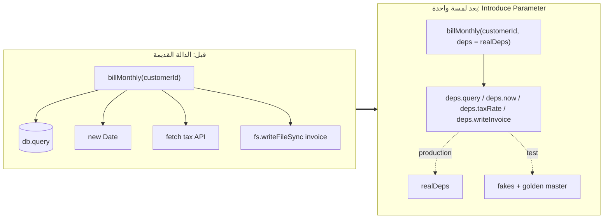
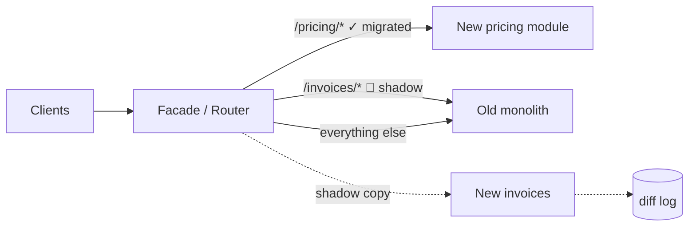

# Module 4.14 — العمل مع الكود القديم
## Legacy Code: archaeology, seams, characterization & golden-master tests, strangler fig, why rewrites fail

> **المستوى:** Level 4 | **الموقع:** [15 من 16]
> **السابق:** [M4.13 — Refactoring](module-4.13-refactoring.md) | **التالي:** [M4.15 — Technical Debt](module-4.15-tech-debt.md)

---

## 1. المتطلبات
- [ ] إعادة الهيكلة المنضبطة واختبارات التوصيف — [M4.13](module-4.13-refactoring.md)
- [ ] الاقتران، رسم الاستيراد، الاقتران بالتغيير من git — [M4.7](module-4.7-coupling-cohesion.md)
- [ ] الحقن كمعامل، المنافذ، fake > mock — [M4.8](module-4.8-solid.md), [M4.11](module-4.11-testing.md)
- [ ] `git log`/`blame`/`bisect` — [L1-M1.14](../level-1-programming/module-1.14-git-2.md), [M4.12](module-4.12-debugging-deeply.md)
- [ ] expand → migrate → contract — [L3-M3.12](../level-3-core-computer-science/module-3.12-database-design.md)

## 2. أهداف التعلّم
- تعريف الكود القديم (legacy) تعريفًا عمليًا: **كود بلا اختبارات** (Feathers) و/أو كود فقد مَن يفهمه — بغض النظر عن عمره.
- إجراء **أركيولوجيا الكود**: من git (`shortlog`, `log --stat`, النقاط الساخنة = تكرار التغيير × التعقيد، الاقتران بالتغيير)، ومن الإنتاج (أي مسارات تُستدعى فعلًا؟)، ومن الناس (مَن يعرف؟ ماذا يخشى؟).
- إيجاد/صنع **الدرزات** (seams): نقاط يمكن تغيير السلوك عندها دون تعديل المكان نفسه — لوضع الكود تحت الاختبار بأقل لمسة (Extract & Override / Parameterize Constructor / Introduce Parameter / Wrap Function).
- كتابة **اختبارات توصيف** و**golden master** (تسجيل المخرجات الحقيقية ومقارنتها) لتثبيت السلوك الحالي قبل أي تغيير.
- تطبيق **Strangler Fig**: استبدال تدريجي خلف واجهة، مع **shadow traffic/diff** للتحقق، ومفاتيح تبديل للعودة.
- شرح لماذا تفشل عمليات **إعادة الكتابة الكبرى** غالبًا، ومتى تكون مبرّرة فعلًا.

---

## 3. شرح للمبتدئ

### ما "القديم" حقًا؟
ليس العمر. Michael Feathers: **"Legacy code is code without tests"** — لأن بلا اختبارات لا تستطيع تغييره بثقة، فيتجمّد، فيتراكم عليه الالتفاف، فيصبح أسوأ. أضف بُعدًا ثانيًا: **المعرفة** — كود كُتب العام الماضي بواسطة شخص غادر وبلا توثيق هو legacy أكثر من كود عمره 10 سنوات له اختبارات وفريق يفهمه. الكود القديم غالبًا **يعمل** — وهذه نقطة مهمة: كل `if` غريب فيه هو على الأرجح **درس مدفوع الثمن** من حادث قديم (سياج Chesterton: لا تُزل سياجًا قبل أن تعرف لماذا بُني). مهمتك ليست الحكم عليه، بل **استعادة القدرة على تغييره بأمان**.

### أركيولوجيا: افهم قبل أن تلمس
1. **git هو ذاكرة الفريق.** `git shortlog -sn -- src/billing` (من كتب؟ هل بقي؟)، `git log --format='%h %ad %s' --date=short -- file` (تاريخ القرارات)، `git log -S "retry" -- src` (متى دخل هذا المفهوم؟)، `git blame -w -C -M` (الأصل الحقيقي للسطر متجاوزًا إعادة التنسيق والنقل). رسائل الـ commit والـ PRs المرتبطة هي **وثيقة التصميم الوحيدة** غالبًا.
2. **النقاط الساخنة** (hotspots — Adam Tornhill): الملفات التي **تتغيّر كثيرًا** × **معقّدة**. هي أين يعيش الدين الفعلي وأين تستحق كل ساعة اختبار/إعادة هيكلة؛ 5% من الملفات تحمل 50%+ من التغييرات عادة. الملف المعقّد الذي لم يُلمس منذ عامين — **اتركه**.
3. **الاقتران بالتغيير** (M4.7 awk): ملفات تتغيّر معًا دائمًا دون استيراد بينها = معرفة مكرّرة/تبعية خفية (ثابت منسوخ، صيغة مكرّرة، عقد ضمني).
4. **الإنتاج يخبرك ما يُستخدم فعلًا**: سجّل الدخول إلى الدوال/المسارات المشكوك فيها لأسبوع (`log.info("legacy_path_hit", { fn })`) — ثلث الكود القديم غالبًا **ميت** ولا يحتاج إلا حذفًا (أرخص إعادة هيكلة).
5. **الناس**: ساعة مع أقدم عضو تساوي أسبوع قراءة. اسأل: "ما الذي تخشى تغييره؟ لماذا؟ أي حادث علّمكم هذا الـ if؟"

### الدرزات (Seams): كيف تضع كودًا غير قابل للاختبار تحت الاختبار
المشكلة النموذجية: دالة تستدعي `new Date()`, `db.query`, `fetch`, `fs.readFileSync`, كائنات عالمية، و`process.env` مباشرة — لا يمكن تشغيلها في اختبار دون شبكة وDB وساعة حقيقية. **الدرزة** = مكان يمكنك فيه **تبديل السلوك دون تعديل ذلك المكان**. حركات Feathers الأهم بلغة TS:
- **Introduce Parameter / Parameterize Function**: `function bill(order)` → `function bill(order, deps = { now: () => new Date(), query: db.query })` — المستدعون القدامى لا يتغيّرون (قيمة افتراضية)، والاختبار يحقن fakes. أصغر لمسة وأكثرها شيوعًا. (هذا DI = معامل من M4.8.)
- **Extract & Override** (في الأصناف): انقل الاستدعاء الخارجي إلى method محمية، وفي الاختبار صنف فرعي يتجاوزها.
- **Wrap Function/Method** (Sprout): لا تلمس القديمة؛ اكتب الجديدة التي تستدعيها وتضيف السلوك، واختبر الجديدة. أو **Sprout Method**: السلوك الجديد في دالة جديدة مختبرة يستدعيها سطر واحد في القديمة.
- **Link/Module seam**: استبدال وحدة كاملة عبر import map/`--import` loader أو حقن على مستوى composition root (M4.9) — آخر الحلول، لأن السحر الخفي.
- **Adapter حول العالمي**: `const clock = { now: () => Date.now() }` كوحدة واحدة يستوردها الجميع؛ الاختبار يستبدل `clock.now` — خطوة انتقالية مقبولة نحو الحقن الحقيقي.
القاعدة: **اللمسة الأولى بلا اختبارات يجب أن تكون أصغر ما يمكن وأكثرها ميكانيكية** (Rename/Introduce Parameter بالـ IDE)، ثم تأتي الاختبارات، ثم كل شيء آخر.

### التوصيف وGolden Master
**اختبار التوصيف** (M4.13): تكتب `assert.equal(fn(input), ???)`، تشغّل، تنسخ المخرج الفعلي إلى الاختبار — **حتى لو كان غريبًا**. أنت لا تختبر الصحة، تختبر **الثبات**: "ما لم يتغيّر". **Golden master** هو التوصيف على نطاق واسع: شغّل الكود على مئات/آلاف المدخلات الحقيقية (من سجلات الإنتاج منقّحة، أو مولّد عشوائي بـ seed ثابت كما في M4.11)، احفظ المخرجات في ملف `golden/*.json` تحت Git، وبعد كل خطوة إعادة هيكلة قارن. أي اختلاف = إما كسرت السلوك أو اكتشفت bug قديمًا — في الحالتين **قرار واعٍ** (حدّث الـ golden بـ commit منفصل مع شرح). مناسب جدًا لـ: محرّكات التسعير، المحلّلات، مولّدات التقارير/الفواتير، أي دالة "مدخل → مخرج" معقّدة. حدوده: لا يغطي الآثار الجانبية ولا التزامن، ويحتاج تنقيح البيانات الحساسة.

### Strangler Fig: الاستبدال التدريجي
بدل إيقاف القديم وتشغيل الجديد يوم "التحوّل الكبير"، ضع **واجهة/وكيلًا** أمام القديم، وحوّل إليه الميزات **مسارًا مسارًا**: الجديد يعالج `/v2/pricing` بينما القديم يعالج الباقي، حتى يُطوَّق القديم (كالشجرة الخانقة التي تنمو حول المضيف حتى يختفي). أدوات التحقق: **shadow traffic** (أرسل الطلب للاثنين، أعد جواب القديم، سجّل الفرق — صفر مخاطر على المستخدم)، **canary** (1% من المستخدمين على الجديد)، **feature flag** للعودة فورًا. يُطبّق على الدوال داخل monolith (الـ adapter في M4.13 Step 5 كان strangler مصغّرًا) كما على الخدمات (L7-M7.9). الشرط: **حدود واضحة** للمسار المنقول وبيانات مشتركة محكومة (مَن المالك؟ L3-M3.12).

### لماذا تفشل إعادة الكتابة الكبرى؟
Joel Spolsky: "أسوأ خطأ استراتيجي" — لأن (1) القديم يحوي **آلاف الإصلاحات المدفونة** التي ستُعاد اكتشافها بالحوادث؛ (2) خلال 12 شهرًا من الكتابة الجديدة يجب أن يبقى القديم يتطوّر → **هدف متحرّك** وفريقان؛ (3) Second-system effect: الجديد يُحمَّل بكل ما تمنّاه الجميع؛ (4) لا قيمة تُسلَّم حتى النهاية — والنهاية تتأخّر دائمًا (M4.4: التقدير توزيع). **متى تكون مبرّرة؟** تقنية ميتة فعلًا لا يمكن توظيف من يعرفها/لا تعمل على بيئة مدعومة؛ أو النطاق صغير ومحدود بواجهة واضحة (أعد كتابة *وحدة* لا نظامًا — بواجهة ثابتة وgolden master = strangler على مستوى الوحدة). القاعدة الآمنة: **أعد الكتابة بالتجزئة خلف واجهات، لا بالجملة.**

---

## 4. النموذج الذهني

```
   افهم ─▶ ثبّت ─▶ درزة ─▶ اختبر ─▶ غيّر ─▶ كرّر
   git/hotspots/people   golden master   Introduce Parameter   توصيف أخضر   خطوة M4.13   (ثم الميزة)

   أين أبدأ؟  النقاط الساخنة (تتغيّر كثيرًا × معقّدة)  — لا الأقبح، ولا الأقدم
   كيف أبدأ؟  أصغر لمسة ميكانيكية تفتح درزة، ثم الاختبارات، ثم الباقي
   كيف أستبدل؟  Strangler: واجهة أمام القديم → مسار مسارًا → shadow/canary/flag → القديم يختفي
```

---

## 5. الرسم التوضيحي





---

## 6. مثال بسيط

```typescript
// src/seam.ts — من "غير قابل للاختبار" إلى "تحت الاختبار" بلمسة واحدة لا تغيّر أي مستدعٍ
// ✗ قبل: تاريخ حقيقي + env + طباعة — الاختبار يعتمد على اليوم الذي يُشغَّل فيه
export function isTrialExpiredLegacy(startedAtIso: string): boolean {
  const days = Number(process.env.TRIAL_DAYS ?? 14);
  const expired = Date.now() - new Date(startedAtIso).getTime() > days * 86_400_000;
  if (expired) console.log("trial expired for", startedAtIso);
  return expired;
}
// ✓ بعد: Introduce Parameter بقيمة افتراضية = الدرزة. المستدعون القدامى: isTrialExpired(iso) — بلا تغيير. الاختبار: يحقن ساعة ومدّة ومسجّلًا صامتًا.
export type TrialDeps = { now: () => number; trialDays: number; log: (msg: string) => void };
export const realTrialDeps = (): TrialDeps => ({ now: Date.now, trialDays: Number(process.env.TRIAL_DAYS ?? 14), log: console.log });
export function isTrialExpired(startedAtIso: string, deps: TrialDeps = realTrialDeps()): boolean {
  const expired = deps.now() - new Date(startedAtIso).getTime() > deps.trialDays * 86_400_000;
  if (expired) deps.log(`trial expired for ${startedAtIso}`);
  return expired;
}
// اختبار توصيف (يسجّل السلوك الحالي، بما فيه الحدّ: "أكبر من" لا "أكبر أو يساوي"):
//   const deps = { now: () => Date.UTC(2026,0,15), trialDays: 14, log: () => {} };
//   isTrialExpired("2026-01-01T00:00:00Z", deps) === false   // 14 يومًا بالضبط → غير منتهٍ (سلوك حالي؛ هل هو المقصود؟ تذكرة، لا تغيير صامت)
//   isTrialExpired("2025-12-31T23:59:59Z", deps) === true
```

---

## 7. مثال كود

```typescript
// src/legacy-invoice.ts — "الوحش": مولّد فواتير قديم بلا اختبارات، منطق متشابك، حالات خاصة تاريخية (كلها دروس مدفوعة!)
/* eslint-disable @typescript-eslint/no-explicit-any */
export function generateInvoiceLegacy(cust: any, items: any[], opts: any): string {
  let sub = 0, lines = "";
  for (let i = 0; i < items.length; i++) {
    const it = items[i]; let p = it.price * it.qty;
    if (cust.tier === "gold" && it.cat !== "service") p = p * 0.9;                                 // 2019: خصم الذهبي لا يشمل الخدمات (شكوى قانونية)
    if (it.cat === "legacy-plan" && cust.since < 2018) p = Math.min(p, 999);                       // 2020: سقف سعري لعملاء ما قبل 2018 (وعد تسويقي قديم)
    if (opts && opts.coupon === "LAUNCH10" && i === 0) p = p - 10;                                  // 2021: كوبون الإطلاق يُطبّق على أول سطر فقط (bug صار ميزة يعتمد عليها التقرير)
    p = Math.round(p * 100) / 100; sub += p;
    lines += it.name + " x" + it.qty + "  " + p.toFixed(2) + "\n";
  }
  let tax = cust.country === "DZ" ? sub * 0.19 : cust.country === "FR" ? sub * 0.2 : 0;
  if (cust.taxExempt) tax = 0;
  if (cust.country === "DZ" && sub > 100000) tax = Math.round(tax);                                  // 2022: حادث تقريب مع ضريبة كبيرة
  const total = Math.round((sub + tax) * 100) / 100;
  return "INVOICE " + (opts && opts.id ? opts.id : "N/A") + "\n" + lines + "SUB " + sub.toFixed(2) + "\nTAX " + tax.toFixed(2) + "\nTOTAL " + total.toFixed(2) + "\n";
}
```

```typescript
// src/golden.ts — golden master: مولّد مدخلات حتمي (seeded) + تسجيل/مقارنة. يعمل على أي دالة مدخل→مخرج
import { readFileSync, writeFileSync, existsSync, mkdirSync } from "node:fs"; import { join } from "node:path";
import { generateInvoiceLegacy } from "./legacy-invoice.js";

export function lcg(seed: number) { let s = seed >>> 0; return () => (s = (1664525 * s + 1013904223) >>> 0) / 2 ** 32; }   // نفس M4.11
const pick = <T>(r: () => number, xs: readonly T[]) => xs[Math.floor(r() * xs.length)]!;
export function genCase(r: () => number) {
  const n = 1 + Math.floor(r() * 4);
  return {
    cust: { tier: pick(r, ["gold", "silver", "none"]), since: 2015 + Math.floor(r() * 10), country: pick(r, ["DZ", "FR", "US"]), taxExempt: r() < 0.1 },
    items: Array.from({ length: n }, (_, i) => ({ name: `item${i}`, cat: pick(r, ["goods", "service", "legacy-plan"]), qty: 1 + Math.floor(r() * 3), price: Math.round(r() * 200000) / 100 })),
    opts: r() < 0.3 ? { coupon: "LAUNCH10", id: `INV-${Math.floor(r() * 1000)}` } : r() < 0.5 ? null : { id: "X" },
  };
}
export function runGolden(fn: (c: any, i: any[], o: any) => string, { seed = 42, count = 500, dir = "golden", name = "invoice" } = {}) {
  const r = lcg(seed); const outputs = Array.from({ length: count }, () => { const c = genCase(r); try { return fn(c.cust, c.items, c.opts); } catch (e) { return `THROWS ${(e as Error).name}: ${(e as Error).message}`; } });
  const file = join(dir, `${name}.${seed}.json`);
  if (!existsSync(file)) { mkdirSync(dir, { recursive: true }); writeFileSync(file, JSON.stringify(outputs, null, 1)); return { recorded: count, diffs: [] as number[] }; }   // المرة الأولى: تسجيل (commit الملف!)
  const golden: string[] = JSON.parse(readFileSync(file, "utf8"));
  const diffs = outputs.flatMap((o, i) => o === golden[i] ? [] : [i]);
  return { recorded: 0, diffs };
}
if (process.argv[1]?.match(/golden\.(ts|js)$/)) {
  const res = runGolden(generateInvoiceLegacy);
  if (res.recorded) console.log(`recorded ${res.recorded} golden outputs`);
  else if (res.diffs.length) { console.error(`✗ ${res.diffs.length} outputs differ from golden master (first: case #${res.diffs[0]})`); process.exit(1); }
  else console.log("✓ golden master matches");
}
```

```typescript
// src/invoice-v2.ts — الاستبدال التدريجي (strangler داخل الوحدة): نكتب الجديد خطوة خطوة ونقارنه بالـ golden master، لا نحذف القديم حتى يطابقه
export type Customer = { tier: "gold" | "silver" | "none"; since: number; country: string; taxExempt?: boolean };
export type Item = { name: string; cat: "goods" | "service" | "legacy-plan"; qty: number; price: number };
export type InvoiceOpts = { coupon?: string; id?: string } | null | undefined;
const round2 = (n: number) => Math.round(n * 100) / 100;
const TAX_RATE: Record<string, number> = { DZ: 0.19, FR: 0.2 };

function linePrice(cust: Customer, it: Item, index: number, opts: InvoiceOpts): number {       // كل "درس تاريخي" صار سطرًا مسمّى — والـ golden يضمن أننا لم نفقد أيًّا منها
  let p = it.price * it.qty;
  if (cust.tier === "gold" && it.cat !== "service") p *= 0.9;                                 // gold discount excludes services (legal, 2019)
  if (it.cat === "legacy-plan" && cust.since < 2018) p = Math.min(p, 999);                    // grandfathered price cap (marketing promise, 2020)
  if (opts?.coupon === "LAUNCH10" && index === 0) p -= 10;                                     // LAUNCH10 applies to first line only (reports depend on it, 2021)
  return round2(p);
}
function taxFor(cust: Customer, subtotal: number): number {
  if (cust.taxExempt) return 0;
  const tax = subtotal * (TAX_RATE[cust.country] ?? 0);
  return cust.country === "DZ" && subtotal > 100000 ? Math.round(tax) : tax;                   // large-DZ rounding incident (2022)
}
export function generateInvoice(cust: Customer, items: Item[], opts: InvoiceOpts): string {
  const priced = items.map((it, i) => ({ it, p: linePrice(cust, it, i, opts) }));
  const sub = priced.reduce((s, x) => s + x.p, 0);
  const tax = taxFor(cust, sub); const total = round2(sub + tax);
  const lines = priced.map(({ it, p }) => `${it.name} x${it.qty}  ${p.toFixed(2)}\n`).join("");
  return `INVOICE ${opts?.id ?? "N/A"}\n${lines}SUB ${sub.toFixed(2)}\nTAX ${tax.toFixed(2)}\nTOTAL ${total.toFixed(2)}\n`;
}
```

```typescript
// src/strangler.test.ts — الجديد يجب أن يطابق golden master القديم تمامًا قبل أن يُوجَّه إليه أي مستخدم
import { test } from "node:test"; import assert from "node:assert/strict";
import { runGolden } from "./golden.js"; import { generateInvoiceLegacy } from "./legacy-invoice.js"; import { generateInvoice } from "./invoice-v2.js";
import { mkdtempSync } from "node:fs"; import { tmpdir } from "node:os";

test("golden master: legacy is stable against itself (records on first run)", () => {
  const dir = mkdtempSync(`${tmpdir()}/golden-`);
  assert.equal(runGolden(generateInvoiceLegacy, { dir }).recorded, 500);
  assert.deepEqual(runGolden(generateInvoiceLegacy, { dir }).diffs, []);
});
test("strangler: v2 matches legacy golden master on 500 generated cases (seed 42) and 500 more (seed 7)", () => {
  const dir = mkdtempSync(`${tmpdir()}/golden-`);
  for (const seed of [42, 7]) { runGolden(generateInvoiceLegacy, { dir, seed }); assert.deepEqual(runGolden(generateInvoice as never, { dir, seed }).diffs, [], `seed ${seed}`); }
});
```

```bash
# أركيولوجيا بـ git وحده (شغّلها على Project 4 أو أي repo)
git shortlog -sn --since="1 year" -- src | head                       # من يعرف هذا الجزء؟ (وهل ما زال هنا؟)
git log --format='%h %ad %an %s' --date=short -S "LAUNCH10" -- src    # متى وُلد هذا الاستثناء ولماذا (اقرأ الـ commit/PR)
git log --since="1 year" --name-only --format= -- src | sort | uniq -c | sort -rn | head -15 > /tmp/churn.txt      # تكرار التغيير
node --import tsx src/complexity.ts $(awk '{print $2}' /tmp/churn.txt | grep '\.ts$')                               # × التعقيد (M4.10) = النقاط الساخنة
git log --since="1 year" --name-only --format='--' -- src | awk '...'  # الاقتران بالتغيير (M4.7 §7)
node --import tsx src/golden.ts && git add golden && git commit -m "test(invoice): record golden master (500 cases, seed 42)"
node --import tsx --test src/strangler.test.ts                        # 2 pass → يمكن توجيه 1% (canary) إلى v2 خلف flag
```

---

## 8. مثال من العالم الحقيقي
محرّك عمولات لمنصة توصيل: 1,400 سطر، كاتبه غادر، 12 `if` لا يفهمها أحد، وطلب جديد "عمولة مختلفة أيام الجمعة". الفريق: (1) أركيولوجيا يومين: `git log -S` ربط 9 من الـ 12 شرطًا بحوادث/عقود موثّقة في تذاكر قديمة — صارت تعليقات *لماذا*؛ 3 لم يُعرف أصلها → **سجّل الدخول إليها** أسبوعًا: اثنان لم يُستدعيا قط (حُذفا بعد شهر مراقبة)، الثالث يُستدعى لعميل واحد (سُئل العميل!). (2) golden master من 20,000 طلب حقيقي منقّح. (3) Introduce Parameter للساعة والأسعار. (4) 15 commit إعادة هيكلة. (5) ميزة الجمعة = 6 أسطر. الزمن الإجمالي أسبوعان؛ تقدير الـ rewrite كان 4 أشهر "على الأقل".

## 9. مثال من الإنتاج
بنك يستبدل نظام تحويلات قديمًا (COBOL-era منطق مترجم إلى Java ثم Node). Strangler على 18 شهرًا: واجهة API أمام القديم من اليوم الأول؛ **shadow mode** 3 أشهر لكل مسار (الجديد يحسب، القديم يُجيب، الفرق يُسجَّل) كشف 40 اختلافًا — 31 كانت أخطاء في فهم الفريق للقواعد (أُصلحت في الجديد) و9 أخطاء حقيقية في القديم (قرار صريح مع الامتثال: نُصلحها في الجديد ونوثّق). ثم canary 1% → 10% → 50% → 100% لكل مسار بمفتاح عودة. لم يحدث "يوم تحوّل"؛ وآخر مسار قديم أُطفئ دون أن يلاحظ أحد. المشروع الموازي بالـ big-bang في بنك آخر أُلغي بعد عامين.

---

## 10. مفاهيم خاطئة شائعة
1. **"الكود القديم سيئ لأن كاتبيه كانوا سيئين."** غالبًا كُتب تحت قيود مختلفة ومتطلبات تغيّرت 100 مرة؛ الغرابة فيه دروس. تواضع أولًا، ثم أدوات.
2. **"اختبارات التوصيف تُكرّس الأخطاء."** تُثبّت *الحاضر* لتستطيع التغيير؛ كل غرابة تجدها تصير تذكرة بقرار واعٍ — أفضل من "إصلاحها" خلسة وكسر تقرير يعتمد عليها.
3. **"نحتاج فهم كل شيء قبل البدء."** تحتاج فهم ما ستلمسه + golden master يحرس الباقي. الفهم الكامل لا يأتي إلا بالعمل.
4. **"إعادة الكتابة ستكون أنظف وأسرع."** أنظف يوم 1؛ وبعد إعادة اكتشاف كل الاستثناءات تصبح مثل القديم مع أخطاء جديدة — إن وصلت.
5. **"Strangler للخدمات المصغّرة فقط."** يعمل على مستوى دالة/وحدة/مسار داخل monolith؛ الفكرة هي *الواجهة أمام القديم والتحويل التدريجي*.

## 11. أخطاء شائعة
1. البدء بأقبح ملف بدل أسخن ملف (تغيّر × تعقيد).
2. "إصلاح" غرابة أثناء وضع الاختبارات (تغيير سلوك متنكّر).
3. golden master من بيانات مصطنعة "نظيفة" لا تمرّ بالاستثناءات التاريخية → تغطية وهمية؛ استخدم بيانات حقيقية منقّحة أو مولّدًا يُنتج الحالات القذرة.
4. درزة كبيرة (إعادة بناء الصنف كله) بدل Introduce Parameter.
5. تشغيل shadow traffic بآثار جانبية (الجديد يرسل بريدًا/يكتب في DB مرتين) — الجديد في shadow يجب أن يكون **بلا آثار** أو بآثار معزولة.
6. حذف القديم فور "100% على الجديد" بلا فترة مراقبة ومفتاح عودة.
7. عدم تسجيل الدخول إلى الكود المشكوك في موته قبل حذفه؛ أو الاحتفاظ بالكود الميت "احتياطًا" (Git هو الاحتياط).

## 12. تمرين تصحيح
بعد تحويل 10% من المستخدمين إلى `generateInvoice` v2، شكوى: فاتورة واحدة بفارق 0.01 عن القديم، رغم أن golden master بـ 1000 حالة كان متطابقًا.
1. **دليل:** السجل يُظهر الحالة: 3 عناصر، كلها `service`، العميل gold، DZ، subtotal 100000.005.
2. **فرضية:** القديم يجمع `sub += p` حيث `p` مقرّب لكل سطر — والجديد كذلك (`reduce` على `round2`)... لكن القديم يحسب `tax` من `sub` ثم `total = round2(sub + tax)`؛ الجديد نفسه. أين الفرق؟ `tax` في القديم: `cust.country === "DZ" && sub > 100000` — نعم في الاثنين. **التجربة:** شغّل الاثنين على الحالة: متطابقان! إذًا الفرق ليس في الحساب.
3. **عُد إلى الدليل:** الفاتورة القديمة طُبعت من *خادم آخر* بإصدار أقدم من `generateInvoiceLegacy` (قبل commit 2022 لتقريب الضريبة!) — أسطول غير متجانس. golden master كان صحيحًا؛ **المرجع** نفسه لم يكن واحدًا.
4. **الدرس:** قبل strangler تأكد أن "القديم" إصدار واحد منشور في كل مكان (M4.1 CD)؛ وسجّل إصدار الكود في كل مخرج (`x-app-version`/حقل في السجل، L6-M6.6).

## 13. تمرين معماري
اعتبر Project 4 "كودًا قديمًا" ورثته اليوم. (1) أركيولوجيا: شغّل أوامر §7 bash على repo الخاص بك — ما أسخن 3 ملفات؟ هل تتطابق مع حدسك؟ (2) اختر أسخن مسار كتابة (غالبًا `POST /orders`) وحدّد الدرزات: أين `new Date()`/`pool.query`/`process.env`/`fetch`؟ اكتب خطة "Introduce Parameter" بأقل لمسة. (3) golden master: مولّد حتمي لطلبات HTTP (seed) يُسجّل الاستجابات (status+body منقّح من ids/timestamps) — ما الذي يجب تثبيته في المخرجات ليبقى الملف حتميًا؟ (4) خطة strangler لنقل منطق الطلبات إلى use case + ports (M4.5) خلف flag، مع shadow diff في السجل. (5) ACTRR: ما خطر نقل منطق المعاملات (L3-M3.14) إلى الجديد؟ هذه الخطة تصبح جزءًا من دفتر الديون في M4.15.

## 14. الصلة بعصر AI
AI **ممتاز في الأركيولوجيا**: "اشرح هذه الدالة"، "ما الحالات الخاصة وما الذي قد يبرّرها؟"، "ولّد 50 حالة اختبار توصيف تغطي كل فرع" (راجعها: هل تُثبّت السلوك الفعلي؟ شغّلها وانسخ المخرج الفعلي لا المتوقّع). وخطير في **"حدّث هذا الكود القديم"** بالجملة: يُسقط الاستثناءات التاريخية بثقة لأنها "تبدو غير منطقية" — بالضبط سياج Chesterton. النمط الآمن في L8: golden master بيدك أولًا، ثم اطلب من AI خطوة strangler واحدة، ثم `runGolden` — الـ golden master هو حَكَمك على مخرجات AI كما على مخرجاتك. وفي قواعد الكود العملاقة، أدوات التحويل الآلي (codemods بـ ts-morph/jscodeshift) + AI لكتابتها تجعل الترحيلات الواسعة (API قديمة → جديدة في 2,000 ملف) ممكنة — تحت نفس شبكة الأمان.

## 15–17. Master / Understand / Defer
- 🔴 تعريف legacy = بلا اختبارات/بلا معرفة؛ سياج Chesterton؛ أركيولوجيا git (shortlog/log -S/blame -w -C) والنقاط الساخنة (تغيّر × تعقيد)؛ Introduce Parameter بقيمة افتراضية كدرزة؛ اختبار التوصيف وgolden master حتمي بـ seed؛ الدورة افهم→ثبّت→درزة→اختبر→غيّر؛ لماذا تفشل rewrites؛ strangler بواجهة + flag.
- 🟠 Sprout/Wrap، Extract & Override، adapter حول العالمي، link seams؛ shadow traffic/canary وشروطهما (بلا آثار جانبية)؛ تسجيل الدخول للكود المشكوك في موته؛ تنقيح بيانات golden؛ قرار "غرابة = تذكرة".
- ⚪ أدوات تحليل سلوكي للكود (CodeScene)، codemods بـ ts-morph/jscodeshift، ترحيل لغات/منصّات، Strangler على مستوى الخدمات بتفاصيله (L7-M7.9)، Approval Tests frameworks.

## 18. الخلاصة
1. legacy = كود لا تستطيع تغييره بثقة (بلا اختبارات/معرفة)؛ وغرابته دروس مدفوعة — افهم قبل أن تلمس (git، النقاط الساخنة، الإنتاج، الناس).
2. ضع الكود تحت الاختبار بأصغر لمسة ميكانيكية (درزة: Introduce Parameter)، ثم توصيف/golden master يثبّت الحاضر، ثم إعادة هيكلة M4.13.
3. استبدل تدريجيًا خلف واجهة (strangler) بـ shadow/canary/flag — لا big-bang؛ rewrites الكبرى تفشل لأن المعرفة مدفونة في الاستثناءات.
4. ركّز الجهد حيث التغيير يحدث (hotspots)؛ احذف الميت بعد مراقبة؛ كل غرابة تجدها = قرار موثّق لا إصلاح خفي.
5. golden master هو الحَكَم المحايد — على عملك وعلى عمل AI.

## 19. مراجع رسمية
- Michael Feathers — *Working Effectively with Legacy Code* (seams, characterization tests): https://www.oreilly.com/library/view/working-effectively-with/0131177052/
- Martin Fowler — Strangler Fig Application: https://martinfowler.com/bliki/StranglerFigApplication.html
- Adam Tornhill — Hotspots / behavioral code analysis (*Your Code as a Crime Scene*): https://pragprog.com/titles/atcrime2/your-code-as-a-crime-scene-second-edition/
- Joel Spolsky — Things You Should Never Do, Part I (rewrites): https://www.joelonsoftware.com/2000/04/06/things-you-should-never-do-part-i/
- Git — `git blame -w -C -M`, `git log -S`: https://git-scm.com/docs/git-blame , https://git-scm.com/docs/git-log#Documentation/git-log.txt--Sltstringgt
- Approval/Golden-master testing: https://approvaltests.com/

## المصطلحات
| العربية | English |
|---|---|
| كود قديم/موروث | Legacy code |
| أركيولوجيا الكود | Code archaeology |
| نقطة ساخنة | Hotspot |
| درزة | Seam |
| إدخال معامل | Introduce Parameter |
| إنبات دالة / تغليف دالة | Sprout Method / Wrap Method |
| اختبار توصيف | Characterization test |
| المرجع الذهبي | Golden master |
| التين الخانق (استبدال تدريجي) | Strangler Fig |
| حركة ظل | Shadow traffic |
| نشر كناري | Canary release |
| مفتاح ميزة | Feature flag |
| سياج تشسترتون | Chesterton's fence |
| إعادة كتابة كبرى | Big-bang rewrite |
| كود ميت | Dead code |
