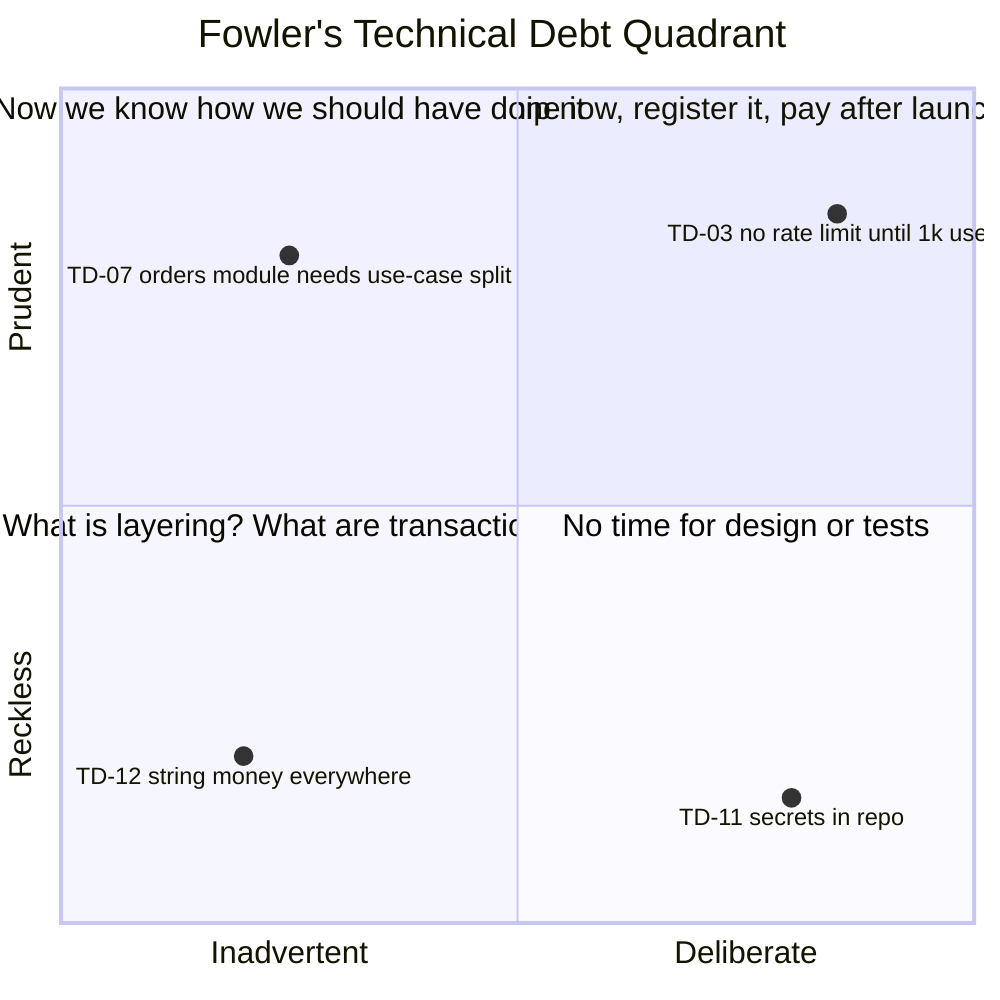

# Module 4.15 — الدين التقني
## Technical Debt: debt vs bad code, deliberate vs accidental, interest, a debt register, paying down strategically

> **المستوى:** Level 4 | **الموقع:** [16 من 16]
> **السابق:** [M4.14 — Legacy Code](module-4.14-legacy-code.md) | **التالي:** [Checkpoint 4](checkpoint-4.md)

---

## 1. المتطلبات
- [ ] الأبعاد الستة بعد "يعمل" وجدول قرارات/نواقص Project 4 — [M4.0 §13](module-4.0-cs-vs-se.md)
- [ ] التقدير كتوزيع، وتكلفة التأخير — [M4.4](module-4.4-estimation.md)
- [ ] النقاط الساخنة (تغيّر × تعقيد)، التوصيف، strangler — [M4.14](module-4.14-legacy-code.md)
- [ ] إعادة الهيكلة التحضيرية وقاعدة الكشّاف — [M4.13](module-4.13-refactoring.md)
- [ ] `complexity.ts`، `import-graph.ts`، سكربت الاقتران بالتغيير — [M4.10](module-4.10-clean-code.md), [M4.7](module-4.7-coupling-cohesion.md)

## 2. أهداف التعلّم
- تعريف الدين التقني بالاستعارة الأصلية (Ward Cunningham) **وبدقّة**: اختصار **واعٍ** اليوم مقابل **فائدة** تُدفع في كل تغيير لاحق — وتمييزه عن الكود السيئ والخلل والميزة الناقصة.
- تصنيف الدين بـ **رباعية Fowler** (متعمّد/عرضي × حكيم/متهوّر) وبأنواعه (كود، تصميم، اختبار، بنية تحتية، توثيق، معرفة، تبعيات) ومعرفة أيها خطير.
- **قياس الفائدة**: زمن إضافي لكل تغيير × تكرار التغيير (hotspot) + تكلفة الحوادث المتوقّعة + تكلفة الفرصة — وبناء **سجل دين** (debt register) مرتّب بذلك.
- اتخاذ قرار السداد **استراتيجيًا**: ما يُسدَّد (ساخن وفائدته عالية)، ما يُدار (مستقر: اترك)، ما يُشطب (كود سيُحذف)، ومتى الاقتراض **صحيح**.
- تخصيص **ميزانية** (نسبة سعة مستمرة + تحضير قبل الميزات + سداد مرتبط بالحوادث) والتواصل مع غير المهندسين بلغة **المخاطر والزمن والمال**، لا "الكود قبيح".
- إغلاق Level 4 بتحويل جدول Project 4 (M4.0 §13) إلى **أول سجل دين** يصبح مدخل Project 5.

---

## 3. شرح للمبتدئ

### الاستعارة ولماذا هي دقيقة
Ward Cunningham (1992): شحن كود بفهم ناقص للمشكلة يشبه **الاقتراض**: يسرّعك اليوم، لكن كل عمل لاحق على ذلك الكود يدفع **فائدة** (وقت إضافي، أخطاء، خوف)، وإن لم تُسدِّد (تعيد الهيكلة بما تعلّمت) تتضخّم الفائدة حتى تستهلك كل السعة — **الإفلاس التقني**: الفريق كله يدفع فوائد ولا يبني شيئًا. الاستعارة دقيقة في ثلاثة: الاقتراض **قد يكون قرارًا صحيحًا** (الشركات الناجحة تقترض لتنمو — إصدار أسرع للسوق قبل منافس)، **الفائدة تُدفع فقط على ما تلمسه** (دين في كود لا يتغيّر = قرض بلا فائدة؛ اتركه)، و**الأصل** يُسدَّد بإعادة الهيكلة/الاختبارات/التوثيق لا بالندم.

### ما ليس دينًا
- **الكود السيئ/الفوضى** (mess): ليس قرارًا، هو إهمال — لا "ربح" قابضناه مقابله. يُصلَح بالانضباط (M4.10–4.13) لا بـ"خطة سداد".
- **الخلل** (bug): سلوك خاطئ → تذكرة إصلاح، لا دين.
- **الميزة الناقصة**: نطاق، لا دين — إلا إن كانت *مخاطرة مؤجَّلة واعية* (مثلًا "لا rate limiting حتى 1,000 مستخدم" = دين موثّق).
- **التقادم الطبيعي** (bit rot): التبعيات والمنصّة تتحرّك ولو لم تلمس شيئًا — دين **ينشأ وحده**، يُدار بصيانة دورية (dependabot، ترقيات صغيرة متكرّرة أرخص من قفزة كل 3 سنوات).

### الرباعية (Fowler) — ليس كل دين سواء
| | **حكيم** (Prudent) | **متهوّر** (Reckless) |
|---|---|---|
| **متعمّد** (Deliberate) | "نعرف أن هذا اختصار؛ نشحن الآن ونسجّله ونسدّد بعد الإطلاق" — **الدين الجيد** | "لا وقت للتصميم/الاختبارات" — بلا سجل ولا نيّة سداد |
| **عرضي** (Inadvertent) | "الآن فهمنا المجال؛ لو بدأنا اليوم لصمّمنا غير هذا" — **حتمي** مع التعلّم، يُسدَّد بإعادة هيكلة ما تعلّمنا | "ما الطبقات؟ ما المعاملات؟" — جهل؛ العلاج تعليم الفريق لا السداد فقط |

الخطير: **المتهوّر** بنوعيه (بلا وعي = بلا سجل = بلا سداد). الحكيم المتعمّد بسجل وخطة = أداة إدارة محترمة. الحكيم العرضي = علامة نضج ("تعلّمنا") لا فشل.

### أنواع الدين وأين يختبئ
**كود** (تعقيد، تكرار، أسماء — M4.10)، **تصميم/معمارية** (اقتران، طبقات متسرّبة، monolith متشابك، نموذج بيانات خاطئ — أغلاها لأن سدادها يلمس كل شيء؛ M4.5/4.7)، **اختبار** (تغطية هشّة → كل تغيير مخاطرة — M4.11؛ هذا الدين يُضاعف فائدة كل دين آخر)، **بنية تحتية/عمليات** (نشر يدوي، لا مراقبة، لا نسخ احتياطي مُختبَر — L5)، **توثيق/معرفة** (قرارات في رؤوس من غادروا — M4.14، سدادها ADRs في L6-M6.3)، **تبعيات** (إصدارات قديمة بثغرات — L5-M5.4)، **أمان** (كلمات مرور بلا hashing "مؤقتًا")، و**دين المنتج** (ميزات نصفها مستخدم تُثقل كل تغيير — حذفها سداد).

### قياس الفائدة — حتى تُرتّب
لا تحتاج دقة محاسبية، تحتاج **ترتيبًا دفاعيًا**. لكل بند:
- **الفائدة لكل تغيير** (ساعات إضافية حين تلمس هذا الجزء: تصحيح، خوف، اختبار يدوي، إعادة عمل). قدّرها كتوزيع (M4.4)، خذ p50.
- **تكرار التغيير** في الأفق القادم (hotspots من git — M4.14؛ وخارطة الطريق: "سنعمل على الفوترة طوال الربع").
- **المخاطر**: احتمال حادث × تكلفته (أمان/بيانات/توقّف — ACTRR).
- **تكلفة الفرصة**: ما لا نستطيع بناءه بسببه ("لا يمكن إضافة وسيلة دفع قبل فصل الـ gateway").
- **الأصل** (تكلفة السداد) كتوزيع أيضًا، وهل يمكن تجزئته (strangler/تحضيري) أم كتلة واحدة (أخطر).
**الأولوية ≈ (فائدة × تكرار + مخاطر + فرصة) ÷ تكلفة السداد.** دين كبير في كود لا يُلمس → أولوية ≈ 0. دين صغير في أسخن ملف → أولوية عالية. هذا يفسّر لماذا "إعادة كتابة أقبح وحدة" خطأ (M4.14) و"اختبارات لأسخن مسار" صواب.

### السجل (Debt Register)
جدول واحد مرئي للفريق **والمنتج** (قريب من backlog، لا ويكي منسي): `id | وصف | نوع | رباعية | أين (ملفات/وحدة) | متى/لماذا اقترضنا | الفائدة المرصودة (أمثلة ملموسة: "PR #412 أخذ 3 أيام بدل يوم") | تكرار التغيير | مخاطر | تكلفة السداد p50/p80 | خطة سداد (تجزئة؟) | مالك | حالة`. القواعد: **كل قرض جديد يُسجَّل في نفس الـ PR** الذي يأخذه (تعليق `// DEBT(TD-17): …` يشير إلى البند — `grep` يجد الديون)؛ **كل حادث** يُراجع السجل (هل كان بندًا معروفًا؟ ارفع أولويته أو أضفه)؛ **كل ربع** يُعاد الترتيب بأرقام git الجديدة؛ البنود الباردة لعامين تُشطب صراحةً ("نقبل العيش به").

### استراتيجية السداد
1. **نسبة مستمرة** (15–20% من السعة) تُصرف على أعلى بنود السجل — لا "sprint دين" يتأجّل.
2. **تحضيري** (M4.13): كل ميزة تلمس بندًا ساخنًا تسدّد جزءه أولًا ("make the change easy") — السداد الأرخص لأنه حيث العمل أصلًا.
3. **مرتبط بالحوادث**: كل post-mortem ينتج بندًا بأولوية مرفوعة.
4. **تجزئة**: الديون المعمارية تُسدَّد بـ strangler خلف واجهات (M4.14)، لا rewrite.
5. **الكشّاف**: الصغير يُسدَّد في المرور بلا تذكرة.
6. **شطب وحذف**: الميزات/الكود غير المستخدم → حذف = سداد مجاني تقريبًا.
ومتى **تقترض عمدًا**؟ عند تجربة سوق غير مؤكّدة (قد يُرمى الكود كله — الدين الذي يُرمى لم يكلّف فائدة)، موعد خارجي حقيقي (قانوني/تعاقدي)، أو معرفة ناقصة ستتضح قريبًا (صمّم لما تعرف الآن + درزة). الشرط دائمًا: **موثّق في السجل، بمالك وتاريخ مراجعة** — وإلا فهو متهوّر.

### التواصل: لغة المخاطر والزمن
"الكود قبيح" لا يشتري شيئًا. "كل تغيير في الفوترة يأخذ 3× ويسبّب حادثًا كل شهرين؛ خارطة الربع فيها 4 تغييرات فوترة؛ 3 أسابيع سداد توفّر ~6 أسابيع وتقلّل الحوادث" — يشتري. أرِ الاتجاه (زمن الدورة يرتفع، DORA من M4.1)، أمثلة ملموسة من PRs/حوادث، والخيارين **بتكلفتهما** (ACTRR). ولا تطلب "إذنًا بالجودة": الاختبارات والتحضيري جزء من *تعريف الإنجاز*، لا بند تفاوض؛ السجل للديون **الواعية** فقط.

---

## 4. النموذج الذهني

```
   دين = اختصار واعٍ (أصل) + فائدة تُدفع في كل تغيير يلمسه   |   لا فائدة على كود لا يتغيّر
   أولوية السداد ≈ (فائدة/تغيير × تكرار التغيير + مخاطر + تكلفة فرصة) ÷ تكلفة السداد
   سجل: كل قرض يُسجَّل في PR أخذه ← كل حادث يراجعه ← كل ربع يُعاد ترتيبه بأرقام git
   سداد: نسبة مستمرة + تحضيري قبل الميزة + بعد الحوادث + تجزئة (strangler) + حذف الميت
   اقتراض صحيح: تجربة قد تُرمى / موعد حقيقي / معرفة ستتضح — موثّق بمالك وتاريخ مراجعة
```

---

## 5. الرسم التوضيحي



```
   السعة مع الزمن (بلا سداد)                         مع 15–20% سداد مستمر
   ████████████ ميزات                                 ██████████ ميزات
   ████████████████ ميزات  ░░ فائدة                   ██████████ ميزات  ▒▒ سداد  ░ فائدة
   ████████ ميزات  ░░░░░░░░ فائدة                      ██████████ ميزات  ▒▒ سداد  ░ فائدة
   ████ ميزات  ░░░░░░░░░░░░ فائدة  ← "لماذا بطؤنا؟"    ███████████ ميزات  ▒▒ سداد  ░ فائدة
```

---

## 6. مثال بسيط

```typescript
// src/debt-comment.ts — القرض الواعي كما يبدو في الكود: تعليق يشير إلى بند السجل + تاريخ مراجعة + ما يُطلق السداد
export type Money = number;   // DEBT(TD-12): cents as number; switch to branded Money/bigint before multi-currency (review: 2026-Q1, owner: pricing). Interest seen: PR #412 rounding bug.

export function chargeLateFee(balanceCents: Money): Money {
  // DEBT(TD-03): no rate limit / abuse guard on this endpoint until >1k users (deliberate, prudent — registered 2025-11-02, owner: platform)
  return Math.round(balanceCents * 0.015);
}
// grep -rn "DEBT(TD-" src | wc -l   ← عدد القروض في الكود، كلٌّ له بند؛ تعليق TODO بلا بند = دين متهوّر
```

---

## 7. مثال كود

```typescript
// src/debt-register.ts — سجل دين كبيانات + ترتيب بالأولوية: (فائدة × تكرار من git + مخاطر + فرصة) ÷ تكلفة السداد. التكرار يُقرأ من churn فعلي
import { execSync } from "node:child_process";
export type Quadrant = "deliberate-prudent" | "deliberate-reckless" | "inadvertent-prudent" | "inadvertent-reckless";
export type DebtItem = {
  id: string; title: string; kind: "code" | "design" | "test" | "infra" | "docs" | "deps" | "security" | "product";
  quadrant: Quadrant; paths: string[];                               // أين يعيش (لقياس churn)
  interestHoursPerChange: number;                                     // p50: ساعات إضافية كلما لُمس
  incident: { probPerQuarter: number; costHours: number };            // مخاطر
  opportunityHours: number;                                           // ما لا نستطيع بناءه (كلفة الالتفاف في الربع)
  paydownHours: { p50: number; p80: number }; splittable: boolean;
  owner: string; reviewBy: string; status: "open" | "accepted" | "paying" | "paid";
};
export function churnByPath(since = "6 months", cwd = process.cwd()): Map<string, number> {   // تكرار التغيير لكل مسار من git (M4.14 hotspots)
  const out = execSync(`git log --since="${since}" --name-only --format= -- .`, { cwd, encoding: "utf8" });
  const m = new Map<string, number>(); for (const f of out.split("\n").filter(Boolean)) m.set(f, (m.get(f) ?? 0) + 1); return m;
}
const changesTouching = (item: DebtItem, churn: Map<string, number>) => [...churn].filter(([f]) => item.paths.some(p => f.startsWith(p))).reduce((s, [, n]) => s + n, 0);
export function prioritize(items: DebtItem[], churn: Map<string, number>, horizonQuarters = 2) {
  return items.filter(i => i.status === "open" || i.status === "paying").map(i => {
    const changes = changesTouching(i, churn) * horizonQuarters / 2;                       // churn لـ 6 أشهر → توقّع الأفق
    const interest = i.interestHoursPerChange * changes;
    const risk = i.incident.probPerQuarter * horizonQuarters * i.incident.costHours;
    const benefit = interest + risk + i.opportunityHours * horizonQuarters;
    const cost = i.splittable ? i.paydownHours.p50 : i.paydownHours.p80;                  // غير القابل للتجزئة يُحاسَب بتشاؤم (M4.4)
    return { id: i.id, title: i.title, quadrant: i.quadrant, changes: Math.round(changes), interest: Math.round(interest), risk: Math.round(risk), benefit: Math.round(benefit), cost, score: +(benefit / cost).toFixed(2),
             verdict: benefit / cost >= 2 ? "PAY" : benefit / cost >= 0.8 ? "PLAN/PREP" : changes === 0 ? "ACCEPT (cold)" : "MONITOR" };
  }).sort((a, b) => b.score - a.score);
}
if (process.argv[1]?.match(/debt-register\.(ts|js)$/)) {
  const { register } = await import("./register.data.js");
  const churn = process.env.FAKE_CHURN ? new Map(Object.entries(JSON.parse(process.env.FAKE_CHURN)) as [string, number][]) : churnByPath();
  console.table(prioritize(register, churn));
}
```

```typescript
// src/register.data.ts — سجل Project 4 كما ينتج من جدول M4.0 §13 (الأرقام أمثلة؛ اكتب أرقامك)
import type { DebtItem } from "./debt-register.js";
export const register: DebtItem[] = [
  { id: "TD-01", title: "No automated tests for POST /orders (manual curl only)", kind: "test", quadrant: "deliberate-reckless", paths: ["src/orders/", "src/http/orders"], interestHoursPerChange: 3, incident: { probPerQuarter: 0.5, costHours: 16 }, opportunityHours: 8, paydownHours: { p50: 12, p80: 20 }, splittable: true, owner: "me", reviewBy: "2026-01-15", status: "open" },
  { id: "TD-02", title: "Business logic inside HTTP handlers (no use cases/ports)", kind: "design", quadrant: "inadvertent-prudent", paths: ["src/http/"], interestHoursPerChange: 2, incident: { probPerQuarter: 0.2, costHours: 8 }, opportunityHours: 16, paydownHours: { p50: 24, p80: 40 }, splittable: true, owner: "me", reviewBy: "2026-02-01", status: "open" },
  { id: "TD-03", title: "No rate limiting / abuse guard", kind: "security", quadrant: "deliberate-prudent", paths: ["src/http/server.ts"], interestHoursPerChange: 0, incident: { probPerQuarter: 0.1, costHours: 40 }, opportunityHours: 0, paydownHours: { p50: 6, p80: 10 }, splittable: false, owner: "me", reviewBy: "2026-01-15", status: "open" },
  { id: "TD-04", title: "Money as float in reports (cents elsewhere)", kind: "code", quadrant: "inadvertent-reckless", paths: ["src/reports/"], interestHoursPerChange: 1, incident: { probPerQuarter: 0.3, costHours: 6 }, opportunityHours: 0, paydownHours: { p50: 4, p80: 6 }, splittable: true, owner: "me", reviewBy: "2026-01-15", status: "open" },
  { id: "TD-05", title: "Legacy CSV import script, no tests, nobody changes it", kind: "code", quadrant: "deliberate-prudent", paths: ["scripts/import-csv.ts"], interestHoursPerChange: 4, incident: { probPerQuarter: 0.05, costHours: 4 }, opportunityHours: 0, paydownHours: { p50: 10, p80: 16 }, splittable: false, owner: "me", reviewBy: "2026-06-01", status: "open" },
  { id: "TD-06", title: "No structured logs / requestId", kind: "infra", quadrant: "inadvertent-prudent", paths: ["src/"], interestHoursPerChange: 1.5, incident: { probPerQuarter: 0.4, costHours: 10 }, opportunityHours: 4, paydownHours: { p50: 6, p80: 10 }, splittable: true, owner: "me", reviewBy: "2026-01-15", status: "open" },
];
```

```bash
# churn حقيقي من git في مجلد Project 4، أو churn مصطنع للعرض:
FAKE_CHURN='{"src/orders/create.ts":22,"src/http/orders.ts":18,"src/http/server.ts":5,"src/reports/sales.ts":9,"src/db.ts":7}' node --import tsx src/debt-register.ts
# id    │ changes │ interest │ risk │ benefit │ cost │ score │ verdict
# TD-06 │   61    │    92    │  8   │   108   │  6   │ 17.9  │ PAY           ← رخيص وفي كل مكان (requestId يقصّر كل تصحيح)
# TD-01 │   40    │   120    │  16  │   152   │  12  │ 12.7  │ PAY           ← أسخن مسار بلا اختبارات: الفائدة الأعلى
# TD-02 │   23    │    46    │  3   │    81   │  24  │  3.4  │ PAY           ← لكنه كبير → يُسدَّد تحضيريًا جزءًا مع كل ميزة طلبات
# TD-04 │    9    │     9    │  4   │    13   │  4   │  3.2  │ PAY           ← صغير؛ كشّاف
# TD-03 │    5    │     0    │  8   │     8   │  10  │  0.8  │ PLAN/PREP     ← لا فائدة تشغيلية، مخاطرة فقط: موعد مراجعة صلب قبل النمو
# TD-05 │    0    │     0    │  0   │     0   │  16  │  0.03 │ ACCEPT (cold) ← لا يُلمس: قرض بلا فائدة؛ اتركه (لا تُعد كتابته "لأنه قبيح")
```

---

## 8. مثال من العالم الحقيقي
شركة ناشئة بثلاثة مهندسين قبل جولة تمويل: قرار واعٍ بشحن لوحة تحكّم بلا اختبارات e2e وبنموذج بيانات مبسّط، **مع سجل**: 4 بنود، مالك، تاريخ مراجعة "بعد الإغلاق". بعد التمويل، أول أسبوعين سدّدا بندين (الأسخن)، وشُطب بند (الميزة أُلغيت — الدين الذي يُرمى لم يكلّف شيئًا)، وبقي الرابع "مقبولًا" لأنه بارد. المنافس الذي "فعل كل شيء صحيحًا" تأخّر شهرين عن نافذة السوق. **الدين الحكيم المتعمّد أداة** — الفرق كان السجل والسداد المبكر للساخن، لا الامتناع عن الاقتراض.

## 9. مثال من الإنتاج
منتج عمره 7 سنوات: سرعة الفريق انخفضت إلى الثلث، وكل تخطيط ينتهي بـ"نحتاج rewrite". تحليل بالأرقام: churn × complexity أظهر أن **4 ملفات** (من 1,900) تستهلك 60% من الفائدة (كل تغيير فيها يستغرق 3× ويسبّب 70% من الحوادث). خطة ربعين: 20% سعة + تحضيري على تلك الأربعة فقط (اختبارات توصيف، Introduce Parameter، تقسيم use cases، strangler لواحد منها). النتيجة: زمن الدورة من 9 أيام إلى 4، الحوادث −60%، و1,896 ملفًا لم تُمَسّ — ولم يُحسّ أحد بغيابها. الـ rewrite كان سيُنفق عامًا على الـ 1,896 أيضًا.

---

## 10. مفاهيم خاطئة شائعة
1. **"كل دين سيئ ويجب صفره."** الدين الحكيم المتعمّد أداة؛ الصفر يعني بطئًا لا يبرّره أحد. الهدف: **واعٍ، مسجَّل، فائدته محتملة**.
2. **"الكود القبيح = دين."** الدين = *قرار* بمقابل. الفوضى إهمال، والحل انضباط لا ميزانية سداد.
3. **"نسدّد في sprint مخصّص لاحقًا."** "لاحقًا" لا يأتي؛ المستمر + التحضيري يفعلان.
4. **"أكبر دين = أولوية أعلى."** الفائدة تُدفع فقط على ما يتغيّر؛ الأولوية = فائدة × تكرار ÷ تكلفة — الكبير البارد يُقبَل.
5. **"المنتج/الإدارة لا يفهمون الدين."** يفهمون الزمن والمخاطر والمال؛ المشكلة لغتنا ("قبيح") لا فهمهم.

## 11. أخطاء شائعة
1. اقتراض بلا تسجيل (TODO بلا بند = متهوّر).
2. سجل في ويكي لا يراه أحد؛ يجب أن يكون قرب الـ backlog ويُراجع كل حادث وكل ربع.
3. ترتيب بالذوق ("أكره هذا الملف") بدل الأرقام (churn من git، ساعات، حوادث).
4. سداد بالجملة (rewrite) بدل التجزئة (strangler/تحضيري).
5. خلط الدين بالخلل والنطاق في نفس القائمة فيغرق كلاهما.
6. تأجيل الديون الأمنية لأن "فائدتها" التشغيلية صفر — المخاطرة هي الفائدة هنا؛ لها موعد مراجعة صلب.
7. التفاوض على الاختبارات والتحضيري كأنها "رفاهية" — هي تعريف الإنجاز.

## 12. تمرين تصحيح
الفريق أنفق ربعًا كاملًا على "سداد الدين" (إعادة كتابة طبقة الوصول للبيانات بالكامل) وبعده زمن الدورة **ارتفع** والحوادث زادت.
1. **دليل:** churn السنة الماضية: طبقة البيانات تغيّرت 11 مرة؛ وحدة التسعير 140 مرة بتعقيد 25+. السجل (إن وُجد) رتّب بـ"الأقبح" لا بالفائدة.
2. **ماذا حدث:** سُدِّد قرض بارد (فائدته ≈ 0) بتكلفة p80 وبنمط rewrite (M4.14) → أخطاء جديدة في كود كان مستقرًا، وبقي الساخن كما هو.
3. **التصحيح:** أعد بناء السجل بالأرقام (`debt-register.ts` على churn حقيقي)؛ التسعير أولًا: توصيف + golden master (M4.14) + تحضيري مع كل ميزة تسعير؛ أعد طبقة البيانات الجديدة تحت المراقبة أو تراجع عنها إن كانت مصدر الحوادث (flag/strangler كان سيمنع هذا).
4. **الدرس:** الدين الذي يستحق السداد هو الذي **تدفع فائدته فعلًا**؛ والطريقة (تجزئة تحت اختبارات) لا تقل أهمية عن الاختيار.

## 13. تمرين معماري — إغلاق Level 4
خذ جدول Project 4 الذي بدأته في M4.0 §13 وطوّرته عبر الوحدات (اختبارات 4.11، قابلية التصحيح 4.12، إعادة الهيكلة 4.13، خطة strangler 4.14):
1. حوّل كل "ما لم أفعله وأعرف أنه ناقص" إلى بند `DebtItem` كامل (نوع، رباعية — كن صادقًا: أيها كان متهوّرًا؟ —، مسارات، فائدة/تغيير، مخاطر، تكلفة p50/p80، قابلية التجزئة، مالك، تاريخ مراجعة).
2. شغّل `debt-register.ts` بـ churn حقيقي من repo الخاص بك. هل تفاجئك النتيجة؟ ما البنود "الباردة" التي كنت ستسدّدها بالذوق؟
3. اكتب خطة Project 5 (`PLAN.md`): البنود `PAY` تُسدَّد أولًا (الاختبارات والسجل المنظّم عادةً)، `PREP` تُسدَّد تحضيريًا مع الميزات الجديدة (auth/authZ)، `ACCEPT` تُوثَّق كمقبولة بتاريخ مراجعة؛ والديون **الجديدة** التي ستقترضها عمدًا في P5 (مثلًا "جلسات في الذاكرة حتى P6 Redis") تُسجَّل مسبقًا.
4. اكتب فقرة من 5 أسطر لغير المهندس تبرّر أسبوع السداد الأول بلغة الزمن والمخاطر. هذه الفقرة + السجل = أول مستند هندسي "إداري" لك، وستحتاجه في L6-M6.4.

## 14. الصلة بعصر AI
AI **يُسرّع الاقتراض** أكثر مما يُسرّع السداد: توليد كود يعمل في دقائق بلا تصميم ولا اختبارات = دين متهوّر بسرعة غير مسبوقة، وبلا سجل لأن "لم يكتبه أحد" (دين المعرفة في أقصاه: لا أحد يفهم ما شُحن). المهندس في L8 يجعل **تعريف الإنجاز** محصّنًا: الاختبارات/السجل/الـ `DEBT()` إلزامية سواء كتب الكود إنسان أم نموذج، ويستخدم AI في **السداد** أيضًا: توليد اختبارات توصيف، اقتراح تجزئة، كتابة codemods، تلخيص churn/حوادث إلى بنود سجل. المقياس الذي يكشف الحقيقة: زمن الدورة والحوادث عبر الأشهر (M4.1 DORA) — إن ارتفعت السرعة شهرًا ثم انهارت، فقد اقترضتم بلا وعي.

## 15–17. Master / Understand / Defer
- 🔴 التعريف الدقيق (اختصار واعٍ + فائدة على ما يُلمس) وما ليس دينًا؛ رباعية Fowler وأي ربعين خطيران؛ أنواع الدين ولماذا دين الاختبار يضاعف الباقي؛ معادلة الأولوية (فائدة × تكرار + مخاطر + فرصة) ÷ تكلفة؛ السجل بقواعده الثلاث (يُسجَّل في PR، يُراجع كل حادث، يُرتَّب كل ربع)؛ استراتيجيات السداد الستّ؛ متى الاقتراض صحيح؛ لغة الزمن/المخاطر.
- 🟠 `debt-register.ts` وربطه بـ churn؛ التقادم كدين ينشأ وحده؛ دين المنتج وحذف الميزات كسداد؛ تعريف الإنجاز كحصانة؛ ربط الدين بـ DORA.
- ⚪ نماذج تمويل/محاسبة الدين التقني في الشركات الكبيرة، أدوات قياس الدين تجاريًا (SonarQube "debt ratio" وحدودها — تقيس الكود لا الفائدة)، إدارة محفظة الديون عبر فرق متعددة (L6/L7).

## 18. الخلاصة
1. الدين = اختصار **واعٍ** بمقابل، وفائدته تُدفع فقط على ما يتغيّر؛ الفوضى والخلل والنطاق ليست دينًا.
2. الحكيم المتعمّد (مسجَّل، له مالك وموعد) أداة؛ المتهوّر (بلا وعي/سجل) هو ما يُفلس الفرق.
3. رتّب بالأرقام: فائدة × تكرار (git churn) + مخاطر + فرصة ÷ تكلفة — الكبير البارد يُقبَل، الصغير الساخن يُسدَّد الآن.
4. سدّد باستمرار (15–20%)، تحضيريًا قبل الميزات، بعد الحوادث، بالتجزئة خلف واجهات — لا بـ rewrite ولا بـ"sprint لاحقًا".
5. سجلك الأول جاهز من Project 4 — وهو أول مدخلات Project 5. **Level 4 مكتمل: أنت الآن تبني "ليعمل" وتعرف كيف تجعله يبقى قابلًا للتغيير.**

## 19. مراجع رسمية
- Ward Cunningham — The WyCash Portfolio Management System (origin of the metaphor, 1992): https://c2.com/doc/oopsla92.html
- Martin Fowler — Technical Debt Quadrant: https://martinfowler.com/bliki/TechnicalDebtQuadrant.html
- Martin Fowler — Technical Debt / Design Stamina Hypothesis: https://martinfowler.com/bliki/TechnicalDebt.html , https://martinfowler.com/bliki/DesignStaminaHypothesis.html
- Adam Tornhill — Prioritizing technical debt with hotspots (*Software Design X-Rays*): https://pragprog.com/titles/atevol/software-design-x-rays/
- DORA — Four key metrics (trend evidence for debt conversations): https://dora.dev/guides/dora-metrics-four-keys/
- OWASP — Dependency-Check / Dependabot (dependency debt): https://docs.github.com/en/code-security/dependabot

## المصطلحات
| العربية | English |
|---|---|
| دين تقني | Technical debt |
| الأصل / الفائدة | Principal / Interest |
| متعمّد / عرضي | Deliberate / Inadvertent |
| حكيم / متهوّر | Prudent / Reckless |
| رباعية الدين | Technical Debt Quadrant |
| سجل الدين | Debt register |
| سداد الدين | Paydown |
| تكلفة الفرصة | Opportunity cost |
| تكرار التغيير | Churn |
| تقادم البرمجيات | Bit rot / Software erosion |
| دين الاختبار / التصميم / المعرفة | Test / Design / Knowledge debt |
| تعريف الإنجاز | Definition of Done |
| الإفلاس التقني | Technical bankruptcy |
