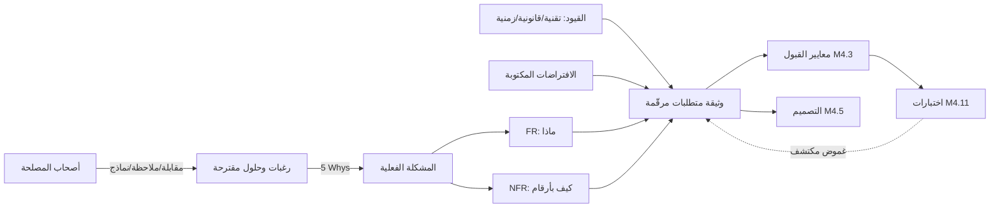

# Module 4.2 — المتطلبات
## Requirements: functional vs non-functional, constraints, assumptions, ambiguity hunting, "feature ≠ requirement"

> **المستوى:** Level 4 | **الموقع:** [3 من 16]
> **السابق:** [M4.1 — SDLC](module-4.1-sdlc.md) | **التالي:** [M4.3 — User Stories & Acceptance Criteria](module-4.3-user-stories-acceptance-criteria.md)

---

## 1. المتطلبات
- [ ] مراحل SDLC ومخرج كلٍّ منها — [M4.1](module-4.1-sdlc.md)
- [ ] مفردات NFR التي تعرفها بالفعل تقنيًا: زمن الاستجابة p95، الإنتاجية، التوافر، الاتساق — [L2-M2.13](../level-2-computer-systems/module-2.13-web-app-architecture.md), [L3-M3.8](../level-3-core-computer-science/module-3.8-big-o.md)
- [ ] حدود الثقة وأنواع الفشل الطبيعية (شبكة، تزامن) — [L2-M2.8](../level-2-computer-systems/module-2.8-networking-from-zero.md), [L3-M3.14](../level-3-core-computer-science/module-3.14-transactions-acid.md)

## 2. أهداف التعلّم
- تعريف **المتطلب** (requirement): عبارة قابلة للتحقق تصف ما يجب أن يفعله النظام أو خاصية يجب أن يملكها — وتمييزه عن **الميزة** (feature) و**الحل** (solution) و**الرغبة** (wish).
- تصنيف المتطلبات: **وظيفية** (FR)، **غير وظيفية** (NFR / خصائص الجودة)، **قيود** (constraints)، **افتراضات** (assumptions)، و**خارج النطاق** — ولماذا الأربعة الأخيرة هي التي تُسقط المشاريع.
- **صيد الغموض**: قائمة الكلمات الخطرة ("سريع"، "آمن"، "سهل"، "كل"، "دائمًا"، "المستخدم")، والأسئلة التي تحوّلها إلى عبارات قابلة للقياس.
- كتابة NFR **قابلة للقياس** (metric + threshold + condition + measurement method)، وتحويلها إلى **اختبارات آلية** حيث أمكن.
- استخدام **5 Whys** للرجوع من الحل المطلوب إلى المشكلة الفعلية، و**تتبّع المتطلبات** (traceability) من المتطلب إلى الاختبار.

---

## 3. شرح للمبتدئ

### متطلب ≠ ميزة ≠ حل
- "أريد زر تصدير Excel" → **حل** (طريقة واحدة).
- "تصدير الطلبات" → **ميزة** (قدرة في المنتج).
- "يستطيع مدير المتجر الحصول على طلبات الشهر بصيغة يفتحها محاسبه في برنامجه خلال دقيقة، بلا مساعدة تقنية" → **متطلب** (من، ماذا، لأي غاية، بأي معيار).

الفرق مهم لأن الحل المطلوب قد يكون الأسوأ: ربما المحاسب يستخدم Google Sheets (CSV يكفي)، أو يحتاج تكاملًا مباشرًا بدل ملفات. اسأل **"لماذا؟" خمس مرات** حتى تصل إلى المشكلة: زر Excel → ليرسله للمحاسب → ليحسب الضريبة → لأن النظام لا يعرض إجمالي الضريبة → *المتطلب الحقيقي ربما تقرير ضريبة شهري*، وزر Excel يصبح غير ضروري أو ثانويًا.

### الأنواع الخمسة
| النوع | يجيب عن | مثال (متجر) | إن أُهمل |
|---|---|---|---|
| **Functional (FR)** | ماذا *يفعل* النظام | "يستطيع العميل إلغاء طلب لم يُشحن بعد" | ميزة ناقصة — يُكتشف بسرعة |
| **Non-functional (NFR)** | *كيف* يفعله (جودة) | "إنشاء الطلب ≤ 300ms p95 عند 200 طلب/ث" | يعمل في العرض ويفشل في الإنتاج |
| **Constraint** قيد | ما *لا يمكن* تغييره | "PostgreSQL الموجود؛ بلا خدمات جديدة هذا الربع؛ قانون حماية البيانات" | تصميم لا يمكن نشره |
| **Assumption** افتراض | ما *نظنّه* صحيحًا ولم نتحقق منه | "المنتج له سعر واحد لكل العملاء" | ينهار عند أول عميل بسعر خاص |
| **Out of scope** | ما *لن* نبنيه الآن (بوعي) | "بلا إرجاع جزئي في هذه النسخة" | توسّع زاحف (scope creep)، لا نهاية |

المبتدئ يكتب FR فقط. المشاريع تفشل بسبب NFR مجهولة، وقيود اكتُشفت متأخرًا، وافتراضات لم تُكتب فلم تُختبر. **اكتب الافتراضات حتى لو بدت بديهية** — البديهي عند الطالب ليس بديهيًا عند قسم الحسابات.

### صيد الغموض: الكلمات الخطرة
| الكلمة | السؤال الذي يفكّكها | تصبح |
|---|---|---|
| "سريع" | كم؟ لمن؟ تحت أي حمل؟ كيف يُقاس؟ | ≤ 300ms p95 لـ `POST /orders` عند 200 rps، مقيسة من الخادم |
| "آمن" | ضد من؟ ما الأصول؟ ما الخسارة المقبولة؟ | "لا يصل مستخدم إلى طلبات مؤسسة أخرى؛ كلمات المرور بـ scrypt؛ كل كتابة مسجّلة بمن ومتى" (نموذج تهديد L5-M5.5) |
| "سهل الاستخدام" | أي مستخدم؟ أي مهمة؟ كم خطوة/ثانية/خطأ؟ | "موظف جديد ينشئ طلبًا من 3 بنود في < 90 ثانية بلا تدريب، في 8 من 10 محاولات" |
| "كل / دائمًا / أبدًا" | هل حقًا؟ ما الاستثناءات؟ | "كل الطلبات" → "الطلبات التي أنشأها المستخدم نفسه أو مؤسسته" |
| "المستخدم" | أي دور؟ عميل، موظف، مدير، نظام آخر؟ | أدوار مسمّاة بصلاحيات |
| "يدعم / يتعامل مع" | ماذا يحدث فعلًا؟ | "يرفض بـ 422 ورسالة" / "يقبل ويحوّل" |
| "في الوقت الحقيقي" | خلال ثانية؟ 5 ثوانٍ؟ عند التحديث؟ | "يظهر خلال ≤ 5 ثوانٍ من التغيير" |
| "قابل للتوسّع" | إلى كم؟ بأي بُعد (مستخدمون، بيانات، فرق)؟ | "10× الحمل الحالي بلا تغيير معماري" |

### NFR قابلة للقياس = أربعة أجزاء
**مقياس** (ما نقيسه) + **عتبة** (الرقم) + **شرط** (تحت أي حمل/حالة) + **طريقة القياس** (من أين تأتي الأرقام). "النظام متاح" ✗ → "توافر 99.9% شهريًا لـ API الطلبات، مقيسًا بفحوص خارجية كل دقيقة، باستثناء نافذة صيانة معلنة" ✓. فئات NFR الشائعة (ISO 25010 مبسّطة): الأداء، التوافر/الموثوقية، الأمان، قابلية الصيانة، قابلية الاستخدام، قابلية النقل، التوافق، **قابلية الملاحظة** (observability) — الأخيرة يُنسى أنها متطلب.

### المتطلبات تأتي من أين؟
من أصحاب المصلحة (المستخدم، العمل، الدعم، القانون، التشغيل، الأمن)، من النظام الحالي (سجلات، شكاوى)، من القيود التقنية. مهمتك: **المقابلة** (أسئلة مفتوحة ثم محددة)، **الملاحظة** (شاهدهم يعملون — سيقولون شيئًا ويفعلون آخر)، **النماذج الورقية** (أرخص طريقة لاكتشاف أنك فهمت خطأ)، ثم **إعادة الصياغة والتأكيد** ("إذًا ما تحتاجه هو… صحيح؟"). المتطلبات **تُكتشف** لا تُجمع؛ وتتغير — لذلك تُؤرَّخ وتُرقَّم وتُربط.

### التتبّع (traceability)
كل متطلب برقم (`FR-3`, `NFR-2`) يظهر في: معيار القبول (M4.3) → التصميم → الاختبار → PR. عندها تجيب في ثوانٍ: "ما الذي يثبت NFR-2؟" و"إن غيّرنا FR-3 ما الذي يتأثر؟". Project 4 فعل هذا بعمود "المرحلة"؛ الآن اجعله عمودًا للاختبار.

---

## 4. النموذج الذهني

```
   رغبة ("أريد زر Excel")
     └─ لماذا؟ ×5 ─▶ مشكلة ("لا أعرف إجمالي الضريبة الشهري")
                        └─ متطلبات:   FR (ماذا)  +  NFR (كيف، بأرقام)  +  قيود (لا يمكن)  +  افتراضات (نظن)  +  خارج النطاق (لن)
                                          └─ كل واحد: مرقّم ▸ قابل للتحقق ▸ مرتبط باختبار
```

**المتطلب الجيد = يستطيع شخصان مختلفان أن يتفقا إن تحقق أم لا، دون سؤالك.**

---

## 5. الرسم التوضيحي



```
   مصفوفة التتبّع (مثال)
   ┌────────┬──────────────────────────────────────┬───────────────┬──────────────────────┬──────────────┐
   │ ID     │ المتطلب                               │ معيار القبول   │ الاختبار               │ الحالة        │
   ├────────┼──────────────────────────────────────┼───────────────┼──────────────────────┼──────────────┤
   │ FR-1   │ إلغاء طلب غير مشحون                    │ AC-1.1, 1.2    │ orders.cancel.test.ts │ ✓            │
   │ NFR-1  │ POST /orders ≤300ms p95 @200rps        │ AC-N1          │ perf/orders.k6.js     │ ✓ 240ms      │
   │ NFR-3  │ عزل المؤسسات                           │ AC-N3          │ authz.test.ts         │ ✗ لم يُكتب    │
   │ A-2    │ سعر واحد لكل منتج                      │ —              │ —                    │ ⚠ غير متحقق  │
   └────────┴──────────────────────────────────────┴───────────────┴──────────────────────┴──────────────┘
```

---

## 6. مثال بسيط

طلب من صاحب المتجر: **"أريد أن يصل العملاء إلى إشعار عندما يُشحن طلبهم."**

**5 Whys:** لماذا؟ لأنهم يتصلون بالدعم ليسألوا. لماذا؟ لأنهم لا يعرفون الحالة. لماذا لا يعرفون؟ صفحة الطلب لا تُظهر تاريخ الحالة. … **المشكلة الفعلية:** انعدام الرؤية في حالة الطلب (وليس "إشعار" تحديدًا). الحلول: صفحة تتبّع + إشعار. ربما الصفحة وحدها تخفض المكالمات 70%.

**المتطلبات الناتجة:**
- FR-1: يرى العميل تاريخ حالات طلبه (الحالة، الوقت) في صفحة الطلب. (لدينا `order_status_history` من L3-M3.12!)
- FR-2: عند الانتقال إلى `shipped` يُرسَل بريد للعميل يحوي رقم الطلب ورابط التتبّع.
- NFR-1: البريد يُرسل خلال ≤ 5 دقائق من التغيير في 99% من الحالات (مقيس بفرق الطوابع الزمنية في السجل).
- NFR-2: فشل مزوّد البريد لا يفشل تغيير الحالة (الفصل — L3-M3.14 "لا await خارج DB داخل المعاملة"؛ outbox في L5-M5.9).
- NFR-3: لا يُرسل البريد مرتين لنفس الانتقال (idempotency).
- C-1: مزوّد البريد الحالي (حد 100 رسالة/دقيقة). C-2: لا SMS هذه النسخة.
- A-1: كل عميل له بريد صالح (⚠ غير متحقق — 12% بلا بريد في البيانات! → FR-3: إن لم يوجد بريد، لا شيء، ويُسجَّل).
- Out of scope: إشعارات push، تخصيص القوالب.

لاحظ كيف كشف الافتراض A-1 متطلبًا جديدًا قبل كتابة سطر.

---

## 7. مثال كود

المتطلبات تعيش في ملفات، لكن ما لا يُنفَّذ يُنسى. هنا: (1) ملف متطلبات **مهيكل** قابل للقراءة آليًا، (2) فاحص غموض بسيط، (3) NFR كاختبار قابل للتشغيل.

```typescript
// src/requirements.ts — المتطلبات كبيانات: مرقّمة، مصنّفة، مع مقياس للـ NFR، ومرتبطة باختبارات (traceability)
export type Requirement =
  | { id: `FR-${number}`; kind: "functional"; text: string; actor: string; tests: string[] }
  | { id: `NFR-${number}`; kind: "non-functional"; text: string; metric: string; threshold: string; condition: string; measuredBy: string; tests: string[] }
  | { id: `C-${number}`; kind: "constraint"; text: string; source: string }
  | { id: `A-${number}`; kind: "assumption"; text: string; verified: boolean; verifiedBy?: string }
  | { id: `OOS-${number}`; kind: "out-of-scope"; text: string; reason: string };

export const shippingNotifications: Requirement[] = [
  { id: "FR-1", kind: "functional", actor: "customer", text: "يرى تاريخ حالات طلبه (الحالة، الوقت) في صفحة الطلب", tests: ["orders/history.test.ts"] },
  { id: "FR-2", kind: "functional", actor: "system", text: "عند الانتقال إلى shipped يُرسَل بريد يحوي رقم الطلب ورابط التتبّع", tests: ["notify/shipped.test.ts"] },
  { id: "NFR-1", kind: "non-functional", text: "البريد يُرسل سريعًا بعد الشحن", metric: "latency(status_changed→email_sent)", threshold: "≤ 5 min for 99%", condition: "normal load", measuredBy: "log timestamps", tests: ["notify/latency.test.ts"] },
  { id: "NFR-2", kind: "non-functional", text: "فشل مزوّد البريد لا يفشل تغيير الحالة", metric: "status change success rate", threshold: "100%", condition: "email provider down", measuredBy: "fault-injection test", tests: ["notify/provider-down.test.ts"] },
  { id: "NFR-3", kind: "non-functional", text: "لا بريد مكرر لنفس الانتقال", metric: "duplicates", threshold: "0", condition: "retries/replays", measuredBy: "unique (order_id, transition) in outbox", tests: ["notify/idempotent.test.ts"] },
  { id: "C-1", kind: "constraint", text: "مزوّد البريد الحالي، حد 100 رسالة/دقيقة", source: "عقد المزوّد" },
  { id: "A-1", kind: "assumption", text: "كل عميل له بريد صالح", verified: false },
  { id: "OOS-1", kind: "out-of-scope", text: "إشعارات push و SMS", reason: "لا قناة متاحة هذا الربع" },
];

// صيد الغموض الآلي: ليس ذكيًا — يذكّرك فقط بالكلمات التي تحتاج أرقامًا أو أدوارًا
const VAGUE = [/سريع/, /آمن/, /سهل/, /\bكل\b/, /دائمًا/, /أبدًا/, /المستخدم(?!ين\s+من\s+دور)/, /fast/i, /secure/i, /easy/i, /\ball\b/i, /always/i, /user\b/i, /real[- ]time/i, /scalable/i];
export function lint(reqs: Requirement[]) {
  const issues: string[] = [];
  for (const r of reqs) {
    for (const re of VAGUE) if (re.test(r.text) && r.kind !== "non-functional") issues.push(`${r.id}: كلمة غامضة "${re.source}" — حوّلها إلى دور/رقم/شرط`);
    if (r.kind === "non-functional" && !/\d/.test(r.threshold)) issues.push(`${r.id}: عتبة بلا رقم`);
    if ((r.kind === "functional" || r.kind === "non-functional") && r.tests.length === 0) issues.push(`${r.id}: بلا اختبار مرتبط`);
    if (r.kind === "assumption" && !r.verified) issues.push(`${r.id}: افتراض غير متحقق — من يتحقق ومتى؟`);
  }
  return issues;
}
if (process.argv[1]?.match(/requirements\.(ts|js)$/)) { const issues = lint(shippingNotifications); console.log(issues.length ? issues.join("\n") : "no issues"); process.exitCode = issues.length ? 1 : 0; }
// المتوقع: FR-1 (كلمة "كل"؟ لا) … A-1: افتراض غير متحقق
```

```typescript
// src/nfr-latency.test.ts — NFR كاختبار: "p95 ≤ 50ms لحساب إجمالي طلب بـ 100 بند" (في Project 5 سيصبح اختبار حمل حقيقيًا بأداة مثل k6/autocannon)
import { test } from "node:test"; import assert from "node:assert/strict";

type Line = { quantity: number; unitPriceCents: number };
const total = (lines: Line[]) => lines.reduce((s, l) => s + l.quantity * l.unitPriceCents, 0);
const p = (xs: number[], q: number) => xs.toSorted((a, b) => a - b)[Math.min(xs.length - 1, Math.floor(q * xs.length))]!;

test("NFR-perf-1: total(100 lines) p95 ≤ 50ms over 1000 runs", () => {
  const lines = Array.from({ length: 100 }, (_, i) => ({ quantity: i % 5 + 1, unitPriceCents: 100 + i }));
  const samples: number[] = [];
  for (let i = 0; i < 1000; i++) { const t = performance.now(); total(lines); samples.push(performance.now() - t); }
  const p95 = p(samples, 0.95);
  assert.ok(p95 <= 50, `p95 = ${p95.toFixed(3)}ms`);     // الرسالة تحمل الرقم: الفشل يُقرأ بلا تصحيح (M4.11)
});
```

---

## 8. مثال من العالم الحقيقي
"نحتاج تسجيل الدخول بـ Google" (حل). 5 Whys: لأن المستخدمين ينسون كلمات المرور → لأن إعادة التعيين معقدة (4 خطوات وبريد يتأخر 20 دقيقة). المتطلب الفعلي: استعادة الوصول خلال دقيقتين. الحلول: إصلاح تأخّر البريد (قائمة انتظار مزوّد مختنقة — L2 backpressure)، رابط سحري، أو OAuth. الأول كلّف يومًا وحلّ 80% من الشكاوى؛ OAuth كان سيكلّف أسبوعين ولا يحل مشكلة من لا يملك حساب Google.

## 9. مثال من الإنتاج
نظام فوترة بُني بافتراض غير مكتوب: "المنطقة الزمنية للعميل = منطقة الخادم". عمل سنتين في بلد واحد. التوسّع إلى بلد ثانٍ: فواتير "شهر مارس" تضم طلبات 31 مارس بعد منتصف الليل بتوقيت العميل، ومحاسبون غاضبون، وإعادة إصدار آلاف الفواتير. تكلفة كتابة الافتراض في اليوم الأول: سطر. تكلفة اكتشافه في الإنتاج: شهر. (ولاحظ أن `timestamptz` من L3-M3.10 وحده لا يكفي — القرار "ما هو الشهر؟" متطلب عمل.)

---

## 10. مفاهيم خاطئة شائعة
1. **"المتطلبات مهمة محلّل الأعمال/المنتج، أنا أنفّذ."** من ينفّذ بلا فهم ينفّذ الحرف ويخطئ الروح — ويُلام. المهندس يصيد الغموض لأنه الوحيد الذي يرى تكلفته.
2. **"اجمع كل المتطلبات أولًا."** المتطلبات تُكتشف تدريجيًا؛ اجمع ما يكفي لأصغر دورة، واترك الباقي مرقّمًا كأسئلة مفتوحة.
3. **"NFR تفاصيل تقنية نقررها نحن."** 99.9% مقابل 99.99% فرق 10× في التكلفة — قرار عمل يحتاج مالكًا.
4. **"المتطلب الجيد مفصّل."** المتطلب الجيد **قابل للتحقق** ويعبّر عن *الحاجة* لا الحل؛ التفصيل الزائد يُقفل التصميم مبكرًا.
5. **"الافتراضات البديهية لا تُكتب."** الافتراض الذي لا يُكتب لا يُختبر، وهو أرخص خطأ تمنعه.

## 11. أخطاء شائعة
1. قبول الحل المطلوب كمتطلب بلا "لماذا".
2. NFR بلا أرقام أو بلا طريقة قياس ("يجب أن يكون سريعًا").
3. نسيان أصحاب المصلحة غير المرئيين: الدعم، التشغيل، الأمن، القانون، المحاسبة.
4. "المستخدم" بلا دور → صلاحيات خاطئة (L5-M5.3).
5. عدم كتابة "خارج النطاق" → توسّع زاحف ومواعيد تهرب.
6. متطلبات بلا أرقام تعريف → لا تتبّع، ولا أحد يعرف ما الذي يثبت ماذا.
7. تغيير متطلب شفهيًا بلا تحديث الوثيقة → الكود والوثيقة والاختبار ثلاثة أشياء مختلفة.

## 12. تمرين تصحيح
الميزة "إلغاء الطلب" أُطلقت و"تعمل"، لكن الدعم غارق بالشكاوى. المتطلب المكتوب كان: "يستطيع المستخدم إلغاء طلبه".
- **لاحظ:** شكاوى من نوعين: "ألغيت ولم يُسترد المبلغ" و"أُلغي طلبي وأنا لم أفعل".
- **دليل:** السجل يُظهر إلغاءات من حساب موظف الدعم على طلبات عملاء (دور غير محدد → "المستخدم" شمل الموظفين)، وطلبات أُلغيت بعد الشحن (لا شرط حالة)، ولا سجل لاسترداد لأن "الإلغاء" لم يذكر المال.
- **فرضية:** الكود صحيح بالنسبة للمتطلب؛ **المتطلب هو العطل**: دور غامض، حالة ناقصة، نتيجة مالية غير مذكورة، سجل تدقيق غير مطلوب.
- **تجربة:** أعد كتابة المتطلب: "يستطيع **العميل صاحب الطلب** إلغاء طلب في حالة `pending` أو `paid` **قبل الشحن**؛ الإلغاء يُنشئ **استردادًا كاملًا** خلال ≤ 24 ساعة ويُسجَّل (من، متى، سبب). موظف الدعم يلغي **نيابةً** بسبب إلزامي ويُسجَّل باسمه." ثم اشتق منه 6 معايير قبول (M4.3) وأعد الاختبار.
- **استنتاج:** مرّر المتطلب القديم على `lint` ذهنيًا: "المستخدم" و"طلبه" و"إلغاء" كلها بلا حدود. الخطأ كان في المرحلة 2، وكلّف أسبوعين في المرحلة 12.

## 13. تمرين معماري
اكتب وثيقة متطلبات كاملة (FR/NFR/C/A/OOS مرقّمة، ≤ صفحتين) لميزة **"سجل تدقيق (audit log) قابل للتصدير"** في Project 4 — هذه نفسها الميزة التي سيبنيها AI في Project 8 وستتحقق منها أنت. أسئلة يجب أن تجيب عنها وثيقتك: من يقرأه؟ ما الأحداث؟ هل يمكن حذفه (قيد قانوني؟) كم يُحتفظ به؟ أثره على زمن الكتابة (NFR)؟ ماذا لو فشلت كتابة السجل — تفشل العملية الأصلية؟ (مقايضة صريحة بـ ACTRR.) حجمه بعد سنة (قدّر)؟ ضع افتراضاتك مرقّمة ومن يتحقق منها.

## 14. الصلة بعصر AI
المتطلبات هي **المدخل الأهم لأي وكيل**: نموذج يتلقى "أضف إلغاء الطلب" ينتج المسار السعيد؛ نموذج يتلقى FR/NFR/C/A/OOS مرقّمة ينتج كودًا يحترم الحالات والحدود *ويمكن التحقق منه*. استخدم AI في الاتجاه المعاكس أيضًا: "اقرأ هذه المتطلبات واذكر كل غموض وكل افتراض ضمني وكل حالة حدّية لم تُذكر" — هذه من أقوى استخداماته. لكن القرار (أي NFR نلتزم بها، ما خارج النطاق) يبقى قرار عمل بشري، لأن له تكلفة لا يعرفها النموذج. (L8-M8.5 context engineering، L8-M8.6 delegation.)

## 15–17. Master / Understand / Defer
- 🔴 متطلب vs ميزة vs حل؛ 5 Whys؛ الأنواع الخمسة ولماذا الأربعة الأخيرة قاتلة؛ الكلمات الخطرة وأسئلتها؛ NFR رباعية الأجزاء؛ التتبّع بالأرقام؛ الافتراضات تُكتب.
- 🟠 مصادر المتطلبات وتقنيات الاستخلاص (مقابلة، ملاحظة، نماذج)؛ فئات ISO 25010؛ قابلية الملاحظة كمتطلب؛ NFR كاختبار آلي؛ إدارة التغيير (الإصدار والتاريخ).
- ⚪ هندسة المتطلبات الرسمية (IEEE 29148)، لغات المواصفات الرسمية (TLA+, Alloy — تعرف أنها موجودة لأنظمة حرجة)، إدارة المتطلبات بأدوات مؤسسية.

## 18. الخلاصة
1. المتطلب عبارة قابلة للتحقق عن حاجة؛ الميزة قدرة؛ الحل طريقة. ارجع بـ"لماذا" حتى تصل إلى المشكلة.
2. خمسة أنواع: FR، NFR، قيود، افتراضات، خارج النطاق — واكتبها كلها.
3. كلمات بلا أرقام أو أدوار = غموض؛ حوّلها إلى مقياس + عتبة + شرط + طريقة قياس.
4. رقّم كل متطلب واربطه باختبار؛ الافتراض غير المتحقق منه خطر مجدول.
5. المتطلبات تُكتشف وتتغير؛ اجمع ما يكفي لأصغر دورة وحدّثها.

## 19. مراجع رسمية
- ISO/IEC/IEEE 29148:2018 — Requirements engineering (overview): https://www.iso.org/standard/72089.html
- ISO/IEC 25010 quality characteristics: https://iso25000.com/index.php/en/iso-25000-standards/iso-25010
- Karl Wiegers — "Writing Quality Requirements" (checklist of characteristics): https://www.processimpact.com/articles/qualreqs.html
- Volere Requirements Specification Template (free): https://www.volere.org/templates/volere-requirements-specification-template/
- Google SRE Workbook — Implementing SLOs (how to write measurable reliability targets): https://sre.google/workbook/implementing-slos/

## المصطلحات
| العربية | English |
|---|---|
| متطلب | Requirement |
| متطلب وظيفي / غير وظيفي | Functional / Non-functional requirement (FR / NFR) |
| قيد | Constraint |
| افتراض | Assumption |
| خارج النطاق | Out of scope |
| توسّع زاحف | Scope creep |
| أصحاب المصلحة | Stakeholders |
| استخلاص المتطلبات | Requirements elicitation |
| تتبّع المتطلبات | Traceability |
| لماذا ×5 | 5 Whys |
| خصائص الجودة | Quality attributes |
| قابلية الملاحظة | Observability |
