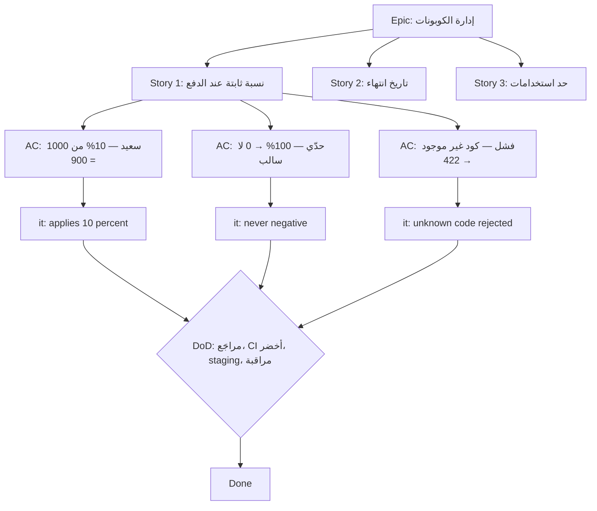

# Module 4.3 — قصص المستخدم ومعايير القبول
## User Stories & Acceptance Criteria: As a / I want / So that; Given / When / Then; INVEST; Definition of Done; limitations

> **المستوى:** Level 4 | **الموقع:** [4 من 16]
> **السابق:** [M4.2 — Requirements](module-4.2-requirements.md) | **التالي:** [M4.4 — Engineering Estimation](module-4.4-estimation.md)

---

## 1. المتطلبات
> **قبل أن تتعلم هذا، يجب أن تفهم:**
- [ ] أنواع المتطلبات الخمسة والكلمات الغامضة — [M4.2](module-4.2-requirements.md)
- [ ] SDLC المصغّر للتذكرة وDefinition of Done — [M4.1](module-4.1-sdlc.md)
- [ ] `node:test` بالحد الأدنى (رأيته في M4.0) — التفصيل في [M4.11](module-4.11-testing.md)

## 2. أهداف التعلّم
- كتابة **قصة مستخدم** (user story) بصيغة *As a / I want / So that* وفهم ما تؤديه فعلًا: **تذكرة محادثة** حول قيمة لمستخدم، لا مواصفة.
- كتابة **معايير القبول** (acceptance criteria) بصيغة *Given / When / Then* (Gherkin) بحيث تكون **قابلة للتحقق بنعم/لا** وتغطي المسار السعيد، الحالات الحدّية، والفشل.
- تقييم القصص بـ **INVEST** وتقسيم القصص الكبيرة (epics) **عموديًا** (شريحة قيمة كاملة) لا أفقيًا (طبقة تقنية).
- كتابة **Definition of Done** لفريق وتمييزها عن معايير القبول.
- معرفة **حدود القصص**: لا تحمل NFR ولا القيود ولا نموذج المجال؛ متى تكتب "قصة تقنية" ومتى تكتب وثيقة بدلها.
- ربط GWT مباشرة بـ **اختبارات آلية** (`describe/it` تعكس السيناريوهات).

---

## 3. شرح للمبتدئ

### القصة = وعد بمحادثة
> **As a** مدير متجر، **I want** تصدير طلبات شهر محدد كـ CSV، **so that** يحسب محاسبي الضريبة بلا إدخال يدوي.

ثلاثة أجزاء تجيب عن: **من** (دور حقيقي، لا "المستخدم")، **ماذا** (قدرة، لا حل تقني)، **لماذا** (القيمة — أهم جزء وأكثرها حذفًا). القصة قصيرة عمدًا: هي **بطاقة** تذكّر الفريق بأن يتحدث، ثم **محادثة** تملأ التفاصيل، ثم **تأكيد** (معايير القبول) يجعل "انتهى" قابلًا للفحص. (الـ 3C: Card, Conversation, Confirmation.) القصة بلا محادثة = متطلب ناقص متنكّر.

### معايير القبول: Given / When / Then
كل معيار سيناريو واحد:
- **Given** الحالة الابتدائية (بيانات، دور، سياق)،
- **When** الفعل الواحد،
- **Then** النتيجة المرئية القابلة للفحص (وربما **And** لنتائج إضافية).

```gherkin
Scenario: تصدير شهر فيه طلبات
  Given مدير متجر مسجّل الدخول في مؤسسة لها 3 طلبات في مارس 2026 وطلبان في أبريل
  When يطلب تصدير مارس 2026
  Then يحصل على ملف CSV بـ 3 صفوف + صف عناوين
  And الأعمدة: order_id, created_at, status, total_cents, customer_email
  And الملف بترميز UTF-8 مع BOM ويُفتح في Excel بلا تشويه للعربية

Scenario: شهر بلا طلبات
  Given مؤسسة بلا طلبات في فبراير 2026
  When يطلب تصدير فبراير 2026
  Then يحصل على ملف يحوي صف العناوين فقط (لا خطأ)

Scenario: محاولة تصدير مؤسسة أخرى
  Given مدير في المؤسسة A
  When يطلب تصدير بمعرّف المؤسسة B
  Then يُرفض بـ 404 (لا 403: لا نكشف وجودها) ولا يُسجَّل أي بيانات لـ B في الاستجابة

Scenario: شهر ضخم
  Given مؤسسة لها 500,000 طلب في الشهر
  When يطلب التصدير
  Then يبدأ التنزيل خلال ≤ 2 ثانية (streaming) وذاكرة الخادم لا تتجاوز +50MB أثناءه
```

قواعد: **سيناريو واحد = When واحد**؛ Then **قابل للملاحظة** (استجابة، ملف، صف في DB، بريد) لا "النظام يعالج داخليًا"؛ أرقام حيث تلزم؛ وغطِّ ثلاث فئات دائمًا: **السعيد، الحدّي (فارغ/حدود/أكبر حجم)، الفشل/الرفض (صلاحيات، مدخلات سيئة، تبعية معطلة)**. لاحظ أن السيناريو الأخير **NFR محلّي** — هذا هو المكان الذي تدخل منه NFR إلى عمل الفريق اليومي.

### INVEST: هل القصة جيدة؟
| الحرف | المعنى | الاختبار السريع |
|---|---|---|
| **I**ndependent | مستقلة قدر الإمكان | يمكن تنفيذها وتسليمها دون انتظار قصة أخرى؟ |
| **N**egotiable | قابلة للتفاوض في التفاصيل | هل هي حاجة أم تصميم مُقفَل؟ |
| **V**aluable | ذات قيمة لمستخدم/عمل | هل جزء "so that" حقيقي؟ |
| **E**stimable | يمكن تقديرها | هل يفهمها الفريق كفاية ليقدّر (M4.4)؟ |
| **S**mall | تُنجز في أيام لا أسابيع | إن لم تكن: قسّمها |
| **T**estable | لها معايير قبول قابلة للفحص | هل كل Then يُفحص بنعم/لا؟ |

### التقسيم العمودي لا الأفقي
قصة كبيرة (epic): "إدارة الكوبونات". التقسيم **الأفقي** (خطأ): "جدول الكوبونات"، "API الكوبونات"، "شاشة الكوبونات" — لا شيء منها يُسلَّم قيمة وحده، والتكامل يُؤجَّل للنهاية (M4.1: أين تموت المشاريع). التقسيم **العمودي** (صحيح): "تطبيق كوبون نسبة مئوية ثابتة عند الدفع" (شريحة كاملة من DB إلى الشاشة لحالة واحدة) → "كوبون بتاريخ انتهاء" → "حد استخدامات" → "كوبون لمنتجات محددة". كل شريحة قابلة للعرض والتعلّم منها. طرق التقسيم: بالقواعد (بسيط أولًا)، بالبيانات (نوع واحد أولًا)، بالمسار (السعيد ثم الاستثناءات)، بالمنصة، بـ "يدوي ثم آلي".

### Definition of Done vs معايير القبول
- **معايير القبول**: خاصة بكل قصة — *هل تفعل هذه القصة ما أردنا؟*
- **Definition of Done (DoD)**: ثابتة لكل القصص — *هل العمل احترافي؟* مثال DoD: الكود مراجَع ومدمج في main؛ اختبارات آلية لمعايير القبول تمرّ في CI؛ لا تراجع في التغطية للملفات المعدّلة؛ migration بنمط expand/contract؛ سجلات ومقاييس للمسار الجديد؛ توثيق API محدّث؛ منشور في staging ومُتحقَّق يدويًا؛ feature flag إن كان مرئيًا للمستخدم. DoD هي ما يمنع "90% جاهز".

### حدود القصص (ما لا تحمله)
- **NFR الشاملة** (توافر، أمان عام، أداء كلي): تعيش في وثيقة متطلبات/SLO (M4.2) وتُنزَّل كسيناريوهات محلية حيث تلزم.
- **نموذج المجال والقيود** (schema، قواعد العمل المعقدة): وثيقة تصميم (M4.5).
- **العمل التقني** (ترقية Node، تقسيم وحدة): "قصة تقنية" مقبولة إن ذكرت **القيمة** ("so that نشر migration لا يقفل الجدول")؛ وإلا فهي بند دين تقني (M4.15) لا قصة.
- القصص ليست عقدًا قانونيًا ولا توثيقًا دائمًا؛ بعد التنفيذ، **الاختبارات والوثائق** هي المرجع، لا التذاكر القديمة.

---

## 4. النموذج الذهني

```
   Story  = As a <دور> I want <قدرة> so that <قيمة>      ← بطاقة لمحادثة
   AC     = Given <حالة> When <فعل واحد> Then <نتيجة قابلة للفحص>  × {سعيد، حدّي، فشل}
   Test   = describe(story) → it(scenario) → arrange(Given) act(When) assert(Then)
   Done   = AC تمرّ آليًا  +  DoD (المراجعة، CI، النشر، المراقبة)
```

**كل Then يجب أن يستطيع زميل جديد فحصه بنعم/لا دون أن يسألك.**

---

## 5. الرسم التوضيحي



```
   تقسيم أفقي (✗)                          تقسيم عمودي (✓)
   ┌──────────────┐                        ┌──┬──┬──┐
   │ UI           │ ← قصة 3                 │UI│UI│UI│
   ├──────────────┤                        ├──┼──┼──┤
   │ API          │ ← قصة 2                 │AP│AP│AP│   كل عمود = قصة تُسلَّم وتُعرض وحدها
   ├──────────────┤                        ├──┼──┼──┤
   │ DB           │ ← قصة 1                 │DB│DB│DB│
   └──────────────┘                        └──┴──┴──┘
   لا قيمة حتى تنتهي الثلاث                 قيمة بعد العمود الأول
```

---

## 6. مثال بسيط

قصة سيئة ثم جيدة:

✗ "As a user, I want a cancel button so that I can cancel." (دور غامض، حل بدل قدرة، قيمة دائرية، بلا AC.)

✓ **As a** عميل لديه طلب لم يُشحن، **I want** إلغاء الطلب بنفسي، **so that** لا أنتظر الدعم ويُسترد مبلغي تلقائيًا.

```gherkin
Scenario: إلغاء طلب مدفوع غير مشحون
  Given عميل لديه طلب بحالة paid أُنشئ قبل ساعة
  When يلغي الطلب مع سبب "تغيير رأي"
  Then حالة الطلب تصبح cancelled
  And يُنشأ طلب استرداد كامل مرتبط بالطلب
  And يظهر في order_status_history صف paid→cancelled بهوية العميل والسبب

Scenario: محاولة إلغاء طلب مشحون
  Given عميل لديه طلب بحالة shipped
  When يلغي الطلب
  Then يُرفض بـ 409 ورسالة "الطلب شُحن؛ يمكنك طلب إرجاع"
  And لا يتغير شيء في الطلب

Scenario: إلغاء مرتين (إعادة إرسال)
  Given طلب أُلغي قبل ثانية
  When يصل نفس طلب الإلغاء مرة أخرى
  Then يُعاد 200 بنفس الحالة ولا يُنشأ استرداد ثانٍ

Scenario: طلب عميل آخر
  Given عميل A وطلب يخص العميل B
  When يحاول A إلغاءه
  Then 404 ولا أثر في السجل على الطلب
```

لاحظ كيف أعادت السيناريوهات استخدام ما تعرفه: حالات (L3-M3.12)، idempotency (L2/L3)، حدود الثقة (L0).

---

## 7. مثال كود

GWT → اختبار واحد لواحد. الكود يختبر **منطق المجال** في الذاكرة (لا DB) ليبقى سريعًا؛ اختبارات التكامل مع DB في M4.11.

```typescript
// src/cancel-order.ts — منطق الإلغاء كدالة انتقال حالة نقية: تُقرّر ولا تنفّذ (التنفيذ = معاملة L3-M3.14)
export type OrderStatus = "pending" | "paid" | "shipped" | "cancelled";
export type Order = { id: string; customerId: string; status: OrderStatus; totalCents: number };
export type CancelDecision =
  | { ok: true; effects: ["set_status_cancelled", ...("create_full_refund" | "record_history")[]]; replayed?: false }
  | { ok: true; replayed: true; effects: [] }
  | { ok: false; status: 404 | 409; message: string };

export function decideCancel(order: Order | undefined, actor: { customerId: string }, reason: string): CancelDecision {
  if (!order || order.customerId !== actor.customerId) return { ok: false, status: 404, message: "order not found" };   // لا نكشف وجوده
  if (!reason.trim()) return { ok: false, status: 409, message: "reason required" };
  switch (order.status) {
    case "cancelled": return { ok: true, replayed: true, effects: [] };                                                 // idempotent
    case "shipped":   return { ok: false, status: 409, message: "الطلب شُحن؛ يمكنك طلب إرجاع" };
    case "paid":      return { ok: true, effects: ["set_status_cancelled", "create_full_refund", "record_history"] };
    case "pending":   return { ok: true, effects: ["set_status_cancelled", "record_history"] };                         // لم يُدفع → لا استرداد
  }
}
```

```typescript
// src/cancel-order.test.ts — كل Scenario = it واحد؛ Given = arrange، When = act، Then/And = assert
import { describe, it } from "node:test"; import assert from "node:assert/strict";
import { decideCancel, type Order } from "./cancel-order.js";

const paid: Order = { id: "o1", customerId: "A", status: "paid", totalCents: 5000 };

describe("Story: customer cancels an unshipped order", () => {
  it("Scenario: cancel a paid, unshipped order", () => {
    const d = decideCancel(paid, { customerId: "A" }, "changed my mind");                           // Given + When
    assert.deepEqual(d, { ok: true, effects: ["set_status_cancelled", "create_full_refund", "record_history"] });   // Then + And
  });
  it("Scenario: cancelling a shipped order is refused with 409 and no change", () => {
    const d = decideCancel({ ...paid, status: "shipped" }, { customerId: "A" }, "x");
    assert.equal(d.ok, false); if (!d.ok) { assert.equal(d.status, 409); assert.match(d.message, /إرجاع/); }
  });
  it("Scenario: cancelling twice is idempotent (no second refund)", () => {
    const d = decideCancel({ ...paid, status: "cancelled" }, { customerId: "A" }, "x");
    assert.deepEqual(d, { ok: true, replayed: true, effects: [] });
  });
  it("Scenario: another customer's order looks like it does not exist", () => {
    const d = decideCancel(paid, { customerId: "B" }, "x");
    assert.deepEqual(d, { ok: false, status: 404, message: "order not found" });
  });
  it("Scenario (edge): pending order cancels without refund", () => {
    const d = decideCancel({ ...paid, status: "pending" }, { customerId: "A" }, "x");
    assert.ok(d.ok && !d.replayed && !d.effects.includes("create_full_refund"));
  });
});
// شغّل: node --import tsx --test src/*.test.ts  → أسماء الاختبارات = معايير القبول حرفيًا: التقرير يقرأه مدير المنتج
```

```typescript
// src/story-lint.ts — فاحص بطاقات بسيط: يرفض القصص بلا دور حقيقي/قيمة/AC بثلاث فئات (يذكّر، لا يحكم)
export type Story = { asA: string; iWant: string; soThat: string; scenarios: { name: string; given: string; when: string; then: string[] }[] };
export function lintStory(s: Story) {
  const issues: string[] = [];
  if (/^(a |the )?user$/i.test(s.asA.trim()) || /^المستخدم$/.test(s.asA.trim())) issues.push("دور غامض: من بالضبط؟");
  if (/\b(button|زر|صفحة|page|modal|dropdown)\b/i.test(s.iWant)) issues.push("I want يصف حلًا (عنصر واجهة) لا قدرة");
  if (!s.soThat.trim() || s.soThat.toLowerCase().includes(s.iWant.toLowerCase().slice(0, 15))) issues.push("so that غائب أو يكرر I want (قيمة دائرية)");
  if (s.scenarios.length < 3) issues.push("أقل من 3 سيناريوهات: سعيد + حدّي + فشل");
  for (const sc of s.scenarios) {
    if (/ and | و /i.test(sc.when)) issues.push(`"${sc.name}": When يحوي فعلين — قسّمه`);
    if (sc.then.some(t => /internally|داخليًا|يعالج/i.test(t))) issues.push(`"${sc.name}": Then غير قابل للملاحظة`);
  }
  return issues;
}
```

---

## 8. مثال من العالم الحقيقي
فريق كتب "As a user I want to log in". بعد التنفيذ: المنتج توقع "تذكّرني"، الأمن توقع قفل الحساب بعد 5 محاولات، الدعم توقع رسالة واضحة عند الحساب المعطّل. ثلاث جولات إعادة عمل. بعدها اعتمد الفريق قاعدة: **لا تدخل قصة إلى sprint بلا 3 فئات AC مكتوبة ومقروءة في اجتماع التحسين**. زمن إعادة العمل انخفض إلى الثلث — لأن المحادثة انتقلت من "بعد البناء" إلى "قبله".

## 9. مثال من الإنتاج
شركة تجارة إلكترونية تجعل أسماء اختبارات e2e مطابقة حرفيًا لمعايير القبول (`it("Given a paid order When cancelled Then a full refund is created")`). عند فشل اختبار ليلًا، التنبيه يحمل الجملة نفسها، فيفهمه مدير المنتج ومهندس المناوبة بلا قراءة كود. وعند سؤال المدقّق "كيف تضمنون أن العميل لا يرى طلبات غيره؟" يُرسل الفريق تقرير الاختبارات المفلتر بـ `404`. **معايير القبول الحية = توثيق لا يكذب** (M4.11).

---

## 10. مفاهيم خاطئة شائعة
1. **"القصة = المواصفة."** القصة بطاقة محادثة؛ المواصفة هي معايير القبول + التصميم + الاختبارات.
2. **"GWT لاختبارات القبول الآلية فقط (Cucumber)."** الصيغة أداة تفكير أولًا؛ يمكن أن تعيش في تذكرة واختبار `node:test` عادي بلا أي إطار BDD.
3. **"كل عمل يجب أن يكون قصة مستخدم."** إصلاح الأخطاء، الدين التقني، الأبحاث (spikes) لها أشكالها؛ إجبارها في قالب "As a developer I want…" يُفرغ القالب.
4. **"القصة الصغيرة = قصة ناقصة."** الصغيرة شريحة **كاملة** لحالة ضيقة، لا طبقة من شريحة.
5. **"Definition of Done تبطئنا."** DoD تنقل التكلفة من "بعد الإطلاق" (أغلى) إلى "قبل الدمج"؛ ما يبطئكم هو إعادة العمل.

## 11. أخطاء شائعة
1. دور "المستخدم" → صلاحيات ومسارات خاطئة.
2. "I want" يصف عنصر واجهة → يُقفل التصميم ويخفي الحاجة.
3. معايير قبول للمسار السعيد فقط → الحالات الحدّية تُكتشف في الإنتاج.
4. When بفعلين ("يدخل ويضغط ويرى") → سيناريو لا يُعرف أي جزء فشل.
5. Then بأفعال داخلية ("يحدّث الكاش") بدل نتيجة مرئية.
6. تقسيم أفقي (DB ثم API ثم UI) → لا عرض، لا تعلّم، تكامل متأخر.
7. اعتبار القصة "منتهية" عند الدمج؛ DoD غائبة أو مختلفة لكل شخص.

## 12. تمرين تصحيح
Sprint انتهى و"كل القصص Done" لكن العرض فشل أمام العميل: ميزة "تقارير المبيعات" لا تعمل من البداية للنهاية.
- **لاحظ:** القصص كانت: "جدول التقارير"، "endpoint التقارير"، "شاشة التقارير" — كلها مدمجة.
- **دليل:** الشاشة تستدعي `GET /reports?month=`، والـ endpoint يتوقع `?from&to`؛ لا اختبار يربطهما؛ AC لكل قصة كانت "الجدول موجود"، "الـ endpoint يعيد 200".
- **فرضية:** التقسيم أفقي + AC غير مرتبطة بقيمة مستخدم → كل جزء "Done" ولا قيمة.
- **تجربة:** أعد كتابة القصة عموديًا: "As a مدير، I want رؤية إجمالي مبيعات شهر محدد، so that…" بـ AC من المدخل إلى الشاشة؛ اختبار e2e واحد للمسار السعيد.
- **استنتاج:** "Done" على مستوى طبقة لا معنى له؛ DoD يجب أن تتضمن "قابل للعرض للمستخدم".

## 13. تمرين معماري
خذ وثيقة "سجل التدقيق القابل للتصدير" من تمرين M4.2 وحوّلها إلى: epic واحد، 4–6 قصص مقسّمة **عموديًا** مرتّبة بالقيمة والمخاطرة (أيّها تُسلَّم أولًا ولماذا؟)، ولكل قصة 3+ سيناريوهات GWT تغطي السعيد/الحدّي/الفشل، مع تحديد أي NFR من وثيقتك نزلت كسيناريو محلي وأيها بقيت شاملة. ثم اكتب DoD من 8 بنود لفريقك الافتراضي. (ستعطي هذه الحزمة للوكيل في Project 8 — وستتحقق من كل Then.)

## 14. الصلة بعصر AI
معايير القبول بصيغة GWT هي **أفضل لغة تفويض** لنموذج: محددة، قابلة للفحص، تحمل الحالات الحدّية والفشل. "نفّذ هذه القصة بحيث تمرّ هذه السيناريوهات الـ 6 كاختبارات" ينتج كودًا أفضل بكثير من "أضف الإلغاء". والعكس مفيد: اطلب من النموذج "اقترح سيناريوهات ناقصة" ثم **أنت** تقرّر أيها يدخل — النموذج جيد في التعداد، وأنت مسؤول عن القيمة والمخاطر. (L8-M8.6: التفويض بعقد.)

## 15. ما يجب إتقانه (Must Master) 🔴
- 🔴 صيغة القصة والـ 3C؛ GWT بقواعده (When واحد، Then قابل للملاحظة، 3 فئات)؛ INVEST؛ التقسيم العمودي؛ DoD vs AC؛ ربط السيناريو بالاختبار واحدًا لواحد.

## 16. ما يجب فهمه (Should Understand) 🟠
- 🟠 طرق تقسيم القصص (قواعد/بيانات/مسار/منصة)؛ القصص التقنية وspikes؛ NFR كسيناريو محلي؛ اجتماع التحسين (refinement) وقاعدة "لا AC لا sprint".

## 17. ما يمكن تأجيله (Can Defer) ⚪
- ⚪ أُطر BDD (Cucumber/Gherkin runners)، Story mapping تفصيليًا، Example mapping، تقدير القصص بالنقاط (M4.4 يغطي الجوهر).

## 18. الخلاصة
1. القصة بطاقة لمحادثة: دور حقيقي + قدرة + قيمة؛ ليست مواصفة.
2. معايير القبول بـ GWT: When واحد، Then قابل للفحص، وتغطي السعيد والحدّي والفشل.
3. INVEST للتقييم؛ قسّم عموديًا (شرائح قيمة) لا أفقيًا (طبقات).
4. DoD ثابتة لكل العمل وتمنع "90% جاهز"؛ AC خاصة بالقصة.
5. السيناريو يصبح اختبارًا باسمه؛ القصص لا تحمل NFR الشاملة ولا نموذج المجال.

## 19. مراجع رسمية
- Mike Cohn — User Stories (overview, INVEST): https://www.mountaingoatsoftware.com/agile/user-stories
- Bill Wake — INVEST in Good Stories: https://xp123.com/articles/invest-in-good-stories-and-smart-tasks/
- Cucumber — Gherkin Reference (Given/When/Then semantics): https://cucumber.io/docs/gherkin/reference/
- Scrum Guide — Definition of Done: https://scrumguides.org/scrum-guide.html#commitment-definition-of-done
- Node.js — Test runner (`node:test`, `describe/it`): https://nodejs.org/api/test.html

## المصطلحات
| العربية | English |
|---|---|
| قصة مستخدم | User story |
| معايير القبول | Acceptance criteria |
| سيناريو | Scenario |
| ملحمة (قصة كبيرة) | Epic |
| شريحة عمودية | Vertical slice |
| تعريف المنتهي | Definition of Done (DoD) |
| بطاقة / محادثة / تأكيد | Card / Conversation / Confirmation |
| قصة تقنية | Technical story |
| بحث استكشافي محدود الزمن | Spike |
| تحسين الـ backlog | Backlog refinement |
