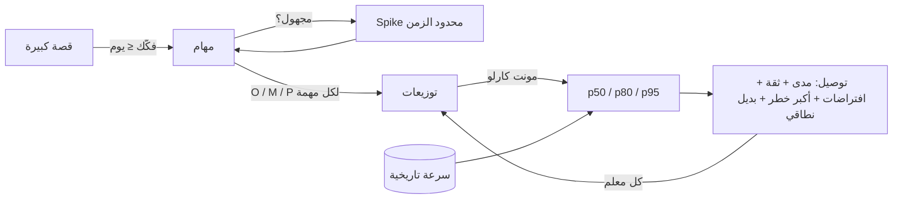

# Module 4.4 — التقدير الهندسي
## Engineering Estimation: why estimates are uncertain, decomposition, relative sizing, cone of uncertainty, risk-first, communicating ranges

> **المستوى:** Level 4 | **الموقع:** [5 من 16]
> **السابق:** [M4.3 — User Stories & AC](module-4.3-user-stories-acceptance-criteria.md) | **التالي:** [M4.5 — Software Design](module-4.5-software-design.md)

---

## 1. المتطلبات
> **قبل أن تتعلم هذا، يجب أن تفهم:**
- [ ] قصص صغيرة قابلة للتقدير (INVEST-E) — [M4.3](module-4.3-user-stories-acceptance-criteria.md)
- [ ] الافتراضات والمخاطر كأنواع متطلبات — [M4.2](module-4.2-requirements.md)
- [ ] الاحتمالات بالحد الأدنى: متوسط، توزيع، percentiles (p50/p90 من قياسات الأداء) — [L3-M3.8](../level-3-core-computer-science/module-3.8-big-o.md)

## 2. أهداف التعلّم
- شرح **لماذا التقديرات غير مؤكدة بطبيعتها**: المجهولات (known/unknown unknowns)، التباين البشري، التبعيات، والتعريف المتغير لـ "منتهٍ" — وأن التقدير **توزيع احتمالي** لا رقم.
- التمييز بين **التقدير** (estimate: ما نتوقعه)، **الهدف** (target: ما نريده)، و**الالتزام** (commitment: ما نعد به) — وخطر خلطها.
- تطبيق **التفكيك** (decomposition) إلى مهام ≤ يوم، و**التقدير النسبي** (relative sizing: نقاط/قمصان) مع **السرعة** (velocity) المقاسة، و**PERT** (متفائل/محتمل/متشائم) و**المحاكاة** لجمع مهام.
- **المخاطر أولًا**: تحديد ما قد يُفشل التقدير (تبعيات خارجية، تقنية جديدة، بيانات مجهولة) وتخفيضه بـ spike قبل الالتزام.
- **توصيل التقدير** كمدى بثقة ("70% خلال 3 أسابيع، 90% خلال 5") مع الافتراضات، وتحديثه كلما تعلّمت (مخروط عدم اليقين).

---

## 3. شرح للمبتدئ

### لماذا كل تقديراتك خاطئة (وهذا طبيعي)
"كم يستغرق إلغاء الطلب؟" تقول "يومان" وتستغرق أسبوعًا. لماذا؟
1. **مجهولات معروفة**: تعرف أنك لا تعرف كيف يعمل مزوّد الدفع للاسترداد — لكنك لم تحسب وقت التعلّم.
2. **مجهولات مجهولة**: لم تكن تعلم أن الاسترداد يحتاج موافقة محاسبية في دول معينة.
3. **التبعيات**: انتظار صلاحية API، مراجعة زميل مشغول، بيئة staging معطّلة.
4. **تعريف "منتهٍ" المطّاط**: "يعمل" vs مُختبر vs مراجَع vs منشور vs مُراقَب (DoD، M4.3).
5. **التحيّز التفاؤلي والتخطيطي**: البشر يقدّرون المسار السعيد ويتذكرون المرات الناجحة.
6. **التباين**: نفس المهمة يؤديها شخصان بفارق 3–10×، ونفس الشخص بفارق 2× بحسب اليوم.

النتيجة: زمن المهمة **متغير عشوائي ذو ذيل طويل** (right-skewed): نادرًا أسرع من المتوقع بكثير، كثيرًا أبطأ بكثير. الرقم الواحد يخفي هذا. **التقدير الصادق = مدى + ثقة + افتراضات.**

### تقدير ≠ هدف ≠ التزام
- **التقدير**: "بناءً على ما نعرف، 3–6 أسابيع، على الأرجح 4."
- **الهدف**: "نريده قبل حملة رمضان بعد 4 أسابيع." (قرار عمل.)
- **الالتزام**: "نعد به خلال 6 أسابيع بنطاق X." (وعد، له ثمن إذا كُسر.)
الكارثة الكلاسيكية: المدير يسأل عن تقدير، يسمع "4"، يحوّله إلى التزام، ويبيعه للعميل كهدف. مهمتك: **لا تعطِ رقمًا واحدًا أبدًا**، واسأل دائمًا "هل تريد تقديرًا أم التزامًا؟ وأي نطاق؟"

### مخروط عدم اليقين
في بداية المشروع (فكرة) الخطأ ±4× (ما تقدّره بشهر قد يأخذ أسبوعًا أو 4 أشهر). بعد المتطلبات ±2×، بعد التصميم ±1.5×، بعد نصف التنفيذ ±1.25×. **التقدير يتحسن بالعمل لا بالتفكير الأطول.** لذلك: قدّر بخشونة مبكرًا، أعلن المدى الواسع، أعد التقدير عند كل معلم (milestone)، ولا تعِد بدقة لا تملكها.

### التفكيك: أقوى أداة
المهمة الكبيرة غير قابلة للتقدير؛ فكّكها حتى تصبح كل قطعة **≤ يوم عمل** ومفهومة بما يكفي لتتخيل كتابتها. أثناء التفكيك تظهر المجهولات المعروفة (اكتبها كأسئلة) والمهام المنسية (migration، اختبارات، توثيق، مراجعة، نشر، مراقبة — "ضريبة Done" تضيف 30–50% فوق "الكود"). قاعدة: إن لم تستطع تفكيك شيء فأنت لا تفهمه كفاية لتقدّره → **spike** محدود الزمن (يوم) للتعلّم ثم قدّر.

### التقدير النسبي والسرعة
البشر سيئون في التقدير المطلق ("كم ساعة؟") وجيدون في النسبي ("هل هذه أكبر من تلك؟"). **نقاط القصة** (1, 2, 3, 5, 8, 13 — فيبوناتشي لأن الفروق الصغيرة في الكبير لا معنى لها) أو **أحجام القمصان** (S/M/L/XL) تقارن بقصة مرجعية. ثم تقيس **السرعة**: كم نقطة ينجز الفريق فعليًا في دورة (آخر 3–5 دورات). التنبؤ = نقاط المتبقي ÷ السرعة = عدد الدورات — رقم مبني على **بيانات تاريخية** لا على تفاؤل. (XL/13+ = لم تفكَّك بعد.) تحذير: النقاط **لا تُقارن بين فرق** ولا تُحوَّل إلى ساعات ولا تُستخدم كمقياس أداء — فور ذلك تتضخم وتفقد معناها.

### PERT والجمع: لماذا مجموع "الأرجح" خاطئ
لكل مهمة ثلاثة أرقام: متفائل O، أرجح M، متشائم P. المتوسط المتوقع ≈ (O + 4M + P)/6، والانحراف المعياري ≈ (P − O)/6. **مجموع المشروع ≠ مجموع الأرجح** لأن الذيول الطويلة تضيف؛ والانحرافات لا تُجمع خطيًا بل كجذر مجموع المربعات (إن كانت مستقلة — وغالبًا ليست: تبعية مشتركة تؤخر الكل). الطريقة العملية: **محاكاة مونت كارلو** — اسحب زمنًا عشوائيًا لكل مهمة من توزيعها، اجمع، كرّر 10,000 مرة، اقرأ p50/p80/p95. الكود في §7.

### المخاطر أولًا
رتّب العمل بحيث تُنفَّذ **أعلى المخاطر على التقدير** أولًا: التكامل مع الخارج، التقنية الجديدة، migration على بيانات حقيقية، الأداء عند الحجم. إن انفجرت، تعرف مبكرًا وتعيد التخطيط بينما لا يزال هناك وقت؛ إن نُفّذت السهلة أولًا، تبدو "60% منتهٍ" ثم تنفجر المخاطر في الأسبوع الأخير.

### توصيل التقدير
"3–6 أسابيع؛ 4 على الأرجح؛ 90% بحلول 6. يفترض: API الدفع يدعم الاسترداد الجزئي (غير متحقق — spike يومان)، وبيئة staging متاحة، ومراجعة خلال يوم. أكبر خطر: الموافقة المحاسبية. يمكننا تسليم إلغاء بلا استرداد آلي خلال أسبوعين إن كان الموعد ثابتًا." هذا **تقدير مهندس**: مدى، ثقة، افتراضات، خطر أكبر، وبديل نطاقي. ثم **حدّثه** كل أسبوع — التقدير وثيقة حية.

---

## 4. النموذج الذهني

```
   تقدير = توزيع احتمالي (ذيل طويل يمينًا)        لا رقمًا
           ▲
     احتمال│      ▄▄
           │     █  █▄
           │    █     █▄▄
           │   █         ▀▀▄▄▄▄▄▄▄▄▄▄▄▄▄▄▄▄▄
           └──┴────┴────┴────────────────────▶ زمن
              O    M    p50   p80      p95
   "متى؟" ← أي نقطة تريد؟ p50 (50% نتأخر) أم p90 (التزام)؟

   دقة التقدير تتحسن بـ:  تفكيك ▸ بيانات تاريخية (السرعة) ▸ تنفيذ المخاطر أولًا ▸ إعادة التقدير عند كل معلم
```

---

## 5. الرسم التوضيحي



```
   مخروط عدم اليقين (خطأ التقدير النسبي)
   ×4  ┤█
   ×2  ┤ ██
   ×1.5┤   ███
   ×1.25┤     ████
   ×1  ┤         █████████████
       └─┬────┬─────┬──────┬────────▶
        فكرة  متطلبات تصميم  نصف التنفيذ   تسليم
```

---

## 6. مثال بسيط

قصة: "إلغاء الطلب مع استرداد" (من M4.3). التفكيك مع O/M/P بالساعات:

| المهمة | O | M | P | ملاحظة |
|---|---|---|---|---|
| migration: refunds + حالة cancelled في history | 1 | 2 | 4 | expand فقط |
| `decideCancel` + اختبارات وحدة | 2 | 3 | 5 | مكتوب نصفه |
| معاملة الإلغاء (قفل، تحديث، history، refund row) | 3 | 5 | 10 | سباق إلغاء/شحن متزامن |
| تكامل استرداد مزوّد الدفع | 4 | 8 | **24** | مجهول: هل يدعم الجزئي؟ webhook؟ |
| endpoint + صلاحيات + idempotency | 2 | 3 | 6 | |
| اختبار تكامل مع DB وprovider مزيّف | 3 | 4 | 8 | |
| مراجعة، تعديلات، نشر، مراقبة، توثيق | 3 | 5 | 10 | "ضريبة Done" |
| **مجموع الأرجح** | | **30** | | ≈ 4 أيام — ما يقوله المبتدئ |

PERT للمتوقع: (O+4M+P)/6 لكل صف ومجموعها ≈ **34 ساعة**؛ المحاكاة (§7) تعطي p50 ≈ 38، **p80 ≈ 43، p95 ≈ 47**. أكبر مساهم في التباين: مزوّد الدفع (P−O = 20) → **spike نصف يوم أولًا** يقرأ وثائق المزوّد ويجرب استردادًا في sandbox؛ بعده يضيق المدى. التوصيل: "4–7 أيام عمل، 5 على الأرجح، 90% خلال 7؛ بشرط نتيجة spike المزوّد غدًا."

---

## 7. مثال كود

```typescript
// src/estimate.ts — PERT + مونت كارلو لجمع المهام: اقرأ p50/p80/p95 بدل "مجموع الأرجح"
export type Task = { name: string; o: number; m: number; p: number };          // optimistic / most likely / pessimistic (نفس الوحدة)

export const pert = (t: Task) => ({ mean: (t.o + 4 * t.m + t.p) / 6, sd: (t.p - t.o) / 6 });

// توزيع مثلثي بسيط (كافٍ هنا؛ PERT-Beta أدق لكن الفكرة واحدة): يعيد قيمة عشوائية بين o وp بذروة m
function sampleTriangular({ o, m, p }: Task, rnd = Math.random) {
  const u = rnd(), f = (m - o) / (p - o);
  return u < f ? o + Math.sqrt(u * (p - o) * (m - o)) : p - Math.sqrt((1 - u) * (p - o) * (p - m));
}

export function simulate(tasks: Task[], runs = 10_000, rnd = Math.random) {
  const totals = new Float64Array(runs);
  for (let r = 0; r < runs; r++) { let s = 0; for (const t of tasks) s += sampleTriangular(t, rnd); totals[r] = s; }
  totals.sort();
  const q = (x: number) => totals[Math.min(runs - 1, Math.floor(x * runs))]!;
  return { p50: q(0.5), p80: q(0.8), p95: q(0.95), mean: totals.reduce((a, b) => a + b, 0) / runs };
}

// أين التباين؟ المهام مرتبة بمساهمتها في عدم اليقين → هذه مرشّحات الـ spike
export const riskiest = (tasks: Task[]) => tasks.map(t => ({ name: t.name, spread: t.p - t.o, ...pert(t) })).sort((a, b) => b.spread - a.spread);

if (process.argv[1]?.match(/estimate\.(ts|js)$/)) {
  const tasks: Task[] = [
    { name: "migration", o: 1, m: 2, p: 4 }, { name: "decideCancel + unit tests", o: 2, m: 3, p: 5 },
    { name: "cancel transaction", o: 3, m: 5, p: 10 }, { name: "payment provider refund", o: 4, m: 8, p: 24 },
    { name: "endpoint + authz + idempotency", o: 2, m: 3, p: 6 }, { name: "integration tests", o: 3, m: 4, p: 8 },
    { name: "review/deploy/monitor/docs", o: 3, m: 5, p: 10 },
  ];
  const sumM = tasks.reduce((s, t) => s + t.m, 0), sumPert = tasks.reduce((s, t) => s + pert(t).mean, 0);
  const sim = simulate(tasks);
  console.log({ sumMostLikely: sumM, sumPertMean: +sumPert.toFixed(1), p50: +sim.p50.toFixed(1), p80: +sim.p80.toFixed(1), p95: +sim.p95.toFixed(1) });
  console.log("spike first:", riskiest(tasks).slice(0, 2).map(t => `${t.name} (spread ${t.spread})`));
  // المتوقع تقريبًا: sumMostLikely 30, sumPertMean ~34, p50 ~38, p80 ~43, p95 ~47 → "الأرجح" يُخفي يومين إلى ثلاثة من التأخير المحتمل
}
```

```typescript
// src/velocity.ts — التنبؤ من بيانات تاريخية: كم دورة للمتبقي؟ (نقاط قصص، آخر N دورات)
export function forecast(remainingPoints: number, lastVelocities: number[]) {
  const sorted = lastVelocities.toSorted((a, b) => a - b);
  const slow = sorted[Math.floor(sorted.length * 0.25)] ?? sorted[0]!, median = sorted[Math.floor(sorted.length / 2)]!;
  return { likelySprints: Math.ceil(remainingPoints / median), safeSprints: Math.ceil(remainingPoints / slow) };   // "safe" = لو كانت الدورات كأسوأ ربعها
}
// forecast(80, [21, 18, 25, 16, 22, 19]) → { likelySprints: 4, safeSprints: 5 }  ← قل "4–5 دورات"، لا "4"
```

---

## 8. مثال من العالم الحقيقي
مطوّر قدّر "ترحيل الصور إلى S3" بثلاثة أيام. الواقع: 3 أسابيع. لم يكن الكود صعبًا؛ المجهولات كانت: 2TB صور بأسماء ملفات بترميزات مختلطة (L2-M2.1)، روابط مخزّنة في 14 جدولًا، 5% ملفات مفقودة أصلًا، وحد معدّل في S3 أثناء الرفع. تفكيك ساعة واحدة كان سيكشف 3 من 4، وspike "ارفع 1000 ملف عشوائي" كان سيكشف الرابع. **الدرس: الزمن يذهب إلى المجهولات لا إلى الكود، والتفكيك هو كاشف المجهولات.**

## 9. مثال من الإنتاج
فريق يُسأل كل ربع "متى ينتهي X؟". تحوّل من أرقام مفردة إلى **تقرير احتمالي أسبوعي**: "بناءً على سرعة آخر 6 دورات ومحاكاة المتبقي: 50% بحلول 12 مايو، 85% بحلول 2 يونيو. تغيّر منذ الأسبوع الماضي: +4 أيام بسبب اكتشاف متطلب قانوني (رابط)." الإدارة في البداية انزعجت من "عدم الحسم"، ثم اكتشفت أن هذه التقارير **لم تفاجئها قط** بعكس الأرقام الحاسمة التي كانت تُكسر دائمًا. الثقة تُبنى بالصدق المتكرر لا بالدقة الزائفة.

---

## 10. مفاهيم خاطئة شائعة
1. **"المهندس الخبير يقدّر بدقة."** الخبير يقدّر **بمدى أصدق** ويعرف أين المجهولات؛ لا أحد يقدّر المجهولات المجهولة.
2. **"أضف 50% احتياطًا وينتهي الأمر."** الاحتياط الثابت يُؤكل دائمًا (قانون باركنسون) ولا يعكس أين الخطر. المدى المبني على تباين كل مهمة أفضل.
3. **"إذا عملنا ساعات أطول نلحق."** الإرهاق يرفع الأخطاء ويبطئ المراجعة؛ المتغيرات الحقيقية هي النطاق، الجودة، الموعد، الأشخاص — واثنان منها فقط يُثبَّتان (مثلث المشروع)، وإضافة أشخاص لمشروع متأخر تؤخره أكثر (Brooks).
4. **"النقاط = ساعات مقنّعة."** النقاط نسبية وتخصّ فريقًا؛ تحويلها لساعات يعيد كل مشاكل التقدير المطلق.
5. **"عدم إعطاء رقم = عدم احترافية."** عدم إعطاء **مدى بافتراضات** هو غير الاحترافي؛ الرقم الواحد كذبة مهذبة.

## 11. أخطاء شائعة
1. تقدير قبل التفكيك وقبل قراءة الكود الحالي.
2. نسيان "ضريبة Done": اختبار، مراجعة، تعديلات، نشر، مراقبة، توثيق، اجتماعات.
3. تقدير على أساس "أنا" بينما سينفّذها شخص آخر، أو على أساس أيام تقويمية = أيام عمل كاملة (الواقع 50–70% تركيز).
4. تنفيذ السهل أولًا ليبدو التقدم جيدًا؛ المخاطر تنفجر في النهاية.
5. عدم تحديث التقدير عند تعلّم شيء جديد — أو تحديثه بلا إبلاغ.
6. قبول موعد خارجي كتقدير: "يجب أن ينتهي قبل الحملة" هدفٌ، والتقدير شيء آخر؛ ما يُفاوض هو النطاق.

## 12. تمرين تصحيح
مشروع قُدّر بـ 6 أسابيع، وفي الأسبوع 5 التقرير يقول "85% منتهٍ"، وفي الأسبوع 9 "95%".
- **لاحظ:** النسبة محسوبة بعدد المهام المنتهية ÷ الكل، والمهام المتبقية هي "تكامل الدفع" و"اختبار الأداء" و"migration على الإنتاج".
- **دليل:** المهام المتبقية الثلاث هي أعلى المخاطر في القائمة الأصلية (P−O الأكبر)، ولم يُجرَ لها spike؛ تعريف "منتهٍ" للمهام المنجزة = "مدمج" بلا اختبار تكامل.
- **فرضية:** تنفيذ السهل أولًا + نسبة إنجاز بعدد المهام لا بالمخاطر + Done مطّاط.
- **تجربة:** أعد تقدير المتبقي الثلاث بـ O/M/P الآن (بمعرفة أكثر)، شغّل المحاكاة، وأعلن p50/p90 جديدين مع البدائل النطاقية (مثلًا: إطلاق بلا الاسترداد الآلي).
- **استنتاج:** "النسبة المئوية المنجزة" بلا وزن مخاطر مضلّلة؛ القاعدة: **المخاطر أولًا، والتقدّم يُقاس بالمتبقي المحاكى لا بالمنجز المعدود.**

## 13. تمرين معماري
قدّر Project 5 (P4 + مصادقة + جلسات + تفويض + نموذج تهديد) قبل أن تبنيه: فكّكه إلى ≤ 25 مهمة بـ O/M/P، شغّل المحاكاة، حدّد أعلى 3 مخاطر على التقدير وصمّم لكل واحدة spike ≤ نصف يوم، واكتب فقرة التوصيل (مدى، ثقة، افتراضات، بديل نطاقي). احتفظ بالملف؛ عند إنهاء Project 5 **قارن** الفعلي بالتقدير لكل مهمة — هذا السجل الشخصي (أين أُفرط في التفاؤل؟ أي نوع مهام أخطئ فيه دائمًا؟) هو أقوى أداة تحسين تقديرك على الإطلاق.

## 14. الصلة بعصر AI
AI يغيّر **توزيع** الزمن لا يلغيه: المهام الروتينية (CRUD، اختبارات نمطية، migrations) تنكمش بشدة، بينما المجهولات (تكامل خارجي، متطلبات غامضة، قرارات تصميم، تصحيح مشكلات إنتاج) تبقى — بل تصبح النسبة الأكبر من الزمن. من يقدّر "AI يجعل كل شيء ×3 أسرع" يصطدم بأن 70% من الوقت كان أصلًا في المجهولات. استخدم AI للتفكيك ("ما المهام المنسية في هذه الميزة؟ ما المجهولات؟") — إنه ممتاز في تعداد "ضريبة Done" — ثم ضع أنت O/M/P من خبرتك وبياناتك.

## 15. ما يجب إتقانه (Must Master) 🔴
- 🔴 التقدير توزيع لا رقم؛ تقدير vs هدف vs التزام؛ التفكيك ≤ يوم كاشفًا للمجهولات؛ ضريبة Done؛ المخاطر أولًا وspike؛ التوصيل بمدى + ثقة + افتراضات + بديل نطاقي؛ إعادة التقدير عند المعالم.

## 16. ما يجب فهمه (Should Understand) 🟠
- 🟠 PERT ومونت كارلو؛ التقدير النسبي والسرعة وقواعد عدم إساءة استخدام النقاط؛ مخروط عدم اليقين؛ مثلث المشروع وقانون Brooks؛ reference class forecasting (قارن بمشاريع مشابهة سابقة).

## 17. ما يمكن تأجيله (Can Defer) ⚪
- ⚪ نماذج التقدير البارامترية (COCOMO، function points)، #NoEstimates كنقاش، إدارة المحافظ والميزانيات، نظرية الطوابير لتدفق العمل.

## 18. الخلاصة
1. الزمن يذهب إلى المجهولات؛ التقدير توزيع بذيل طويل، فأعطِ مدى + ثقة + افتراضات، لا رقمًا.
2. فرّق التقدير عن الهدف عن الالتزام، واسأل أيها مطلوب.
3. فكّك إلى ≤ يوم؛ ما لا يُفكَّك يُستكشف بـ spike؛ لا تنسَ ضريبة Done.
4. اجمع بـ PERT/مونت كارلو واقرأ p50/p80/p95؛ تنبّأ بالسرعة التاريخية لا بالتفاؤل.
5. نفّذ المخاطر أولًا وأعد التقدير عند كل معلم؛ ما يُفاوَض عند ضيق الوقت هو النطاق.

## 19. مراجع رسمية
- Steve McConnell — Software Estimation: Demystifying the Black Art (Cone of Uncertainty summary): https://www.construx.com/books/software-estimation-demystifying-the-black-art/
- Fred Brooks — The Mythical Man-Month (Brooks's law): https://archive.org/details/mythicalmanmonth00broo
- Mike Cohn — Agile Estimating and Planning (story points, velocity): https://www.mountaingoatsoftware.com/books/agile-estimating-and-planning
- PMI — PERT / three-point estimating (PMBOK overview): https://www.pmi.org/learning/library/three-point-estimating-technique-7034
- Daniel Kahneman & Amos Tversky — planning fallacy (reference class forecasting): https://en.wikipedia.org/wiki/Reference_class_forecasting

## المصطلحات
| العربية | English |
|---|---|
| تقدير / هدف / التزام | Estimate / Target / Commitment |
| تفكيك | Decomposition |
| تقدير نسبي / نقاط قصص | Relative sizing / Story points |
| السرعة (معدل الإنجاز) | Velocity |
| مخروط عدم اليقين | Cone of uncertainty |
| متفائل / أرجح / متشائم | Optimistic / Most likely / Pessimistic (PERT) |
| محاكاة مونت كارلو | Monte Carlo simulation |
| بحث استكشافي محدود الزمن | Spike (time-boxed) |
| مغالطة التخطيط | Planning fallacy |
| قانون بروكس | Brooks's law |
| احتياط | Buffer / Contingency |
