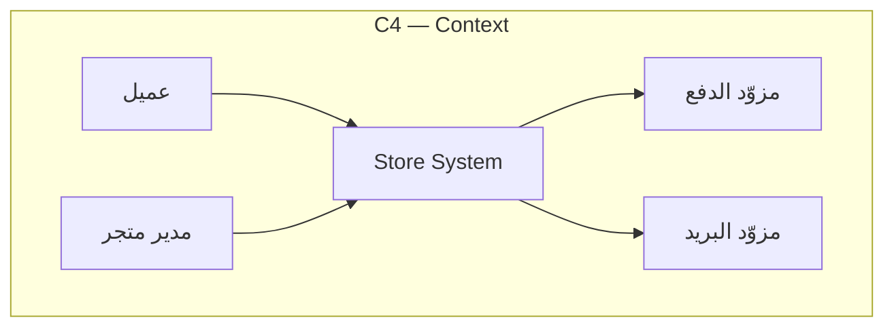
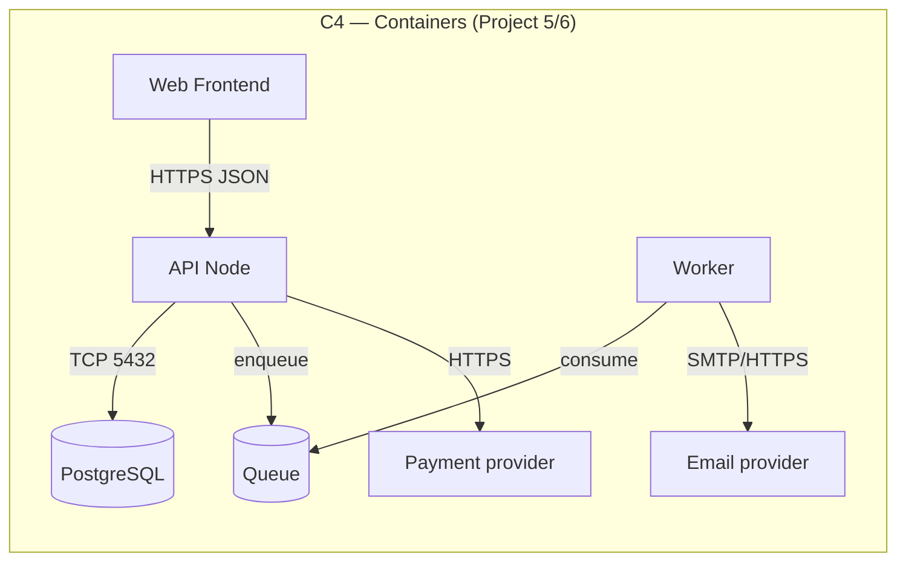
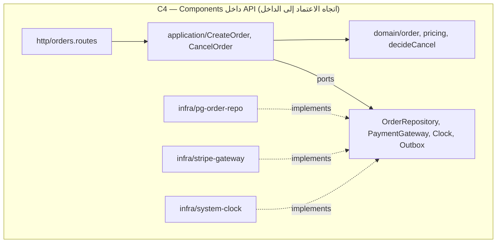
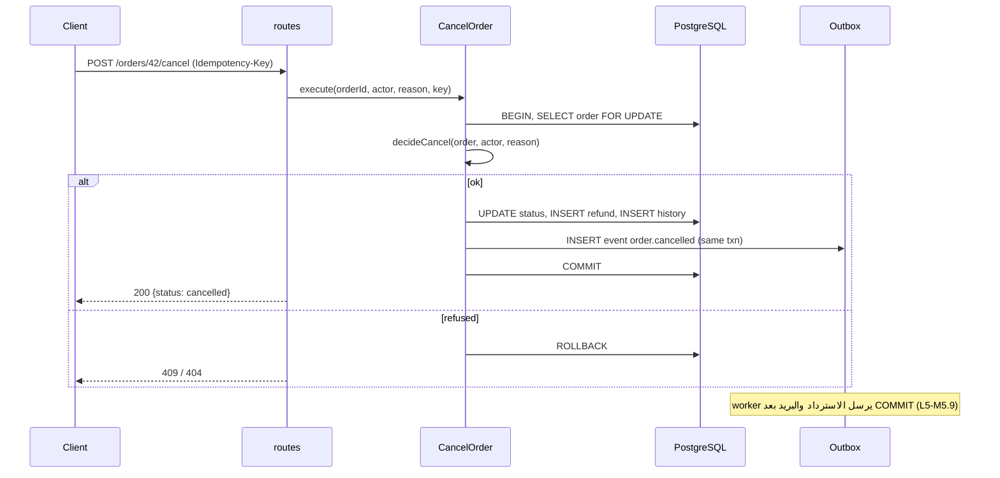

# Module 4.5 — تصميم البرمجيات
## Software Design: requirements → architecture → design → implementation; design before code; sketching boundaries; design docs

> **المستوى:** Level 4 | **الموقع:** [6 من 16]
> **السابق:** [M4.4 — Estimation](module-4.4-estimation.md) | **التالي:** [M4.6 — Abstraction, Encapsulation, Modularity](module-4.6-abstraction-encapsulation-modularity.md)

---

## 1. المتطلبات
> **قبل أن تتعلم هذا، يجب أن تفهم:**
- [ ] متطلبات مرقّمة (FR/NFR/C/A) ومعايير قبول — [M4.2](module-4.2-requirements.md), [M4.3](module-4.3-user-stories-acceptance-criteria.md)
- [ ] معمارية تطبيق الويب: Frontend/Backend/DB، حدود الثقة، stateless app — [L2-M2.13](../level-2-computer-systems/module-2.13-web-app-architecture.md)
- [ ] تصميم قواعد البيانات والعلاقات — [L3-M3.12](../level-3-core-computer-science/module-3.12-database-design.md)
- [ ] الوحدات والاستيراد/التصدير في TypeScript — [L1-M1.8](../level-1-programming/module-1.8-modules.md)

## 2. أهداف التعلّم
- التمييز بين **المعمارية** (architecture: القرارات المكلفة التغيير — الحدود، البيانات، الاتصال، التقنيات) و**التصميم** (design: تنظيم الكود داخل الحدود) و**التنفيذ** — ولماذا الترتيب `requirements → architecture → design → implementation` مع أسهم رجوع.
- **التصميم قبل الكود** بالجرعة المناسبة: رسم الحدود، تدفق البيانات، العقود (interfaces) والسيناريوهات الحرجة، قبل أول سطر.
- استخدام أدوات التصميم الخفيفة: **C4** (Context/Container/Component)، **مخطط تسلسل** للسيناريو الحرج، **نموذج بيانات**، و**عقد API**.
- كتابة **وثيقة تصميم** (design doc) قصيرة: المشكلة، الأهداف/اللا-أهداف، التصميم المقترح، البدائل، المقايضات، المخاطر، خطة النشر — وتسجيل القرارات (ADR، تفصيله في L6-M6.3).
- تطبيق **المعمارية الطبقية** (HTTP → application/domain → infrastructure) ومبدأ **اتجاه الاعتماد** على Project 4، كأساس لكل ما يليه.

---

## 3. شرح للمبتدئ

### ثلاث طبقات من القرار
- **المعمارية**: القرارات التي يصعب التراجع عنها لاحقًا: كم خدمة؟ أي DB؟ متزامن أم طابور؟ أين حدود الثقة؟ كيف تتواصل الأجزاء؟ ما العقود بينها؟ (الخطأ هنا يكلّف شهورًا.)
- **التصميم**: داخل الحدود: أي وحدات، أي واجهات، كيف تتدفق البيانات، أين يعيش منطق العمل، كيف تُعالج الأخطاء. (الخطأ هنا يكلّف أيامًا إلى أسابيع — refactoring.)
- **التنفيذ**: الكود نفسه، الأسماء، الخوارزميات. (الخطأ هنا يكلّف ساعات.)

الترتيب منطقي لا زمني صارم: تبدأ بالمعمارية **بأقل ما يكفي**، تصمّم أول شريحة، تنفّذها، وتعود لتعدّل التصميم بما تعلّمت (M4.1). لكن القرارات المعمارية الكبرى تُتّخذ **بوعي وتوثيق**، لا بالصدفة لأن أول ملف كتبته استورد مكتبة.

### لماذا التصميم قبل الكود (بجرعة)
الكود مكلف التغيير مقارنة بالرسم. 30 دقيقة على ورقة تكشف: "من أين يأتي سعر المنتج وقت الطلب؟ (لقطة)"، "ماذا لو فشل البريد بعد COMMIT؟"، "الواجهة تحتاج إجمالي الطلب — نحسبه كل مرة أم نخزّنه؟". كل واحد من هذه أرخص بـ 10–100× قبل الكود. الجرعة: **ميزة بسيطة = 5 دقائق ورسم في وصف PR؛ ميزة تمسّ البيانات/الأمان/التكامل = وثيقة صفحة أو صفحتين ومراجعة؛ نظام جديد = مراجعة معمارية.**

### أربع رسومات تكفي 90% من الحالات
1. **السياق (C4-Context)**: نظامك كصندوق، ومن حوله: المستخدمون والأنظمة الخارجية (مزوّد دفع، بريد). يجيب: ما الذي نملكه وما الذي لا نملكه؟
2. **الحاويات (C4-Container)**: الأجزاء القابلة للنشر: API، DB، worker، cache، frontend — والبروتوكول بينها. يجيب: أين تعيش الحالة؟ ما الذي يفشل مستقلًا؟
3. **المكوّنات (C4-Component)** داخل حاوية: الوحدات الرئيسية واتجاه الاعتماد. يجيب: أين يعيش منطق العمل؟
4. **مخطط تسلسل** لـ 1–3 سيناريوهات **حرجة** (ليس كلها): إنشاء طلب مع دفع، إلغاء مع استرداد. يجيب: ما ترتيب الخطوات، أين المعاملة، ماذا لو فشلت الخطوة N؟

أضف **نموذج بيانات** (الجداول والعلاقات — L3-M3.12) و**عقد API** (المسارات، الطلب/الاستجابة، الأخطاء — L5-M5.1). بالورقة أو Mermaid؛ الأداة لا تهم، الأسئلة التي يفرضها الرسم هي ما يهم.

### المعمارية الطبقية واتجاه الاعتماد
النمط الذي ستستخدمه من الآن حتى L7:
```
   HTTP / CLI (interface)  →  Application (use cases)  →  Domain (قواعد العمل، نقية)
                                        ↓ (عبر واجهات)
                              Infrastructure (DB, email, payment, clock)
```
القاعدة الذهبية: **الاعتماد يتجه إلى الداخل**. المجال لا يعرف HTTP ولا SQL. التطبيق ينسّق: يستدعي المجال ويطلب من البنية التحتية عبر **واجهات** (ports) يملكها هو، وتنفّذها البنية التحتية (adapters) — ستفهم لماذا هذا يحرّر الاختبار والتغيير في M4.6–4.9. `decideCancel` من M4.3 كان مجالًا نقيًا؛ معاملة الإلغاء هي التطبيق؛ `pg` والبريد بنية تحتية؛ endpoint واجهة.

### وثيقة التصميم (صفحة إلى صفحتين)
1. **المشكلة والسياق** (رابط للمتطلبات). 2. **الأهداف** و**اللا-أهداف** (non-goals: ما لا نحله عمدًا — يمنع نقاشات لا نهائية). 3. **التصميم المقترح**: الرسومات الأربعة أو بعضها، نموذج البيانات، العقود، معالجة الأخطاء/الفشل. 4. **البدائل المدروسة** ولماذا رُفضت (أهم قسم للمراجعين). 5. **المقايضات والمخاطر** (ACTRR). 6. **خطة النشر والتراجع** (expand/contract، flags). 7. **أسئلة مفتوحة**. تُراجَع **قبل** الكود الكبير، وتبقى مرجعًا؛ القرارات المهمة تُستخرج كـ ADR قصير (L6-M6.3).

### علامات تصميم جيد (ستتعمّق فيها في الوحدات التالية)
- التغيير المحتمل يلمس **مكانًا واحدًا** (M4.7 تماسك/اقتران).
- يمكن اختبار منطق العمل **بلا DB ولا شبكة** (M4.6 واجهات، M4.11).
- الحدود تطابق **حدود الثقة والفشل**: ما يفشل معًا يعيش معًا.
- القرارات غير القابلة للعكس **قليلة ومؤجَّلة** قدر الإمكان ("آخر لحظة مسؤولة").
- يستطيع زميل شرح التصميم من الرسم في 5 دقائق.

---

## 4. النموذج الذهني

```
   المتطلبات ──▶ المعمارية (حدود، بيانات، اتصال، تقنيات: غالي التغيير)
                    └──▶ التصميم (وحدات، واجهات، تدفق، أخطاء: متوسط)
                             └──▶ التنفيذ (كود، أسماء: رخيص)
   ◀── كل مستوى يعيد أسئلة إلى الأعلى

   الاعتماد يتجه إلى الداخل:   Interface → Application → Domain ◀── Infrastructure (عبر واجهات يملكها التطبيق)
```

**صمّم بالجرعة التي تجعل الخطأ التالي رخيصًا.**

---

## 5. الرسم التوضيحي









---

## 6. مثال بسيط

ميزة "إلغاء الطلب مع استرداد" — تصميم في 10 دقائق قبل الكود:
- **حدود**: الاسترداد عملية خارجية (مزوّد دفع) قد تفشل أو تتأخر → **لا تُنفَّذ داخل معاملة DB** (L3-M3.14). القرار: المعاملة تسجّل *نية* الاسترداد (صف `refunds` بحالة `pending` + حدث outbox)، وworker ينفّذها.
- **بيانات**: `refunds(id, order_id, amount_cents, status, provider_ref, created_at)`؛ `order_status_history` موجود.
- **عقد**: `POST /orders/{id}/cancel` body `{reason}`, header `Idempotency-Key`; 200/404/409/422.
- **تدفق الفشل**: فشل المزوّد → `refunds.status = failed` + تنبيه + إعادة محاولة بتراجع أسّي؛ العميل يرى "الاسترداد قيد المعالجة".
- **لا-أهداف**: استرداد جزئي، إلغاء بعد الشحن (إرجاع).
- **خطر**: سباق إلغاء/شحن متزامن → `FOR UPDATE` على الطلب.
- **بدائل مرفوضة**: استدعاء المزوّد داخل المعاملة (قفل طويل + ازدواج عند timeout)؛ استرداد يدوي (لا يحقق so that).

خمسة أسئلة أُجيبت على الورق كانت ستصبح ثلاثة أخطاء إنتاج.

---

## 7. مثال كود

التصميم يتحوّل إلى **هيكل ملفات + واجهات** قبل أي منطق. هذا "الكود" هو تصميم قابل للتجميع.

```typescript
// src/ports.ts — العقود التي يملكها التطبيق (ports). البنية التحتية تنفّذها؛ المجال لا يعرفها أصلًا.
import type { Order, OrderStatus } from "./cancel-order.js";                 // المجال من M4.3 (نقي)

export interface OrderRepository {                                            // ما يحتاجه التطبيق من التخزين — لا أكثر (M4.8 ISP)
  findForUpdate(id: string): Promise<Order | undefined>;
  setStatus(id: string, from: OrderStatus, to: OrderStatus, by: string, reason: string): Promise<void>;
}
export interface RefundRepository { createPending(orderId: string, amountCents: number): Promise<{ refundId: string }>; }
export interface Outbox { publish(event: { type: "order.cancelled"; orderId: string; refundId?: string }): Promise<void>; }
export interface UnitOfWork { run<T>(fn: (tx: { orders: OrderRepository; refunds: RefundRepository; outbox: Outbox }) => Promise<T>): Promise<T>; }   // المعاملة كحد (L3-M3.14 withTransaction)
export interface Clock { now(): Date; }
```

```typescript
// src/cancel-order.usecase.ts — طبقة التطبيق: تنسّق المجال والمنافذ؛ لا SQL ولا HTTP هنا
import { decideCancel } from "./cancel-order.js";
import type { UnitOfWork } from "./ports.js";

export type CancelResult = { status: 200 | 404 | 409; body: { status?: string; message?: string; refundId?: string } };

export const makeCancelOrder = (uow: UnitOfWork) =>
  async (input: { orderId: string; actorCustomerId: string; reason: string }): Promise<CancelResult> =>
    uow.run(async ({ orders, refunds, outbox }) => {
      const order = await orders.findForUpdate(input.orderId);
      const d = decideCancel(order, { customerId: input.actorCustomerId }, input.reason);
      if (!d.ok) return { status: d.status, body: { message: d.message } };
      if (d.replayed) return { status: 200, body: { status: "cancelled" } };
      let refundId: string | undefined;
      await orders.setStatus(order!.id, order!.status, "cancelled", input.actorCustomerId, input.reason);
      if (d.effects.includes("create_full_refund")) refundId = (await refunds.createPending(order!.id, order!.totalCents)).refundId;
      await outbox.publish({ type: "order.cancelled", orderId: order!.id, refundId });        // في نفس المعاملة: لا يضيع حدث ولا يُرسل بلا COMMIT
      return { status: 200, body: { status: "cancelled", refundId } };
    });
```

```typescript
// src/cancel-order.usecase.test.ts — لأن المنافذ واجهات، نختبر حالة الاستخدام كاملة في الذاكرة (بلا PostgreSQL) — M4.6/M4.11
import { test } from "node:test"; import assert from "node:assert/strict";
import { makeCancelOrder } from "./cancel-order.usecase.js";
import type { Order } from "./cancel-order.js"; import type { UnitOfWork } from "./ports.js";

function fakeUow(seed: Order[]) {                                             // fake: تنفيذ حقيقي مبسّط في الذاكرة (ليس mock)
  const orders = new Map(seed.map(o => [o.id, { ...o }])); const events: unknown[] = []; const refunds: unknown[] = [];
  const uow: UnitOfWork = { run: fn => fn({                                    // لا معاملة فعلية: كافٍ لاختبار القرار والتأثيرات
    orders: { findForUpdate: async id => orders.get(id), setStatus: async (id, _f, to) => { orders.get(id)!.status = to; } },
    refunds: { createPending: async (orderId, amountCents) => { refunds.push({ orderId, amountCents }); return { refundId: "r1" }; } },
    outbox: { publish: async e => { events.push(e); } },
  }) };
  return { uow, orders, events, refunds };
}

test("paid order → cancelled + pending refund + one outbox event", async () => {
  const f = fakeUow([{ id: "o1", customerId: "A", status: "paid", totalCents: 5000 }]);
  const res = await makeCancelOrder(f.uow)({ orderId: "o1", actorCustomerId: "A", reason: "changed mind" });
  assert.equal(res.status, 200); assert.equal(f.orders.get("o1")!.status, "cancelled");
  assert.deepEqual(f.refunds, [{ orderId: "o1", amountCents: 5000 }]); assert.equal(f.events.length, 1);
});
test("shipped order → 409 and nothing written", async () => {
  const f = fakeUow([{ id: "o1", customerId: "A", status: "shipped", totalCents: 5000 }]);
  const res = await makeCancelOrder(f.uow)({ orderId: "o1", actorCustomerId: "A", reason: "x" });
  assert.equal(res.status, 409); assert.equal(f.events.length, 0); assert.equal(f.refunds.length, 0);
});
```

```
   هيكل الملفات الذي يفرضه التصميم (Project 5 سيتبعه)
   src/
     http/            orders.routes.ts         ← يترجم HTTP ↔ use case (أكواد الحالة، التحقق من الشكل)
     application/     cancel-order.usecase.ts  ← التنسيق، المعاملة كحد، المنافذ
                      ports.ts
     domain/          order.ts, pricing.ts, cancel-order.ts  ← قواعد نقية، لا import من الخارج
     infra/           pg/*.ts, email/*.ts, payment/*.ts, clock.ts  ← تنفيذ المنافذ
   قاعدة ESLint لاحقًا (M4.7): domain/ لا يستورد من application/ أو infra/ أو http/.
```

---

## 8. مثال من العالم الحقيقي
فريق بدأ "بالكود مباشرة": كل route يستدعي `pool.query` ويحسب الأسعار ويرسل البريد. بعد سنة: تغيير مزوّد البريد لمس 23 ملفًا؛ اختبار قاعدة خصم يحتاج DB وSMTP وهميين؛ وتحويل الإرسال إلى طابور استحال لأن `sendEmail` ينتظر نتيجة متزامنة في منتصف المعاملة. إعادة الهيكلة إلى الطبقات أخذت 3 أشهر — تصميم 3 ساعات في البداية كان سيمنعها. ليس لأن الطبقات "نمط صحيح"، بل لأن **التغييرات المحتملة** (مزوّد، طابور، اختبار) كانت متوقعة وكان يمكن عزلها.

## 9. مثال من الإنتاج
شركات كبيرة تشترط **design review** لأي تغيير يمسّ البيانات أو واجهة عامة أو الأمان: وثيقة بالقالب أعلاه، مراجعان، أسبوع تعليقات، ثم قرار مسجَّل. ليست بيروقراطية حين تكون القاعدة "الجرعة بحسب الأثر": تغيير في صفحة إعدادات = وصف PR؛ تغيير في نموذج بيانات الطلبات = وثيقة. القيمة الكبرى ليست في "الموافقة" بل في قسم **البدائل المرفوضة**: بعد عامين، حين يسأل أحدهم "لماذا لم نستدعِ المزوّد مباشرة؟"، الجواب موجود — فلا يُعاد الخطأ باسم التبسيط.

---

## 10. مفاهيم خاطئة شائعة
1. **"التصميم المسبق = Big Design Up Front = ضد Agile."** المرفوض هو تصميم *كل شيء* مسبقًا؛ المطلوب تصميم *ما يكفي* للشريحة التالية، مع قرارات معمارية واعية.
2. **"الطبقات = ملفات أكثر = تعقيد."** الملفات أكثر، لكن كل تغيير يلمس أقل. التعقيد الذي يهم هو تعقيد التغيير لا عدد الملفات.
3. **"المعمارية تُقرَّر مرة واحدة."** تتطور؛ لكن تطويرها واعٍ (ADR) لا عشوائي، وبعض القرارات (DB، حدود الخدمات) أغلى من غيرها فتُدرس أكثر.
4. **"الرسومات تتقادم فلا فائدة."** رسومات السياق والحاويات تتغير ببطء وتبقى صالحة؛ رسومات المكوّنات التفصيلية تتقادم — لذلك ارسم القليل واجعل الكود (الهيكل، الواجهات) يحمل الباقي.
5. **"المجال النقي" رفاهية أكاديمية.** هو ما يجعل اختبار قاعدة عمل يستغرق 2ms بدل 2s، وهو ما يسمح بتغيير DB أو إضافة CLI بلا لمس القواعد.

## 11. أخطاء شائعة
1. البدء بالكود والسماح لأول مكتبة/إطار بتحديد المعمارية.
2. منطق العمل في routes أو في SQL أو في الواجهة الأمامية — أو في الثلاثة بنسخ مختلفة.
3. استدعاءات خارجية (دفع/بريد) داخل معاملة DB.
4. وثيقة تصميم بلا لا-أهداف ولا بدائل → نقاش لا ينتهي ثم قرار غير موثّق.
5. رسم 20 مخططًا تفصيليًا بدل 4 أساسية + سيناريو حرج.
6. تصميم للمستقبل المتخيَّل ("قد نحتاج 5 قواعد بيانات") بدل التغييرات المحتملة فعلًا.
7. تجاهل مسارات الفشل في مخطط التسلسل — الرسم للمسار السعيد فقط.

## 12. تمرين تصحيح
ميزة إلغاء أُنجزت و"تعمل"، لكن في الإنتاج: استردادات مزدوجة أحيانًا، وطلبات عالقة بحالة `cancelled` بلا استرداد أحيانًا أخرى.
- **لاحظ:** الكود يستدعي `payment.refund()` داخل `withTransaction` قبل `COMMIT`.
- **دليل:** السجلات تُظهر: (أ) timeout من المزوّد → ROLLBACK → المستخدم يعيد المحاولة → استرداد ثانٍ (الأول نجح فعلًا لدى المزوّد لكننا لم نعرف)؛ (ب) نجاح المزوّد ثم فشل COMMIT بسبب deadlock → طلب غير مُلغى ومال مسترد.
- **فرضية:** خطأ **تصميمي** لا برمجي: خلط عملية خارجية غير ذرية مع معاملة ذرية.
- **تجربة:** انقل الاسترداد إلى outbox + worker بمفتاح idempotency لدى المزوّد (`refund(orderId)` كمفتاح)، وأعد تشغيل سيناريوهَي الفشل بحقن أعطال.
- **استنتاج:** لم يكن ليُكتشف بمراجعة كود سطرًا سطرًا؛ يُكتشف بمخطط تسلسل يسأل "ماذا لو فشلت هذه الخطوة؟" عند كل سهم. **ارسم الفشل.**

## 13. تمرين معماري
اكتب وثيقة تصميم (≤ صفحتين) لـ **Project 5** قبل بنائه: C4 سياق وحاويات، مكوّنات API بالطبقات، نموذج بيانات الجلسات/المستخدمين/الأدوار، عقد API للمصادقة، مخطط تسلسل لـ "تسجيل دخول + طلب محمي" ولـ "إبطال كل الجلسات عند تغيير كلمة المرور" مع مسارات الفشل، لا-أهداف، بدائل (جلسات في DB vs JWT — ACTRR)، مخاطر، خطة نشر. ستراجعها بنفسك بعد إنهاء المشروع: ما الذي صمد؟ ما الذي تغيّر ولماذا؟

## 14. الصلة بعصر AI
التصميم هو **المستوى الذي يجب أن يملكه الإنسان** عندما يكتب النموذج معظم الكود: الحدود، العقود، تدفقات الفشل، اللا-أهداف. وكيل يتلقى `ports.ts` ووثيقة تصميم بمسارات فشل ينتج تنفيذًا يلائم المعمارية؛ وكيل يتلقى "ابنِ إلغاء الطلب" يضع `pool.query` و`fetch(stripe)` في route واحد — لأنه الأقصر. وفي الاتجاه الآخر، AI ممتاز في **نقد التصميم**: "ما الذي قد يفشل في هذا المخطط؟ ما البدائل التي لم أذكرها؟" (L8-M8.3: AI-assisted SDLC، مرحلة التصميم.)

## 15. ما يجب إتقانه (Must Master) 🔴
- 🔴 معمارية vs تصميم vs تنفيذ بتكلفة التغيير؛ التصميم قبل الكود بالجرعة؛ الرسومات الأربع + نموذج بيانات + عقد؛ الطبقات واتجاه الاعتماد إلى الداخل؛ المنافذ (ports) كواجهات يملكها التطبيق؛ "ارسم الفشل"؛ قالب وثيقة التصميم مع لا-أهداف وبدائل.

## 16. ما يجب فهمه (Should Understand) 🟠
- 🟠 C4 رسميًا؛ المعاملة كحد (unit of work)؛ outbox كنتيجة تصميمية لعمليات خارجية؛ "آخر لحظة مسؤولة" للقرارات؛ design review كعملية؛ ADR (يُفصَّل في L6).

## 17. ما يمكن تأجيله (Can Defer) ⚪
- ⚪ Clean/Hexagonal/Onion Architecture بمصطلحاتها الكاملة (كلها نفس اتجاه الاعتماد)، DDD الاستراتيجي (bounded contexts — سيظهر في L7-M7.9)، أدوات النمذجة الرسمية (UML الكامل، ArchiMate).

## 18. الخلاصة
1. المعمارية = القرارات الغالية (حدود، بيانات، اتصال)؛ التصميم = التنظيم داخلها؛ التنفيذ = الكود. صمّم بالجرعة التي تجعل الخطأ التالي رخيصًا.
2. أربع رسومات (سياق، حاويات، مكوّنات، تسلسل السيناريو الحرج) + نموذج بيانات + عقد API تكفي غالبًا — وارسم مسارات الفشل.
3. الاعتماد يتجه إلى الداخل: HTTP → تطبيق → مجال نقي؛ البنية التحتية خلف منافذ يملكها التطبيق.
4. العمليات الخارجية لا تعيش داخل معاملة DB؛ سجّل النية وافصل التنفيذ.
5. وثيقة تصميم قصيرة بلا-أهداف وبدائل ومخاطر وخطة نشر — تُراجَع قبل الكود وتبقى ذاكرة الفريق.

## 19. مراجع رسمية
- C4 model (Simon Brown) — Context/Container/Component diagrams: https://c4model.com/
- Google — Design Docs at Google (structure and purpose): https://www.industrialempathy.com/posts/design-docs-at-google/
- Alistair Cockburn — Hexagonal Architecture (Ports & Adapters): https://alistair.cockburn.us/hexagonal-architecture/
- Robert C. Martin — The Clean Architecture (dependency rule): https://blog.cleancoder.com/uncle-bob/2012/08/13/the-clean-architecture.html
- Mermaid — sequence & flowchart syntax for lightweight design diagrams: https://mermaid.js.org/syntax/sequenceDiagram.html

## المصطلحات
| العربية | English |
|---|---|
| معمارية البرمجيات | Software architecture |
| تصميم البرمجيات | Software design |
| وثيقة تصميم | Design doc |
| لا-أهداف | Non-goals |
| مخطط سياق / حاويات / مكوّنات | Context / Container / Component diagram (C4) |
| مخطط تسلسل | Sequence diagram |
| منفذ / مهايئ | Port / Adapter |
| اتجاه الاعتماد | Dependency direction / Dependency rule |
| وحدة العمل (المعاملة كحد) | Unit of Work |
| صندوق الصادر | Outbox |
| مراجعة التصميم | Design review |
| سجل قرار معماري | Architecture Decision Record (ADR) |
