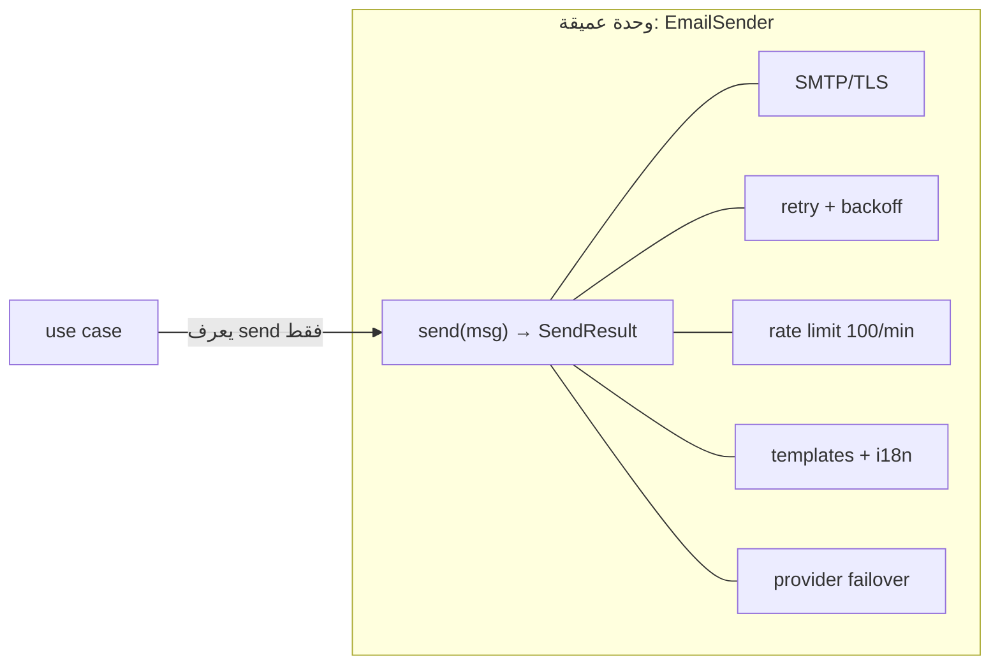

# Module 4.6 — التجريد والتغليف والوحدات
## Abstraction, Encapsulation, Modularity: `sendEmail()` hides SMTP; interfaces; information hiding; deep vs shallow modules; leaky abstractions

> **المستوى:** Level 4 | **الموقع:** [7 من 16]
> **السابق:** [M4.5 — Software Design](module-4.5-software-design.md) | **التالي:** [M4.7 — Coupling & Cohesion](module-4.7-coupling-cohesion.md)

---

## 1. المتطلبات
> **قبل أن تتعلم هذا، يجب أن تفهم:**
- [ ] الطبقات والمنافذ (ports) واتجاه الاعتماد — [M4.5](module-4.5-software-design.md)
- [ ] الدوال والإغلاقات (closures) — [L1-M1.4](../level-1-programming/module-1.4-functions-scope-closures.md); الوحدات والتصدير — [L1-M1.8](../level-1-programming/module-1.8-modules.md)
- [ ] الأنواع، `interface`، `readonly`، `#private` في TypeScript — [L1-M1.15](../level-1-programming/module-1.15-typescript-types.md)
- [ ] مثال تجريد تعرفه: `fetch` يخفي TCP/TLS/HTTP؛ `pool.query` يخفي الاتصالات — [L2-M2.12](../level-2-computer-systems/module-2.12-http.md), [L3-M3.10](../level-3-core-computer-science/module-3.10-databases-from-zero.md)

## 2. أهداف التعلّم
- تعريف **التجريد** (abstraction: واجهة بسيطة تخفي تعقيدًا — *ما* يفعله بلا *كيف*)، **التغليف** (encapsulation: منع الوصول إلى الداخل حتى لا يعتمد عليه أحد)، و**الوحدات** (modularity: تقسيم النظام إلى أجزاء بحدود صريحة) — والعلاقة بينها.
- تطبيق **إخفاء المعلومات** (information hiding، Parnas): الوحدة تخفي **قرارًا قابلًا للتغيير** (مزوّد البريد، تنسيق الملف، خوارزمية التسعير) لا مجرد "تفاصيل".
- التمييز بين **الوحدة العميقة** (deep: واجهة صغيرة تخفي الكثير) و**الضحلة** (shallow: واجهة بحجم ما تخفيه) — ولماذا الكثير من "الطبقات" ضحلة وضارة.
- التعرّف على **التجريد المتسرّب** (leaky abstraction) والتعامل معه بوعي: كل تجريد يتسرّب أحيانًا (أداء، فشل)، فيجب أن تعرف ما تحته.
- بناء واجهات في TypeScript: `interface` كعقد، `#private`/closures للتغليف، `export` انتقائي للوحدة، وأنواع **لا تسمح بالحالة غير الصالحة**.

---

## 3. شرح للمبتدئ

### ثلاثة مفاهيم، فكرة واحدة: حدّ
أنت تستخدم التجريد منذ L0: `fetch(url)` سطر واحد يخفي DNS وTCP وTLS وتجزئة HTTP وإعادة التوجيه. لم تحتج معرفة أي منها لتستخدمه — وعندما احتجت (timeout، `ECONNREFUSED`) عرفت ما تحته من L2. هذه هي الفكرة كاملة:
- **التجريد**: تحديد *ما* تقدّمه الوحدة (الواجهة) وفصله عن *كيف* (التنفيذ). `sendEmail(to, subject, body)` تجريد؛ SMTP وTLS والمصادقة وإعادة المحاولة والـ rate limit هي الـ"كيف".
- **التغليف**: منع الخارج من لمس الـ"كيف": لا وصول إلى اتصال SMTP، إلى الطابور الداخلي، إلى عدّاد المحاولات. لماذا؟ لأن **كل ما يُرى سيُعتمد عليه**، وكل ما يُعتمد عليه لا يمكن تغييره.
- **الوحدات**: النظام مقسوم إلى أجزاء كل منها تجريد مغلّف بحدّ صريح (ملف/مجلد/حزمة) وواجهة مُعلنة (`export`). الاعتماد يمرّ عبر الواجهات فقط.

### إخفاء المعلومات: أخفِ القرار لا التفاصيل
Parnas (1972): قسّم النظام بحيث **تخفي كل وحدة قرار تصميم يُحتمل تغييره**. اسأل: "ما الذي قد يتغير؟" — مزوّد البريد، طريقة التخزين، صيغة التصدير، قواعد الضريبة، خوارزمية الترتيب — ثم ضع كل واحد خلف واجهة لا تكشفه. الاختبار: لو تغيّر القرار، كم ملفًا خارج الوحدة يتغير؟ الجواب الصحيح: **صفر**. هذا هو جوهر M4.5 (المنافذ) وM4.7 (الاقتران) وM4.8 (DIP): كلها إخفاء معلومات بأسماء مختلفة.

### واجهة الوحدة = ما تَعِد به، لا ما تملكه
واجهة `EmailSender` الجيدة: `send(message): Promise<SendResult>`. السيئة: `getSmtpClient()`, `setRetryCount()`, `flushQueue()` — كشفت القرارات الثلاثة (SMTP، إعادة المحاولة، طابور) فصار تغيير أي منها كسرًا للمستخدمين. القاعدة: **الواجهة تُصاغ بلغة المستخدِم (المجال)، لا بلغة التنفيذ.** `PaymentGateway.refund(orderId, amount)` لا `StripeClient.createRefundIntent(paymentIntentId, { idempotencyKey })`.

### عميق vs ضحل
(Ousterhout) قيمة الوحدة = **الوظيفة التي تخفيها ÷ حجم واجهتها**.
- **عميقة**: `fetch`، `pool.query`، `fs.readFile`، `withTransaction` (M3.14): واجهة سطر، خلفها صفحات.
- **ضحلة**: `class UserRepositoryImpl { findById(id) { return db.findById("users", id); } }` — سطر يخفي سطرًا؛ `getX()/setX()` لكل حقل؛ "طبقة خدمة" تمرّر كل استدعاء كما هو. الضحلة **تكلّف** (ملف، اسم، قفزة ذهنية) ولا تخفي شيئًا.
المعيار ليس "عدد الطبقات" بل: **هل تستطيع تغيير ما تحت الواجهة بلا لمس من فوقها؟** إن كانت الواجهة تعكس التنفيذ واحدًا لواحد فالإجابة لا.

### التجريد المتسرّب
(Spolsky) **كل التجريدات غير التافهة تتسرّب**: `fetch` يتسرّب عند الشبكة البطيئة (timeout)، `Map` يتسرّب عند ملايين المفاتيح (ذاكرة، L3-M3.1)، ORM يتسرّب عند N+1 (L3-M3.11)، المعاملة تتسرّب عند deadlock. لا يعني هذا أن التجريد سيئ؛ يعني أنك **تحتاج أن تعرف طبقة واحدة تحت ما تستخدمه** لتفهم فشله وأداءه — وهذا بالضبط لماذا درست L2 وL3 قبل هذا المستوى. صمّم واجهاتك بحيث **تُظهر التسرّبات المهمة** بدل إخفائها: `send()` تعيد `{ ok: false, retryable: true }` بدل ابتلاع الفشل؛ `findMany` تطلب `limit` إلزاميًا بدل إرجاع "كل شيء".

### التغليف في TypeScript عمليًا
- **الوحدة** (ملف) هي وحدة التغليف الأولى: `export` فقط الواجهة؛ الباقي خاص تلقائيًا. لا تحتاج class لكل شيء.
- **Closures**: `makeCounter()` يخفي المتغير تمامًا (L1-M1.4) — تغليف لا يمكن كسره حتى بالتأمل.
- **`#private`** في الصفوف: خاص فعلًا في وقت التشغيل (بعكس `private` TS الذي يُمحى — L1-M1.15 "الأنواع تُمحى").
- **`readonly` وأنواع تمنع الحالة غير الصالحة**: `type Email = string & { readonly __brand: "Email" }` يُنشأ عبر دالة تحقق فقط → لا يصل بريد غير مُتحقَّق إلى `send`. بدل "تحقّق في كل مكان"، **اجعل الحالة غير الصالحة غير قابلة للتمثيل**.
- **Interface كعقد**: المستهلك يعتمد على `interface` التي يملكها (M4.5)، لا على الصف الملموس؛ التنفيذات تُستبدل (حقيقي/وهمي/جديد) بلا لمس المستهلك.

---

## 4. النموذج الذهني

```
   ┌──────────────── وحدة ────────────────┐
   │  واجهة (صغيرة، بلغة المجال، تَعِد بـ"ما")  │ ◀── الخارج يرى هذا فقط
   ├──────────────────────────────────────┤
   │  تنفيذ (كبير، يحمل القرار القابل للتغيير) │ ◀── مغلّف: لا يراه أحد → يمكن تغييره بحرّية
   └──────────────────────────────────────┘
   عمق الوحدة = التنفيذ المخفي ÷ حجم الواجهة.     كل ما يُرى سيُعتمد عليه.     كل تجريد يتسرّب: اعرف ما تحته.
```

---

## 5. الرسم التوضيحي



```
   ضحلة (✗)                                      عميقة (✓)
   class OrderService {                           withTransaction(async tx => {...})
     getOrder(id)  { return repo.getOrder(id) }      ← سطر واحد يخفي: pool.connect, BEGIN, SET LOCAL timeouts,
     saveOrder(o)  { return repo.saveOrder(o) }        COMMIT/ROLLBACK, retry 40001/40P01 + backoff, release
     ...
   }   ← كل دالة تمرّر فقط؛ الواجهة = التنفيذ

   التسرّب المقصود:  send() → { ok: true, id } | { ok: false, retryable: boolean, reason }
   التسرّب المدفون:  send() → void  (الفشل يُبتلع؛ ستكتشفه من العميل)
```

---

## 6. مثال بسيط

```typescript
// src/counter.ts — التغليف الأبسط: closure. لا أحد يستطيع كتابة count = 1000
export function makeRateLimiter(limitPerMinute: number, now = () => Date.now()) {
  const stamps: number[] = [];                                           // الحالة الداخلية: مخفية تمامًا
  return {
    tryAcquire(): boolean {                                              // الواجهة: سؤال واحد
      const cutoff = now() - 60_000;
      while (stamps.length && stamps[0]! < cutoff) stamps.shift();        // نافذة منزلقة (L3-M3.7)
      if (stamps.length >= limitPerMinute) return false;
      stamps.push(now()); return true;
    },
  };
}
// غدًا تستبدل المصفوفة بـ token bucket أو بـ Redis — ولا يتغير حرف عند المستدعين. هذا هو إخفاء القرار.
// (التسرّب المعروف: shift() على مصفوفة O(n) — L3-M3.2؛ عند 100k/دقيقة استبدلها بـ ring buffer. الواجهة لا تتغير.)
```

---

## 7. مثال كود

```typescript
// src/email.ts — تجريد عميق: واجهة بلغة المجال، تنفيذ يحمل القرارات، تسرّبات مقصودة، حالة غير صالحة غير قابلة للتمثيل
import { setTimeout as sleep } from "node:timers/promises";

// 1) نوع موسوم: لا يمكن صنع Email إلا عبر parseEmail → send() لا تتحقق مرة أخرى أبدًا
export type Email = string & { readonly __brand: "Email" };
export function parseEmail(s: string): Email | undefined { return /^[^\s@]+@[^\s@]+\.[^\s@]+$/.test(s) ? (s.toLowerCase() as Email) : undefined; }

// 2) الواجهة: ما يحتاجه المجال فقط. لا SMTP، لا retry، لا provider
export type Message = { to: Email; subject: string; text: string; idempotencyKey: string };
export type SendResult = { ok: true; providerId: string } | { ok: false; retryable: boolean; reason: string };   // التسرّب المقصود: الفشل مرئي ومصنّف
export interface EmailSender { send(m: Message): Promise<SendResult>; }

// 3) ما يحتاجه التنفيذ من الخارج: منفذ أصغر (المزوّد الخام) — قابل للاستبدال والاختبار
export interface RawTransport { deliver(m: Message): Promise<{ id: string }>; }     // يرمي عند الفشل

// 4) التنفيذ العميق: retry بتراجع أسّي، تصنيف الأخطاء، حد معدّل — كلها قرارات مخفية
export function makeEmailSender(transport: RawTransport, opts: { maxAttempts?: number; perMinute?: number; sleepFn?: typeof sleep } = {}): EmailSender {
  const { maxAttempts = 3, perMinute = 100, sleepFn = sleep } = opts;
  const limiter = makeWindow(perMinute);
  const sent = new Map<string, string>();                                            // idempotency داخل العملية (في الإنتاج: جدول — L3-M3.14)
  return {
    async send(m) {
      const dup = sent.get(m.idempotencyKey); if (dup) return { ok: true, providerId: dup };
      if (!limiter.tryAcquire()) return { ok: false, retryable: true, reason: "rate_limited" };
      for (let attempt = 1; ; attempt++) {
        try { const { id } = await transport.deliver(m); sent.set(m.idempotencyKey, id); return { ok: true, providerId: id }; }
        catch (e) {
          const retryable = isTransient(e);
          if (!retryable || attempt >= maxAttempts) return { ok: false, retryable, reason: (e as Error).message };
          await sleepFn(50 * 2 ** attempt + Math.random() * 50);                        // backoff + jitter (L3-M3.9)
        }
      }
    },
  };
}
const isTransient = (e: unknown) => /ETIMEDOUT|ECONNRESET|\b(429|502|503|504)\b/.test(String((e as Error)?.message));   // عابر: شبكة/ضغط (L2-M2.9)؛ أما 550 (صندوق غير موجود) فدائم
function makeWindow(limit: number) { const t: number[] = []; return { tryAcquire() { const c = Date.now() - 60_000; while (t.length && t[0]! < c) t.shift(); if (t.length >= limit) return false; t.push(Date.now()); return true; } }; }
```

```typescript
// src/email.test.ts — لأن المنفذ RawTransport واجهة: نختبر كل قرار مخفي بلا شبكة وبلا انتظار حقيقي
import { test } from "node:test"; import assert from "node:assert/strict";
import { makeEmailSender, parseEmail, type RawTransport } from "./email.js";

const to = parseEmail("Ali@Example.com")!; const msg = { to, subject: "s", text: "t", idempotencyKey: "k1" };
const noSleep = (async () => {}) as unknown as typeof import("node:timers/promises").setTimeout;

test("parseEmail normalises and rejects", () => { assert.equal(to, "ali@example.com"); assert.equal(parseEmail("nope"), undefined); });
test("retries transient errors then succeeds", async () => {
  let calls = 0; const t: RawTransport = { deliver: async () => { if (++calls < 3) throw new Error("ETIMEDOUT"); return { id: "p1" }; } };
  const r = await makeEmailSender(t, { sleepFn: noSleep }).send(msg);
  assert.deepEqual(r, { ok: true, providerId: "p1" }); assert.equal(calls, 3);
});
test("permanent error is not retried and is reported non-retryable", async () => {
  let calls = 0; const t: RawTransport = { deliver: async () => { calls++; throw new Error("550 mailbox unavailable"); } };
  const r = await makeEmailSender(t, { sleepFn: noSleep }).send(msg);
  assert.equal(calls, 1); assert.ok(!r.ok && !r.retryable);
});
test("same idempotency key is delivered once", async () => {
  let calls = 0; const s = makeEmailSender({ deliver: async () => ({ id: `p${++calls}` }) });
  await s.send(msg); const r2 = await s.send(msg);
  assert.equal(calls, 1); assert.deepEqual(r2, { ok: true, providerId: "p1" });
});
test("rate limit leaks on purpose", async () => {
  const s = makeEmailSender({ deliver: async () => ({ id: "x" }) }, { perMinute: 2 });
  await s.send({ ...msg, idempotencyKey: "a" }); await s.send({ ...msg, idempotencyKey: "b" });
  assert.deepEqual(await s.send({ ...msg, idempotencyKey: "c" }), { ok: false, retryable: true, reason: "rate_limited" });
});
```

لاحظ: **المستهلك** (use case) يرى `send()` فقط. استبدال المزوّد = `RawTransport` جديد. تغيير سياسة إعادة المحاولة = داخل `makeEmailSender`. إضافة طابور = تنفيذ آخر لـ `EmailSender` يضع الرسالة في outbox. **لا يتغير أي مستهلك في الحالات الثلاث.**

---

## 8. مثال من العالم الحقيقي
`pool.query(sql, params)` من L3 تجريد عميق فوق: فتح اتصال TCP، مصادقة، بروتوكول PostgreSQL الثنائي، تحويل الأنواع، إعادة استخدام الاتصالات، معالجة الاتصالات الميتة. تسرّباته التي تعلّمتها بالفعل: `max_connections` مشترك، `pool.end()` عند الإغلاق، المعاملة تحتاج **نفس** العميل (`pool.connect()`) لا `pool.query` — تسرّب مقصود في الواجهة لأن إخفاءه سيفسد الصحة. مكتبة جيدة = واجهة صغيرة + تسرّبات مختارة بعناية.

## 9. مثال من الإنتاج
فريق استبدل مزوّد الرسائل النصية. في الخدمة A كان المزوّد خلف `SmsSender.send()`: يوم عمل وملف واحد. في الخدمة B كان `twilioClient` مستوردًا في 31 ملفًا مع حقول استجابته (`sid`, `status`) مخزّنة في DB: ستة أسابيع، migration، وأخطاء. نفس الفريق، نفس التغيير. الفرق كله في قرار واحد قبل سنتين: **هل أخفينا المزوّد أم كشفناه؟** تكلفة الإخفاء يومها: 20 سطرًا.

---

## 10. مفاهيم خاطئة شائعة
1. **"التجريد = إضافة interface لكل class."** Interface بلا قرار مخفي ضحلة وضجيج. التجريد يبدأ بسؤال "ما الذي قد يتغير؟"
2. **"المزيد من الطبقات = تصميم أفضل."** الطبقة الضحلة تكلفة بلا عائد. احكم بالعمق لا بالعدد.
3. **"التغليف = `private` على الحقول + getters/setters."** `getX/setX` لكل حقل يكشف البنية كاملة؛ التغليف هو كشف *عمليات* ذات معنى (`withdraw(amount)`) لا حقول.
4. **"التجريد الجيد يخفي كل شيء."** التجريد الجيد يخفي *القرارات* ويُظهر *التسرّبات المهمة* (فشل، حدود، تكلفة). إخفاء الفشل ليس تجريدًا بل كذب.
5. **"الوحدات = مجلدات."** الوحدة حدّ *اعتماد* لا حدّ ملفات: إن استورد كل مجلد من داخل كل مجلد فلا وحدات لديك.

## 11. أخطاء شائعة
1. تسمية الواجهة بلغة التنفيذ (`StripeService`, `PgUserRepo` في المستهلك) → تغيير التقنية = تغيير الجميع.
2. تسريب أنواع المكتبة الخارجية عبر الواجهة (إرجاع `pg.QueryResult` أو `Stripe.Refund` للمجال).
3. الواجهة التي تكبر مع كل حاجة (`EmailSender` تصبح 14 دالة) بدل واجهات صغيرة (M4.8 ISP).
4. الاعتماد على سلوك غير موثّق لوحدة أخرى ("أعرف أنها تخزّن في Map فأقرأها مباشرة").
5. `export` كل شيء "تحسبًا" → لا تستطيع تغيير أي شيء لاحقًا لأن أحدهم استورده.
6. تجريد قبل وجود حالتين (التجريد الاستباقي): واجهة لمزوّد واحد لن يتغير ولا يُختبر — انتظر الحاجة أو الاختبار.

## 12. تمرين تصحيح
بعد ترقية مكتبة HTTP، فشلت 40 اختبارًا في وحدات لا علاقة لها بالشبكة.
- **لاحظ:** الاختبارات تفحص `result.response.headers["x-request-id"]` و`result.raw.statusCode`.
- **دليل:** `grep -r "\.raw\." src/` يُظهر 27 ملفًا تصل إلى كائن الاستجابة الخام الذي سرّبته دالة `apiClient.get()`؛ المكتبة الجديدة غيّرت شكله.
- **فرضية:** التجريد `apiClient` ضحل: أعاد كائن المكتبة كما هو، فاعتمد الجميع عليه (كل ما يُرى سيُعتمد عليه).
- **تجربة:** عرّف `ApiResponse<T> = { status: number; data: T; requestId: string }` يملكه مشروعك، حوّل داخل `apiClient` فقط، وأعد تشغيل الاختبارات؛ عدّ الملفات التي تغيّرت (يجب أن يكون 1 + الاختبارات التي كانت تختبر التسرّب).
- **استنتاج:** المكتبة لم تكسرك؛ **غياب الحدّ** كسرك. حوّل أنواع الخارج إلى أنواعك عند الحدّ (نفس مبدأ "تحقّق عند الحدود" من L1-M1.15 — لكن للأنواع والبنى).

## 13. تمرين معماري
في Project 4 لديك `pool.query` مباشرة في بعض handlers. صمّم الحدود: (1) اكتب واجهات `OrderRepository`/`ProductRepository` **بلغة المجال** (ما العمليات التي يحتاجها التطبيق فعلًا؟ — ليس CRUD عامًا)، (2) حدّد ما يجب أن **يتسرّب** عمدًا (المعاملة؟ keyset cursor؟ أخطاء القيود كأخطاء مجال مثل `DuplicateEmail`؟)، (3) قرّر عمق كل وحدة: هل `ProductRepository.findById` ضحلة؟ متى تستحق الوجود (اختبار، تبديل، تخزين مؤقت لاحقًا)؟ (4) اذكر بـ ACTRR تكلفة هذا الحدّ الآن مقابل عائده في Project 5/6 (cache في L5-M5.8 سيُضاف خلف نفس الواجهة).

## 14. الصلة بعصر AI
الحدود الواضحة هي ما يجعل الوكيل **آمنًا ومنتجًا**: "نفّذ `RawTransport` لمزوّد X" مهمة محدودة بواجهة، يمكن التحقق منها باختبارات الواجهة، ولا يمكنها إفساد التطبيق. بلا حدود، يطلب الوكيل "إصلاح البريد" فيلمس 30 ملفًا. والعكس: كود يولّده AI يميل إلى **الضحالة** (طبقات تمرير، interface لكل class، getters/setters) لأنها أنماط شائعة في بيانات التدريب — راجعه بسؤال العمق: ما القرار الذي تخفيه هذه الطبقة؟ إن لم يكن هناك قرار، احذفها. (L8-M8.5 context engineering: الواجهات هي أفضل سياق.)

## 15. ما يجب إتقانه (Must Master) 🔴
- 🔴 تجريد/تغليف/وحدات كحدّ؛ إخفاء القرار القابل للتغيير (Parnas)؛ الواجهة بلغة المجال؛ عميق vs ضحل؛ التسرّب المقصود للفشل والحدود؛ closures/`#private`/`export` انتقائي؛ تحويل أنواع الخارج عند الحدّ.

## 16. ما يجب فهمه (Should Understand) 🟠
- 🟠 الأنواع الموسومة (branded) و"الحالة غير الصالحة غير قابلة للتمثيل"؛ التجريد الاستباقي كخطأ؛ "اعرف طبقة واحدة تحت ما تستخدمه"؛ idempotency وretry كقرارات مخفية داخل وحدة.

## 17. ما يمكن تأجيله (Can Defer) ⚪
- ⚪ نظرية الأنواع المجردة (ADTs) رسميًا، الوحدات في لغات أخرى (ML modules، Rust crates/visibility)، أنظمة البنية الكبيرة (monorepo boundaries tooling — سيظهر عمليًا في M4.7).

## 18. الخلاصة
1. التجريد = "ما" بلا "كيف"؛ التغليف = منع لمس "كيف"؛ الوحدات = حدود صريحة تمرّ الاعتمادات عبرها فقط.
2. أخفِ **القرار القابل للتغيير**؛ الاختبار: تغيير القرار يلمس صفر ملفات خارج الوحدة.
3. الواجهة بلغة المجال وصغيرة؛ العمق = ما تخفيه ÷ حجمها؛ الطبقات الضحلة تكلفة بلا عائد.
4. كل تجريد يتسرّب: اعرف ما تحته، وصمّم التسرّبات المهمة (فشل، حدود) في الواجهة بدل دفنها.
5. كل ما يُرى سيُعتمد عليه: `export` أقل، وحوّل أنواع الخارج إلى أنواعك عند الحدّ.

## 19. مراجع رسمية
- D. L. Parnas — "On the Criteria To Be Used in Decomposing Systems into Modules" (1972): https://www.win.tue.nl/~wstomv/edu/2ip30/references/criteria_for_modularization.pdf
- John Ousterhout — A Philosophy of Software Design (deep modules; talk): https://www.youtube.com/watch?v=bmSAYlu0NcY
- Joel Spolsky — The Law of Leaky Abstractions: https://www.joelonsoftware.com/2002/11/11/the-law-of-leaky-abstractions/
- TypeScript Handbook — Classes: private fields (`#`) vs `private`: https://www.typescriptlang.org/docs/handbook/2/classes.html#private
- MDN — Closures: https://developer.mozilla.org/en-US/docs/Web/JavaScript/Closures

## المصطلحات
| العربية | English |
|---|---|
| تجريد | Abstraction |
| تغليف | Encapsulation |
| وحدات / قابلية التقسيم | Modularity |
| إخفاء المعلومات | Information hiding |
| واجهة / تنفيذ | Interface / Implementation |
| وحدة عميقة / ضحلة | Deep / Shallow module |
| تجريد متسرّب | Leaky abstraction |
| نوع موسوم | Branded type |
| حالة غير صالحة غير قابلة للتمثيل | Make illegal states unrepresentable |
| تجريد استباقي | Premature / Speculative abstraction |
