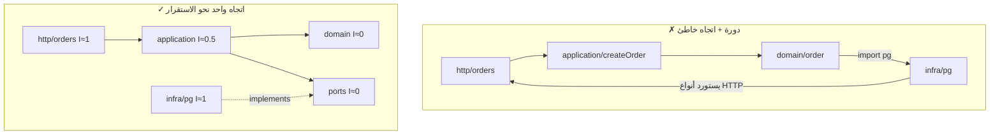

# Module 4.7 — الاقتران والتماسك
## Coupling & Cohesion: types of coupling, measuring cohesion, dependency direction, import graphs and cycles, simple → professional examples

> **المستوى:** Level 4 | **الموقع:** [8 من 16]
> **السابق:** [M4.6 — Abstraction, Encapsulation, Modularity](module-4.6-abstraction-encapsulation-modularity.md) | **التالي:** [M4.8 — SOLID](module-4.8-solid.md)

---

## 1. المتطلبات
- [ ] الوحدات والواجهات وإخفاء القرار — [M4.6](module-4.6-abstraction-encapsulation-modularity.md)
- [ ] اتجاه الاعتماد في الطبقات — [M4.5](module-4.5-software-design.md)
- [ ] الرسوم البيانية الموجّهة، الدورات، الترتيب الطوبولوجي — [L3-M3.6](../level-3-core-computer-science/module-3.6-graphs.md)
- [ ] الحالة المشتركة والآثار الجانبية — [L1-M1.7](../level-1-programming/module-1.7-state-side-effects-immutability.md)

## 2. أهداف التعلّم
- تعريف **الاقتران** (coupling: مقدار ما تعرفه وحدة عن أخرى وتتأثر بتغييرها) و**التماسك** (cohesion: مدى انتماء محتويات الوحدة لغرض واحد) — والهدف: **اقتران منخفض، تماسك عالٍ**.
- تمييز **أنواع الاقتران** من الأسوأ إلى الأفضل: content, common (global), external, control, stamp, data, message — وأنواع خفية: **temporal** (ترتيب الاستدعاء) و**semantic** (معرفة ضمنية).
- قياس التماسك عمليًا: "سبب التغيير الواحد"، تحليل *من يستخدم ماذا* داخل الوحدة، وكشف **الوحدات التي تتغير معًا دائمًا** من تاريخ Git.
- تحليل **رسم الاستيراد** (import graph) للمشروع: fan-in/fan-out، **عدم الاستقرار** I = Ce/(Ca+Ce)، الدورات، وانتهاكات اتجاه الطبقات — وفرضها آليًا.
- تطبيق ذلك على أمثلة من البسيط (دالتان) إلى المهني (حدود الخدمات في L7).

---

## 3. شرح للمبتدئ

### فكرتان بسيطتان، كل تصميم يدور حولهما
- **الاقتران**: إن غيّرتُ A، هل يجب أن أغيّر B؟ كم أحتاج أن أعرف عن داخل B لأستخدمه؟ كلما زاد → اقتران أعلى. الاقتران لا يُلغى (وحدات لا تعرف بعضها لا تصنع نظامًا) بل **يُدار**: قليل، صريح، عبر واجهات، وفي اتجاه واحد.
- **التماسك**: هل الأشياء داخل الوحدة تنتمي لبعضها؟ الاختبار: هل تستطيع وصف الوحدة بجملة بلا "و"؟ `pricing` (حساب الأسعار والخصومات والضرائب) متماسكة؛ `utils` (تنسيق التاريخ وتجزئة كلمة المرور وتحليل CSV) ليست — إنها ثلاث وحدات في ملف.

العلاقة: **التماسك المنخفض يولّد اقترانًا عاليًا**: عندما تُبعثر قاعدة واحدة (مثلًا "كيف نحسب الإجمالي") على 5 ملفات، تصبح الخمسة مقترنة ضمنيًا — تغيير القاعدة يلمسها كلها. اجمع ما يتغير معًا، وافصل ما يتغير لأسباب مختلفة.

### أنواع الاقتران (من الأسوأ إلى الأفضل)
| النوع | معناه | مثال | العلاج |
|---|---|---|---|
| **Content** | وحدة تعدّل داخل أخرى | `otherModule.cache.clear()`، `order._status = "x"` | التغليف (M4.6) |
| **Common / Global** | مشاركة حالة عامة | `global.config`, singleton قابل للتعديل، متغير وحدة يكتبه الجميع | تمرير صريح، حالة مملوكة |
| **External** | اعتماد مشترك على شكل خارجي | وحدتان تفسّران نفس ملف/بروتوكول/جدول مباشرة | وحدة واحدة تملك الشكل وتصدّر نوعًا |
| **Control** | تمرير علم يقرّر ماذا تفعل الأخرى | `save(user, true /* sendEmail */)`, `process(data, mode)` | دالتان أو استراتيجية (M4.9) |
| **Stamp** | تمرير بنية كبيرة وتُستخدم منها حقول قليلة | `calcShipping(order)` تقرأ `order.address.country` فقط | مرّر ما يلزم: `calcShipping(country, weight)` |
| **Data** | تمرير قيم بسيطة لازمة فقط | `total(lines)` | ✓ |
| **Message** | اتصال عبر رسائل/أحداث بلا معرفة بالمستقبل | `outbox.publish({type:"order.cancelled"})` | ✓ (مع ثمنه: تتبّع أصعب) |

**الاقتران الزمني (temporal)**: يجب استدعاء `init()` قبل `query()`، أو `setUser()` قبل `save()` — لا يظهر في الأنواع، ينفجر عند التشغيل. العلاج: اجعل الترتيب مستحيلًا كسره (المنشئ يعيد كائنًا جاهزًا؛ `withTransaction(fn)` يضمن BEGIN/COMMIT حول fn). **الاقتران الدلالي (semantic)**: "الجميع يعرف أن `status = 3` يعني مشحون" — معرفة ضمنية مكررة. العلاج: نوع مسمّى في مكان واحد.

### اتجاه الاعتماد: من يعتمد على من يجب أن يكون قرارًا
الاقتران مقبول **باتجاه الاستقرار**: الأشياء التي تتغير كثيرًا (HTTP routes، تنفيذ DB) تعتمد على الأشياء المستقرة (المجال، الواجهات) — لا العكس. مقياس Martin: لكل وحدة **Ca** (afferent: كم وحدة تعتمد عليها) و**Ce** (efferent: على كم وحدة تعتمد). **عدم الاستقرار** I = Ce/(Ca+Ce): 0 = مستقرة تمامًا (الجميع يعتمد عليها، هي لا تعتمد على أحد — يجب أن تكون مجرّدة ونادرة التغيير)، 1 = غير مستقرة (تعتمد على الكثير ولا يعتمد عليها أحد — حرّة التغيير). القاعدة: **اعتمد في اتجاه I المتناقص**. `domain/` يجب أن تكون I≈0؛ `http/` I≈1. إن كان `domain/order.ts` يستورد `pg` فـ I ارتفعت والمجال صار يتغير بتغيّر DB.

### الدورات: الاقتران في أسوأ صوره
`a → b → c → a`: الثلاثة وحدة واحدة فعليًا — لا تُختبر ولا تُفهم ولا تُنشر منفصلة، وفي ESM قد تعطي `undefined` عند الاستيراد بحسب الترتيب. الكشف: رسم الاستيراد + كشف الدورات (DFS، L3-M3.6). العلاج: استخراج ما يحتاجه الطرفان إلى وحدة ثالثة أدنى (`a → x ← b`)، أو قلب اعتماد عبر واجهة (M4.8 DIP)، أو دمج ما هو وحدة واحدة فعلًا.

### قياس التماسك من Git
ما يتغير معًا ينتمي معًا. من `git log` احسب لكل زوج ملفات كم مرة ظهرا في نفس commit (**change coupling**). زوجان من مجلدين مختلفين يتغيران معًا في 80% من الـ commits = حدّ خاطئ: إما ادمجهما أو استخرج المشترك. وملف يتغير في كل commit (`utils.ts`, `types.ts`, `constants.ts`) = تماسك منخفض (سلة مهملات) أو **مركز اقتران** يجب تفكيكه.

### من البسيط إلى المهني
- **دالتان**: `formatPrice(order)` تقرأ `order.currency` فقط → مرّر `currency` (stamp → data).
- **وحدتان**: `orders.ts` يقرأ `inventory.items[]` مباشرة → `inventory.reserve(productId, qty)` (content → message/data).
- **طبقتان**: `domain/` يستورد `pg` → واجهة repository في التطبيق (M4.5).
- **خدمتان** (L7): خدمة الطلبات تقرأ جدول المخزون في DB الخدمة الأخرى → external coupling على schema؛ العلاج API/أحداث. نفس المبدأ، تكلفة أعلى بأضعاف — لذلك تتدرّب عليه هنا داخل العملية الواحدة.

---

## 4. النموذج الذهني

```
   اقتران منخفض:  غيّر A → B لا يبالي        (يعرف الواجهة فقط، باتجاه الاستقرار، بلا دورات، بلا حالة مشتركة، بلا ترتيب خفي)
   تماسك عالٍ:    الوحدة تُوصف بجملة بلا "و"   (ما يتغير معًا يعيش معًا)

   سلّم الاقتران:  content ▸ common ▸ external ▸ control ▸ stamp ▸ data ▸ message      (يسارًا أسوأ)
   اتجاه:          غير مستقر (I→1: http, infra)  ──▶  مستقر (I→0: domain, ports)        أبدًا العكس، أبدًا دورة
```

---

## 5. الرسم التوضيحي



```
   change coupling من git log (آخر 500 commit)
   ┌──────────────────────────────┬──────────────────────────────┬──────┬───────┐
   │ file A                       │ file B                       │ معًا │ نسبة  │
   ├──────────────────────────────┼──────────────────────────────┼──────┼───────┤
   │ http/orders.routes.ts        │ infra/pg/order-repo.ts       │  41  │  82%  │ ← حدّ خاطئ: route يعرف SQL؟
   │ domain/pricing.ts            │ domain/pricing.test.ts       │  37  │  95%  │ ← طبيعي (اختبار + كود)
   │ utils.ts                     │ (كل شيء)                     │ 120  │   —   │ ← سلة مهملات / مركز اقتران
   └──────────────────────────────┴──────────────────────────────┴──────┴───────┘
```

---

## 6. مثال بسيط

```typescript
// src/coupling-ladder.ts — نفس الحاجة بدرجات اقتران مختلفة (اقرأ من الأسوأ إلى الأفضل)
type Order = { id: string; currency: "DZD" | "EUR"; lines: { qty: number; unitCents: number }[]; customer: { email: string; vip: boolean } };

// ✗ control coupling: علم يقرّر سلوك الدالة؛ كل مستدعٍ يجب أن يعرف ما يعنيه true
export function notifyV1(order: Order, sendEmail: boolean, discountMode: 0 | 1 | 2) { /* if (sendEmail) ... switch (discountMode) ... */ return order.id + discountMode + (sendEmail ? "e" : ""); }

// ✗ stamp coupling: تمرير Order كاملًا لقراءة currency فقط → كل من يملك currency بلا Order لا يستطيع الاستدعاء، وأي تغيير في Order يُقلق هذه الدالة
export const formatTotalV1 = (order: Order) => `${order.lines.reduce((s, l) => s + l.qty * l.unitCents, 0) / 100} ${order.currency}`;

// ✓ data coupling: ما يلزم فقط، أنواع بسيطة؛ قابلة للاستخدام من أي سياق ولاختبارها بسطر
export const formatMoney = (cents: number, currency: "DZD" | "EUR") => `${(cents / 100).toFixed(2)} ${currency}`;
export const orderTotalCents = (lines: { qty: number; unitCents: number }[]) => lines.reduce((s, l) => s + l.qty * l.unitCents, 0);

// ✓ بدل العلم: دالتان واضحتان (أو استراتيجية M4.9 إن تعدّدت السياسات)
export const vipDiscountCents = (totalCents: number) => Math.floor(totalCents * 0.1);
export const noDiscountCents = (_totalCents: number) => 0;
```

```typescript
// ✗ temporal coupling: الترتيب في رأس المبرمج فقط          ✓ الترتيب مستحيل كسره
class ReportV1 { private rows: string[] = []; load() { this.rows = ["a"]; } render() { return this.rows.join(); } }   // render قبل load = تقرير فارغ بصمت
export async function renderReport(load: () => Promise<string[]>) { const rows = await load(); return rows.join(); }   // لا حالة بينية
void ReportV1;
```

---

## 7. مثال كود

أداة حقيقية: تبني **رسم الاستيراد** لمشروع TypeScript، تحسب Ca/Ce/I، تكشف الدورات، وتفرض اتجاه الطبقات. (تستخدم مترجم TypeScript نفسه لتحليل الاستيرادات؛ `madge`/`dependency-cruiser` أدوات جاهزة تفعل الشيء ذاته — تبنيها مرة لتفهمها.)

```typescript
// src/import-graph.ts — رسم الاستيراد + Ca/Ce/I + دورات + قاعدة الطبقات. شغّل: node --import tsx src/import-graph.ts src
import ts from "typescript"; import { readdirSync, readFileSync, statSync } from "node:fs"; import { join, dirname, resolve, relative } from "node:path";

const LAYER_ORDER = ["http", "application", "domain", "ports", "infra"] as const;        // المسموح: http→application→domain/ports؛ infra→ports/domain فقط
const ALLOWED: Record<string, string[]> = { http: ["application", "domain", "ports"], application: ["domain", "ports"], domain: ["domain"], ports: ["domain"], infra: ["ports", "domain"] };

function walk(dir: string): string[] { return readdirSync(dir).flatMap(f => { const p = join(dir, f); return statSync(p).isDirectory() ? walk(p) : /\.ts$/.test(p) && !/\.test\.ts$/.test(p) ? [p] : []; }); }
function importsOf(file: string): string[] {
  const sf = ts.createSourceFile(file, readFileSync(file, "utf8"), ts.ScriptTarget.Latest, true); const out: string[] = [];
  sf.forEachChild(function visit(n) {
    if ((ts.isImportDeclaration(n) || ts.isExportDeclaration(n)) && n.moduleSpecifier && ts.isStringLiteral(n.moduleSpecifier)) {
      const spec = n.moduleSpecifier.text;
      if (spec.startsWith(".")) out.push(resolve(dirname(file), spec.replace(/\.js$/, ".ts")));       // داخلي فقط؛ NodeNext يكتب .js (L1-M1.8)
    }
    n.forEachChild(visit);
  });
  return out;
}
export function buildGraph(root: string) {
  const files = walk(root); const g = new Map<string, Set<string>>(files.map(f => [f, new Set(importsOf(f).filter(i => files.includes(i)))]));
  return g;
}
export function metrics(g: Map<string, Set<string>>, root: string) {
  const ca = new Map<string, number>(); for (const [, deps] of g) for (const d of deps) ca.set(d, (ca.get(d) ?? 0) + 1);
  return [...g].map(([f, deps]) => { const Ce = deps.size, Ca = ca.get(f) ?? 0; return { file: relative(root, f), Ca, Ce, I: Ca + Ce ? +(Ce / (Ca + Ce)).toFixed(2) : 0 }; });
}
export function cycles(g: Map<string, Set<string>>) {                                      // DFS بثلاثة ألوان (L3-M3.6)
  const color = new Map<string, 0 | 1 | 2>(), stack: string[] = [], found: string[][] = [];
  const dfs = (u: string) => { color.set(u, 1); stack.push(u);
    for (const v of g.get(u) ?? []) { const c = color.get(v) ?? 0; if (c === 1) found.push(stack.slice(stack.indexOf(v))); else if (c === 0) dfs(v); }
    stack.pop(); color.set(u, 2); };
  for (const u of g.keys()) if (!color.get(u)) dfs(u);
  return found;
}
export function layerViolations(g: Map<string, Set<string>>, root: string) {
  const layer = (f: string) => LAYER_ORDER.find(l => relative(root, f).split(/[\\/]/).includes(l));
  const out: string[] = [];
  for (const [f, deps] of g) for (const d of deps) { const a = layer(f), b = layer(d); if (a && b && !ALLOWED[a]!.includes(b)) out.push(`${relative(root, f)} (${a}) → ${relative(root, d)} (${b})`); }
  return out;
}
if (process.argv[1]?.match(/import-graph\.(ts|js)$/)) {
  const root = resolve(process.argv[2] ?? "src"), g = buildGraph(root);
  console.table(metrics(g, root).sort((a, b) => b.Ca - a.Ca).slice(0, 15));                  // الأعلى Ca = الأكثر استقرارًا المطلوب: هل هي domain/ports فعلًا؟
  const cyc = cycles(g), viol = layerViolations(g, root);
  cyc.forEach(c => console.log("CYCLE:", c.map(f => relative(root, f)).join(" → ")));
  viol.forEach(v => console.log("LAYER VIOLATION:", v));
  process.exitCode = cyc.length || viol.length ? 1 : 0;                                      // في CI: دورة أو انتهاك اتجاه = فشل (L5-M5.12)
}
```

```bash
# change coupling من Git (bash + awk لأنها معالجة نصوص سطرية — L0-M0.4): أزواج الملفات التي تتغير معًا
git log --name-only --pretty=format:'#%h' -n 500 -- 'src/**' \
 | awk '/^#/{if(n>1)for(i=1;i<=n;i++)for(j=i+1;j<=n;j++)pair[f[i]" | "f[j]]++; n=0; next} NF{f[++n]=$0}
        END{for(p in pair)if(pair[p]>=10)print pair[p], p}' | sort -rn | head -20
# ملف من مجلد A وملف من مجلد B يظهران معًا ≥ 10 مرات → اسأل: لماذا هذا الحدّ هنا؟
```

---

## 8. مثال من العالم الحقيقي
`utils.ts` بـ 1,400 سطر: تنسيق تواريخ، تجزئة كلمات مرور، تحليل CSV، حساب ضرائب، عميل HTTP. كل ميزة تستورده، وكل commit يلمسه، وتعارضات الدمج يومية، واختباره "يحتاج كل شيء". التماسك المنخفض حوّله إلى **أعلى Ca في المشروع** مع **أعلى معدل تغيير** — المزيج الأسوأ (مستقر بالاعتماد، غير مستقر بالتغيير). التفكيك إلى 6 وحدات مسمّاة أسقط التعارضات إلى الصفر تقريبًا — بلا تغيير سطر منطق واحد.

## 9. مثال من الإنتاج
في نظام مكوّن من 12 خدمة، خدمتان تشتركان في جدول `customers` مباشرة (external coupling على schema). تغيير عمود في خدمة أسقط الأخرى في الإنتاج لأن migration لم يعرف أن هناك قارئًا ثانيًا. العلاج كلّف ربع سنة: خدمة واحدة تملك الجدول وتصدّر API/أحداثًا. نفس خطأ `orders.ts` يقرأ `inventory.items[]` مباشرة — بتكلفة ×100. **تدرّب على الحدود داخل العملية لأن أخطاءها رخيصة هنا وباهظة هناك.** (L7-M7.9.)

---

## 10. مفاهيم خاطئة شائعة
1. **"الهدف صفر اقتران."** صفر اقتران = لا نظام. الهدف اقتران *قليل وصريح وباتجاه الاستقرار*.
2. **"الأحداث/الرسائل تلغي الاقتران."** تنقله من وقت الترجمة إلى وقت التشغيل (من يستهلك هذا الحدث؟ ماذا لو تغيّر شكله؟) — أقل اقترانًا في الاتجاه، أصعب في التتبّع. مقايضة لا حل سحري.
3. **"ملف صغير = متماسك."** 20 ملفًا من 10 أسطر تتغير معًا دائمًا = وحدة واحدة مبعثرة (تماسك منخفض على مستوى المجلد).
4. **"المشترك يذهب إلى `common/`."** `common/shared/utils` أسماء بلا غرض = مغناطيس لكل شيء. سمِّ بالغرض (`money/`, `dates/`).
5. **"الدورات مشكلة نظرية."** في ESM تسبب `undefined` حقيقية عند الاستيراد، وفي الاختبار تجبرك على تحميل كل شيء، وفي الفرق تمنع تقسيم الملكية.

## 11. أخطاء شائعة
1. تمرير الكائن الكبير (`req`, `order`, `ctx`) إلى كل دالة بدل ما تحتاجه (stamp).
2. أعلام منطقية في التوقيع (`fn(x, true, false)`) — control coupling بأسوأ صوره: غير مقروء وغير قابل للتوسّع.
3. حالة على مستوى الوحدة (`let currentUser`) تُقرأ من كل مكان — common coupling يجعل الاختبار المتوازي مستحيلًا.
4. استيراد من `infra/` داخل `domain/` "مؤقتًا".
5. ملفات `types.ts`/`constants.ts` مركزية ضخمة تربط كل الوحدات ببعضها.
6. دوال تعمل فقط إن استُدعيت بترتيب معين بلا أن يجبر النوع على ذلك.
7. تجاهل الدورات لأن "الكود يعمل" — حتى لا يعمل عند تغيير ترتيب استيراد.

## 12. تمرين تصحيح
بعد refactoring "بريء" (نقل دالة بين ملفين)، التطبيق يفشل عند الإقلاع: `TypeError: validateOrder is not a function`، لكن الدالة موجودة ومصدَّرة.
- **لاحظ:** الخطأ يظهر فقط عند الإقلاع من `src/index.ts` لا من الاختبارات.
- **دليل:** شغّل `import-graph.ts`: `CYCLE: domain/order.ts → domain/validate.ts → domain/order.ts`. في ESM، عند الدورة، أحد الطرفين يرى صادرات الآخر غير مهيّأة بعد (TDZ/undefined) بحسب من حُمّل أولًا — والاختبارات تحمّل بترتيب مختلف.
- **فرضية:** النقل أدخل دورة؛ العطل غير حتمي بحسب نقطة الدخول.
- **تجربة:** استخرج ما يحتاجه الطرفان (`type Order` + ثوابت الحالات) إلى `domain/order-types.ts` بلا استيرادات؛ أعد التشغيل من كلا المدخلين.
- **استنتاج:** الدورات أخطاء كامنة؛ أضف فحص الدورات إلى CI حتى لا يُدمج PR يُنشئ واحدة.

## 13. تمرين معماري
شغّل `import-graph.ts` وسكربت change coupling على Project 4 الحقيقي. اكتب تقريرًا: (1) أعلى 5 ملفات Ca — هل هي ما يجب أن يكون مستقرًا؟ (2) أي ملفات I≈0 لكنها تتغير كثيرًا (تناقض)؟ (3) الدورات وخطة كسر كل واحدة (استخراج/قلب/دمج) مع ACTRR، (4) أزواج change coupling عبر الحدود وما يقوله عن الحدّ، (5) قاعدة الطبقات التي ستفرضها في Project 5 (اكتبها كـ `ALLOWED` أو كقاعدة ESLint `no-restricted-imports`). هذه هي أول **مراجعة معمارية بالأدلة** تجريها — وهي نفس ما ستفعله في L6-M6.3 مع فريق.

## 14. الصلة بعصر AI
النموذج يرى **الملف الذي أمامه** ويميل إلى حلّ المهمة بأقل خطوات: يستورد مما هو متاح (حتى من `infra/` داخل `domain/`)، يضيف علمًا منطقيًا بدل دالة جديدة، ويمرّر `ctx` كاملًا. لا لأنه سيئ — لأنه لا يرى الرسم الكلي ما لم تعطه إياه. أعطه القواعد (`ALLOWED`, "لا أعلام منطقية، لا كائنات كبيرة") كجزء من السياق، وشغّل `import-graph`/دورات/طبقات في CI حتى يُرفض انتهاكه آليًا. المقاييس (Ca/Ce/دورات/change coupling) هي **أدلة موضوعية** تحاكم بها الكود المولَّد بدل الانطباع. (L8-M8.7 verification.)

## 15–17. Master / Understand / Defer
- 🔴 تعريف الاقتران والتماسك والعلاقة بينهما؛ سلّم الاقتران وعلاج كل درجة؛ الاقتران الزمني والدلالي؛ اتجاه الاعتماد نحو الاستقرار؛ الدورات وكسرها؛ "ما يتغير معًا يعيش معًا".
- 🟠 Ca/Ce/I وتفسيرها؛ change coupling من Git؛ فرض الطبقات آليًا في CI؛ الاقتران بين الخدمات على schema كـ external coupling؛ الرسائل كمقايضة.
- ⚪ مقاييس Martin الكاملة (A, D, main sequence)، LCOM لقياس التماسك، أدوات مثل dependency-cruiser/madge/Nx boundaries بالتفصيل، تحليل الشفرة الساكن المتقدم.

## 18. الخلاصة
1. الاقتران: كم تتأثر A بتغيير B؛ التماسك: هل تنتمي محتويات الوحدة لغرض واحد. الهدف: منخفض/عالٍ — وهما وجهان لعملة.
2. سلّم الاقتران من content إلى message؛ انتبه للزمني والدلالي لأنهما لا يظهران في الأنواع.
3. اعتمد باتجاه الاستقرار (I متناقص): http/infra → application → domain/ports؛ المجال لا يستورد شيئًا.
4. الدورات = وحدة واحدة متنكّرة وأخطاء ESM كامنة؛ اكشفها واكسرها وافرض الفحص في CI.
5. Git يخبرك بالحدود الخاطئة: ما يتغير معًا عبر الحدود يحتاج حدًّا جديدًا.

## 19. مراجع رسمية
- Robert C. Martin — Stability metrics (Ca, Ce, I) in "Design Principles and Design Patterns": https://web.archive.org/web/20150906155800/http://www.objectmentor.com/resources/articles/Principles_and_Patterns.pdf
- Stevens, Myers, Constantine — "Structured Design" (origin of coupling/cohesion, IBM Systems Journal 1974): https://ieeexplore.ieee.org/document/5388187
- Adam Tornhill — Your Code as a Crime Scene (change coupling from version control): https://pragprog.com/titles/atcrime2/your-code-as-a-crime-scene-second-edition/
- TypeScript Compiler API — using the compiler to analyse source (`createSourceFile`): https://github.com/microsoft/TypeScript/wiki/Using-the-Compiler-API
- dependency-cruiser — validate and visualise dependencies/cycles/layer rules: https://github.com/sverweij/dependency-cruiser

## المصطلحات
| العربية | English |
|---|---|
| اقتران | Coupling |
| تماسك | Cohesion |
| اقتران محتوى / عام / خارجي / تحكّم / بنية / بيانات / رسائل | Content / Common / External / Control / Stamp / Data / Message coupling |
| اقتران زمني | Temporal coupling |
| اقتران دلالي | Semantic coupling |
| اعتمادات واردة / صادرة | Afferent (Ca) / Efferent (Ce) couplings |
| عدم الاستقرار | Instability (I) |
| رسم الاستيراد | Import / Dependency graph |
| اعتماد دائري | Circular dependency / Cycle |
| اقتران التغيير (من Git) | Change coupling / Temporal co-change |
