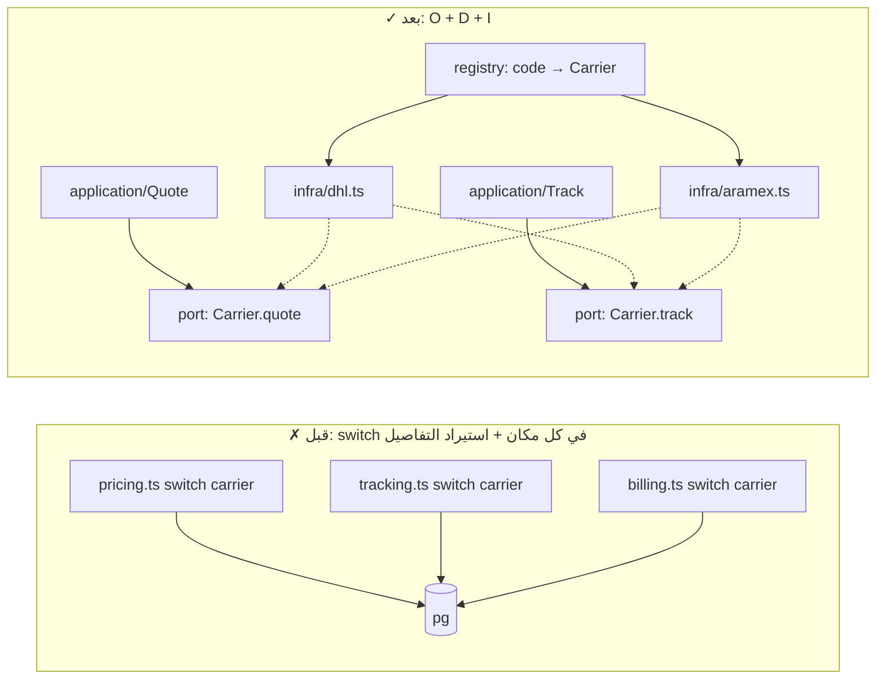

# Module 4.8 — SOLID بلا دوغما
## SOLID (Without Dogma): per principle — beginner explanation, bad example, refactoring, professional reading, and when NOT to apply

> **المستوى:** Level 4 | **الموقع:** [9 من 16]
> **السابق:** [M4.7 — Coupling & Cohesion](module-4.7-coupling-cohesion.md) | **التالي:** [M4.9 — Design Patterns That Matter](module-4.9-design-patterns.md)

---

## 1. المتطلبات
> **قبل أن تتعلم هذا، يجب أن تفهم:**
- [ ] الاقتران/التماسك واتجاه الاعتماد — [M4.7](module-4.7-coupling-cohesion.md)
- [ ] الواجهات وإخفاء القرار، الوحدات العميقة — [M4.6](module-4.6-abstraction-encapsulation-modularity.md)
- [ ] الأنواع، الاتحادات المميّزة (discriminated unions)، `interface` — [L1-M1.15](../level-1-programming/module-1.15-typescript-types.md)
- [ ] الصفوف والوراثة بالحد الأدنى (رأيتها في `extends Error`) — [L1-M1.9](../level-1-programming/module-1.9-errors.md)

## 2. أهداف التعلّم
- شرح كل مبدأ من SOLID **بجملة لمبتدئ**، وإظهار **مثال سيئ → refactoring**، و**القراءة المهنية** (ما المشكلة الفعلية التي يعالجها)، و**متى لا تطبّقه**.
- رؤية SOLID كـ **خمسة أسماء لإدارة الاقتران والتماسك** (M4.7) وإخفاء القرار (M4.6) — لا كقواعد مستقلة ولا كمعايير للـ OOP فقط؛ تنطبق على الدوال والوحدات في TypeScript.
- استخدام **الاتحادات المميّزة والدوال** كبدائل حديثة للوراثة في كثير من حالات OCP/LSP.
- تمييز **الإفراط**: تجريدات لمستقبل لن يأتي، واجهة لكل class، حقن كل شيء — وتكلفته.
- تطبيق المبادئ كأدوات **تشخيص عند الألم** (تغيير يلمس ملفات كثيرة، اختبار صعب، شرط `instanceof` متكرر) لا كقائمة تحقق مسبقة.

---

## 3. شرح للمبتدئ

SOLID خمسة مبادئ جمعها Robert Martin من أعمال سابقة (Parnas، Liskov، Meyer). **الخيط الواحد**: اجعل التغيير المحتمل يلمس مكانًا واحدًا، واجعل الاعتماد يتجه نحو ما هو مستقر. إن كنت فهمت M4.6–4.7 فأنت تعرفها بالفعل؛ هنا تحصل على الأسماء التي يستخدمها الناس في المراجعات — ومتى تُساء.

### S — Single Responsibility: سبب واحد للتغيير
**للمبتدئ:** الوحدة/الصف/الدالة تفعل شيئًا واحدًا *من منظور من يطلب التغيير*. **القراءة المهنية:** "المسؤولية" = **صاحب مصلحة** (actor): إن كان قسم المحاسبة والمنتج وفريق التشغيل يطلبون جميعًا تغييرات في نفس الصف، فله ثلاثة أسباب للتغيير → ثلاث وحدات. هذا تماسك (M4.7) باسم آخر.
**سيئ:** `class OrderService { create() ; calculateTax() ; sendConfirmationEmail() ; exportCsv() ; }` — الضريبة (محاسبة) والبريد (تسويق) والتصدير (تقارير) تتغير لأسباب مختلفة ويتصادم مطوّروها في ملف واحد.
**Refactoring:** `pricing/tax.ts`, `notifications/order-confirmation.ts`, `reports/orders-csv.ts`؛ `CreateOrder` ينسّق (M4.5).
**متى لا:** سكربت صغير أو نموذج أولي؛ وتقسيم دالة 20 سطرًا متماسكة إلى 6 دوال لأن "كل دالة شيء واحد" يُنتج ضحالة (M4.6). المعيار *سبب التغيير*، لا عدد الأسطر.

### O — Open/Closed: مفتوح للتوسعة، مغلق للتعديل
**للمبتدئ:** تضيف سلوكًا جديدًا بإضافة كود، لا بتعديل كود قائم مختبَر. **القراءة المهنية:** لا يعني "لا تعدّل الكود أبدًا" (مستحيل)؛ يعني: **حيث تتوقع تنوّعًا** (طرق دفع، أنواع خصم، صيغ تصدير)، ضع نقطة توسعة (واجهة/دالة تُمرَّر/سجل) بدل `switch` ينمو في 7 أماكن.
**سيئ:** `function shippingCost(order) { switch (order.carrier) { case "dhl": … case "aramex": … } }` مكرر في التسعير والتتبّع والفوترة؛ إضافة ناقل = تعديل 3 ملفات ونسيان رابع.
**Refactoring:** `interface Carrier { quote(parcel): Money; track(id): Promise<Status> }` + سجل `carriers: Record<CarrierCode, Carrier>`؛ ناقل جديد = ملف جديد + سطر تسجيل.
**متى لا:** قبل وجود حالتين فعليتين (YAGNI). و**الاتحاد المميّز + `switch` شامل** (exhaustive) في TypeScript هو OCP معكوس ومشروع: إضافة نوع تجعل المترجم يُظهر لك **كل** مكان يحتاج تحديثًا — رائع عندما الأنواع قليلة ومستقرة والعمليات كثيرة (مشكلة التعبير: أضف أنواعًا بسهولة = واجهات؛ أضف عمليات بسهولة = اتحادات).

### L — Liskov Substitution: البديل لا يفاجئ
**للمبتدئ:** أي تنفيذ للواجهة يجب أن يعمل حيث يُتوقع الأصل دون أن يعرف المستدعي الفرق. **القراءة المهنية:** **عقد** الواجهة ليس التوقيع فقط بل: الشروط المسبقة (لا تشدّدها)، اللاحقة (لا تضعفها)، الاستثناءات، الأداء التقريبي، والثوابت. تنفيذ يرمي `NotSupported` أو يعيد `null` حيث يعد الأصل بقيمة = كسر LSP حتى لو ترجم الكود.
**سيئ:** `class ReadOnlyRepo implements OrderRepository { save() { throw new Error("read only"); } }` — كل مستدعٍ لـ `save` ينفجر عشوائيًا. أو `InMemoryCache.get()` متزامن بينما `RedisCache.get()` يعيد Promise — نفس "الاسم" وعقد مختلف.
**Refactoring:** واجهتان (`OrderReader`, `OrderWriter`) — وهذا يقودك إلى I؛ وجعل العقد صريحًا في الأنواع (كل `get` يعيد `Promise`).
**متى لا:** الوراثة العميقة أصلًا نادرة في TypeScript الحديث؛ المبدأ يهم أكثر في **تنفيذات الواجهات والـ fakes في الاختبار** (M4.11): fake لا يحترم العقد = اختبارات خضراء كاذبة.

### I — Interface Segregation: لا تُجبر أحدًا على ما لا يستخدمه
**للمبتدئ:** واجهات صغيرة بحسب المستهلك، لا واجهة عملاقة للجميع. **القراءة المهنية:** الواجهة **يملكها المستهلك** (M4.5 ports): `CancelOrder` تحتاج `findForUpdate` و`setStatus` فقط — فهذه واجهتها، لا `OrderRepository` بـ 15 دالة. النتيجة: fakes أصغر، تغييرات أقل انتشارًا، وLSP أسهل.
**سيئ:** `interface Repository<T> { find; findMany; save; delete; count; stream; bulkInsert; … }` تنفّذه كل كيانات المشروع، نصفها بـ `throw`.
**Refactoring:** `Pick<>`/واجهات مسمّاة بحسب الحاجة؛ التنفيذ الملموس الواحد يمكنه تنفيذ عدّة واجهات صغيرة.
**متى لا:** واجهة من دالتين لا تحتاج تقسيمًا؛ ولا تُنشئ واجهة لكل دالة (ضجيج).

### D — Dependency Inversion: اعتمد على التجريد الذي تملكه
**للمبتدئ:** الكود المهم (المجال/التطبيق) لا يستورد التفاصيل (DB، مزوّد)؛ التفاصيل تُنفّذ واجهة يملكها الكود المهم وتُمرَّر إليه. **القراءة المهنية:** هذا هو اتجاه الاعتماد في M4.5/M4.7 حرفيًا: `application → ports ← infra`. "الحقن" (dependency injection) هو مجرد **التمرير** — معامل دالة أو منشئ. لا تحتاج حاوية DI سحرية.
**سيئ:** `import { pool } from "../infra/db"` داخل `domain/pricing.ts` لقراءة أسعار الضريبة → لا اختبار بلا DB، وتغيير DB يلمس المجال.
**Refactoring:** `calculateTax(order, rates: TaxRates)` (مرّر البيانات) أو `interface TaxRateSource` تُحقن في التطبيق.
**متى لا:** `Math`, `Date`? — الساعة تُحقن فقط عندما تحتاج اختبار الزمن (M4.0 `now` معامل). ولا تحقن ما لن يتغير ولن يُزيَّف أبدًا (دالة `slugify` نقية). الحقن له ثمن: توصيل (wiring) في نقطة الدخول ومعاملات أكثر.

### القراءة الكلية
| المبدأ | المشكلة الفعلية | الأداة في TS | إشارة الألم |
|---|---|---|---|
| S | تماسك منخفض، أصحاب مصلحة متعددون | وحدات بحسب الغرض | تعارضات دمج في ملف واحد |
| O | نقطة تنوّع مبعثرة | واجهة + سجل، أو اتحاد + switch شامل | `switch` نفسه في N ملفات |
| L | عقد غير محترم | أنواع صريحة، واجهات مفصولة، fakes صادقة | `throw NotSupported`, `instanceof` |
| I | واجهة تخدم الجميع فلا تخدم أحدًا | واجهات يملكها المستهلك، `Pick` | تنفيذات نصفها فارغ |
| D | المهم يعتمد على التفاصيل | ports + تمرير | لا اختبار بلا DB/شبكة |

**القاعدة:** طبّق عند **الألم أو التوقع المُبرَّر** (حالتان فعليتان، اختبار مطلوب، تبديل مؤكد)، لا كطقس. SOLID على 200 سطر CRUD = ضحالة وملفات لا تخفي شيئًا.

---

## 4. النموذج الذهني

```
   خيط SOLID الواحد:  التغيير المحتمل يلمس مكانًا واحدًا  +  الاعتماد نحو المستقر
   S: افصل بحسب من يطلب التغيير        O: أضف ملفًا لا تعدّل switch         L: البديل يحترم العقد كاملًا
   I: واجهة بحجم حاجة المستهلك          D: المهم يملك الواجهة، التفاصيل تنفّذها وتُمرَّر
   متى؟  عند الألم أو حالتين فعليتين.   متى لا؟  سكربت، نموذج أولي، حالة واحدة، لا اختبار ولا تبديل متوقع.
```

---

## 5. الرسم التوضيحي



```
   مشكلة التعبير — اختر محور التوسعة المتوقع:
                     أنواع كثيرة تُضاف (ناقلون، مزوّدون)   عمليات كثيرة تُضاف (تقارير، تحويلات على شكل ثابت)
   الأداة             واجهة + تنفيذ لكل نوع (OCP)           اتحاد مميّز + switch شامل (المترجم يرشدك)
   إضافة نوع          ملف جديد ✓                            تعديل كل switch (لكن المترجم يُظهرها كلها)
   إضافة عملية        تعديل كل تنفيذ                        دالة جديدة ✓
```

---

## 6. مثال بسيط

```typescript
// src/solid-ocp.ts — نفس المشكلة بأسلوبين مشروعين: واجهة+سجل (أنواع تتغير) vs اتحاد+switch شامل (عمليات تتغير)
// (1) OCP بالواجهة: نقطة تنوّع = الناقل. ناقل جديد = كائن جديد + سطر تسجيل؛ لا تعديل في quote()
export type Parcel = { kg: number; country: string };
export interface Carrier { code: string; quoteCents(p: Parcel): number; }
const dhl: Carrier = { code: "dhl", quoteCents: p => 1500 + Math.ceil(p.kg) * 400 };
const aramex: Carrier = { code: "aramex", quoteCents: p => (p.country === "DZ" ? 800 : 2000) + Math.ceil(p.kg) * 300 };
export const carriers = new Map<string, Carrier>([dhl, aramex].map(c => [c.code, c]));
export const cheapest = (p: Parcel) => [...carriers.values()].map(c => ({ code: c.code, cents: c.quoteCents(p) })).sort((a, b) => a.cents - b.cents)[0];

// (2) اتحاد مميّز + switch شامل: الأنواع ثابتة (3 حالات دفع)، العمليات كثيرة (عرض، تحليلات، تصدير…) — إضافة عملية = دالة جديدة
export type PaymentEvent = { kind: "authorized"; cents: number } | { kind: "captured"; cents: number } | { kind: "refunded"; cents: number; reason: string };
const assertNever = (x: never): never => { throw new Error(`unhandled ${JSON.stringify(x)}`); };
export function ledgerDelta(e: PaymentEvent): number {
  switch (e.kind) { case "authorized": return 0; case "captured": return e.cents; case "refunded": return -e.cents; default: return assertNever(e); }   // أضف kind جديدًا → خطأ ترجمة هنا وفي كل switch شامل: هذا مطلوب
}
export const describe = (e: PaymentEvent) => e.kind === "refunded" ? `refund ${e.cents} (${e.reason})` : `${e.kind} ${e.cents}`;
```

---

## 7. مثال كود

refactoring كامل لصف "يفعل كل شيء" إلى تصميم يحترم المبادئ **حيث يلزم فقط** — مع تعليقات تقول أي مبدأ ولماذا هنا.

```typescript
// src/solid-before.ts — ✗ الشكل الذي يبدأ به معظم المشاريع (ويعمل!)
import type { Pool } from "pg";
export class OrderServiceBefore {
  constructor(private pool: Pool, private smtpHost: string) {}
  async checkout(userId: number, lines: { productId: number; qty: number }[], payMethod: "card" | "cod") {
    const { rows } = await this.pool.query("SELECT id, price_cents FROM products WHERE id = ANY($1)", [lines.map(l => l.productId)]);   // D: التفاصيل في المنطق
    let total = 0; for (const l of lines) total += l.qty * rows.find(r => r.id === l.productId)!.price_cents;
    if (total > 10_000) total = Math.floor(total * 0.95);                                   // قاعدة عمل مدفونة
    let fee = 0; if (payMethod === "card") fee = Math.ceil(total * 0.02); else if (payMethod === "cod") fee = 300;   // O: switch سينمو
    const id = (await this.pool.query("INSERT INTO orders (user_id, total_cents) VALUES ($1,$2) RETURNING id", [userId, total + fee])).rows[0].id;
    await fetch(`https://${this.smtpHost}/send`, { method: "POST", body: JSON.stringify({ userId, id }) });   // S: البريد هنا؛ وفشله يفشل الطلب
    return id;
  }
}
```

```typescript
// src/solid-after.ts — ✓ بعد: S (وحدات بحسب سبب التغيير)، O (طرق الدفع كنقطة توسعة)، I+D (منافذ صغيرة يملكها التطبيق)، L (fakes تحترم العقد)
// ── domain (نقي؛ لا import خارجي) ────────────────────────────────────────────────
export type Line = { productId: number; qty: number };
export const subtotalCents = (lines: Line[], price: (id: number) => number) => lines.reduce((s, l) => s + l.qty * price(l.productId), 0);
export const volumeDiscount = (cents: number) => (cents > 10_000 ? Math.floor(cents * 0.05) : 0);          // قاعدة عمل مسمّاة ومختبَرة وحدها (S)

export interface PaymentMethod { readonly code: string; feeCents(totalCents: number): number; }              // نقطة توسعة (O): طريقة جديدة = كائن جديد
export const card: PaymentMethod = { code: "card", feeCents: t => Math.ceil(t * 0.02) };
export const cashOnDelivery: PaymentMethod = { code: "cod", feeCents: () => 300 };

// ── ports (I: كل واجهة بحجم حاجة حالة الاستخدام؛ D: يملكها التطبيق) ───────────────
export interface PriceLookup { pricesFor(ids: number[]): Promise<Map<number, number>>; }
export interface OrderWriter { insert(o: { userId: number; totalCents: number }): Promise<{ orderId: number }>; }
export interface Notifier { orderPlaced(e: { userId: number; orderId: number }): Promise<void>; }            // العقد: لا يرمي؛ الفشل مسؤوليته (L)

// ── application ─────────────────────────────────────────────────────────────
export const makeCheckout = (deps: { prices: PriceLookup; orders: OrderWriter; notifier: Notifier }) =>
  async (input: { userId: number; lines: Line[]; method: PaymentMethod }) => {
    const prices = await deps.prices.pricesFor(input.lines.map(l => l.productId));
    const price = (id: number) => { const p = prices.get(id); if (p === undefined) throw new RangeError(`unknown product ${id}`); return p; };
    const sub = subtotalCents(input.lines, price), total = sub - volumeDiscount(sub);
    const { orderId } = await deps.orders.insert({ userId: input.userId, totalCents: total + input.method.feeCents(total) });
    await deps.notifier.orderPlaced({ userId: input.userId, orderId });                                       // في الإنتاج: outbox (M4.5) — خلف نفس المنفذ
    return { orderId, totalCents: total + input.method.feeCents(total) };
  };
```

```typescript
// src/solid-after.test.ts — المكسب الملموس: حالة الاستخدام كاملة تُختبر في ms بلا DB ولا شبكة؛ وكل قاعدة تُختبر وحدها
import { test } from "node:test"; import assert from "node:assert/strict";
import { makeCheckout, card, cashOnDelivery, volumeDiscount } from "./solid-after.js";

const deps = () => { const inserted: unknown[] = [], notified: unknown[] = []; return { inserted, notified, d: {
  prices: { pricesFor: async (ids: number[]) => new Map(ids.map(id => [id, id * 1000])) },
  orders: { insert: async (o: { userId: number; totalCents: number }) => { inserted.push(o); return { orderId: 7 }; } },
  notifier: { orderPlaced: async (e: unknown) => { notified.push(e); } },
} }; };

test("volume discount rule alone", () => { assert.equal(volumeDiscount(10_000), 0); assert.equal(volumeDiscount(10_001), 500); });
test("checkout: subtotal 12_000 → 5% off → +2% card fee", async () => {
  const { d, inserted } = deps();
  const r = await makeCheckout(d)({ userId: 1, lines: [{ productId: 3, qty: 4 }], method: card });     // 4×3000 = 12000 → 11400 → +228
  assert.equal(r.totalCents, 11_628); assert.deepEqual(inserted, [{ userId: 1, totalCents: 11_628 }]);
});
test("cod adds flat 300", async () => { const r = await makeCheckout(deps().d)({ userId: 1, lines: [{ productId: 1, qty: 1 }], method: cashOnDelivery }); assert.equal(r.totalCents, 1300); });
test("unknown product is rejected before writing", async () => {
  const { d, inserted } = deps(); d.prices.pricesFor = async () => new Map();
  await assert.rejects(makeCheckout(d)({ userId: 1, lines: [{ productId: 9, qty: 1 }], method: card }), RangeError); assert.equal(inserted.length, 0);
});
```

**هل كان كل هذا ضروريًا؟** لو كان `checkout` سكربتًا داخليًا بطريقة دفع واحدة ولن يُختبر: لا. لكنه مسار الدفع في متجر، بطرق دفع تتزايد، ويحتاج اختبارًا بلا DB — ثلاث إشارات ألم مُبرَّرة.

---

## 8. مثال من العالم الحقيقي
مكتبة `pg` نفسها تطبّق D وL بلا أن تذكرهما: `Pool` و`Client` يشتركان في عقد `query()` بنفس السلوك (L)، فتُمرَّر إحداهما حيث تُتوقع الأخرى (`withTransaction` من L3 يمرّر `PoolClient` إلى الدالة التي تستخدم `query` فقط). لو كان `PoolClient.query` يرمي في حالات يقبلها `Pool.query`، لانكسر نصف الكود الذي كُتب عليهما. العقد المحترم هو ما يجعل التبديل آمنًا.

## 9. مثال من الإنتاج
شركة بوابة دفع تضيف مزوّدًا جديدًا كل بضعة أشهر. في الإصدار الأول: `switch (provider)` في 11 موضعًا (تفويض، التقاط، استرداد، webhooks، تقارير…). كل مزوّد جديد = أسبوعان وحوادث. بعد تطبيق O+I+D (واجهة `Provider` بعمليات صغيرة مفصولة، سجل، adapters): مزوّد جديد = 3 أيام في مجلد واحد، واختبارات عقد (contract tests) تُشغَّل على كل adapter لتفرض L. **المبادئ أثبتت قيمتها لأن محور التغيير كان حقيقيًا ومتكررًا** — لم تُطبَّق استباقًا على أجزاء لا تتغير.

---

## 10. مفاهيم خاطئة شائعة
1. **"SOLID للـ OOP والصفوف فقط."** الدوال والوحدات والأنواع تخضع لنفس القوى؛ `makeCheckout(deps)` هو D بلا class.
2. **"واجهة لكل class حتى نكون SOLID."** واجهة بتنفيذ واحد لن يُبدَّل ولا يُزيَّف = ضحالة (M4.6). الواجهة تُستحق بحالتين أو باختبار.
3. **"OCP يعني لا تعدّل الكود القديم."** يعني ضع نقاط التوسعة حيث التنوّع متوقع؛ تعديل الكود طبيعي في كل مكان آخر.
4. **"حقن التبعية يحتاج إطارًا/حاوية."** يحتاج معاملًا. الحاويات أدوات للمشاريع الكبيرة ولها ثمنها (سحر، أخطاء وقت تشغيل).
5. **"الاتحاد المميّز + switch ينتهك OCP."** هو الخيار الصحيح عندما الأنواع مستقرة والعمليات تتزايد؛ المترجم يحميك. اختر محور التوسعة الفعلي.

## 11. أخطاء شائعة
1. تطبيق SOLID على كود لم يتألم بعد → تجريدات لمستقبل متخيَّل (YAGNI).
2. تقسيم بحسب "النوع التقني" (`services/`, `helpers/`, `managers/`) بدل سبب التغيير.
3. تنفيذ واجهة بـ `throw new Error("not supported")` — كسر L بصمت.
4. واجهة `Repository<T>` عامة عملاقة لكل الكيانات.
5. حقن كل شيء بما فيه ما لن يتغير أبدًا → توقيعات بـ 9 معاملات.
6. اعتبار المبادئ حجة في المراجعة ("هذا ينتهك S") بلا ذكر **الألم الملموس** (أي تغيير سيصعب؟ أي اختبار سيستحيل؟).

## 12. تمرين تصحيح
اختبارات الوحدة خضراء، والإنتاج يعطي أخطاء `null` في تدفق الاسترداد.
- **لاحظ:** `FakePaymentGateway.refund()` يعيد `{ ok: true }` دائمًا؛ التنفيذ الحقيقي يعيد `{ ok: true, refundId }` عند النجاح و`{ ok: false, reason }` عند الفشل، ويرمي عند الشبكة.
- **دليل:** الكود بعد الاستدعاء يستخدم `result.refundId!` — لم يُختبر مسار الفشل قط لأن الـ fake لا يعرفه. الواجهة `refund(): Promise<{ ok: boolean; refundId?: string; reason?: string }>` تسمح بحالات غير متسقة.
- **فرضية:** كسر L في الـ fake (عقد أضعف من الحقيقي) + واجهة لا تعبّر عن العقد.
- **تجربة:** اجعل العقد اتحادًا مميّزًا `{ ok: true; refundId } | { ok: false; retryable: boolean; reason }`، اكتب **اختبار عقد** واحدًا يُشغَّل على الحقيقي (sandbox) والـ fake معًا، وأصلح الـ fake ليفشل عند مبالغ معيّنة.
- **استنتاج:** fake لا يحترم العقد = اختبارات تكذب. L ليس عن الوراثة بل عن **كل من يدّعي تنفيذ واجهة** — بما في ذلك اختباراتك.

## 13. تمرين معماري
في Project 4 طرق الدفع غير موجودة؛ Project 5/6 سيضيفان: بطاقة، دفع عند الاستلام، محفظة. صمّم نقطة التوسعة: ما العمليات المشتركة فعلًا (رسوم؟ تفويض؟ التقاط؟ استرداد؟) وأيها يختلف جذريًا (COD لا تفويض له)؟ هل واجهة واحدة تكفي أم تحتاج فصلًا (I)؟ كيف تمنع `throw NotSupported` (L) — هل تُقسّم القدرات إلى واجهات اختيارية `Refundable`؟ أين السجل ومن يختار الطريقة؟ كيف تختبر كل adapter بعقد واحد؟ وضع في ACTRR: متى يكون `switch` على `method.kind` أبسط وأصح من كل هذا (عدد الطرق المتوقع، معدل الإضافة، من يضيفها).

## 14. الصلة بعصر AI
النماذج تعرف SOLID حرفيًا وتميل إلى **الإفراط** عند طلب "اجعله SOLID": واجهة لكل شيء، حاوية DI، طبقات. اطلب بدل ذلك **الألم**: "أريد اختبار checkout بلا DB" أو "سنضيف طريقة دفع كل شهر" — فتحصل على التجريد الذي يستحق. وفي المراجعة، استخدم المبادئ كمفردات تشخيص للكود المولَّد: `instanceof` متكرر (L/O)، استيراد `pg` في المجال (D)، fake يعيد نجاحًا دائمًا (L). (L8-M8.7.)

## 15. ما يجب إتقانه (Must Master) 🔴
- 🔴 جملة كل مبدأ، مثاله السيئ وعلاجه، وإشارة الألم؛ الخيط الواحد (مكان واحد للتغيير + اتجاه الاعتماد)؛ D = تمرير بلا حاوية؛ I = واجهة يملكها المستهلك؛ L يشمل الـ fakes؛ متى لا تطبّق.

## 16. ما يجب فهمه (Should Understand) 🟠
- 🟠 مشكلة التعبير واختيار محور التوسعة (واجهات vs اتحادات)؛ اختبارات العقد لفرض L؛ "المسؤولية = صاحب مصلحة"؛ تكلفة الحقن والتوصيل في نقطة الدخول.

## 17. ما يمكن تأجيله (Can Defer) ⚪
- ⚪ حاويات DI (InversifyJS, NestJS providers) تفصيليًا، مبادئ الحزم (REP/CCP/CRP)، تاريخ المبادئ وأدبياتها الأصلية، التركيب (composition) الرسمي مقابل الوراثة في نظرية الأنواع.

## 18. الخلاصة
1. SOLID خمسة أسماء لفكرة واحدة: التغيير المحتمل يلمس مكانًا واحدًا، والاعتماد يتجه نحو المستقر.
2. S = افصل بحسب من يطلب التغيير؛ O = نقطة توسعة حيث التنوّع متوقع؛ L = احترم العقد كاملًا (حتى في الـ fakes)؛ I = واجهة بحجم المستهلك؛ D = المهم يملك الواجهة والتفاصيل تُمرَّر.
3. في TypeScript: دوال ومنافذ واتحادات مميّزة غالبًا أفضل من هرميات صفوف؛ اختر محور التوسعة الفعلي.
4. طبّق عند الألم أو حالتين فعليتين أو حاجة اختبار؛ الإفراط ضحالة وتكلفة.
5. في المراجعة سمِّ الألم الملموس لا المبدأ.

## 19. مراجع رسمية
- Robert C. Martin — The Principles of OOD (original SOLID articles index): http://butunclebob.com/ArticleS.UncleBob.PrinciplesOfOod
- Barbara Liskov & Jeannette Wing — "A Behavioral Notion of Subtyping" (1994): https://dl.acm.org/doi/10.1145/197320.197383
- Bertrand Meyer — Object-Oriented Software Construction (Open/Closed origin): https://bertrandmeyer.com/OOSC2/
- TypeScript Handbook — Narrowing & exhaustiveness checking with `never`: https://www.typescriptlang.org/docs/handbook/2/narrowing.html#exhaustiveness-checking
- Martin Fowler — Inversion of Control Containers and the Dependency Injection pattern: https://martinfowler.com/articles/injection.html

## المصطلحات
| العربية | English |
|---|---|
| مبدأ المسؤولية الواحدة | Single Responsibility Principle (SRP) |
| مبدأ المفتوح/المغلق | Open/Closed Principle (OCP) |
| مبدأ استبدال ليسكوف | Liskov Substitution Principle (LSP) |
| مبدأ فصل الواجهات | Interface Segregation Principle (ISP) |
| مبدأ قلب الاعتماد | Dependency Inversion Principle (DIP) |
| حقن التبعية | Dependency Injection (DI) |
| نقطة توسعة | Extension point |
| عقد (شروط مسبقة/لاحقة) | Contract (pre/postconditions) |
| اختبار عقد | Contract test |
| فحص الشمول | Exhaustiveness check |
| مشكلة التعبير | Expression problem |
| لن تحتاجه | YAGNI (You Aren't Gonna Need It) |
