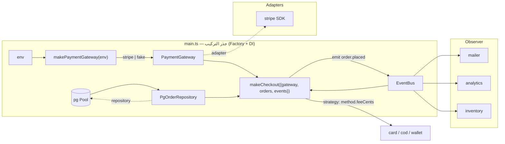

# Module 4.9 — أنماط التصميم التي تهم
## Design Patterns That Matter: Adapter, Strategy, Factory, Observer, Repository, Dependency Injection — problem / solution / tradeoff; anti-patterns

> **المستوى:** Level 4 | **الموقع:** [10 من 16]
> **السابق:** [M4.8 — SOLID](module-4.8-solid.md) | **التالي:** [M4.10 — Clean Code](module-4.10-clean-code.md)

---

## 1. المتطلبات
> **قبل أن تتعلم هذا، يجب أن تفهم:**
- [ ] SOLID كأدوات تشخيص، نقاط التوسعة، المنافذ — [M4.8](module-4.8-solid.md), [M4.5](module-4.5-software-design.md)
- [ ] الدوال كقيم، الإغلاقات، الدوال العليا — [L1-M1.4](../level-1-programming/module-1.4-functions-scope-closures.md)
- [ ] `EventEmitter` والأحداث في Node — [L1-M1.11](../level-1-programming/module-1.11-async-event-loop.md)
- [ ] withTransaction وrepositories في Project 4 — [L3-M3.14](../level-3-core-computer-science/module-3.14-transactions-acid.md)

## 2. أهداف التعلّم
- فهم **ما النمط**: حل مُسمّى لمشكلة متكررة في سياق، مع **مقايضاته** — والقيمة الأساسية: **مفردات مشتركة** في المراجعة والتصميم، لا قوالب تُلصق.
- إتقان ستة أنماط تظهر في كل backend بصيغة *المشكلة → الحل → المقايضة → شكله في TypeScript الحديث*: **Adapter, Strategy, Factory, Observer, Repository, Dependency Injection**.
- التعرّف على أنماط أخرى بالاسم عند رؤيتها (Decorator/Middleware, Facade, Builder, Command, State, Unit of Work, Circuit Breaker) وأين ستظهر لاحقًا.
- تمييز **الأنماط المضادة** (anti-patterns): God object, Singleton قابل للتعديل, Anemic domain, Service locator, Golden hammer, Lasagna/Spaghetti — وعلاماتها.
- معرفة أن كثيرًا من أنماط GoF يحلّها في JavaScript **دالة أو كائن حرفي أو وحدة** — فلا تستورد الهرميات.

---

## 3. شرح للمبتدئ

### النمط = اسم لحل تعرفه بالفعل
في M4.6 كتبت `makeEmailSender(transport)` — هذا Adapter + Dependency Injection. في M4.8 كتبت `PaymentMethod` بعدة تنفيذات — Strategy. في L3 كتبت `withTransaction` — Unit of Work. لم تحتج أسماءً لتكتبها؛ تحتاجها لتقول لزميلك في مراجعة: "اجعلها Strategy بدل switch" فيفهم في ثانيتين. **النمط ليس كودًا تنسخه؛ هو مشكلة + حل + ثمن.** إن لم تستطع ذكر الثمن فأنت لا تعرف النمط.

### الستة التي تظهر في كل backend

**1. Adapter — "أريد استخدام شيء بواجهة لا تناسبني"**
- *المشكلة:* مكتبة/مزوّد خارجي بواجهة وأنواع خاصة به (`stripe.refunds.create({...})`)، وتطبيقك يملك منفذًا بلغة المجال (`PaymentGateway.refund(orderId, cents)`).
- *الحل:* طبقة رقيقة تترجم: تستدعي الخارجي وتحوّل نتائجه وأخطاءه إلى أنواعك (M4.6: حوّل عند الحدّ).
- *المقايضة:* ملف إضافي لكل خارجي؛ قد تخفي قدرات متقدمة للمكتبة. *متى لا:* أداة داخلية تُستخدم مرة ولن تُبدَّل.
- *في TS:* كائن/دالة تنفّذ الواجهة. لا class ضروري.

**2. Strategy — "نفس الخطوة، سياسات مختلفة قابلة للتبديل"**
- *المشكلة:* `switch` على نوع (طريقة دفع، سياسة خصم، خوارزمية ترتيب) يتكرر وينمو.
- *الحل:* الواجهة تمثّل الخطوة (`feeCents(total)`)، وكل سياسة كائن/دالة، والمستدعي يتلقى السياسة لا يختارها.
- *المقايضة:* منطق الاختيار ينتقل إلى مكان آخر (Factory/سجل)؛ عدد ملفات أكبر. *متى لا:* حالتان ثابتتان — `if` يكفي؛ أو الأنواع مستقرة والعمليات تتزايد (اتحاد+switch، M4.8).
- *في TS:* **دالة** غالبًا تكفي: `type Discount = (cents: number) => number`.

**3. Factory — "إنشاء الكائن معقّد أو يعتمد على سياق"**
- *المشكلة:* اختيار التنفيذ من إعدادات/بيئة (`PAYMENT_PROVIDER=stripe|fake`)، أو إنشاء يتطلب خطوات/تبعيات.
- *الحل:* دالة واحدة تعرف كيف تُنشئ وتُرجع الواجهة: `makePaymentGateway(env)`. المستهلك لا يعرف الصف الملموس.
- *المقايضة:* نقطة مركزية تعرف كل التنفيذات (طبيعي في نقطة الدخول — composition root). *متى لا:* `new X()` بسيط وبلا تنوّع.
- *في TS:* دالة `make*`/`create*`؛ "Abstract Factory" نادرًا ما تحتاجها.

**4. Observer (Pub/Sub, Events) — "عندما يحدث X، أطراف لا أعرفها تريد أن تعرف"**
- *المشكلة:* بعد إنشاء الطلب: بريد، تحليلات، مخزون، تنبيه — ووضعها كلها في `createOrder` يخلق اقترانًا بكل شيء (S).
- *الحل:* المصدر ينشر حدثًا مسمّى؛ المشتركون يسجّلون أنفسهم. `EventEmitter` داخل العملية؛ outbox + طابور عبر العمليات (L5-M5.9).
- *المقايضة:* **تدفق التحكم غير مرئي** (من يستمع؟ بأي ترتيب؟ ماذا لو فشل مشترك؟ هل الحدث متزامن؟)؛ التصحيح أصعب؛ فقدان الأحداث إن لم تُثبَّت. *متى لا:* مشترك واحد معروف — استدعِه مباشرة.
- *في TS:* `EventEmitter` بأنواع، أو قائمة دوال؛ **صمّم الأخطاء**: مشترك فاشل لا يُسقط الباقي ولا الناشر.

**5. Repository — "المجال يريد مجموعات، لا SQL"**
- *المشكلة:* استعلامات SQL مبعثرة في حالات الاستخدام؛ اختبار المنطق يحتاج DB؛ تغيير schema يلمس كل شيء.
- *الحل:* واجهة بلغة المجال (`OrderRepository.findForUpdate`, `.save`) يملكها التطبيق (M4.5 port)، وتنفيذ `pg` خلفها؛ fake في الذاكرة للاختبار.
- *المقايضة:* خطر **التسرّب العكسي**: repository عام (`findAll()`) يخفي الأداء (N+1، صفحات) — L3 علّمك أن الاستعلام جزء من التصميم. القاعدة: دوال **مسمّاة بالحاجة** تخفي SQL محددًا ومُفحوصًا بـ `EXPLAIN`، لا CRUD عامًا. ولا تغلّف المعاملة داخل كل دالة — المعاملة حدّ حالة الاستخدام (Unit of Work). *متى لا:* سكربت تقارير يكتب SQL مباشرة — أوضح.

**6. Dependency Injection — "لا تُنشئ تبعياتك؛ تلقَّها"**
- *المشكلة:* الوحدة تُنشئ `new Pool()`/`new Stripe()` داخلها → لا اختبار بلا الحقيقي، ولا تبديل.
- *الحل:* التبعيات معاملات (منشئ/دالة مصنع)، وتُجمَّع في **جذر التركيب** (composition root = `main.ts`) حيث تُنشأ كل الأشياء الحقيقية مرة وتُمرَّر إلى الداخل.
- *المقايضة:* توصيل يدوي في نقطة الدخول (يكبر مع المشروع)؛ معاملات أكثر. حاويات DI تؤتمت التوصيل بثمن السحر. *متى لا:* تبعيات نقية لن تتغير ولن تُزيَّف.
- *في TS:* كائن `deps` كمعامل أول — بسيط، صريح، مقروء.

### أنماط ستقابلها بالاسم (تعرفها عند رؤيتها)
- **Decorator / Middleware**: تغليف دالة بأخرى بنفس الواجهة لإضافة سلوك (سجل، قياس، إعادة محاولة، cache). `express`/`fastify` middleware هو هذا. سترى `withRetry(fn)`, `withCache(repo)` في L5.
- **Facade**: واجهة بسيطة فوق نظام فرعي معقّد (= وحدة عميقة M4.6).
- **Builder**: بناء كائن معقّد خطوة بخطوة (query builders؛ في TS كائنات الخيارات تكفي غالبًا).
- **Command**: الطلب ككائن (طابور مهام، undo، outbox events).
- **State**: سلوك يتغير بالحالة (آلة حالات الطلب: `pending → paid → shipped` — L3-M3.12 history؛ تحويل مشروع فقط عبر جدول انتقالات).
- **Unit of Work**: `withTransaction` — تجميع الكتابات في معاملة واحدة.
- **Circuit Breaker / Retry / Bulkhead**: أنماط مرونة (L7-M7.5).
- **Saga / Outbox**: أنماط موزّعة (L5-M5.9، L7-M7.2).

### الأنماط المضادة
| النمط المضاد | علامته | الضرر | العلاج |
|---|---|---|---|
| **God object** | `OrderService` بـ 3000 سطر و40 تبعية | كل تغيير يمرّ به؛ تعارضات؛ اختبار مستحيل | S: قسّم بحسب سبب التغيير |
| **Mutable Singleton** | `export const config = {...}` يكتب فيه الجميع؛ `Db.instance` | common coupling؛ اختبارات تؤثر في بعضها؛ ترتيب تهيئة خفي | أنشئ مرة في جذر التركيب ومرّر |
| **Anemic domain** | كيانات = حقول فقط؛ كل المنطق في "services" تعدّل الحقول | القواعد مبعثرة ومكررة؛ حالات غير صالحة ممكنة | ضع القواعد مع البيانات (دوال مجال/آلة حالات) |
| **Service locator** | `container.get("EmailSender")` داخل الوحدات | تبعيات خفية؛ أخطاء وقت تشغيل؛ عكس DI | مرّر التبعيات صراحة |
| **Golden hammer** | كل مشكلة = النمط/الأداة المفضلة | تعقيد بلا حاجة | ابدأ بالأبسط؛ النمط عند الألم |
| **Lasagna** | 7 طبقات تمرّر نفس البيانات | ضحالة؛ كل ميزة تلمس 7 ملفات | ادمج الطبقات الضحلة |
| **Spaghetti** | كل شيء يستدعي كل شيء، دورات | لا حدود | M4.7 |
| **Premature pattern** | Strategy بتنفيذ واحد، Factory لصف واحد | تجريد بلا عائد | انتظر الحالة الثانية |

---

## 4. النموذج الذهني

```
   نمط = (مشكلة متكررة, حل مُسمّى, ثمن)      ← إن لم تذكر الثمن فلا تعرفه
   Adapter: ترجم الخارجي إلى واجهتك          Strategy: السياسة كقيمة تُمرَّر        Factory: من يقرّر أي تنفيذ (جذر التركيب)
   Observer: أعلن، لا تستدعِ (بثمن الرؤية)   Repository: المجموعة بلغة المجال (بلا إخفاء الأداء)   DI: تلقَّ تبعياتك
   في JS: الدالة والكائن الحرفي والوحدة تحلّ نصف GoF.   الأنماط مفردات للمراجعة، لا قوالب للكود.
```

---

## 5. الرسم التوضيحي



```
   Decorator/Middleware بنفس الواجهة:
   repo ──▶ withCache(repo) ──▶ withMetrics(...) ──▶ withRetry(...)      كل طبقة: OrderRepository داخل وخارج
   المستهلك لا يعرف كم طبقة؛ كل طبقة تُختبر وحدها؛ الترتيب مهم (retry خارج cache أم داخله؟ — قرار واعٍ)
```

---

## 6. مثال بسيط

```typescript
// src/patterns-mini.ts — ثلاثة أنماط في 25 سطرًا: Strategy كدالة، Factory كدالة، Decorator كدالة عليا
export type Discount = (cents: number) => number;                                             // Strategy = نوع دالة
export const none: Discount = () => 0, percent = (p: number): Discount => c => Math.floor(c * p / 100), fixed = (f: number): Discount => c => Math.min(c, f);

export function discountFor(code: string | undefined): Discount {                            // Factory: من يقرّر — في مكان واحد
  if (!code) return none; if (code.startsWith("P")) return percent(Number(code.slice(1))); if (code.startsWith("F")) return fixed(Number(code.slice(1)) * 100); return none;
}

export const withLog = <A extends unknown[], R>(name: string, fn: (...a: A) => R) => (...a: A): R => {   // Decorator: نفس الواجهة + سلوك
  const t = performance.now(); const r = fn(...a); console.log(name, (performance.now() - t).toFixed(3), "ms"); return r;
};
export const total = (sub: number, d: Discount) => sub - d(sub);
// total(10_000, discountFor("P15")) → 8500 ; withLog("total", total)(10_000, fixed(500)) → 9500 ويطبع الزمن
```

---

## 7. مثال كود

Adapter + Repository + Observer + DI + Factory في تدفق واحد، بالشكل الذي سيأخذه Project 5.

```typescript
// src/patterns.ts — المنافذ (يملكها التطبيق)، adapter للخارجي، observer مُصمَّم للفشل، جذر تركيب
import { EventEmitter } from "node:events";

// ── ports ──
export interface PaymentGateway { charge(i: { orderId: string; cents: number; idempotencyKey: string }): Promise<{ ok: true; ref: string } | { ok: false; retryable: boolean; reason: string }>; }
export interface OrderRepository { insertPending(o: { customerId: string; cents: number }): Promise<{ id: string }>; markPaid(id: string, ref: string): Promise<void>; }
export type DomainEvents = { "order.paid": { orderId: string; cents: number }; "order.payment_failed": { orderId: string; reason: string } };
export interface EventBus { emit<K extends keyof DomainEvents>(k: K, e: DomainEvents[K]): void; on<K extends keyof DomainEvents>(k: K, h: (e: DomainEvents[K]) => void | Promise<void>): void; }

// ── Adapter: مزوّد خارجي بواجهته الخاصة → منفذنا (الترجمة + تصنيف الأخطاء هنا فقط)
type StripeLike = { paymentIntents: { create(p: { amount: number; currency: string; metadata: Record<string, string> }, o: { idempotencyKey: string }): Promise<{ id: string; status: string }> } };
export const stripeAdapter = (stripe: StripeLike): PaymentGateway => ({
  async charge(i) {
    try { const pi = await stripe.paymentIntents.create({ amount: i.cents, currency: "dzd", metadata: { orderId: i.orderId } }, { idempotencyKey: i.idempotencyKey });
          return pi.status === "succeeded" ? { ok: true, ref: pi.id } : { ok: false, retryable: false, reason: pi.status }; }
    catch (e) { const m = (e as Error).message; return { ok: false, retryable: /rate|timeout|ECONN/i.test(m), reason: m }; }
  },
});

// ── Observer مُصمَّم للفشل: مشترك يرمي لا يُسقط الناشر ولا بقية المشتركين؛ الأخطاء تُسجَّل (في L5: outbox بدل الذاكرة)
export function makeEventBus(onError: (k: string, e: unknown) => void = (k, e) => console.error("subscriber failed", k, e)): EventBus {
  const em = new EventEmitter();
  return {
    on: (k, h) => { em.on(k, async e => { try { await h(e); } catch (err) { onError(k, err); } }); },
    emit: (k, e) => { em.emit(k, e); },
  };
}

// ── use case بـ DI: لا يعرف Stripe ولا pg ولا من يستمع
export const makePlaceOrder = (deps: { gateway: PaymentGateway; orders: OrderRepository; events: EventBus }) =>
  async (input: { customerId: string; cents: number; idempotencyKey: string }) => {
    const { id } = await deps.orders.insertPending({ customerId: input.customerId, cents: input.cents });
    const r = await deps.gateway.charge({ orderId: id, cents: input.cents, idempotencyKey: input.idempotencyKey });
    if (!r.ok) { deps.events.emit("order.payment_failed", { orderId: id, reason: r.reason }); return { orderId: id, status: "payment_failed" as const, retryable: r.retryable }; }
    await deps.orders.markPaid(id, r.ref);
    deps.events.emit("order.paid", { orderId: id, cents: input.cents });
    return { orderId: id, status: "paid" as const };
  };

// ── Factory + جذر التركيب: المكان الوحيد الذي يعرف "أيّ تنفيذ"
export function makeGateway(env: NodeJS.ProcessEnv, stripe?: StripeLike): PaymentGateway {
  if (env.PAYMENT_PROVIDER === "stripe" && stripe) return stripeAdapter(stripe);
  return { charge: async i => (i.cents > 1_000_000 ? { ok: false, retryable: false, reason: "limit" } : { ok: true, ref: `fake_${i.idempotencyKey}` }) };   // fake يحترم العقد (L)
}
```

```typescript
// src/patterns.test.ts — كل نمط يُختبر عبر واجهته؛ لاحظ اختبار "مشترك فاشل لا يكسر التدفق"
import { test } from "node:test"; import assert from "node:assert/strict";
import { makeEventBus, makeGateway, makePlaceOrder, stripeAdapter, type OrderRepository } from "./patterns.js";

const memOrders = (): OrderRepository & { rows: Map<string, { cents: number; ref?: string }> } => { const rows = new Map<string, { cents: number; ref?: string }>(); let n = 0; return { rows,
  insertPending: async o => { const id = `o${++n}`; rows.set(id, { cents: o.cents }); return { id }; }, markPaid: async (id, ref) => { rows.get(id)!.ref = ref; } }; };

test("adapter translates provider status and errors into the port contract", async () => {
  const ok = stripeAdapter({ paymentIntents: { create: async () => ({ id: "pi_1", status: "succeeded" }) } });
  assert.deepEqual(await ok.charge({ orderId: "o", cents: 100, idempotencyKey: "k" }), { ok: true, ref: "pi_1" });
  const down = stripeAdapter({ paymentIntents: { create: async () => { throw new Error("ECONNRESET"); } } });
  assert.deepEqual(await down.charge({ orderId: "o", cents: 100, idempotencyKey: "k" }), { ok: false, retryable: true, reason: "ECONNRESET" });
});
test("place order: paid path emits order.paid; a failing subscriber does not break the flow", async () => {
  const errors: string[] = []; const events = makeEventBus(k => errors.push(k)); const seen: string[] = [];
  events.on("order.paid", () => { throw new Error("mailer down"); }); events.on("order.paid", e => { seen.push(e.orderId); });
  const orders = memOrders(); const place = makePlaceOrder({ gateway: makeGateway({}), orders, events });
  const r = await place({ customerId: "c", cents: 500, idempotencyKey: "k1" });
  await new Promise(r => setImmediate(r));                                                   // المشتركون غير متزامنون
  assert.equal(r.status, "paid"); assert.equal(orders.rows.get("o1")!.ref, "fake_k1"); assert.deepEqual(seen, ["o1"]); assert.deepEqual(errors, ["order.paid"]);
});
test("factory picks fake without env; fake honours the contract (limit → not ok)", async () => {
  const r = await makeGateway({}).charge({ orderId: "o", cents: 2_000_000, idempotencyKey: "k" }); assert.ok(!r.ok && !r.retryable);
});
```

---

## 8. مثال من العالم الحقيقي
Node نفسه مبني على هذه الأنماط: `http.createServer` (Factory)، `EventEmitter` كأساس لكل تدفق (Observer — بثمنه المعروف: `error` بلا مستمع يُسقط العملية!)، streams `pipe` (Decorator/Pipeline)، `fs.promises` فوق `fs` (Adapter بين callbacks وPromises). وفي Project 4: `withTransaction` (Unit of Work)، `pool` (Object pool)، migrations runner (Command). كنت تستخدم الأنماط قبل أن تعرف أسماءها — الآن تستطيع **نقدها**: لماذا `error` حدث خاص في EventEmitter؟ لأن Observer بلا سياسة أخطاء كارثة.

## 9. مثال من الإنتاج
فريق أدخل Observer داخلي (`EventEmitter`) لفصل "بعد الطلب": بريد، تحليلات، مخزون. بعد شهر: طلبات مدفوعة بلا خصم مخزون. السبب: المشترك `inventory` رمى استثناءً (منتج محذوف)، والـ emitter أسقط باقي المشتركين، ولا أحد يعرف لأن الحدث "ناجح" من منظور الناشر. العلاج: (1) سياسة أخطاء لكل مشترك (§7)، (2) الأحداث المهمة للصحة (مخزون) ليست "إعلانًا" بل **جزء من المعاملة** أو outbox مضمون؛ الإعلان للأشياء التي يُقبل فقدانها (تحليلات). **الثمن الذي لم يُذكر عند اختيار النمط ظهر في الإنتاج.**

---

## 10. مفاهيم خاطئة شائعة
1. **"معرفة الأنماط = معرفة 23 نمط GoF بالصفوف."** نصفها دوال/كائنات في JS؛ والمهم: المشكلة والثمن.
2. **"Repository يخفي قاعدة البيانات تمامًا."** يخفي SQL لا **الأداء**؛ دواله مسمّاة بالحاجة ومصحوبة بـ `EXPLAIN`. repository عام = ORM ساذج = N+1 (L3-M3.11).
3. **"الأحداث تفصل كل شيء بلا ثمن."** ثمنها الرؤية والترتيب وسياسة الفشل والضمانات؛ للعمليات الحرجة استخدم outbox لا emitter.
4. **"Singleton نمط سيئ دائمًا."** *كائن واحد* طبيعي (pool واحد)؛ السيئ هو **الوصول العالمي القابل للتعديل**. أنشئه مرة في جذر التركيب ومرّره.
5. **"DI = إطار."** DI = معامل. الإطار اختياري ولاحق.

## 11. أخطاء شائعة
1. Strategy/Factory لتنفيذ واحد (نمط استباقي).
2. Adapter يسرّب أنواع المزوّد (`Stripe.PaymentIntent`) عبر المنفذ.
3. Observer بلا معالجة أخطاء أو بترتيب يعتمد عليه المشتركون ضمنيًا.
4. Repository بـ `findAll()`/`find(filter: any)` يخفي استعلامات غير محدودة.
5. المعاملة داخل كل دالة repository → لا يمكن تجميع كتابتين في معاملة واحدة.
6. `container.resolve()` داخل المجال (service locator) بدل التمرير.
7. استخدام الأنماط كحجة ("هذا ليس Repository حقيقيًا") بدل المشكلة الفعلية.

## 12. تمرين تصحيح
بعد إضافة طبقة `withCache(orderRepo)` (Decorator)، ظهرت قراءات قديمة (stale) بعد إلغاء الطلب.
- **لاحظ:** `GET /orders/42` يعيد `paid` بعد ثوانٍ من إلغائه بنجاح.
- **دليل:** `withCache` يغلّف `findById` ويخزّن 60 ثانية؛ `markCancelled` تمرّ عبر نفس الكائن المغلَّف لكن الـ decorator لا يبطل المفتاح (يغلّف القراءة فقط). وترتيب التغليف: `withRetry(withCache(repo))` — إعادة المحاولة تعيد نتيجة cache.
- **فرضية:** الـ decorator كسر عقد الواجهة ضمنيًا (L): `findById` بعد `markCancelled` يجب أن يعكس الكتابة — العقد لم يكن مكتوبًا.
- **تجربة:** اكتب اختبار عقد `write then read reflects write` وشغّله على `repo`, `withCache(repo)`؛ أصلح الـ decorator ليبطل عند الكتابات (أو اجعل الـ cache خارج الـ repository، على مستوى HTTP بـ ETag — L2-M2.12).
- **استنتاج:** الـ Decorator يَعِد "بنفس الواجهة"؛ الواجهة تشمل **السلوك** لا التوقيع. اختبارات العقد تُشغَّل على كل طبقة.

## 13. تمرين معماري
صمّم "بعد إنشاء الطلب" لـ Project 6 (بريد تأكيد، خصم مخزون، تحليلات، تنبيه مبيعات كبيرة): لكل نتيجة قرّر — داخل المعاملة؟ outbox مضمون؟ إعلان داخلي يُقبل فقدانه؟ — بحسب تكلفة الفقدان والازدواج. ارسم التدفق، حدّد سياسة فشل كل مشترك وإعادة محاولته وidempotency، واذكر بـ ACTRR لماذا لا تضع الكل في outbox ولماذا لا تضع الكل في المعاملة. ثم حدّد أين Adapter (مزوّدون) وأين Factory (اختيار بالبيئة) وأين لا تحتاج أي نمط.

## 14. الصلة بعصر AI
الأنماط هي **لغة مشتركة بينك وبين النموذج**: "اكتب adapter لمنفذ `PaymentGateway` لمزوّد X مع تصنيف الأخطاء إلى retryable/غير" ينتج ما تريد في محاولة واحدة. لكن النماذج تُفرط في الأنماط (Factory لكل شيء، Singleton، service locator) وتنسى **الثمن** (Observer بلا أخطاء). عند مراجعة كود مولَّد اسأل عن كل نمط: ما المشكلة التي يحلّها هنا؟ ما ثمنه؟ هل الحالة الثانية موجودة؟ (L8-M8.2 vibe coding vs engineering: الفرق هو هذه الأسئلة.)

## 15. ما يجب إتقانه (Must Master) 🔴
- 🔴 النمط = مشكلة + حل + ثمن؛ الستة بمشكلتها وحلها وثمنها وشكلها كدوال/كائنات؛ جذر التركيب؛ Observer مُصمَّم للفشل؛ Repository بدوال مسمّاة بلا إخفاء الأداء؛ الأنماط المضادة الأربعة الأولى.

## 16. ما يجب فهمه (Should Understand) 🟠
- 🟠 Decorator/Middleware وترتيب الطبقات؛ State كآلة حالات بجدول انتقالات؛ Command/Unit of Work؛ متى يكون الإعلان مقبولًا ومتى outbox؛ اختبارات العقد على الطبقات.

## 17. ما يمكن تأجيله (Can Defer) ⚪
- ⚪ كامل كتالوج GoF وPoEAA بالاسم، أنماط التزامن (Actor، Reactor)، أنماط التكامل المؤسسي (EIP)، DSLs وBuilders المعقدة.

## 18. الخلاصة
1. النمط مفردات: مشكلة متكررة + حل مُسمّى + ثمن؛ إن غاب الثمن غاب الفهم.
2. Adapter يترجم الخارجي إلى واجهتك؛ Strategy سياسة كقيمة؛ Factory مَن يقرّر التنفيذ (جذر التركيب)؛ Observer إعلان بثمن الرؤية والفشل؛ Repository مجموعة بلغة المجال بلا إخفاء الأداء؛ DI = تمرير.
3. في TypeScript معظمها دوال وكائنات حرفية ووحدات — لا هرميات صفوف.
4. الأنماط المضادة: God object، singleton قابل للتعديل، anemic domain، service locator، النمط الاستباقي.
5. اختر النمط عند الألم وبعد ذكر ثمنه؛ واختبر عقد كل طبقة.

## 19. مراجع رسمية
- Gamma, Helm, Johnson, Vlissides — Design Patterns (GoF) overview & catalog: https://refactoring.guru/design-patterns/catalog
- Martin Fowler — Patterns of Enterprise Application Architecture (Repository, Unit of Work): https://martinfowler.com/eaaCatalog/
- Node.js — `events.EventEmitter` (error event semantics): https://nodejs.org/api/events.html#error-events
- Mark Seemann — Composition Root: https://blog.ploeh.dk/2011/07/28/CompositionRoot/
- Microsoft — Cloud Design Patterns (Retry, Circuit Breaker, Outbox-related): https://learn.microsoft.com/en-us/azure/architecture/patterns/

## المصطلحات
| العربية | English |
|---|---|
| نمط تصميم | Design pattern |
| نمط مضاد | Anti-pattern |
| مهايئ | Adapter |
| استراتيجية | Strategy |
| مصنع | Factory |
| مراقِب / نشر-اشتراك | Observer / Pub-Sub |
| مستودع | Repository |
| جذر التركيب | Composition root |
| مزخرِف / وسيط | Decorator / Middleware |
| واجهة مبسّطة | Facade |
| آلة حالات | State machine |
| كائن إله | God object |
| نموذج مجال هزيل | Anemic domain model |
| محدّد الخدمات | Service locator |
