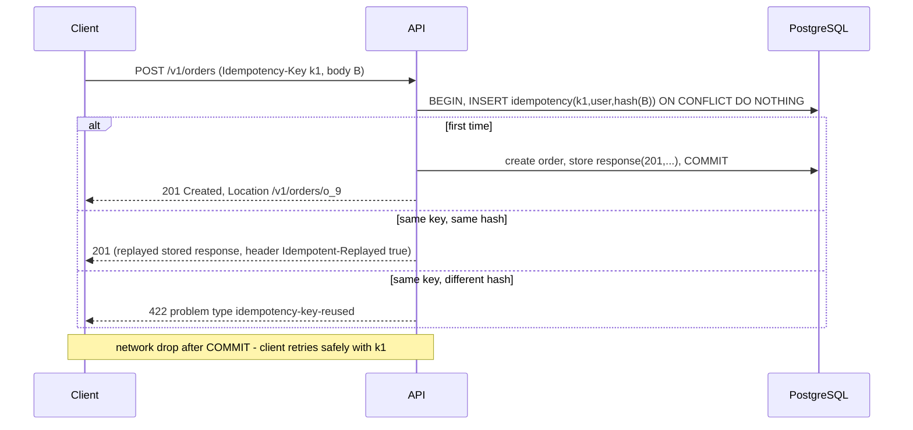

# Module 5.1 — تصميم واجهات API
## API Design: resources, HTTP semantics, status codes, error format, pagination, filtering, versioning, idempotency keys, OpenAPI

> **المستوى:** Level 5 | **الموقع:** [1 من 13]
> **السابق:** [Checkpoint 4](../level-4-software-engineering-foundations/checkpoint-4.md) | **التالي:** [M5.2 — Authentication](module-5.2-authentication.md)

---

## 1. المتطلبات
- [ ] HTTP بعمق: methods وsafe/idempotent، status codes، headers، caching، content negotiation — [L2-M2.12](../level-2-computer-systems/module-2.12-http.md)
- [ ] keyset pagination ولماذا offset ينهار — [L3-M3.9](../level-3-core-computer-science/module-3.9-algorithms-that-matter.md)
- [ ] المتطلبات وNFRs بمقياس، معايير القبول GWT — [L4-M4.2](../level-4-software-engineering-foundations/module-4.2-requirements.md), [L4-M4.3](../level-4-software-engineering-foundations/module-4.3-user-stories-acceptance-criteria.md)
- [ ] الطبقات http → application → domain وports — [L4-M4.5](../level-4-software-engineering-foundations/module-4.5-software-design.md)
- [ ] الاختبار e2e على port 0 — [L4-M4.11](../level-4-software-engineering-foundations/module-4.11-testing.md)
- [ ] Project 4 (`storeapi`) يعمل — [Project 4](../projects/project-4-db-api/README.md)

## 2. أهداف التعلّم
- التفكير في API كـ **عقد عام طويل العمر** (contract) يراه أناس لا تعرفهم، ويُصمَّم من **حالات الاستخدام** لا من الجداول.
- تسمية الموارد (resources) ونمذجة العلاقات والأفعال غير-CRUD، واختيار الـ method ورمز الحالة **بمعناهما** لا بالعادة.
- تصميم **صيغة خطأ واحدة** (RFC 9457 Problem Details) تخدم الإنسان والآلة، وتمييز 400/401/403/404/409/422/429/5xx.
- تنفيذ **cursor pagination** مُعتِمة (opaque)، والفلترة والفرز بمعاملات مُقيَّدة، وحدود الحجم.
- تطبيق **مفاتيح العدم-تكرار** (Idempotency-Key) بشكل صحيح: التخزين، بصمة الطلب، التعارض، الانتهاء.
- اتخاذ قرار الإصدار (versioning) وقواعد التغيير المتوافق/الكاسر، ووصف العقد بـ **OpenAPI** ليُولَّد منه التحقق والعملاء والوثائق.

---

## 3. شرح للمبتدئ

### API = عقد، لا "نقاط نهاية"
في Project 4 كتبت endpoints لتعمل. الآن انظر إليها كما يراها مطوّر تطبيق الهاتف أو شريك خارجي بعد سنة: **عقد** لا يستطيعون كسره ولا تستطيع أنت تغييره بحرية. لذلك يُصمَّم API مثل واجهة وحدة عميقة (L4-M4.6): صغير، متسق، يخفي قراراتك الداخلية (أسماء الجداول، لغة الخادم، كيف تخزّن)، ويصمد أمام التغيير. ابدأ من **حالات الاستخدام** (قصص L4-M4.3): "العميل يرى طلباته الأخيرة ويلغي طلبًا لم يُشحن" → مواردك وأفعالك تتبع ذلك، لا `SELECT * FROM orders`.

### الموارد والتسمية
- **اسم جمع للمجموعة، معرّف للعنصر:** `/orders`, `/orders/{orderId}`. العلاقات المملوكة تتداخل مستوى واحدًا: `/orders/{id}/items`؛ أعمق من ذلك → مورد مستقل بفلتر (`/shipments?orderId=…`).
- **لا أفعال في المسار** لـ CRUD (`/getOrders` ✗). الأفعال التي ليست CRUD (إلغاء، دفع، إرسال) تُنمذج إمّا **كتغيير حالة** (`PATCH /orders/{id}` بـ `{status:"cancelled"}` — حين الانتقال بسيط)، أو **كمورد فرعي للفعل** (`POST /orders/{id}/cancellation` → تُنشئ "إلغاءً" له سبب وتاريخ ونتيجة — حين للفعل بيانات أو قد يفشل أو يحتاج idempotency). الثانية أوضح في الأنظمة الحقيقية.
- أسماء ثابتة بأسلوب واحد (`kebab-case` في المسارات، `camelCase` في JSON)، معرّفات **مُعتِمة** (UUIDv7 من L3-M3.9 لا `serial` يعدّ لك عدد الطلبات)، وقت دائمًا ISO-8601 بـ UTC، مال دائمًا بأصغر وحدة `amountCents` + `currency` (L1 `number` = double).

### الـ methods بمعناها (L2-M2.12)
`GET` آمن وقابل للكاش ولا body؛ `POST` ينشئ/يفعل وغير idempotent بطبيعته (لذلك Idempotency-Key)؛ `PUT` يستبدل كاملًا وidempotent؛ `PATCH` تعديل جزئي (JSON Merge Patch RFC 7396 أبسط من JSON Patch)؛ `DELETE` idempotent (الحذف الثاني → 204 أو 404 — اختر ووثّق). عميل يُرسل `GET /orders/1/cancel` يكسر: المتصفحات والـ prefetch والـ crawlers تنفّذ GET "آمنًا" — هذه حادثة حقيقية متكرّرة.

### رموز الحالة: تعني شيئًا للعميل الآلي
| الحالة | متى |
|---|---|
| 200 / 201 (+`Location`) / 202 (قُبل وسيُعالج لاحقًا — M5.9) / 204 (نجاح بلا جسم) | نجاح |
| 400 | الطلب غير مفهوم (JSON تالف، نوع خاطئ في معامل) |
| 401 | هوية غائبة/غير صالحة (M5.2) — مع `WWW-Authenticate` |
| 403 | هوية معروفة لكن ممنوعة (M5.3) |
| 404 | غير موجود **أو لا يحق لك معرفة وجوده** (مقاومة التعداد) |
| 405 (+`Allow`) / 415 / 406 | method غير مدعوم / نوع محتوى غير مدعوم / لا نستطيع إنتاج ما تطلب |
| 409 | تعارض حالة (إلغاء طلب مشحون، مفتاح idempotency بجسم مختلف، version قديم M5.6) |
| 422 | JSON صحيح البنية لكن **دلاليًا** مرفوض (بريد غير صالح، كمية سالبة) — أو 400 للاثنين إن أردت البساطة؛ **اتساق** واحد عبر الـ API |
| 429 (+`Retry-After`) | حدّ معدّل (M5.2) |
| 500 / 502 / 503 (+`Retry-After`) / 504 | عطل عندنا / خلفنا / مؤقت / مهلة — **بلا تفاصيل داخلية** |

القاعدة: 4xx = "أصلح طلبك"، 5xx = "أعد المحاولة لاحقًا/أبلغنا" — العميل الآلي يبني retry على هذا التمييز (L3-M3.9 شروط retry).

### صيغة خطأ واحدة: Problem Details (RFC 9457)
```json
{ "type": "https://api.example.com/problems/insufficient-stock", "title": "Insufficient stock", "status": 409,
  "detail": "Product p_7 has 0 units, requested 2", "instance": "/v1/orders", "requestId": "req_01J…",
  "errors": [{ "field": "items[0].quantity", "message": "exceeds available stock", "available": 0 }] }
```
`type` معرّف **مستقر** يبني عليه العميل منطقه (لا يحلّل النص)، `title` ثابت، `detail` للإنسان، `requestId` يربط بسجلّك (L4-M4.12)، `errors[]` للتحقق متعدّد الحقول. `Content-Type: application/problem+json`. **لا** stack traces، لا SQL، لا أسماء جداول — تسريب معلومات (M5.4). كل مسار فشل في الـ API يمرّ من دالة واحدة.

### Pagination / Filtering / Sorting
- **Cursor** لا offset للقوائم المتغيّرة (L3-M3.9): الاستجابة `{ data: [...], nextCursor: "…" | null }`؛ الـ cursor **مُعتِم** (base64url لـ `{createdAt,id}` + توقيع اختياري) حتى تغيّر تنفيذه دون كسر العملاء؛ `limit` بحدّ أقصى صلب (100) وافتراضي (20). Offset مقبول فقط لنتائج صغيرة ثابتة تحتاج "صفحة 7".
- **الفلترة** بمعاملات مسمّاة محدودة: `?status=paid&createdAfter=2026-01-01` — **قائمة بيضاء** للحقول والمشغّلات؛ لا لغة استعلام حرّة في v1.
- **الفرز** `?sort=-createdAt,total` بقائمة بيضاء؛ يجب أن يكون ترتيب الفرز **حتميًا** (أضف `id` كفاصل) وإلا تكرّرت/اختفت عناصر بين الصفحات.
- **اختيار الحقول/التوسيع** (`?include=items`) حين تحتاجه حالات استخدام فعلية — أو GraphQL إن كانت أشكال القراءة كثيرة ومتغيّرة (قرار معماري له ثمنه).

### Idempotency-Key: جعل POST آمنًا لإعادة المحاولة
الشبكة تفشل **بعد** أن ينفّذ الخادم (L0/L2: ضاع الجواب لا الطلب) → العميل يعيد → طلب مزدوج/دفع مزدوج. الحل: العميل يولّد مفتاحًا فريدًا للعملية (`Idempotency-Key: 7f3…`) ويعيد إرساله مع كل محاولة. الخادم: (1) يبحث عن المفتاح **ضمن نطاق المستخدم**؛ (2) إن وُجد وبصمة الجسم مطابقة → **يعيد نفس الاستجابة المخزّنة** (نفس الحالة والجسم)؛ (3) إن وُجد ببصمة مختلفة → 422/409 "مفتاح مُعاد استخدامه بجسم مختلف"؛ (4) إن كانت المحاولة الأولى **ما زالت قيد التنفيذ** → 409 "in progress" (أو انتظار) — لا تنفيذ موازٍ؛ (5) انتهاء الصلاحية (24 ساعة مثلًا). التخزين يجب أن يكون **ذريًا مع العملية** (نفس معاملة DB — L3-M3.14/P4 S3) وإلا بقي سباق بين فحص المفتاح وتنفيذ العملية. Stripe وثّقت هذا النمط وهو معيار الصناعة.

### الإصدار والتوافق
**التغيير المتوافق** (لا إصدار جديد): إضافة حقل اختياري في الاستجابة، إضافة endpoint، إضافة قيمة enum جديدة *إن وثّقت أن العملاء يجب أن يتجاهلوا المجهول* (Postel: كن محافظًا فيما ترسل، متسامحًا فيما تستقبل — بحذر). **الكاسر**: حذف/إعادة تسمية حقل، تغيير نوع، تشديد تحقّق، تغيير معنى رمز حالة. استراتيجيات: مسار `/v1/` (الأوضح والأسهل في التوجيه والكاش)، رأس `Accept: application/vnd.api.v2+json` (أنقى نظريًا)، أو إصدار بتاريخ لكل عميل (Stripe). للغالبية: **`/v1` في المسار + سياسة إهمال** (deprecation: رأس `Deprecation`/`Sunset`، مهلة 6–12 شهرًا، مقاييس استخدام v1 قبل إطفائه = expand→migrate→contract من L4-M4.13). النصيحة الذهبية: **أرخص إصدار هو الذي لا تحتاجه** — صمّم v1 بعناية (مراجعة تصميم L4-M4.5) وابقَ فيه سنوات بتغييرات متوافقة.

### OpenAPI: العقد كملف
ملف `openapi.yaml` يصف المسارات والمخططات (schemas) والأخطاء والأمان. منه تولّد: التحقق من الطلبات على الحدود (types erased → validate at boundaries)، عملاء TypeScript، وثائق تفاعلية، واختبارات عقد (L4-M4.8) تثبت أن الخادم يطابق الملف. **Design-first** (الملف أولًا ثم الكود) يجعل مراجعة الـ API ممكنة قبل بناء شيء — وهو ما تطلبه L8 عند تفويض التنفيذ لـ AI: العقد منك، التنفيذ منه، والاختبار يحكم.

---

## 4. النموذج الذهني

```
   حالة استخدام ──▶ مورد + فعل ──▶ method بمعناه ──▶ رمز حالة بمعناه ──▶ جسم بصيغة ثابتة (نجاح | Problem Details)
   كل قائمة: cursor مُعتِم + limit مقيَّد + فلتر/فرز بقائمة بيضاء + ترتيب حتمي
   كل POST مهم: Idempotency-Key مخزَّن ذريًا مع العملية (نطاق المستخدم، بصمة الجسم، انتهاء)
   كل تغيير: متوافق؟ أضف. كاسر؟ v2 + Deprecation + Sunset + قياس.
   العقد = openapi.yaml → تحقق + عملاء + وثائق + اختبار عقد
```

---

## 5. الرسم التوضيحي



```
   رمز الحالة كشجرة قرار:
   هل فهمت الطلب نحويًا؟ لا → 400      هل أعرف من أنت (إن لزم)؟ لا → 401      يحق لك؟ لا → 403 (أو 404 لإخفاء الوجود)
   المورد موجود؟ لا → 404              الجسم صالح دلاليًا؟ لا → 422            الحالة تسمح؟ لا → 409
   تجاوزت الحد؟ → 429 + Retry-After    فشلنا نحن؟ → 500 (مؤقت 503 + Retry-After) — بلا تفاصيل
```

---

## 6. مثال بسيط

```typescript
// src/problem.ts — صيغة خطأ واحدة للـ API كلّه (RFC 9457)؛ كل مسار فشل يمرّ من هنا
import type { ServerResponse } from "node:http";
export type Problem = { type: string; title: string; status: number; detail?: string; instance?: string; requestId?: string; errors?: Array<{ field: string; message: string }> };
const BASE = "https://api.example.com/problems/";
export const problems = {                                                                  // الأنواع المستقرة التي يبني عليها العميل منطقه
  badRequest:   (detail: string) => ({ type: BASE + "bad-request", title: "Bad request", status: 400, detail }),
  notFound:     (what: string) => ({ type: BASE + "not-found", title: "Not found", status: 404, detail: `${what} not found` }),
  methodNotAllowed: (allow: string[]) => ({ type: BASE + "method-not-allowed", title: "Method not allowed", status: 405, detail: `Allowed: ${allow.join(", ")}` }),
  unsupportedMedia: () => ({ type: BASE + "unsupported-media-type", title: "Unsupported media type", status: 415, detail: "Send application/json" }),
  validation:   (errors: Problem["errors"]) => ({ type: BASE + "validation", title: "Validation failed", status: 422, errors }),
  conflict:     (sub: string, detail: string) => ({ type: BASE + sub, title: "Conflict", status: 409, detail }),
  idemReused:   () => ({ type: BASE + "idempotency-key-reused", title: "Idempotency key reused with a different payload", status: 422 }),
  internal:     () => ({ type: BASE + "internal", title: "Internal error", status: 500 }),      // لا تفاصيل أبدًا
} satisfies Record<string, (...a: never[]) => Problem>;
export function sendProblem(res: ServerResponse, p: Problem, ctx: { requestId: string; instance: string }, headers: Record<string, string> = {}) {
  res.writeHead(p.status, { "content-type": "application/problem+json", ...headers });
  res.end(JSON.stringify({ ...p, instance: ctx.instance, requestId: ctx.requestId }));
}
```

---

## 7. مثال كود

```typescript
// src/cursor.ts — cursor مُعتِم وحتمي لقائمة مرتّبة (createdAt desc, id desc)؛ المحتوى base64url حتى لا يعتمد العميل على شكله
export type Cursor = { createdAt: string; id: string };
export const encodeCursor = (c: Cursor) => Buffer.from(JSON.stringify(c)).toString("base64url");
export function decodeCursor(s: string | undefined): Cursor | null | "invalid" {
  if (!s) return null;
  try { const c = JSON.parse(Buffer.from(s, "base64url").toString("utf8")); return typeof c?.createdAt === "string" && typeof c?.id === "string" ? c : "invalid"; } catch { return "invalid"; }
}
// في SQL (L3-M3.9):  WHERE (created_at, id) < ($1, $2) ORDER BY created_at DESC, id DESC LIMIT $3 + 1   ← نجلب limit+1 لنعرف إن كانت هناك صفحة تالية
```

```typescript
// src/validate.ts — التحقق على الحدود بلا مكتبة (في مشروعك: zod/valibot تولّد الأنواع والأخطاء معًا). الأنواع تُمحى وقت التشغيل!
export type Issue = { field: string; message: string };
export type CreateOrderInput = { items: Array<{ productId: string; quantity: number }>; note?: string };
export function parseCreateOrder(body: unknown): { ok: true; value: CreateOrderInput } | { ok: false; issues: Issue[] } {
  const issues: Issue[] = []; const b = body as Record<string, unknown> | null;
  if (!b || typeof b !== "object" || Array.isArray(b)) return { ok: false, issues: [{ field: "", message: "body must be a JSON object" }] };
  const items = b["items"];
  if (!Array.isArray(items) || items.length === 0) issues.push({ field: "items", message: "must be a non-empty array" });
  else if (items.length > 50) issues.push({ field: "items", message: "at most 50 items" });
  else items.forEach((it: unknown, i) => {
    const o = it as Record<string, unknown>;
    if (typeof o?.["productId"] !== "string" || !/^p_[a-z0-9]+$/.test(o["productId"])) issues.push({ field: `items[${i}].productId`, message: "invalid id" });
    if (!Number.isInteger(o?.["quantity"]) || (o["quantity"] as number) < 1 || (o["quantity"] as number) > 1000) issues.push({ field: `items[${i}].quantity`, message: "integer 1..1000" });
  });
  if (b["note"] !== undefined && (typeof b["note"] !== "string" || b["note"].length > 500)) issues.push({ field: "note", message: "string ≤ 500 chars" });
  return issues.length ? { ok: false, issues } : { ok: true, value: { items: items as CreateOrderInput["items"], ...(typeof b["note"] === "string" ? { note: b["note"] } : {}) } };
}
```

```typescript
// src/orders-api.ts — API صغير لكن "بالعقد": Problem Details، 405/415، cursor pagination بفلتر وحد، Idempotency-Key بنطاق المستخدم وبصمة وتنفيذ-جارٍ
import { createServer, type IncomingMessage, type ServerResponse } from "node:http";
import { createHash, randomUUID } from "node:crypto";
import { problems, sendProblem, type Problem } from "./problem.js";
import { decodeCursor, encodeCursor } from "./cursor.js";
import { parseCreateOrder } from "./validate.js";

export type Order = { id: string; userId: string; status: "pending" | "paid" | "cancelled"; totalCents: number; createdAt: string };
export type OrdersRepo = {                                                                 // port (L4-M4.5) — في P5 تنفيذه SQL من P4
  list(userId: string, q: { status?: Order["status"]; after?: { createdAt: string; id: string } | null; limit: number }): Promise<Order[]>;   // يعيد حتى limit+1
  get(userId: string, id: string): Promise<Order | null>;
  create(userId: string, items: Array<{ productId: string; quantity: number }>): Promise<Order>;
  cancel(userId: string, id: string): Promise<Order | "not_found" | "not_cancellable">;
};
type Stored = { fingerprint: string; status: number; body: string; headers: Record<string, string> } | { inProgress: true; fingerprint: string };
export type IdempotencyStore = { get(k: string): Promise<Stored | undefined>; set(k: string, v: Stored): Promise<void> };   // في الإنتاج: جدول DB داخل نفس المعاملة، أو Redis بـ SET NX

const MAX_LIMIT = 100, DEFAULT_LIMIT = 20;
const json = (res: ServerResponse, status: number, body: unknown, headers: Record<string, string> = {}) => { res.writeHead(status, { "content-type": "application/json", ...headers }); res.end(JSON.stringify(body)); };
const readJson = (req: IncomingMessage, max = 64 * 1024) => new Promise<unknown>((resolve, reject) => { let n = 0; const chunks: Buffer[] = []; req.on("data", c => { n += c.length; if (n > max) { reject(new RangeError("payload too large")); req.destroy(); } else chunks.push(c); }); req.on("end", () => { try { resolve(chunks.length ? JSON.parse(Buffer.concat(chunks).toString("utf8")) : undefined); } catch { reject(new SyntaxError("malformed json")); } }); req.on("error", reject); });
const fingerprint = (method: string, path: string, body: unknown) => createHash("sha256").update(`${method} ${path}\n${JSON.stringify(body ?? null)}`).digest("hex");

export function makeApi(deps: { repo: OrdersRepo; idem: IdempotencyStore; userOf: (req: IncomingMessage) => string | null }) {
  return createServer(async (req, res) => {
    const requestId = (req.headers["x-request-id"] as string | undefined) ?? randomUUID(); res.setHeader("x-request-id", requestId);
    const url = new URL(req.url ?? "/", "http://local"); const ctx = { requestId, instance: url.pathname };
    const fail = (p: Problem, h?: Record<string, string>) => sendProblem(res, p, ctx, h);
    try {
      const userId = deps.userOf(req);                                                          // M5.2 يملأ هذا؛ هنا رأس x-user للعرض
      if (!userId) return fail({ type: "https://api.example.com/problems/unauthenticated", title: "Unauthenticated", status: 401 }, { "www-authenticate": "Bearer" });
      const m = url.pathname.match(/^\/v1\/orders(?:\/([\w-]+))?(?:\/(cancellation))?$/);
      if (!m) return fail(problems.notFound("route"));
      const [, id, action] = m;

      if (!id && req.method === "GET") {                                                        // GET /v1/orders?status=&cursor=&limit=
        const limitRaw = url.searchParams.get("limit"); const limit = limitRaw === null ? DEFAULT_LIMIT : Number(limitRaw);
        if (!Number.isInteger(limit) || limit < 1 || limit > MAX_LIMIT) return fail(problems.validation([{ field: "limit", message: `integer 1..${MAX_LIMIT}` }]));
        const status = url.searchParams.get("status") ?? undefined;
        if (status !== undefined && !["pending", "paid", "cancelled"].includes(status)) return fail(problems.validation([{ field: "status", message: "one of pending|paid|cancelled" }]));
        const after = decodeCursor(url.searchParams.get("cursor") ?? undefined); if (after === "invalid") return fail(problems.validation([{ field: "cursor", message: "invalid cursor" }]));
        const rows = await deps.repo.list(userId, { status: status as Order["status"] | undefined, after, limit });
        const page = rows.slice(0, limit); const last = page[page.length - 1];
        return json(res, 200, { data: page, nextCursor: rows.length > limit && last ? encodeCursor({ createdAt: last.createdAt, id: last.id }) : null }, { "cache-control": "private, no-store" });
      }
      if (!id && req.method === "POST") {                                                       // POST /v1/orders  (Idempotency-Key)
        if (!/^application\/json\b/.test(req.headers["content-type"] ?? "")) return fail(problems.unsupportedMedia());
        const body = await readJson(req).catch(e => e as Error);
        if (body instanceof SyntaxError) return fail(problems.badRequest("malformed JSON"));
        if (body instanceof RangeError) return fail({ type: "https://api.example.com/problems/payload-too-large", title: "Payload too large", status: 413 });
        const key = req.headers["idempotency-key"]; const fp = fingerprint("POST", url.pathname, body);
        const scoped = typeof key === "string" && key.length >= 8 && key.length <= 128 ? `${userId}:${key}` : null;
        if (scoped) {
          const prev = await deps.idem.get(scoped);
          if (prev) { if (prev.fingerprint !== fp) return fail(problems.idemReused()); if ("inProgress" in prev) return fail(problems.conflict("request-in-progress", "original request still processing"), { "retry-after": "1" });
                      res.writeHead(prev.status, { ...prev.headers, "idempotent-replayed": "true" }); return res.end(prev.body); }
          await deps.idem.set(scoped, { inProgress: true, fingerprint: fp });
        }
        const parsed = parseCreateOrder(body);
        if (!parsed.ok) { if (scoped) await deps.idem.set(scoped, { fingerprint: fp, status: 422, body: JSON.stringify(problems.validation(parsed.issues)), headers: { "content-type": "application/problem+json" } }); return fail(problems.validation(parsed.issues)); }
        const order = await deps.repo.create(userId, parsed.value.items);
        const headers = { "content-type": "application/json", location: `/v1/orders/${order.id}` }, bodyOut = JSON.stringify(order);
        if (scoped) await deps.idem.set(scoped, { fingerprint: fp, status: 201, body: bodyOut, headers });   // في الإنتاج: نفس معاملة create (ذرّي)
        res.writeHead(201, headers); return res.end(bodyOut);
      }
      if (!id) return fail(problems.methodNotAllowed(["GET", "POST"]), { allow: "GET, POST" });
      if (id && !action && req.method === "GET") { const o = await deps.repo.get(userId, id); return o ? json(res, 200, o, { "cache-control": "private, no-store" }) : fail(problems.notFound("order")); }   // 404 أيضًا لطلبات الآخرين (لا 403): لا نكشف الوجود
      if (id && action === "cancellation" && req.method === "POST") {
        const r = await deps.repo.cancel(userId, id);
        if (r === "not_found") return fail(problems.notFound("order"));
        if (r === "not_cancellable") return fail(problems.conflict("order-not-cancellable", "only pending orders can be cancelled"));
        return json(res, 200, r);
      }
      return fail(problems.methodNotAllowed(action ? ["POST"] : ["GET"]), { allow: action ? "POST" : "GET" });
    } catch (e) { console.error(JSON.stringify({ level: "error", requestId, err: (e as Error).message })); return fail(problems.internal()); }   // السجل يعرف التفاصيل، العميل لا
  });
}
```

```typescript
// src/orders-api.test.ts — e2e على port 0: العقد كما يراه العميل
import { test, before, after } from "node:test"; import assert from "node:assert/strict";
import { makeApi, type Order, type OrdersRepo, type IdempotencyStore } from "./orders-api.js";

const orders: Order[] = []; let seq = 0;
const repo: OrdersRepo = {
  async list(userId, { status, after, limit }) {
    let rows = orders.filter(o => o.userId === userId && (!status || o.status === status)).sort((a, b) => b.createdAt.localeCompare(a.createdAt) || b.id.localeCompare(a.id));
    if (after) rows = rows.filter(o => o.createdAt < after.createdAt || (o.createdAt === after.createdAt && o.id < after.id));
    return rows.slice(0, limit + 1);
  },
  async get(userId, id) { return orders.find(o => o.id === id && o.userId === userId) ?? null; },
  async create(userId, items) { const o: Order = { id: `o_${String(++seq).padStart(4, "0")}`, userId, status: "pending", totalCents: items.reduce((s, i) => s + i.quantity * 1000, 0), createdAt: new Date(Date.UTC(2026, 0, 1, 0, 0, seq)).toISOString() }; orders.push(o); return o; },
  async cancel(userId, id) { const o = orders.find(o => o.id === id && o.userId === userId); if (!o) return "not_found"; if (o.status !== "pending") return "not_cancellable"; o.status = "cancelled"; return o; },
};
const mem = new Map<string, Parameters<IdempotencyStore["set"]>[1]>(); const idem: IdempotencyStore = { async get(k) { return mem.get(k); }, async set(k, v) { mem.set(k, v); } };
const server = makeApi({ repo, idem, userOf: req => (req.headers["x-user"] as string) || null }); let base = "";
before(async () => { await new Promise<void>(r => server.listen(0, "127.0.0.1", () => r())); const a = server.address(); base = typeof a === "object" && a ? `http://127.0.0.1:${a.port}` : ""; });
after(() => server.close());
const call = (path: string, init: RequestInit = {}, user = "u1") => fetch(base + path, { ...init, headers: { "x-user": user, "content-type": "application/json", ...(init.headers ?? {}) } });

test("401 problem with WWW-Authenticate when identity is missing", async () => { const r = await fetch(base + "/v1/orders"); assert.equal(r.status, 401); assert.equal(r.headers.get("www-authenticate"), "Bearer"); assert.equal(r.headers.get("content-type"), "application/problem+json"); });
test("422 lists every field problem at once; 400 for malformed JSON; 415 for wrong content type", async () => {
  const r = await call("/v1/orders", { method: "POST", body: JSON.stringify({ items: [{ productId: "x", quantity: 0 }] }) }); assert.equal(r.status, 422);
  const p = await r.json() as { errors: Array<{ field: string }>; requestId?: string }; assert.deepEqual(p.errors.map(e => e.field), ["items[0].productId", "items[0].quantity"]); assert.ok(p.requestId);
  assert.equal((await call("/v1/orders", { method: "POST", body: "{nope" })).status, 400);
  assert.equal((await call("/v1/orders", { method: "POST", body: "{}", headers: { "content-type": "text/plain" } })).status, 415);
});
test("Idempotency-Key: same key+body replays 201; different body → 422; keys are scoped per user", async () => {
  const body = JSON.stringify({ items: [{ productId: "p_1", quantity: 2 }] }), h = { "idempotency-key": "key-0001-abcdef" };
  const r1 = await call("/v1/orders", { method: "POST", body, headers: h }); const r2 = await call("/v1/orders", { method: "POST", body, headers: h });
  assert.equal(r1.status, 201); assert.equal(r2.status, 201); assert.equal(r2.headers.get("idempotent-replayed"), "true"); assert.deepEqual(await r2.json(), await r1.json()); assert.ok(r1.headers.get("location")?.startsWith("/v1/orders/o_"));
  assert.equal((await call("/v1/orders", { method: "POST", body: JSON.stringify({ items: [{ productId: "p_1", quantity: 3 }] }), headers: h })).status, 422);
  assert.equal((await call("/v1/orders", { method: "POST", body, headers: h }, "u2")).status, 201);   // u2 بنفس المفتاح = عملية مستقلة
  assert.equal(orders.length, 2);
});
test("cursor pagination is deterministic, bounded, and filterable", async () => {
  for (let i = 0; i < 7; i++) await call("/v1/orders", { method: "POST", body: JSON.stringify({ items: [{ productId: "p_2", quantity: 1 }] }) });
  const seen: string[] = []; let cursor: string | null = null;
  do { const r: Response = await call(`/v1/orders?limit=3${cursor ? `&cursor=${cursor}` : ""}`); const j = await r.json() as { data: Order[]; nextCursor: string | null }; seen.push(...j.data.map(o => o.id)); cursor = j.nextCursor; } while (cursor);
  assert.equal(new Set(seen).size, seen.length); assert.equal(seen.length, 8);
  assert.equal((await call("/v1/orders?limit=101")).status, 422); assert.equal((await call("/v1/orders?cursor=garbage")).status, 422); assert.equal((await call("/v1/orders?status=shipped")).status, 422);
});
test("405 carries Allow; cancellation as sub-resource: 200 then 409; other user's order → 404 not 403", async () => {
  const r = await call("/v1/orders", { method: "PUT" }); assert.equal(r.status, 405); assert.equal(r.headers.get("allow"), "GET, POST");
  const id = orders[0]!.id;
  assert.equal((await call(`/v1/orders/${id}/cancellation`, { method: "POST" })).status, 200);
  assert.equal((await call(`/v1/orders/${id}/cancellation`, { method: "POST" })).status, 409);
  assert.equal((await call(`/v1/orders/${id}`, {}, "u2")).status, 404);
});
```

```yaml
# openapi.yaml (مقتطف) — العقد نفسه كملف: منه التحقق والعملاء والوثائق واختبار العقد
openapi: 3.1.0
info: { title: Store API, version: 1.0.0 }
paths:
  /v1/orders:
    get:
      parameters:
        - { name: limit, in: query, schema: { type: integer, minimum: 1, maximum: 100, default: 20 } }
        - { name: cursor, in: query, schema: { type: string }, description: Opaque. Use nextCursor from the previous page. }
        - { name: status, in: query, schema: { type: string, enum: [pending, paid, cancelled] } }
      responses:
        "200": { content: { application/json: { schema: { $ref: "#/components/schemas/OrderPage" } } } }
        "422": { $ref: "#/components/responses/Problem" }
    post:
      parameters: [{ name: Idempotency-Key, in: header, required: false, schema: { type: string, minLength: 8, maxLength: 128 } }]
      requestBody: { required: true, content: { application/json: { schema: { $ref: "#/components/schemas/CreateOrder" } } } }
      responses:
        "201": { headers: { Location: { schema: { type: string } } }, content: { application/json: { schema: { $ref: "#/components/schemas/Order" } } } }
        "422": { $ref: "#/components/responses/Problem" }
components:
  responses: { Problem: { description: RFC 9457, content: { application/problem+json: { schema: { $ref: "#/components/schemas/Problem" } } } } }
  schemas:
    Order: { type: object, required: [id, status, totalCents, createdAt], properties: { id: { type: string }, status: { type: string, enum: [pending, paid, cancelled] }, totalCents: { type: integer }, createdAt: { type: string, format: date-time } } }
    OrderPage: { type: object, required: [data, nextCursor], properties: { data: { type: array, items: { $ref: "#/components/schemas/Order" } }, nextCursor: { type: [string, "null"] } } }
    CreateOrder: { type: object, required: [items], properties: { items: { type: array, minItems: 1, maxItems: 50, items: { type: object, required: [productId, quantity], properties: { productId: { type: string, pattern: "^p_[a-z0-9]+$" }, quantity: { type: integer, minimum: 1, maximum: 1000 } } } }, note: { type: string, maxLength: 500 } } }
    Problem: { type: object, required: [type, title, status], properties: { type: { type: string, format: uri }, title: { type: string }, status: { type: integer }, detail: { type: string }, instance: { type: string }, requestId: { type: string }, errors: { type: array, items: { type: object, properties: { field: { type: string }, message: { type: string } } } } } }
```

```bash
node --import tsx --test src/orders-api.test.ts     # 5 pass
# أدوات: openapi-typescript (أنواع من العقد)، @fastify/swagger أو hono/zod-openapi (العقد من الكود)، Spectral (lint للعقد)، Prism (mock server من العقد)
```

---

## 8. مثال من العالم الحقيقي
متجر أطلق v1 بـ `GET /orders?page=3` و`DELETE /orders/{id}/cancel` وأخطاء `{ error: "something went wrong" }`. بعد عام: تطبيق الهاتف يعرض طلبات مكرّرة (offset مع إدراجات جديدة)، إعلانات Google prefetch ألغت طلبات (GET بأثر)، وفريق الشريك يحلّل نصوص الأخطاء بـ regex فينكسر مع كل تغيير صياغة. إصلاح كل هذا تطلّب v2 + 9 أشهر إهمال لـ v1 + دعم مزدوج. كل بند كان قرارًا بسطر واحد في مراجعة تصميم لم تحدث.

## 9. مثال من الإنتاج
بوابة دفع: `POST /charges` مع Idempotency-Key إلزامي. حادث: العملاء يرسلون المفتاح لكن الخادم خزّنه **بعد** تنفيذ الخصم وخارج المعاملة؛ عند ضغط الشبكة وصلت إعادة المحاولة قبل تخزين المفتاح → خصم مزدوج لـ 0.3% من العمليات ليوم واحد. الإصلاح: إدراج المفتاح `INSERT … ON CONFLICT DO NOTHING RETURNING` **كأول عبارة في نفس المعاملة** (الفائز الوحيد يُكمل؛ الآخر يرى `in progress` ويعيد لاحقًا)، وانتهاء 24h، ومقياس "نسبة replays" على لوحة المراقبة. الدرس من L3-M3.14: ما يجب أن يكون ذريًا يعيش في معاملة واحدة.

---

## 10. مفاهيم خاطئة شائعة
1. **"REST = JSON على HTTP بمسارات جميلة."** REST هو دلالات HTTP (methods, codes, caching, representations)؛ المسارات الجميلة أقل الأجزاء أهمية.
2. **"200 دائمًا و`{success:false}` في الجسم."** يكسر الكاش والـ retries والمراقبة (كل شيء "ناجح") وكل عميل عام.
3. **"PUT وPATCH سواء."** PUT استبدال كامل idempotent؛ PATCH جزئي — خلطهما يمحو حقولًا صامتًا.
4. **"Cursor معقّد؛ offset يكفي."** يكفي حتى أول قائمة متغيّرة أو مليون صف؛ cursor مُعتِم يكلّف 10 أسطر مرة واحدة.
5. **"Idempotency-Key = تجاهل الطلب المكرّر."** بل **إعادة نفس الاستجابة**؛ وتجاهل الطلب يترك العميل بلا نتيجة فيعيد إلى الأبد.
6. **"نضيف v2 عند أول تغيير."** معظم التغييرات متوافقة؛ v2 ثمنه دعم مزدوج لسنوات.

## 11. أخطاء شائعة
1. GET بأثر جانبي؛ POST للقراءة "لأن الفلتر طويل" (استخدم `POST /searches` كمورد بحث إن اضطررت ووثّقه).
2. تسريب الداخل في الأخطاء (stack، SQL، أسماء جداول، إصدار المكتبة) أو في المعرّفات (`serial` يكشف الحجم).
3. `limit` بلا حدّ أقصى؛ فلتر/فرز على أي حقل يرسله العميل (DoS عبر فرز على عمود بلا فهرس).
4. ترتيب فرز غير حتمي → عناصر مكرّرة/مفقودة بين الصفحات.
5. 403 بدل 404 لموارد الآخرين → تعداد المعرّفات (IDOR استكشافي، M5.4).
6. مفاتيح idempotency بلا نطاق مستخدم أو بلا بصمة أو بلا حالة "جارٍ".
7. تغيير معنى حقل دون تغيير اسمه ("`total` صار بالسنتات") — أسوأ تغيير كاسر لأنه صامت.
8. قبول حقول مجهولة بصمت في الكتابة (خطأ إملائي في `quantitiy` يمرّ) — ارفض أو حذّر، ووثّق.

## 12. تمرين تصحيح
شكوى: "تطبيق الهاتف يعرض نفس الطلب مرتين ويفقد آخر" في `GET /v1/orders?limit=20&cursor=…`؛ الخادم يفرز `ORDER BY created_at DESC`.
1. **دليل:** الطلبات المتأثرة لها `created_at` **متساوٍ** (استيراد دفعي كتب 40 طلبًا بنفس الطابع).
2. **فرضية:** الفرز غير حتمي عند التساوي؛ كل استعلام يرتّب المتساويات اختياريًا → حدود الصفحة تتحرّك.
3. **تجربة:** نفس الصفحة مرتين ← ترتيب مختلف. أضف `, id DESC` والـ cursor يصبح `(created_at, id)` ← مستقر.
4. **الإصلاح الجذري:** قاعدة "كل فرز ينتهي بمفتاح فريد"؛ اختبار خاصية: جمع كل الصفحات = المجموعة بلا تكرار لأي ترتيب إدراج (الاختبار في §7 يفعل ذلك).
5. **أين أيضًا؟** `ORDER BY total` بلا فاصل؛ أي cursor مبني على عمود غير فريد.

## 13. تمرين معماري
اكتب `openapi.yaml` لـ Project 5 **قبل** الكود (design-first): الموارد (users/sessions/orders/products/…)، الأفعال غير-CRUD (cancellation, password-reset, checkout) كموارد فرعية، صيغة Problem واحدة بقائمة `type`s مستقرة، pagination/filter/sort بقوائم بيضاء لكل قائمة، أي POSTs تتطلّب Idempotency-Key، مخططات الأمان (M5.2 cookie session vs bearer)، وسياسة الإصدار والإهمال. ثم: ما الذي سيُولَّد من الملف (تحقق، أنواع، وثائق، اختبار عقد) وكيف يفشل CI إن خالفه الخادم؟ ACTRR على `/v1` في المسار مقابل الرأس.

## 14. الصلة بعصر AI
العقد هو ما تُسلّمه لـ AI في L8: "نفّذ هذا `openapi.yaml`" مع اختبارات العقد الحاكمة = تفويض آمن؛ "اكتب لي API للطلبات" = تخمين. وAI يولّد endpoints متسقة بسرعة لكنه يُخفق نمطيًا في: idempotency ذرّي، نطاق المفاتيح، 404 مقابل 403، الحدود القصوى، والتغيير الكاسر الصامت — وهي بالضبط ما تراجعه أنت. كما أن APIs الموصوفة جيدًا (OpenAPI بأوصاف وأمثلة) هي ما تستهلكه الوكلاء (tools) في L8-M8.4 — تصميم API جيد صار تصميم واجهة للبشر وللنماذج معًا.

## 15–17. Master / Understand / Defer
- 🔴 API كعقد من حالات الاستخدام؛ تسمية الموارد والأفعال كموارد فرعية؛ methods وcodes بمعناها (401/403/404/409/422/429/5xx)؛ Problem Details بـ `type` مستقر وrequestId وبلا تسريب؛ cursor مُعتِم + limit مقيَّد + فرز حتمي؛ Idempotency-Key بنطاق وبصمة و"جارٍ" وذرّية؛ التغيير المتوافق/الكاسر وسياسة الإهمال؛ التحقق على الحدود؛ e2e للعقد.
- 🟠 OpenAPI design-first وما يُولَّد منه؛ JSON Merge Patch؛ `include`/field selection؛ 202 للعمليات الطويلة (M5.9)؛ ETag/`If-Match` (M5.6)؛ rate limit headers؛ CORS كعقد للمتصفح (M5.4).
- ⚪ HATEOAS/hypermedia بتفاصيله، GraphQL/gRPC كبدائل (L7 حين تحتاجها)، إصدار بالتاريخ لكل عميل، JSON:API spec كاملًا، API gateways التجارية.

## 18. الخلاصة
1. API عقد عام طويل العمر يُصمَّم من حالات الاستخدام ويخفي داخلك؛ v1 المدروس أرخص من v2.
2. methods وcodes لها معانٍ يبني عليها العملاء الآليون (retry، كاش، تدفّق) — احترمها، ووحّد الأخطاء بـ Problem Details بلا تسريب.
3. القوائم: cursor مُعتِم، حدّ أقصى، قوائم بيضاء، ترتيب حتمي بمفتاح فريد.
4. POST المهم يحمل Idempotency-Key مخزَّنًا ذريًا مع العملية: نفس المفتاح + نفس الجسم = نفس الاستجابة.
5. العقد ملف (`openapi.yaml`) يُراجَع قبل الكود ويُولَّد منه التحقق والاختبار — وهو ما ستسلّمه لإنسان أو لـ AI.

## 19. مراجع رسمية
- RFC 9110 — HTTP Semantics (methods, status codes, idempotency): https://www.rfc-editor.org/rfc/rfc9110
- RFC 9457 — Problem Details for HTTP APIs: https://www.rfc-editor.org/rfc/rfc9457
- IETF draft — The Idempotency-Key HTTP Header Field: https://datatracker.ietf.org/doc/draft-ietf-httpapi-idempotency-key-header/
- Stripe — Idempotent requests & API versioning: https://docs.stripe.com/api/idempotent_requests , https://stripe.com/blog/api-versioning
- RFC 7396 — JSON Merge Patch: https://www.rfc-editor.org/rfc/rfc7396
- OpenAPI Specification 3.1: https://spec.openapis.org/oas/v3.1.0
- RFC 8594 — Sunset header; Deprecation header draft: https://www.rfc-editor.org/rfc/rfc8594

## المصطلحات
| العربية | English |
|---|---|
| عقد الواجهة | API contract |
| مورد / مجموعة / مورد فرعي | Resource / Collection / Sub-resource |
| دلالات HTTP | HTTP semantics |
| آمن / عديم التكرار (method) | Safe / Idempotent method |
| تفاصيل المشكلة (صيغة خطأ) | Problem Details (RFC 9457) |
| مؤشر صفحة مُعتِم | Opaque cursor |
| قائمة بيضاء للفلترة/الفرز | Filter/sort allow-list |
| مفتاح العدم-تكرار | Idempotency-Key |
| بصمة الطلب | Request fingerprint |
| إعادة تشغيل الاستجابة | Replayed response |
| تغيير متوافق / كاسر | Backward-compatible / Breaking change |
| إهمال / غروب الإصدار | Deprecation / Sunset |
| التصميم أولًا | Design-first |
| التحقق على الحدود | Validation at the boundary |
| مقاومة التعداد | Enumeration resistance |
