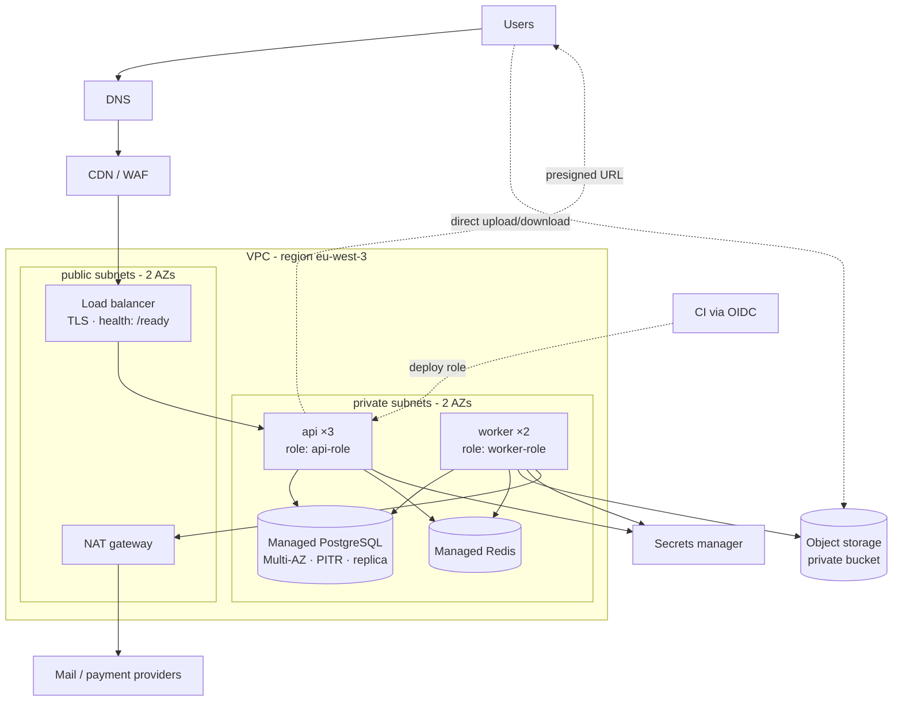

# Module 5.13 — أساسيات السحابة
## Cloud Fundamentals: what "the cloud" really is, service models, regions & zones, the building blocks your system maps onto, networking & IAM, managed data services, object storage, cost as a metric, and choosing a platform for Project 6

> **المستوى:** Level 5 | **الموقع:** [13 من 13]
> **السابق:** [M5.12 — CI/CD](module-5.12-ci-cd.md) | **التالي:** [Project 5 — Authenticated App](../projects/project-5-auth-app/README.md) → [Project 6 — Production Backend](../projects/project-6-production-backend/README.md) → [Checkpoint 5](checkpoint-5.md)

---

## 1. المتطلبات
> **قبل أن تتعلم هذا، يجب أن تفهم:**
- [ ] IP/ports/DNS/TLS/load balancer، الشبكات الخاصة كفكرة — [L2-M2.8](../level-2-computer-systems/module-2.8-networking-from-zero.md) … [L2-M2.11](../level-2-computer-systems/module-2.11-tls.md)
- [ ] تشريح النظام الإنتاجي، pool، readiness، الإيقاف الرشيق — [M5.7](module-5.7-production-anatomy.md)
- [ ] النشر، systemd، artifact، الهجرات — [M5.10](module-5.10-deployment.md); الحاويات وCompose — [M5.11](module-5.11-docker-containers.md); CI/CD وOIDC — [M5.12](module-5.12-ci-cd.md)
- [ ] الأسرار، أقل صلاحية، الرفع الآمن للملفات، SSRF — [M5.4](module-5.4-security.md)
- [ ] الكاش والطوابير كخدمات مساندة — [M5.8](module-5.8-caching.md), [M5.9](module-5.9-queues-jobs-workers.md)

## 2. أهداف التعلّم
- تعريف السحابة بلا تسويق: **حواسيب وشبكات وتخزين لدى طرف ثالث تُستأجر بالدقيقة عبر API**، ونماذج الخدمة (IaaS / PaaS / FaaS / Managed services) ومعنى **نموذج المسؤولية المشتركة**.
- رسم **خريطة نظامك على لبنات السحابة**: API/worker → compute؛ PostgreSQL → خدمة مُدارة بنسخ احتياطي وPITR وreplica؛ Redis → مُدار؛ الرفوعات → object storage بروابط موقّعة؛ LB + TLS + DNS + CDN؛ VPC بشبكات عامة/خاصة وsecurity groups؛ IAM؛ secrets manager؛ logs/metrics.
- تطبيق **IAM بأقل صلاحية**: أدوار لا مفاتيح، سياسات بلا `*`، OIDC من CI، فصل الحسابات/المشاريع بين البيئات، وفحص السياسات آليًا.
- معاملة **التكلفة كمقياس معماري**: نموذج تقديري قبل الاختيار، ميزانيات وتنبيهات، أكبر مفاجآت الفاتورة (نقل البيانات، NAT، السجلات، الموارد المنسية).
- اختيار **منصّة لـ Project 6** بـ ACTRR بين: VM واحدة (M5.10)، PaaS للحاويات (Fly/Render/Railway/Cloud Run/App Runner)، وKubernetes — وفهم ما يكفي من Kubernetes لقراءة Deployment وربطه بـ M5.7، وIaC كفكرة.

---

## 3. شرح للمبتدئ

### ما السحابة؟
في M5.10 استأجرت VPS واحدًا. السحابة هي ذلك **مع API لكل شيء**: أنشئ 10 خوادم بسطر، قاعدة بيانات بنسخ احتياطي تلقائي بسطر، موازن حمل بشهادة TLS بسطر، واحذفها كلها عند انتهاء الاختبار وادفع للدقائق. القيمة الحقيقية ليست "رخيص" (غالبًا ليس كذلك) بل: **مرونة** (توسّع/تقلّص)، **خدمات مُدارة** (DB بنسخ احتياطي وترقيع وفشل تلقائي يديرها غيرك)، و**أتمتة** (البنية كشيفرة). الثمن: تعقيد، فاتورة متغيّرة، وارتباط بمزوّد.

### نماذج الخدمة — من تدير ماذا؟
- **IaaS** (VMs، شبكات، أقراص: EC2/Compute Engine/Droplets): أنت تدير النظام والتطبيق وكل ما في M5.10.
- **Containers-as-a-Service / PaaS** (Cloud Run، App Runner، Fly.io، Render، Heroku، ECS Fargate): تعطي صورة (M5.11) + تهيئة؛ المنصّة تدير الخوادم والتوسّع والـ LB وTLS وSIGTERM وprobes. أفضل نقطة بداية لمعظم الفرق.
- **FaaS / Serverless** (Lambda، Cloud Functions): دوال تُشغَّل عند حدث وتُحاسَب بالملّي ثانية؛ ممتازة للأحداث المتقطّعة (webhook، معالجة ملف)، ولها قيود (cold start، مهلة، لا اتصالات DB دائمة بلا pooler، صعوبة التشخيص المحلي).
- **Managed services** (RDS/Cloud SQL، ElastiCache/Memorystore، SQS/Pub/Sub، S3/GCS): القاعدة الذهبية للفريق الصغير: **لا تدر بنفسك ما يمكن إدارته لك** — DB بالذات: النسخ الاحتياطي المُختبَر، PITR، الترقيع، الـ failover، المراقبة — كلها عمل متخصّص.
- **نموذج المسؤولية المشتركة**: المزوّد مسؤول عن **أمن السحابة** (المراكز، الأجهزة، المحاكاة)؛ أنت مسؤول عن **الأمن في السحابة**: IAM، التهيئة، الشبكة، التشفير، التطبيق (M5.4). معظم الاختراقات السحابية هي **سوء تهيئة** (bucket عام، security group مفتوح، مفتاح مسرّب) لا ثغرات في المزوّد.

### الجغرافيا: Regions وAvailability Zones
**Region** = موقع جغرافي (مثلًا Paris، Frankfurt، Bahrain)؛ اختر الأقرب لمستخدميك (كمون L2-M2.8) ومتطلبات البيانات (قوانين الإقامة). **AZ** = مركز بيانات مستقل (طاقة، شبكة) داخل الـ region بكمون ملّي ثانية بينها. **Multi-AZ** = نسخة احتياطية حيّة من DB في AZ أخرى مع failover تلقائي — هذا ما تشتريه من الخدمة المُدارة. Multi-region للكوارث الكبرى والكمون العالمي — معقّد ومكلف؛ L7.

### خريطة نظامك على السحابة
```
Internet → DNS (Route 53/Cloud DNS) → CDN/WAF (اختياري) → Load Balancer (TLS termination, health checks → /ready)
  → [public subnet]  LB فقط
  → [private subnet] api ×N (containers/VMs)  worker ×M      ← لا IP عام؛ الخروج عبر NAT gateway (مكلف! انتبه)
  → [private subnet] Managed PostgreSQL (Multi-AZ, backups, PITR, read replica)   Managed Redis
  → Object storage (S3/GCS): الرفوعات، التصديرات، النسخ الاحتياطية — عبر presigned URLs لا عبر خادمك
  → Secrets manager (DATABASE_URL, SESSION_SECRET…) تُحقن وقت التشغيل      → Logs/Metrics/Traces (M6.6)
  → IAM: أدوار للـ api/worker/CI بأقل صلاحية؛ لا مفاتيح طويلة العمر
```
كل سهم يقابل درسًا سابقًا: LB health check = `/ready` (M5.7)، SIGTERM من المنصّة = الإيقاف الرشيق، security group = جدار ناري بالمنافذ (M5.10)، Redis مُدار = نفس قواعد M5.8، SQS = نفس lease/DLQ من M5.9.

### الشبكة: VPC، subnets، security groups
**VPC** شبكتك الخاصة الافتراضية بنطاق IP خاص. **Public subnet** له طريق إلى الإنترنت (يستضيف LB/NAT فقط). **Private subnet** بلا IP عام (التطبيق وDB؛ الخروج للإنترنت عبر **NAT gateway** — وهو بند فاتورة شهير: رسوم ساعية + لكل GB). **Security group** = جدار ناري حالي (stateful) على مستوى المورد: "DB تقبل 5432 من security group الخاص بالـ api فقط" — لا من `0.0.0.0/0` أبدًا. **DB بلا IP عام** قاعدة لا استثناء؛ الوصول الإداري عبر bastion/SSM/VPN.

### IAM: الهوية هي المحيط الجديد
في السحابة كل شيء API، فالسؤال الدائم "**من** يستطيع استدعاء **ماذا** على **أي مورد**". المبادئ: (1) **أدوار (roles) لا مفاتيح**: الحاوية/الـ VM تحصل على هوية مؤقتة من المنصّة (instance profile/workload identity)؛ CI عبر OIDC (M5.12)؛ لا `AWS_ACCESS_KEY_ID` في `.env`؛ (2) **أقل صلاحية**: سياسة لكل خدمة بالأفعال والموارد المحدّدة (`s3:PutObject` على `arn:…:bucket/uploads/*`) — لا `"Action": "*"` ولا `"Resource": "*"`؛ (3) **فصل البيئات** بحسابات/مشاريع منفصلة (staging لا يستطيع لمس prod حتى بخطأ)؛ (4) **MFA** للبشر وحسابات root مقفولة؛ (5) **سجل التدقيق** (CloudTrail/Audit Logs) مفعّل دائمًا؛ (6) فحص السياسات آليًا في CI (§7).

### الخدمات المُدارة للبيانات
**PostgreSQL مُدار**: اختر الإصدار الرئيسي نفسه كـ CI/Compose (M5.11)؛ Multi-AZ للإنتاج؛ نسخ احتياطي يومي + **PITR** (استعادة لأي لحظة خلال N يومًا) — و**اختبر الاستعادة** دوريًا (نسخة لم تُستعد يومًا ليست نسخة)؛ `max_connections` حسب الحجم → pool الحساب (M5.7) + pooler (RDS Proxy/PgBouncer) خصوصًا مع serverless؛ read replica للتقارير الثقيلة (مع فهم تأخّر النسخ، L7-M7.3)؛ التشفير أثناء السكون والنقل (TLS إلى DB إلزامي: `sslmode=verify-full`). **Redis مُدار**: نفس M5.8 + سياسة الطرد؛ لا تضعه في مسار الحرج.

### Object storage والروابط الموقّعة
الملفات (رفوعات المستخدمين، تصديرات، نسخ احتياطية) لا تعيش على قرص الخادم (النسخ متعدّدة وقابلة للتخلّص) بل في **object storage** (S3/GCS/R2): رخيص، دائم (11 تسعات)، بلا حدّ. النمط الصحيح للرفع: الخادم **يتحقق** (نوع، حجم، صلاحية — M5.4) ثم يُصدر **presigned URL** صالحًا دقائق لمفتاح يختاره هو (`tenant/42/uploads/<uuid>`)، والمتصفح يرفع **مباشرة** إلى التخزين؛ ثم إشعار/وظيفة (M5.9) تفحص الملف (magic bytes، فيروسات) وتسجّله. التنزيل كذلك برابط موقّع قصير العمر؛ الـ bucket **خاص** دائمًا (Block Public Access)، التشفير مفعّل، versioning لما يهم، وسياسات دورة حياة (حذف المؤقّت بعد 7 أيام، أرشفة القديم) — وهذه أيضًا بند تكلفة.

### التكلفة كمقياس معماري
الفاتورة تقول الحقيقة عن معماريتك. قبل الاختيار: **نموذج تقديري** (compute × ساعات، DB، التخزين، **نقل البيانات الخارج** (egress)، NAT، السجلات بالـ GB، الطلبات) لسيناريوهين (اليوم، ×10). ثم: **ميزانية وتنبيه** عند 50/80/100% منذ اليوم الأول؛ وسوم (tags) للموارد بالبيئة والخدمة لتعرف من يصرف؛ تنظيف المنسي (أقراص غير مربوطة، IPs ثابتة غير مستخدمة، بيئات اختبار) آليًا؛ وحجم صحيح (right-sizing) بعد قياس الاستخدام (M6.6). المفاجآت الكلاسيكية: NAT gateway لحركة إلى S3 (استخدم VPC endpoint)، سجلات debug بالـ TB، egress عبر المناطق، وread replica بلا قرّاء.

### Kubernetes — وعي مفاهيمي يكفي الآن
حين تملك عشرات الخدمات وفريق منصّة، Kubernetes يوحّد: **Pod** (حاوية/حاويات تعمل معًا)، **Deployment** (N نسخة من Pod مع rolling update وrollback)، **Service** (IP/DNS ثابت أمام الـ pods)، **Ingress** (LB/TLS/التوجيه)، **ConfigMap/Secret** (التهيئة)، **HPA** (توسّع تلقائي على المقاييس)، probes (liveness/readiness/startup = M5.7 حرفيًا)، `terminationGracePeriodSeconds` (= stop_grace_period)، `resources.requests/limits` (= حدود الحاوية). كل مفهوم فيه تعلّمته بالفعل بشكل أبسط. لا تبدأ به لفريق صغير: ثمنه التشغيلي عالٍ، وPaaS يعطيك 90% من فوائده.

### البنية كشيفرة (IaC)
النقر في لوحة المزوّد لا يُراجع ولا يُكرَّر ولا يُستعاد. **Terraform/OpenTofu/Pulumi** تصف الموارد في ملفات تُراجع في PR وتُطبَّق من CI؛ `plan` يُظهر الفرق قبل التطبيق. ابدأ بها من اليوم الأول للموارد الدائمة (VPC، DB، buckets، IAM) ولو كانت بسيطة؛ الـ drift (فرق بين الكود والواقع) يُكتشف لا يُفاجئك.

### الارتباط بالمزوّد (lock-in)
كل خدمة مُدارة ترفع الإنتاجية وتزيد الارتباط. القرار الواعي: ارتبط حيث القيمة عالية والبديل مؤلم (DB مُدارة، object storage — واجهاتهما شبه قياسية: PostgreSQL وS3 API)، واحذر حيث الارتباط عميق في الكود (خدمات ملكية للطوابير/الدوال). الـ Ports & Adapters (M4.11، M5.8 `KV`) هي تأمينك: المنطق لا يعرف المزوّد.

---

## 4. النموذج الذهني

```
   السحابة = موارد عبر API بالدقيقة. القيمة: مرونة + خدمات مُدارة + أتمتة. الثمن: تعقيد + فاتورة + ارتباط.
   أنت مسؤول عن الأمن *في* السحابة: IAM (أدوار، أقل صلاحية، بلا *)، الشبكة (DB خاصة، SG بالمصدر)، التهيئة (bucket خاص)، التشفير.
   خريطتك: LB(/ready) → api/worker (private) → Managed PG (Multi-AZ, PITR مُختبَر) + Redis → S3 (presigned) ; secrets manager ; logs.
   لا تدر ما يمكن إدارته لك. ابدأ بـ PaaS للحاويات؛ Kubernetes حين يحتاجه الحجم والفريق. IaC منذ اليوم الأول.
   التكلفة مقياس: نموذج قبل الاختيار، ميزانية وتنبيه، وسوم، نظّف المنسي؛ احذر egress وNAT والسجلات.
```

---

## 5. الرسم التوضيحي



```
   مقارنة سريعة لـ Project 6 (فريق 1–3، آلاف المستخدمين):
                  VM واحدة (M5.10)   PaaS حاويات (Cloud Run/Fly/Render)   Kubernetes مُدار
   وقت للإنتاج     ساعات              ساعة                                 أيام–أسابيع
   تشغيل شهري      أنت كل شيء          المنصّة: LB/TLS/توسّع/SIGTERM          فريق منصّة
   توسّع            رأسي يدوي           أفقي تلقائي                           أفقي تلقائي + تحكّم كامل
   تكلفة البداية   ~5–20$              ~0–30$ (حسب الاستخدام)                 ~70$+ للعقدة قبل أي حمل
   متى             تعلّم/داخلي          الافتراضي                             >10 خدمات أو متطلبات خاصة
```

---

## 6. مثال بسيط

```typescript
// src/iam-lint.ts — سياسة IAM (بصيغة AWS كمثال) تُفحص آليًا: لا *، لا Resource واسع لأفعال كتابة، لا أفعال إدارة في دور تطبيق
export type Statement = { Effect: "Allow" | "Deny"; Action: string | string[]; Resource: string | string[]; Condition?: Record<string, unknown> };
export type Policy = { Version: string; Statement: Statement[] };
export type Finding = { severity: "high" | "medium"; statement: number; message: string };
const ADMIN = [/^iam:/, /^organizations:/, /^sts:AssumeRole$/, /:Delete(Bucket|DBInstance|Cluster)$/, /^ec2:(Run|Terminate)Instances$/];
export function lintPolicy(p: Policy, opts: { role: "app" | "ci" | "admin" } = { role: "app" }): Finding[] {
  const out: Finding[] = []; const arr = (x: string | string[]) => (Array.isArray(x) ? x : [x]);
  p.Statement.forEach((s, i) => {
    if (s.Effect !== "Allow") return;
    const actions = arr(s.Action); const resources = arr(s.Resource);
    for (const a of actions) {
      if (a === "*") out.push({ severity: "high", statement: i, message: `Action "*" grants everything` });
      else if (/^[a-z0-9-]+:\*$/.test(a)) out.push({ severity: "high", statement: i, message: `Action "${a}" grants a whole service` });
      if (opts.role !== "admin" && ADMIN.some(r => r.test(a))) out.push({ severity: "high", statement: i, message: `admin-level action "${a}" in a ${opts.role} role` });
    }
    const writes = actions.filter(a => /:(Put|Create|Delete|Update|Write|Send|Publish|Invoke)/.test(a) || a.endsWith("*"));
    if (resources.includes("*") && writes.length && !s.Condition) out.push({ severity: "high", statement: i, message: `Resource "*" with write actions [${writes.join(", ")}] and no Condition` });
    if (resources.includes("*") && !writes.length) out.push({ severity: "medium", statement: i, message: `Resource "*" for read actions — scope to specific ARNs where possible` });
    if (resources.some(r => /:s3:::[^/]+\/?\*?$/.test(r) && !/\/[^*][^/]*\/\*$/.test(r)) && actions.some(a => a.startsWith("s3:"))) out.push({ severity: "medium", statement: i, message: `S3 access to an entire bucket — scope to a prefix like bucket/uploads/*` });
  });
  return out;
}
```

```json
{ "// policy/api-role.json — دور خدمة api: رفع إلى بادئة واحدة، قراءة سرّين، لا شيء آخر": "",
  "Version": "2012-10-17",
  "Statement": [
    { "Effect": "Allow", "Action": ["s3:PutObject", "s3:GetObject"], "Resource": "arn:aws:s3:::store-prod-files/uploads/*" },
    { "Effect": "Allow", "Action": ["secretsmanager:GetSecretValue"], "Resource": ["arn:aws:secretsmanager:eu-west-3:123456789012:secret:store/prod/db-*", "arn:aws:secretsmanager:eu-west-3:123456789012:secret:store/prod/session-*"] },
    { "Effect": "Allow", "Action": ["sqs:SendMessage"], "Resource": "arn:aws:sqs:eu-west-3:123456789012:store-prod-jobs" }
  ]
}
```

---

## 7. مثال كود

```typescript
// src/cost-model.ts — نموذج تكلفة تقديري (أرقام افتراضية للتوضيح — استبدلها بأسعار منطقتك): التكلفة قبل الاختيار، وبسيناريو ×10
export type Usage = { apiInstances: number; apiVcpu: number; apiGb: number; workerInstances: number; dbClass: "small" | "medium" | "large"; multiAz: boolean; redisGb: number; storageGb: number; egressGb: number; natGb: number; logsGb: number; requestsM: number };
export type Prices = { vcpuHour: number; gbHour: number; db: Record<Usage["dbClass"], number>; redisGbMonth: number; storageGbMonth: number; egressGb: number; natGb: number; natHour: number; logsGb: number; lbHour: number; requestsPerM: number };
export const SAMPLE_PRICES: Prices = { vcpuHour: 0.04, gbHour: 0.0045, db: { small: 30, medium: 120, large: 480 }, redisGbMonth: 15, storageGbMonth: 0.023, egressGb: 0.09, natGb: 0.045, natHour: 0.045, logsGb: 0.5, lbHour: 0.025, requestsPerM: 0.4 };
const H = 730;                                                                                     // ساعات الشهر
export function monthly(u: Usage, p: Prices = SAMPLE_PRICES) {
  const lines: Record<string, number> = {
    compute: (u.apiInstances + u.workerInstances) * (u.apiVcpu * p.vcpuHour + u.apiGb * p.gbHour) * H,
    database: p.db[u.dbClass] * (u.multiAz ? 2 : 1),
    redis: u.redisGb * p.redisGbMonth,
    storage: u.storageGb * p.storageGbMonth,
    egress: u.egressGb * p.egressGb,
    nat: u.natGb * p.natGb + p.natHour * H,
    logs: u.logsGb * p.logsGb,
    loadBalancer: p.lbHour * H + (u.requestsM * p.requestsPerM),
  };
  const total = Object.values(lines).reduce((a, b) => a + b, 0);
  const sorted = Object.entries(lines).sort((a, b) => b[1] - a[1]).map(([k, v]) => ({ item: k, usd: Math.round(v), pct: Math.round((100 * v) / total) }));
  return { total: Math.round(total), breakdown: sorted };
}
export function scale(u: Usage, factor: number): Usage {                                            // ×10 مستخدمين: ما الذي يتوسّع خطيًا وما الذي يقفز درجة؟
  return { ...u, apiInstances: Math.ceil(u.apiInstances * factor * 0.7), workerInstances: Math.ceil(u.workerInstances * factor * 0.5), dbClass: factor >= 10 ? (u.dbClass === "small" ? "medium" : "large") : u.dbClass, storageGb: u.storageGb * factor, egressGb: u.egressGb * factor, natGb: u.natGb * factor, logsGb: u.logsGb * factor, requestsM: u.requestsM * factor };
}
export const PROJECT6_TODAY: Usage = { apiInstances: 2, apiVcpu: 1, apiGb: 1, workerInstances: 1, dbClass: "small", multiAz: true, redisGb: 1, storageGb: 50, egressGb: 100, natGb: 200, logsGb: 20, requestsM: 5 };
```

```typescript
// src/cloud.test.ts — فحص السياسات + نموذج التكلفة يكشفان ما تخفيه اللوحة
import { test } from "node:test"; import assert from "node:assert/strict";
import { lintPolicy, type Policy } from "./iam-lint.js"; import { monthly, scale, PROJECT6_TODAY } from "./cost-model.js";

test("least-privilege api policy passes; the 'just make it work' policy fails loudly", () => {
  const good: Policy = { Version: "2012-10-17", Statement: [
    { Effect: "Allow", Action: ["s3:PutObject", "s3:GetObject"], Resource: "arn:aws:s3:::store-prod-files/uploads/*" },
    { Effect: "Allow", Action: ["secretsmanager:GetSecretValue"], Resource: "arn:aws:secretsmanager:eu-west-3:123456789012:secret:store/prod/db-*" } ] };
  assert.deepEqual(lintPolicy(good), []);
  const bad: Policy = { Version: "2012-10-17", Statement: [
    { Effect: "Allow", Action: "*", Resource: "*" },
    { Effect: "Allow", Action: "s3:*", Resource: "arn:aws:s3:::store-prod-files/*" },
    { Effect: "Allow", Action: ["iam:PassRole", "sqs:SendMessage"], Resource: "*" } ] };
  const f = lintPolicy(bad); const msgs = f.map(x => x.message).join("\n");
  assert.ok(f.filter(x => x.severity === "high").length >= 4); assert.match(msgs, /Action "\*" grants everything/); assert.match(msgs, /whole service/); assert.match(msgs, /admin-level action "iam:PassRole"/); assert.match(msgs, /Resource "\*" with write actions \[sqs:SendMessage\]/); assert.match(msgs, /entire bucket/);
  assert.equal(lintPolicy(bad, { role: "admin" }).some(x => /admin-level/.test(x.message)), false);
});
test("read-only Resource * is only a medium finding; Condition softens write wildcards", () => {
  const f = lintPolicy({ Version: "2012-10-17", Statement: [{ Effect: "Allow", Action: ["s3:ListAllMyBuckets"], Resource: "*" }, { Effect: "Allow", Action: ["sqs:SendMessage"], Resource: "*", Condition: { StringEquals: { "aws:ResourceTag/env": "prod" } } }] });
  assert.deepEqual(f.map(x => x.severity), ["medium"]);
});
test("cost model: today's bill, where it goes, and what explodes at ×10", () => {
  const today = monthly(PROJECT6_TODAY); assert.ok(today.total > 100 && today.total < 400, `today ${today.total}`);
  assert.equal(today.breakdown[0]!.item, "compute");                                                  // اليوم: الحوسبة والـ DB يهيمنان
  const x10 = monthly(scale(PROJECT6_TODAY, 10)); assert.ok(x10.total > today.total * 3);
  const natShare = x10.breakdown.find(b => b.item === "nat")!.pct + x10.breakdown.find(b => b.item === "egress")!.pct;
  assert.ok(natShare >= 15, `nat+egress ${natShare}%`);                                                // ×10: نقل البيانات وNAT يصبحان بندًا رئيسيًا → VPC endpoint لـ S3، ضغط، CDN
  assert.ok(x10.breakdown.find(b => b.item === "database")!.usd >= 240);                               // DB تقفز درجة (medium × Multi-AZ)
});
```

```bash
node --import tsx --test src/cloud.test.ts    # 3 pass
```

```hcl
# infra/main.tf — طعم IaC (Terraform/OpenTofu): الموارد الدائمة كشيفرة تُراجع وتُطبَّق من CI (plan في PR، apply بعد الدمج)
resource "aws_s3_bucket" "files" {
  bucket = "store-${var.env}-files"
  tags   = { env = var.env, service = "store" }                       # الوسوم = من يصرف ماذا
}
resource "aws_s3_bucket_public_access_block" "files" {              # خاص دائمًا
  bucket = aws_s3_bucket.files.id
  block_public_acls = true  block_public_policy = true  ignore_public_acls = true  restrict_public_buckets = true
}
resource "aws_s3_bucket_lifecycle_configuration" "files" {
  bucket = aws_s3_bucket.files.id
  rule { id = "tmp" status = "Enabled" filter { prefix = "tmp/" } expiration { days = 7 } }
}
resource "aws_db_instance" "main" {
  identifier = "store-${var.env}"  engine = "postgres"  engine_version = "16.4"  instance_class = var.db_class
  multi_az = var.env == "prod"  backup_retention_period = 14  deletion_protection = var.env == "prod"
  publicly_accessible = false  storage_encrypted = true  vpc_security_group_ids = [aws_security_group.db.id]
  performance_insights_enabled = true
}
resource "aws_security_group_rule" "db_from_api" {                  # DB تقبل 5432 من security group الخاص بـ api فقط
  type = "ingress"  from_port = 5432  to_port = 5432  protocol = "tcp"
  security_group_id = aws_security_group.db.id  source_security_group_id = aws_security_group.api.id
}
resource "aws_budgets_budget" "monthly" {
  name = "store-${var.env}"  budget_type = "COST"  limit_amount = var.budget_usd  limit_unit = "USD"  time_unit = "MONTHLY"
  notification { comparison_operator = "GREATER_THAN" threshold = 80 threshold_type = "PERCENTAGE" notification_type = "FORECASTED" subscriber_email_addresses = [var.alert_email] }
}
```

```yaml
# k8s/api-deployment.yaml — للقراءة فقط الآن: كل حقل تعرفه من M5.7/M5.11 باسم آخر
apiVersion: apps/v1
kind: Deployment
metadata: { name: api }
spec:
  replicas: 3
  strategy: { type: RollingUpdate, rollingUpdate: { maxUnavailable: 0, maxSurge: 1 } }   # M5.10 rolling
  template:
    spec:
      terminationGracePeriodSeconds: 30                       # = stop_grace_period
      containers:
        - name: api
          image: ghcr.io/org/store-api@sha256:…               # digest (M5.12)
          ports: [{ containerPort: 8080 }]
          envFrom: [{ secretRef: { name: api-secrets } }]     # = secrets manager → env
          resources: { requests: { cpu: 250m, memory: 256Mi }, limits: { memory: 512Mi } }   # = حدود الحاوية
          readinessProbe: { httpGet: { path: /ready,  port: 8080 }, periodSeconds: 5 }        # = /ready
          livenessProbe:  { httpGet: { path: /health, port: 8080 }, periodSeconds: 10 }       # = /health
          lifecycle: { preStop: { exec: { command: ["sleep", "3"] } } }                        # = مهلة سحب الحركة قبل SIGTERM
```

---

## 8. مثال من العالم الحقيقي
شركة ناشئة نقلت Project-6-مثلها من VPS إلى السحابة "لتكون جاهزة للنمو". بعد شهر: فاتورة 1,900$ لحركة متواضعة. التشريح: NAT gateway يمرّر كل حركة الـ worker إلى S3 (1.2 TB) بدل VPC endpoint؛ سجلات بمستوى debug (3 TB شهريًا) في خدمة السجلات المُدارة؛ DB بحجم `large` Multi-AZ بينما الاستخدام 4% CPU؛ ثلاث بيئات اختبار منسية؛ وread replica بلا قارئ واحد. بعد §3 "التكلفة كمقياس": 310$ — بلا أي تغيير في الكود. والدرس: نموذج التكلفة **قبل** الهجرة، ميزانية وتنبيه **من اليوم الأول**، ومراجعة فاتورة شهرية كطقس هندسي.

## 9. مثال من الإنتاج
منصّة تخزّن مستندات العملاء في bucket؛ لتسهيل التنزيلات جعل مطوّر الـ bucket "public-read" مؤقتًا، ثم نسي. محرّكات فهرسة الـ buckets العامة وجدته خلال أيام؛ تسريب. التحقيق يُظهر أيضًا أن دور الـ api كان `s3:*` على كل الـ buckets، وأن DB لها IP عام "للوصول من المنزل" بكلمة مرور قوية. الإصلاح: Block Public Access على مستوى الحساب (لا يمكن تجاوزه بخطأ)، presigned URLs بعمر 5 دقائق، دور بأقل صلاحية وفحصه في CI (§6)، DB خاصة مع وصول عبر SSM/bastion، فحص تهيئة مستمرّ (CSPM/`prowler`)، وIaC حتى لا يوجد "تغيير يدوي مؤقّت". نموذج المسؤولية المشتركة في جملة: المزوّد لم يُخترق؛ التهيئة هي التي فعلت.

---

## 10. مفاهيم خاطئة شائعة
1. **"السحابة أرخص."** قد تكون أغلى لحمل ثابت؛ قيمتها المرونة والخدمات المُدارة والأتمتة — قِس.
2. **"المزوّد مسؤول عن الأمن."** عن أمن السحابة؛ أنت عن الأمن فيها: IAM والشبكة والتهيئة.
3. **"Kubernetes = احتراف."** أداة لمشكلة حجم وتعقيد معيّنة؛ لفريق صغير هو عبء يؤخّر المنتج.
4. **"Serverless يلغي العمليات."** يغيّرها: cold starts، حدود، اتصالات DB، تتبّع، وفاتورة بالطلب قد تفاجئ تحت الحمل.
5. **"النسخ الاحتياطي التلقائي يكفي."** نسخة لم تُختبر استعادتها افتراضٌ؛ جدولة اختبار استعادة.
6. **"مفتاح API في الحاوية مقبول إن كان في secret."** الأدوار المؤقتة تلغي المفتاح أصلًا؛ المفتاح طويل العمر خطر مؤجّل.

## 11. أخطاء شائعة
1. DB أو Redis بـ IP عام؛ security group `0.0.0.0/0` على 5432/6379/22.
2. سياسات IAM بـ `*`؛ مفاتيح طويلة العمر في CI/.env؛ حساب واحد لكل البيئات.
3. bucket عام أو بلا Block Public Access؛ الملفات على قرص الخادم؛ روابط موقّعة بعمر أيام.
4. بلا ميزانية/تنبيه؛ بلا وسوم؛ NAT لحركة S3؛ سجلات debug في الإنتاج.
5. DB بلا Multi-AZ في الإنتاج، أو Multi-AZ في staging (مكلف بلا داعٍ)؛ عدم اختبار PITR.
6. نقر يدوي في اللوحة بلا IaC → drift وتغييرات "مؤقتة" دائمة.
7. اختيار Kubernetes أو microservices (L7-M7.9) قبل أن يفرضه الحجم.
8. تجاهل الـ region: مستخدمون في شمال أفريقيا وخوادم في us-east-1 (+150 ms لكل طلب، L2-M2.8).

## 12. تمرين تصحيح
بعد الانتقال إلى PaaS للحاويات مع PostgreSQL مُدار، تظهر أخطاء `too many connections` متقطّعة رغم أن pool لكل نسخة = 10.
1. **دليل:** لوحة DB تُظهر 95/100 اتصالًا في الذروة؛ المنصّة توسّع الـ api تلقائيًا إلى 8 نسخ + worker ×2 + CI للهجرات + لوحة إدارة؛ 8×10 + 2×10 + … > 100 (M5.7 الحساب).
2. **فرضية:** التوسّع الأفقي التلقائي ضرب حدّ الاتصالات؛ كل نسخة جديدة تجلب pool كاملًا.
3. **تجربة:** تثبيت الحدّ الأقصى للنسخ على 4 مؤقتًا → الأخطاء تختفي؛ رفعه → تعود.
4. **الإصلاح:** **pooler** أمام DB (RDS Proxy/PgBouncer في transaction mode) فيصبح حدّ DB مستقلًا عن عدد النسخ؛ pool لكل نسخة 5 مع `connectionTimeoutMillis`؛ حدّ أعلى للتوسّع محسوب؛ مقياس اتصالات DB بتنبيه عند 70%؛ وتوثيق المعادلة في runbook.
5. **أين أيضًا؟** أي مورد ذو حدّ ثابت أمام توسّع أفقي: Redis maxclients، حدود معدّل المزوّدين الخارجيين (M5.9)، file descriptors في LB.

## 13. تمرين معماري
اكتب **قرار منصّة Project 6** كـ ADR (M6.3 لاحقًا، ابدأ الآن): (1) الخيارات الثلاثة (VM/PaaS/K8s) مقابل متطلباتك (فريق، حمل اليوم و×10، ميزانية، مهارات، متطلبات بيانات/إقامة)؛ (2) خريطة النظام على لبنات المزوّد المختار (الرسم في §5 مخصّصًا) مع region وAZs؛ (3) جدول IAM: الأدوار (api, worker, ci-deploy, admin-human) وأفعالها ومواردها، وفحصها بـ `lintPolicy`؛ (4) الشبكة: ما العام وما الخاص، security groups بالمصدر، كيف يصل المطوّر إلى DB؛ (5) البيانات: إصدار PG، Multi-AZ، نافذة PITR، جدول اختبار الاستعادة، pooler؛ (6) الملفات: bucket، بادئات لكل مستأجر (M5.3)، presigned URLs، دورة الحياة، فحص بعد الرفع (M5.9)؛ (7) نموذج التكلفة (§7) لليوم و×10 مع ميزانية وتنبيه؛ (8) IaC: ما يُدار بالشيفرة من اليوم الأول؛ (9) ACTRR صريح: الافتراضات (الحمل)، القيود (ميزانية/مهارات)، المقايضات (lock-in مقابل سرعة)، المخاطر (فاتورة، سوء تهيئة)، التوصية.

## 14. الصلة بعصر AI
AI يولّد Terraform وسياسات IAM وmanifests بسرعة — وغالبًا بـ `"Action": "*"` "للتبسيط"، وbuckets بلا public access block، وsecurity groups مفتوحة "للاختبار". خطر هذا أعلى من كود التطبيق لأن أثره **فوري وخارجي**. القواعد: كل IaC يمرّ بـ `plan` تقرؤه + فحص سياسات آلي (`lintPolicy`, tfsec/checkov) + مراجعة بشرية، ولا يملك الوكيل صلاحية `apply` على prod (L8-M8.10 human-in-the-loop). وهو ممتاز في: شرح فاتورة (الصق تقرير التكلفة واسأل "ما غير الطبيعي؟")، وترجمة Compose إلى manifests، وصياغة سياسات أقل صلاحية **من قائمة أفعال تعطيها أنت**.

## 15. ما يجب إتقانه (Must Master) 🔴
- 🔴 السحابة كموارد عبر API؛ نماذج الخدمة ومتى كل منها؛ المسؤولية المشتركة؛ region/AZ/Multi-AZ؛ خريطة النظام على اللبنات؛ شبكة عامة/خاصة، DB خاصة، security groups بالمصدر؛ IAM: أدوار لا مفاتيح، أقل صلاحية بلا `*`، فصل البيئات، OIDC؛ PostgreSQL مُدار: Multi-AZ، PITR مُختبَر، TLS، pooler؛ object storage خاص + presigned URLs + دورة حياة؛ التكلفة: نموذج، ميزانية، وسوم، egress/NAT/logs؛ "لا تدر ما يمكن إدارته لك"؛ PaaS كافتراضي.

## 16. ما يجب فهمه (Should Understand) 🟠
- 🟠 Kubernetes مفاهيميًا (Deployment/Service/Ingress/probes/limits/HPA)؛ IaC وplan/apply وdrift؛ serverless وحدوده؛ read replicas وتأخّرها؛ CDN/WAF؛ VPC endpoints؛ CSPM؛ lock-in وPorts & Adapters كتأمين.

## 17. ما يمكن تأجيله (Can Defer) ⚪
- ⚪ Multi-region وDR المتقدّم (L7)، service mesh، FinOps المتقدّم، تفاصيل شبكات السحابة (peering, transit)، تصميم landing zones متعدّدة الحسابات، Kubernetes operators.

## 18. الخلاصة
1. السحابة = حواسيب وشبكات وتخزين عبر API بالدقيقة؛ القيمة في المرونة والخدمات المُدارة والأتمتة، والثمن تعقيد وفاتورة وارتباط.
2. أنت مسؤول عن الأمن **في** السحابة: IAM بأقل صلاحية وأدوار مؤقتة، شبكة خاصة لـ DB، buckets خاصة، تشفير، سجل تدقيق — ومعظم الحوادث سوء تهيئة.
3. خريطتك: LB(/ready) → api/worker خاصة → PostgreSQL مُدار (Multi-AZ, PITR مُختبَر, pooler) + Redis → object storage بروابط موقّعة → secrets manager → logs.
4. التكلفة مقياس معماري: نموذج قبل الاختيار، ميزانية وتنبيه من اليوم الأول، وسوم، نظّف المنسي، احذر egress/NAT/السجلات.
5. ابدأ بـ PaaS للحاويات مع IaC؛ Kubernetes حين يفرضه الحجم والفريق؛ وكل مفهوم فيه تعلّمته بالفعل في M5.7–M5.12.

## 19. مراجع رسمية
- AWS — Shared Responsibility Model: https://aws.amazon.com/compliance/shared-responsibility-model/
- AWS — Well-Architected Framework (Security, Reliability, Cost pillars): https://docs.aws.amazon.com/wellarchitected/latest/framework/
- AWS IAM — Security best practices (least privilege, roles, MFA): https://docs.aws.amazon.com/IAM/latest/UserGuide/best-practices.html
- AWS — Regions and Availability Zones: https://docs.aws.amazon.com/AWSEC2/latest/UserGuide/using-regions-availability-zones.html
- Amazon S3 — Presigned URLs & Block Public Access: https://docs.aws.amazon.com/AmazonS3/latest/userguide/using-presigned-url.html
- Amazon RDS — Multi-AZ & Point-in-time recovery: https://docs.aws.amazon.com/AmazonRDS/latest/UserGuide/Concepts.MultiAZ.html
- Google Cloud — Cloud Run (containers-as-a-service): https://cloud.google.com/run/docs
- Kubernetes — Deployments & Pod lifecycle (probes, termination): https://kubernetes.io/docs/concepts/workloads/controllers/deployment/
- OpenTofu / Terraform — Introduction to IaC: https://opentofu.org/docs/intro/
- FinOps Foundation — FinOps principles: https://www.finops.org/framework/principles/

## المصطلحات
| العربية | English |
|---|---|
| الحوسبة السحابية | Cloud computing |
| البنية التحتية / المنصّة / الدوال كخدمة | IaaS / PaaS / FaaS |
| خدمة مُدارة | Managed service |
| نموذج المسؤولية المشتركة | Shared responsibility model |
| منطقة / منطقة توافر | Region / Availability Zone (AZ) |
| تعدّد مناطق التوافر | Multi-AZ |
| شبكة افتراضية خاصة | VPC (Virtual Private Cloud) |
| شبكة فرعية عامة / خاصة | Public / Private subnet |
| بوابة NAT | NAT gateway |
| مجموعة أمان | Security group |
| إدارة الهوية والوصول | IAM (Identity and Access Management) |
| دور / هوية مؤقتة | Role / Temporary credentials |
| تخزين الكائنات | Object storage |
| رابط موقّع مسبقًا | Presigned URL |
| الاستعادة لنقطة زمنية | Point-in-time recovery (PITR) |
| نسخة للقراءة | Read replica |
| مدير الأسرار | Secrets manager |
| نقل البيانات الخارج | Egress |
| البنية التحتية كشيفرة | Infrastructure as Code (IaC) |
| انحراف البنية | Drift |
| الارتباط بالمزوّد | Vendor lock-in |
| ضبط الحجم | Right-sizing |
