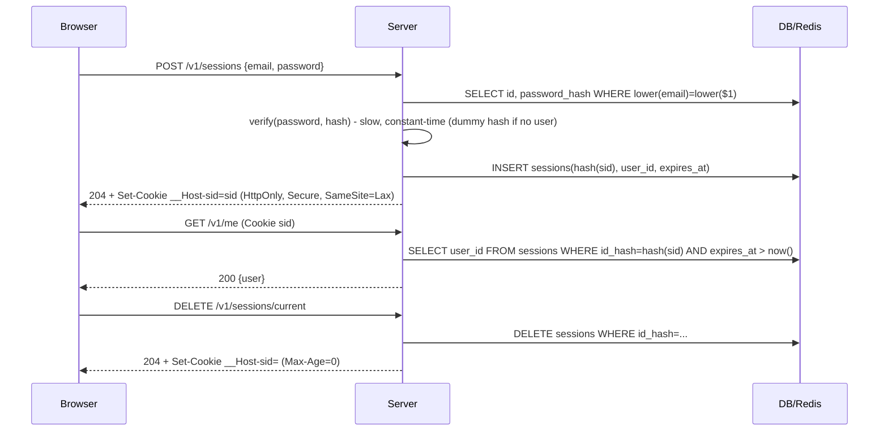

# Module 5.2 — المصادقة
## Authentication: identity, password hashing, sessions vs JWT, cookies, refresh & reset tokens, OAuth/OIDC, MFA, rate limiting

> **المستوى:** Level 5 | **الموقع:** [2 من 13]
> **السابق:** [M5.1 — API Design](module-5.1-api-design.md) | **التالي:** [M5.3 — Authorization](module-5.3-authorization.md)

---

## 1. المتطلبات
> **قبل أن تتعلم هذا، يجب أن تفهم:**
- [ ] HTTP: الرؤوس، الكوكيز، عديمية الحالة — [L2-M2.12](../level-2-computer-systems/module-2.12-http.md)
- [ ] TLS ولماذا بدونه كل شيء مكشوف — [L2-M2.11](../level-2-computer-systems/module-2.11-tls.md)
- [ ] Frontend غير موثوق / Backend موثوق / Trust Boundary، authN ≠ authZ (تعريف أولي) — [L0-M0.7](../level-0-absolute-foundations/module-07-database-api-web-app.md), [L2-M2.13](../level-2-computer-systems/module-2.13-web-app-architecture.md)
- [ ] الفهرس الفريد الجزئي، `lower(email)` — [L3-M3.13](../level-3-core-computer-science/module-3.13-indexes.md)
- [ ] Problem Details، 401 مع `WWW-Authenticate` — [M5.1](module-5.1-api-design.md)

## 2. أهداف التعلّم
- تعريف المصادقة: **إثبات هوية** عبر شيء تعرفه/تملكه/أنت — وفصلها الصارم عن التفويض (M5.3).
- تخزين كلمات المرور بشكل صحيح: **hash بطيء ومملّح** (argon2id / scrypt / bcrypt)، لا تشفير ولا SHA-256، مع معاملات تكلفة ومقارنة بزمن ثابت وإعادة تجزئة عند الترقية.
- تصميم **الجلسات** (opaque session id مخزّن بالخادم) مقابل **JWT** (حالة موقّعة لدى العميل): المقايضات الحقيقية (الإبطال، الحجم، التوزيع) وقرار "أيهما لتطبيقي".
- ضبط الكوكي: `HttpOnly`, `Secure`, `SameSite`, `Path`, `Max-Age`, بادئة `__Host-`؛ ولماذا `localStorage` للرموز خطأ شائع.
- تنفيذ **تسجيل/دخول/خروج/إعادة تعيين** بأمان: رسائل خطأ موحّدة، مقاومة التعداد والتوقيت، رموز لمرة واحدة مُجزّأة بانتهاء، تدوير الجلسة، **rate limiting** لكل IP وحساب.
- فهم OAuth 2.0 / OIDC ("تسجيل الدخول عبر Google") وMFA/Passkeys **كمفاهيم** ومتى تستعين بمزوّد هوية بدل البناء.

---

## 3. شرح للمبتدئ

### ما المصادقة؟
**Authentication (authN)**: "من أنت؟" — ربط الطلب بهوية بإثبات: شيء **تعرفه** (كلمة مرور)، **تملكه** (هاتف، مفتاح أمان، رمز بريد)، **أنت** (بصمة). **Authorization (authZ)**: "ماذا يحق لك؟" — M5.3. الخلط بينهما أصل ثغرات كثيرة: "المستخدم مسجّل الدخول" لا يعني "يحق له رؤية هذا الطلب". في هذه الوحدة نحلّ مشكلة واحدة: كيف يثبت الطلب رقم 1,000 أنه من نفس الشخص الذي أثبت هويته في الطلب رقم 1 — لأن HTTP **عديم الحالة** (L2-M2.12).

### كلمات المرور: لا تُخزَّن أبدًا — تُخزَّن بصمتها البطيئة
- **لماذا لا تشفير؟** التشفير قابل للعكس بمفتاح؛ من يسرق DB يسرق المفتاح غالبًا. لا نحتاج استرجاع كلمة المرور أبدًا — فقط التحقق منها.
- **لماذا لا SHA-256؟** سريع جدًا: GPU تحسب مليارات/ثانية، فقائمة بـ 10M كلمة شائعة تُكسر في ثوانٍ، وجداول قوس قزح (rainbow tables) تعكس الـ hash غير المملّح.
- **الحل:** دالة اشتقاق **بطيئة عمدًا ومُكلفة للذاكرة** مع **ملح** (salt) عشوائي فريد لكل مستخدم: **argon2id** (الفائز في مسابقة 2015، الموصى به)، **scrypt** (في `node:crypto`، جيد جدًا)، **bcrypt** (قديم لكن مقبول؛ حد 72 بايت). التكلفة تُضبط لتأخذ ~100–300ms على خادمك: المستخدم لا يلاحظ، والمهاجم يحتاج آلاف السنين. المخزّن: `alg$params$salt$hash` — المعاملات مع القيمة لتستطيع **رفع التكلفة لاحقًا** وإعادة التجزئة عند أول تسجيل دخول ناجح.
- **المقارنة بزمن ثابت** (`timingSafeEqual`) حتى لا يُسرّب زمن `===` كم بايتًا تطابق.
- **قواعد الكلمات:** طول ≥ 8 (NIST SP 800-63B: الطول أهم من "رمز خاص + رقم")، حد أعلى معقول (64–128، ضد DoS على الـ hash)، فحص ضد قوائم المسرّبة (Have I Been Pwned k-anonymity API)، **لا** تعقيد قسري ولا تدوير دوري بلا سبب (يُنتج كلمات أضعف). ونصيحة المنتج: ادعم مدير كلمات المرور (لا تمنع اللصق).

### الجلسات: المعرّف المُعتِم
بعد التحقق، الخادم يُنشئ **session id** عشوائيًا (≥ 128 بت من `randomBytes`)، يخزّن `hash(id) → {userId, createdAt, lastSeen, ip/ua}` في DB/Redis، ويرسل الـ id في كوكي. كل طلب: ابحث عن hash الكوكي → الهوية. نخزّن **hash** الـ id لا الـ id نفسه حتى لا يُسرق جدول الجلسات ويُستخدم مباشرة. مزايا: **الإبطال فوري** (احذف الصف: خروج من كل الأجهزة، تغيير كلمة المرور يُبطل الكل)، صغير، بسيط. كلفة: قراءة لكل طلب (مؤشّر فريد سريع، أو Redis — M5.8). **مهلتان**: خمول (idle: 30 دقيقة–14 يومًا) ومطلقة (absolute: 30–90 يومًا). و**تدوير** الـ id عند تسجيل الدخول ورفع الصلاحية (ضد session fixation).

### JWT: الحالة موقّعة لدى العميل
`header.payload.signature` بـ base64url؛ الخادم يوقّع الحمولة (`HS256` بمفتاح سري، أو `RS256/EdDSA` بمفتاح خاص والتحقق بالعام) فيستطيع أي خادم يملك المفتاح التحقق **دون قراءة DB**. مناسب: بين الخدمات، APIs عامة بعميل غير متصفح، مزوّد هوية يصدر رموزًا لخدمات كثيرة. مشكلاته الحقيقية: (1) **لا إبطال** قبل الانتهاء إلا بقائمة سوداء (= عدت للحالة في الخادم)، لذلك عمر الوصول قصير (5–15 دقيقة) + **refresh token** طويل مخزّن بالخادم وقابل للإبطال و**يُدوَّر** عند كل استخدام (اكتشاف إعادة الاستخدام = سرقة → أبطل العائلة كلها)؛ (2) الحمولة **مقروءة** لأي أحد (base64 ليس تشفيرًا) — لا أسرار فيها؛ (3) أخطاء مكتبات تاريخية: `alg: none`، خلط HS/RS، عدم التحقق من `exp/aud/iss` — استخدم مكتبة ناضجة (`jose`) وثبّت الخوارزمية. **القرار للويب الكلاسيكي بخادم واحد/قليل:** جلسة بكوكي. لا تبدأ بـ JWT لأنه "حديث".

### الكوكي: الأعلام الخمسة
`Set-Cookie: __Host-sid=…; Path=/; Secure; HttpOnly; SameSite=Lax; Max-Age=1209600`
- **HttpOnly**: JavaScript لا يقرأها → XSS لا يسرقها (لذلك الكوكي أفضل من `localStorage` حيث أي XSS = سرقة الرمز، M5.4).
- **Secure**: تُرسل عبر HTTPS فقط. **`__Host-`** بادئة تُلزم Secure + Path=/ + بلا Domain → لا يمكن لنطاق فرعي زرعها.
- **SameSite=Lax** (افتراضي جيد: تُرسل مع التنقل الأعلى GET فقط، لا مع POST من موقع آخر → يخفّف CSRF)؛ `Strict` أقوى لكن يكسر الوصول من روابط البريد؛ `None` يتطلّب Secure ويعيد مشكلة CSRF (M5.4 الرمز المضاد).
- **Max-Age/Expires** للاستمرار عبر إغلاق المتصفح؛ بدونها جلسة متصفح.
- تطبيق هاتف/SPA على نطاق آخر؟ `Authorization: Bearer <token>` في الرأس، والتخزين في Keychain/Keystore (هاتف) أو في الذاكرة + refresh بكوكي `HttpOnly` (SPA) — نمط BFF (Backend-for-Frontend) يعيد الكوكي حتى للـ SPA.

### تدفّقات تحتاج حذرًا
- **تسجيل دخول**: رسالة فشل واحدة "بريد أو كلمة مرور غير صحيحة" (لا "البريد غير موجود")؛ **احسب الـ hash حتى لو لم يوجد المستخدم** (hash وهمي) حتى لا يكشف الزمن وجود الحساب؛ `lower(email)` فريد (L3-M3.13).
- **التسجيل**: "إن كان البريد جديدًا ستصلك رسالة" — لا تؤكّد وجود الحساب؛ تحقّق من البريد برابط لمرة واحدة.
- **إعادة تعيين**: رمز عشوائي ≥ 128 بت، نخزّن **hash**ه مع انتهاء 15–60 دقيقة و**استخدام واحد**، نرسله في رابط؛ عند الاستخدام: أبطل كل الجلسات القديمة وأبطل الرمز؛ نفس الرسالة سواء وُجد البريد أم لا. (تحدّي L5 "reset token يُستخدم مرتين" = نسيان الاستخدام الواحد أو الحالة السباقية — M5.6.)
- **الخروج**: احذف الجلسة من الخادم **و**الكوكي (`Max-Age=0`)؛ "خروج من كل الأجهزة" = احذف كل جلسات المستخدم.
- **Rate limiting**: على `/login` و`/reset`: لكل IP (مثلًا 20/دقيقة) **و**لكل حساب (10/ساعة) **و**عالميًا (كشف credential stuffing)؛ 429 + `Retry-After`؛ قفل مؤقت متصاعد لا دائم (وإلا صار DoS على الضحية)؛ نافذة منزلقة في Redis (M5.8) أو ذاكرة لكل عملية (ضعيف مع N نسخ).

### OAuth 2.0 / OIDC / MFA / Passkeys — كمفاهيم
**OAuth 2.0** تفويض: "اسمح لتطبيق X بالوصول إلى تقويمي" — يُصدر access token لـ API طرف ثالث. **OIDC** طبقة هوية فوقه: "سجّل الدخول عبر Google" — يُصدر **ID token** (JWT) يصف المستخدم. التدفّق الصحيح للويب: **Authorization Code + PKCE** عبر إعادة توجيه (لا Implicit). ما تفعله أنت: تتحقق من ID token (التوقيع بمفاتيح JWKS، `iss`, `aud`, `exp`, `nonce`)، تربطه بحساب محلي، ثم **جلستك المعتادة**. **MFA**: TOTP (تطبيق مصادقة، RFC 6238)، أو مفاتيح WebAuthn؛ SMS أضعفها. **Passkeys** (WebAuthn): مفتاح عام/خاص لكل موقع، مقاوم للتصيّد، بلا كلمة مرور — مستقبل المصادقة. القرار الهندسي: لمنتج حقيقي، مزوّد هوية (Auth0/Cognito/Keycloak/ Clerk…) غالبًا أرخص وأأمن من بناء كل هذا — لكن افهمه كما هنا لتضبطه وتصحّحه.

---

## 4. النموذج الذهني

```
   دخول:  email+password ──▶ hash بطيء مملّح يُقارَن بزمن ثابت (حتى للحساب غير الموجود) ──▶ session id عشوائي ──▶ يُخزَّن hash(id) بالخادم ──▶ كوكي __Host-sid HttpOnly Secure SameSite=Lax
   كل طلب: كوكي ──▶ hash ──▶ صف الجلسة (idle/absolute) ──▶ identity ──▶ (M5.3 authZ)
   JWT = حالة موقّعة لدى العميل: بلا قراءة DB، لكن بلا إبطال → وصول قصير + refresh مدوَّر مخزَّن بالخادم
   كل مسار مصادقة: رسالة واحدة، زمن واحد، rate limit (IP + حساب)، رموز لمرة واحدة مُجزّأة بانتهاء، تدوير الجلسة
```

---

## 5. الرسم التوضيحي



```
   Session (opaque id)                         JWT (signed claims)
   ───────────────────                         ───────────────────
   + إبطال فوري (حذف صف)                       − لا إبطال قبل exp → access قصير + refresh مخزَّن
   + لا شيء مقروء لدى العميل                   − الحمولة مقروءة (base64 ≠ تشفير)
   − قراءة DB/Redis لكل طلب (مفهرسة، سريعة)    + تحقق محلي بلا DB (بين الخدمات، توزيع واسع)
   ✓ الويب الكلاسيكي / SPA عبر BFF             ✓ خدمة↔خدمة، مزوّد هوية، عملاء غير متصفح
```

---

## 6. مثال بسيط

```typescript
// src/password.ts — تجزئة بطيئة مملّحة بـ scrypt من node:crypto (argon2id عبر حزمة argon2 هو الخيار الأول في الإنتاج؛ نفس الواجهة)
import { randomBytes, scrypt as _scrypt, timingSafeEqual } from "node:crypto"; import { promisify } from "node:util";
const scrypt = promisify(_scrypt) as (pw: string, salt: Buffer, len: number, o: { N: number; r: number; p: number; maxmem: number }) => Promise<Buffer>;
export const PARAMS = { N: 2 ** 15, r: 8, p: 1 };                                    // ≈ 32MB ذاكرة، ~60–150ms؛ ارفع N كلما تسارع العتاد
const maxmem = (N: number, r: number) => 128 * N * r * 2;

export async function hashPassword(password: string, params = PARAMS): Promise<string> {
  if (password.length < 8 || Buffer.byteLength(password) > 128) throw new RangeError("password must be 8..128 bytes");   // الحد الأعلى ضد DoS على الـ hash
  const salt = randomBytes(16); const key = await scrypt(password, salt, 32, { ...params, maxmem: maxmem(params.N, params.r) });
  return `scrypt$${params.N}$${params.r}$${params.p}$${salt.toString("base64url")}$${key.toString("base64url")}`;   // المعاملات مع القيمة → ترقية لاحقة ممكنة
}
export async function verifyPassword(password: string, stored: string): Promise<{ ok: boolean; needsRehash: boolean }> {
  const [alg, N, r, p, saltB, hashB] = stored.split("$"); if (alg !== "scrypt" || !N || !r || !p || !saltB || !hashB) return { ok: false, needsRehash: false };
  const params = { N: +N, r: +r, p: +p }; const expected = Buffer.from(hashB, "base64url");
  const key = await scrypt(password, Buffer.from(saltB, "base64url"), expected.length, { ...params, maxmem: maxmem(params.N, params.r) });
  const ok = key.length === expected.length && timingSafeEqual(key, expected);         // زمن ثابت: لا يُسرّب كم بايتًا تطابق
  return { ok, needsRehash: ok && (params.N < PARAMS.N || params.r < PARAMS.r || params.p < PARAMS.p) };   // عند الدخول الناجح بمعاملات قديمة → أعد التجزئة
}
export const DUMMY_HASH_PROMISE = hashPassword("dummy-password-for-timing");         // يُحسب مرة؛ نتحقق ضده حين لا يوجد مستخدم ليتساوى الزمن
```

---

## 7. مثال كود

```typescript
// src/sessions.ts — جلسات مُعتِمة: id عشوائي 256 بت، يُخزَّن hash(id)، مهلتا خمول ومطلقة، تدوير، إبطال الكل. المخزن port (DB/Redis/ذاكرة)
import { createHash, randomBytes } from "node:crypto";
export type SessionRow = { idHash: string; userId: string; createdAt: number; lastSeenAt: number };
export type SessionStore = { insert(r: SessionRow): Promise<void>; find(idHash: string): Promise<SessionRow | null>; touch(idHash: string, at: number): Promise<void>; delete(idHash: string): Promise<void>; deleteAllForUser(userId: string): Promise<void> };
export const hashSid = (sid: string) => createHash("sha256").update(sid).digest("hex");   // sha256 كافٍ هنا: الـ id عشوائي 256 بت (لا يُخمَّن)، بخلاف كلمة المرور
export const SESSION = { idleMs: 14 * 86_400_000, absoluteMs: 90 * 86_400_000, cookie: "__Host-sid" };

export function makeSessions(store: SessionStore, now: () => number = Date.now) {
  return {
    async create(userId: string) { const sid = randomBytes(32).toString("base64url"); await store.insert({ idHash: hashSid(sid), userId, createdAt: now(), lastSeenAt: now() }); return sid; },
    async resolve(sid: string | undefined): Promise<{ userId: string; idHash: string } | null> {
      if (!sid || sid.length < 32) return null;
      const h = hashSid(sid), row = await store.find(h); if (!row) return null;
      const t = now(); if (t - row.lastSeenAt > SESSION.idleMs || t - row.createdAt > SESSION.absoluteMs) { await store.delete(h); return null; }
      if (t - row.lastSeenAt > 60_000) await store.touch(h, t);                                  // لا كتابة في كل طلب
      return { userId: row.userId, idHash: h };
    },
    async rotate(oldSid: string | undefined, userId: string) { if (oldSid) await store.delete(hashSid(oldSid)); return this.create(userId); },   // عند الدخول/رفع الصلاحية (ضد fixation)
    revoke: (idHash: string) => store.delete(idHash),
    revokeAll: (userId: string) => store.deleteAllForUser(userId),                                // تغيير كلمة المرور / "خروج من كل الأجهزة" / اشتباه
  };
}
export const setCookie = (sid: string, maxAgeSec = SESSION.idleMs / 1000, secure = true) => `${SESSION.cookie}=${sid}; Path=/; HttpOnly; SameSite=Lax; Max-Age=${maxAgeSec}${secure ? "; Secure" : ""}`;
export const clearCookie = (secure = true) => `${SESSION.cookie}=; Path=/; HttpOnly; SameSite=Lax; Max-Age=0${secure ? "; Secure" : ""}`;
export const readCookie = (header: string | undefined, name: string) => header?.split(";").map(s => s.trim()).find(s => s.startsWith(name + "="))?.slice(name.length + 1);
```

```typescript
// src/rate-limit.ts — نافذة منزلقة بسيطة بمفاتيح متعددة (IP، حساب)؛ في الإنتاج نفس المنطق على Redis (M5.8) حتى تشترك النسخ
export function makeRateLimiter(now: () => number = Date.now) {
  const hits = new Map<string, number[]>();
  return {
    check(key: string, limit: number, windowMs: number): { allowed: boolean; retryAfterSec: number } {
      const t = now(), arr = (hits.get(key) ?? []).filter(x => t - x < windowMs);
      if (arr.length >= limit) { hits.set(key, arr); return { allowed: false, retryAfterSec: Math.ceil((windowMs - (t - arr[0]!)) / 1000) }; }
      arr.push(t); hits.set(key, arr); return { allowed: true, retryAfterSec: 0 };
    },
    reset(key: string) { hits.delete(key); },
  };
}
```

```typescript
// src/auth-routes.ts — تسجيل/دخول/خروج/أنا/إعادة تعيين — كل قاعدة من §3 كسطر كود
import { createServer, type IncomingMessage, type ServerResponse } from "node:http"; import { createHash, randomBytes } from "node:crypto";
import { hashPassword, verifyPassword, DUMMY_HASH_PROMISE } from "./password.js";
import { makeSessions, setCookie, clearCookie, readCookie, SESSION, type SessionStore } from "./sessions.js";
import { makeRateLimiter } from "./rate-limit.js";

export type User = { id: string; email: string; passwordHash: string };
export type UsersRepo = { findByEmail(email: string): Promise<User | null>; findById(id: string): Promise<User | null>; create(email: string, passwordHash: string): Promise<User | "exists">; updatePasswordHash(id: string, hash: string): Promise<void> };
export type ResetStore = { put(tokenHash: string, userId: string, expiresAt: number): Promise<void>; consume(tokenHash: string, now: number): Promise<string | null> };   // consume = قراءة+حذف ذرّيان (استخدام واحد)
type Deps = { users: UsersRepo; sessions: SessionStore; resets: ResetStore; sendMail: (to: string, subject: string, body: string) => Promise<void>; now?: () => number; secureCookies?: boolean };

const problem = (res: ServerResponse, status: number, title: string, extra: Record<string, unknown> = {}, headers: Record<string, string> = {}) => { res.writeHead(status, { "content-type": "application/problem+json", ...headers }); res.end(JSON.stringify({ type: "about:blank", title, status, ...extra })); };
const readJson = (req: IncomingMessage) => new Promise<Record<string, unknown>>((resolve, reject) => { const c: Buffer[] = []; let n = 0; req.on("data", d => { n += d.length; if (n > 16 * 1024) req.destroy(new RangeError("too large")); else c.push(d); }); req.on("end", () => { try { resolve(c.length ? JSON.parse(Buffer.concat(c).toString()) : {}); } catch { reject(new SyntaxError("bad json")); } }); req.on("error", reject); });
const ipOf = (req: IncomingMessage) => req.socket.remoteAddress ?? "?";               // خلف proxy: X-Forwarded-For من proxy موثوق فقط (M5.7)
const validEmail = (e: unknown): e is string => typeof e === "string" && e.length <= 254 && /^[^\s@]+@[^\s@]+\.[^\s@]+$/.test(e);

export function makeAuthServer(d: Deps) {
  const now = d.now ?? Date.now, secure = d.secureCookies ?? true, sessions = makeSessions(d.sessions, now), limiter = makeRateLimiter(now);
  const GENERIC = "Invalid email or password";
  return createServer(async (req, res) => {
    const url = new URL(req.url ?? "/", "http://local"); const route = `${req.method} ${url.pathname}`; const sid = readCookie(req.headers.cookie, SESSION.cookie);
    try {
      if (route === "POST /v1/users") {                                                  // تسجيل
        const b = await readJson(req); if (!validEmail(b["email"]) || typeof b["password"] !== "string") return problem(res, 422, "Validation failed");
        if (b["password"].length < 8) return problem(res, 422, "Validation failed", { errors: [{ field: "password", message: "at least 8 characters" }] });
        const ip = limiter.check(`reg:ip:${ipOf(req)}`, 10, 3_600_000); if (!ip.allowed) return problem(res, 429, "Too many requests", {}, { "retry-after": String(ip.retryAfterSec) });
        const created = await d.users.create(b["email"].toLowerCase(), await hashPassword(b["password"]));
        if (created === "exists") await d.sendMail(b["email"], "Account exists", "Someone tried to register with your email. If it was you, sign in or reset your password.");
        else await d.sendMail(b["email"], "Verify your email", "Click to verify …");
        return res.writeHead(202).end();                                                    // نفس الاستجابة سواء وُجد البريد أم لا: لا تعداد
      }
      if (route === "POST /v1/sessions") {                                               // دخول
        const b = await readJson(req); const email = validEmail(b["email"]) ? b["email"].toLowerCase() : null, pw = typeof b["password"] === "string" ? b["password"] : "";
        const lIp = limiter.check(`login:ip:${ipOf(req)}`, 20, 60_000), lAcc = limiter.check(`login:acc:${email ?? "-"}`, 10, 3_600_000);
        if (!lIp.allowed || !lAcc.allowed) return problem(res, 429, "Too many attempts", {}, { "retry-after": String(Math.max(lIp.retryAfterSec, lAcc.retryAfterSec)) });
        const user = email ? await d.users.findByEmail(email) : null;
        const v = await verifyPassword(pw.slice(0, 128), user?.passwordHash ?? await DUMMY_HASH_PROMISE);   // نحسب الـ hash دائمًا: زمن متساوٍ لحساب غير موجود
        if (!user || !v.ok) return problem(res, 401, GENERIC, {}, { "www-authenticate": "Cookie" });
        if (v.needsRehash) await d.users.updatePasswordHash(user.id, await hashPassword(pw));   // ترقية شفافة للمعاملات
        limiter.reset(`login:acc:${email}`);
        const newSid = await sessions.rotate(sid, user.id);                                 // تدوير: جلسة جديدة دائمًا عند الدخول
        res.writeHead(204, { "set-cookie": setCookie(newSid, undefined, secure) }); return res.end();
      }
      if (route === "DELETE /v1/sessions/current") { const s = await sessions.resolve(sid); if (s) await sessions.revoke(s.idHash); res.writeHead(204, { "set-cookie": clearCookie(secure) }); return res.end(); }
      if (route === "DELETE /v1/sessions") { const s = await sessions.resolve(sid); if (!s) return problem(res, 401, "Unauthenticated"); await sessions.revokeAll(s.userId); res.writeHead(204, { "set-cookie": clearCookie(secure) }); return res.end(); }
      if (route === "GET /v1/me") { const s = await sessions.resolve(sid); if (!s) return problem(res, 401, "Unauthenticated", {}, { "www-authenticate": "Cookie" }); const u = await d.users.findById(s.userId); res.writeHead(200, { "content-type": "application/json", "cache-control": "private, no-store" }); return res.end(JSON.stringify({ id: u?.id, email: u?.email })); }
      if (route === "POST /v1/password-resets") {                                        // طلب إعادة تعيين
        const b = await readJson(req); const email = validEmail(b["email"]) ? b["email"].toLowerCase() : null;
        const l = limiter.check(`reset:ip:${ipOf(req)}`, 5, 3_600_000); if (!l.allowed) return problem(res, 429, "Too many requests", {}, { "retry-after": String(l.retryAfterSec) });
        const user = email ? await d.users.findByEmail(email) : null;
        if (user) { const token = randomBytes(32).toString("base64url"); await d.resets.put(createHash("sha256").update(token).digest("hex"), user.id, now() + 15 * 60_000); await d.sendMail(user.email, "Reset your password", `https://app.example.com/reset?token=${token}`); }
        return res.writeHead(202).end();                                                    // نفس الجواب دائمًا
      }
      if (route === "PUT /v1/password") {                                                // تنفيذ إعادة التعيين بالرمز
        const b = await readJson(req); if (typeof b["token"] !== "string" || typeof b["password"] !== "string" || b["password"].length < 8) return problem(res, 422, "Validation failed");
        const userId = await d.resets.consume(createHash("sha256").update(b["token"]).digest("hex"), now());   // ذرّي: يُستخدم مرة واحدة فقط
        if (!userId) return problem(res, 400, "Invalid or expired token");
        await d.users.updatePasswordHash(userId, await hashPassword(b["password"])); await sessions.revokeAll(userId);   // كل الجلسات القديمة تسقط
        return res.writeHead(204).end();
      }
      return problem(res, 404, "Not found");
    } catch (e) { if (e instanceof SyntaxError) return problem(res, 400, "Malformed JSON"); console.error(JSON.stringify({ level: "error", route, err: (e as Error).message })); return problem(res, 500, "Internal error"); }
  });
}
```

```typescript
// src/auth.test.ts — e2e: التعداد، التوقيت (تقريبًا)، الكوكي، التدوير، إعادة التعيين لمرة واحدة، الحدّ
import { test, before, after } from "node:test"; import assert from "node:assert/strict";
import { makeAuthServer, type UsersRepo, type ResetStore, type User } from "./auth-routes.js"; import type { SessionRow, SessionStore } from "./sessions.js";

const users: User[] = []; let seq = 0; const mails: Array<{ to: string; subject: string; body: string }> = [];
const usersRepo: UsersRepo = { async findByEmail(e) { return users.find(u => u.email === e) ?? null; }, async findById(id) { return users.find(u => u.id === id) ?? null; },
  async create(email, passwordHash) { if (users.some(u => u.email === email)) return "exists"; const u = { id: `u_${++seq}`, email, passwordHash }; users.push(u); return u; }, async updatePasswordHash(id, h) { users.find(u => u.id === id)!.passwordHash = h; } };
const rows = new Map<string, SessionRow>(); const sessionStore: SessionStore = { async insert(r) { rows.set(r.idHash, r); }, async find(h) { return rows.get(h) ?? null; }, async touch(h, at) { const r = rows.get(h); if (r) r.lastSeenAt = at; }, async delete(h) { rows.delete(h); }, async deleteAllForUser(u) { for (const [k, r] of rows) if (r.userId === u) rows.delete(k); } };
const resets = new Map<string, { userId: string; expiresAt: number }>(); const resetStore: ResetStore = { async put(h, userId, expiresAt) { resets.set(h, { userId, expiresAt }); }, async consume(h, now) { const r = resets.get(h); resets.delete(h); return r && r.expiresAt > now ? r.userId : null; } };
let clock = Date.UTC(2026, 0, 1); const server = makeAuthServer({ users: usersRepo, sessions: sessionStore, resets: resetStore, sendMail: async (to, subject, body) => { mails.push({ to, subject, body }); }, now: () => clock, secureCookies: false });
let base = ""; before(async () => { await new Promise<void>(r => server.listen(0, "127.0.0.1", () => r())); const a = server.address(); base = typeof a === "object" && a ? `http://127.0.0.1:${a.port}` : ""; }); after(() => server.close());
const post = (p: string, body: unknown, cookie?: string, method = "POST") => fetch(base + p, { method, body: JSON.stringify(body), headers: { "content-type": "application/json", ...(cookie ? { cookie } : {}) }, redirect: "manual" });
const sidOf = (r: Response) => r.headers.get("set-cookie")?.match(/__Host-sid=([^;]+)/)?.[1] ?? "";

test("register: same 202 for new and existing email; passwords are hashed, never stored", async () => {
  assert.equal((await post("/v1/users", { email: "Ana@Example.com", password: "correct horse battery" })).status, 202);
  assert.equal((await post("/v1/users", { email: "ana@example.com", password: "another-password" })).status, 202);
  assert.equal(users.length, 1); assert.match(users[0]!.passwordHash, /^scrypt\$32768\$8\$1\$/); assert.ok(!users[0]!.passwordHash.includes("correct"));
  assert.deepEqual(mails.map(m => m.subject), ["Verify your email", "Account exists"]);
});
test("login: wrong password and unknown email get the identical 401; success sets HttpOnly SameSite cookie and rotates sid", async () => {
  const bad1 = await post("/v1/sessions", { email: "ana@example.com", password: "nope-nope-nope" }), bad2 = await post("/v1/sessions", { email: "ghost@example.com", password: "nope-nope-nope" });
  assert.equal(bad1.status, 401); assert.equal(bad2.status, 401); assert.deepEqual(await bad1.json(), await bad2.json());
  const ok = await post("/v1/sessions", { email: "ana@example.com", password: "correct horse battery" }); assert.equal(ok.status, 204);
  const cookie = ok.headers.get("set-cookie")!; assert.match(cookie, /HttpOnly/); assert.match(cookie, /SameSite=Lax/); assert.match(cookie, /Max-Age=1209600/);
  const sid1 = sidOf(ok); const me = await fetch(base + "/v1/me", { headers: { cookie: `__Host-sid=${sid1}` } }); assert.equal(me.status, 200); assert.equal((await me.json() as { email: string }).email, "ana@example.com");
  const ok2 = await post("/v1/sessions", { email: "ana@example.com", password: "correct horse battery" }, `__Host-sid=${sid1}`); const sid2 = sidOf(ok2);
  assert.notEqual(sid1, sid2); assert.equal((await fetch(base + "/v1/me", { headers: { cookie: `__Host-sid=${sid1}` } })).status, 401);   // القديمة أُبطلت بالتدوير
});
test("sessions expire on idle timeout; logout clears cookie and server state", async () => {
  const ok = await post("/v1/sessions", { email: "ana@example.com", password: "correct horse battery" }); const sid = sidOf(ok);
  clock += 15 * 86_400_000; assert.equal((await fetch(base + "/v1/me", { headers: { cookie: `__Host-sid=${sid}` } })).status, 401);
  const ok2 = await post("/v1/sessions", { email: "ana@example.com", password: "correct horse battery" }); const sid2 = sidOf(ok2);
  const out = await fetch(base + "/v1/sessions/current", { method: "DELETE", headers: { cookie: `__Host-sid=${sid2}` } }); assert.equal(out.status, 204); assert.match(out.headers.get("set-cookie")!, /Max-Age=0/);
  assert.equal((await fetch(base + "/v1/me", { headers: { cookie: `__Host-sid=${sid2}` } })).status, 401);
});
test("password reset: token works once, expires, and revokes all sessions", async () => {
  const live = sidOf(await post("/v1/sessions", { email: "ana@example.com", password: "correct horse battery" }));
  assert.equal((await post("/v1/password-resets", { email: "ghost@example.com" })).status, 202); assert.equal((await post("/v1/password-resets", { email: "ana@example.com" })).status, 202);
  const token = mails.at(-1)!.body.match(/token=([\w-]+)/)![1]!; assert.equal(mails.at(-1)!.to, "ana@example.com");
  assert.equal((await post("/v1/password", { token, password: "new-password-123" }, undefined, "PUT")).status, 204);
  assert.equal((await post("/v1/password", { token, password: "again-password-123" }, undefined, "PUT")).status, 400);   // استخدام واحد
  assert.equal((await fetch(base + "/v1/me", { headers: { cookie: `__Host-sid=${live}` } })).status, 401);            // الجلسات القديمة سقطت
  assert.equal((await post("/v1/sessions", { email: "ana@example.com", password: "new-password-123" })).status, 204);
});
test("rate limit per account: 11th attempt in an hour → 429 with Retry-After", async () => {
  await post("/v1/users", { email: "bob@example.com", password: "bob-password-1" });
  let last: Response | undefined; for (let i = 0; i < 11; i++) last = await post("/v1/sessions", { email: "bob@example.com", password: "wrong-wrong-wrong" });
  assert.equal(last!.status, 429); assert.ok(Number(last!.headers.get("retry-after")) > 0);
});
```

```bash
node --import tsx --test src/auth.test.ts      # 5 pass (~1–2s: الـ hash بطيء عمدًا)
node --import tsx -e 'import("./src/password.ts").then(async m=>{console.time("hash");await m.hashPassword("correct horse battery");console.timeEnd("hash")})'   # اضبط N ليعطي 100–300ms على خادم الإنتاج
```

```sql
-- schema لجلسات وإعادة تعيين على PostgreSQL (P5)
CREATE TABLE sessions (id_hash text PRIMARY KEY, user_id uuid NOT NULL REFERENCES users(id) ON DELETE CASCADE, created_at timestamptz NOT NULL DEFAULT now(), last_seen_at timestamptz NOT NULL DEFAULT now(), ip inet, user_agent text);
CREATE INDEX ON sessions (user_id);                                                   -- revokeAll
CREATE TABLE password_resets (token_hash text PRIMARY KEY, user_id uuid NOT NULL REFERENCES users(id) ON DELETE CASCADE, expires_at timestamptz NOT NULL);
-- consume ذرّي: DELETE FROM password_resets WHERE token_hash = $1 AND expires_at > now() RETURNING user_id;   ← الصف يُحذف ويُعاد في عبارة واحدة (لا سباق)
-- تنظيف دوري: DELETE FROM sessions WHERE last_seen_at < now() - interval '14 days' OR created_at < now() - interval '90 days';
```

---

## 8. مثال من العالم الحقيقي
تطبيق خزّن JWT في `localStorage` "ليعمل مع SPA". ثغرة XSS في مكوّن تعليقات (M5.4) سمحت بسكربت يقرأ الرمز ويرسله للمهاجم؛ عمر الرمز 30 يومًا وبلا إبطال → الحسابات مخترقة شهرًا كاملًا حتى بعد سدّ XSS. إعادة التصميم: جلسة بكوكي `HttpOnly` عبر BFF، عمر خمول 14 يومًا، "خروج من كل الأجهزة"، ولوحة "الجلسات النشطة" للمستخدم. XSS لاحقة أخرى لم تستطع سرقة شيء.

## 9. مثال من الإنتاج
منصة بـ 2M مستخدم تعرّضت لـ **credential stuffing**: 40M محاولة دخول في ليلة بأزواج مسرّبة من موقع آخر؛ 0.6% نجحت. ما نجح في الدفاع: حدّ لكل حساب (لا IP فقط — المهاجم يملك 100k IP)، كشف شذوذ عالمي (نسبة الفشل قفزت من 3% إلى 70% → تفعيل CAPTCHA/تحقّق بريد تلقائي للحسابات التي تُدخَل من جهاز جديد)، وفحص كلمات المرور ضد قاعدة المسرّبة عند التسجيل والدخول (إجبار إعادة التعيين). ما لم ينجح: "قفل الحساب بعد 5 محاولات" — حوّله المهاجم إلى DoS على 300k حساب. الدرس: الحدود متدرّجة ومتعددة الأبعاد، والإشارات العالمية أهم من الفردية.

---

## 10. مفاهيم خاطئة شائعة
1. **"نشفّر كلمات المرور."** لا — نُجزّئها ببطء وملح؛ التشفير قابل للعكس.
2. **"SHA-256 + salt يكفي."** السرعة هي المشكلة؛ مليارات التخمينات/ثانية.
3. **"JWT أأمن/أحدث من الجلسات."** مختلف لا أأمن؛ غياب الإبطال يجعله أخطر للويب الكلاسيكي.
4. **"HTTPS يحمي الجلسة من كل شيء."** يحمي النقل؛ لا XSS ولا CSRF ولا تثبيت الجلسة ولا تسريب السجلات.
5. **"قفل الحساب بعد N محاولات يمنع الهجوم."** يحوّله إلى DoS على الضحايا؛ استخدم تأخيرًا متصاعدًا وحدودًا بأبعاد متعددة.
6. **"قواعد التعقيد تُنتج كلمات أقوى."** تُنتج `Password1!`؛ الطول وفحص المسرّبة ومدير كلمات المرور أفضل (NIST).

## 11. أخطاء شائعة
1. رسالتان مختلفتان "البريد غير موجود"/"كلمة المرور خاطئة" أو زمن مختلف (بلا hash وهمي) → تعداد الحسابات.
2. تخزين session id/رمز إعادة التعيين **خامًا** في DB؛ أو رمز إعادة تعيين قابل للاستخدام مرارًا/بلا انتهاء.
3. عدم تدوير الجلسة عند الدخول (session fixation) أو عدم إبطالها عند تغيير كلمة المرور.
4. كوكي بلا `HttpOnly`/`Secure`/`SameSite`؛ أو `Domain=example.com` فتصبح مقروءة من كل النطاقات الفرعية.
5. تسجيل كلمات المرور/الرموز في السجلات (L4-M4.12 تنقيح) أو في عناوين URL (تبقى في التاريخ والسجلات والـ Referer).
6. بريد غير مُطبَّع (`Ana@` ≠ `ana@`) → حسابان أو تجاوز للحدود.
7. rate limit في ذاكرة عملية واحدة خلف N نسخ (الحدّ الفعلي × N) — Redis في M5.8.
8. بناء OAuth يدويًا بتدفّق Implicit أو بلا PKCE/`state`/`nonce`.

## 12. تمرين تصحيح
بلاغ: "استعدتُ كلمة المرور، ثم بعد ساعة سجّل أحدهم الدخول إلى حسابي من بلد آخر".
1. **دليل:** سجل `password_resets`: الرمز استُهلك مرتين بفارق 40 دقيقة؛ الكود كان `SELECT … WHERE token_hash=$1 AND used=false` ثم `UPDATE … SET used=true` في استعلامين منفصلين؛ وبريد إعادة التعيين سُجّل في سجل التطبيق كاملًا بالرابط.
2. **فرضيتان:** (أ) سباق قراءة-ثم-تحديث (L3-M3.14 read-modify-write) سمح بطلبين متزامنين؛ (ب) الرابط تسرّب من السجلات (مَن يقرأها؟).
3. **تجربة:** إرسال طلبين متزامنين بنفس الرمز → كلاهما 204. مؤكّد (أ). وبحث في السجل → الرابط مطبوع. مؤكّد (ب).
4. **الإصلاح:** `DELETE … RETURNING` ذرّي (أو `UPDATE … WHERE used=false RETURNING`)، تنقيح السجلات، إبطال كل الجلسات عند إعادة التعيين (لم يكن يحدث!)، وإشعار بريد "تم تغيير كلمة مرورك" مع رابط إبلاغ.
5. **أين أيضًا؟** روابط التحقق من البريد، رموز الدعوة، رموز MFA الاحتياطية، أي "استخدام واحد" مبني على قراءة ثم كتابة.

## 13. تمرين معماري
صمّم مصادقة Project 5 كوثيقة قرار (ADR، L4-M4.5): جلسة بكوكي أم JWT (ولماذا لتطبيقك)؛ خوارزمية التجزئة ومعاملاتها وخطة الترقية؛ مهلتا الجلسة؛ أعلام الكوكي والنطاق (`__Host-`)؛ تدفّقات التسجيل/الدخول/الخروج/إعادة التعيين/تغيير البريد بمعايير قبول GWT تشمل التعداد والتوقيت والاستخدام الواحد؛ حدود المعدّل (IP/حساب/عالمي) وما يحدث عند التجاوز؛ ما تسجّله في السجل وما لا تسجّله أبدًا؛ متى تضيف MFA وOIDC ومتى تنتقل إلى مزوّد هوية. أدرج تهديدات أولية (ستُكمل في M5.5) وACTRR للبناء مقابل مزوّد هوية.

## 14. الصلة بعصر AI
المصادقة هي المكان الذي يُنتج فيه AI كودًا **يبدو صحيحًا ويحوي الخطأ الكلاسيكي**: `bcrypt` بـ 4 جولات، SHA-256 "مع salt"، JWT في localStorage، رسالة "user not found"، رمز إعادة تعيين بلا استخدام واحد، `SameSite` منسيّ. لا تقبل كود مصادقة من AI دون قائمة الفحص في §11 واختبارات §7 (التعداد، التدوير، الاستخدام الواحد، الحدّ). وفي الاتجاه الآخر: AI ممتاز في **مراجعة** تدفّق مكتوب ("ما الذي ينقص هذا التدفّق مقارنة بـ OWASP ASVS؟") وفي شرح RFCs. وتذكّر: وكلاء AI أنفسهم سيحتاجون مصادقة لخدماتك (مفاتيح API بنطاقات ضيّقة، رموز قصيرة العمر) — L8-M8.9.

## 15. ما يجب إتقانه (Must Master) 🔴
- 🔴 authN ≠ authZ؛ hash بطيء مملّح (argon2id/scrypt) بمعاملات مخزّنة ومقارنة بزمن ثابت وإعادة تجزئة؛ جلسة مُعتِمة بـ hash(id)، مهلتا خمول/مطلقة، تدوير، إبطال الكل؛ أعلام الكوكي الخمسة و`__Host-`؛ لماذا لا localStorage؛ رسالة واحدة + hash وهمي + 202 موحّد ضد التعداد؛ رموز لمرة واحدة مُجزّأة بانتهاء واستهلاك ذرّي؛ rate limit متعدد الأبعاد بـ 429/Retry-After؛ متى JWT ومتى لا.

## 16. ما يجب فهمه (Should Understand) 🟠
- 🟠 refresh token rotation وكشف إعادة الاستخدام؛ `jose` وتثبيت الخوارزمية و`exp/aud/iss`؛ OIDC Authorization Code + PKCE والتحقق من ID token؛ TOTP/WebAuthn كمفاهيم؛ BFF للـ SPA؛ فحص HIBP؛ قرار مزوّد الهوية.

## 17. ما يمكن تأجيله (Can Defer) ⚪
- ⚪ بروتوكولات SAML، Kerberos، تفاصيل WebAuthn/FIDO2 التنفيذية، device flow، token binding/DPoP، بناء مزوّد هوية بنفسك.

## 18. الخلاصة
1. المصادقة إثبات هوية؛ التفويض شيء آخر (M5.3). HTTP عديم الحالة → الجلسة هي الجسر.
2. كلمات المرور: hash بطيء مملّح بمعاملات مخزّنة، مقارنة بزمن ثابت، طول لا تعقيد، فحص المسرّبة.
3. للويب: جلسة مُعتِمة بكوكي `__Host-` `HttpOnly Secure SameSite=Lax`، hash(id) بالخادم، مهلتان، تدوير وإبطال. JWT لخدمة↔خدمة وعملاء غير متصفح، بوصول قصير وrefresh مدوَّر.
4. كل تدفّق: رسالة واحدة وزمن واحد (لا تعداد)، رموز لمرة واحدة مُجزّأة بانتهاء، rate limit بأبعاد متعددة، إبطال الجلسات عند تغيير السر.
5. OAuth/OIDC/MFA/Passkeys: افهمها، وفكّر جديًا في مزوّد هوية — لكن لا تسلّمه ما لا تفهمه.

## 19. مراجع رسمية
- OWASP — Authentication, Session Management, Password Storage, Forgot Password, Credential Stuffing Cheat Sheets: https://cheatsheetseries.owasp.org/
- NIST SP 800-63B — Digital Identity Guidelines (passwords, MFA): https://pages.nist.gov/800-63-3/sp800-63b.html
- Node.js — `crypto.scrypt`, `timingSafeEqual`, `randomBytes`: https://nodejs.org/api/crypto.html
- RFC 9106 — Argon2; RFC 7914 — scrypt: https://www.rfc-editor.org/rfc/rfc9106 , https://www.rfc-editor.org/rfc/rfc7914
- MDN — Set-Cookie (HttpOnly, Secure, SameSite, `__Host-`): https://developer.mozilla.org/en-US/docs/Web/HTTP/Headers/Set-Cookie
- RFC 7519 (JWT), RFC 8725 (JWT Best Current Practices): https://www.rfc-editor.org/rfc/rfc8725
- OAuth 2.0 Security BCP; OpenID Connect Core: https://datatracker.ietf.org/doc/html/draft-ietf-oauth-security-topics , https://openid.net/specs/openid-connect-core-1_0.html
- WebAuthn / Passkeys: https://www.w3.org/TR/webauthn-3/ , https://passkeys.dev/

## المصطلحات
| العربية | English |
|---|---|
| مصادقة / تفويض | Authentication (authN) / Authorization (authZ) |
| تجزئة كلمة المرور (بطيئة، مملّحة) | Password hashing (slow, salted) |
| ملح | Salt |
| معاملات التكلفة | Cost parameters / Work factor |
| مقارنة بزمن ثابت | Constant-time comparison |
| إعادة التجزئة عند الترقية | Rehash on upgrade |
| جلسة / معرّف جلسة مُعتِم | Session / Opaque session ID |
| مهلة الخمول / المهلة المطلقة | Idle timeout / Absolute timeout |
| تدوير الجلسة / تثبيت الجلسة | Session rotation / Session fixation |
| رمز ويب JSON | JSON Web Token (JWT) |
| رمز وصول / رمز تحديث (مدوَّر) | Access token / Refresh token (rotation) |
| أعلام الكوكي | Cookie attributes (HttpOnly, Secure, SameSite) |
| تعداد الحسابات | Account enumeration |
| حشو بيانات الاعتماد | Credential stuffing |
| تحديد المعدّل | Rate limiting |
| رمز لمرة واحدة | One-time token |
| OAuth 2.0 / OpenID Connect | OAuth 2.0 / OIDC |
| مصادقة متعددة العوامل / مفاتيح المرور | MFA / Passkeys (WebAuthn) |
| خادم وسيط للواجهة | Backend-for-Frontend (BFF) |
