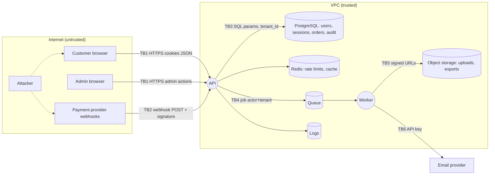

# Module 5.5 — نمذجة التهديدات
## Threat Modeling: Assets → Entry points → Trust boundaries → Threats → Mitigations; STRIDE; data flow diagrams; a threat model for Project 5

> **المستوى:** Level 5 | **الموقع:** [5 من 13]
> **السابق:** [M5.4 — Security](module-5.4-security.md) | **التالي:** [M5.6 — Concurrency in Business Logic](module-5.6-concurrency-business-logic.md)

---

## 1. المتطلبات
> **قبل أن تتعلم هذا، يجب أن تفهم:**
- [ ] مفردات الأمان وآليات الهجمات — [M5.4](module-5.4-security.md)
- [ ] المصادقة والتفويض وعزل المستأجرين — [M5.2](module-5.2-authentication.md), [M5.3](module-5.3-authorization.md)
- [ ] وثيقة التصميم، C4، مخطط التسلسل — [L4-M4.5](../level-4-software-engineering-foundations/module-4.5-software-design.md)
- [ ] المتطلبات غير الوظيفية بمقياس، ACTRR — [L4-M4.2](../level-4-software-engineering-foundations/module-4.2-requirements.md)
- [ ] سجل الدين وترتيب المخاطر (احتمال × أثر) — [L4-M4.15](../level-4-software-engineering-foundations/module-4.15-tech-debt.md)

## 2. أهداف التعلّم
- إجراء نمذجة تهديدات **خفيفة ومتكرّرة** لميزة أو نظام بالإجابة عن أسئلة Shostack الأربعة: ماذا نبني؟ ما الذي قد يسوء؟ ماذا سنفعل؟ هل أحسنّا؟
- رسم **مخطط تدفّق البيانات** (DFD) بعناصره: كيانات خارجية، عمليات، مخازن، تدفّقات، **حدود ثقة** — بالقدر الذي يكشف التهديدات لا أكثر.
- تطبيق **STRIDE** على كل عنصر/تدفّق لتوليد التهديدات بانتظام (Spoofing, Tampering, Repudiation, Information disclosure, Denial of service, Elevation of privilege)، وربط كل فئة بخاصية الأمان التي تنتهكها وبالدفاع النمطي.
- **ترتيب** التهديدات (احتمال × أثر، أو DREAD مبسّط) واختيار الاستجابة: تخفيف / إزالة / نقل / قبول موثّق — وتحويل التخفيفات إلى **متطلبات أمنية** بمعايير قبول واختبارات.
- إنتاج **نموذج تهديد لـ Project 5** كوثيقة حيّة تُحدَّث مع كل ميزة، ومعرفة متى يكفي نموذج 30 دقيقة ومتى يلزم أعمق.

---

## 3. شرح للمبتدئ

### لماذا قبل الكود؟
M5.4 أعطاك قائمة هجمات. لكن القائمة لا تخبرك **أين** في نظامك تنطبق ولا **أيها يهم أكثر**. نمذجة التهديدات = التفكير المنظّم في "ما الذي قد يسوء" **أثناء التصميم**، حين يكون تغيير القرار بسعر سطر في وثيقة، لا إعادة بناء بعد الحادث. وهي **ليست** حدثًا سنويًا لخبراء؛ هي ممارسة لكل ميزة تمسّ حدّ ثقة: 30–60 دقيقة على سبورة مع المطوّرين، تنتهي بتذاكر. أسئلة Adam Shostack الأربعة تلخّصها: (1) **ماذا نبني؟** (مخطط) (2) **ما الذي قد يسوء؟** (STRIDE) (3) **ماذا سنفعل حياله؟** (تخفيفات مرتّبة) (4) **هل قمنا بعمل جيد؟** (مراجعة، اختبارات، تحديث).

### الخطوة 1 — ماذا نبني؟ DFD بحدود ثقة
مخطط تدفّق البيانات بأربعة رموز: **كيان خارجي** (مستخدم، متصفح، مزوّد دفع، مهاجم) مستطيل؛ **عملية** (API، worker) دائرة؛ **مخزن** (DB، Redis، object storage، سجلات) خطان؛ **تدفّق** سهم باسم البيانات والبروتوكول. ثم الأهم: **خطوط حدود الثقة** المتقطّعة حيث تتغيّر الثقة/الصلاحية/المالك: الإنترنت↔VPC، المستخدم↔admin، التطبيق↔DB، خدمتك↔طرف ثالث، API↔worker عبر طابور. **كل تدفّق يعبر حدًّا هو موضع تهديد.** المستوى الصحيح: صفحة واحدة لنظام متوسط؛ تفصّل منطقة واحدة (مثلًا الدفع) حين تحتاج. ضع أيضًا **الأصول** (ما يستحق الحماية) على المخطط: أين تعيش كلمات المرور/الجلسات/البطاقات/PII/الأسرار.

### الخطوة 2 — ما الذي قد يسوء؟ STRIDE
لكل عنصر وتدفّق اسأل الفئات الست — كلٌّ تنتهك خاصية:
| | التهديد | الخاصية المنتهكة | أمثلة من P5 | دفاع نمطي |
|---|---|---|---|---|
| **S** | Spoofing — انتحال هوية | المصادقة (Authentication) | جلسة مسروقة، webhook مزوّر، DNS مخادع | M5.2، توقيع webhooks (HMAC)، TLS/شهادات |
| **T** | Tampering — تلاعب | السلامة (Integrity) | تعديل `price` في الطلب، تعديل JWT، تعديل رسالة في الطابور | حساب في الخادم، توقيع، قيود DB، لا ثقة في العميل |
| **R** | Repudiation — إنكار | عدم الإنكار (Non-repudiation) | "لم أطلب هذا الاسترداد"، مشرف ينكر تغيير دور | audit log (من/ماذا/متى/IP)، سجلات محمية |
| **I** | Information disclosure — إفشاء | السرية (Confidentiality) | IDOR، stack trace، تعداد الحسابات، نسخ احتياطي بلا تشفير، سجلات بـ PII | M5.3، Problem Details بلا تفاصيل، تشفير، تنقيح |
| **D** | Denial of service — حرمان من الخدمة | التوافر (Availability) | 10k تسجيل دخول/ثانية (hash غالٍ!)، رفع 5GB، regex، استعلام بلا حد | rate limit، حدود حجم/زمن/عدد، pool، طوابير بحدود |
| **E** | Elevation of privilege — رفع صلاحية | التفويض (Authorization) | mass assignment على `role`، endpoint إداري بلا فحص، SQLi → DB admin، SSRF → metadata | M5.3 سياسة + RLS، least privilege، M5.4 |

تطبيقها **على كل عنصر** يمنع التحيّز ("نفكّر فقط في XSS لأننا نعرفه"). العمليات معرّضة للست كلّها؛ المخازن لـ T/I/D (وR عبر السجلات)؛ التدفّقات لـ T/I/D؛ الكيانات الخارجية لـ S/R.

### الخطوة 3 — ماذا سنفعل؟ ترتيب واستجابة
لكل تهديد: **احتمال** (كم سهل؟ كم مهاجمًا مهتمًا؟ هل يُستغلّ آليًا؟) × **أثر** (أصل واحد أم كل المستأجرين؟ قابل للعكس؟ قانوني؟). مصفوفة 3×3 تكفي؛ DREAD إن أردت أرقامًا. ثم استجابة من أربع: **تخفيف** (control: الدفاع النمطي)، **إزالة** (لا نبني الميزة/لا نخزّن البيانات — أقوى دفاع)، **نقل** (مزوّد دفع يحمل PCI، مزوّد هوية، تأمين)، **قبول** (موثّق، بمالك وتاريخ مراجعة — بند في سجل الدين L4-M4.15). كل تخفيف يصبح **متطلبًا أمنيًا** بمعيار قبول قابل للاختبار (GWT): "Given مستخدم في مستأجر A، When يطلب `GET /orders/{id}` لطلب في B، Then 404 وسجل رفض" — والاختبار السلبي في CI (M5.3) هو **الدليل** أن التخفيف موجود ويبقى.

### الخطوة 4 — هل أحسنّا؟
مراجعة: هل كل تدفّق عابر لحدٍّ له سطر في الجدول؟ هل كل تخفيف له اختبار/إعداد مُتحقَّق؟ هل الافتراضات مكتوبة ("نفترض أن VPC معزولة" — افتراض يستحق تحقّقًا)؟ هل النموذج **في المستودع** (`THREAT-MODEL.md`) ويُحدَّث في PR الميزة التي تغيّر المخطط؟ هل تعلّمنا من الحوادث (كل post-mortem يسأل: هل كان التهديد في النموذج؟ لماذا لا؟). والمتصفّح للمهاجم: راجع النموذج أحيانًا بعقلية "كيف أسرق المال/البيانات؟" (attack trees: الهدف في الجذر، الطرق فروع) — تكتشف مسارات مركّبة لا تظهر عنصرًا عنصرًا (SSRF → metadata → S3 كما في M5.4).

### الحجم الصحيح
- **ميزة صغيرة تمسّ حدًّا** (endpoint جديد): 15 دقيقة: ما الحدّ؟ STRIDE سريع؛ تذكرتان.
- **نظام/ميزة كبيرة** (دفع، رفع ملفات، تكامل خارجي): جلسة 60–90 دقيقة، DFD مفصّل للمنطقة، جدول كامل.
- **ليس نمذجة تهديد:** قائمة OWASP منسوخة بلا مخطط؛ أداة تولّد 400 تهديد عام لا يقرأها أحد؛ وثيقة 40 صفحة لا تُحدَّث. الهدف تذاكر مرتّبة واختبارات، لا الوثيقة.

---

## 4. النموذج الذهني

```
   Assets → Entry points → Trust boundaries → Threats (STRIDE per element) → Mitigations (ranked, as testable requirements) → Verify & update
   1 ماذا نبني؟ DFD + حدود     2 ما الذي قد يسوء؟ S T R I D E لكل عنصر وتدفّق عابر
   3 ماذا نفعل؟ احتمال×أثر → تخفيف/إزالة/نقل/قبول → GWT + اختبار    4 هل أحسنّا؟ تغطية، أدلة، تحديث مع كل PR يغيّر المخطط
```

---

## 5. الرسم التوضيحي



```
   جدول النموذج (صيغة واحدة لكل تهديد):
   ID    | عنصر/تدفّق         | STRIDE | التهديد                                  | احتمال | أثر | استجابة | التخفيف (متطلب + اختبار)                              | حالة
   T-07  | TB2 webhook PSP     | S,T    | webhook مزوّر يعلّم طلبًا كمدفوع         | عالٍ   | عالٍ| تخفيف  | SEC-12: تحقق HMAC بزمن ثابت + timestamp ≤ 5min + idempotency بمعرّف الحدث؛ اختبار: توقيع خاطئ → 401 | ✅
   T-11  | API /login          | D      | حمل hash غالٍ يستهلك CPU                 | متوسط  | عالٍ| تخفيف  | SEC-15: rate limit IP+حساب+عالمي، hash في worker pool، تنبيه على نسبة الفشل | ✅
   T-19  | DB backups          | I      | نسخة احتياطية في bucket عام               | منخفض  | حرج | تخفيف  | SEC-21: bucket خاص + تشفير + فحص دوري للسياسة في CI    | ✅
   T-23  | Admin role change   | R      | مشرف ينكر تغييرًا                        | منخفض  | متوسط| تخفيف | SEC-24: audit append-only + step-up auth               | 🚧
   T-30  | Exports in OBJ      | I      | رابط تصدير يُشارك ويبقى صالحًا           | متوسط  | متوسط| تخفيف | SEC-28: signed URL 10 دقائق + نطاق المستأجر في المسار  | ✅
   T-34  | Support sees PII    | I      | الدعم يرى أكثر مما يحتاج                  | متوسط  | متوسط| قبول   | مقبول حتى 10k مستخدم؛ مراجعة 2026-Q3 (مالك: platform) | 📝
```

---

## 6. مثال بسيط

```typescript
// src/webhook.ts — التهديد T-07 (S/T على TB2) وتخفيفه كما يُترجم إلى كود: توقيع HMAC بزمن ثابت + نافذة زمنية + idempotency بمعرّف الحدث
import { createHmac, timingSafeEqual } from "node:crypto";
export type Verdict = { ok: true; eventId: string; payload: unknown } | { ok: false; reason: "missing" | "stale" | "bad-signature" | "replay" | "malformed" };
export function makeWebhookVerifier(secret: string, seen: { has(id: string): boolean; add(id: string): void }, now: () => number = Date.now, maxSkewMs = 5 * 60_000) {
  return (rawBody: string, headers: { "x-signature"?: string; "x-timestamp"?: string }): Verdict => {
    const sig = headers["x-signature"], ts = Number(headers["x-timestamp"]);
    if (!sig || !Number.isFinite(ts)) return { ok: false, reason: "missing" };
    if (Math.abs(now() - ts) > maxSkewMs) return { ok: false, reason: "stale" };                           // ضد إعادة الإرسال المتأخر
    const expected = createHmac("sha256", secret).update(`${ts}.${rawBody}`).digest("hex");                 // التوقيع على الجسم الخام + الطابع (لا على JSON معاد تسلسله)
    const a = Buffer.from(expected), b = Buffer.from(sig); if (a.length !== b.length || !timingSafeEqual(a, b)) return { ok: false, reason: "bad-signature" };
    let payload: unknown; try { payload = JSON.parse(rawBody); } catch { return { ok: false, reason: "malformed" }; }
    const eventId = (payload as { id?: unknown })?.id; if (typeof eventId !== "string") return { ok: false, reason: "malformed" };
    if (seen.has(eventId)) return { ok: false, reason: "replay" }; seen.add(eventId);                      // في الإنتاج: INSERT … ON CONFLICT DO NOTHING في نفس معاملة المعالجة (M5.9)
    return { ok: true, eventId, payload };
  };
}
```

---

## 7. مثال كود

```typescript
// src/threat-model.ts — النموذج كبيانات في المستودع: يُتحقَّق منه آليًا (كل تدفّق عابر لحدّ له تهديدات، كل تخفيف له اختبار، كل قبول له مراجعة) ويُولَّد منه THREAT-MODEL.md
export type Stride = "S" | "T" | "R" | "I" | "D" | "E";
export type Level = "low" | "medium" | "high" | "critical";
export type Element = { id: string; kind: "external" | "process" | "store" | "flow"; name: string; crossesBoundary?: string; assets?: string[] };
export type Threat = { id: string; element: string; stride: Stride[]; description: string; likelihood: Level; impact: Level; response: "mitigate" | "eliminate" | "transfer" | "accept"; mitigation?: { requirement: string; test?: string }; accept?: { owner: string; reviewBy: string; rationale: string }; status: "open" | "done" | "accepted" };
export type Model = { system: string; version: string; assumptions: string[]; elements: Element[]; threats: Threat[] };

const SCORE: Record<Level, number> = { low: 1, medium: 2, high: 3, critical: 4 };
export const risk = (t: Threat) => SCORE[t.likelihood] * SCORE[t.impact];
export function validate(m: Model): string[] {
  const errs: string[] = []; const ids = new Set(m.elements.map(e => e.id));
  for (const e of m.elements) if (e.kind === "flow" && e.crossesBoundary && !m.threats.some(t => t.element === e.id)) errs.push(`flow ${e.id} crosses ${e.crossesBoundary} but has no threats`);
  for (const t of m.threats) {
    if (!ids.has(t.element)) errs.push(`${t.id}: unknown element ${t.element}`);
    if (t.response === "mitigate" && !t.mitigation?.requirement) errs.push(`${t.id}: mitigate without requirement`);
    if (t.response === "mitigate" && t.status === "done" && !t.mitigation?.test) errs.push(`${t.id}: done without a test/evidence`);
    if (t.response === "accept" && (!t.accept?.owner || !t.accept?.reviewBy)) errs.push(`${t.id}: accepted without owner/review date`);
    if (t.response === "accept" && risk(t) >= 9) errs.push(`${t.id}: cannot accept a risk of ${risk(t)} (>= 9) without eliminate/mitigate`);
  }
  return errs;
}
export function render(m: Model): string {
  const rows = [...m.threats].sort((a, b) => risk(b) - risk(a)).map(t => `| ${t.id} | ${t.element} | ${t.stride.join(",")} | ${t.description} | ${t.likelihood}×${t.impact}=${risk(t)} | ${t.response} | ${t.mitigation?.requirement ?? t.accept?.rationale ?? ""} | ${t.status} |`);
  return `# Threat Model — ${m.system} (v${m.version})\n\n## Assumptions\n${m.assumptions.map(a => `- ${a}`).join("\n")}\n\n## Elements\n${m.elements.map(e => `- **${e.id}** (${e.kind}) ${e.name}${e.crossesBoundary ? ` — crosses ${e.crossesBoundary}` : ""}${e.assets?.length ? ` — assets: ${e.assets.join(", ")}` : ""}`).join("\n")}\n\n## Threats (by risk)\n| ID | Element | STRIDE | Threat | Risk | Response | Mitigation / Rationale | Status |\n|---|---|---|---|---|---|---|---|\n${rows.join("\n")}\n`;
}
```

```typescript
// src/p5-model.ts — جزء من نموذج Project 5 (أكمله في §13)
import { type Model, validate, render, risk } from "./threat-model.js";
export const p5: Model = {
  system: "Project 5 — Authenticated Store", version: "0.3",
  assumptions: ["TLS terminates at the load balancer; traffic LB→API stays inside the VPC", "PostgreSQL is reachable only from the VPC", "Payment provider signs webhooks with a shared secret rotated quarterly"],
  elements: [
    { id: "U", kind: "external", name: "Customer browser" }, { id: "AD", kind: "external", name: "Admin browser" }, { id: "PSP", kind: "external", name: "Payment provider" },
    { id: "API", kind: "process", name: "HTTP API", assets: ["sessions", "PII", "orders"] }, { id: "WK", kind: "process", name: "Worker" },
    { id: "DB", kind: "store", name: "PostgreSQL", assets: ["password hashes", "PII", "orders", "audit log"] }, { id: "RD", kind: "store", name: "Redis (rate limits, cache)" }, { id: "OBJ", kind: "store", name: "Object storage (uploads, exports)", assets: ["exports with PII"] }, { id: "LOG", kind: "store", name: "Logs" },
    { id: "F1", kind: "flow", name: "U→API: cookies + JSON", crossesBoundary: "TB1 internet→vpc" }, { id: "F2", kind: "flow", name: "PSP→API: webhooks", crossesBoundary: "TB2 third-party→vpc" },
    { id: "F3", kind: "flow", name: "API→DB: SQL", crossesBoundary: "TB3 app→data" }, { id: "F4", kind: "flow", name: "API→Q→WK: jobs", crossesBoundary: "TB4 sync→async" }, { id: "F5", kind: "flow", name: "WK→OBJ: files", crossesBoundary: "TB5 vpc→storage" },
  ],
  threats: [
    { id: "T-01", element: "F1", stride: ["S"], description: "Session cookie theft via XSS → act as user", likelihood: "medium", impact: "high", response: "mitigate", mitigation: { requirement: "SEC-01 HttpOnly+Secure+SameSite=Lax cookie; CSP with nonce; output encoding everywhere", test: "security.test.ts XSS payloads; header test" }, status: "done" },
    { id: "T-02", element: "F1", stride: ["E", "I"], description: "IDOR: read/cancel another user's or tenant's order", likelihood: "high", impact: "high", response: "mitigate", mitigation: { requirement: "SEC-02 central policy + tenant-scoped loads + RLS; 404 for hidden", test: "policy.test.ts (deny table), rls.int.test.ts, idor-scan in CI" }, status: "done" },
    { id: "T-03", element: "F1", stride: ["D"], description: "Credential stuffing floods /sessions; scrypt CPU exhaustion", likelihood: "high", impact: "medium", response: "mitigate", mitigation: { requirement: "SEC-03 rate limit per IP+account+global, 429 + Retry-After; alert on failure ratio", test: "auth.test.ts rate limit; load test 500 rps" }, status: "done" },
    { id: "T-04", element: "F1", stride: ["T"], description: "Client sends price/discount/role in body (mass assignment)", likelihood: "high", impact: "high", response: "eliminate", mitigation: { requirement: "SEC-04 server computes money; writable-field allow-list per endpoint", test: "api tests: unknown/forbidden fields → 422" }, status: "done" },
    { id: "T-07", element: "F2", stride: ["S", "T"], description: "Forged or replayed webhook marks order as paid", likelihood: "high", impact: "high", response: "mitigate", mitigation: { requirement: "SEC-12 HMAC over ts.body, constant-time, ±5min, event-id idempotency in same tx", test: "webhook.test.ts (bad sig, stale, replay)" }, status: "done" },
    { id: "T-12", element: "F3", stride: ["E"], description: "SQL injection via sort/filter identifiers", likelihood: "medium", impact: "critical", response: "mitigate", mitigation: { requirement: "SEC-16 parameters only; identifier allow-lists; app DB role without DDL", test: "sqli.int.test.ts; grep for template SQL in CI" }, status: "done" },
    { id: "T-15", element: "F4", stride: ["E"], description: "Job executes with system privileges, ignoring original actor", likelihood: "medium", impact: "high", response: "mitigate", mitigation: { requirement: "SEC-19 job payload carries actor+tenant; worker re-authorizes before side effects" }, status: "open" },
    { id: "T-18", element: "F5", stride: ["I"], description: "Export link shared/leaked stays valid", likelihood: "medium", impact: "medium", response: "mitigate", mitigation: { requirement: "SEC-28 signed URLs 10 min, tenant prefix, private bucket", test: "storage policy check in CI" }, status: "done" },
    { id: "T-21", element: "LOG", stride: ["I"], description: "PII/secrets in logs readable by all engineers", likelihood: "medium", impact: "medium", response: "mitigate", mitigation: { requirement: "SEC-30 redaction allow-list; log access via IAM", test: "logger.test.ts redaction" }, status: "done" },
    { id: "T-23", element: "AD", stride: ["R"], description: "Admin denies changing a user's role", likelihood: "low", impact: "medium", response: "mitigate", mitigation: { requirement: "SEC-24 append-only audit log with actor/ip/ua; step-up auth for role changes" }, status: "open" },
    { id: "T-34", element: "API", stride: ["I"], description: "Support staff can view full PII of any customer in tenant", likelihood: "medium", impact: "medium", response: "accept", accept: { owner: "platform", reviewBy: "2026-09-30", rationale: "Needed for support at current scale; revisit with field-level masking at 10k users" }, status: "accepted" },
  ],
};
if (process.argv[1]?.match(/p5-model\.(ts|js)$/)) {
  const errs = validate(p5); if (errs.length) { console.error(errs.join("\n")); process.exit(1); }
  console.log(render(p5)); console.error(`open mitigations: ${p5.threats.filter(t => t.status === "open").map(t => `${t.id}(risk ${risk(t)})`).join(", ")}`);
}
```

```typescript
// src/threat-model.test.ts — النموذج نفسه مُختبَر: لا تدفّق عابر بلا تهديد، لا "done" بلا دليل، لا قبول لمخاطرة عالية
import { test } from "node:test"; import assert from "node:assert/strict";
import { validate, risk, type Model } from "./threat-model.js"; import { p5 } from "./p5-model.js"; import { makeWebhookVerifier } from "./webhook.js"; import { createHmac } from "node:crypto";
test("P5 model is internally consistent", () => assert.deepEqual(validate(p5), []));
test("validator catches the classic omissions", () => {
  const bad: Model = { ...p5, threats: [...p5.threats.filter(t => t.element !== "F2"), { id: "T-99", element: "DB", stride: ["I"], description: "backup public", likelihood: "high", impact: "critical", response: "accept", status: "accepted" }] };
  const errs = validate(bad); assert.ok(errs.some(e => e.includes("F2 crosses"))); assert.ok(errs.some(e => e.includes("T-99") && e.includes("owner"))); assert.ok(errs.some(e => e.includes("cannot accept a risk of 12")));
});
test("threats are ranked by likelihood × impact", () => { const sorted = [...p5.threats].sort((a, b) => risk(b) - risk(a)); assert.equal(risk(sorted[0]!), 9); assert.ok(["T-02", "T-07"].includes(sorted[0]!.id)); assert.ok(risk(sorted.at(-1)!) <= 4); });
test("T-07 mitigation: webhook verifier rejects forged, stale and replayed events; accepts valid once", () => {
  const seen = new Set<string>(); let now = 1_700_000_000_000; const verify = makeWebhookVerifier("whsec_test", seen, () => now);
  const body = JSON.stringify({ id: "evt_1", type: "payment.succeeded", orderId: "o_9" }); const sign = (ts: number, b: string) => createHmac("sha256", "whsec_test").update(`${ts}.${b}`).digest("hex");
  assert.equal(verify(body, { "x-signature": sign(now, body), "x-timestamp": String(now) }).ok, true);
  assert.deepEqual(verify(body, { "x-signature": sign(now, body), "x-timestamp": String(now) }), { ok: false, reason: "replay" });
  assert.deepEqual(verify(body, { "x-signature": sign(now, body.replace("o_9", "o_1")), "x-timestamp": String(now) }), { ok: false, reason: "bad-signature" });
  assert.deepEqual(verify(body, { "x-signature": sign(now - 600_000, body), "x-timestamp": String(now - 600_000) }), { ok: false, reason: "stale" });
  assert.deepEqual(verify(body, {}), { ok: false, reason: "missing" });
});
```

```bash
node --import tsx --test src/threat-model.test.ts          # 4 pass
node --import tsx src/p5-model.ts > THREAT-MODEL.md         # يُولَّد في CI؛ البناء يفشل إن كان النموذج غير متسق — "النموذج كبيانات حيّة لا وثيقة ميتة"
```

---

## 8. مثال من العالم الحقيقي
فريق أضاف ميزة "دعوة زميل بالبريد" في 3 أيام دون نمذجة. بعد الإطلاق: (S) رابط الدعوة بلا انتهاء ويُعاد استخدامه؛ (E) المدعو يرث دور الداعي (admin!)؛ (D) لا حدّ على الدعوات → spam من نطاقهم أدخل بريدهم في قوائم سوداء؛ (I) البريد يحوي اسم الداعي ومؤسسته لأي عنوان يُدخَل (تعداد). جلسة نمذجة بـ 30 دقيقة قبل البناء كانت ستنتج: رمز لمرة واحدة بانتهاء (M5.2)، دور افتراضي أدنى يُرفع صراحة (M5.3)، rate limit، وقالب بريد محايد. كلفة الإصلاح بعد الإطلاق: أسبوعان + سمعة.

## 9. مثال من الإنتاج
شركة مدفوعات تُلزم كل PR يغيّر DFD (endpoint جديد، تكامل، مخزن) بتحديث `threat-model.ts`؛ CI يشغّل `validate` ويرفض "done" بلا اختبار و"accept" بلا مالك؛ لوحة تعرض التهديدات المفتوحة بترتيب الخطر لكل فريق؛ وكل post-mortem يُضيف سؤالًا ثابتًا: "هل كان في النموذج؟". بعد عام: 70% من الثغرات المكتشفة في اختبار الاختراق السنوي كانت مسجّلة كـ"مقبولة بوعي" أو "مفتوحة بأولوية" — أي لم تكن مفاجآت — والمفاجآت الـ 30% غذّت قائمة STRIDE الداخلية. **النمذجة لا تمنع كل شيء؛ تمنع المفاجآت وتوجّه الجهد.**

---

## 10. مفاهيم خاطئة شائعة
1. **"نمذجة التهديدات لخبراء الأمن."** أفضل من يعرف النظام هم بانوه؛ STRIDE يعطيهم اللغة. الخبير يراجع.
2. **"نحتاج أداة/وثيقة شاملة."** السبورة + جدول + تذاكر. الأداة تُسرّع، لا تُفكّر.
3. **"مرة عند التصميم تكفي."** النظام يتغيّر؛ النموذج يُحدَّث مع كل ميزة تمسّ حدًّا.
4. **"كل تهديد يجب تخفيفه."** القبول الموثّق استجابة مشروعة لمخاطر منخفضة؛ والإزالة أقوى من التخفيف.
5. **"STRIDE = قائمة ثغرات."** هو إطار لتوليد الأسئلة لكل عنصر؛ الثغرات المحدّدة تأتي من M5.4 ومعرفتك بالنظام.

## 11. أخطاء شائعة
1. مخطط بلا حدود ثقة (أهم عنصر فيه).
2. نسيان التدفّقات غير HTTP: الطوابير، الوظائف المجدولة، النسخ الاحتياطي، السجلات، لوحات المراقبة، CI/CD (له صلاحيات نشر!).
3. تهديدات عامة ("هجوم على الخادم") بلا عنصر ولا سيناريو؛ أو ترتيب بلا احتمال×أثر فتُنفق الأسابيع على النادر.
4. تخفيفات بلا متطلب/اختبار → تختفي عند أول إعادة هيكلة.
5. افتراضات غير مكتوبة ("الشبكة الداخلية آمنة") تصبح ثغرات حين تتغيّر البنية.
6. قبول مخاطر عالية بصمت لأن التخفيف "صعب الآن".
7. النموذج في ويكي بعيد عن الكود — لا يُحدَّث؛ ضعه في المستودع واجعل CI يحرسه.

## 12. تمرين تصحيح
بعد حادث: مهاجم استخدم ميزة "تصدير الطلبات" لتنزيل بيانات مستأجر آخر. النموذج يُظهر T-18 (روابط التصدير) "done" بـ signed URLs 10 دقائق.
1. **دليل:** الرابط موقّع فعلًا ولمدة 10 دقائق؛ لكن **اسم الملف** في المسار `exports/{tenantId}/{date}.csv` كان يُبنى من `tenantId` مُمرَّر في **جسم الطلب** لا من الجلسة (T-02 التفويض يفحص الطلب، لا الوظيفة الخلفية التي تولّد الملف).
2. **لماذا لم يظهر في النموذج؟** F4 (API→Q→WK) كان له T-15 "worker ينفّذ بصلاحيات النظام" — **مفتوحًا** (status: open، risk 6) ولم يُنفَّذ؛ والمخطط لم يُظهر أن payload الوظيفة يحمل `tenantId` من المستخدم.
3. **الإصلاح:** T-15 → done: الوظيفة تحمل `actorId` فقط والعامل يحمّل المستأجر من مصدر موثوق ويعيد `can()`؛ `tenantId` لا يأتي أبدًا من الطلب (M5.3 §11.6)؛ اختبار: وظيفة تصدير بـ `tenantId` مزوّر → ترفض.
4. **درس العملية:** التهديدات المفتوحة بخطر ≥ 6 تحتاج موعدًا؛ ولوحة "المفتوح" تُراجع أسبوعيًا؛ وكل post-mortem يُحدّث النموذج (هنا: عنصر جديد "job payload" بتدفّقه).
5. **أين أيضًا؟** أي بيانات هوية/مستأجر تنتقل عبر حدّ (طابور، كاش، ملف، webhook داخلي) — من يملؤها ومن يثق بها؟

## 13. تمرين معماري
أكمل **نموذج تهديد Project 5** في `threat-model.ts`: (1) DFD كامل بـ Mermaid مع حدود الثقة (أضف CI/CD، النسخ الاحتياطي، لوحة المراقبة، البريد)؛ (2) STRIDE لكل عنصر وتدفّق عابر — هدف 25–40 تهديدًا محدّدًا بسيناريو؛ (3) احتمال×أثر لكلٍّ، واستجابة؛ (4) كل تخفيف = متطلب `SEC-xx` بمعيار GWT + الاختبار/الإعداد الذي يثبته (اربطه باختبارات M5.1–5.4 الموجودة)؛ (5) الافتراضات مكتوبة مع كيفية التحقق من كلٍّ؛ (6) `validate` في CI و`THREAT-MODEL.md` مولَّد؛ (7) شجرة هجوم واحدة لهدف "سرقة أموال عبر استرداد مزوّر" تمرّ بعناصر متعددة. ثم ACTRR: ما الذي ستقبله بوعي في P5 وتخفّفه في P6 (M5.7–5.13 تضيف عناصر: Redis، الطابور، Docker، CI)؟

## 14. الصلة بعصر AI
AI شريك ممتاز في **الخطوة 2**: أعطه DFD والعناصر واطلب STRIDE لكل عنصر — سيولّد تهديدات تنسى بعضها (خاصة R وD)؛ راجعها واحذف العام. لكن الخطوات 1 و3 و4 ملكك: هو لا يعرف نظامك الفعلي ولا أصولك ولا شهيّة المخاطر لديك، ويميل إلى "خفّف كل شيء". وفي L8، نموذج التهديد يصبح **قيود المهمة** التي تُسلَّم مع أي تفويض تنفيذ لـ AI ("SEC-02: لا تحميل بلا مستأجر")، و`validate` يحرس أن الكود المولَّد لم يُضف تدفّقًا عابرًا بلا تهديدات. وأنظمة AI نفسها تُنمذَج بنفس الطريقة: الـ prompt مدخل غير موثوق يعبر حدًّا، الأدوات عمليات بصلاحيات، والذاكرة مخزن (L8-M8.9).

## 15. ما يجب إتقانه (Must Master) 🔴
- 🔴 الأسئلة الأربعة؛ DFD بحدود ثقة وأصول؛ STRIDE لكل عنصر مع الخاصية والدفاع النمطي؛ احتمال×أثر؛ الاستجابات الأربع وشروط القبول؛ تحويل التخفيف إلى متطلب GWT + اختبار؛ النموذج في المستودع ويُحدَّث مع PRs؛ الحجم الصحيح (15 دقيقة لميزة، 90 لنظام).

## 16. ما يجب فهمه (Should Understand) 🟠
- 🟠 النموذج كبيانات مع `validate` في CI؛ أشجار الهجوم للمسارات المركّبة؛ ربط post-mortems بالنموذج؛ التدفّقات المنسية (CI/CD، نسخ، سجلات)؛ DREAD؛ توقيع webhooks بنافذة وidempotency.

## 17. ما يمكن تأجيله (Can Defer) ⚪
- ⚪ PASTA/LINDDUN (الخصوصية)، أدوات OWASP Threat Dragon/Microsoft TMT، MITRE ATT&CK للمدافعين، نمذجة على مستوى المؤسسة.

## 18. الخلاصة
1. نمذجة التهديدات = التفكير المنظّم في "ما قد يسوء" **قبل** البناء، لكل ميزة تمسّ حدّ ثقة، في 15–90 دقيقة.
2. ارسم DFD بحدود الثقة والأصول؛ طبّق STRIDE على كل عنصر وتدفّق عابر؛ رتّب باحتمال×أثر.
3. لكل تهديد استجابة: تخفيف/إزالة/نقل/قبول موثّق — والتخفيف متطلب بمعيار قبول واختبار يثبته.
4. النموذج حيّ في المستودع، يُتحقَّق منه آليًا، ويتعلّم من الحوادث.
5. لا يمنع كل شيء؛ يمنع المفاجآت ويوجّه الجهد — وهو قيد المهمة عند تفويض البناء لإنسان أو AI.

## 19. مراجع رسمية
- Adam Shostack — *Threat Modeling: Designing for Security*; the Four Questions: https://shostack.org/resources/threat-modeling
- Threat Modeling Manifesto: https://www.threatmodelingmanifesto.org/
- OWASP — Threat Modeling Cheat Sheet & Process: https://cheatsheetseries.owasp.org/cheatsheets/Threat_Modeling_Cheat_Sheet.html , https://owasp.org/www-community/Threat_Modeling_Process
- Microsoft — STRIDE & Threat Modeling Tool: https://learn.microsoft.com/en-us/azure/security/develop/threat-modeling-tool-threats
- OWASP Threat Dragon (open-source tool): https://owasp.org/www-project-threat-dragon/
- Stripe — Webhook signatures (timestamp + HMAC + tolerance): https://docs.stripe.com/webhooks#verify-official-libraries

## المصطلحات
| العربية | English |
|---|---|
| نمذجة التهديدات | Threat modeling |
| مخطط تدفّق البيانات | Data Flow Diagram (DFD) |
| كيان خارجي / عملية / مخزن / تدفّق | External entity / Process / Data store / Data flow |
| STRIDE (انتحال، تلاعب، إنكار، إفشاء، حرمان، رفع صلاحية) | STRIDE (Spoofing, Tampering, Repudiation, Information disclosure, DoS, Elevation) |
| سلامة / سرية / توافر / عدم الإنكار | Integrity / Confidentiality / Availability / Non-repudiation |
| احتمال × أثر | Likelihood × Impact |
| تخفيف / إزالة / نقل / قبول | Mitigate / Eliminate / Transfer / Accept |
| متطلب أمني | Security requirement |
| شجرة هجوم | Attack tree |
| افتراض أمني | Security assumption |
| توقيع webhook | Webhook signature (HMAC) |
| هجوم إعادة الإرسال | Replay attack |
| مصادقة تصعيدية | Step-up authentication |
