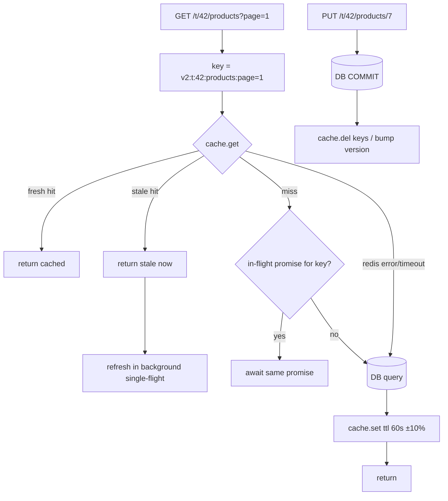

# Module 5.8 — التخزين المؤقت
## Caching: cache-aside, TTL & invalidation, stampedes, stale-while-revalidate, Redis as a backing service, HTTP caching, and what must never be cached

> **المستوى:** Level 5 | **الموقع:** [8 من 13]
> **السابق:** [M5.7 — Anatomy of a Production System](module-5.7-production-anatomy.md) | **التالي:** [M5.9 — Queues, Jobs & Workers](module-5.9-queues-jobs-workers.md)

---

## 1. المتطلبات
> **قبل أن تتعلم هذا، يجب أن تفهم:**
- [ ] جدول الكمون: RAM ≪ شبكة ≪ قرص، وcache الـ CPU كفكرة — [L2-M2.2](../level-2-computer-systems/module-2.2-cpu-cache-ram.md)
- [ ] hash maps وO(1)، وLRU كفكرة — [L3-M3.1](../level-3-core-computer-science/module-3.1-arrays-hash-maps.md)
- [ ] Ports & Adapters وfake > mock — [L4-M4.11](../level-4-software-engineering-foundations/module-4.11-testing.md)
- [ ] HTTP: `Cache-Control`, `ETag`, 304 — [L2-M2.12](../level-2-computer-systems/module-2.12-http.md), [M5.1](module-5.1-api-design.md)
- [ ] السباقات بين `await`s، والحالة لا تعيش في ذاكرة العملية مع N نسخ — [M5.6](module-5.6-concurrency-business-logic.md), [M5.7](module-5.7-production-anatomy.md)
- [ ] المستأجر في كل مفتاح/استعلام — [M5.3](module-5.3-authorization.md)

## 2. أهداف التعلّم
- تحديد **متى** يستحق شيء التخزين المؤقت (قراءة متكرّرة، غالية، تتحمّل قِدمًا محدودًا) و**متى لا** (كتابات، بيانات لكل مستخدم تُسرَّب عبر مفتاح خاطئ، ما يحتاج دقة فورية كالرصيد).
- تطبيق **cache-aside** صحيحًا: مفتاح (بالمستأجر والإصدار)، TTL + jitter، سياسة الإبطال (invalidation) عند الكتابة، negative caching، وقياس **hit ratio**.
- منع **التدافع** (cache stampede / thundering herd): single-flight داخل العملية، قفل/early-refresh عبر النسخ، و**stale-while-revalidate**.
- التعامل مع **Redis كخدمة مساندة**: الأوامر الأساسية، مهل قصيرة، **التدهور الرشيق** حين يسقط (الكاش اختياري — النظام يعمل أبطأ لا يتعطّل)، سياسة الطرد (eviction) وحجم الذاكرة، المفاتيح الساخنة.
- استخدام **HTTP caching** (`Cache-Control`, `ETag`/304, `Vary`, CDN) كطبقة قبل الخادم، ومعرفة ما يُمنع تخزينه هناك (استجابات خاصة بالمستخدم بلا `private`/`no-store`).

---

## 3. شرح للمبتدئ

### الكاش هو مقايضة
تخزين نسخة من نتيجة غالية في مكان أسرع (RAM المحلية أو Redis) لتخدم القراءات القادمة في ميكروثوانٍ بدل ملّي ثوانٍ. الثمن: **قد تكون النسخة قديمة** (stale)، وتحتاج ذاكرة، وتضيف مكوّنًا يفشل، وتخلق **أخطاء جديدة** (المستخدم يرى بيانات مستخدم آخر، التحديث "لا يظهر"). القاعدة الأولى: **لا تخزّن مؤقتًا إلا ما قسته** — كاش على استعلام يأخذ 2 ms لا يستحق تعقيده.

### أين يمكن أن يعيش الكاش؟
```
Browser cache → CDN/edge → Reverse proxy → [ذاكرة العملية (Map)] → [Redis مشترك] → DB (ولها كاشها الخاص: shared_buffers)
```
كل طبقة أقرب للمستخدم أسرع وأصعب إبطالًا. **ذاكرة العملية**: الأسرع، لكن لكل نسخة نسختها (N نسخ = N حالات مختلفة + إبطال مستحيل عبر النسخ) → تصلح لما يتحمّل القِدم ثوانيَ (تهيئة، feature flags، أسعار صرف). **Redis**: مشترك بين النسخ، إبطال مركزي، ~0.3–1 ms عبر الشبكة، ويسقط أحيانًا.

### الأنماط
- **Cache-aside** (الأكثر شيوعًا): اقرأ من الكاش؛ miss → اقرأ من DB → اكتب في الكاش بـ TTL → أعد. عند الكتابة إلى DB: **احذف** المفتاح (لا تحدّثه — التحديث المتزامن يسبّب سباقًا يكتب قيمة قديمة فوق جديدة). الكود يملك المنطق؛ الكاش مجرّد مخزن.
- **Read-through / Write-through**: مكتبة الكاش هي من تقرأ/تكتب DB نيابة عنك. Write-through يُبقي الكاش متسقًا لكنه يبطّئ الكتابات ويخزّن ما قد لا يُقرأ.
- **Write-behind**: اكتب في الكاش وأرسل إلى DB لاحقًا — سريع وخطير (ضياع عند السقوط)؛ نادرًا ما يستحق خارج العدّادات غير الحرجة.
- **Materialized/precomputed**: احسب النتيجة الغالية في الخلفية (M5.9) واكتبها؛ القراءة تقرأ فقط. للوحات والتقارير.

### المفتاح
المفتاح جزء من **الصحة** لا التسمية: يجب أن يتضمّن **كل ما يغيّر النتيجة** — المستأجر (`t:42:`)، اللغة، الصلاحية إن أثّرت، معاملات الاستعلام مطبّعة، و**إصدار المخطّط** (`v2:`) حتى لا تقرأ نسخة جديدة من الكود بنية قديمة. أشهر تسريب بيانات بسبب الكاش هو مفتاح بلا مستأجر/مستخدم: `product:7` يخدم `GET /me/orders` لمستخدم آخر (M5.3: المستأجر في كل مكان، والكاش "كل مكان").

### TTL والإبطال
TTL هو **خط الدفاع الأخير** ضد القِدم، لا سياسة الإبطال. القاعدة: TTL قصير بقدر ما يتحمّله الحمل، + **jitter** (±10–20%) حتى لا تنتهي آلاف المفاتيح معًا، + إبطال صريح عند الكتابة لما يهم المستخدم أن يراه فورًا (`DEL` بعد COMMIT — لا قبله، وإلا أعاد قارئ متزامن ملء الكاش بالقيمة القديمة قبل الـ COMMIT). للإبطال الجماعي: **مفاتيح مُصدَّرة** (`tenant:42:catalog:v{n}` — زيادة `n` تبطل كل شيء بلا مسح) بدل `KEYS pattern` (يجمّد Redis). **Negative caching**: خزّن "غير موجود" بـ TTL قصير حتى لا يضرب كل 404 الـ DB (حماية من تعداد المعرّفات، M5.4).

### التدافع (Stampede)
مفتاح ساخن ينتهي → 500 طلب متزامن تجد miss → 500 استعلام متطابق تضرب DB معًا → DB تبطئ → مزيد من المهلات. ثلاث دفاعات مركّبة: (1) **single-flight** داخل العملية: الطلبات المتزامنة لنفس المفتاح تنتظر الوعد نفسه (Map<key, Promise>)؛ (2) **stale-while-revalidate**: احتفظ بالقيمة بعد "انتهائها المنطقي" لفترة سماح؛ قدّمها فورًا وجدّد في الخلفية (طلب واحد يجدّد والباقي يأخذ القديم)؛ (3) عبر النسخ: **قفل تجديد** قصير في Redis (`SET lock NX PX 5000`) أو **early expiration احتمالي** (XFetch). والأبسط للمفاتيح الأكثر سخونة: تجديد دوري بالخلفية (M5.9) بلا انتهاء أصلًا.

### Redis كخدمة مساندة
بنية بيانات في الذاكرة عبر الشبكة: `GET/SET key value EX 60`، `SET … NX` (قفل/تفرّد)، `DEL`, `INCR`/`EXPIRE` (عدّادات، rate limit M5.2), `HSET/HGETALL`, `ZADD` (ترتيب/جداول زمنية)، `MGET` (دفعة)، pipelines، pub/sub (إبطال الكاش المحلي عبر النسخ). قواعد التشغيل: **مهلة قصيرة** (50–100 ms) على كل أمر — الكاش البطيء أسوأ من اللاكاش؛ **التدهور الرشيق**: أي خطأ من Redis = miss (سجّل، عدّ، واستمر إلى DB) ولا تُسقط الطلب؛ **قاطع دائرة** بسيط حتى لا تدفع مهلة 100 ms في كل طلب حين يسقط (L7-M7.5)؛ `maxmemory` + `maxmemory-policy allkeys-lru` لكاش خالص (وإلا رفض الكتابات عند الامتلاء)؛ حجم القيم (< 100 KB؛ الكبير يحجب الخيط الواحد)؛ المفاتيح الساخنة (نسخة محلية قصيرة أمام Redis). ولأن Redis اختياري، **لا تضعه في `/ready`** (M5.7).

### HTTP caching: الطبقة قبل الخادم
الطلب الأرخص هو ما لا يصل. `Cache-Control: public, max-age=300, stale-while-revalidate=60` للعام (كتالوج، صور)؛ `private, max-age=0, must-revalidate` + `ETag` لما يخصّ المستخدم (المتصفح يعيد التحقق بـ `If-None-Match` → 304 بلا جسم)؛ `no-store` للحسّاس (M5.2 جلسات/رموز، نتائج مالية). `Vary: Accept-Language, Authorization` حين تختلف الاستجابة. خطأ شائع كارثي: CDN يخزّن استجابة **خاصة** لأن الخادم لم يرسل `private`/`no-store` → مستخدم يرى حساب غيره. القاعدة: الافتراضي للـ API المصادق `Cache-Control: private, no-store` ما لم تقرّر خلاف ذلك عمدًا.

### ما لا يُخزَّن مؤقتًا
نتائج **التفويض** لمدة طويلة (سحب صلاحية يجب أن يسري خلال ثوانٍ — M5.3؛ إن خزّنت فـ TTL قصير + إبطال عند التغيير)؛ أرصدة/مخزون يُتخذ عليها **قرار كتابة** (M5.6: القرار في DB لا من نسخة قديمة)؛ أسرار ورموز؛ أي شيء لم تقسه.

### القياس
بلا مقاييس الكاش عبء أعمى: **hit ratio** (hits/(hits+misses)) لكل مفتاح-نوع، زمن `get`، حجم الذاكرة ومعدّل الطرد، وعدد التجديدات/التدافعات المحبطة. hit ratio منخفض (< 50%) يعني مفاتيح سيئة أو TTL قصير جدًا أو بيانات لا تتكرّر قراءتها.

---

## 4. النموذج الذهني

```
   الكاش = سرعة مقابل قِدم + مكوّن يفشل + أخطاء جديدة. خزّن ما قسته فقط.
   المفتاح يحوي كل ما يغيّر النتيجة (tenant, lang, params, schema version).  TTL + jitter = خط الدفاع الأخير؛ الإبطال = DEL بعد COMMIT.
   Miss متزامن → single-flight + stale-while-revalidate (+ قفل تجديد عبر النسخ).
   Redis اختياري: مهلة 50–100ms، خطأ = miss، ليس في /ready.   HTTP: public/max-age للعام، private/no-store افتراضيًا للمصادق.
   لا تتخذ قرار كتابة من قيمة كاش.  قِس hit ratio أو لا تخزّن.
```

---

## 5. الرسم التوضيحي



```
   التدافع بلا دفاع:                       مع single-flight + SWR:
   t=60.000 المفتاح ينتهي                  t=55 (soft TTL) القيمة "قديمة منطقيًا" لكنها تُقدَّم
   500 طلب → 500 miss → 500 استعلام DB      أول طلب بعد 55 يطلق تجديدًا واحدًا بالخلفية؛ 499 يأخذون القديم فورًا
   DB p99 ↑ → مهلات → مزيد من المحاولات      t=55.02 القيمة جديدة. DB رأت استعلامًا واحدًا.
```

---

## 6. مثال بسيط

```typescript
// src/kv.ts — المنفذ (port) + محوّل ذاكرة محلية بحدّ حجم LRU؛ محوّل Redis له نفس الواجهة (M5.11 يشغّله فعليًا)
export interface KV {
  get(key: string): Promise<string | null>;
  set(key: string, value: string, ttlMs: number): Promise<void>;
  del(...keys: string[]): Promise<void>;
  setNX(key: string, value: string, ttlMs: number): Promise<boolean>;      // SET key value NX PX ttl — للأقفال القصيرة والتفرّد
  incr(key: string, ttlMs: number): Promise<number>;                         // INCR + EXPIRE عند أول زيادة — عدّادات/rate limit
}
export class MemoryKV implements KV {
  private m = new Map<string, { v: string; exp: number }>();
  constructor(private now: () => number = Date.now, private maxEntries = 10_000) {}
  private live(key: string) { const e = this.m.get(key); if (!e) return null; if (e.exp <= this.now()) { this.m.delete(key); return null; } this.m.delete(key); this.m.set(key, e); return e; }   // إعادة الإدراج = الأحدث استخدامًا (LRU على ترتيب Map)
  async get(key: string) { return this.live(key)?.v ?? null; }
  async set(key: string, value: string, ttlMs: number) { this.m.delete(key); this.m.set(key, { v: value, exp: this.now() + ttlMs }); if (this.m.size > this.maxEntries) this.m.delete(this.m.keys().next().value as string); }   // اطرد الأقدم
  async del(...keys: string[]) { for (const k of keys) this.m.delete(k); }
  async setNX(key: string, value: string, ttlMs: number) { if (this.live(key)) return false; await this.set(key, value, ttlMs); return true; }
  async incr(key: string, ttlMs: number) { const e = this.live(key); const n = (e ? Number(e.v) : 0) + 1; await this.set(key, String(n), e ? e.exp - this.now() : ttlMs); return n; }
  get size() { return this.m.size; }
}
// محوّل Redis (ioredis) — نفس العقد؛ لاحظ المهلة القصيرة لكل أمر والأوامر المقابلة:
//   get → redis.get(key)        set → redis.set(key, value, "PX", ttlMs)        del → redis.del(...keys)
//   setNX → (await redis.set(key, value, "PX", ttlMs, "NX")) === "OK"            incr → MULTI INCR key / PEXPIRE key ttl NX / EXEC
//   new Redis(url, { commandTimeout: 100, maxRetriesPerRequest: 1, enableOfflineQueue: false })  ← لا تنتظر Redis ميتًا
```

---

## 7. مثال كود

```typescript
// src/cache.ts — cache-aside مع: مفاتيح مُصدَّرة بالمستأجر، TTL + jitter، SWR، single-flight، negative caching، تدهور رشيق، مقاييس
import type { KV } from "./kv.js";
export type CacheStats = { hits: number; staleHits: number; misses: number; errors: number; coalesced: number; refreshes: number };
type Envelope<T> = { v: T; softExp: number; found: boolean };                 // softExp: متى تصبح "قديمة منطقيًا"؛ الانتهاء الفعلي في KV أطول (نافذة SWR)
export type CacheOptions = { ttlMs: number; staleMs?: number; jitter?: number; negativeTtlMs?: number; timeoutMs?: number };

export class Cache {
  readonly stats: CacheStats = { hits: 0, staleHits: 0, misses: 0, errors: 0, coalesced: 0, refreshes: 0 };
  private inflight = new Map<string, Promise<unknown>>();
  constructor(private kv: KV, private log: (o: object, msg: string) => void = () => {}, private now: () => number = Date.now, private rand: () => number = Math.random) {}

  key(parts: { tenantId: string; schemaVersion: number; name: string; params?: Record<string, string | number | boolean | undefined> }): string {
    const p = Object.entries(parts.params ?? {}).filter(([, v]) => v !== undefined).sort(([a], [b]) => a.localeCompare(b)).map(([k, v]) => `${k}=${encodeURIComponent(String(v))}`).join("&");   // تطبيع: الترتيب لا يغيّر المفتاح
    return `v${parts.schemaVersion}:t:${parts.tenantId}:${parts.name}${p ? `?${p}` : ""}`;
  }
  private withTimeout<T>(p: Promise<T>, ms: number): Promise<T> { return Promise.race([p, new Promise<T>((_, rej) => setTimeout(() => rej(new Error("cache timeout")), ms).unref())]); }
  private async safeGet<T>(key: string, timeoutMs: number): Promise<Envelope<T> | null> { try { const raw = await this.withTimeout(this.kv.get(key), timeoutMs); return raw ? (JSON.parse(raw) as Envelope<T>) : null; } catch (e) { this.stats.errors++; this.log({ key, err: (e as Error).message }, "cache get failed → miss"); return null; } }   // خطأ الكاش = miss، لا فشل الطلب
  private async safeSet<T>(key: string, env: Envelope<T>, ttlMs: number, timeoutMs: number) { try { await this.withTimeout(this.kv.set(key, JSON.stringify(env), ttlMs), timeoutMs); } catch (e) { this.stats.errors++; this.log({ key, err: (e as Error).message }, "cache set failed"); } }

  /** cache-aside: fresh → أعد؛ stale → أعد القديم وجدّد بالخلفية؛ miss → single-flight إلى loader. loader يعيد undefined = غير موجود (negative cache). */
  async getOrLoad<T>(key: string, loader: () => Promise<T | undefined>, o: CacheOptions): Promise<T | undefined> {
    const timeoutMs = o.timeoutMs ?? 100; const env = await this.safeGet<T>(key, timeoutMs);
    if (env && env.softExp > this.now()) { this.stats.hits++; return env.found ? env.v : undefined; }
    if (env) { this.stats.staleHits++; void this.refresh(key, loader, o, timeoutMs); return env.found ? env.v : undefined; }   // SWR: قدّم القديم الآن، جدّد مرة واحدة
    this.stats.misses++; return this.refresh(key, loader, o, timeoutMs);
  }
  private refresh<T>(key: string, loader: () => Promise<T | undefined>, o: CacheOptions, timeoutMs: number): Promise<T | undefined> {
    const existing = this.inflight.get(key); if (existing) { this.stats.coalesced++; return existing as Promise<T | undefined>; }   // single-flight: الطلبات المتزامنة تنتظر الوعد نفسه
    const p = (async () => {
      this.stats.refreshes++; const v = await loader(); const found = v !== undefined;
      const jitter = 1 + ((this.rand() * 2 - 1) * (o.jitter ?? 0.1)); const ttl = Math.round((found ? o.ttlMs : (o.negativeTtlMs ?? Math.min(o.ttlMs, 5_000))) * jitter);
      await this.safeSet(key, { v, softExp: this.now() + ttl, found } as Envelope<T>, ttl + (found ? (o.staleMs ?? 0) : 0), timeoutMs);
      return v;
    })().finally(() => this.inflight.delete(key));
    this.inflight.set(key, p); return p;
  }
  async invalidate(...keys: string[]) { try { await this.withTimeout(this.kv.del(...keys), 100); } catch (e) { this.stats.errors++; this.log({ keys, err: (e as Error).message }, "cache del failed — rely on TTL"); } }   // استدعِ بعد COMMIT
  hitRatio() { const t = this.stats.hits + this.stats.staleHits + this.stats.misses; return t ? (this.stats.hits + this.stats.staleHits) / t : 0; }
}

// استخدام نموذجي في خدمة الكتالوج (المستأجر من الجلسة، M5.3):
// const key = cache.key({ tenantId, schemaVersion: 2, name: "products", params: { page, sort } });
// const page = await cache.getOrLoad(key, () => repo.listProducts(tenantId, page, sort), { ttlMs: 60_000, staleMs: 30_000 });
// عند الكتابة:   await withTransaction(c => repo.updateProduct(c, …));   await cache.invalidate(cache.key({ tenantId, schemaVersion: 2, name: `product:${id}` }));   // بعد COMMIT
// إبطال جماعي:   bump "v{n}" للمستأجر (مخزّن بذاته في KV) بدل KEYS/SCAN
```

```typescript
// src/http-cache.ts — طبقة HTTP: ETag/304 وCache-Control الصحيح حسب الخصوصية
import { createHash } from "node:crypto"; import type http from "node:http";
export function sendJsonCached(req: http.IncomingMessage, res: http.ServerResponse, body: unknown, policy: { scope: "public" | "private" | "no-store"; maxAge?: number; swr?: number; vary?: string[] }) {
  const json = JSON.stringify(body); const etag = `"${createHash("sha256").update(json).digest("base64url").slice(0, 27)}"`;
  const cc = policy.scope === "no-store" ? "no-store" : policy.scope === "public" ? `public, max-age=${policy.maxAge ?? 60}${policy.swr ? `, stale-while-revalidate=${policy.swr}` : ""}` : `private, max-age=${policy.maxAge ?? 0}, must-revalidate`;
  res.setHeader("Cache-Control", cc); if (policy.vary?.length) res.setHeader("Vary", policy.vary.join(", "));
  if (policy.scope !== "no-store") { res.setHeader("ETag", etag); if (req.headers["if-none-match"] === etag) { res.statusCode = 304; return res.end(); } }   // المتصفح لديه النسخة: لا جسم
  res.setHeader("Content-Type", "application/json"); res.end(json);
}
// الافتراضي لأي مسار مصادق: scope "private" (أو "no-store" للحسّاس). "public" قرار واعٍ فقط لما لا يعتمد على المستخدم/المستأجر.
```

```typescript
// src/cache.test.ts — ساعة وهمية + KV فاشل: التدافع، SWR، TTL، negative، التدهور، المفتاح
import { test } from "node:test"; import assert from "node:assert/strict";
import { MemoryKV, type KV } from "./kv.js"; import { Cache } from "./cache.js";
const clock = () => { let t = 1_000_000; return { now: () => t, tick: (ms: number) => { t += ms; } }; };

test("stampede: 200 concurrent misses → loader runs once (single-flight)", async () => {
  const c = clock(); const cache = new Cache(new MemoryKV(c.now), () => {}, c.now, () => 0.5); let loads = 0;
  const loader = async () => { loads++; await new Promise(r => setTimeout(r, 20)); return { n: 1 }; };
  const results = await Promise.all(Array.from({ length: 200 }, () => cache.getOrLoad("k", loader, { ttlMs: 1000 })));
  assert.equal(loads, 1); assert.ok(results.every(r => r?.n === 1)); assert.equal(cache.stats.coalesced, 199); assert.equal(cache.stats.misses, 200);
});
test("stale-while-revalidate: stale value served instantly, one background refresh, then fresh", async () => {
  const c = clock(); const cache = new Cache(new MemoryKV(c.now), () => {}, c.now, () => 0.5); let version = 1;
  const loader = async () => ({ version: version++ });
  assert.deepEqual(await cache.getOrLoad("k", loader, { ttlMs: 1000, staleMs: 5000 }), { version: 1 });
  c.tick(1500);                                                                                     // بعد soft TTL، داخل نافذة SWR
  const t0 = Date.now(); const stale = await Promise.all([1, 2, 3].map(() => cache.getOrLoad("k", loader, { ttlMs: 1000, staleMs: 5000 })));
  assert.ok(stale.every(s => s?.version === 1)); assert.ok(Date.now() - t0 < 15); assert.equal(cache.stats.staleHits, 3);
  await new Promise(r => setTimeout(r, 5)); assert.deepEqual(await cache.getOrLoad("k", loader, { ttlMs: 1000, staleMs: 5000 }), { version: 2 }); assert.equal(cache.stats.refreshes, 2);
  c.tick(7000); assert.deepEqual(await cache.getOrLoad("k", loader, { ttlMs: 1000, staleMs: 5000 }), { version: 3 });   // خارج النافذة: miss حقيقي
});
test("negative caching: 'not found' is cached briefly, so repeated 404 probes do not hit the loader", async () => {
  const c = clock(); const cache = new Cache(new MemoryKV(c.now), () => {}, c.now, () => 0.5); let loads = 0; const loader = async () => { loads++; return undefined; };
  for (let i = 0; i < 50; i++) assert.equal(await cache.getOrLoad("missing", loader, { ttlMs: 60_000, negativeTtlMs: 2000 }), undefined);
  assert.equal(loads, 1); c.tick(2500); await cache.getOrLoad("missing", loader, { ttlMs: 60_000, negativeTtlMs: 2000 }); assert.equal(loads, 2);
});
test("graceful degradation: a broken/slow KV becomes a miss, request still succeeds; invalidate does not throw", async () => {
  const broken: KV = { get: async () => { throw new Error("ECONNREFUSED 6379"); }, set: async () => { throw new Error("ECONNREFUSED 6379"); }, del: async () => { throw new Error("down"); }, setNX: async () => false, incr: async () => 0 };
  const logs: string[] = []; const cache = new Cache(broken, (_o, m) => logs.push(m));
  assert.deepEqual(await cache.getOrLoad("k", async () => ({ ok: true }), { ttlMs: 1000 }), { ok: true }); await cache.invalidate("k");
  assert.equal(cache.stats.errors, 3); assert.ok(logs.some(m => m.includes("miss")));
  const slow: KV = { ...broken, get: () => new Promise(r => setTimeout(() => r(null), 500)) };
  const t0 = Date.now(); await new Cache(slow).getOrLoad("k", async () => 1, { ttlMs: 1000, timeoutMs: 30 }); assert.ok(Date.now() - t0 < 200);   // مهلة الكاش تحكم، لا Redis البطيء
});
test("keys: tenant + schema version + normalized params; jitter spreads expiry; memory LRU bounds size", async () => {
  const cache = new Cache(new MemoryKV());
  assert.equal(cache.key({ tenantId: "42", schemaVersion: 2, name: "products", params: { sort: "name", page: 1, q: undefined } }), "v2:t:42:products?page=1&sort=name");
  assert.notEqual(cache.key({ tenantId: "42", schemaVersion: 2, name: "p" }), cache.key({ tenantId: "43", schemaVersion: 2, name: "p" }));
  const c = clock(); const kvs: number[] = []; const kv: KV = { ...new MemoryKV(c.now), set: async (_k, _v, ttl) => { kvs.push(ttl); }, get: async () => null, del: async () => {}, setNX: async () => true, incr: async () => 1 };
  let r = 0; const jittered = new Cache(kv, () => {}, c.now, () => (r = 1 - r));
  await jittered.getOrLoad("a", async () => 1, { ttlMs: 1000 }); await jittered.getOrLoad("b", async () => 1, { ttlMs: 1000 }); assert.deepEqual(kvs, [1100, 900]);
  const small = new MemoryKV(Date.now, 3); for (let i = 0; i < 10; i++) await small.set(`k${i}`, "v", 1000); assert.equal(small.size, 3); assert.equal(await small.get("k0"), null); assert.equal(await small.get("k9"), "v");
});
```

```bash
node --import tsx --test src/cache.test.ts    # 5 pass
# مع Redis حقيقي (M5.11 Compose): redis-cli INFO stats | grep -E 'keyspace_(hits|misses)' ; redis-cli --hotkeys ; CONFIG GET maxmemory-policy  (allkeys-lru للكاش الخالص)
# حجم المفاتيح: redis-cli --bigkeys ; لا تستخدم KEYS * في الإنتاج (يجمّد الخادم) — SCAN أو مفاتيح مُصدَّرة
```

---

## 8. مثال من العالم الحقيقي
متجر إلكتروني وضع كاشًا لصفحة المنتج بمفتاح `product:{id}` في Redis لمدة ساعة. بعد أسبوع: شكاوى "السعر لا يتحدّث" (الإبطال مفقود عند التعديل — اعتُمد على TTL)، ثم "أرى أسعار بلد آخر" (المفتاح بلا عملة/منطقة)، ثم حادثة انهيار عند الظهيرة حين انتهت 20k مفتاح معًا بعد إعادة تشغيل Redis (لا jitter، لا SWR → تدافع). كل مشكلة بند في §3. الإصلاح: مفتاح `v3:{region}:{currency}:product:{id}`، TTL 10 دقائق ±15% + SWR دقيقتان، `DEL` بعد COMMIT في مسار التعديل، وتسخين (warm-up) للمفاتيح الأكثر طلبًا بعد إعادة التشغيل.

## 9. مثال من الإنتاج
منصّة SaaS متعدّدة المستأجرين تضيف كاشًا لنتائج **التفويض** (`can()`, M5.3) لتخفيف استعلامات الأدوار: مفتاح لكل (user, tenant) بـ TTL ساعة. حادثة: مدير أزال موظفًا مفصولًا، لكن الموظف ظلّ قادرًا على الوصول 50 دقيقة. القرار بعد المراجعة: TTL 30 ثانية فقط + **إبطال صريح** عند أي تغيير عضوية/دور (في نفس وحدة العمل، بعد COMMIT) + pub/sub لإبطال النسخ المحلية + اختبار "سحب الصلاحية يسري خلال ≤ 5 ثوانٍ" في حزمة الأمان. والمبدأ: **البيانات ذات الأثر الأمني تُخزَّن بأقصر TTL يتحمّله الحمل، مع إبطال صريح، أو لا تُخزَّن.**

---

## 10. مفاهيم خاطئة شائعة
1. **"الكاش يجعل كل شيء أسرع."** يجعل القراءات المتكرّرة أسرع ويبطّئ الكتابات ويعقّد الصحة؛ قِس أولًا.
2. **"TTL كافٍ كسياسة إبطال."** TTL خط الدفاع الأخير؛ ما يهم المستخدم أن يراه فورًا يحتاج إبطالًا صريحًا.
3. **"حدّث الكاش عند الكتابة بدل حذفه."** السباق بين تحديثين يترك قيمة قديمة إلى الأبد؛ `DEL` بعد COMMIT أبسط وأصح.
4. **"Redis سريع فلا يحتاج مهلة."** عبر الشبكة كل شيء يبطئ أحيانًا؛ كاش بلا مهلة قصيرة يصبح نقطة تعليق.
5. **"إن سقط Redis يسقط النظام."** الكاش اختياري بالتصميم: خطأ = miss؛ وإن كان النظام لا يحتمل miss فهو ليس كاشًا بل مخزن بيانات.
6. **"ذاكرة العملية كاش مجاني."** مع N نسخ هي N حالات لا تُبطل معًا؛ مقبولة لما يتحمّل القِدم ثوانيَ فقط.

## 11. أخطاء شائعة
1. مفتاح بلا مستأجر/مستخدم/لغة → تسريب بيانات بين المستخدمين (أخطر أخطاء الكاش).
2. `DEL` قبل COMMIT → قارئ متزامن يعيد ملء الكاش بالقيمة القديمة.
3. بلا jitter → انتهاء جماعي؛ بلا single-flight/SWR → تدافع على DB عند كل انتهاء لمفتاح ساخن.
4. `KEYS pattern` للإبطال الجماعي في الإنتاج.
5. تخزين استجابات مصادقة بـ `Cache-Control: public` أو بلا رأس (CDN/proxy يخزّنها).
6. اتخاذ قرار كتابة (خصم مخزون/رصيد) من قيمة كاش.
7. كائنات ضخمة (MB) في Redis أو تسلسل غير متسق بين إصدارات الكود بلا `v{n}` في المفتاح.
8. Redis في `/ready`، أو `enableOfflineQueue` الافتراضي يكدّس الأوامر حين يسقط Redis فتنفد الذاكرة.

## 12. تمرين تصحيح
دعم العملاء: "المستخدم X يرى في `/me/dashboard` أرقام شركة أخرى أحيانًا". يحدث نادرًا، بعد النشر الأخير الذي "أضاف كاشًا للوحة".
1. **دليل:** المفتاح في الكود: ``dashboard:${userId}`` — يبدو صحيحًا. لكن السجل يُظهر أن الحالات كلها لمستخدمين **ينتمون إلى أكثر من مستأجر** (M5.3: العضوية متعدّدة).
2. **فرضية:** النتيجة تعتمد على `tenantId` من الجلسة الحالية، والمفتاح يحوي `userId` فقط؛ تبديل المستأجر يخدم لوحة المستأجر السابق من الكاش.
3. **تجربة:** حساب في مستأجرين، حمّل اللوحة في A ثم بدّل إلى B خلال TTL → أرقام A. مُعاد إنتاجه 100%.
4. **الإصلاح:** `cache.key({ tenantId, … name: "dashboard:" + userId })` — المستأجر في **كل** مفتاح (نفس قاعدة M5.3 "في كل WHERE")؛ اختبار يؤكد اختلاف المفتاح باختلاف المستأجر؛ مراجعة كل مفاتيح الكاش بالقاعدة (lint على `key(` يتطلّب tenantId)؛ إبطال كل المفاتيح القديمة برفع `schemaVersion`.
5. **أين أيضًا؟** أي شيء يعتمد على سياق الطلب لا على المدخلات الظاهرة: اللغة، العملة، الصلاحية، feature flags.

## 13. تمرين معماري
صمّم **سياسة الكاش** لـ Project 6: (1) جدول لكل قراءة مرشّحة: التكرار، التكلفة (ms من M3.13)، تحمّل القِدم (ثوانٍ؟ دقائق؟)، ما يغيّر النتيجة (= مكوّنات المفتاح)، الطبقة (متصفح/CDN/ذاكرة/Redis)، TTL+jitter، SWR، الإبطال عند أي كتابة؛ (2) قائمة **ما لا يُخزَّن** مع السبب (رصيد، نتائج تفويض طويلة، أسرار)؛ (3) سلوك سقوط Redis (مهلة، قاطع دائرة، ما يُسجَّل، تأثير على p99 وDB — هل تتحمّل DB 100% miss؟ إن لا، فالكاش ليس اختياريًا وعليك تخطيط التسخين)؛ (4) مقاييس ولوحة: hit ratio لكل نوع، طرد، تدافعات محبطة؛ (5) رؤوس HTTP الافتراضية لكل فئة مسار؛ (6) ACTRR لقرار "Redis مُدار أم ذاكرة محلية فقط في المرحلة الأولى".

## 14. الصلة بعصر AI
AI يقترح "أضف كاش Redis" كحل أداء عام قبل القياس، ويكتب مفاتيح بسيطة (`user:${id}`) بلا مستأجر/إصدار، وبلا مهل ولا تدهور. اطلب منه ما تطلبه من زميل: **جدول §13 أولًا** ثم الكود، واختبارات التدافع/SWR/التدهور كما في §7. وهو ممتاز في: تدقيق مفاتيح الكاش ("ما الذي يغيّر هذه النتيجة وليس في المفتاح؟")، واقتراح رؤوس HTTP الصحيحة لكل مسار، وقراءة `INFO stats` وتفسير hit ratio منخفض.

## 15. ما يجب إتقانه (Must Master) 🔴
- 🔴 متى يستحق الكاش (قِس)؛ cache-aside؛ المفتاح يحوي كل ما يغيّر النتيجة + المستأجر + الإصدار؛ TTL + jitter كخط أخير؛ `DEL` بعد COMMIT؛ التدافع وsingle-flight + SWR؛ negative caching؛ Redis بمهلة قصيرة وخطأ = miss وليس في `/ready`؛ `Cache-Control` private/no-store افتراضيًا للمصادق وETag/304؛ لا قرار كتابة من كاش؛ hit ratio.

## 16. ما يجب فهمه (Should Understand) 🟠
- 🟠 أوامر Redis الأساسية والـ pipelines وpub/sub للإبطال المحلي؛ `maxmemory-policy`؛ المفاتيح الساخنة والقيم الكبيرة؛ early expiration الاحتمالي؛ write-through/behind؛ CDN وVary؛ قاطع الدائرة.

## 17. ما يمكن تأجيله (Can Defer) ⚪
- ⚪ Redis Cluster/Sentinel، التوافق بين الكاش والمعاملات الموزّعة، كاش DB الداخلي (`shared_buffers`) بالتفصيل، HTTP caching المتقدّم (surrogate keys)، CRDT/replicated caches.

## 18. الخلاصة
1. الكاش مقايضة سرعة بقِدم وتعقيد؛ خزّن ما قسته فقط.
2. المفتاح جزء من الصحة: المستأجر + كل ما يغيّر النتيجة + إصدار المخطّط. TTL + jitter خط أخير؛ الإبطال `DEL` بعد COMMIT.
3. التدافع يُمنع بـ single-flight + stale-while-revalidate (+ قفل تجديد عبر النسخ).
4. Redis خدمة مساندة اختيارية: مهلة قصيرة، خطأ = miss، ليس في `/ready`؛ وHTTP caching طبقة قبل الخادم بافتراضي `private`/`no-store` للمصادق.
5. لا تتخذ قرار كتابة من قيمة كاش؛ قِس hit ratio أو احذف الكاش.

## 19. مراجع رسمية
- Redis — Commands reference & data types: https://redis.io/docs/latest/commands/
- Redis — Key eviction (`maxmemory-policy`): https://redis.io/docs/latest/develop/reference/eviction/
- Redis — Client-side caching: https://redis.io/docs/latest/develop/reference/client-side-caching/
- RFC 9111 — HTTP Caching (`Cache-Control`, `Vary`): https://www.rfc-editor.org/rfc/rfc9111
- RFC 5861 — `stale-while-revalidate` / `stale-if-error`: https://www.rfc-editor.org/rfc/rfc5861
- MDN — HTTP caching: https://developer.mozilla.org/en-US/docs/Web/HTTP/Caching
- Vattani, Chierichetti, Lowenstein — Optimal Probabilistic Cache Stampede Prevention (XFetch): https://cseweb.ucsd.edu/~avattani/papers/cache_stampede.pdf
- ioredis — options (`commandTimeout`, `enableOfflineQueue`): https://github.com/redis/ioredis

## المصطلحات
| العربية | English |
|---|---|
| تخزين مؤقت | Caching |
| إصابة / إخفاق | Cache hit / miss |
| نسبة الإصابة | Hit ratio |
| قِدم البيانات | Staleness |
| التخزين الجانبي | Cache-aside |
| القراءة/الكتابة عبر الكاش | Read-through / Write-through |
| مدة الصلاحية | TTL (time to live) |
| إبطال | Invalidation |
| مفاتيح مُصدَّرة | Versioned keys |
| تخزين سلبي | Negative caching |
| تدافع الكاش | Cache stampede / Thundering herd |
| طلب واحد لكل مفتاح | Single-flight (request coalescing) |
| تقديم القديم أثناء التجديد | Stale-while-revalidate |
| تشويش المهلة | TTL jitter |
| تدهور رشيق | Graceful degradation |
| سياسة الطرد | Eviction policy (LRU) |
| مفتاح ساخن | Hot key |
| خدمة مساندة | Backing service |
