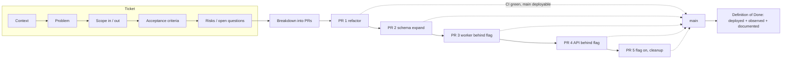

# Module 6.1 — العمل في فريق
## Working in a Team: tickets, scoping, branching, PR hygiene, commit messages, Definition of Done, async communication

> **المستوى:** Level 6 | **الموقع:** [1 من 9]
> **السابق:** [Checkpoint 5](../level-5-building-real-software/checkpoint-5.md) | **التالي:** [M6.2 — Code Review](module-6.2-code-review.md)

---

## 1. المتطلبات
> **قبل أن تتعلم هذا، يجب أن تفهم:**
- [ ] Git: فروع، rebase/merge، تاريخ نظيف، `git bisect` — [L1-M1.13](../level-1-programming/module-1.13-git-1.md), [L1-M1.14](../level-1-programming/module-1.14-git-2.md)
- [ ] قصص المستخدم ومعايير القبول (GWT) — [L4-M4.3](../level-4-software-engineering-foundations/module-4.3-user-stories-acceptance-criteria.md)
- [ ] التقدير وعدم اليقين — [L4-M4.4](../level-4-software-engineering-foundations/module-4.4-estimation.md)
- [ ] CI كبوّابة جودة، trunk-based development، Conventional Commits — [L5-M5.12](../level-5-building-real-software/module-5.12-ci-cd.md)
- [ ] الدين التقني وكيف يُسجَّل — [L4-M4.15](../level-4-software-engineering-foundations/module-4.15-tech-debt.md)

## 2. أهداف التعلّم
- تحويل طلب غامض إلى **تذكرة قابلة للتنفيذ**: سياق، مشكلة، نطاق داخل/خارج، معايير قبول، خطة اختبار، مخاطر — وكتابة **Definition of Done** يوافق عليه الفريق.
- تقسيم عمل أسبوع إلى **PRs صغيرة قابلة للمراجعة** (< ~400 سطر، فكرة واحدة لكل PR) بترتيب يسمح بالدمج تدريجيًا دون كسر `main`.
- كتابة **رسائل commit** تشرح *لماذا* لا *ماذا*، وفق Conventional Commits، وفرض ذلك آليًا في CI.
- فهم إستراتيجيات التفريع (trunk-based / GitHub flow / Git flow) ومتى يناسب كلٌّ منها، ولماذا الفروع الطويلة باهظة.
- ممارسة **التواصل غير المتزامن**: تحديث حالة يُقرأ في 30 ثانية، طلب مساعدة بصيغة *"جرّبت / أتوقّع / حصلت / أحتاج"*، وتوثيق القرارات حيث يجدها اللاحقون.

---

## 3. شرح للمبتدئ

### من "أنا وكودي" إلى "نحن ونظامنا"
حتى الآن كنتَ المؤلّف والمراجع والمشغّل. في فريق، كل سطر تكتبه له **ثلاثة قرّاء على الأقل**: المراجع اليوم، الزميل الذي يصحّح عطلًا فيه بعد سنة، وأنت نفسك بعد ستة أشهر وقد نسيت. الهندسة الاحترافية هي **تقليل كلفة هؤلاء القرّاء**: تذكرة واضحة توفّر اجتماعًا، PR صغير يوفّر يومًا من المراجعة، رسالة commit جيّدة توفّر ساعة من `git blame` الحائر.

### وحدة العمل: التذكرة (Ticket / Issue)
التذكرة ليست "اعمل X". التذكرة الجيدة تجيب خمسة أسئلة قبل أن يُكتب سطر:
1. **السياق:** لماذا الآن؟ من طلب؟ ما الذي يحدث اليوم؟
2. **المشكلة:** بصيغة المستخدم لا الحلّ ("العميل لا يعرف أن طلبه شُحن" وليس "أضف إشعار بريد").
3. **النطاق:** ماذا **داخل** وماذا **خارج** صراحةً. الخارج أهمّ من الداخل لأنه يمنع التمدّد (scope creep).
4. **معايير القبول:** Given/When/Then قابلة للاختبار (L4-M4.3).
5. **المخاطر والأسئلة المفتوحة:** ما لا نعرفه بعد ومن يجيب.

> **النموذج الذهني:** التذكرة = **عقد صغير** بين من يطلب ومن ينفّذ ومن يراجع. عقد غامض = نزاع عند التسليم.

### Definition of Done (DoD)
"انتهيت" كلمة خطرة. هل تعني "الكود يعمل على جهازي"؟ "PR مفتوح"؟ "مدمج"؟ "في الإنتاج ومُراقَب"؟ الفريق يتفق **مرة واحدة** على قائمة DoD وتُطبَّق على كل تذكرة:

```
Definition of Done (مثال فريق Project 6)
[ ] معايير القبول كلها تمرّ باختبارات آلية (unit + integration حيث يلزم)
[ ] لا تراجع في التغطية على الملفات المُعدَّلة؛ types/lint/audit خضراء
[ ] راجعه شخص واحد على الأقل من غير المؤلّف، وكل التعليقات محلولة
[ ] التوثيق المتأثّر محدَّث (README / OpenAPI / runbook)
[ ] الهجرة متوافقة N/N-1 ومُجرَّبة على نسخة من بيانات staging
[ ] feature flag إن كانت الميزة غير مكتملة للمستخدم
[ ] مقياس/سجل يسمح بمعرفة أنها تعمل في الإنتاج (M6.6)
[ ] نُشر إلى staging ومرّ smoke test
```

### تقسيم العمل: PRs صغيرة
أكبر خطأ للمبتدئ في الفريق: PR واحد من 2,000 سطر بعد أسبوع صمت. النتيجة: المراجع يؤجّله، ثم يراجعه سطحيًا ("LGTM")، ثم يُدمج بأخطاء. القاعدة التجريبية: **< 400 سطر، فكرة واحدة، عنوان يُلخَّص في جملة**. ولتقسيم ميزة كبيرة إلى PRs قابلة للدمج تباعًا دون كسر `main`:

```
الميزة: "تصدير الطلبات CSV" (Project 6)
PR 1  refactor: استخراج OrderQuery من handler (بلا تغيير سلوك) ← يُدمج اليوم
PR 2  feat(db): جدول exports + هجرة expand            ← يُدمج غدًا (لا أحد يستخدمه بعد)
PR 3  feat(worker): وظيفة export + كتابة إلى S3        ← خلف flag
PR 4  feat(api): POST /v1/exports + GET /v1/exports/:id ← خلف flag
PR 5  chore: تفعيل flag لـ 5% ثم 100%؛ حذف الـ flag لاحقًا
```
كل PR **يمرّ CI وحده** و`main` قابل للنشر بعد كل دمج. هذا هو جوهر **trunk-based development** (L5-M5.12).

### رسائل commit: اكتب "لماذا"
الـ diff يُظهر *ماذا* تغيّر. ما لا يُظهره: *لماذا*، *ما البدائل المرفوضة*، *ما الذي قد ينكسر*. بنية Conventional Commits:

```
<type>(<scope>)!: <summary في ≤ 72 حرفًا، صيغة أمر، بلا نقطة>

<body: لماذا؟ ما السياق؟ ما البديل المرفوض؟ (ملفوف عند 72)>

<footer: BREAKING CHANGE: … | Refs: #123 | Co-authored-by: …>
```
- `type`: `feat`, `fix`, `refactor`, `perf`, `test`, `docs`, `build`, `ci`, `chore`.
- `!` أو `BREAKING CHANGE:` = major في SemVer (L5-M5.12).

```
fix(sessions): rotate session id on privilege change

Previously the same sid survived role elevation, so a fixated session
(see threat T-07 in threat-model.md) kept admin rights. Rotation on
every role change closes it; logout-all is a separate ticket (#412).

Refs: #398
```

### إستراتيجيات التفريع
| الإستراتيجية | الشكل | متى |
|---|---|---|
| **Trunk-based** | فروع ≤ يومين → `main` محمي؛ flags للميزات غير المكتملة | الافتراضي الحديث؛ CI/CD قوي |
| **GitHub flow** | فرع لكل ميزة → PR → `main` → نشر | فرق صغيرة/متوسطة؛ عمليًا نفس السابق بفروع أطول قليلًا |
| **Git flow** | `develop` + `release/*` + `hotfix/*` + `main` | منتجات بإصدارات مُرقَّمة تُشحن للعملاء (desktop/mobile/on-prem) |

الفرع الطويل باهظ لأنّ **كلفة الدمج تنمو مع الزمن تربيعيًا تقريبًا**: كل يوم يبتعد فيه فرعك عن `main` تزيد التعارضات واحتمال كسر افتراض غيّره غيرك. `git rebase main` يوميًا يدفع الكلفة على أقساط صغيرة.

### التواصل غير المتزامن (async)
الفريق الموزَّع (أو حتى في مكتب واحد) يعمل بالكتابة. ثلاث صيغ تُنقذ وقت الجميع:
- **تحديث حالة** (يومي أو في التذكرة): `أنجزت / التالي / معوّقات` في ≤ 4 أسطر.
- **طلب مساعدة**: *"أحاول X. جرّبت A وB. أتوقّع Y وأحصل على Z (سجل/رسالة مرفقة). سؤالي المحدّد: …"* — هذا يحوّل "لا يعمل، ساعدوني" إلى شيء يُجاب عليه في دقيقتين.
- **قرار**: يُكتب حيث يُبحث عنه لاحقًا (التذكرة/ADR، M6.3) لا في دردشة تضيع.

### الاستلام والتسليم: الملكية
في الفريق "ليس كودي" عبارة محظورة. أنت تملك **النتيجة** التي التزمت بها: إن احتاجت تذكرتك تغييرًا في وحدة زميل، تُنسّق معه أو تفتح PR عليها بنفسك. وفي المقابل، **التوقّف عند الحدّ**: إن اكتشفت دينًا تقنيًا خارج نطاقك، سجّله تذكرةً (L4-M4.15) ولا تُصلحه داخل نفس الـ PR.

---

## 4. النموذج الذهني

```
             ┌──────────── حلقة عمل الفريق (كل تذكرة) ────────────┐
             │                                                     │
   طلب غامض ─▶ تذكرة (سياق/مشكلة/نطاق/AC/مخاطر) ─▶ تقسيم إلى PRs صغيرة
             │                                           │
             │        ┌──────────────────────────────────┘
             ▼        ▼
     فرع قصير ─▶ commits "لماذا" ─▶ PR (وصف + كيف أختبر + مخاطر) ─▶ مراجعة (M6.2)
             ▲                                                      │
             │  rebase يوميًا                                        ▼
             └──────────────  main دائمًا قابل للنشر  ◀── CI أخضر ── دمج
                                   │
                                   ▼
                       DoD: نُشر + مُراقَب + موثَّق + flag نظيف
```

قواعد الإبهام:
1. **اكتب قبل أن تبرمج**: تذكرة واضحة أرخص من إعادة كتابة.
2. **صغّر**: PR صغير يُراجَع اليوم؛ الكبير يُراجَع "لاحقًا" أي أبدًا.
3. **اشرح لماذا**: في commit وفي PR وفي القرار.
4. **ادمج يوميًا**: الفرع الطويل دين بفائدة مركّبة.
5. **لا مفاجآت**: المعوّق يُعلَن صباحًا لا عند الموعد.

---

## 5. الرسم التوضيحي



تدفّق الفرع مقابل الزمن (لماذا الفروع الطويلة مؤلمة):

```
main   ●──●──●──●──●──●──●──●──●──●──●──●──●──●──●──●
        \        \                                   \
فرع A    ●──●     ●──●  (rebase يوميًا: تعارضات صغيرة)  ●
                                                        \
فرع B    ●──●──●──●──●──●──●──●──●──●──●──●──●──●──●──●──X  (أسبوعان: دمج مؤلم، افتراضات تغيّرت)
```

---

## 6. مثال بسيط

طلب من مدير المنتج في الدردشة: *"ممكن نضيف تصدير للطلبات؟ عميل كبير طلبه."*

**تذكرة سيئة:** `عنوان: تصدير الطلبات. وصف: أضف زر تصدير.`

**تذكرة جيدة:**
```markdown
# EXP-1: تصدير طلبات المستأجر إلى CSV

## السياق
العميل Acme (12% من الإيراد) يُصدّر الطلبات يدويًا بالنسخ من الواجهة شهريًا لمحاسبته.
طلب ذلك مرتين في الربع الأخير؛ وعدناهم بالربع القادم.

## المشكلة (بصيغة المستخدم)
بصفتي مدير حسابات في مستأجر، أريد ملف CSV بكل طلبات فترة محدّدة
كي أستورده في نظام المحاسبة دون نسخ يدوي.

## النطاق
داخل:  POST /v1/exports {from,to} → وظيفة خلفية → ملف في S3 → رابط موقّع 15 دقيقة
       أعمدة: id, created_at, status, total_cents, currency, customer_email
       حدّ 100k صف لكل تصدير؛ UTF-8 مع BOM (Excel)
خارج:  جدولة دورية، XLSX، فلاتر غير التاريخ، تصدير عبر المستأجرين (admin)

## معايير القبول
- Given مستأجر بـ 3 طلبات في الفترة، When POST /v1/exports، Then 202 + id،
  وبعد اكتمال الوظيفة GET /v1/exports/:id يعيد status=done وurl صالحًا 15 دقيقة.
- Given مستأجر آخر، When GET /v1/exports/:id لتصدير ليس له، Then 404.
- Given فترة > 100k صف، Then 422 برسالة تطلب تضييق الفترة.
- Given فشل S3، Then الوظيفة تُعاد 3 مرات ثم status=failed وتنبيه.

## المخاطر / أسئلة مفتوحة
- PII في الملف (بريد العميل): مدة احتفاظ S3؟ ← اقتراح 24 ساعة، يؤكّده الأمن.
- حمل DB عند 100k صف: استعلام بمؤشّر + LIMIT، لا تحميل كامل في الذاكرة.

## خطة الاختبار
unit للمحوّل CSV (escaping, BOM)؛ integration للمسار الكامل مع S3 وهمي؛ اختبار سلبي للمستأجر.

## التقدير
~3 أيام (بثقة 70%)؛ المجهول: حدود الاحتفاظ بالـ PII.
```
لاحظ كيف أجبرتك كتابة التذكرة على اتخاذ قرارات (الحدّ، الأعمدة، الاحتفاظ) **قبل** الكود، وكيف أنّ "خارج النطاق" يمنع أسبوعًا إضافيًا من "وبالمناسبة، أضف XLSX".

---

## 7. مثال كود

أداتان صغيرتان يفرضهما CI: فاحص رسائل commit (Conventional Commits) وفاحص وصف PR (الأقسام الإلزامية). كلاهما بلا تبعيات، قابل للاختبار، ويُشغَّل في `.github/workflows/ci.yml` كبوّابة.

```typescript
// src/commit-message.ts
// فاحص Conventional Commits: يُعيد قائمة مشاكل (فارغة = صالح)؛ منطق خالص بلا I/O كي يُختبر.
export const TYPES = ["feat", "fix", "refactor", "perf", "test", "docs", "build", "ci", "chore", "revert"] as const;
export type CommitType = (typeof TYPES)[number];

export interface ParsedCommit {
  type: CommitType;
  scope?: string;
  breaking: boolean;
  summary: string;
  body: string;
  footers: Record<string, string>;
}

const HEADER = /^(?<type>[a-z]+)(?:\((?<scope>[a-z0-9][a-z0-9-]*)\))?(?<bang>!)?: (?<summary>.+)$/;

export function parseCommit(message: string): { ok: true; commit: ParsedCommit } | { ok: false; problems: string[] } {
  const problems: string[] = [];
  const [headerLine = "", ...rest] = message.trimEnd().split("\n");
  const m = HEADER.exec(headerLine);
  if (!m?.groups) {
    return { ok: false, problems: [`header must match "type(scope)!: summary", got: "${headerLine}"`] };
  }
  const { type, scope, bang, summary } = m.groups as { type: string; scope?: string; bang?: string; summary: string };
  if (!(TYPES as readonly string[]).includes(type)) problems.push(`unknown type "${type}" (allowed: ${TYPES.join(", ")})`);
  if (headerLine.length > 72) problems.push(`header is ${headerLine.length} chars (max 72)`);
  if (/[.!?]$/.test(summary)) problems.push("summary must not end with punctuation");
  if (/^[A-Z]/.test(summary)) problems.push("summary must start lowercase (imperative mood: add, fix, remove)");
  if (/^(added|fixed|removed|changed|updated)\b/i.test(summary)) problems.push("use imperative mood: 'add' not 'added'");

  // الجسم يبدأ بعد سطر فارغ؛ الـ footers أسطر "Key: value" أو "BREAKING CHANGE: …" في النهاية
  if (rest.length > 0 && rest[0] !== "") problems.push("blank line required between header and body");
  const bodyLines = rest.slice(1);
  const footers: Record<string, string> = {};
  const bodyOnly: string[] = [];
  for (const line of bodyLines) {
    const f = /^(?<key>BREAKING CHANGE|[A-Za-z-]+): (?<value>.+)$/.exec(line);
    if (f?.groups) footers[f.groups["key"]!] = f.groups["value"]!;
    else bodyOnly.push(line);
  }
  for (const line of bodyOnly) if (line.length > 100) problems.push(`body line exceeds 100 chars: "${line.slice(0, 30)}…"`);

  const breaking = bang === "!" || "BREAKING CHANGE" in footers;
  if (breaking && !footers["BREAKING CHANGE"]) problems.push("breaking change needs a 'BREAKING CHANGE: <what breaks and how to migrate>' footer");
  if ((type === "feat" || type === "fix") && bodyOnly.join("").trim() === "") problems.push(`${type} commits need a body explaining WHY`);

  if (problems.length > 0) return { ok: false, problems };
  return {
    ok: true,
    commit: { type: type as CommitType, ...(scope ? { scope } : {}), breaking, summary, body: bodyOnly.join("\n").trim(), footers },
  };
}
```

```typescript
// src/pr-description.ts
// فاحص وصف PR: الأقسام الإلزامية موجودة وغير فارغة، وحجم الـ diff ضمن الحدّ (أو مُبرَّر صراحةً).
export const REQUIRED_SECTIONS = ["## Why", "## What", "## How to test", "## Risks / rollback"] as const;

export interface PrInput {
  title: string;
  body: string;
  additions: number;
  deletions: number;
}

export function checkPr(pr: PrInput, maxLines = 400): string[] {
  const problems: string[] = [];
  if (pr.title.length > 72) problems.push("title > 72 chars");
  if (/\bWIP\b|\bDo not merge\b/i.test(pr.title)) problems.push("WIP PRs should be drafts, not titled WIP");

  for (const section of REQUIRED_SECTIONS) {
    const idx = pr.body.indexOf(section);
    if (idx === -1) {
      problems.push(`missing section "${section}"`);
      continue;
    }
    const after = pr.body.slice(idx + section.length);
    const content = after.split(/\n## /)[0]!.trim();
    if (content.length < 10) problems.push(`section "${section}" is empty`);
  }

  const size = pr.additions + pr.deletions;
  const justified = /## Size justification/.test(pr.body);
  if (size > maxLines && !justified) {
    problems.push(`diff is ${size} lines (> ${maxLines}); split it or add "## Size justification" (e.g. generated code, mass rename)`);
  }
  if (!/(#\d+|[A-Z]+-\d+)/.test(pr.title + pr.body)) problems.push("link the ticket (#123 or EXP-1)");
  return problems;
}
```

```typescript
// src/commit-message.test.ts
import { test } from "node:test";
import assert from "node:assert/strict";
import { parseCommit } from "./commit-message.ts";
import { checkPr } from "./pr-description.ts";

test("accepts a well-formed fix with body and ref", () => {
  const r = parseCommit(["fix(sessions): rotate session id on privilege change", "", "Fixated sessions kept admin rights (T-07).", "", "Refs: #398"].join("\n"));
  assert.equal(r.ok, true);
  if (r.ok) {
    assert.equal(r.commit.type, "fix");
    assert.equal(r.commit.scope, "sessions");
    assert.equal(r.commit.footers["Refs"], "#398");
    assert.equal(r.commit.breaking, false);
  }
});

test("rejects past tense, punctuation, missing body", () => {
  const r = parseCommit("feat: Added export button.");
  assert.equal(r.ok, false);
  if (!r.ok) {
    assert.ok(r.problems.some((p) => p.includes("lowercase")));
    assert.ok(r.problems.some((p) => p.includes("punctuation")));
    assert.ok(r.problems.some((p) => p.includes("WHY")));
  }
});

test("breaking change requires migration footer", () => {
  const r = parseCommit("feat(api)!: drop v0 endpoints\n\nv0 had no auth.");
  assert.equal(r.ok, false);
  if (!r.ok) assert.ok(r.problems.some((p) => p.includes("BREAKING CHANGE")));
  const ok = parseCommit("feat(api)!: drop v0 endpoints\n\nv0 had no auth.\n\nBREAKING CHANGE: use /v1; see docs/migration-v1.md");
  assert.equal(ok.ok, true);
  if (ok.ok) assert.equal(ok.commit.breaking, true);
});

test("PR check: sections, size, ticket link", () => {
  const body = "## Why\nAcme needs CSV exports (EXP-1).\n\n## What\nAdds POST /v1/exports.\n\n## How to test\nnpm test; curl …\n\n## Risks / rollback\nBehind flag exports_v1; disable flag to roll back.";
  assert.deepEqual(checkPr({ title: "feat(exports): add POST /v1/exports", body, additions: 120, deletions: 10 }), []);
  const big = checkPr({ title: "feat: stuff", body: "## Why\n\n## What\nx", additions: 900, deletions: 300 });
  assert.ok(big.some((p) => p.includes("empty")));
  assert.ok(big.some((p) => p.includes("missing section")));
  assert.ok(big.some((p) => p.includes("split it")));
  assert.ok(big.some((p) => p.includes("link the ticket")));
});
```

```typescript
// src/check-commits.ts
// نقطة الدخول في CI: يفحص كل commits الفرع مقارنةً بـ main. يخرج بـ 1 عند أي مشكلة (بوّابة).
import { execFileSync } from "node:child_process";
import { pathToFileURL } from "node:url";
import { parseCommit } from "./commit-message.ts";

export function listCommitMessages(base = "origin/main"): string[] {
  // %B = الرسالة كاملة؛ فاصل غير قابل للالتباس بين الرسائل
  const out = execFileSync("git", ["log", `${base}..HEAD`, "--format=%B%x1e"], { encoding: "utf8" });
  return out.split("\x1e").map((s) => s.trim()).filter(Boolean);
}

if (import.meta.url === pathToFileURL(process.argv[1] ?? "").href) {
  let failed = 0;
  for (const msg of listCommitMessages(process.argv[2])) {
    const r = parseCommit(msg);
    if (!r.ok) {
      failed++;
      console.error(`✗ ${msg.split("\n")[0]}\n  - ${r.problems.join("\n  - ")}`);
    }
  }
  if (failed > 0) {
    console.error(`\n${failed} commit(s) violate the convention. Fix with: git rebase -i origin/main (reword)`);
    process.exit(1);
  }
  console.log("✓ all commits follow Conventional Commits");
}
```

```yaml
# .github/workflows/ci.yml (المقطع المضاف — بوّابتان جديدتان)
  conventions:
    runs-on: ubuntu-latest
    steps:
      - uses: actions/checkout@v4
        with: { fetch-depth: 0 }          # نحتاج التاريخ كاملًا لـ origin/main..HEAD
      - uses: actions/setup-node@v4
        with: { node-version: 22, cache: npm }
      - run: npm ci
      - run: node --import tsx scripts/check-commits.ts origin/main
      - name: PR description
        if: github.event_name == 'pull_request'
        env: { PR_JSON: ${{ toJSON(github.event.pull_request) }} }
        run: node --import tsx scripts/check-pr.ts   # يقرأ title/body/additions/deletions من PR_JSON ويستدعي checkPr
```

```bash
# سير العمل اليومي للمهندس في الفريق (Project 6)
git switch main && git pull --ff-only
git switch -c exp-1/extract-order-query          # فرع قصير باسم التذكرة + الفكرة
# … عمل صغير …
git add -p                                        # راجع ما تُضيفه قطعةً قطعة
git commit                                        # محرّر: header + body "لماذا"
git fetch origin && git rebase origin/main        # يوميًا: ادفع كلفة الدمج على أقساط
node --import tsx scripts/check-commits.ts origin/main
git push -u origin HEAD
gh pr create --fill --draft                       # draft حتى يكتمل؛ ثم "ready for review"
```

---

## 8. مثال من العالم الحقيقي
فريق من 6 مهندسين يشكو أن "المراجعة بطيئة": متوسط عمر PR 4 أيام. القياس يكشف أنّ متوسط حجم PR 1,100 سطر، و40% منها بعنوان من كلمتين ("fix stuff") وبلا وصف. بعد شهر من قاعدتين فقط — حدّ 400 سطر مع قالب PR إلزامي (Why/What/How to test/Risks) — انخفض العمر إلى 9 ساعات، وارتفع عدد التعليقات الجوهرية (لا الشكلية) للـ PR الواحد ثلاث مرات، لأنّ المراجع يستطيع أخيرًا **فهم** ما يراجعه. لم يتغيّر عدد المهندسين ولا أدواتهم؛ تغيّرت وحدة العمل.

## 9. مثال من الإنتاج
حادثة: نشر كسر تسجيل الدخول لمدة 35 دقيقة. التحقيق (`git bisect`، L1-M1.14) أوصل إلى commit بعنوان `misc fixes` داخل PR من 1,800 سطر عنوانه "sprint 14 work". الـ commit غيّر ترتيب middleware كأثر جانبي لإعادة تسمية. لا أحد يستطيع تحديد *لماذا* غُيِّر الترتيب، ولا إن كان مقصودًا؛ المؤلّف في إجازة. التراجع عن الـ PR كاملًا يُرجع أسبوع عمل لخمسة أشخاص. الدرس في الـ postmortem (M6.7): الـ PR الصغير برسائل "لماذا" ليس أناقة؛ هو **حدّ نصف قطر الانفجار** عند التراجع، وهو ما يجعل `git revert` لـ commit واحد ممكنًا بدلًا من إعادة أسبوع.

---

## 10. مفاهيم خاطئة شائعة
1. **"التذكرة بيروقراطية؛ المهندس الجيّد يفهم من جملة."** الجملة تُفهم بعشر طرق؛ التذكرة تختار واحدة **قبل** أن يكلّف الاختلاف أسبوعًا.
2. **"PR كبير = إنتاجية عالية."** الإنتاجية تُقاس بما **دُمج ونُشر وعمل**؛ PR كبير معلّق إنتاجية صفر مع مخاطر.
3. **"الـ squash merge يُغني عن رسائل commit جيّدة."** رسالة الـ squash تُؤخذ من PR؛ إن كان وصفه فارغًا ضاع "لماذا" إلى الأبد.
4. **"Git flow هو الطريقة الاحترافية."** هو الطريقة المناسبة **لإصدارات مُرقَّمة تُشحن**؛ لخدمة ويب تُنشر يوميًا هو عبء بلا فائدة.
5. **"لا أسأل كي لا أبدو ضعيفًا."** الساعة الضائعة في الصمت تكلّف الفريق أكثر من سؤال مصاغ جيّدًا؛ القاعدة: 30 دقيقة عالق بجدّ → اسأل بصيغة §3.
6. **"Done = الكود مدمج."** Done كما يُعرّفه الفريق؛ عادةً **يعمل في الإنتاج ويمكن ملاحظته**.

## 11. أخطاء شائعة
1. البدء بالكود قبل الاتفاق على معايير القبول → "ليس ما طلبته" عند التسليم.
2. خلط refactor مع تغيير سلوك في PR واحد → المراجع لا يستطيع التمييز بين "نقل" و"غيّر".
3. commits من نوع `wip`, `fix`, `fix2`, `really fix` تُدفع كما هي → `git rebase -i` قبل الـ PR لتنظيف القصة.
4. فرع يعيش أسبوعين بلا rebase → يوم دمج كامل وتعارضات في ملفات لم تلمسها.
5. إصلاح "أشياء رأيتها بالمرور" داخل PR الميزة → نطاق متضخّم ومراجعة أصعب؛ افتح تذكرة.
6. حلّ تعليقات المراجعة بـ `force push` يمحو السياق → استخدم commits إضافية أثناء المراجعة، ونظّف قبل الدمج (أو squash عند الدمج).
7. القرارات في الدردشة فقط → بعد شهر "لماذا فعلنا هذا؟" بلا جواب.
8. تذكرة بلا "خارج النطاق" → كل مراجعة تُضيف طلبًا، ولا تُغلق أبدًا.

## 12. تمرين تصحيح
`main` مكسور منذ الصباح: اختبار `sessions.test.ts` يفشل في CI، ولا أحد يعترف بتغيير الجلسات. ثلاثة PRs دُمجت ليلًا.
1. **دليل:** `git log --oneline origin/main -10` يُظهر 3 دمجات؛ CI لكل PR كان أخضر **قبل** الدمج.
2. **فرضية:** كل PR اختُبر على `main` قديم؛ اثنان منها متوافقان منفردين ومتعارضان دلاليًا معًا (PR A غيّر مدة الجلسة الافتراضية، PR B أضاف اختبارًا يفترض القديمة) — تعارض لا يكشفه Git لأنه ليس في نفس الأسطر.
3. **تجربة:** `git bisect start HEAD origin/main~3` مع `git bisect run npm test -- sessions` → يحدّد دمج B؛ ثم تشغيل اختبار B على A وحده يمرّ، وعلى A+B يفشل.
4. **الإصلاح:** `git revert -m 1 <merge B>` فورًا (استعادة `main` أخضر أولوية على التحقيق)؛ ثم إصلاح B على rebase حديث. وقائيًا: **merge queue** / "require branches to be up to date before merging" في حماية الفرع، كي يُشغَّل CI على `main` + PR معًا.
5. **أين أيضًا؟** أي قاعدة تُفحَص على الفرع لا على نتيجة الدمج: الهجرات (ترقيم متعارض)، ملفات القفل، snapshot tests.

## 13. تمرين معماري
صمّم "عقد العمل" لفريق Project 6 من 5 مهندسين ينشرون يوميًا: (1) قالب تذكرة بالأقسام الخمسة ومثال مكتمل لميزة "إلغاء الطلب"؛ (2) **Definition of Done** من ≤ 8 بنود مع تبرير كل بند بمخاطرة يمنعها؛ (3) إستراتيجية التفريع واختيارها بصيغة Assumption/Constraint/Tradeoff/Risk/Recommendation (M6.4)؛ (4) حماية `main`: الفحوص الإلزامية، عدد المراجعين، merge queue، من يملك حقّ التجاوز ومتى؛ (5) تقسيم ميزة "إلغاء الطلب مع استرداد" إلى ≤ 6 PRs قابلة للدمج تباعًا مع تحديد أيها خلف flag؛ (6) قواعد التواصل: ما يُكتب في التذكرة، ما في PR، ما في ADR، ما في الدردشة، وSLA للردّ على طلب مراجعة.

## 14. الصلة بعصر AI
AI يكتب كودًا أسرع مما يراجعه الفريق؛ عنق الزجاجة انتقل من الكتابة إلى **التذكرة والمراجعة**. تذكرة جيدة (سياق/نطاق/AC) هي حرفيًا **أفضل prompt** للوكيل (L8-M8.5) وأفضل عقد للبشر معًا. وقاعدة الـ PR الصغير تصبح أهمّ لا أقلّ: PR من 2,000 سطر ولّده وكيل في دقيقة يحتاج نفس ساعات المراجعة البشرية، والمخاطر أعلى لأن لا أحد "عاش" الكود. اطلب من الوكيل الالتزام بالتقسيم §3 (PRs مرتّبة قابلة للدمج) ورسائل commit بصيغة "لماذا"، وارفض "sprint work" آليًا بالبوّابات §7.

## 15. ما يجب إتقانه (Must Master) 🔴
- 🔴 التذكرة بأقسامها الخمسة وخاصة "خارج النطاق"؛ Definition of Done متفق عليه؛ PRs صغيرة بفكرة واحدة وتقسيم ميزة إلى سلسلة قابلة للدمج؛ Conventional Commits مع جسم "لماذا"؛ rebase يومي وmain قابل للنشر دائمًا؛ صيغة طلب المساعدة "جرّبت/أتوقّع/حصلت/أحتاج".

## 16. ما يجب فهمه (Should Understand) 🟠
- 🟠 merge queue وup-to-date rule؛ `git bisect run`؛ `git revert -m 1`؛ متى Git flow؛ إدارة الـ flags وتنظيفها؛ قياس عمر PR وحجمه كمؤشّرات صحّة.

## 17. ما يمكن تأجيله (Can Defer) ⚪
- ⚪ أدوات إدارة المشاريع (Jira/Linear) وتخصيصاتها؛ monorepo tooling وCODEOWNERS المتقدّم؛ stacked PRs tooling؛ طقوس Scrum التفصيلية.

## 18. الخلاصة
1. كل سطر له ثلاثة قرّاء؛ الاحتراف هو تقليل كلفتهم.
2. التذكرة عقد: سياق، مشكلة، نطاق (خاصة الخارج)، معايير قبول، مخاطر — قبل الكود.
3. PR صغير بفكرة واحدة يُراجَع اليوم ويُرجَع وحده؛ الكبير لا يُراجَع ولا يُرجَع.
4. commit يشرح "لماذا"؛ الـ diff يشرح "ماذا". افرض الاتفاقية آليًا.
5. ادمج يوميًا على `main` محمي قابل للنشر؛ الفرع الطويل دين بفائدة مركّبة.
6. Done ليس "على جهازي"؛ Done ما اتفق عليه الفريق، وعادةً "في الإنتاج ومُراقَب".

## 19. مراجع رسمية
- Conventional Commits 1.0.0: https://www.conventionalcommits.org/en/v1.0.0/
- Trunk Based Development: https://trunkbaseddevelopment.com/
- GitHub Docs — About pull requests, draft PRs, merge queue: https://docs.github.com/en/pull-requests
- GitHub Docs — About protected branches: https://docs.github.com/en/repositories/configuring-branches-and-merges-in-your-repository/managing-protected-branches/about-protected-branches
- Git — `git rebase`, `git bisect`, `git revert`: https://git-scm.com/docs
- Google Engineering Practices — Small CLs: https://google.github.io/eng-practices/review/developer/small-cls.html
- Scrum Guide — Definition of Done: https://scrumguides.org/scrum-guide.html

## المصطلحات
| العربية | English |
|---|---|
| تذكرة / مسألة | Ticket / Issue |
| النطاق (داخل/خارج) | Scope (in / out) |
| تمدّد النطاق | Scope creep |
| تعريف الإنجاز | Definition of Done (DoD) |
| طلب دمج | Pull Request (PR) |
| PR مسودّة | Draft PR |
| حجم الـ PR | PR size |
| رسائل commit الاصطلاحية | Conventional Commits |
| تغيير كاسر | Breaking change |
| التطوير على الفرع الرئيسي | Trunk-based development |
| فرع طويل العمر | Long-lived branch |
| إعادة الأساس | Rebase |
| طابور الدمج | Merge queue |
| فرع محمي | Protected branch |
| التراجع عن دمج | Revert a merge |
| تواصل غير متزامن | Async communication |
| تحديث الحالة | Status update |
| ملكية النتيجة | Ownership |
