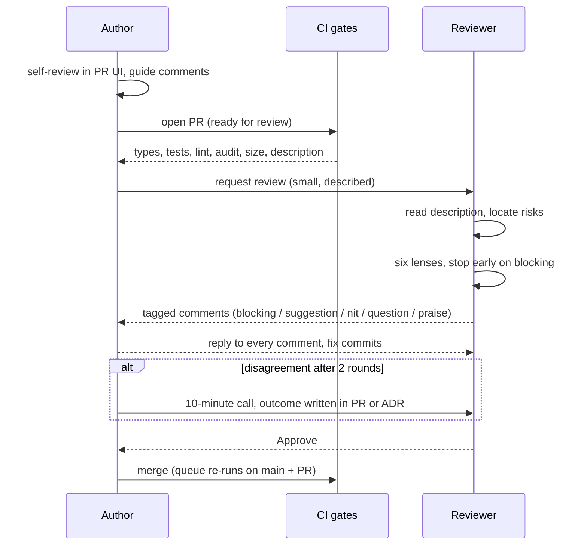

# Module 6.2 — مراجعة الكود
## Code Review: reviewer mindset, the six-lens checklist, comment tone, the author's side, flawed-code challenges with senior reviews

> **المستوى:** Level 6 | **الموقع:** [2 من 9]
> **السابق:** [M6.1 — Working in a Team](module-6.1-working-in-a-team.md) | **التالي:** [M6.3 — Design Review, RFCs, ADRs](module-6.3-design-review-rfc-adr.md)

---

## 1. المتطلبات
- [ ] PRs صغيرة، وصف PR، Definition of Done — [M6.1](module-6.1-working-in-a-team.md)
- [ ] الكود النظيف، التسمية، الدوال الصغيرة — [L4-M4.10](../level-4-software-engineering-foundations/module-4.10-clean-code.md)
- [ ] الاختبارات: ماذا يُختبر وما قيمة الاختبار — [L4-M4.11](../level-4-software-engineering-foundations/module-4.11-testing.md)
- [ ] الاقتران والتماسك، SOLID كأدوات تقييم لا طقوس — [L4-M4.7](../level-4-software-engineering-foundations/module-4.7-coupling-cohesion.md), [L4-M4.8](../level-4-software-engineering-foundations/module-4.8-solid.md)
- [ ] الأمن: التحقق عند الدخول، التفويض لكل مورد، الأسرار — [L5-M5.3](../level-5-building-real-software/module-5.3-authorization.md), [L5-M5.4](../level-5-building-real-software/module-5.4-security.md)
- [ ] سباقات منطق الأعمال والتحديث الذري — [L5-M5.6](../level-5-building-real-software/module-5.6-concurrency-business-logic.md)

## 2. أهداف التعلّم
- مراجعة PR بمنهجية **العدسات الست** بالترتيب: Correctness → Security → Performance → Architecture → Tests → Maintainability، وتخصيص الوقت حسب المخاطر لا حسب ترتيب الملفات.
- كتابة تعليقات **قابلة للتنفيذ** مسبوقة بوسم شدّة (`blocking:` / `suggestion:` / `nit:` / `question:` / `praise:`)، تنقد الكود لا الشخص، وتشرح "لماذا".
- التصرّف كمؤلّف: تهيئة الـ PR للمراجعة، الردّ على كل تعليق، معرفة متى تناقش ومتى تُسلّم، ومتى تنقل الخلاف إلى مكالمة أو ADR.
- اكتشاف **عيوب حقيقية** في كود يبدو سليمًا ويمرّ الاختبارات والـ types: سباق، تفويض ناقص، سلوك N+1، اختبار يختبر لا شيء.
- فهم ما **لا** تفعله المراجعة (ليست بديلًا عن CI ولا التصميم) وما يحقّقه الفريق منها فعلًا: نقل المعرفة وتوحيد المعايير وحدّ الأخطاء.

---

## 3. شرح للمبتدئ

### ما المراجعة أصلًا؟
مراجعة الكود هي **قراءة ناقدة لتغيير قبل أن يصبح جزءًا من النظام**، يقوم بها شخص غير المؤلّف. ثلاث فوائد بالترتيب الواقعي لأهميتها:
1. **نقل المعرفة**: بعد المراجعة يوجد شخصان يفهمان هذا الجزء (bus factor ≥ 2).
2. **توحيد المعايير**: الفريق يتقارب في الأسلوب والبنية دون اجتماعات.
3. **اصطياد الأخطاء**: خاصةً تلك التي لا يراها CI — المنطق، الأمن، التصميم.

> المفاجأة للمبتدئ: اصطياد الأخطاء ثالثًا لا أولًا. CI يصطاد الأخطاء النحوية والنوعية والمختبَرة؛ المراجع البشري يُهدر إن قضى وقته في ذلك. وقته الثمين لِما **لا يستطيع CI رؤيته**.

### عقلية المراجع
- **افترض حسن النيّة والكفاءة**؛ المراجعة ليست امتحانًا للمؤلّف بل حماية للنظام.
- **اقرأ الوصف أولًا** (Why/What/How to test/Risks من M6.1). إن لم تفهم الهدف لا تبدأ بالكود؛ اطلب وصفًا.
- **ابدأ من المخاطر**: الهجرة، التفويض، المسار الحرج، ثم الباقي. لا تبدأ أبجديًا بالملفات.
- **أسئلة أفضل من أوامر** حين لا تكون متأكّدًا: "ماذا يحدث لو وصل طلبان معًا؟" يفتح نقاشًا؛ "هذا سباق" قد يكون خطأً.
- **ميّز بين الذوق والمعيار**: "كنت سأسمّيها X" ذوق — اكتبه `nit:` أو لا تكتبه. "هذا يسمح لمستأجر برؤية بيانات غيره" معيار — `blocking:`.

### العدسات الست (بالترتيب)
```
1. Correctness    هل يفعل ما تقول معايير القبول؟ الحالات الحدّية؟ فشل الشبكة/DB؟ التزامن؟
2. Security       مدخلات مُتحقَّقة؟ تفويض لكل مورد؟ المستأجر في WHERE؟ أسرار؟ ترميز مخرجات؟
3. Performance    N+1؟ تحميل كامل في الذاكرة؟ فهرس للاستعلام الجديد؟ عمل متزامن ثقيل في event loop؟
4. Architecture   المسؤولية في الطبقة الصحيحة؟ اقتران جديد غير مبرّر؟ يكسر حدًّا موجودًا؟
5. Tests          تختبر السلوك لا التنفيذ؟ الحالة السلبية؟ هل تفشل لو حُذف الإصلاح؟
6. Maintainability تسمية، حجم، تعليقات "لماذا"، تكرار، سهولة الحذف لاحقًا
```
الترتيب مقصود: خطأ في 1–2 يُبطل أي نقاش في 6. وإن وجدت مشكلة `blocking` في 1 فقل ذلك مبكرًا بدل إضافة 30 `nit`.

### لغة التعليق: الوسم + السبب + الاقتراح
```
blocking: tenant_id غير موجود في WHERE هنا؛ مستأجر يمكنه قراءة تصدير غيره بتخمين id
          (راجع M5.3 §"IDOR"). اقتراح: مرّر actor.tenantId إلى الاستعلام وأضف الاختبار السلبي.

suggestion: يمكن استبدال الحلقة بـ UPDATE … WHERE id = ANY($1) لتجنّب 100 رحلة إلى DB.
            غير حاجز إن كان الحجم محدودًا بـ 10 — هل هو كذلك؟

question: لماذا 15 دقيقة للرابط الموقّع؟ إن كان قرارًا من التذكرة فأشر إليه في تعليق.

nit: `data` → `exportRow` (غير حاجز).

praise: اختبار السباق بـ Promise.all ممتاز — هذا بالضبط ما كان ينقصنا في وحدة الحجوزات.
```
- **الوسم** يُخبر المؤلّف فورًا ماذا يجب حلّه قبل الدمج.
- **السبب** يُعلّم ويمنع "لأني قلت".
- **الاقتراح** يُقصّر الدورة؛ لكن لا تُملِ التنفيذ إن كان للمؤلّف طريقة صحيحة أخرى.
- **الكود لا الشخص**: "هذه الدالة تتجاهل الخطأ" لا "أنت تجاهلت الخطأ".
- **الثناء المحدّد** يُرسّخ السلوك الجيّد في الفريق أكثر من النقد.

### الجانب الآخر: المؤلّف
- **راجع PR بنفسك أولًا** في واجهة المراجعة (لا في المحرّر): سترى نصف التعليقات قبل غيرك.
- **وجّه المراجع**: "ابدأ من `exports.service.ts`؛ الباقي تسمية". علّق على الأسطر الغريبة استباقيًا.
- **ردّ على كل تعليق**: نفّذ، أو اشرح لماذا لا، أو اسأل. "Done" + commit مُشار إليه.
- **لا تأخذها شخصيًا، ولا تُسلّم كل شيء**: إن اختلفت، قدّم السبب مرة بكتابة؛ إن استمرّ الخلاف → 10 دقائق مكالمة، لا 20 تعليقًا. وقرار معماري يخرج إلى ADR (M6.3).
- **قسّم عند الطلب**: إن قال المراجع "هذا PRان" فهو غالبًا محقّ.

### ما لا تفعله المراجعة
- ليست بديلًا عن CI: لا تراجع تنسيقًا ولا أخطاء types؛ أتمتها.
- ليست مراجعة تصميم: إن اكتشفت أن **النهج** خاطئ في PR من 400 سطر فقد تأخّر الاكتشاف؛ هذا دور design review (M6.3) **قبل** الكود.
- ليست ضمانًا: المراجع يفوّت أشياء؛ لذلك توجد الاختبارات والمراقبة والتراجع (M6.6, M6.7).

### معايير الوقت
- ردّ أوّلي خلال **يوم عمل** (الأفضل: ساعات). PR معلّق يجمّد زميلًا.
- جلسة مراجعة ≤ **60 دقيقة** و≤ **400 سطر**؛ بعدها تهبط دقّة الاكتشاف حادًّا.
- "LGTM" على PR جوهري خلال دقيقتين إشارة إلى أن المراجعة لم تحدث.

---

## 4. النموذج الذهني

```
                        قبل القراءة
               اقرأ الوصف → افهم الهدف → حدّد المخاطر
                               │
                               ▼
     ┌─────── العدسات الست (توقّف مبكرًا عند blocking) ────────┐
     │ 1 Correctness → 2 Security → 3 Performance →              │
     │ 4 Architecture → 5 Tests → 6 Maintainability              │
     └────────────────────────────────────────────────────────────┘
                               │
                               ▼
      تعليق = [وسم] + [السبب] + [اقتراح/سؤال]      (كود لا شخص)
                               │
                               ▼
         قرار: Approve | Request changes | Comment (بلا قرار)
                               │
      المؤلّف: ردّ على الكل → نفّذ/ناقش/اسأل → مكالمة بعد جولتين
```

مصفوفة "أين يذهب وقت المراجع":
```
                 يراه CI؟      يراه المراجع؟
تنسيق/أنواع        ✔ (أتمت)       ✘ لا تُهدر وقتك
اختبار ناقص        جزئيًا          ✔ "هل يفشل لو حُذف الإصلاح؟"
منطق/حالات حدّية   ✘              ✔✔ العدسة 1
تفويض/أمن          ✘              ✔✔ العدسة 2
تصميم/اقتران       ✘              ✔ (الأفضل قبل الكود)
```

---

## 5. الرسم التوضيحي



---

## 6. مثال بسيط

PR من 40 سطرًا: "fix: prevent negative quantities". المراجع المبتدئ يكتب 6 تعليقات تسمية ويوافق. المراجع المتمرّس يقرأ الوصف ("المستخدم أدخل −3 فصارت المخزون أكبر")، ثم يسأل بالعدسة 1: **أين** يُمنع السالب؟ يجد `if (qty < 0) throw` في handler الواجهة فقط. تعليقه الوحيد الحاجز:

```
blocking: الفحص في HTTP handler يحمي مسارًا واحدًا؛ الوظيفة الخلفية لاستيراد CSV
تستدعي OrderService.addItem مباشرة وتتجاوزه. اقتراح: القاعدة في النطاق
(addItem يرفض qty <= 0) + قيد CHECK (quantity > 0) في DB كخطّ أخير، والاختبار
على الخدمة لا على الـ handler. راجع L5-M5.6 §"القيد كحَكَم".
```
ثم `question: هل نحتاج تنظيف البيانات الحالية التي أصبحت سالبة؟ (تذكرة منفصلة؟)`. تعليقان، وكلاهما يغيّر النتيجة.

---

## 7. مثال كود — ثلاثة تحدّيات "كود معيب" مع مراجعة كبير مهندسين

كل تحدٍّ: كود **يُترجم ويمرّ اختباراته**. راجعه بالعدسات الست واكتب تعليقاتك قبل فتح المراجعة.

### التحدّي 1 — إلغاء طلب واسترداد

```typescript
// src/challenge-1-cancel.ts
// PR: "feat(orders): allow customers to cancel orders" — اقرأه كمراجع قبل فتح الحلّ.
export type OrderStatus = "pending" | "paid" | "shipped" | "cancelled";
export interface Order { id: string; tenantId: string; customerId: string; status: OrderStatus; totalCents: number }
export interface Actor { userId: string; tenantId: string; role: "customer" | "support" | "admin" }

export interface OrderRepo {
  findById(id: string): Promise<Order | null>;
  save(order: Order): Promise<void>;
}
export interface Payments { refund(orderId: string, amountCents: number): Promise<void> }

export class CancelOrder {
  constructor(private readonly orders: OrderRepo, private readonly payments: Payments) {}

  async execute(actor: Actor, orderId: string): Promise<Order> {
    const order = await this.orders.findById(orderId);
    if (!order) throw new Error("not found");
    if (order.status === "shipped") throw new Error("cannot cancel shipped order");
    if (order.status === "paid") {
      await this.payments.refund(order.id, order.totalCents);
    }
    order.status = "cancelled";
    await this.orders.save(order);
    console.log(`order ${orderId} cancelled by ${actor.userId}`);
    return order;
  }
}
```

<details>
<summary>مراجعة كبير المهندسين — التحدّي 1</summary>

```
blocking (Security): لا تفويض إطلاقًا. actor يُستخدم للتسجيل فقط. أي مستخدم مصادَق يلغي
  أي طلب في أي مستأجر بتخمين id (IDOR, M5.3/M5.4). مطلوب: order.tenantId === actor.tenantId
  وإلا 404 (إخفاء)، ثم customer يلغي طلبه فقط؛ support/admin حسب سياسة can().

blocking (Correctness/Concurrency): اقرأ → قرّر → اكتب على status بلا شرط. طلبان متزامنان
  (نقرة مزدوجة) → استرداد مزدوج. مطلوب تحديث ذري:
  UPDATE orders SET status='cancelled' WHERE id=$1 AND tenant_id=$2 AND status IN ('pending','paid')
  RETURNING *; وrowCount=0 → 409. الاسترداد بعد نجاح الانتقال، idempotent بمفتاح orderId (M5.6, M5.9).

blocking (Correctness): ترتيب الأثر الجانبي خاطئ: refund أولًا ثم save؛ إن فشل save بعد refund
  → مال مُعاد وطلب "paid". الصحيح: انتقال الحالة أولًا (DB)، ثم الاسترداد كوظيفة outbox
  مع إعادة محاولة؛ أو حالة وسيطة 'refund_pending'.

suggestion (Correctness): cancelled → cancel مرة أخرى يمرّ بصمت ويُعيد 200 (ولو كان paid سابقًا
  لا نعرف). اجعل الانتقالات صريحة: جدول حالات مسموح بها.

suggestion (Architecture): Error("not found") نصّي؛ استخدم أخطاء النطاق (NotFound/Conflict/Forbidden)
  التي يحوّلها الـ handler إلى Problem Details (M5.1).

nit: console.log → المسجّل المهيكل مع requestId (M6.6)؛ وحدث audit (من/ماذا/قبل/بعد).

tests: الاختبارات الموجودة تختبر "pending → cancelled" فقط. مطلوب: مستأجر آخر → 404،
  customer على طلب غيره → 404، نقرتان متزامنتان → استرداد واحد، فشل refund → الحالة متسقة.
```
</details>

### التحدّي 2 — تقرير يومي للمبيعات

```typescript
// src/challenge-2-report.ts
// PR: "feat(reports): daily sales summary endpoint"
export interface Db {
  query<T>(sql: string, params?: unknown[]): Promise<T[]>;
}
interface OrderRow { id: string; customer_id: string; total_cents: number }
interface CustomerRow { id: string; email: string }

export async function dailySales(db: Db, tenantId: string, day: string) {
  const orders = await db.query<OrderRow>(
    `SELECT id, customer_id, total_cents FROM orders WHERE tenant_id = $1 AND created_at::date = $2`,
    [tenantId, day],
  );
  const rows = [];
  for (const o of orders) {
    const [customer] = await db.query<CustomerRow>(`SELECT id, email FROM customers WHERE id = $1`, [o.customer_id]);
    rows.push({ orderId: o.id, email: customer?.email ?? "unknown", total: o.total_cents / 100 });
  }
  const total = rows.reduce((s, r) => s + r.total, 0);
  return { day, count: rows.length, total, rows };
}
```

<details>
<summary>مراجعة كبير المهندسين — التحدّي 2</summary>

```
blocking (Performance): N+1 — استعلام عملاء لكل طلب. يوم بـ 5,000 طلب = 5,001 رحلة إلى DB
  داخل طلب HTTP واحد. JOIN واحد: SELECT o.id, c.email, o.total_cents FROM orders o
  JOIN customers c ON c.id = o.customer_id AND c.tenant_id = o.tenant_id WHERE …

blocking (Performance): created_at::date = $2 يُلغي الفهرس على created_at (دالّة على العمود).
  استخدم نطاقًا: created_at >= $2::date AND created_at < $2::date + 1 (M3.13).
  وأضف: ما المنطقة الزمنية لـ "اليوم"؟ المستأجر؟ UTC؟ هذا متطلب لا تفصيل (M4.2).

blocking (Correctness): total_cents / 100 ثم جمع بالأعداد العشرية → أخطاء تقريب (0.1+0.2).
  اجمع بالسنتات (integer) وحوّل عند العرض فقط (M1.1 الأعداد).

suggestion (Performance/Architecture): نقطة نهاية تقرير تُحمّل كل الصفوف في الذاكرة وتعيدها؛
  إن كان المطلوب ملخّصًا فاحسبه في SQL (COUNT, SUM) ولا تُعد الصفوف؛ وإن كان تفصيلًا فرقّم
  بمؤشّر أو حوّله إلى تصدير خلفي (M5.9). اسأل التذكرة: من يستهلك هذا؟

suggestion (Security): customers بلا tenant_id في WHERE؛ آمن اليوم لأن customer_id جاء من طلبات
  المستأجر، لكن الـ JOIN المشروط بالمستأجر يجعل الضمان صريحًا (دفاع في العمق).

nit: نوع الإرجاع ضمني؛ صرّح بـ interface DailySales لعقد الـ API.

tests: لا اختبار. المطلوب: اختبار تكامل بقاعدة حقيقية يفحص عدد الاستعلامات (≤ 2) والمجموع
  بالسنتات وحدود اليوم بمنطقة زمنية.
```
</details>

### التحدّي 3 — اختبار يختبر لا شيء

```typescript
// src/challenge-3-retry.ts
// PR: "fix(worker): retry transient email failures" + الاختبار المرفق. هل الاختبار يحمي الإصلاح؟
export async function withRetry<T>(fn: () => Promise<T>, attempts = 3, baseMs = 100): Promise<T> {
  let lastErr: unknown;
  for (let i = 0; i < attempts; i++) {
    try {
      return await fn();
    } catch (err) {
      lastErr = err;
      await new Promise((r) => setTimeout(r, baseMs * 2 ** i));
    }
  }
  throw lastErr;
}
```

```typescript
// src/challenge-3-retry.test.ts
import { test } from "node:test";
import assert from "node:assert/strict";
import { withRetry } from "./challenge-3-retry.ts";

test("retries transient failures", async () => {
  let calls = 0;
  const result = await withRetry(async () => {
    calls++;
    return "ok";
  }, 3, 0);
  assert.equal(result, "ok");
  assert.ok(calls >= 1);
});
```

<details>
<summary>مراجعة كبير المهندسين — التحدّي 3</summary>

```
blocking (Tests): الاختبار لا يفشل أبدًا: الدالّة لا تفشل أصلًا، وcalls >= 1 صحيح حتى بلا retry.
  احذف منطق الإعادة بالكامل وسيظلّ يمرّ. اختبار لا يستطيع الفشل ليس اختبارًا (M4.11).
  المطلوب: دالّة تفشل مرتين ثم تنجح → النتيجة ok وcalls === 3؛ تفشل دائمًا → يرمي آخر خطأ
  وcalls === attempts؛ خطأ دائم (مثلًا 4xx) → لا إعادة.

blocking (Correctness): يعيد المحاولة على كل خطأ — بما فيها الدائمة (عنوان بريد غير صالح، 401).
  يحتاج تصنيف transient/permanent (M5.9) أو معامل isRetryable.

suggestion (Correctness): ينام بعد المحاولة الأخيرة أيضًا قبل الرمي (انتظار بلا فائدة).
  وبلا jitter → عاصفة متزامنة عند تعافي الخدمة (M7.2). وبلا حدّ أعلى للنوم.

suggestion (Maintainability): المهلة الفعلية مع 3 محاولات وbase 100ms = 700ms+؛ وثّق ذلك،
  لأن المستدعي الذي له مهلة 500ms سيُلغى قبل أن تنتهي الإعادة.

praise: التراجع الأُسّي 2**i اختيار صحيح كنقطة بداية.
```
</details>

### الإصلاح المرجعي للتحدّي 3 (ما يجب أن يبدو عليه بعد المراجعة)

```typescript
// src/retry-fixed.ts
export interface RetryOptions {
  attempts?: number;
  baseMs?: number;
  maxMs?: number;
  isRetryable?: (err: unknown) => boolean;
  sleep?: (ms: number) => Promise<void>;
  random?: () => number;
}

export async function withRetry<T>(fn: () => Promise<T>, opts: RetryOptions = {}): Promise<T> {
  const attempts = opts.attempts ?? 3;
  const baseMs = opts.baseMs ?? 100;
  const maxMs = opts.maxMs ?? 5_000;
  const isRetryable = opts.isRetryable ?? (() => true);
  const sleep = opts.sleep ?? ((ms) => new Promise<void>((r) => setTimeout(r, ms)));
  const random = opts.random ?? Math.random;

  let lastErr: unknown;
  for (let attempt = 1; attempt <= attempts; attempt++) {
    try {
      return await fn();
    } catch (err) {
      lastErr = err;
      if (!isRetryable(err) || attempt === attempts) break;
      const exp = Math.min(maxMs, baseMs * 2 ** (attempt - 1));
      await sleep(Math.floor(random() * exp)); // full jitter
    }
  }
  throw lastErr;
}
```

```typescript
// src/retry-fixed.test.ts
import { test } from "node:test";
import assert from "node:assert/strict";
import { withRetry } from "./retry-fixed.ts";

class Transient extends Error {}
class Permanent extends Error {}
const noSleep = { sleep: async () => {}, random: () => 0.5 };

test("fails twice then succeeds: exactly 3 calls", async () => {
  let calls = 0;
  const r = await withRetry(async () => {
    calls++;
    if (calls < 3) throw new Transient("busy");
    return "ok";
  }, { attempts: 5, ...noSleep });
  assert.equal(r, "ok");
  assert.equal(calls, 3);
});

test("always failing: throws last error after `attempts` calls, no extra sleep", async () => {
  let calls = 0;
  const sleeps: number[] = [];
  await assert.rejects(
    withRetry(async () => {
      calls++;
      throw new Transient(`fail ${calls}`);
    }, { attempts: 3, baseMs: 100, sleep: async (ms) => { sleeps.push(ms); }, random: () => 1 }),
    /fail 3/,
  );
  assert.equal(calls, 3);
  assert.deepEqual(sleeps, [100, 200]); // لا نوم بعد المحاولة الأخيرة؛ تراجع أُسّي
});

test("permanent errors are not retried", async () => {
  let calls = 0;
  await assert.rejects(
    withRetry(async () => {
      calls++;
      throw new Permanent("invalid address");
    }, { attempts: 3, isRetryable: (e) => e instanceof Transient, ...noSleep }),
    /invalid address/,
  );
  assert.equal(calls, 1);
});

test("mutation check: a retry-less implementation would fail the first test", async () => {
  const noRetry = async <T>(fn: () => Promise<T>) => fn();
  let calls = 0;
  await assert.rejects(noRetry(async () => {
    calls++;
    if (calls < 3) throw new Transient("busy");
    return "ok";
  }));
});
```

```typescript
// src/challenge-1-cancel.test.ts
// اختبار سلبي للتحدّي 1 كما طلبته المراجعة — يُظهر الفجوة (يمرّ فقط بعد إصلاح التفويض).
import { test } from "node:test";
import assert from "node:assert/strict";
import { CancelOrder, type Order, type OrderRepo, type Payments } from "./challenge-1-cancel.ts";

function memRepo(seed: Order[]): OrderRepo & { saved: Order[] } {
  const byId = new Map(seed.map((o) => [o.id, { ...o }]));
  const saved: Order[] = [];
  return {
    saved,
    async findById(id) { const o = byId.get(id); return o ? { ...o } : null; },
    async save(o) { byId.set(o.id, { ...o }); saved.push({ ...o }); },
  };
}

test("documents the gap: another tenant can cancel the order (should be 404)", async () => {
  const repo = memRepo([{ id: "o1", tenantId: "t1", customerId: "c1", status: "paid", totalCents: 5000 }]);
  const refunds: number[] = [];
  const payments: Payments = { async refund(_id, amount) { refunds.push(amount); } };
  const uc = new CancelOrder(repo, payments);
  // الفاعل من مستأجر آخر — الكود الحالي يسمح. بعد الإصلاح يجب أن يرمي NotFound.
  const result = await uc.execute({ userId: "attacker", tenantId: "t2", role: "customer" }, "o1").catch((e: Error) => e);
  const leaked = !(result instanceof Error);
  assert.equal(leaked, true, "if this fails, the authorization fix landed: flip the assertion to expect NotFound");
  assert.deepEqual(refunds, [5000]);
});
```

---

## 8. مثال من العالم الحقيقي
شركة متوسطة قاست "ماذا يصطاد المراجعون فعلًا" على 3,000 تعليق: 58% تسمية/تنسيق، 25% أسئلة توضيح، 12% منطق، 3% أمن، 2% أداء. في الوقت نفسه كانت 70% من حوادث الإنتاج من فئة المنطق/الأمن/الأداء. القرار: أتمتة التنسيق والتسمية بالكامل (formatter + lint في CI، لا تعليق بشريًّا عليها)، وإلزام المراجع بكتابة سطر واحد في الموافقة: *"فحصتُ: التفويض / التزامن / N+1 / الاختبار السلبي"*. بعد ربع سنة انعكست النسب — 40% من التعليقات منطق وأمن — وانخفضت حوادث "كان يمكن للمراجعة أن تراها" إلى النصف. لم يتغيّر الوقت المُنفَق؛ تغيّر ما يُنفَق عليه.

## 9. مثال من الإنتاج
PR من مهندس كبير يغيّر `max` في pool الاتصالات من 10 إلى 50 "لتسريع الاستعلامات". مراجع أصغر سنًّا تردّد ثم كتب: `question: لدينا 8 نسخ × 50 = 400 اتصال، وmax_connections في RDS 200 (راجع M5.7). هل أفهم الحساب خطأً؟`. لم يكن مخطئًا؛ كان الـ PR سيُسقط DB عند النشر التالي. ثلاثة دروس: (1) المراجعة ليست تراتبية — الكود لا يعرف من كتبه؛ (2) صيغة السؤال المحدّد بالأرقام جعلت التراجع سهلًا لا محرجًا؛ (3) الفريق أضاف فحص CI: `replicas × pool.max < max_connections × 0.8` يقرأ القيم من التهيئة — تحويل درس بشري إلى بوّابة آلية (M5.12).

---

## 10. مفاهيم خاطئة شائعة
1. **"المراجعة هدفها اصطياد الأخطاء."** هدفها الأول نقل المعرفة وتوحيد المعايير؛ الأخطاء مكسب إضافي، والاختبارات والمراقبة تحمل العبء الأكبر.
2. **"كلما زادت التعليقات كانت المراجعة أعمق."** 30 nit وصفر فحص للتفويض = مراجعة سطحية مكلفة.
3. **"الموافقة تعني أنني أضمن الكود."** تعني "لا أرى مانعًا من الدمج ضمن ما فحصته"؛ قل ما فحصته.
4. **"المراجع يملك حقّ النقض على الذوق."** الذوق nit غير حاجز؛ المعيار المكتوب (style guide) هو ما يُفرض، ويُفرض آليًا.
5. **"كبير المهندسين لا يُراجَع."** الكود لا يعرف مؤلّفه؛ وكبار المهندسين يكتبون أخطر التغييرات.
6. **"إن مرّت الاختبارات فالمنطق صحيح."** الاختبار يثبت ما اختُبر فقط؛ التحدّي 3 يمرّ بلا منطق.

## 11. أخطاء شائعة
1. البدء بالملف الأول أبجديًا والنفاد قبل الوصول إلى الهجرة الخطرة في آخر القائمة.
2. تعليقات بلا وسم شدّة → المؤلّف لا يعرف ما يحجب الدمج فيُصلح الـ nits ويتجاهل الجوهري.
3. "هذا خطأ" بلا سبب ولا اقتراح → جولة إضافية كاملة لفهم المقصود.
4. إعادة تصميم الحلّ في تعليقات PR → التصميم كان يجب أن يُناقش قبل الكود (M6.3)؛ الآن: ادمج إن كان آمنًا وافتح ADR.
5. Approve مع تعليقات حاجزة ("LGTM بعد إصلاح التفويض") → يُدمج بلا إصلاح. استخدم Request changes.
6. المؤلّف يحلّ التعليقات بـ "Resolved" دون ردّ أو commit → المراجع لا يعرف ما تغيّر.
7. ترك PR بلا ردّ 3 أيام → المؤلّف يبدأ عملًا فوقه فيتضخّم؛ ردّ أوّلي خلال يوم حتى لو "سأراجع غدًا صباحًا".
8. مراجعة 1,500 سطر في جلسة واحدة → النصف الثاني لا يُقرأ فعليًا؛ اطلب التقسيم.

## 12. تمرين تصحيح
تمّت مراجعة PR "add export feature" من شخصين ودُمج؛ بعد يومين تنبيه: مستأجر حمّل ملف تصدير مستأجر آخر.
1. **دليل:** سجل الوصول يُظهر `GET /v1/exports/9f3…` من مستأجر `t2` → 200، بينما التصدير يخصّ `t1`. تعليقات المراجعة: 14 تعليقًا، 12 منها تسمية وتنسيق، 2 أسئلة عن BOM في CSV.
2. **فرضية:** `findExportById(id)` بلا `tenant_id` في WHERE؛ المراجعان قرآ الكود سطرًا سطرًا دون عدسة الأمن، ولم يسألا "ما الاختبار السلبي؟".
3. **تجربة:** استدعاء المسار بمستأجر آخر محليًا → 200؛ اختبارات الـ PR: لا اختبار عبر المستأجرين. `git log -S "findExportById"` يؤكّد أن الدالّة جديدة في هذا الـ PR.
4. **الإصلاح:** فوري: hotfix يُضيف `AND tenant_id = $2` + اختبار سلبي + إبطال الروابط الموقّعة الحالية + تقييم الأثر (من حمّل ماذا، إشعار). منهجي: قائمة مراجعة إلزامية في قالب PR (`[ ] tenant in every WHERE/INSERT`, `[ ] negative authz test`)، وفحص CI يرفض استعلامًا على جدول بـ `tenant_id` بلا شرط عليه (lint على SQL)، وRLS كخطّ أخير (M5.3).
5. **أين أيضًا؟** كل استعلام أُضيف في الشهر الأخير: `grep -n "WHERE id = \$1" src/**/*.ts` ومراجعة كل نتيجة بعدسة الأمن فقط.

## 13. تمرين معماري
صمّم "نظام المراجعة" لفريق Project 6: (1) قالب PR بقائمة فحص من ≤ 8 بنود مشتقة من حوادث حقيقية في L5 (تفويض، تزامن، N+1، هجرة N/N-1، مهلات، flag)؛ (2) قاعدة من يراجع ماذا (CODEOWNERS للهجرات والأمن والـ API العامة) وكم مراجعًا لكل فئة مخاطر؛ (3) ما يُؤتمت بالكامل (لا تعليق بشري عليه) وقائمة البوّابات؛ (4) SLA للردّ ولإغلاق المراجعة ومؤشّرات قياس (عمر PR، حجم، نسبة التعليقات الجوهرية)؛ (5) مسار الخلاف: جولتان → مكالمة → ADR → من يحسم؛ (6) كيف تُراجَع PRs التي ولّدها وكيل AI بشكل مختلف (M8.7): ما الذي يجب أن يصفه المؤلّف البشري قبل طلب المراجعة.

## 14. الصلة بعصر AI
مع الوكلاء تتحوّل المراجعة من "نشاط جانبي" إلى **الوظيفة الأساسية** للمهندس: الكود رخيص، الحكم عليه هو العمل (L8-M8.7). ثلاثة تغيّرات: (1) استخدم AI كمراجع أوّل — يصطاد N+1 والاستثناءات المبتلعة والأنماط المعروفة جيّدًا، ويفشل في التفويض السياقي ("هل يحقّ لـ support رؤية هذا؟") وفي "هل هذا ما طلبته التذكرة؟" — فابقَ أنت عدستَي 1 و2؛ (2) الكود المولَّد يبدو **واثقًا ونظيفًا** وهو أخطر من كود المبتدئ المرتبك، لأن النظافة تُخدّر المراجع — طبّق التحدّيات الثلاثة أعلاه حرفيًا: ابحث عن الاختبار الذي لا يستطيع الفشل؛ (3) اطلب من المؤلّف البشري أن يكتب في الـ PR ما **فهمه وتحقّق منه بنفسه** من كود الوكيل، لا ما ولّده.

## 15–17. Master / Understand / Defer
- 🔴 العدسات الست بالترتيب والتوقّف المبكر عند blocking؛ وسوم التعليقات ولغة الكود-لا-الشخص مع السبب والاقتراح؛ الأسئلة الثلاثة الدائمة: "ماذا لو وصل طلبان؟"، "أين المستأجر/التفويض؟"، "هل يفشل الاختبار لو حُذف الإصلاح؟"؛ Request changes مقابل Approve؛ آداب المؤلّف (self-review، ردّ على الكل، مكالمة بعد جولتين).
- 🟠 قياس المراجعة (عمر/حجم/نسبة الجوهري)؛ CODEOWNERS؛ أتمتة ما لا يستحق البشر؛ مراجعة الـ PR المولَّد بـ AI؛ mutation testing كفكرة ("هل يفشل الاختبار لو كسرت الكود؟").
- ⚪ أدوات مراجعة متقدّمة (stacked diffs, Gerrit)، تحليل ساكن مخصّص (semgrep rules) — ستعود في L8.

## 18. الخلاصة
1. المراجعة لنقل المعرفة وتوحيد المعايير أولًا؛ أتمت ما يستطيع CI رؤيته واصرف البشر على ما لا يراه.
2. اقرأ الوصف، حدّد المخاطر، ثم العدسات الست: صحّة → أمن → أداء → معمارية → اختبارات → صيانة.
3. تعليق = وسم شدّة + سبب + اقتراح؛ انقد الكود لا الشخص؛ امدح بتحديد.
4. كمؤلّف: راجع نفسك أولًا، وجّه المراجع، ردّ على كل شيء، ناقش مرة ثم تكلّم.
5. الكود النظيف الذي يمرّ الاختبارات قد يحمل IDOR وسباقًا وN+1 واختبارًا لا يفشل — ابحث عنها عمدًا.

## 19. مراجع رسمية
- Google Engineering Practices — Code Review Developer Guide: https://google.github.io/eng-practices/review/
- Conventional Comments (labels like blocking/nit/suggestion): https://conventionalcomments.org/
- GitHub Docs — Reviewing proposed changes in a pull request: https://docs.github.com/en/pull-requests/collaborating-with-pull-requests/reviewing-changes-in-pull-requests
- GitHub Docs — About code owners: https://docs.github.com/en/repositories/managing-your-repositorys-settings-and-features/customizing-your-repository/about-code-owners
- SmartBear — Best Kept Secrets of Peer Code Review (Cisco study: 200–400 LOC, ≤ 60 min): https://smartbear.com/learn/code-review/best-practices-for-peer-code-review/
- OWASP — Code Review Guide: https://owasp.org/www-project-code-review-guide/
- Stryker Mutator (mutation testing for JS/TS): https://stryker-mutator.io/

## المصطلحات
| العربية | English |
|---|---|
| مراجعة الكود | Code review |
| عقلية المراجع | Reviewer mindset |
| العدسات الست | Six review lenses |
| تعليق حاجز | Blocking comment |
| اقتراح / ملاحظة طفيفة | Suggestion / Nit |
| طلب تغييرات | Request changes |
| موافقة | Approve |
| المراجعة الذاتية | Self-review |
| عامل الحافلة | Bus factor |
| مرجع كائن مباشر غير آمن | IDOR |
| استعلامات N+1 | N+1 queries |
| اختبار لا يستطيع الفشل | Test that cannot fail |
| اختبار الطفرات | Mutation testing |
| مالكو الكود | CODEOWNERS |
| إرشادات الأسلوب | Style guide |
| أخطاء النطاق | Domain errors |
