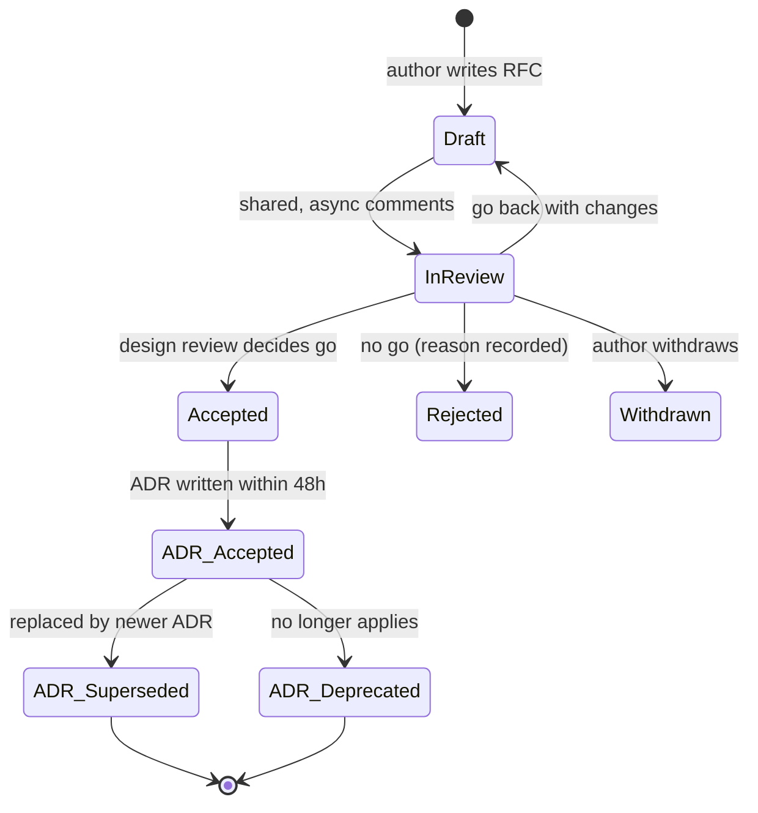

# Module 6.3 — مراجعة التصميم، RFCs، وADRs
## Design Review, RFCs, ADRs: when to write, templates, alternatives considered, reversibility, decision records as team memory

> **المستوى:** Level 6 | **الموقع:** [3 من 9]
> **السابق:** [M6.2 — Code Review](module-6.2-code-review.md) | **التالي:** [M6.4 — Engineering Communication](module-6.4-engineering-communication.md)

---

## 1. المتطلبات
- [ ] SDLC ولماذا التصميم قبل الكود — [L4-M4.1](../level-4-software-engineering-foundations/module-4.1-sdlc.md), [L4-M4.5](../level-4-software-engineering-foundations/module-4.5-software-design.md)
- [ ] المتطلبات: وظيفية/غير وظيفية، القيود — [L4-M4.2](../level-4-software-engineering-foundations/module-4.2-requirements.md)
- [ ] مراجعة الكود وحدودها (التصميم الخاطئ يُكتشف متأخّرًا في PR) — [M6.2](module-6.2-code-review.md)
- [ ] صيغة ACTRR: Assumption / Constraint / Tradeoff / Risk / Recommendation — تمارين §13 في L4–L5
- [ ] الطوابير على PostgreSQL مقابل Redis/وسيط رسائل (مثال القرار في هذه الوحدة) — [L5-M5.9](../level-5-building-real-software/module-5.9-queues-jobs-workers.md)

## 2. أهداف التعلّم
- التمييز بين **RFC** (اقتراح تغيير مفتوح للنقاش قبل التنفيذ) و**ADR** (سجل قرار اتُّخذ، ولماذا، وما البدائل المرفوضة) و**design review** (الحدث الذي يُراجَع فيه الأول وينتج الثاني).
- معرفة **متى** يستحق القرار وثيقة: اختبار "صعوبة التراجع × عدد المتأثّرين × الكلفة"، وما الذي يُحسم في PR أو تذكرة بدلًا من ذلك.
- كتابة RFC بقالب: السياق، المشكلة، الأهداف/اللاأهداف، التصميم المقترح، **البدائل المدروسة بإنصاف**، المخاطر، خطة الطرح والتراجع، الأسئلة المفتوحة.
- كتابة ADR قصير (صفحة) بحالة (Proposed → Accepted → Superseded)، واستخدام سجل الـ ADRs كـ**ذاكرة فريق** تمنع إعادة النقاش وتشرح "لماذا النظام هكذا".
- إدارة مراجعة تصميم مثمرة: من يُدعى، كيف تُقرأ الوثيقة قبل الاجتماع، كيف تُحسم الخلافات، ومتى يُقال "قرّرنا، ونختلف، ونلتزم".

---

## 3. شرح للمبتدئ

### لماذا لا تكفي مراجعة الكود؟
في M6.2 رأيت أن اكتشاف **نهج خاطئ** في PR من 400 سطر متأخّر: المؤلّف أنفق أيامًا، والمراجع أمام خيارين سيّئين — دمج تصميم رديء أو إهدار العمل. الحلّ أن تُراجَع **الفكرة قبل الكود**، على وثيقة من صفحتين تُكتب في ساعتين. هذا هو **design review**، ووثيقته **RFC**، ونتيجته **ADR**.

```
         الكلفة لتغيير القرار
             ▲
             │                                    ╱ في الإنتاج (هجرة بيانات، عملاء)
             │                              ╱
             │                        ╱  بعد الدمج
             │                  ╱  في PR
             │            ╱  في RFC  ← هنا رخيص
             │      ╱
             └──────────────────────────────────────▶ الزمن
```

### ثلاثة مصطلحات، ثلاثة أدوار
| | RFC (Request for Comments) | Design Review | ADR (Architecture Decision Record) |
|---|---|---|---|
| **ما هو** | وثيقة اقتراح مفتوحة للتعليق | حدث/عملية مراجعة الاقتراح | وثيقة قصيرة تسجّل قرارًا اتُّخذ |
| **متى** | قبل التنفيذ | بعد كتابة RFC وقبل القرار | بعد القرار |
| **الطول** | 2–8 صفحات | 30–60 دقيقة (بعد قراءة مسبقة) | صفحة واحدة |
| **السؤال** | "ما رأيكم في هذا النهج؟" | "هل نمضي؟ بأي تعديلات؟" | "لماذا النظام هكذا؟" |
| **يُقرأ بعد عام؟** | نادرًا | — | **نعم، هذا هدفه** |

### متى تكتب؟ اختبار الاستحقاق
ليس كل قرار يستحق وثيقة؛ الوثيقة الزائدة بيروقراطية تُقتل بها العادة. ثلاثة أسئلة:
1. **صعوبة التراجع**: إن كان خطأً، كم يكلّف العودة؟ (تغيير مكتبة تسجيل: ساعة. تغيير DB: شهور.)
2. **عدد المتأثّرين**: فريقك فقط؟ فرق أخرى؟ عملاء؟ (API عامة = الجميع.)
3. **الكلفة**: أكثر من أسبوع-شخص؟ إنفاق متكرّر (خدمة مُدارة)؟

```
قرار "باب ذو اتجاه واحد" (one-way door): صعب التراجع → RFC + design review + ADR
قرار "باب ذو اتجاهين" (two-way door): سهل التراجع → قرّر، سجّل ADR قصيرًا إن أثّر في غيرك، امضِ
```
أمثلة في Project 6: *اختيار PostgreSQL كطابور بدل Redis/RabbitMQ* (أحادي الاتجاه عمليًا: كل الـ workers تعتمد عليه) → RFC. *اسم جدول الوظائف* → PR. *استراتيجية الكاش لصفحة واحدة* → تذكرة مع فقرة قرار.

### قالب RFC
```markdown
# RFC-012: <عنوان بصيغة قرار: "استخدام PostgreSQL كطابور وظائف">
الحالة: Draft | In review | Accepted | Rejected | Withdrawn     المالك: …     المراجعون: …     الموعد: …

## 1. السياق والمشكلة
ما الوضع اليوم؟ ما الألم بالأرقام (زمن، حوادث، كلفة)؟ من يتأثّر؟
## 2. الأهداف واللاأهداف
أهداف قابلة للقياس. واللاأهداف: ما لن نحلّه عمدًا الآن (يمنع تمدّد النقاش).
## 3. التصميم المقترح
مخطّط + تدفّق + نموذج بيانات + تغييرات API. مستوى تفصيل يسمح بتقدير وبنقد، لا بتنفيذ حرفي.
## 4. البدائل المدروسة
لكل بديل: وصف منصف، مزايا، عيوب، لماذا لم يُختر. (بديل مكتوب كـ"رجل قشّ" يُكشف فورًا.)
## 5. المقايضات والمخاطر
ما نخسره بهذا الاختيار. ما قد يسوء، احتماله، أثره، وتخفيفه.
## 6. خطة الطرح والتراجع
مراحل، flags، هجرات N/N-1، كيف نعرف أنه يعمل (مقاييس)، وكيف نعود إن لم يعمل.
## 7. الأسئلة المفتوحة
ما لا نعرفه ومن يجيب ومتى.
## 8. الأثر على: الأمن / الأداء / الكلفة / التشغيل / الفرق الأخرى
```

### قالب ADR (صفحة واحدة)
```markdown
# ADR-007: استخدام PostgreSQL كطابور وظائف (بدل Redis/RabbitMQ)
التاريخ: 2026-03-14    الحالة: Accepted    يحلّ محلّ: —    حلّ محلّه: —    المرجع: RFC-012

## السياق
نحتاج وظائف خلفية (بريد، تصدير، ويبهوك) بضمان at-least-once وبلا ضياع عند انهيار العامل.
الحجم المتوقّع: ≤ 50 وظيفة/ثانية لـ 18 شهرًا. الفريق 5 مهندسين بلا خبرة تشغيل لوسيط رسائل.

## القرار
جدول jobs في PostgreSQL نفسها، استلام بـ FOR UPDATE SKIP LOCKED، إدراج في نفس معاملة
الكتابة التجارية (transactional outbox)، lease + heartbeat، DLQ كجدول.

## البدائل المرفوضة
- Redis (BullMQ): أسرع، لكن يفقد ضمان المعاملة الواحدة مع DB (dual-write) ويضيف تبعية تشغيلية.
- RabbitMQ/SQS: ممتاز فوق 1k/s وللتوجيه المعقّد؛ كلفة تشغيل/تعلّم غير مبرّرة لحجمنا.

## العواقب
+ معاملة واحدة، لا تبعية جديدة، أدوات SQL للتحقيق.
− حمل إضافي على DB الرئيسية؛ polling؛ سقف عملي ~ مئات/ثانية.
→ مراجعة القرار إذا تجاوز المعدّل 200/ثانية أو احتجنا fan-out (مؤشّر مراقَب).
```
الحالة تتغيّر: `Proposed` → `Accepted` → (`Deprecated` | `Superseded by ADR-019`). **لا تُعدَّل ADR مقبولة**؛ تُكتب أخرى تحلّ محلّها. هكذا يبقى التاريخ صادقًا.

### البدائل المدروسة: قلب الوثيقة
أضعف RFC هو الذي فيه بديل واحد "مقترح" وبدائل مرسومة لتخسر. اختبار الإنصاف: **هل يمكن لمدافع عن البديل أن يقول "نعم، هذا وصف عادل لموقفي"؟** إن كان الجواب لا، فالوثيقة إقناع لا تحليل، والمراجعون سيشعرون بذلك ويُهدرون الاجتماع في إعادة بناء البدائل.

### كيف تُدار مراجعة التصميم
1. **القراءة قبل الاجتماع** (أو أول 15 دقيقة صمتًا للقراءة، كطريقة أمازون): التعليقات تُكتب على الوثيقة أولًا.
2. **المدعوّون**: المتأثّرون + خبير مجال واحد + شخص "غريب" يسأل الأسئلة الساذجة المفيدة. ≤ 7 أشخاص.
3. **الهدف المعلن**: قرار من ثلاثة — امضِ / امضِ بتعديلات / لا تمضِ وارجع بـ X.
4. **الأسئلة العشرة التي تُطرح دائمًا**: ماذا لو ×10 الحمل؟ ماذا لو فشل المكوّن الجديد؟ كيف نرجع؟ من يُوقَظ ليلًا؟ ما كلفة السنة الأولى؟ ما الذي يُهاجَر من بيانات؟ ما الأثر على API العامة؟ ما الأثر الأمني؟ ما الذي لم تختبره؟ ما البديل الأرخص بـ 80% من القيمة؟
5. **الخلاف**: يُسجَّل بإنصاف في الوثيقة. من يحسم؟ المالك التقني للمجال (محدَّد مسبقًا). ثم **"نختلف ونلتزم"** (disagree and commit): بعد القرار الجميع ينفّذه بصدق، ويُحدَّد مؤشّر يفتح القرار مجدّدًا.
6. **الناتج**: ADR خلال 48 ساعة، وتذاكر العمل.

### ADRs كذاكرة فريق
بعد عام، مهندس جديد يسأل "لماذا الطابور في PostgreSQL وليس Redis؟ هذا غريب". بلا ADR: نقاش من ساعتين يعيد اكتشاف نفس المقايضات، أو — أسوأ — إعادة كتابة لا مبرّر لها. مع ADR-007: يقرأها في 3 دقائق، يرى الشرط "راجع عند 200/ثانية"، يفحص المقياس (اليوم 30/ثانية)، وينتهي. **سجل الـ ADRs هو الإجابة الوحيدة الموثوقة عن "لماذا"** في نظام عمره سنوات — الكود يقول "ماذا"، والـ commits "ماذا تغيّر"، والـ ADRs "لماذا هكذا".

---

## 4. النموذج الذهني

```
   سؤال/ألم ──▶ هل يستحق وثيقة؟ (تراجع صعب × متأثّرون × كلفة)
                   │ لا → قرّر في التذكرة/PR، سطر "لماذا"
                   │ نعم
                   ▼
              RFC (مسودّة) ──▶ تعليقات غير متزامنة ──▶ design review (≤ 60 د)
                                                           │
                                   ┌───────────────────────┼───────────────────────┐
                                   ▼                       ▼                       ▼
                                امضِ               امضِ بتعديلات             لا تمضِ / ارجع بـ X
                                   └───────────┬───────────┘
                                               ▼
                                     ADR (صفحة، Accepted، مؤشّر إعادة فتح)
                                               │
                                               ▼
                               تذاكر → PRs صغيرة (M6.1) → مراجعة كود (M6.2)
                                               │
                           بعد شهور: مؤشّر تجاوز العتبة؟ → ADR جديدة تحلّ محلّها
```

قاعدة الإبهام: **ما يصعب التراجع عنه يُكتب قبله؛ وما اتُّخذ يُسجَّل بعده؛ وما سُجِّل لا يُحرَّر بل يُستبدل.**

---

## 5. الرسم التوضيحي



---

## 6. مثال بسيط

مهندس يقترح في الدردشة: "لنستبدل الطابور في PostgreSQL بـ Redis؛ أسرع بكثير". بلا عملية: نقاش 40 رسالة، آراء، لا قرار، ثم PR مفاجئ.

بالعملية: المدير التقني يسأل اختبار الاستحقاق — تراجع صعب (كل الـ workers)، يؤثّر في فريقين، أسبوعان عمل → "اكتب RFC من صفحتين". عند كتابة قسم **البدائل بإنصاف** يكتشف المهندس بنفسه أن الألم الحقيقي ليس السرعة (30 وظيفة/ثانية، والسقف مئات) بل **تأخّر وظيفة واحدة** بسبب polling كل 5 ثوانٍ. البديل الأرخص: `LISTEN/NOTIFY` لإيقاظ العامل فورًا + تقليص الفاصل. يُسحب الـ RFC الأصلي، ويُكتب ADR-011 قصير: "إيقاظ العمّال بـ NOTIFY؛ Redis مرفوض لعدم وجود مشكلة إنتاجية؛ أعد التقييم عند 200/ثانية". نصف يوم بدل أسبوعين — **والوثيقة أدّت عملها قبل أن يقرأها أحد**.

---

## 7. مثال كود

أداة صغيرة يفرضها CI على مجلّد `docs/adr/`: تتحقّق من البنية والحالات والمراجع (ADR تُشير إلى "حلّ محلّه" يجب أن تكون موجودة والحالة متسقة)، وتولّد `docs/adr/README.md` كفهرس. هذا يحوّل "الذاكرة" إلى شيء لا يتعفّن بصمت.

```typescript
// src/adr.ts
// نموذج ADR + محلّل + مدقّق. منطق خالص (نصّ → كائن → مشاكل) بلا I/O كي يُختبر.
export const STATUSES = ["Proposed", "Accepted", "Deprecated", "Superseded", "Rejected"] as const;
export type AdrStatus = (typeof STATUSES)[number];

export interface Adr {
  id: number;
  title: string;
  date: string;
  status: AdrStatus;
  supersedes?: number;
  supersededBy?: number;
  sections: Record<string, string>;
  file: string;
}

const REQUIRED_SECTIONS = ["السياق", "القرار", "البدائل المرفوضة", "العواقب"] as const;
const TITLE = /^# ADR-(?<id>\d{3}): (?<title>.+)$/m;
const META = /^التاريخ: (?<date>\d{4}-\d{2}-\d{2})\s+الحالة: (?<status>\S+)(?:\s+يحلّ محلّ: (?<sup>—|ADR-\d{3}))?(?:\s+حلّ محلّه: (?<by>—|ADR-\d{3}))?/m;

function num(ref: string | undefined): number | undefined {
  if (!ref || ref === "—") return undefined;
  return Number(ref.replace("ADR-", ""));
}

export function parseAdr(markdown: string, file: string): { ok: true; adr: Adr } | { ok: false; problems: string[] } {
  const problems: string[] = [];
  const t = TITLE.exec(markdown)?.groups as { id: string; title: string } | undefined;
  if (!t) return { ok: false, problems: [`${file}: missing title "# ADR-NNN: title"`] };
  const m = META.exec(markdown)?.groups as { date: string; status: string; sup?: string; by?: string } | undefined;
  if (!m) return { ok: false, problems: [`${file}: missing metadata line "التاريخ: … الحالة: …"`] };
  if (!(STATUSES as readonly string[]).includes(m.status)) problems.push(`${file}: unknown status "${m.status}"`);

  const sections: Record<string, string> = {};
  const parts = markdown.split(/^## /m).slice(1);
  for (const p of parts) {
    const [heading = "", ...body] = p.split("\n");
    sections[heading.trim()] = body.join("\n").trim();
  }
  for (const s of REQUIRED_SECTIONS) {
    if (!sections[s]) problems.push(`${file}: missing section "## ${s}"`);
    else if (sections[s]!.length < 40) problems.push(`${file}: section "## ${s}" too thin (< 40 chars) — write the why`);
  }
  const alt = sections["البدائل المرفوضة"] ?? "";
  if ((alt.match(/^- /gm) ?? []).length < 1) problems.push(`${file}: list at least one rejected alternative ("- …")`);

  const supersededBy = num(m.by);
  if (m.status === "Superseded" && supersededBy === undefined) problems.push(`${file}: Superseded requires "حلّ محلّه: ADR-NNN"`);
  if (m.status !== "Superseded" && supersededBy !== undefined) problems.push(`${file}: has "حلّ محلّه" but status is ${m.status}`);

  if (problems.length > 0) return { ok: false, problems };
  const supersedes = num(m.sup);
  return {
    ok: true,
    adr: {
      id: Number(t.id), title: t.title.trim(), date: m.date, status: m.status as AdrStatus,
      ...(supersedes !== undefined ? { supersedes } : {}),
      ...(supersededBy !== undefined ? { supersededBy } : {}),
      sections, file,
    },
  };
}

// تحقّق عبر المجموعة: الأرقام فريدة ومتسلسلة، والمراجع المتبادلة متسقة.
export function validateLog(adrs: Adr[]): string[] {
  const problems: string[] = [];
  const byId = new Map<number, Adr>();
  for (const a of adrs) {
    if (byId.has(a.id)) problems.push(`duplicate id ADR-${a.id} (${a.file}, ${byId.get(a.id)!.file})`);
    byId.set(a.id, a);
  }
  for (const a of adrs) {
    if (a.supersededBy !== undefined) {
      const b = byId.get(a.supersededBy);
      if (!b) problems.push(`ADR-${a.id} superseded by missing ADR-${a.supersededBy}`);
      else if (b.supersedes !== a.id) problems.push(`ADR-${b.id} must declare "يحلّ محلّ: ADR-${String(a.id).padStart(3, "0")}"`);
      else if (b.date < a.date) problems.push(`ADR-${b.id} is dated before ADR-${a.id} it supersedes`);
    }
    if (a.supersedes !== undefined) {
      const old = byId.get(a.supersedes);
      if (!old) problems.push(`ADR-${a.id} supersedes missing ADR-${a.supersedes}`);
      else if (old.status !== "Superseded") problems.push(`ADR-${old.id} must be marked Superseded (it is ${old.status})`);
    }
  }
  return problems;
}

export function renderIndex(adrs: Adr[]): string {
  const rows = [...adrs].sort((x, y) => x.id - y.id).map((a) => {
    const rel = a.supersededBy !== undefined ? ` → ADR-${a.supersededBy}` : "";
    return `| ADR-${String(a.id).padStart(3, "0")} | [${a.title}](${a.file}) | ${a.date} | ${a.status}${rel} |`;
  });
  return ["# Architecture Decision Log", "", "| # | القرار | التاريخ | الحالة |", "|---|---|---|---|", ...rows, ""].join("\n");
}
```

```typescript
// src/adr.test.ts
import { test } from "node:test";
import assert from "node:assert/strict";
import { parseAdr, validateLog, renderIndex, type Adr } from "./adr.ts";

const ADR7 = `# ADR-007: استخدام PostgreSQL كطابور وظائف
التاريخ: 2026-03-14    الحالة: Superseded    يحلّ محلّ: —    حلّ محلّه: ADR-019

## السياق
نحتاج وظائف خلفية بضمان at-least-once؛ الحجم ≤ 50/ثانية؛ فريق صغير بلا خبرة تشغيل وسيط رسائل.

## القرار
جدول jobs في PostgreSQL، استلام بـ FOR UPDATE SKIP LOCKED، outbox في نفس المعاملة، lease + heartbeat.

## البدائل المرفوضة
- Redis/BullMQ: أسرع لكن dual-write وتبعية تشغيلية جديدة.
- RabbitMQ/SQS: مبرّر فوق 1k/s فقط.

## العواقب
+ معاملة واحدة ولا تبعية جديدة. − حمل على DB الرئيسية وpolling. → راجع عند 200/ثانية.
`;

const ADR19 = `# ADR-019: الانتقال إلى SQS للوظائف عالية الحجم
التاريخ: 2027-01-10    الحالة: Accepted    يحلّ محلّ: ADR-007    حلّ محلّه: —

## السياق
تجاوز معدّل الوظائف 300/ثانية (المؤشّر في ADR-007)، وظهر تنافس على جدول jobs في p99.

## القرار
SQS للوظائف عالية الحجم مع outbox relay؛ تبقى الوظائف المعاملاتية الحسّاسة في PostgreSQL.

## البدائل المرفوضة
- تجزئة جدول jobs: تؤجّل المشكلة ولا تحلّ fan-out.

## العواقب
+ سقف أعلى. − تبعية سحابية جديدة، at-least-once عبر نظامين، كلفة شهرية تقديرية 40$.
`;

test("parses a valid ADR with cross-references", () => {
  const r = parseAdr(ADR7, "007-postgres-queue.md");
  assert.equal(r.ok, true);
  if (r.ok) {
    assert.equal(r.adr.id, 7);
    assert.equal(r.adr.status, "Superseded");
    assert.equal(r.adr.supersededBy, 19);
    assert.equal(r.adr.supersedes, undefined);
  }
});

test("rejects thin sections and missing alternatives", () => {
  const thin = `# ADR-001: شيء\nالتاريخ: 2026-01-01    الحالة: Accepted\n\n## السياق\nقصير\n\n## القرار\nقصير\n\n## البدائل المرفوضة\nلا شيء\n\n## العواقب\nقصير\n`;
  const r = parseAdr(thin, "001.md");
  assert.equal(r.ok, false);
  if (!r.ok) {
    assert.ok(r.problems.some((p) => p.includes("too thin")));
    assert.ok(r.problems.some((p) => p.includes("rejected alternative")));
  }
});

test("log validation: supersede links must be mutual and dated in order", () => {
  const a = parseAdr(ADR7, "007.md");
  const b = parseAdr(ADR19, "019.md");
  assert.ok(a.ok && b.ok);
  const log: Adr[] = [a.adr, b.adr];
  assert.deepEqual(validateLog(log), []);

  // كسر الاتساق: ADR-019 لا تعلن أنها تحلّ محلّ 007
  const broken = parseAdr(ADR19.replace("يحلّ محلّ: ADR-007", "يحلّ محلّ: —"), "019.md");
  assert.ok(broken.ok);
  const problems = validateLog([a.adr, broken.adr]);
  assert.ok(problems.some((p) => p.includes("must declare")));
});

test("index renders sorted with supersession arrows", () => {
  const a = parseAdr(ADR7, "007.md");
  const b = parseAdr(ADR19, "019.md");
  assert.ok(a.ok && b.ok);
  const md = renderIndex([b.adr, a.adr]);
  const lines = md.split("\n");
  assert.ok(lines[4]!.startsWith("| ADR-007"));
  assert.ok(lines[4]!.includes("Superseded → ADR-19"));
  assert.ok(lines[5]!.startsWith("| ADR-019"));
});
```

```typescript
// src/check-adrs.ts
// نقطة الدخول في CI: يقرأ docs/adr/*.md، يدقّق، ويكتب الفهرس (أو يفشل إن كان الفهرس قديمًا في CI).
import { readdirSync, readFileSync, writeFileSync, existsSync } from "node:fs";
import { join } from "node:path";
import { pathToFileURL } from "node:url";
import { parseAdr, validateLog, renderIndex, type Adr } from "./adr.ts";

export function run(dir: string, { write }: { write: boolean }): string[] {
  const files = readdirSync(dir).filter((f) => /^\d{3}-.+\.md$/.test(f)).sort();
  const problems: string[] = [];
  const adrs: Adr[] = [];
  for (const f of files) {
    const r = parseAdr(readFileSync(join(dir, f), "utf8"), f);
    if (r.ok) adrs.push(r.adr);
    else problems.push(...r.problems);
  }
  problems.push(...validateLog(adrs));
  const index = renderIndex(adrs);
  const indexPath = join(dir, "README.md");
  if (write) writeFileSync(indexPath, index);
  else if (!existsSync(indexPath) || readFileSync(indexPath, "utf8") !== index) {
    problems.push(`${indexPath} is stale — run: node --import tsx scripts/check-adrs.ts --write`);
  }
  return problems;
}

if (import.meta.url === pathToFileURL(process.argv[1] ?? "").href) {
  const problems = run(process.argv[2] ?? "docs/adr", { write: process.argv.includes("--write") });
  if (problems.length > 0) {
    console.error(problems.map((p) => `✗ ${p}`).join("\n"));
    process.exit(1);
  }
  console.log("✓ ADR log consistent");
}
```

```bash
# بنية المجلّد في Project 6
docs/
  adr/
    README.md                      # يُولَّد — لا يُحرَّر يدويًا
    007-postgres-as-job-queue.md
    011-wake-workers-with-notify.md
    019-sqs-for-high-volume-jobs.md
  rfc/
    012-job-queue-options.md       # يبقى للتاريخ بحالته النهائية (Accepted/Withdrawn)
# في CI (بوّابة): node --import tsx scripts/check-adrs.ts docs/adr
```

---

## 8. مثال من العالم الحقيقي
شركة ناشئة نمت من 4 إلى 40 مهندسًا خلال عامين. القرارات الكبرى (خدمة الدفع كـ microservice، GraphQL للواجهة، MongoDB لجزء من البيانات) اتُّخذت شفهيًا من المؤسّسين. عند الـ 40 ظهر نمط: كل مهندس جديد يقترح "إعادة" أحد هذه القرارات، وكل اقتراح يستهلك أيامًا من النقاش لأن لا أحد يتذكّر **لماذا** اختير الأصل، ولا أيّ شروطه ما زالت قائمة. أعاد الفريق بناء الذاكرة بأثر رجعي: 14 ADR "تاريخية" كُتبت في أسبوع من مقابلات مع المؤسّسين، 5 منها انتهت بحالة `Deprecated` فورًا (شروطها زالت) — وهذا بحدّ ذاته أطلق 5 مشاريع تبسيط مبرّرة. الدرس: الـ ADR لا تمنع التغيير؛ **تجعله مبنيًّا على ما تغيّر فعلًا بدل الذوق**.

## 9. مثال من الإنتاج
RFC لاستبدال التحقق من JWT داخل كل خدمة بـ API gateway مركزي. في مراجعة التصميم، سؤال "ماذا لو فشل المكوّن الجديد؟" كشف أن الـ gateway نقطة فشل واحدة أمام 12 خدمة كانت تعمل مستقلّة. الكاتب أضاف قسمًا للمخاطر: نشر نسختين على الأقل عبر AZ، وfail-open مرفوض أمنيًا → fail-closed مع تنبيه. سؤال "كيف نرجع؟" كشف أن الخدمات ستحذف كود التحقق المحلي في نفس الـ PR → عُدّلت الخطة: المرحلة 1 gateway يتحقّق **والخدمات أيضًا** (ازدواج مقصود)، المرحلة 2 بعد شهر مقاييس، حذف المحلي. بعد ثلاثة أسابيع من الطرح حدث عطل في الـ gateway لمدة 9 دقائق؛ **لم يلحظه مستخدم** لأن المرحلة 1 كانت لا تزال فعّالة. ساعة من مراجعة التصميم قابل حادثة من فئة SEV-1.

---

## 10. مفاهيم خاطئة شائعة
1. **"الوثائق للشركات الكبيرة؛ نحن نتحرّك بسرعة."** RFC من صفحتين أسرع من أسبوع كود مرفوض؛ وADR صفحة أسرع من نقاش يتكرّر كل ربع.
2. **"ADR = توثيق المعمارية."** ADR تُسجّل **قرارًا** وسياقه؛ وصف النظام الحالي وثيقة أخرى (M6.5). ولا تُحرَّر ADR؛ تُستبدل.
3. **"RFC المقبول عقد لا يُمسّ."** هو أفضل فهم في وقته؛ التنفيذ يكشف أشياء؛ التغييرات الجوهرية تُحدَّث في الوثيقة أو ADR تعديل.
4. **"مراجعة التصميم اجتماع لعرض الشرائح."** العرض يُقرأ مسبقًا؛ الاجتماع للأسئلة والقرار، وإلا فهو إهدار لسبعة أشخاص.
5. **"الإجماع مطلوب."** المطلوب أن يُسمع الجميع وتُسجَّل الاعتراضات؛ ثم يقرّر المالك ويلتزم الجميع، مع مؤشّر لإعادة الفتح.
6. **"البدائل: نكتبها لأن القالب يطلبها."** البدائل المنصفة هي ما يجعل الوثيقة تحليلًا يُوثَق به ويُقرأ بعد عام.

## 11. أخطاء شائعة
1. RFC لكل شيء → تموت العادة. طبّق اختبار الاستحقاق واجعل القرارات ثنائية الاتجاه سريعة.
2. أهداف بلا أرقام ("أسرع"، "أكثر قابلية للتوسّع") → لا يمكن الحكم على البدائل ولا على النجاح.
3. غياب "اللاأهداف" → النقاش يتمدّد إلى كل ما يمكن تحسينه.
4. بدائل "رجل قشّ" → فقدان ثقة المراجعين، وإعادة النقاش من الصفر في الاجتماع.
5. لا خطة تراجع → التغيير يُنشر كقفزة واحدة بلا طريق عودة.
6. كتابة ADR بعد 3 أشهر من القرار → السياق ضاع وتُكتب "ما نظنّه الآن".
7. تعديل ADR قديمة لتعكس القرار الجديد → التاريخ يكذب؛ اكتب ADR جديدة بـ "تحلّ محلّ".
8. القرار محسوم مسبقًا والمراجعة شكلية → الناس تكتشف ذلك وتتوقّف عن القراءة.

## 12. تمرين تصحيح
بعد 6 أشهر، نظام Project 6 يحوي **طابورين**: جدول jobs في PostgreSQL وBullMQ على Redis يستخدمه فريق الإشعارات؛ وظائف تضيع أحيانًا عند الحدّ بينهما.
1. **دليل:** `git log` يُظهر إضافة BullMQ في PR عنوانه "notifications: faster queue" بلا RFC ولا ADR؛ `docs/adr/007` تقول PostgreSQL هو الطابور وحالتها `Accepted`. الوظائف الضائعة كلها من النوع الذي يُدرَج في Redis بعد COMMIT في PostgreSQL (dual-write).
2. **فرضية:** قرار أحادي الاتجاه اتُّخذ في PR (تجاوز العملية) لأن لا بوّابة تربط "تبعية جديدة" بـ "ADR مطلوبة"؛ والضياع هو مشكلة الكتابة المزدوجة التي رفضتها ADR-007 أصلًا.
3. **تجربة:** قتل العملية بين COMMIT و`queue.add` محليًا → وظيفة ضائعة قابلة لإعادة الإنتاج 100%.
4. **الإصلاح:** قصير المدى: outbox في PostgreSQL + relay إلى BullMQ (يُعيد الضمان). متوسّط: RFC حقيقي "طابور واحد أم اثنان؟" ببدائل منصفة وADR تحلّ محلّ 007 أو تؤكّدها. وقائي: فحص CI — تغيير في `package.json` يضيف تبعية من قائمة "بنية تحتية" (redis, kafka, amqp, grpc…) يتطلّب رابط ADR في وصف الـ PR؛ وCODEOWNERS على `docs/adr/`.
5. **أين أيضًا؟** أي تبعية بنية تحتية ظهرت بلا ADR: `grep -E '"(ioredis|bullmq|kafkajs|amqplib|mongodb)"' package.json` ومطابقتها مع سجل الـ ADRs.

## 13. تمرين معماري
اكتب **RFC كاملة** (≤ 4 صفحات) لقرار حقيقي في Project 6: "هل نفصل الـ worker إلى خدمة مستقلّة بمستودع ونشر منفصلين، أم يبقى في نفس الـ artifact بوضع `ROLE=worker`؟". المطلوب: السياق بأرقام (حجم الوظائف، تواتر النشر، الحوادث)، أهداف ولاأهداف، التصميم، **ثلاثة بدائل منصفة** (نفس الـ artifact / خدمة منفصلة / monorepo بحزمتين)، المقايضات بصيغة ACTRR، خطة طرح وتراجع بمراحل وflags، الأسئلة المفتوحة. ثم اكتب **ADR** من صفحة للقرار الذي تختاره، مع مؤشّر إعادة فتح قابل للقياس. ثم مرّر الـ ADR على `check-adrs.ts` §7.

## 14. الصلة بعصر AI
الوكلاء ينفّذون القرارات بسرعة؛ **لا يتّخذونها**، وإن فعلوا فبلا سياقك. ثلاث نتائج: (1) الـ RFC/ADR تصبح **السياق الأعلى قيمة** الذي تعطيه للوكيل (L8-M8.5): "اقرأ ADR-007 و011 قبل أن تلمس الطابور" يمنع اقتراح Redis للمرة العاشرة؛ (2) اطلب من AI **كتابة البدائل** — هو جيّد في توليد خيارات ومقايضات معيارية ويُخرج من تحيّزك، لكن اختبار الإنصاف ووزن المقايضات على سياقك يبقيان لك؛ (3) الوكيل الذي يضيف تبعية بنية تحتية بلا ADR يجب أن توقفه نفس البوّابة التي توقف الإنسان (§12) — العملية مصمّمة لمؤلّف لا يعرف تاريخك، وهذا بالضبط وصف الوكيل.

## 15–17. Master / Understand / Defer
- 🔴 الفرق بين RFC وdesign review وADR؛ اختبار الاستحقاق (تراجع صعب × متأثّرون × كلفة) وأبواب الاتجاه الواحد/الاتجاهين؛ قالب RFC وخاصة الأهداف/اللاأهداف والبدائل المنصفة وخطة التراجع؛ ADR من صفحة بحالة لا تُحرَّر بل تُستبدل؛ "نختلف ونلتزم" مع مؤشّر إعادة فتح.
- 🟠 إدارة اجتماع المراجعة (قراءة مسبقة، ≤ 7، قرار ثلاثي)؛ الأسئلة العشرة؛ ADRs بأثر رجعي؛ ربط البوّابات بالقرارات (تبعية جديدة ⇒ ADR)؛ أين تعيش الوثائق (مع الكود).
- ⚪ أُطر حوكمة معمارية رسمية (TOGAF، لجان المعمارية)، أدوات ADR متخصّصة (adr-tools, log4brains)، نماذج RFC العامة (IETF, Rust RFCs).

## 18. الخلاصة
1. تغيير القرار رخيص في RFC وباهظ في الإنتاج؛ راجع الفكرة قبل الكود.
2. ليس كل قرار يستحق وثيقة: الأبواب أحادية الاتجاه نعم، الثنائية قرّر وامضِ.
3. RFC = سياق + أهداف/لاأهداف + تصميم + **بدائل منصفة** + مخاطر + طرح وتراجع + أسئلة مفتوحة.
4. ADR = صفحة تُسجّل "لماذا"، بحالة تتطوّر ولا تُحرَّر؛ سجلّها ذاكرة الفريق ضدّ إعادة النقاش.
5. المراجعة تُقرأ قبل الاجتماع، تنتهي بقرار ثلاثي، وتُسجّل الخلاف ثم "نختلف ونلتزم" بمؤشّر لإعادة الفتح.

## 19. مراجع رسمية
- Michael Nygard — Documenting Architecture Decisions (origin of ADRs): https://cognitect.com/blog/2011/11/15/documenting-architecture-decisions
- ADR GitHub organization — templates and tooling: https://adr.github.io/
- AWS Prescriptive Guidance — ADR process: https://docs.aws.amazon.com/prescriptive-guidance/latest/architectural-decision-records/welcome.html
- Rust RFC process (a public, mature RFC workflow): https://github.com/rust-lang/rfcs#rust-rfcs
- IETF — RFC 7282, On Consensus and Humming (rough consensus): https://www.rfc-editor.org/rfc/rfc7282
- Amazon — one-way vs two-way door decisions (2015 shareholder letter): https://www.sec.gov/Archives/edgar/data/1018724/000119312516530910/d168744dex991.htm
- Google — Design Docs at Google: https://www.industrialempathy.com/posts/design-docs-at-google/

## المصطلحات
| العربية | English |
|---|---|
| طلب تعليقات / وثيقة اقتراح | RFC (Request for Comments) |
| مراجعة التصميم | Design review |
| سجل قرار معماري | ADR (Architecture Decision Record) |
| سجل القرارات | Decision log |
| قرار أحادي الاتجاه / ثنائي الاتجاه | One-way / two-way door |
| قابلية التراجع | Reversibility |
| الأهداف واللاأهداف | Goals / Non-goals |
| البدائل المدروسة | Alternatives considered |
| رجل القشّ | Straw man |
| نختلف ونلتزم | Disagree and commit |
| حلّ محلّه / يحلّ محلّ | Superseded by / Supersedes |
| مؤشّر إعادة الفتح | Revisit trigger |
| خطة الطرح والتراجع | Rollout and rollback plan |
| المالك التقني | Technical owner / Decider |
| القراءة الصامتة المسبقة | Pre-read |
