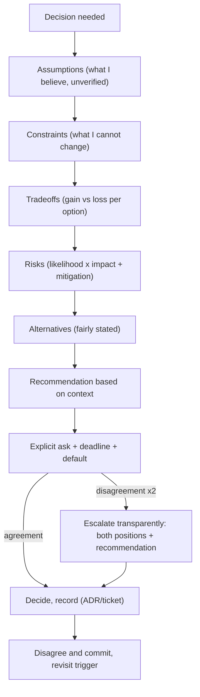

# Module 6.4 — التواصل الهندسي
## Engineering Communication: "Assumption / Constraint / Tradeoff / Risk / Alternative / Recommendation based on context", disagreeing well, escalation, writing for the reader

> **المستوى:** Level 6 | **الموقع:** [4 من 9]
> **السابق:** [M6.3 — Design Review, RFCs, ADRs](module-6.3-design-review-rfc-adr.md) | **التالي:** [M6.5 — Documentation](module-6.5-documentation.md)

---

## 1. المتطلبات
- [ ] التذكرة، تحديث الحالة، صيغة طلب المساعدة — [M6.1](module-6.1-working-in-a-team.md)
- [ ] تعليقات المراجعة الموسومة ولغة "الكود لا الشخص" — [M6.2](module-6.2-code-review.md)
- [ ] RFC/ADR والبدائل المنصفة و"نختلف ونلتزم" — [M6.3](module-6.3-design-review-rfc-adr.md)
- [ ] التقدير وعدم اليقين (نطاقات لا أرقام) — [L4-M4.4](../level-4-software-engineering-foundations/module-4.4-estimation.md)
- [ ] المتطلبات غير الوظيفية والقيود — [L4-M4.2](../level-4-software-engineering-foundations/module-4.2-requirements.md)

## 2. أهداف التعلّم
- استخدام **صيغة ACTRR** بطلاقة في الكتابة والكلام: *Assumption / Constraint / Tradeoff / Risk / Alternative / Recommendation based on context* — وفهم لماذا تُنتج قرارات أفضل من "أرى أن…".
- **الكتابة للقارئ**: الخلاصة أولًا (BLUF)، الطبقات (سطر → فقرة → تفاصيل)، أرقام بدل صفات، وطلب واضح في النهاية.
- **الاختلاف الجيّد**: فصل الملاحظة عن التفسير عن التوصية، الهجوم على الفكرة لا الشخص، تغيير الرأي علنًا، و"نختلف ونلتزم".
- **التصعيد** كأداة مشروعة لا فشلًا: متى، إلى من، بأي صيغة، وكيف تُصعّد دون تجاوز أحد.
- تكييف الرسالة مع الجمهور: مهندس زميل، مدير منتج، مدير تنفيذي، عميل — نفس الحقيقة بثلاث طبقات تفصيل.

---

## 3. شرح للمبتدئ

### لماذا التواصل مهارة هندسية لا "ناعمة"؟
القرار التقني الجيّد الذي لا يستطيع صاحبه شرحه **لا يُتّخذ**. والتحذير الصحيح المكتوب بغموض **لا يُسمع** حتى تقع الحادثة. المهندس الكبير يُقاس بقدر ما يُؤثّر في قرارات غيره، وذلك يمرّ عبر الكتابة والكلام. الخبر الجيّد: التواصل الهندسي **بنية** تُتعلّم، لا موهبة.

### صيغة ACTRR: من الرأي إلى التحليل
قارن:
> "أعتقد أن علينا استخدام Redis للكاش، أفضل بكثير."

بـ:
> **Assumption:** نسبة القراءة إلى الكتابة ~50:1 على كتالوج المنتجات (من مقاييس الأسبوع الماضي).
> **Constraint:** p95 المطلوب < 150ms، ولدينا نسختان فقط من التطبيق.
> **Tradeoff:** Redis يعطي كاشًا مشتركًا بين النسخ وTTL وإبطالًا مركزيًا، مقابل تبعية جديدة تُشغَّل وتُراقَب وتُدفَع (≈ 30$/شهر).
> **Risk:** إبطال خاطئ يعرض سعرًا قديمًا (أثر مالي)؛ التخفيف: إبطال بعد COMMIT + TTL ≤ 60s.
> **Alternative:** كاش في ذاكرة العملية (LRU) بلا تبعية — يكفي إن قبلنا اختلافًا بين النسختين حتى 60s.
> **Recommendation based on context:** ابدأ بالكاش المحلي الآن (يوم عمل)، وانتقل إلى Redis عند أول حالة تتطلّب إبطالًا فوريًا أو عند > 3 نسخ.

الفرق ليس الطول؛ الفرق أن الثانية **قابلة للنقاش بالأجزاء**: يمكن لزميل أن يقول "الافتراض خاطئ، النسبة 5:1" ويتغيّر الاستنتاج دون أن يتحوّل الأمر إلى خلاف شخصي. الرأي يُدافَع عنه؛ التحليل **يُصحَّح**.

| العنصر | السؤال الذي يجيب عنه | ما يحدث حين يغيب |
|---|---|---|
| **Assumption** | ما الذي أفترضه صحيحًا ولم أتحقّق منه بالكامل؟ | يُكتشف لاحقًا أن الأساس خاطئ |
| **Constraint** | ما الذي لا أستطيع تغييره (زمن، مال، أشخاص، تقنية، قانون)؟ | توصيات غير قابلة للتنفيذ |
| **Tradeoff** | ماذا أكسب وماذا أخسر؟ | يُقدَّم الخيار كأنه بلا ثمن |
| **Risk** | ما الذي قد يسوء، باحتمال وأثر، وما التخفيف؟ | مفاجآت في الإنتاج |
| **Alternative** | ما الخيار الآخر المعقول ولماذا ليس هو؟ | شكّ بأن الخيار مسبق |
| **Recommendation based on context** | إذن ماذا نفعل، **في ظروفنا نحن**؟ | تحليل بلا قرار |

> "based on context" ليست زينة: التوصية الصحيحة لشركة ناشئة بخمسة مهندسين خاطئة لبنك. اذكر السياق الذي يُغيّر التوصية.

### الكتابة للقارئ: BLUF والطبقات
القارئ مشغول ويقرأ على الهاتف. **Bottom Line Up Front**: الخلاصة والطلب في السطر الأول، ثم التبرير، ثم التفاصيل لمن يريد.

```
❌ "مرحبًا، كنت أراجع أداء الاستعلامات أمس ولاحظت أن بعضها بطيء، فجرّبت EXPLAIN على
   عدد منها، وتبيّن أن أحدها يستخدم seq scan، وبحثت في السبب … [12 سطرًا] … فهل يمكن
   أن نضيف فهرسًا؟"

✅ "طلب: الموافقة على إضافة فهرس (orders.tenant_id, created_at) اليوم — هجرة CONCURRENTLY، بلا توقّف.
   لماذا: استعلام قائمة الطلبات p95 = 2.4s (الهدف 300ms)؛ EXPLAIN يُظهر seq scan على 9M صف.
   الأثر: ~ 400 MB تخزين، كتابة أبطأ بـ ~2% (مقبول: القراءة 50:1).
   المخاطرة: قفل قصير عند الإنشاء؛ التخفيف: CONCURRENTLY + lock_timeout.
   التفاصيل والـ EXPLAIN: <رابط>."
```

قواعد:
1. **السطر الأول = القرار/الطلب/الخبر**. إن قرأ المدير سطرًا واحدًا فليكن هذا.
2. **أرقام لا صفات**: "بطيء" → "p95 = 2.4s مقابل هدف 300ms". "كثير" → "9M صف".
3. **طلب صريح بموعد**: "أحتاج قرارًا قبل الخميس وإلا سننشر بالخيار A افتراضيًا" (الافتراضي المعلن يمنع الشلل).
4. **عناوين وقوائم** للرسائل > 5 أسطر؛ **روابط** للتفاصيل لا لصقها.
5. **اقرأها كالقارئ** قبل الإرسال: هل تجيب عن "وماذا تريد منّي؟".

### الأخبار السيّئة: مبكرًا وبخطة
التأخير سيحدث؛ المسألة متى تُخبر. القاعدة: **لحظة تعرف**، لا لحظة الموعد. والصيغة:
```
الخبر: EXP-1 لن يُنجز الخميس؛ التقدير الجديد: الثلاثاء القادم (ثقة 80%).
السبب: الاحتفاظ بـ PII في S3 يحتاج موافقة الأمن (اكتُشف أمس)، لا يمكن تجاوزه.
ما فعلت: طلبت المراجعة، وقدّمت الخيار "بلا بريد العميل في الملف" كمسار بديل.
الخيارات لك: (A) انتظار الثلاثاء بالميزة كاملة؛ (B) الخميس بلا عمود البريد ثم إضافته لاحقًا.
توصيتي: B إن كان عرض Acme يوم الجمعة ثابتًا؛ وإلا A.
```
لاحظ: لا اعتذار مطوَّل ولا لوم؛ حقائق، خيارات، توصية، وقرار مطلوب من صاحبه.

### الاختلاف الجيّد
1. **افصل الطبقات**: *ملاحظة* ("الاختبار يفشل 1 من 20 مرة") → *تفسير* ("أظنّه سباقًا في الإعداد") → *توصية* ("لنعزل DB لكل اختبار"). الخلاف على التفسير لا يُلغي الملاحظة.
2. **اسأل أولًا**: "ما الذي يجعلك تفضّل X؟" — غالبًا هناك قيد لا تعرفه.
3. **اذكر ما يُقنعك بتغيير رأيك**: "إن كان المعدّل > 200/ثانية فأنا معك" — يجعل الخلاف قابلًا للحسم بالبيانات.
4. **غيّر رأيك علنًا وبسرعة** حين تظهر البيانات؛ هذا يبني سمعة لا يهدمها.
5. **بعد القرار**: نختلف ونلتزم (M6.3). "قلت لكم" محظورة؛ المؤشّر المتّفق عليه هو ما يُعيد الفتح.

### التصعيد: أداة لا فشل
التصعيد = رفع قرار إلى من يملك صلاحية أو معلومات لا تملكها. يصبح سامًّا فقط إذا كان مفاجئًا أو شخصيًا. القاعدة:
- **متى**: خلاف لا يُحسم بعد محاولتين صادقتين، أو خطر لا يملك مستواك قبوله (أمن، مال، قانون)، أو موعد سينهار بصمت.
- **كيف**: أخبر الطرف الآخر أولًا ("لم نتّفق؛ سأرفعها إلى س لتحسمها — هل تريد كتابة موقفك معي؟")، واكتب الموقفين بإنصاف في رسالة واحدة، مع التوصية والقرار المطلوب وموعده.
- **إلى من**: أدنى مستوى يملك الصلاحية؛ لا تقفز فوق مديرك إلا إن كان هو المشكلة.

### الجمهور: ثلاث طبقات لنفس الحقيقة
| الجمهور | ما يهمّه | مثال (نفس الحادثة) |
|---|---|---|
| مهندس | السبب الجذري، الإصلاح، "أين أيضًا" | "تسريب اتصال في مسار الخطأ؛ `withTransaction` إلزامي؛ lint مضاف" |
| مدير منتج | الأثر على المستخدم والجدول | "3% من الطلبات فشلت 40 دقيقة؛ أُصلح؛ لا أثر على موعد EXP-1" |
| تنفيذي/عميل | المخاطرة، الثقة، التكرار | "حادثة محدودة، أُصلحت خلال 40 دقيقة، وأضفنا ضمانات تمنع تكرارها" |

نفس الحقيقة، لا تلطيف ولا تهويل؛ **تفصيل مختلف**.

---

## 4. النموذج الذهني

```
   ما أريد قوله ──▶ لمن؟ ماذا يحتاج ليقرّر؟ ──▶ الخلاصة أولًا (BLUF)
                                                     │
                                                     ▼
                     ACTRR: Assumption → Constraint → Tradeoff → Risk → Alternative → Recommendation (context)
                                                     │
                                                     ▼
                                  أرقام لا صفات · طلب صريح بموعد · افتراضي معلن
                                                     │
                     ┌───────────────────────────────┼──────────────────────────────┐
                     ▼                               ▼                              ▼
              خلاف؟ افصل الملاحظة/التفسير/     خبر سيّئ؟ مبكرًا + خيارات +        لا حسم؟ صعّد بشفافية:
              التوصية، اسأل، اذكر ما يُقنعك       توصية + قرار مطلوب               الموقفان بإنصاف + توصية
```

قاعدة الإبهام: **إن لم يستطع القارئ أن يختلف معك جزئيًا، فلم تكتب تحليلًا بل رأيًا.**

---

## 5. الرسم التوضيحي



---

## 6. مثال بسيط

رسالة في الدردشة من مهندس إلى مدير المنتج: *"الـ API الجديدة بطيئة جدًا، لازم نعيد التصميم، ما رأيك؟"*. النتيجة: قلق، اجتماع، لا قرار.

إعادة الكتابة بـ BLUF + ACTRR:
```
الخلاصة: GET /v1/orders يحقّق p95 = 900ms (الهدف 300ms)؛ أقترح إصلاحًا من يومين لا إعادة تصميم.
Assumption: الحمل الحالي (120 rps) يمثّل الربع القادم ±50%.
Constraint: الإطلاق بعد 10 أيام؛ لا يمكن تغيير شكل الاستجابة (العميل الجوّال نُشر).
Tradeoff: فهرس + حذف N+1 يعالجان 80% من الزمن بيومين؛ إعادة التصميم (ترقيم بمؤشّر) تعالج 95% بأسبوعين وتكسر العميل.
Risk: إن تضاعف الحمل ×3 لن يكفي الإصلاح السريع؛ التخفيف: مقياس تنبيه عند p95 > 400ms.
Alternative: إعادة التصميم الآن وتأجيل الإطلاق أسبوعًا.
Recommendation: الإصلاح السريع الآن، وRFC للترقيم بالمؤشّر في الإصدار v2 بعد الإطلاق.
القرار المطلوب: موافقتك على الأولوية قبل الغد؛ وإلا سأبدأ بالإصلاح السريع افتراضيًا.
```
مدير المنتج يقرأ 9 أسطر ويقرّر في دقيقة؛ ولو اعترض على الافتراض الأول ("الحمل سيتضاعف ×5 بسبب حملة") تتغيّر التوصية **بوضوح** لا بجدل.

---

## 7. مثال كود

التواصل الهندسي يُهيكَل؛ وما يُهيكَل يمكن التحقّق منه. أداة صغيرة: تمثيل مُنمَّط لتوصية ACTRR، مدقّق يرفض التوصيات الناقصة (توصية بلا بدائل، خطر بلا تخفيف، صفات بلا أرقام)، ومولّد يُخرج النصّ بثلاث طبقات للجماهير الثلاثة. يُستخدم في قالب RFC/PR وفي §13.

```typescript
// src/actrr.ts
export interface Risk { what: string; likelihood: "low" | "medium" | "high"; impact: "low" | "medium" | "high"; mitigation: string }
export interface Alternative { name: string; whyNot: string }

export interface Recommendation {
  title: string;                  // سطر BLUF
  context: string;                // لمن/أين تنطبق التوصية
  assumptions: string[];
  constraints: string[];
  tradeoffs: { gain: string; loss: string }[];
  risks: Risk[];
  alternatives: Alternative[];
  recommendation: string;
  ask: { what: string; by: string; defaultIfNoAnswer: string };
}

const VAGUE = /\b(very|many|a lot|slow|fast|huge|small|soon|later|كثير|بطيء|سريع|قريبًا|لاحقًا|جدًا)\b/i;
const HAS_NUMBER = /\d/;

// يعيد قائمة مشاكل؛ فارغة = جاهزة للإرسال.
export function validate(r: Recommendation): string[] {
  const p: string[] = [];
  if (r.title.length > 140) p.push("title (BLUF) must fit one line (≤ 140 chars)");
  if (r.assumptions.length === 0) p.push("state at least one assumption — every recommendation rests on something unverified");
  if (r.constraints.length === 0) p.push("state at least one constraint (time, money, people, tech, legal)");
  if (r.tradeoffs.length === 0) p.push("state what you lose, not only what you gain");
  for (const t of r.tradeoffs) if (!t.loss.trim()) p.push(`tradeoff "${t.gain}" has no loss — no option is free`);
  if (r.alternatives.length === 0) p.push("state at least one alternative fairly (else it reads as a foregone conclusion)");
  for (const a of r.alternatives) if (a.whyNot.trim().length < 15) p.push(`alternative "${a.name}": explain why not (≥ 15 chars)`);
  for (const k of r.risks) if (!k.mitigation.trim()) p.push(`risk "${k.what}" has no mitigation`);
  if (!r.context.trim()) p.push("recommendation must be 'based on context' — say which context");
  if (!r.ask.by.trim()) p.push("ask needs a deadline");
  if (!r.ask.defaultIfNoAnswer.trim()) p.push("ask needs a declared default (prevents stalls)");

  const prose = [r.title, ...r.assumptions, ...r.constraints, r.recommendation].join(" ");
  if (VAGUE.test(prose) && !HAS_NUMBER.test(prose)) p.push("vague adjectives without any number — replace 'slow' with p95/ms, 'many' with a count");
  return p;
}

export type Audience = "engineer" | "product" | "executive";

export function render(r: Recommendation, audience: Audience): string {
  const top = [`**${r.title}**`, `_Context: ${r.context}_`];
  const ask = `**Ask:** ${r.ask.what} — by ${r.ask.by}; default if no answer: ${r.ask.defaultIfNoAnswer}.`;
  if (audience === "executive") {
    const topRisk = [...r.risks].sort((a, b) => score(b) - score(a))[0];
    return [...top, `**Recommendation:** ${r.recommendation}`, topRisk ? `**Main risk:** ${topRisk.what} — mitigated by ${topRisk.mitigation}.` : "", ask].filter(Boolean).join("\n");
  }
  const lines = [
    ...top,
    `**Assumptions:** ${r.assumptions.join("; ")}`,
    `**Constraints:** ${r.constraints.join("; ")}`,
    `**Tradeoffs:** ${r.tradeoffs.map((t) => `+${t.gain} / −${t.loss}`).join("; ")}`,
    `**Risks:** ${r.risks.map((k) => `${k.what} (${k.likelihood}/${k.impact}) → ${k.mitigation}`).join("; ")}`,
    `**Alternatives:** ${r.alternatives.map((a) => `${a.name}: ${a.whyNot}`).join("; ")}`,
    `**Recommendation based on context:** ${r.recommendation}`,
    ask,
  ];
  if (audience === "product") return lines.filter((l) => !l.startsWith("**Assumptions") && !l.startsWith("**Constraints")).join("\n");
  return lines.join("\n");
}

function score(k: Risk): number {
  const v = { low: 1, medium: 2, high: 3 } as const;
  return v[k.likelihood] * v[k.impact];
}
```

```typescript
// src/actrr.test.ts
import { test } from "node:test";
import assert from "node:assert/strict";
import { validate, render, type Recommendation } from "./actrr.ts";

const good: Recommendation = {
  title: "Fix GET /v1/orders p95 (900ms → <300ms) with index + N+1 removal in 2 days; defer cursor pagination to v2",
  context: "launch in 10 days; mobile client already shipped (response shape frozen); 5-engineer team",
  assumptions: ["current load 120 rps represents next quarter ±50%"],
  constraints: ["response shape cannot change", "launch date fixed"],
  tradeoffs: [{ gain: "80% latency cut in 2 days", loss: "cursor pagination (95% cut) postponed to v2" }],
  risks: [{ what: "load x3 exceeds quick fix", likelihood: "low", impact: "high", mitigation: "alert at p95 > 400ms; v2 RFC scheduled" }],
  alternatives: [{ name: "redesign now", whyNot: "breaks shipped client and slips launch by a week" }],
  recommendation: "quick fix now; RFC for cursor pagination in v2 after launch",
  ask: { what: "approve priority", by: "tomorrow 12:00", defaultIfNoAnswer: "start the quick fix" },
};

test("a complete ACTRR recommendation validates", () => {
  assert.deepEqual(validate(good), []);
});

test("opinions disguised as recommendations are rejected", () => {
  const bad: Recommendation = {
    ...good,
    title: "The API is very slow, we should redesign",
    assumptions: [], constraints: [], tradeoffs: [{ gain: "cleaner", loss: "" }],
    alternatives: [], risks: [{ what: "slip", likelihood: "high", impact: "high", mitigation: "" }],
    recommendation: "redesign soon", ask: { what: "thoughts?", by: "", defaultIfNoAnswer: "" },
  };
  const p = validate(bad);
  for (const needle of ["assumption", "constraint", "no loss", "alternative", "no mitigation", "deadline", "default", "vague"]) {
    assert.ok(p.some((x) => x.toLowerCase().includes(needle)), `expected a problem mentioning "${needle}"`);
  }
});

test("renders three layers for three audiences", () => {
  const eng = render(good, "engineer");
  const pm = render(good, "product");
  const exec = render(good, "executive");
  assert.ok(eng.includes("Assumptions") && eng.includes("Alternatives"));
  assert.ok(!pm.includes("Assumptions") && pm.includes("Tradeoffs"));
  assert.ok(!exec.includes("Tradeoffs") && exec.includes("Main risk") && exec.includes("Ask:"));
  assert.ok(eng.length > pm.length && pm.length > exec.length);
});
```

```markdown
<!-- قالب رسالة قرار (يُلصق في PR/RFC/البريد) -->
**الخلاصة (BLUF):** <قرار/طلب في سطر، بأرقام>
_السياق:_ <الظروف التي تجعل التوصية صحيحة هنا تحديدًا>
- **Assumption:** …
- **Constraint:** …
- **Tradeoff:** +… / −…
- **Risk:** … (احتمال/أثر) → التخفيف …
- **Alternative:** … — لماذا لا: …
- **Recommendation based on context:** …
**المطلوب منك:** <قرار محدّد> قبل <موعد>؛ الافتراضي إن لم يصل ردّ: <…>
```

---

## 8. مثال من العالم الحقيقي
مهندسة في فريق مدفوعات لاحظت أن خطة الهجرة إلى مزوّد دفع جديد تفترض أن "جميع العملاء يملكون بطاقات محفوظة". بدل "أعتقد أن هذا لن ينجح" في الاجتماع، أرسلت رسالة من 8 أسطر: **Assumption** المعلنة في الخطة؛ **بيان** من DB: 31% من العملاء النشطين بلا بطاقة محفوظة (استعلام مرفق)؛ **Risk**: فشل 31% من التجديدات في الشهر الأول ≈ 180k$؛ **Alternative**: مرحلة "إعادة إدخال البطاقة" قبل القطع؛ **Recommendation**: تأخير القطع 3 أسابيع. قُبلت في اليوم نفسه بلا نقاش. السبب ليس أنها كانت محقّة فقط — كثيرون كانوا محقّين وتجاهلهم الفريق — بل أن الرسالة جعلت **التجاهل مكلفًا**: رقم موثّق واحتمال وأثر وبديل جاهز. التواصل الجيّد يحوّل "رأيًا يمكن تجاوزه" إلى "خطرًا يجب على أحدهم أن يقبله باسمه".

## 9. مثال من الإنتاج
أثناء حادثة (M6.7)، قناة الحادثة امتلأت بـ 200 رسالة في 20 دقيقة: نظريات، أسئلة، "هل جرّبتم إعادة التشغيل؟". المدير التنفيذي يسأل كل 5 دقائق "ما الوضع؟" ولا يجد جوابًا. قائد الحادثة طبّق قاعدتين: (1) **تحديث مثبّت** كل 15 دقيقة بصيغة ثابتة: *الأثر (من/كم) → ما نعرفه → ما نفعله الآن → التحديث التالي الساعة …*؛ (2) قناة منفصلة للتحقيق التقني. انخفض ضجيج القناة الرئيسية إلى 10 رسائل، وتوقّفت أسئلة الإدارة لأن الجواب كان في مكان متوقَّع بزمن متوقَّع. في الـ postmortem سُجِّل: "صيغة التحديث الثابتة وفّرت للمستجيبين ~30% من وقتهم". التواصل تحت الضغط = **قوالب جاهزة قبل الضغط**.

---

## 10. مفاهيم خاطئة شائعة
1. **"المهندس الجيّد يُقنع بالحجّة التقنية وحدها."** الحجّة التي لا تُقرأ لا تُقنع؛ البنية (BLUF/ACTRR) هي ما يجعلها تُقرأ.
2. **"الصراحة = القسوة."** الصراحة تخصّ المحتوى (أرقام، مخاطر بلا تلطيف)؛ القسوة تخصّ الشخص. يمكن أن تكون صريحًا تمامًا ولطيفًا تمامًا.
3. **"التصعيد وشاية."** التصعيد الشفّاف المتّفق عليه مع الطرف الآخر أداة قرار؛ الوشاية هي التصعيد السرّي.
4. **"الطول = الجدّية."** الرسالة الطويلة تُؤجَّل؛ القصيرة بطبقات تُقرأ وتُقرَّر.
5. **"لا أُغيّر رأيي كي لا أبدو مترددًا."** تغيير الرأي أمام بيانات جديدة هو بالضبط ما يبني الثقة؛ التشبّث يهدمها.
6. **"الخبر السيّئ يُؤجَّل حتى نجد حلًّا."** الخبر المبكر بخيارات أرخص دائمًا من الخبر المتأخّر بحلّ.

## 11. أخطاء شائعة
1. البدء بالتاريخ ("كنت أمس أراجع…") بدل الخلاصة؛ القارئ يتوقّف قبل الطلب.
2. صفات بلا أرقام: "بطيء"، "كثير من الأخطاء"، "قريبًا".
3. توصية بلا بدائل → تُقرأ كقرار مسبق وتُقاوَم.
4. طلب بلا موعد ولا افتراضي → يبقى معلّقًا أسابيع.
5. خلط الملاحظة بالتفسير: "الاختبار متذبذب لأن س كتبه بإهمال" → ملاحظة + اتّهام.
6. "نحن" حين تقصد "أنا" و"أنت" حين تقصد "الكود".
7. التصعيد المفاجئ دون إخبار الطرف الآخر → يحوّل خلافًا تقنيًا إلى صراع شخصي دائم.
8. الرسالة نفسها لثلاثة جماهير: المدير التنفيذي يغرق في التفاصيل، أو المهندس لا يجد السبب الجذري.

## 12. تمرين تصحيح
قرار معماري (نقل الصور إلى CDN) تأخّر 5 أسابيع رغم أن الجميع "موافق مبدئيًا"، وبدأت تكاليف نقل البيانات تتضاعف.
1. **دليل:** سلسلة بريد من 23 رسالة. الرسالة الأصلية 40 سطرًا تنتهي بـ "ما رأيكم؟". لا موعد، لا افتراضي، لا طلب قرار محدّد من شخص محدّد. ثلاثة ردود تسأل أسئلة أُجيب عنها في منتصف الرسالة الأصلية.
2. **فرضية:** ليس خلافًا بل **غياب طلب قابل للإجابة**: لا أحد يعرف ما القرار المطلوب ولا منه ولا متى؛ فالصمت هو الاستجابة الطبيعية.
3. **تجربة:** إعادة إرسال رسالة من 7 أسطر: BLUF ("أقترح نقل الصور إلى CDN بدءًا من الاثنين؛ التوفير 1,200$/شهر؛ المخاطرة الرئيسية: روابط قديمة → redirect 301 لمدة 6 أشهر") + طلب: "س: موافقة الميزانية قبل الخميس؛ ص: مراجعة الأمن للـ bucket policy قبل الخميس؛ إن لم يصل اعتراض سنبدأ الاثنين". النتيجة: موافقتان خلال يوم.
4. **الإصلاح:** قالب "رسالة قرار" (§7) إلزامي لكل طلب قرار عبر الفرق؛ تدريب: كل رسالة > 10 أسطر بلا BLUF تُعاد إلى كاتبها بلطف.
5. **أين أيضًا؟** ابحث في التذاكر المفتوحة > 30 يومًا بحالة "بانتظار قرار": كم منها بلا مُقرِّر مسمّى وموعد؟

## 13. تمرين معماري
خُذ قرارًا حقيقيًا من Project 6 (مثال: "Redis مُدار مقابل Redis في حاوية على نفس الخادم") واكتبه **ثلاث مرات**: (1) رسالة ACTRR كاملة للمهندسين (مع أرقام من بيئتك: الذاكرة، الكلفة الشهرية، زمن الاستعادة)؛ (2) نسخة مدير المنتج (الأثر على الموثوقية والجدول، ≤ 6 أسطر)؛ (3) نسخة تنفيذية (3 أسطر: التوصية، الخطر الأكبر وتخفيفه، الطلب). ثم: (4) اكتب الاعتراض الأقوى الذي قد يُوجَّه إليك، وما البيانات التي ستُغيّر رأيك؛ (5) اكتب رسالة تصعيد افتراضية بعد خلاف لم يُحسم: الموقفان بإنصاف + توصيتك + القرار المطلوب وموعده؛ (6) مرّر النسخة (1) على `validate()` §7 حتى تصبح المشاكل صفرًا.

## 14. الصلة بعصر AI
AI يكتب نثرًا طليقًا بلا حدود — وهذا بالضبط الخطر: رسائل طويلة أنيقة بلا BLUF ولا أرقام ولا طلب. استخدمه **عكسيًا**: أعطه مسودّتك واطلب "اختصرها إلى BLUF + ACTRR، واحذف كل صفة بلا رقم، واستخرج الطلب والموعد" — ثم تحقّق أن الأرقام أرقامك لا أرقامه. والوكلاء أنفسهم يجب أن يتواصلوا بهذه البنية: وكيل يقترح تغييرًا معماريًا يجب أن يُخرج Assumption/Constraint/Tradeoff/Risk/Alternative لا "أوصي بـ Kafka" (L8-M8.6)؛ و`validate()` §7 يصلح حرفيًا كبوّابة على مخرجات الوكيل قبل أن يراها إنسان. أخيرًا: الاختلاف الجيّد والتصعيد وتغيير الرأي علنًا تبقى مهارات بشرية خالصة — وهي ما يُقاس به المهندس حين يصبح الكود رخيصًا.

## 15–17. Master / Understand / Defer
- 🔴 ACTRR كاملة بما فيها "based on context"؛ BLUF والطبقات؛ أرقام بدل صفات؛ طلب صريح بموعد وافتراضي؛ الخبر السيّئ مبكرًا بخيارات؛ فصل الملاحظة/التفسير/التوصية؛ "ما الذي يُقنعني"؛ تغيير الرأي علنًا؛ ثلاث طبقات للجماهير.
- 🟠 التصعيد الشفّاف وصيغته؛ قوالب التواصل أثناء الحوادث؛ إدارة سلسلة بريد/قناة؛ الكتابة لغير الناطقين بلغتك الأم (جمل قصيرة، مصطلحات ثابتة).
- ⚪ العروض التقديمية التنفيذية، التفاوض الرسمي، الكتابة التسويقية التقنية (developer relations).

## 18. الخلاصة
1. القرار الذي لا يُشرح لا يُتّخذ؛ التواصل بنية تُتعلّم.
2. ACTRR تحوّل الرأي إلى تحليل قابل للتصحيح جزءًا جزءًا — والتوصية دائمًا "بناءً على السياق".
3. الخلاصة أولًا، أرقام لا صفات، طلب بموعد وافتراضي.
4. اختلف على الفكرة، اسأل أولًا، اذكر ما يُقنعك، غيّر رأيك علنًا، ثم التزم.
5. الخبر السيّئ مبكرًا مع خيارات؛ التصعيد شفّافًا مع الطرف الآخر؛ ونفس الحقيقة بثلاث طبقات لثلاثة جماهير.

## 19. مراجع رسمية
- Google — Technical Writing Courses (One & Two): https://developers.google.com/tech-writing
- US Army / general — BLUF (Bottom Line Up Front) writing guidance: https://www.plainlanguage.gov/guidelines/organize/
- Amazon — "Disagree and commit" (Leadership Principles): https://www.amazon.jobs/content/en/our-workplace/leadership-principles
- Charity Majors — "The Engineer/Manager Pendulum" (influence without authority): https://charity.wtf/2017/05/11/the-engineer-manager-pendulum/
- Atlassian — Incident communication templates: https://www.atlassian.com/incident-management/incident-communication/templates
- IETF RFC 7282 — rough consensus (how to disagree well): https://www.rfc-editor.org/rfc/rfc7282
- Will Larson — "Staff Engineer" (writing to be read, escalation): https://staffeng.com/guides/

## المصطلحات
| العربية | English |
|---|---|
| التواصل الهندسي | Engineering communication |
| افتراض | Assumption |
| قيد | Constraint |
| مقايضة | Tradeoff |
| خطر (احتمال × أثر) | Risk (likelihood × impact) |
| بديل | Alternative |
| توصية بناءً على السياق | Recommendation based on context |
| الخلاصة أولًا | BLUF (Bottom Line Up Front) |
| الكتابة بطبقات | Layered writing |
| طلب صريح | Explicit ask |
| الافتراضي المعلن | Declared default |
| ملاحظة / تفسير / توصية | Observation / Interpretation / Recommendation |
| تصعيد | Escalation |
| نختلف ونلتزم | Disagree and commit |
| الجمهور | Audience |
| تحديث مثبّت | Pinned status update |
