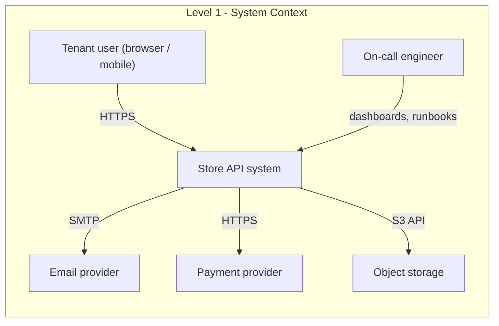
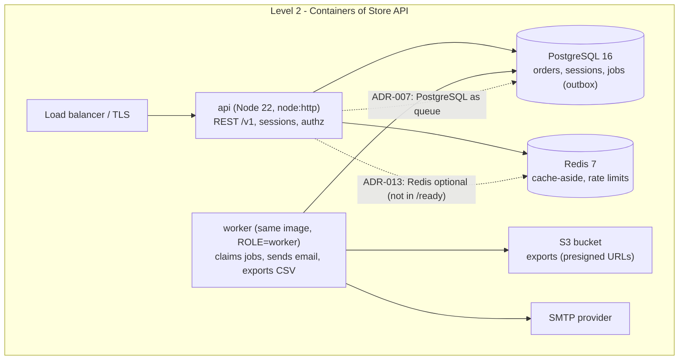

# Module 6.5 — التوثيق
## Documentation: a README that works, architecture docs (C4-lite), runbooks, API docs, and keeping docs alive

> **المستوى:** Level 6 | **الموقع:** [5 من 9]
> **السابق:** [M6.4 — Engineering Communication](module-6.4-engineering-communication.md) | **التالي:** [M6.6 — Observability](module-6.6-observability.md)

---

## 1. المتطلبات
- [ ] الكتابة للقارئ: BLUF، الطبقات، أرقام لا صفات — [M6.4](module-6.4-engineering-communication.md)
- [ ] ADRs كذاكرة قرارات (التوثيق المعماري يُحيل إليها) — [M6.3](module-6.3-design-review-rfc-adr.md)
- [ ] OpenAPI كعقد للـ API — [L5-M5.1](../level-5-building-real-software/module-5.1-api-design.md)
- [ ] تشريح النظام الإنتاجي: `/health`, `/ready`, المهل، pool — [L5-M5.7](../level-5-building-real-software/module-5.7-production-anatomy.md)
- [ ] Docker Compose وCI كأوامر قابلة للتكرار — [L5-M5.11](../level-5-building-real-software/module-5.11-docker-containers.md), [L5-M5.12](../level-5-building-real-software/module-5.12-ci-cd.md)
- [ ] الكود الواضح يقلّل الحاجة إلى التعليقات؛ التعليق لـ"لماذا" — [L4-M4.10](../level-4-software-engineering-foundations/module-4.10-clean-code.md)

## 2. أهداف التعلّم
- التمييز بين **أربعة أنواع** من الوثائق لأربعة احتياجات (Diátaxis): tutorial / how-to / reference / explanation — ولماذا خلطها في ملف واحد يُفشلها جميعًا.
- كتابة **README يعمل**: من الصفر إلى طلب ناجح في < 10 دقائق، على جهاز نظيف، بأوامر تُنسخ وتُلصق.
- رسم **وثيقة معمارية C4-lite**: System Context → Containers → (Components عند الحاجة) بمخططات Mermaid تعيش مع الكود، مع إحالات إلى ADRs.
- كتابة **runbook** لكل تنبيه: الأعراض، الأثر، التشخيص بأوامر، التخفيف، التراجع، التصعيد — قابل للتنفيذ في الثالثة فجرًا من شخص لم يكتب الكود.
- إبقاء الوثائق **حيّة**: تعيش مع الكود في نفس الـ PR، تُفحص آليًا (روابط، أوامر، تواريخ تحقّق)، ولها مالك وتاريخ انتهاء.

---

## 3. شرح للمبتدئ

### لماذا تفشل معظم الوثائق؟
ثلاثة أسباب تتكرّر: (1) **كُتبت للكاتب لا للقارئ** — "كيف بنيتُه" بدل "كيف تستخدمه"؛ (2) **خلطت أنواعًا مختلفة** — درس للمبتدئ ومرجع للخبير وتاريخ القرارات في صفحة واحدة لا تخدم أحدًا؛ (3) **ماتت بصمت** — الكود تغيّر والوثيقة لا، وأول كذبة تجعل القارئ يتوقّف عن الثقة بالباقي. وثيقة قديمة **أسوأ من لا وثيقة**: لا وثيقة تجعلك تقرأ الكود؛ الوثيقة القديمة تجعلك تثق بشيء خاطئ.

### الأنواع الأربعة (Diátaxis)
| النوع | يجيب عن | القارئ | مثال في Project 6 |
|---|---|---|---|
| **Tutorial** | "علّمني بخطوات" | مبتدئ يريد تجربة ناجحة | "شغّل Project 6 محليًا وأنشئ أول طلب" |
| **How-to** | "كيف أفعل X؟" | ممارس لديه هدف محدّد | "كيف تضيف هجرة"، "كيف تدوّر سرًّا" |
| **Reference** | "ما هو X بالضبط؟" | يبحث عن حقيقة دقيقة | OpenAPI، متغيّرات البيئة، رموز الأخطاء |
| **Explanation** | "لماذا هكذا؟" | يريد الفهم | وثيقة المعمارية، ADRs |

لا تخلطها: الـ tutorial لا يشرح البدائل، والمرجع لا يُعلّم، والشرح لا يحوي أوامر. حين تعرف أي نوع تكتب تعرف ما **تحذفه**.

### README يعمل: اختبار العشر دقائق
الـ README هو **الـ tutorial الأول** + فهرس لكل شيء آخر. معياره: شخص جديد بجهاز نظيف يصل إلى **طلب ناجح** في أقلّ من 10 دقائق دون أن يسأل أحدًا.

```markdown
# Store API (Project 6)
> خدمة طلبات متعدّدة المستأجرين: REST + PostgreSQL + Redis + worker. [المعمارية](docs/architecture.md) · [ADRs](docs/adr/) · [Runbooks](docs/runbooks/)

## التشغيل في 5 دقائق
المتطلبات: Docker ≥ 24، Node 22 (للتطوير فقط).
    git clone … && cd store-api
    cp .env.example .env            # القيم الافتراضية تعمل محليًا
    docker compose up -d --wait     # api :8080، postgres، redis، worker
    curl -s localhost:8080/health   # {"status":"ok"}
    npm run seed && curl -s -u demo@acme.test:demo localhost:8080/v1/orders | head
إن فشل شيء: [استكشاف الأخطاء](docs/how-to/troubleshooting.md).

## التطوير
    npm ci && npm run dev           # إعادة تحميل؛ DB/Redis من compose
    npm test                        # unit + integration (يحتاج compose)
    npm run db:migrate -- --name add_x   # هجرة جديدة ← راجع docs/how-to/migrations.md

## الخريطة
src/http (adapters) · src/app (use cases) · src/domain · src/infra (pg, redis, queue) · migrations/ · docs/
## التهيئة
كل المتغيّرات في [docs/reference/config.md](docs/reference/config.md) (مُولَّد من schema التهيئة).
## الحالة والدعم
المالك: فريق Orders (#orders-dev). الحوادث: [on-call](docs/runbooks/README.md). آخر تحقّق من هذا الملف: 2026-09-20.
```

ملاحظات: الأوامر **تُنسخ وتُلصق** بلا `<your-value>`؛ لا شرح لماذا Redis (هذا explanation)؛ روابط للعمق؛ **تاريخ آخر تحقّق** يحوّل "هل هذا صحيح؟" إلى سؤال قابل للإجابة.

### وثيقة المعمارية: C4-lite
نموذج C4 (Context, Containers, Components, Code) يعطي أربعة مستويات تكبير. عمليًا تحتاج اثنين، وثالثًا أحيانًا:
1. **System Context**: نظامك كصندوق واحد + المستخدمون + الأنظمة الخارجية. يجيب: "ما هذا وما حدوده؟".
2. **Containers**: الوحدات القابلة للنشر (api, worker, postgres, redis, S3) وما بينها من بروتوكولات. يجيب: "ممّ يتكوّن وكيف يتحدّث؟".
3. **Components** (عند الحاجة): داخل حاوية واحدة — الطبقات/الوحدات الرئيسية. يجيب: "أين أضع كودي؟".

القاعدة: **مخطّط + فقرة لكل مستوى + روابط إلى ADRs** التي تفسّر الاختيارات. المخططات بـ Mermaid في المستودع لا صورًا في أداة خارجية — كي تُراجَع في PR وتبقى محدّثة.

### Runbooks: وثائق الثالثة فجرًا
الـ runbook وثيقة **how-to تحت الضغط**: لتنبيه محدّد، ماذا يفعل المناوب خطوة بخطوة. قارئه متعب، خائف، وربما لم يرَ هذا الكود. لذلك: أوامر حرفية، لا "تحقّق من DB" بل `psql … -c "select count(*) from jobs where status='running' and lease_until < now()"`. بنية ثابتة:

```markdown
# RB-04: Queue backlog (oldest job age > 10m)
**التنبيه:** `queue_oldest_job_age_seconds > 600` لـ 5 دقائق     **الخطورة:** SEV-2     **المالك:** Orders
## الأعراض
تأخّر البريد/التصدير؛ لوحة Queue: oldest age يتصاعد، throughput ثابت أو صفر.
## الأثر على المستخدم
لا فقدان بيانات (الوظائف في DB)؛ تأخّر إشعارات وتصديرات. > 30 دقيقة → إبلاغ الدعم.
## التشخيص (بالترتيب، كل خطوة ≤ 2 دقيقة)
1. هل العمّال أحياء؟  `kubectl get pods -l app=worker`  أو  `docker compose ps worker`
2. هل يعالجون؟      `SELECT status, count(*) FROM jobs GROUP BY 1;`  — running عالية مع lease منتهٍ = عامل معلّق
3. أخطاء متكرّرة؟   `SELECT last_error, count(*) FROM jobs WHERE status='failed' AND failed_at > now()-interval '15 min' GROUP BY 1 ORDER BY 2 DESC LIMIT 5;`
4. تبعية خارجية؟   لوحة "External deps" — SMTP/S3 p95 وأخطاء
## التخفيف
- عامل معلّق: `kubectl rollout restart deploy/worker` (آمن: lease تُعاد تلقائيًا)
- تبعية خارجية ساقطة: أوقف نوع الوظيفة مؤقتًا `UPDATE job_types SET paused=true WHERE name='send_email'` ← يمنع تضخّم DLQ
- حمل مفاجئ مشروع: زد العمّال `kubectl scale deploy/worker --replicas=6` (الحدّ: pool DB، راجع RB-02)
## التراجع
آخر نشر للعامل خلال ساعتين؟ `kubectl rollout undo deploy/worker` ثم راقب 5 دقائق.
## التصعيد
20 دقيقة بلا تحسّن → قائد الحادثة (#incidents). تبعية خارجية → حالة المزوّد + تذكرة لديه.
## بعد الحادثة
أعد تشغيل DLQ عند الحاجة: `npm run jobs:requeue -- --type send_email --since 2h`. افتح postmortem إن تجاوز 30 دقيقة.
آخر تحقّق: 2026-09-01 (تمرين game day)
```

قاعدة ذهبية: **كل تنبيه يُشير إلى runbook، وكل runbook يُجرَّب في تمرين** (game day) قبل أن يُحتاج فعلًا.

### وثائق الـ API
المرجع يُولَّد من مصدر الحقيقة لا يُكتب يدويًا: OpenAPI من مخطّطات التحقق (L5-M5.1)، وثيقة التهيئة من schema التهيئة (L5-M5.7)، رموز الأخطاء من جدول Problem Details. ما يُكتب يدويًا هو **how-to**: "المصادقة في 3 خطوات"، "ترقيم الصفحات"، "الأخطاء الشائعة".

### كيف تبقى الوثائق حيّة؟
1. **تعيش مع الكود**: `docs/` في نفس المستودع، تتغيّر في **نفس الـ PR** الذي يغيّر السلوك؛ Definition of Done يتضمّنها (M6.1).
2. **تُفحص آليًا**: روابط مكسورة، أوامر README تُنفَّذ في CI على حاوية نظيفة، تواريخ "آخر تحقّق" أقدم من 180 يومًا تفشل، كل تنبيه له runbook موجود (§7).
3. **لها مالك**: فريق لا شخص؛ CODEOWNERS على `docs/runbooks/`.
4. **تُقرأ لتُختبر**: المهندس الجديد يتبع README ويفتح PR بكل ما تعثّر فيه — أرخص اختبار قبول للوثائق.
5. **تُحذف**: وثيقة لم يُتحقّق منها منذ عام وبلا مالك تُحذف أو تُوسم `ARCHIVED` في أعلاها.

---

## 4. النموذج الذهني

```
                      ماذا يحتاج القارئ الآن؟
                                │
        ┌──────────────┬────────┴────────┬──────────────┐
        ▼              ▼                 ▼              ▼
    "علّمني"       "كيف أفعل X"      "ما هو X"        "لماذا هكذا"
    Tutorial        How-to          Reference        Explanation
    README quick    docs/how-to/    OpenAPI, config  architecture.md,
    start           runbooks/       (مُولَّد)          ADRs
        │              │                 │              │
        └──────────────┴────────┬────────┴──────────────┘
                                ▼
                 يعيش مع الكود · يُفحص في CI · له مالك وتاريخ تحقّق · يُحذف إن مات
```

قاعدة الإبهام: **إن لم تستطع تنفيذ الوثيقة (أمر، رابط، تاريخ) فلا يمكنك فحصها آليًا، وما لا يُفحص آليًا يموت.**

---

## 5. الرسم التوضيحي

C4-lite لـ Project 6 — المستوى 1 (Context) والمستوى 2 (Containers) كما تظهر في `docs/architecture.md`:





---

## 6. مثال بسيط

مهندس جديد يبدأ يوم الاثنين. README القديم: "Run `npm start`. You need Postgres." — ثلاث ساعات من الأسئلة في الدردشة: أي إصدار؟ أي متغيّرات بيئة؟ لماذا `ECONNREFUSED 6379`؟ (Redis غير مذكور). ولماذا `relation "orders" does not exist`؟ (الهجرات غير مذكورة).

بعد إعادة الكتابة بقالب §3: `docker compose up -d --wait` يشغّل كل شيء بالإصدارات الصحيحة، `.env.example` يحوي القيم المحلية، `npm run seed` يُنشئ بيانات، و`curl` واحد يثبت النجاح. الاثنين التالي، مهندس آخر: 7 دقائق حتى أول طلب ناجح، وسؤاله الوحيد كان عن المنتج لا عن التشغيل. وفُتح PR صغير منه: "README: أضف ملاحظة أن المنفذ 8080 قد يكون مشغولًا على macOS" — **القارئ الجديد هو أفضل مُراجع للوثيقة**.

---

## 7. مثال كود

ثلاثة فحوص آلية تُبقي الوثائق صادقة، تُشغَّل في CI: (1) تواريخ "آخر تحقّق" غير منتهية؛ (2) كل تنبيه في تهيئة التنبيهات له runbook ببنية كاملة؛ (3) أوامر README القابلة للتنفيذ تُستخرج وتُشغَّل في حاوية نظيفة (الجزء الأخير كخطّة CI).

```typescript
// src/docs-check.ts
// فحوص الوثائق: منطق خالص على نصوص (قابل للاختبار)، والـ I/O في نقطة الدخول.
export interface Finding { file: string; problem: string }

const VERIFIED = /آخر تحقّق(?: من هذا الملف)?:\s*(\d{4}-\d{2}-\d{2})/;

// (1) كل وثيقة لها تاريخ تحقّق، وليس أقدم من maxAgeDays.
export function checkFreshness(file: string, text: string, today: Date, maxAgeDays = 180): Finding[] {
  if (/^ARCHIVED/m.test(text)) return [];
  const m = VERIFIED.exec(text);
  if (!m) return [{ file, problem: "missing 'آخر تحقّق: YYYY-MM-DD' line" }];
  const age = (today.getTime() - new Date(m[1]!).getTime()) / 86_400_000;
  if (age > maxAgeDays) return [{ file, problem: `last verified ${Math.floor(age)} days ago (> ${maxAgeDays}); re-verify or archive` }];
  return [];
}

// (2) بنية runbook: الأقسام الإلزامية + أوامر حرفية في التشخيص + رابط تصعيد.
export const RUNBOOK_SECTIONS = ["الأعراض", "الأثر على المستخدم", "التشخيص", "التخفيف", "التراجع", "التصعيد"] as const;

export function checkRunbook(file: string, text: string): Finding[] {
  const out: Finding[] = [];
  if (!/^# RB-\d{2}: .+/m.test(text)) out.push({ file, problem: "title must be '# RB-NN: <alert name>'" });
  if (!/\*\*التنبيه:\*\*\s*`[^`]+`/.test(text)) out.push({ file, problem: "missing **التنبيه:** `<alert expression>`" });
  const sections = new Map<string, string>();
  for (const part of text.split(/^## /m).slice(1)) {
    const [h = "", ...body] = part.split("\n");
    sections.set(h.trim(), body.join("\n"));
  }
  // العنوان قد يحمل لاحقة ("التشخيص (بالترتيب)")؛ نطابق بالبادئة
  const find = (name: string) => [...sections.entries()].find(([h]) => h.startsWith(name))?.[1];
  for (const s of RUNBOOK_SECTIONS) if (find(s) === undefined) out.push({ file, problem: `missing section '## ${s}'` });
  const diag = find("التشخيص") ?? "";
  const commands = diag.match(/`[^`\n]{6,}`/g) ?? [];
  if (commands.length < 2) out.push({ file, problem: "diagnosis needs literal commands in backticks (≥ 2), not 'check the DB'" });
  if (/تحقّق من قاعدة البيانات|check the database/i.test(diag) && commands.length === 0) out.push({ file, problem: "vague diagnosis step" });
  if (!/#[a-z-]+|@[a-z-]+/.test(find("التصعيد") ?? "")) out.push({ file, problem: "escalation must name a channel/person (#channel or @team)" });
  return out;
}

// (3) كل تنبيه في التهيئة له runbook موجود، وكل runbook يقابله تنبيه (لا وثائق يتيمة).
export interface AlertRule { name: string; runbook?: string }
export function checkAlertCoverage(rules: AlertRule[], runbookFiles: string[]): Finding[] {
  const out: Finding[] = [];
  const existing = new Set(runbookFiles);
  for (const r of rules) {
    if (!r.runbook) out.push({ file: "alerts.yml", problem: `alert '${r.name}' has no runbook link` });
    else if (!existing.has(r.runbook)) out.push({ file: "alerts.yml", problem: `alert '${r.name}' points to missing ${r.runbook}` });
  }
  const linked = new Set(rules.map((r) => r.runbook).filter(Boolean));
  for (const f of runbookFiles) if (!linked.has(f) && !/README\.md$/.test(f)) out.push({ file: f, problem: "runbook not referenced by any alert (orphan)" });
  return out;
}

// استخراج أوامر README القابلة للتنفيذ (أسطر مُزاحة بأربع مسافات تحت "التشغيل") لتشغيلها في CI.
export function extractQuickstart(readme: string): string[] {
  const section = readme.split(/^## /m).find((s) => s.startsWith("التشغيل")) ?? "";
  return section.split("\n").filter((l) => /^ {4}\S/.test(l)).map((l) => l.trim().replace(/\s+#.*$/, ""));
}
```

```typescript
// src/docs-check.test.ts
import { test } from "node:test";
import assert from "node:assert/strict";
import { checkFreshness, checkRunbook, checkAlertCoverage, extractQuickstart } from "./docs-check.ts";

const today = new Date("2026-10-01");

test("freshness: missing, stale, fresh, archived", () => {
  assert.equal(checkFreshness("a.md", "no date here", today).length, 1);
  assert.match(checkFreshness("b.md", "آخر تحقّق: 2026-01-01", today)[0]!.problem, /days ago/);
  assert.deepEqual(checkFreshness("c.md", "آخر تحقّق من هذا الملف: 2026-09-20", today), []);
  assert.deepEqual(checkFreshness("d.md", "ARCHIVED\nآخر تحقّق: 2020-01-01", today), []);
});

const GOOD_RB = `# RB-04: Queue backlog
**التنبيه:** \`queue_oldest_job_age_seconds > 600\`
## الأعراض
تأخّر البريد.
## الأثر على المستخدم
لا فقدان بيانات.
## التشخيص (بالترتيب)
1. \`kubectl get pods -l app=worker\`
2. \`SELECT status, count(*) FROM jobs GROUP BY 1;\`
## التخفيف
- \`kubectl rollout restart deploy/worker\`
## التراجع
\`kubectl rollout undo deploy/worker\`
## التصعيد
20 دقيقة → #incidents
آخر تحقّق: 2026-09-01
`;

test("runbook structure: good passes, vague fails", () => {
  assert.deepEqual(checkRunbook("RB-04.md", GOOD_RB), []);
  const vague = GOOD_RB.replace(/## التشخيص[\s\S]*?## التخفيف/, "## التشخيص\n1. تحقّق من قاعدة البيانات\n## التخفيف").replace("#incidents", "someone");
  const f = checkRunbook("RB-04.md", vague).map((x) => x.problem);
  assert.ok(f.some((p) => p.includes("literal commands")));
  assert.ok(f.some((p) => p.includes("escalation")));
});

test("alert coverage: missing link, missing file, orphan runbook", () => {
  const f = checkAlertCoverage(
    [{ name: "QueueBacklog", runbook: "docs/runbooks/RB-04.md" }, { name: "HighErrorRate" }, { name: "DbPoolExhausted", runbook: "docs/runbooks/RB-99.md" }],
    ["docs/runbooks/RB-04.md", "docs/runbooks/RB-07.md", "docs/runbooks/README.md"],
  ).map((x) => x.problem);
  assert.ok(f.some((p) => p.includes("HighErrorRate") && p.includes("no runbook")));
  assert.ok(f.some((p) => p.includes("RB-99")));
  assert.ok(f.some((p) => p.includes("orphan")));
  assert.equal(f.length, 3);
});

test("quickstart commands are extractable (so CI can run them)", () => {
  const readme = "# X\n## التشغيل في 5 دقائق\nالمتطلبات: Docker.\n    cp .env.example .env   # تعليق\n    docker compose up -d --wait\n    curl -s localhost:8080/health\n## التطوير\n    npm ci\n";
  assert.deepEqual(extractQuickstart(readme), ["cp .env.example .env", "docker compose up -d --wait", "curl -s localhost:8080/health"]);
});
```

```typescript
// src/check-docs.ts
// نقطة الدخول في CI: يجمع الفحوص الثلاثة على المستودع ويفشل عند أي نتيجة.
import { readFileSync, readdirSync } from "node:fs";
import { join } from "node:path";
import { pathToFileURL } from "node:url";
import { checkFreshness, checkRunbook, checkAlertCoverage, type AlertRule, type Finding } from "./docs-check.ts";

export function runAll(root: string, today = new Date()): Finding[] {
  const findings: Finding[] = [];
  const docs = ["README.md", "docs/architecture.md"].map((f) => join(root, f));
  const rbDir = join(root, "docs/runbooks");
  const runbooks = readdirSync(rbDir).filter((f) => f.endsWith(".md")).map((f) => join("docs/runbooks", f));
  for (const f of [...docs, ...runbooks.map((r) => join(root, r))]) {
    const text = readFileSync(f, "utf8");
    findings.push(...checkFreshness(f, text, today));
    if (f.includes("/runbooks/RB-")) findings.push(...checkRunbook(f, text));
  }
  // تهيئة التنبيهات: JSON بسيط هنا؛ في الواقع YAML لـ Prometheus/Grafana مع حقل runbook_url
  const rules = JSON.parse(readFileSync(join(root, "alerts.json"), "utf8")) as AlertRule[];
  findings.push(...checkAlertCoverage(rules, runbooks));
  return findings;
}

if (import.meta.url === pathToFileURL(process.argv[1] ?? "").href) {
  const findings = runAll(process.argv[2] ?? ".");
  for (const f of findings) console.error(`✗ ${f.file}: ${f.problem}`);
  if (findings.length > 0) process.exit(1);
  console.log("✓ docs are fresh, runbooks complete, every alert has a runbook");
}
```

```yaml
# .github/workflows/docs.yml — الوثائق تُختبر كالكود
name: docs
on: [pull_request]
jobs:
  docs:
    runs-on: ubuntu-latest
    steps:
      - uses: actions/checkout@v4
      - uses: actions/setup-node@v4
        with: { node-version: 22, cache: npm }
      - run: npm ci
      - run: node --import tsx scripts/check-docs.ts .              # تواريخ، runbooks، تغطية التنبيهات
      - run: npx markdown-link-check -q README.md docs/**/*.md       # روابط مكسورة
      - name: README quickstart actually works (clean machine)
        run: |
          node --import tsx scripts/extract-quickstart.ts README.md > /tmp/qs.sh
          bash -euxo pipefail /tmp/qs.sh                             # docker compose up … curl /health
```

---

## 8. مثال من العالم الحقيقي
شركة بـ 30 خدمة لديها ويكي من 2,000 صفحة. استطلاع داخلي: 70% من المهندسين "لا يثقون بالويكي" ويسألون في الدردشة بدلًا منه. التحليل: 60% من الصفحات لم تُعدَّل منذ > عامين، 25% تصف خدمات حُذفت، ولا صفحة تحمل مالكًا. القرار لم يكن "اكتبوا أكثر" بل **"احذفوا وانقلوا"**: الوثائق تنتقل إلى مستودع الخدمة التي تصفها (`docs/` بجوار الكود)، كل صفحة تحمل مالكًا وتاريخ تحقّق، وفحص CI يفشل عند 180 يومًا. خلال ربع، بقي 400 صفحة فقط — ونسبة الثقة قفزت إلى 85%. عدد الوثائق انخفض 80%، وقيمتها ارتفعت، لأن **الوثيقة الموثوقة الوحيدة أفضل من عشر مشكوك فيها**.

## 9. مثال من الإنتاج
الثالثة فجرًا، تنبيه `DbPoolExhausted` على مناوب من فريق آخر. الـ runbook يقول: "تحقّق من الاتصالات واتّصل بفريق Orders". المناوب لا يعرف كيف "يتحقّق"، وفريق Orders نائم. 50 دقيقة من التخمين، ثم إعادة تشغيل عشوائية أنهت الحادثة مؤقتًا. في الـ postmortem (M6.7) أُعيدت كتابة RB-02 ببنية §3: استعلام `pg_stat_activity` الحرفي، تفسير النتائج الثلاثة المحتملة (تسريب / حمل / استعلام طويل)، أمر `pg_terminate_backend` المشروط، وأمر التراجع. ثم **تمرين game day**: مهندس من فريق ثالث نفّذ الـ runbook على staging مع تسريب مُفتعَل — 6 دقائق حتى التخفيف. الفارق بين 50 و6 دقائق لم يكن معرفة؛ كان **وثيقة قابلة للتنفيذ جُرِّبت قبل الحاجة**.

---

## 10. مفاهيم خاطئة شائعة
1. **"الكود الجيّد يوثّق نفسه."** يوثّق *كيف*؛ لا يوثّق *لماذا* ولا *كيف أشغّله* ولا *ماذا أفعل حين ينهار*.
2. **"المزيد من الوثائق أفضل."** الوثيقة غير المفحوصة دين؛ القليل الموثوق أفضل من الكثير المشكوك فيه.
3. **"الويكي المركزي أسهل."** بعيد عن الكود = لا يتغيّر معه = يموت. الوثائق تعيش في المستودع وتُراجَع في PR.
4. **"الـ README للمبتدئين."** الـ README هو أول ما يقرؤه الخبير أيضًا — في الثالثة فجرًا.
5. **"المخططات في أداة رسم جميلة."** الصورة لا تُراجَع ولا تُحدَّث؛ Mermaid في المستودع نعم.
6. **"التوثيق مرحلة بعد الانتهاء."** هو جزء من Definition of Done؛ وما بعد الانتهاء لا يحدث.

## 11. أخطاء شائعة
1. README يبدأ بتاريخ المشروع وفلسفته بدل أمر التشغيل.
2. أوامر بقيم وهمية `<your-db-url>` بدل `.env.example` يعمل محليًا.
3. خلط الأنواع: tutorial يشرح البدائل المعمارية في منتصفه، أو runbook يناقش "لماذا اخترنا PostgreSQL".
4. runbook بلا أوامر حرفية ("افحص السجلات")، أو بأوامر لم تُجرَّب منذ تغيير البنية.
5. وثيقة بلا تاريخ تحقّق ولا مالك → لا أحد يعرف إن كانت صحيحة ولا من يسأل.
6. OpenAPI مكتوبة يدويًا بعيدًا عن الكود → تنحرف خلال شهر؛ ولّدها من مخطّطات التحقق.
7. تحديث الكود في PR والوثيقة "في PR لاحق" لا يأتي.
8. حذف وثيقة قديمة يُعدّ تخريبًا → فتبقى تكذب؛ الحذف (أو ARCHIVED) جزء من الصيانة.

## 12. تمرين تصحيح
مهندس جديد يتبع README حرفيًا ويحصل على `error: relation "sessions" does not exist` عند أول طلب، رغم أن README يقول إن `docker compose up` "يشغّل كل شيء".
1. **دليل:** `compose.yml` يُشغّل postgres وapi، لكن الهجرات تُشغَّل بخدمة `migrate` أُضيفت قبل شهرين **بـ profile** `tools` لا يعمل افتراضيًا. README لم يتغيّر في ذلك الـ PR؛ تاريخ آخر تحقّق قبل 4 أشهر.
2. **فرضية:** الوثيقة انحرفت لأن تغيير السلوك (profile) مرّ دون تحديث التوثيق، ولا فحص آليًّا يُنفّذ أوامر README.
3. **تجربة:** على حاوية نظيفة: `docker compose up -d --wait && curl …/v1/orders` → نفس الخطأ (قابل لإعادة الإنتاج)؛ `docker compose --profile tools run migrate` ثم إعادة الطلب → ينجح.
4. **الإصلاح:** فوري: `api` يُشغّل الهجرات عند الإقلاع في وضع التطوير أو `depends_on: migrate` بـ `service_completed_successfully`؛ README محدَّث. منهجي: وظيفة CI "README quickstart" §7 تُنفّذ الأوامر حرفيًا على runner نظيف، وقاعدة في قالب PR: "هل غيّرت سلوك التشغيل؟ حدّث README في نفس الـ PR".
5. **أين أيضًا؟** كل how-to يحوي أوامر: شغّلها جميعًا مرة على staging واحسب كم منها يعمل؛ ما يفشل يُصلَح أو يُؤرشَف.

## 13. تمرين معماري
صمّم **نظام الوثائق** لـ Project 6: (1) شجرة `docs/` بالأنواع الأربعة وما يذهب أين (مع ما **لن** تكتبه)؛ (2) README كامل يجتاز اختبار العشر دقائق على جهاز نظيف — جرّبه فعلًا في حاوية؛ (3) `docs/architecture.md` بمستويي C4 (Context, Containers) بـ Mermaid + فقرة لكل مستوى + روابط إلى 3 ADRs على الأقل؛ (4) runbooks لثلاثة تنبيهات حقيقية من L5 (pool exhausted، queue backlog، 5xx rate) بالبنية الكاملة وأوامر حرفية؛ (5) ما يُولَّد آليًا (OpenAPI، config reference، فهرس ADR) ومن أي مصدر؛ (6) خطّة الإبقاء حيًّا: الفحوص الآلية، المالك، تاريخ التحقّق، سياسة الحذف، وgame day ربع سنوي — بصيغة ACTRR لكل خيار غير بديهي.

## 14. الصلة بعصر AI
AI ممتاز في **كتابة المسودّة الأولى** للوثائق من الكود (README، وصف الوحدات، حتى runbook أوّلي من التنبيهات والسجلات) — وسيئ في معرفة ما هو **صحيح اليوم**: يصف ما يبدو أن الكود يفعله، لا ما يفعله فعلًا في الإنتاج، ويخترع أوامر معقولة الشكل. القاعدة: AI يكتب، والفحوص الآلية §7 تُثبت (الأوامر تُنفَّذ، الروابط تُفحص)، والإنسان يتحقّق من "لماذا". وفي الاتجاه المعاكس: الوثائق الجيّدة هي **أفضل سياق للوكلاء** (L8-M8.5): README يعمل + architecture.md + ADRs + runbooks = وكيل يعمل على مستودعك بدقّة بدل التخمين. الفريق الذي أهمل وثائقه سيكتشف أن وكلاءه يُنتجون كودًا يُناقض معماريته.

## 15–17. Master / Understand / Defer
- 🔴 الأنواع الأربعة ولماذا لا تُخلط؛ README باختبار العشر دقائق وأوامر تُلصق؛ C4-lite بمستويين في Mermaid مع إحالات ADR؛ runbook ببنية كاملة وأوامر حرفية وتجربة مسبقة؛ الوثيقة تعيش مع الكود في نفس الـ PR؛ تاريخ التحقّق والمالك والحذف.
- 🟠 توليد المرجع من مصدر الحقيقة (OpenAPI/config)؛ فحوص CI للوثائق وتشغيل quickstart على runner نظيف؛ game days؛ Diátaxis بعمق؛ C4 المستوى 3.
- ⚪ مولّدات مواقع التوثيق (Docusaurus/MkDocs)، docs-as-code pipelines المتقدّمة، كتابة وثائق للمطوّرين الخارجيين (developer portals).

## 18. الخلاصة
1. الوثيقة القديمة أسوأ من لا وثيقة؛ اكتب أقلّ وافحص أكثر.
2. أربعة أنواع لأربعة احتياجات: tutorial / how-to / reference / explanation — لا تخلطها.
3. README = من الصفر إلى طلب ناجح في 10 دقائق بأوامر تُلصق؛ القارئ الجديد أفضل مراجع له.
4. المعمارية: Context → Containers بـ Mermaid في المستودع، و"لماذا" في ADRs.
5. runbook لكل تنبيه: أعراض، أثر، تشخيص بأوامر، تخفيف، تراجع، تصعيد — ويُجرَّب قبل الحاجة.
6. حيّة = مع الكود، في نفس الـ PR، مفحوصة آليًا، بمالك وتاريخ، وتُحذف حين تموت.

## 19. مراجع رسمية
- Diátaxis — a systematic framework for technical documentation: https://diataxis.fr/
- The C4 model for visualising software architecture: https://c4model.com/
- Mermaid — C4 and flowchart syntax: https://mermaid.js.org/syntax/c4.html
- Google SRE Book — "Being On-Call" & playbooks: https://sre.google/sre-book/being-on-call/
- Google SRE Workbook — "On-Call" (playbooks and game days): https://sre.google/workbook/on-call/
- Write the Docs — Documentation guide: https://www.writethedocs.org/guide/
- OpenAPI Specification: https://spec.openapis.org/oas/latest.html
- GitHub Docs — About READMEs: https://docs.github.com/en/repositories/managing-your-repositorys-settings-and-features/customizing-your-repository/about-readmes

## المصطلحات
| العربية | English |
|---|---|
| توثيق | Documentation |
| درس تعليمي / دليل كيف / مرجع / شرح | Tutorial / How-to / Reference / Explanation (Diátaxis) |
| اختبار العشر دقائق | Ten-minute test (quickstart) |
| نموذج C4 | C4 model (Context, Containers, Components, Code) |
| مخطّط سياق النظام | System Context diagram |
| مخطّط الحاويات | Container diagram |
| كتيّب تشغيل | Runbook / Playbook |
| يوم المحاكاة | Game day |
| الوثائق كشيفرة | Docs as code |
| تاريخ آخر تحقّق | Last-verified date |
| مالك الوثيقة | Doc owner |
| وثيقة مؤرشفة | Archived doc |
| انحراف الوثائق | Documentation drift |
| مرجع مُولَّد | Generated reference |
| وثيقة يتيمة | Orphan doc |
