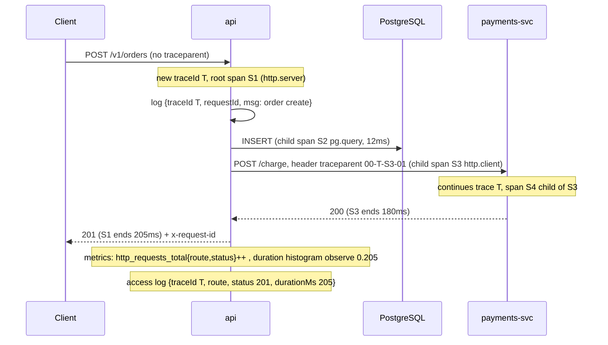

# Module 6.6 — قابلية الملاحظة
## Observability: structured logs, correlation ids, metrics (RED/USE, percentiles), traces (spans, propagation), dashboards, and alerts that matter

> **المستوى:** Level 6 | **الموقع:** [6 من 9]
> **السابق:** [M6.5 — Documentation](module-6.5-documentation.md) | **التالي:** [M6.7 — Incident Response](module-6.7-incident-response.md)

---

## 1. المتطلبات
- [ ] المسجّل المهيكل وrequestId في Problem Details — [L5-M5.1](../level-5-building-real-software/module-5.1-api-design.md), [L4-M4.12](../level-4-software-engineering-foundations/module-4.12-debugging-deeply.md)
- [ ] رحلة الطلب والمهل وevent loop lag وpool — [L5-M5.7](../level-5-building-real-software/module-5.7-production-anatomy.md)
- [ ] hit ratio للكاش وoldest job age للطابور — [L5-M5.8](../level-5-building-real-software/module-5.8-caching.md), [L5-M5.9](../level-5-building-real-software/module-5.9-queues-jobs-workers.md)
- [ ] `AsyncLocalStorage` وحلقة الأحداث — [L1-M1.11](../level-1-programming/module-1.11-async-event-loop.md), [L2-M2.7](../level-2-computer-systems/module-2.7-concurrency-event-loop.md)
- [ ] runbook لكل تنبيه — [M6.5](module-6.5-documentation.md)
- [ ] HTTP headers والـ reverse proxy — [L2-M2.12](../level-2-computer-systems/module-2.12-http.md)

## 2. أهداف التعلّم
- الإجابة عن **"ماذا يفعل الإنتاج الآن؟"** بثلاث إشارات متكاملة: logs (ماذا حدث، بالتفصيل)، metrics (كم/كم سريعًا، عبر الزمن)، traces (أين ذهب الوقت، عبر الخدمات) — ومعرفة أيّها تسأل لأي سؤال.
- بناء **سجلات مهيكلة** (JSON سطر لكل حدث) بمستويات ومعرّف ارتباط (`requestId`/`traceId`) ينتقل تلقائيًا عبر `AsyncLocalStorage` وعبر HTTP إلى الخدمات التالية، مع حجب الأسرار والـ PII.
- تنفيذ **مقاييس RED** (Rate, Errors, Duration) لكل نقطة نهاية و**USE** (Utilization, Saturation, Errors) للموارد (pool، طابور، حلقة الأحداث)، بـ histogram يُعطي p50/p95/p99 الصحيحة — ولماذا المتوسّط يكذب.
- إنشاء **spans** مترابطة بمعيار W3C `traceparent`، وقراءة trace لتحديد الخطوة البطيئة.
- تصميم **لوحة** تجيب عن سؤال في 10 ثوانٍ، و**تنبيهات على الأعراض** (ما يراه المستخدم) لا الأسباب، بعتبات مبنية على SLO، وكل تنبيه له runbook ومالك — بلا ضجيج.

---

## 3. شرح للمبتدئ

### المشكلة: الإنتاج صندوق أسود
على جهازك تضع `console.log` وتعيد التشغيل. في الإنتاج: 6 نسخ، آلاف الطلبات في الدقيقة، ولا يمكنك "إعادة التشغيل لترى". **قابلية الملاحظة** (observability) هي أن يُخرج النظام من داخله ما يكفي من إشارات لتُجيب عن أسئلة **لم تتوقّعها** عند كتابته: "لماذا طلب هذا المستخدم بطيء؟"، "هل النشر الأخير زاد الأخطاء؟"، "أي تبعية تُبطئنا؟".

### الإشارات الثلاث
| الإشارة | تجيب عن | الشكل | الكلفة | مثال |
|---|---|---|---|---|
| **Logs** | ماذا حدث بالضبط في حدث واحد؟ | سطر JSON لكل حدث | عالية (حجم) | `{"level":"error","msg":"refund failed","orderId":"o1","err":"timeout"}` |
| **Metrics** | كم؟ كم سريعًا؟ كيف يتغيّر عبر الزمن؟ | أرقام مجمّعة بعلامات | منخفضة (ثابتة) | `http_request_duration_seconds{route="/v1/orders",status="200"}` |
| **Traces** | أين ذهب الوقت في طلب واحد عبر المكوّنات؟ | شجرة spans بمعرّف واحد | متوسّطة (عيّنة) | `GET /v1/orders 420ms → pg.query 380ms` |

لا واحدة تكفي: المقياس يقول "p99 ارتفع" (ماذا؟)، الـ trace يقول "في استعلام DB" (أين؟)، السجل يقول "استعلام بـ 50k صف لمستأجر واحد" (لماذا؟). **المعرّف المشترك** (`traceId`) هو ما يربطها: من لوحة إلى trace إلى سجلّ بنقرتين.

### السجلات المهيكلة
`console.log("user " + id + " failed")` نصّ للبشر؛ لا يمكن البحث فيه بكفاءة ولا تجميعه. السجل المهيكل **كائن JSON في سطر** بحقول ثابتة:
```json
{"ts":"2026-10-01T09:12:03.412Z","level":"warn","msg":"refund failed","service":"api","version":"a1b2c3d",
 "traceId":"4bf92f3577b34da6a3ce929d0e0e4736","requestId":"req_8f1","tenantId":"t1","orderId":"o1",
 "provider":"stripe","err":{"name":"TimeoutError","message":"5000ms exceeded"},"durationMs":5003}
```
قواعد:
- **مستويات** بمعنى ثابت: `debug` (تطوير)، `info` (أحداث عمل مهمّة: طلب أُنشئ)، `warn` (شيء خاطئ تعافينا منه)، `error` (فشل يحتاج انتباهًا). ليس كل استثناء `error`: 404 للمستخدم `info`.
- **حدث واحد لكل طلب** على الأقل (access log) بحقول: route، status، durationMs، tenantId، requestId. لا "بدأ"/"انتهى" منفصلين.
- **المعرّف دائمًا**: `requestId`/`traceId` في كل سطر دون أن يمرّره كل مستدعٍ يدويًا — `AsyncLocalStorage` يحمله عبر الـ awaits.
- **لا أسرار ولا PII**: حجب (`password`, `authorization`, `cookie`, بريد المستخدم → hash أو حذف). الحجب في المسجّل لا في كل استدعاء.
- **إلى stdout** سطرًا سطرًا؛ المنصّة تجمع (12-Factor). لا ملفات، لا تدوير يدوي.
- **العيّنة**: `debug` مُعطَّل في الإنتاج ويُفعَّل لمستأجر/طلب بعلم (flag) عند التحقيق.

### المقاييس: RED وUSE والـ percentiles
**RED** لكل خدمة/نقطة نهاية (منظور المستخدم):
- **Rate**: طلبات/ثانية. **Errors**: نسبة 5xx (و4xx المهمّة منفصلة). **Duration**: توزيع الزمن.

**USE** لكل مورد (منظور النظام): **Utilization** (نسبة الانشغال)، **Saturation** (طول الطابور/الانتظار)، **Errors**. أمثلة: pool DB (مستخدم/الحجم، `waitingCount`، أخطاء connect)، طابور الوظائف (عمّال مشغولون، oldest job age، DLQ)، حلقة الأحداث (lag)، الذاكرة (heap/limit).

**لماذا المتوسّط يكذب:** 99 طلبًا في 50ms وطلب في 5,000ms → المتوسّط 99.5ms "ممتاز"، لكن مستخدمًا من مئة انتظر 5 ثوانٍ. الـ **percentile** يقول الحقيقة: p50 = 50ms (النصف أسرع)، p99 = 5,000ms (1% أبطأ من هذا). الـ p99 هو ما يراه **أكثر مستخدميك قيمةً** (الذين يُرسلون طلبات كثيرة يصادفون الذيل حتمًا).

**أنواع المقاييس:**
- **Counter**: يزيد فقط (طلبات، أخطاء). يُشتقّ منه المعدّل.
- **Gauge**: قيمة لحظية تصعد وتهبط (اتصالات مفتوحة، oldest job age).
- **Histogram**: عدّادات في **دلاء** (≤5ms, ≤10ms, …, ≤5s, +Inf) → منها الـ percentiles تقريبيًا **وقابلة للتجميع عبر النسخ** (عكس percentile محسوبة في كل نسخة ثم "متوسّطها" — خطأ شائع).

**Cardinality**: كل مجموعة علامات (labels) سلسلة زمنية مستقلّة. `route="/v1/orders/:id"` (قالب) جيّد؛ `route="/v1/orders/8f3…"` (قيمة) ينفجر إلى ملايين. ممنوع: userId، orderId، email كعلامات.

### Traces: أين ذهب الوقت
الـ trace شجرة **spans**؛ كل span = عملية باسم وبداية ومدّة وسمات وأب. الطلب يدخل `api` (span جذر)، يستدعي `pg.query` (ابن)، ثم `fetch payments` (ابن) الذي يصل إلى خدمة أخرى تُكمل الشجرة بنفس `traceId`. الربط عبر الخدمات بمعيار **W3C Trace Context**: رأس `traceparent: 00-<traceId 32 hex>-<spanId 16 hex>-<flags>`. كل خدمة تقرؤه، تُنشئ span ابنًا، وتُمرّره للتالية. والـ `traceId` نفسه يُطبع في كل سطر سجل → الربط الثلاثي.

في الواقع تستخدم **OpenTelemetry** (SDK + auto-instrumentation لـ http/pg/redis) لا تكتبه بنفسك؛ لكن §7 يبني نسخة مصغّرة كي تفهم ما تفعله المكتبة حين "تعمل بالسحر" — ولتعرف لماذا يضيع الـ context أحيانًا.

### اللوحات: سؤال في 10 ثوانٍ
اللوحة الجيّدة **تجيب عن سؤال محدّد** لجمهور محدّد، أعلاها الأهمّ:
1. **لوحة الخدمة** (المناوب): RED للخدمة كلّها، ثم لكل مسار رئيسي، ثم USE للتبعيات (DB pool، Redis، طابور)، ثم الإصدار المنشور كخطّ عمودي (هل النشر سبّب هذا؟).
2. **لوحة التبعية**: p95 وأخطاء لكل خدمة خارجية.
3. **لوحة الأعمال**: طلبات/دقيقة، مدفوعات ناجحة، تسجيلات — انخفاضها أحيانًا أول إشارة حادثة.

20 رسمًا بياينًا متساوية الحجم ليست لوحة؛ هي ضجيج. وكل رسم بعنوان يقول **ما الطبيعي** ("p95 < 300ms").

### التنبيهات: على الأعراض، مبنية على SLO، بلا ضجيج
**تنبيه = شخص يُوقَظ**. لذلك:
- **على الأعراض لا الأسباب**: "نسبة 5xx > 1% لـ 5 دقائق" و"p99 > 1s" (ما يراه المستخدم) نعم؛ "CPU > 80%" لا (قد يكون طبيعيًا؛ وقد يكون النظام معطّلًا بـ CPU 10%). الأسباب تذهب إلى اللوحة والـ runbook.
- **مبنية على SLO**: حدّد هدف الخدمة (SLO: 99.9% من الطلبات ناجحة و< 500ms شهريًا). **ميزانية الخطأ** = 0.1% = ~43 دقيقة/شهر. نبّه حين تُحرق الميزانية **بسرعة** (burn rate): حرق 2% من ميزانية الشهر في ساعة = تنبيه فوري؛ حرق بطيء = تذكرة صباحية. هذا يُنهي "تنبيه عند أي خطأ".
- **قابلة للتنفيذ**: كل تنبيه → runbook (M6.5) → مالك. تنبيه بلا إجراء يُحذف أو يُحوَّل إلى تذكرة.
- **الضجيج يقتل**: المناوب الذي يتلقّى 30 تنبيهًا ليليًا يتجاهل الحادي والثلاثين الحقيقي. راجع التنبيهات شهريًا: كم منها أدّى إلى فعل؟ ما لم يُفعَّل عليه يُعدَّل.

### الخصوصية والكلفة
السجلات تحمل بيانات؛ حجبها واجب قانوني (PII) وأمني (أسرار). والسجلات تُفوتر بالحجم: `debug` في الإنتاج قد يكلّف أكثر من DB. المقاييس رخيصة ما لم تنفجر الـ cardinality. الـ traces تُعيَّن (sampling: 100% للأخطاء والبطيء، 1–10% للباقي).

---

## 4. النموذج الذهني

```
          سؤال                              الإشارة                    ثم انتقل إلى
 "هل هناك مشكلة؟"                 ─▶ Metrics (RED/USE، SLO burn)  ─▶ لوحة الخدمة
 "متى بدأت؟ هل بسبب النشر؟"      ─▶ Metrics + خطّ الإصدار          ─▶ قارن قبل/بعد
 "أين الوقت/الفشل في الطلب؟"     ─▶ Trace (traceId من اللوحة)      ─▶ أبطأ span
 "لماذا بالضبط؟ أي بيانات؟"      ─▶ Logs (نفس traceId)             ─▶ الحقول: tenantId, err, sql
 "من تأثّر وكم؟"                 ─▶ Logs مجمّعة بـ tenantId/route    ─▶ تواصل الحادثة (M6.7)

 الرابط: traceId/requestId في كل سجل وكل span؛ route كقالب في كل مقياس؛ version في كل شيء.

 التنبيه: أعراض (5xx%, p99, availability) × SLO burn rate → runbook → مالك.   الأسباب → لوحة.
```

قاعدة الإبهام: **لا تُنبّه على ما لا تفعل شيئًا حياله؛ ولا تسجّل ما لا تستطيع البحث فيه؛ ولا تقِس بعلامة لا نهائية القيم.**

---

## 5. الرسم التوضيحي



التوزيع والدلاء (لماذا الـ histogram):
```
زمن الطلب  ≤5ms ≤10 ≤25 ≤50 ≤100 ≤250 ≤500 ≤1s ≤2.5s ≤5s +Inf
العدّ (تراكمي)  120  480  900 1700 1900 1960 1985 1992 1998 1999 2000
                                             ▲ p95 ≈ 250ms (95% = 1900/2000 يقع في دلو ≤250)  p99 ≈ 1s..2.5s
المتوسّط = 61ms  ← يُخفي أن 1% انتظروا ثانية فأكثر
```

---

## 6. مثال بسيط

شكوى: "الموقع بطيء أحيانًا". بلا observability: "يعمل عندي". معها، في 3 دقائق:
1. **اللوحة**: p99 لـ `GET /v1/orders` قفز من 300ms إلى 4s الساعة 09:10؛ خطّ النشر العمودي الساعة 09:05 — مشبوه.
2. **Trace** لطلب بطيء (من exemplar على الرسم): span `pg.query` 3.9s من 4s. السمة `db.statement` تُظهر استعلامًا بلا شرط `created_at`.
3. **Logs** بنفس `traceId`: `{"tenantId":"t42","rows":48120}` — مستأجر ضخم؛ وفلتر التاريخ الافتراضي حُذف في النشر 09:05 (PR #512).
4. **الإصلاح**: تراجع عن #512 (دقيقتان)، ثم إصلاح، ثم تنبيه جديد: p99 لكل route > 1s لـ 5 دقائق.
المسار كلّه: مقياس → trace → سجل → commit. بلا تخمين.

---

## 7. مثال كود

نسخة مصغّرة من الأعمدة الثلاثة بـ Node فقط (لتفهم ما يفعله OpenTelemetry/Prometheus/pino من تحتك)، ثم ربطها بخادم `node:http` واختبارها.

```typescript
// src/context.ts
// سياق الطلب: يحمل traceId/spanId/requestId عبر كل await دون تمرير يدوي.
import { AsyncLocalStorage } from "node:async_hooks";
import { randomBytes } from "node:crypto";

export interface RequestContext { traceId: string; spanId: string; requestId: string; tenantId?: string }
export const als = new AsyncLocalStorage<RequestContext>();

export const newTraceId = () => randomBytes(16).toString("hex");
export const newSpanId = () => randomBytes(8).toString("hex");
export const current = () => als.getStore();
```

```typescript
// src/logger.ts
// مسجّل مهيكل: JSON سطر لكل حدث، مستويات، حقول السياق تلقائيًا، حجب الأسرار، مخرج قابل للحقن للاختبار.
import { current } from "./context.ts";

export type Level = "debug" | "info" | "warn" | "error";
const ORDER: Record<Level, number> = { debug: 10, info: 20, warn: 30, error: 40 };
const REDACT = new Set(["password", "authorization", "cookie", "set-cookie", "token", "secret", "card_number"]);

export interface LoggerOptions { level?: Level; service: string; version: string; sink?: (line: string) => void }

export function redact(value: unknown, depth = 0): unknown {
  if (depth > 6 || value === null || typeof value !== "object") return value;
  if (value instanceof Error) return { name: value.name, message: value.message, ...(value.stack ? { stack: value.stack.split("\n").slice(0, 5).join("\n") } : {}) };
  if (Array.isArray(value)) return value.map((v) => redact(v, depth + 1));
  const out: Record<string, unknown> = {};
  for (const [k, v] of Object.entries(value as Record<string, unknown>)) {
    out[k] = REDACT.has(k.toLowerCase()) ? "[REDACTED]" : k === "email" && typeof v === "string" ? v.replace(/^(.).*(@.*)$/, "$1***$2") : redact(v, depth + 1);
  }
  return out;
}

export function createLogger(opts: LoggerOptions) {
  const min = ORDER[opts.level ?? "info"];
  const sink = opts.sink ?? ((line) => process.stdout.write(line + "\n"));
  const emit = (level: Level, msg: string, fields: Record<string, unknown> = {}) => {
    if (ORDER[level] < min) return;
    const ctx = current();
    const line = { ts: new Date().toISOString(), level, msg, service: opts.service, version: opts.version, ...(ctx ?? {}), ...(redact(fields) as object) };
    sink(JSON.stringify(line));
  };
  return {
    debug: (m: string, f?: Record<string, unknown>) => emit("debug", m, f),
    info: (m: string, f?: Record<string, unknown>) => emit("info", m, f),
    warn: (m: string, f?: Record<string, unknown>) => emit("warn", m, f),
    error: (m: string, f?: Record<string, unknown>) => emit("error", m, f),
  };
}
export type Logger = ReturnType<typeof createLogger>;
```

```typescript
// src/metrics.ts
// Counter / Gauge / Histogram بعلامات، وعرض بصيغة Prometheus. الدلاء تراكمية كما في المعيار.
type Labels = Record<string, string>;
const key = (l: Labels) => Object.keys(l).sort().map((k) => `${k}="${l[k]!.replace(/"/g, '\\"')}"`).join(",");

export class Counter {
  private readonly v = new Map<string, number>();
  constructor(readonly name: string, readonly help: string) {}
  inc(labels: Labels = {}, by = 1) { const k = key(labels); this.v.set(k, (this.v.get(k) ?? 0) + by); }
  get(labels: Labels = {}) { return this.v.get(key(labels)) ?? 0; }
  expose() { return [`# HELP ${this.name} ${this.help}`, `# TYPE ${this.name} counter`, ...[...this.v].map(([k, n]) => `${this.name}{${k}} ${n}`)]; }
}

export class Gauge {
  private readonly v = new Map<string, number>();
  constructor(readonly name: string, readonly help: string) {}
  set(value: number, labels: Labels = {}) { this.v.set(key(labels), value); }
  expose() { return [`# HELP ${this.name} ${this.help}`, `# TYPE ${this.name} gauge`, ...[...this.v].map(([k, n]) => `${this.name}{${k}} ${n}`)]; }
}

export const DEFAULT_BUCKETS = [0.005, 0.01, 0.025, 0.05, 0.1, 0.25, 0.5, 1, 2.5, 5];

export class Histogram {
  private readonly series = new Map<string, { counts: number[]; sum: number; count: number }>();
  constructor(readonly name: string, readonly help: string, readonly buckets = DEFAULT_BUCKETS) {}
  observe(value: number, labels: Labels = {}) {
    const k = key(labels);
    let s = this.series.get(k);
    if (!s) { s = { counts: new Array<number>(this.buckets.length + 1).fill(0), sum: 0, count: 0 }; this.series.set(k, s); }
    // زد كل دلو حدّه ≥ القيمة (تراكمي) + دلو +Inf دائمًا
    for (let i = 0; i < this.buckets.length; i++) if (value <= this.buckets[i]!) s.counts[i]!++;
    s.counts[this.buckets.length]!++;
    s.sum += value; s.count++;
  }
  // تقدير percentile من الدلاء: أول دلو يبلغ عدّه التراكمي ≥ q×count (الحدّ الأعلى للدلو)
  percentile(q: number, labels: Labels = {}): number | undefined {
    const s = this.series.get(key(labels));
    if (!s || s.count === 0) return undefined;
    const target = q * s.count;
    for (let i = 0; i < this.buckets.length; i++) if (s.counts[i]! >= target) return this.buckets[i]!;
    return Infinity;
  }
  expose() {
    const out = [`# HELP ${this.name} ${this.help}`, `# TYPE ${this.name} histogram`];
    for (const [k, s] of this.series) {
      const sep = k ? "," : "";
      this.buckets.forEach((b, i) => out.push(`${this.name}_bucket{${k}${sep}le="${b}"} ${s.counts[i]}`));
      out.push(`${this.name}_bucket{${k}${sep}le="+Inf"} ${s.counts[this.buckets.length]}`);
      out.push(`${this.name}_sum{${k}} ${s.sum}`, `${this.name}_count{${k}} ${s.count}`);
    }
    return out;
  }
}

export class Registry {
  private readonly items: { expose(): string[] }[] = [];
  register<T extends { expose(): string[] }>(m: T): T { this.items.push(m); return m; }
  expose(): string { return this.items.flatMap((m) => m.expose()).join("\n") + "\n"; }
}
```

```typescript
// src/tracing.ts
// spans مصغّرة بمعيار W3C traceparent؛ المُصدِّر قابل للحقن (console في التطوير، OTLP في الواقع).
import { als, newSpanId, newTraceId, type RequestContext } from "./context.ts";

export interface Span { traceId: string; spanId: string; parentId?: string; name: string; start: number; end?: number; attrs: Record<string, string | number | boolean>; status: "ok" | "error" }
export type Exporter = (span: Span) => void;

const TRACEPARENT = /^00-([0-9a-f]{32})-([0-9a-f]{16})-([0-9a-f]{2})$/;
export function parseTraceparent(h: string | undefined): { traceId: string; parentId: string; sampled: boolean } | undefined {
  const m = h ? TRACEPARENT.exec(h.trim()) : null;
  if (!m || /^0+$/.test(m[1]!) || /^0+$/.test(m[2]!)) return undefined;
  return { traceId: m[1]!, parentId: m[2]!, sampled: (parseInt(m[3]!, 16) & 1) === 1 };
}
export const formatTraceparent = (traceId: string, spanId: string, sampled = true) => `00-${traceId}-${spanId}-${sampled ? "01" : "00"}`;

export function createTracer(exporter: Exporter) {
  // يبدأ span داخل السياق الحالي (أو جذرًا)، ويُشغّل fn في سياق جديد spanId = هذا الـ span
  async function startSpan<T>(name: string, fn: (span: Span) => Promise<T>, opts: { attrs?: Span["attrs"]; parent?: { traceId: string; parentId: string }; requestId?: string } = {}): Promise<T> {
    const parent = als.getStore();
    const traceId = opts.parent?.traceId ?? parent?.traceId ?? newTraceId();
    const parentId = opts.parent?.parentId ?? parent?.spanId;
    const span: Span = { traceId, spanId: newSpanId(), ...(parentId ? { parentId } : {}), name, start: performance.now(), attrs: { ...(opts.attrs ?? {}) }, status: "ok" };
    const ctx: RequestContext = { traceId, spanId: span.spanId, requestId: opts.requestId ?? parent?.requestId ?? span.spanId, ...(parent?.tenantId ? { tenantId: parent.tenantId } : {}) };
    return als.run(ctx, async () => {
      try {
        return await fn(span);
      } catch (err) {
        span.status = "error";
        span.attrs["error.message"] = err instanceof Error ? err.message : String(err);
        throw err;
      } finally {
        span.end = performance.now();
        exporter(span);
      }
    });
  }
  return { startSpan };
}
```

```typescript
// src/server.ts
// الربط: خادم node:http بـ access log، RED metrics، span جذر لكل طلب، traceparent وارد/صادر، /metrics.
import http from "node:http";
import { performance } from "node:perf_hooks";
import { als, type RequestContext } from "./context.ts";
import { createLogger, type Logger } from "./logger.ts";
import { Counter, Gauge, Histogram, Registry } from "./metrics.ts";
import { createTracer, parseTraceparent, formatTraceparent, type Exporter } from "./tracing.ts";

export interface Deps { log: Logger; registry: Registry; exporter: Exporter; handlers: Record<string, (req: http.IncomingMessage) => Promise<{ status: number; body: unknown }>> }

// قالب المسار للعلامات (لا قيم): /v1/orders/8f3 → /v1/orders/:id
export const routeTemplate = (url: string) => url.split("?")[0]!.replace(/\/[0-9a-f-]{8,}|\/\d+/g, "/:id");

export function createServer(deps: Deps) {
  const requests = deps.registry.register(new Counter("http_requests_total", "Requests by route and status"));
  const duration = deps.registry.register(new Histogram("http_request_duration_seconds", "Request duration"));
  const inflight = deps.registry.register(new Gauge("http_requests_in_flight", "Requests currently being handled"));
  const lag = deps.registry.register(new Gauge("nodejs_eventloop_lag_seconds", "Event loop lag"));
  let open = 0;
  let last = performance.now();
  const lagTimer = setInterval(() => { const now = performance.now(); lag.set(Math.max(0, (now - last - 100) / 1000)); last = now; }, 100);
  lagTimer.unref();
  const tracer = createTracer(deps.exporter);

  const server = http.createServer(async (req, res) => {
    if (req.url === "/metrics") { res.writeHead(200, { "content-type": "text/plain; version=0.0.4" }); return res.end(deps.registry.expose()); }
    const route = routeTemplate(req.url ?? "/");
    const parent = parseTraceparent(req.headers["traceparent"] as string | undefined);
    const requestId = (req.headers["x-request-id"] as string | undefined) ?? undefined;
    inflight.set(++open);
    const t0 = performance.now();
    let status = 500;
    let ctx: RequestContext | undefined; // نلتقط السياق لأن finally أدناه خارج als.run (درس §12)
    try {
      await tracer.startSpan(`${req.method} ${route}`, async (span) => {
        ctx = als.getStore();
        span.attrs["http.route"] = route;
        res.setHeader("x-request-id", als.getStore()!.requestId);
        res.setHeader("traceparent", formatTraceparent(span.traceId, span.spanId));
        const h = deps.handlers[`${req.method} ${route}`];
        if (!h) { status = 404; res.writeHead(404, { "content-type": "application/problem+json" }); return res.end(JSON.stringify({ title: "Not Found", status: 404 })); }
        try {
          const out = await h(req);
          status = out.status;
          res.writeHead(out.status, { "content-type": "application/json" });
          res.end(JSON.stringify(out.body));
        } catch (err) {
          status = 500;
          deps.log.error("unhandled error", { err, route });
          res.writeHead(500, { "content-type": "application/problem+json" });
          res.end(JSON.stringify({ title: "Internal Server Error", status: 500, requestId: als.getStore()!.requestId }));
          span.status = "error";
        }
        span.attrs["http.status_code"] = status;
      }, { ...(parent ? { parent } : {}), ...(requestId ? { requestId } : {}) });
    } finally {
      const sec = (performance.now() - t0) / 1000;
      inflight.set(--open);
      requests.inc({ route, status: String(status) });
      duration.observe(sec, { route });
      // access log: حدث واحد لكل طلب؛ مستوى حسب الحالة
      const fields = { ...(ctx ?? {}), route, method: req.method, status, durationMs: Math.round(sec * 1000) };
      if (status >= 500) deps.log.error("request", fields); else if (status >= 400) deps.log.info("request", fields); else deps.log.info("request", fields);
    }
  });
  server.on("close", () => clearInterval(lagTimer));
  return server;
}
```

```typescript
// src/observability.test.ts
import { test } from "node:test";
import assert from "node:assert/strict";
import { createLogger, redact } from "./logger.ts";
import { Histogram, Registry } from "./metrics.ts";
import { createServer } from "./server.ts";
import { parseTraceparent, type Span } from "./tracing.ts";

test("logger: JSON lines, context fields, redaction", async () => {
  const lines: string[] = [];
  const log = createLogger({ service: "api", version: "abc", sink: (l) => lines.push(l), level: "info" });
  log.debug("hidden");
  log.warn("login failed", { email: "sara@acme.test", password: "hunter2", headers: { authorization: "Bearer x" }, err: new Error("boom") });
  const e = JSON.parse(lines[0]!);
  assert.equal(lines.length, 1);
  assert.equal(e.level, "warn");
  assert.equal(e.password, "[REDACTED]");
  assert.equal(e.headers.authorization, "[REDACTED]");
  assert.equal(e.email, "s***@acme.test");
  assert.equal(e.err.message, "boom");
  assert.deepEqual(redact({ nested: { token: "t" } }), { nested: { token: "[REDACTED]" } });
});

test("histogram: percentiles from buckets, mean lies", () => {
  const h = new Histogram("d", "x");
  for (let i = 0; i < 99; i++) h.observe(0.05);
  h.observe(5);
  assert.equal(h.percentile(0.5), 0.05);
  assert.equal(h.percentile(0.99), 0.05);  // 99/100 ≤ 50ms
  assert.equal(h.percentile(0.999), 5);     // الذيل
  const reg = new Registry();
  reg.register(h);
  const text = reg.expose();
  assert.match(text, /d_bucket\{le="0.05"\} 99/);
  assert.match(text, /d_bucket\{le="\+Inf"\} 100/);
  assert.match(text, /d_count\{\} 100/);
});

test("server: RED metrics, access log with traceId, traceparent propagation, route templating", async () => {
  const lines: string[] = [];
  const spans: Span[] = [];
  const registry = new Registry();
  const log = createLogger({ service: "api", version: "v1", sink: (l) => lines.push(l) });
  const server = createServer({
    log, registry, exporter: (s) => spans.push(s),
    handlers: {
      "GET /v1/orders/:id": async () => ({ status: 200, body: { id: "o1" } }),
      "GET /v1/boom": async () => { throw new Error("db down"); },
    },
  });
  await new Promise<void>((r) => server.listen(0, "127.0.0.1", r));
  const port = (server.address() as { port: number }).port;
  const base = `http://127.0.0.1:${port}`;

  const incoming = "00-4bf92f3577b34da6a3ce929d0e0e4736-00f067aa0ba902b7-01";
  const ok = await fetch(`${base}/v1/orders/0123456789ab`, { headers: { traceparent: incoming, "x-request-id": "req_42" } });
  assert.equal(ok.status, 200);
  assert.equal(ok.headers.get("x-request-id"), "req_42");
  const tp = parseTraceparent(ok.headers.get("traceparent") ?? undefined);
  assert.equal(tp?.traceId, "4bf92f3577b34da6a3ce929d0e0e4736");        // نفس الـ trace
  assert.notEqual(tp?.parentId, "00f067aa0ba902b7");                     // span جديد

  const boom = await fetch(`${base}/v1/boom`);
  assert.equal(boom.status, 500);
  const problem = await boom.json() as { requestId: string };
  assert.ok(problem.requestId);

  const metrics = await (await fetch(`${base}/metrics`)).text();
  assert.match(metrics, /http_requests_total\{route="\/v1\/orders\/:id",status="200"\} 1/);
  assert.match(metrics, /http_requests_total\{route="\/v1\/boom",status="500"\} 1/);
  assert.match(metrics, /http_request_duration_seconds_count\{route="\/v1\/orders\/:id"\} 1/);
  assert.match(metrics, /nodejs_eventloop_lag_seconds/);

  const access = lines.map((l) => JSON.parse(l) as Record<string, unknown>).filter((e) => e["msg"] === "request");
  assert.equal(access.length, 2);
  assert.equal(access[0]!["traceId"], "4bf92f3577b34da6a3ce929d0e0e4736");
  assert.equal(access[0]!["requestId"], "req_42");
  const errLine = lines.map((l) => JSON.parse(l) as Record<string, unknown>).find((e) => e["msg"] === "unhandled error");
  assert.equal(errLine?.["requestId"], problem.requestId);                 // السجل ↔ الاستجابة ↔ الـ span بنفس المعرّف
  assert.equal(spans.length, 2);
  assert.equal(spans.find((s) => s.name === "GET /v1/boom")?.status, "error");

  server.closeAllConnections(); // اتصالات keep-alive من fetch تمنع close() من الاكتمال (M5.7)
  await new Promise<void>((r) => server.close(() => r()));
});
```

```yaml
# alerts.yml — تنبيهات على الأعراض مبنية على SLO (Prometheus-style)، كل واحد له runbook
groups:
  - name: store-api-slo
    rules:
      # SLO: 99.9% نجاح. حرق سريع: معدّل الخطأ خلال 5 دقائق و1 ساعة معًا > 14.4× الميزانية (≈2% من ميزانية الشهر في ساعة)
      - alert: ErrorBudgetBurnFast
        expr: |
          (sum(rate(http_requests_total{status=~"5.."}[5m])) / sum(rate(http_requests_total[5m])) > 14.4 * 0.001)
          and
          (sum(rate(http_requests_total{status=~"5.."}[1h])) / sum(rate(http_requests_total[1h])) > 14.4 * 0.001)
        for: 2m
        labels: { severity: page, owner: orders }
        annotations: { runbook_url: docs/runbooks/RB-01-error-budget-burn.md }
      - alert: LatencyP99High
        expr: histogram_quantile(0.99, sum by (le, route) (rate(http_request_duration_seconds_bucket[5m]))) > 1
        for: 5m
        labels: { severity: page, owner: orders }
        annotations: { runbook_url: docs/runbooks/RB-03-latency.md }
      - alert: QueueBacklog
        expr: queue_oldest_job_age_seconds > 600
        for: 5m
        labels: { severity: page, owner: orders }
        annotations: { runbook_url: docs/runbooks/RB-04-queue-backlog.md }
      # سبب لا عرض → تذكرة صباحية لا إيقاظ
      - alert: DbPoolSaturationHigh
        expr: db_pool_waiting_count > 0 and db_pool_used / db_pool_size > 0.8
        for: 15m
        labels: { severity: ticket, owner: orders }
        annotations: { runbook_url: docs/runbooks/RB-02-db-pool.md }
```

---

## 8. مثال من العالم الحقيقي
شركة تجارة إلكترونية تلقّت 4 شكاوى عن "صفحة الدفع تعلّق" خلال أسبوع. المتوسّط على اللوحة 180ms "ممتاز"؛ الفريق أغلق التذاكر بـ "لا نستطيع إعادة الإنتاج". بعد إضافة histogram وp99 لكل route ظهر أن p99 لـ `POST /checkout` = 11s، وأن المتضرّرين كلّهم من مستأجرين بعدد عناوين محفوظة > 50 (استعلام N+1 في حساب الشحن). 1% من الطلبات — لكنها طلبات **أكبر العملاء** الذين يملكون أكثر العناوين. الدرس المزدوج: المتوسّط أخفى المشكلة، وغياب `tenantId` في السجلات أخفى **من** يتضرّر. بعد الإصلاح: تنبيه p99 لكل route، وحقل `tenantId` في access log، ولوحة "أبطأ 10 مستأجرين" — وتبيّن أنها أفضل أداة مبيعات أيضًا: الفريق يعرف العميل الكبير قبل أن يشتكي.

## 9. مثال من الإنتاج
فريق لديه 140 قاعدة تنبيه؛ المناوب يتلقّى ~35 تنبيهًا ليليًا، 90% منها "CPU > 80%" و"disk > 70%" تزول وحدها. في ليلة حادثة حقيقية (DB بطيئة → 5xx 8%) وصل التنبيه الحقيقي بين 12 تنبيه ضجيج وتجاهله المناوب 40 دقيقة. المراجعة: حذف كل تنبيهات الأسباب التي لا إجراء لها (إلى اللوحة)، والإبقاء على 9 تنبيهات أعراض مبنية على SLO (burn rate سريع/بطيء، p99 لكل route، availability، queue age، certificate expiry) — كلٌّ له runbook ومالك. النتيجة بعد شهر: 2–3 تنبيهات أسبوعيًا، **كلها** تطلّبت فعلًا، وزمن الاستجابة انخفض من 40 إلى 4 دقائق. التنبيه الجيّد نادر؛ وندرته هي ما تجعله يُسمع.

---

## 10. مفاهيم خاطئة شائعة
1. **"المراقبة = السجلات."** السجلات تجيب "ماذا حدث" لحدث واحد؛ بلا مقاييس لا تعرف **إن** كانت هناك مشكلة، وبلا traces لا تعرف **أين**.
2. **"المتوسّط مؤشّر جيّد للأداء."** يُخفي الذيل؛ p95/p99 هو ما يعيشه المستخدمون المهمّون.
3. **"نحسب p99 في كل نسخة ونأخذ المتوسّط."** متوسّط الـ percentiles بلا معنى رياضيًا؛ اجمع الدلاء ثم احسب.
4. **"كلما زادت التنبيهات كنّا أأمن."** العكس: الضجيج يُخفي الإشارة؛ التنبيه الذي لا يُفعَّل عليه يضرّ.
5. **"نُنبّه على CPU/ذاكرة/قرص."** هذه أسباب محتملة؛ نبّه على ما يراه المستخدم، وضع الأسباب في اللوحة والـ runbook.
6. **"OpenTelemetry يعمل بالسحر فلا داعي لفهمه."** حتى تضيع السياق في callback قديم أو worker thread وتجد spans يتيمة — حينها تحتاج §7.

## 11. أخطاء شائعة
1. `console.log` نصّي مع تسلسل سلاسل → لا بحث ولا تجميع؛ JSON بحقول ثابتة.
2. معرّف الطلب يُمرَّر يدويًا فيُنسى في نصف الدوال → `AsyncLocalStorage`.
3. تسجيل كائن الطلب كاملًا (كوكي، authorization) أو كلمة المرور في "login failed" → حجب في المسجّل.
4. علامات عالية الـ cardinality (`userId`, `orderId`, URL كامل) → انفجار السلاسل الزمنية وفاتورة؛ قوالب المسار فقط.
5. `level: error` لكل استثناء بما فيه 404 و"كلمة مرور خاطئة" → الضجيج يدفن الأخطاء الحقيقية.
6. سجلّ "بدأ" وسجلّ "انتهى" لكل طلب → ضعف الحجم ولا يمكن الربط؛ حدث واحد بالمدّة والحالة.
7. تنبيه بلا `for:` (مدّة) → يُطلق على كل ارتفاع لحظي؛ وبلا runbook → المناوب يخمّن.
8. `debug` مفعَّل في الإنتاج "مؤقتًا" → فاتورة سجلات تفوق DB؛ فعّله بعلم لمستأجر/طلب محدّد.

## 12. تمرين تصحيح
بعد ترقية مكتبة، نصف الأسطر في السجلات بلا `traceId`، وspans الـ DB تظهر كـ traces يتيمة بلا أب؛ التجميع حسب الطلب أصبح مستحيلًا.
1. **دليل:** الأسطر الفاقدة كلها من `pg` events وcallbacks الـ `queue`؛ أسطر الـ handlers سليمة. بدأت المشكلة مع commit يُسجّل `pool.on("acquire", …)` ويُشغّل الاستعلامات عبر `EventEmitter` مخصّص.
2. **فرضية:** `AsyncLocalStorage` يتبع سلسلة الـ async الناتجة عن الطلب؛ الـ callbacks المُسجَّلة **خارج** السياق (عند الإقلاع) أو المُشغَّلة من emitter أُنشئ خارجه لا ترث السياق — فالسجلّ يُكتب بـ `current() === undefined`.
3. **تجربة:** داخل handler: `als.getStore()` موجود؛ داخل `pool.on("acquire")`: `undefined`. تأكيد: نفس السطر في §7 `finally` خارج `als.run` كان سيفقد السياق لولا التقاط `ctx` — نفس الدرس.
4. **الإصلاح:** لا تسجّل من callbacks عالمية؛ مرّر السياق صراحةً عند الحاجة (`AsyncResource.bind(fn)` لربط callback بالسياق الحالي)، أو سجّل من داخل سلسلة الطلب. للـ emitters: `EventEmitterAsyncResource` أو `als.run(ctx, …)` عند الإطلاق. اختبار: سطر سجل من داخل `pg.query` يحمل `traceId` الطلب.
5. **أين أيضًا؟** `setTimeout`/`setInterval` المُنشأة عند الإقلاع، worker threads (السياق لا يعبر)، مكتبات بـ callbacks قديمة بلا promises — ابحث عن كل سجلّ بلا `traceId` في الإنتاج: `count by (has traceId)`.

## 13. تمرين معماري
صمّم **observability لـ Project 6**: (1) مخطّط حقول السجل الإلزامية (service, version, level, traceId, requestId, tenantId, route, status, durationMs) وقواعد الحجب والمستويات؛ (2) قائمة المقاييس: RED لكل route، USE لـ pool/Redis/queue/event loop/memory، مقاييس أعمال (orders_created_total, payments_failed_total) — مع العلامات المسموحة وحدّ الـ cardinality؛ (3) أين تُنشأ spans (http.server, pg.query, redis, http.client, job.run) وما السمات، ونسبة العيّنة؛ (4) ثلاث لوحات (خدمة/تبعيات/أعمال) برسم تخطيطي لكل واحدة وترتيب الأهمّ أعلى؛ (5) SLOs: availability وlatency لكل مسار حرج، ميزانية الخطأ الشهرية، وتنبيهان burn rate (سريع page، بطيء ticket) + ≤ 7 تنبيهات أعراض كلّها بـ runbook ومالك؛ (6) تقدير الكلفة الشهرية للسجلات/المقاييس/الـ traces عند 100 rps، وما تفعله عند ×10 — بصيغة ACTRR.

## 14. الصلة بعصر AI
الوكلاء يحتاجون observability أكثر من البشر: وكيل يُصحّح عطلًا في الإنتاج (L8-M8.4) لا يستطيع "الشعور" بالبطء؛ يحتاج `traceId` وp99 وسجلات مهيكلة يمكنه الاستعلام عنها — **النظام القابل للملاحظة هو النظام الذي يمكن لـ AI تشغيله**. وفي الاتجاه الآخر: AI جيّد في اقتراح لوحات وقواعد تنبيه ومخطّطات حقول، وفي **تفسير** trace طويل أو تجميع 10k سطر سجل إلى فرضيات (L8-M8.7) — لكنه سيقترح أيضًا تنبيهات على CPU وعلامات بـ `userId` لأنها "شائعة"؛ طبّق قواعد §3 على مخرجاته. وأخيرًا: ميزات AI في منتجك (نداءات LLM) تحتاج نفس الأعمدة: زمن، tokens، أخطاء، نسخة الـ prompt كـ `version` — بلا ذلك لا تعرف إن كان "التحديث الصامت" للنموذج قد كسر شيئًا.

## 15–17. Master / Understand / Defer
- 🔴 الأعمدة الثلاثة وأي سؤال لأيّها؛ السجل المهيكل بحقول ثابتة ومستويات ومعرّف عبر `AsyncLocalStorage` وحجب؛ RED/USE؛ الـ histogram والـ percentiles ولماذا المتوسّط يكذب؛ cardinality؛ `traceparent` والربط بـ traceId؛ التنبيه على الأعراض مبنيًّا على SLO/burn rate، بـ runbook ومالك، بلا ضجيج.
- 🟠 OpenTelemetry SDK وauto-instrumentation وOTLP؛ sampling (head/tail)؛ exemplars؛ لوحات بثلاثة مستويات؛ مراجعة التنبيهات شهريًا؛ فقدان السياق وAsyncResource؛ تكلفة السجلات والاحتفاظ.
- ⚪ eBPF وprofiling المستمرّ، Kubernetes metrics بعمق، معايير SLO المتقدّمة (multi-window multi-burn-rate بالتفصيل)، تتبّع الواجهة الأمامية (RUM).

## 18. الخلاصة
1. الإنتاج صندوق أسود ما لم يُخرج إشاراته: logs (ماذا) + metrics (كم) + traces (أين)، مربوطة بـ traceId.
2. السجل JSON بحقول ثابتة ومستويات صادقة ومعرّف تلقائي وحجب؛ حدث واحد لكل طلب؛ إلى stdout.
3. RED لكل route وUSE لكل مورد؛ histogram لا متوسّط؛ قوالب لا قيم في العلامات.
4. span لكل خطوة مهمّة، `traceparent` عبر الخدمات، العيّنة للباقي.
5. اللوحة تجيب عن سؤال في 10 ثوانٍ؛ التنبيه على عرض مبنيٍّ على SLO، له runbook ومالك — والنادر هو ما يُسمع.

## 19. مراجع رسمية
- OpenTelemetry — Concepts (signals, context propagation) & JS SDK: https://opentelemetry.io/docs/concepts/ · https://opentelemetry.io/docs/languages/js/
- W3C Trace Context (traceparent): https://www.w3.org/TR/trace-context/
- Prometheus — Metric types, histograms & `histogram_quantile`: https://prometheus.io/docs/concepts/metric_types/ · https://prometheus.io/docs/practices/histograms/
- Prometheus — Exposition formats: https://prometheus.io/docs/instrumenting/exposition_formats/
- Google SRE Book — Monitoring Distributed Systems (four golden signals, symptoms vs causes): https://sre.google/sre-book/monitoring-distributed-systems/
- Google SRE Workbook — Alerting on SLOs (burn rates): https://sre.google/workbook/alerting-on-slos/
- Tom Wilkie — The RED Method; Brendan Gregg — The USE Method: https://grafana.com/blog/2018/08/02/the-red-method-how-to-instrument-your-services/ · https://www.brendangregg.com/usemethod.html
- Node.js — `AsyncLocalStorage`, `AsyncResource`: https://nodejs.org/api/async_context.html
- pino (structured JSON logging for Node): https://getpino.io/

## المصطلحات
| العربية | English |
|---|---|
| قابلية الملاحظة | Observability |
| سجل مهيكل | Structured log |
| مستوى السجل | Log level |
| معرّف الارتباط | Correlation id (requestId / traceId) |
| حجب البيانات الحسّاسة | Redaction |
| مقياس | Metric |
| عدّاد / مقياس لحظي / مدرّج تكراري | Counter / Gauge / Histogram |
| المعدّل، الأخطاء، المدّة | RED (Rate, Errors, Duration) |
| الاستخدام، التشبّع، الأخطاء | USE (Utilization, Saturation, Errors) |
| المئين (p50/p95/p99) | Percentile |
| تعدّد قيم العلامات | Cardinality |
| تتبّع / امتداد | Trace / Span |
| نشر السياق | Context propagation (traceparent) |
| العيّنة | Sampling |
| لوحة | Dashboard |
| هدف مستوى الخدمة / ميزانية الخطأ | SLO / Error budget |
| معدّل الحرق | Burn rate |
| تنبيه على الأعراض | Symptom-based alert |
| تعب التنبيهات | Alert fatigue |
