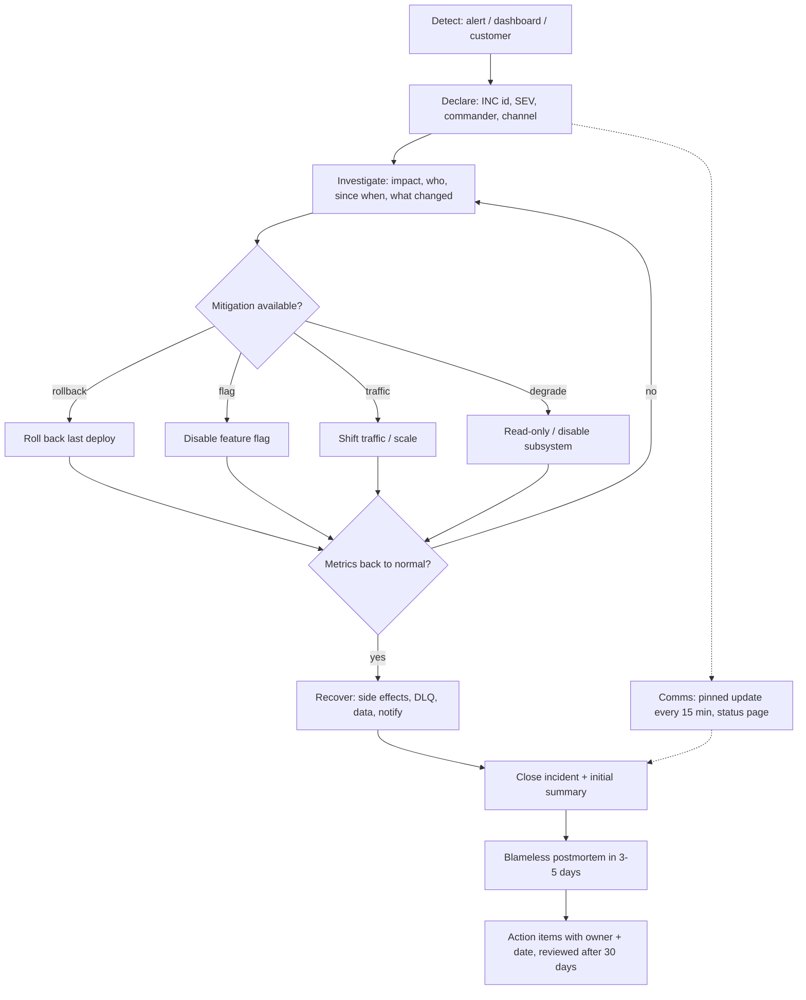

# Module 6.7 — الاستجابة للحوادث
## Incident Response: severity, on-call, detect → investigate → mitigate → recover → learn, communication during incidents, blameless postmortems

> **المستوى:** Level 6 | **الموقع:** [7 من 9]
> **السابق:** [M6.6 — Observability](module-6.6-observability.md) | **التالي:** [M6.8 — Product Thinking](module-6.8-product-thinking.md)

---

## 1. المتطلبات
- [ ] التنبيهات على الأعراض، اللوحات، traceId للربط — [M6.6](module-6.6-observability.md)
- [ ] runbooks القابلة للتنفيذ وgame days — [M6.5](module-6.5-documentation.md)
- [ ] التواصل تحت الضغط: التحديث المثبّت، الجماهير الثلاثة — [M6.4](module-6.4-engineering-communication.md)
- [ ] التراجع عن نشر، feature flags، N/N-1 — [L5-M5.10](../level-5-building-real-software/module-5.10-deployment.md)
- [ ] منهجية التصحيح: دليل → فرضية → تجربة — [L4-M4.12](../level-4-software-engineering-foundations/module-4.12-debugging-deeply.md)
- [ ] الـ PR الصغير وقابلية `git revert` — [M6.1](module-6.1-working-in-a-team.md)

## 2. أهداف التعلّم
- تصنيف الحادثة بـ**مصفوفة خطورة** (SEV-1…4) مبنية على أثر المستخدم والمال والبيانات لا على "كم يبدو مخيفًا"، وربط كل مستوى بزمن استجابة ومن يُستدعى.
- تشغيل الحلقة **detect → investigate → mitigate → recover → learn** بالأدوار الثلاثة (قائد الحادثة، مسؤول التواصل، المشغّلون) — والقاعدة الذهبية: **أوقف النزيف قبل أن تفهم السبب**.
- اتّخاذ قرارات التخفيف الشائعة بسرعة: تراجع، إطفاء flag، تحويل الحركة، تقليل الوظيفة (degrade)، زيادة السعة — ومعرفة متى **لا** تُعيد التشغيل.
- التواصل أثناء الحادثة: تحديث مثبّت بصيغة ثابتة كل N دقيقة، صفحة الحالة، ومتى يُبلَّغ العملاء.
- كتابة **postmortem بلا لوم**: جدول زمني بالدليل، عوامل مساهمة (لا "سبب جذري" واحد)، ما سار جيّدًا، بنود عمل بمالك وموعد — ولماذا "خطأ بشري" ليس خاتمة بل بداية سؤال.

---

## 3. شرح للمبتدئ

### الحادثة ستحدث
كل نظام في الإنتاج **سيفشل**؛ السؤال ليس "هل" بل "كم سريعًا نكتشف، كم سريعًا نُخفّف، وماذا نتعلّم". الفريق الناضج لا يُقاس بغياب الحوادث (ذلك يعني أنه لا يغيّر شيئًا) بل بـ **MTTR** (متوسّط زمن الاستعادة) وبأن الحادثة نفسها لا تتكرّر. الـ 99.9% التي وعدت بها (M6.6) تعني 43 دقيقة توقّف شهريًا — وتلك الدقائق تُنفَق أثناء الحوادث.

### ما الحادثة؟ ومصفوفة الخطورة
الحادثة: **حدث غير مخطّط يُضعف الخدمة أو يهدّد بياناتها أو أمنها بما يتطلّب استجابة فورية**. ليست كل تنبيه حادثة، وليس كل خطأ تنبيهًا. الخطورة تُحدَّد بالأثر:

| المستوى | الأثر | أمثلة Project 6 | الاستجابة |
|---|---|---|---|
| **SEV-1** | توقّف كامل أو فقدان/تسريب بيانات أو أثر مالي واسع | API معطّلة للجميع؛ مدفوعات مزدوجة؛ تسريب بين مستأجرين | فورًا، 24/7، قائد حادثة، تحديثات كل 15 دقيقة، إبلاغ العملاء |
| **SEV-2** | ميزة رئيسية معطّلة لشريحة كبيرة أو تدهور شديد | تسجيل الدخول يفشل 20%؛ p99 ×10؛ الطابور متوقّف | فورًا في ساعات العمل، خلال 30 دقيقة خارجها |
| **SEV-3** | ميزة ثانوية معطّلة أو حلّ بديل متاح | التصدير يفشل؛ بريد التأكيد متأخّر ساعة | يوم العمل التالي |
| **SEV-4** | تجميلي أو أثر ضئيل | خطأ إملائي؛ لوحة داخلية | تذكرة عادية |

قاعدتان: **عند الشكّ صنّف أعلى** ثم خفّض (الرفع لاحقًا أصعب)، و**الأمن والبيانات دائمًا SEV-1 حتى يثبت العكس**.

### الحلقة الخمسية
```
detect ──▶ investigate ──▶ mitigate ──▶ recover ──▶ learn
  ▲            │   ▲           │
  │            └───┘ (كرّر)     │
  └── أحيانًا يكشف التخفيف أن التشخيص خاطئ ──┘
```
1. **Detect** (اكتشاف): تنبيه (الأفضل)، لوحة، أو شكوى عميل (الأسوأ: يعني أن المراقبة فشلت — بند postmortem). الخطوة الأولى: **أعلن الحادثة** صراحةً (قناة، معرّف، خطورة، قائد). الإعلان المبكر رخيص؛ التأخّر "حتى نتأكّد" مكلف.
2. **Investigate** (تحقيق): ما الأثر؟ من يتأثّر؟ متى بدأ؟ **ما الذي تغيّر؟** (نشر، flag، تهيئة، هجرة، تبعية خارجية، حمل) — 70% من الحوادث يسبقها تغيير خلال ساعات. مقياس → trace → سجل (M6.6). فرضية واحدة في كل مرة، بدليل.
3. **Mitigate** (تخفيف): **أوقف النزيف أولًا** حتى لو لم تفهم السبب. الأدوات بترتيب السرعة: تراجع عن آخر نشر؛ إطفاء flag؛ تحويل الحركة بعيدًا عن نسخة/منطقة؛ تقليل الوظيفة (إيقاف ميزة، وضع القراءة فقط، إغلاق الكاش المعطّل)؛ زيادة السعة؛ حظر مصدر حمل مسيء. التحقيق في السبب الجذري **بعد** الاستقرار.
4. **Recover** (استعادة): التحقّق من عودة المقاييس إلى الطبيعي، معالجة الآثار (DLQ، وظائف مكرّرة، بيانات متضرّرة، إشعار المتأثّرين)، إغلاق الحادثة رسميًا مع ملخّص أوّلي.
5. **Learn** (تعلّم): postmortem خلال 3–5 أيام، بنود عمل تُتابَع كأي عمل آخر.

### الأدوار
في حادثة بثلاثة أشخاص فأكثر، الفوضى هي العدو. ثلاثة أدوار صريحة (قد يجمعها شخص واحد في فريق صغير، لكن يُسمّى):
- **قائد الحادثة (Incident Commander)**: يقرّر، يوزّع المهام، يحمي المشغّلين من المقاطعة، لا يكتب كودًا ولا يُصحّح بنفسه.
- **مسؤول التواصل (Comms)**: التحديث المثبّت، صفحة الحالة، الردّ على الإدارة والدعم — كي لا يُسأل المشغّلون "ما الوضع؟" كل 3 دقائق.
- **المشغّلون (Operators)**: يحقّقون ويُخفّفون؛ كل فرضية وتجربة **تُكتب في القناة** لحظتها (الجدول الزمني يُبنى من هنا).

### التواصل أثناء الحادثة
صيغة التحديث المثبّت (M6.4)، كل 15 دقيقة لـ SEV-1 حتى لو "لا جديد":
```
[SEV-1 | INC-2026-041 | تحديث #3 | 10:45] 
الأثر: 30% من طلبات الدفع تفشل منذ 10:12 (مستأجرو منطقة EU).
ما نعرفه: بدأ بعد نشر api v2026.10.01.3 الساعة 10:08؛ p99 لـ payments-svc طبيعي؛ الأخطاء من الـ api نفسها.
ما نفعله: تراجع إلى الإصدار السابق جارٍ (ETA 5 دقائق)؛ قناة التحقيق #inc-041-tech.
التالي: تحديث الساعة 11:00 أو عند اكتمال التراجع.
قائد الحادثة: سارة · تواصل: أحمد
```
**صفحة الحالة** للعملاء (SEV-1/2 بأثر خارجي): اعتراف مبكر بصيغة بسيطة ("نحقّق في ارتفاع أخطاء الدفع؛ التحديث التالي خلال 30 دقيقة") أفضل من صمت يملؤه العملاء بالتخمين. لا تَعِد بموعد لا تملكه.

### متى لا تُعيد التشغيل؟
إعادة التشغيل تخفيف مشروع كثيرًا (تسريب ذاكرة، عملية معلّقة). لكنها **تمحو الدليل**: heap، الاتصالات، الحالة. قبلها: التقط `heap snapshot`/`pg_stat_activity`/السجلات الأخيرة إن أمكن خلال دقيقة؛ وإن كان الأثر SEV-1 نشطًا فأعد التشغيل ودوّن أنّ الدليل ضاع. وإن كانت الحادثة **أمنية** فلا تُعِد التشغيل ولا تحذف شيئًا قبل عزل النظام والتقاط الصورة (الأدلة الجنائية).

### Postmortem بلا لوم
الهدف: أن يصبح النظام والعملية أقوى؛ لا أن نجد من نلومه. **لماذا "بلا لوم"؟** ليس لطفًا بل فعّالية: إن خاف الناس من اللوم أخفوا المعلومات، والـ postmortem التالي سيُبنى على نصف الحقيقة. "خطأ بشري" ليس خاتمة؛ هو بداية السؤال: **لماذا كان الخطأ ممكنًا وسهلًا؟ ولماذا لم يُكتشف؟ ولماذا كان أثره كبيرًا؟** — الجواب دائمًا في النظام: غياب بوّابة، runbook غامض، واجهة تسمح بالخطر بنقرة.

بنية الوثيقة:
```markdown
# INC-2026-041: فشل 30% من المدفوعات في EU (SEV-1، 47 دقيقة)
## الملخّص (3 أسطر: ماذا، كم، لمن، كيف انتهى)
## الأثر (أرقام: طلبات فاشلة، عملاء، مال، SLO المحروق)
## الجدول الزمني (UTC، بالدليل: من أطلق ماذا، متى اكتُشف، كل قرار)
10:08 نشر v…3 (PR #612) · 10:12 بدء الأخطاء (المقياس) · 10:19 تنبيه ErrorBudgetBurnFast · 10:21 إعلان SEV-1 ·
10:31 فرضية payments-svc (مرفوضة: p99 طبيعي) · 10:38 ربط بالنشر · 10:41 بدء التراجع · 10:46 تعافٍ · 10:59 إغلاق
## العوامل المساهمة (عدّة، لا "سبب جذري" واحد)
- تغيير التهيئة في #612 أزال timeout الافتراضي لعميل الدفع في منطقة EU فقط (متغيّر بيئة مختلف).
- لا اختبار يغطّي تهيئة EU؛ staging يعمل بتهيئة US.
- التنبيه تأخّر 7 دقائق (for: 5m + تقييم) — مقبول لكنه 15% من زمن الحادثة.
- قائمة التراجع تطلّبت 3 دقائق للعثور على الأمر؛ لم يكن في runbook.
## ما سار جيّدًا
إعلان مبكر؛ التواصل كل 15 دقيقة؛ التراجع نجح من أول مرة.
## أين حالفنا الحظّ
لو حدث ليلًا لكان المناوب من فريق آخر بلا صلاحية نشر.
## بنود العمل (مالك + موعد + تذكرة؛ وقائي قبل كشفي قبل تخفيفي)
- [ ] اختبار CI يُشغّل التهيئة لكل منطقة ضدّ schema (@sara, 10-08, ORD-731)
- [ ] أمر التراجع في RB-00 وتدريب المناوبين عليه (@ahmed, 10-10, ORD-732)
- [ ] صلاحية نشر/تراجع لكل المناوبين (@lead, 10-15, ORD-733)
```
قواعد: **الجدول الزمني من الأدلة** (سجلات، رسائل القناة بطوابعها) لا من الذاكرة؛ **عوامل مساهمة** بصيغة الجمع؛ بنود العمل **قليلة ومملوكة ومؤرّخة** (5 بنود تُنجز أفضل من 20 تُنسى)؛ تُراجَع البنود بعد شهر.

### المناوبة (on-call) الإنسانية
المناوبة مستدامة إن: الدوران ≥ 5 أشخاص، التنبيهات الليلية نادرة (M6.6)، تعويض زمني بعد ليلة حادثة، وصلاحيات كاملة (نشر/تراجع/وصول) للمناوب — مناوب بلا صلاحية ليس مناوبًا بل جرس إنذار بشري.

---

## 4. النموذج الذهني

```
   تنبيه/شكوى ──▶ أعلن (معرّف، SEV، قائد، قناة) ──▶ ما الأثر؟ ما الذي تغيّر؟
                                                            │
                        ┌───────────────────────────────────┤
                        ▼                                   ▼
             أوقف النزيف (تراجع/flag/تحويل/degrade)   تحديث مثبّت كل 15 د (أثر/نعرف/نفعل/التالي)
                        │
                        ▼
             استقرّت المقاييس؟ ── لا ──▶ فرضية جديدة بدليل (مقياس→trace→سجل)
                        │ نعم
                        ▼
             استعادة: الآثار (DLQ، بيانات، إشعارات) → إغلاق
                        │
                        ▼
             postmortem بلا لوم خلال 5 أيام: جدول زمني بالدليل · عوامل مساهمة · بنود بمالك وموعد
```

ثلاث قواعد لا تُكسر: (1) **التخفيف قبل الفهم**؛ (2) **كل خطوة تُكتب في القناة لحظتها**؛ (3) **"خطأ بشري" يبدأ السؤال ولا يُنهيه**.

---

## 5. الرسم التوضيحي



---

## 6. مثال بسيط

10:19 تنبيه `ErrorBudgetBurnFast`. مهندس مبتدئ يفتح السجلات ويبدأ بقراءة stack traces بحثًا عن السبب. 25 دقيقة لاحقًا يجد خطأ timeout في عميل الدفع ويبدأ بكتابة إصلاح.

المهندس المتمرّس، في نفس اللحظة: (1) 10:20 يعلن SEV-1 في `#incidents` بمعرّف وقائد؛ (2) 10:21 يسأل "ما الذي تغيّر؟" — لوحة الخدمة تُظهر خطّ نشر 10:08 قبل 4 دقائق من بدء الأخطاء؛ (3) 10:23 يبدأ التراجع **قبل أن يعرف السبب** ويكتب في القناة: "فرضية: النشر 10:08؛ إجراء: تراجع؛ إن لم يتعافَ خلال 5 دقائق ننتقل إلى فرضية التبعية"؛ (4) 10:28 الأخطاء تختفي؛ (5) 10:30 تحديث مثبّت للجميع؛ (6) ثم — وليس قبل — يفتح السجلات ليفهم لماذا، على مهل، لأجل الـ postmortem. 9 دقائق مقابل 47. الفرق ليس الذكاء؛ **الترتيب**.

---

## 7. مثال كود

أداتان صغيرتان تُجسّدان القواعد: (1) مصنّف خطورة يُجبر على التفكير بالأثر لا بالانطباع، مع زمن الاستجابة المطلوب؛ (2) مدقّق postmortem يرفض الوثائق التي تُسمّي أشخاصًا للّوم، أو تذكر "سببًا جذريًّا" واحدًا، أو تحوي بنود عمل بلا مالك وموعد، أو جدولًا زمنيًا بلا طوابع — يُشغَّل في CI على `docs/postmortems/`.

```typescript
// src/severity.ts
export interface Impact {
  usersAffectedPct: number;          // 0..100 من المستخدمين النشطين
  coreFlowBroken: boolean;           // تسجيل دخول/شراء/دفع
  dataLossOrLeak: boolean;           // فقدان، تلف، أو تسريب (بما فيه عبر المستأجرين)
  securityBreach: boolean;
  revenueImpactPerHour: number;      // بالدولار التقديري
  workaroundAvailable: boolean;
}
export type Severity = "SEV-1" | "SEV-2" | "SEV-3" | "SEV-4";
export interface Classification { severity: Severity; respondWithinMin: number; updateEveryMin: number; needsCommander: boolean; notifyCustomers: boolean; reasons: string[] }

export function classify(i: Impact): Classification {
  const reasons: string[] = [];
  let sev: Severity = "SEV-4";
  if (i.securityBreach) { sev = "SEV-1"; reasons.push("security breach is always SEV-1 until proven otherwise"); }
  if (i.dataLossOrLeak) { sev = "SEV-1"; reasons.push("data loss/leak"); }
  if (i.coreFlowBroken && i.usersAffectedPct >= 10) { sev = "SEV-1"; reasons.push(`core flow broken for ${i.usersAffectedPct}% of users`); }
  if (i.revenueImpactPerHour >= 10_000) { sev = "SEV-1"; reasons.push(`revenue impact ≥ $10k/h`); }
  if (sev !== "SEV-1") {
    if (i.coreFlowBroken || i.usersAffectedPct >= 25 || i.revenueImpactPerHour >= 1_000) { sev = "SEV-2"; reasons.push("core flow or large share degraded"); }
    else if (i.usersAffectedPct >= 1 || !i.workaroundAvailable) { sev = "SEV-3"; reasons.push("secondary feature / small share"); }
    else reasons.push("cosmetic or negligible");
  }
  const table: Record<Severity, Omit<Classification, "severity" | "reasons">> = {
    "SEV-1": { respondWithinMin: 5, updateEveryMin: 15, needsCommander: true, notifyCustomers: true },
    "SEV-2": { respondWithinMin: 30, updateEveryMin: 30, needsCommander: true, notifyCustomers: i.usersAffectedPct >= 25 },
    "SEV-3": { respondWithinMin: 8 * 60, updateEveryMin: 24 * 60, needsCommander: false, notifyCustomers: false },
    "SEV-4": { respondWithinMin: 5 * 24 * 60, updateEveryMin: 0, needsCommander: false, notifyCustomers: false },
  };
  return { severity: sev, reasons, ...table[sev] };
}

// صيغة التحديث المثبّت (M6.4) — دالّة كي لا تُنسى حقول تحت الضغط
export function statusUpdate(p: { id: string; severity: Severity; n: number; time: string; impact: string; known: string; doing: string; nextAt: string; commander: string; comms: string }): string {
  return [
    `[${p.severity} | ${p.id} | تحديث #${p.n} | ${p.time}]`,
    `الأثر: ${p.impact}`, `ما نعرفه: ${p.known}`, `ما نفعله: ${p.doing}`, `التالي: ${p.nextAt}`,
    `قائد الحادثة: ${p.commander} · تواصل: ${p.comms}`,
  ].join("\n");
}
```

```typescript
// src/postmortem-check.ts
// مدقّق postmortem بلا لوم. يُعيد مشاكل؛ فارغة = جاهز للمراجعة.
export const REQUIRED = ["الملخّص", "الأثر", "الجدول الزمني", "العوامل المساهمة", "ما سار جيّدًا", "بنود العمل"] as const;

// ملاحظة: \b لا يعمل مع العربية (حدود الكلمات ASCII)؛ لذلك بلا \b في البدائل العربية
const BLAME = /(بسبب إهمال|أخطأ\s+\S+|خطأ\s+(?:من|لـ)\s+\S+|لم ينتبه\s+\S+|carelessly|should have known|fault of|\bblame\b)/iu;
const SINGLE_ROOT_CAUSE = /السبب الجذري(?!\s*(?:ات|ة المتعدّدة))|\broot cause\b(?!s)/i;
const HUMAN_ERROR_FINAL = /^(?:[-*]\s*)?(?:خطأ بشري|human error)\.?\s*$/im;
const TIMESTAMP = /^\s*(?:[-*]\s*)?\d{2}:\d{2}(?::\d{2})?\s/m;
const ACTION = /^\s*- \[[ x]\]\s+(?<text>.+)$/gm;
const OWNER = /@[\w-]+/;
const DUE = /\b\d{2}-\d{2}\b|\b\d{4}-\d{2}-\d{2}\b/;
const TICKET = /\b[A-Z]{2,}-\d+\b|#\d+/;

export function checkPostmortem(text: string): string[] {
  const p: string[] = [];
  const sections = new Map<string, string>();
  for (const part of text.split(/^## /m).slice(1)) {
    const [h = "", ...b] = part.split("\n");
    sections.set(h.trim(), b.join("\n"));
  }
  const get = (name: string) => [...sections.entries()].find(([h]) => h.startsWith(name))?.[1];
  for (const s of REQUIRED) if (get(s) === undefined) p.push(`missing section "## ${s}"`);

  if (!/^# INC-\d{4}-\d{3}: .+\((SEV-[1-4]).*\)/m.test(text)) p.push('title must be "# INC-YYYY-NNN: <what> (SEV-N, <duration>)"');

  const m = BLAME.exec(text);
  if (m) p.push(`blame language: "${m[0]}" — describe the system condition that made the mistake possible`);
  if (SINGLE_ROOT_CAUSE.test(text)) p.push('"root cause" (singular) — list contributing factors instead');
  if (HUMAN_ERROR_FINAL.test(text)) p.push('"human error" as a final line — ask why it was possible, undetected, and impactful');

  const timeline = get("الجدول الزمني") ?? "";
  const stamped = timeline.split("\n").filter((l) => TIMESTAMP.test(l)).length;
  if (stamped < 4) p.push(`timeline needs ≥ 4 timestamped entries from evidence (found ${stamped})`);
  if (!/اكتُشف|تنبيه|alert|detected/i.test(timeline)) p.push("timeline must mark when/how it was detected");
  if (!/أُعلن|إعلان|declared/i.test(timeline)) p.push("timeline must mark when the incident was declared");

  const factors = (get("العوامل المساهمة") ?? "").split("\n").filter((l) => /^\s*- /.test(l)).length;
  if (factors < 2) p.push(`contributing factors: list ≥ 2 (found ${factors}) — incidents are never one thing`);

  const actions = [...(get("بنود العمل") ?? "").matchAll(ACTION)].map((x) => x.groups!["text"]!);
  if (actions.length === 0) p.push("no action items");
  if (actions.length > 7) p.push(`${actions.length} action items — keep ≤ 7 that will actually get done`);
  for (const a of actions) {
    if (!OWNER.test(a)) p.push(`action without owner (@name): "${a.slice(0, 40)}"`);
    if (!DUE.test(a)) p.push(`action without due date: "${a.slice(0, 40)}"`);
    if (!TICKET.test(a)) p.push(`action without ticket: "${a.slice(0, 40)}"`);
  }
  if (!/أين حالفنا الحظّ|where we got lucky/i.test(text)) p.push('add "## أين حالفنا الحظّ" — near-misses are free lessons');
  return p;
}
```

```typescript
// src/incident.test.ts
import { test } from "node:test";
import assert from "node:assert/strict";
import { classify, statusUpdate } from "./severity.ts";
import { checkPostmortem } from "./postmortem-check.ts";

test("severity: impact-driven, security/data always SEV-1, doubt rounds up", () => {
  const leak = classify({ usersAffectedPct: 0.1, coreFlowBroken: false, dataLossOrLeak: true, securityBreach: false, revenueImpactPerHour: 0, workaroundAvailable: true });
  assert.equal(leak.severity, "SEV-1");
  assert.equal(leak.needsCommander, true);
  const payments = classify({ usersAffectedPct: 30, coreFlowBroken: true, dataLossOrLeak: false, securityBreach: false, revenueImpactPerHour: 4000, workaroundAvailable: false });
  assert.equal(payments.severity, "SEV-1");
  assert.equal(payments.updateEveryMin, 15);
  const exportBroken = classify({ usersAffectedPct: 5, coreFlowBroken: false, dataLossOrLeak: false, securityBreach: false, revenueImpactPerHour: 0, workaroundAvailable: true });
  assert.equal(exportBroken.severity, "SEV-3");
  const typo = classify({ usersAffectedPct: 0, coreFlowBroken: false, dataLossOrLeak: false, securityBreach: false, revenueImpactPerHour: 0, workaroundAvailable: true });
  assert.equal(typo.severity, "SEV-4");
});

test("status update has every field", () => {
  const s = statusUpdate({ id: "INC-2026-041", severity: "SEV-1", n: 3, time: "10:45", impact: "30% من المدفوعات", known: "بدأ بعد نشر 10:08", doing: "تراجع جارٍ", nextAt: "11:00", commander: "سارة", comms: "أحمد" });
  for (const k of ["الأثر:", "ما نعرفه:", "ما نفعله:", "التالي:", "قائد الحادثة:"]) assert.ok(s.includes(k));
});

const GOOD = `# INC-2026-041: فشل 30% من المدفوعات في EU (SEV-1، 47 دقيقة)
## الملخّص
تهيئة EU فقدت timeout؛ 30% من المدفوعات فشلت 47 دقيقة؛ تعافٍ بالتراجع.
## الأثر
1,240 طلب دفع فاشل؛ 310 عملاء؛ ~18k$ مؤجّلة؛ 110% من ميزانية خطأ الشهر.
## الجدول الزمني
10:08 نشر v3 (PR #612)
10:12 بدء الأخطاء (مقياس 5xx)
10:19 تنبيه ErrorBudgetBurnFast — اكتُشف
10:21 أُعلن SEV-1، قائد: سارة
10:41 بدء التراجع
10:46 تعافٍ
## العوامل المساهمة
- تهيئة EU بلا timeout بعد #612 (متغيّر بيئة مختلف عن US).
- staging يعمل بتهيئة US فقط؛ لا اختبار لكل منطقة.
- أمر التراجع غير موجود في runbook (3 دقائق بحث).
## ما سار جيّدًا
إعلان مبكر وتواصل منتظم.
## أين حالفنا الحظّ
لو حدث ليلًا لكان المناوب بلا صلاحية نشر.
## بنود العمل
- [ ] اختبار CI للتهيئة لكل منطقة (@sara, 10-08, ORD-731)
- [ ] أمر التراجع في RB-00 (@ahmed, 10-10, ORD-732)
`;

test("postmortem checker: good passes; blame, single root cause, unowned actions fail", () => {
  assert.deepEqual(checkPostmortem(GOOD), []);
  const bad = GOOD
    .replace("## العوامل المساهمة\n- تهيئة EU بلا timeout بعد #612 (متغيّر بيئة مختلف عن US).\n- staging يعمل بتهيئة US فقط؛ لا اختبار لكل منطقة.\n- أمر التراجع غير موجود في runbook (3 دقائق بحث).", "## العوامل المساهمة\n- السبب الجذري: أخطأ أحمد في التهيئة.\nخطأ بشري")
    .replace("(@sara, 10-08, ORD-731)", "")
    .replace("## أين حالفنا الحظّ\nلو حدث ليلًا لكان المناوب بلا صلاحية نشر.\n", "");
  const p = checkPostmortem(bad);
  for (const needle of ["blame language", "root cause", "human error", "contributing factors", "without owner", "without due date", "near-misses"]) {
    assert.ok(p.some((x) => x.includes(needle)), `expected "${needle}" in ${JSON.stringify(p)}`);
  }
});
```

```bash
# قائمة الدقيقة الأولى (تُطبع وتُعلَّق قرب المناوب)
1. أعلن:   /incident declare "payments failing EU" --sev 1      # معرّف + قناة + قائد تلقائيًا
2. أثر:    لوحة الخدمة → RED → من/كم/منذ متى؟
3. تغيّر؟  آخر نشر/flag/هجرة/تهيئة خلال 6 ساعات؟  gh run list -L 5 ; flags list --changed 6h
4. خفّف:   تراجع  kubectl rollout undo deploy/api  |  flag off <name>  |  degrade
5. اكتب:   كل فرضية/إجراء في القناة بطابع زمني — هذا هو الجدول الزمني لاحقًا
6. تواصل:  تحديث مثبّت #1 خلال 10 دقائق (الصيغة في statusUpdate)
```

---

## 8. مثال من العالم الحقيقي
شركة SaaS متوسطة كانت تعالج الحوادث "بالموهبة": أفضل مهندس يدخل، يصلح، ويخرج. MTTR ممتاز حين يكون موجودًا، وكارثي حين يكون في إجازة (حادثة من 6 ساعات لمشكلة تُحلّ بتراجع). بعد اعتماد الحلقة والأدوار والـ runbooks: الـ MTTR لم يتحسّن للحوادث التي كان "البطل" يحلّها، لكن **التباين** اختفى — المناوب الأصغر يحلّ 80% من الحوادث في < 15 دقيقة لأن القرار الأول دائمًا "ما الذي تغيّر؟ تراجع". والبطل نفسه أصبح يكتب runbooks بدل أن يُوقَظ. الدرس: الاستجابة الجيّدة **عملية** تجعل الشخص العادي فعّالًا، لا موهبة تجعل شخصًا واحدًا لا غنى عنه.

## 9. مثال من الإنتاج
حادثة أمنية: تنبيه من مزوّد السحابة عن مفتاح وصول مُسرَّب في مستودع عام. المهندس الأول، بحسن نيّة، حذف المفتاح من المستودع وأعاد تشغيل الخدمات "لتنظيف الحالة" — ومحا بذلك سجلات الوصول المحلية وجعل تتبّع ما فعله المهاجم خلال الساعات الثلاث السابقة شبه مستحيل. الـ postmortem (بلا لوم) سأل: لماذا كان ذلك الإجراء هو الأقرب؟ لأن runbook الحوادث الأمنية لم يكن موجودًا، ولأن "أعد التشغيل" كان الإجراء المعتاد في كل حادثة أخرى. الإصلاحات: runbook أمني بترتيب صارم (**إبطال المفتاح** → **عزل** → **التقاط الأدلة** → ثم التنظيف)، فحص CI للأسرار قبل الدفع (M5.4)، ومفاتيح قصيرة العمر عبر OIDC (M5.12) حتى يصبح تسريب المفتاح الدائم مستحيلًا لا نادرًا. لاحظ أن أيًّا من البنود لم يكن "درّب المهندس على ألّا يُعيد التشغيل".

---

## 10. مفاهيم خاطئة شائعة
1. **"نجد السبب الجذري ثم نُصلح."** أثناء الحادثة التخفيف أولًا؛ السبب لاحقًا على مهل. المستخدم لا يهمّه لماذا.
2. **"للحادثة سبب جذري واحد."** دائمًا سلسلة عوامل؛ إصلاح واحد يترك الباقي ينتظر الحادثة التالية.
3. **"بلا لوم = بلا مساءلة."** المساءلة عن **بنود العمل** والنظام؛ اللوم عن الأفراد يُخفي المعلومات ويقتل التعلّم.
4. **"الحوادث القليلة علامة جودة."** قد تكون علامة أن لا أحد يُعلنها، أو أن لا شيء يتغيّر؛ قِس MTTR والتكرار.
5. **"المناوب يجب أن يفهم كل شيء."** المناوب يُنفّذ runbooks ويُصعّد؛ الفهم العميق لوقت الـ postmortem.
6. **"إبلاغ العملاء يُضرّ بالسمعة."** الصمت يُضرّ أكثر؛ الاعتراف المبكر بصيغة بسيطة يبني الثقة.

## 11. أخطاء شائعة
1. تأخير الإعلان "حتى نتأكّد" → 20 دقيقة ضائعة وبلا قائد ولا قناة.
2. خمسة أشخاص يُصحّحون معًا بلا أدوار؛ اثنان يُعيدان تشغيل نفس الخدمة في وقت واحد.
3. إعادة التشغيل أولًا في حادثة أمنية أو تسريب ذاكرة → ضياع الدليل.
4. "إصلاح سريع" يُكتب ويُنشر أثناء الحادثة بدل التراجع → حادثة ثانية فوق الأولى.
5. التحقيق في القناة الرئيسية → الإدارة والدعم يغرقون؛ قناة تقنية منفصلة + تحديث مثبّت.
6. postmortem بعد 3 أسابيع من الذاكرة → جدول زمني خيالي؛ خلال 5 أيام من الأدلة.
7. 20 بند عمل بلا مالك → لا يُنجز شيء؛ ≤ 7 بمالك وموعد وتُراجَع بعد شهر.
8. المناوب بلا صلاحية نشر/تراجع → ينتظر من يملكها؛ الصلاحيات جزء من المناوبة.

## 12. تمرين تصحيح
الساعة 02:10، تنبيه `LatencyP99High` على `GET /v1/orders`؛ أنت المناوب ولم تكتب هذا الكود.
1. **دليل:** اللوحة: p99 من 300ms إلى 6s منذ 01:55؛ معدّل الطلبات طبيعي؛ 5xx صفر؛ لا نشر منذ 18 ساعة؛ لا تغيير flags. USE: pool DB مستخدم 10/10 و`waitingCount` 40؛ Redis طبيعي. `pg_stat_activity`: 10 استعلامات `UPDATE orders SET …` منتظرة على قفل منذ دقائق، وجلسة واحدة `idle in transaction` منذ 01:54 من تطبيق `admin-tool`.
2. **فرضية:** جلسة إدارية فتحت معاملة وأخذت قفلًا على صفوف/جدول ولم تُنهِها؛ كل التحديثات خلفها تنتظر، فتستهلك pool، فتنتظر القراءات اتصالًا.
3. **تجربة:** `SELECT pid, state, xact_start, query FROM pg_stat_activity WHERE state = 'idle in transaction'` → جلسة واحدة من IP خادم الأدوات، استعلامها الأخير `ALTER TABLE orders ADD COLUMN …` بلا COMMIT.
4. **التخفيف:** `SELECT pg_terminate_backend(<pid>)` (آمن: المعاملة تُلغى) — خلال 20 ثانية تعود p99. **دوّن** في القناة الوقت والأمر. ثم: SEV-2 (أثر 15 دقيقة على كل القراءات ليلًا)؛ postmortem صباحًا. بنود محتملة: `idle_in_transaction_session_timeout` على دور الأدوات (M5.7)، الهجرات عبر pipeline لا يدويًا (M5.10)، تنبيه على `idle in transaction > 60s`، وإضافة هذا المسار إلى RB-02.
5. **أين أيضًا؟** أي دور DB بلا `statement_timeout`/`idle_in_transaction_session_timeout`؛ أي أداة إدارية تتصل مباشرة بالإنتاج بصلاحيات DDL.

## 13. تمرين معماري
صمّم **برنامج الاستجابة للحوادث** لفريق Project 6 من 6 مهندسين: (1) مصفوفة الخطورة الخاصة بمنتجك بأمثلة ملموسة لكل مستوى وزمن استجابة؛ (2) جدول المناوبة (دوران، تسليم، تعويض، صلاحيات المناوب)؛ (3) أدوات الدقيقة الأولى: أمر الإعلان، القنوات، قالب التحديث، صفحة الحالة ومن يملكها؛ (4) قائمة التخفيفات الجاهزة لكل مكوّن (api/worker/DB/Redis/تبعيات) وأوامرها الحرفية، وما يُمنع (إعادة تشغيل في الأمن)؛ (5) قالب postmortem وقواعد "بلا لوم" ومراجعة البنود بعد 30 يومًا؛ (6) game day ربع سنوي: سيناريوهان (pool exhausted، تسريب مفتاح) بدور لكل شخص؛ (7) مقاييس البرنامج: MTTD/MTTR، نسبة الحوادث المكتشفة بالتنبيه لا بالعميل، نسبة بنود العمل المنجزة — بصيغة ACTRR للخيارات غير البديهية.

## 14. الصلة بعصر AI
أثناء الحادثة، AI مساعد ممتاز للـ **تلخيص** (10k سطر سجل → 3 فرضيات مرتّبة بالدليل)، ولصياغة التحديث المثبّت من ملاحظات القناة، ولبناء الجدول الزمني من طوابع الرسائل للـ postmortem (L8-M8.4). وهو خطر في **التنفيذ**: وكيل بصلاحية إنتاج "يُصلح" أثناء الحادثة قد يُنفّذ إعادة تشغيل تمحو الدليل أو هجرة تُفاقم الضرر — قاعدة M8.10: human-in-the-loop لكل فعل مُغيِّر أثناء SEV-1/2، والوكيل يقترح الأمر ويُنفّذه إنسان. والنتيجة الطريفة: الـ runbooks الجيّدة (M6.5) هي بالضبط ما يجعل اقتراحات الوكيل دقيقة — فريق بلا runbooks يحصل على وكيل يخمّن مثله.

## 15–17. Master / Understand / Defer
- 🔴 مصفوفة الخطورة بالأثر و"عند الشكّ صنّف أعلى"؛ الحلقة الخمسية والتخفيف قبل الفهم؛ "ما الذي تغيّر؟" كسؤال أول؛ الأدوار الثلاثة؛ التحديث المثبّت بصيغة ثابتة؛ كل خطوة تُكتب لحظتها؛ postmortem بلا لوم بجدول زمني من الأدلة وعوامل مساهمة وبنود بمالك وموعد؛ "خطأ بشري" يبدأ السؤال.
- 🟠 صفحة الحالة وإبلاغ العملاء؛ متى لا تُعيد التشغيل والأدلة الجنائية؛ تصميم المناوبة المستدامة؛ MTTD/MTTR؛ game days؛ مراجعة بنود العمل.
- ⚪ أُطر إدارة الحوادث الكبرى (ICS)، متطلبات الإبلاغ التنظيمي (GDPR 72 ساعة) بالتفصيل، أدوات إدارة الحوادث التجارية.

## 18. الخلاصة
1. الحادثة ستحدث؛ النضج = اكتشاف سريع، تخفيف سريع، وعدم تكرار.
2. صنّف بالأثر (مستخدمون، مال، بيانات، أمن)؛ عند الشكّ ارفع.
3. أعلن مبكرًا، اسأل "ما الذي تغيّر؟"، وأوقف النزيف (تراجع/flag/تحويل/degrade) قبل أن تفهم.
4. أدوار صريحة، كل خطوة مكتوبة لحظتها، تحديث مثبّت كل 15 دقيقة، قناة تقنية منفصلة.
5. postmortem خلال 5 أيام: جدول زمني بالدليل، عوامل مساهمة متعدّدة، ≤ 7 بنود بمالك وموعد — وبلا لوم لأن اللوم يُخفي الحقيقة.

## 19. مراجع رسمية
- Google SRE Book — Managing Incidents: https://sre.google/sre-book/managing-incidents/
- Google SRE Book — Postmortem Culture: Learning from Failure: https://sre.google/sre-book/postmortem-culture/
- Google SRE Workbook — Incident Response & Postmortem examples: https://sre.google/workbook/incident-response/
- PagerDuty Incident Response documentation (roles, severity, comms): https://response.pagerduty.com/
- Atlassian Incident Management Handbook: https://www.atlassian.com/incident-management/handbook
- Etsy — Blameless PostMortems and a Just Culture: https://www.etsy.com/codeascraft/blameless-postmortems
- PostgreSQL — `pg_stat_activity`, `pg_terminate_backend`: https://www.postgresql.org/docs/current/monitoring-stats.html · https://www.postgresql.org/docs/current/functions-admin.html
- NIST SP 800-61 — Computer Security Incident Handling Guide: https://csrc.nist.gov/pubs/sp/800/61/r3/final

## المصطلحات
| العربية | English |
|---|---|
| حادثة | Incident |
| مستوى الخطورة | Severity (SEV-1…4) |
| إعلان الحادثة | Incident declaration |
| قائد الحادثة | Incident Commander |
| مسؤول التواصل | Communications lead |
| المناوبة | On-call |
| اكتشاف → تحقيق → تخفيف → استعادة → تعلّم | Detect → Investigate → Mitigate → Recover → Learn |
| تخفيف | Mitigation |
| تراجع / إطفاء علم / تقليل الوظيفة | Rollback / Flag off / Degrade |
| متوسّط زمن الاكتشاف / الاستعادة | MTTD / MTTR |
| صفحة الحالة | Status page |
| تحديث مثبّت | Pinned status update |
| تقرير ما بعد الحادثة | Postmortem |
| بلا لوم | Blameless |
| الجدول الزمني | Timeline |
| العوامل المساهمة | Contributing factors |
| بند عمل | Action item |
| أين حالفنا الحظّ | Where we got lucky (near-miss) |
| الأدلة الجنائية | Forensics / evidence preservation |
