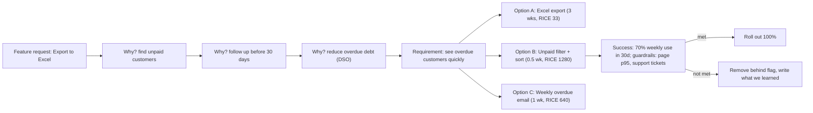

# Module 6.8 — التفكير بمنطق المنتج
## Product Thinking: feature ≠ requirement; user, problem, business goal, constraint, success criteria; saying no; measuring outcomes

> **المستوى:** Level 6 | **الموقع:** [8 من 9]
> **السابق:** [M6.7 — Incident Response](module-6.7-incident-response.md) | **التالي:** [M6.9 — Software Architecture Styles](module-6.9-architecture-styles.md)

---

## 1. المتطلبات
- [ ] المتطلبات: 5 Whys، الوظيفية/غير الوظيفية، من الطلب إلى الحاجة — [L4-M4.2](../level-4-software-engineering-foundations/module-4.2-requirements.md)
- [ ] قصص المستخدم ومعايير القبول — [L4-M4.3](../level-4-software-engineering-foundations/module-4.3-user-stories-acceptance-criteria.md)
- [ ] التذكرة بالنطاق داخل/خارج — [M6.1](module-6.1-working-in-a-team.md)
- [ ] ACTRR والطلب الصريح — [M6.4](module-6.4-engineering-communication.md)
- [ ] مقاييس الأعمال في اللوحات (orders_created_total …) — [M6.6](module-6.6-observability.md)
- [ ] feature flags للطرح التدريجي — [L5-M5.10](../level-5-building-real-software/module-5.10-deployment.md)
- [ ] الدين التقني كقرار اقتصادي — [L4-M4.15](../level-4-software-engineering-foundations/module-4.15-tech-debt.md)

## 2. أهداف التعلّم
- التمييز بين **الميزة** (حلّ مقترح) و**المتطلب** (حاجة يجب تلبيتها) و**النتيجة** (تغيّر قابل للقياس في سلوك المستخدم أو الأعمال) — ولماذا بناء الميزة كما طُلبت غالبًا أسوأ ما يمكن فعله.
- تفكيك أي طلب إلى الإطار الخماسي: **User / Problem / Business goal / Constraint / Success criteria** قبل تقدير أو تصميم.
- **قول لا** (أو "ليس الآن") بطريقة تبني الثقة: بالبيانات، بالبدائل الأرخص، وبترتيب أولويات شفّاف (RICE أو ما يشبهه) بدل الذوق.
- **قياس النتائج** لا المخرجات: تعريف مقياس نجاح ومقاييس حراسة قبل البناء، طرح تدريجي، قراءة النتيجة بأمانة، وإزالة ما لم ينجح.
- فهم موقع المهندس في المثلث (منتج/تصميم/هندسة): ليس منفّذًا للطلبات ولا مالكًا للقرار وحده، بل شريكًا يُحضر **ما الممكن وبأي كلفة**.

---

## 3. شرح للمبتدئ

### "ابنِ ما طُلب" فخّ
الطلب: *"أضف زرّ تصدير إلى Excel".* المهندس المطيع يبنيه في 3 أيام. بعد شهر: استخدمه 4 أشخاص مرة واحدة. ماذا حدث؟ الطالب (مدير حسابات) أراد **أن يعرف أي العملاء لم يدفعوا**؛ كان يُصدّر الجدول ويُفلتره يدويًا. الحلّ الصحيح كان فلتر "غير مدفوع" في الواجهة — نصف يوم، ويستخدمه الجميع يوميًا. **الميزة** كانت "تصدير Excel"؛ **المتطلب** "رؤية المتأخّرين"؛ **النتيجة** "تقليل زمن المتابعة". بناء الميزة كما طُلبت أعطى 0 من النتيجة بـ 6 أضعاف الكلفة.

> **feature ≠ requirement ≠ outcome.** الطالب يقترح حلًّا (feature) لأنه لا يعرف ما الممكن؛ عملك أن تسأل عن الحاجة (requirement) وما يجب أن يتغيّر (outcome) ثم تقترح الحلّ الأرخص الذي يحقّقه.

### الإطار الخماسي: قبل أي تقدير
```
User:              من بالضبط؟ (دور، سياق، تواتر) — "مدير حسابات في مستأجر بـ > 200 طلب/شهر"، لا "المستخدمون"
Problem:           ما الألم اليوم بصيغة سلوك قابل للملاحظة؟ — "يُصدّر ويُفلتر يدويًا 40 دقيقة أسبوعيًا ليجد المتأخّرين"
Business goal:     لماذا تهتمّ الشركة؟ — "تقليل الديون المتأخّرة (DSO) / الاحتفاظ بالعملاء الكبار"
Constraint:        ما الحدود؟ — "قبل نهاية الربع؛ بلا تغيير في API العامة؛ PII لا تغادر النظام"
Success criteria:  كيف نعرف أنه نجح، رقمًا وموعدًا؟ — "70% من مديري الحسابات يستخدمون الفلتر أسبوعيًا خلال 30 يومًا؛ انخفاض التصدير اليدوي 50%"
```
إن لم تستطع ملء الخمسة، **لا تبدأ** — ليس عنادًا بل لأن أي تصميم أو تقدير بلا إطار تخمين. وغالبًا ملؤها يُغيّر الحلّ كليًّا (كما في المثال).

### المخرجات مقابل النتائج
| | المخرج (Output) | النتيجة (Outcome) |
|---|---|---|
| ما هو | شيء شحنّاه | تغيّر في سلوك المستخدم/الأعمال |
| مثال | "أطلقنا فلتر غير مدفوع" | "زمن متابعة المتأخّرين انخفض 60%" |
| يُقاس بـ | PRs، نقاط، ميزات | استخدام، تحويل، احتفاظ، إيراد، زمن |
| الفخّ | فريق "منتج" يشحن كثيرًا ولا يغيّر شيئًا | — |

الشركة لا تدفع للميزات؛ تدفع للنتائج. والفريق الذي يُقاس بالمخرجات يُنتج ميزات؛ الذي يُقاس بالنتائج يُنتج قيمة — ويحذف ما لا يعمل.

### قول لا (أو "ليس الآن")
المهندس الذي يقول "نعم" لكل شيء لا يُنجز شيئًا جيّدًا. لكن "لا" العارية تُقابَل بـ"لماذا؟" وتوتّر. "لا" الجيّدة:
1. **أعِد الصياغة بالإطار**: "أفهم أن المشكلة X للمستخدم Y؛ صحيح؟" (غالبًا يتبيّن أن الميزة المطلوبة ليست الحلّ الوحيد).
2. **كلفة الفرصة بالأرقام**: "هذه 3 أسابيع؛ تعني تأخير Z الذي يخدم 80% من المستأجرين. هل هذا ما تريد؟" — القرار لمالك المنتج، لكن بثمن معلن.
3. **البديل الأرخص**: "نستطيع تحقيق 80% من النتيجة بفلتر في نصف يوم؛ نقيس، ثم نقرّر الباقي."
4. **"ليس الآن" بمعيار**: "حين يطلبه 3 مستأجرين من الشريحة الكبرى / حين ينخفض الدين التقني في الوحدة X" — شرط قابل للتحقّق، لا وعد غامض.
5. **اكتبها** في التذكرة مع السبب؛ "لا" غير المكتوبة تعود بعد شهر كأنها جديدة.

### ترتيب الأولويات بشفافية: RICE
بدل "من يصرخ أعلى"، إطار عددي بسيط يُجبر على إظهار الافتراضات:
```
RICE = (Reach × Impact × Confidence) / Effort
Reach:       كم مستخدمًا/حدثًا في الفترة (ربع)؟          مثال: 400 مدير حسابات
Impact:      كم يُغيّر لكل واحد؟ (0.25 ضئيل … 3 هائل)     مثال: 2
Confidence:  كم نثق بالأرقام أعلاه؟ (50% / 80% / 100%)     مثال: 80%
Effort:      أشخاص-أسابيع                                  مثال: 0.5
→ (400 × 2 × 0.8) / 0.5 = 1,280     مقابل "تصدير Excel": (400 × 0.5 × 0.5) / 3 = 33
```
الرقم ليس الحقيقة؛ **قيمته أنّ الخلاف ينتقل من "أريد" إلى "لماذا تظنّ الأثر 2 لا 0.5؟"** — نقاش قابل للحسم بالبيانات. والـ Confidence المنخفضة تقول: "اذهب واسأل 5 مستخدمين قبل أن تبني".

### القياس بأمانة
1. **عرّف المقياس قبل البناء** (وإلا ستجد لاحقًا رقمًا ما يبدو جيّدًا — تحيّز التأكيد).
2. **مقياس نجاح واحد + مقاييس حراسة** (guardrails): "استخدام الفلتر أسبوعيًا ≥ 70%" + "زمن تحميل الصفحة لا يزيد"، "التذاكر للدعم لا تزيد".
3. **اطرح تدريجيًا** (flag بنسبة أو لمستأجرين) وقارن المجموعتين في نفس الفترة؛ المقارنة "قبل/بعد" تخدعها الموسمية والحملات.
4. **اقرأ النتيجة بأمانة**: الفرق الصغير مع عيّنة صغيرة ضجيج؛ لا تُعلن نجاحًا قبل أن يستقرّ الرقم.
5. **احذف ما لم ينجح**: الميزة التي لا تحقّق نتيجتها دين — كود يُصان، واجهة تُربك، اختبارات تُشغَّل. الحذف قرار منتج ناضج.

### موقعك في المثلث
مدير المنتج يملك **"ماذا ولماذا"**، التصميم **"كيف يبدو ويُستخدم"**، الهندسة **"كيف يُبنى، بأي كلفة، وما الممكن"**. المهندس الذي يجلب إلى الطاولة: "هذا يكلّف 3 أسابيع، لكن إن قبلنا قيد X ينزل إلى 3 أيام" أو "البيانات تُظهر أن 2% فقط يصلون إلى هذه الشاشة" — يُغيّر القرار أكثر من أي كود يكتبه. وحين تتعارض الأولويات، القرار النهائي لمالك المنتج **بعد** أن يعرف الثمن (M6.4: الخبر المبكر، الخيارات، التوصية).

---

## 4. النموذج الذهني

```
   طلب ("أضف X") ──▶ أعِد الصياغة: User / Problem / Business goal / Constraint / Success criteria
                                   │
                    ┌──────────────┴──────────────┐
                    ▼                             ▼
          أرخص حلّ يحقّق النتيجة؟           أولويته مقارنةً بالباقي؟ (RICE، كلفة الفرصة)
                    │                             │
                    └──────────────┬──────────────┘
                                   ▼
                   ابنِ خلف flag ──▶ اطرح تدريجيًا ──▶ قِس (نجاح + حراسة)
                                                        │
                              ┌─────────────────────────┼─────────────────────┐
                              ▼                         ▼                     ▼
                         نجح: وسّع إلى 100%        لم ينجح: احذف          غير واضح: مدّد/عدّل
```

قاعدة الإبهام: **إن لم تستطع كتابة الرقم الذي سيجعلك تحذف الميزة، فلم تُعرّف نجاحها.**

---

## 5. الرسم التوضيحي



---

## 6. مثال بسيط

مدير المنتج: "العملاء يطلبون تطبيق جوّال." المهندس المبتدئ يبدأ تقدير React Native. المهندس المتمرّس يملأ الإطار:
- **User**: من بالضبط؟ (اتضح: مندوبو المبيعات في مستأجرين اثنين كبيرين)
- **Problem**: ماذا يفعلون اليوم؟ (يفتحون الموقع من الهاتف لمعرفة حالة الطلب أثناء زيارة العميل؛ الصفحة بطيئة وغير مناسبة للهاتف)
- **Business goal**: (الاحتفاظ بالمستأجرين الكبار؛ أحدهما يُفاوض على التجديد)
- **Constraint**: (التجديد خلال 6 أسابيع؛ فريق بلا خبرة جوّال)
- **Success**: (المندوبون يفحصون حالة الطلب من الهاتف في < 10 ثوانٍ؛ المستأجر يُجدّد)

الحلّ: صفحة "حالة الطلب" متجاوبة وسريعة + PWA قابلة للتثبيت — أسبوعان. لا متجر تطبيقات، لا فريق جديد. بعد الطرح: 90% من المندوبين يستخدمونها يوميًا، والمستأجر جدّد. "التطبيق الجوّال" لم يُبنَ قطّ — **والنتيجة تحقّقت**. وكُتب في التذكرة معيار إعادة الفتح: "تطبيق أصلي حين نحتاج إشعارات push أو عملًا بلا اتصال".

---

## 7. مثال كود

مكتبة صغيرة تُجسّد الانضباط: (1) **طلب منتج** لا يُقبل في التقدير ما لم يكتمل إطاره الخماسي ويكن معيار نجاحه رقمًا بموعد؛ (2) **RICE** لترتيب شفّاف؛ (3) **تقييم نتيجة** تجربة بعد الطرح: مقياس النجاح مقابل الهدف، مقاييس الحراسة، وحجم العيّنة الأدنى قبل أي إعلان — تُخرج قرارًا من ثلاثة: keep / kill / extend.

```typescript
// src/product-request.ts
export interface SuccessCriterion { metric: string; target: number; comparator: ">=" | "<="; withinDays: number }
export interface ProductRequest {
  title: string;
  proposedFeature: string;                 // ما طُلب حرفيًا (حلّ مقترح)
  user: string;
  problem: string;                         // سلوك اليوم القابل للملاحظة
  businessGoal: string;
  constraints: string[];
  success: SuccessCriterion[];
  guardrails: SuccessCriterion[];          // ما يجب ألّا يسوء
  alternatives: { name: string; effortWeeks: number }[];
}

const GENERIC_USER = /^(the )?(users?|customers?|everyone|people|المستخدمون|العملاء|الجميع)$/i;

export function validateRequest(r: ProductRequest): string[] {
  const p: string[] = [];
  if (GENERIC_USER.test(r.user.trim())) p.push(`user "${r.user}" is generic — name the role, context and frequency`);
  if (r.problem.trim().length < 30 || !/\d/.test(r.problem)) p.push("problem must describe today's observable behaviour with a number (time, count, frequency)");
  if (!r.businessGoal.trim()) p.push("business goal missing — why does the company care?");
  if (r.success.length === 0) p.push("no success criterion — you cannot know if it worked, so you cannot remove it");
  for (const s of r.success) if (s.withinDays <= 0 || !Number.isFinite(s.target)) p.push(`success "${s.metric}" needs a numeric target and a deadline`);
  if (r.guardrails.length === 0) p.push("add at least one guardrail metric (latency, support tickets, errors)");
  if (r.alternatives.length < 2) p.push("list ≥ 2 alternatives incl. a cheaper one — the requested feature is one option, not the requirement");
  if (r.alternatives.some((a) => a.name.toLowerCase() === r.proposedFeature.toLowerCase()) === false) p.push("include the requested feature itself as one of the alternatives (compare fairly)");
  return p;
}

export interface Rice { reach: number; impact: 0.25 | 0.5 | 1 | 2 | 3; confidence: 0.5 | 0.8 | 1; effortWeeks: number }
export const rice = (x: Rice) => (x.reach * x.impact * x.confidence) / Math.max(0.1, x.effortWeeks);

export function rank<T extends { name: string; rice: Rice }>(items: T[]): (T & { score: number })[] {
  return items.map((i) => ({ ...i, score: Math.round(rice(i.rice)) })).sort((a, b) => b.score - a.score);
}
```

```typescript
// src/outcome.ts
// تقييم تجربة بعد الطرح التدريجي: مجموعة التحكّم (flag off) مقابل المعالجة (flag on) في نفس الفترة.
export interface Arm { users: number; conversions: number }           // conversions = من حقّق السلوك المستهدف
export interface GuardrailReading { metric: string; control: number; treatment: number; worseIf: ">" | "<"; tolerancePct: number }
export type Decision = "keep" | "kill" | "extend";

export interface Evaluation { decision: Decision; liftPct: number; significant: boolean; guardrailBreaches: string[]; reasons: string[] }

// اختبار نسبتين (z-test) — يكفي لقرار منتج؛ ليس ورقة علمية
export function twoProportionZ(a: Arm, b: Arm): number {
  const p1 = a.conversions / a.users, p2 = b.conversions / b.users;
  const p = (a.conversions + b.conversions) / (a.users + b.users);
  const se = Math.sqrt(p * (1 - p) * (1 / a.users + 1 / b.users));
  return se === 0 ? 0 : (p2 - p1) / se;
}

export function evaluate(control: Arm, treatment: Arm, targetLiftPct: number, guardrails: GuardrailReading[], minUsersPerArm = 500): Evaluation {
  const reasons: string[] = [];
  const pc = control.conversions / control.users, pt = treatment.conversions / treatment.users;
  const liftPct = pc === 0 ? (pt > 0 ? Infinity : 0) : ((pt - pc) / pc) * 100;
  const z = twoProportionZ(control, treatment);
  const significant = Math.abs(z) >= 1.96;                           // ~95%
  const enough = control.users >= minUsersPerArm && treatment.users >= minUsersPerArm;

  const guardrailBreaches = guardrails
    .filter((g) => {
      const deltaPct = g.control === 0 ? 0 : ((g.treatment - g.control) / g.control) * 100;
      return g.worseIf === ">" ? deltaPct > g.tolerancePct : deltaPct < -g.tolerancePct;
    })
    .map((g) => `${g.metric}: control ${g.control} → treatment ${g.treatment}`);

  if (guardrailBreaches.length > 0) { reasons.push("guardrail breached — not acceptable regardless of lift"); return { decision: "kill", liftPct, significant, guardrailBreaches, reasons }; }
  if (!enough) { reasons.push(`sample too small (< ${minUsersPerArm}/arm) — do not announce either way`); return { decision: "extend", liftPct, significant, guardrailBreaches, reasons }; }
  if (significant && liftPct >= targetLiftPct) { reasons.push(`lift ${liftPct.toFixed(1)}% ≥ target ${targetLiftPct}% and significant (z=${z.toFixed(2)})`); return { decision: "keep", liftPct, significant, guardrailBreaches, reasons }; }
  if (significant && liftPct < 0) { reasons.push(`significant negative lift ${liftPct.toFixed(1)}%`); return { decision: "kill", liftPct, significant, guardrailBreaches, reasons }; }
  if (!significant) { reasons.push(`difference not significant (z=${z.toFixed(2)}) — noise, not a win`); return { decision: enough && treatment.users >= minUsersPerArm * 4 ? "kill" : "extend", liftPct, significant, guardrailBreaches, reasons }; }
  reasons.push(`lift ${liftPct.toFixed(1)}% below target ${targetLiftPct}%`);
  return { decision: "kill", liftPct, significant, guardrailBreaches, reasons };
}
```

```typescript
// src/product.test.ts
import { test } from "node:test";
import assert from "node:assert/strict";
import { validateRequest, rank, type ProductRequest } from "./product-request.ts";
import { evaluate } from "./outcome.ts";

const good: ProductRequest = {
  title: "See overdue customers quickly",
  proposedFeature: "Export to Excel",
  user: "account manager in tenants with > 200 orders/month (weekly)",
  problem: "exports the orders table and filters manually ~40 minutes/week to find customers unpaid > 30 days",
  businessGoal: "reduce overdue debt (DSO) and retain large tenants",
  constraints: ["before quarter end", "no public API change", "PII stays in system"],
  success: [{ metric: "weekly_active_filter_users_pct", target: 70, comparator: ">=", withinDays: 30 }],
  guardrails: [{ metric: "orders_page_p95_ms", target: 300, comparator: "<=", withinDays: 30 }],
  alternatives: [{ name: "Export to Excel", effortWeeks: 3 }, { name: "Unpaid filter + sort", effortWeeks: 0.5 }, { name: "Weekly overdue email", effortWeeks: 1 }],
};

test("a complete product request validates; a feature-shaped one does not", () => {
  assert.deepEqual(validateRequest(good), []);
  const bad: ProductRequest = { ...good, user: "users", problem: "they want excel", success: [], guardrails: [], alternatives: [{ name: "Export to Excel", effortWeeks: 3 }] };
  const p = validateRequest(bad);
  for (const n of ["generic", "observable behaviour", "success criterion", "guardrail", "alternatives"]) assert.ok(p.some((x) => x.includes(n)), n);
});

test("RICE makes the cheap filter win over the requested export", () => {
  const ranked = rank([
    { name: "Export to Excel", rice: { reach: 400, impact: 0.5, confidence: 0.5, effortWeeks: 3 } },
    { name: "Unpaid filter", rice: { reach: 400, impact: 2, confidence: 0.8, effortWeeks: 0.5 } },
    { name: "Weekly email", rice: { reach: 400, impact: 1, confidence: 0.8, effortWeeks: 1 } },
  ]);
  assert.deepEqual(ranked.map((r) => r.name), ["Unpaid filter", "Weekly email", "Export to Excel"]);
  assert.equal(ranked[0]!.score, 1280);
});

test("outcome evaluation: keep / kill / extend with guardrails and sample size", () => {
  // نجاح واضح
  const keep = evaluate({ users: 2000, conversions: 400 }, { users: 2000, conversions: 520 }, 20, []);
  assert.equal(keep.decision, "keep");
  // رفع كبير لكن العيّنة صغيرة → لا تعلن
  const small = evaluate({ users: 60, conversions: 12 }, { users: 60, conversions: 20 }, 20, []);
  assert.equal(small.decision, "extend");
  // رفع لكن مقياس حراسة انكسر → اقتل
  const breach = evaluate({ users: 2000, conversions: 400 }, { users: 2000, conversions: 520 }, 20, [{ metric: "p95_ms", control: 280, treatment: 410, worseIf: ">", tolerancePct: 10 }]);
  assert.equal(breach.decision, "kill");
  assert.equal(breach.guardrailBreaches.length, 1);
  // فرق ضئيل بعيّنة ضخمة = ضجيج → اقتل بدل الاحتفاظ بميزة لا تفعل شيئًا
  const noise = evaluate({ users: 20000, conversions: 4000 }, { users: 20000, conversions: 4030 }, 5, []);
  assert.equal(noise.significant, false);
  assert.equal(noise.decision, "kill");
});
```

```markdown
<!-- قالب "ليس الآن" (يُلصق في التذكرة) -->
**ما فهمته:** المستخدم <…> يعاني من <…> ويريد تحقيق <…>.
**لماذا ليس الآن:** يكلّف <N> أسابيع ويؤخّر <Z> الذي يخدم <%> من <الشريحة>؛ RICE = <…> مقابل <…>.
**البديل الأرخص الآن:** <…> (<n> أيام) يحقّق ~<%> من النتيجة؛ نقيس <المقياس> خلال <أيام>.
**نعيد الفتح حين:** <شرط قابل للتحقّق: عدد طلبات/شريحة/مقياس>.
```

---

## 8. مثال من العالم الحقيقي
فريق في شركة SaaS للموارد البشرية بنى على مدى عام 23 ميزة "طلبها العملاء". تحليل الاستخدام بعد عام: 6 منها تُستخدم من > 10% من العملاء، 11 من < 1%، و6 لم تُستخدم إطلاقًا بعد شهر الإطلاق. لكن كلّها **تُصان**: 23 مسارًا في الاختبارات، 23 قسمًا في التوثيق، و4 حوادث سبّبتها ميزات لا يستخدمها أحد. القرار: حذف 14 ميزة (خلف flags أولًا، ثم كود) — انخفض زمن CI 30% وتذاكر الدعم 20%، ولم يشتكِ عميل واحد. ثم قاعدة جديدة: لا ميزة بلا معيار نجاح رقمي ومراجعة بعد 60 يومًا؛ **ما لا يحقّق معياره يُحذف افتراضيًا** ما لم يدافع عنه أحد بالبيانات. عدد الميزات المشحونة انخفض إلى النصف؛ الاحتفاظ بالعملاء ارتفع.

## 9. مثال من الإنتاج
طلب من أكبر عميل (18% من الإيراد): "نريد SSO عبر SAML خلال شهر وإلا لن نُجدّد". الهندسة قدّرت 6 أسابيع لـ SAML كامل. بدل "نعم" مذعورة أو "لا" مستحيلة، ملأ الفريق الإطار مع العميل: **User** = 3,000 موظف يدخلون يوميًا؛ **Problem** = كلمات مرور منفصلة → تذاكر إعادة تعيين 200/شهر وأمن ضعيف؛ **Business goal** للعميل = امتثال لسياسة أمنية داخلية تتطلّب **"هوية مركزية"** لا "SAML" حرفيًا؛ **Constraint** = موعد التدقيق الداخلي بعد 5 أسابيع. اتضح أن مزوّد هوية العميل يدعم OIDC أيضًا — وكان Project 5 قد بنى OIDC بالفعل (L5-M5.2). أسبوعان لتفعيله لمستأجر + تدقيق أمني. العميل جدّد، وSAML دخل خارطة الطريق بأولوية محسوبة لا بذعر. **الميزة** كانت SAML؛ **المتطلب** هوية مركزية؛ **النتيجة** اجتياز التدقيق والتجديد.

---

## 10. مفاهيم خاطئة شائعة
1. **"العميل يعرف ما يريد."** يعرف **ألمه** جيّدًا ويقترح حلًّا بما يعرفه من حلول؛ عملك اكتشاف الألم واقتراح الأفضل.
2. **"التفكير المنتجي وظيفة مدير المنتج."** هو وظيفته الأساسية، لكن المهندس الذي لا يسأل "لماذا" يبني الخطأ بإتقان.
3. **"المزيد من الميزات = منتج أفضل."** كل ميزة كلفة دائمة (صيانة، تعقيد، تشتيت)؛ المنتج الجيّد هو ما **حُذف** منه أيضًا.
4. **"قول لا يُضرّ بالعلاقة."** "نعم" التي لا تُنجَز أو تُنجَز بلا قيمة هي ما يُضرّ؛ "ليس الآن" المبرّرة بالأرقام تبني الثقة.
5. **"أطلقنا = نجحنا."** الإطلاق مخرج؛ النجاح نتيجة تُقاس بعد أسابيع — وقد تكون "لم ينجح".
6. **"المقارنة قبل/بعد كافية."** الموسمية والحملات والنمو تخدعها؛ مجموعتان في نفس الفترة.

## 11. أخطاء شائعة
1. التقدير قبل ملء الإطار الخماسي → تقدير دقيق لحلّ خاطئ.
2. "المستخدمون" بلا تحديد → تصميم لا يناسب أحدًا.
3. معيار نجاح بلا رقم أو بلا موعد ("زيادة الرضا") → لا يمكن الحكم ولا الحذف.
4. بلا مقاييس حراسة → ميزة "ناجحة" رفعت التحويل 5% وأبطأت الصفحة 40%.
5. الإعلان عن نجاح بعد يومين وعيّنة من 80 مستخدمًا → ضجيج يُبنى عليه قرار.
6. "لا" شفهية بلا كتابة → يعود الطلب بعد شهر من الصفر.
7. ترك الميزة الفاشلة "لأن أحدهم قد يستخدمها" → دين منتجي يتراكم.
8. المهندس يُخفي الكلفة ليُرضي ("سنحاول") بدل الخبر المبكر بخيارات (M6.4).

## 12. تمرين تصحيح
بعد 6 أسابيع من إطلاق "توصيات المنتجات" على صفحة الطلب، يُعلن الفريق نجاحًا: "متوسّط قيمة الطلب ارتفع 9%". بعد شهرين، الإيراد الإجمالي لم يتغيّر وتذاكر الدعم زادت.
1. **دليل:** القياس كان "قبل/بعد" عبر كل المستخدمين؛ فترة "بعد" تزامنت مع حملة تسويقية رفعت الطلبات الكبيرة. لا مجموعة تحكّم. معيار النجاح حُدّد **بعد** الإطلاق. لا مقاييس حراسة؛ زمن تحميل الصفحة ارتفع 35% (التوصيات تُحسب متزامنة)، ونسبة إكمال الدفع انخفضت 3% — ما ألغى أثر أي زيادة في القيمة.
2. **فرضية:** النجاح المُعلن أثر الحملة لا الميزة؛ والميزة نفسها سلبية صافيًا بسبب الحراسة المكسورة.
3. **تجربة:** إعادة الطرح خلف flag 50/50 لأسبوعين: الرفع في قيمة الطلب 1.2% (غير دالّ)، إكمال الدفع −2.8% (دالّ)، p95 +300ms.
4. **الإصلاح:** `evaluate()` يقول kill: إطفاء الـ flag؛ إن أُريدت التوصيات فتُحسب مسبقًا (worker، M5.9) ولا تُبطئ الصفحة، ثم تجربة جديدة بمعيار نجاح وحراسة **قبل** البناء. وقاعدة فريق: لا إعلان نتيجة بلا مجموعة تحكّم وحجم عيّنة أدنى ومقاييس حراسة مكتوبة في التذكرة قبل الإطلاق.
5. **أين أيضًا؟** راجع آخر 5 "نجاحات" معلنة: كم منها قورن بمجموعة تحكّم؟ كم له حراسة؟

## 13. تمرين معماري
خُذ ثلاثة طلبات حقيقية أو واقعية لـ Project 6 (مثال: "تطبيق جوّال"، "تصدير Excel"، "دردشة دعم داخل المنتج") و: (1) املأ الإطار الخماسي لكل منها (ابحث عن الأرقام أو قدّرها واذكر الثقة)؛ (2) اقترح ≥ 3 بدائل لكل طلب بما فيها الطلب نفسه، بتقدير جهد؛ (3) احسب RICE وراتّبها، واكتب الافتراض الذي لو تغيّر لانقلب الترتيب؛ (4) لكل مرشّح أوّل: معيار نجاح رقمي بموعد + مقياسا حراسة + خطة طرح تدريجي + حجم العيّنة الأدنى؛ (5) اكتب "ليس الآن" للطلبين الآخرين بالقالب §7 مع شرط إعادة فتح قابل للتحقّق؛ (6) اكتب فقرة ACTRR لمدير المنتج تشرح الترتيب وثمن تغييره.

## 14. الصلة بعصر AI
حين تصبح كلفة **بناء** الميزة قريبة من الصفر (وكيل يُنجزها في ساعة)، يصبح **اختيار** ما يُبنى — وما لا يُبنى — هو كل القيمة. الخطر الجديد: الفريق يشحن 10 أضعاف الميزات بنفس نسبة الفشل (60%+) فيُنتج منتجًا متضخّمًا لا يُفهم. الإطار الخماسي ومعيار النجاح والحذف الافتراضي يصبحون **أهمّ** لا أقلّ. AI مفيد في المرحلة المبكرة: تلخيص 500 تذكرة دعم إلى أنماط ألم، صياغة بدائل، تقدير Reach من البيانات — وسيئ في الحكم على ما يهمّ مستخدميك في سياقك؛ ولا يستطيع أن يقول "لا" لعميلك. وفي L8-M8.6 سترى أن أفضل تفويض للوكيل يبدأ بالإطار الخماسي لا بـ"ابنِ X" — نفس الدرس من M6.1: التذكرة الجيّدة هي الـ prompt الجيّد.

## 15–17. Master / Understand / Defer
- 🔴 feature ≠ requirement ≠ outcome؛ الإطار الخماسي قبل أي تقدير؛ المخرجات مقابل النتائج؛ "ليس الآن" بالأرقام والبديل الأرخص وشرط إعادة الفتح؛ معيار نجاح رقمي بموعد + حراسة **قبل** البناء؛ مجموعة تحكّم لا قبل/بعد؛ الحذف قرار منتج.
- 🟠 RICE وحدوده؛ حجم العيّنة والدلالة بما يكفي لقرار؛ قراءة بيانات الاستخدام (funnels, retention)؛ مقابلات المستخدمين الأساسية؛ موقع المهندس في المثلث والتفاوض على القيود.
- ⚪ منهجيات اكتشاف المنتج الكاملة (Jobs-to-be-Done, Opportunity Solution Trees)، إحصاء التجارب المتقدّم (sequential testing, CUPED)، تسعير وتجزئة السوق.

## 18. الخلاصة
1. الطلب حلٌّ مقترح؛ عملك اكتشاف الحاجة والنتيجة ثم أرخص حلّ يحقّقها.
2. لا تقدير ولا تصميم قبل: User / Problem / Business goal / Constraint / Success criteria.
3. قِس النتائج لا المخرجات؛ عرّف الرقم الذي سيجعلك تحذف الميزة قبل أن تبنيها.
4. "ليس الآن" بالأرقام والبديل الأرخص وشرط إعادة الفتح تبني ثقة أكثر من "نعم" فارغة.
5. طرح تدريجي، مجموعة تحكّم، حراسة، عيّنة كافية — ثم keep / kill / extend بأمانة.

## 19. مراجع رسمية
- Marty Cagan — Inspired / "Product Discovery" (SVPG articles): https://www.svpg.com/articles/
- Teresa Torres — Continuous Discovery Habits / Opportunity Solution Trees: https://www.producttalk.org/opportunity-solution-tree/
- Intercom — RICE: Simple prioritization for product managers: https://www.intercom.com/blog/rice-simple-prioritization-for-product-managers/
- Josh Seiden — Outcomes Over Output: https://www.senseandrespondpress.com/managing-outcomes
- Kohavi, Tang, Xu — Trustworthy Online Controlled Experiments (book site & papers): https://experimentguide.com/
- Google — HEART framework for UX metrics: https://research.google/pubs/measuring-the-user-experience-on-a-large-scale-user-centered-metrics-for-web-applications/
- Basecamp — Shape Up (appetite, betting, saying no): https://basecamp.com/shapeup

## المصطلحات
| العربية | English |
|---|---|
| التفكير بمنطق المنتج | Product thinking |
| ميزة / متطلب / نتيجة | Feature / Requirement / Outcome |
| المخرجات مقابل النتائج | Output vs Outcome |
| الإطار الخماسي | User / Problem / Business goal / Constraint / Success criteria |
| معيار النجاح | Success criterion |
| مقياس حراسة | Guardrail metric |
| كلفة الفرصة | Opportunity cost |
| ترتيب الأولويات | Prioritization |
| RICE (الوصول × الأثر × الثقة ÷ الجهد) | RICE score |
| ليس الآن | Not now (with a revisit trigger) |
| طرح تدريجي / مجموعة تحكّم | Gradual rollout / Control group |
| حجم العيّنة | Sample size |
| الدلالة الإحصائية | Statistical significance |
| احتفظ / احذف / مدّد | Keep / Kill / Extend |
| تضخّم الميزات | Feature bloat |
| مالك المنتج | Product owner / manager |
