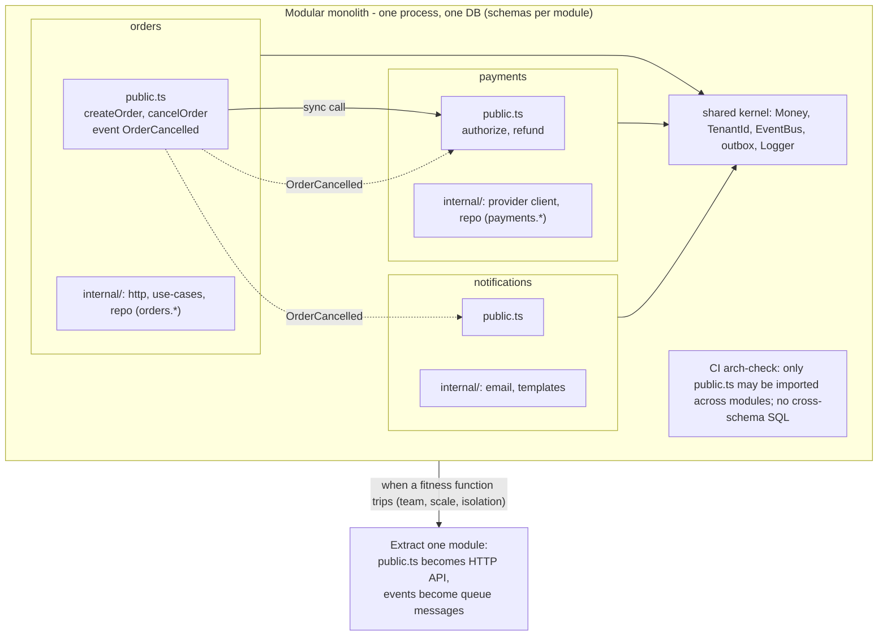

# Module 6.9 — أنماط المعمارية البرمجية
## Software Architecture Styles: layered, feature-based (vertical slices), the modular monolith (why it is often best), microservices (why/when/cost), evolutionary architecture

> **المستوى:** Level 6 | **الموقع:** [9 من 9]
> **السابق:** [M6.8 — Product Thinking](module-6.8-product-thinking.md) | **التالي:** [Checkpoint 6](checkpoint-6.md)

---

## 1. المتطلبات
> **قبل أن تتعلم هذا، يجب أن تفهم:**
- [ ] التجريد، التغليف، الوحدات؛ الاقتران والتماسك — [L4-M4.6](../level-4-software-engineering-foundations/module-4.6-abstraction-encapsulation-modularity.md), [L4-M4.7](../level-4-software-engineering-foundations/module-4.7-coupling-cohesion.md)
- [ ] Ports & Adapters / use cases / أخطاء النطاق كما في Projects 4–6 — [L4-M4.5](../level-4-software-engineering-foundations/module-4.5-software-design.md), [L4-M4.9](../level-4-software-engineering-foundations/module-4.9-design-patterns.md)
- [ ] المعاملات وحدودها؛ الـ outbox — [L3-M3.14](../level-3-core-computer-science/module-3.14-transactions-acid.md), [L5-M5.9](../level-5-building-real-software/module-5.9-queues-jobs-workers.md)
- [ ] النشر، الحاويات، CI — [L5-M5.10](../level-5-building-real-software/module-5.10-deployment.md), [L5-M5.11](../level-5-building-real-software/module-5.11-docker-containers.md)
- [ ] RFC/ADR لقرارات أحادية الاتجاه — [M6.3](module-6.3-design-review-rfc-adr.md)
- [ ] Observability عبر الخدمات (traceparent) — [M6.6](module-6.6-observability.md)
- [ ] فرق التطوير وملكية الكود — [M6.1](module-6.1-working-in-a-team.md)

## 2. أهداف التعلّم
- وصف أربعة أنماط بما **تُحسّنه وما تُكلّفه**: layered، feature-based (vertical slices)، modular monolith، microservices — والتمييز بين **بنية الكود** (كيف تُنظَّم الوحدات) و**بنية النشر** (كم عملية/خدمة).
- شرح لماذا **modular monolith** هو الافتراضي الصحيح لمعظم الفرق: حدود صريحة بين الوحدات، قاعدة بيانات واحدة بمخطّطات منفصلة، تواصل داخل العملية بعقود واضحة، ونشر واحد.
- تحديد **متى** تستحقّ microservices كلفتها (حدود فِرق، احتياجات توسّع/عزل مختلفة جذريًا، إيقاعات نشر مستقلّة) و**كم** تكلّف (شبكة، اتساق، observability، نشر، اختبار، تشغيل).
- فرض الحدود المعمارية **آليًا** (فاحص تبعيات في CI) بدل الاعتماد على الانضباط، وتصميم الوحدات بحيث يكون استخراجها إلى خدمة لاحقًا قرارًا ميكانيكيًا لا إعادة كتابة.
- ممارسة **المعمارية التطوّرية**: ابدأ بالأبسط الكافي، اجعل القرارات الباهظة قابلة للتأجيل، وحدّد **مؤشّرات** (fitness functions) تُخبرك متى تتطوّر.

---

## 3. شرح للمبتدئ

### قبل الأنماط: السؤال الحقيقي
المعمارية ليست "كيف أرسم الصناديق" بل **"كيف أُبقي كلفة التغيير منخفضة مع نموّ النظام والفريق"**. كل نمط إجابة عن هذا السؤال في ظروف معيّنة. والخطأ الأشهر هو اختيار نمط لأنّه "حديث" أو "ما تفعله الشركات الكبيرة" دون النظر إلى الظروف: حجم الفريق، معدّل التغيير، متطلبات التوسّع، والنضج التشغيلي.

افصل مفهومين يُخلطان دائمًا:
- **بنية الكود** (code structure): كيف تُقسَّم الملفات والوحدات وما يُسمح له باستيراد ماذا.
- **بنية النشر** (deployment structure): كم عملية مستقلّة تعمل في الإنتاج وتتحدّث عبر الشبكة.

يمكن أن يكون لديك كود منظّم تنظيمًا رائعًا في عملية واحدة (modular monolith)، أو كودًا فوضويًا موزَّعًا على 30 خدمة (distributed big ball of mud — الأسوأ على الإطلاق).

### النمط 1: Layered (الطبقات التقنية)
```
src/
  controllers/   OrdersController, UsersController, PaymentsController
  services/      OrdersService, UsersService, PaymentsService
  repositories/  OrdersRepo, UsersRepo, PaymentsRepo
  models/        Order, User, Payment
```
التقسيم حسب **الدور التقني**. مألوف وسهل البدء. مشكلته مع النموّ: أي ميزة ("إلغاء طلب مع استرداد") تلمس **كل الطبقات** عبر 4 مجلّدات، والوحدات التجارية (Orders, Payments) لا حدود بينها — `OrdersService` يستورد `PaymentsRepo` مباشرة لأن لا شيء يمنعه. بعد عامين: كل شيء يعتمد على كل شيء، والتغيير في جدول واحد يكسر 12 خدمة داخلية. التماسك منخفض (ملفات لا علاقة بينها في نفس المجلّد) والاقتران عالٍ.

### النمط 2: Feature-based / Vertical slices (الشرائح الرأسية)
```
src/
  orders/      http.ts  use-cases.ts  repo.ts  domain.ts  orders.test.ts
  payments/    http.ts  use-cases.ts  repo.ts  domain.ts  payments.test.ts
  users/       …
```
التقسيم حسب **القدرة التجارية**. الميزة تعيش في مكان واحد؛ الفريق يفتح مجلّدًا واحدًا؛ الحذف سهل (امسح المجلّد). هذا ما بنيته في Projects 4–6 ضمنيًا. ما ينقصه: **حدود مفروضة** — لا شيء يمنع `orders/use-cases.ts` من استيراد `payments/repo.ts` والتسلّل إلى جداوله. مع الانضباط يعمل؛ ومع 10 مهندسين ومواعيد ضيّقة ينهار الانضباط.

### النمط 3: Modular Monolith (الافتراضي الصحيح)
Vertical slices + **حدود مفروضة** + **عقود صريحة**:
```
src/
  modules/
    orders/
      public.ts        ← الواجهة الوحيدة المسموح استيرادها من خارج الوحدة (use cases + أنواع + أحداث)
      internal/        ← http, use-cases, repo, domain, migrations الخاصة بالوحدة
    payments/
      public.ts
      internal/
    identity/
      public.ts
      internal/
  shared/              ← kernel صغير جدًا: Money, TenantId, Result, EventBus, Logger (لا منطق تجاري)
  app/                 ← التركيب: يُنشئ الوحدات ويحقن التبعيات ويُشغّل http
```
القواعد:
1. **الاستيراد عبر `public.ts` فقط**؛ `internal/` خاصّ. فاحص CI يرفض أي انتهاك (§7).
2. **لا جداول مشتركة**: كل وحدة تملك مخطّطها (`orders.*`, `payments.*`) ولا تستعلم عن جداول غيرها؛ تحتاج بيانات؟ عبر `public.ts` للوحدة المالكة.
3. **التواصل**: استدعاء مباشر متزامن عبر `public.ts` حين تحتاج جوابًا الآن (`payments.authorize(...)`)، أو **أحداث داخل العملية** حين يكفي الإعلام (`OrderCancelled` → payments تستردّ، notifications تُرسل) — بنفس المعاملة أو عبر outbox حسب الحاجة.
4. **المعاملة لا تعبر الوحدات** افتراضيًا؛ إن احتجت ذرّية بين وحدتين فهذا دليل أن الحدّ في المكان الخاطئ، أو أنك تحتاج outbox/saga (L7).
5. **نشر واحد**: artifact واحد، DB واحدة (مخطّطات متعدّدة)، pipeline واحد، trace واحد بلا شبكة.

لماذا هو الأفضل غالبًا؟ لأنه يعطي **90% من فوائد microservices التنظيمية** (ملكية واضحة، حدود، قابلية الفهم، قابلية الاستخراج) بـ **10% من كلفتها التشغيلية** (لا شبكة بين الوحدات، لا اتساق نهائي قسري، لا 12 pipeline، لا تتبّع موزّع إلزامي). وحين تحتاج فعلًا خدمة منفصلة لوحدة واحدة، تكون الحدود جاهزة: `public.ts` يصبح API، والأحداث تصبح رسائل.

### النمط 4: Microservices
كل وحدة **عملية مستقلّة** بقاعدة بياناتها وpipeline ونشرها، تتواصل عبر الشبكة (HTTP/gRPC/رسائل). ما تشتريه:
- **إيقاعات نشر مستقلّة** لفرق مستقلّة (10 فرق لا تنتظر بعضها).
- **عزل** الفشل والموارد (خدمة الصور الثقيلة لا تُسقط الدفع).
- **توسّع مستقلّ** (100 نسخة للبحث، 3 للفوترة) وتقنيات مختلفة عند الحاجة الحقيقية.

ما تدفعه (وهو كثير):
| الكلفة | ما يعنيه عمليًا |
|---|---|
| الشبكة | كل استدعاء قد يفشل/يبطئ: مهل، إعادة، idempotency، circuit breakers (L7-M7.2) |
| الاتساق | لا معاملة عبر الخدمات: outbox، sagas، تعويضات، "في النهاية" (L7-M7.3) |
| الاختبار | اختبار التكامل يحتاج 6 خدمات؛ contract tests؛ بيئات |
| Observability | تتبّع موزّع إلزامي، سجلات مركزية، ربط traceId عبر كل شيء (M6.6) |
| التشغيل | N pipelines، N لوحات، N on-call، إصدارات API متوافقة، اكتشاف خدمات |
| البيانات | لا JOIN عبر الخدمات؛ نسخ وتكرار؛ تقارير تحتاج pipeline بيانات |
| الأشخاص | يحتاج فريقًا لكل خدمة تقريبًا؛ 5 مهندسين بـ 12 خدمة = كل شخص يملك 2.4 خدمة لا يفهمها |

**متى تستحقّ؟** حين تكون الكلفة التنظيمية للـ monolith أعلى: فرق متعدّدة (≥ 3–4) تتعارض نشراتها باستمرار، أو جزء بمتطلبات توسّع/أمان/تقنية مختلفة جذريًا، أو حدود واضحة ومستقرّة أثبتها modular monolith فعلًا. **ليس** حين: الفريق < 10، الحدود غير واضحة بعد، لا نضج تشغيلي (CI/CD، observability، on-call)، أو "لأننا نريد التوسّع يومًا ما".

### المعمارية التطوّرية
لا تُقرّر كل شيء يوم الصفر؛ صمّم بحيث تُؤجَّل القرارات الباهظة **بأمان**:
1. **ابدأ بالأبسط الكافي**: modular monolith بوحدات قليلة كبيرة؛ قسّم حين يظهر الألم لا قبله.
2. **احمِ الحدود آليًا** منذ اليوم الأول (أرخص بكثير من إعادة فرضها لاحقًا).
3. **حدّد fitness functions**: مقاييس تُخبرك متى تتطوّر — "زمن CI > 20 دقيقة"، "PRs متعارضة بين فريقين > 5/أسبوع"، "وحدة واحدة تستهلك 70% من CPU"، "دورة النشر معطّلة بسبب وحدة أخرى" — وتُراقَب كأي مقياس.
4. **استخرج وحدة واحدة** حين يتجاوز مؤشّرها العتبة، بـ strangler: الوحدة تبقى في الـ monolith وتُحوَّل الحركة تدريجيًا عبر `public.ts` إلى الخدمة الجديدة؛ ADR لكل استخراج.
5. **العودة ممكنة**: دمج خدمتين متكلّمتين بإفراط (chatty) في واحدة ليس فشلًا؛ هو التطوّر نفسه بالاتجاه الآخر.

### كيف يبدو Project 6 كـ modular monolith؟
وحدات: `identity` (users, sessions, authz)، `catalog` (products)، `orders` (orders, items, state machine)، `payments` (authorize/capture/refund مع المزوّد)، `notifications` (email)، `exports` (CSV jobs). `shared`: Money, TenantId, EventBus, outbox. `orders.cancel` ينشر `OrderCancelled`؛ `payments` يستمع ويستردّ؛ `notifications` يستمع ويُرسل. إن احتجنا يومًا أن تصبح `payments` خدمة (PCI، فريق مستقلّ) — `public.ts` → HTTP API، `OrderCancelled` → رسالة في طابور؛ بقيّة النظام لا يتغيّر.

---

## 4. النموذج الذهني

```
                  كلفة التغيير مع نموّ (الكود × الفريق)
   ▲
   │  Layered ─────────────────────────────────────╱   (كل ميزة تعبر كل الطبقات؛ لا حدود)
   │                                         ╱
   │  Microservices مبكرة ─────────────╱  ╱        (كلفة تشغيل ثابتة عالية من اليوم الأول)
   │  ────────────────────────────╱
   │                         ╱
   │  Modular monolith ──╱────────────────────       (منخفضة ومستقرّة؛ تستخرج عند الحاجة)
   │  ───────────────╱
   └───────────────────────────────────────────────▶  الحجم / عدد الفرق

   القرار:  حدود واضحة؟ ──لا──▶ modular monolith حتى تتّضح
               │ نعم
               ▼
          فرق متعدّدة تتعارض نشراتها / احتياج عزل أو توسّع مختلف جذريًا / نضج تشغيلي؟
               │ لا ──▶ ابقَ monolith (قد تكون للأبد، وهذا نجاح)
               │ نعم
               ▼
          استخرج وحدة واحدة بـ strangler + ADR؛ راقب fitness functions؛ كرّر عند الحاجة فقط
```

قاعدة الإبهام: **الحدود في الكود أولًا، وفي الشبكة فقط حين تدفع الحدودُ الشبكيةُ ثمنَها.**

---

## 5. الرسم التوضيحي



---

## 6. مثال بسيط

شركة ناشئة بثلاثة مهندسين قرأت عن Netflix وبنت 9 microservices من اليوم الأول: users, orders, payments, notifications, catalog, search, reports, gateway, auth. بعد 8 أشهر: ميزة "إلغاء الطلب مع استرداد" تطلّبت تغييرات في 4 خدمات، 4 PRs، 4 نشرات بترتيب معيّن، وsaga للتعويض حين يفشل الاسترداد؛ أسبوعان بدل يومين. الاختبار المحلي يحتاج 9 حاويات و12 GB ذاكرة. حادثة من 3 ساعات لأن `orders` نُشرت قبل `payments` بإصدار API غير متوافق.

أعادوا البناء كـ modular monolith في 6 أسابيع (الوحدات كانت موجودة؛ أزالوا الشبكة بينها): نفس الميزة أصبحت PR واحدًا بمعاملة واحدة؛ CI 4 دقائق؛ نشر واحد؛ المحلي `docker compose up` بحاويتين. بعد عامين وعشرين مهندسًا استخرجوا `payments` فقط (PCI + فريق مختصّ) — عبر `public.ts` الذي كان موجودًا طوال الوقت. الدرس ليس "microservices سيّئة"؛ الدرس أن **الكلفة الثابتة للتوزيع تُدفع كل يوم، والفائدة تظهر فقط حين يكون لديك المشكلة التي تحلّها**.

---

## 7. مثال كود

ثلاثة أجزاء: (1) **فاحص الحدود** — يحلّل الاستيرادات ويرفض أي استيراد عبر الوحدات لا يمرّ بـ `public.ts`، وأي استيراد من `shared` إلى وحدة (الاتجاه الخاطئ)، وأي SQL يلمس مخطّط وحدة أخرى؛ (2) **ناقل أحداث داخل العملية** مُنمَّط، بنفس عقد الواجهة الذي سيُستبدل بطابور عند الاستخراج؛ (3) مثال وحدتين (`orders` → `payments`) تتحدّثان عبر `public.ts` والأحداث فقط، مع اختبار يُثبت أن الاستخراج لا يغيّر `orders`.

```typescript
// src/arch-check.ts
// فاحص حدود الوحدات: منطق خالص على خريطة {ملف → استيرادات} كي يُختبر؛ القراءة من القرص في نقطة الدخول.
export interface Violation { file: string; rule: string; detail: string }

const MODULE = /^src\/modules\/(?<name>[a-z-]+)\/(?<rest>.+)$/;
const moduleOf = (file: string) => MODULE.exec(file)?.groups as { name: string; rest: string } | undefined;

// يحوّل مسار استيراد نسبي إلى مسار من جذر المستودع (تبسيط: نفترض امتداد .ts)
export function resolveImport(fromFile: string, spec: string): string | undefined {
  if (!spec.startsWith(".")) return undefined;                       // حزمة خارجية
  const parts = fromFile.split("/").slice(0, -1);
  for (const seg of spec.split("/")) {
    if (seg === ".") continue;
    if (seg === "..") parts.pop();
    else parts.push(seg);
  }
  return parts.join("/").replace(/\.(ts|js)$/, "") + ".ts";
}

export function checkImports(files: Record<string, string[]>): Violation[] {
  const out: Violation[] = [];
  for (const [file, specs] of Object.entries(files)) {
    const from = moduleOf(file);
    for (const spec of specs) {
      const target = resolveImport(file, spec);
      if (!target) continue;
      const to = moduleOf(target);
      if (from && to && from.name !== to.name) {
        // عبر الوحدات: فقط public.ts
        if (to.rest !== "public.ts") out.push({ file, rule: "cross-module-via-public-only", detail: `${file} → ${target}; import ${to.name}/public.ts instead` });
      }
      if (target.startsWith("src/shared/") && from === undefined && !file.startsWith("src/app/") && !file.startsWith("src/shared/")) {
        out.push({ file, rule: "shared-is-for-modules-and-app", detail: `${file} imports shared` });
      }
      if (file.startsWith("src/shared/") && to) out.push({ file, rule: "shared-must-not-depend-on-modules", detail: `${file} → ${target}` });
      if (file.startsWith("src/app/") && to && to.rest !== "public.ts") out.push({ file, rule: "app-wires-via-public-only", detail: `${file} → ${target}` });
    }
  }
  return out;
}

// SQL داخل وحدة لا يلمس مخطّط وحدة أخرى (orders.* فقط من داخل orders)
export function checkSql(file: string, sql: string, modules: string[]): Violation[] {
  const from = moduleOf(file)?.name;
  if (!from) return [];
  const out: Violation[] = [];
  for (const m of modules) {
    if (m === from) continue;
    const re = new RegExp(`\\b${m}\\.[a-z_]+\\b`, "i");
    if (re.test(sql)) out.push({ file, rule: "no-cross-schema-sql", detail: `${file} queries schema "${m}" — ask ${m}/public.ts for the data` });
  }
  return out;
}
```

```typescript
// src/shared/events.ts
// ناقل أحداث داخل العملية مُنمَّط. العقد نفسه يُنفَّذ لاحقًا فوق طابور عند استخراج وحدة.
export interface DomainEvent<TName extends string = string, TPayload = unknown> { name: TName; at: string; tenantId: string; payload: TPayload }
export type Handler<E extends DomainEvent> = (e: E) => Promise<void>;

export interface EventBus {
  publish<E extends DomainEvent>(e: E): Promise<void>;
  subscribe<E extends DomainEvent>(name: E["name"], h: Handler<E>): () => void;
}

export function createInProcessBus(): EventBus & { failures: { event: string; error: string }[] } {
  const handlers = new Map<string, Handler<DomainEvent>[]>();
  const failures: { event: string; error: string }[] = [];
  return {
    failures,
    async publish(e) {
      // المشتركون معزولون: فشل أحدهم لا يمنع الآخرين (وفي الواقع: outbox + إعادة محاولة لكل مشترك)
      const results = await Promise.allSettled((handlers.get(e.name) ?? []).map((h) => h(e)));
      for (const r of results) if (r.status === "rejected") failures.push({ event: e.name, error: String(r.reason) });
    },
    subscribe(name, h) {
      const list = handlers.get(name) ?? [];
      list.push(h as Handler<DomainEvent>);
      handlers.set(name, list);
      return () => handlers.set(name, (handlers.get(name) ?? []).filter((x) => x !== h));
    },
  };
}
```

```typescript
// src/modules/payments/public.ts
// الواجهة العامة لوحدة payments: ما يحقّ للوحدات الأخرى رؤيته — لا أكثر.
export interface PaymentsApi {
  authorize(input: { tenantId: string; orderId: string; amountCents: number }): Promise<{ ok: true; paymentId: string } | { ok: false; reason: string }>;
  refund(input: { tenantId: string; orderId: string }): Promise<void>;
}
export type PaymentRefunded = { name: "PaymentRefunded"; at: string; tenantId: string; payload: { orderId: string } };
```

```typescript
// src/modules/payments/internal/service.ts
import type { PaymentsApi } from "../public.ts";
import type { EventBus } from "../../../shared/events.ts";
import type { OrderCancelled } from "../../orders/public.ts";

// تنفيذ داخلي؛ يستمع إلى حدث orders عبر الناقل — لا يستورد internal/ لوحدة orders
export function createPayments(bus: EventBus, provider: { refund(id: string): Promise<void> }): PaymentsApi {
  const refunded = new Set<string>(); // idempotency (في الواقع جدول payments.refunds)
  const api: PaymentsApi = {
    async authorize({ orderId }) { return { ok: true, paymentId: `pay_${orderId}` }; },
    async refund({ tenantId, orderId }) {
      if (refunded.has(orderId)) return;
      await provider.refund(`pay_${orderId}`);
      refunded.add(orderId);
      await bus.publish({ name: "PaymentRefunded", at: new Date().toISOString(), tenantId, payload: { orderId } });
    },
  };
  bus.subscribe<OrderCancelled>("OrderCancelled", async (e) => { if (e.payload.wasPaid) await api.refund({ tenantId: e.tenantId, orderId: e.payload.orderId }); });
  return api;
}
```

```typescript
// src/modules/orders/public.ts
export interface OrdersApi {
  cancel(input: { tenantId: string; orderId: string }): Promise<{ status: "cancelled" | "not_found" | "not_cancellable" }>;
}
export type OrderCancelled = { name: "OrderCancelled"; at: string; tenantId: string; payload: { orderId: string; wasPaid: boolean } };
```

```typescript
// src/modules/orders/internal/service.ts
import type { OrdersApi, OrderCancelled } from "../public.ts";
import type { EventBus } from "../../../shared/events.ts";

interface OrderRow { id: string; tenantId: string; status: "pending" | "paid" | "shipped" | "cancelled" }

// orders لا تعرف payments إطلاقًا: تنشر حدثًا فقط. استخراج payments إلى خدمة لا يلمس هذا الملف.
export function createOrders(bus: EventBus, repo: { get(t: string, id: string): Promise<OrderRow | null>; transition(t: string, id: string, from: OrderRow["status"][], to: OrderRow["status"]): Promise<boolean> }): OrdersApi {
  return {
    async cancel({ tenantId, orderId }) {
      const o = await repo.get(tenantId, orderId);
      if (!o) return { status: "not_found" };
      const wasPaid = o.status === "paid"; // قبل الانتقال (الصفّ قد يكون نفس المرجع الذي يُعدَّل)
      const ok = await repo.transition(tenantId, orderId, ["pending", "paid"], "cancelled"); // ذري (M5.6)
      if (!ok) return { status: "not_cancellable" };
      const e: OrderCancelled = { name: "OrderCancelled", at: new Date().toISOString(), tenantId, payload: { orderId, wasPaid } };
      await bus.publish(e); // في الإنتاج: يُكتب في outbox بنفس معاملة transition
      return { status: "cancelled" };
    },
  };
}
```

```typescript
// src/architecture.test.ts
import { test } from "node:test";
import assert from "node:assert/strict";
import { checkImports, checkSql } from "./arch-check.ts";
import { createInProcessBus } from "./shared/events.ts";
import { createOrders } from "./modules/orders/internal/service.ts";
import { createPayments } from "./modules/payments/internal/service.ts";

test("arch-check: cross-module imports only via public.ts; shared never depends on modules", () => {
  const ok = checkImports({
    "src/modules/orders/internal/service.ts": ["../public.ts", "../../../shared/events.ts"],
    "src/modules/payments/internal/service.ts": ["../public.ts", "../../orders/public.ts", "../../../shared/events.ts"],
    "src/app/main.ts": ["../modules/orders/public.ts", "../modules/payments/public.ts", "../shared/events.ts"],
  });
  assert.deepEqual(ok, []);

  const bad = checkImports({
    "src/modules/orders/internal/service.ts": ["../../payments/internal/repo.ts"],   // تسلّل إلى internal
    "src/shared/money.ts": ["../modules/orders/public.ts"],                           // الاتجاه الخاطئ
    "src/app/main.ts": ["../modules/orders/internal/http.ts"],                         // التركيب عبر internal
  });
  assert.deepEqual(bad.map((v) => v.rule), ["cross-module-via-public-only", "shared-must-not-depend-on-modules", "app-wires-via-public-only"]);

  const sql = checkSql("src/modules/orders/internal/repo.ts", "SELECT o.id, p.status FROM orders.orders o JOIN payments.payments p ON p.order_id = o.id", ["orders", "payments", "identity"]);
  assert.equal(sql.length, 1);
  assert.equal(sql[0]!.rule, "no-cross-schema-sql");
});

test("modules talk via public contracts and events; a failing subscriber does not break the publisher", async () => {
  const bus = createInProcessBus();
  const refunds: string[] = [];
  createPayments(bus, { refund: async (id) => { refunds.push(id); } });
  type Status = "pending" | "paid" | "shipped" | "cancelled";
  const rows = new Map<string, { id: string; tenantId: string; status: Status }>([["o1", { id: "o1", tenantId: "t1", status: "paid" }]]);
  const orders = createOrders(bus, {
    get: async (_t, id) => rows.get(id) ?? null,
    transition: async (_t, id, from, to) => { const r = rows.get(id); if (!r || !from.includes(r.status)) return false; r.status = to; return true; },
  });
  // مشترك ثالث يفشل (notifications معطّلة) — يجب ألّا يمنع الاسترداد ولا الإلغاء
  bus.subscribe("OrderCancelled", async () => { throw new Error("smtp down"); });

  assert.deepEqual(await orders.cancel({ tenantId: "t1", orderId: "o1" }), { status: "cancelled" });
  assert.deepEqual(refunds, ["pay_o1"]);
  assert.equal(bus.failures.length, 1);
  // التكرار آمن: إلغاء ثانٍ لا يستردّ مرتين
  assert.deepEqual(await orders.cancel({ tenantId: "t1", orderId: "o1" }), { status: "not_cancellable" });
  assert.deepEqual(refunds, ["pay_o1"]);
});

test("extraction readiness: orders has zero knowledge of payments (only the event name)", () => {
  // دليل بنيوي: orders/internal لا تستورد شيئًا من payments — ما يجعل استخراج payments قرارًا ميكانيكيًا
  const ordersImports = ["../public.ts", "../../../shared/events.ts"];
  assert.ok(ordersImports.every((i) => !i.includes("payments")));
});
```

```bash
# CI: فحص الحدود كبوّابة (يقرأ الاستيرادات بـ regex بسيط؛ في الواقع: dependency-cruiser أو eslint-plugin-boundaries)
node --import tsx scripts/arch-check.ts src     # يبني {file → imports} من import/export … from "…" ويستدعي checkImports
# fitness functions تُراقَب كأي مقياس: ci_duration_seconds, cross_team_pr_conflicts_weekly, module_cpu_share{module="exports"}
```

---

## 8. مثال من العالم الحقيقي
Shopify وStack Overflow وBasecamp — أنظمة بحجم هائل تعمل كـ monoliths (Shopify يُسمّيه صراحةً *modular monolith* ويفرض حدود المكوّنات بأداة داخلية تُشبه §7). وفي المقابل، عدّة شركات أعلنت علنًا العودة من microservices إلى monolith (مثال معروف: فريق في Amazon Prime Video دمج خدمات مراقبة الفيديو في عملية واحدة فخفّض الكلفة ~90% لأن معظم الوقت كان يُنفَق في نقل البيانات بين الخدمات). الخيط المشترك: **الحدود الجيّدة في الكود هي ما يهمّ؛ أمّا الشبكة بين الحدود فقرار اقتصادي** يُتّخذ حين يُثبت مؤشّر محدّد (فرق، توسّع، عزل) أن ثمنه مبرّر — ويُعاد النظر فيه حين يتغيّر السياق.

## 9. مثال من الإنتاج
منصّة بـ 40 مهندسًا وmonolith من 600k سطر: CI 45 دقيقة، نشر واحد يوميًا يتعارك عليه 6 فرق، وحادثة أسبوعية لأن تغييرًا في "التقارير" أسقط "الدفع" (ذاكرة مشتركة في نفس العملية). الإغراء: "لنقسّمه إلى 30 خدمة". ما فعلوه بدلًا من ذلك على 9 أشهر: (1) فرض حدود الوحدات آليًا داخل الـ monolith أولًا — 1,900 انتهاك في اليوم الأول، صُفّيت تدريجيًا بقاعدة "لا انتهاكات جديدة" (ratchet)؛ (2) مخطّطات DB منفصلة لكل وحدة؛ (3) fitness functions: زمن CI لكل وحدة، تعارضات PRs بين الفرق، حصّة CPU/ذاكرة لكل وحدة؛ (4) استخراج **وحدتين فقط** تجاوزتا العتبة: `reports` (تستهلك 60% من الذاكرة بإيقاع نشر مختلف) و`payments` (فريق مختصّ + PCI). النتيجة: CI 8 دقائق (اختبارات لكل وحدة متأثّرة فقط)، 6 فرق تنشر بلا تعارك لأن الحدود واضحة، وحوادث العدوى اختفت. 3 وحدات قابلة للنشر بدل 30 — **وكل خدمة لها سبب مكتوب في ADR**.

---

## 10. مفاهيم خاطئة شائعة
1. **"Monolith = كود سيّئ، microservices = كود جيّد."** النمط لا يضمن الجودة؛ أسوأ نظام هو microservices بلا حدود (distributed big ball of mud).
2. **"سنحتاج microservices حين نتوسّع."** معظم الأنظمة تتوسّع أفقيًا كـ monolith بنسخ متعدّدة خلف LB (M5.7)؛ التوسّع المستقلّ لجزء واحد نادر وقابل للاستخراج حين يحدث.
3. **"الطبقات (layered) معمارية سيّئة."** جيّدة **داخل** الوحدة (http → use case → repo)؛ سيّئة كتقسيم **أعلى** للنظام.
4. **"الوحدات تعني تكرار الكود."** بعض التكرار (نموذج `Customer` مبسّط في `orders` وآخر في `identity`) أرخص بكثير من اقتران يمنع التغيير المستقلّ.
5. **"الأحداث تحلّ كل اقتران."** الأحداث تقلّل الاقتران الزمني لكنها تُخفي التدفّق؛ استدعاء متزامن عبر `public.ts` أوضح حين تحتاج الجواب الآن.
6. **"قرار المعمارية يُتّخذ مرة."** المعمارية تتطوّر؛ القرار الجيّد هو ما يمكن تأجيله أو عكسه بأقلّ كلفة.

## 11. أخطاء شائعة
1. حدود "بالاتفاق" بلا فحص آلي → تنهار عند أول موعد ضيّق.
2. `shared/` يتضخّم إلى "كل ما لا نعرف أين نضعه" ويصبح وحدة إلهية يعتمد عليها الجميع.
3. JOIN عبر مخطّطات وحدتين "لأنه أسرع" → استخراج أي منهما مستحيل.
4. معاملة واحدة تعبر ثلاث وحدات → الحدود شكلية.
5. microservices بلا نضج تشغيلي (لا تتبّع موزّع، لا CI/CD لكل خدمة، لا on-call) → حوادث لا يمكن تشخيصها.
6. خدمات بحجم "دالّة" (nanoservices) → الشبكة تلتهم الأداء والفهم.
7. استخراج خدمة بلا strangler ولا ADR ولا مؤشّر → لا أحد يعرف لماذا، ولا يمكن العودة.
8. تجاهل كلفة البيانات: تقارير عبر 8 خدمات تحتاج pipeline بيانات لم يخطّط له أحد.

## 12. تمرين تصحيح
بعد سنة من "modular monolith"، فريق `exports` يشكو أن أي تغيير في `orders` يكسر اختباراتهم، والاستخراج المخطّط لـ `exports` إلى خدمة "مستحيل".
1. **دليل:** تشغيل `arch-check` لأول مرة: 73 انتهاكًا، 61 منها من `exports/internal` إلى `orders/internal/repo.ts` و`orders/internal/domain.ts`؛ وSQL في `exports` يقرأ `orders.orders` و`identity.users` مباشرة بـ JOIN. `public.ts` لـ `orders` يحوي دالّتين فقط لأن "الوصول المباشر كان أسهل".
2. **فرضية:** الحدود لم تُفرض آليًا من البداية، فـ `exports` بُنيت على تفاصيل `orders` الداخلية ومخطّطها؛ وهي الآن مقترنة بنيويًا لا منطقيًا.
3. **تجربة:** تغيير اسم عمود داخلي في `orders` على فرع → 14 اختبارًا في `exports` تفشل، وصفر في وحدات أخرى تمرّ عبر `public.ts`.
4. **الإصلاح:** (أ) تشغيل `arch-check` في CI بوضع **ratchet**: عدد الانتهاكات لا يزيد، ويُقلَّص أسبوعيًا؛ (ب) توسيع `orders/public.ts` بقراءة مخصّصة للتصدير (`listOrdersForExport(tenantId, range, cursor)` تُعيد DTO مستقرًّا) — أو نسخة قراءة يملكها `exports` تُغذّى بأحداث `OrderCreated/Updated` (CQRS-lite) إن كان الحجم يستدعي؛ (ج) حذف JOINs عبر المخطّطات؛ (د) ADR يسجّل القرار ومؤشّر الاستخراج. بعد التصفية، الاستخراج يصبح: `public.ts` → HTTP، الأحداث → طابور.
5. **أين أيضًا؟** شغّل `checkSql` على كل الوحدات؛ وابحث عن أي وحدة يستورد منها الآخرون أكثر من `public.ts` — هي المرشّحة التالية للانهيار.

## 13. تمرين معماري
**أعد تصميم Project 6 كـ modular monolith** وقدّم وثيقة قرار: (1) قائمة الوحدات (≤ 7) ومسؤولية كل واحدة وما تملكه من جداول (مخطّط لكل وحدة)؛ (2) `public.ts` لكل وحدة: الدوال والأحداث المنشورة والمستهلَكة — بجدول تدفّق "من يستدعي من، ومن يستمع لماذا"؛ (3) محتوى `shared/` بحدّ أقصى 6 عناصر مع تبرير كل واحد؛ (4) ثلاثة سيناريوهات تعبر الوحدات (إلغاء مع استرداد، تسجيل ثم طلب أول، تصدير شهري) ورسم تسلسل لكل منها يُبيّن أين المعاملة وأين الحدث وأين outbox؛ (5) **fitness functions** الثلاث التي ستُراقبها وعتباتها، وأي وحدة ستُستخرج أولًا إن تجاوزت العتبة ولماذا؛ (6) مقارنة ACTRR كاملة: modular monolith مقابل microservices من اليوم الأول لفريقك الحالي (5 مهندسين) ولفريق من 40 — وكيف تتغيّر التوصية بتغيّر السياق؛ (7) مرّر البنية المقترحة على `arch-check` §7 (كخريطة ملفات) وتأكّد من صفر انتهاكات.

## 14. الصلة بعصر AI
الوكلاء يعملون أفضل بكثير داخل **حدود صريحة وصغيرة**: وحدة بـ `public.ts` واضح ومخطّط DB خاص وقواعد مفروضة آليًا هي "مهمّة قابلة للتفويض" (L8-M8.6)؛ أما monolith طبقي بلا حدود فيُنتج الوكيل فيه تغييرات تلمس 40 ملفًا ويكسر ما لا يعرفه. فاحص الحدود §7 يصبح **حاجز أمان للوكيل** أيضًا: كل انتهاك يُرفض آليًا قبل أن يراه مراجع. وفي الاتجاه الآخر، لا تدع الوكيل يُقرّر النمط: سيقترح microservices لأنها الأكثر تمثيلًا في بيانات تدريبه، لا لأنها تناسب فريقك من خمسة — القرار المعماري ACTRR وADR بشريان (M6.3). وأخيرًا: أنظمة AI داخل منتجك (نداءات LLM، RAG) وحدة كغيرها بـ `public.ts` وحدود — لا تدعها تتسرّب إلى كل مكان.

## 15. ما يجب إتقانه (Must Master) 🔴
- 🔴 الفرق بين بنية الكود وبنية النشر؛ الأنماط الأربعة بما تُحسّنه وتُكلّفه؛ modular monolith بقواعده الخمس (public.ts فقط، لا جداول مشتركة، استدعاء/حدث، لا معاملة عابرة، نشر واحد)؛ فرض الحدود آليًا؛ جدول كلفة microservices ومتى تستحقّ؛ المعمارية التطوّرية وfitness functions وstrangler.

## 16. ما يجب فهمه (Should Understand) 🟠
- 🟠 CQRS-lite ونسخ القراءة بين الوحدات؛ outbox داخل الـ monolith؛ ratchet لتصفية الانتهاكات؛ contract tests عند الاستخراج؛ أدوات الحدود (dependency-cruiser, eslint-plugin-boundaries, Packwerk).

## 17. ما يمكن تأجيله (Can Defer) ⚪
- ⚪ Event sourcing، service mesh، مقارنات orchestration/choreography بعمق، DDD الاستراتيجي الكامل (bounded contexts, context maps) — تعود في L7-M7.9.

## 18. الخلاصة
1. المعمارية = إبقاء كلفة التغيير منخفضة مع النموّ؛ النمط إجابة في ظروف، لا موضة.
2. Layered يقسّم تقنيًا فيُقرن كل شيء؛ vertical slices يقسّم تجاريًا؛ modular monolith يضيف حدودًا مفروضة وعقودًا — وهو الافتراضي الصحيح.
3. Microservices تشتري استقلال الفرق والعزل والتوسّع المستقلّ بثمن الشبكة والاتساق والتشغيل؛ تستحقّ حين يُثبت مؤشّر أن الـ monolith أغلى.
4. افرض الحدود آليًا من اليوم الأول؛ ما لا يُفرض ينهار.
5. تطوّر: ابدأ بالأبسط الكافي، راقب fitness functions، استخرج وحدة واحدة بـ strangler وADR حين يلزم — والعودة مشروعة.

## 19. مراجع رسمية
- Martin Fowler — MonolithFirst & Microservice Prerequisites: https://martinfowler.com/bliki/MonolithFirst.html · https://martinfowler.com/bliki/MicroservicePrerequisites.html
- Martin Fowler — Strangler Fig Application: https://martinfowler.com/bliki/StranglerFigApplication.html
- Shopify Engineering — Deconstructing the Monolith (modular monolith, component boundaries): https://shopify.engineering/deconstructing-monolith-designing-software-maximizes-developer-productivity
- Sam Newman — Monolith to Microservices (O'Reilly) & Building Microservices: https://samnewman.io/books/
- Neal Ford, Rebecca Parsons, Patrick Kua — Building Evolutionary Architectures (fitness functions): https://evolutionaryarchitecture.com/
- Amazon Prime Video — Scaling up the audio/video monitoring service and reducing costs by 90%: https://www.primevideotech.com/video-streaming/scaling-up-the-prime-video-audio-video-monitoring-service-and-reducing-costs-by-90
- dependency-cruiser (enforce import rules in JS/TS): https://github.com/sverweij/dependency-cruiser
- Simon Brown — Modular Monoliths (talk & C4): https://simonbrown.je/

## المصطلحات
| العربية | English |
|---|---|
| نمط معماري | Architecture style |
| بنية الكود / بنية النشر | Code structure / Deployment structure |
| معمارية الطبقات | Layered architecture |
| شرائح رأسية / تقسيم حسب الميزة | Vertical slices / Feature-based |
| الـ monolith المُوحَّد (الوحدي المعياري) | Modular monolith |
| الخدمات المصغّرة | Microservices |
| كرة الطين الموزّعة | Distributed big ball of mud |
| الواجهة العامة للوحدة | Module public API (`public.ts`) |
| النواة المشتركة | Shared kernel |
| ملكية البيانات لكل وحدة | Data ownership per module (schema per module) |
| حدث نطاق / ناقل أحداث | Domain event / Event bus |
| فاحص الحدود | Architecture fitness check (arch-check) |
| سقّاطة (لا انتهاكات جديدة) | Ratchet |
| المعمارية التطوّرية | Evolutionary architecture |
| دالّة لياقة | Fitness function |
| نمط الخانق | Strangler fig |
| اختبارات العقد | Contract tests |
| استخراج خدمة | Service extraction |
