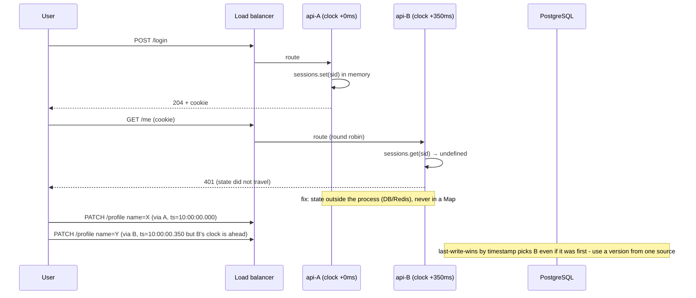

# Module 7.1 — الأنظمة الموزعة: من خادم واحد إلى اثنين إلى عشرة
## Distributed Systems: 1 → 2 → 10 Servers — what breaks: shared state, clocks, the network between them, and the fallacies of distributed computing

> **المستوى:** Level 7 | **الموقع:** [1 من 9]
> **السابق:** [Checkpoint 6](../level-6-professional-engineering/checkpoint-6.md) | **التالي:** [M7.2 — Failure, Timeouts, Retries, Idempotency](module-7.2-failure-timeouts-retries-idempotency.md)

---

## 1. المتطلبات
> **قبل أن تتعلم هذا، يجب أن تفهم:**
- [ ] TCP، المهل، ECONNREFUSED/ETIMEDOUT، "الشبكة تفشل بشكل طبيعي" — [L2-M2.9](../level-2-computer-systems/module-2.9-tcp-udp.md), [L0-M0.6](../level-0-absolute-foundations/module-06-network-client-server.md)
- [ ] العمليات والذاكرة المعزولة؛ النسخ المتعدّدة خلف LB — [L2-M2.5](../level-2-computer-systems/module-2.5-process-deep-dive.md), [L5-M5.7](../level-5-building-real-software/module-5.7-production-anatomy.md)
- [ ] سباق اقرأ-قرّر-اكتب والتحديث الذري — [L5-M5.6](../level-5-building-real-software/module-5.6-concurrency-business-logic.md)
- [ ] الكاش والطوابير كحالة مشتركة خارج العملية — [L5-M5.8](../level-5-building-real-software/module-5.8-caching.md), [L5-M5.9](../level-5-building-real-software/module-5.9-queues-jobs-workers.md)
- [ ] traceId عبر الخدمات — [L6-M6.6](../level-6-professional-engineering/module-6.6-observability.md)
- [ ] modular monolith وحدود الوحدات — [L6-M6.9](../level-6-professional-engineering/module-6.9-architecture-styles.md)

## 2. أهداف التعلّم
- تسمية **ما ينكسر بالضبط** عند كل قفزة: 1→2 (الحالة في الذاكرة، الساعات، "من هو الآن المسؤول؟")، 2→10 (الفشل الجزئي كحالة دائمة، الاتساق، التنسيق، الملاحظية).
- شرح **المغالطات الثماني** للحوسبة الموزعة وربط كلٍّ منها بعطل حقيقي رأيته أو ستراه.
- فهم لماذا **لا توجد ساعة مشتركة**: الانحراف (skew)، الانجراف (drift)، لماذا `Date.now()` ليس ترتيبًا، وما Lamport clock وما الذي يعطيه وما لا يعطيه.
- بناء **محاكي شبكة** صغير (تأخير، فقدان، تكرار، تقسيم) واستخدامه لإثبات انكسار نظام "يعمل على خادم واحد" — الأداة التي ستستخدمها في بقية المستوى.
- تبنّي النموذج الذهني الأساسي للمستوى: **نتيجة أي طلب عبر الشبكة ∈ {نجح، فشل، لا أعرف}** — والتصميم لـ"لا أعرف".

---

## 3. شرح للمبتدئ

### خادم واحد: الجنّة الكاذبة
على خادم واحد، لديك ضمانات صامتة لا تلاحظها: **ذاكرة واحدة** (المتغيّر الذي كتبتَه هو ما ستقرؤه)، **ساعة واحدة** (`Date.now()` يزيد دائمًا)، **ترتيب واحد** (الأحداث تحدث بتسلسل واحد يمكن إعادة بنائه)، و**فشل كلّي أو لا شيء** (إمّا يعمل الخادم أو لا). كل تصميماتك حتى L5 استندت ضمنيًا إلى هذه الأربع. الأنظمة الموزعة هي ما يحدث حين تختفي جميعها معًا.

### القفزة الأولى: من 1 إلى 2
تضيف نسخة ثانية خلف load balancer "للتوافر". ما ينكسر فورًا:
1. **الحالة في الذاكرة**: الجلسات في `Map`، حدود المعدّل في عدّاد، الكاش المحلي، "القفل" بمتغيّر — كلّها الآن **نسختان مستقلّتان**. المستخدم يسجّل الدخول على A ويصل إلى B "غير مسجّل". حدّ المعدّل 100/دقيقة يصبح 200 فعليًا. (L5-M5.7 قالت "عديمة الحالة"؛ الآن ترى لماذا.)
2. **الساعتان مختلفتان**: A يرى 10:00:00.000 وB يرى 10:00:00.350. "آخر كتابة تفوز" حسب الطابع الزمني تُرجّح B دائمًا حتى لو كتب أولًا.
3. **من المسؤول؟** مهمّة دورية (تنظيف، إرسال تقرير) كانت تعمل مرة؛ الآن تعمل مرتين. تحتاج **تنسيقًا** (قفل موزّع، انتخاب قائد) — وكلاهما يفشل بطرق جديدة (L5-M5.6: fencing token).
4. **الفشل الجزئي يولد**: A يعمل وB لا؛ A يرى DB وB لا يراها (مشكلة شبكة محلية). النظام "يعمل" لنصف المستخدمين.

### القفزة الثانية: من 2 إلى 10
مع 10 خوادم (وربما 3 قواعد بيانات، كاش، طابور، 4 تبعيات خارجية) يتحوّل الاستثناء إلى **حالة دائمة**:
- **شيء ما معطّل دائمًا**: إن كان احتمال تعطّل مكوّن واحد اليوم 1%، فمع 50 مكوّنًا احتمال أن يكون كل شيء سليمًا = 0.99⁵⁰ ≈ 60%. أربعة أيام من عشرة يبدأ فيها نظامك بعطل جزئي ما. التصميم "حين يفشل شيء" ليس استثناء؛ هو الوضع الطبيعي.
- **الاتساق**: البيانات في أكثر من مكان (نسخ DB، كاش، فهرس بحث) ولا يمكن تحديثها جميعًا "في نفس اللحظة" — فهناك دائمًا نافذة يراها فيها بعض القرّاء قديمة (M7.3).
- **الشبكة بين المكوّنات** تصبح جزءًا من كل عملية: كل استدعاء له زمن ومعدّل فشل؛ طلب واحد يلمس 8 خدمات يرث 8 احتمالات فشل و8 ذيول زمنية (M7.8: p99 المركّب).
- **الملاحظية**: لا يمكن "فتح السجل" — أيّ من 10 خوادم؟ لذا traceId (M6.6) ليس رفاهية.
- **النشر**: 10 إصدارات قد تتعايش لحظيًا؛ N/N-1 (M5.10) يصبح N/N-1/N-2.

### المغالطات الثماني
صاغها مهندسو Sun في التسعينيات؛ كل واحدة افتراض خاطئ يبدو معقولًا:
| المغالطة | الحقيقة | العطل النموذجي |
|---|---|---|
| 1. الشبكة موثوقة | الحزم تضيع، الاتصالات تنقطع | طلب أُرسل ولم يُعرف مصيره |
| 2. الزمن صفر | كل قفزة ms؛ عبر المناطق 100ms+ | 20 استدعاء متسلسلًا = 2 ثانية |
| 3. عرض النطاق لا نهائي | محدود ومشترك | نقل 50 MB في كل طلب يُشبع الرابط |
| 4. الشبكة آمنة | لا | حركة داخلية بلا TLS تُلتقط |
| 5. الطوبولوجيا لا تتغيّر | النسخ تأتي وتذهب، IPs تتغيّر | عنوان مخزّن يشير إلى لا شيء |
| 6. مدير واحد | فرق ومزوّدون متعدّدون | تغيير جدار ناري من فريق آخر يقطعك |
| 7. كلفة النقل صفر | تسلسل/فكّ تسلسل + فاتورة egress | CPU في JSON وفاتورة سحابة (M5.13) |
| 8. الشبكة متجانسة | إصدارات وبروتوكولات وMTU مختلفة | يعمل في staging لا في prod |

### لا ساعة مشتركة
كل جهاز له ساعة كوارتز تنجرف (drift) بضعة أجزاء من المليون — ثوانٍ في اليوم بلا تصحيح. NTP يصحّحها إلى **عشرات الميلي ثوانٍ** عادةً، وأحيانًا يقفز بها **إلى الخلف**. النتائج:
- `Date.now()` على جهازين لا يُقارَن للترتيب. "الحدث A قبل B لأن طابعه أصغر" خاطئ عبر الأجهزة.
- حتى على جهاز واحد `Date.now()` قد يتراجع (قفزة NTP)؛ لقياس المدد استخدم `performance.now()`/`process.hrtime` (رتيبة، monotonic).
- **Lamport clock**: عدّاد منطقي؛ كل حدث محلي `c++`، كل رسالة تحمل `c`، والمستقبل `c = max(c, received) + 1`. يعطيك: إن كان A **سبب** B فـ `L(A) < L(B)`. لا يعطيك العكس: `L(A) < L(B)` لا يعني أن A سبق B — قد يكونان متزامنين (concurrent) بلا علاقة. للكشف عن التزامن تحتاج vector clocks (مفهوم: عدّاد لكل عقدة).
- عمليًا: لا تستخدم طوابع الوقت للحسم بين كتابتين متنافستين إلا إن قبلت الخطأ؛ استخدم إصدارًا (version) من مصدر واحد (DB) — L5-M5.6 القفل التفاؤلي.

### "لا أعرف": الحالة الثالثة
على خادم واحد، استدعاء الدالّة إمّا يعود بنتيجة أو يرمي. عبر الشبكة توجد حالة ثالثة: **أرسلتَ الطلب وانتهت المهلة** — هل وصل؟ هل نُفّذ؟ هل الجواب هو ما ضاع؟ لا تعرف. هذا هو جوهر كل تعقيد الأنظمة الموزعة: مهلة الدفع انتهت — هل خُصم المال؟ إعادة الإرسال قد تخصم مرتين؛ عدم الإعادة قد يترك الطلب بلا دفع. الجواب (M7.2): اجعل الإعادة آمنة (idempotency) ثم أعد.

### التجربة الفكرية الأهمّ
قبل أي "توزيع"، اسأل: **هل أحتاجه؟** خادم واحد حديث يخدم آلاف الطلبات/ثانية؛ PostgreSQL واحدة تحمل تيرابايتات. التوزيع يُشترى لسببين فقط: **توافر** (النسخة الواحدة تموت) و**سعة** تتجاوز أكبر جهاز معقول. وثمنه كل ما في هذا المستوى. القاعدة من L6-M6.9 تنطبق: أبسط ما يكفي، ووزّع ما يُجبرك المؤشّر على توزيعه.

---

## 4. النموذج الذهني

```
   1 خادم                 2 خادم                        10 خوادم
   ───────                ───────                       ─────────
   ذاكرة واحدة      →   الحالة في الذاكرة تتضاعف   →   الحالة خارج العملية فقط (DB/cache/queue)
   ساعة واحدة       →   ساعتان مختلفتان            →   لا ترتيب عالمي؛ إصدارات/Lamport
   مسؤول واحد       →   "من يفعل؟" ×2               →   تنسيق (قفل/قائد) يفشل بدوره
   فشل كلّي         →   فشل جزئي يولد               →   شيء معطّل دائمًا؛ صمّم له

   كل سهم عبر الشبكة:   زمن + احتمال فشل + نتيجة ثالثة "لا أعرف"
   الدفاعات (بقية L7): مهل وميزانيات، إعادة بأمان (idempotency)، نسخ واتساق مُختار،
                      موازنة وحالة خارجية، أنماط موثوقية، قياس قبل التحسين، حدود خدمات بوعي.
```

قاعدة الإبهام: **كل ما كان ضمنيًا على خادم واحد (ذاكرة، ساعة، ترتيب، نجاح/فشل) يصبح قرار تصميم صريحًا على اثنين.**

---

## 5. الرسم التوضيحي



```
احتمال أن "كل شيء سليم" مع n مكوّنات، كلٌّ بتوافر 99% في اليوم:
n=1   99%   ██████████████████████████████████████████████████
n=5   95%   ████████████████████████████████████████████████
n=20  82%   █████████████████████████████████████████
n=50  61%   ██████████████████████████████
n=100 37%   ███████████████████
→ من n≈20 فصاعدًا، "عطل جزئي ما" هو الحالة الطبيعية.
```

---

## 6. مثال بسيط

حدّ المعدّل في Project 5: `Map<ip, count>` في الذاكرة، 100 طلب/دقيقة. يعمل بدقّة على نسخة واحدة. تنشر نسختين خلف LB round-robin → المهاجم يحصل على 200/دقيقة؛ ثلاث نسخ → 300. "الإصلاح" الساذج: sticky sessions بالـ IP على الـ LB — يعمل حتى يمرّ 10k مستخدم خلف NAT جامعة واحدة إلى نسخة واحدة فتسقط. الإصلاح الصحيح: العدّاد في Redis بـ `INCR` + `EXPIRE` (ذري، مشترك)، مع قبول أن Redis الساقط = "لا حدّ مؤقتًا" (fail-open بتنبيه) أو "ارفض" (fail-closed) — **قرار** تكتبه في ACTRR لا افتراض. نفس القصّة لكل حالة في الذاكرة: جلسات، أقفال، كاش، "آخر معرّف".

---

## 7. مثال كود

محاكي شبكة صغير (تأخير عشوائي، فقدان، تكرار، تقسيم) يُشغَّل داخل عملية Node واحدة، لكنّه يُعيد إنتاج ما يحدث بين خوادم حقيقية. ثم ثلاث تجارب: (1) حدّ المعدّل في الذاكرة ينكسر مع نسختين، (2) "آخر كتابة تفوز" بالطابع الزمني يخطئ مع انحراف الساعة، وLamport clock يحفظ السببية، (3) الطلب الذي "لا نعرف" مصيره. ستعيد استخدام `FakeNetwork` في M7.2–7.5.

```typescript
// src/net-sim.ts
// محاكي شبكة قابل للحقن: كل إرسال قد يتأخّر/يضيع/يتكرّر، ويمكن تقسيم العقد إلى جُزر.
export interface NetOptions { minDelayMs?: number; maxDelayMs?: number; lossRate?: number; duplicateRate?: number; random?: () => number }
export type Handler<Req, Res> = (req: Req) => Promise<Res>;

export class TimeoutError extends Error { constructor(ms: number) { super(`timeout after ${ms}ms`); this.name = "TimeoutError"; } }

export class FakeNetwork {
  private readonly nodes = new Map<string, Handler<unknown, unknown>>();
  private readonly partitions: Set<string>[] = []; // كل مجموعة جزيرة؛ عقدتان في جزيرتين مختلفتين لا تتواصلان
  readonly log: { from: string; to: string; outcome: "ok" | "lost" | "dup" | "partitioned" }[] = [];
  constructor(private readonly o: NetOptions = {}) {}

  register<Req, Res>(name: string, h: Handler<Req, Res>) { this.nodes.set(name, h as Handler<unknown, unknown>); }
  partition(groups: string[][]) { this.partitions.length = 0; for (const g of groups) this.partitions.push(new Set(g)); }
  heal() { this.partitions.length = 0; }

  private canReach(a: string, b: string) {
    if (this.partitions.length === 0) return true;
    const ga = this.partitions.find((g) => g.has(a)), gb = this.partitions.find((g) => g.has(b));
    return ga !== undefined && ga === gb;
  }
  private rnd() { return (this.o.random ?? Math.random)(); }
  private delay() { const min = this.o.minDelayMs ?? 1, max = this.o.maxDelayMs ?? 5; return min + this.rnd() * (max - min); }

  // يُرجع الجواب، أو يرمي TimeoutError إن ضاع الطلب/الجواب أو تجاوز المهلة — المستدعي لا يعرف أيّهما (الحالة الثالثة)
  async send<Req, Res>(from: string, to: string, req: Req, timeoutMs = 50): Promise<Res> {
    const h = this.nodes.get(to);
    if (!h) throw new Error(`no node ${to}`);
    if (!this.canReach(from, to)) { this.log.push({ from, to, outcome: "partitioned" }); await sleep(timeoutMs); throw new TimeoutError(timeoutMs); }
    const lost = this.rnd() < (this.o.lossRate ?? 0);
    const dup = this.rnd() < (this.o.duplicateRate ?? 0);
    const deliver = async () => { await sleep(this.delay()); return h(req) as Promise<Res>; };
    if (dup) { this.log.push({ from, to, outcome: "dup" }); void deliver().catch(() => {}); } // النسخة المكرّرة تُنفَّذ أيضًا!
    if (lost) { this.log.push({ from, to, outcome: "lost" }); void deliver().catch(() => {}); await sleep(timeoutMs); throw new TimeoutError(timeoutMs); } // "ضاع الجواب": الخادم نفّذ، العميل لا يعرف
    this.log.push({ from, to, outcome: "ok" });
    const res = deliver().then(async (r) => { await sleep(this.delay()); return r; });
    return Promise.race([res, sleep(timeoutMs).then(() => { throw new TimeoutError(timeoutMs); })]);
  }
}
export const sleep = (ms: number) => new Promise<void>((r) => setTimeout(r, ms));

// مولّد عشوائي حتمي للاختبارات القابلة للتكرار (mulberry32)
export function seeded(seed: number): () => number {
  let a = seed >>> 0;
  return () => { a = (a + 0x6d2b79f5) >>> 0; let t = a; t = Math.imul(t ^ (t >>> 15), t | 1); t ^= t + Math.imul(t ^ (t >>> 7), t | 61); return ((t ^ (t >>> 14)) >>> 0) / 4294967296; };
}
```

```typescript
// src/clocks.ts
// ساعة لامبورت: ترتيب سببي بلا ساعة حائط. وساعة حائط منحرفة للمحاكاة.
export class LamportClock {
  private c = 0;
  tick(): number { return ++this.c; }                                   // حدث محلي
  send(): number { return ++this.c; }                                   // أرفق القيمة مع الرسالة
  receive(remote: number): number { this.c = Math.max(this.c, remote) + 1; return this.c; }
  get value() { return this.c; }
}

export class SkewedWallClock {
  constructor(private readonly skewMs: number, private readonly base = () => Date.now()) {}
  now() { return this.base() + this.skewMs; }
}

// "آخر كتابة تفوز" بالطابع الزمني — الخطأ الكلاسيكي
export interface Versioned<T> { value: T; ts: number }
export const lwwByTimestamp = <T>(a: Versioned<T>, b: Versioned<T>) => (b.ts > a.ts ? b : a);

// البديل: إصدار من مصدر واحد (الكتابة المشروطة كما في M5.6)
export class VersionedRegister<T> {
  private v = 0; private val: T | undefined;
  read() { return { value: this.val, version: this.v }; }
  write(expected: number, value: T): boolean { if (expected !== this.v) return false; this.v++; this.val = value; return true; }
}
```

```typescript
// src/rate-limit.ts
// حدّ معدّل في الذاكرة (ينكسر مع نسختين) مقابل حدّ على مخزن مشترك ذري (يعمل)
export interface Limiter { allow(key: string): Promise<boolean> }

export class InMemoryLimiter implements Limiter {
  private readonly counts = new Map<string, number>();
  constructor(private readonly limit: number) {}
  async allow(key: string) { const n = (this.counts.get(key) ?? 0) + 1; this.counts.set(key, n); return n <= this.limit; }
}

// "Redis" مبسّط: INCR ذري من منظور كل النسخ (عملية واحدة هنا؛ في الواقع عملية Redis منفصلة)
export class SharedCounterStore { private readonly m = new Map<string, number>(); incr(k: string) { const n = (this.m.get(k) ?? 0) + 1; this.m.set(k, n); return n; } }
export class SharedLimiter implements Limiter {
  constructor(private readonly store: SharedCounterStore, private readonly limit: number) {}
  async allow(key: string) { return this.store.incr(key) <= this.limit; }
}
```

```typescript
// src/distributed.test.ts
import { test } from "node:test";
import assert from "node:assert/strict";
import { FakeNetwork, TimeoutError, seeded } from "./net-sim.ts";
import { LamportClock, SkewedWallClock, lwwByTimestamp, VersionedRegister } from "./clocks.ts";
import { InMemoryLimiter, SharedLimiter, SharedCounterStore, type Limiter } from "./rate-limit.ts";

test("1 → 2: in-memory rate limit doubles behind a round-robin LB; shared atomic counter does not", async () => {
  const run = async (instances: Limiter[]) => {
    let allowed = 0;
    for (let i = 0; i < 300; i++) if (await instances[i % instances.length]!.allow("attacker")) allowed++;
    return allowed;
  };
  assert.equal(await run([new InMemoryLimiter(100)]), 100);
  assert.equal(await run([new InMemoryLimiter(100), new InMemoryLimiter(100)]), 200);     // الحدّ تضاعف
  const store = new SharedCounterStore();
  assert.equal(await run([new SharedLimiter(store, 100), new SharedLimiter(store, 100)]), 100);
});

test("clocks: wall-clock LWW picks the wrong writer under skew; Lamport preserves causality; versions are safe", () => {
  const a = new SkewedWallClock(0, () => 1_000_000), b = new SkewedWallClock(+350, () => 1_000_000);
  const firstWrite = { value: "X", ts: a.now() + 100 };     // A كتب فعليًا بعد 100ms
  const secondWrite = { value: "Y", ts: b.now() };          // B كتب أولًا (في الزمن الحقيقي) لكن ساعته متقدّمة
  assert.equal(lwwByTimestamp(firstWrite, secondWrite).value, "Y"); // "آخر كتابة" حسب الطابع = الخاطئة

  const la = new LamportClock(), lb = new LamportClock();
  const sent = la.send();            // A: 1 — رسالة إلى B
  const recv = lb.receive(sent);     // B: 2 — B يعرف أنه بعد A
  const reply = lb.send();           // B: 3
  la.receive(reply);                 // A: 4
  assert.ok(sent < recv && recv < reply, "causal chain is ordered");
  // متزامنان بلا تواصل: الأرقام لا تقول شيئًا عن الترتيب الحقيقي
  const c1 = new LamportClock(), c2 = new LamportClock();
  c1.tick(); c1.tick(); c2.tick();
  assert.ok(c2.value < c1.value, "smaller Lamport value does NOT imply happened-before");

  const reg = new VersionedRegister<string>();
  const { version } = reg.read();
  assert.equal(reg.write(version, "from-A"), true);
  assert.equal(reg.write(version, "from-B"), false);        // B يعيد القراءة ويقرّر بوعي بدل أن "يفوز" بساعة
});

test("the third outcome: a lost reply means the server did the work but the client does not know", async () => {
  const net = new FakeNetwork({ lossRate: 0.5, random: seeded(7), minDelayMs: 0, maxDelayMs: 1 });
  let charged = 0;
  net.register("payments", async (_req: { orderId: string }) => { charged++; return { ok: true }; });
  let unknown = 0, ok = 0;
  for (let i = 0; i < 20; i++) {
    try { await net.send("orders", "payments", { orderId: "o1" }, 20); ok++; }
    catch (e) { if (e instanceof TimeoutError) unknown++; else throw e; }
  }
  await new Promise((r) => setTimeout(r, 30));
  assert.ok(unknown > 0, "some requests ended in UNKNOWN");
  assert.equal(charged, 20, "the server executed every request, including the ones the client thinks failed");
  assert.equal(ok + unknown, 20);
  // → الإعادة الساذجة لكل UNKNOWN تخصم مرتين؛ الحلّ في M7.2: idempotency key
});

test("partition: nodes in different islands only see timeouts; healing restores traffic", async () => {
  const net = new FakeNetwork({ random: seeded(1), minDelayMs: 0, maxDelayMs: 1 });
  net.register("db", async (q: string) => `ok:${q}`);
  net.partition([["api-A", "db"], ["api-B"]]);
  assert.equal(await net.send("api-A", "db", "select 1", 10), "ok:select 1");
  await assert.rejects(net.send("api-B", "db", "select 1", 10), TimeoutError);  // B "يعمل" لكنه لا يرى DB: فشل جزئي
  net.heal();
  assert.equal(await net.send("api-B", "db", "select 1", 10), "ok:select 1");
});
```

---

## 8. مثال من العالم الحقيقي
شركة مدفوعات نشرت نسخة ثانية من خدمة "منع التكرار" التي كانت تحتفظ بمعرّفات المعاملات الأخيرة في `Set` داخل الذاكرة لرفض الإرسال المزدوج. مع نسختين، ذهب الطلب الأصلي إلى A والمكرّر إلى B؛ B لم يرَ المعرّف فقبِله. 0.3% من المعاملات في ساعة الذروة خُصمت مرتين قبل أن يلاحظ أحد — لأن كل نسخة "تعمل كما صُمّمت". الإصلاح لم يكن في الكود بل في **النموذج**: أي حالة تُستخدم لاتخاذ قرار يجب أن تعيش في مكان واحد ذري (قيد UNIQUE في DB على معرّف المعاملة)، وأن تُختبر الخدمة دائمًا بنسختين على الأقل في CI. القاعدة التي خرجت: "إن كان الاختبار يمرّ بنسخة واحدة فقط فهو لا يختبر شيئًا عن الإنتاج".

## 9. مثال من الإنتاج
منصّة تخزين سحابي لديها خدمة "آخر تعديل يفوز" لمزامنة الملفات بين الأجهزة، مبنيّة على طابع الوقت من جهاز العميل. مستخدم ساعة حاسوبه متقدّمة بسنة (بطارية CMOS فارغة) عدّل ملفًا مرة واحدة؛ من تلك اللحظة، **كل** تعديل من أجهزته الأخرى يُرفض لأن "النسخة الأحدث" من المستقبل. دعم العملاء تلقّى مئات التذاكر "تعديلاتي تختفي". الحلّ: إصدار منطقي لكل ملف يُولَّد في الخادم (رقم متزايد) + vector clock مبسّط لكشف التعارض الحقيقي وعرضه للمستخدم بدل الحسم الصامت. درس المغالطة: ساعات العملاء ليست مجرّد منحرفة؛ هي **خاطئة بشكل تعسّفي**.

---

## 10. مفاهيم خاطئة شائعة
1. **"نسختان = ضعف التوافر."** فقط إن كانت الحالة خارجهما والـ LB يفحص الصحّة؛ وإلا حصلت على ضعف الأعطال الجزئية.
2. **"الطابع الزمني يرتّب الأحداث."** عبر الأجهزة لا؛ وحتى على جهاز واحد قد يتراجع. الترتيب يحتاج مصدرًا واحدًا أو ساعة منطقية.
3. **"NTP يحلّ مشكلة الساعات."** يقلّلها إلى عشرات الميلي ثوانٍ — وهذا كافٍ لقلب ترتيب كتابتين متقاربتين.
4. **"المهلة تعني الفشل."** تعني "لا أعرف"؛ الخادم ربما نفّذ. هذا الفرق هو نصف المستوى.
5. **"الشبكة الداخلية موثوقة وسريعة."** الاستدعاء داخل مركز البيانات يفشل وتزيد مهلته؛ أقلّ من الإنترنت، لكنه ليس صفرًا.
6. **"التوزيع يُحسّن الأداء."** يُحسّن السعة والتوافر مقابل زمن أعلى لكل عملية وتعقيد؛ العملية الواحدة على خادم واحد أسرع دائمًا.

## 11. أخطاء شائعة
1. حالة قرار في `Map`/متغيّر (جلسات، حدود، أقفال، "آخر معرّف") ثم إضافة نسخة ثانية.
2. مهمّة دورية في كل نسخة بلا قفل/قائد → تُنفَّذ N مرات.
3. `Date.now()` لقياس المدد (قد يتراجع) بدل `performance.now()`.
4. LWW بطابع من العميل أو من خوادم متعدّدة.
5. اختبارات CI بنسخة واحدة فقط → الانكسار يظهر في الإنتاج أولًا.
6. استدعاءات متسلسلة عبر الشبكة داخل حلقة (20 × 50ms) بدل تجميع/توازٍ.
7. تخزين IP نسخة أخرى بدل اسم خدمة (الطوبولوجيا تتغيّر).
8. معاملة "ضمنية" عبر خدمتين: كتابة هنا ثم استدعاء هناك، كأنهما ذرّيتان.

## 12. تمرين تصحيح
بعد التوسّع من نسخة إلى ثلاث، المستخدمون يشكون: "أحيانًا تظهر سلّة التسوّق فارغة ثم تعود" — لا أخطاء في السجلات.
1. **دليل:** السلّة تُحفظ في كاش محلي داخل العملية (LRU) "لتسريع القراءة" مع كتابة إلى DB؛ القراءة تذهب إلى الكاش أولًا. الشكاوى بدأت مع النسخ الثلاث؛ طلبات المستخدم نفسه تتوزّع على النسخ.
2. **فرضية:** كتابة على A تُحدّث كاش A وDB؛ القراءة التالية على B تصيب كاش B القديم (سلّة سابقة فارغة) حتى ينتهي TTL — حالة في الذاكرة ظنّها أحدهم "كاشًا بريئًا" وهي في الحقيقة مصدر قرار.
3. **تجربة:** إضافة عنصر عبر A ثم قراءة عبر B مباشرة (رأس يختار النسخة، أو إيقاف LB) → فارغة؛ عبر A → ممتلئة. 100% قابل لإعادة الإنتاج.
4. **الإصلاح:** الكاش المحلي لبيانات تُكتب يُحذف أو يُستبدل بكاش مشترك (Redis) بإبطال بعد COMMIT (M5.8)؛ وإن بقي محلي فلبيانات **ثابتة** فقط (كتالوج) بـ TTL قصير. اختبار CI: نفس السيناريو بنسختين في Compose.
5. **أين أيضًا؟** كل `new Map()`/`new LRU()` على مستوى الوحدة في الكود: ما الذي يُقرأ منه لاتخاذ قرار؟

## 13. تمرين معماري
خُذ Project 6 كما هو (نسخة واحدة من api وworker) و**اكتب "تقرير الانتقال إلى 3 نسخ"**: (1) جرد كل حالة في الذاكرة (ابحث فعليًا في الكود) وصنّفها: تُنقل إلى DB/Redis، تُجعل ثابتة، أو تُحذف؛ (2) المهام الدورية ومن يُنفّذها (قفل استشاري/قائد) وماذا يحدث حين يموت المنفّذ؛ (3) كل مكان يُستخدم فيه `Date.now()` للترتيب أو الحسم ومصدر الإصدار البديل؛ (4) خريطة كل استدعاء عبر الشبكة (api→DB، api→Redis، worker→SMTP/S3، webhooks الواردة) بـ: مهلة، ماذا يعني "لا أعرف" هنا، وهل الإعادة آمنة اليوم؛ (5) الفشل الجزئي: ماذا يرى المستخدم حين ترى نسخة واحدة فقط DB؟ وما يجب أن يفعله `/ready`؛ (6) اختبار CI واحد بنسختين يُثبت كل بند — بصيغة ACTRR للخيارات غير البديهية.

## 14. الصلة بعصر AI
النماذج اللغوية تعلّمت من كود كُتب في معظمه لخادم واحد؛ لذلك يقترح الوكيل بسهولة `const cache = new Map()` أو "رتّب بالطابع الزمني" أو "أعد المحاولة عند timeout" بلا idempotency. اجعل قائمة §11 جزءًا من سياقه (L8-M8.5) واطلب صراحةً: "النظام يعمل بـ N نسخ؛ لا حالة قرار في الذاكرة؛ لا LWW بطابع". وفي المراجعة (L8-M8.7) اسأل سؤال M7 الدائم: "ماذا يحدث لهذا الكود مع نسختين وشبكة تفقد 1%؟" — محاكي §7 أداة ممتازة لتجعل الوكيل يثبت ذلك باختبار بدل أن يطمئنك.

## 15. ما يجب إتقانه (Must Master) 🔴
- 🔴 ما ينكسر عند 1→2 و2→10؛ المغالطات الثماني بأمثلة؛ لا ساعة مشتركة وما تعطيه Lamport وما لا تعطيه؛ النتيجة الثالثة "لا أعرف"؛ "شيء معطّل دائمًا" حسابيًا؛ لا حالة قرار في الذاكرة؛ اختبار بنسختين.

## 16. ما يجب فهمه (Should Understand) 🟠
- 🟠 vector clocks كمفهوم؛ `performance.now()` مقابل `Date.now()` وقفزات NTP؛ انتخاب القائد والـ fencing؛ p99 المركّب عبر الاستدعاءات؛ متى لا تُوزّع.

## 17. ما يمكن تأجيله (Can Defer) ⚪
- ⚪ TrueTime/Hybrid Logical Clocks، بروتوكولات الإجماع (Raft/Paxos) بالتفصيل، نظرية FLP — ستلمسها مفاهيميًا في M7.3.

## 18. الخلاصة
1. خادم واحد يمنح ذاكرة وساعة وترتيبًا وفشلًا كلّيًا ضمنيًا؛ التوزيع يسحبها جميعًا ويجعلها قرارات.
2. 1→2: الحالة في الذاكرة تتضاعف، الساعات تختلف، "من المسؤول" يحتاج تنسيقًا، الفشل الجزئي يولد.
3. 2→10: شيء معطّل دائمًا؛ الاتساق والشبكة والملاحظية جزء من كل عملية.
4. لا طابع زمني للترتيب عبر الأجهزة؛ إصدار من مصدر واحد أو ساعة منطقية.
5. كل طلب عبر الشبكة ∈ {نجح، فشل، لا أعرف} — صمّم للثالثة (M7.2).
6. لا تُوزّع إلا لتوافر أو سعة يُثبتهما مؤشّر؛ وثمنه بقيّة هذا المستوى.

## 19. مراجع رسمية
- L. Peter Deutsch et al. — The Eight Fallacies of Distributed Computing (explained): https://architecturenotes.co/p/fallacies-of-distributed-systems
- Leslie Lamport — Time, Clocks, and the Ordering of Events in a Distributed System (1978): https://lamport.azurewebsites.net/pubs/time-clocks.pdf
- Martin Kleppmann — Designing Data-Intensive Applications, ch. 8 "The Trouble with Distributed Systems": https://dataintensive.net/
- Google — Spanner, TrueTime & external consistency (concept): https://cloud.google.com/spanner/docs/true-time-external-consistency
- Node.js — `performance.now()` (monotonic) vs `Date.now()`: https://nodejs.org/api/perf_hooks.html#performancenow
- NTP — Clock discipline and step/slew behaviour: https://www.ntp.org/documentation/4.2.8-series/clock/
- Jepsen — analyses of real distributed systems under partitions: https://jepsen.io/analyses

## المصطلحات
| العربية | English |
|---|---|
| نظام موزّع | Distributed system |
| فشل جزئي | Partial failure |
| الحالة في الذاكرة | In-process state |
| عديم الحالة | Stateless |
| انحراف / انجراف الساعة | Clock skew / drift |
| ساعة رتيبة | Monotonic clock |
| ساعة لامبورت | Lamport clock |
| ساعة متّجهة | Vector clock |
| سبق سببيًا | Happened-before |
| متزامن (بلا علاقة سببية) | Concurrent |
| آخر كتابة تفوز | Last-write-wins (LWW) |
| تقسيم الشبكة | Network partition |
| مغالطات الحوسبة الموزعة | Fallacies of distributed computing |
| النتيجة المجهولة | Unknown outcome |
| تنسيق / انتخاب قائد | Coordination / Leader election |
| محاكي الشبكة | Network simulator |
