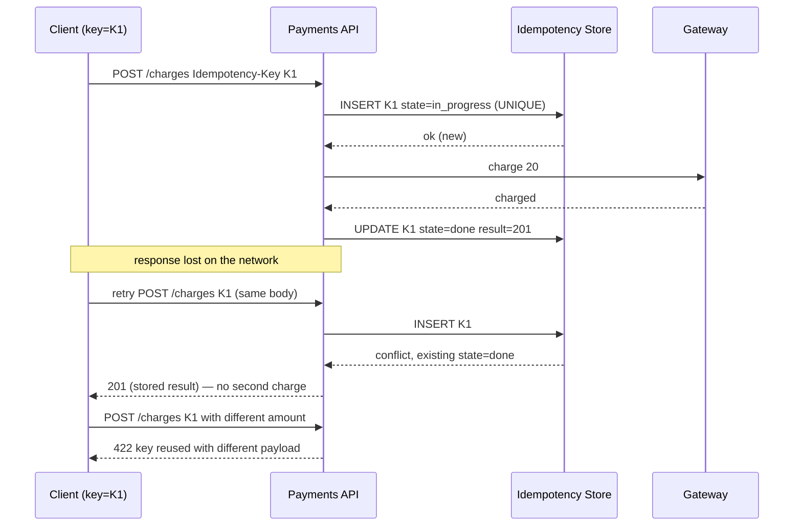

# Module 7.2 — الفشل كحالة طبيعية: المهل، إعادة المحاولة، وعدم التكرار (Idempotency)
## Failure as the Normal Case: Timeouts, Deadlines, Retries with Backoff, Retry Budgets, and Idempotency

> **المستوى:** Level 7 | **الموقع:** [2 من 9]
> **السابق:** [M7.1 — Distributed Systems 1 → 2 → 10](module-7.1-distributed-systems-1-2-10.md) | **التالي:** [M7.3 — Replication, Consistency, CAP](module-7.3-replication-consistency-cap.md)

---

## 1. المتطلبات
> **قبل أن تتعلم هذا، يجب أن تفهم:**
- [ ] النتيجة الثالثة "لا أعرف" ومحاكي `FakeNetwork` — [L7-M7.1](module-7.1-distributed-systems-1-2-10.md)
- [ ] `AbortController` والمهل في `fetch`؛ مفتاح idempotency كفكرة — [L0-M0.6](../level-0-absolute-foundations/module-06-network-client-server.md), [L2-M2.12](../level-2-computer-systems/module-2.12-http.md)
- [ ] الطوابير والمهام ومعنى "at-least-once" — [L5-M5.9](../level-5-building-real-software/module-5.9-queues-jobs-workers.md)
- [ ] المعاملات وقيد UNIQUE والتحديث الذري — [L3-M3.14](../level-3-core-computer-science/module-3.14-transactions-acid.md), [L5-M5.6](../level-5-building-real-software/module-5.6-concurrency-business-logic.md)
- [ ] الحوادث وعاصفة الإعادة كنمط شائع — [L6-M6.7](../level-6-professional-engineering/module-6.7-incident-response.md)

## 2. أهداف التعلّم
بعد هذه الوحدة ستستطيع:
1. التمييز بين **timeout** (محلي لاستدعاء) و**deadline** (موعد نهائي للطلب كله) وتمرير الميزانية المتبقية عبر الخدمات.
2. تصنيف الأخطاء إلى **قابلة للإعادة / غير قابلة / مجهولة** وتقرير الإعادة بناءً على الصنف وعلى **أمان** العملية، لا على "فشل فجرّب".
3. تطبيق **exponential backoff مع jitter** و**retry budget** وشرح لماذا تمنع الإعادة الساذجة النظام من التعافي (retry storm).
4. بناء **مفتاح idempotency** صحيحًا: تخزين النتيجة، حالة "قيد التنفيذ"، التحقق من بصمة الطلب، وانتهاء الصلاحية.
5. تصميم استدعاء خارجي (بوابة دفع) بحيث لا يحدث خصم مزدوج مهما فشلت الشبكة.
6. التعرّف في مراجعة الكود على: إعادة بلا مهلة، مهلة بلا deadline، إعادة لعملية غير آمنة، idempotency في الذاكرة.

## 3. شرح للمبتدئ
في M7.1 اكتشفت أن كل طلب عبر الشبكة له ثلاث نتائج: نجح، فشل، **لا أعرف**. هذه الوحدة هي "ماذا أفعل الآن؟" لكل نتيجة — وهي المهارة التي تفصل الخدمة التي تنهار في أول ضغط عن تلك التي تنحني ثم تعود.

**أولًا: متى أتوقّف عن الانتظار؟ (Timeouts & Deadlines).** استدعاء بلا مهلة هو وعد بالانتظار إلى الأبد؛ في الإنتاج يعني اتصالًا معلّقًا يحتلّ ذاكرة ومقبسًا ودورًا في الـ pool حتى يُعاد تشغيل العملية. لكن المهلة وحدها لا تكفي. تخيّل طلبًا من المستخدم يمرّ بـ 3 خدمات، لكل منها مهلة 5 ثوانٍ وإعادة واحدة: أسوأ حالة 30 ثانية — بينما المتصفّح استسلم بعد 10 وأغلق الاتصال، والخدمات الثلاث ما زالت تعمل لأجل أحد لا ينتظر. الحل: **deadline** واحد يُحدَّد عند الحافة ("هذا الطلب يجب أن ينتهي قبل 10:00:05.000") ويُمرَّر مع الطلب (رأس HTTP أو حقل في الرسالة)؛ كل خدمة تحسب الباقي وتعطي استدعاءاتها الداخلية مهلة ≤ الباقي، وإن كان الباقي ≤ 0 تفشل فورًا بدل أن تبدأ عملًا لن يُستفاد منه. هذا يُسمّى **deadline propagation**، وهو أرخص تحسين أداء في الأنظمة الموزعة لأنه يُلغي العمل الميت.

**ثانيًا: هل أعيد المحاولة؟** سؤالان قبل أي إعادة: (أ) هل الخطأ **عابر** (transient)؟ مهلة، 503، 429، ECONNRESET — ربما ينجح بعد لحظة. 400، 401، 404، خطأ تحقّق — لن ينجح أبدًا مهما أعدت، وإعادته ضجيج يخفي العطل الحقيقي. (ب) هل العملية **آمنة للإعادة**؟ `GET` نعم؛ `POST /charges` بلا مفتاح idempotency **لا**، لأن النتيجة "لا أعرف" تعني أن الإعادة قد تكون خصمًا ثانيًا. إن كان الجواب على (ب) "لا"، فالإعادة ممنوعة حتى تجعلها آمنة (القسم الرابع) — لا توجد خدعة أخرى.

**ثالثًا: كيف أعيد دون أن أقتل الخادم؟** الإعادة الفورية هي السبب الأول لتحوّل عطل صغير إلى انقطاع كامل. السيناريو: خادم يُبطئ لحظيًا؛ 1000 عميل تنتهي مهلتهم في نفس الثانية ويعيدون معًا؛ الآن الحمل 2000؛ يبطئ أكثر؛ يعيدون 3 مرات؛ الحمل 4000 على خادم كان يختنق عند 1000. هذا **retry storm**، والخادم لا يتعافى أبدًا لأن العملاء يُغرقونه كلما حاول النهوض. ثلاث دفاعات تُستخدم معًا: **exponential backoff** (انتظر 100ms، ثم 200، ثم 400…) ليتناقص الضغط؛ **jitter** (عشوائية في الانتظار) كي لا يعود الجميع في نفس اللحظة — بدونه، الإعادات تتجمّع في موجات متزامنة؛ و**retry budget** على مستوى العميل كله: "الإعادات لا تتجاوز 10% من الطلبات الأصلية في أي نافذة" — فإن فشل 50% من الطلبات، لا تُضاعف الحمل، بل تفشل سريعًا وتترك الخادم يتنفّس. الدرس المضاد للحدس: **الإعادة تُساعد حين يكون الفشل نادرًا وتُؤذي حين يكون شائعًا**، والميزانية هي ما يُميّز الحالتين تلقائيًا.

**رابعًا: كيف أجعل الإعادة آمنة؟ (Idempotency).** عملية idempotent هي التي تنفيذها مرة أو عشرًا يعطي نفس الحالة النهائية. بعض العمليات كذلك بطبيعتها (`SET balance = 50`)، وبعضها لا (`balance = balance - 10`). لتحويل الثانية إلى الأولى: العميل يولّد **مفتاحًا فريدًا** للعملية المقصودة (مثلًا UUID لـ "دفع الطلب #42") ويرسله مع كل محاولة؛ الخادم قبل التنفيذ يسأل مخزنًا مشتركًا: "رأيت هذا المفتاح؟" — إن رآه ومعه نتيجة، يُعيد النتيجة نفسها دون تنفيذ؛ وإن لم يره يسجّله **بذرّية** (UNIQUE/`SET NX`) ثم ينفّذ ويحفظ النتيجة. التفاصيل التي يُخطئ فيها الجميع: (1) الحالة الوسطى — طلب أول "قيد التنفيذ" وطلب مكرّر يصل الآن: يجب أن يحصل على 409/"جارٍ" لا أن ينفّذ ثانية ولا أن ينتظر إلى الأبد؛ (2) نفس المفتاح مع **جسم مختلف** = خطأ (422)، لا تنفيذ بصمت؛ (3) المخزن يجب أن يكون **مشتركًا بين النسخ** (M7.1) وأن يُحفظ المفتاح والنتيجة في **نفس المعاملة** مع التأثير حين يكون التأثير في DB نفسها؛ (4) للمفاتيح عمر (24 ساعة مثلًا) — وبعده الإعادة تصبح عملية جديدة، وهذا مقبول وموثّق.

**خامسًا: من المسؤول عن توليد المفتاح؟** من يملك "النيّة". المتصفّح يولّده عند الضغط على "ادفع" (فتُصبح النقرة المزدوجة والإعادة بعد انقطاع آمنتين)؛ وخدمة الطلبات تولّده حين تستدعي بوابة الدفع (مشتقًا من معرّف الطلب: `order-42-payment`)؛ والطابور يُمرّر معرّف الرسالة ليُستخدم من المستهلك. السلسلة كاملة: نيّة واحدة → مفتاح واحد → تأثير واحد مهما تكرّرت الرسائل.

## 4. النموذج الذهني
**"كل استدعاء هو عقد بثلاثة بنود: متى أستسلم، هل أكرّر، وكيف أضمن أن التكرار لا يضرّ."** استدعاء يفتقد أيّ بند منها هو خطأ في الإنتاج ينتظر وقته.

```text
        الطلب الوارد (deadline = T+10s)
              │
   ┌──────────▼──────────┐
   │ الباقي من الميزانية؟│── ≤0 ──▶ افشل فورًا (504) — لا تبدأ عملًا ميتًا
   └──────────┬──────────┘
              │ نعم
   ┌──────────▼──────────┐   timeout = min(الباقي, مهلة الاستدعاء)
   │   استدعِ الخدمة     │
   └──────────┬──────────┘
      نجح ◀───┼───▶ فشل دائم (4xx) ──▶ لا تُعِد؛ أرجع الخطأ
              │
         عابر / لا أعرف
              │
   ┌──────────▼──────────┐
   │ آمنة للإعادة؟       │── لا (بلا مفتاح) ──▶ لا تُعِد؛ سجّل "مجهول" للمصالحة
   │ (idempotent؟)       │
   └──────────┬──────────┘
              │ نعم
   ┌──────────▼──────────┐
   │ ميزانية الإعادة؟    │── مستنفدة ──▶ افشل سريعًا (الخادم يحتاج هواء)
   └──────────┬──────────┘
              │ متاحة
      انتظر backoff × jitter  (مع احترام الـ deadline) ──▶ أعد
```

## 5. الرسم التوضيحي


عاصفة الإعادة مقابل backoff+jitter+budget (حمل خادم سعته 100 طلب/ثانية):

```text
بلا backoff:    t0 ████████████ 120   t1 ████████████████████ 240   t2 ████████████████████████████████ 480  ✗ لا تعافي
backoff ثابت:   t0 ████████████ 120   t1 ░░░░ 0                       t2 ████████████ 120 (موجة متزامنة)   ✗ متذبذب
backoff+jitter: t0 ████████████ 120   t1 ██████ 60                    t2 ████ 40 ... يتناقص                  ✓
+ budget 10%:   t0 ██████████ 100 (الإعادات مقطوعة عند 10)            t1 ███████████ 110                     ✓ مستقر
```

## 6. مثال بسيط
```typescript
// استدعاء واحد صحيح: مهلة مشتقّة من deadline + تصنيف الخطأ + مفتاح idempotency ثابت عبر المحاولات
const deadline = Date.now() + 8_000;
const key = `order-42-payment`;             // مشتق من النيّة، لا من المحاولة
for (let attempt = 0; attempt < 3; attempt++) {
  const remaining = deadline - Date.now();
  if (remaining <= 0) throw new Error("deadline exceeded");
  const ctrl = new AbortController();
  const t = setTimeout(() => ctrl.abort(), Math.min(remaining, 2_000));
  try {
    const res = await fetch("https://pay.example/charges", { method: "POST", signal: ctrl.signal,
      headers: { "Idempotency-Key": key, "content-type": "application/json" }, body: JSON.stringify({ amount: 20 }) });
    if (res.ok) break;                                   // نجح
    if (res.status < 500 && res.status !== 429) throw new Error(`permanent ${res.status}`); // لا تُعِد
  } catch (e) { if (e instanceof Error && e.message.startsWith("permanent")) throw e; }    // عابر أو مجهول → أعد (آمن بفضل المفتاح)
  finally { clearTimeout(t); }
  await new Promise((r) => setTimeout(r, Math.random() * 200 * 2 ** attempt));              // backoff + jitter
}
```

## 7. مثال كود
أربع وحدات صغيرة تُركَّب معًا فوق `FakeNetwork` من M7.1: `Deadline` قابل للتمرير، `retry` بـ backoff/jitter/budget وتصنيف، `IdempotencyStore` بحالة "قيد التنفيذ" وبصمة الجسم، ثم اختبارات تُثبت: الإعادة الساذجة تضاعف الحمل، الميزانية تمنعها، والمفتاح يمنع الخصم المزدوج حتى مع تكرار الشبكة.

```text
m72-resilience/
├─ src/net-sim.ts            ← انسخه من M7.1 (FakeNetwork, TimeoutError, sleep, seeded)
├─ src/deadline.ts
├─ src/retry.ts
├─ src/idempotency.ts
└─ src/resilience.test.ts
```

```typescript
// src/deadline.ts
// Deadline: موعد نهائي مطلق يُمرَّر عبر الاستدعاءات؛ كل طبقة تشتق مهلتها من الباقي.
export class DeadlineExceeded extends Error { constructor() { super("deadline exceeded"); this.name = "DeadlineExceeded"; } }

export class Deadline {
  private constructor(readonly atMs: number, private readonly now: () => number) {}
  static after(ms: number, now: () => number = Date.now) { return new Deadline(now() + ms, now); }
  static fromHeader(v: string | undefined, fallbackMs: number, now: () => number = Date.now) {
    const at = v ? Number(v) : NaN;
    return Number.isFinite(at) ? new Deadline(at, now) : Deadline.after(fallbackMs, now);
  }
  remainingMs() { return Math.max(0, this.atMs - this.now()); }
  expired() { return this.remainingMs() <= 0; }
  // مهلة الاستدعاء الفرعي = الأصغر بين مهلته الخاصة والباقي من الميزانية
  timeoutFor(callMs: number) { if (this.expired()) throw new DeadlineExceeded(); return Math.min(callMs, this.remainingMs()); }
  toHeader() { return String(this.atMs); }
}
```

```typescript
// src/retry.ts
import { TimeoutError, sleep } from "./net-sim.ts";
import { Deadline, DeadlineExceeded } from "./deadline.ts";

export type ErrorClass = "transient" | "permanent" | "unknown";
export class PermanentError extends Error { constructor(msg: string, readonly status?: number) { super(msg); this.name = "PermanentError"; } }
export class TransientError extends Error { constructor(msg: string, readonly status?: number) { super(msg); this.name = "TransientError"; } }

// تصنيف الخطأ هو قرار صريح، لا "catch كل شيء ثم أعد"
export function classify(e: unknown): ErrorClass {
  if (e instanceof TimeoutError) return "unknown";       // ربما نُفِّذ
  if (e instanceof TransientError) return "transient";
  if (e instanceof PermanentError) return "permanent";
  return "permanent";                                     // المجهول البرمجي (bug) لا يُعاد
}

// RetryBudget: الإعادات ≤ نسبة من الطلبات الأصلية داخل نافذة — دفاع على مستوى العميل كله
export class RetryBudget {
  private originals = 0; private retries = 0;
  constructor(private readonly ratio = 0.1, private readonly minOriginals = 10) {}
  recordOriginal() { this.originals++; }
  tryConsume(): boolean {
    const allowed = Math.max(this.minOriginals * this.ratio, this.originals * this.ratio);
    if (this.retries + 1 > allowed) return false;
    this.retries++; return true;
  }
  stats() { return { originals: this.originals, retries: this.retries }; }
}

export interface RetryOptions {
  maxAttempts?: number; baseMs?: number; maxBackoffMs?: number; random?: () => number;
  budget?: RetryBudget; idempotent: boolean; deadline?: Deadline; sleeper?: (ms: number) => Promise<void>;
  onRetry?: (info: { attempt: number; waitMs: number; cls: ErrorClass }) => void;
}

// full jitter: wait ∈ [0, min(cap, base·2^attempt)]
export function backoffWithJitter(attempt: number, baseMs: number, capMs: number, random: () => number) {
  return Math.floor(random() * Math.min(capMs, baseMs * 2 ** attempt));
}

export async function retry<T>(fn: (timeoutMs: number) => Promise<T>, o: RetryOptions): Promise<T> {
  const max = o.maxAttempts ?? 3, base = o.baseMs ?? 50, cap = o.maxBackoffMs ?? 2_000, rnd = o.random ?? Math.random, zzz = o.sleeper ?? sleep;
  const dl = o.deadline ?? Deadline.after(10_000);
  o.budget?.recordOriginal();
  let lastErr: unknown;
  for (let attempt = 0; attempt < max; attempt++) {
    try { return await fn(dl.timeoutFor(1_000)); }
    catch (e) {
      lastErr = e;
      if (e instanceof DeadlineExceeded) throw e;
      const cls = classify(e);
      if (cls === "permanent") throw e;                                   // لن ينجح أبدًا
      if (cls === "unknown" && !o.idempotent) throw e;                    // "لا أعرف" + غير آمنة = ممنوع
      if (attempt === max - 1) break;
      if (o.budget && !o.budget.tryConsume()) throw new TransientError(`retry budget exhausted: ${String(e)}`);
      const waitMs = Math.min(backoffWithJitter(attempt, base, cap, rnd), dl.remainingMs());
      o.onRetry?.({ attempt: attempt + 1, waitMs, cls });
      await zzz(waitMs);
    }
  }
  throw lastErr;
}
```

```typescript
// src/idempotency.ts
import { createHash } from "node:crypto";

export type IdemRecord =
  | { state: "in_progress"; fingerprint: string; startedAt: number }
  | { state: "done"; fingerprint: string; status: number; body: unknown; doneAt: number };

export interface IdemStore {          // في الإنتاج: جدول DB (UNIQUE key) أو Redis SET NX — مشترك بين النسخ
  claim(key: string, rec: IdemRecord): Promise<IdemRecord | null>;  // يُرجع null إن حُجز الآن، أو السجل الموجود
  complete(key: string, rec: IdemRecord): Promise<void>;
  release(key: string): Promise<void>;
}

export class MemoryIdemStore implements IdemStore {   // للاختبار فقط (M7.1: الذاكرة ليست مشتركة)
  readonly m = new Map<string, IdemRecord>();
  async claim(key: string, rec: IdemRecord) { const ex = this.m.get(key); if (ex) return ex; this.m.set(key, rec); return null; }
  async complete(key: string, rec: IdemRecord) { this.m.set(key, rec); }
  async release(key: string) { this.m.delete(key); }
}

export const fingerprint = (body: unknown) => createHash("sha256").update(JSON.stringify(body)).digest("hex");

export class IdempotencyConflict extends Error { constructor(readonly status: number, msg: string) { super(msg); this.name = "IdempotencyConflict"; } }

// يلفّ عملية غير آمنة ويجعلها آمنة للإعادة: نفس المفتاح + نفس الجسم ⇒ نفس النتيجة، مرة واحدة
export async function idempotent<T>(store: IdemStore, key: string, body: unknown, now: () => number,
  run: () => Promise<{ status: number; body: T }>): Promise<{ status: number; body: T; replayed: boolean }> {
  const fp = fingerprint(body);
  const existing = await store.claim(key, { state: "in_progress", fingerprint: fp, startedAt: now() });
  if (existing) {
    if (existing.fingerprint !== fp) throw new IdempotencyConflict(422, "idempotency key reused with different payload");
    if (existing.state === "in_progress") throw new IdempotencyConflict(409, "request with this key is still in progress");
    return { status: existing.status, body: existing.body as T, replayed: true };
  }
  try {
    const r = await run();
    await store.complete(key, { state: "done", fingerprint: fp, status: r.status, body: r.body, doneAt: now() });
    return { ...r, replayed: false };
  } catch (e) { await store.release(key); throw e; }   // فشل حقيقي قبل التأثير → اسمح بمحاولة جديدة
}
```

```typescript
// src/resilience.test.ts
import { test } from "node:test";
import assert from "node:assert/strict";
import { FakeNetwork, TimeoutError, seeded, sleep } from "./net-sim.ts";
import { Deadline, DeadlineExceeded } from "./deadline.ts";
import { retry, RetryBudget, TransientError, PermanentError } from "./retry.ts";
import { idempotent, MemoryIdemStore, IdempotencyConflict } from "./idempotency.ts";

test("deadline propagation: المهلة الفرعية لا تتجاوز الباقي، والطلب المنتهي يفشل فورًا", () => {
  let t = 0; const now = () => t;
  const dl = Deadline.after(1_000, now);
  assert.equal(dl.timeoutFor(5_000), 1_000);
  t = 700; assert.equal(dl.timeoutFor(5_000), 300);
  const downstream = Deadline.fromHeader(dl.toHeader(), 9_999, now);  // الخدمة التالية تقرأ نفس الموعد
  assert.equal(downstream.remainingMs(), 300);
  t = 1_000; assert.throws(() => dl.timeoutFor(10), DeadlineExceeded);
});

test("retry storm: الإعادة الساذجة تضاعف الحمل على خادم مختنق؛ الميزانية تقطعها", async () => {
  const slowServer = { calls: 0, async handle() { this.calls++; await sleep(5); throw new TransientError("503", 503); } };
  const naive = async () => { for (let i = 0; i < 4; i++) { try { return await slowServer.handle(); } catch { /* فورًا مرة أخرى */ } } };
  await Promise.all(Array.from({ length: 50 }, naive));
  const naiveCalls = slowServer.calls;                       // 50 عميل × 4 = 200 على خادم طاقته 50
  slowServer.calls = 0;
  const budget = new RetryBudget(0.1);
  const results = await Promise.allSettled(Array.from({ length: 50 }, () =>
    retry(() => slowServer.handle(), { idempotent: true, maxAttempts: 4, baseMs: 1, budget, random: seeded(3), sleeper: async () => {} })));
  assert.equal(naiveCalls, 200);
  assert.ok(slowServer.calls <= 50 + 5, `budgeted calls=${slowServer.calls}`);  // 50 أصلية + ≤10% إعادات
  assert.ok(results.every((r) => r.status === "rejected"));
  assert.ok(results.some((r) => r.status === "rejected" && /budget exhausted/.test(String(r.reason))));
});

test("classification: 4xx لا يُعاد، timeout على عملية غير idempotent لا يُعاد، transient يُعاد مع backoff", async () => {
  let n = 0;
  await assert.rejects(retry(async () => { n++; throw new PermanentError("400", 400); }, { idempotent: true, sleeper: async () => {} }), PermanentError);
  assert.equal(n, 1);
  n = 0;
  await assert.rejects(retry(async () => { n++; throw new TimeoutError(10); }, { idempotent: false, sleeper: async () => {} }), TimeoutError);
  assert.equal(n, 1);                                         // "لا أعرف" + غير آمنة ⇒ محاولة واحدة فقط
  n = 0; const waits: number[] = [];
  const v = await retry(async () => { n++; if (n < 3) throw new TransientError("503"); return "ok"; },
    { idempotent: false, baseMs: 100, random: () => 0.5, sleeper: async (ms) => { waits.push(ms); } });
  assert.equal(v, "ok"); assert.deepEqual(waits, [50, 100]);  // 0.5·100·2^0, 0.5·100·2^1
});

test("idempotency عبر شبكة تكرّر وتفقد: خصم واحد فقط، والجسم المختلف يُرفض", async () => {
  const store = new MemoryIdemStore();
  let charged = 0; let t = 0;
  const net = new FakeNetwork({ duplicateRate: 0.5, lossRate: 0.3, random: seeded(11), minDelayMs: 0, maxDelayMs: 1 });
  net.register<{ key: string; amount: number }, { status: number; body: { id: string } }>("payments", (req) =>
    idempotent(store, req.key, { amount: req.amount }, () => t++, async () => { charged += req.amount; return { status: 201, body: { id: "ch_1" } }; }));
  const call = () => net.send<{ key: string; amount: number }, { status: number }>("orders", "payments", { key: "order-42", amount: 20 }, 30);
  let ok = 0;
  for (let i = 0; i < 8; i++) { try { await call(); ok++; } catch (e) { assert.ok(e instanceof TimeoutError || e instanceof IdempotencyConflict); } }
  await sleep(20);                                            // دع النسخ المكرّرة/الضائعة تُنفَّذ
  assert.equal(charged, 20, "exactly one charge despite retries, dups and losses");
  assert.ok(ok >= 1);
  await assert.rejects(idempotent(store, "order-42", { amount: 99 }, () => t++, async () => ({ status: 201, body: {} })),
    (e: unknown) => e instanceof IdempotencyConflict && e.status === 422);
  // "قيد التنفيذ": المكرّر المتزامن يحصل على 409 لا على تنفيذ ثانٍ
  const slow = idempotent(store, "order-43", { amount: 5 }, () => t++, async () => { await sleep(10); charged += 5; return { status: 201, body: {} }; });
  await assert.rejects(idempotent(store, "order-43", { amount: 5 }, () => t++, async () => { charged += 5; return { status: 201, body: {} }; }),
    (e: unknown) => e instanceof IdempotencyConflict && e.status === 409);
  await slow; assert.equal(charged, 25);
});
```

**تشغيل:** `npx tsx --test src/*.test.ts`. لاحظ في الاختبار الرابع أن `FakeNetwork` تُسلّم النسخ المكرّرة **وتنفّذها**، وأن "الضائع" يُنفَّذ أيضًا ثم يُعاد من العميل — ومع ذلك `charged === 20`. هذا هو الضمان الوحيد الذي يهمّ.

---

## 8. مثال من العالم الحقيقي
متجر إلكتروني لاحظ في Black Friday أن بوابة الدفع أبطأت استجابتها من 300ms إلى 4 ثوانٍ لمدة دقيقتين. كود الدفع كان: `try { charge() } catch { charge() }` بمهلة 3 ثوانٍ وبلا مفتاح idempotency. النتيجة: آلاف الطلبات انتهت مهلتها **بعد** أن نفّذت البوابة الخصم، ثم أُعيدت فخُصمت ثانية؛ 1,800 عميل دُفع منهم مرتين، وفريق الدعم قضى أسبوعًا في الاسترداد اليدوي، والبوابة حدّت من معدّل الشركة بسبب عاصفة الإعادة. الإصلاح الذي صمد: مفتاح idempotency مشتق من معرّف الطلب، تصنيف صريح للأخطاء، backoff مع jitter، وميزانية إعادة 10%؛ ثم "تقرير المصالحة" الليلي الذي يقارن الطلبات ذات النتيجة المجهولة مع سجل البوابة. الدرس الذي كتبوه في الـ postmortem: "المهلة ليست إلغاءً؛ هي إعلان جهل".

## 9. مثال من الإنتاج
شركة خدمات سحابية فقدت منطقة كاملة لثلاث ساعات بسبب عاصفة إعادة ذاتية: خدمة البيانات الوصفية أبطأت لحظيًا، فأعادت كل الخدمات المعتمدة عليها المحاولة فورًا وبلا ميزانية، فارتفع الحمل عشرة أضعاف ومنع الخدمة من التعافي حتى بعد زوال السبب الأصلي (metastable failure). استعادوا الخدمة فقط بـ**قطع العملاء يدويًا** ثم إعادتهم تدريجيًا. النتيجة التنظيمية: معيار داخلي إلزامي لكل عميل RPC — deadline مُمرَّر، backoff بـ jitter، retry budget، وتقديم 429/503 مع `Retry-After` من الخادم ليتحكّم هو بالضغط لا العملاء؛ واختبار دوري "حقن بطء 2 ثانية في خدمة X" للتحقق من أن الحمل لا يتضاعف. الربط بـ M7.5: الـ circuit breaker هو الطبقة التالية فوق هذه الأساسيات.

---

## 10. مفاهيم خاطئة شائعة
1. **"أضف إعادة محاولة والنظام يصير أكثر موثوقية."** الإعادة تُضيف حملًا؛ بلا تصنيف وbackoff وميزانية تُقلّل الموثوقية وقت الحاجة.
2. **"المهلة = الطلب أُلغي."** العميل توقّف عن الانتظار؛ الخادم ربما مستمرّ. الإلغاء الحقيقي يتطلّب تمرير الإشارة.
3. **"PUT/DELETE idempotent تلقائيًا."** دلاليًا نعم، لكن إن كان المعالج يُرسل بريدًا أو يُنشئ حدثًا في كل استدعاء فليس كذلك — الـ idempotency صفة **التنفيذ** لا الفعل.
4. **"المفتاح في الذاكرة يكفي."** مع نسختين أو إعادة تشغيل يختفي؛ يجب أن يكون مشتركًا ودائمًا بما يكفي لنافذة الإعادة.
5. **"jitter تفصيل ثانوي."** بدونه، كل من فشل في نفس اللحظة يعود في نفس اللحظة؛ هو ما يحوّل الموجات إلى تناقص.
6. **"الطابور يحلّ الإعادة."** الطابور يمنحك at-least-once؛ أي يُلزمك بـ idempotency في المستهلك، ولا يُعفيك منها.

## 11. أخطاء شائعة
1. استدعاء خارجي بلا مهلة (أو مهلة افتراضية 0 = لانهائية في بعض المكتبات).
2. مهل محلية بلا deadline مُمرَّر → مجموعها يتجاوز صبر المستخدم بكثير.
3. `catch (e) { retry() }` لكل الأخطاء بما فيها 400/401 وأخطاء البرمجة.
4. إعادة `POST` غير آمنة بعد timeout "لأن المهلة غالبًا تعني فشلًا".
5. مفتاح idempotency يُولَّد **لكل محاولة** (UUID جديد في كل حلقة) → بلا فائدة.
6. تخزين النتيجة تحت المفتاح بعد التأثير في معاملة **أخرى** → نافذة يُحدث فيها الانهيار تأثيرًا بلا مفتاح.
7. تجاهل الحالة "قيد التنفيذ" → طلبان متزامنان بنفس المفتاح ينفّذان معًا.
8. لا حدّ أقصى للـ backoff → انتظار دقائق لطلب تفاعلي؛ أو backoff بلا احترام الـ deadline.
9. إعادة في **كل طبقة** (SDK + خدمة + LB + عميل) → 3×3×3 = 27 محاولة فعلية.

## 12. تمرين تصحيح
بعد نشر "تحسين الموثوقية" (إعادة ×3 في SDK المدفوعات)، تصل تنبيهات: خطأ 429 من بوابة الدفع، وزمن `/checkout` p99 ارتفع إلى 25 ثانية، وشكاوى "خُصم منّي مرتين".
1. **دليل:** SDK يعيد 3 مرات بمهلة 5 ثوانٍ؛ خدمة الطلبات **أيضًا** تعيد مرتين؛ الـ LB أمامها يعيد مرة على 5xx؛ المفتاح يُولَّد داخل SDK لكل محاولة؛ البوابة أبطأت 20% فقط من الطلبات.
2. **فرضية:** تضخيم الإعادة 3×2×2 = 12 محاولة بحد أقصى لكل طلب أصلي → 429 من البوابة؛ والمهل المتسلسلة تُنتج 25 ثانية؛ والمفتاح لكل محاولة يجعل كل إعادة بعد timeout خصمًا جديدًا.
3. **تجربة:** حقن بطء 6 ثوانٍ في بوابة وهمية بطلب واحد وعدّ الاستدعاءات التي تصلها (توقّع ≈12) وعدد المفاتيح المختلفة (توقّع ≈12) وزمن الاستجابة الكلي.
4. **الإصلاح:** إعادة في **طبقة واحدة** (خدمة الطلبات) بميزانية؛ SDK وLB بلا إعادة لـ POST؛ مفتاح مشتق من معرّف الطلب يُولَّد مرة قبل الحلقة؛ deadline 8 ثوانٍ يُمرَّر؛ 409/"جارٍ" للمتزامن؛ تقرير مصالحة للنتائج المجهولة.
5. **تحقّق:** اختبار §7 الرابع بالسيناريو الحقيقي + لوحة "محاولات لكل طلب أصلي" (يجب ≈1.05).

## 13. تمرين معماري
صمّم "عقد الاستدعاء" لكل حافة في Project 6 واكتبه كجدول: الحافة (api→DB، api→Redis، api→بوابة الدفع، worker→SMTP، webhook وارد→api، api→خدمة البحث)؛ المهلة الفرعية؛ هل تُمرَّر deadline وكيف (رأس/حقل)؛ تصنيف الأخطاء المتوقّعة؛ idempotent؟ وكيف (مفتاح من أين، مخزن أين، عمره)؛ سياسة الإعادة (عدد، base، cap، ميزانية) أو "لا إعادة — مصالحة"؛ ماذا يرى المستخدم عند الفشل النهائي. ثم اختر الحافة الأخطر (المدفوعات) واكتب تسلسلًا (sequence diagram) للطلب الذي يصل جوابه بعد انتهاء المهلة، واشرح أين يُكتشف وكيف يُصالَح. أضف ADR لقرار "طبقة إعادة واحدة فقط".

## 14. الصلة بعصر AI
اطلب من وكيل كتابة "استدعاء API بإعادة محاولة" وستحصل غالبًا على حلقة `for` بـ `catch` شامل وبلا مهلة ولا مفتاح ولا ميزانية — لأن هذا هو الشكل الأكثر شيوعًا في بيانات التدريب. العقد الذي تعلّمته هنا هو ما تضعه في سياقه (M8.5) كـ "قائمة قبول": deadline مُمرَّر، تصنيف صريح، إعادة فقط لـ transient/unknown مع idempotency، backoff+jitter+budget، حالة in-progress. والأهم: اطلب من الوكيل **اختبار عاصفة الإعادة** و**اختبار الخصم المزدوج** مثل §7 قبل أن تقبل الكود — الموثوقية لا تُراجَع بالعين، بل بحقن الفشل.

## 15. ما يجب إتقانه (Must Master) 🔴
- 🔴 timeout مقابل deadline وتمرير الميزانية؛ تصنيف الأخطاء الثلاثي وقرار الإعادة من (الصنف × الأمان)؛ backoff+jitter+retry budget ولماذا؛ idempotency key كاملًا (ذرّية الحجز، in-progress، البصمة، العمر، المخزن المشترك)؛ طبقة إعادة واحدة.

## 16. ما يجب فهمه (Should Understand) 🟠
- 🟠 إشارات الخادم `429/503 + Retry-After`؛ المصالحة الدورية للنتائج المجهولة؛ decorrelated jitter وأنواع jitter الأخرى؛ hedged requests (إرسال نسخة ثانية بعد p95) ومتى تصلح.

## 17. ما يمكن تأجيله (Can Defer) ⚪
- ⚪ الإثبات الرياضي لاستقرار الميزانية؛ exactly-once في أنظمة التدفّق (Kafka transactions) — ستلمسه في M7.9.

## 18. الخلاصة
1. الفشل هو الحالة الطبيعية؛ كل استدعاء يحتاج: متى أستسلم، هل أكرّر، كيف أضمن أن التكرار بلا ضرر.
2. deadline واحد عند الحافة يُمرَّر، وكل مهلة فرعية تُشتقّ من الباقي؛ العمل الميت يُقطع مبكرًا.
3. أعد فقط ما هو عابر أو مجهول **وآمن**؛ الدائم لا يُعاد؛ المجهول غير الآمن يُصالَح لا يُعاد.
4. backoff أُسّي + jitter + ميزانية ≈ الفرق بين عطل دقيقة وانقطاع ساعات.
5. idempotency = مفتاح من النيّة، حجز ذرّي مشترك، حالة قيد التنفيذ، بصمة الجسم، نتيجة محفوظة، عمر محدّد.
6. الإعادة في طبقة واحدة؛ وإلا تتضاعف.

## 19. مراجع رسمية
- AWS Architecture Blog — Exponential Backoff and Jitter: https://aws.amazon.com/blogs/architecture/exponential-backoff-and-jitter/
- Google SRE Book — Handling Overload (retry budgets, deadline propagation): https://sre.google/sre-book/handling-overload/
- Google SRE Book — Addressing Cascading Failures: https://sre.google/sre-book/addressing-cascading-failures/
- Stripe — Designing robust and predictable APIs with idempotency: https://stripe.com/blog/idempotency
- IETF draft — The Idempotency-Key HTTP Header Field: https://datatracker.ietf.org/doc/draft-ietf-httpapi-idempotency-key-header/
- RFC 9110 §9.2.2 — Idempotent Methods: https://www.rfc-editor.org/rfc/rfc9110#section-9.2.2
- gRPC — Deadlines: https://grpc.io/docs/guides/deadlines/
- Node.js — `AbortSignal.timeout()`: https://nodejs.org/api/globals.html#static-method-abortsignaltimeoutdelay

## المصطلحات
| العربية | English |
|---|---|
| مهلة | Timeout |
| موعد نهائي | Deadline |
| تمرير الموعد النهائي | Deadline propagation |
| خطأ عابر | Transient error |
| خطأ دائم | Permanent error |
| نتيجة مجهولة | Unknown outcome |
| تراجع أُسّي | Exponential backoff |
| عشوائية التراجع | Jitter |
| ميزانية الإعادة | Retry budget |
| عاصفة الإعادة | Retry storm |
| فشل شبه مستقر | Metastable failure |
| عدم التكرار / تماثل القوة | Idempotency |
| مفتاح عدم التكرار | Idempotency key |
| بصمة الطلب | Request fingerprint |
| قيد التنفيذ | In-progress state |
| تضخيم الإعادة | Retry amplification |
| مصالحة | Reconciliation |
| طلب مزدوج استباقي | Hedged request |
