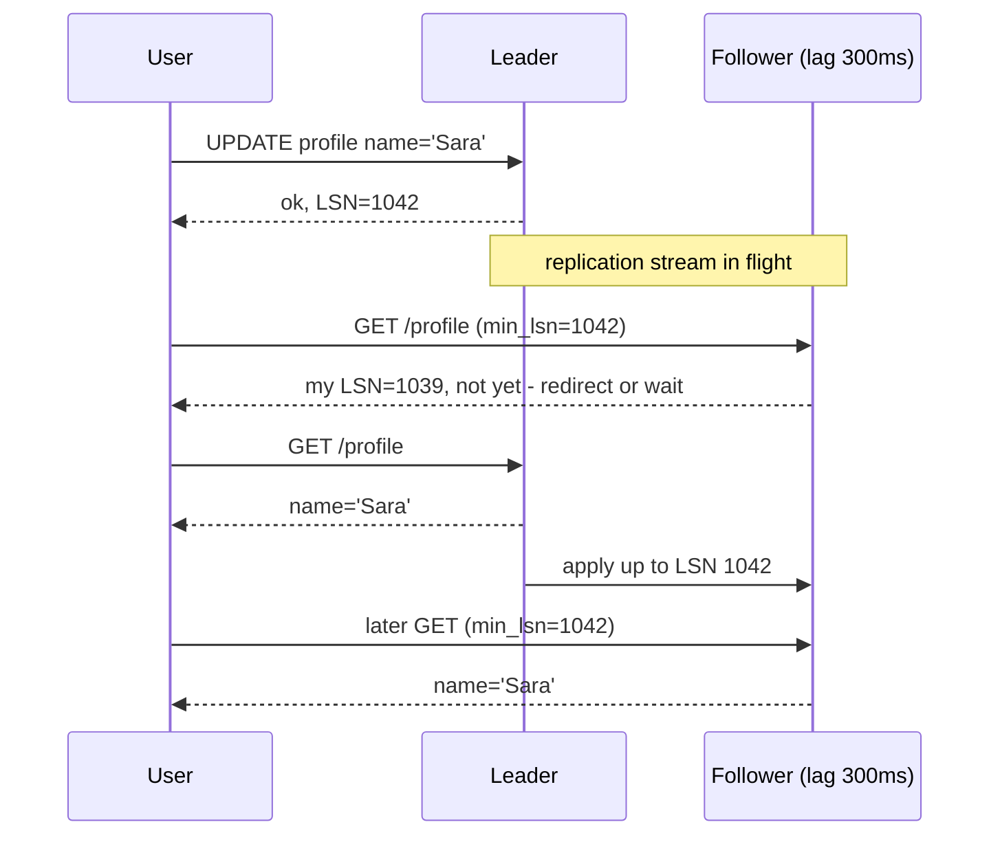

# Module 7.3 — النسخ المتماثل، الاتساق، ونظرية CAP
## Replication, Consistency Models, and CAP: leader/follower, replication lag, read-your-writes, quorums, and what a partition really forces you to choose

> **المستوى:** Level 7 | **الموقع:** [3 من 9]
> **السابق:** [M7.2 — Failure, Timeouts, Retries, Idempotency](module-7.2-failure-timeouts-retries-idempotency.md) | **التالي:** [M7.4 — Load Balancing & Scaling](module-7.4-load-balancing-scaling.md)

---

## 1. المتطلبات
> **قبل أن تتعلم هذا، يجب أن تفهم:**
- [ ] الفشل الجزئي، تقسيم الشبكة، "لا ساعة مشتركة"، الإصدار المنطقي — [L7-M7.1](module-7.1-distributed-systems-1-2-10.md)
- [ ] المعاملات وعزلها وACID؛ WAL/الالتزام — [L3-M3.14](../level-3-core-computer-science/module-3.14-transactions-acid.md)
- [ ] الكاش والإبطال وstale reads — [L5-M5.8](../level-5-building-real-software/module-5.8-caching.md)
- [ ] تصنيف الأخطاء وما يعنيه timeout — [L7-M7.2](module-7.2-failure-timeouts-retries-idempotency.md)

## 2. أهداف التعلّم
بعد هذه الوحدة ستستطيع:
1. شرح **لماذا** نُكرّر البيانات (توافر، قراءة قريبة، نسخ احتياطي حيّ) وما الثمن (تأخّر، تعارض).
2. وصف **leader/follower** بالنسخ المتزامن وغير المتزامن، و**replication lag** وأعراضه الأربعة للمستخدم.
3. تطبيق ضمانات "اتساق من زاوية العميل": **read-your-writes**، **monotonic reads**، عبر رمز LSN/الإصدار.
4. حساب الـ **quorum** (W + R > N) وتفسير ما يمنحه وما لا يمنحه.
5. إعادة صياغة CAP بشكل صحيح: عند **التقسيم** فقط تختار بين رفض الطلب (C) أو خدمته ببيانات قد تكون قديمة (A)؛ وبدون تقسيم المقايضة هي **زمن مقابل اتساق** (PACELC).
6. اختيار نموذج الاتساق **لكل عملية** في نظام واحد (رصيد مقابل عدّاد إعجابات) وتبريره.

## 3. شرح للمبتدئ
حتى الآن كانت قاعدة بياناتك خادمًا واحدًا: مصدر الحقيقة الوحيد، وكل قراءة ترى آخر كتابة. هذا الخادم الواحد له مشكلتان: إن مات توقّف كل شيء (M7.1: الفشل الكلّي)، وكل القراءات تمرّ به مهما كثرت. **النسخ المتماثل (Replication)** يحلّ المشكلتين بنسخ البيانات نفسها إلى خوادم أخرى — ويخلق مشكلة ثالثة لا تنتهي: **أيّ نسخة هي الحقيقة الآن؟**

**الشكل الأشهر: قائد وتابعون (leader/follower).** كل الكتابات تذهب إلى القائد (نسخة واحدة تُرتّب الكتابات — وهذا يحلّ مشكلة "من يفوز" من M7.1)، والقائد يُرسل سجلّ التغييرات (WAL/replication stream) إلى التوابع التي تطبّقه بالترتيب نفسه. القراءات يمكن توزيعها على التوابع. القرار الأول: هل ينتظر القائد **تأكيد** التابع قبل أن يقول للعميل "تم" (**synchronous**)، أم يقول "تم" فورًا ويُرسل لاحقًا (**asynchronous**)؟ المتزامن يضمن أن التابع يملك الكتابة (لا فقدان عند موت القائد) مقابل زمن أعلى لكل كتابة واعتماد التوافر على التابع؛ غير المتزامن أسرع وأكثر توافرًا، لكن إن مات القائد قبل الإرسال **تُفقد الكتابات المؤكّدة** — ويكون التابع متأخّرًا بـ **replication lag**: ميلي ثوانٍ عادة، وثوانٍ أو دقائق تحت الحمل أو بعد انقطاع. الحلّ الشائع وسطي: تابع واحد متزامن (semi-sync) والباقي غير متزامن.

**ماذا يرى المستخدم بسبب التأخّر؟** أربعة أعراض، لكلٍّ اسم وعلاج:
1. **كتبتُ ثم لم أجد ما كتبت** — حدّث ملفّه الشخصي (كتابة إلى القائد) ثم أعاد تحميل الصفحة (قراءة من تابع متأخّر) فرأى القديم. الضمان المطلوب: **read-your-writes**. العلاجات: اقرأ من القائد لفترة بعد الكتابة؛ أو أرخص وأدقّ: أعطِ العميل **رمز الإصدار** (LSN — موضع الكتابة في السجل) بعد الكتابة، وفي القراءة التالية اختر تابعًا بلغ هذا الموضع أو انتظر/اذهب للقائد.
2. **الزمن يعود للوراء** — قراءة من تابع محدَّث ثم من آخر متأخّر؛ التعليق يظهر ثم يختفي. الضمان: **monotonic reads** — المستخدم نفسه يقرأ دائمًا من النسخة نفسها (sticky) أو لا يقبل إصدارًا أقلّ ممّا رأى.
3. **الجواب قبل السؤال** — سؤال وجوابه كُتبا بترتيب، لكن تابعًا طبّق الجواب قبل أن يصله السؤال (في الأنظمة متعدّدة القادة أو المجزّأة). الضمان: **consistent prefix / causal consistency**.
4. **قرار على بيانات قديمة** — المخزون في التابع يقول "متوفّر" بينما القائد يقول "نفد". العلاج: أي قراءة تُستخدم **لاتخاذ قرار كتابة** تذهب إلى القائد داخل المعاملة (M5.6: `SELECT … FOR UPDATE`) — لا تابع هنا أبدًا.

الخلاصة العملية: **ليس على نظامك كله أن يكون بنموذج اتساق واحد.** الرصيد والمخزون ومعرّفات idempotency: قائد فقط، متزامن. الملف الشخصي والقوائم: توابع مع read-your-writes. عدّادات المشاهدة والتوصيات: أي تابع، قديم بثوانٍ لا يضرّ أحدًا. تحديد "من يحتاج ماذا" هو عمل المهندس، لا إعداد في DB.

**بلا قائد: النُّصُب (Quorums).** أنظمة مثل Cassandra/Dynamo تكتب إلى N نسخ وتعتبر الكتابة ناجحة حين تؤكّد W منها، وتقرأ من R وتختار الأحدث (بإصدار منطقي، M7.1). إن كان **W + R > N** فأي قراءة تلامس نسخة واحدة على الأقل رأت آخر كتابة. N=3, W=2, R=2 هو التوازن الشائع؛ W=1 كتابة سريعة لكن فقدان محتمل؛ R=1 قراءة سريعة لكن قديمة محتملة. النصاب يمنحك "الأحدث غالبًا" لا معاملات ولا عزلًا — وهو أضعف ممّا يبدو عند الفشل الجزئي أثناء الكتابة (وصلت إلى نسخة واحدة فقط ثم انقطع). وحين تكتب نسختان **متزامنتان** نفس المفتاح تحصل على **تعارض** يجب حلّه: LWW (يفقد بيانات بصمت، M7.1)، أو دمج تطبيقي (سلّة تسوّق = اتحاد العناصر)، أو CRDTs.

**CAP كما يُفهم خطأ وكما هو فعلًا.** الصياغة الشائعة "اختر اثنين من ثلاثة" مضلّلة. التقسيم (P) ليس خيارًا — الشبكة ستنقسم (M7.1)؛ السؤال الوحيد هو: **حين** تنقسم، وتصلك كتابة/قراءة في جانب لا يرى الجانب الآخر، ماذا تفعل؟ إمّا ترفضها أو تؤخّرها حتى يُشفى التقسيم (تحفظ **C** — الكل يرى نفس الحقيقة — وتخسر التوافر)، أو تخدمها بما لديك (تحفظ **A** وتقبل اختلافًا مؤقّتًا يُصالَح لاحقًا). وهذا قرار **لكل عملية**، لا للنظام: سحب رصيد أثناء تقسيم → ارفض؛ إضافة إلى سلّة → اقبل وادمج. وبلا تقسيم (99.9% من الوقت) المقايضة الفعلية هي **PACELC**: الاتساق الأقوى يُكلّف زمنًا (تأكيدات عبر الشبكة قبل كل "تم")، والاتساق الأضعف أسرع. لذلك "قاعدة بياناتنا CP" جملة شبه فارغة؛ الجملة المفيدة: "عملية X ترفض عند التقسيم وتدفع 2 RTT لكل كتابة؛ عملية Y تقبل وتدمج".

## 4. النموذج الذهني
**"النسخ المتماثل يُحوّل سؤال 'ما القيمة؟' إلى 'ما القيمة *بحسب مَن* و*حتى أيّ لحظة*؟' — ونموذج الاتساق هو وعدك للعميل عن الجواب."** اختر الوعد الأضعف الذي يحتمله كل **نوع عملية**، وادفع ثمن الأقوى حيث يلزم فقط.

```text
الأقوى  ◀────────────────────────────────────────────────────────────▶  الأضعف
Linearizable      Read-your-writes       Monotonic reads     Eventual
"كأنه خادم واحد"  "أرى ما كتبتُ"          "لا أعود للوراء"     "سيتّفقون... يومًا"
الثمن: زمن + توافر أقل عند التقسيم                           الثمن: المستخدم قد يرى القديم
الاستخدام: رصيد، مخزون، أقفال، idempotency   ملف شخصي، إعدادات   خلاصات، عدّادات، تحليلات
```

## 5. الرسم التوضيحي


تقسيم الشبكة وقرار C مقابل A لكل عملية:

```text
            ┌───────────────┐      ✗ partition ✗      ┌───────────────┐
            │  Node A (DC1) │ ───────  ╳  ──────────── │  Node B (DC2) │
            │  balance=100  │                           │  balance=100  │
            └───────┬───────┘                           └───────┬───────┘
   withdraw 80 ─────┘ (C: reject — cannot confirm B)            └───── withdraw 80 (C: reject)
   add-to-cart ─────┘ (A: accept locally, merge later)          └───── add-to-cart (A: accept)
   after heal: carts = union{A,B} ✓ ; balance never went negative ✓
```

## 6. مثال بسيط
```typescript
// ضمان read-your-writes برمز إصدار: بعد الكتابة نحمل LSN في الكوكي؛ القراءة تختار نسخة بلغته
app.post("/profile", async (req, res) => {
  const { lsn } = await leader.query("UPDATE profiles SET name=$1 WHERE id=$2 RETURNING pg_current_wal_lsn() AS lsn", [req.body.name, req.user.id]);
  res.cookie("min_lsn", lsn, { maxAge: 10_000 });               // يكفي 10 ثوانٍ: أطول من أي lag طبيعي
  res.sendStatus(204);
});
app.get("/profile", async (req, res) => {
  const minLsn = req.cookies.min_lsn;
  const db = minLsn && !(await replica.hasReached(minLsn)) ? leader : replica;   // التابع إن لحق، وإلا القائد
  res.json(await db.query("SELECT name FROM profiles WHERE id=$1", [req.user.id]));
});
```

## 7. مثال كود
محاكاة كاملة داخل عملية واحدة: قائد وتابعان بسجلّ مُرقَّم (LSN) وتأخّر قابل للحقن، موجّه قراءات يدعم `minLsn`، نظام نصاب N/W/R بلا قائد مع إصدارات، ثم تقسيم شبكة يُظهر الفرق بين عملية ترفض (C) وعملية تقبل وتدمج (A).

```text
m73-replication/
├─ src/net-sim.ts            ← انسخه من M7.1
├─ src/replication.ts
├─ src/quorum.ts
└─ src/replication.test.ts
```

```typescript
// src/replication.ts
// قائد/تابع: سجل مرقّم (LSN)، نسخ غير متزامن مع تأخّر، وموجّه قراءة يحترم min_lsn
export interface LogEntry { lsn: number; key: string; value: string }

export class Follower {
  readonly name: string; private readonly data = new Map<string, string>(); private applied = 0;
  private readonly queue: LogEntry[] = []; lagMs: number; private paused = false;
  constructor(name: string, lagMs: number) { this.name = name; this.lagMs = lagMs; }
  receive(e: LogEntry, schedule: (fn: () => void, ms: number) => void) { this.queue.push(e); schedule(() => this.drain(), this.lagMs); }
  private drain() { if (this.paused) return; let e: LogEntry | undefined; while ((e = this.queue.shift())) { this.data.set(e.key, e.value); this.applied = e.lsn; } }
  pause() { this.paused = true; }
  resume(schedule: (fn: () => void, ms: number) => void) { this.paused = false; schedule(() => this.drain(), 0); }
  get lsn() { return this.applied; }
  get(key: string) { return this.data.get(key); }
}

export class Leader {
  private readonly data = new Map<string, string>(); private lsn = 0; readonly log: LogEntry[] = [];
  readonly followers: Follower[] = []; schedule: (fn: () => void, ms: number) => void = (fn, ms) => void setTimeout(fn, ms);
  addFollower(f: Follower) { this.followers.push(f); }
  // الكتابة تُرتَّب هنا (مكان واحد) وتُؤكَّد قبل أن تصل التوابع (غير متزامن)
  write(key: string, value: string): { lsn: number } {
    const e = { lsn: ++this.lsn, key, value }; this.data.set(key, value); this.log.push(e);
    for (const f of this.followers) f.receive(e, this.schedule);
    return { lsn: e.lsn };
  }
  get(key: string) { return this.data.get(key); }
  get currentLsn() { return this.lsn; }
}

export type ReadPolicy = "leader" | "any" | { minLsn: number };

// موجّه القراءة: eventual (any) / read-your-writes (minLsn) / strong (leader)
export class ReadRouter {
  private rr = 0;
  constructor(private readonly leader: Leader, private readonly followers: Follower[]) {}
  read(key: string, policy: ReadPolicy): { value: string | undefined; servedBy: string } {
    if (policy === "leader") return { value: this.leader.get(key), servedBy: "leader" };
    const minLsn = policy === "any" ? 0 : policy.minLsn;
    const eligible = this.followers.filter((f) => f.lsn >= minLsn);
    if (eligible.length === 0) return { value: this.leader.get(key), servedBy: "leader(fallback)" };
    const f = eligible[this.rr++ % eligible.length]!;
    return { value: f.get(key), servedBy: f.name };
  }
}
```

```typescript
// src/quorum.ts
// بلا قائد: N نسخ، W تأكيدات للكتابة، R للقراءة؛ إصدار منطقي لاختيار الأحدث؛ تقسيم يحجب نسخًا
export interface Versioned { version: number; value: string; writer: string }

export class Replica {
  readonly store = new Map<string, Versioned>();
  constructor(readonly name: string) {}
}

export class QuorumStore {
  private unreachable = new Set<string>();
  constructor(private readonly replicas: Replica[], readonly W: number, readonly R: number) {
    if (W + R <= replicas.length) console.warn("W+R<=N: reads may miss the latest write");
  }
  partition(unreachableNames: string[]) { this.unreachable = new Set(unreachableNames); }
  heal() { this.unreachable.clear(); }
  private reachable() { return this.replicas.filter((r) => !this.unreachable.has(r.name)); }

  // يُرجع {ok:true} إن أكّدت W نسخ، وإلا يرفض (سلوك C: لا نكذب على العميل)
  write(key: string, value: string, writer: string, version?: number): { ok: boolean; acks: number; version: number } {
    const latest = this.readLatest(key); const v = version ?? (latest?.version ?? 0) + 1;
    const targets = this.reachable();
    if (targets.length < this.W) return { ok: false, acks: targets.length, version: v };
    for (const r of targets) { const cur = r.store.get(key); if (!cur || cur.version < v || (cur.version === v && cur.writer < writer)) r.store.set(key, { version: v, value, writer }); }
    return { ok: true, acks: targets.length, version: v };
  }
  // يقرأ R نسخ ويُرجع الأعلى إصدارًا؛ يرفض إن لم تتوفّر R
  read(key: string): { ok: boolean; value?: Versioned } {
    const targets = this.reachable();
    if (targets.length < this.R) return { ok: false };
    return { ok: true, value: this.readLatest(key, targets) };
  }
  private readLatest(key: string, from = this.reachable()) {
    return from.map((r) => r.store.get(key)).filter((x): x is Versioned => !!x).reduce<Versioned | undefined>((a, b) => (!a || b.version > a.version ? b : a), undefined);
  }
}

// سلّة تسوّق كـ "نوع يُدمَج": الاتحاد بدل LWW — حلّ تعارض آمن للعملية التي تقبل أثناء التقسيم (A)
export const mergeCarts = (a: Set<string>, b: Set<string>) => new Set([...a, ...b]);
```

```typescript
// src/replication.test.ts
import { test } from "node:test";
import assert from "node:assert/strict";
import { Leader, Follower, ReadRouter } from "./replication.ts";
import { QuorumStore, Replica, mergeCarts } from "./quorum.ts";

// جدولة يدوية: نتحكّم بالزمن بدل setTimeout (اختبارات حتمية)
function manualClock() {
  const tasks: { at: number; fn: () => void }[] = []; let now = 0;
  return { schedule: (fn: () => void, ms: number) => { tasks.push({ at: now + ms, fn }); },
    advance(ms: number) { now += ms; tasks.sort((a, b) => a.at - b.at); while (tasks.length && tasks[0]!.at <= now) tasks.shift()!.fn(); } };
}

test("replication lag: القراءة من تابع متأخّر تُرجع القديم؛ min_lsn يُصلحها؛ القائد دائمًا حديث", () => {
  const clk = manualClock(); const leader = new Leader(); leader.schedule = clk.schedule;
  const f1 = new Follower("f1", 50), f2 = new Follower("f2", 300); leader.addFollower(f1); leader.addFollower(f2);
  const router = new ReadRouter(leader, [f1, f2]);
  leader.write("name", "Ali"); clk.advance(400);                 // الجميع متّفق
  const { lsn } = leader.write("name", "Sara");                   // الكتابة الجديدة تُؤكَّد فورًا
  clk.advance(100);                                               // f1 لحق (50ms)، f2 لم يلحق (300ms)
  const stale = router.read("name", "any"); const stale2 = router.read("name", "any");
  assert.deepEqual([stale.value, stale2.value].sort(), ["Ali", "Sara"]);  // eventual: يعتمد على أي تابع
  assert.equal(router.read("name", { minLsn: lsn }).servedBy, "f1");      // read-your-writes: فقط من لحق
  assert.equal(router.read("name", { minLsn: lsn }).value, "Sara");
  assert.equal(router.read("name", "leader").value, "Sara");
  f1.pause(); f2.pause(); leader.write("name", "Omar"); clk.advance(1_000);
  const r = router.read("name", { minLsn: leader.currentLsn });
  assert.equal(r.servedBy, "leader(fallback)"); assert.equal(r.value, "Omar");   // لا تابع لحق → القائد
});

test("monotonic reads: بلا التصاق، المستخدم يرى الجديد ثم القديم (الزمن يعود للوراء)", () => {
  const clk = manualClock(); const leader = new Leader(); leader.schedule = clk.schedule;
  const fast = new Follower("fast", 10), slow = new Follower("slow", 500); leader.addFollower(fast); leader.addFollower(slow);
  const router = new ReadRouter(leader, [fast, slow]);
  leader.write("comments", "1"); clk.advance(600); leader.write("comments", "2"); clk.advance(20);
  const seen = [router.read("comments", "any").value, router.read("comments", "any").value];
  assert.deepEqual(seen, ["2", "1"]);                             // ← العرض الثاني من M§3
  // العلاج: لا تقبل إصدارًا أقل ممّا رأيت — احمل lsn آخر قراءة
  let lastSeenLsn = 0; const readMono = () => { const f = [fast, slow].filter((x) => x.lsn >= lastSeenLsn)[0]!; lastSeenLsn = f.lsn; return f.get("comments"); };
  assert.deepEqual([readMono(), readMono()], ["2", "2"]);
});

test("quorum: W+R>N يضمن رؤية آخر كتابة؛ W+R<=N لا يضمن", () => {
  const mk = () => [new Replica("r1"), new Replica("r2"), new Replica("r3")];
  const strong = new QuorumStore(mk(), 2, 2);
  assert.ok(strong.write("k", "v1", "a").ok);
  strong.partition(["r3"]);                                      // r3 لا يصل: لم يرَ v2
  assert.ok(strong.write("k", "v2", "a").ok);                     // r1,r2 أكّدتا (W=2)
  strong.heal(); strong.partition(["r1"]);                        // الآن نقرأ من r2,r3 → r2 لديه v2
  assert.equal(strong.read("k").value?.value, "v2");
  const weak = new QuorumStore(mk(), 1, 1);                       // W+R=2 ≤ 3
  assert.ok(weak.write("k", "v1", "a").ok);
  weak.partition(["r2", "r3"]); assert.ok(weak.write("k", "v2", "a").ok);   // وصلت إلى r1 فقط
  weak.heal(); weak.partition(["r1"]);
  assert.equal(weak.read("k").value?.value, "v1");                // قديم! R=1 من r2
});

test("CAP لكل عملية: السحب يُرفض أثناء التقسيم (C)؛ السلّة تُقبل وتُدمَج بعده (A)", () => {
  const replicas = [new Replica("dc1"), new Replica("dc2"), new Replica("dc3")];
  const balance = new QuorumStore(replicas, 2, 2);
  assert.ok(balance.write("bal", "100", "sys").ok);
  balance.partition(["dc2", "dc3"]);                              // dc1 معزول
  const w = balance.write("bal", "20", "withdraw");               // يحتاج W=2 ولا يرى إلا نفسه
  assert.equal(w.ok, false);                                      // رفض صريح — لا رصيد سالب أبدًا
  const cartDC1 = new Set(["book"]), cartDC2 = new Set(["pen"]);  // كل جانب يقبل محليًا (A)
  cartDC1.add("lamp");
  const merged = mergeCarts(cartDC1, cartDC2);                    // بعد الشفاء: اتحاد، لا LWW يُسقط عناصر
  assert.deepEqual([...merged].sort(), ["book", "lamp", "pen"]);
  balance.heal(); assert.equal(balance.read("bal").value?.value, "100");
});
```

**تشغيل:** `npx tsx --test src/*.test.ts`. غيّر `new QuorumStore(mk(), 2, 2)` إلى `(mk(), 3, 1)` ولاحظ: القراءة أسرع (نسخة واحدة) لكن أي نسخة غير متاحة تُوقف **الكتابة** — هذا هو PACELC بالأرقام.

---

## 8. مثال من العالم الحقيقي
شبكة اجتماعية أضافت توابع قراءة لتخفيف الحمل عن القائد ووجّهت كل `GET` إليها. في اليوم نفسه امتلأت التذاكر بـ "نشرتُ منشورًا واختفى" و"حذفتُ تعليقًا وما زال يظهر". لا خطأ في السجلات؛ التأخّر كان 200ms فقط — لكن إعادة التحميل بعد النشر تستغرق 150ms. الفريق جرّب أولًا "اقرأ من القائد لمدة 5 ثوانٍ بعد أي كتابة" (كوكي) فعاد الحمل على القائد إلى 60% لأن المستخدمين النشطين يكتبون باستمرار. الحلّ النهائي: رمز LSN في الكوكي والتوجيه إلى تابع لحق به (كما في §6)، مع لوحة "lag لكل تابع" وتنبيه عند > 1 ثانية وسحب التابع من التوجيه تلقائيًا. التعلّم: eventual consistency ليست "قديمة قليلًا"؛ هي **وعد يُقاس بالميلي ثانية مقابل سلوك المستخدم** الذي يُقاس بالميلي ثانية أيضًا.

## 9. مثال من الإنتاج
بنك رقمي يستخدم PostgreSQL بقائد وتابع متزامن في منطقة ثانية. أثناء انقطاع شبكي بين المنطقتين، تجمّدت كل الكتابات — لأن القائد ينتظر تأكيد التابع (C). خلال 40 ثانية، الـ failover التلقائي رقّى التابع إلى قائد بينما القائد القديم ما زال يقبل كتابات من عملاء في منطقته (**split brain**) لأن الأداة لم تُسيّج القديم (fencing). النتيجة: دقيقتان من كتابات على جانبين لا يمكن دمجها لحسابات مالية؛ عشرات التحويلات أُعيدت يدويًا. الإصلاحات: نصاب من ثلاثة مواقع للانتخاب (لا اثنين — لا أغلبية في اثنين)، fencing token يُرفض به القائد القديم عند التخزين، وسياسة صريحة: التحويلات ترفض أثناء التقسيم، أما عرض الرصيد "التقريبي" فيُخدم من أي نسخة مع شارة "آخر تحديث قبل X ثانية". وهذا تحديدًا "C أو A لكل عملية".

---

## 10. مفاهيم خاطئة شائعة
1. **"CAP: اختر اثنين من ثلاثة."** P ليس خيارًا؛ الاختيار يحدث فقط أثناء التقسيم، ولكل عملية، وبدونه المقايضة زمن/اتساق.
2. **"النسخ المتماثل = نسخة احتياطية."** حذف خاطئ يُنسخ خلال ميلي ثوانٍ إلى كل التوابع؛ النسخ الاحتياطي شيء آخر (M5.7).
3. **"المتزامن يعني لا فقدان أبدًا."** يعني أن نسخة واحدة أخرى تملك البيانات — وإن ماتتا معًا أو كان التابع نفسه في المنطقة نفسها فلا ضمان.
4. **"Eventual consistency = بيانات خاطئة."** هي بيانات صحيحة في لحظة سابقة؛ المشكلة فقط حين تتّخذ **قرارًا** عليها.
5. **"النصاب يعطي معاملات."** يعطي "الأحدث غالبًا" لمفتاح واحد؛ لا ذرّية عبر مفاتيح ولا عزلًا.
6. **"المزيد من التوابع = أسرع كتابة."** العكس للمتزامن؛ وللقراءات فقط إن كانت القراءات هي العنق.

## 11. أخطاء شائعة
1. توجيه قراءة تُستخدم لقرار كتابة (مخزون، رصيد، فحص idempotency) إلى تابع.
2. "اقرأ من القائد بعد الكتابة" بكوكي زمنية طويلة → يُعيد الحمل كله للقائد.
3. لا مراقبة للـ lag ولا سحب تلقائي للتابع المتأخّر.
4. failover تلقائي من عقدتين بلا نصاب ثالث ولا fencing → split brain.
5. اختبار على DB واحدة ثم نشر مع توابع — أعراض التأخّر لا تظهر محليًا.
6. LWW بطابع زمني لحلّ تعارض بيانات مهمّة (M7.1).
7. افتراض أن "تم" من كتابة غير متزامنة يعني أن التابع يملكها عند الانتقال.
8. نموذج اتساق واحد للنظام كله: إمّا كل شيء من القائد (لا توسّع) أو كل شيء eventual (أخطاء منطقية).

## 12. تمرين تصحيح
بعد تفعيل توابع القراءة، تقرير مالي ليلي يُظهر أحيانًا مجاميع لا تُطابق المعاملات بفارق بضع عمليات، ولا يمكن إعادة الإنتاج صباحًا.
1. **دليل:** التقرير يقرأ `SUM(amount)` من جدول المعاملات ثم `COUNT(*)` بطلب ثانٍ؛ كل طلب يُوجَّه لتابع مختلف (round-robin)؛ lag التوابع في وقت التقرير 0.1–3 ثوانٍ (دفعات ليلية)؛ الفارق يساوي معاملات آخر ثوانٍ.
2. **فرضية:** استعلامان على لقطتين مختلفتين من تابعين بتأخّرين مختلفين → مجموع من اللحظة T وعدد من T−2s. ليس خطأ بيانات؛ خطأ "consistent prefix" بين قراءتين.
3. **تجربة:** سجّل `pg_last_wal_replay_lsn()` مع كل استعلام في التقرير؛ ستجد LSNين مختلفين في الليالي المختلّة.
4. **الإصلاح:** استعلام واحد (أو معاملة `REPEATABLE READ` على تابع واحد ملتصق) يأخذ لقطة واحدة؛ أو تقرير حتى حدّ LSN/وقت ثابت `WHERE created_at < :cutoff` مع انتظار أن يبلغ التابع ذلك الحد. اختبار: تشغيل التقرير أثناء حقن lag اصطناعي.
5. **عمّم:** أي صفحة تجمع بيانات من استعلامات متعدّدة — هل تلتصق بنسخة واحدة؟

## 13. تمرين معماري
Project 6 ينتقل إلى قائد + تابعين في منطقتين. اكتب "مصفوفة الاتساق": لكل مسار قراءة في الـ API (قائمة المنتجات، تفاصيل منتج، سلّة، مخزون عند الدفع، سجل الطلبات، التحقّق من idempotency، لوحة الإحصاءات) حدّد: المصدر (قائد/تابع-بشرط/أي تابع)، الضمان المطلوب (linearizable / RYW / monotonic / eventual)، التأخّر المقبول بالأرقام، وماذا يحدث أثناء تقسيم بين المنطقتين (ارفض/اخدم القديم مع شارة/اقبل وادمج). ثم صمّم الـ failover: من يُقرّر (نصاب 3)، fencing كيف، RPO/RTO المستهدفان، وكيف تختبره كل ربع سنة. أخيرًا ADR لقرار "متزامن مقابل غير متزامن" مع الأرقام (زمن الكتابة الإضافي مقابل الكتابات المفقودة المحتملة).

## 14. الصلة بعصر AI
الوكلاء يُنتجون كودًا يفترض قاعدة بيانات واحدة متّسقة فورًا: `INSERT` ثم `SELECT` من "اتصال القراءة" في السطر التالي. حين تصف له البنية ("قائد + توابع، lag حتى 2s")، أضف مصفوفة §13 إلى سياقه واطلب أن يوسم كل استعلام بسياسة القراءة صراحةً — واجعل اختبارات §7 (محاكي القائد/التابع بتأخّر قابل للحقن) جزءًا من CI كي تُكتشف قراءة الـ "قرار" من تابع آليًا. والسؤال الذي تسأله لأي اقتراح "استخدم Cassandra/DynamoDB/Spanner": **ما نموذج الاتساق لكل عملية، وما يحدث عند التقسيم، وبأي زمن؟** — إن لم يستطع الوكيل (أو الزميل) الإجابة فالاقتراح ليس قرارًا بعد.

## 15. ما يجب إتقانه (Must Master) 🔴
- 🔴 لماذا نُكرّر وما الثمن؛ leader/follower متزامن/غير متزامن وما يُفقد؛ replication lag وأعراضه الأربعة وعلاجاتها؛ قراءات القرار من القائد فقط؛ W+R>N ومعناه وحدوده؛ CAP الصحيحة (لكل عملية، أثناء التقسيم فقط) وPACELC؛ split brain وfencing كمفهوم.

## 16. ما يجب فهمه (Should Understand) 🟠
- 🟠 رمز LSN عمليًا في PostgreSQL (`pg_current_wal_lsn`/`pg_last_wal_replay_lsn`)؛ semi-sync؛ multi-leader وتعارضاته؛ CRDTs كأنواع تُدمَج؛ linearizability مقابل serializability.

## 17. ما يمكن تأجيله (Can Defer) ⚪
- ⚪ Raft/Paxos داخليًا، sloppy quorums وhinted handoff، anti-entropy وMerkle trees، Spanner/TrueTime.

## 18. الخلاصة
1. النسخ المتماثل يمنح التوافر وتوزيع القراءة، ويخلق سؤال "أي نسخة هي الحقيقة ومتى".
2. القائد يُرتّب الكتابات؛ التوابع تتأخّر؛ المتزامن يدفع زمنًا مقابل عدم الفقدان.
3. أربعة أعراض للتأخّر — read-your-writes وmonotonic reads وconsistent prefix ولقطة واحدة للقرارات — ولكلٍّ علاج رخيص.
4. اختر نموذج الاتساق **لكل عملية**: الأقوى حيث القرار (رصيد/مخزون)، الأضعف حيث العرض.
5. W+R>N يضمن رؤية الأحدث لمفتاح واحد؛ لا معاملات ولا عزل؛ والتعارض يحتاج دمجًا لا LWW.
6. CAP: عند التقسيم فقط، ارفض (C) أو اخدم/ادمج (A) لكل عملية؛ وبدونه: زمن مقابل اتساق.

## 19. مراجع رسمية
- PostgreSQL — High Availability, Load Balancing, and Replication: https://www.postgresql.org/docs/current/high-availability.html
- PostgreSQL — Hot Standby and query conflicts / lag: https://www.postgresql.org/docs/current/hot-standby.html
- Martin Kleppmann — Please stop calling databases CP or AP: https://martin.kleppmann.com/2015/05/11/please-stop-calling-databases-cp-or-ap.html
- Daniel Abadi — Consistency Tradeoffs in Modern Distributed Database System Design (PACELC): https://www.cs.umd.edu/~abadi/papers/abadi-pacelc.pdf
- Jepsen — Consistency Models map: https://jepsen.io/consistency
- Amazon — Dynamo: Amazon's Highly Available Key-value Store (quorums, vector clocks): https://www.allthingsdistributed.com/files/amazon-dynamo-sosp2007.pdf
- Werner Vogels — Eventually Consistent (client-centric guarantees): https://www.allthingsdistributed.com/2008/12/eventually_consistent.html
- Martin Kleppmann — How to do distributed locking (fencing tokens): https://martin.kleppmann.com/2016/02/08/how-to-do-distributed-locking.html

## المصطلحات
| العربية | English |
|---|---|
| النسخ المتماثل | Replication |
| قائد / تابع | Leader / Follower (primary / replica) |
| نسخ متزامن / غير متزامن | Synchronous / Asynchronous replication |
| تأخّر النسخ | Replication lag |
| موضع السجل | Log Sequence Number (LSN) |
| اقرأ ما كتبت | Read-your-writes |
| قراءات رتيبة | Monotonic reads |
| بادئة متّسقة | Consistent prefix |
| اتساق نهائي | Eventual consistency |
| قابلية الخطيّة | Linearizability |
| نصاب | Quorum (W + R > N) |
| تعارض الكتابة | Write conflict |
| أنواع بيانات قابلة للدمج | CRDTs |
| تقسيم الشبكة | Network partition |
| نظرية CAP | CAP theorem |
| PACELC | PACELC |
| انقسام الدماغ | Split brain |
| رمز التسييج | Fencing token |
| تجاوز الفشل | Failover |
