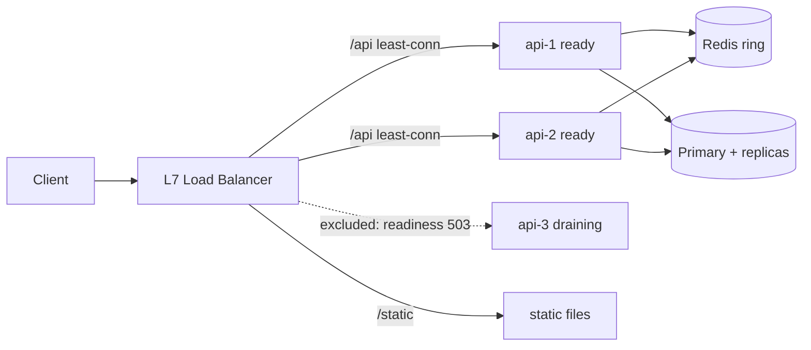

# Module 7.4 — موازنة الحمل والتوسّع
## Load Balancing & Scaling: vertical vs horizontal, L4/L7 balancers, algorithms, health checks, draining, sticky sessions, consistent hashing, and sharding

> **المستوى:** Level 7 | **الموقع:** [4 من 9]
> **السابق:** [M7.3 — Replication, Consistency, CAP](module-7.3-replication-consistency-cap.md) | **التالي:** [M7.5 — Reliability Patterns](module-7.5-reliability-patterns.md)

---

## 1. المتطلبات
> **قبل أن تتعلم هذا، يجب أن تفهم:**
- [ ] الطبقات: TCP مقابل HTTP، الاتصال مقابل الطلب، keep-alive — [L2-M2.9](../level-2-computer-systems/module-2.9-tcp-udp.md), [L2-M2.12](../level-2-computer-systems/module-2.12-http.md)
- [ ] تشريح الإنتاج: LB، النسخ المتعدّدة، `/health` و`/ready`، النشر التدريجي — [L5-M5.7](../level-5-building-real-software/module-5.7-production-anatomy.md), [L5-M5.10](../level-5-building-real-software/module-5.10-deployment.md)
- [ ] لا حالة قرار في الذاكرة؛ الجلسات في مخزن مشترك — [L7-M7.1](module-7.1-distributed-systems-1-2-10.md), [L5-M5.2](../level-5-building-real-software/module-5.2-authentication.md)
- [ ] hash maps وكيف يُوزّع الـ hash المفاتيح — [L3-M3.1](../level-3-core-computer-science/module-3.1-arrays-hash-maps.md)
- [ ] التوابع والقراءات الموزّعة — [L7-M7.3](module-7.3-replication-consistency-cap.md)

## 2. أهداف التعلّم
بعد هذه الوحدة ستستطيع:
1. المقارنة بين **التوسّع الرأسي** و**الأفقي** بالأرقام (سقف، كلفة، نقطة فشل) واختيار التسلسل الصحيح.
2. شرح ما يفعله موازن الحمل في **L4** مقابل **L7** ولماذا يختلف توزيع "الاتصالات" عن توزيع "الطلبات".
3. تطبيق خوارزميات round-robin / weighted / least-connections / hash وتحديد متى تفشل كل منها.
4. تصميم فحوص الصحّة (**health checks**) الصحيحة والتصريف (**draining**) لنشر بلا أخطاء 502.
5. شرح لماذا **sticky sessions** حلّ مؤقّت وما البديل؛ وبناء **consistent hashing** وشرح لماذا يُحرّك 1/N من المفاتيح فقط.
6. تمييز توسّع الطبقة عديمة الحالة عن توسّع البيانات (**sharding**) وذكر ثمن الأخير (استعلامات عابرة للأجزاء، إعادة التوزيع، المفاتيح الساخنة).

## 3. شرح للمبتدئ
حين تمتلئ طاقة خادمك عندك طريقان. **التوسّع الرأسي (scale up)**: اشترِ خادمًا أكبر. بسيط، لا يُغيّر الكود، وهو دائمًا **الخطوة الأولى الصحيحة** — خادم بـ 64 نواة و512GB يخدم شركات كاملة. مشكلاته: له سقف، وسعره يتضاعف أسرع من قدرته، ويبقى **نقطة فشل واحدة** (M7.1). **التوسّع الأفقي (scale out)**: أضف خوادم متشابهة وضع أمامها شيئًا يوزّع العمل. بلا سقف نظري وتوافر أعلى؛ لكنه يستدعي كل ما في M7.1: الحالة خارج العملية، لا ساعة مشتركة، وفشل جزئي. التسلسل الناضج: **رأسي أولًا حتى يُكلّف أكثر من التعقيد، ثم أفقي للطبقة عديمة الحالة، وأخيرًا — وبأقصى تردّد — توزيع البيانات.**

**ما الذي يوزّع؟ موازن الحمل (Load Balancer).** عنوان واحد يراه العملاء، وخلفه N نسخة. يعمل في إحدى طبقتين، والفرق جوهري: موازن **L4** يرى اتصالات TCP فقط — يختار خادمًا عند فتح الاتصال ويمرّر البايتات دون فهمها؛ سريع جدًا ولا يرى HTTP. موازن **L7** يُنهي اتصال العميل، **يقرأ الطلب HTTP**، ويختار خادمًا **لكل طلب**: يستطيع التوجيه بحسب المسار (`/api` إلى خدمة، `/static` إلى أخرى)، وإضافة رؤوس (`X-Forwarded-For`، معرّف الطلب، deadline من M7.2)، وإنهاء TLS، وإعادة المحاولة على خادم آخر إن فشل الاتصال. الفخّ المشهور مع L4 وHTTP keep-alive: عميل ثقيل (خدمة أخرى) يفتح اتصالًا واحدًا طويلًا ويرسل عبره آلاف الطلبات — كلها تذهب إلى **الخادم نفسه** الذي اختير عند فتح الاتصال، بينما باقي الخوادم خاملة. "LB موجود لكن الحمل غير متوازن" يبدأ غالبًا هنا؛ الحل: L7، أو إغلاق الاتصالات دوريًا من الخادم (`max requests per connection`).

**كيف يختار؟ الخوارزميات وأعطابها.** **Round-robin**: بالدور؛ عادل فقط إن تساوت الطلبات والخوادم. **Weighted**: بأوزان (خادم أكبر يأخذ أكثر؛ النسخة الجديدة تأخذ 5% في canary). **Least-connections**: إلى الأقلّ انشغالًا — يتكيّف مع طلبات متفاوتة الثقل، وهو الافتراضي الجيد لـ L7. **Hash** (بحسب IP العميل أو مفتاح): نفس المفتاح → نفس الخادم؛ مفيد للكاش المحلي، خطر للعدالة (شركة خلف NAT واحد = مفتاح واحد = خادم واحد يختنق). و**random-of-two** (اختر خادمين عشوائيًا وخذ الأقل حملًا) — بسيط ويتجنّب "القطيع" الذي يُصيب least-connections حين تملك عدّة موازنات معلومات قديمة فترسل جميعها إلى الخادم الذي "بدا" خاملًا.

**متى يُستبعد خادم؟ فحوص الصحّة.** الموازن لا يُفيد إن ظلّ يُرسل إلى خادم ميت. يفحص دوريًا (كل 5 ثوانٍ مثلًا) ويستبعد الفاشل بعد عدد متتالٍ من الإخفاقات ويُعيده بعد نجاحات متتالية. التمييز الذي تعلّمته في M5.7 يصبح حاسمًا هنا: **liveness** ("العملية حيّة") مقابل **readiness** ("أستطيع خدمة الطلبات: اتصالي بـ DB سليم، الكاش دافئ، لست في تصريف"). الموازن يستخدم readiness. فخّ: readiness يفحص DB، وDB تتعثّر 2 ثانية → **كل** النسخ تُستبعد معًا → 503 للجميع بدل أبطأ قليلًا؛ لذلك فحص الاعتماديات في readiness يجب أن يميّز "لا أستطيع إطلاقًا" عن "بطيء"، ويجب أن يحمي الموازن نفسه بـ "لا تستبعد أكثر من 50% دفعة واحدة" (panic threshold).

**النشر بلا 502: التصريف (draining).** حين توقف نسخة للتحديث، الطلبات التي بدأت فيها لا يجب أن تُقطع. التسلسل الصحيح: (1) النسخة تُعلن "غير جاهزة" (`/ready` → 503) فيتوقّف الموازن عن إرسال طلبات **جديدة** إليها؛ (2) تنتظر حتى تنتهي الطلبات الجارية أو مهلة (30 ثانية)؛ (3) تُغلق الاتصالات الخاملة؛ (4) تخرج. من دون الخطوة (1) ستأتي طلبات جديدة حتى اللحظة الأخيرة؛ ومن دون (2) يُقطع من في منتصف الدفع. في Kubernetes هذا هو `preStop` + `terminationGracePeriodSeconds` + التعامل مع SIGTERM — وغيابه هو السبب الأول لـ "أخطاء قليلة مع كل نشر".

**الجلسات والالتصاق (sticky sessions).** إن كانت الجلسة في ذاكرة النسخة (M7.1 — الخطأ الأول)، تُغري نفسك بـ "اجعل الموازن يُرسل المستخدم نفسه إلى النسخة نفسها دائمًا" (كوكي من الموازن). يعمل — حتى تموت تلك النسخة (كل مستخدميها يُسجَّل خروجهم)، أو تُضيف نسخة (لا تأخذ حملًا لأن الجميع ملتصقون)، أو تنشر (التصريف يصبح مؤلمًا). الالتصاق **مسكّن**؛ العلاج هو الجلسة في مخزن مشترك أو رمز موقّع (M5.2). الاستثناء المشروع: WebSockets الطويلة، والكاش المحلي الدافئ كـ**تحسين** لا كـ**صحّة**.

**توزيع المفاتيح بذكاء: consistent hashing.** حين تريد "المفتاح K دائمًا إلى الخادم نفسه" (كاش موزّع، تقسيم طابور بحسب المستخدم) فالحلّ الساذج `hash(K) mod N` كارثي عند تغيّر N: إضافة خادم واحد تُغيّر وجهة **معظم** المفاتيح (كل الكاش يبرد دفعة واحدة، أو كل الطابور يُعاد توزيعه). **Consistent hashing** يضع الخوادم على حلقة (دائرة من 0 إلى 2³²) بعدّة نقاط لكل خادم (virtual nodes)، ويذهب المفتاح إلى أول خادم بعده على الحلقة؛ إضافة خادم تسرق ≈1/N فقط من المفاتيح من جيرانه. ستبنيه في §7 — خمسون سطرًا تشرح نصف البنى التحتية للكاش والتخزين.

**توسيع البيانات: التجزئة (sharding).** الطبقة عديمة الحالة تتوسّع بسهولة؛ قاعدة البيانات لا. التوابع (M7.3) توسّع القراءات؛ أما الكتابات والحجم فالحل الأخير هو **تقسيم البيانات أفقيًا**: مستخدمو A–M في shard 1 وN–Z في shard 2، أو بحسب `hash(user_id)`، أو بحسب المستأجر/المنطقة. الثمن باهظ ودائم: استعلام يحتاج بيانات من جزأين (تقرير، بحث، JOIN عبر مستخدمين) يصبح N استعلامًا ودمجًا في التطبيق؛ المعاملات عبر الأجزاء تختفي (M7.9 saga)؛ **المفتاح الساخن** (مشهور بملايين المتابعين) يُغرق جزءًا واحدًا؛ وتغيير مفتاح التجزئة لاحقًا هو من أصعب الهجرات. لذلك: قبل sharding — توابع، كاش، فهارس، أرشفة، قاعدة أكبر؛ وإن اضطُررت، اختر مفتاحًا يُبقي **معظم الاستعلامات داخل جزء واحد**.

## 4. النموذج الذهني
**"التوسّع هو إزالة الحالة من الطبقة التي تريد نسخها — ثم إزالة النقطة الواحدة أمامها."** الطبقة التي لا تحمل حالة تُنسخ بلا تفكير؛ التي تحمل حالة (DB، كاش، طابور) تُوزَّع بمفتاح، وكل مفتاح قرار يصعب التراجع عنه.

```text
        العملاء
          │
   ┌──────▼──────┐  L7: يقرأ HTTP، يختار لكل طلب، يفحص readiness، يصرّف، يوجّه بالمسار
   │ Load Balancer│  (نفسه مكرّر: DNS/anycast/VRRP — وإلا نقلت نقطة الفشل إليه)
   └──┬───┬───┬──┘
   ┌──▼┐┌─▼─┐┌▼──┐   طبقة عديمة الحالة: تُنسخ بحرّية (M7.1: لا حالة قرار هنا)
   │api││api││api│
   └─┬─┘└─┬─┘└─┬─┘
     └────┼────┘
   ┌──────▼──────┐  حالة مشتركة: جلسات/كاش/طابور — موزّعة بـ consistent hashing
   │ Redis ring  │
   └──────┬──────┘
   ┌──────▼──────┐  البيانات: قائد+توابع أولًا (M7.3)، sharding آخرًا وبمفتاح يُبقي الاستعلام محليًا
   │ DB  (shards)│
   └─────────────┘
```

## 5. الرسم التوضيحي


التصريف خطوة بخطوة (ما يحدث لطلب يصل في كل لحظة):

```text
t0  SIGTERM يصل إلى api-3
t0  /ready → 503   ─────────▶  الموازن: "api-3 خارج التدوير" (خلال فترة فحص ≤ 5s)
t0..t5  طلبات جديدة قد تصل (الموازن لم يلاحظ بعد)  → تُخدم عاديًا ✓
t5..t30 الطلبات الجارية تكتمل؛ لا جديدة؛ اتصالات keep-alive الخاملة تُغلق بـ Connection: close
t30 (أو حين تنتهي الجارية)  العملية تخرج 0
✗ بلا هذا: الموازن يرسل إلى عملية ميتة → ECONNREFUSED → 502 لبضع ثوانٍ مع كل نشر
```

## 6. مثال بسيط
```typescript
// إيقاف أنيق في Node: أعلن عدم الجاهزية، أوقف قبول اتصالات جديدة، أمهل الجارية، ثم اخرج
let ready = true;
app.get("/ready", (_req, res) => res.sendStatus(ready ? 200 : 503));
process.on("SIGTERM", () => {
  ready = false;                                      // (1) الموازن يتوقف عن الإرسال بعد فحصه التالي
  setTimeout(() => {                                  // (2) امنحه فترة فحص واحدة قبل إغلاق الاستماع
    server.close(() => process.exit(0));              // (3) لا اتصالات جديدة؛ انتظر الجارية
    server.closeIdleConnections();                    //     أغلق keep-alive الخاملة فورًا
    setTimeout(() => { server.closeAllConnections(); process.exit(1); }, 25_000).unref(); // (4) مهلة قصوى
  }, 6_000);
});
```

## 7. مثال كود
موازن L7 صغير (دالّة اختيار + فحص صحّة + تصريف) يعمل على خوادم وهمية داخل العملية، وحلقة consistent hashing بعُقد افتراضية، واختبارات تُثبت: keep-alive على L4 يُفسد التوازن، least-connections يتكيّف مع الطلبات الثقيلة، التصريف يمنع الأخطاء، وإضافة عقدة إلى الحلقة تُحرّك ≈1/N من المفاتيح فقط مقابل ≈ الكل مع `mod N`.

```text
m74-balancing/
├─ src/balancer.ts
├─ src/ring.ts
└─ src/balancing.test.ts
```

```typescript
// src/balancer.ts
// خادم خلفي وهمي + موازن L7 بخوارزميات قابلة للتبديل + فحص صحّة + تصريف
export interface Backend { name: string; weight: number; healthy: boolean; draining: boolean; inflight: number; served: number; fails: number; oks: number }
export const backend = (name: string, weight = 1): Backend => ({ name, weight, healthy: true, draining: false, inflight: 0, served: 0, fails: 0, oks: 0 });

export type Algo = "round-robin" | "weighted" | "least-conn" | "hash" | "p2c";

export class L7Balancer {
  private rr = 0; private readonly rrQueue: Backend[] = [];
  constructor(readonly backends: Backend[], private algo: Algo, private readonly rnd: () => number = Math.random) {}
  setAlgo(a: Algo) { this.algo = a; }
  private eligible() { return this.backends.filter((b) => b.healthy && !b.draining); }

  pick(key?: string): Backend | undefined {
    const el = this.eligible(); if (el.length === 0) return undefined;
    switch (this.algo) {
      case "round-robin": return el[this.rr++ % el.length];
      case "weighted": { if (this.rrQueue.length === 0) for (const b of el) for (let i = 0; i < b.weight; i++) this.rrQueue.push(b); let b: Backend | undefined; while ((b = this.rrQueue.shift()) && !el.includes(b)) { /* skip */ } return b ?? el[0]; }
      case "least-conn": return el.reduce((a, b) => (b.inflight < a.inflight ? b : a));
      case "hash": { const h = fnv1a(key ?? ""); return el[h % el.length]; }
      case "p2c": { const a = el[Math.floor(this.rnd() * el.length)]!, b = el[Math.floor(this.rnd() * el.length)]!; return a.inflight <= b.inflight ? a : b; }
    }
  }
  // طلب واحد: اختر، نفّذ، سجّل؛ handler يُحاكي الخادم (قد يرمي)
  async request<T>(handler: (b: Backend) => Promise<T>, key?: string): Promise<{ by: string; result: T }> {
    const b = this.pick(key); if (!b) throw new Error("503 no healthy backends");
    b.inflight++; b.served++;
    try { const result = await handler(b); return { by: b.name, result }; }
    finally { b.inflight--; }
  }
  // فحص الصحّة: استبعاد بعد failThreshold إخفاقات متتالية، إعادة بعد okThreshold نجاحات؛ وحدّ هلع
  async healthCheck(probe: (b: Backend) => Promise<boolean>, failThreshold = 3, okThreshold = 2, panicRatio = 0.5) {
    const next = new Map<Backend, boolean>();
    for (const b of this.backends) {
      const ok = await probe(b).catch(() => false);
      if (ok) { b.oks++; b.fails = 0; } else { b.fails++; b.oks = 0; }
      next.set(b, b.healthy ? b.fails < failThreshold : b.oks >= okThreshold);
    }
    const wouldBeHealthy = [...next.values()].filter(Boolean).length;
    if (wouldBeHealthy / this.backends.length < panicRatio) return "panic: keeping all backends (likely dependency/network issue)";
    for (const [b, h] of next) b.healthy = h;
    return "ok";
  }
  drain(name: string) { const b = this.backends.find((x) => x.name === name); if (b) b.draining = true; }
}

// FNV-1a + خلط نهائي (fmix32 من Murmur3): بدون الخلط، المفاتيح المتسلسلة مثل user:1, user:2 تتكتّل على الحلقة
export function fnv1a(s: string): number {
  let h = 0x811c9dc5;
  for (let i = 0; i < s.length; i++) { h ^= s.charCodeAt(i); h = Math.imul(h, 0x01000193) >>> 0; }
  h ^= h >>> 16; h = Math.imul(h, 0x85ebca6b) >>> 0; h ^= h >>> 13; h = Math.imul(h, 0xc2b2ae35) >>> 0; h ^= h >>> 16;
  return h >>> 0;
}
```

```typescript
// src/ring.ts
import { fnv1a } from "./balancer.ts";

// Consistent hashing: حلقة من نقاط (hash → node)؛ المفتاح يذهب إلى أول نقطة بعد hash(key)
export class HashRing {
  private points: { h: number; node: string }[] = [];
  constructor(nodes: string[] = [], private readonly vnodes = 150) { for (const n of nodes) this.add(n); }
  add(node: string) { for (let i = 0; i < this.vnodes; i++) this.points.push({ h: fnv1a(`${node}#${i}`), node }); this.points.sort((a, b) => a.h - b.h); }
  remove(node: string) { this.points = this.points.filter((p) => p.node !== node); }
  get(key: string): string | undefined {
    if (this.points.length === 0) return undefined;
    const h = fnv1a(key);
    // بحث ثنائي عن أول نقطة ≥ h، وإلا نلفّ إلى البداية
    let lo = 0, hi = this.points.length;
    while (lo < hi) { const mid = (lo + hi) >> 1; if (this.points[mid]!.h < h) lo = mid + 1; else hi = mid; }
    return this.points[lo % this.points.length]!.node;
  }
  get size() { return new Set(this.points.map((p) => p.node)).size; }
}

export const modHash = (key: string, nodes: string[]) => nodes[fnv1a(key) % nodes.length]!;
```

```typescript
// src/balancing.test.ts
import { test } from "node:test";
import assert from "node:assert/strict";
import { L7Balancer, backend } from "./balancer.ts";
import { HashRing, modHash } from "./ring.ts";

const sleep = (ms: number) => new Promise<void>((r) => setTimeout(r, ms));
const seeded = (s: number) => () => { s |= 0; s = (s + 0x6d2b79f5) | 0; let t = Math.imul(s ^ (s >>> 15), 1 | s); t = (t + Math.imul(t ^ (t >>> 7), 61 | t)) ^ t; return ((t ^ (t >>> 14)) >>> 0) / 4294967296; };

test("L4 + keep-alive: اتصال واحد طويل يُرسل كل طلباته إلى خادم واحد؛ L7 يوزّع لكل طلب", () => {
  const bs = [backend("a"), backend("b"), backend("c")];
  const l4 = new L7Balancer(bs, "round-robin");
  const conn = l4.pick()!;                                 // L4 يختار مرة عند فتح الاتصال
  for (let i = 0; i < 300; i++) conn.served++;             // ثم كل الطلبات عبره
  assert.deepEqual(bs.map((b) => b.served), [300, 0, 0]);
  for (const b of bs) b.served = 0;
  for (let i = 0; i < 300; i++) l4.pick()!.served++;       // L7: اختيار لكل طلب
  assert.deepEqual(bs.map((b) => b.served), [100, 100, 100]);
});

test("least-conn vs round-robin مع طلبات ثقيلة غير متساوية", async () => {
  // الطلبات تصل متتابعة (كل 2ms)؛ الزوجية ثقيلة (30ms) والفردية خفيفة (1ms). نقيس "العمل" (مجموع المدد) لكل خادم
  const run = async (algo: "round-robin" | "least-conn") => {
    const bs = [backend("a"), backend("b")]; const lb = new L7Balancer(bs, algo);
    const work = { a: 0, b: 0 }; const reqs: Promise<unknown>[] = [];
    for (let i = 0; i < 20; i++) {
      const ms = i % 2 === 0 ? 30 : 1;
      reqs.push(lb.request(async (b) => { work[b.name as "a" | "b"] += ms; await sleep(ms); }));
      await sleep(2);
    }
    await Promise.all(reqs); return work;
  };
  const rr = await run("round-robin"); const lc = await run("least-conn");
  assert.deepEqual(rr, { a: 300, b: 10 });                                  // كل الثقيلة (الزوجية) ذهبت إلى a
  assert.ok(Math.abs(lc.a - lc.b) <= 120, `lc balanced ${JSON.stringify(lc)}`);   // least-conn يرى أن a مشغول فيوجّه إلى b
});

test("health checks + panic threshold + draining: لا طلبات لمعطّل أو مصرَّف؛ لا استبعاد للجميع", async () => {
  const bs = [backend("a"), backend("b"), backend("c"), backend("d")]; const lb = new L7Balancer(bs, "round-robin");
  const down = new Set(["c"]);
  for (let i = 0; i < 3; i++) await lb.healthCheck(async (b) => !down.has(b.name));
  assert.equal(bs[2]!.healthy, false);
  const picks = new Set(Array.from({ length: 40 }, () => lb.pick()!.name)); assert.ok(!picks.has("c"));
  lb.drain("d"); assert.ok(!new Set(Array.from({ length: 40 }, () => lb.pick()!.name)).has("d"));
  down.add("a"); down.add("b"); down.add("d");                              // "DB بطيئة" → كل الفحوص تفشل
  let msg = ""; for (let i = 0; i < 3; i++) msg = await lb.healthCheck(async (b) => !down.has(b.name));
  assert.match(msg, /panic/); assert.ok(bs[0]!.healthy && bs[1]!.healthy);   // أبقينا الجميع بدل 503 شامل
  down.delete("c"); for (let i = 0; i < 2; i++) await lb.healthCheck(async (b) => !down.has(b.name));
  // c عاد بعد نجاحين (لكن الحالة ما زالت في وضع هلع لأن a,b,d معطّلة) — نُعيد الجميع للاختبار:
  down.clear(); for (let i = 0; i < 2; i++) await lb.healthCheck(async () => true); assert.ok(bs[2]!.healthy);
});

test("consistent hashing: إضافة عقدة تُحرّك ≈1/N من المفاتيح؛ mod N يُحرّك معظمها", () => {
  const keys = Array.from({ length: 10_000 }, (_, i) => `user:${i}`);
  const nodes3 = ["n1", "n2", "n3"], nodes4 = [...nodes3, "n4"];
  const movedMod = keys.filter((k) => modHash(k, nodes3) !== modHash(k, nodes4)).length / keys.length;
  const ring3 = new HashRing(nodes3), ring4 = new HashRing(nodes4);
  const movedRing = keys.filter((k) => ring3.get(k) !== ring4.get(k)).length / keys.length;
  assert.ok(movedMod > 0.6, `mod moved ${movedMod}`);
  assert.ok(movedRing > 0.15 && movedRing < 0.35, `ring moved ${movedRing} (expected ≈ 1/4)`);
  // التوزيع متوازن تقريبًا بفضل العُقد الافتراضية
  const counts = new Map<string, number>(); for (const k of keys) counts.set(ring4.get(k)!, (counts.get(ring4.get(k)!) ?? 0) + 1);
  const vals = [...counts.values()]; assert.ok(Math.max(...vals) / Math.min(...vals) < 1.6, `imbalance ${vals}`);
  // المفتاح نفسه → العقدة نفسها دائمًا (الالتصاق بالمفتاح لا بالاتصال)
  assert.equal(ring4.get("user:42"), ring4.get("user:42"));
  const rnd = seeded(5); const p2c = new L7Balancer([backend("a"), backend("b"), backend("c")], "p2c", rnd); assert.ok(p2c.pick());
});
```

**تشغيل:** `npx tsx --test src/*.test.ts`. جرّب `vnodes = 1` في `HashRing` ولاحظ اختلال التوزيع (نسبة أكبر/أصغر قد تتجاوز 3) — العُقد الافتراضية هي ما يجعل الحلقة عادلة.

---

## 8. مثال من العالم الحقيقي
شركة توصيل وضعت 8 نسخ من الـ API خلف موازن L4 (الأرخص). لوحة المراقبة أظهرت نسخة واحدة عند 95% CPU وسبعًا دون 10%، وp99 سيّئًا رغم "السعة الفائضة". السبب: تطبيق السائقين يستخدم عميل HTTP بـ keep-alive واتصالين فقط لكل جهاز، لكن **خدمة التتبّع الداخلية** تفتح اتصالًا واحدًا دائمًا وترسل عبره 3,000 طلب/ثانية — وكلّها إلى النسخة التي اختيرت لحظة فتح الاتصال. الإصلاح على مرحلتين: فورًا `maxRequestsPerSocket = 1000` في Node لإجبار إعادة الاتصال وإعادة التوزيع؛ ثم الانتقال إلى L7 بـ least-connections. الدرس المكتوب في RFC الفريق: "الموازن يوزّع ما يراه؛ L4 يرى اتصالات لا طلبات".

## 9. مثال من الإنتاج
منصّة تجارة إلكترونية كبيرة قسّمت قاعدة الطلبات بحسب `hash(customer_id)` إلى 16 جزءًا. العمل كان ممتازًا حتى ظهر "عميل" واحد بملايين الطلبات يوميًا: شركة إعادة بيع تستخدم حسابًا واحدًا عبر API. جزء واحد وصل إلى 100% IO بينما الباقي خامل، والنتيجة أن 1/16 من العملاء العاديين (الذين شاركوا الجزء نفسه) عانوا بطئًا لا يفهمونه. الحلول التي جرّبوها بالترتيب: (1) نقل الجزء الساخن إلى عتاد أكبر (رأسي — اشترى شهرين)؛ (2) تجزئة ثانوية للعملاء الكبار بـ `hash(customer_id, order_month)` مع جدول توجيه؛ (3) حدّ معدّل للحساب الواحد. التعلّم: مفتاح التجزئة قرار معماري يفترض توزيعًا للبيانات، والبيانات الحقيقية **دائمًا** مائلة (power law)؛ صمّم للمفتاح الساخن منذ اليوم الأول (جدول توجيه قابل للتعديل بدل hash ثابت).

---

## 10. مفاهيم خاطئة شائعة
1. **"ضع موازن حمل والنظام قابل للتوسّع."** فقط إن كانت الطبقة خلفه عديمة الحالة؛ وإلا نقلت المشكلة.
2. **"الأفقي أرخص من الرأسي."** الرأسي أرخص بكثير حتى سقفه، لأنه لا يُكلّف تعقيدًا؛ ابدأ به.
3. **"Round-robin عادل."** عادل في العدد لا في العمل؛ طلب تقرير ثقيل = 1000 طلب خفيف.
4. **"الموازن يحلّ التوافر."** الموازن نفسه نقطة فشل واحدة إن لم يُكرَّر (DNS متعدّد، anycast، VRRP).
5. **"Sticky sessions حلّ للجلسات."** مسكّن يكسر التوسّع والنشر والتعافي؛ الجلسة في مخزن مشترك.
6. **"Sharding هو التوسّع الحقيقي."** هو الملاذ الأخير؛ معظم الأنظمة لا تصله أبدًا إن أحسنت التوابع والكاش والفهارس.

## 11. أخطاء شائعة
1. readiness يفحص كل الاعتماديات بصرامة → تعثّر DB يُخرج **كل** النسخ معًا.
2. لا تصريف: SIGTERM يقتل فورًا → 502 مع كل نشر.
3. عميل داخلي باتصال keep-alive واحد خلف L4 → خادم واحد يختنق.
4. hash بـ IP العميل كـ "توزيع" → NAT شركة كبيرة = خادم واحد.
5. فحص صحّة كل ثانية بمهلة 10 ثوانٍ → فحوص متراكمة؛ أو فحص يُنفّذ استعلامًا ثقيلًا.
6. أوزان canary 50% "لنرى بسرعة" → نصف المستخدمين يتأثّرون بالخطأ.
7. `hash(k) mod N` لكاش موزّع → كل إضافة/إزالة تُبرّد الكاش كله (cache stampede على DB).
8. مفتاح تجزئة لا يُطابق نمط الاستعلامات → كل استعلام يلمس كل الأجزاء (scatter-gather).
9. نسيان أن الموازن L7 يُغيّر `req.ip` → تحديد المعدّل بحسب IP الموازن (`X-Forwarded-For` + `trust proxy`).

## 12. تمرين تصحيح
بعد الانتقال من نسخة واحدة إلى ثلاث خلف موازن، تظهر مع **كل** نشر 30–60 خطأ 502 خلال 10 ثوانٍ، ويشكو بعض المستخدمين من تسجيل الخروج المفاجئ.
1. **دليل:** الحاوية تتلقّى SIGTERM وتخرج خلال 100ms؛ `/health` يُرجع 200 دائمًا ويُستخدم كـ readiness؛ الجلسات في `Map` داخل العملية (M7.1) مع sticky cookie من الموازن؛ فحص الصحّة كل 5 ثوانٍ.
2. **فرضية:** (أ) الموازن يظلّ يرسل إلى النسخة الميتة حتى فحصه التالي (≤5 ثوانٍ) → ECONNREFUSED → 502؛ (ب) الطلبات الجارية قُطعت؛ (ج) الجلسات الملتصقة بالنسخة المعاد تشغيلها ضاعت → خروج.
3. **تجربة:** نشر مع `kill -TERM` أثناء حمل اصطناعي ثابت وعدّ 502 بحسب النسخة والزمن؛ ستجدها خلال نافذة الفحص بعد الإنهاء.
4. **الإصلاح:** تسلسل §6 (`/ready` → 503 ثم انتظار فترة فحص ثم `close` ثم مهلة قصوى)؛ `terminationGracePeriodSeconds ≥ 35`؛ الجلسات إلى Redis وإزالة الالتصاق؛ فحص readiness منفصل عن liveness.
5. **تحقّق:** صفر 502 في عشرة نشرات متتالية تحت حمل؛ واختبار آلي في CI يقتل نسخة أثناء الاختبار الشامل.

## 13. تمرين معماري
Project 6 يحتاج إلى خدمة 20× الحمل الحالي خلال 6 أشهر. اكتب "خطة التوسّع على مراحل" بالأرقام: (1) القياس الحالي (QPS، p99، CPU/RAM لكل نسخة، QPS للـ DB، نسبة القراءة/الكتابة، حجم البيانات ونموّه)؛ (2) المرحلة الرأسية: ما السقف وكم تشتري من الوقت؛ (3) الأفقية للـ API: ما الحالة التي يجب إخراجها أولًا (جرد M7.1)، نوع الموازن وخوارزميته، readiness/draining، كيف يُكرَّر الموازن نفسه؛ (4) البيانات: توابع للقراءة (M7.3) وما يذهب إليها، Redis ring للكاش والجلسات بـ consistent hashing؛ (5) هل يلزم sharding خلال 6 أشهر؟ أثبت بالأرقام؛ وإن لزم، ما المفتاح وما الاستعلامات العابرة وكيف تتعامل مع المفتاح الساخن؛ (6) لكل مرحلة: المؤشّر الذي يُطلقها، الكلفة الشهرية التقديرية، المخاطر، وكيف تُختبر قبل الحاجة (اختبار حمل). صِغ القرارات غير البديهية كـ ADRs.

## 14. الصلة بعصر AI
اطلب من وكيل "اجعل الخدمة قابلة للتوسّع" وسيقترح بسرعة Kubernetes وsharding وmicroservices — وهو الترتيب المعكوس. دورك هو إعطاؤه القيود والأرقام (M8.5): الحمل الحالي والمستهدف، أين الحالة، ما المقبول من التعقيد، والتسلسل الناضج (رأسي → أفقي عديم الحالة → توابع/كاش → sharding آخرًا). والأشياء التي يُغفلها الوكلاء بانتظام هي التفاصيل التشغيلية التي تعلّمتها هنا: التصريف، readiness المنفصل، `trust proxy`، keep-alive خلف L4، panic threshold. اجعلها قائمة مراجعة إلزامية لأي كود "بنية تحتية" يُولّده، واطلب اختبار §7 الثالث (قتل نسخة أثناء الحمل بلا أخطاء) كشرط قبول.

## 15. ما يجب إتقانه (Must Master) 🔴
- 🔴 رأسي أولًا ولماذا؛ L4 مقابل L7 وفخّ keep-alive؛ round-robin/least-conn/weighted ومتى يفشل كلّ؛ readiness مقابل liveness وpanic threshold؛ التصريف الصحيح خطوة بخطوة؛ لماذا الالتصاق مسكّن؛ consistent hashing وما يحلّ؛ sharding كملاذ أخير وثمنه.

## 16. ما يجب فهمه (Should Understand) 🟠
- 🟠 power-of-two-choices؛ العُقد الافتراضية والتوزيع؛ تكرار الموازن نفسه (DNS/anycast/VRRP)؛ `X-Forwarded-For` و`trust proxy`؛ جدول توجيه للأجزاء بدل hash ثابت؛ اختبار الحمل كجزء من الخطة.

## 17. ما يمكن تأجيله (Can Defer) ⚪
- ⚪ Maglev/rendezvous hashing، global server load balancing عبر المناطق، service mesh كموازن جانبي، autoscaling policies بالتفصيل.

## 18. الخلاصة
1. التوسّع = إخراج الحالة من الطبقة التي تريد نسخها؛ رأسي أولًا، أفقي ثانيًا، البيانات أخيرًا.
2. L7 يوزّع طلبات ويرى HTTP؛ L4 يوزّع اتصالات — وkeep-alive يجعلها غير متوازنة.
3. least-connections افتراضي جيد؛ round-robin عادل بالعدد فقط؛ hash للالتصاق بالمفتاح لا بالعميل.
4. readiness يُخرج النسخة من التدوير؛ التصريف (503 → انتظار → إغلاق) يمنع 502 عند النشر؛ لا تُخرج الجميع دفعة واحدة.
5. consistent hashing: إضافة عقدة تُحرّك 1/N فقط؛ `mod N` يُحرّك الكل.
6. sharding يشتري الكتابة والحجم بثمن الاستعلامات العابرة والمعاملات والمفاتيح الساخنة — اختر المفتاح الذي يُبقي الاستعلامات محليّة.

## 19. مراجع رسمية
- NGINX — HTTP Load Balancing (methods, health checks, draining): https://docs.nginx.com/nginx/admin-guide/load-balancer/http-load-balancer/
- HAProxy — Load balancing algorithms & health checks: https://www.haproxy.com/documentation/haproxy-configuration-tutorials/load-balancing/
- Envoy — Load balancing (least request, ring hash, panic threshold): https://www.envoyproxy.io/docs/envoy/latest/intro/arch_overview/upstream/load_balancing/load_balancing
- Kubernetes — Pod lifecycle: termination, preStop, grace period: https://kubernetes.io/docs/concepts/workloads/pods/pod-lifecycle/#pod-termination
- Kubernetes — Liveness, Readiness and Startup Probes: https://kubernetes.io/docs/tasks/configure-pod-container/configure-liveness-readiness-startup-probes/
- Node.js — `server.close()`, `closeIdleConnections()`, `maxRequestsPerSocket`: https://nodejs.org/api/http.html
- Karger et al. — Consistent Hashing and Random Trees (1997): https://www.cs.princeton.edu/courses/archive/fall09/cos518/papers/chash.pdf
- Mitzenmacher — The Power of Two Choices in Randomized Load Balancing: https://www.eecs.harvard.edu/~michaelm/postscripts/tpds2001.pdf
- Express — Behind proxies (`trust proxy`): https://expressjs.com/en/guide/behind-proxies.html

## المصطلحات
| العربية | English |
|---|---|
| توسّع رأسي | Vertical scaling (scale up) |
| توسّع أفقي | Horizontal scaling (scale out) |
| موازن حمل | Load balancer |
| موازن طبقة 4 / طبقة 7 | L4 / L7 load balancer |
| بالدور | Round-robin |
| موزون | Weighted |
| الأقل اتصالات | Least connections |
| اختيار من اثنين | Power of two choices (P2C) |
| فحص الصحّة | Health check |
| حيوية / جاهزية | Liveness / Readiness |
| حدّ الهلع | Panic threshold |
| تصريف | Draining (graceful shutdown) |
| جلسات ملتصقة | Sticky sessions |
| تجزئة متّسقة | Consistent hashing |
| عُقد افتراضية | Virtual nodes |
| تجزئة البيانات | Sharding |
| مفتاح التجزئة | Shard key |
| مفتاح ساخن | Hot key |
| استعلام عابر للأجزاء | Scatter-gather query |
| نقطة فشل واحدة | Single point of failure |
