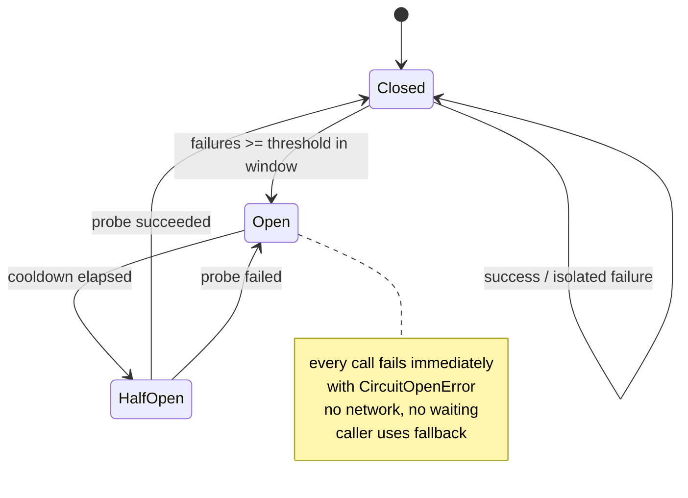

# Module 7.5 — أنماط الموثوقية: قاطع الدائرة، الحواجز، الضغط العكسي، والتدهور الرشيق
## Reliability Patterns: circuit breakers, bulkheads, bounded queues & backpressure, load shedding, graceful degradation, and the math of availability

> **المستوى:** Level 7 | **الموقع:** [5 من 9]
> **السابق:** [M7.4 — Load Balancing & Scaling](module-7.4-load-balancing-scaling.md) | **التالي:** [M7.6 — System Design Process](module-7.6-system-design-process.md)

---

## 1. المتطلبات
> **قبل أن تتعلم هذا، يجب أن تفهم:**
- [ ] المهل، التصنيف، backoff، ميزانية الإعادة، عاصفة الإعادة — [L7-M7.2](module-7.2-failure-timeouts-retries-idempotency.md)
- [ ] الفشل الجزئي والاعتماديات المتسلسلة — [L7-M7.1](module-7.1-distributed-systems-1-2-10.md)
- [ ] الطوابير وworkers وat-least-once — [L5-M5.9](../level-5-building-real-software/module-5.9-queues-jobs-workers.md)
- [ ] event loop وأن الانتظار المعلّق يحتلّ موارد — [L2-M2.7](../level-2-computer-systems/module-2.7-concurrency-event-loop.md)
- [ ] SLI/SLO والتنبيه — [L6-M6.6](../level-6-professional-engineering/module-6.6-observability.md)

## 2. أهداف التعلّم
بعد هذه الوحدة ستستطيع:
1. شرح **الفشل المتسلسل (cascading failure)** بآلية ملموسة (استنزاف المقابس/الخيوط/الذاكرة بالانتظار) ولماذا لا تحلّه المهل وحدها.
2. بناء **قاطع دائرة (circuit breaker)** بحالاته الثلاث وتحديد عتباته ومتى **لا** يُستخدم.
3. تطبيق **الحواجز (bulkheads)**: عزل مجموعات الموارد كي لا يُغرق اعتماد بطيء كل شيء.
4. تصميم **طوابير محدودة** و**الضغط العكسي (backpressure)** و**إسقاط الحمل (load shedding)** بردود 429/503 و`Retry-After`، وشرح لماذا الطابور غير المحدود "ينجح ببطء ثم ينهار".
5. تصميم **التدهور الرشيق (graceful degradation)**: ما الذي يُعطّل أولًا وما يبقى.
6. حساب التوافر المركّب (متسلسل/متوازٍ) وميزانية الخطأ من SLO، واستخدامها لتبرير نمط ما بالأرقام.

## 3. شرح للمبتدئ
في M7.2 تعلّمت كيف يتصرّف **العميل** تجاه فشل اعتماد واحد. هذه الوحدة عن ما يحدث للنظام **كله** حين يبطؤ جزء منه — والجواب المزعج: من دون حماية، بطء جزء صغير يُسقط الكل. والسبب ليس الأخطاء بل **الانتظار**.

**آلية الانهيار المتسلسل.** خدمة الطلبات تستدعي خدمة التوصيات (غير ضرورية — مجرّد "قد يعجبك") بمهلة ثانيتين. التوصيات تتعطّل وتبدأ بالاستجابة بعد ثانيتين بالضبط (timeout). الآن كل طلب في خدمة الطلبات يستغرق ثانيتين زيادة، وكلّ طلب يحتلّ اتصالًا من pool قاعدة البيانات ومقبسًا وذاكرة طوال انتظاره. عند 100 طلب/ثانية × ثانيتين = 200 طلب معلّق دائمًا؛ pool الـ DB حجمه 20 → بقية الطلبات تنتظر الـ pool → حتى الطلبات التي **لا تحتاج التوصيات** (الدفع!) تنتظر → ينتهي وقتها → الموازن (M7.4) يرى فشلًا في readiness ويُخرج النسخ → 503 للجميع. خدمة "قد يعجبك" أسقطت الدفع. الملاحظة الجوهرية: **الاعتماد البطيء أخطر من الاعتماد الميت** — الميت يفشل فورًا ويُحرّر الموارد؛ البطيء يحتجزها.

**الدفاع الأول: قاطع الدائرة (Circuit Breaker).** مستعار من الكهرباء: حين يفشل اعتماد بنسبة عالية، توقّف عن استدعائه **فورًا** لفترة بدل أن تنتظر مهلته في كل مرة. ثلاث حالات: **Closed** (طبيعي — تمرّ الاستدعاءات ويُحسب الفشل في نافذة منزلقة)؛ حين يتجاوز الفشل عتبة (50% من آخر 20 استدعاء مثلًا) → **Open**: كل استدعاء يفشل فورًا بـ `CircuitOpenError` بلا شبكة ولا انتظار (ميلي ثانية بدل ثانيتين — الموارد حرّة، والاعتماد المريض يأخذ هواءً للتعافي، M7.2); بعد فترة تهدئة (30 ثانية) → **Half-Open**: يُسمح باستدعاء تجريبي واحد (أو قليل)؛ ينجح → Closed، يفشل → Open من جديد. القاطع **يُحوّل البطء إلى فشل سريع**، وهذا هو جوهره. ثلاثة تحذيرات: (1) قاطع لكل **اعتماد** (أو لكل نقطة نهاية ثقيلة)، لا قاطع واحد لكل شيء؛ (2) 4xx ليست "فشلًا" للقاطع (العميل أخطأ، لا الاعتماد) — المهل و5xx واتصالات مرفوضة هي ما يُحسب؛ (3) القاطع يحتاج **بديلًا** حين يكون مفتوحًا (fallback) — وإلا نقلت الفشل فقط من "بطيء" إلى "سريع".

**الدفاع الثاني: الحواجز (Bulkheads).** في السفن، جدران تمنع تسرّب مقصورة من إغراق السفينة. برمجيًا: لا تدع اعتمادًا واحدًا يستهلك **كل** الموارد المشتركة. أمثلة: pool اتصالات منفصل للمدفوعات عن التقارير؛ حدّ تزامن لكل اعتماد ("لا أكثر من 10 طلبات متزامنة إلى التوصيات؛ الحادي عشر يُرفض فورًا")؛ مجموعات workers منفصلة لأنواع المهام؛ وحتى نسخ منفصلة للعملاء الكبار. في Node — حيث لا خيوط — الحاجز هو **semaphore** حول الاستدعاء: عدّاد للمتزامن مع رفض أو انتظار محدود. القاطع يحمي من اعتماد **فاشل**؛ الحاجز يحمي من اعتماد **بطيء لم يفشل بعد** — تحتاج كليهما.

**الدفاع الثالث: الطوابير المحدودة والضغط العكسي.** الحدس يقول "ضع طابورًا أمام ما هو بطيء وسيُمتصّ الضغط". صحيح للدفعات القصيرة؛ كارثي للحمل المستدام: إن كان الوارد 120/ثانية والمعالَج 100/ثانية فالطابور ينمو 20/ثانية إلى الأبد، والذاكرة تنفد، و**كل** طلب ينتظر دقائق قبل أن يُخدم — النظام "يعمل" لكن لا أحد يحصل على جواب مفيد (الانتظار 5 دقائق لطلب مهلته 10 ثوانٍ = عمل ميت، M7.2). القاعدة: **كل طابور له سقف**؛ وحين يمتلئ تختار بوعي: ارفض الجديد (`503` + `Retry-After` — load shedding)، أو أسقط الأقدم (لِما تنتهي صلاحيته سريعًا)، أو أبطئ المنتِج (backpressure: TCP نفسه يفعله؛ Node streams تفعله بـ `highWaterMark` وقيمة `write()` العائدة). الرفض المبكّر لـ 20% من الطلبات أفضل بما لا يُقاس من إبطاء 100% منها حتى الفشل — هذا يُسمّى **الفشل الجزئي المتعمّد** وهو علامة نظام ناضج. وفي HTTP، `429 Too Many Requests` للعميل الذي يتجاوز حصّته (مشكلته هو)، و`503 Service Unavailable` حين النظام نفسه مثقل (مشكلتنا)، وكلاهما مع `Retry-After` كي يعرف العميل متى يعود (يُغذّي backoff في M7.2).

**الدفاع الرابع: التدهور الرشيق (Graceful Degradation).** قرّر **مسبقًا** ما الذي يُعطّل أولًا تحت الضغط أو عند فشل اعتماد: التوصيات تختفي (قائمة فارغة)، البحث يعود إلى نتائج مخبّأة، الصور إلى دقّة أقلّ، التحليلات تُسقَط — بينما الدفع والدخول يبقيان. هذا يتطلّب تصنيف الوظائف إلى **حرجة** و**مهمّة** و**ترفيّة**، وبناء الـ fallback لكل غير حرج، وأحيانًا **مفاتيح تشغيل** (kill switches) يدوية يستخدمها المناوب أثناء الحادث (M6.7). المبدأ: "صفحة منتج بلا توصيات" نجاح؛ "صفحة خطأ لأن التوصيات معطّلة" فشل تصميمي.

**الرياضيات التي تُبرّر كل هذا.** التوافر (Availability) = نسبة الوقت/الطلبات الناجحة. خدمة بـ 99.9% ("ثلاث تسعات") = 8.7 ساعة تعطّل سنويًا؛ 99.99% = 52 دقيقة. القاعدة القاسية: **الاعتماديات المتسلسلة تُضرب**: طلب يمرّ بخمس خدمات كلٌّ 99.9% → 0.999⁵ ≈ 99.5% (44 ساعة/سنة) — أسوأ من أيّ منها. والمتوازية (نسختان مستقلّتان تكفي إحداهما) تُضرب احتمالات **الفشل**: 1 − (0.001)² = 99.9999%. لذلك: قلّل الاعتماديات الحرجة في مسار الطلب (كل اعتماد حرج يُنقص التوافر)، وحوّل الاعتماديات غير الحرجة إلى "اختيارية" بقاطع وfallback (فلا تدخل في الضرب أصلًا)، وكرّر الحرجة. ومن SLO تحصل على **ميزانية الخطأ** (M6.6): 99.9% شهريًا = 43 دقيقة؛ إن استهلك حادث واحد 30 دقيقة فالفريق يُجمّد الميزات الخطرة ويعمل على الموثوقية حتى تتجدّد الميزانية — هذا يحوّل "الموثوقية" من شعار إلى عقد رقمي بين المنتج والهندسة.

## 4. النموذج الذهني
**"النظام الموثوق يفشل بسرعة، وجزئيًا، وبقرار مسبق — بدل أن يفشل ببطء، وكليًا، وبالمفاجأة."** كل نمط هنا يُجيب عن سؤال واحد: *حين يبطؤ X، من يدفع الثمن ومتى؟*

```text
 الطلب الوارد
    │
 ┌──▼───────────────┐  ممتلئ؟ → 503 + Retry-After (load shedding) — ارفض مبكرًا، لا تُبطئ الجميع
 │ طابور محدود      │
 └──┬───────────────┘
    │
 ┌──▼───────────────┐  لكل اعتماد: حدّ تزامن (bulkhead) — البطيء لا يستهلك كل شيء
 │ semaphore(10)    │
 └──┬───────────────┘
    │
 ┌──▼───────────────┐  Open؟ → فشل فوري → fallback (degradation) — لا انتظار للمهلة
 │ circuit breaker  │
 └──┬───────────────┘
    │
 ┌──▼───────────────┐  مهلة من deadline (M7.2) + إعادة بميزانية — آخر الطبقات، لا أولها
 │ timeout + retry  │
 └──────────────────┘
```

## 5. الرسم التوضيحي


التوافر المركّب — لماذا "كل اعتماد حرج يُكلّف":

```text
متسلسل (كلها مطلوبة):   A 99.9% ─▶ B 99.9% ─▶ C 99.9% ─▶ D 99.9% ─▶ E 99.9%   =  99.50%  (≈ 44 h/yr)
جعل C,D,E اختيارية      A 99.9% ─▶ B 99.9%  (+ C,D,E خلف قاطع مع fallback)   =  99.80%  (≈ 17.5 h/yr)
تكرار B                 A 99.9% ─▶ [B1 ‖ B2] = 99.9999%                       =  99.90%  (≈ 8.8 h/yr)
```

## 6. مثال بسيط
```typescript
// التدهور الرشيق: التوصيات اختيارية — خلف حاجز + قاطع + مهلة قصيرة، وبديل جاهز
async function productPage(id: string) {
  const product = await db.products.get(id);                                  // حرج: يفشل → الصفحة تفشل
  const recs = await recsBreaker.call(() => recsSemaphore.run(() => recsClient.forProduct(id, { timeoutMs: 150 })))
    .catch((e) => { metrics.inc("recs.fallback", { reason: e.name }); return []; });  // اختياري: يفشل → قائمة فارغة
  return { product, recs };
}
```

## 7. مثال كود
قاطع دائرة بنافذة منزلقة وحالاته الثلاث، حاجز (semaphore) برفض فوري، طابور محدود بسياسات امتلاء، وحاسبة توافر. ثم اختبارات تُثبت: الاعتماد البطيء يستنزف الموارد بلا حاجز، القاطع يحوّل ثانيتين إلى ميلي ثانية، والطابور المحدود يحافظ على زمن الاستجابة بينما غير المحدود ينفجر.

```text
m75-reliability/
├─ src/breaker.ts
├─ src/bulkhead.ts
├─ src/queue.ts
├─ src/availability.ts
└─ src/reliability.test.ts
```

```typescript
// src/breaker.ts
export type BreakerState = "closed" | "open" | "half-open";
export class CircuitOpenError extends Error { constructor(readonly retryAfterMs: number) { super(`circuit open; retry after ${retryAfterMs}ms`); this.name = "CircuitOpenError"; } }

export interface BreakerOptions {
  windowSize?: number; failureRateThreshold?: number; minCalls?: number; cooldownMs?: number;
  halfOpenMaxCalls?: number; isFailure?: (e: unknown) => boolean; now?: () => number;
}

// قاطع دائرة بنافذة منزلقة (آخر N استدعاء)؛ 4xx ليست فشلًا افتراضيًا
export class CircuitBreaker {
  private state: BreakerState = "closed"; private window: boolean[] = []; private openedAt = 0; private halfOpenInflight = 0;
  readonly transitions: { at: number; to: BreakerState }[] = [];
  private readonly o: Required<BreakerOptions>;
  constructor(readonly name: string, o: BreakerOptions = {}) {
    this.o = { windowSize: 20, failureRateThreshold: 0.5, minCalls: 10, cooldownMs: 30_000, halfOpenMaxCalls: 1,
      isFailure: (e) => !(e instanceof ClientError), now: Date.now, ...o };
  }
  get current() { return this.state; }
  private to(s: BreakerState) { this.state = s; this.transitions.push({ at: this.o.now(), to: s }); if (s === "closed") this.window = []; if (s === "open") this.openedAt = this.o.now(); if (s === "half-open") this.halfOpenInflight = 0; }

  async call<T>(fn: () => Promise<T>): Promise<T> {
    if (this.state === "open") {
      const elapsed = this.o.now() - this.openedAt;
      if (elapsed < this.o.cooldownMs) throw new CircuitOpenError(this.o.cooldownMs - elapsed);
      this.to("half-open");
    }
    if (this.state === "half-open") {
      if (this.halfOpenInflight >= this.o.halfOpenMaxCalls) throw new CircuitOpenError(this.o.cooldownMs);
      this.halfOpenInflight++;
    }
    try { const r = await fn(); this.record(true); return r; }
    catch (e) { this.record(!this.o.isFailure(e)); throw e; }
  }
  private record(ok: boolean) {
    if (this.state === "half-open") { this.halfOpenInflight--; this.to(ok ? "closed" : "open"); return; }
    this.window.push(ok); if (this.window.length > this.o.windowSize) this.window.shift();
    if (this.window.length >= this.o.minCalls) {
      const failRate = this.window.filter((x) => !x).length / this.window.length;
      if (failRate >= this.o.failureRateThreshold) this.to("open");
    }
  }
}
export class ClientError extends Error { constructor(readonly status: number) { super(`client error ${status}`); this.name = "ClientError"; } }
```

```typescript
// src/bulkhead.ts
export class BulkheadFullError extends Error { constructor(name: string) { super(`bulkhead ${name} full`); this.name = "BulkheadFullError"; } }

// حاجز = semaphore: حدّ للمتزامن + طابور انتظار صغير محدود؛ الباقي يُرفض فورًا
export class Bulkhead {
  private inflight = 0; private readonly waiting: (() => void)[] = []; maxObservedInflight = 0; rejected = 0;
  constructor(readonly name: string, private readonly maxConcurrent: number, private readonly maxQueue = 0) {}
  async run<T>(fn: () => Promise<T>): Promise<T> {
    if (this.inflight >= this.maxConcurrent) {
      if (this.waiting.length >= this.maxQueue) { this.rejected++; throw new BulkheadFullError(this.name); }
      await new Promise<void>((resolve) => this.waiting.push(resolve));
    }
    this.inflight++; this.maxObservedInflight = Math.max(this.maxObservedInflight, this.inflight);
    try { return await fn(); }
    finally { this.inflight--; this.waiting.shift()?.(); }
  }
  get stats() { return { inflight: this.inflight, waiting: this.waiting.length, rejected: this.rejected }; }
}
```

```typescript
// src/queue.ts
export type FullPolicy = "reject" | "drop-oldest";
export class QueueFullError extends Error { constructor(readonly retryAfterMs: number) { super("queue full"); this.name = "QueueFullError"; } }

export interface Job<T> { payload: T; enqueuedAt: number; deadlineAt?: number }

// طابور محدود بسياسة امتلاء؛ وعامل يُسقط المهام التي فات موعدها (لا عمل ميت)
export class BoundedQueue<T> {
  private readonly items: Job<T>[] = []; rejected = 0; dropped = 0; expired = 0;
  constructor(private readonly capacity: number, private readonly policy: FullPolicy = "reject", private readonly now: () => number = Date.now) {}
  enqueue(payload: T, deadlineAt?: number): void {
    if (this.items.length >= this.capacity) {
      if (this.policy === "reject") { this.rejected++; throw new QueueFullError(this.estimateWaitMs()); }
      this.items.shift(); this.dropped++;
    }
    this.items.push({ payload, enqueuedAt: this.now(), deadlineAt });
  }
  dequeue(): Job<T> | undefined {
    let j: Job<T> | undefined;
    while ((j = this.items.shift())) { if (j.deadlineAt !== undefined && j.deadlineAt <= this.now()) { this.expired++; continue; } return j; }
    return undefined;
  }
  get size() { return this.items.length; }
  // تقدير بسيط للانتظار: حجم الطابور × متوسط زمن الخدمة (يُغذّي Retry-After)
  avgServiceMs = 10;
  estimateWaitMs() { return this.items.length * this.avgServiceMs; }
}

// محاكاة: وارد λ/ثانية إلى عامل سعته μ/ثانية لمدة T ثانية؛ يُرجع زمن الانتظار p50/p99 ونسبة المرفوض
export function simulate(opts: { arrivalPerSec: number; servicePerSec: number; seconds: number; capacity: number }) {
  let t = 0; const q = new BoundedQueue<number>(opts.capacity, "reject", () => t);
  const waits: number[] = []; let accepted = 0;
  const serviceMs = 1000 / opts.servicePerSec, arrivalMs = 1000 / opts.arrivalPerSec;
  let nextArrival = 0, nextService = 0;
  const end = opts.seconds * 1000;
  while (t < end) {
    t = Math.min(nextArrival, nextService);
    if (t === nextArrival) { try { q.enqueue(t); accepted++; } catch { /* rejected */ } nextArrival += arrivalMs; }
    if (t === nextService) { const j = q.dequeue(); if (j) { waits.push(t - j.enqueuedAt); nextService = t + serviceMs; } else nextService = nextArrival; }
  }
  const sorted = waits.toSorted((a, b) => a - b); const p = (x: number) => sorted[Math.min(sorted.length - 1, Math.floor(x * sorted.length))] ?? 0;
  return { p50: p(0.5), p99: p(0.99), rejectedRatio: q.rejected / (accepted + q.rejected), finalQueue: q.size };
}
```

```typescript
// src/availability.ts
export const series = (...a: number[]) => a.reduce((acc, x) => acc * x, 1);                 // كلها مطلوبة
export const parallel = (...a: number[]) => 1 - a.reduce((acc, x) => acc * (1 - x), 1);     // تكفي واحدة
export const downtimePerYearHours = (availability: number) => (1 - availability) * 365 * 24;
export const errorBudgetMinutes = (slo: number, days = 30) => (1 - slo) * days * 24 * 60;
```

```typescript
// src/reliability.test.ts
import { test } from "node:test";
import assert from "node:assert/strict";
import { CircuitBreaker, CircuitOpenError, ClientError } from "./breaker.ts";
import { Bulkhead, BulkheadFullError } from "./bulkhead.ts";
import { BoundedQueue, QueueFullError, simulate } from "./queue.ts";
import { series, parallel, downtimePerYearHours, errorBudgetMinutes } from "./availability.ts";

const sleep = (ms: number) => new Promise<void>((r) => setTimeout(r, ms));

test("circuit breaker: البطيء الفاشل يتحوّل إلى فشل فوري؛ 4xx لا تفتح القاطع؛ half-open يُعيد الإغلاق", async () => {
  let t = 0; const now = () => t;
  const cb = new CircuitBreaker("recs", { windowSize: 10, minCalls: 5, failureRateThreshold: 0.5, cooldownMs: 1_000, now });
  const slowFail = async () => { await sleep(20); throw new Error("timeout"); };
  const t0 = Date.now(); for (let i = 0; i < 5; i++) await cb.call(slowFail).catch(() => {});
  assert.equal(cb.current, "open");
  const t1 = Date.now(); await assert.rejects(cb.call(slowFail), CircuitOpenError); const t2 = Date.now();
  assert.ok(t1 - t0 >= 90, "5 slow calls waited"); assert.ok(t2 - t1 < 10, "open → immediate failure");
  t = 1_000; await assert.rejects(cb.call(slowFail));                      // half-open probe فشل
  assert.equal(cb.current, "open");
  t = 2_000; assert.equal(await cb.call(async () => "ok"), "ok");          // probe نجح
  assert.equal(cb.current, "closed");
  for (let i = 0; i < 10; i++) await cb.call(async () => { throw new ClientError(404); }).catch(() => {});
  assert.equal(cb.current, "closed", "client errors are not dependency failures");
});

test("bulkhead: بلا حاجز، اعتماد بطيء يحتجز كل الطلبات؛ مع حاجز يُرفض الفائض فورًا والمسار الحرج يبقى سريعًا", async () => {
  const slowDep = async () => { await sleep(50); return "recs"; };
  const pool = new Bulkhead("db-pool", 5, 100);                            // المورد المشترك: 5 اتصالات DB + طابور انتظار
  // بلا حاجز للتوصيات: 20 طلب صفحة يستدعون التوصيات داخل اتصال DB محجوز → الدفع ينتظر خلفهم
  const pages = Array.from({ length: 20 }, () => pool.run(slowDep));
  await sleep(5);
  const s0 = Date.now(); await pool.run(async () => "paid"); const payLatency = Date.now() - s0;
  await Promise.all(pages);
  assert.ok(payLatency >= 150, `payment waited ${payLatency}ms behind 20 slow recs calls (4 rounds × 50ms)`);
  // مع حاجز خاص بالتوصيات (3 متزامنة، 0 انتظار): الفائض يُرفض فورًا ولا يلمس pool الـ DB
  const recs = new Bulkhead("recs", 3, 0); const pool2 = new Bulkhead("db-pool", 5);
  const results = await Promise.all(Array.from({ length: 20 }, () => recs.run(slowDep).then(() => "ok", (e) => (e instanceof BulkheadFullError ? "shed" : "err"))));
  assert.equal(results.filter((r) => r === "ok").length, 3); assert.equal(results.filter((r) => r === "shed").length, 17);
  const s = Date.now(); await pool2.run(async () => "paid"); assert.ok(Date.now() - s < 10, "payment path unaffected");
  assert.equal(recs.maxObservedInflight, 3);
});

test("bounded queue: الوارد > السعة — غير المحدود ينفجر في الانتظار؛ المحدود يرفض 17% ويحافظ على p99", () => {
  const unbounded = simulate({ arrivalPerSec: 120, servicePerSec: 100, seconds: 60, capacity: Number.POSITIVE_INFINITY });
  const bounded = simulate({ arrivalPerSec: 120, servicePerSec: 100, seconds: 60, capacity: 50 });
  assert.ok(unbounded.p99 > 5_000, `unbounded p99=${unbounded.p99}ms`);   // انتظار بالثواني وينمو إلى الأبد
  assert.ok(unbounded.finalQueue > 1_000);
  assert.ok(bounded.p99 <= 600, `bounded p99=${bounded.p99}ms`);          // ≤ capacity × service time
  assert.ok(bounded.rejectedRatio > 0.12 && bounded.rejectedRatio < 0.2, `rejected ${bounded.rejectedRatio}`);
  // المهام التي فات موعدها تُسقَط بدل أن تُنفَّذ كعمل ميت
  let t = 0; const q = new BoundedQueue<string>(2, "reject", () => t);
  q.enqueue("a", 10); q.enqueue("b", 100); assert.throws(() => q.enqueue("c"), QueueFullError);
  t = 50; assert.equal(q.dequeue()?.payload, "b"); assert.equal(q.expired, 1);
});

test("availability math: المتسلسل يُضرب، المتوازي يُقوّي، وميزانية الخطأ بالدقائق", () => {
  assert.ok(Math.abs(series(0.999, 0.999, 0.999, 0.999, 0.999) - 0.995) < 0.0001);
  assert.ok(parallel(0.999, 0.999) > 0.999998);
  assert.ok(Math.abs(downtimePerYearHours(0.999) - 8.76) < 0.01);
  assert.ok(Math.abs(errorBudgetMinutes(0.999, 30) - 43.2) < 0.01);
  // جعل 3 اعتماديات اختيارية (خلف قاطع + fallback) يرفع التوافر من 99.5% إلى 99.8%
  assert.ok(series(0.999, 0.999) > series(0.999, 0.999, 0.999, 0.999, 0.999));
});
```

**تشغيل:** `npx tsx --test src/*.test.ts`. في اختبار الطابور، غيّر `arrivalPerSec` إلى 95 (أقل من السعة) ولاحظ أن الطابورين يتصرّفان بشكل متطابق تقريبًا — الطابور يمتصّ **الدفعات**، لا **العجز المستدام**.

---

## 8. مثال من العالم الحقيقي
منصّة بثّ موسيقي: خدمة "كلمات الأغاني" (طرف ثالث) بدأت تستجيب في 8 ثوانٍ بدل 80ms. مشغّل الأغاني كان يطلب الكلمات **قبل** بدء التشغيل بمهلة 10 ثوانٍ. خلال دقيقتين، كل خيوط خادم التطبيق (Java، 200 خيط) معلّقة على الكلمات؛ تسجيل الدخول والبحث والتشغيل — كلها 503. خدمة ثانوية بحتة أوقفت المنتج كله لـ 35 دقيقة. ما بُني بعدها: قاطع لكل طرف ثالث بعتبة 50% ونافذة 20 ونصف-فتح بعد 30 ثانية؛ حاجز 10 خيوط للكلمات؛ مهلة 300ms؛ fallback "لا كلمات متاحة"؛ وتصنيف رسمي لكل اعتماد (حرج/مهم/ترفي) مع مفتاح إيقاف يدوي لكل غير حرج. وأُضيف اختبار "حقن بطء 5 ثوانٍ في اعتماد X" إلى CI لكل اعتماد غير حرج: يجب أن يبقى p99 للتشغيل دون 500ms.

## 9. مثال من الإنتاج
خدمة واجهة برمجية عامة واجهت نمطًا متكرّرًا: عميل واحد يُطلق دفعة 50,000 طلب في ثانية، فتمتلئ طوابير العمل (غير المحدودة)، ويرتفع زمن الاستجابة لجميع العملاء إلى دقائق، ثم تنفد الذاكرة ويُعاد تشغيل النسخ — فيعيد العملاء كل شيء (M7.2) ويتكرّر الانهيار. الهندسة التي ثبتت: (1) حدّ معدّل لكل عميل عند الحافة بـ `429 + Retry-After` (مشكلة العميل)؛ (2) طابور محدود بسعة = السعة × ثانيتين، وعند الامتلاء `503 + Retry-After: 2` (مشكلتنا، مؤقّتة)؛ (3) إسقاط بحسب الأولوية: الطلبات ذات رأس `priority: low` تُرفض أولًا عند 80% امتلاء؛ (4) إسقاط ما فات موعده قبل التنفيذ (deadline في الرسالة). النتيجة في الحادث التالي من النوع نفسه: 18% من طلبات العميل المُغرِق رُفضت فورًا، وبقية العملاء لم يلاحظوا شيئًا. "فشل جزئي متعمّد" على لوحة المراقبة بدل "انقطاع كامل".

---

## 10. مفاهيم خاطئة شائعة
1. **"المهلة تحمي من الاعتماد البطيء."** تحدّ الانتظار لكل طلب، لكن 100 طلب/ثانية × مهلة ثانيتين = 200 مورد محجوز دائمًا؛ تحتاج حاجزًا وقاطعًا.
2. **"القاطع يُحسّن التوافر."** يُحسّن توافر **المستدعي** بإخفاء الاعتماد — فقط إن كان لديه fallback؛ بدونه نقل الفشل.
3. **"الطابور يحمي من الحمل."** يحمي من الدفعات؛ تحت عجز مستدام يُحوّل الفشل السريع إلى فشل بطيء شامل.
4. **"رفض الطلبات = فشل."** رفض 20% مبكرًا مع Retry-After أفضل من إبطاء 100% حتى الانهيار؛ الرفض قرار تصميمي.
5. **"99.9% لكل خدمة = 99.9% للنظام."** المتسلسل يُضرب؛ خمس خدمات = 99.5%.
6. **"التكرار دائمًا يُحسّن التوافر."** فقط إن كانت الأعطال مستقلّة؛ نسختان في نفس الرفّ/المنطقة/النشر تفشلان معًا.

## 11. أخطاء شائعة
1. قاطع واحد مشترك لكل الاعتماديات → فشل واحد يُطفئ الكل.
2. 4xx تُحسب فشلًا للقاطع → خطأ عميل يفتح الدائرة للجميع.
3. قاطع بلا fallback → "فشل سريع" يُعرض للمستخدم كصفحة خطأ.
4. الاستدعاء غير الحرج **داخل** معاملة DB أو اتصال محجوز → الحاجز بلا جدوى.
5. طابور بلا سقف (`Array.push` بلا حدّ، Redis list بلا maxlen) → ذاكرة ثم انهيار.
6. إسقاط الحمل بلا `Retry-After` → العملاء يعودون فورًا (M7.2).
7. فحص الصحّة (M7.4) يفشل عند فتح القاطع → الموازن يُخرج النسخة لعطل في اعتماد اختياري.
8. تنفيذ مهام فات موعدها من الطابور (عمل ميت) بدل إسقاطها.
9. ترتيب الطبقات معكوس: إعادة المحاولة خارج القاطع → تضرب القاطع ثلاث مرات.

## 12. تمرين تصحيح
بعد إضافة قاطع دائرة "لحماية النظام" من خدمة البحث، صارت صفحة الكتالوج تعرض "خطأ مؤقّت" لـ 30 ثانية كاملة كل بضع دقائق، رغم أن البحث نفسه يعمل جيدًا بحسب لوحاته.
1. **دليل:** القاطع مشترك بين البحث وخدمة "الاقتراحات الإملائية" (نفس الـ host)؛ الاقتراحات تُرجع 404 لأي كلمة غير معروفة؛ `isFailure` الافتراضي يحسب أي استثناء؛ عند الفتح يُرمى الخطأ للمستخدم بلا fallback؛ cooldown 30 ثانية.
2. **فرضية:** 404 الطبيعية من الاقتراحات تملأ نافذة القاطع المشترك → يفتح → البحث السليم يفشل فورًا 30 ثانية → "خطأ مؤقّت".
3. **تجربة:** راقب `transitions` القاطع مع سبب كل فشل مسجَّل؛ ستجد 404 هي الغالبة قبل كل فتح.
4. **الإصلاح:** قاطع لكل نقطة نهاية؛ `isFailure` يستثني 4xx؛ fallback للبحث (نتائج مخبّأة/قائمة الأكثر شيوعًا) وللاقتراحات (لا شيء)؛ cooldown 5–10 ثوانٍ مع half-open تدريجي؛ مقياس `breaker.state` على اللوحة.
5. **تحقّق:** اختبار §7 الأول بسيناريو "404 كثيرة" يجب أن يُبقي الحالة closed.

## 13. تمرين معماري
صمّم "خريطة الموثوقية" لـ Project 6: (1) صنّف كل مسار (دخول، تصفّح، سلّة، دفع، سجل الطلبات، بحث، توصيات، إشعارات) حرج/مهم/ترفي؛ (2) لكل اعتماد (DB، Redis، بوابة الدفع، SMTP، بحث، تخزين الصور): مهلة، حاجز (حدّ تزامن)، قاطع (عتبة/نافذة/تهدئة)، fallback، مفتاح إيقاف؛ (3) الطوابير: سعة كل طابور ولماذا، سياسة الامتلاء، Retry-After، إسقاط ما فات موعده، أولويات؛ (4) احسب التوافر المتوقّع لمسار الدفع (متسلسل) قبل وبعد جعل غير الحرج اختياريًا، وحدّد SLO واقعيًا وميزانية الخطأ الشهرية؛ (5) خطّة اختبار: لكل اعتماد "حقن بطء/فشل" في CI ومعايير القبول (p99 المسار الحرج، نسبة الرفض المقبولة)؛ (6) ما الذي يراه المناوب على اللوحة ليعرف أن التدهور الرشيق يعمل وليس عطلًا صامتًا؟

## 14. الصلة بعصر AI
المكتبات تُسهّل كل هذه الأنماط (opossum وcockatiel في Node، resilience4j في Java، Polly في .NET) والوكلاء يعرفونها — لكن **الأرقام والترتيب والـ fallback** هي القرارات، والوكيل سيضعها افتراضية وعشوائية إن لم تُملِها. اعطه خريطة §13 كسياق، واطلب لكل اعتماد: التصنيف، الأرقام ومبرّرها، ترتيب الطبقات (طابور → حاجز → قاطع → مهلة → إعادة)، والـ fallback الملموس. وأهمّ من الكود: اطلب منه كتابة **اختبار حقن الفشل** الذي يُثبت أن المسار الحرج يبقى سريعًا حين يبطؤ غير الحرج — وهو ما ستتقنه كمنهج في M8.7؛ والمحاكي في §7 (`simulate`) مثال على كيف تجعل الوكيل يُثبت ادّعاءً كمّيًا بدل أن يكتفي بوصفه.

## 15. ما يجب إتقانه (Must Master) 🔴
- 🔴 آلية الانهيار المتسلسل عبر الانتظار؛ "البطيء أخطر من الميت"؛ القاطع بحالاته وعتباته و4xx وfallback؛ الحاجز كـ semaphore لكل اعتماد؛ الطابور المحدود وسياسات الامتلاء و429/503 + Retry-After؛ التدهور الرشيق بتصنيف مسبق؛ حساب التوافر المتسلسل/المتوازي وميزانية الخطأ.

## 16. ما يجب فهمه (Should Understand) 🟠
- 🟠 الإسقاط بالأولوية؛ قانون Little (L = λW) لتحجيم الطوابير؛ adaptive concurrency limits (Netflix/gRPC)؛ مفاتيح الإيقاف اليدوية وتشغيلها أثناء الحوادث؛ الاستقلالية الحقيقية للتكرار (failure domains).

## 17. ما يمكن تأجيله (Can Defer) ⚪
- ⚪ هندسة الفوضى (chaos engineering) كمنهج مؤسّسي؛ CoDel وإدارة الطوابير النشطة؛ نظرية الطوابير بعمق.

## 18. الخلاصة
1. الانهيار المتسلسل يأتي من **الانتظار** الذي يحتجز الموارد؛ الاعتماد البطيء أخطر من الميت.
2. القاطع يحوّل البطء إلى فشل فوري ويمنح الاعتماد هواءً — واحد لكل اعتماد، 4xx لا تُحسب، وfallback إلزامي.
3. الحاجز يمنع اعتمادًا واحدًا من ابتلاع الموارد المشتركة؛ القاطع والحاجز معًا، لا بديلًا.
4. كل طابور له سقف؛ عند الامتلاء ارفض مبكرًا (503/429 + Retry-After) أو أسقط الأقدم أو أبطئ المنتِج — لا تُبطئ الجميع.
5. قرّر مسبقًا ما يُعطّل أولًا؛ "صفحة بلا توصيات" نجاح.
6. المتسلسل يُضرب والمتوازي يُقوّي؛ قلّل الاعتماديات الحرجة، اجعل الباقي اختياريًا، كرّر الحرج، وحوّل SLO إلى ميزانية خطأ.

## 19. مراجع رسمية
- Michael Nygard — Release It! (Circuit Breaker, Bulkhead, Steady State): https://pragprog.com/titles/mnee2/release-it-second-edition/
- Martin Fowler — CircuitBreaker: https://martinfowler.com/bliki/CircuitBreaker.html
- Google SRE Book — Addressing Cascading Failures (load shedding, graceful degradation): https://sre.google/sre-book/addressing-cascading-failures/
- Google SRE Workbook — Implementing SLOs & error budgets: https://sre.google/workbook/implementing-slos/
- Azure Architecture Center — Bulkhead pattern: https://learn.microsoft.com/azure/architecture/patterns/bulkhead
- Azure Architecture Center — Queue-Based Load Leveling: https://learn.microsoft.com/azure/architecture/patterns/queue-based-load-leveling
- RFC 9110 §10.2.3 — Retry-After: https://www.rfc-editor.org/rfc/rfc9110#section-10.2.3
- RFC 6585 — 429 Too Many Requests: https://www.rfc-editor.org/rfc/rfc6585#section-4
- Node.js — Stream backpressure (`highWaterMark`, `write()` return value): https://nodejs.org/en/learn/modules/backpressuring-in-streams
- Netflix — Performance under load (adaptive concurrency limits): https://netflixtechblog.medium.com/performance-under-load-3e6fa9a60581

## المصطلحات
| العربية | English |
|---|---|
| فشل متسلسل | Cascading failure |
| قاطع الدائرة | Circuit breaker |
| مغلق / مفتوح / نصف مفتوح | Closed / Open / Half-open |
| نافذة منزلقة | Sliding window |
| بديل عند الفشل | Fallback |
| حاجز / مقصورة | Bulkhead |
| إشارة عدّ (سيمافور) | Semaphore |
| طابور محدود | Bounded queue |
| ضغط عكسي | Backpressure |
| إسقاط الحمل | Load shedding |
| تدهور رشيق | Graceful degradation |
| مفتاح إيقاف | Kill switch |
| حقن الفشل | Fault injection |
| التوافر | Availability |
| ميزانية الخطأ | Error budget |
| نطاق الفشل | Failure domain |
| قانون ليتل | Little's law |
| عمل ميت | Dead work |
