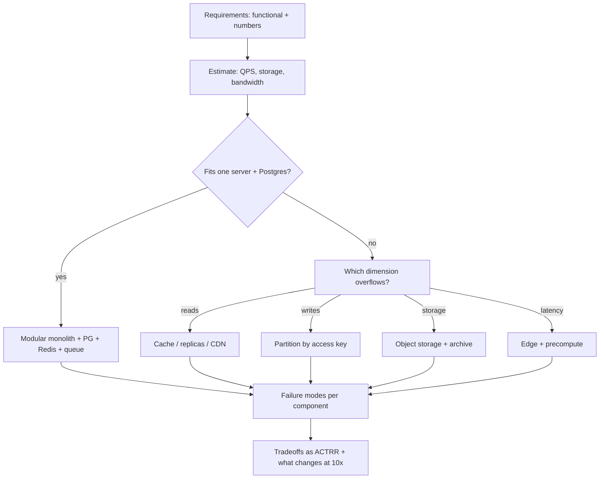

# Module 7.6 — عملية تصميم الأنظمة: من المتطلبات إلى المعمارية إلى المقايضات
## System Design Process: requirements → capacity estimation → high-level design → deep dives → tradeoffs — a repeatable method, not a bag of components

> **المستوى:** Level 7 | **الموقع:** [6 من 9]
> **السابق:** [M7.5 — Reliability Patterns](module-7.5-reliability-patterns.md) | **التالي:** [M7.7 — System Design Challenges](module-7.7-system-design-challenges.md)

---

## 1. المتطلبات
> **قبل أن تتعلم هذا، يجب أن تفهم:**
- [ ] المتطلبات الوظيفية وغير الوظيفية وAC — [L4-M4.2](../level-4-software-engineering-foundations/module-4.2-requirements.md), [L4-M4.3](../level-4-software-engineering-foundations/module-4.3-user-stories-acceptance-criteria.md)
- [ ] التصميم كقرارات ومقايضات؛ ADR وRFC — [L4-M4.5](../level-4-software-engineering-foundations/module-4.5-software-design.md), [L6-M6.3](../level-6-professional-engineering/module-6.3-design-review-rfc-adr.md)
- [ ] أنماط المعمارية (monolith/modular/services/event-driven) — [L6-M6.9](../level-6-professional-engineering/module-6.9-architecture-styles.md)
- [ ] جدول الزمن (RAM/SSD/شبكة) وBig-O — [L2-M2.2](../level-2-computer-systems/module-2.2-cpu-cache-ram.md), [L3-M3.8](../level-3-core-computer-science/module-3.8-big-o.md)
- [ ] الوحدات 7.1–7.5 (الأدوات التي ستُركّبها هنا)

## 2. أهداف التعلّم
بعد هذه الوحدة ستستطيع:
1. تطبيق **عملية من 7 خطوات** قابلة للتكرار لأي مسألة تصميم، في مقابلة أو في RFC حقيقي.
2. استخراج المتطلبات بأسئلة محدّدة وتحويل غير الوظيفي إلى **أرقام** (QPS، p99، توافر، حجم).
3. إجراء **تقدير على ظهر الظرف** (back-of-the-envelope) للحمل والتخزين والعرض وتحديد ما إذا كان خادم واحد يكفي.
4. رسم تصميم عالي المستوى بالمكوّنات **المبرَّرة بمتطلّب** فقط، ثم اختيار نقطتين أو ثلاثًا للتعمّق (الأصعب/الأخطر).
5. صياغة المقايضات كـ **ACTRR** (Assumption/Constraint/Tradeoff/Risk/Recommendation) وتحديد وضع الفشل لكل مكوّن.
6. التعرّف على علامات التصميم السيّئ: مكوّنات بلا متطلّب، أرقام بلا مصدر، "لا يوجد فشل"، تعقيد مبكّر.

## 3. شرح للمبتدئ
"صمّم نظامًا مثل X" يبدو سؤالًا عن الحفظ: أي صناديق تضع وأي أسهم. ليس كذلك. هو سؤال عن **المنهج**: هل تستطيع تحويل مشكلة غامضة إلى قرارات مبرَّرة ومقايضات واضحة؟ من يعرف 50 مكوّنًا ولا منهج يرسم رسمًا مزدحمًا لا يستطيع الدفاع عن أي سهم فيه؛ ومن يملك المنهج يبني نظامًا بسيطًا يُجيب على السؤال الفعلي ويعرف أين سينكسر أولًا. المنهج سبع خطوات، وستطبّقها خمس مرات في M7.7.

**الخطوة 1 — افهم المشكلة واستخرج المتطلبات (5 دقائق من 45 في مقابلة، يومان من أسبوعين في RFC).** لا تبدأ بالرسم. اسأل: من المستخدمون وكم عددهم؟ ما العمليات **الأساسية** الثلاث أو الأربع (ليس كل ما يمكن)؟ ما خارج النطاق صراحةً؟ ثم غير الوظيفي **بأرقام**: كم مستخدم نشط يوميًا (DAU)؟ نسبة القراءة إلى الكتابة؟ زمن الاستجابة المطلوب (p99 < 200ms للقراءة التفاعلية؟) التوافر (99.9%؟ أم أعلى — ولماذا)؟ الاتساق (هل يُقبل أن يرى المستخدم بيانات عمرها ثوانٍ؟ M7.3) الاحتفاظ بالبيانات (سنة؟ للأبد؟) القيود (فريق من 3، ميزانية، سحابة محدّدة، امتثال). كل "لا أعرف" تتحوّل إلى **افتراض مكتوب** (A في ACTRR). خطأ المبتدئ: افتراض الحجم الأقصى ("مليار مستخدم") — صمّم للرقم المعطى × 10 للنمو، لا × 1000.

**الخطوة 2 — قدّر على ظهر الظرف.** الهدف ليس الدقّة بل **رتبة المقدار**: هل نتحدّث عن 10 طلبات/ثانية أم 10,000؟ 1GB أم 100TB؟ لأن الجواب يُحدّد إن كان خادم واحد و PostgreSQL يكفيان (غالبًا نعم) أم لا. الأرقام التي تحفظها: اليوم ≈ 86,400 ≈ 10⁵ ثانية؛ الشهر ≈ 2.6×10⁶ ثانية؛ الذروة ≈ 2–5× المتوسط؛ خادم عادي يخدم 1,000–10,000 طلب/ثانية بسيط؛ PostgreSQL على عتاد جيّد: آلاف الكتابات/ثانية وعشرات الآلاف من القراءات المفهرسة؛ SSD ≈ 100µs، شبكة داخل مركز البيانات ≈ 0.5ms، عبر القارّات ≈ 100ms (جدول M2.2). مثال: 10M DAU، كل مستخدم 10 قراءات و1 كتابة يوميًا → قراءات = 10⁸/10⁵ ≈ 1,000/ثانية (ذروة 5,000)؛ كتابات ≈ 100/ثانية؛ كل كتابة 1KB → 100KB/ثانية ≈ 8.6GB/يوم ≈ 3TB/سنة. الاستنتاج: الكتابة سهلة؛ القراءة تحتاج كاشًا أو توابع عند الذروة؛ التخزين يحتاج خطّة أرشفة خلال سنتين. هذا الاستنتاج هو ما يُوجّه الخطوة 3 — لا الحفظ.

**الخطوة 3 — واجهة النظام ونموذج البيانات.** قبل الصناديق: ما الـ API؟ (ثلاث أو أربع نقاط نهاية بأفعالها ومدخلاتها ومخرجاتها — M5.1) وما الكيانات الأساسية وعلاقاتها ومفاتيح الوصول (ما الاستعلامات؟ هذا يُقرّر الفهارس ومفتاح التجزئة لاحقًا — M3.12/M7.4). هذه الخطوة تكشف المتطلبات الخفيّة: "القائمة مرتّبة بالأحدث" = فهرس على الوقت؛ "ترقيم صفحات" = cursor لا offset؛ "حذف" = ناعم أم صلب؟

**الخطوة 4 — التصميم عالي المستوى.** الآن ارسم: العملاء → حافة (LB/CDN) → خدمة(خدمات) → تخزين (DB/كاش/طابور/ملفات). ابدأ بأبسط ما يُلبّي الأرقام: **monolith معياري + PostgreSQL + Redis + طابور** يُلبّي 90% من المسائل (M6.9). أضف مكوّنًا فقط إن أشار إليه متطلّب أو رقم: الكاش لأن قراءات الذروة 5,000/ثانية؛ الطابور لأن الإشعارات لا يجب أن تُبطئ الكتابة؛ CDN لأن 80% من العرض صور ثابتة. اشرح **تدفّق** العمليات الأساسية عبر الرسم (sequence) — إن لم تستطع تتبّع طلب من البداية للنهاية فالتصميم غير مكتمل.

**الخطوة 5 — التعمّق في نقطتين أو ثلاث.** اختر الأصعب أو الأخطر: أين العنق (الكتابات على جدول واحد؟ مفتاح ساخن؟)، أين الاتساق مهمّ (M7.3)، أين الفشل مؤلم (M7.2: المدفوعات والـ idempotency)، كيف يتوسّع (M7.4)، كيف يتدهور (M7.5). لكل تعمّق: خياران على الأقل ومقايضة صريحة. "استخدم Kafka" ليست تعمّقًا؛ "طابور Redis يكفي لـ 100 رسالة/ثانية مع at-least-once وidempotent consumer؛ Kafka حين نحتاج إعادة التشغيل من الماضي أو > 10k/ثانية، وثمنه تشغيلي" هي تعمّق.

**الخطوة 6 — الفشل والتشغيل.** لكل مكوّن في الرسم: ماذا يحدث حين يموت أو يبطؤ؟ (M7.1: شيء معطّل دائمًا.) ما نقاط الفشل الواحدة؟ كيف يُراقَب (SLI لكل عملية أساسية — M6.6)؟ كيف يُنشر ويُرحَّل؟ ما الأمن (Trust boundaries، M5.5)؟ تصميم بلا هذا القسم تصميم لعرض تقديمي، لا لإنتاج.

**الخطوة 7 — المقايضات والخلاصة.** لخّص: ما افترضته، ما القيود، أهمّ ثلاث مقايضات (ولماذا اخترت هذا الجانب)، أهمّ المخاطر وكيف تُخفَّف، وما ستغيّره لو تغيّر رقم ما (10× مستخدمين؟ اتساق أقوى؟). هذه الخطوة تُظهر النضج أكثر من أي صندوق: المهندس المحترف يعرف **ما سيندم عليه أولًا**.

**وفي المقابلة تحديدًا:** الوقت 45 دقيقة: 5 متطلبات، 5 تقدير، 5 واجهة/بيانات، 10 تصميم عالٍ، 15 تعمّق، 5 مقايضات. تحدّث بصوت عالٍ — المُقيِّم يُقيّم تفكيرك لا رسمك. اسأل قبل أن تفترض؛ وحين تفترض، قُلها. ولا تدافع عن أول تصميم: "مع هذه الأرقام الجديدة أُغيّر X" هي أفضل جملة تقولها.

## 4. النموذج الذهني
**"كل صندوق في الرسم دَين: يجب أن يُبرّره متطلّب أو رقم، وأن تعرف كيف يفشل، ومن يُشغّله."** التصميم الجيد ليس الذي لا يمكن إضافة شيء إليه، بل الذي لا يمكن **حذف** شيء منه دون كسر متطلّب.

```text
 1 المتطلبات ──▶ 2 الأرقام ──▶ 3 الواجهة والبيانات ──▶ 4 التصميم العالي ──▶ 5 التعمّق ──▶ 6 الفشل والتشغيل ──▶ 7 المقايضات
   (ماذا ولمن؟)   (أي رتبة؟)     (ما الاستعلامات؟)       (أبسط ما يكفي)      (الأخطر)       (كيف ينكسر؟)        (ما سأندم عليه؟)
        ▲                                                                                                      │
        └─────────────────────── أي اكتشاف لاحق يُعيدك إلى المتطلبات والافتراضات ───────────────────────────────┘
```

## 5. الرسم التوضيحي


نموذج ورقة التقدير (املأه في كل تصميم):

```text
DAU ............ 10,000,000      قراءات/مستخدم/يوم ... 10      كتابات/مستخدم/يوم ... 1
قراءات/ثانية ... 10^8 / 10^5 = 1,000   (ذروة ×5 = 5,000)
كتابات/ثانية ... 10^7 / 10^5 = 100     (ذروة ×5 = 500)
حجم الكتابة .... 1 KB  →  100 KB/s  →  8.6 GB/day  →  3.1 TB/year  (×3 replicas = 9.4 TB)
عرض الحزمة ..... قراءة 2 KB × 5,000 = 10 MB/s  (سهل)
كاش ............ 20% من البيانات الحارّة اليومية ≈ 1.7 GB  (يدخل في RAM بسهولة)
الاستنتاج ...... PG واحد يكفي للكتابة؛ القراءة عند الذروة تحتاج كاشًا؛ خطّة أرشفة في السنة 2
```

## 6. مثال بسيط
```typescript
// التقدير كدالّة: نفس الحساب الذي تفعله على السبّورة، لكن قابلًا لإعادة التشغيل حين تتغيّر الافتراضات
const SEC_PER_DAY = 86_400;
function estimate(a: { dau: number; readsPerUser: number; writesPerUser: number; writeBytes: number; peakFactor: number }) {
  const readsPerSec = (a.dau * a.readsPerUser) / SEC_PER_DAY, writesPerSec = (a.dau * a.writesPerUser) / SEC_PER_DAY;
  const storagePerYearGB = (a.dau * a.writesPerUser * a.writeBytes * 365) / 1e9;
  return { readsPeak: Math.round(readsPerSec * a.peakFactor), writesPeak: Math.round(writesPerSec * a.peakFactor), storagePerYearGB: Math.round(storagePerYearGB) };
}
console.log(estimate({ dau: 10e6, readsPerUser: 10, writesPerUser: 1, writeBytes: 1_000, peakFactor: 5 }));
// { readsPeak: 5787, writesPeak: 579, storagePerYearGB: 3650 }  →  قراءة: كاش؛ كتابة: PG واحد؛ تخزين: أرشفة
```

## 7. مثال كود
أداتان تُستخدمان في M7.7 وفي RFCs الحقيقية: **مُقدِّر سعة** يُحوّل الافتراضات إلى أرقام وتوصيات "أين العنق"، و**مُدقّق تصميم** يفحص مستند تصميم (ككائن) ضدّ قائمة النضج: كل مكوّن له متطلّب مبرِّر ووضع فشل ومالك، وكل متطلّب غير وظيفي له رقم، وكل قرار له مقايضة.

```text
m76-design-process/
├─ src/estimator.ts
├─ src/design-check.ts
└─ src/design.test.ts
```

```typescript
// src/estimator.ts
export interface Assumptions {
  dau: number; readsPerUserPerDay: number; writesPerUserPerDay: number;
  avgWriteBytes: number; avgReadBytes: number; peakFactor?: number; retentionDays?: number; replicationFactor?: number;
}
export interface Capacity {              // ما يستطيعه "خادم واحد معقول" — افتراضات صريحة قابلة للتعديل
  appQps: number; dbReadsQps: number; dbWritesQps: number; dbStorageTB: number; cacheRamGB: number;
}
export const DEFAULT_CAPACITY: Capacity = { appQps: 5_000, dbReadsQps: 20_000, dbWritesQps: 5_000, dbStorageTB: 4, cacheRamGB: 64 };
const SEC_PER_DAY = 86_400;

export interface Estimate {
  readsPerSec: number; writesPerSec: number; peakReads: number; peakWrites: number;
  ingestMBPerDay: number; storageTB: number; egressMBps: number; hotSetGB: number;
  bottlenecks: string[]; recommendations: string[];
}

export function estimate(a: Assumptions, cap: Capacity = DEFAULT_CAPACITY): Estimate {
  const peak = a.peakFactor ?? 3, retention = a.retentionDays ?? 365 * 2, rf = a.replicationFactor ?? 3;
  const readsPerSec = (a.dau * a.readsPerUserPerDay) / SEC_PER_DAY;
  const writesPerSec = (a.dau * a.writesPerUserPerDay) / SEC_PER_DAY;
  const ingestBytesPerDay = a.dau * a.writesPerUserPerDay * a.avgWriteBytes;
  const storageTB = (ingestBytesPerDay * retention * rf) / 1e12;
  const egressMBps = (readsPerSec * peak * a.avgReadBytes) / 1e6;
  const hotSetGB = (ingestBytesPerDay * 0.2) / 1e9;                       // افتراض 80/20: 20% من بيانات اليوم حارّة
  const bottlenecks: string[] = [], rec: string[] = [];
  if (readsPerSec * peak > cap.appQps) { bottlenecks.push("app-tier"); rec.push(`horizontal app replicas ≈ ${Math.ceil((readsPerSec * peak) / cap.appQps)} behind LB (M7.4)`); }
  if (readsPerSec * peak > cap.dbReadsQps) { bottlenecks.push("db-reads"); rec.push("cache hot reads and/or read replicas (M5.8, M7.3)"); }
  if (writesPerSec * peak > cap.dbWritesQps) { bottlenecks.push("db-writes"); rec.push("batch/async writes via queue; partition by access key only if sustained (M7.4)"); }
  if (storageTB > cap.dbStorageTB) { bottlenecks.push("storage"); rec.push("archive cold data to object storage; shorter retention or partition by time"); }
  if (hotSetGB > cap.cacheRamGB) { bottlenecks.push("cache-size"); rec.push("distributed cache ring with consistent hashing (M7.4)"); }
  if (bottlenecks.length === 0) rec.push("single modular monolith + one PostgreSQL (+ replica for HA) is sufficient; do not distribute yet (M7.1)");
  return { readsPerSec, writesPerSec, peakReads: readsPerSec * peak, peakWrites: writesPerSec * peak,
    ingestMBPerDay: ingestBytesPerDay / 1e6, storageTB, egressMBps, hotSetGB, bottlenecks, recommendations: rec };
}
```

```typescript
// src/design-check.ts
// مستند تصميم كبيانات: يتيح فحص النضج آليًا (في CI لمستودع الـ RFCs مثلًا)
export interface NFR { name: string; target?: string }                                   // غير وظيفي: يحتاج رقمًا
export interface Component { name: string; justifiedBy: string[]; failureMode?: string; owner?: string; spof?: boolean }
export interface Decision { title: string; options: string[]; chosen: string; tradeoff?: string }
export interface DesignDoc {
  problem: string; functional: string[]; nonFunctional: NFR[]; outOfScope: string[]; assumptions: string[];
  estimate?: { peakReads: number; peakWrites: number; storageTB: number };
  components: Component[]; decisions: Decision[]; risks: string[];
}

export interface Finding { severity: "error" | "warn"; where: string; message: string }

export function checkDesign(d: DesignDoc): Finding[] {
  const f: Finding[] = [];
  if (d.functional.length === 0) f.push({ severity: "error", where: "functional", message: "no functional requirements" });
  if (d.functional.length > 6) f.push({ severity: "warn", where: "functional", message: "more than 6 core operations — narrow the scope" });
  if (d.outOfScope.length === 0) f.push({ severity: "warn", where: "scope", message: "nothing declared out of scope — expect scope creep" });
  for (const n of d.nonFunctional) if (!n.target || !/\d/.test(n.target)) f.push({ severity: "error", where: `nfr:${n.name}`, message: "non-functional requirement without a number" });
  if (!d.estimate) f.push({ severity: "error", where: "estimate", message: "no capacity estimate — components cannot be justified" });
  const reqNames = new Set([...d.functional, ...d.nonFunctional.map((n) => n.name)]);
  for (const c of d.components) {
    if (c.justifiedBy.length === 0 || !c.justifiedBy.some((j) => reqNames.has(j))) f.push({ severity: "error", where: `component:${c.name}`, message: "component not justified by any requirement (resume-driven design?)" });
    if (!c.failureMode) f.push({ severity: "error", where: `component:${c.name}`, message: "no failure mode described (what happens when it is slow or down?)" });
    if (!c.owner) f.push({ severity: "warn", where: `component:${c.name}`, message: "no owner — who operates it at 3am?" });
    if (c.spof) f.push({ severity: "warn", where: `component:${c.name}`, message: "single point of failure — acceptable only if stated as a tradeoff" });
  }
  for (const dec of d.decisions) {
    if (dec.options.length < 2) f.push({ severity: "error", where: `decision:${dec.title}`, message: "a decision with one option is not a decision" });
    if (!dec.tradeoff) f.push({ severity: "error", where: `decision:${dec.title}`, message: "no tradeoff stated (what did we give up?)" });
  }
  if (d.risks.length === 0) f.push({ severity: "warn", where: "risks", message: "no risks listed — every design has at least 'what breaks at 10x'" });
  return f;
}
export const score = (f: Finding[]) => Math.max(0, 100 - f.filter((x) => x.severity === "error").length * 15 - f.filter((x) => x.severity === "warn").length * 5);
```

```typescript
// src/design.test.ts
import { test } from "node:test";
import assert from "node:assert/strict";
import { estimate } from "./estimator.ts";
import { checkDesign, score, type DesignDoc } from "./design-check.ts";

test("estimator: 10M DAU → القراءة تحتاج كاشًا، الكتابة لا؛ 100K DAU → خادم واحد يكفي", () => {
  const big = estimate({ dau: 10e6, readsPerUserPerDay: 10, writesPerUserPerDay: 1, avgWriteBytes: 1_000, avgReadBytes: 2_000, peakFactor: 5 });
  assert.ok(Math.abs(big.readsPerSec - 1157) < 2); assert.ok(Math.abs(big.peakReads - 5787) < 5);
  assert.ok(big.bottlenecks.includes("app-tier") && big.bottlenecks.includes("storage"));
  assert.ok(!big.bottlenecks.includes("db-writes"));                        // 579 كتابة/ثانية سهلة
  assert.ok(big.recommendations.some((r) => /replicas/.test(r)));
  const small = estimate({ dau: 100_000, readsPerUserPerDay: 20, writesPerUserPerDay: 2, avgWriteBytes: 500, avgReadBytes: 2_000 });
  assert.deepEqual(small.bottlenecks, []);
  assert.match(small.recommendations[0]!, /do not distribute yet/);
});

test("design check: مكوّن بلا مبرّر، NFR بلا رقم، قرار بلا مقايضة — كلّها تُكشف", () => {
  const doc: DesignDoc = {
    problem: "URL shortener", functional: ["shorten", "redirect", "stats"], outOfScope: ["custom domains"], assumptions: ["100M redirects/day"],
    nonFunctional: [{ name: "redirect-latency", target: "p99 < 50ms" }, { name: "availability" }],   // ← بلا رقم
    estimate: { peakReads: 5_000, peakWrites: 50, storageTB: 0.5 },
    components: [
      { name: "postgres", justifiedBy: ["shorten", "redirect"], failureMode: "primary down → failover 30s, writes rejected meanwhile", owner: "platform" },
      { name: "redis-cache", justifiedBy: ["redirect-latency"], failureMode: "miss storm → DB handles 5k qps; warm from replica", owner: "platform" },
      { name: "kafka", justifiedBy: ["scalability"], owner: "nobody" },     // ← بلا متطلّب حقيقي، بلا وضع فشل
    ],
    decisions: [
      { title: "id generation", options: ["random base62", "counter + base62"], chosen: "counter + base62", tradeoff: "predictable ids (enumeration) vs no collision checks" },
      { title: "storage", options: ["postgres"], chosen: "postgres" },      // ← خيار واحد، بلا مقايضة
    ],
    risks: [],
  };
  const f = checkDesign(doc);
  const msgs = f.map((x) => `${x.severity}:${x.where}`);
  assert.ok(msgs.includes("error:nfr:availability"));
  assert.ok(msgs.includes("error:component:kafka"));
  assert.ok(f.some((x) => x.where === "component:kafka" && /failure mode/.test(x.message)));
  assert.ok(msgs.includes("error:decision:storage"));
  assert.ok(msgs.includes("warn:risks"));
  assert.ok(score(f) < 50, `score ${score(f)}`);
  // بعد الإصلاح
  doc.nonFunctional[1]!.target = "99.9% monthly"; doc.components.pop(); doc.decisions[1] = { ...doc.decisions[1]!, options: ["postgres", "dynamodb"], tradeoff: "ops familiarity + SQL vs managed scaling" }; doc.risks.push("hot short-link (viral) → single key; mitigate with cache + CDN");
  assert.equal(score(checkDesign(doc)), 100);
});
```

**تشغيل:** `npx tsx --test src/*.test.ts`. استخدم `estimate()` في كل تحدٍّ من M7.7 قبل أن ترسم أي صندوق، ومرّر تصميمك النهائي عبر `checkDesign()` — إن وجد "component not justified" فاحذف المكوّن أو ابحث عن المتطلّب الذي نسيته.

---

## 8. مثال من العالم الحقيقي
شركة ناشئة بثلاثة مهندسين صمّمت "منصّة حجوزات" بـ 7 microservices وKafka وKubernetes وقاعدتي بيانات — "لنكون جاهزين للتوسّع". بعد 9 أشهر: 2,000 مستخدم نشط (≈ 0.5 طلب/ثانية)، نصف وقت الفريق في التشغيل، وميزة بسيطة (إلغاء الحجز) تستغرق أسبوعين لأنها تمسّ أربع خدمات ومعاملة موزّعة. مستشار طبّق الخطوات السبع في يوم واحد: الأرقام قالت "خادم واحد يكفي لعشر سنوات بهذا المعدّل"؛ `checkDesign` كان سيعلّم 5 مكوّنات "غير مبرّرة". الدمج إلى monolith معياري + PostgreSQL استغرق 6 أسابيع وخفّض وقت الميزة إلى يومين. التصميم الفاشل لم يكن "خاطئًا تقنيًا" — كان جوابًا على سؤال لم يُطرح.

## 9. مثال من الإنتاج
فريق منصّة في شركة كبيرة أدخل "قالب RFC إلزاميًا" يُطابق الخطوات السبع: لا يُراجَع تصميم بلا جدول أرقام (DAU/QPS/الذروة/التخزين)، ولا يُقبل مكوّن بلا عمود "المتطلّب المبرِّر" و"وضع الفشل" و"المالك"، ولا قرار بلا بديلين ومقايضة؛ وقسم ثابت "ماذا يتغيّر عند 10×". خلال سنة: متوسّط المكوّنات الجديدة لكل تصميم انخفض من 4.2 إلى 1.8، ومراجعات التصميم (M6.3) اختصرت من 3 جولات إلى 1.5، والأهم أن الحوادث الناتجة عن "مكوّن لا يعرف أحد كيف يفشل" اختفت تقريبًا. القالب لم يُحسّن ذكاء أحد؛ أجبر الجميع على طرح الأسئلة بالترتيب الصحيح.

---

## 10. مفاهيم خاطئة شائعة
1. **"تصميم الأنظمة = معرفة المكوّنات."** هو منهج لتحويل المتطلبات إلى قرارات؛ المكوّنات مفردات لا جمل.
2. **"صمّم للحجم الأقصى منذ البداية."** صمّم للمعطى ×10 واعرف ما تغيّره عند ×100؛ التعقيد المبكّر يُكلّف يوميًا.
3. **"التقدير يحتاج دقّة."** يحتاج رتبة مقدار؛ 1,000 أم 10,000 يُغيّر التصميم، 1,000 أم 1,300 لا.
4. **"المزيد من الصناديق = تصميم أقوى."** كل صندوق دَين تشغيلي ونقطة فشل ومنحنى تعلّم.
5. **"المقايضة = عيوب."** المقايضة قرار واعٍ بما تضحّي به؛ غيابها يعني أنك لم تفكّر في البديل.
6. **"الخطوات السبع للمقابلات فقط."** هي بنية RFC الجيد؛ المقابلة محاكاة مضغوطة له.

## 11. أخطاء شائعة
1. الرسم قبل الأسئلة؛ الصناديق قبل الأرقام.
2. متطلبات غير وظيفية بلا رقم ("سريع"، "متاح دائمًا").
3. تجاهل نسبة القراءة/الكتابة — أهمّ رقم في اختيار الكاش/التوابع/التجزئة.
4. تعمّق في الجزء السهل (CRUD) وتجاهل الأخطر (المدفوعات، المفتاح الساخن).
5. "لا توجد نقطة فشل واحدة" بينما الـ DB واحدة والطابور واحد.
6. اقتراح تقنية بالاسم بدل الخاصيّة ("Kafka" بدل "سجل قابل لإعادة القراءة لأن…").
7. نسيان التشغيل: من يراقب، كيف يُنشر، كيف يُرحَّل المخطّط.
8. الدفاع عن التصميم الأول حين تتغيّر الأرقام.
9. خلط النطاق: حلّ مشكلات لم تُطلب (تدويل، تعدّد مستأجرين) في النسخة الأولى.

## 12. تمرين تصحيح
تصميم لنظام إشعارات مُراجَع ومُوافَق عليه، وبعد الإطلاق: فاتورة سحابية 6× المتوقّع وزمن تسليم الإشعار p99 = 40 ثانية بدل 2.
1. **دليل:** ورقة التقدير افترضت "إشعار واحد لكل مستخدم يوميًا" بينما المنتج أطلق "إشعار لكل تعليق على منشوراتك"؛ منشور واحد شائع = 50,000 إشعار دفعة واحدة (fan-out)؛ لا قسم "ماذا يتغيّر عند 10×"؛ الطابور بلا سقف (M7.5) فتراكمت ملايين الرسائل؛ المقياس التلقائي ضاعف العمّال فارتفعت الفاتورة.
2. **فرضية:** خطأ في الخطوة 1 (المتطلب تغيّر دون تحديث الافتراضات) كشفه غياب الخطوة 7؛ ليس خطأ مكوّنات.
3. **تجربة:** أعد التقدير بالنموذج الحقيقي: 1M DAU × 20 تعليق × fan-out متوسّط 30 → 6×10⁸/يوم ≈ 7,000/ثانية مع ذروات 100k/ثانية للمنشورات الشائعة.
4. **الإصلاح:** تصميم للذروة: تجميع (batching) الإشعارات لكل مستلم خلال نافذة 30 ثانية، أولويات (مباشر/مجمّع)، طابور محدود مع إسقاط الأقل أولوية، fan-out عند القراءة للمستخدمين الكبار؛ وإضافة الافتراضات إلى RFC كـ "عقد" يُراجَع عند أي تغيير منتج.
5. **عمّم:** أي افتراض في ورقة التقدير يعتمد على **سلوك المنتج**؟ ضع له تنبيهًا (M6.6) حين يتجاوز الواقع الافتراض ×3.

## 13. تمرين معماري
طبّق الخطوات السبع كاملة على "خدمة تحميل الصور لملفّات المستخدمين" (ستُعاد في M7.7 بتفاصيل أكثر): اكتب المتطلبات بأسئلتها وإجاباتك المفترضة؛ ورقة تقدير بـ `estimate()` (افترض 2M DAU، 0.2 رفع/يوم بحجم 3MB، 15 عرض/يوم بحجم 200KB بعد التصغير)؛ الـ API ونموذج البيانات؛ تصميم عالٍ بأبسط ما يُلبّي الأرقام؛ تعمّقان (الرفع المباشر إلى تخزين الكائنات بتوقيع مسبق مقابل المرور عبر الخادم؛ معالجة الصور متزامنة مقابل طابور)؛ قسم الفشل لكل مكوّن؛ وجدول ACTRR بثلاث مقايضات. ثم اكتب التصميم كـ `DesignDoc` ومرّره عبر `checkDesign()` حتى يصل 100 — وسجّل ما اضطُررت إلى حذفه.

## 14. الصلة بعصر AI
اطلب من وكيل "صمّم نظامًا لـ X" وستحصل على رسم كامل خلال ثوانٍ — جذّاب وخطر، لأنه يبدأ من الخطوة 4 متجاوزًا 1–3، ويُفضّل المكوّنات الشائعة في بيانات التدريب على المبرَّرة بأرقامك. استخدمه عكس ذلك: اجعله **يسألك** أسئلة الخطوة 1 أولًا (أعطه القائمة)، ثم يُنتج ورقة التقدير بأرقامك ويُراجعها معك، ثم يقترح تصميمًا بعمود "المتطلب المبرِّر" لكل مكوّن، ثم يُجري مراجعة ناقدة لتصميمه هو ("ما الذي يمكن حذفه؟ ما يفشل أولًا؟"). `checkDesign` هو مثال على "حارس بنيوي" يمكن أن تُمرّر عبره مخرجات الوكيل (M8.7) — والوكلاء يمتازون بتوليد البدائل والمقايضات حين تُطلب صراحةً، وهذا بالضبط ما يُغفله البشر تحت ضغط الوقت.

## 15. ما يجب إتقانه (Must Master) 🔴
- 🔴 الخطوات السبع وترتيبها؛ استخراج المتطلبات بأسئلة وتحويل غير الوظيفي إلى أرقام؛ التقدير برتبة المقدار والأرقام المرجعية؛ "كل صندوق دَين" ومبرّره؛ التعمّق في الأخطر؛ وضع الفشل لكل مكوّن؛ ACTRR و"ماذا يتغيّر عند 10×".

## 16. ما يجب فهمه (Should Understand) 🟠
- 🟠 إدارة وقت المقابلة؛ تصميم الـ API ونموذج البيانات كخطوة مستقلّة؛ تحويل الافتراضات إلى تنبيهات؛ قالب RFC المؤسّسي؛ تقدير الكلفة السحابية التقريبية.

## 17. ما يمكن تأجيله (Can Defer) ⚪
- ⚪ نمذجة الأداء الرسمية (queueing models)، أطر التقييم المعماري (ATAM)، التصميم متعدّد المناطق بالتفصيل.

## 18. الخلاصة
1. تصميم الأنظمة منهج لا قائمة مكوّنات: متطلبات → أرقام → واجهة/بيانات → تصميم عالٍ → تعمّق → فشل/تشغيل → مقايضات.
2. اسأل قبل أن ترسم؛ حوّل كل "لا أعرف" إلى افتراض مكتوب.
3. رتبة المقدار تُقرّر التصميم؛ معظم الأنظمة تدخل في خادم واحد وPostgreSQL.
4. كل مكوّن يحتاج متطلّبًا مبرِّرًا ووضع فشل ومالكًا — وإلا احذفه.
5. تعمّق في الأخطر (الاتساق، المدفوعات، المفتاح الساخن)، بخيارين ومقايضة.
6. اختم بما ستندم عليه أولًا وما يتغيّر عند 10× — هذا هو النضج.

## 19. مراجع رسمية
- Google SRE Workbook — Non-Abstract Large System Design: https://sre.google/workbook/non-abstract-design/
- Jeff Dean — Numbers Everyone Should Know (latency table): https://static.googleusercontent.com/media/research.google.com/en//people/jeff/stanford-295-talk.pdf
- AWS Well-Architected Framework (reliability, performance, cost pillars): https://docs.aws.amazon.com/wellarchitected/latest/framework/welcome.html
- Google Cloud Architecture Framework: https://cloud.google.com/architecture/framework
- Martin Kleppmann — Designing Data-Intensive Applications (ch. 1: reliability, scalability, maintainability): https://dataintensive.net/
- Alex Xu — System Design Interview framework (4-step process): https://bytebytego.com/
- Michael Nygard — Documenting Architecture Decisions (ADR): https://cognitect.com/blog/2011/11/15/documenting-architecture-decisions

## المصطلحات
| العربية | English |
|---|---|
| تصميم الأنظمة | System design |
| متطلبات وظيفية / غير وظيفية | Functional / Non-functional requirements |
| خارج النطاق | Out of scope |
| تقدير على ظهر الظرف | Back-of-the-envelope estimation |
| رتبة المقدار | Order of magnitude |
| مستخدمون نشطون يوميًا | Daily Active Users (DAU) |
| طلبات في الثانية | Queries per second (QPS) |
| معامل الذروة | Peak factor |
| نسبة القراءة إلى الكتابة | Read/write ratio |
| المجموعة الحارّة | Hot set |
| تصميم عالي المستوى | High-level design |
| تعمّق | Deep dive |
| وضع الفشل | Failure mode |
| نقطة فشل واحدة | Single point of failure (SPOF) |
| تصميم مدفوع بالسيرة الذاتية | Resume-driven design |
| مقايضة | Tradeoff |
| ACTRR | Assumption / Constraint / Tradeoff / Risk / Recommendation |
| توزيع على المتابعين | Fan-out |
