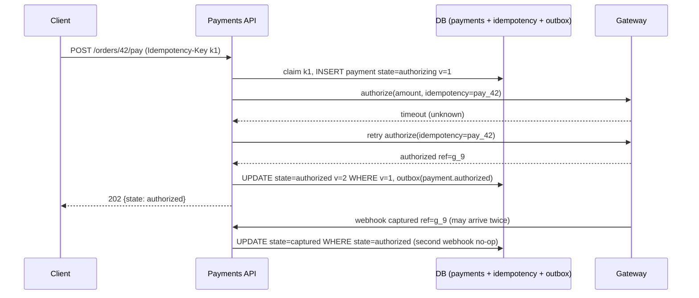

# Module 7.7 — تحدّيات تصميم الأنظمة: خمسة تصاميم كاملة بالمنهج
## System Design Challenges: URL shortener, notification system, file upload service, payment flow, and chat — each walked through the 7-step process with numbers, failure modes, and tradeoffs

> **المستوى:** Level 7 | **الموقع:** [7 من 9]
> **السابق:** [M7.6 — System Design Process](module-7.6-system-design-process.md) | **التالي:** [M7.8 — Performance Engineering](module-7.8-performance-engineering.md)

---

## 1. المتطلبات
> **قبل أن تتعلم هذا، يجب أن تفهم:**
- [ ] الخطوات السبع وورقة التقدير و`checkDesign` — [L7-M7.6](module-7.6-system-design-process.md)
- [ ] idempotency، deadline، الإعادة — [L7-M7.2](module-7.2-failure-timeouts-retries-idempotency.md)
- [ ] نماذج الاتساق والتوابع — [L7-M7.3](module-7.3-replication-consistency-cap.md)
- [ ] الموازنة، consistent hashing، التجزئة، المفتاح الساخن — [L7-M7.4](module-7.4-load-balancing-scaling.md)
- [ ] الطوابير المحدودة، القاطع، التدهور الرشيق — [L7-M7.5](module-7.5-reliability-patterns.md)
- [ ] الكاش والطوابير والتخزين السحابي — [L5-M5.8](../level-5-building-real-software/module-5.8-caching.md), [L5-M5.9](../level-5-building-real-software/module-5.9-queues-jobs-workers.md), [L5-M5.13](../level-5-building-real-software/module-5.13-cloud-fundamentals.md)

## 2. أهداف التعلّم
بعد هذه الوحدة ستستطيع:
1. تطبيق الخطوات السبع على خمس مسائل كلاسيكية **بأرقام** ومكوّنات مبرَّرة.
2. التعرّف على **الأنماط المتكرّرة** عبر المسائل: توليد معرّفات، fan-out عند الكتابة مقابل القراءة، الرفع المباشر الموقَّع، آلة حالة مع idempotency، الاتصال الدائم مع التوجيه.
3. تحديد **التعمّق الصحيح** لكل مسألة (أين الخطر الحقيقي) بدل تغطية كل شيء سطحيًا.
4. كتابة وضع الفشل لكل مكوّن وما يراه المستخدم.
5. صياغة 3 مقايضات لكل تصميم كـ ACTRR و"ما يتغيّر عند 10×".
6. بناء الجزأين الأخطر كودًا: مولّد معرّفات base62 وآلة حالة الدفع مع idempotency وwebhooks.

## 3. شرح للمبتدئ — خمسة تصاميم

كل تصميم يتبع الخطوات السبع من M7.6 بإيجاز مقصود: ما يهمّ هو **القرار ومبرّره**، لا التفاصيل. اقرأ كل تصميم مرّتين: مرة للفهم، ومرة وأنت تسأل "ما الذي كنت سأفعله مختلفًا ولماذا؟"

---

### التصميم 1 — مُقصِّر الروابط (URL Shortener)

**1. المتطلبات.** وظيفي: `POST /shorten(long) → short`، `GET /{code} → 301/302 إلى long`، إحصاءات نقرات أساسية. خارج النطاق: نطاقات مخصّصة، روابط تنتهي. غير وظيفي: إعادة التوجيه p99 < 50ms؛ توافر 99.99% للتوجيه (الروابط في البريد والمطبوعات)؛ 99.9% للإنشاء؛ الرموز غير قابلة للتخمين؟ **(اسأل)** — نفترض "يُفضَّل". الاحتفاظ: 5 سنوات.
**2. التقدير.** 100M إعادة توجيه/يوم ≈ 1,200/ثانية (ذروة 6,000)؛ 1M إنشاء/يوم ≈ 12/ثانية. نسبة قراءة/كتابة 100:1 → **الكاش هو التصميم**. التخزين: 1M × 365 × 5 × ~500B ≈ 0.9TB — PostgreSQL واحد يكفي. الكود: 7 أحرف base62 = 62⁷ ≈ 3.5×10¹² — يكفي لقرون.
**3. الواجهة والبيانات.** جدول `links(code PK, long_url, created_at, owner_id)` وفهرس على `code` فقط (التوجيه)؛ الإحصاءات في جدول منفصل يُغذَّى من طابور (الكتابة لا تُبطئ التوجيه).
**4. التصميم العالي.** CDN/حافة → خدمة توجيه عديمة الحالة (N نسخ) → Redis (code→url، TTL طويل) → PostgreSQL (قائد + تابع للتوافر). الإنشاء خدمة منفصلة منطقيًا (نفس الـ monolith) تكتب إلى القائد وتُسخّن الكاش.
**5. التعمّق — توليد الرمز.** خياران: (أ) عشوائي 7 أحرف مع فحص تصادم (UNIQUE؛ التصادم نادر ويُعاد المحاولة): غير قابل للتخمين، لكن كل إنشاء يحتاج كتابة قد تفشل؛ (ب) عدّاد مركزي (sequence) → base62: لا تصادم، لكن متسلسل قابل للتعداد (يمكن للمنافس عدّ روابطك) ويُعطى العدّاد مصدرًا واحدًا (سيكون مجموعات من 1000 معرّف لكل نسخة لتجنّب الاتصال بكل طلب). القرار: (أ) للعموم؛ أو (ب) + خلط (bijective shuffle) إن أردت الاثنين. **التعمّق 2 — 301 أم 302؟** 301 يُخزَّن في المتصفّح (أسرع، لكن لن ترى النقرات التالية ولا تستطيع تغيير الوجهة)؛ 302 كل نقرة تمرّ بك. إحصاءات = 302 مع `Cache-Control` قصير.
**6. الفشل.** Redis down → كل التوجيه إلى PG (6,000 قراءة مفهرسة/ثانية — يحتمل، لكن راقب)؛ PG primary down → التوجيه يستمرّ من الكاش والتابع، الإنشاء يُرفض 30 ثانية (C للإنشاء، A للتوجيه — M7.3)؛ رابط "فيروسي" = مفتاح ساخن → يُخدم من الكاش/CDN بطبيعته. SPOF: لا شيء إن كُرِّر Redis.
**7. المقايضات.** A: الروابط لا تُحدَّث بعد الإنشاء (يسمح بكاش عدواني). T: 302 (إحصاءات) مقابل 301 (أسرع). R: إساءة الاستخدام (روابط تصيّد) → فحص النطاقات + حدّ معدّل للإنشاء. عند 10×: التوجيه ما زال كاشًا؛ الإحصاءات تنتقل إلى تجميع دُفعي (ClickHouse أو مشابه).

---

### التصميم 2 — نظام الإشعارات (Notification System)

**1. المتطلبات.** وظيفي: خدمات داخلية تطلب "أرسل لـ user X إشعار من نوع Y بالبيانات Z"؛ القنوات: push، email، SMS، داخل التطبيق؛ تفضيلات المستخدم (أي قناة، ساعات الهدوء)؛ عدم التكرار. خارج النطاق: محرّر القوالب المرئي. غير وظيفي: الإشعارات "المباشرة" (رمز OTP) تُسلَّم خلال 5 ثوانٍ p99؛ "العادية" خلال دقيقة؛ لا فقدان (at-least-once) ولا تكرار مرئي؛ 99.9%.
**2. التقدير.** 10M DAU؛ 5 إشعارات/مستخدم/يوم = 5×10⁷/يوم ≈ 600/ثانية، ذروة 5,000؛ **لكن** الأحداث الاجتماعية (منشور شائع) تُنتج دفعات 100k خلال ثوانٍ (M7.6 §12). التخزين: سجل 90 يومًا × 1KB ≈ 4.5TB → تقسيم زمني + أرشفة.
**3. الواجهة والبيانات.** `POST /notify {user_id, type, payload, priority, dedupe_key}`؛ جداول: `preferences`, `templates`, `notifications(id, user, type, status, channel, dedupe_key UNIQUE per 24h)`.
**4. التصميم العالي.** خدمة استقبال (تحقّق + تفضيلات + dedupe) → **طابوران** محدودان (مباشر/عادي، M7.5) → workers لكل قناة (بحاجز لكل مزوّد خارجي وقاطع — M7.5) → مزوّدون (APNs/FCM/SES/Twilio) → webhooks الحالة (delivered/bounced) → تحديث السجل.
**5. التعمّق — دفعات fan-out.** "منشور شائع → 100k متابع" لا يُرسل 100k رسالة فورًا: التجميع (batching) لكل مستلم في نافذة (30 ثانية: "علي و47 آخرون أعجبوا…")، الأولوية الدنيا تُسقَط أولًا عند الامتلاء، وحدّ معدّل لكل مستخدم مُرسِل (لا أكثر من N إشعار/دقيقة من مصدر واحد). **التعمّق 2 — عدم التكرار.** مفتاح `dedupe_key` (مثلًا `like:post123:user456`) UNIQUE لـ 24 ساعة في الاستقبال + idempotent consumer في الـ worker (معرّف الرسالة) لأن الطابور at-least-once (M7.2).
**6. الفشل.** مزوّد SMS بطيء → الحاجز يحمي push/email، القاطع يفتح، الرسائل تنتظر في طابور القناة (محدود؛ OTP يُحوَّل إلى قناة بديلة بعد 10 ثوانٍ)؛ الطابور ممتلئ → العادي يُرفض بـ 503 للخدمات الداخلية (تعيد بـ backoff)، المباشر له طابور خاص؛ worker يموت أثناء الإرسال → الرسالة تعود (visibility timeout) وتُرسل مرة أخرى → dedupe يمنع التكرار المرئي.
**7. المقايضات.** T: at-least-once + dedupe (بسيط) مقابل exactly-once (مستحيل عمليًا عبر مزوّدين خارجيين). T: التجميع يُؤخّر الإشعار مقابل تقليل الضجيج والحمل. R: webhooks المزوّدين قد تصل قبل أن نحفظ السجل → تخزين مؤقّت وإعادة ترتيب. عند 10×: تقسيم الطوابير بحسب `hash(user_id)` لترتيب لكل مستخدم.

---

### التصميم 3 — خدمة رفع الملفات (File Upload Service)

**1. المتطلبات.** وظيفي: رفع صور/ملفات حتى 100MB، معالجة (تصغير/فحص فيروسات)، تنزيل/عرض بصلاحيات. خارج النطاق: تحرير، نسخ متعدّدة. غير وظيفي: الرفع يعمل على شبكات ضعيفة (استئناف)؛ العرض p99 < 100ms عالميًا؛ لا يصل ملف خبيث إلى المستخدمين؛ 99.9%؛ احتفاظ دائم.
**2. التقدير.** 2M DAU × 0.2 رفع × 3MB = 1.2TB/يوم (!) ≈ 14MB/ثانية متوسط، ذروة 70MB/ثانية؛ العرض 2M × 15 × 200KB = 6TB/يوم ≈ 70MB/ثانية متوسط → **العرض عبر CDN إلزامي، والرفع لا يجب أن يمرّ بخوادم التطبيق**. التخزين: 440TB/سنة → تخزين كائنات (S3-like)، لا قرص ولا DB.
**3. الواجهة والبيانات.** `POST /uploads → {upload_id, presigned_url(s)}`، `POST /uploads/{id}/complete`، `GET /files/{id} → 302 إلى URL موقَّع قصير العمر على CDN`. جدول `files(id, owner, status: pending|processing|ready|rejected, size, sha256, variants)`.
**4. التصميم العالي.** العميل يطلب رابطًا موقَّعًا من الـ API (يتحقّق من الحصّة والنوع) ويرفع **مباشرة** إلى تخزين الكائنات (multipart للملفات الكبيرة — استئناف مجاني) → حدث "اكتمل" (من العميل + من التخزين كتأكيد) → طابور معالجة → workers (تصغير، فحص، hash) يكتبون النسخ ويُحدّثون الحالة → العرض بروابط CDN موقَّعة.
**5. التعمّق — لماذا الرفع المباشر؟** تمرير 70MB/ثانية عبر Node يحتلّ ذاكرة واتصالات ويجعل خوادم الـ API عنق الزجاجة لعمل لا منطق فيه؛ التوقيع المسبق (presigned URL) يمنح العميل إذنًا محدودًا (مفتاح واحد، حجم أقصى، نوع، 15 دقيقة) دون كشف الاعتمادات. **التعمّق 2 — الأمن.** الملف غير مرئي حتى `ready`؛ `Content-Type` من الفحص لا من العميل (M5.4)؛ يُخدم من نطاق منفصل (لا كوكيز، لا XSS)؛ حذف = حذف ناعم ثم تنظيف دوري؛ dedupe بـ sha256 اختياري (يوفّر تخزينًا، يُسرّب "هذا الملف موجود" — مقايضة خصوصية).
**6. الفشل.** العميل اكتمل الرفع ولم يُبلّغ → تنظيف دوري للمعلّق > 24 ساعة؛ worker فشل → الرسالة تعود، المعالجة idempotent (تكتب بنفس المفاتيح)؛ التخزين بطيء إقليميًا → CDN يُخدم من الكاش؛ الطابور متراكم → الملف يبقى `processing` ويظهر "جارٍ المعالجة" (تدهور رشيق).
**7. المقايضات.** T: الرفع المباشر (قابلية توسّع) مقابل فقدان رؤية التدفّق في الخادم. T: فحص قبل الإتاحة (أمان) مقابل تأخير ثوانٍ. R: الفاتورة — خروج البيانات (egress) هو الكلفة الكبرى؛ CDN يُخفّضها. عند 10×: لا شيء يتغيّر بنيويًا — هذا ما تشتريه بالرفع المباشر.

---

### التصميم 4 — تدفّق الدفع (Payment Flow)

**1. المتطلبات.** وظيفي: دفع طلب عبر بوابة خارجية (بطاقة)، استرداد، سجل قابل للتدقيق. خارج النطاق: التقسيط، عملات متعدّدة. غير وظيفي: **لا خصم مزدوج أبدًا** ولا طلب مدفوع بلا تسجيل؛ p99 للدفع < 3 ثوانٍ؛ 99.95%؛ قابلية التدقيق 7 سنوات؛ امتثال (لا تخزين لبيانات البطاقة — PCI).
**2. التقدير.** 500k دفعة/يوم ≈ 6/ثانية (ذروة 60). الحجم صغير؛ **المشكلة ليست الحجم بل الصحّة تحت الفشل** (M7.2). التخزين: 500k × 365 × 7 × 2KB ≈ 2.5TB سجلّات → تقسيم زمني.
**3. الواجهة والبيانات.** `POST /orders/{id}/pay {Idempotency-Key}`؛ `POST /webhooks/gateway`؛ جدول `payments(id, order_id UNIQUE, state, gateway_ref, amount, idempotency_key UNIQUE, version)` + جدول `payment_events` (append-only للتدقيق) + `idempotency_keys`.
**4. التصميم العالي.** API → مخزن idempotency (نفس DB) → **آلة حالة** `created → authorizing → authorized → captured | failed → refunded` تُنفَّذ بمعاملة لكل انتقال (CAS على `version`) → بوابة الدفع (مهلة من deadline، لا إعادة لمجهول إلا بمفتاح البوابة نفسه) → webhooks (مؤكَّدة بتوقيع، idempotent، قد تصل بأي ترتيب) → طابور للأحداث اللاحقة (إيصال، شحن) عبر **outbox** (M7.9).
**5. التعمّق — الصحّة.** (أ) المفتاح من العميل يُحجز ذرّيًا؛ (ب) مفتاح idempotency **للبوابة** مشتق من `payment.id` (البوابات تدعمه — Stripe مثلًا) فتصبح إعادة المحاولة بعد timeout آمنة؛ (ج) كل انتقال حالة شرطي (`UPDATE … WHERE state = 'authorizing' AND version = $v`) فالـ webhook المكرّر أو المتأخّر لا يُفسد الحالة؛ (د) "مجهول" بعد كل المحاولات → حالة `pending_reconciliation` + مهمّة تستعلم البوابة عن `payment.id` كل دقيقة. **التعمّق 2 — ترتيب webhooks.** `captured` قد يصل قبل `authorized` (شبكتان مختلفتان) → الآلة تقبل الانتقالات الصالحة فقط وتُخزّن المتأخّر للمحاولة لاحقًا أو تستعلم الحالة الحقيقية من البوابة (المصدر الموثوق).
**6. الفشل.** البوابة بطيئة → حاجز + قاطع + صفحة "جارٍ التحقّق" بدل فشل (التدهور الرشيق: لا تُلغِ طلبًا ربما دُفع)؛ DB تفشل بعد ردّ البوابة → outbox يضمن أن الحدث يُرسل عند التعافي، والمصالحة تُغلق الفجوة؛ webhook مفقود → المصالحة.
**7. المقايضات.** T: الصحّة مقابل الزمن (مفتاح + معاملة + webhook ≈ +100ms). T: pending بدل خطأ (تجربة أقلّ وضوحًا، لكن لا خصم مزدوج ولا طلب ضائع). R: البوابة مصدر الحقيقة ونحن نسخة → المصالحة ليست اختيارية. عند 10×: لا يتغيّر شيء جوهري؛ 600/ثانية ما زالت صغيرة.

---

### التصميم 5 — الدردشة (Chat)

**1. المتطلبات.** وظيفي: رسائل 1:1 ومجموعات حتى 500؛ تسليم فوري للمتصلين؛ سجل؛ إيصالات (مُسلَّم/مقروء)؛ حالة الاتصال (online). خارج النطاق: مكالمات، تشفير طرف-لطرف. غير وظيفي: تسليم < 500ms p99 للمتصلين؛ ترتيب الرسائل داخل المحادثة؛ لا فقدان؛ 99.9%؛ ملايين الاتصالات المتزامنة.
**2. التقدير.** 20M DAU، 40 رسالة/يوم = 8×10⁸/يوم ≈ 9,000/ثانية (ذروة 30,000)؛ fan-out للمجموعات ×50 متوسط → 450k تسليم/ثانية ذروة؛ 5M اتصال WebSocket متزامن → عند 50k لكل خادم = 100 خادم اتصالات. التخزين: 8×10⁸ × 200B ≈ 160GB/يوم ≈ 58TB/سنة → قاعدة موزّعة بالمحادثة.
**3. الواجهة والبيانات.** WebSocket: `send{conv_id, client_msg_id, body}` / `deliver{msg}` / `ack`؛ REST للسجل `GET /conversations/{id}/messages?before=cursor`. البيانات: `messages(conv_id, seq, msg_id, sender, body, created_at)` بمفتاح `(conv_id, seq)` — **التجزئة بـ conv_id** تُبقي ترتيب المحادثة وقراءتها في جزء واحد (M7.4).
**4. التصميم العالي.** خوادم اتصالات (WebSocket، عديمة الحالة تقريبًا: تحمل "من متصل بي") → خدمة رسائل: تُعيّن `seq` تسلسليًا لكل محادثة (مصدر واحد للترتيب — M7.1) وتكتب → سجل توجيه `user → connection-server` (Redis) → نشر إلى خوادم الاتصالات المعنيّة (pub/sub بالقناة) → إشعار push لغير المتصلين (التصميم 2).
**5. التعمّق — الترتيب والتكرار.** العميل يُولّد `client_msg_id` (idempotency عبر إعادة الاتصال)؛ الخادم يُعيّن `seq` ذرّيًا لكل محادثة (`INSERT … RETURNING seq` من عدّاد المحادثة أو مفتاح مركّب)؛ المتلقّي يُرتّب بـ `seq` ويطلب الفجوات (`seq` مفقود → اسحب من السجل) — هذا أبسط وأقوى من محاولة "تسليم مرتّب" عبر الشبكة. **التعمّق 2 — الاتصالات الدائمة.** الاتصال حالة طويلة العمر: التصريف (M7.4) يعني إرسال `reconnect` للعملاء تدريجيًا قبل الإغلاق؛ العميل يُعيد الاتصال بـ backoff+jitter (M7.2 — وإلا "عاصفة إعادة اتصال" عند أي نشر) ويطلب "ما فاتني منذ seq X".
**6. الفشل.** خادم اتصالات يموت → 50k عميل يعيدون الاتصال (jitter!) ويسحبون الفجوات؛ Redis التوجيه يفقد → fallback: نشر إلى كل الخوادم مؤقّتًا (أغلى، لكنه يعمل)؛ قاعدة البيانات بطيئة → الرسالة تُؤكَّد للمرسل **بعد** الكتابة فقط (لا فقدان صامت) وتظهر "جارٍ الإرسال".
**7. المقايضات.** T: ترتيب لكل محادثة (ممكن) بدل ترتيب عالمي (مستحيل عمليًا). T: الحالة "online" تقريبية (heartbeat كل 30 ثانية) مقابل حمل. R: المجموعات الضخمة = مفتاح ساخن → حدّ 500 عضو، أو fan-out عند القراءة للقنوات الكبيرة. عند 10×: الكتابة تتجزّأ بـ conv_id؛ خوادم الاتصالات تتوسّع خطّيًا.

---

### ما يتكرّر عبر الخمسة
| النمط | أين ظهر | الوحدة الأصل |
|---|---|---|
| نسبة قراءة/كتابة تُقرّر الكاش | 1، 3 | M5.8، M7.6 |
| مفتاح من "النيّة" + حجز ذرّي | 2 (dedupe)، 4 (idempotency)، 5 (client_msg_id) | M7.2 |
| مصدر واحد للترتيب | 1 (عدّاد)، 4 (version)، 5 (seq) | M7.1، M7.3 |
| طابور محدود + أولويات + تدهور | 2، 3، 4 | M7.5 |
| التجزئة بمفتاح الوصول | 2 (user)، 5 (conv) | M7.4 |
| المصدر الخارجي هو الحقيقة → مصالحة | 2 (webhooks)، 4 (البوابة) | M7.2 |
| لا تمرّر البايتات الثقيلة عبر التطبيق | 3 (presigned)، 1 (CDN) | M5.13 |

## 4. النموذج الذهني
**"المسائل تختلف؛ الأسئلة لا."** لكل تصميم: ما النسبة؟ أين الحالة؟ ما مصدر الترتيب؟ ما مفتاح الإعادة الآمنة؟ ما يُسقَط أولًا؟ من مصدر الحقيقة؟ — من يحفظ الأسئلة يحلّ المسألة السادسة التي لم يرها.

## 5. الرسم التوضيحي


رفع الملف المباشر (التصميم 3):

```text
Client ──POST /uploads──▶ API ──(يتحقّق الحصّة/النوع، يُنشئ pending)──▶ DB
Client ◀── presigned PUT URL (15 min, max 100MB, key=u/123/abc) ──── API
Client ══════════════ PUT bytes (multipart, resumable) ══════════════▶ Object Storage
Client ──POST /uploads/abc/complete──▶ API ──▶ queue ──▶ worker: scan, resize, sha256 ──▶ status=ready
Viewer ──GET /files/abc──▶ API ──302──▶ CDN signed URL ──▶ edge cache ──▶ Object Storage (miss only)
```

## 6. مثال بسيط
```typescript
// انتقال حالة شرطي: الأساس الذي يجعل webhooks المكرّرة/المتأخّرة غير مؤذية (التصميم 4)
async function transition(db: Db, paymentId: string, from: PaymentState, to: PaymentState, event: string) {
  const res = await db.query(
    `UPDATE payments SET state = $1, version = version + 1 WHERE id = $2 AND state = $3 RETURNING version`,
    [to, paymentId, from]);
  if (res.rowCount === 0) return { applied: false };               // الحالة ليست from: مكرّر أو متأخّر → تجاهل آمن
  await db.query(`INSERT INTO payment_events(payment_id, event, from_state, to_state) VALUES ($1,$2,$3,$4)`, [paymentId, event, from, to]);
  await db.query(`INSERT INTO outbox(topic, payload) VALUES ('payments', $1)`, [JSON.stringify({ paymentId, to })]);
  return { applied: true };                                         // كلّه في معاملة واحدة في الكود الحقيقي
}
```

## 7. مثال كود
الجزآن اللذان يُخطئ فيهما الناس فعليًا: مولّد رموز base62 (عشوائي مع فحص تصادم، وعدّاد مع خلط) للتصميم 1، وآلة حالة الدفع مع idempotency وwebhooks خارج الترتيب للتصميم 4 — مع اختبارات تحقن timeout وتكرارًا وترتيبًا معكوسًا.

```text
m77-designs/
├─ src/shortener.ts
├─ src/payment.ts
└─ src/designs.test.ts
```

```typescript
// src/shortener.ts
import { randomInt } from "node:crypto";
const ALPHABET = "0123456789ABCDEFGHIJKLMNOPQRSTUVWXYZabcdefghijklmnopqrstuvwxyz"; // 62

export function toBase62(n: bigint): string {
  if (n === 0n) return "0";
  let s = ""; while (n > 0n) { s = ALPHABET[Number(n % 62n)] + s; n /= 62n; } return s;
}
export function fromBase62(s: string): bigint {
  let n = 0n; for (const ch of s) { const i = ALPHABET.indexOf(ch); if (i < 0) throw new Error("bad char"); n = n * 62n + BigInt(i); } return n;
}
export const randomCode = (len = 7) => Array.from({ length: len }, () => ALPHABET[randomInt(62)]).join("");

export interface LinkStore { insertIfAbsent(code: string, url: string): Promise<boolean>; get(code: string): Promise<string | undefined> }
export class MemoryLinkStore implements LinkStore {
  readonly m = new Map<string, string>();
  async insertIfAbsent(code: string, url: string) { if (this.m.has(code)) return false; this.m.set(code, url); return true; }   // UNIQUE في DB
  async get(code: string) { return this.m.get(code); }
}

// الخيار (أ): عشوائي + إعادة عند التصادم (نادر عند 62^7 لكن يجب التعامل معه)
export async function shortenRandom(store: LinkStore, url: string, maxTries = 5): Promise<string> {
  for (let i = 0; i < maxTries; i++) { const code = randomCode(); if (await store.insertIfAbsent(code, url)) return code; }
  throw new Error("could not allocate code");
}

// الخيار (ب): عدّاد (كتل لكل نسخة لتقليل التنسيق) + خلط ثنائي الاتجاه كي لا تكون الرموز متسلسلة الشكل
export class BlockCounter {
  private next = 0n; private end = 0n;
  constructor(private readonly allocateBlock: () => bigint, private readonly blockSize = 1000n) {}
  take(): bigint { if (this.next >= this.end) { this.next = this.allocateBlock(); this.end = this.next + this.blockSize; } return this.next++; }
}
// خلط تقابلي بسيط داخل 2^41 (يكفي لـ 62^7 ≈ 2^41.7): ضرب في عدد فردي modulo 2^41 — قابل للعكس بالمعكوس الضربي
const MOD = 1n << 41n, MUL = 0x5DEECE66Dn % MOD;
export const scramble = (n: bigint) => (n * MUL) % MOD;
export function modInverse(a: bigint, m: bigint) { let [g, x] = [m, 0n], [r, y] = [a % m, 1n]; while (r) { const q = g / r; [g, r] = [r, g - q * r]; [x, y] = [y, x - q * y]; } return ((x % m) + m) % m; }
export const unscramble = (n: bigint) => (n * modInverse(MUL, MOD)) % MOD;
export const counterCode = (n: bigint) => toBase62(scramble(n)).padStart(7, "0");
```

```typescript
// src/payment.ts
export type PaymentState = "created" | "authorizing" | "authorized" | "captured" | "failed" | "refunded" | "pending_reconciliation";
const ALLOWED: Record<PaymentState, PaymentState[]> = {
  created: ["authorizing"], authorizing: ["authorized", "failed", "pending_reconciliation"], authorized: ["captured", "failed"],
  captured: ["refunded"], failed: [], refunded: [], pending_reconciliation: ["authorized", "failed"],
};
export interface Payment { id: string; orderId: string; amount: number; state: PaymentState; version: number; gatewayRef?: string }
export interface Gateway { authorize(req: { idempotencyKey: string; amount: number }): Promise<{ ref: string }> }
export class GatewayTimeout extends Error { constructor() { super("gateway timeout"); this.name = "GatewayTimeout"; } }

export class PaymentService {
  readonly payments = new Map<string, Payment>();            // في الإنتاج: جدول بـ UNIQUE(order_id), UNIQUE(idempotency_key)
  readonly idem = new Map<string, { orderId: string; result?: Payment }>();
  readonly events: { id: string; from: PaymentState; to: PaymentState; cause: string }[] = [];
  readonly outbox: { topic: string; payload: unknown }[] = [];
  readonly deferredWebhooks: { ref: string; event: "captured" }[] = [];
  constructor(private readonly gateway: Gateway, private readonly maxGatewayAttempts = 3) {}

  // الانتقال الشرطي: يُطبَّق فقط إن كانت الحالة الحالية تسمح؛ وإلا يُرجع false (مكرّر/متأخّر)
  private transition(p: Payment, to: PaymentState, cause: string): boolean {
    if (!ALLOWED[p.state].includes(to)) return false;
    this.events.push({ id: p.id, from: p.state, to, cause }); p.state = to; p.version++;
    this.outbox.push({ topic: "payments", payload: { id: p.id, state: to } });   // نفس "المعاملة" مع التغيير
    return true;
  }

  async pay(orderId: string, amount: number, idempotencyKey: string): Promise<Payment> {
    const seen = this.idem.get(idempotencyKey);
    if (seen) { if (seen.orderId !== orderId) throw new Error("422 key reused for another order"); if (seen.result) return seen.result; throw new Error("409 in progress"); }
    if ([...this.payments.values()].some((p) => p.orderId === orderId && p.state !== "failed")) throw new Error("409 order already has a payment");
    this.idem.set(idempotencyKey, { orderId });
    const p: Payment = { id: `pay_${orderId}`, orderId, amount, state: "created", version: 1 };
    this.payments.set(p.id, p); this.transition(p, "authorizing", "pay()");
    for (let attempt = 1; attempt <= this.maxGatewayAttempts; attempt++) {
      try {
        const { ref } = await this.gateway.authorize({ idempotencyKey: p.id, amount });   // مفتاح البوابة = معرّفنا الثابت
        p.gatewayRef = ref; this.transition(p, "authorized", `gateway ok (attempt ${attempt})`); break;
      } catch (e) {
        if (!(e instanceof GatewayTimeout)) { this.transition(p, "failed", String(e)); break; }   // رفض صريح = دائم
        if (attempt === this.maxGatewayAttempts) this.transition(p, "pending_reconciliation", "unknown after retries");
      }
    }
    this.idem.set(idempotencyKey, { orderId, result: p });
    return p;
  }

  // webhook: قد يتكرّر، وقد يصل captured قبل authorized
  webhook(ev: { ref: string; event: "authorized" | "captured" | "failed" }): "applied" | "ignored" | "deferred" {
    const p = [...this.payments.values()].find((x) => x.gatewayRef === ev.ref || x.id === ev.ref);
    if (!p) return "ignored";
    if (ev.event === "captured" && p.state !== "authorized") {
      if (p.state === "captured") return "ignored";                                   // مكرّر
      this.deferredWebhooks.push({ ref: ev.ref, event: "captured" }); return "deferred";   // متأخّر الترتيب
    }
    const applied = this.transition(p, ev.event, `webhook ${ev.event}`);
    if (applied) { const d = this.deferredWebhooks.findIndex((x) => x.ref === ev.ref); if (d >= 0) { this.deferredWebhooks.splice(d, 1); this.transition(p, "captured", "deferred webhook replay"); } }
    return applied ? "applied" : "ignored";
  }

  // المصالحة: البوابة مصدر الحقيقة للمدفوعات المجهولة
  async reconcile(lookup: (idempotencyKey: string) => Promise<{ ref: string; state: "authorized" | "failed" } | null>) {
    for (const p of this.payments.values()) if (p.state === "pending_reconciliation") {
      const r = await lookup(p.id); if (!r) continue;
      p.gatewayRef = r.ref; this.transition(p, r.state, "reconciliation");
    }
  }
}
```

```typescript
// src/designs.test.ts
import { test } from "node:test";
import assert from "node:assert/strict";
import { toBase62, fromBase62, shortenRandom, MemoryLinkStore, BlockCounter, counterCode, scramble, unscramble } from "./shortener.ts";
import { PaymentService, GatewayTimeout, type Gateway } from "./payment.ts";

test("shortener: base62 ذهابًا وإيابًا؛ التصادم يُعاد؛ العدّاد المخلوط لا يُنتج رموزًا متسلسلة الشكل", async () => {
  for (const n of [0n, 61n, 62n, 123456789n, 62n ** 7n - 1n]) assert.equal(fromBase62(toBase62(n)), n);
  assert.equal(toBase62(62n ** 7n - 1n).length, 7);
  const store = new MemoryLinkStore(); let calls = 0;
  const colliding = { insertIfAbsent: async (c: string, u: string) => (++calls === 1 ? false : store.insertIfAbsent(c, u)), get: store.get.bind(store) };
  const code = await shortenRandom(colliding, "https://example.com"); assert.equal(code.length, 7); assert.equal(calls, 2);
  let block = 0n; const counter = new BlockCounter(() => (block += 1000n) - 1000n, 1000n);
  const codes = Array.from({ length: 5 }, () => counterCode(counter.take()));
  assert.equal(new Set(codes).size, 5);
  assert.notEqual(codes[1]!.slice(0, 6), codes[0]!.slice(0, 6), "scrambled: consecutive ids differ widely");
  for (const n of [1n, 2n, 999n, 10n ** 9n]) assert.equal(unscramble(scramble(n)), n);
});

test("payment: timeout ثم نجاح = خصم واحد (مفتاح البوابة ثابت)؛ المفتاح المكرّر يُعيد النتيجة؛ المفتاح لطلب آخر يُرفض", async () => {
  let authorizeCalls = 0; const seenKeys = new Map<string, string>();
  const gateway: Gateway = { async authorize({ idempotencyKey }) {
    authorizeCalls++;
    if (!seenKeys.has(idempotencyKey)) seenKeys.set(idempotencyKey, `g_${seenKeys.size + 1}`);   // البوابة "خصمت" حتى لو ضاع الجواب
    if (authorizeCalls === 1) throw new GatewayTimeout();
    return { ref: seenKeys.get(idempotencyKey)! };
  } };
  const svc = new PaymentService(gateway);
  const p = await svc.pay("42", 20, "k1");
  assert.equal(p.state, "authorized"); assert.equal(authorizeCalls, 2);
  assert.equal(seenKeys.size, 1, "gateway saw ONE idempotency key → one charge");
  assert.equal(await svc.pay("42", 20, "k1"), p);                                   // إعادة من العميل → نفس النتيجة
  await assert.rejects(svc.pay("43", 20, "k1"), /422/);
  await assert.rejects(svc.pay("42", 20, "k2"), /409 order already/);
  assert.ok(svc.outbox.some((o) => (o.payload as { state: string }).state === "authorized"));
});

test("payment: webhooks مكرّرة وخارج الترتيب لا تُفسد الحالة؛ المجهول يُصالَح", async () => {
  const gateway: Gateway = { async authorize() { return { ref: "g_7" }; } };
  const svc = new PaymentService(gateway);
  const p = await svc.pay("50", 10, "k50"); assert.equal(p.state, "authorized");
  assert.equal(svc.webhook({ ref: "g_7", event: "captured" }), "applied");
  assert.equal(svc.webhook({ ref: "g_7", event: "captured" }), "ignored");        // مكرّر
  assert.equal(svc.webhook({ ref: "g_7", event: "authorized" }), "ignored");      // متأخّر وبلا معنى الآن
  assert.equal(p.state, "captured");
  // خارج الترتيب: captured يصل قبل أن نعرف أننا authorized (بوابة تُعيد ref مبكرًا ثم تنتهي المهلة)
  const timeoutAlways: Gateway = { async authorize() { throw new GatewayTimeout(); } };
  const svc2 = new PaymentService(timeoutAlways, 2);
  const p2 = await svc2.pay("60", 30, "k60"); assert.equal(p2.state, "pending_reconciliation");
  assert.equal(svc2.webhook({ ref: "pay_60", event: "captured" }), "deferred");
  await svc2.reconcile(async (key) => (key === "pay_60" ? { ref: "g_60", state: "authorized" } : null));
  assert.equal(p2.state, "authorized");
  assert.equal(svc2.webhook({ ref: "g_60", event: "authorized" }), "ignored");    // لم نُطبّق authorized مرتين
  // الـ webhook المؤجَّل يُعاد تطبيقه حين تصبح الحالة مناسبة
  assert.equal(svc2.deferredWebhooks.length, 1);
  assert.equal(svc2.webhook({ ref: "g_60", event: "captured" }), "applied"); assert.equal(p2.state, "captured");
  assert.deepEqual(svc2.events.map((e) => e.to), ["authorizing", "pending_reconciliation", "authorized", "captured"]);
});
```

**تشغيل:** `npx tsx --test src/*.test.ts`. لاحظ في الاختبار الثاني أن البوابة "خصمت" عند المحاولة الأولى رغم الـ timeout — والمفتاح الثابت `pay_42` هو الوحيد الذي منع الخصم الثاني. هذا سطر واحد يفصل بين التصميم 4 وحادثة M7.2 §8.

---

## 8. مثال من العالم الحقيقي
مرشّح لمنصب senior في مقابلة تصميم "نظام إشعارات": رسم خلال دقيقتين Kafka وCassandra وخمس خدمات. المُقيِّم سأل: "كم إشعارًا في الثانية؟" — لم يسأل. "ماذا يحدث حين يتعطّل مزوّد SMS؟" — "نعيد المحاولة". "وإن استمرّ ساعة؟" — صمت. "ما الذي يمنع إرسال الإشعار مرتين إن مات الـ worker بعد الإرسال وقبل التأكيد؟" — "Kafka exactly-once". لم يُقبل، لا لنقص المعرفة، بل لأن التصميم لم يكن **جوابًا على أسئلة**. المرشّح الذي قُبل في اليوم نفسه رسم طابورين وworkers وPostgreSQL، وقضى 15 دقيقة في dedupe والحواجز لكل مزوّد والتدهور حين يفشل مزوّد، وقال في النهاية: "عند 10× أُجزّئ الطوابير بالمستخدم؛ وعند 100× أنتقل إلى سجل مثل Kafka لأعيد التشغيل من الماضي — ليس قبل ذلك".

## 9. مثال من الإنتاج
شركة توصيل طعام أعادت تصميم مسار الدفع بعد سلسلة حوادث "خصم مزدوج" (M7.2 §8). التغييرات التي صمدت ثلاث سنوات: آلة حالة صريحة بانتقالات شرطية (كما في §7)، مفتاح idempotency للبوابة مشتق من معرّف الدفع، webhooks تُعالَج عبر طابور بـ idempotent consumer وتُقبل بأي ترتيب، حالة `pending_reconciliation` مع مهمّة كل دقيقة، ولوحة واحدة: "مدفوعات في حالة غير نهائية أطول من 5 دقائق" مع تنبيه. المؤشّر الذي يفخرون به: صفر خصم مزدوج في 40M معاملة، رغم ثلاثة انقطاعات للبوابة وحادثتي شبكة. والدرس الذي يُدرّسونه للجدد: "الدفع ليس مسألة حجم؛ هو مسألة أن تكون كل خطوة قابلة للتكرار بأمان".

---

## 10. مفاهيم خاطئة شائعة
1. **"لكل مسألة تصميم 'جواب نموذجي' يُحفظ."** الجواب يتبع الأرقام والقيود؛ الحفظ ينكشف عند أول سؤال "لماذا".
2. **"الدردشة والإشعارات تحتاجان Kafka حتمًا."** عند 9,000 رسالة/ثانية يكفي Redis Streams أو PG؛ Kafka حين تحتاج إعادة التشغيل أو عشرات الآلاف المستدامة.
3. **"exactly-once يحلّ تكرار الإشعارات."** عبر مزوّد خارجي لا يوجد exactly-once؛ يوجد at-least-once + dedupe.
4. **"301 أفضل لأنه أسرع."** يُفقدك الإحصاءات والقدرة على التغيير؛ المقايضة تعتمد على المتطلب.
5. **"الرفع عبر الخادم أكثر أمانًا."** التوقيع المسبق يمنح إذنًا أضيق (مفتاح، حجم، نوع، مدّة) من أي كود يمرّر بايتات.
6. **"webhooks تصل مرة واحدة وبالترتيب."** تصل مكرّرة وبأي ترتيب — صمّم الآلة الحالة لذلك.

## 11. أخطاء شائعة
1. مفتاح idempotency للبوابة يُولَّد لكل محاولة (التصميم 4) → خصم لكل timeout.
2. انتقال حالة غير شرطي (`SET state='captured'` بلا `WHERE state='authorized'`) → webhook قديم يُعيد الدفع للوراء.
3. fan-out فوري للمنشور الشائع (التصميم 2) → 100k رسالة في ثانية وطابور ينفجر.
4. الملف مرئي قبل الفحص (التصميم 3) → برمجيات خبيثة تُستضاف على نطاقك.
5. `Content-Type` من العميل (التصميم 3) → HTML "صورة" = XSS.
6. ترتيب الدردشة بطابع وقت العميل (التصميم 5) → رسائل تتبادل المواضع (M7.1).
7. إعادة اتصال WebSocket بلا jitter (التصميم 5) → عاصفة عند كل نشر.
8. الإحصاءات في نفس معاملة التوجيه (التصميم 1) → كتابة لكل قراءة تقتل الكاش.
9. "لا نقطة فشل واحدة" بينما Redis التوجيه (التصميم 5) أو Redis الكاش (1) نسخة واحدة.

## 12. تمرين تصحيح
مُقصِّر روابط (التصميم 1) بعد شهر: p99 للتوجيه قفز من 8ms إلى 400ms في ساعات معيّنة، ونسبة إصابة الكاش 99%.
1. **دليل:** الـ 1% من الإخفاقات تتزامن مع "حملة بريدية" (روابط جديدة لم تُسخَّن)؛ كل إخفاق يذهب إلى PG؛ استعلام التوجيه يكتب أيضًا `UPDATE links SET clicks = clicks + 1` في نفس المعاملة؛ قفل الصف الساخن للرابط الشائع.
2. **فرضية:** الإحصاءات داخل مسار التوجيه → تنافس على صف واحد (مفتاح ساخن) + كتابة لكل قراءة → p99 ينهار تحت الذروة حتى مع كاش 99%.
3. **تجربة:** `pg_stat_activity` وقت الذروة: انتظارات على `tuple lock` لنفس `code`؛ إزالة الـ UPDATE مؤقّتًا تُعيد p99 إلى 10ms.
4. **الإصلاح:** الإحصاءات عبر طابور (أو عدّاد Redis `INCR` يُفرَّغ دوريًا)؛ تسخين الكاش عند الإنشاء؛ `Cache-Control` قصير على 302 للروابط الشائعة ليمتصّ المتصفّح/CDN جزءًا.
5. **عمّم:** هل يوجد في مسار القراءة الساخن أي كتابة؟ احذفها أو أجّلها.

## 13. تمرين معماري
صمّم المسألة السادسة بنفسك بالخطوات السبع وبنفس الإيجاز: **"خلاصة أخبار (News Feed)"** — المستخدم يتابع آخرين ويرى منشوراتهم بالأحدث؛ 50M DAU؛ 2 منشور/مستخدم/يوم؛ 20 فتح خلاصة/يوم؛ بعض الحسابات لها 20M متابع. يجب أن تُجيب صراحةً: fan-out عند الكتابة (نسخ المنشور إلى خلاصة كل متابع) مقابل عند القراءة (جمع عند الفتح) مقابل هجين للمشاهير — بالأرقام؛ أين الكاش وما حجمه؛ ما ترتيب الخلاصة ومصدره؛ ماذا يُسقَط تحت الضغط؛ ما يراه المستخدم حين يفشل كل مكوّن. ثم اكتب التصميم كـ `DesignDoc` (M7.6) ومرّره عبر `checkDesign` وأرفق جدول "ما يتكرّر" الخاص بك مع ربط كل نمط بوحدته.

## 14. الصلة بعصر AI
التصاميم الخمسة شائعة جدًا في بيانات التدريب، لذا سيُنتج الوكيل نسخة "متوسّط الإنترنت" منها: مكوّنات أكثر ممّا يلزم، وتفاصيل الصحّة أقلّ ممّا يلزم (مفتاح البوابة، الانتقال الشرطي، dedupe، jitter). استخدمه لتوسيع **البدائل** في كل تعمّق ("أعطني ثلاثة خيارات لتوليد الرمز مع مقايضة كل منها") ولمراجعة تصميمك ناقدًا ("ما الذي يفشل أولًا؟ ما غير المبرَّر؟")، لكن احتفظ بالأرقام والقرارات لنفسك. وحين يكتب الكود لأي من هذه الأجزاء، اشترط اختبارات §7: timeout ثم نجاح = خصم واحد، webhook مكرّر ومعكوس الترتيب لا يُفسد الحالة. وستفعل ذلك منهجيًا في Project 8.

## 15. ما يجب إتقانه (Must Master) 🔴
- 🔴 تطبيق الخطوات السبع على المسائل الخمس بأرقام؛ الأنماط المتكرّرة (النسبة تُقرّر الكاش، المفتاح من النيّة، مصدر واحد للترتيب، طابور محدود + تدهور، التجزئة بمفتاح الوصول، المصدر الخارجي حقيقة → مصالحة، لا بايتات ثقيلة عبر التطبيق)؛ آلة حالة الدفع بانتقالات شرطية ومفتاح بوابة ثابت؛ الرفع المباشر الموقَّع.

## 16. ما يجب فهمه (Should Understand) 🟠
- 🟠 301/302 والكاش؛ خلط العدّاد (bijective scramble)؛ تجميع الإشعارات والأولويات؛ `seq` لكل محادثة وطلب الفجوات؛ تصريف اتصالات WebSocket؛ fan-out عند الكتابة/القراءة/الهجين.

## 17. ما يمكن تأجيله (Can Defer) ⚪
- ⚪ PCI بالتفصيل؛ Kafka exactly-once semantics؛ CRDTs للدردشة دون اتصال؛ تحسين CDN المتقدّم (signed cookies، origin shield).

## 18. الخلاصة
1. خمس مسائل مختلفة، نفس الأسئلة: النسبة، الحالة، الترتيب، المفتاح الآمن، ما يُسقَط، مصدر الحقيقة.
2. المُقصِّر: الكاش هو التصميم؛ الرمز قرار (عشوائي/عدّاد مخلوط)؛ 302 للإحصاءات.
3. الإشعارات: طوابير محدودة بأولويات، dedupe + idempotent consumer، حاجز وقاطع لكل مزوّد، تجميع الدفعات.
4. الرفع: مباشر بتوقيع مسبق، معالجة بطابور، لا شيء مرئي قبل الفحص، CDN للعرض.
5. الدفع: آلة حالة شرطية + مفتاح من العميل + مفتاح ثابت للبوابة + webhooks بأي ترتيب + مصالحة.
6. الدردشة: `seq` لكل محادثة من مصدر واحد، تجزئة بالمحادثة، إعادة اتصال بـ jitter وسحب الفجوات.

## 19. مراجع رسمية
- Stripe — Idempotent requests & webhook best practices: https://docs.stripe.com/api/idempotent_requests, https://docs.stripe.com/webhooks#best-practices
- AWS S3 — Uploading objects with presigned URLs & multipart upload: https://docs.aws.amazon.com/AmazonS3/latest/userguide/PresignedUrlUploadObject.html, https://docs.aws.amazon.com/AmazonS3/latest/userguide/mpuoverview.html
- RFC 9110 — 301/302/307/308 semantics: https://www.rfc-editor.org/rfc/rfc9110#section-15.4
- RFC 6455 — The WebSocket Protocol: https://www.rfc-editor.org/rfc/rfc6455
- Redis — Streams (consumer groups, at-least-once): https://redis.io/docs/latest/develop/data-types/streams/
- Apple APNs / Google FCM — delivery semantics & rate limits: https://developer.apple.com/documentation/usernotifications, https://firebase.google.com/docs/cloud-messaging
- Twitter Engineering — Timelines at scale (fan-out hybrid): https://www.infoq.com/presentations/Twitter-Timeline-Scalability/
- Discord Engineering — How Discord stores trillions of messages (partition by channel): https://discord.com/blog/how-discord-stores-trillions-of-messages

## المصطلحات
| العربية | English |
|---|---|
| مُقصِّر الروابط | URL shortener |
| ترميز base62 | Base62 encoding |
| فحص التصادم | Collision check |
| عدّاد بكتل | Block counter |
| خلط تقابلي | Bijective scramble |
| إعادة توجيه دائمة / مؤقّتة | 301 / 302 redirect |
| منع التكرار | Deduplication |
| تجميع | Batching |
| توزيع عند الكتابة / عند القراءة | Fan-out on write / on read |
| رابط موقَّع مسبقًا | Presigned URL |
| رفع متعدّد الأجزاء | Multipart upload |
| شبكة توصيل المحتوى | CDN |
| آلة حالة | State machine |
| انتقال شرطي | Conditional transition |
| صندوق صادر | Outbox |
| بانتظار المصالحة | Pending reconciliation |
| خطّاف ويب | Webhook |
| رقم تسلسلي للمحادثة | Per-conversation sequence |
| اتصال دائم | Persistent connection (WebSocket) |
| سحب الفجوات | Gap fill |
