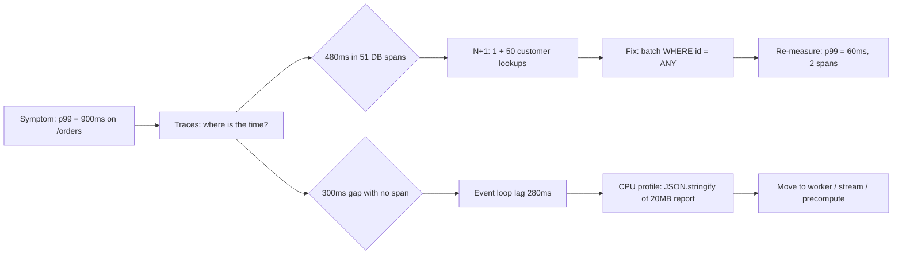

# Module 7.8 — هندسة الأداء: القياس قبل التخمين
## Performance Engineering: latency vs throughput, percentiles, profiling, the N+1 problem, batching, event-loop blocking, and load testing — measure, find the bottleneck, fix, re-measure

> **المستوى:** Level 7 | **الموقع:** [8 من 9]
> **السابق:** [M7.7 — System Design Challenges](module-7.7-system-design-challenges.md) | **التالي:** [M7.9 — Microservices in Depth](module-7.9-microservices-in-depth.md)

---

## 1. المتطلبات
- [ ] جدول الزمن (RAM/SSD/شبكة)، CPU-bound مقابل I/O-bound — [L2-M2.2](../level-2-computer-systems/module-2.2-cpu-cache-ram.md), [L0-M0.3](../level-0-absolute-foundations/module-03-running-a-program.md)
- [ ] event loop ولماذا الحلقة المحظورة تُوقف كل الطلبات — [L2-M2.7](../level-2-computer-systems/module-2.7-concurrency-event-loop.md), [L1-M1.11](../level-1-programming/module-1.11-async-event-loop.md)
- [ ] Big-O والفهارس وخطط الاستعلام — [L3-M3.8](../level-3-core-computer-science/module-3.8-big-o.md), [L3-M3.13](../level-3-core-computer-science/module-3.13-indexes.md)
- [ ] الكاش ومتى يصلح — [L5-M5.8](../level-5-building-real-software/module-5.8-caching.md)
- [ ] المقاييس والهستوغرامات وp99 — [L6-M6.6](../level-6-professional-engineering/module-6.6-observability.md)
- [ ] قانون الطوابير والطابور المحدود — [L7-M7.5](module-7.5-reliability-patterns.md)

## 2. أهداف التعلّم
بعد هذه الوحدة ستستطيع:
1. التمييز بين **زمن الاستجابة (latency)** و**الإنتاجية (throughput)** و**الاستخدام (utilization)** وشرح لماذا يرتفع الزمن حادًّا بعد 70–80% استخدام.
2. قراءة الأداء بالـ **percentiles** (p50/p95/p99) لا بالمتوسط، وشرح "تضخيم الذيل" عبر الاستدعاءات المتعدّدة.
3. تطبيق حلقة **قِس → اعثر على العنق → أصلح → أعد القياس** باستخدام profiler وflame graph بدل التخمين.
4. اكتشاف وإصلاح مشكلة **N+1** بالتجميع (batching/DataLoader) والـ JOIN، وقياس الفرق.
5. اكتشاف **حجب event loop** وقياسه (event loop lag) ونقل العمل الثقيل خارجه.
6. إجراء **اختبار حمل** صحيح (الإحماء، الحمل المفتوح مقابل المغلق، coordinated omission) وتفسير نتائجه.

## 3. شرح للمبتدئ
"الخدمة بطيئة" ليست مشكلة؛ هي عَرَض. هندسة الأداء هي الانضباط الذي يُحوّل العَرَض إلى سبب مُقاس ثم إلى إصلاح مُثبَت. والقاعدة الأولى — التي ينتهكها الجميع تقريبًا — هي: **لا تُحسّن ما لم تقسه.** الحدس عن "أين البطء" خاطئ في معظم الأحيان، والتحسين في المكان الخطأ يُعقّد الكود بلا فائدة.

**ثلاثة مقاييس، لا واحد.** **Latency**: كم ينتظر طلب واحد (ms). **Throughput**: كم طلبًا يُنجز النظام في الثانية. **Utilization**: نسبة انشغال المورد (CPU، اتصالات DB، event loop). العلاقة بينها ليست خطّية: حتى 60–70% استخدام يبقى الزمن ثابتًا تقريبًا؛ بعدها يرتفع **حادًّا** لأن الطلبات تبدأ بانتظار بعضها (نظرية الطوابير: زمن الانتظار ∝ ρ/(1−ρ)؛ عند ρ=0.9 الانتظار 9× زمن الخدمة؛ عند 0.95 → 19×). لذلك "CPU عند 85% — لدينا 15% احتياطي" جملة خاطئة؛ أنت على حافّة الهاوية. وهذا سبب أن سعة النظام الفعلية ≈ 70% من طاقته القصوى.

**لماذا المتوسّط يكذب.** متوسّط 50ms قد يعني: كل الطلبات 50ms، أو 95% منها 10ms و5% ثانية كاملة. المستخدم الذي ينتظر الثانية لا يُعزّيه المتوسّط. لذلك نقيس **percentiles**: p50 (الوسيط — التجربة النموذجية)، p95، p99 (واحد من مئة — عند 100 طلب/ثانية هذا 86,400 مستخدم غاضب يوميًا). والأسوأ: **تضخيم الذيل (tail amplification)**. صفحة تستدعي 10 خدمات بالتوازي، كلٌّ p99 = 100ms؛ احتمال أن تكون **جميعها** تحت 100ms = 0.99¹⁰ ≈ 90% — أي أن p90 للصفحة = p99 لمكوّناتها؛ ومع 100 استدعاء (microservices!) 63% من الصفحات تلمس الذيل. لذلك p99 للخدمات الداخلية يجب أن يكون أشدّ بكثير من p99 المطلوب للمستخدم، والـ hedged requests (M7.2) تُقصّ الذيل.

**الحلقة: قِس → اعثر → أصلح → أعد القياس.** (1) **قِس** في الإنتاج أو ببيانات تُشبهه (قاعدة بيانات بـ 100 صف تُخفي كل شيء)؛ ابدأ من الخارج (أي نقطة نهاية بطيئة؟ من المقاييس M6.6) ثم إلى الداخل (أي جزء من الطلب؟ من التتبّع الموزّع: spans). (2) **اعثر على العنق** — المورد الواحد الذي يُحدّد السرعة: إن كان الطلب 500ms منها 480 في انتظار DB فلا معنى لتحسين JSON. الأداة: **profiler**. في Node: `node --cpu-prof` أو `--inspect` مع Chrome DevTools، والمخرَج **flame graph**: العرض = الوقت، فتجد الدالّة العريضة. لـ I/O: تتبّع الاستعلامات (`pg_stat_statements`، `EXPLAIN ANALYZE` — M3.13). (3) **أصلح العنق فقط** — والإصلاحات تأتي بترتيب العائد: احذف العمل (لا تحسب ما لا يُعرض)، قلّل الرحلات (N+1 → batch، M3.13 الفهرس)، خبّئ (M5.8)، وازِ (Promise.all للمستقلّ)، وأخيرًا حسّن الخوارزمية أو الكود الساخن. (4) **أعد القياس** بنفس الطريقة — وإلا لا تعرف إن كنت أصلحت شيئًا. التحسين بلا قياس بعدي "تمنٍّ".

**العدوّ الأول في خدمات الويب: N+1.** تجلب 50 طلبًا بـ استعلام واحد، ثم لكل طلب تجلب عميله: 1 + 50 استعلامًا، كلٌّ 1ms شبكة → 51ms بدل 2ms؛ ومع 500 صف ومستويين (طلب → عميل → عنوان) تصل إلى آلاف الاستعلامات. لا يظهر في التطوير (10 صفوف) وينفجر في الإنتاج. الكشف: عدّ الاستعلامات لكل طلب (سجّلها؛ أي طلب HTTP ينفّذ > 10 استعلامات مشبوه). العلاج: JOIN أو `WHERE id = ANY($1)` لجلب الكل دفعة، أو **batcher** على نمط DataLoader: يجمع كل `load(id)` المطلوبة في نفس "دورة" event loop ويُطلق استعلامًا واحدًا — وهو إلزامي في GraphQL حيث يُحلّ كل حقل على حدة.

**العدوّ الثاني في Node: حجب event loop.** Node يخدم آلاف الطلبات بخيط واحد لأن كل I/O غير محظور؛ لكن أي **حساب** طويل (تحليل JSON بـ 50MB، حلقة على مليون عنصر، regex كارثي، `JSON.stringify` لكائن ضخم، تشفير متزامن `pbkdf2Sync`) يُجمّد **كل** الطلبات الأخرى طوال مدّته. 200ms من الحساب = كل طلب متزامن يتأخّر 200ms، وp99 يقفز بينما CPU "عادي" في المتوسط. القياس: **event loop lag** (`perf_hooks.monitorEventLoopDelay`) — إن تجاوز 50ms بانتظام فلديك حاجب. العلاج: قسّم العمل (`setImmediate` بين الدفعات)، أو انقله إلى **worker threads** (CPU-bound حقيقي)، أو إلى عملية/طابور منفصل (M5.9)، أو ببساطة لا تفعله في مسار الطلب (احسب مسبقًا).

**اختبار الحمل الصحيح.** الأدوات (k6، autocannon، wrk) سهلة؛ **التفسير** صعب. أخطاء كلاسيكية: (1) **بلا إحماء**: الثواني الأولى تقيس JIT وفتح الاتصالات لا الخدمة؛ (2) **نموذج مغلق** (N مستخدم افتراضي ينتظر كلٌّ ردّه قبل التالي) يُخفي الانهيار: حين تبطؤ الخدمة يُرسل المختبِر أقلّ تلقائيًا — بينما المستخدمون الحقيقيون (نموذج **مفتوح**: معدّل وصول ثابت) لا يتوقّفون؛ قِس بمعدّل وصول ثابت وارفعه تدريجيًا حتى ترى منحنى الزمن ينكسر — تلك سعتك؛ (3) **coordinated omission**: إن توقّف المختبِر عن الإرسال أثناء توقّف الخدمة لثانية فلن يُسجّل تلك الثانية في الذيل، وp99 يبدو ممتازًا؛ أدوات ناضجة تُصحّح هذا (HdrHistogram، k6 بـ arrival-rate executors)؛ (4) اختبار على بيانات صغيرة أو بلا شبكة حقيقية؛ (5) الاكتفاء بـ "النجاح" دون التحقّق من **صحّة** الردود تحت الحمل (الأخطاء السريعة تُحسّن p99!).

**الأداء في الواجهة أيضًا.** ما يراه المستخدم = زمن الخادم + الشبكة + التصيير. تحسين 100ms في الخادم لا يُنقذ صفحة تُحمّل 3MB من JavaScript. القواعد الكبرى: أقلّ بايتات (ضغط، تقسيم الحزم، صور بالحجم المناسب)، أقلّ رحلات (HTTP/2، تجميع، CDN قريب)، وقياس **Core Web Vitals** الحقيقية من المتصفّحات (RUM) لا من مختبرك.

## 4. النموذج الذهني
**"الأداء عِلم تجريبي: كل تحسين فرضية، والقياس قبل وبعد هو التجربة — بدونه أنت تُعقّد الكود على أمل."** والعنق واحد في كل لحظة؛ إصلاح غيره لا يُغيّر شيئًا.

```text
   قِس (percentiles، spans، profiler) ──▶ العنق؟ ──▶ أصلح العنق فقط ──▶ أعد القياس بنفس الطريقة
        ▲                                  │                                      │
        │                                  ├─ I/O: رحلات كثيرة؟ (N+1) → batch/JOIN │
        │                                  ├─ I/O: استعلام بطيء؟ → فهرس/خطة        │
        │                                  ├─ CPU: دالّة عريضة؟ → خوارزمية/كاش      │
        │                                  ├─ event loop محجوب؟ → قسّم/worker        │
        │                                  └─ انتظار مورد مشبع؟ (ρ>0.7) → سعة/حدّ   │
        └──────────────────────── العنق التالي (دائمًا يوجد) ◀───────────────────────┘
```

## 5. الرسم التوضيحي


منحنى الاستخدام مقابل الزمن (لماذا 70% هو السقف العملي):

```text
زمن الاستجابة
 20×│                                                 ╭─
    │                                               ╭─╯
 10×│                                           ╭───╯
    │                                       ╭───╯
  5×│                                 ╭─────╯
    │                      ╭──────────╯
  1×│──────────────────────╯
    └──────────┬──────────┬──────────┬──────────┬──────▶ الاستخدام ρ
             25%        50%        70%        90%
                                    ▲ هنا تبدأ الطوابير بالتكوّن (M7.5)
```

## 6. مثال بسيط
```typescript
// قياس event loop lag وعدد الاستعلامات لكل طلب — أرخص كاشفين للعنقين الأشهر
import { monitorEventLoopDelay } from "node:perf_hooks";
const h = monitorEventLoopDelay({ resolution: 10 }); h.enable();
setInterval(() => { metrics.gauge("event_loop_lag_p99_ms", h.percentile(99) / 1e6); h.reset(); }, 10_000);

app.use((req, res, next) => {                         // عدّ الاستعلامات في سياق الطلب (AsyncLocalStorage، M6.6)
  const ctx = { queries: 0 };
  als.run(ctx, () => { res.on("finish", () => { if (ctx.queries > 10) log.warn({ path: req.path, queries: ctx.queries }, "possible N+1"); }); next(); });
});
```

## 7. مثال كود
هارنس قياس صغير بـ percentiles، ومحاكي DB بزمن شبكة، ثم ثلاث تجارب: N+1 مقابل التجميع (batcher على نمط DataLoader)، حجب event loop وقياس أثره على طلب متزامن، ونموذج الحمل المغلق مقابل المفتوح الذي يكشف الانهيار.

```text
m78-performance/
├─ src/bench.ts
├─ src/fake-db.ts
├─ src/batcher.ts
└─ src/performance.test.ts
```

```typescript
// src/bench.ts
export interface Percentiles { p50: number; p95: number; p99: number }
export function percentiles(samples: number[]): Percentiles {
  const s = samples.toSorted((a, b) => a - b);
  const at = (p: number) => s[Math.max(0, Math.min(s.length - 1, Math.ceil((p / 100) * s.length) - 1))] ?? 0;
  return { p50: at(50), p95: at(95), p99: at(99) };
}
export const mean = (xs: number[]) => xs.reduce((a, b) => a + b, 0) / Math.max(1, xs.length);

// قياس دالّة async: إحماء ثم N تكرارًا؛ يُرجع percentiles بالميلي ثانية
export async function bench(fn: () => Promise<unknown>, { warmup = 3, runs = 20 } = {}) {
  for (let i = 0; i < warmup; i++) await fn();
  const samples: number[] = [];
  for (let i = 0; i < runs; i++) { const t = performance.now(); await fn(); samples.push(performance.now() - t); }
  return { ...percentiles(samples), mean: mean(samples) };
}

// نموذج مفتوح: معدّل وصول ثابت (λ/ثانية) لمدّة durationMs — لا ننتظر الردّ قبل إرسال التالي
export async function openLoad(fn: () => Promise<unknown>, ratePerSec: number, durationMs: number) {
  const interval = 1000 / ratePerSec; const latencies: number[] = []; const inflight: Promise<void>[] = [];
  const start = performance.now(); let i = 0;
  while (performance.now() - start < durationMs) {
    const scheduledAt = start + i * interval;                        // الوقت الذي "كان يجب" أن يُرسل فيه (يُصحّح coordinated omission)
    const now = performance.now(); if (now < scheduledAt) await new Promise((r) => setTimeout(r, scheduledAt - now));
    inflight.push(fn().then(() => { latencies.push(performance.now() - scheduledAt); }));
    i++;
  }
  await Promise.all(inflight);
  return { sent: i, ...percentiles(latencies), mean: mean(latencies) };
}
// نموذج مغلق: N "مستخدم" كلٌّ ينتظر ردّه قبل التالي — يُخفي الانهيار لأنه يُبطئ الإرسال تلقائيًا
export async function closedLoad(fn: () => Promise<unknown>, users: number, durationMs: number) {
  const latencies: number[] = []; let sent = 0; const start = performance.now();
  await Promise.all(Array.from({ length: users }, async () => { while (performance.now() - start < durationMs) { const t = performance.now(); await fn(); latencies.push(performance.now() - t); sent++; } }));
  return { sent, ...percentiles(latencies), mean: mean(latencies) };
}
```

```typescript
// src/fake-db.ts
// قاعدة بيانات وهمية: كل استعلام يدفع "زمن رحلة" ثابتًا + وقت خدمة؛ وتزامن محدود (pool)
export interface Order { id: number; customerId: number } export interface Customer { id: number; name: string }
export class FakeDb {
  queries = 0; private active = 0; private readonly waiters: (() => void)[] = [];
  constructor(private readonly roundTripMs = 2, private readonly poolSize = 10) {}
  private async acquire() { if (this.active >= this.poolSize) await new Promise<void>((r) => this.waiters.push(r)); this.active++; }
  private release() { this.active--; this.waiters.shift()?.(); }
  private async query<T>(fn: () => T): Promise<T> { await this.acquire(); this.queries++; try { await new Promise((r) => setTimeout(r, this.roundTripMs)); return fn(); } finally { this.release(); } }
  orders(limit: number) { return this.query(() => Array.from({ length: limit }, (_, i) => ({ id: i + 1, customerId: (i % 20) + 1 }))); }
  customer(id: number) { return this.query(() => ({ id, name: `c${id}` })); }
  customersByIds(ids: number[]) { return this.query(() => ids.map((id) => ({ id, name: `c${id}` }))); }
}
```

```typescript
// src/batcher.ts
// DataLoader مبسّط: يجمع كل load(key) في نفس tick ويُطلق batchFn واحدة؛ مع كاش لكل طلب
export class Batcher<K, V> {
  private queue: { key: K; resolve: (v: V) => void; reject: (e: unknown) => void }[] = [];
  private scheduled = false; private readonly cache = new Map<K, Promise<V>>(); batches = 0;
  constructor(private readonly batchFn: (keys: K[]) => Promise<Map<K, V>>, private readonly maxBatch = 100) {}
  load(key: K): Promise<V> {
    const hit = this.cache.get(key); if (hit) return hit;
    const p = new Promise<V>((resolve, reject) => { this.queue.push({ key, resolve, reject }); });
    this.cache.set(key, p);
    if (!this.scheduled) { this.scheduled = true; queueMicrotask(() => process.nextTick(() => this.flush())); }
    return p;
  }
  private async flush() {
    this.scheduled = false;
    while (this.queue.length) {
      const chunk = this.queue.splice(0, this.maxBatch); this.batches++;
      try { const res = await this.batchFn([...new Set(chunk.map((c) => c.key))]); for (const c of chunk) { const v = res.get(c.key); if (v === undefined) c.reject(new Error(`missing ${String(c.key)}`)); else c.resolve(v); } }
      catch (e) { for (const c of chunk) c.reject(e); }
    }
  }
}
```

```typescript
// src/performance.test.ts
import { test } from "node:test";
import assert from "node:assert/strict";
import { bench, openLoad, closedLoad, percentiles } from "./bench.ts";
import { FakeDb } from "./fake-db.ts";
import { Batcher } from "./batcher.ts";

const sleep = (ms: number) => new Promise<void>((r) => setTimeout(r, ms));

test("N+1 مقابل batch: 51 استعلامًا → 2، والزمن ينخفض بمقدار كبير", async () => {
  const db = new FakeDb(2, 10);
  const naive = async () => { const orders = await db.orders(50); return Promise.all(orders.map(async (o) => ({ ...o, customer: await db.customer(o.customerId) }))); };
  const batched = async () => {
    const loader = new Batcher<number, { id: number; name: string }>(async (ids) => new Map((await db.customersByIds(ids)).map((c) => [c.id, c])));
    const orders = await db.orders(50); return Promise.all(orders.map(async (o) => ({ ...o, customer: await loader.load(o.customerId) })));
  };
  db.queries = 0; await naive(); const naiveQueries = db.queries;
  db.queries = 0; await batched(); const batchedQueries = db.queries;
  assert.equal(naiveQueries, 51); assert.equal(batchedQueries, 2);           // 1 للطلبات + 1 للعملاء (20 مفتاحًا فريدًا)
  const n = await bench(naive, { runs: 5 }), b = await bench(batched, { runs: 5 });
  assert.ok(n.p50 > b.p50 * 2, `naive p50=${n.p50.toFixed(1)}ms batched p50=${b.p50.toFixed(1)}ms`);   // الـ pool (10) يجعل 50 استعلامًا تنتظر دورها
});

test("event loop blocking: حساب 100ms يُؤخّر طلبًا متزامنًا لا علاقة له؛ التقسيم يُصلحه", async () => {
  const busy = (ms: number) => { const end = performance.now() + ms; while (performance.now() < end) { /* CPU */ } };
  const measureBystander = async (heavy: () => Promise<void>) => {
    const t = performance.now(); let bystanderLatency = 0;
    const bystander = sleep(1).then(() => { bystanderLatency = performance.now() - t; });   // طلب خفيف يحتاج 1ms فقط
    await Promise.all([heavy(), bystander]); return bystanderLatency;
  };
  const blocking = await measureBystander(async () => busy(100));
  const chunked = await measureBystander(async () => { for (let i = 0; i < 10; i++) { busy(10); await new Promise((r) => setImmediate(r)); } });
  assert.ok(blocking >= 90, `bystander waited ${blocking.toFixed(0)}ms behind a 100ms sync block`);
  assert.ok(chunked < 30, `with yielding, bystander waited only ${chunked.toFixed(0)}ms`);
});

test("closed vs open load: المغلق يُخفي الانهيار عند تجاوز السعة؛ المفتوح يكشفه", async () => {
  // خدمة بسعة ≈ 100/ثانية (10ms خدمة، تزامن 1)
  let busyUntil = 0;
  const service = async () => { const now = performance.now(); const start = Math.max(now, busyUntil); busyUntil = start + 10; await sleep(busyUntil - now); };
  const closed = await closedLoad(service, 2, 600);                          // 2 مستخدمين: يُرسلان أبطأ تلقائيًا حين تبطؤ الخدمة
  busyUntil = 0; const open = await openLoad(service, 150, 600);              // 150/ثانية > السعة 100 → الطابور ينمو
  assert.ok(closed.p99 < 60, `closed p99=${closed.p99.toFixed(0)}ms looks healthy (sent ${closed.sent})`);
  assert.ok(open.p99 > 150, `open p99=${open.p99.toFixed(0)}ms reveals the overload (sent ${open.sent})`);
  assert.ok(open.p99 > closed.p99 * 2);
});

test("percentiles: المتوسّط يُخفي الذيل؛ p99 يكشفه؛ تضخيم الذيل عبر 10 استدعاءات", () => {
  const samples = [...Array.from({ length: 95 }, () => 10), ...Array.from({ length: 5 }, () => 1_000)];
  const p = percentiles(samples); const avg = samples.reduce((a, b) => a + b) / samples.length;
  assert.equal(p.p50, 10); assert.equal(p.p99, 1_000); assert.ok(Math.abs(avg - 59.5) < 0.1);
  const pAllFast = 0.99 ** 10; assert.ok(pAllFast < 0.91 && pAllFast > 0.90);   // p99 لكل مكوّن ⇒ ≈p90 للصفحة
});
```

**تشغيل:** `npx tsx --test src/*.test.ts`. ثم جرّب على كود حقيقي: `node --cpu-prof app.js` تحت حمل، وافتح الملف `.cpuprofile` في Chrome DevTools (Performance → Load profile) وابحث عن أعرض شريط — ستتفاجأ غالبًا بأنه ليس حيث ظننت.

---

## 8. مثال من العالم الحقيقي
فريق أمضى أسبوعين في "تحسين الأداء": استبدال مكتبة JSON، إعادة كتابة طبقة التحقّق، إضافة كاش لعشرة استعلامات. p99 لصفحة الطلبات لم يتحرّك (1.1 ثانية). مهندسة جديدة فتحت التتبّع الموزّع لطلب واحد بطيء: 180 span لقاعدة البيانات — N+1 بمستويين (طلب → عناصر → منتجات) خلف ORM بـ lazy loading "مريح". إصلاح من 6 أسطر (`include`/JOIN) → p99 = 90ms. ما تعلّموه ليس "ORM سيّئ" بل: **أسبوعان من التحسين بلا قياس = صفر**، ودقيقتان من القياس = 12×. أضافوا بعدها تنبيهًا "استعلامات لكل طلب > 15" وتدقيقًا في CI يُفشل الاختبار إن تجاوز عدد الاستعلامات لنقطة نهاية حدًّا مكتوبًا.

## 9. مثال من الإنتاج
خدمة API في Node بـ p50 = 12ms وp99 = 1.4 ثانية — نسبة 100× بين الوسيط والذيل، وهي بصمة **حجب event loop** لا بطء I/O (الذي يرفع الكل معًا). `monitorEventLoopDelay` أظهر قمم lag حتى 1.2 ثانية كل بضع دقائق. CPU profile تحت الحمل: `JSON.stringify` لـ "تقرير التصدير" (30MB) في نفس العملية التي تخدم الطلبات التفاعلية؛ مرة كل دقائق، لكن كل طلب متزامن معها يدفع الثمن. الحلّ على مرحلتين: فورًا، نقل التصدير إلى طابور وworker منفصل (M5.9) وبثّ النتيجة stream بدل بنائها في الذاكرة؛ ثم سياسة: "لا حساب > 10ms في عملية الـ API". p99 هبط إلى 40ms بلا لمس أي استعلام. وأُضيف `event_loop_lag_p99` إلى لوحة كل خدمة Node مع تنبيه عند 100ms.

---

## 10. مفاهيم خاطئة شائعة
1. **"CPU عند 80% = لدينا 20% احتياطي."** بعد 70% يرتفع الزمن حادًّا؛ السعة العملية ≈ 70%.
2. **"المتوسّط جيّد إذن الأداء جيّد."** المتوسّط يُخفي الذيل؛ p99 هو تجربة واحد من كل مئة — يوميًا آلاف.
3. **"Node سريع لأنه async."** سريع في I/O؛ أي حساب متزامن طويل يُجمّد الجميع.
4. **"الكاش يحلّ الأداء."** يحلّ القراءة المتكرّرة؛ لا يحلّ N+1 في كتابة، ولا حجب event loop، ويُضيف مشكلات الإبطال (M5.8).
5. **"اختبار الحمل نجح بـ 0% أخطاء."** بنموذج مغلق وبلا إحماء وبلا فحص صحّة الردود — قد لا يعني شيئًا.
6. **"أحسّن الكود الساخن أولًا."** الترتيب: احذف العمل، قلّل الرحلات، خبّئ، وازِ، ثم الكود.

## 11. أخطاء شائعة
1. التحسين قبل القياس، أو بلا قياس بعدي.
2. اختبار على 100 صف؛ الإنتاج 10M.
3. ORM بـ lazy loading في حلقة (N+1) دون عدّ الاستعلامات.
4. `Promise.all` على 5,000 عنصر → 5,000 استعلام متزامن تُغرق الـ pool (وازِ بحدّ — `p-limit`).
5. `JSON.parse`/`stringify`/تشفير متزامن/regex معقّد في مسار الطلب.
6. قياس بالساعة الجدارية `Date.now()` بدل `performance.now()` (M7.1).
7. اختبار حمل من الجهاز نفسه الذي يُشغّل الخدمة (المختبِر يسرق CPU).
8. تجاهل GC: أجسام ضخمة قصيرة العمر تُسبّب توقّفات؛ راقب `--trace-gc` و heap.
9. تحسين الخادم بينما الصفحة تُحمّل 3MB من JavaScript.

## 12. تمرين تصحيح
بعد نشر "تحسين": p50 تحسّن من 40 إلى 25ms، لكن شكاوى "بطيء أحيانًا" ازدادت وp99 ارتفع من 300ms إلى 2 ثانية.
1. **دليل:** التحسين كان "كاش في الذاكرة للكتالوج كاملًا (80MB) يُجدَّد كل دقيقة" — التجديد `JSON.parse` لـ 80MB متزامن في العملية؛ event loop lag p99 = 1.8 ثانية كل دقيقة؛ GC pauses ارتفعت.
2. **فرضية:** تحسين p50 جاء من إصابات الكاش، وتدهور p99 من التجديد المتزامن (حجب) + ضغط GC — مقايضة لم تُقَس.
3. **تجربة:** راقب lag وGC مع طابع زمني وقارن بتوقيت التجديد؛ ستجد تطابقًا دقيقًا كل 60 ثانية.
4. **الإصلاح:** تجديد تدريجي (دفعات مع `setImmediate`)، أو تحميل في worker thread وتبديل المرجع، أو كاش خارجي (Redis) بقراءات جزئية؛ وقياس p99 **و**lag قبل/بعد — لا p50 فقط.
5. **عمّم:** أي "تحسين" غيّر p50 فقط؟ اسأل دائمًا ماذا فعل بـ p99.

## 13. تمرين معماري
ضع "ميزانية أداء" لـ Project 6 واكتب خطّة إثباتها: (1) لكل نقطة نهاية رئيسية: هدف p50/p99 وسعة مستهدفة (طلب/ثانية) مع مبرّر من المنتج؛ (2) ميزانية داخلية للطلب: DB ≤ X ms وN استعلامات كحدّ أقصى، Redis ≤ Y، حساب ≤ 10ms، لا حجب > 10ms؛ (3) الأدوات: ما يُقاس في الإنتاج (hist للزمن، lag، استعلامات/طلب، pool wait) وما يُقاس في CI (اختبار حمل مفتوح النموذج على بيئة شبيهة ببيانات واقعية، مع عتبات تُفشل البناء)؛ (4) خطّة تشخيص مكتوبة: من العَرَض إلى الأداة (p99 مرتفع والكل مرتفع → I/O؛ p50 جيّد وp99 سيّئ → حجب/GC/ذيل اعتماد؛ ارتفاع مع الحمل فقط → تشبّع مورد — أيّ؟)؛ (5) ثلاثة إصلاحات محتملة مرتّبة بالعائد/الكلفة لكل عنق متوقّع؛ (6) كيف تمنع التراجع (regression) بعد كل نشر.

## 14. الصلة بعصر AI
الوكلاء ممتازون في **اقتراح** تحسينات وسيّئون في **معرفة أيّها يهمّ** — سيُحسّنون حلقة `for` بينما العنق 51 استعلامًا. منهجك هو ما يُوجّههم: أعطهم القياس (التتبّع، الـ profile، عدد الاستعلامات) واطلب تشخيصًا قبل أي اقتراح، ثم اطلب التحسين **مع اختبار قياس قبل/بعد** مثل §7 ("أثبت أن عدد الاستعلامات صار 2 وأن p50 انخفض"). والأنماط التي يُدخلها الوكلاء بكثرة: N+1 عبر ORM مريح، `Promise.all` بلا حدّ، `readFileSync`/`JSON.parse` لملفات كبيرة في مسار الطلب، وتعبيرات regex قابلة للانفجار — ضعها في قائمة المراجعة الآلية (M8.7). الأداء مجال يتفوّق فيه "قِس ثم قرّر" على أي قدر من الذكاء، بشريًا كان أم اصطناعيًا.

## 15–17. Master / Understand / Defer
- 🔴 latency/throughput/utilization ومنحنى 70%؛ percentiles لا متوسّط وتضخيم الذيل؛ حلقة قِس→اعثر→أصلح→أعد القياس؛ قراءة flame graph والتتبّع؛ N+1 كشفًا وعلاجًا (batch/JOIN/DataLoader)؛ حجب event loop وقياسه وعلاجه؛ النموذج المفتوح مقابل المغلق في اختبار الحمل.
- 🟠 coordinated omission وHdrHistogram؛ worker threads مقابل عمليات مقابل طابور؛ GC وضغط الذاكرة في Node؛ توازٍ بحدّ (`p-limit`)؛ Core Web Vitals وRUM؛ `pg_stat_statements` كأداة يومية.
- ⚪ نظرية الطوابير رسميًا (M/M/1, M/M/c)؛ تحسين V8 الداخلي (hidden classes, deopts)؛ eBPF وprofiling على مستوى النواة؛ SIMD/WASM للحساب الثقيل.

## 18. الخلاصة
1. لا تُحسّن ما لم تقسه؛ ولا تُصدّق تحسينًا بلا قياس بعدي.
2. السعة العملية ≈ 70% من القصوى؛ بعدها الطوابير تُضاعف الزمن.
3. p99 لا المتوسّط؛ والذيل يتضخّم عبر الاستدعاءات المتعدّدة.
4. العنق واحد في كل لحظة: اعثر عليه بالتتبّع والـ profiler، أصلحه، ثم ابحث عن التالي.
5. N+1 وحجب event loop هما العدوّان الأشهر في خدمات Node — وكلاهما يُكشف بعدّاد بسيط (استعلامات/طلب، lag).
6. اختبار الحمل الصحيح: إحماء، نموذج مفتوح، تصحيح coordinated omission، فحص صحّة الردود، بيانات واقعية.

## 19. مراجع رسمية
- Node.js — Don't Block the Event Loop: https://nodejs.org/en/learn/asynchronous-work/dont-block-the-event-loop
- Node.js — `perf_hooks.monitorEventLoopDelay`, `--cpu-prof`: https://nodejs.org/api/perf_hooks.html#perf_hooksmonitoreventloopdelayoptions, https://nodejs.org/api/cli.html#--cpu-prof
- Node.js — Worker threads: https://nodejs.org/api/worker_threads.html
- Brendan Gregg — Flame Graphs & the USE Method: https://www.brendangregg.com/flamegraphs.html, https://www.brendangregg.com/usemethod.html
- Gil Tene — How NOT to Measure Latency (coordinated omission): https://www.infoq.com/presentations/latency-response-time/
- Jeff Dean & Luiz Barroso — The Tail at Scale: https://research.google/pubs/the-tail-at-scale/
- GraphQL DataLoader (batching & per-request caching): https://github.com/graphql/dataloader
- Grafana k6 — Open vs closed models (arrival-rate executors): https://grafana.com/docs/k6/latest/using-k6/scenarios/concepts/open-vs-closed/
- PostgreSQL — `pg_stat_statements`, `EXPLAIN ANALYZE`: https://www.postgresql.org/docs/current/pgstatstatements.html, https://www.postgresql.org/docs/current/using-explain.html
- web.dev — Core Web Vitals: https://web.dev/articles/vitals

## المصطلحات
| العربية | English |
|---|---|
| زمن الاستجابة | Latency |
| الإنتاجية | Throughput |
| الاستخدام | Utilization |
| المئين (p50/p95/p99) | Percentile |
| ذيل التوزيع | Tail latency |
| تضخيم الذيل | Tail amplification |
| عنق الزجاجة | Bottleneck |
| مُحلّل الأداء | Profiler |
| رسم اللهب | Flame graph |
| التتبّع الموزّع | Distributed tracing |
| مشكلة N+1 | N+1 problem |
| التجميع | Batching |
| محمّل دفعي | DataLoader |
| حجب حلقة الأحداث | Event loop blocking |
| تأخّر حلقة الأحداث | Event loop lag |
| خيوط العمل | Worker threads |
| اختبار الحمل | Load testing |
| نموذج مفتوح / مغلق | Open / Closed workload model |
| الإغفال المنسّق | Coordinated omission |
| الإحماء | Warm-up |
| تراجع الأداء | Performance regression |
