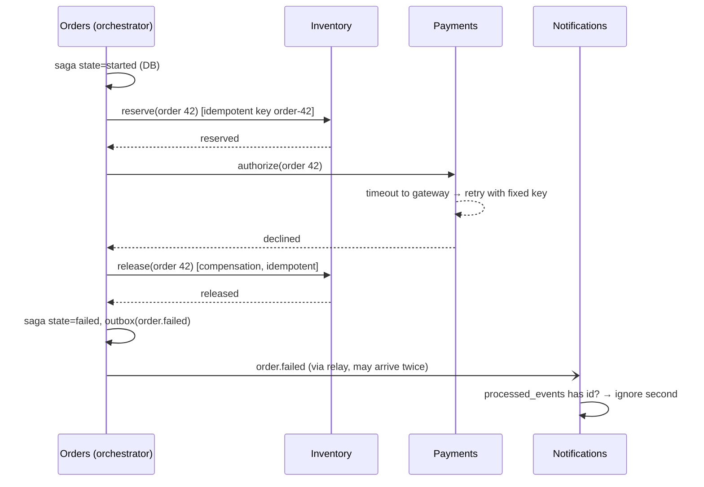

# Module 7.9 — الخدمات المصغّرة بعمق: الحدود، البيانات، المعاملات الموزّعة، والثمن الحقيقي
## Microservices in Depth: service boundaries, data ownership, sync vs async communication, sagas & compensation, the transactional outbox, idempotent consumers, and when NOT to do it

> **المستوى:** Level 7 | **الموقع:** [9 من 9]
> **السابق:** [M7.8 — Performance Engineering](module-7.8-performance-engineering.md) | **التالي:** [Project 7 — Distributed Exercise](../projects/project-7-distributed/README.md) ثم [Checkpoint 7](checkpoint-7.md)

---

## 1. المتطلبات
- [ ] أنماط المعمارية وmodular monolith كنقطة بداية — [L6-M6.9](../level-6-professional-engineering/module-6.9-architecture-styles.md)
- [ ] الاقتران والتماسك؛ الحدود والواجهات — [L4-M4.7](../level-4-software-engineering-foundations/module-4.7-coupling-cohesion.md)
- [ ] المعاملات وACID؛ لماذا لا توجد معاملة عبر قاعدتين — [L3-M3.14](../level-3-core-computer-science/module-3.14-transactions-acid.md)
- [ ] idempotency والمصالحة — [L7-M7.2](module-7.2-failure-timeouts-retries-idempotency.md)
- [ ] الطوابير وat-least-once — [L5-M5.9](../level-5-building-real-software/module-5.9-queues-jobs-workers.md)
- [ ] التوافر المتسلسل وتضخيم الذيل — [L7-M7.5](module-7.5-reliability-patterns.md), [L7-M7.8](module-7.8-performance-engineering.md)
- [ ] آلة حالة الدفع والـ outbox كفكرة — [L7-M7.7](module-7.7-system-design-challenges.md)

## 2. أهداف التعلّم
بعد هذه الوحدة ستستطيع:
1. تحديد **حدود الخدمات** بمعيار ملكية البيانات ومعدّل التغيير والفريق — لا بالأسماء (Users/Orders) ولا بالحجم.
2. شرح قاعدة **"قاعدة بيانات لكل خدمة"** وما تُكلّفه: لا JOIN عبر الخدمات، لا معاملات، نسخ محلية من بيانات الآخرين.
3. الاختيار بين **التواصل المتزامن** (HTTP/gRPC) و**غير المتزامن** (أحداث) وفهم أثر كلٍّ على التوافر والاقتران.
4. تنفيذ **saga** بالتنسيق (orchestration) مع **تعويضات**، وتمييزها عن المعاملة الحقيقية.
5. تنفيذ **transactional outbox** و**idempotent consumer** معًا لتسليم أحداث موثوق دون "dual write".
6. تقدير الثمن التشغيلي (نشر، مراقبة، تتبّع، عقود، اختبار) والجواب الصادق على "هل نحتاج microservices؟"

## 3. شرح للمبتدئ
في M6.9 رأيت الخدمات المصغّرة كأسلوب معماري بين أساليب. هنا تفتح الغطاء: ما الذي يجعلها صعبة فعلًا، وما الأنماط التي تجعلها ممكنة، ومتى يكون الجواب الصحيح "لا".

**ما هي فعلًا.** خدمة مصغّرة = عملية مستقلّة النشر، تملك **بياناتها** حصريًا، وتتواصل مع غيرها عبر الشبكة فقط. الفائدة الحقيقية ليست "التوسّع" (monolith خلف LB يتوسّع أيضًا — M7.4) بل **الاستقلال التنظيمي**: فريق ينشر خدمته 20 مرة يوميًا دون تنسيق مع 10 فرق أخرى، ويختار لغته وقاعدة بياناته، ويُعزل عطله. أي أنها حلّ لمشكلة **عدد الفرق وتعارض النشر**، وقبل أن تكون لديك هذه المشكلة فأنت تدفع ثمنًا لحلّ مشكلة لا تملكها. وكل ما تعلّمته في M7.1–7.8 يصبح **داخل** تطبيقك: كل استدعاء بين وحدتين كان دالّة محلية (نانو ثانية، لا تفشل، معاملة واحدة) يصبح طلب شبكة (ميلي ثانية، يفشل، ثلاث نتائج).

**الحدود: السؤال الأصعب.** الخطأ الأشهر هو التقسيم بالأسماء ("خدمة المستخدمين، خدمة الطلبات، خدمة المنتجات") أو بالطبقات ("خدمة DB، خدمة منطق"). النتيجة **monolith موزّع**: كل طلب يمرّ بخمس خدمات، وكل ميزة تُغيّر ثلاثًا، ولديك كل الأعباء بلا استقلال. المعايير الصحيحة: (1) **ملكية البيانات**: الخدمة تملك جدولها ولا يقرأه غيرها مباشرة؛ إن احتاجت خدمتان نفس الجدول باستمرار فهما خدمة واحدة؛ (2) **معدّل التغيير معًا**: ما يتغيّر معًا يبقى معًا (M4.7 التماسك)؛ (3) **الفريق**: خدمة لكل فريق لا لكل اسم؛ (4) **الاستقلال في الفشل**: هل من المنطقي أن تعمل الطلبات بينما التوصيات معطّلة؟ نعم → حدّ محتمل. والطريقة الآمنة للوصول: **modular monolith أولًا** (M6.9) بحدود صارمة بين الوحدات (لا استيراد عبر الوحدات إلا عبر واجهة، لا استعلام على جداول الآخرين) — ثم استخراج الوحدة التي تُثبت الحاجة (فريق منفصل، إيقاع نشر مختلف، حمل مختلف جذريًا). الاستخراج من حدود واضحة سهل؛ رسم الحدود بعد التوزيع شبه مستحيل.

**قاعدة بيانات لكل خدمة — وما تخسره.** الاستقلال يتطلّب ألّا تلمس خدمة بيانات أخرى مباشرة (وإلا فأي تغيير مخطّط يكسر الجميع — اقتران عبر DB). الثمن: (1) **لا JOIN عبر الخدمات**: "الطلبات مع أسماء العملاء" = استدعاء خدمة العملاء (N+1 عبر الشبكة! → batch endpoint، M7.8) أو **نسخة محلية** من الحقول المطلوبة تُحدَّث بالأحداث (eventual — M7.3)؛ (2) **لا معاملات عبر الخدمات**: "أنشئ الطلب واخصم المخزون واحجز الدفع" لم تعد `BEGIN…COMMIT`؛ (3) **الاستعلامات التحليلية** تحتاج مستودعًا منفصلًا يُغذَّى بالأحداث. من لا يستطيع العيش مع هذه الثلاث لا يحتاج microservices بعد.

**التواصل: متزامن أم غير متزامن؟** **متزامن** (HTTP/gRPC: اطلب وانتظر الجواب): بسيط، جواب فوري، لكنه يُقرن التوافر — إن كان الطلب يحتاج 5 خدمات فتوافره حاصل ضربها (M7.5) وزمنه مجموعها مع تضخيم الذيل (M7.8)، وكل خدمة تحتاج أن تكون حيّة **الآن**. **غير متزامن** (أحداث عبر وسيط: "حدث X" ومن يهتمّ يستهلك): الخدمة المنتِجة لا تعرف المستهلكين ولا تنتظرهم؛ عطل المستهلك لا يُوقف المنتِج (الرسائل تنتظر)؛ لكن لا جواب فوري، والاتساق نهائي، والتصحيح أصعب (أين الرسالة؟). القاعدة العملية: **متزامن للاستعلام الذي يحتاج جوابًا الآن** (هل المنتج متوفّر؟) و**غير متزامن لكل ما هو "حدث وقع"** (طلب أُنشئ → الشحن والإشعارات والتحليلات تستهلك). وأبقِ سلاسل الاستدعاءات المتزامنة قصيرة (عمق ≤ 2).

**المعاملة الموزّعة: Saga.** "إنشاء طلب" يحتاج: حجز المخزون (خدمة المخزون)، تفويض الدفع (خدمة الدفع)، إنشاء الطلب (خدمة الطلبات). لا معاملة تُغلّف الثلاث. **Saga** = سلسلة معاملات محلية، لكلٍّ **تعويض** (compensation) يُلغي أثرها دلاليًا إن فشلت خطوة لاحقة: حُجز المخزون ثم فشل الدفع → "ألغِ الحجز". ليست rollback حقيقيًا: بين الخطوات **يرى الآخرون الحالة الوسطى** (المخزون محجوز لطلب لن يُكمل)، والتعويض قد يفشل هو أيضًا (فيُعاد بلا نهاية — يجب أن يكون idempotent)، وبعض الأفعال لا تُعوَّض (بريد أُرسل) فتُؤخَّر إلى آخر الـ saga. شكلان: **orchestration** — منسّق مركزي (خدمة الطلبات أو عملية saga مخصّصة) يستدعي الخطوات بالترتيب ويُشغّل التعويضات عند الفشل، ويحمل **حالة الـ saga** في DB (كي يُستأنف بعد انهيار المنسّق نفسه)؛ واضح وقابل للتتبّع، لكن المنسّق يعرف الجميع. **Choreography** — كل خدمة تستجيب لأحداث وتُصدر أحداثًا بلا منسّق؛ أقلّ اقترانًا، لكن "من يفعل ماذا بعد ماذا" موزّع على عشرة ملفات في عشر مستودعات ولا أحد يرى الصورة. للتدفّقات المهمّة (الدفع): orchestration.

**المشكلة الخفيّة: الكتابة المزدوجة (dual write).** الخدمة تحفظ الطلب في DB **ثم** تنشر حدث "طلب أُنشئ" إلى الوسيط. بين الاثنين انهيار أو فشل شبكة → طلب بلا حدث (الشحن لا يعرف) أو — بالترتيب المعكوس — حدث بلا طلب. لا توجد معاملة تُغلّف DB ووسيط الرسائل. الحلّ القياسي: **transactional outbox** — في **نفس معاملة** حفظ الطلب، أدرج صفًّا في جدول `outbox` (الحدث)؛ ثم عملية **relay** منفصلة تقرأ `outbox` وتنشر إلى الوسيط وتُعلّم الصف "أُرسل" (أو CDC يقرأ WAL مباشرة). الآن إمّا الاثنان أو لا شيء. الثمن: الـ relay قد يُرسل الحدث **مرتين** (نشر ثم انهيار قبل التعليم) → at-least-once → **idempotent consumer**: المستهلك يحفظ معرّفات الأحداث المعالَجة (جدول `processed_events(event_id PK)`) ويُدرج المعرّف في **نفس معاملة** معالجته؛ تكرار = تعارض PK = تجاهل. هذان النمطان معًا (outbox + idempotent consumer) هما "exactly-once effectively" — الوحيد المتاح عمليًا.

**الثمن الكامل.** ما يبدو كخدمتين يُصبح: عقود API مع إصدارات (كسر عقد = كسر فريق آخر — M6.5)، اختبارات عقود (consumer-driven)، تتبّع موزّع إلزامي (M6.6 — بدون `trace_id` عبر الخدمات لا تُصحّح شيئًا)، نشر وتراجع لكل خدمة، أسرار وشبكة وTLS بينها (mTLS/service mesh)، بيئات محلية تحتاج 15 حاوية، وأهمّ من الجميع: **خبرة تشغيلية** لا يملكها فريق لم يُشغّل monolith جيدًا بعد. القاعدة الصادقة: إن كنت أقلّ من ~5 فرق، أو لا تملك تتبّعًا موزّعًا ونشرًا آليًا وموثوقية مقاسة في الـ monolith — فالـ modular monolith هو القرار المهني، لا "التأخّر التقني".

## 4. النموذج الذهني
**"الخدمات المصغّرة تُحوّل استدعاءات الدوال إلى طلبات شبكة والمعاملات إلى sagas — تفعل ذلك فقط حين يكون ثمن التنسيق بين الفرق أعلى من ثمن التنسيق بين الخدمات."** الحدود الجيدة تجعل معظم العمليات داخل خدمة واحدة؛ الحدود السيّئة تجعل كل عملية saga.

```text
   Monolith معياري                          Microservices
   ┌───────────────────────┐                ┌────────┐  HTTP   ┌─────────┐  events  ┌──────────────┐
   │ Orders │ Payments │…  │   ────────▶    │ Orders │ ──────▶ │ Payments│ ───────▶ │ Notifications│
   │  (دوال، معاملة واحدة) │   استخراج      └───┬────┘         └────┬────┘          └──────┬───────┘
   │        DB واحدة       │   عند الحاجة      [DB]  outbox        [DB]  outbox           [DB] processed
   └───────────────────────┘                   │                    │                      │
                                               └───── relay ────────┴──────── broker ──────┘
   نانو ثانية، لا فشل، ACID                   ميلي ثانية، 3 نتائج، saga + تعويض، at-least-once + idempotent
```

## 5. الرسم التوضيحي


الكتابة المزدوجة مقابل الـ outbox:

```text
✗ dual write:   BEGIN; INSERT order; COMMIT;  ──▶  publish(event)  ✗ crash here = طلب بلا حدث
✓ outbox:       BEGIN; INSERT order; INSERT outbox(event); COMMIT;     ← ذرّي
                relay: SELECT unsent → publish → UPDATE sent   (قد يُكرّر → المستهلك idempotent)
```

## 6. مثال بسيط
```typescript
// Outbox في نفس المعاملة — السطر الذي يُغلق فجوة dual write
await db.tx(async (t) => {
  await t.query("INSERT INTO orders(id, customer_id, status) VALUES ($1,$2,'created')", [orderId, customerId]);
  await t.query("INSERT INTO outbox(id, topic, payload) VALUES ($1,'orders',$2)", [eventId, JSON.stringify({ type: "order.created", orderId })]);
});
// relay (عملية منفصلة أو مؤقّت): يقرأ غير المُرسَل بترتيب الإدراج، ينشر، يُعلّم — at-least-once
const rows = await db.query("SELECT id, topic, payload FROM outbox WHERE sent_at IS NULL ORDER BY created_at LIMIT 100 FOR UPDATE SKIP LOCKED");
for (const r of rows) { await broker.publish(r.topic, { id: r.id, ...r.payload }); await db.query("UPDATE outbox SET sent_at = now() WHERE id = $1", [r.id]); }
```

## 7. مثال كود
ثلاث خدمات داخل عملية واحدة (Orders منسّق، Inventory، Payments) + Notifications مستهلك أحداث، مع: saga بتعويضات وحالة محفوظة، outbox وrelay يُكرّر الإرسال عمدًا، idempotent consumer، وحقن فشل في كل خطوة. الاختبارات تُثبت: الفشل في الدفع يُحرّر المخزون، انهيار المنسّق في منتصف الـ saga يُستأنف، والحدث المكرّر لا يُرسل إشعارين.

```text
m79-microservices/
├─ src/bus.ts
├─ src/services.ts
├─ src/saga.ts
└─ src/microservices.test.ts
```

```typescript
// src/bus.ts
// وسيط رسائل وهمي + outbox + relay (at-least-once عمدًا) + مستهلك idempotent
export interface Event { id: string; type: string; payload: Record<string, unknown> }

export class Broker {
  private readonly subs = new Map<string, ((e: Event) => Promise<void>)[]>();
  readonly delivered: Event[] = [];
  subscribe(type: string, h: (e: Event) => Promise<void>) { this.subs.set(type, [...(this.subs.get(type) ?? []), h]); }
  async publish(e: Event) { this.delivered.push(e); for (const h of this.subs.get(e.type) ?? []) await h(e); }
}

export class Outbox {
  readonly rows: { event: Event; sentAt?: number }[] = [];
  add(e: Event) { this.rows.push({ event: e }); }                        // يُستدعى داخل "معاملة" الخدمة
  unsent() { return this.rows.filter((r) => !r.sentAt); }
}

// relay: ينشر ثم يُعلّم؛ crashAfterPublish يُحاكي الانهيار بينهما → إعادة إرسال لاحقًا (at-least-once)
export async function relay(outbox: Outbox, broker: Broker, opts: { crashAfterPublishOnce?: boolean } = {}) {
  let crashed = false;
  for (const r of outbox.unsent()) {
    await broker.publish(r.event);
    if (opts.crashAfterPublishOnce && !crashed) { crashed = true; return "crashed"; }   // لم نُعلّم الصف
    r.sentAt = Date.now();
  }
  return "ok";
}

// المستهلك idempotent: معرّف الحدث يُحفظ في نفس "معاملة" المعالجة
export class IdempotentConsumer {
  private readonly processed = new Set<string>(); effects = 0;
  constructor(private readonly effect: (e: Event) => Promise<void>) {}
  handler = async (e: Event) => { if (this.processed.has(e.id)) return; await this.effect(e); this.processed.add(e.id); this.effects++; };
}
```

```typescript
// src/services.ts
// خدمات بحالتها الخاصة (لا تلمس بيانات بعضها) وواجهات idempotent بمفتاح الطلب
export class ServiceDown extends Error { constructor(s: string) { super(`${s} unavailable`); this.name = "ServiceDown"; } }

export class InventoryService {
  stock = 10; readonly reservations = new Map<string, number>(); down = false;
  async reserve(orderId: string, qty: number) {
    if (this.down) throw new ServiceDown("inventory");
    if (this.reservations.has(orderId)) return "already-reserved";          // idempotent بمفتاح الطلب
    if (this.stock < qty) throw new Error("out of stock");
    this.stock -= qty; this.reservations.set(orderId, qty); return "reserved";
  }
  async release(orderId: string) {                                             // التعويض — idempotent أيضًا
    if (this.down) throw new ServiceDown("inventory");
    const q = this.reservations.get(orderId); if (q === undefined) return "nothing-to-release";
    this.stock += q; this.reservations.delete(orderId); return "released";
  }
}

export class PaymentsService {
  readonly auths = new Map<string, "authorized" | "declined" | "voided">(); declineNext = false; down = false;
  async authorize(orderId: string, _amount: number) {
    if (this.down) throw new ServiceDown("payments");
    const prev = this.auths.get(orderId); if (prev) return prev;
    const r = this.declineNext ? "declined" : "authorized"; this.declineNext = false; this.auths.set(orderId, r); return r;
  }
  async void(orderId: string) { if (this.down) throw new ServiceDown("payments"); if (this.auths.get(orderId) === "authorized") this.auths.set(orderId, "voided"); return "voided"; }
}
```

```typescript
// src/saga.ts
import { Outbox, type Event } from "./bus.ts";
import { InventoryService, PaymentsService, ServiceDown } from "./services.ts";

export type SagaState = "started" | "inventory_reserved" | "payment_authorized" | "completed" | "compensating" | "failed";
export interface SagaRecord { orderId: string; state: SagaState; reason?: string }

// منسّق saga: كل خطوة تُسجَّل في "DB" قبل الانتقال؛ الانهيار في أي نقطة قابل للاستئناف بـ resume()
export class OrderSaga {
  readonly db = new Map<string, SagaRecord>();                   // جدول sagas
  private seq = 0;
  constructor(private readonly inventory: InventoryService, private readonly payments: PaymentsService, private readonly outbox: Outbox,
    private readonly crashAt?: SagaState) {}
  private persist(r: SagaRecord, state: SagaState, reason?: string) { r.state = state; if (reason) r.reason = reason; this.db.set(r.orderId, { ...r }); if (this.crashAt === state) throw new Error(`CRASH at ${state}`); }
  private emit(type: string, payload: Record<string, unknown>) { const e: Event = { id: `evt-${++this.seq}`, type, payload }; this.outbox.add(e); }

  async create(orderId: string, qty: number, amount: number): Promise<SagaRecord> {
    const r: SagaRecord = this.db.get(orderId) ?? { orderId, state: "started" };
    this.db.set(orderId, { ...r });
    return this.run(r, qty, amount);
  }
  // الاستئناف: يُكمل من آخر حالة محفوظة — الخطوات idempotent فإعادة تنفيذ خطوة مكتملة آمنة
  async resume(orderId: string, qty: number, amount: number) { const r = this.db.get(orderId); if (!r) throw new Error("unknown saga"); return this.run({ ...r }, qty, amount); }

  private async run(r: SagaRecord, qty: number, amount: number): Promise<SagaRecord> {
    try {
      if (r.state === "started") { await this.inventory.reserve(r.orderId, qty); this.persist(r, "inventory_reserved"); }
      if (r.state === "inventory_reserved") {
        const a = await this.payments.authorize(r.orderId, amount);
        if (a !== "authorized") { this.persist(r, "compensating", `payment ${a}`); }
        else this.persist(r, "payment_authorized");
      }
      if (r.state === "payment_authorized") { this.persist(r, "completed"); this.emit("order.completed", { orderId: r.orderId }); return r; }
      if (r.state === "compensating") { await this.compensate(r); return r; }
      return r;
    } catch (e) {
      if (e instanceof Error && e.message.startsWith("CRASH")) throw e;                     // انهيار المنسّق: الحالة محفوظة
      if (e instanceof ServiceDown) { this.persist(r, r.state === "started" ? "failed" : "compensating", e.message); if (r.state === "compensating") await this.compensate(r); return r; }
      this.persist(r, "compensating", String(e)); await this.compensate(r); return r;
    }
  }
  private async compensate(r: SagaRecord) {
    // التعويضات بترتيب عكسي وidempotent؛ فشلها يُبقي الحالة compensating لإعادة المحاولة لاحقًا
    try { await this.payments.void(r.orderId); await this.inventory.release(r.orderId); }
    catch (e) { if (e instanceof ServiceDown) return; throw e; }
    this.persist(r, "failed"); this.emit("order.failed", { orderId: r.orderId, reason: r.reason });
  }
}
```

```typescript
// src/microservices.test.ts
import { test } from "node:test";
import assert from "node:assert/strict";
import { Broker, Outbox, relay, IdempotentConsumer } from "./bus.ts";
import { InventoryService, PaymentsService } from "./services.ts";
import { OrderSaga, type SagaState } from "./saga.ts";

const setup = (crashAt?: SagaState) => {
  const inv = new InventoryService(), pay = new PaymentsService(), outbox = new Outbox(), broker = new Broker();
  const saga = new OrderSaga(inv, pay, outbox, crashAt);
  return { inv, pay, outbox, broker, saga };
};

test("saga: الدفع مرفوض → المخزون يُحرَّر (تعويض) وحدث order.failed عبر outbox", async () => {
  const { inv, pay, outbox, saga } = setup();
  pay.declineNext = true;
  const r = await saga.create("o1", 2, 50);
  assert.equal(r.state, "failed"); assert.equal(inv.stock, 10); assert.equal(inv.reservations.size, 0);
  assert.deepEqual(outbox.unsent().map((x) => x.event.type), ["order.failed"]);
  const ok = await saga.create("o2", 3, 50);
  assert.equal(ok.state, "completed"); assert.equal(inv.stock, 7);
});

test("saga: انهيار المنسّق بعد حجز المخزون → الاستئناف يُكمل دون حجز مزدوج", async () => {
  const { inv, pay, saga } = setup("inventory_reserved");                  // ينهار فور حفظ هذه الحالة
  await assert.rejects(saga.create("o3", 1, 10), /CRASH/);
  assert.equal(saga.db.get("o3")?.state, "inventory_reserved"); assert.equal(inv.stock, 9);
  const resumed = new OrderSaga(inv, pay, new Outbox());                     // منسّق جديد بنفس "DB"
  (resumed as unknown as { db: Map<string, unknown> }).db.set("o3", saga.db.get("o3")!);
  const r = await resumed.resume("o3", 1, 10);
  assert.equal(r.state, "completed"); assert.equal(inv.stock, 9, "reserve() was idempotent: no double reservation");
});

test("saga: خدمة المخزون معطّلة أثناء التعويض → تبقى compensating وتُعاد لاحقًا؛ لا تُفقد", async () => {
  const { inv, pay, saga } = setup();
  pay.declineNext = true; inv.down = false;
  // نُعطّل المخزون بعد الحجز وقبل التعويض عبر رفض الدفع ثم إسقاط الخدمة
  const original = inv.release.bind(inv); let calls = 0;
  inv.release = async (id) => { if (++calls === 1) { inv.down = true; try { return await original(id); } finally { inv.down = false; } } return original(id); };
  const r = await saga.create("o4", 1, 10);
  assert.equal(r.state, "compensating"); assert.equal(inv.stock, 9, "reservation still held — compensation pending");
  const again = await saga.resume("o4", 1, 10);
  assert.equal(again.state, "failed"); assert.equal(inv.stock, 10);
});

test("outbox + relay at-least-once + idempotent consumer: الحدث يُنشر مرتين، الإشعار يُرسل مرة", async () => {
  const { outbox, broker, saga } = setup();
  const sent: string[] = [];
  const notifications = new IdempotentConsumer(async (e) => { sent.push(`email for ${e.payload.orderId as string}`); });
  broker.subscribe("order.completed", notifications.handler);
  await saga.create("o5", 1, 10);
  assert.equal(await relay(outbox, broker, { crashAfterPublishOnce: true }), "crashed");   // نشر ثم انهار قبل التعليم
  assert.equal(outbox.unsent().length, 1, "row still unsent after crash");
  assert.equal(await relay(outbox, broker), "ok");                                        // يُعيد النشر
  assert.equal(broker.delivered.length, 2, "broker saw the event twice (at-least-once)");
  assert.deepEqual(sent, ["email for o5"]);                                               // لكن الأثر مرة واحدة
  assert.equal(notifications.effects, 1);
});
```

**تشغيل:** `npx tsx --test src/*.test.ts`. ثم تمرين: احذف فحص `this.reservations.has(orderId)` من `reserve()` وأعد الاختبار الثاني — سترى الحجز المزدوج. كل خطوة في saga **يجب** أن تكون idempotent لأن الاستئناف والإعادة يُنفّذانها مرتين.

---

## 8. مثال من العالم الحقيقي
شركة تجارة متوسّطة (4 فرق) قسّمت monolith ناجحًا إلى 23 خدمة خلال سنة "لنصبح مثل Netflix". بعد الانتهاء: إنشاء طلب يمرّ بـ 9 خدمات متزامنة (p99 من 120ms إلى 1.8 ثانية بتضخيم الذيل — M7.8)، التوافر هبط من 99.95% إلى 99.6% (حاصل الضرب — M7.5)، وكان لديهم "خدمة الطلبات" و"خدمة عناصر الطلبات" و"خدمة حالة الطلب" — ثلاث خدمات تتغيّر معًا في كل ميزة (حدود بالأسماء). ولا outbox: 0.2% من الطلبات بلا حدث شحن اكتُشفت بشكاوى العملاء. بعد 18 شهرًا دمجوا إلى 5 خدمات على حدود الفرق (Catalog، Orders+Items+Status، Payments، Fulfillment، Notifications) مع outbox وidempotent consumers وsaga منسّقة للدفع. الدرس المكتوب في ADR الدمج: "كنّا نملك مشكلة فرق صغيرة وحللنا مشكلة فرق كبيرة".

## 9. مثال من الإنتاج
منصّة مدفوعات كبيرة (عشرات الفرق) تُشغّل مئات الخدمات بنجاح — وما يجعل ذلك ممكنًا ليس الخدمات نفسها بل **المنصّة** حولها: قالب خدمة موحّد (تتبّع موزّع، مقاييس، deadline propagation، قاطع وحاجز لكل عميل — M7.2/7.5 — مدمجة افتراضيًا)، outbox كمكتبة قياسية مع relay مُدار، اختبارات عقود consumer-driven في CI لكل واجهة، سجل مخطّطات للأحداث مع قواعد توافق خلفي، نشر canary آلي بتراجع عند تدهور SLO، وفريق منصّة مخصّص. تقديرهم الداخلي: 30% من جهد الهندسة يذهب إلى هذه البنية. هذا الرقم هو ما يجب أن تقارنه بمكاسب الاستقلال قبل أن تُقلّدهم — فمن لا يستطيع دفع الـ 30% يحصل على الثمن بلا الفائدة.

---

## 10. مفاهيم خاطئة شائعة
1. **"الخدمات المصغّرة للتوسّع."** للاستقلال التنظيمي أساسًا؛ الحمل يُحلّ بالنسخ والتوابع والكاش قبلها بكثير.
2. **"صغيرة = جيّدة."** الحجم ليس المعيار؛ ملكية البيانات ومعدّل التغيير والفريق هي المعايير. خدمة كبيرة متماسكة أفضل من خمس صغيرة مقترنة.
3. **"نقدر أن نشارك قاعدة البيانات مؤقّتًا."** المشاركة تجعل كل تغيير مخطّط تنسيقًا بين فرق — وهو ما أردت تجنّبه.
4. **"Saga = معاملة موزّعة."** لا عزل، الحالات الوسطى مرئية، التعويض دلالي وقد يفشل؛ هي بروتوكول تجاري لا ACID.
5. **"Kafka يضمن exactly-once."** داخل Kafka بشروط؛ عبر DB وأطراف خارجية تحتاج outbox + idempotent consumer.
6. **"Choreography أقلّ اقترانًا إذن أفضل."** للتدفّقات المهمّة متعدّدة الخطوات تُخفي الصورة؛ orchestration أوضح وأسهل تصحيحًا.

## 11. أخطاء شائعة
1. تقسيم بالأسماء أو الطبقات → monolith موزّع.
2. استدعاءات متزامنة متسلسلة بعمق 5 → توافر وزمن كارثيان.
3. dual write (DB ثم publish) بلا outbox → أحداث ضائعة.
4. مستهلكون غير idempotent مع وسيط at-least-once → تأثيرات مكرّرة.
5. خطوات saga غير idempotent → الاستئناف يُنتج حجزًا/خصمًا مزدوجًا.
6. حالة saga في ذاكرة المنسّق → انهياره يُفقد كل التدفّقات الجارية.
7. تعويض يُرسل بريدًا أو يُنفّذ فعلًا لا يُعوَّض → أجّل غير القابل للتعويض إلى النهاية.
8. لا `trace_id` عبر الخدمات → تصحيح الأخطاء مستحيل.
9. كسر عقد API دون إصدار أو فترة توافق → كسر فريق آخر في الإنتاج.
10. الاستخراج قبل إثبات الحاجة ("سنحتاجها لاحقًا").

## 12. تمرين تصحيح
بعد التحوّل إلى خدمات: 1 من كل 500 طلب "مدفوع" يظلّ بلا شحن إلى الأبد، ولا أخطاء في السجلات.
1. **دليل:** خدمة الطلبات تحفظ الطلب ثم تنشر `order.paid` إلى الوسيط في سطر تالٍ؛ سجلات الوسيط تُظهر نجاح النشر لـ 99.8%؛ الـ 0.2% تتزامن مع إعادة تشغيل النسخ (نشر، OOM) وقمم زمن الوسيط.
2. **فرضية:** dual write: COMMIT نجح ثم العملية ماتت/انتهت مهلة النشر قبل الإرسال؛ لا أثر لأن الفشل "بعد" نجاح الطلب لا يُسجَّل كخطأ طلب.
3. **تجربة:** احقن `process.exit()` بين COMMIT والنشر في بيئة اختبار → طلب بلا حدث 100%. وقارن جدول الطلبات بأحداث الوسيط لليوم → الفجوة = 0.2%.
4. **الإصلاح:** outbox في نفس المعاملة + relay (أو CDC)؛ مستهلك الشحن idempotent؛ "مصالحة" يومية تقارن الطلبات المدفوعة بالشحنات وتُعيد إصدار الأحداث الناقصة (M7.2 — المصدر الخارجي حقيقة).
5. **تحقّق:** اختبار §7 الرابع بسيناريو الانهيار في CI؛ ولوحة "طلبات مدفوعة بلا حدث شحن > 10 دقائق" = 0.

## 13. تمرين معماري
خُذ Project 6 (monolith معياري) واكتب "خطة الاستخراج أو عدمه" كـ RFC: (1) ارسم خريطة الوحدات الحالية وبياناتها: من يكتب أي جدول ومن يقرأه (ستجد مشاركات خفيّة)؛ (2) طبّق المعايير الأربعة (ملكية البيانات، التغيّر معًا، الفريق، الاستقلال في الفشل) وحدّد **وحدة واحدة** مرشّحة للاستخراج (غالبًا Notifications أو Payments) مع الدليل؛ (3) صمّم العقد (API متزامن للاستعلامات، أحداث لما وقع) مع إصدارات؛ (4) المعاملات التي تعبر الحدّ: حوّل كلًّا إلى saga (الخطوات، التعويضات، ما لا يُعوَّض، حالة الـ saga أين) أو أثبت أنها لا تعبر؛ (5) outbox وrelay وidempotent consumers — أين تُحفظ المعرّفات؛ (6) ما يلزم تشغيليًا قبل الاستخراج (تتبّع موزّع، CI للعقود، نشر مستقل، لوحات)؛ (7) قرار صريح: استخرج الآن / بعد شرط X / لا — بصيغة ACTRR؛ "لا" إجابة مهنية إن أثبتها.

## 14. الصلة بعصر AI
الوكلاء يُولّدون "هياكل microservices" كاملة في دقائق — 12 مجلّدًا وdocker-compose وgateway — وهذا أخطر إغراء في هذه الوحدة لأنه يجعل الثمن غير مرئي حتى الإنتاج. استخدم الوكيل في الاتجاه المعاكس: حلّل الاقتران الفعلي في monolith (من يستورد من؟ من يقرأ أي جدول؟) واقترح حدودًا بالمعايير الأربعة مع الدليل؛ وراجع كل خطوة saga: "هل هي idempotent؟ ما تعويضها؟ هل التعويض idempotent؟ ما الذي يُرى في الحالة الوسطى؟"؛ وولّد اختبارات حقن الفشل مثل §7 (انهيار بين الخطوات، relay يُكرّر، خدمة معطّلة أثناء التعويض). وحين يقترح "أضف Kafka وexactly-once" اسأله عن outbox وidempotent consumer — إن لم يذكرهما فهو يصف شريحة عرض لا نظامًا.

## 15–17. Master / Understand / Defer
- 🔴 الخدمات المصغّرة كحلّ لمشكلة تنظيمية؛ المعايير الأربعة للحدود وmodular monolith أولًا؛ قاعدة بيانات لكل خدمة وثمنها الثلاثي؛ متزامن للاستعلام وغير متزامن للأحداث مع عمق ≤ 2؛ saga بالتنسيق مع تعويضات idempotent وحالة محفوظة؛ dual write → outbox + relay + idempotent consumer؛ الجواب الصادق على "هل نحتاجها".
- 🟠 choreography ومتى؛ CDC كبديل للـ relay؛ اختبارات العقود consumer-driven؛ سجل المخطّطات والتوافق الخلفي للأحداث؛ API gateway وBFF؛ service mesh وmTLS كمفاهيم.
- ⚪ Event sourcing وCQRS بعمق؛ 2PC/XA ولماذا تُتجنّب؛ محرّكات workflow (Temporal) كمنسّق saga مُدار؛ تصميم منصّة داخلية.

## 18. الخلاصة
1. الخدمات المصغّرة تشتري الاستقلال التنظيمي بثمن تحويل الدوال إلى شبكة والمعاملات إلى sagas.
2. الحدود بملكية البيانات والتغيّر معًا والفريق والفشل المستقل — لا بالأسماء؛ ابدأ monolith معياريًا واستخرج عند الدليل.
3. قاعدة لكل خدمة: لا JOIN، لا معاملة، نسخ محلية eventual — اقبلها أو لا تُوزّع.
4. متزامن للاستعلام الفوري، غير متزامن لما وقع؛ السلاسل قصيرة.
5. saga = خطوات محلية idempotent + تعويضات idempotent + حالة محفوظة؛ ليست ACID.
6. outbox في نفس المعاملة + relay at-least-once + مستهلك idempotent = التسليم الموثوق الوحيد المتاح عمليًا.

## 19. مراجع رسمية
- Sam Newman — Building Microservices, 2nd ed. & Monolith to Microservices: https://samnewman.io/books/
- Chris Richardson — Microservices Patterns: Saga, Transactional Outbox, Idempotent Consumer: https://microservices.io/patterns/data/saga.html, https://microservices.io/patterns/data/transactional-outbox.html
- Martin Fowler — MonolithFirst & Microservice Prerequisites: https://martinfowler.com/bliki/MonolithFirst.html, https://martinfowler.com/bliki/MicroservicePrerequisites.html
- Hector Garcia-Molina & Kenneth Salem — Sagas (1987): https://www.cs.cornell.edu/andru/cs711/2002fa/reading/sagas.pdf
- Debezium — Outbox Event Router (CDC-based outbox): https://debezium.io/documentation/reference/stable/transformations/outbox-event-router.html
- Pact — Consumer-driven contract testing: https://docs.pact.io/
- Temporal — Saga/compensation with durable workflows: https://docs.temporal.io/encyclopedia/workflows
- PostgreSQL — `FOR UPDATE SKIP LOCKED` (relay/queue pattern): https://www.postgresql.org/docs/current/sql-select.html#SQL-FOR-UPDATE-SHARE

## المصطلحات
| العربية | English |
|---|---|
| خدمات مصغّرة | Microservices |
| monolith موزّع | Distributed monolith |
| حدود الخدمة | Service boundary |
| ملكية البيانات | Data ownership |
| قاعدة بيانات لكل خدمة | Database per service |
| تواصل متزامن / غير متزامن | Synchronous / Asynchronous communication |
| مدفوع بالأحداث | Event-driven |
| وسيط الرسائل | Message broker |
| ساغا | Saga |
| تنسيق / تصميم رقصي | Orchestration / Choreography |
| تعويض | Compensation (compensating transaction) |
| حالة الساغا | Saga state |
| الكتابة المزدوجة | Dual write |
| صندوق صادر معاملاتي | Transactional outbox |
| مُرحِّل | Relay |
| التقاط تغيّر البيانات | Change Data Capture (CDC) |
| مستهلك idempotent | Idempotent consumer |
| مرة واحدة على الأقل | At-least-once delivery |
| اختبار العقود | Contract testing |
| سجل المخطّطات | Schema registry |
