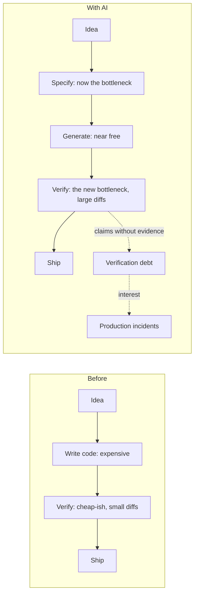

# Module 8.1 — ماذا يتغيّر حين يستطيع AI توليد الكود؟ (وما الذي لا يتغيّر)
## What Changes When AI Can Generate Code? — the cost of writing falls, the cost of verifying rises, specification becomes the core skill, and responsibility does not move

> **المستوى:** Level 8 | **الموقع:** [1 من 11]
> **السابق:** [Checkpoint 7](../level-7-advanced-systems/checkpoint-7.md) | **التالي:** [M8.2 — Vibe Coding vs Engineering](module-8.2-vibe-coding-vs-engineering.md)

---

## 1. المتطلبات
- [ ] CS مقابل SE؛ SDLC ولماذا الكود ليس أوّله — [L4-M4.0](../level-4-software-engineering-foundations/module-4.0-cs-vs-se.md), [L4-M4.1](../level-4-software-engineering-foundations/module-4.1-sdlc.md)
- [ ] المتطلبات ومعايير القبول — [L4-M4.2](../level-4-software-engineering-foundations/module-4.2-requirements.md), [L4-M4.3](../level-4-software-engineering-foundations/module-4.3-user-stories-acceptance-criteria.md)
- [ ] الاختبار: ما الذي يُثبته وما لا يُثبته — [L4-M4.11](../level-4-software-engineering-foundations/module-4.11-testing.md)
- [ ] مراجعة الكود كمنهج — [L6-M6.2](../level-6-professional-engineering/module-6.2-code-review.md)
- [ ] الدين التقني ومن يدفعه — [L4-M4.15](../level-4-software-engineering-foundations/module-4.15-tech-debt.md)
- [ ] أوضاع الفشل في الأنظمة (كي تعرف ما الذي يجب التحقّق منه) — [L7-M7.2](../level-7-advanced-systems/module-7.2-failure-timeouts-retries-idempotency.md), [L7-M7.5](../level-7-advanced-systems/module-7.5-reliability-patterns.md)

## 2. أهداف التعلّم
بعد هذه الوحدة ستستطيع:
1. وصف **التحوّل الاقتصادي**: كلفة كتابة الكود هبطت، كلفة **التحقّق** و**التحديد** ارتفعت نسبيًا — ولماذا هذا يُعيد توزيع وقت المهندس لا يُلغيه.
2. تعداد ما **لا يتغيّر**: المسؤولية، المتطلبات، التصميم، الأمن، التشغيل، الفهم — بأمثلة ملموسة.
3. التمييز بين **ادّعاء** (claim) و**دليل** (evidence) في مخرجات AI، وبناء "دفتر أدلّة" لأي تسليم.
4. شرح لماذا المهندس الذي لا يستطيع التحقّق يُصبح **أبطأ** مع AI لا أسرع (دين التحقّق المؤجّل).
5. تحديد المهارات التي ترتفع قيمتها (المواصفة، النمذجة، المراجعة، التصحيح، الحكم المعماري) وتلك التي تنخفض (الطباعة، حفظ الـ API، الكود القالبي).
6. صياغة "عقد العمل مع AI" الشخصي: ما تُفوّض، ما تُراجع، ما لا تُفوّض أبدًا (مدخل M8.10).

## 3. شرح للمبتدئ
وصلت إلى هذا المستوى بعد سبعة مستويات كتبت فيها كل شيء بيدك. هذا كان مقصودًا: **لا يمكنك التحقّق ممّا لا تفهمه، ولا يمكنك تفويض ما لا تستطيع التحقّق منه.** الآن — وفقط الآن — نُدخل الذكاء الاصطناعي، ونبدأ بالسؤال الصحيح: ما الذي تغيّر فعلًا؟

**ما تغيّر: ثمن الكتابة.** لعقود كانت كتابة الكود هي الجزء المرئي والمُكلِف من الهندسة؛ المهندس يُقاس بسطور يكتبها وبسرعة تحويل فكرة إلى دالّة. نماذج اللغة جعلت هذا الجزء شبه مجاني: وصف بلغة طبيعية → مئات الأسطر في ثوانٍ، بأي لغة، بأي إطار. هذا حقيقي وليس ضجيجًا. لكن انتبه إلى ما **لم** يُصبح مجانيًا: معرفة ما يجب بناؤه (المتطلبات، L4)، تقرير كيف يتّصل بما هو قائم (التصميم، L4/L7)، التأكّد من أنه يعمل فعلًا — ليس "يبدو أنه يعمل" (الاختبار والمراجعة، L4/L6)، التأكّد من أنه آمن (L5)، تشغيله ومراقبته وإصلاحه في الثالثة فجرًا (L5–L7)، وتحمّل المسؤولية حين يفشل. كل هذه كانت دائمًا الجزء الأكبر من العمل الهندسي الحقيقي — لكنها كانت مختبئة خلف الكتابة. الآن حين تختفي الكتابة، تظهر هي عارية، وتُصبح **هي** الوظيفة.

**القانون الاقتصادي للمستوى.** حين تنخفض كلفة إنتاج شيء، يرتفع **حجمه** — وبالتالي كلفة **فحصه**. مهندس كان يكتب 200 سطر يوميًا ويُراجع 200؛ الآن يستطيع توليد 2,000 سطر — فهل يستطيع مراجعة 2,000 سطر بنفس الجودة؟ لا. هنا الفخّ: الفرق بين ما يُولَّد وما يُتحقَّق منه هو **دين تحقّق** (verification debt) — وكالدين التقني (M4.15) تدفعه بفائدة في الإنتاج. الدراسات الصناعية الأولى على فرق تبنّت AI بلا منهج أظهرت ارتفاعًا في حجم الكود المدمج **و**في نسبة الكود المُعاد كتابته خلال أسابيع (churn) وفي عيوب الإنتاج — أي أن السرعة الظاهرية تحوّلت إلى بطء حقيقي لاحقًا. المهندس الذي يستطيع التحقّق بسرعة (لأنه يفهم الطبقات، ويكتب الاختبارات التي تختبر فعلًا، ويقرأ الكود كغريب) يُضاعف إنتاجه؛ والذي لا يستطيع يُضاعف دينه. **AI يُضاعف قدرة من يفهم، ويُضاعف أخطاء من لا يفهم.**

**ما يرتفع: المواصفة كمهارة أساسية.** حين يكتب النموذج ما تصفه، تُصبح جودة الوصف هي سقف جودة النتيجة. "ابنِ نظام تسجيل دخول" تُنتج شيئًا — لكن أيّ شيء؟ بجلسات أم JWT؟ أين تُخزَّن؟ ما سياسة كلمة المرور؟ ما يحدث بعد 5 محاولات فاشلة؟ هل يدعم إعادة التعيين؟ ما المسموح لمن (M5.3)؟ كل سؤال لم تُجب عنه **أجاب عنه النموذج نيابةً عنك** — بالإجابة الأكثر شيوعًا في بيانات تدريبه، لا الأصحّ لسياقك. وهذا هو تعريف المتطلّب الضمني الذي حذّرتك منه M4.2 — إلّا أنه الآن يُنفَّذ خلال ثوانٍ قبل أن تلاحظ. المواصفة الجيدة (M8.6) ليست "وصفًا أطول"؛ هي: متطلبات صريحة، قيود، معايير قبول قابلة للاختبار، متطلبات أمن، وما **خارج** النطاق. وهي بالضبط ما تدرّبت عليه في L4 — لكنها الآن مهارتك التي تُقاس يوميًا.

**ما يرتفع أيضًا: التحقّق كمنهج لا كشعور.** "جرّبته ويعمل" لم يكن يومًا تحقّقًا؛ مع AI يُصبح خطيرًا لأن الكود المولَّد **يبدو** محترفًا: أسماء جيدة، تعليقات، بنية مألوفة، وحتى اختبارات. هذا المظهر يُخفّض يقظة المراجع — وهو أثر نفسي موثّق (automation bias). لذلك يحتاج التحقّق إلى **سلسلة** إلزامية لا تعتمد على الانطباع (M8.7): يُترجم؟ الأنواع سليمة؟ الاختبارات تمرّ — و**هل تفشل حين يُكسر الكود**؟ السلوك يُطابق معايير القبول؟ الأمن (M5.4/5.5)؟ الأداء (M7.8)؟ المعمارية (M6.9)؟ ثم مراجعة بشرية كأنها كود غريب. والمبدأ الذي يحكم كل ذلك: **الادّعاء ليس دليلًا.** حين يقول النموذج "أضفت معالجة لكل الحالات الحدّية" فهذا ادّعاء؛ الدليل هو اختبار يُسمّي الحالات ويفشل حين تُحذف معالجتها. ستبني في §7 "دفتر أدلّة" يرفض أي تسليم فيه ادّعاءات بلا أدلّة.

**ما لا يتغيّر: المسؤولية.** حين يتسرّب بيانات مستخدم بسبب كود ولّده نموذج، لا يُقال "النموذج أخطأ". الاسم على الـ commit اسمك، والمراجعة مراجعتك، والنشر نشرك. هذا ليس تهديدًا؛ هو **تعريف المهنة**: المهندس هو من يتحمّل عواقب القرارات التقنية. وهذا يُحدّد الحدود الصلبة (M8.10): الهجرات، المصادقة، المدفوعات، الأمن، نشر الإنتاج، العمليات التدميرية، البنية التحتية — يمكن لـ AI أن **يقترح**، لكن الإنسان **يُقرّر** ويُوقّع، لأن الخطأ فيها لا يُستردّ.

**ما لا يتغيّر أيضًا: الفهم.** كل ما تعلّمته في L0–L7 لم يُصبح قديمًا؛ أصبح **أهمّ**. حين تقرأ كودًا مولَّدًا يستخدم `Date.now()` للترتيب عبر الخوادم (M7.1)، أو `Map` للجلسات (M7.1)، أو إعادة محاولة بلا idempotency (M7.2)، أو استعلامًا داخل حلقة (M7.8)، أو `req.user.id` بلا تحقّق تفويض (M5.3) — ستلتقطها خلال ثوانٍ، لأنك **عشت** عواقبها. من لم يعشها يرى كودًا نظيفًا. الفهم العميق هو ما يحوّل AI من مصدر مخاطر إلى مضاعف قوّة.

**ما ينخفض — بصدق.** حفظ تفاصيل الـ API وتركيب الجمل، الكود القالبي (CRUD، DTOs، إعداد المشاريع)، الترجمة بين اللغات والأطر، كتابة الاختبارات الروتينية لمواصفة واضحة، البحث في الوثائق، شرح كود قديم — كلها انخفضت قيمتها كمهارة بشرية. لا تُحارب هذا؛ **استثمره**: الوقت الذي كان يذهب للطباعة يذهب الآن إلى التحديد والتصميم والتحقّق — وإلى الأشياء التي لم يكن لها وقت: الاختبارات الشاملة، الوثائق الحيّة، تمارين الفشل، المراجعة العميقة.

**الصورة الكاملة.** المهندس في عصر AI ليس "من يكتب prompts"؛ هو **من يملك المشكلة من طرفها إلى طرفها** ويستخدم أدوات توليد قوية في المنتصف. حصّته من "الكتابة" انخفضت من 40% إلى 10%؛ حصّته من "الفهم والتحديد والتصميم والتحقّق والتشغيل" ارتفعت لتملأ الفراغ — وهذه كانت دائمًا الهندسة.

## 4. النموذج الذهني
**"AI يُخفّض ثمن الإجابات؛ لا يُخفّض ثمن الأسئلة الصحيحة ولا ثمن إثبات أن الإجابة صحيحة."** وزّع وقتك حيث الثمن ما زال مرتفعًا.

```text
                 قبل AI                                   مع AI (بمنهج)                    مع AI (بلا منهج)
  فهم/تحديد   ████████░░░░░░░░░░░░ 25%        ████████████████░░░░ 40%          ██░░░░░░░░░░░░░░░░░░ 5%
  تصميم       ██████░░░░░░░░░░░░░░ 15%        ████████░░░░░░░░░░░░ 20%          ░░░░░░░░░░░░░░░░░░░░ 0%
  كتابة       ████████████░░░░░░░░ 35%        ████░░░░░░░░░░░░░░░░ 10%          ████░░░░░░░░░░░░░░░░ 10%  ← "prompting"
  تحقّق/مراجعة ██████░░░░░░░░░░░░░░ 15%        ██████████░░░░░░░░░░ 25%          ██░░░░░░░░░░░░░░░░░░ 5%   ← "يبدو جيدًا"
  تشغيل/تعلّم  ████░░░░░░░░░░░░░░░░ 10%        ██░░░░░░░░░░░░░░░░░░ 5%           ████████████████░░░░ 80%  ← إصلاح الإنتاج
```

## 5. الرسم التوضيحي


```text
ادّعاء (claim)                              دليل (evidence) المطلوب
"الاختبارات تمرّ"                     ──▶    مخرجات الأمر + ملف الاختبار + إثبات أنها تفشل عند كسر الكود
"عالجتُ كل الحالات الحدّية"            ──▶    قائمة الحالات بالاسم + اختبار لكلٍّ
"آمن ضدّ SQL injection"               ──▶    استعلامات مُعلمَنة في الـ diff + اختبار بمدخل خبيث
"لا يُغيّر السلوك القائم"             ──▶    الاختبارات القديمة تمرّ بلا تعديل + diff لا يلمس الواجهات
"يتبع معمارية المشروع"                ──▶    arch-check أخضر (M6.9) + لا استيراد عبر الحدود
"الأداء مقبول"                         ──▶    قياس قبل/بعد (M7.8) أو استعلامات/طلب
```

## 6. مثال بسيط
```typescript
// نفس الطلب، نتيجتان مختلفتان جذريًا — الفرق كلّه في التحديد والتحقّق
// ✗ "أضف نقطة نهاية لحذف المستخدم"  → النموذج يُنتج DELETE /users/:id يحذف أي مستخدم لأي طالب (IDOR، M5.3)
// ✓ المواصفة:
const task = {
  goal: "DELETE /users/:id — حذف ناعم لحساب المستخدم",
  requirements: ["soft delete: deleted_at", "يُسمح فقط لصاحب الحساب أو admin", "يُلغي كل جلساته", "يُسجَّل في audit log"],
  constraints: ["لا تغيير في المخطّط إلا إضافة عمود nullable", "لا حذف فعلي لأي صف"],
  acceptance: ["AC1: المستخدم A يحذف نفسه → 204 و deleted_at مضبوط", "AC2: المستخدم A يحذف B → 403", "AC3: admin يحذف B → 204", "AC4: بعد الحذف، الجلسة القديمة → 401"],
  security: ["authZ قبل أي عمل", "لا تسريب وجود المستخدم في 403/404"],
  outOfScope: ["حذف البيانات المرتبطة (GDPR export) — تذكرة منفصلة"],
  evidenceRequired: ["اختبار لكل AC", "diff للهجرة", "مخرجات npm test"],
};
```

## 7. مثال كود
"دفتر الأدلّة" (evidence ledger): أداة صغيرة تُمثّل تسليمًا من AI كمجموعة **ادّعاءات**، وتطلب لكل ادّعاء نوع دليل محدّدًا، وتُحسب "دين التحقّق" = الادّعاءات بلا دليل. ثم حاسبة بسيطة تُظهر لماذا سعة المراجعة — لا سرعة التوليد — هي ما يُحدّد إنتاجية الفريق.

```text
m81-what-changes/
├─ src/evidence.ts
├─ src/throughput.ts
└─ src/what-changes.test.ts
```

```typescript
// src/evidence.ts
// الادّعاء ليس دليلًا: كل نوع ادّعاء يتطلّب أنواع أدلّة محدّدة، وإلا يُحسب دينًا
export type ClaimKind = "tests-pass" | "edge-cases-handled" | "secure" | "no-behavior-change" | "follows-architecture" | "performance-ok" | "docs-updated";
export type EvidenceKind = "command-output" | "test-file" | "mutation-check" | "named-cases" | "diff" | "static-check" | "measurement" | "doc-diff";

export interface Evidence { kind: EvidenceKind; ref: string }                 // ref: مسار/أمر/رابط
export interface Claim { kind: ClaimKind; text: string; evidence: Evidence[] }

// ما يكفي لإثبات كل ادّعاء — القائمة قابلة للتشديد، لا للتخفيف
export const REQUIRED: Record<ClaimKind, EvidenceKind[]> = {
  "tests-pass": ["command-output", "test-file", "mutation-check"],       // تمرّ + موجودة + تفشل عند الكسر
  "edge-cases-handled": ["named-cases", "test-file"],
  "secure": ["static-check", "test-file"],
  "no-behavior-change": ["command-output", "diff"],
  "follows-architecture": ["static-check"],
  "performance-ok": ["measurement"],
  "docs-updated": ["doc-diff"],
};

export interface LedgerReport { total: number; proven: Claim[]; debt: { claim: Claim; missing: EvidenceKind[] }[]; debtRatio: number }

export function audit(claims: Claim[]): LedgerReport {
  const proven: Claim[] = []; const debt: LedgerReport["debt"] = [];
  for (const c of claims) {
    const have = new Set(c.evidence.map((e) => e.kind));
    const missing = REQUIRED[c.kind].filter((k) => !have.has(k));
    if (missing.length === 0) proven.push(c); else debt.push({ claim: c, missing });
  }
  return { total: claims.length, proven, debt, debtRatio: claims.length ? debt.length / claims.length : 0 };
}

// قاعدة الدمج: لا يُدمج تسليم فيه دين تحقّق على ادّعاءات حرجة
const CRITICAL: ClaimKind[] = ["tests-pass", "secure", "no-behavior-change"];
export function mergeable(r: LedgerReport): { ok: boolean; reasons: string[] } {
  const reasons = r.debt.filter((d) => CRITICAL.includes(d.claim.kind)).map((d) => `"${d.claim.text}" lacks ${d.missing.join(", ")}`);
  return { ok: reasons.length === 0, reasons };
}
```

```typescript
// src/throughput.ts
// نموذج بسيط: الإنتاجية الفعلية = min(ما يُولَّد، ما يُتحقَّق منه)؛ الفائض دين يعود كأعطال
export interface TeamModel {
  linesGeneratedPerDay: number;      // ما يُنتجه AI + البشر
  linesVerifiedPerDay: number;       // سعة المراجعة الحقيقية (قراءة + اختبار + تشغيل)
  defectRateUnverified: number;      // عيوب لكل 100 سطر غير مُتحقَّق منه تصل الإنتاج
  defectRateVerified: number;        // عيوب لكل 100 سطر مُتحقَّق منه
  hoursPerProductionDefect: number;  // كلفة إصلاح عيب في الإنتاج (تحقيق + إصلاح + نشر + تواصل)
  hoursPerDay?: number;
}

export function simulateWeek(m: TeamModel) {
  const hours = m.hoursPerDay ?? 8;
  const verified = Math.min(m.linesGeneratedPerDay, m.linesVerifiedPerDay);
  const unverified = Math.max(0, m.linesGeneratedPerDay - m.linesVerifiedPerDay);
  const defectsPerDay = (verified / 100) * m.defectRateVerified + (unverified / 100) * m.defectRateUnverified;
  const firefightingHoursPerDay = defectsPerDay * m.hoursPerProductionDefect;
  const productiveHours = Math.max(0, hours - firefightingHoursPerDay);
  return {
    verifiedPerDay: verified, unverifiedPerDay: unverified, defectsPerWeek: defectsPerDay * 5,
    firefightingHoursPerWeek: firefightingHoursPerDay * 5,
    effectiveProductiveHoursPerWeek: productiveHours * 5,
    verdict: firefightingHoursPerDay >= hours ? "collapse: all time goes to production defects" : unverified > 0 ? "accumulating verification debt" : "sustainable",
  };
}
```

```typescript
// src/what-changes.test.ts
import { test } from "node:test";
import assert from "node:assert/strict";
import { audit, mergeable, type Claim } from "./evidence.ts";
import { simulateWeek } from "./throughput.ts";

test("evidence ledger: الادّعاءات بلا أدلّة تُحسب دينًا وتمنع الدمج؛ الأدلّة الكاملة تُجيزه", () => {
  const aiDelivery: Claim[] = [
    { kind: "tests-pass", text: "All tests pass", evidence: [{ kind: "command-output", ref: "npm test → 42 passed" }] },      // لا ملف ولا mutation
    { kind: "edge-cases-handled", text: "Handled all edge cases", evidence: [] },
    { kind: "secure", text: "Protected against injection", evidence: [{ kind: "static-check", ref: "semgrep: 0 findings" }] },
    { kind: "docs-updated", text: "README updated", evidence: [{ kind: "doc-diff", ref: "README.md +12 -3" }] },
  ];
  const r = audit(aiDelivery);
  assert.equal(r.proven.length, 1); assert.equal(r.debt.length, 3); assert.equal(r.debtRatio, 0.75);
  const m = mergeable(r);
  assert.equal(m.ok, false); assert.equal(m.reasons.length, 2);           // tests-pass و secure حرجان؛ edge-cases ليس في CRITICAL
  assert.match(m.reasons[0]!, /test-file, mutation-check/);
  // بعد أن طلبنا الأدلّة من النموذج/من أنفسنا
  aiDelivery[0]!.evidence.push({ kind: "test-file", ref: "src/users.test.ts" }, { kind: "mutation-check", ref: "break authZ → 3 tests fail" });
  aiDelivery[1]!.evidence.push({ kind: "named-cases", ref: "empty id, self-delete, admin, already deleted" }, { kind: "test-file", ref: "src/users.test.ts" });
  aiDelivery[2]!.evidence.push({ kind: "test-file", ref: "src/users.security.test.ts" });
  const r2 = audit(aiDelivery);
  assert.equal(r2.debt.length, 0); assert.equal(mergeable(r2).ok, true);
});

test("throughput: مضاعفة التوليد بلا مضاعفة التحقّق تُنتج دينًا ثم انهيارًا", () => {
  const base = { linesVerifiedPerDay: 300, defectRateUnverified: 0.3, defectRateVerified: 0.05, hoursPerProductionDefect: 3 };
  const human = simulateWeek({ ...base, linesGeneratedPerDay: 250 });
  const aiNoMethod = simulateWeek({ ...base, linesGeneratedPerDay: 2_000 });
  const aiWithMethod = simulateWeek({ ...base, linesGeneratedPerDay: 2_000, linesVerifiedPerDay: 1_800 });
  assert.equal(human.verdict, "sustainable");
  assert.equal(aiNoMethod.verdict, "collapse: all time goes to production defects");
  assert.ok(aiNoMethod.defectsPerWeek > human.defectsPerWeek * 20, `defects ${aiNoMethod.defectsPerWeek} vs ${human.defectsPerWeek}`);
  assert.equal(aiWithMethod.verdict, "accumulating verification debt");  // أفضل، لكن 200 سطر/يوم ما زالت بلا تحقّق
  const disciplined = simulateWeek({ ...base, linesGeneratedPerDay: 1_000, linesVerifiedPerDay: 1_000 });
  assert.equal(disciplined.verdict, "sustainable");
  assert.ok(disciplined.effectiveProductiveHoursPerWeek > aiNoMethod.effectiveProductiveHoursPerWeek);
  // الدرس: الإنتاجية الحقيقية = ما تستطيع التحقّق منه، لا ما تستطيع توليده
  assert.ok(disciplined.verifiedPerDay > human.verifiedPerDay * 3);
});
```

**تشغيل:** `npx tsx --test src/*.test.ts`. الأرقام في `throughput.ts` افتراضات تعليمية — استبدلها بأرقام فريقك (سطور مدمجة، عيوب إنتاج شهرية، ساعات لكل عيب) وسترى أين يقع فريقك على المنحنى.

---

## 8. مثال من العالم الحقيقي
شركة ناشئة بثلاثة مهندسين تبنّت وكيل برمجة بحماس: خلال شهرين تضاعف عدد الـ PRs ثلاث مرات، وكلٌّ منها "مع اختبارات". في الشهر الثالث: ثلاث حوادث إنتاج أسبوعيًا، وملف `utils` فيه أربع دوال لتنسيق التاريخ، وطبقة "repository" مجرّدة فوق ORM فوق SQL لا يستخدمها إلا ملف واحد. التحقيق أظهر أن المراجعات كانت تستغرق 4 دقائق للـ PR من 600 سطر، وأن 30% من "الاختبارات" لا تفشل حين يُحذف الكود الذي تختبره (تختبر الـ mock). أعادوا التوازن بقاعدتين فقط: (1) لا PR مولَّد يتجاوز 300 سطر، (2) لكل ادّعاء في وصف الـ PR دليل مُرفق (دفتر الأدلّة §7 حرفيًا كقالب). الإنتاجية الظاهرية انخفضت 40%، وحوادث الإنتاج اختفت تقريبًا، والإنتاجية **الفعلية** (ميزات تبقى في الإنتاج بلا إعادة عمل) ارتفعت عن الفترة البشرية بـ 2×. تعليق المؤسّس: "كنّا نقيس التوليد ونظنّه إنجازًا".

## 9. مثال من الإنتاج
فريق منصّة في شركة كبيرة قاس أثر أدوات AI على 200 مهندس لستّة أشهر بمؤشّرات DORA (M5.12): تكرار النشر ارتفع 25%؛ زمن التغيير انخفض 20%؛ لكن **نسبة فشل التغيير** ارتفعت 30% و**churn الكود** (سطور تُعاد كتابتها خلال أسبوعين) تضاعف. الفارق الحاسم ظهر عند تقسيم المهندسين: من كانوا أصلًا أقوياء في الاختبار والمراجعة حصلوا على كل المكاسب بلا الخسائر؛ من كانوا يعتمدون على "يبدو أنه يعمل" حصلوا على الخسائر بلا مكاسب. قرار الشركة لم يكن تقييد الأدوات بل **رفع الحدّ الأدنى للتحقّق للجميع**: اختبارات طفرة إلزامية على الوحدات الحرجة، سقف لحجم الـ PR، ودفتر أدلّة في قالب الـ PR. بعد ربع آخر عادت نسبة فشل التغيير إلى ما دون خطّ الأساس مع احتفاظهم بالسرعة.

---

## 10. مفاهيم خاطئة شائعة
1. **"AI سيُغني عن المهندسين."** يُغني عن **الطباعة**؛ التحديد والتصميم والتحقّق والتشغيل والمسؤولية بقيت — وصارت أوضح.
2. **"الكود المولَّد الذي يبدو نظيفًا هو كود صحيح."** المظهر الاحترافي يُخفّض يقظتك؛ هذا بالضبط سبب الحاجة إلى سلسلة تحقّق لا تعتمد على الانطباع.
3. **"سأتعلّم الأساسيات لاحقًا؛ AI يكتب الآن."** بلا أساسيات لا تستطيع التحقّق، وبلا تحقّق أنت تُراكم دينًا لا تراه.
4. **"الاختبارات التي كتبها النموذج تُثبت الصحّة."** تُثبتها فقط إن كانت تفشل حين يُكسر الكود؛ كثير منها يختبر الـ mock.
5. **"السرعة الظاهرية = إنتاجية."** الإنتاجية = ميزات تبقى في الإنتاج دون إعادة عمل؛ قِس churn ونسبة فشل التغيير.
6. **"المسؤولية مشتركة مع الأداة."** الأداة لا تُوقّع ولا تُستدعى في الثالثة فجرًا؛ المسؤولية لا تتوزّع.

## 11. أخطاء شائعة
1. قبول "الاختبارات تمرّ" دون سؤال "هل تفشل حين أكسر الكود؟"
2. مراجعة PR من 800 سطر مولَّد في 5 دقائق لأنه "يبدو جيدًا".
3. تفويض مهمّة بجملة واحدة وقبول الافتراضات التي ملأها النموذج دون قراءتها.
4. ترك النموذج يُقرّر في الحدود الصلبة (هجرة، مصادقة، دفع) لأنه "اقترح حلًّا كاملًا".
5. قياس الإنتاجية بالسطور أو عدد الـ PRs بدل churn وفشل التغيير.
6. التوقّف عن فهم الكود الذي تملكه ("النموذج يشرحه لي عند الحاجة") → عجز في الحادثة.
7. السماح لتسارع التوليد بتجاوز سعة المراجعة دون تغيير العملية.

## 12. تمرين تصحيح
فريق يشكو: "منذ تبنّينا AI، كل sprint ينتهي بميزات 'جاهزة' ثم نقضي السبرنت التالي في إصلاحها."
1. **دليل:** churn خلال 14 يومًا تضاعف؛ متوسط زمن مراجعة الـ PR انخفض من 25 دقيقة إلى 6 بينما حجمه تضاعف؛ 30% من الاختبارات الجديدة تمرّ حتى بعد حذف جسم الدالّة؛ أوصاف الـ PR مليئة بـ "handles all edge cases" بلا قائمة.
2. **فرضية:** دين تحقّق — التوليد تجاوز سعة التحقّق، والادّعاءات حلّت محلّ الأدلّة.
3. **تجربة:** خُذ 10 PRs مولَّدة مدمجة، طبّق `audit()` على ادّعاءاتها، وشغّل اختبار طفرة بسيطًا (احذف جسم دالّة) — سجّل نسبة الاختبارات التي لا تفشل.
4. **الإصلاح:** سقف حجم PR، دفتر أدلّة إلزامي في القالب، فحص طفرة على الوحدات الحرجة في CI، وتخصيص وقت مراجعة متناسب مع الحجم (قاعدة: ≥ 1 دقيقة لكل 10 أسطر مولَّدة).
5. **قِس بعدها:** churn ونسبة فشل التغيير بعد شهر — لا عدد الـ PRs.

## 13. تمرين معماري
اكتب "عقد العمل مع AI" لفريق Project 6/7 كصفحة ACTRR: (1) **ما يُفوَّض بحرّية** (كود قالبي، اختبارات لمواصفة مكتوبة، ترجمة، شرح كود قديم، توليد سيناريوهات فشل)؛ (2) **ما يُفوَّض مع تحقّق مُشدَّد** (منطق أعمال، استعلامات، تكامل خارجي) ومعايير التحقّق لكلٍّ؛ (3) **ما لا يُفوَّض قراره أبدًا** (الحدود الصلبة) وكيف يُراجَع اقتراح AI فيها؛ (4) سعة التحقّق للفريق بالأرقام وسقف التوليد المقابل؛ (5) المؤشّرات التي تُراقب الصحّة (churn، فشل التغيير، نسبة الأدلّة/الادّعاءات، نسبة الاختبارات الطافرة)؛ (6) ماذا يحدث حين يتجاوز مؤشّر عتبته. هذا العقد سيتطوّر عبر M8.6–8.10 ويُصبح سياسة Project 8.

## 14. الصلة بعصر AI
هذه الوحدة **هي** الصلة: كل ما يليها يُفصّل كيف تحافظ على الهندسة حين تُصبح الكتابة مجانية. القاعدة التي تحملها معك: **اسأل النموذج أسئلة تُنتج أدلّة لا طمأنة** — "ما الدليل على أن هذا يعمل؟"، "أي افتراض وضعته نيابةً عنّي؟"، "ما الحالات التي لم تختبرها؟"، "كيف أكسر هذا؟"، "ما الثغرة الأمنية المحتملة هنا؟" — بدل "هل هذا صحيح؟" التي تُجاب دائمًا بنعم. والمهارة التي تُميّزك ليست البراعة في الصياغة بل **القدرة على رفض تسليم يبدو ممتازًا لأن أدلّته ناقصة**.

## 15. ما يجب إتقانه (MUST MASTER)
- 🔴 التحوّل الاقتصادي (كتابة ↓، تحديد وتحقّق ↑) ودين التحقّق؛ ادّعاء مقابل دليل وأنواع الأدلّة؛ ما لا يتغيّر (المسؤولية، الفهم، المتطلبات، الأمن، التشغيل)؛ "AI يُضاعف قدرة من يفهم"؛ قياس الإنتاجية بـ churn وفشل التغيير لا بالسطور.

## 16. ما يجب فهمه (SHOULD UNDERSTAND)
- 🟠 automation bias وكيف تُقاومه بنيويًا؛ اختبارات الطفرة كمقياس لجودة الاختبارات؛ توزيع الوقت الجديد؛ المهارات التي تنخفض قيمتها وكيف تستثمر الوقت المحرَّر.

## 17. ما يمكن تأجيله (DEFER)
- ⚪ الاقتصاد الكلّي لسوق العمل الهندسي؛ النقاشات حول "نهاية البرمجة"؛ القياس الأكاديمي الدقيق لأثر الأدوات.

## 18. الخلاصة
1. الكتابة صارت رخيصة؛ التحديد والتحقّق صارا عنق الزجاجة — وهما الهندسة.
2. ما يُولَّد فوق ما يُتحقَّق منه دين بفائدة تُدفع في الإنتاج.
3. الادّعاء ليس دليلًا: لكل ادّعاء نوع دليل محدّد، والتسليم بلا أدلّة يُرفض.
4. المسؤولية والفهم والمتطلبات والأمن والتشغيل لا تتغيّر — بل تزداد وضوحًا.
5. من يفهم الطبقات يتحقّق بسرعة ويُضاعف إنتاجه؛ من لا يفهم يُضاعف أخطاءه.
6. قِس الإنتاجية بما يبقى في الإنتاج، واضبط التوليد على سعة التحقّق.

## 19. مراجع رسمية
- Fred Brooks — No Silver Bullet: Essence and Accidents of Software Engineering (1986): https://www.cs.unc.edu/techreports/86-020.pdf
- Peter Naur — Programming as Theory Building (1985): https://pages.cs.wisc.edu/~remzi/Naur.pdf
- GitClear — Coding on Copilot: 2023 Data Shows Downward Pressure on Code Quality (churn study): https://www.gitclear.com/coding_on_copilot_data_shows_ais_downward_pressure_on_code_quality
- DORA — Accelerate State of DevOps Report 2024 (AI adoption findings): https://dora.dev/research/2024/dora-report/
- Google Research — Measuring the impact of AI on software developer productivity (RCT, 2024): https://arxiv.org/abs/2410.12944
- METR — Measuring the Impact of Early-2025 AI on Experienced Open-Source Developer Productivity: https://metr.org/blog/2025-07-10-early-2025-ai-experienced-os-dev-study/
- Parasuraman & Manzey — Complacency and Bias in Human Use of Automation (2010): https://journals.sagepub.com/doi/10.1177/0018720810376055
- Stryker — Mutation testing explained: https://stryker-mutator.io/docs/

## المصطلحات
| العربية | English |
|---|---|
| توليد الكود | Code generation |
| كلفة التحقّق | Verification cost |
| دين التحقّق | Verification debt |
| المواصفة | Specification |
| ادّعاء | Claim |
| دليل | Evidence |
| دفتر الأدلّة | Evidence ledger |
| انحياز الأتمتة | Automation bias |
| إعادة كتابة الكود (تقلّب) | Code churn |
| نسبة فشل التغيير | Change failure rate |
| اختبار الطفرة | Mutation testing |
| الحدود الصلبة | Hard gates |
| مضاعف القوّة | Force multiplier |
| ملكية المشكلة | Problem ownership |
| متطلّب ضمني | Implicit requirement |
