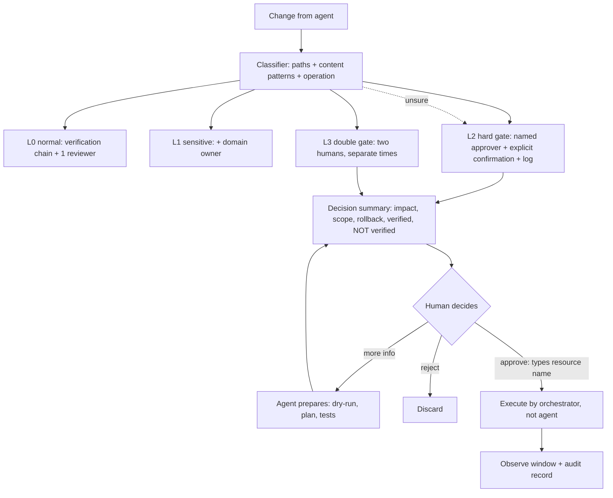

# Module 8.10 — الإنسان في الحلقة والحدود الصلبة
## Human-in-the-Loop: hard gates — DB migrations, auth, payments, security, production deploy, destructive ops, infra changes — and approval workflows that actually work

> **المستوى:** Level 8 | **الموقع:** [10 من 11]
> **السابق:** [M8.9 — AI Security](module-8.9-ai-security.md) | **التالي:** [M8.11 — The AI-Era Engineering Loop](module-8.11-ai-era-engineering-loop.md)

---

## 1. المتطلبات
- [ ] نقاط اللا رجوع في SDLC ومصفوفة الملكية — [L8-M8.3](module-8.3-ai-assisted-sdlc.md)
- [ ] مستويات الاستقلالية وسياسة allow/ask/deny — [L8-M8.4](module-8.4-ai-agents.md), [L8-M8.9](module-8.9-ai-security.md)
- [ ] الترحيلات والمعاملات وما لا يمكن التراجع عنه في قواعد البيانات — [L3-M3.14](../level-3-core-computer-science/module-3.14-transactions-acid.md), [L5-M5.10](../level-5-building-real-software/module-5.10-deployment.md)
- [ ] المصادقة والتفويض والمدفوعات كمسارات حسّاسة — [L5-M5.2](../level-5-building-real-software/module-5.2-authentication.md), [L5-M5.3](../level-5-building-real-software/module-5.3-authorization.md)
- [ ] CI/CD، البيئات، والنشر التدريجي — [L5-M5.12](../level-5-building-real-software/module-5.12-ci-cd.md)
- [ ] الاستجابة للحوادث ومن يُقرّر — [L6-M6.7](../level-6-professional-engineering/module-6.7-incident-response.md)

## 2. أهداف التعلّم
بعد هذه الوحدة ستستطيع:
1. تعريف **الحدّ الصلب (hard gate)**: فعل لا يُنفَّذ أبدًا دون قرار بشري **مُسمّى** مهما كانت ثقة النموذج أو نتائج الفحوص — وتمييزه عن "المراجعة العادية".
2. تبرير قائمة الحدود الصلبة السبعة (ترحيلات DB، مصادقة/تفويض، مدفوعات، إعدادات أمن، نشر إنتاجي، عمليات مدمّرة، بنية تحتية) بمعيار واحد: **تكلفة التراجع × نطاق الأثر × قابلية الكشف المتأخّر**.
3. تصميم **تدفّق موافقة** فعّال: من يُوافق، على ماذا بالضبط (ملخّص قابل للفهم لا diff خام)، بأي معلومات (أثر، تراجع، اختبار)، وكيف يُسجَّل — وتجنّب "إرهاق الموافقات" الذي يُحوّل الحدّ إلى ختم.
4. تصنيف أي تغيير آليًا إلى **مستوى بوّابة** بحسب المسارات والأنماط ونوع العملية، مع تصعيد عند الشكّ.
5. تطبيق قاعدة **"الوكيل يُعدّ، الإنسان يُطلق"** على العمليات: الوكيل يُولّد الترحيل وخطّة التراجع والـ dry-run؛ الإنسان يقرأ ويضغط.
6. التمييز بين **موافقة شكلية** (ختم على ما لا يُفهم) و**موافقة حقيقية** (قرار مبنيّ على معلومات كافية) — وبناء النظام بحيث تكون الثانية أسهل من الأولى.

## 3. شرح للمبتدئ
كل ما سبق في L8 يُقلّل احتمال الخطأ: سياق أفضل، موجز أدقّ، تحقّق أعمق، سياسة أضيق. لكن الاحتمال لا يصل إلى صفر أبدًا — والسؤال الهندسي الذي تعلّمته في L7 هو: **حين يحدث الخطأ، كم يُكلّف التراجع عنه؟** معظم الأخطاء رخيصة التراجع: كود سيّئ في فرع يُحذف؛ PR يُرفض؛ اختبار يفشل. لكن بعض الأفعال **لا تراجع عنها** أو تراجعها باهظ: جدول حُذف، أموال خرجت، بيانات مستخدمين سُرّبت، إنتاج انقطع عن آلاف الناس، بنية تحتية دُمّرت. لهذه الأفعال وحدها نضع **حدًّا صلبًا**: لا يُنفَّذ إلا بقرار إنسان مُسمّى، بغضّ النظر عن مدى ذكاء النموذج أو نجاح الفحوص.

**معيار الحدّ الصلب.** لا تضع حدودًا صلبة على كل شيء — فتُصبح كلّها أختامًا. ضعها حيث يجتمع ثلاثة:
1. **تكلفة التراجع عالية أو مستحيلة** (بيانات محذوفة، أموال خرجت، سرّ انتشر).
2. **نطاق الأثر واسع** (كل المستخدمين، كل الجداول، كل الخدمات).
3. **الكشف قد يتأخّر** (الثغرة في التفويض لا تُلاحَظ حتى تُستغلّ؛ العمود المحذوف لا يصرخ حتى يُستعلم).
بهذا المعيار تنتج القائمة السبعة القياسية:

| الحدّ الصلب | لماذا (التراجع / النطاق / التأخّر) | ما يبقى للوكيل | ما يُطلب من الإنسان |
|---|---|---|---|
| **ترحيلات قاعدة البيانات** | حذف عمود/جدول لا يُستعاد؛ قفل جدول كبير يُسقط الإنتاج | كتابة الترحيل + التراجع + تقدير الأثر + dry-run على نسخة | قراءة SQL كاملًا؛ التحقّق من التراجع؛ وقت التنفيذ |
| **المصادقة والتفويض** | ثغرة صامتة تُكشف بعد الاستغلال؛ تمسّ كل مستخدم | المسوّدة + اختبارات سلبية | مراجعة سطر بسطر + مراجع ثانٍ لديه خلفية أمن |
| **المدفوعات والمال** | أموال خرجت لا تعود؛ تنظيمي | المنطق + اختبارات الحدود + idempotency | مراجعة مزدوجة؛ اختبار في sandbox المزوّد؛ حدود مبالغ |
| **إعدادات الأمن** (CORS, CSP, TLS, أسرار، أذونات IAM) | سطر واحد يفتح كل شيء؛ لا يصرخ | اقتراح التغيير مع الأثر | مالك الأمن يُوافق |
| **النشر إلى الإنتاج** | يمسّ كل المستخدمين فورًا | تجهيز الإصدار، ملاحظات، خطّة تراجع | قرار النشر + مراقبة أول 15 دقيقة (M5.10 canary) |
| **العمليات المدمّرة** (حذف بيانات/فروع/موارد، `--force`) | لا تراجع | لا شيء — يقترح الأمر ويشرح الأثر | ينفّذ بنفسه بعد قراءة الأثر |
| **تغييرات البنية التحتية** (Terraform, K8s, DNS, شبكات) | تدمير موارد؛ انقطاع واسع؛ تكلفة مالية | الخطّة (`plan`) وشرحها | يقرأ الـ plan ويُطبّق (`apply`) |

لاحظ العمود الثالث: الحدّ الصلب **لا يعني إبعاد الوكيل**؛ يعني أن الوكيل يُعدّ كل شيء — بما فيه خطّة التراجع والـ dry-run — والإنسان **يُطلق**. "الوكيل يُعدّ، الإنسان يُطلق" تُحافظ على السرعة وتضع القرار الذي لا رجعة فيه في يد من يتحمّله.

**تصنيف التغيير آليًا.** لا تعتمد على أن أحدًا "سيُلاحظ" أن الـ PR يلمس المدفوعات. صنّف آليًا بثلاثة مصادر: (1) **المسارات** (`db/migrations/**`, `src/auth/**`, `src/payments/**`, `infra/**`, `.github/workflows/**`, ملفات الأسرار/الإعداد الأمني)؛ (2) **الأنماط في المحتوى** (`DROP|ALTER TABLE|DELETE FROM`, `cors(`, `jwt.verify`, `stripe.`, `iam:`, `--force`); (3) **نوع العملية** (نشر، تنفيذ أمر، تعديل بيانات). والناتج مستوى: `L0` عادي (مراجعة واحدة)، `L1` حسّاس (مراجعة + مالك المجال)، `L2` حدّ صلب (موافقة مُسمّاة + تأكيد صريح + سجلّ)، `L3` حدّ صلب مزدوج (شخصان؛ للمدفوعات والعمليات المدمّرة على الإنتاج). **عند الشكّ صعّد** — تكلفة موافقة زائدة دقائق؛ تكلفة حدّ مفقود حادثة.

**تدفّق الموافقة الذي يعمل.** أكبر خطر على الحدّ الصلب ليس تجاوزه بل **تحوّله إلى ختم**: 40 طلب موافقة يوميًا، كلّها "يبدو جيدًا"، فيضغط الموافق دون قراءة (إرهاق الموافقات — نفس آلية إشباع المراجعة M6.2). التصميم المضادّ:
- **قلّة**: الحدود الصلبة فقط تحتاج موافقة مُسمّاة؛ الباقي يمرّ بالمراجعة العادية. إن تجاوزت الموافقات 3–5 يوميًا للشخص فالتصنيف واسع جدًا.
- **ملخّص قابل للقرار** لا diff خام: ماذا سيحدث (بلغة الأثر: "يحذف عمود `legacy_email` من 2.1M صفّ؛ لا تراجع بعد التنفيذ")، على ماذا (نطاق)، كيف نتراجع (خطّة مُختبَرة أم لا)، ما الذي فُحص (سجلّ التحقّق M8.7)، وما الذي **لم** يُفحص.
- **تأكيد صريح متناسب**: للـ L2 كتابة اسم المورد ("اكتب `orders` للتأكيد")؛ للـ L3 شخصان مختلفان في وقتين. لا زرّ أخضر واحد.
- **سياق زمني**: لا موافقات مدمّرة الجمعة مساءً أو أثناء حادثة؛ نافذة تغيير.
- **سجلّ**: من، متى، على أي ملخّص بالضبط (هاش)، وبأي معلومات — فهو ما يُقرأ في الـ postmortem.
- **إمكانية الرفض بلا تكلفة اجتماعية**: "أحتاج مزيدًا من المعلومات" زرّ من الدرجة الأولى، لا فشل.

**ما الذي لا يحتاج حدًّا صلبًا؟** معظم الكود: منطق أعمال غير مالي، واجهات، تحسينات، اختبارات، وثائق، إعادة هيكلة داخل وحدة. هذه تمرّ بسلسلة التحقّق والمراجعة العادية (M8.7). وضع حدّ صلب عليها يُضعف الحدود الحقيقية.

**الوكيل أثناء الحوادث — الحالة الخاصّة.** الإغراء الأكبر للأتمتة الكاملة هو الساعة الثالثة فجرًا: "دع الوكيل يُصلح". M8.4 §8 أراك النتيجة. القاعدة: أثناء الحادثة الوكيل **قارئ ومُقترح** (سجلّات، مقاييس، فرضيات، أوامر جاهزة مع أثرها)، وقائد الحادثة البشري **يُنفّذ** (M6.7). لأن الحادثة هي بالضبط اللحظة التي يكون فيها السياق ناقصًا والضغط عاليًا — أسوأ ظروف لقرار لا رجعة فيه بواسطة نظام يُحسّن "إنهاء المهمّة".

## 4. النموذج الذهني
**"ثقة النموذج لا تُغيّر تكلفة التراجع."** الحدّ الصلب يُوضع بحسب ما يحدث إن أخطأ الفعل، لا بحسب احتمال الخطأ. الوكيل يُعدّ كل شيء؛ الإنسان المُسمّى يُطلق ما لا رجعة فيه.

```text
                         تكلفة التراجع
                              ▲
   L3 مزدوج ┆ payments/prod  │  destructive ops on prod · infra destroy
   L2 صلب   ┆ migrations ·   │  auth/authz · security config · prod deploy
   L1 حسّاس ┆ schema read ·  │  shared libs · public API shape
   L0 عادي  ┆ feature code · │  tests · docs · refactor-in-module
            └────────────────┼──────────────────────────────────▶ نطاق الأثر × تأخّر الكشف
   الوكيل:  يُعدّ (diff, plan, rollback, dry-run, impact)   │   الإنسان: يقرأ الملخّص، يُؤكّد صراحةً، يُطلق، يُسجَّل
```

## 5. الرسم التوضيحي


## 6. مثال بسيط
```typescript
// الوكيل أنهى مهمّة "أزل الحقل legacy_email" — ثلاثة ملفات:
//   src/users/user.ts            (−3 سطور)                     → L0
//   src/users/user.test.ts       (محمي؛ تعديل اختبار)            → ask (M8.4)
//   db/migrations/0051_drop_legacy_email.sql                     → L2 HARD GATE
//
// ما يراه الموافق (ليس الـ diff الخام):
// ┌─ APPROVAL REQUEST · L2 · db migration ─────────────────────────────────────────┐
// │ What:     ALTER TABLE users DROP COLUMN legacy_email                            │
// │ Impact:   2,143,900 rows · column irrecoverable after execution · lock: ~0.3 s  │
// │           (PG 15 drop column = metadata only; verified on staging copy)         │
// │ Rollback: NONE (data loss). Mitigation: snapshot taken 10:42 UTC (retained 7d). │
// │ Verified: chain 8/8 ✓ · no reads of legacy_email in repo (grep + types) ✓       │
// │           · analytics warehouse still reads it ✗ (NOT verified — external)      │
// │ Window:   allowed Tue–Thu 09:00–16:00 · now: Tue 11:05 ✓                        │
// │ Confirm by typing the table name: [________]   Approver: sara (DB owner)        │
// └──────────────────────────────────────────────────────────────────────────────────┘
// سارة قرأت "analytics warehouse still reads it ✗" → رفضت بـ "more info" → تبيّن أن ETL ليلي يقرأ العمود.
// الحدّ الصلب لم يمنع "خطأ النموذج"؛ منع خطأ لم يكن أحد — لا النموذج ولا المؤلّف — يعرفه. هذا دوره.
```

## 7. مثال كود
محرّك حدود صلبة: (1) **مُصنّف تغييرات** يأخذ قائمة ملفات مُعدَّلة مع مقتطفات محتوى ونوع العملية ويُخرج المستوى والأسباب (مسارات، أنماط، عمليات) مع تصعيد عند الشكّ؛ (2) **تدفّق موافقة** بحالة: طلب ← ملخّص قرار (يرفض الطلب بلا خطّة تراجع أو بلا قسم "لم يُفحص") ← موافقات مُسمّاة (L3 يحتاج شخصين مختلفين، لا المؤلّف) ← تأكيد صريح باسم المورد ← نافذة زمنية ← تنفيذ بواسطة الـ orchestrator ← سجلّ تدقيق بهاش الملخّص؛ (3) **كاشف إرهاق**: يُحذّر حين يتجاوز عدد الموافقات لشخص في اليوم حدًّا أو حين يُوافق أسرع من زمن قراءة الملخّص.

```text
m810-human-in-the-loop/
├─ src/gates.ts
└─ src/gates.test.ts
```

```typescript
// src/gates.ts
// مُصنّف حدود صلبة + تدفّق موافقة + كاشف إرهاق
export type GateLevel = 0 | 1 | 2 | 3;
export interface ChangedFile { path: string; content?: string; deleted?: boolean }
export type Operation = "merge" | "deploy:staging" | "deploy:production" | "run:command" | "data:write" | "data:delete" | "infra:apply";
export interface Classification { level: GateLevel; reasons: string[]; domains: string[] }

const PATH_RULES: { re: RegExp; level: GateLevel; domain: string }[] = [
  { re: /(^|\/)(db\/)?migrations\//, level: 2, domain: "db-migration" },
  { re: /(^|\/)(auth|authn|authz|session|permissions?|rbac)\//, level: 2, domain: "auth" },
  { re: /(^|\/)(payments?|billing|checkout|refunds?|ledger)\//, level: 3, domain: "payments" },
  { re: /(^|\/)(infra|terraform|k8s|kubernetes|helm|pulumi)\/|\.tf$|(^|\/)Dockerfile$/, level: 2, domain: "infra" },
  { re: /(^|\/)\.github\/workflows\/|(^|\/)(Jenkinsfile|\.gitlab-ci\.yml)$/, level: 2, domain: "ci-cd" },
  { re: /(^|\/)(security|cors|csp|tls|iam|secrets?)[\w.-]*\.(ts|js|json|ya?ml)$|(^|\/)\.env/, level: 2, domain: "security-config" },
  { re: /(^|\/)(shared|packages\/common|libs?)\//, level: 1, domain: "shared-lib" },
  { re: /(^|\/)schema\.(prisma|sql|graphql)$|(^|\/)openapi\.(ya?ml|json)$/, level: 1, domain: "public-contract" },
];
const CONTENT_RULES: { re: RegExp; level: GateLevel; domain: string; why: string }[] = [
  { re: /\b(DROP|TRUNCATE)\s+(TABLE|COLUMN|DATABASE|SCHEMA)\b|ALTER\s+TABLE[^;]*\bDROP\b/i, level: 3, domain: "db-migration", why: "irreversible schema change" },
  { re: /\bDELETE\s+FROM\b(?![\s\S]{0,80}\bWHERE\b)/i, level: 3, domain: "data", why: "DELETE without WHERE" },
  { re: /\bALTER\s+TABLE\b|\bCREATE\s+INDEX\b(?!\s+CONCURRENTLY)/i, level: 2, domain: "db-migration", why: "locking DDL" },
  { re: /\bjwt\.(verify|sign)\b|\bbcrypt\.|argon2|passport\.|\bcompareSync\b|timingSafeEqual/, level: 2, domain: "auth", why: "credential/token handling" },
  { re: /\bstripe\.|\bcharge\(|\brefund\(|\bpayout\(|amountMinor|currency/i, level: 3, domain: "payments", why: "money movement" },
  { re: /cors\(|Content-Security-Policy|Strict-Transport-Security|\biam:|AssumeRole|0\.0\.0\.0\/0/i, level: 2, domain: "security-config", why: "security boundary configuration" },
  { re: /--force\b|-f\b.*\brm\b|\brm\s+-rf\b|terraform\s+destroy|kubectl\s+delete/, level: 3, domain: "destructive", why: "destructive command" },
];
const OP_LEVEL: Record<Operation, GateLevel> = { merge: 0, "deploy:staging": 1, "deploy:production": 2, "run:command": 1, "data:write": 1, "data:delete": 3, "infra:apply": 2 };

export function classify(files: ChangedFile[], operation: Operation = "merge"): Classification {
  let level: GateLevel = OP_LEVEL[operation]; const reasons: string[] = []; const domains = new Set<string>();
  if (level > 0) reasons.push(`operation ${operation} → L${level}`);
  const bump = (l: GateLevel, why: string, d: string) => { if (l > level) level = l; reasons.push(why); domains.add(d); };
  for (const f of files) {
    for (const r of PATH_RULES) if (r.re.test(f.path)) bump(r.level, `${f.path} matches ${r.domain} path → L${r.level}`, r.domain);
    if (f.content) for (const r of CONTENT_RULES) if (r.re.test(f.content)) bump(r.level, `${f.path}: ${r.why} → L${r.level}`, r.domain);
    if (f.deleted && /(migrations|auth|payments|infra)\//.test(f.path)) bump(3, `${f.path} deleted in a gated area → L3`, "destructive");
  }
  // عند الشكّ صعّد: ملفات بلا محتوى معروف في مناطق حسّاسة
  if (files.some((f) => !f.content && !f.deleted && /\.(sql|tf)$/.test(f.path)) && level < 2) bump(2, "unknown content in .sql/.tf → escalate", "unknown");
  return { level, reasons, domains: [...domains] };
}

export interface DecisionSummary { what: string; impact: string; scope: string; rollback: string; verified: string[]; notVerified: string[]; resourceName: string }
export interface Approval { by: string; at: number; typedConfirmation: string; readMs: number }
export interface GateRequest { id: string; author: string; classification: Classification; summary: DecisionSummary; approvals: Approval[]; status: "pending" | "approved" | "rejected" | "executed" | "needs-info"; log: string[] }
export interface Window { allowedDays: number[]; startHour: number; endHour: number }   // UTC

export class GateWorkflow {
  private readonly requests = new Map<string, GateRequest>();
  constructor(private readonly window: Window, private readonly now: () => number = Date.now, private readonly minReadMs = 20_000) {}

  open(id: string, author: string, classification: Classification, summary: DecisionSummary): GateRequest {
    if (classification.level < 2) throw new Error(`L${classification.level} does not need a hard gate — use normal review`);
    const missing = (["what", "impact", "scope", "rollback", "resourceName"] as const).filter((k) => !summary[k]?.trim());
    if (missing.length) throw new Error(`decision summary incomplete: ${missing.join(", ")}`);
    if (summary.notVerified.length === 0) throw new Error(`decision summary must list what was NOT verified (there is always something)`);
    const req: GateRequest = { id, author, classification, summary, approvals: [], status: "pending", log: [`opened by ${author} at L${classification.level}`] };
    this.requests.set(id, req); return req;
  }
  requestInfo(id: string, by: string, question: string) { const r = this.get(id); r.status = "needs-info"; r.log.push(`${by} asked: ${question}`); }
  update(id: string, summary: Partial<DecisionSummary>) { const r = this.get(id); Object.assign(r.summary, summary); r.approvals = []; r.status = "pending"; r.log.push("summary updated — approvals reset"); }
  approve(id: string, approval: Approval): GateRequest {
    const r = this.get(id); const need = r.classification.level === 3 ? 2 : 1;
    if (r.status !== "pending") throw new Error(`cannot approve in status ${r.status}`);
    if (approval.by === r.author) throw new Error("author cannot approve their own gated change");
    if (r.approvals.some((a) => a.by === approval.by)) throw new Error("same person cannot approve twice");
    if (approval.typedConfirmation !== r.summary.resourceName) throw new Error(`explicit confirmation mismatch: expected "${r.summary.resourceName}"`);
    if (approval.readMs < this.minReadMs) throw new Error(`approved in ${approval.readMs} ms — faster than the summary can be read (rubber stamp?)`);
    if (!this.inWindow(approval.at)) throw new Error("outside change window");
    r.approvals.push(approval); r.log.push(`approved by ${approval.by} (${r.approvals.length}/${need})`);
    if (r.approvals.length >= need) r.status = "approved";
    return r;
  }
  execute(id: string, executor: "orchestrator" | "agent"): GateRequest {
    const r = this.get(id);
    if (executor !== "orchestrator") throw new Error("gated actions are executed by the orchestrator, never by the agent");
    if (r.status !== "approved") throw new Error(`not approved (status ${r.status})`);
    r.status = "executed"; r.log.push(`executed at ${new Date(this.now()).toISOString()} summaryHash=${hashSummary(r.summary)}`); return r;
  }
  private inWindow(at: number) { const d = new Date(at); const h = d.getUTCHours(); return this.window.allowedDays.includes(d.getUTCDay()) && h >= this.window.startHour && h < this.window.endHour; }
  private get(id: string) { const r = this.requests.get(id); if (!r) throw new Error(`unknown request ${id}`); return r; }

  // كاشف الإرهاق: موافقات كثيرة لشخص في يوم، أو متوسّط قراءة قصير
  fatigue(by: string, dayStart: number, maxPerDay = 5): { count: number; avgReadMs: number; warning?: string } {
    const mine = [...this.requests.values()].flatMap((r) => r.approvals).filter((a) => a.by === by && a.at >= dayStart && a.at < dayStart + 86_400_000);
    const avg = mine.length ? mine.reduce((s, a) => s + a.readMs, 0) / mine.length : 0;
    const warning = mine.length > maxPerDay ? `${by} approved ${mine.length} gates today (> ${maxPerDay}) — classification too broad or stamping` : avg && avg < this.minReadMs * 1.5 ? `${by} average read ${Math.round(avg / 1000)}s — near the floor` : undefined;
    return { count: mine.length, avgReadMs: avg, warning };
  }
}
function hashSummary(s: DecisionSummary): string { const str = JSON.stringify(s); let h = 2166136261; for (let i = 0; i < str.length; i++) { h ^= str.charCodeAt(i); h = Math.imul(h, 16777619); } return (h >>> 0).toString(16); }
```

```typescript
// src/gates.test.ts
import { test } from "node:test";
import assert from "node:assert/strict";
import { classify, GateWorkflow, type DecisionSummary } from "./gates.ts";

test("التصنيف: كود عادي L0؛ shared L1؛ ترحيل L2؛ DROP COLUMN أو مدفوعات L3؛ ملف .sql مجهول يُصعَّد؛ النشر الإنتاجي L2 بذاته", () => {
  assert.equal(classify([{ path: "src/orders/export.ts", content: "export function x() {}" }]).level, 0);
  assert.equal(classify([{ path: "shared/money.ts", content: "export const add = (a: number, b: number) => a + b;" }]).level, 1);
  const mig = classify([{ path: "db/migrations/0050_add_note.sql", content: "ALTER TABLE orders ADD COLUMN note text;" }]);
  assert.equal(mig.level, 2); assert.ok(mig.domains.includes("db-migration"));
  const drop = classify([{ path: "db/migrations/0051_drop.sql", content: "ALTER TABLE users DROP COLUMN legacy_email;" }]);
  assert.equal(drop.level, 3); assert.ok(drop.reasons.some((r) => r.includes("irreversible")));
  assert.equal(classify([{ path: "src/payments/refund.ts", content: "await stripe.refunds.create({ amount: amountMinor })" }]).level, 3);
  assert.equal(classify([{ path: "src/users/user.ts", content: "jwt.verify(token, secret)" }]).level, 2);           // المحتوى يرفع حتى خارج المسار
  assert.equal(classify([{ path: "scripts/cleanup.sql" }]).level, 2);                                                 // مجهول → تصعيد
  assert.equal(classify([{ path: "src/a.ts", content: "x" }], "deploy:production").level, 2);
  assert.equal(classify([{ path: "src/a.ts", content: "x" }], "data:delete").level, 3);
  assert.equal(classify([{ path: "src/auth/session.ts", deleted: true }]).level, 3);
});

const summary: DecisionSummary = { what: "ALTER TABLE users DROP COLUMN legacy_email", impact: "2.1M rows; irrecoverable; lock ~0.3s", scope: "users table, all tenants", rollback: "none — snapshot 10:42 UTC retained 7d", verified: ["chain 8/8", "no reads in repo"], notVerified: ["analytics warehouse reads"], resourceName: "users" };
const TUE_11 = Date.UTC(2026, 9, 6, 11, 0, 0);   // 2026-10-06 is a Tuesday
const wf = () => new GateWorkflow({ allowedDays: [2, 3, 4], startHour: 9, endHour: 16 }, () => TUE_11);

test("تدفّق الموافقة: L3 يحتاج شخصين غير المؤلّف، تأكيد صريح، زمن قراءة، نافذة؛ التنفيذ بالـ orchestrator فقط", () => {
  const w = wf(); const cls = classify([{ path: "db/migrations/0051.sql", content: summary.what }]);
  const r = w.open("GATE-1", "ali", cls, summary);
  assert.throws(() => w.approve("GATE-1", { by: "ali", at: TUE_11, typedConfirmation: "users", readMs: 60_000 }), /author cannot approve/);
  assert.throws(() => w.approve("GATE-1", { by: "sara", at: TUE_11, typedConfirmation: "user", readMs: 60_000 }), /explicit confirmation mismatch/);
  assert.throws(() => w.approve("GATE-1", { by: "sara", at: TUE_11, typedConfirmation: "users", readMs: 3_000 }), /rubber stamp/);
  assert.throws(() => w.approve("GATE-1", { by: "sara", at: Date.UTC(2026, 9, 9, 18, 0, 0), typedConfirmation: "users", readMs: 60_000 }), /outside change window/);  // Friday 18:00
  w.approve("GATE-1", { by: "sara", at: TUE_11, typedConfirmation: "users", readMs: 95_000 });
  assert.equal(r.status, "pending");
  assert.throws(() => w.approve("GATE-1", { by: "sara", at: TUE_11 + 60_000, typedConfirmation: "users", readMs: 95_000 }), /same person/);
  assert.throws(() => w.execute("GATE-1", "orchestrator"), /not approved/);
  w.approve("GATE-1", { by: "omar", at: TUE_11 + 120_000, typedConfirmation: "users", readMs: 70_000 });
  assert.equal(r.status, "approved");
  assert.throws(() => w.execute("GATE-1", "agent"), /never by the agent/);
  w.execute("GATE-1", "orchestrator");
  assert.equal(r.status, "executed"); assert.ok(r.log.at(-1)!.includes("summaryHash="));
});

test("ملخّص القرار الناقص يُرفض؛ طلب معلومات ثم تحديث يُعيد الموافقات؛ L1 لا يفتح حدًّا صلبًا؛ كاشف الإرهاق", () => {
  const w = wf(); const cls = classify([{ path: "db/migrations/0052.sql", content: "ALTER TABLE orders ADD COLUMN note text;" }]);
  assert.throws(() => w.open("G", "ali", cls, { ...summary, rollback: "" }), /incomplete: rollback/);
  assert.throws(() => w.open("G", "ali", cls, { ...summary, notVerified: [] }), /NOT verified/);
  assert.throws(() => w.open("G", "ali", { level: 1, reasons: [], domains: [] }, summary), /does not need a hard gate/);
  const r = w.open("GATE-2", "ali", cls, summary);
  w.approve("GATE-2", { by: "sara", at: TUE_11, typedConfirmation: "users", readMs: 40_000 });
  assert.equal(r.status, "approved");
  w.requestInfo("GATE-2", "omar", "does the ETL read this column?");
  assert.equal(r.status, "needs-info");
  w.update("GATE-2", { notVerified: ["ETL: confirmed not reading (checked dbt models)"] });
  assert.equal(r.approvals.length, 0); assert.equal(r.status, "pending");
  // إرهاق: 6 موافقات لسارة اليوم بقراءة قصيرة
  for (let i = 0; i < 6; i++) { w.open(`B${i}`, "ali", cls, { ...summary, resourceName: `t${i}` }); w.approve(`B${i}`, { by: "sara", at: TUE_11 + i * 1000, typedConfirmation: `t${i}`, readMs: 21_000 }); }
  const f = w.fatigue("sara", Date.UTC(2026, 9, 6));
  assert.equal(f.count, 6); assert.ok(f.warning!.includes("> 5"));
});
```

**تشغيل:** `npx tsx --test src/*.test.ts`. اربط `classify` بقائمة ملفات الـ PR في CI لتُضاف تسمية `gate:L2`/`gate:L3` آليًا، واجعل الدمج/النشر لهذه التسميات يمرّ عبر `GateWorkflow` — فيُصبح الحدّ الصلب خاصّية في النظام لا اتفاقًا شفهيًا.

## 8. مثال من العالم الحقيقي
**الحذف الذي مرّ عبر "موافقة".** شركة متوسّطة أضافت وكيل AI إلى مسار الترحيلات: الوكيل يكتب الترحيل، وCI يطلب موافقة من مهندس قبل التنفيذ. بعد ثلاثة أشهر، ترحيل حذف جدول `sessions_archive` (كان يُستخدم للامتثال القانوني) مرّ بموافقة. التحقيق: الموافق تلقّى 14 طلب موافقة ذلك اليوم، كلّها "add column/index" روتينية؛ طلب الحذف ظهر بنفس الشكل (diff خام، زرّ أخضر)؛ وافق خلال 6 ثوانٍ. لم يكن مهملًا — كان النظام مصمَّمًا لإنتاج أختام: تصنيف واسع (كل ترحيل = نفس المستوى)، لا ملخّص أثر، لا تأكيد متناسب، لا فرق بين `ADD COLUMN` و`DROP TABLE`.

الإصلاح الذي طبّقوه هو ما في §7 تقريبًا: `ADD`/`CREATE INDEX CONCURRENTLY` = مراجعة عادية؛ `ALTER`/قفل = L2 بملخّص؛ `DROP`/`DELETE` = L3 بشخصين وكتابة اسم الجدول ونافذة زمنية؛ وكاشف إرهاق يُنبّه فوق 5 موافقات يوميًا. عدد الموافقات اليومية للشخص هبط من ~12 إلى ~2، وزمن القراءة ارتفع من ثوانٍ إلى دقائق. الدرس: **الحدّ الصلب ليس "وجود إنسان" بل "إنسان لديه ما يحتاجه ليُقرّر، ووقت ليقرأه، وقلّة كافية ليهتمّ"**.

## 9. مثال من الإنتاج
**سياسة حدود صلبة كما تُكتب في `GATES.md` لفريق منصّة (مقتطف):**

```markdown
# Hard gates — what AI (and automation) may prepare but never execute

| Area | Trigger (auto-labeled) | Level | Approvers | Explicit confirmation | Window |
|---|---|---|---|---|---|
| DB schema (additive) | migrations/** without DROP/ALTER-lock | L1 | 1 reviewer | — | any |
| DB schema (locking/altering) | ALTER TABLE, non-concurrent index | L2 | DB owner | table name | Tue–Thu 09–16 UTC |
| DB destructive | DROP/TRUNCATE/DELETE w/o WHERE, column drop | L3 | DB owner + eng manager | table name + "I have checked the snapshot" | Tue–Thu 09–16 UTC |
| Auth / authZ / sessions | src/auth/**, jwt/bcrypt/argon2 usage anywhere | L2 | security champion | — (line-by-line review required) | any |
| Payments | src/payments/**, provider SDK calls | L3 | payments owner + second engineer | amount cap acknowledgment | any |
| Security config | CORS/CSP/TLS/IAM/.env*, workflows | L2 | security owner | resource name | any |
| Production deploy | deploy:production | L2 | release owner | release tag | no Fri after 14:00, no incidents open |
| Destructive ops | rm -rf, --force, destroy, delete on prod | L3 | two on-call engineers | resource name | never during incident unless IC orders |
| Infra | infra/**, *.tf, k8s/** | L2 | platform owner | reads `plan` output; types resource | Tue–Thu |

Rules:
1. The agent prepares everything: diff, migration + rollback, `plan`/dry-run, impact estimate, verification log, and the decision summary (incl. "NOT verified").
2. Execution is by the orchestrator after approval — the agent never holds production or git-push credentials.
3. Summary first, diff second. An approver who has not opened the summary cannot click approve.
4. "Need more info" is a first-class outcome and resets nothing except status.
5. > 5 gate approvals/person/day triggers a classification review, not more approvals.
6. During incidents: the agent reads and proposes; the Incident Commander executes.
```

لاحظ السطر 3: واجهة الموافقة **تمنع** الموافقة قبل فتح الملخّص — تصميم يجعل الموافقة الحقيقية أسهل من الشكلية، لا العكس.

## 10. أخطاء شائعة في الفهم
| الخطأ | الصواب |
|---|---|
| "النموذج اجتاز كل الفحوص؛ لا حاجة لموافقة" | الحدّ الصلب يُوضع بحسب تكلفة التراجع لا احتمال الخطأ؛ الفحوص تُقلّل الثاني ولا تُغيّر الأولى. |
| "الإنسان في الحلقة يُبطئ كل شيء" | يُبطئ 2–5% من التغييرات (الحدود الصلبة) بدقائق؛ ويُسرّع الباقي لأنه يسمح باستقلالية أعلى حيث التراجع رخيص. |
| "أي موافقة أفضل من لا موافقة" | الموافقة الشكلية أسوأ: تُعطي وهم الحماية وتُلغي المسؤولية ("لكن أحدهم وافق"). |
| "الحدّ الصلب = منع الوكيل" | الوكيل يُعدّ كل شيء بما فيه خطّة التراجع؛ الإنسان يُطلق فقط. |
| "أثناء الحادثة نحتاج الأتمتة أكثر" | أثناء الحادثة السياق أنقص والضغط أعلى؛ أسوأ ظرف لقرار لا رجعة فيه بواسطة نظام يُحسّن "الإنهاء". |
| "القائمة السبعة ثابتة" | المعيار ثابت (تراجع × نطاق × تأخّر كشف)؛ القائمة تُشتقّ منه لمجالك — قد تُضيف "نماذج ML في الإنتاج" أو "رسائل جماعية للعملاء". |

## 11. أخطاء شائعة في التطبيق
1. **تصنيف بالمسار فقط.** `jwt.verify` في `src/users/` يفلت. العلاج: مسار + محتوى + عملية، وتصعيد عند الشكّ.
2. **diff خام كطلب موافقة.** العلاج: ملخّص قرار بالأثر والتراجع و"لم يُفحص"؛ الـ diff رابط ثانوي.
3. **زرّ موافقة واحد لكل المستويات.** العلاج: تأكيد متناسب (كتابة اسم المورد؛ شخصان لـ L3).
4. **المؤلّف يُوافق على تغييره** (أو حساب الوكيل يُوافق). العلاج: منع بنيوي.
5. **الوكيل يملك بيانات اعتماد التنفيذ.** العلاج: الـ orchestrator يُنفّذ؛ الوكيل يُنتج.
6. **لا قياس للإرهاق.** العلاج: عدّاد يومي وزمن قراءة؛ تجاوزهما يُراجع التصنيف لا يُضيف موافقين.

## 12. تمرين تصحيح
**الوضع:** `classify` صنّف PR كـ L0 ودُمج بمراجعة عادية. بعد النشر، كل طلبات API من نطاقات خارجية صارت مقبولة مع credentials. الملف المُعدَّل: `src/http/middleware.ts` — سطر واحد: `app.use(cors({ origin: true, credentials: true }))` بدل قائمة نطاقات.

**المهمّة:**
1. لماذا L0؟ (المسار `src/http/` ليس في `PATH_RULES`؛ المحتوى `cors(` موجود في `CONTENT_RULES` بمستوى 2 — إذن كان يجب أن يُرفع. تحقّق: هل مُرّر `content` للمُصنّف أصلًا؟ ستجد أن تكامل CI مرّر المسارات فقط.)
2. أصلح التكامل: المحتوى إلزامي؛ وإن تعذّر، فالقاعدة "بلا محتوى = تصعيد" يجب أن تشمل `.ts` في مجلّدات HTTP/middleware لا `.sql/.tf` فقط.
3. أضف نمط محتوى: `origin:\s*true|origin:\s*['"]\*['"]` بمستوى 3 مع credentials.
4. ما الذي كان سيلتقطه في الخطوة 5 من سلسلة M8.7 حتى لو فشل التصنيف؟ (كاشف `cors * with credentials` في M8.8.) لماذا لم يعمل؟ (`origin: true` ≠ `'*'` نصّيًا — عمّم النمط.)
5. **تأمّل:** طبقتان فشلتا بسبب تفصيل تكاملي صغير. ما الاختبار الذي يجب أن يوجد على **نظام الحدود نفسه** (مثل: "PR يحوي `cors(` لا يمكن أن يُصنَّف L0")?

## 13. تمرين معماري
**الوضع:** أنت تُصمّم نظام حدود صلبة لشركة بـ 60 مستودعًا وثلاثة أنواع بيئات (dev/staging/prod) وفرق في 4 مناطق زمنية.

**المهمّة:**
1. اشتقّ قائمة الحدود الصلبة لمجالكم من المعيار الثلاثي؛ أضف أو احذف من السبعة القياسية مع التبرير.
2. صمّم المُصنّف المركزي (مسار/محتوى/عملية) وكيف تُخصّصه المستودعات دون إضعافه (يمكنها **رفع** المستوى لا خفضه).
3. تدفّق الموافقة عبر المناطق الزمنية: نوافذ التغيير، من يُوافق حين ينام مالك المجال، وكيف تمنع "البحث عن الموافق الأسهل".
4. واجهة الموافقة: ما الحقول، ما الذي يُمنع قبل فتح الملخّص، كيف يُقاس زمن القراءة بصدق، وما تجربة "أحتاج معلومات".
5. مقاييس الصحّة: موافقات/شخص/يوم، زمن قراءة، نسبة "أحتاج معلومات"، نسبة الحدود التي تبيّن لاحقًا أنها منعت خطأ (قيمة الحدّ)، ونسبة L2+ من كل التغييرات (إن تجاوزت ~5% فالتصنيف واسع).
6. قدّم كـ Assumption / Constraint / Tradeoff / Risk / Recommendation، مع سيناريو حادثة: كيف يعمل النظام حين يحتاج قائد الحادثة إلى عملية L3 خلال 3 دقائق؟

## 14. العلاقة بعصر AI
هذه الوحدة هي الإجابة البنيوية على سؤال تكرّر منذ M8.1: "أين تقف الاستقلالية؟" الجواب ليس في ثقة النموذج بل في تكلفة التراجع. كل ما سبق (M8.4 سياسة، M8.7 سلسلة، M8.9 أذونات) يُقلّل الاحتمال؛ الحدود الصلبة تتعامل مع ما يبقى. وهي تُكمل مصفوفة الملكية (M8.3): نقاط اللا رجوع هناك تُصبح هنا تدفّقات موافقة قابلة للفرض. M8.11 تضع الحدود كبوّابتي DEPLOY وINTEGRATE في الحلقة اليومية. وفي L9 المسار B، سيُطلب منك إثبات أن كل فعل L2+ في الـ capstone مرّ عبر قرار بشري مُسمّى — بسجلّ.

## 15. ما يجب إتقانه
- معيار الحدّ الصلب الثلاثي والقائمة السبعة المشتقّة منه.
- "الوكيل يُعدّ، الإنسان يُطلق": ما يبقى للوكيل في كل حدّ.
- التصنيف الآلي بمسار + محتوى + عملية، والتصعيد عند الشكّ.
- عناصر تدفّق الموافقة الحقيقية: قلّة، ملخّص قرار (مع "لم يُفحص")، تأكيد متناسب، نافذة، سجلّ، "أحتاج معلومات".
- إرهاق الموافقات كخطر أول على الحدود، وكيف يُقاس.

## 16. ما يجب فهمه
- لماذا التنفيذ بالـ orchestrator لا الوكيل حتى بعد الموافقة.
- دور الوكيل أثناء الحوادث وحدوده.
- اختبار نظام الحدود نفسه (meta-tests).

## 17. ما يمكن تأجيله
- التكامل مع أنظمة تذاكر التغيير المؤسّسية (ITIL change management) ومتطلبات الامتثال (SOX, PCI) بالتفصيل.
- موافقات قائمة على المخاطر الكمّية (risk scoring) بدل المستويات المنفصلة.

## 18. الخلاصة
الفحوص تُقلّل احتمال الخطأ؛ الحدود الصلبة تتعامل مع تكلفته. ضعها حيث يجتمع تراجع باهظ ونطاق واسع وكشف متأخّر — ترحيلات، مصادقة وتفويض، مدفوعات، إعدادات أمن، نشر إنتاجي، عمليات مدمّرة، بنية تحتية — ولا تضعها على غير ذلك كي لا تتحوّل إلى أختام. الوكيل يُعدّ كل شيء بما فيه التراجع والـ dry-run؛ إنسان مُسمّى يقرأ ملخّص قرار (بما **لم** يُفحص)، يُؤكّد صراحةً، ويُطلق — والـ orchestrator يُنفّذ. صنّف آليًا، صعّد عند الشكّ، راقب الإرهاق، وسجّل كل شيء. وأثناء الحادثة: الوكيل يقرأ ويقترح؛ قائد الحادثة يُنفّذ.

## 19. المراجع الرسمية
- Google SRE Book — ch. 8 "Release Engineering" & ch. 14 "Managing Incidents" — من يُقرّر النشر ومن يُقرّر أثناء الحادثة.
- NIST SP 800-53 Rev. 5 — controls CM-3 (Configuration Change Control), AC-5 (Separation of Duties) — فصل المهام والموافقة على التغيير كضوابط رسمية.
- PCI DSS v4.0 — Requirement 6.5 (changes to system components managed securely) — الحدود الصلبة في المدفوعات كمتطلب تنظيمي.
- Anthropic — "Building effective agents" (section on human checkpoints) / OpenAI — "A practical guide to building agents" (human intervention triggers) — متى يتوقّف الوكيل ويطلب إنسانًا.
- Atlassian — "Change management best practices" (standard/normal/emergency changes) — تصنيف التغييرات وأثره على الموافقات.
- Lisanne Bainbridge — "Ironies of Automation" (1983) — لماذا الإنسان الذي يُراقب أتمتة نادرة التدخّل يُصبح أسوأ في التدخّل حين يلزم؛ الأساس النظري لإرهاق الموافقات.

---

### المصطلحات في هذه الوحدة
| English | العربية |
|---|---|
| Human-in-the-loop | الإنسان في الحلقة |
| Hard gate | حدّ صلب (قرار بشري مُسمّى إلزامي) |
| Point of no return | نقطة اللا رجوع |
| Rollback cost | تكلفة التراجع |
| Blast radius | نطاق الأثر |
| Gate level (L0–L3) | مستوى البوّابة |
| Decision summary | ملخّص القرار (أثر، نطاق، تراجع، فُحص/لم يُفحص) |
| Explicit confirmation | تأكيد صريح (كتابة اسم المورد) |
| Change window | نافذة التغيير |
| Approval fatigue / rubber stamp | إرهاق الموافقات / ختم شكلي |
| Separation of duties | فصل المهام (المؤلّف لا يُوافق) |
| Orchestrator executes | التنفيذ بالمنسّق لا الوكيل |
| Dry run / plan | تشغيل تجريبي / خطّة قبل التطبيق |
