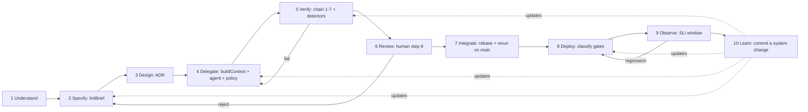

# Module 8.11 — حلقة الهندسة في عصر AI
## The AI-Era Engineering Loop: UNDERSTAND → SPECIFY → DESIGN → DELEGATE → VERIFY → REVIEW → INTEGRATE → DEPLOY → OBSERVE → LEARN as daily practice

> **المستوى:** Level 8 | **الموقع:** [11 من 11]
> **السابق:** [M8.10 — Human-in-the-Loop](module-8.10-human-in-the-loop.md) | **التالي:** [Project 8](../projects/project-8-ai-assisted/README.md) ثم [Checkpoint 8](checkpoint-8.md)

---

## 1. المتطلبات
- [ ] كل وحدات L8 السابقة — هذه الوحدة تُجمّعها: [M8.1](module-8.1-what-changes.md) الأدلّة، [M8.2](module-8.2-vibe-coding-vs-engineering.md) البوّابات، [M8.3](module-8.3-ai-assisted-sdlc.md) الملكية، [M8.4](module-8.4-ai-agents.md) الوكيل والسياسة، [M8.5](module-8.5-context-engineering.md) السياق، [M8.6](module-8.6-ai-delegation.md) الموجز، [M8.7](module-8.7-ai-verification.md) السلسلة، [M8.8](module-8.8-ai-failure-modes.md) الكواشف، [M8.9](module-8.9-ai-security.md) السياسة الأمنية، [M8.10](module-8.10-human-in-the-loop.md) الحدود الصلبة
- [ ] المراقبة وSLI/SLO والتعلّم من الحوادث — [L6-M6.6](../level-6-professional-engineering/module-6.6-observability.md), [L6-M6.7](../level-6-professional-engineering/module-6.7-incident-response.md)
- [ ] التفكير بالمنتج: هل حقّقت الميزة أثرها؟ — [L6-M6.8](../level-6-professional-engineering/module-6.8-product-thinking.md)

## 2. أهداف التعلّم
بعد هذه الوحدة ستستطيع:
1. تشغيل الحلقة العشرية **كاملة** على مهمّة حقيقية خلال يوم عمل، مع معرفة المخرج الإلزامي لكل مرحلة والبوّابة إلى التالية.
2. تمييز المراحل التي أضافتها هذه الوحدة على حلقة M8.2: **INTEGRATE** (الدمج ليس "merge" بل تسوية مع ما تغيّر في main واتّساق معماري) و**LEARN** (ما الذي يُعدَّل في السياق/الموجز/السياسة/الكواشف بناءً على ما حدث).
3. **توصيل الأدوات** التي بنيتها في L8 في مسار واحد: بانٍ السياق → lint الموجز → وكيل بسياسة → سلسلة التحقّق مع الكواشف → مُصنّف الحدود → سجلّ موحَّد → مقاييس.
4. قياس الحلقة بمقاييس لا تُخدع: زمن الدورة، جولات التفويض، معدّل الرفض في كل بوّابة، طفرات ناجية، عيوب مُسرَّبة لكل 1k سطر مولَّد، نسبة الحدود الصلبة، نسبة "LEARN" التي أنتجت تغييرًا.
5. تشخيص حلقة مريضة من مقاييسها (رفض متأخّر = مواصفة ضعيفة؛ جولات كثيرة = سياق فقير؛ أسئلة كثيرة للوكيل = موجز غامض؛ "LEARN" فارغ = الحلقة لا تتعلّم).
6. ممارسة الحلقة كـ**عادة يومية** بإيقاع واضح: متى تكتب، متى تُفوّض، متى تُراجع، متى تتعلّم — دون أن تتحوّل إلى طقوس.

## 3. شرح للمبتدئ
في M8.2 رأيت الحلقة كبديل للـ vibe؛ في M8.3 رأيتها على SDLC؛ وفي الوحدات 8.4–8.10 بنيت أداة لكل بوّابة. الآن نُركّبها في **ممارسة يومية**: ليست إجراءً بيروقراطيًا من عشر خطوات تُوثَّق في Jira، بل إيقاع عمل يستغرق — لمهمّة متوسّطة — ساعات لا أيامًا، ومعظم خطواته آلية أو دقائق. ما يجعلها "حلقة" لا "خطًّا" هو المرحلتان الأخيرتان: OBSERVE تُخبرك إن كان ما بنيته يعمل **للناس**، وLEARN تُعدّل النظام نفسه (سياق، موجز، سياسة، كواشف) بحيث تكون الدورة التالية أفضل. حلقة بلا LEARN تُكرّر الأخطاء نفسها بسرعة أعلى.

**المراحل العشر، بمخرجها وبوّابتها:**

| # | المرحلة | ما تفعله (ومن) | المخرج الإلزامي | البوّابة إلى التالية | أداة L8 |
|---|---|---|---|---|---|
| 1 | **UNDERSTAND** | ما المشكلة ولمن؟ ما الموجود؟ (إنسان؛ AI يُلخّص ويسأل) | بيان مشكلة + حالة راهنة | مكتوبان بسطرين يفهمهما زميل | M8.3 ownership |
| 2 | **SPECIFY** | متطلبات، قيود، AC (+سلبية)، أمن، خارج النطاق (إنسان يُقرّر؛ AI يسأل ويُصيغ) | موجز مهمّة | `lintBrief` = delegate | M8.6 |
| 3 | **DESIGN** | المكان، الواجهات، البدائل، ADR عند الحاجة (إنسان يختار؛ AI يُولّد بدائل وينقد) | قرار مكان + واجهات | بديل مرفوض واحد على الأقلّ مكتوب | M8.3 |
| 4 | **DELEGATE** | بناء السياق، اختبارات AC مسبقة محمية، تشغيل الوكيل بسياسة ومستوى | diff + trace + `stop` reason | الوكيل توقّف بـ `done` لا بـ denied/loop/budget | M8.4, 8.5, 8.9 |
| 5 | **VERIFY** | السلسلة الثمانية (1–7 آلية) + كواشف الأنماط | سجلّ تحقّق حتى الخطوة 7 | كل الخطوات ok؛ الكواشف صفر أو مبرَّرة | M8.7, 8.8 |
| 6 | **REVIEW** | كغريب: كل سطر، الغائب، لماذا، هل كان يجب (إنسان) | خطوة 8 موقّعة + أسئلة/قرارات | `auditLog` ok | M8.7 |
| 7 | **INTEGRATE** | تسوية مع main الحالي، إعادة السلسلة إن تغيّر الأساس، اتّساق مع ما دُمج اليوم من آخرين | PR مدموج/جاهز | السلسلة خضراء **على main المُحدَّث** | M8.7, 8.8 |
| 8 | **DEPLOY** | التصنيف → حدود صلبة إن لزم → نشر تدريجي | إصدار + قرار بوّابة مُسجَّل | L2+ بموافقة مُسمّاة؛ canary سليم | M8.10 |
| 9 | **OBSERVE** | SLI/أخطاء/أثر المنتج خلال نافذة؛ هل حقّق AC في الواقع؟ | ملاحظة مكتوبة: نجح/فشل/غير معروف | رقم يتحرّك كما توقّعنا أو قرار تراجع | M6.6, 6.8 |
| 10 | **LEARN** | ما الذي فاجأنا؟ ما يُعدَّل في: السياق، قالب الموجز، السياسة، الكواشف، الحدود؟ | تغيير واحد على الأقلّ في النظام (أو "لا شيء" مُبرَّر) | التغيير مُلتزَم (commit) لا ملاحظة | M8.5, 8.6, 8.8, 8.9 |

**INTEGRATE — المرحلة التي يُهملها الوكلاء.** الوكيل عمل على لقطة من المستودع قبل ساعتين؛ منذ ذلك الحين دُمجت 4 PRs، أحدها غيّر توقيع `OrderRepository.findById`. "الاختبارات تمرّ" على فرع الوكيل لا تعني شيئًا عن main. والأخطر: اتّساق **دلالي** لا نحوي — زميل أضاف اليوم `shared/money.ts` ووكيلك كتب `formatAmount` خاصّة به (M8.8 نمط 7) لأن السياق بُني قبل ذلك. INTEGRATE = rebase/merge من main، إعادة السلسلة من الخطوة 1، إعادة كاشف التكرار والحدود على **الناتج المدمج**، وقراءة سريعة لما دُمج اليوم في نفس الوحدة.

**LEARN — المرحلة التي تجعل الحلقة حلقة.** بعد OBSERVE اسأل أربعة أسئلة ولكلٍّ وجهة: (1) هل فاجأنا الوكيل بخطأ من نمط معروف؟ ← قاعدة سياق أو كاشف (M8.5/8.8). (2) هل سأل أسئلة كان يجب أن يُجيب عنها الموجز؟ ← قالب الموجز (M8.6). (3) هل رُفض شيء متأخّرًا (في REVIEW أو OBSERVE) كان يمكن رفضه مبكّرًا؟ ← بوّابة أبكر أو AC جديدة. (4) هل طلب الوكيل فعلًا مُنع/سُئل عنه؟ ← هل السياسة صحيحة أم ضيّقة؟ (M8.4/8.9). والقاعدة: **LEARN ينتهي بـ commit** (في `AGENTS.md`، قالب الموجز، `policy.yml`، قواعد الكواشف) أو بسطر "لا تغيير، لأن…". ملاحظة في رأسك ليست تعلّمًا.

**الإيقاع اليومي.** لمهندس يعمل بالحلقة على 2–3 مهام متوسّطة يوميًا، الشكل النموذجي: الصباح — UNDERSTAND/SPECIFY/DESIGN لمهام اليوم (ساعة؛ هنا يُستخدم AI ناقدًا ومولّد أسئلة)؛ ثم DELEGATE لمهمّتين بالتوازي (الوكلاء يعملون بينما تُراجع شيئًا آخر)؛ VERIFY آلي يصلك كسجلّ؛ REVIEW بتركيز لكل diff (20–40 دقيقة لكلٍّ؛ لا تُراجع وأنت تُفوّض)؛ INTEGRATE/DEPLOY بعد الظهر؛ OBSERVE نافذة محدّدة (لا "سنرى")؛ LEARN آخر اليوم 10 دقائق مع commit. ما يتغيّر مقارنة بما قبل AI: وقتك ينتقل من الكتابة إلى **التحديد والمراجعة** (M8.3 §8)، ومعظم "الانتظار" يُملأ بمهمّة موازية.

**المقاييس التي لا تُخدع.** الحلقة تُقاس بمخرجاتها لا بنشاطها:
- **زمن الدورة** من UNDERSTAND إلى OBSERVE (لا إلى merge).
- **جولات التفويض** لكل مهمّة (المثالي 1–2؛ > 3 = سياق أو موجز ضعيف).
- **أين يُرفض؟** توزيع الرفض على البوّابات: رفض مبكّر (lint موجز، compile) صحّي؛ رفض متأخّر (REVIEW، OBSERVE) مكلف ويُشير إلى بوّابة مبكّرة ضعيفة.
- **طفرات ناجية** وكواشف لكل 1k سطر مولَّد.
- **عيوب مُسرَّبة** لكل 1k سطر مولَّد (المقياس النهائي)، مُصنَّفة بالنمط (M8.8).
- **نسبة L2+** من التغييرات (~2–5%؛ أعلى = تصنيف واسع؛ أقلّ = تصنيف يُفلت).
- **نسبة LEARN المُنتِج**: دورات انتهت بتغيير في النظام ÷ كل الدورات (إن كانت ~0 فالحلقة لا تتعلّم؛ إن كانت ~1 فالنظام غير مستقرّ).
- **مقياس مضادّ** لكل مقياس: زمن دورة قصير مع عيوب مرتفعة = تخطّي بوّابات.

**الحلقة المريضة وأعراضها.** الوكيل يسأل كثيرًا ← الموجز غامض. الوكيل يُعيد اختراع ما هو موجود ← السياق بلا واجهات. رفض في REVIEW بسبب "لماذا هذا؟" ← DESIGN تُخطّى. السلسلة خضراء والإنتاج يفشل ← AC لا تُغطّي الواقع، أو OBSERVE غائبة. حدود صلبة كثيرة ← تصنيف واسع، وإرهاق قادم. LEARN فارغ شهرًا ← الفريق يعمل بالحلقة شكليًا.

## 4. النموذج الذهني
**"عشر مراحل، كلٌّ بمخرج وبوّابة؛ الأدوات تُشغّل البوّابات؛ وLEARN تُعدّل الأدوات."** الحلقة ليست قائمة تحقّق؛ هي نظام يُحسّن نفسه — بشرط أن تُغلقها.

```text
 UNDERSTAND ─▶ SPECIFY ─▶ DESIGN ─▶ DELEGATE ─▶ VERIFY ─▶ REVIEW ─▶ INTEGRATE ─▶ DEPLOY ─▶ OBSERVE ─▶ LEARN ─┐
  problem      brief      place     context     chain     stranger   on fresh    gates     SLI/impact  commit  │
  + current    lintBrief  + ADR     + policy    1–7 +     step 8     main, re-   L0–L3     window      to      │
  state        =delegate  + alt     + protected detectors signed     run chain   approval  written     system  │
                                    tests                                                                       │
       ▲                                                                                                        │
       └──── context rules · brief template · policy · detectors · gates ◀──────────────────────────────────────┘
```

## 5. الرسم التوضيحي


## 6. مثال بسيط
```text
المهمّة: "المستخدمون يشتكون أن تصدير CSV بطيء ويفشل للطلبات الكبيرة"            [اليوم: الثلاثاء]
 1 UNDERSTAND (15m)  بيان: تصدير > 50k طلب يُنهي الذاكرة (OOM في السجلّات) · الحالة: يُبنى كاملًا في الذاكرة.
 2 SPECIFY (30m)     موجز: streaming، حدّ 200k، R3 ذاكرة ثابتة، AC سلبية (201k → 413)، أمن (tenant، csv injection)، خارج النطاق (xlsx) · lint: delegate.
 3 DESIGN (15m)      بديلان: stream مباشر vs job غير متزامن · قرار: stream ≤ 200k، job لاحقًا (ADR-0048) · واجهة: OrderRepository.streamByTenant().
 4 DELEGATE (25m)    buildContext: AGENTS.md + public.ts + repository + export.test.ts (4 اختبارات AC مسبقة، محمية) · وكيل L3 · stop: done · 2 denied (حاول تعديل الاختبار).
 5 VERIFY (6m آلي)   سلسلة 1–7 ✓ · كواشف: 1 نتيجة (formatDate مكرّرة في shared) → مبرَّر؟ لا → إصلاح → إعادة · طفرة 9/10.
 6 REVIEW (25m)      قرأت 190 سطرًا · الغائب: ماذا لو أُغلق الاتصال في منتصف الـ stream؟ → AC-5 جديدة + اختبار · "لماذا 200k؟" → DEC في الموجز.
 7 INTEGRATE (10m)   rebase: زميل غيّر OrderRepository اليوم → تعارض صغير → إعادة السلسلة على main ✓.
 8 DEPLOY (10m)      classify: L0 (لا ترحيل/أمن) · canary 10% · 15 دقيقة سليمة · 100%.
 9 OBSERVE (نافذة 24h) p95 تصدير 50k: 41s → 3.2s · OOM: 0 · شكاوى: 0 · 413 لـ > 200k: 7 مرّات (← طلب حقيقي للـ job).
10 LEARN (10m)       commit: AGENTS.md + "streams for exports > 10k rows" · قالب الموجز + سؤال "انقطاع العميل في المنتصف؟" · مهمّة جديدة: job للـ > 200k.
 زمن الدورة إلى OBSERVE: ~26h (منه ~3h عمل بشري) · جولات تفويض: 1 · رفض: مبكّر (كاشف) ومتوسّط (REVIEW أضاف AC) · حدود: 0.
```

## 7. مثال كود
**مُشغّل الحلقة**: يُركّب الأدوات التي بنيتها (هنا بنسخ مُصغَّرة مُحقنة كواجهات كي تبقى الوحدة مستقلّة التشغيل) في مسار واحد بعشر مراحل، كلٌّ بمخرج وبوّابة؛ يتوقّف عند أول بوّابة فاشلة ويُسجّل أين ولماذا؛ يُنتج **سجلًّا موحَّدًا** للدورة، و**مقاييس** عبر دورات متعدّدة (زمن، جولات، توزيع الرفض، LEARN مُنتِج)، و**مُشخّصًا** يقرأ المقاييس ويُسمّي المرض المحتمل. الاختبارات تُشغّل دورة ناجحة، ودورة تُرفض في SPECIFY، ودورة تُرفض في OBSERVE وتُظهر أن التعلّم يُعدّل النظام، ثم تُشخّص الحلقة.

```text
m811-ai-era-loop/
├─ src/loop.ts
└─ src/loop.test.ts
```

```typescript
// src/loop.ts
// مُشغّل الحلقة العشرية بأدوات مُحقنة + سجلّ موحَّد + مقاييس + تشخيص
export const PHASES = ["understand", "specify", "design", "delegate", "verify", "review", "integrate", "deploy", "observe", "learn"] as const;
export type Phase = (typeof PHASES)[number];

export interface Tools {
  lintBrief: (brief: unknown) => { verdict: "delegate" | "fix-first" | "not-a-task"; findings: string[] };
  buildContext: (targets: string[]) => { tokensUsed: number; excluded: string[] };
  runAgent: (ctx: { tokensUsed: number }, brief: unknown) => { stop: "done" | "denied" | "loop-detected" | "budget" | "repeated-verification-failure"; filesWritten: string[]; denied: number };
  runChain: (files: string[]) => { outcome: "mergeable" | "stopped"; stoppedAt?: string; detectorFindings: string[] };
  humanReview: (files: string[]) => { approved: boolean; reviewer: string; absentFound: string[]; whyQuestions: string[] };
  integrate: (files: string[]) => { conflicts: number; chainOnMain: "mergeable" | "stopped" };
  classify: (files: string[]) => { level: 0 | 1 | 2 | 3 };
  approveGate: (level: number) => { approved: boolean; by?: string };
  observe: (releaseId: string) => { outcome: "met" | "regressed" | "unknown"; metrics: Record<string, number> };
  learn: (cycle: CycleLog) => { changes: string[]; rationaleIfNone?: string };
}

export interface Task { id: string; problem: string; currentState: string; brief: unknown; targets: string[]; designAlternatives: string[] }
export interface PhaseRecord { phase: Phase; ok: boolean; output: Record<string, unknown>; note?: string; durationMs: number }
export interface CycleLog { taskId: string; phases: PhaseRecord[]; outcome: "completed" | "stopped"; stoppedAt?: Phase; delegationRounds: number; startedAt: number; endedAt: number }

export async function runCycle(task: Task, tools: Tools, now: () => number = Date.now, maxDelegationRounds = 3): Promise<CycleLog> {
  const phases: PhaseRecord[] = []; const startedAt = now(); let delegationRounds = 0; let files: string[] = [];
  const log = (phase: Phase, ok: boolean, output: Record<string, unknown>, note?: string, t0 = now()) => { phases.push({ phase, ok, output, note, durationMs: now() - t0 }); return ok; };
  const stop = (phase: Phase): CycleLog => ({ taskId: task.id, phases, outcome: "stopped", stoppedAt: phase, delegationRounds, startedAt, endedAt: now() });

  // 1 UNDERSTAND — بوّابة: بيان مشكلة وحالة راهنة مكتوبان
  if (!log("understand", !!task.problem.trim() && !!task.currentState.trim(), { problem: task.problem, currentState: task.currentState }, "problem statement + current state required")) return stop("understand");
  // 2 SPECIFY — بوّابة: lintBrief = delegate
  const lint = tools.lintBrief(task.brief);
  if (!log("specify", lint.verdict === "delegate", { verdict: lint.verdict, findings: lint.findings }, lint.findings.join("; "))) return stop("specify");
  // 3 DESIGN — بوّابة: بديل مرفوض واحد على الأقلّ
  if (!log("design", task.designAlternatives.length >= 2, { alternatives: task.designAlternatives }, "at least two alternatives considered (one rejected)")) return stop("design");
  // 4–5 DELEGATE + VERIFY — مع جولات محدودة
  let chain: ReturnType<Tools["runChain"]> | undefined;
  while (delegationRounds < maxDelegationRounds) {
    delegationRounds++;
    const ctx = tools.buildContext(task.targets); const agent = tools.runAgent(ctx, task.brief); files = agent.filesWritten;
    const delegated = log("delegate", agent.stop === "done", { round: delegationRounds, stop: agent.stop, files, denied: agent.denied, contextTokens: ctx.tokensUsed, excluded: ctx.excluded }, agent.stop !== "done" ? `agent stopped: ${agent.stop}` : undefined);
    if (!delegated) return stop("delegate");
    chain = tools.runChain(files);
    const verified = log("verify", chain.outcome === "mergeable" && chain.detectorFindings.length === 0, { ...chain, round: delegationRounds }, chain.outcome !== "mergeable" ? `chain stopped at ${chain.stoppedAt}` : chain.detectorFindings.length ? `detectors: ${chain.detectorFindings.join("; ")}` : undefined);
    if (verified) break;
    if (delegationRounds >= maxDelegationRounds) return stop("verify");
  }
  // 6 REVIEW — بوّابة: موافقة بشرية باسم
  const review = tools.humanReview(files);
  if (!log("review", review.approved && !!review.reviewer, { ...review }, review.approved ? undefined : `rejected by ${review.reviewer}: absent=${review.absentFound.join(",")}`)) return stop("review");
  // 7 INTEGRATE — بوّابة: السلسلة خضراء على main المُحدَّث
  const integ = tools.integrate(files);
  if (!log("integrate", integ.chainOnMain === "mergeable", { ...integ }, integ.chainOnMain !== "mergeable" ? "chain failed on fresh main (base moved)" : undefined)) return stop("integrate");
  // 8 DEPLOY — بوّابة: L2+ يحتاج موافقة مُسمّاة
  const cls = tools.classify(files); const gate = cls.level >= 2 ? tools.approveGate(cls.level) : { approved: true as const, by: "n/a (L0-1)" };
  if (!log("deploy", gate.approved, { level: cls.level, approvedBy: gate.by }, gate.approved ? undefined : `hard gate L${cls.level} not approved`)) return stop("deploy");
  // 9 OBSERVE — بوّابة: النتيجة "met" (regressed → تراجع؛ unknown → لا تُغلق الدورة)
  const obs = tools.observe(task.id);
  if (!log("observe", obs.outcome === "met", { ...obs }, obs.outcome !== "met" ? `observe: ${obs.outcome}` : undefined)) {
    // حتى عند الفشل هنا، LEARN إلزامي — الفشل المتأخّر أغلى درس
    const partial: CycleLog = { taskId: task.id, phases, outcome: "stopped", stoppedAt: "observe", delegationRounds, startedAt, endedAt: now() };
    const learned = tools.learn(partial); log("learn", learned.changes.length > 0 || !!learned.rationaleIfNone, { ...learned }, "learn must commit a change or justify none");
    return { ...partial, phases };
  }
  // 10 LEARN — بوّابة: تغيير مُلتزَم أو تبرير
  const learned = tools.learn({ taskId: task.id, phases, outcome: "completed", delegationRounds, startedAt, endedAt: now() });
  if (!log("learn", learned.changes.length > 0 || !!learned.rationaleIfNone, { ...learned }, "learn must commit a change or justify none")) return stop("learn");
  return { taskId: task.id, phases, outcome: "completed", delegationRounds, startedAt, endedAt: now() };
}

export interface LoopMetrics { cycles: number; completed: number; avgCycleMs: number; avgDelegationRounds: number; rejectionsByPhase: Partial<Record<Phase, number>>; lateRejectionRate: number; productiveLearnRate: number; hardGateRate: number }
export function metrics(cycles: CycleLog[]): LoopMetrics {
  const rejectionsByPhase: Partial<Record<Phase, number>> = {}; let late = 0; let productiveLearn = 0; let gated = 0;
  for (const c of cycles) {
    if (c.stoppedAt) { rejectionsByPhase[c.stoppedAt] = (rejectionsByPhase[c.stoppedAt] ?? 0) + 1; if (["review", "integrate", "deploy", "observe"].includes(c.stoppedAt)) late++; }
    const learn = c.phases.find((p) => p.phase === "learn"); if (learn && Array.isArray(learn.output.changes) && (learn.output.changes as string[]).length > 0) productiveLearn++;
    const dep = c.phases.find((p) => p.phase === "deploy"); if (dep && (dep.output.level as number) >= 2) gated++;
  }
  const stopped = cycles.filter((c) => c.stoppedAt).length;
  return {
    cycles: cycles.length, completed: cycles.filter((c) => c.outcome === "completed").length,
    avgCycleMs: cycles.reduce((s, c) => s + (c.endedAt - c.startedAt), 0) / Math.max(1, cycles.length),
    avgDelegationRounds: cycles.reduce((s, c) => s + c.delegationRounds, 0) / Math.max(1, cycles.length),
    rejectionsByPhase, lateRejectionRate: stopped ? late / stopped : 0, productiveLearnRate: cycles.length ? productiveLearn / cycles.length : 0, hardGateRate: cycles.length ? gated / cycles.length : 0,
  };
}

export function diagnose(m: LoopMetrics): string[] {
  const out: string[] = [];
  if (m.avgDelegationRounds > 2) out.push("many delegation rounds → weak context or vague brief (M8.5/8.6)");
  if (m.lateRejectionRate > 0.4) out.push("late rejections dominate → an early gate is too weak (AC coverage, lint, detectors)");
  if ((m.rejectionsByPhase.review ?? 0) > (m.rejectionsByPhase.specify ?? 0) + (m.rejectionsByPhase.verify ?? 0)) out.push("review catches what specify/verify should → add AC/negative cases, strengthen chain");
  if ((m.rejectionsByPhase.observe ?? 0) > 0) out.push("production regressions → AC do not reflect reality or observe window missing before (M6.6/6.8)");
  if (m.productiveLearnRate < 0.2 && m.cycles >= 5) out.push("LEARN rarely changes the system → loop is ritual, not learning");
  if (m.productiveLearnRate > 0.9 && m.cycles >= 5) out.push("LEARN changes the system every cycle → system unstable; batch changes");
  if (m.hardGateRate > 0.1) out.push("hard gates > 10% of cycles → classification too broad; approval fatigue ahead (M8.10)");
  if (out.length === 0) out.push("loop healthy by these metrics — keep watching leaked defects per 1k generated lines");
  return out;
}
```

```typescript
// src/loop.test.ts
import { test } from "node:test";
import assert from "node:assert/strict";
import { runCycle, metrics, diagnose, PHASES, type Tools, type Task } from "./loop.ts";

let clock = 0; const now = () => (clock += 60_000);
const system = { contextRules: ["repositories only"], briefTemplateQuestions: [] as string[], detectors: ["dup"] };
const baseTools = (over: Partial<Tools> = {}): Tools => ({
  lintBrief: () => ({ verdict: "delegate", findings: [] }),
  buildContext: () => ({ tokensUsed: 12_000, excluded: [".env"] }),
  runAgent: () => ({ stop: "done", filesWritten: ["orders/export.ts"], denied: 0 }),
  runChain: () => ({ outcome: "mergeable", detectorFindings: [] }),
  humanReview: () => ({ approved: true, reviewer: "sara", absentFound: [], whyQuestions: ["why 200k?"] }),
  integrate: () => ({ conflicts: 0, chainOnMain: "mergeable" }),
  classify: () => ({ level: 0 }),
  approveGate: () => ({ approved: true, by: "omar" }),
  observe: () => ({ outcome: "met", metrics: { p95s: 3.2, oom: 0 } }),
  learn: () => ({ changes: [], rationaleIfNone: "nothing surprised us" }),
  ...over,
});
const task: Task = { id: "T-1", problem: "CSV export OOMs above 50k rows", currentState: "built fully in memory", brief: {}, targets: ["orders/export.ts"], designAlternatives: ["direct stream", "async job"] };

test("دورة كاملة: عشر مراحل بالترتيب، جولة تفويض واحدة، L0 بلا حدّ صلب، LEARN مُبرَّر", async () => {
  const c = await runCycle(task, baseTools(), now);
  assert.equal(c.outcome, "completed"); assert.deepEqual(c.phases.map((p) => p.phase), [...PHASES]); assert.equal(c.delegationRounds, 1);
  assert.equal(c.phases.find((p) => p.phase === "deploy")!.output.approvedBy, "n/a (L0-1)");
});

test("الرفض المبكّر: موجز غامض يُوقف الدورة في SPECIFY قبل أي توليد؛ وكيل يتوقّف بـ denied يُوقفها في DELEGATE", async () => {
  const bad = await runCycle(task, baseTools({ lintBrief: () => ({ verdict: "not-a-task", findings: ["goal.vague", "ac.missing"] }) }), now);
  assert.equal(bad.stoppedAt, "specify"); assert.equal(bad.phases.length, 2); assert.ok(bad.phases[1]!.note!.includes("ac.missing"));
  const denied = await runCycle(task, baseTools({ runAgent: () => ({ stop: "denied", filesWritten: [], denied: 1 }) }), now);
  assert.equal(denied.stoppedAt, "delegate"); assert.equal(denied.delegationRounds, 1);
});

test("جولات التفويض: كاشف يرفض في VERIFY → جولة ثانية تنجح؛ وثلاث جولات فاشلة تُوقف الدورة", async () => {
  let round = 0;
  const flaky = baseTools({ runChain: () => (++round === 1 ? { outcome: "mergeable", detectorFindings: ["formatDate duplicates shared/date.ts"] } : { outcome: "mergeable", detectorFindings: [] }) });
  const c = await runCycle(task, flaky, now);
  assert.equal(c.outcome, "completed"); assert.equal(c.delegationRounds, 2);
  assert.ok(c.phases.filter((p) => p.phase === "verify")[0]!.note!.includes("duplicates"));
  const hopeless = await runCycle(task, baseTools({ runChain: () => ({ outcome: "stopped", stoppedAt: "tests", detectorFindings: [] }) }), now);
  assert.equal(hopeless.stoppedAt, "verify"); assert.equal(hopeless.delegationRounds, 3);
});

test("INTEGRATE وDEPLOY وOBSERVE كبوّابات: فشل على main المُحدَّث، حدّ صلب غير مُوافَق، انحدار في الإنتاج — وLEARN يُعدّل النظام حتى عند الفشل", async () => {
  const moved = await runCycle(task, baseTools({ integrate: () => ({ conflicts: 1, chainOnMain: "stopped" }) }), now);
  assert.equal(moved.stoppedAt, "integrate");
  const gated = await runCycle(task, baseTools({ classify: () => ({ level: 2 }), approveGate: () => ({ approved: false }) }), now);
  assert.equal(gated.stoppedAt, "deploy"); assert.ok(gated.phases.at(-1)!.note!.includes("L2"));
  const regressed = await runCycle(task, baseTools({
    observe: () => ({ outcome: "regressed", metrics: { errors5xx: 42 } }),
    learn: () => { system.briefTemplateQuestions.push("client disconnect mid-stream?"); system.detectors.push("unhandled-stream-error"); return { changes: ["brief template: +disconnect question", "detector: unhandled-stream-error"] }; },
  }), now);
  assert.equal(regressed.stoppedAt, "observe");
  assert.equal(regressed.phases.at(-1)!.phase, "learn"); assert.equal(regressed.phases.at(-1)!.ok, true);
  assert.ok(system.detectors.includes("unhandled-stream-error") && system.briefTemplateQuestions.length === 1);
  // LEARN بلا تغيير وبلا تبرير يفشل البوّابة
  const noLearn = await runCycle(task, baseTools({ learn: () => ({ changes: [] }) }), now);
  assert.equal(noLearn.stoppedAt, "learn");
});

test("المقاييس والتشخيص: حلقة برفض متأخّر وLEARN فارغ تُشخَّص؛ حلقة سليمة تُعلن سليمة", async () => {
  const sick = [
    await runCycle(task, baseTools({ humanReview: () => ({ approved: false, reviewer: "sara", absentFound: ["authZ"], whyQuestions: [] }) }), now),
    await runCycle(task, baseTools({ observe: () => ({ outcome: "regressed", metrics: {} }), learn: () => ({ changes: [], rationaleIfNone: "later" }) }), now),
    await runCycle(task, baseTools({ humanReview: () => ({ approved: false, reviewer: "omar", absentFound: ["null tenant"], whyQuestions: [] }) }), now),
    await runCycle(task, baseTools({ classify: () => ({ level: 2 }) }), now),
    await runCycle(task, baseTools({ classify: () => ({ level: 3 }) }), now),
  ];
  const m = metrics(sick); const d = diagnose(m);
  assert.equal(m.rejectionsByPhase.review, 2); assert.ok(m.lateRejectionRate === 1); assert.equal(m.productiveLearnRate, 0); assert.ok(m.hardGateRate >= 0.4);
  assert.ok(d.some((x) => x.includes("late rejections"))); assert.ok(d.some((x) => x.includes("ritual"))); assert.ok(d.some((x) => x.includes("hard gates > 10%"))); assert.ok(d.some((x) => x.includes("production regressions")));
  const healthy = []; for (let i = 0; i < 6; i++) healthy.push(await runCycle(task, baseTools({ learn: () => ({ changes: i % 3 === 0 ? ["AGENTS.md: +1 rule"] : [], rationaleIfNone: "none" }) }), now));
  const hm = metrics(healthy);
  assert.equal(hm.completed, 6); assert.deepEqual(diagnose(hm), ["loop healthy by these metrics — keep watching leaked defects per 1k generated lines"]);
});
```

**تشغيل:** `npx tsx --test src/*.test.ts`. استبدل كل أداة مُحقنة بالنسخة الحقيقية التي بنيتها في M8.4–8.10 — هذا هو تمرين Project 8 عمليًا — ثم شغّل `metrics`/`diagnose` أسبوعيًا على سجلّات دوراتك.

## 8. مثال من العالم الحقيقي
**فريقان، نفس الأدوات، نتيجتان.** شركتان متشابهتان اعتمدتا وكلاء برمجة في نفس الربع. الأولى اعتمدتها كـ"مسرّع كتابة": كل مهندس يُفوّض كما يشاء، يُراجع كما اعتاد، ويُدمج. بعد ستّة أشهر: حجم الكود المدموج ×2.4، زمن المراجعة لكل PR −30% (أقصر، لأن الـ PRs صارت أكبر و"تُقشَّد")، العيوب المُسرَّبة ×3.1، وحادثتان كبيرتان منشؤهما كود مولَّد لم يقرأه أحد (IDOR، وترحيل قفل جدولًا). خلاصتهم: "AI لا يصلح لمنتجنا".

الثانية اعتمدتها كحلقة: أسبوعان لبناء `AGENTS.md` وقالب موجز وسياسة وكيل وسلسلة تحقّق في CI وتصنيف حدود؛ ثم قياس أسبوعي للمقاييس في §3. أول شهر كان أبطأ من قبل (الناس تتعلّم كتابة موجزات). بعد ستّة أشهر: حجم الكود ×1.6 فقط (موجزات أدقّ = diff أصغر)، زمن المراجعة لكل 100 سطر مولَّد **ارتفع** (مقصود)، العيوب المُسرَّبة −20% عن ما قبل AI، صفر حوادث من كود مولَّد، وLEARN أنتج 31 تغييرًا في النظام (قواعد سياق، كواشف، أسئلة موجز) خُفّفت لاحقًا إلى 19 بعد مراجعة التعفّن. خلاصتهم: "المكسب لم يكن في سرعة الكتابة؛ كان في أن الحلقة جعلتنا نُحدّد ونتحقّق أفضل ممّا كنّا نفعل بلا AI".

نفس النماذج، نفس الأدوات، نفس الصناعة. الفرق: الحلقة — وتحديدًا بوّاباتها وLEARN.

## 9. مثال من الإنتاج
**`loop.yml` — تعريف الحلقة كإعداد في مستودع فريق (مُبسَّط):**

```yaml
# .loop/loop.yml — يُقرأ بواسطة الـ orchestrator الداخلي؛ كل مرحلة تُعرّف بوّابتها كأمر أو شرط
phases:
  understand: { gate: "task.problem && task.currentState", owner: human }
  specify:    { gate: "lint-brief tasks/${id}.md --min delegate", owner: human, ai: [questions, draft] }
  design:     { gate: "adr-check tasks/${id}.md --alternatives >= 2", owner: human, ai: [alternatives, critique] }
  delegate:   { run: "agent --policy .agent/policy.yml --context .agent/context.yml --brief tasks/${id}.md --tests-protected", gate: "stop == done" }
  verify:     { run: "chain --steps 1-7 && detectors --changed", gate: "log.outcome == mergeable && detectors == 0 || justified" }
  review:     { gate: "pr.approvals.human >= 1 && pr.review.readAllLines && verification-log.step8.signed", owner: human }
  integrate:  { run: "git rebase origin/main && chain --steps 1-7 --on main", gate: "mergeable" }
  deploy:     { run: "classify --changed", gate: "level < 2 || gate-approved(level)", then: "deploy --canary 10% --watch 15m" }
  observe:    { window: "24h", gate: "sli.export_p95 < 5s && errors5xx.delta <= 0 && product.metric moved", owner: human }
  learn:      { gate: "commit touches (.agent/** | tasks/_template.md | detectors/** | GATES.md) || tasks/${id}.md has 'LEARN: none because'" }
metrics:
  weekly: [cycle_time_to_observe, delegation_rounds, rejections_by_phase, late_rejection_rate, surviving_mutants_per_kloc, leaked_defects_per_kloc_generated, hard_gate_rate, productive_learn_rate]
  alerts:
    - { when: "late_rejection_rate > 0.4", say: "strengthen early gates (AC/lint/detectors)" }
    - { when: "delegation_rounds.avg > 2", say: "context/brief quality" }
    - { when: "productive_learn_rate < 0.2 over 4 weeks", say: "loop is ritual" }
    - { when: "hard_gate_rate > 0.1", say: "classification too broad" }
```

لاحظ أن المراحل البشرية لها `owner: human` و`ai: [...]` تُحدّد ما يُسمح لـ AI بالمساهمة فيه (M8.3)، وأن LEARN بوّابته **commit يلمس ملفات النظام** — لا يمكن إغلاق دورة بـ"تعلّمنا الكثير".

## 10. أخطاء شائعة في الفهم
| الخطأ | الصواب |
|---|---|
| "عشر مراحل لكل تغيير = بيروقراطية" | لمهمّة صغيرة معظمها دقائق أو آلي؛ ما يُكلّف هو تخطّيها. والحجم يُضبط بالتصنيف (L0 يمرّ خفيفًا). |
| "الحلقة للوكلاء فقط" | هي حلقة الهندسة؛ الوكيل منفّذ في مرحلة واحدة. تنطبق حين تكتب بنفسك أيضًا. |
| "merge = integrate" | INTEGRATE تشمل إعادة التحقّق على main المُحدَّث واتّساقًا مع ما دُمج اليوم؛ merge خطوة فيها. |
| "OBSERVE هي مراقبة الأخطاء" | هي أيضًا: هل حقّقت الميزة أثرها للمستخدم؟ (M6.8) — ميزة بلا انحدار وبلا أثر فشل أيضًا. |
| "LEARN = retro شهري" | LEARN لكل دورة، 10 دقائق، تنتهي بـ commit أو تبرير. الـ retro يُجمّع. |
| "المقاييس تكفي للحكم على الحلقة" | المقاييس تُشخّص؛ المقياس النهائي هو العيوب المُسرَّبة وأثر المنتج، وكلٌّ له مقياس مضادّ. |

## 11. أخطاء شائعة في التطبيق
1. **تشغيل DELEGATE قبل أن يمرّ الموجز بـ lint.** العلاج: البوّابة آلية؛ الوكيل لا يبدأ بدون `delegate`.
2. **REVIEW أثناء انتظار وكيل آخر.** الانتباه مقسوم. العلاج: فترات مراجعة محمية؛ الوكلاء ينتظرون.
3. **INTEGRATE بـ merge فقط.** العلاج: إعادة السلسلة والكواشف على الناتج المدمج دائمًا.
4. **OBSERVE بلا نافذة ولا رقم.** "سنرى" = لم نرَ. العلاج: نافذة ومقياس مُسمّيان في الموجز.
5. **LEARN يُنتج ملاحظات لا commits.** العلاج: بوّابة LEARN = diff في ملفات النظام.
6. **تعديل النظام كل دورة.** العلاج: LEARN يُسجّل؛ التغييرات المتشابهة تُجمَّع أسبوعيًا؛ `AGENTS.md` بميزانية (M8.5).

## 12. تمرين تصحيح
**الوضع:** مقاييس شهر لفريقك: زمن الدورة ممتاز (−45%)، جولات التفويض 1.1، رفض شبه معدوم في كل البوّابات، LEARN مُنتِج 5%، والعيوب المُسرَّبة لكل 1k سطر مولَّد **×2.2**.

**المهمّة:**
1. اقرأ التناقض: كل شيء "أخضر" والعيوب تتضاعف. ما الفرضيات؟ (البوّابات لا تُطبَّق فعلًا — سلسلة تُشغَّل بخطوات معطَّلة؟ اختبارات حشوية تمرّ؟ مراجعة بالثقة؟ تصنيف يُفلت؟)
2. افحص سجلّات التحقّق: ستجد خطوة 4 (Behavior) بدليل "AC traced" دون طفرة، ودرجة الطفرة غير مُسجَّلة منذ 3 أسابيع (الأداة تعطّلت بصمت بعد ترقية وأُعيد تكوين CI لتجاوزها "مؤقّتًا").
3. ما الذي كان سيكشف هذا أبكر؟ (مقياس "طفرات ناجية لكل 1k سطر" اختفى من اللوحة — غياب مقياس يجب أن يُنبّه مثل تدهوره؛ وLEARN 5% كان العلامة: حلقة لا تُنتج تعلّمًا عادةً لا تُنتج رفضًا أيضًا.)
4. أصلح: البوّابة تفشل إن غاب الدليل (لا "تجاوز مؤقّت" بلا تاريخ انتهاء)؛ لوحة تُنبّه على المقاييس المفقودة؛ وأعد تشغيل الطفرة على كل ما دُمج في 3 أسابيع.
5. **تأمّل:** الحلقة السريعة بلا رفض ليست حلقة صحّية؛ هي حلقة بلا بوّابات. ما نسبة الرفض "الصحّية" في رأيك، وأين؟

## 13. تمرين معماري
**الوضع:** أنت تُصمّم "منصّة حلقة" لمنظّمة بـ 200 مهندس: orchestrator يُشغّل المراحل، يُوصّل الأدوات، يُسجّل، ويقيس.

**المهمّة:**
1. ارسم المكوّنات: أين يعيش كل من بانٍ السياق، lint الموجز، وقت تشغيل الوكيل وسياسته، سلسلة التحقّق والكواشف، المُصنّف وتدفّق الحدود، المراقبة، ومخزن السجلّات؟ ما الذي يملكه فريق المنصّة وما يُخصّصه كل فريق (ويُسمح له برفعه لا خفضه)?
2. صمّم السجلّ الموحَّد للدورة كعقد بيانات: الحقول، الهاشات، التوقيعات، الاحتفاظ، والبحث ("كل الدورات التي رُفضت في OBSERVE خلال شهر مع كود مولَّد لمس `payments/`").
3. صمّم لوحة المقاييس بمقياس مضادّ لكلٍّ، وتنبيهات على **غياب** المقاييس لا تدهورها فقط.
4. كيف تُنفَّذ LEARN على مستوى المنظّمة؟ (تغييرات محلّية لكل فريق؛ أنماط متكرّرة تُرفع إلى قواعد مشتركة؛ من يُقرّر؛ كيف تمنع تعفّن القواعد المشتركة؟)
5. ما الذي يجب أن يبقى **خارج** المنصّة عمدًا (قرارات UNDERSTAND/DESIGN/REVIEW البشرية) ولماذا الإفراط في أتمتة الحلقة يقتلها؟
6. قدّم كـ Assumption / Constraint / Tradeoff / Risk / Recommendation، مع خطّة اعتماد على 3 أرباع ومقياس نجاح لكل ربع.

## 14. العلاقة بعصر AI
هذه هي الوحدة التي يتلخّص فيها L8: الهندسة في عصر AI ليست "استخدام AI" بل **تشغيل حلقة ببوّابات حول AI** — وتعديل الحلقة نفسها ممّا تُلاحظه. كل ما تعلّمته من L0 إلى L7 يظهر فيها في مكانه: المتطلبات (L4) في SPECIFY، التصميم (L4/L6/L7) في DESIGN، الأنظمة والأمن (L2/L5) في السياسة والتحقّق، المراجعة والمراقبة (L6) في REVIEW/OBSERVE، الفشل والتراجع (L7) في الحدود. Project 8 هو تشغيلها الأول على كود AI حقيقي؛ Checkpoint 8 يختبر أنك تستطيع شرحها وتشخيصها؛ وL9 المسار B هو تشغيلها على منتج كامل — حيث سيُقيَّم سجلّ حلقتك بقدر ما يُقيَّم منتجك.

## 15. ما يجب إتقانه
- المراحل العشر بمخرجها وبوّابتها والأداة التي تُشغّلها.
- ما تُضيفه INTEGRATE (إعادة التحقّق على main المُحدَّث، اتّساق دلالي) وLEARN (commit في النظام).
- توصيل أدوات L8 في مسار واحد بسجلّ موحَّد.
- المقاييس الثمانية ومقاييسها المضادّة، وقراءة الحلقة المريضة منها.
- الإيقاع اليومي: متى تُحدّد، تُفوّض، تُراجع، تتعلّم.

## 16. ما يجب فهمه
- الحلقة كإعداد قابل للفرض (`loop.yml`) لا كوثيقة.
- التنبيه على غياب المقاييس.
- التوازن بين LEARN المُنتِج واستقرار النظام.

## 17. ما يمكن تأجيله
- بناء orchestrator مؤسّسي كامل (المنصّة في §13).
- ربط مقاييس الحلقة بمقاييس الأعمال على مستوى المنظّمة.
- تحسين الحلقة بالتجارب المضبوطة (A/B على سياسات وكيل مختلفة).

## 18. الخلاصة
الحلقة العشرية هي الممارسة اليومية التي تجعل كل ما في L8 واقعًا: UNDERSTAND وSPECIFY وDESIGN قرارات بشرية بمساعدة AI ناقد؛ DELEGATE وكيل بسياق وسياسة واختبارات محمية؛ VERIFY سلسلة وكواشف آلية؛ REVIEW إنسان يقرأ كغريب؛ INTEGRATE إعادة التحقّق على main الحقيقي؛ DEPLOY عبر تصنيف وحدود صلبة؛ OBSERVE رقم في نافذة؛ وLEARN تغيير مُلتزَم في النظام نفسه. كل مرحلة لها مخرج وبوّابة؛ الأدوات تُشغّل البوّابات؛ والمقاييس — بمضادّاتها — تُشخّص الحلقة لا تُزيّنها. حلقة سريعة بلا رفض ليست صحّية؛ وحلقة بلا LEARN تُكرّر أخطاءها أسرع. الهندسة في عصر AI هي تشغيل هذه الحلقة، كل يوم، وإغلاقها.

## 19. المراجع الرسمية
- W. Edwards Deming — PDSA (Plan-Do-Study-Act) cycle — الجدّ الأكبر لكل حلقة تحسين تُغلق على نفسها.
- DORA — "Accelerate" (Forsgren, Humble, Kim) & State of DevOps reports — المقاييس الأربعة ومقاييسها المضادّة؛ أساس قياس الحلقة.
- Google SRE Workbook — "Implementing SLOs" & "Postmortem Culture" — OBSERVE وLEARN كممارسات مؤسّسية.
- Anthropic — "Building effective agents" / "Effective context engineering for AI agents" — الأدوات في DELEGATE كما يراها المورّد.
- Donald Reinertsen — "The Principles of Product Development Flow" — حجم الدفعة وزمن الدورة وطوابير المراجعة؛ لماذا الـ diff الصغير يُسرّع الحلقة.
- Nicole Forsgren et al. — "The SPACE of Developer Productivity" — لماذا مقياس واحد (السرعة) يُضلّل، وكيف تُركَّب المقاييس.

---

### المصطلحات في هذه الوحدة
| English | العربية |
|---|---|
| Engineering loop | حلقة الهندسة (العشرية) |
| Phase output / gate | مخرج المرحلة / بوّابتها |
| Integrate | التكامل (إعادة التحقّق على main المُحدَّث) |
| Observe window | نافذة الملاحظة |
| Learn (system change) | التعلّم (تغيير مُلتزَم في النظام) |
| Cycle time | زمن الدورة |
| Delegation round | جولة تفويض |
| Early vs late rejection | رفض مبكّر مقابل متأخّر |
| Productive learn rate | نسبة التعلّم المُنتِج |
| Counter-metric | مقياس مضادّ |
| Loop health / ritual loop | صحّة الحلقة / حلقة طقوسية |
| Orchestrator | المنسّق (يُشغّل المراحل ويُوصّل الأدوات) |
| Unified cycle log | سجلّ الدورة الموحَّد |
