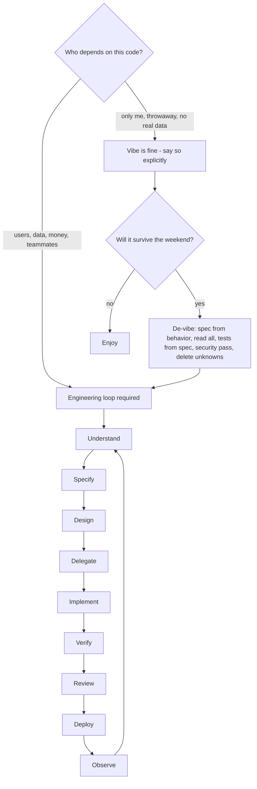

# Module 8.2 — البرمجة بالإحساس مقابل الهندسة
## Vibe Coding vs Engineering: "Prompt → Code → Looks good" is not engineering; where each is legitimate, where responsibility ends, and the loop that replaces the vibe

> **المستوى:** Level 8 | **الموقع:** [2 من 11]
> **السابق:** [M8.1 — What Changes](module-8.1-what-changes.md) | **التالي:** [M8.3 — AI-Assisted SDLC](module-8.3-ai-assisted-sdlc.md)

---

## 1. المتطلبات
> **قبل أن تتعلم هذا، يجب أن تفهم:**
- [ ] ادّعاء مقابل دليل؛ دين التحقّق — [L8-M8.1](module-8.1-what-changes.md)
- [ ] SDLC ومراحله ولماذا الترتيب مهمّ — [L4-M4.1](../level-4-software-engineering-foundations/module-4.1-sdlc.md)
- [ ] معايير القبول Given/When/Then — [L4-M4.3](../level-4-software-engineering-foundations/module-4.3-user-stories-acceptance-criteria.md)
- [ ] الدين التقني والنموذج الأولي الذي يصبح إنتاجًا — [L4-M4.15](../level-4-software-engineering-foundations/module-4.15-tech-debt.md)
- [ ] الحوادث ومن يدفع ثمن "يبدو جيدًا" — [L6-M6.7](../level-6-professional-engineering/module-6.7-incident-response.md)

## 2. أهداف التعلّم
بعد هذه الوحدة ستستطيع:
1. تعريف **vibe coding** بدقّة (قبول الكود بناءً على الانطباع والتجربة السطحية دون قراءته أو فهمه) وتمييزه عن الاستخدام المنهجي لـ AI.
2. تحديد **أين هو مشروع** (نماذج أولية تُرمى، أدوات شخصية، استكشاف) و**أين يُصبح إهمالًا مهنيًا** (أي شيء يلمس مستخدمين أو بيانات أو مالًا).
3. شرح لماذا ينهار الـ vibe عند **التغيير الثاني** (لا نموذج ذهني للكود) وعند **أول حادثة** (لا أحد يفهم ما يعمل).
4. تطبيق **حلقة الهندسة** (UNDERSTAND → SPECIFY → DESIGN → DELEGATE → IMPLEMENT → VERIFY → REVIEW → DEPLOY → OBSERVE) كبوّابات لا كخطوات، وتمييز ما يُفقد عند تخطّي كلٍّ منها.
5. التعرّف على **علامات الـ vibe في PR**: لا AC، لا سبب للقرارات، اختبارات تُولّدها نفس الجلسة، "يعمل عندي"، حجم ضخم، تكرار.
6. تحويل جلسة vibe حقيقية إلى مسار هندسي بأقلّ تكلفة ("تهذيب" النموذج الأولي بدل رميه أو شحنه).

## 3. شرح للمبتدئ
المصطلح "vibe coding" ظهر مطلع 2025 لوصف طريقة عمل: تصف ما تريد، تقبل كل ما يُقترح، تُجرّب، وإن ظهرت مشكلة تلصق رسالة الخطأ وتقبل الإصلاح — دون أن تقرأ الكود فعليًا. من صاغ المصطلح وصفه بصراحة: "أنسى أن الكود موجود أصلًا". وهذا — لمشروع نهاية أسبوع تُلقيه بعد أسبوع — ممتع ومشروع تمامًا. المشكلة ليست في الـ vibe؛ المشكلة في **الخلط** بينه وبين الهندسة، وفي أن النماذج الأولية المبنيّة به تجد طريقها إلى الإنتاج (M4.15 حذّرتك من هذا قبل AI بعقود).

**تعريف دقيق.** vibe coding = حلقة `prompt → code → "looks good" → next prompt`، حيث معيار القبول هو **الانطباع** (يعمل في التجربة اليدوية، لا أخطاء ظاهرة، النموذج قال إنه تمّ). ما يغيب: مواصفة مكتوبة، قراءة الكود، فهم القرارات التي اتُّخذت نيابةً عنك، اختبارات تفشل حين يُكسر الكود، مراجعة، وسبب يمكنك شرحه لزميل. الهندسة = نفس الأداة، لكن داخل حلقة ذات **بوّابات**: لا تُولّد قبل أن تُحدّد، لا تُدمج قبل أن تتحقّق، لا تنشر قبل أن تُراجع، ولا تعتبر الأمر منتهيًا قبل أن تُراقب.

**لماذا ينهار الـ vibe؟ ثلاث لحظات متوقّعة.**
1. **التغيير الثاني.** الكود الأول "يعمل". الآن تطلب تعديلًا؛ النموذج يُعدّل شيئًا لا تفهمه فوق شيء لا تفهمه. في الجولة الخامسة لديك 3,000 سطر لا يملك أحد نموذجًا ذهنيًا لها (Naur: البرنامج نظرية في رأس من بناه — M8.1 §19)؛ كل تعديل يكسر شيئًا آخر، والنموذج يُصلح الأعراض بإضافة حالات خاصّة. هذا ليس خطأ النموذج؛ هو ما يحدث لأي كود بلا مالك يفهمه.
2. **أول حادثة.** الساعة الثالثة فجرًا، المستخدمون لا يستطيعون الدفع. تفتح الكود — وهو غريب عنك تمامًا. تسأل النموذج "ما الخطأ؟" فيُخمّن بثقة؛ تجرّب؛ لا يعمل؛ تُخمّن معه. بلا نموذج ذهني لا يوجد تصحيح منهجي (M4.12: Observe→Evidence→Hypothesis→Experiment) — فقط تخمين متبادل بينك وبين أداة لا ترى الإنتاج.
3. **أول مراجعة أمنية أو عميل كبير.** "أين تُخزَّن كلمات المرور؟" "ما سياسة التفويض؟" "لماذا هذا الاستعلام يُركّب نصًّا؟" — لا تعرف، لأنك لم تُقرّر؛ النموذج قرّر بالإجابة الأشيع في بيانات التدريب، التي كثيرًا ما تكون قديمة أو غير آمنة (M8.8/8.9).

**أين الـ vibe مشروع؟** حين تُلبّى ثلاثة شروط معًا: (1) لا مستخدمين غيرك (أو مستخدمون يعرفون أنه تجريبي)، (2) لا بيانات حسّاسة ولا مال ولا وصول لأنظمة حقيقية، (3) **ستُرمى النتيجة** أو تُعاد كتابتها قبل أي استخدام جدّي. أمثلة: استكشاف مكتبة جديدة، سكربت لمرة واحدة على بيانات غير حسّاسة، نموذج واجهة لعرض فكرة على فريق المنتج، لعبة لأطفالك. وحتى هنا يبقى شرط واحد: **أن تعرف أنك تفعل ذلك** وتُسمّيه باسمه، كي لا يُشحن "النموذج الذي يعمل" يوم الاثنين بوصفه الإصدار الأول.

**أين ينتهي الـ vibe وتبدأ المسؤولية؟** عند أول لحظة يُصبح فيها الكود **ملزمًا**: مستخدم يعتمد عليه، بيانات تُخزَّن، أموال تمرّ، نظام آخر يستدعيه، زميل سيُعدّله. من تلك اللحظة ينطبق كل ما تعلّمته في L4–L7، وينطبق M8.1: الاسم على الـ commit اسمك. "لكن AI كتبه" ليست دفاعًا — كما أن "لكن المكتبة كتبته" ليست دفاعًا عن ثغرة في اعتماد لم تُراجعه.

**الحلقة التي تحلّ محلّ الـ vibe.** ليست بطيئة بالضرورة؛ هي **مرتّبة**:
- **UNDERSTAND** — ما المشكلة ولمن؟ ما الموجود الآن؟ (5 دقائق قد توفّر 5 ساعات.)
- **SPECIFY** — متطلبات + قيود + AC + أمن + خارج النطاق (M8.6). هذا ما يُعطى للنموذج.
- **DESIGN** — أين يعيش هذا في المعمارية؟ ما الواجهات؟ ما البدائل؟ (قرار بشري، ولو بمساعدة AI في توليد البدائل.)
- **DELEGATE** — المهمّة المحدّدة إلى النموذج/الوكيل بسياق صحيح (M8.5).
- **IMPLEMENT** — التوليد، مع تدخّلك حيث يلزم.
- **VERIFY** — السلسلة الثمانية (M8.7)، مع أدلّة لا ادّعاءات.
- **REVIEW** — كغريب (M6.2)؛ تقرأ **كل** سطر ستُوقّع عليه.
- **DEPLOY** — بالمنهج (M5.10/5.12)، وبالحدود الصلبة (M8.10).
- **OBSERVE** — هل حقّق النتيجة؟ ما الذي كسره؟ (M6.6/6.8) ← يُغذّي UNDERSTAND التالي.

الفرق الجوهري: في الـ vibe، "looks good" **هو** البوّابة الوحيدة؛ في الهندسة، "looks good" ليس بوّابة أصلًا.

**تهذيب نموذج أولي (de-vibing).** لديك شيء بُني بالـ vibe ويجب أن يُصبح حقيقيًا. لا ترمه ولا تشحنه؛ هذّبه: (1) اكتب المواصفة **بأثر رجعي** ممّا يفعله فعلًا — ستكتشف قرارات لم تعرف أنها اتُّخذت؛ (2) اقرأ الكود كله واكتب لكل وحدة سطرًا يشرحها؛ (3) اكتب الاختبارات من المواصفة (لا من الكود) وشاهد ما يفشل؛ (4) مراجعة أمنية بقائمة M5.4؛ (5) احذف ما لا تفهمه وما لا يُستخدم؛ (6) الآن فقط يُعامل كمدخل لحلقة الهندسة. التكلفة عادةً 30–50% من إعادة الكتابة — وأقلّ بكثير من حادثة.

## 4. النموذج الذهني
**"الـ vibe يسأل: هل يعمل؟ الهندسة تسأل: كيف أعرف أنه يعمل، ولماذا بُني هكذا، وماذا يحدث حين يفشل؟"** الأداة واحدة؛ الأسئلة هي الفرق.

```text
VIBE:      prompt ──▶ code ──▶ "looks good" ──▶ prompt ──▶ code ──▶ "looks good" ──▶ ... ──▶ ??? (التغيير الثاني / الحادثة)
                              ▲ البوّابة الوحيدة: الانطباع

ENGINEER:  UNDERSTAND ─┬▶ SPECIFY ─┬▶ DESIGN ─┬▶ DELEGATE ─▶ IMPLEMENT ─┬▶ VERIFY ─┬▶ REVIEW ─┬▶ DEPLOY ─┬▶ OBSERVE ─┐
                       │           │          │                        │          │          │          │           │
                     بوّابة:     بوّابة:     بوّابة:                  بوّابة:    بوّابة:    بوّابة:    بوّابة:      │
                     المشكلة    AC قابلة    مكان في                  أدلّة لا   قُرئ كل    حدود      SLI يتحرّك   │
                     مكتوبة     للاختبار    المعمارية                ادّعاءات   سطر        صلبة      كما توقّعنا  │
                       ▲                                                                                        │
                       └────────────────────────────── LEARN ───────────────────────────────────────────────────┘
```

## 5. الرسم التوضيحي


علامات الـ vibe في PR (قائمة فحص للمراجع):

```text
[ ] لا معايير قبول في الوصف — أو AC كُتبت بعد الكود من الكود نفسه
[ ] "تم اختباره يدويًا" / "يعمل عندي" كدليل وحيد
[ ] الاختبارات وُلّدت في نفس الجلسة من نفس الكود (تختبر ما كُتب لا ما طُلب)
[ ] قرارات بلا سبب: لماذا JWT؟ لماذا هذا الجدول؟ لماذا هذه المكتبة؟ ← "النموذج اختارها"
[ ] حجم ≥ 500 سطر مع وصف من سطرين
[ ] تكرار: دالّة موجودة أُعيدت كتابتها بدل استدعائها
[ ] تعليقات تشرح "ماذا" بإسهاب (بصمة التوليد) ولا تشرح "لماذا"
[ ] المؤلّف لا يستطيع شرح سطر عشوائي يُشار إليه
```

## 6. مثال بسيط
```typescript
// الطلب نفسه: "أضف تصدير CSV للطلبات"
// VIBE: prompt واحد → 180 سطرًا → يُفتح الملف في Excel → "looks good" → merge
//   ما قرّره النموذج نيابةً عنك: كل الطلبات لكل المستخدمين (IDOR)، كل الأعمدة بما فيها البريد والعنوان (تسريب)،
//   بناء الملف كاملًا في الذاكرة (100k طلب = OOM، M7.8)، فاصلة بلا تهريب (حقن CSV: =HYPERLINK(...)).
// ENGINEERING: نفس النموذج، بعد SPECIFY:
const spec = {
  understand: "فريق المالية يحتاج طلبات *مستأجره* شهريًا لبرنامج المحاسبة",
  requirements: ["GET /orders/export?from&to", "طلبات المستأجر الحالي فقط", "أعمدة: id, date, total, status (لا PII)", "streaming لا تحميل في الذاكرة"],
  security: ["authZ بالمستأجر", "تهريب الخلايا التي تبدأ بـ = + - @ (CSV injection)", "حدّ 100k صف أو job غير متزامن"],
  acceptance: ["AC1: مستأجر A لا يرى طلبات B", "AC2: 200k طلب → ذاكرة ثابتة", "AC3: خلية '=cmd' تُهرَّب", "AC4: لا عمود بريد/عنوان"],
  outOfScope: ["Excel xlsx", "جدولة التصدير"],
};
// النتيجة: 90 سطرًا، 4 اختبارات من AC، وأنت تستطيع شرح كل قرار فيها
```

## 7. مثال كود
محرّك "حلقة ببوّابات": يُمثّل مسار مهمّة كآلة حالة لا تسمح بالانتقال إلى مرحلة قبل استيفاء **مخرجات** المرحلة السابقة، ويُسجّل ما تخطّاه مسار الـ vibe. ثم كاشف "علامات الـ vibe" على بيانات PR (الوصف، الحجم، الاختبارات، الأدلّة) يُعطي درجة ويُفسّرها — مفيد كتعليق آلي على الـ PR.

```text
m82-vibe-vs-engineering/
├─ src/loop.ts
├─ src/vibe-detector.ts
└─ src/vibe.test.ts
```

```typescript
// src/loop.ts
// حلقة الهندسة كآلة حالة ببوّابات: كل مرحلة تتطلّب مخرجات المرحلة السابقة
export type Stage = "understand" | "specify" | "design" | "delegate" | "implement" | "verify" | "review" | "deploy" | "observe";
export const STAGES: Stage[] = ["understand", "specify", "design", "delegate", "implement", "verify", "review", "deploy", "observe"];

export interface Artifacts {
  problemStatement?: string; currentState?: string;                          // understand
  requirements?: string[]; acceptance?: string[]; outOfScope?: string[]; security?: string[]; // specify
  placement?: string; interfaces?: string[]; alternatives?: string[];       // design
  taskBrief?: string; contextFiles?: string[];                              // delegate
  diff?: { files: number; lines: number };                                  // implement
  evidence?: Record<string, string>;                                        // verify: step → evidence ref
  reviewedLines?: number; reviewer?: string;                                // review
  gatesApproved?: string[]; deployed?: boolean;                             // deploy
  sliObserved?: string;                                                     // observe
}

export class GateError extends Error { constructor(readonly stage: Stage, readonly missing: string[]) { super(`cannot enter ${stage}: missing ${missing.join(", ")}`); this.name = "GateError"; } }

const VERIFY_STEPS = ["compile", "typecheck", "tests", "behavior", "security", "performance", "architecture"] as const;

// بوّابة الدخول إلى كل مرحلة = ما يجب أن يكون موجودًا من المراحل السابقة
export const GATES: Record<Stage, (a: Artifacts) => string[]> = {
  understand: () => [],
  specify: (a) => [!a.problemStatement && "problemStatement", !a.currentState && "currentState"].filter(Boolean) as string[],
  design: (a) => [!a.requirements?.length && "requirements", !a.acceptance?.length && "acceptance criteria", !a.outOfScope && "outOfScope", !a.security && "security requirements"].filter(Boolean) as string[],
  delegate: (a) => [!a.placement && "placement in architecture", !a.alternatives?.length && "alternatives considered"].filter(Boolean) as string[],
  implement: (a) => [!a.taskBrief && "task brief", !a.contextFiles?.length && "context files"].filter(Boolean) as string[],
  verify: (a) => [!a.diff && "diff"].filter(Boolean) as string[],
  review: (a) => VERIFY_STEPS.filter((s) => !a.evidence?.[s]).map((s) => `evidence:${s}`),
  deploy: (a) => [(!a.reviewedLines || !a.diff || a.reviewedLines < a.diff.lines) && "every line reviewed", !a.reviewer && "reviewer"].filter(Boolean) as string[],
  observe: (a) => [!a.deployed && "deployed", !a.gatesApproved && "hard gates decision"].filter(Boolean) as string[],
};

export class EngineeringLoop {
  readonly history: Stage[] = []; current: Stage | null = null;
  constructor(readonly artifacts: Artifacts = {}, private readonly strict = true) {}
  enter(stage: Stage): void {
    const missing = GATES[stage](this.artifacts);
    if (missing.length && this.strict) throw new GateError(stage, missing);
    this.history.push(stage); this.current = stage;
  }
  // مسار vibe: يقفز إلى implement ثم deploy مباشرة — نُسجّل ما تخطّاه
  static vibe(artifacts: Artifacts): { skipped: Record<string, string[]> } {
    const loop = new EngineeringLoop(artifacts, false); const skipped: Record<string, string[]> = {};
    for (const s of ["implement", "deploy"] as Stage[]) { const m = GATES[s](artifacts); if (m.length) skipped[s] = m; loop.enter(s); }
    // ما لم يُزَر أصلًا
    for (const s of STAGES) if (!loop.history.includes(s)) skipped[s] = ["stage skipped entirely"];
    return { skipped };
  }
}
```

```typescript
// src/vibe-detector.ts
// درجة "vibe" لـ PR من إشارات قابلة للقياس آليًا؛ ليست حكمًا نهائيًا بل مُنبّه للمراجع
export interface PRSignals {
  descriptionWords: number; hasAcceptanceCriteria: boolean; hasWhyForDecisions: boolean;
  linesChanged: number; testsAdded: number; testsGeneratedSameSession: boolean;
  evidenceAttached: number; claimsMade: number; duplicatedFunctions: number;
  manualTestingOnlyPhrases: number;            // "tested manually", "works on my machine"
  authorCanExplainSampledLines?: boolean;      // من المراجعة الشفهية
}
export interface VibeScore { score: number; flags: string[]; verdict: "engineering" | "needs-work" | "vibe" }

export function vibeScore(s: PRSignals): VibeScore {
  const flags: string[] = []; let score = 0;
  if (!s.hasAcceptanceCriteria) { score += 25; flags.push("no acceptance criteria"); }
  if (!s.hasWhyForDecisions) { score += 15; flags.push("decisions without rationale"); }
  if (s.linesChanged >= 500 && s.descriptionWords < 80) { score += 15; flags.push(`large diff (${s.linesChanged}) with thin description`); }
  if (s.testsAdded === 0 && s.linesChanged > 50) { score += 20; flags.push("no tests"); }
  if (s.testsGeneratedSameSession && s.testsAdded > 0) { score += 10; flags.push("tests generated from the code, not from the spec"); }
  if (s.claimsMade > 0 && s.evidenceAttached / s.claimsMade < 0.5) { score += 15; flags.push(`claims ${s.claimsMade}, evidence ${s.evidenceAttached}`); }
  if (s.duplicatedFunctions > 0) { score += 5 * Math.min(3, s.duplicatedFunctions); flags.push(`${s.duplicatedFunctions} duplicated function(s)`); }
  if (s.manualTestingOnlyPhrases > 0) { score += 10; flags.push("manual testing cited as evidence"); }
  if (s.authorCanExplainSampledLines === false) { score += 25; flags.push("author cannot explain sampled lines"); }
  score = Math.min(100, score);
  return { score, flags, verdict: score >= 60 ? "vibe" : score >= 30 ? "needs-work" : "engineering" };
}

// تحويل مخرجات الكاشف إلى طلبات ملموسة للمؤلّف (بدل "هذا vibe")
export function reviewRequests(v: VibeScore): string[] {
  const map: Record<string, string> = {
    "no acceptance criteria": "أضف AC بصيغة Given/When/Then واربط كل اختبار بواحد منها",
    "decisions without rationale": "لكل مكتبة/نمط/جدول جديد: سطر 'لماذا' وبديل مرفوض",
    "no tests": "اختبارات من الـ AC لا من الكود؛ أثبت أنها تفشل عند كسر المنطق",
    "tests generated from the code, not from the spec": "أعد كتابة الاختبارات من المواصفة في جلسة منفصلة، أو أرفق فحص طفرة",
    "manual testing cited as evidence": "استبدل 'اختبرته يدويًا' بمخرجات أمر قابلة لإعادة التشغيل",
    "author cannot explain sampled lines": "اقرأ الـ diff كاملًا قبل طلب المراجعة؛ احذف ما لا تستطيع شرحه",
  };
  return v.flags.map((f) => map[f] ?? map[Object.keys(map).find((k) => f.startsWith(k.split(" ")[0]!)) ?? ""] ?? `عالج: ${f}`);
}
```

```typescript
// src/vibe.test.ts
import { test } from "node:test";
import assert from "node:assert/strict";
import { EngineeringLoop, GateError, STAGES, type Artifacts } from "./loop.ts";
import { vibeScore, reviewRequests } from "./vibe-detector.ts";

test("الحلقة ببوّابات: لا تفويض قبل مواصفة، لا مراجعة قبل أدلّة التحقّق، لا نشر قبل قراءة كل سطر", () => {
  const a: Artifacts = {};
  const loop = new EngineeringLoop(a);
  loop.enter("understand");
  assert.throws(() => loop.enter("specify"), (e: unknown) => e instanceof GateError && e.missing.includes("problemStatement"));
  a.problemStatement = "finance needs monthly CSV of tenant orders"; a.currentState = "no export exists"; loop.enter("specify");
  assert.throws(() => loop.enter("design"), (e: unknown) => e instanceof GateError && e.missing.includes("acceptance criteria"));
  a.requirements = ["tenant-scoped", "streaming"]; a.acceptance = ["AC1 tenant isolation", "AC2 constant memory"]; a.outOfScope = ["xlsx"]; a.security = ["csv injection escaping"];
  loop.enter("design"); a.placement = "orders module, read side"; a.alternatives = ["sync stream", "async job"]; loop.enter("delegate");
  a.taskBrief = "..."; a.contextFiles = ["orders/public.ts", "CONVENTIONS.md"]; loop.enter("implement"); a.diff = { files: 3, lines: 90 }; loop.enter("verify");
  assert.throws(() => loop.enter("review"), (e: unknown) => e instanceof GateError && e.missing.length === 7);
  a.evidence = { compile: "ok", typecheck: "ok", tests: "4 pass; mutation: 4 fail when authZ removed", behavior: "AC1-4 traced", security: "semgrep 0; csv test", performance: "200k rows RSS flat", architecture: "arch-check ok" };
  loop.enter("review");
  a.reviewedLines = 40; a.reviewer = "sara";
  assert.throws(() => loop.enter("deploy"), (e: unknown) => e instanceof GateError && e.missing.includes("every line reviewed"));
  a.reviewedLines = 90; loop.enter("deploy"); a.deployed = true; a.gatesApproved = ["none required: no migration/auth/payment"]; loop.enter("observe");
  assert.deepEqual(loop.history, STAGES);
});

test("مسار vibe: يقفز إلى implement وdeploy ويتخطّى كل البوّابات — ونستطيع تسمية ما خسرناه", () => {
  const { skipped } = EngineeringLoop.vibe({ diff: { files: 6, lines: 1_200 } });
  assert.ok(skipped.implement!.includes("task brief"));
  assert.ok(skipped.deploy!.includes("every line reviewed"));
  for (const s of ["understand", "specify", "design", "verify", "review", "observe"]) assert.deepEqual(skipped[s], ["stage skipped entirely"]);
});

test("كاشف الـ vibe: PR مولَّد ضخم بلا AC ولا أدلّة = vibe؛ PR منهجي = engineering؛ الطلبات ملموسة", () => {
  const vibe = vibeScore({ descriptionWords: 20, hasAcceptanceCriteria: false, hasWhyForDecisions: false, linesChanged: 1_200, testsAdded: 6, testsGeneratedSameSession: true, evidenceAttached: 0, claimsMade: 4, duplicatedFunctions: 2, manualTestingOnlyPhrases: 1, authorCanExplainSampledLines: false });
  assert.equal(vibe.verdict, "vibe"); assert.equal(vibe.score, 100);
  const reqs = reviewRequests(vibe);
  assert.ok(reqs.some((r) => /Given\/When\/Then/.test(r))); assert.ok(reqs.some((r) => /طفرة/.test(r)));
  const eng = vibeScore({ descriptionWords: 160, hasAcceptanceCriteria: true, hasWhyForDecisions: true, linesChanged: 90, testsAdded: 4, testsGeneratedSameSession: false, evidenceAttached: 4, claimsMade: 4, duplicatedFunctions: 0, manualTestingOnlyPhrases: 0, authorCanExplainSampledLines: true });
  assert.equal(eng.verdict, "engineering"); assert.equal(eng.flags.length, 0);
  const mid = vibeScore({ descriptionWords: 60, hasAcceptanceCriteria: true, hasWhyForDecisions: false, linesChanged: 300, testsAdded: 3, testsGeneratedSameSession: true, evidenceAttached: 1, claimsMade: 3, duplicatedFunctions: 0, manualTestingOnlyPhrases: 0 });
  assert.equal(mid.verdict, "needs-work");
});
```

**تشغيل:** `npx tsx --test src/*.test.ts`. جرّب تمرير آخر PR كتبته (أو ولّدته) إلى `vibeScore` بصدق — الدرجة ليست حكمًا عليك؛ هي قائمة ما تحتاج إضافته قبل أن تطلب من زميل أن يُوقّع.

## 8. مثال من العالم الحقيقي
**مشروع عطلة نهاية أسبوع يصبح منتجًا.** طوّر مؤسّس غير تقني تطبيق SaaS كاملًا بالـ vibe خلال أيام، وأعلن عنه علنًا بفخر: "صفر كود مكتوب يدويًا". خلال 48 ساعة أبلغ مستخدمون عن تجاوز لحدود الاشتراك، ومفاتيح API مكشوفة في الواجهة، وبيانات مُدخلة في قاعدة البيانات مباشرة من المتصفّح دون تفويض (الواجهة تكتب في الجدول لأن النموذج ولّد قواعد وصول مفتوحة). المؤسّس نشر: "أشخاص عشوائيون يتجاوزون الاشتراك ويُفسدون قاعدة البيانات ولا أعرف كيف لأنني لست تقنيًا". هذه ليست قصّة ضدّ AI؛ هي **لحظة انتقال**: الكود صار ملزمًا (مستخدمون، مال، بيانات) بينما بقي أسلوب العمل في وضع "النموذج الأولي". كل ما غاب تعلّمته: حدّ الثقة (M0.7)، authZ (M5.3)، threat model (M5.5)، ومراجعة لا تعتمد على "يبدو جيدًا". الدرس العملي: اللحظة التي تُضيف فيها زرّ "اشترك" هي اللحظة التي يجب أن تتوقّف فيها عن الـ vibe — أو تستأجر من يُهذّب.

**الوجه الآخر.** في فريق منتج ناضج، يستخدم المهندسون الأدوات نفسها بكثافة: توليد المسوّدة الأولى لمعظم الكود، لكن ضمن حلقة ببوّابات — مواصفة قبل التوليد، اختبارات من AC في جلسة منفصلة، CI يفرض أدلّة، ومراجعة بشرية لكل سطر في المسارات الحسّاسة. سرعتهم أعلى **و**معدّل حوادثهم لم يرتفع. الفرق ليس الأداة ولا الموهبة؛ هو أن "looks good" ليس بوّابة لديهم.

## 9. مثال من الإنتاج
**سياسة فريق مكتوبة: "متى يُسمح بالـ vibe ومتى يُمنع".** فريق من 12 مهندسًا وضع وثيقة من صفحة واحدة بعد حادثة سبّبها نموذج أولي شُحن:

```text
Tier 0 — Playground (vibe allowed, must be labeled):
  مجلّد /spikes/*، فروع spike/*؛ لا يُدمج في main أبدًا؛ يُحذف تلقائيًا بعد 14 يومًا.
  ممنوع فيه: أسرار حقيقية، بيانات إنتاج، أي رابط يُرسل لعميل.
Tier 1 — Internal tools (loop-lite):
  SPECIFY (AC في الوصف) + VERIFY (tests + typecheck) + REVIEW (شخص واحد) إلزامية؛ DESIGN اختياري.
Tier 2 — Product code (full loop):
  كل البوّابات؛ CI يرفض PR بلا AC مرتبطة باختبارات وبلا verification log (M8.7).
Tier 3 — Hard-gate paths (M8.10): migrations/, auth/, payments/, infra/:
  Tier 2 + موافقة مالك المجال + لا يُدمج كود مولَّد لم يُقرأ سطرًا سطرًا (تأكيد صريح في القالب).

قاعدة الترقية: الانتقال من Tier 0 إلى أعلى يتطلّب "de-vibe" موثّقًا: spec-from-behavior + tests-from-spec + security pass.
```

أثرها بعد ربعين: صفر حوادث منشؤها spike مُرقّى؛ وزمن التسليم في Tier 1 انخفض لأن الناس توقّفوا عن إخفاء النماذج الأولية وصاروا يُسمّونها.

## 10. أخطاء شائعة في الفهم
| الخطأ | الصواب |
|---|---|
| "الـ vibe coding سيّئ دائمًا" | هو مشروع تمامًا للنماذج التي تُرمى، والأدوات الشخصية، والاستكشاف — بشرط أن تُسمّيه وتعزله. |
| "الهندسة تعني البطء" | البوّابات مرتّبة لا ثقيلة؛ معظمها دقائق. البطء الحقيقي هو إعادة بناء شيء لا يفهمه أحد عند أول حادثة. |
| "إن عمل الكود فهو صحيح" | "يعمل" يعني أن المسار الذي جرّبته مرّ. الصحّة تُعرَّف بالـ AC والحالات الحدّية والأمن والأداء — وكلّها غير مرئية في التجربة اليدوية. |
| "النماذج صارت أذكى، فالـ vibe آمن الآن" | ذكاء النموذج لا يُنشئ نموذجًا ذهنيًا في رأسك. مشكلة الـ vibe ليست جودة الكود الأولى بل غياب الفهم عند التغيير والحادثة. |
| "سأُهذّبه لاحقًا" | "لاحقًا" هو M4.15 بالضبط: النموذج الأولي الذي يُشحن. ضع نقطة التهذيب في التقويم قبل أول مستخدم. |
| "المراجع سيكتشف المشاكل" | المراجع البشري يُشبع بعد 400 سطر (M6.2)؛ PR من 1,500 سطر مولَّد لا يُراجَع فعليًا — يُقبَل بالثقة. |

## 11. أخطاء شائعة في التطبيق
1. **السماح للنموذج باختيار المعمارية ضمنيًا.** تطلب ميزة فيُضيف ORM جديدًا أو نمط حالة عالميًا. العلاج: DESIGN قبل DELEGATE؛ القيود المعمارية في المواصفة ("استخدم المستودع الموجود؛ لا اعتمادات جديدة").
2. **اختبارات من نفس الجلسة.** النموذج يكتب الكود ثم اختبارات تُثبّت سلوكه (بما فيه الأخطاء). العلاج: اختبارات من AC في جلسة/سياق منفصل، أو اكتبها أنت أولًا.
3. **قبول "تمّ الإصلاح" بعد لصق خطأ.** العلاج: اطلب السبب الجذري قبل الإصلاح ("لماذا حدث؟" ثم "كيف نمنع تكراره؟") — M4.12.
4. **تهذيب بإعادة توليد.** "أعد كتابة هذا بشكل نظيف" يُنتج كودًا جديدًا لا تفهمه أيضًا. العلاج: التهذيب يبدأ بالقراءة والمواصفة بأثر رجعي، لا بالتوليد.
5. **PR ضخم واحد.** العلاج: حدّ 300–400 سطر مولَّد لكل PR؛ قسّم بالـ AC.
6. **عدم تسمية الطبقة.** مشروع "تجريبي" في نفس المستودع بنفس الفرع. العلاج: Tier 0 معزول (مجلّد/فرع/حذف تلقائي).

## 12. تمرين تصحيح
**الوضع:** زميل طلب مراجعة PR عنوانه "Add notifications preferences" — 1,400 سطر، 9 ملفات، وصف: "Implemented notification preferences with AI, tested manually, all good". أنت المراجع ولديك 30 دقيقة.

**المهمّة:**
1. لا تبدأ بقراءة الكود. ابدأ بالأسئلة: ما الـ AC؟ (لا توجد.) اطلبها أولًا — بدونها لا يمكنك الحكم إن كان الكود "صحيحًا".
2. شغّل `vibeScore` ذهنيًا: لا AC، لا سبب، 1,400 سطر مع وصف من 8 كلمات، اختبارات؟ افحص — ستجد 12 اختبارًا، كلّها تُثبّت سلوكًا موجودًا (تستدعي الدالّة وتُقارن بالناتج الحالي).
3. اختر 3 أسطر عشوائية (مثلًا: لماذا `setTimeout(…, 0)` في `savePreferences`؟ لماذا جدول جديد بدل عمود JSON؟ لماذا `any` في المعالج؟) واطلب من المؤلّف شرحها في التعليق. إن كانت الإجابة "النموذج فعل ذلك"، فهذه هي البيانات.
4. اكتب طلب التغيير بصيغة `reviewRequests`: AC أولًا؛ تقسيم إلى 3 PRs (schema / API / UI)؛ اختبارات من AC؛ سطر "لماذا" لكل قرار؛ ثم أعد الطلب.
5. **تأمّل:** لماذا كان من الخطأ أن تقرأ الـ 1,400 سطر "بجدّية" وتُعلّق على الأسلوب؟ (لأنك كنت ستُضفي شرعيّة على PR بلا مواصفة، وتُشبع قبل الوصول إلى الملف الذي يحمل الـ IDOR في السطر 1,100.)

## 13. تمرين معماري
**الوضع:** شركتك تريد سياسة استخدام AI لثلاثة أنواع فرق: (أ) فريق منتج أساسي (دفع، حسابات)، (ب) فريق تحليلات داخلي (لوحات، سكربتات)، (ج) فريق نموّ يبني صفحات هبوط وتجارب A/B سريعة الزوال.

**المهمّة:**
1. لكل فريق حدّد الطبقة الافتراضية (Tier 0–3) و**ما الذي يُرقّي مهمّة إلى طبقة أعلى** (مثال: صفحة هبوط تجمع بريدًا إلكترونيًا = بيانات شخصية = Tier 2 على الأقلّ).
2. صمّم البوّابات الآلية التي يمكن فرضها في CI لكل طبقة (AC-in-description، tests-trace-to-AC، verification log، مسارات hard-gate تتطلّب موافقة).
3. ما الذي **لا** تُفرضه آليًا بل تتركه للثقافة؟ ولماذا الإفراط في الأتمتة هنا مضرّ؟ (الناس تُرضي الفاحص لا الهدف — M6.1.)
4. صمّم مسار "de-vibe" رسميًا: من يُنفّذه، كم يستغرق تقديريًا، وما المخرجات التي تُثبت اكتماله.
5. قدّم الإجابة كـ Assumption / Constraint / Tradeoff / Risk / Recommendation، مع "خطر المبالغة" (سياسة ثقيلة تدفع الناس إلى الالتفاف عليها) و"خطر التفريط" (spike في الإنتاج).

## 14. العلاقة بعصر AI
هذه الوحدة هي **المفصل** الذي يدور حوله باقي المستوى: كل وحدة لاحقة هي بوّابة من بوّابات الحلقة في العمق — M8.3 تضع الحلقة على مراحل SDLC الحقيقية، M8.5/8.6 تُتقنان DELEGATE، M8.7 تُتقن VERIFY، M8.8 تشرح لماذا "looks good" يخدعك تحديدًا، M8.9/8.10 تضعان الحدود الصلبة، وM8.11 تُجمّع الحلقة كاملة بالأدوات. وفي L9، المسار B (AI-assisted) ليس "vibe للـ capstone" بل الحلقة ذاتها بسرعة أعلى — وستُقيَّم على الأدلّة لا على السرعة.

## 15. ما يجب إتقانه
- التعريف الدقيق للـ vibe coding والمعيار الثلاثي لمشروعيّته (لا مستخدمين / لا بيانات أو مال / سيُرمى).
- لحظات الانهيار الثلاث (التغيير الثاني، أول حادثة، أول سؤال أمني) وسببها المشترك: غياب النموذج الذهني.
- بوّابات الحلقة وما يُفقد عند تخطّي كل واحدة.
- قراءة PR بعين "علامات الـ vibe" وتحويلها إلى طلبات ملموسة.

## 16. ما يجب فهمه
- مسار de-vibe وتكلفته النسبية.
- فكرة الطبقات (Tiers) كطريقة لتشريع الـ vibe حيث هو مفيد ومنعه حيث هو خطر.
- لماذا الاختبارات المولَّدة من نفس الجلسة أضعف من اختبارات مكتوبة من المواصفة.

## 17. ما يمكن تأجيله
- أتمتة كاشف الـ vibe كتطبيق GitHub/بوابة CI حقيقية (M8.11 تُقدّم هيكلًا).
- مقاييس فريق طويلة المدى (معدّل حوادث لكل سطر مولَّد، زمن التهذيب) — تُبنى بعد أشهر من البيانات.

## 18. الخلاصة
الـ vibe coding طريقة مشروعة لصناعة أشياء تُرمى، وطريقة خطرة لصناعة أشياء يعتمد عليها أحد. حدّه ليس الأداة بل **المسؤولية**: لحظة يُصبح الكود ملزمًا يُصبح "looks good" غير كافٍ. ينهار الـ vibe بشكل متوقّع عند التغيير الثاني وأول حادثة وأول سؤال أمني، لسبب واحد: لا نموذج ذهني لدى أحد. الهندسة في عصر AI هي نفس الأداة داخل حلقة ببوّابات — UNDERSTAND → SPECIFY → DESIGN → DELEGATE → IMPLEMENT → VERIFY → REVIEW → DEPLOY → OBSERVE — حيث كل بوّابة تطلب مخرجًا لا انطباعًا. سمِّ الـ vibe حين تفعله، اعزله، وهذّبه قبل أن يلمس مستخدمًا.

## 19. المراجع الرسمية
- Andrej Karpathy — the original "vibe coding" post (Feb 2025) — التعريف من مصدره، بما فيه "I forget the code even exists".
- Simon Willison — "Not all AI-assisted programming is vibe coding (but vibe coding rocks)" — التمييز الذي تبنيه هذه الوحدة: المشكلة ليست الأداة بل قبول كود لم تُراجعه لشيء يعتمد عليه الناس.
- Fred Brooks — "The Mythical Man-Month" (ch. 11 "Plan to Throw One Away") — النموذج الأولي الذي يجب أن يُرمى، وما يحدث حين لا يُرمى.
- Martin Fowler — "Technical Debt Quadrant" — الدين المتعمّد الحكيم (spike مُسمّى) مقابل الدين الطائش (spike مشحون).
- Google — "Software Engineering at Google", ch. 1 "What Is Software Engineering?" — "البرمجة مدمجة عبر الزمن": لماذا يختلف الكود الذي يُصان عن الكود الذي يُكتب مرّة.
- OWASP — "Secure Coding Practices Quick Reference" — القائمة التي يتجاوزها الـ vibe بالكامل.

---

### المصطلحات في هذه الوحدة
| English | العربية |
|---|---|
| Vibe coding | البرمجة بالإحساس (قبول الكود بالانطباع دون قراءته) |
| Gate | بوّابة (شرط مخرجات للانتقال بين المراحل) |
| De-vibing | تهذيب نموذج أولي ليصبح هندسيًا |
| Spike | استكشاف تقني مؤقّت يُرمى |
| Tier | طبقة سياسة (مستوى الصرامة بحسب أثر الكود) |
| Spec-from-behavior | مواصفة بأثر رجعي من السلوك الفعلي |
| Tests-from-spec | اختبارات مشتقّة من المواصفة لا من الكود |
| Rationale | سبب القرار المكتوب ("لماذا") |
| Review saturation | إشباع المراجع (تراجع الانتباه بعد مئات الأسطر) |
| Binding code | كود ملزم (يعتمد عليه مستخدم/بيانات/مال/زميل) |
