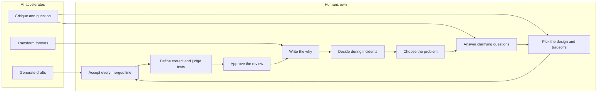
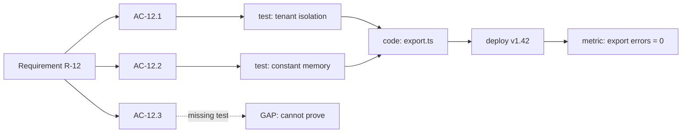

# Module 8.3 — دورة حياة البرمجيات بمساعدة AI
## AI-Assisted SDLC: per phase, what AI helps with and what humans own — Discovery, Requirements, Design, Implementation, Testing, Review, Documentation, Operations

> **المستوى:** Level 8 | **الموقع:** [3 من 11]
> **السابق:** [M8.2 — Vibe Coding vs Engineering](module-8.2-vibe-coding-vs-engineering.md) | **التالي:** [M8.4 — AI Agents](module-8.4-ai-agents.md)

---

## 1. المتطلبات
- [ ] SDLC: المراحل ولماذا تكلفة الخطأ تتضاعف كلّما تأخّر اكتشافه — [L4-M4.1](../level-4-software-engineering-foundations/module-4.1-sdlc.md)
- [ ] المتطلبات: وظيفية/غير وظيفية، الغموض، أسئلة الاستيضاح — [L4-M4.2](../level-4-software-engineering-foundations/module-4.2-requirements.md)
- [ ] الاختبار: الهرم، ما يُثبته الاختبار وما لا يُثبته — [L4-M4.11](../level-4-software-engineering-foundations/module-4.11-testing.md)
- [ ] مراجعة الكود والتصميم (RFC/ADR) — [L6-M6.2](../level-6-professional-engineering/module-6.2-code-review.md), [L6-M6.3](../level-6-professional-engineering/module-6.3-design-review-rfc-adr.md)
- [ ] المراقبة والحوادث — [L6-M6.6](../level-6-professional-engineering/module-6.6-observability.md), [L6-M6.7](../level-6-professional-engineering/module-6.7-incident-response.md)
- [ ] حلقة الهندسة ببوّابات — [L8-M8.2](module-8.2-vibe-coding-vs-engineering.md)

## 2. أهداف التعلّم
بعد هذه الوحدة ستستطيع:
1. رسم **مصفوفة الملكية** لكل مرحلة من SDLC: ما يُسرّعه AI، ما يبقى **قرارًا بشريًا مسؤولًا**، وما هو خطر إن فُوّض.
2. تمييز ثلاثة أنماط مساعدة: **توليد** (مسوّدة)، **نقد** (أسئلة، ثغرات، بدائل)، **تحويل** (كود→توثيق، متطلبات→اختبارات، سجلّات→فرضيات) — ومعرفة أن النقد غالبًا أعلى قيمة وأقلّ خطرًا من التوليد.
3. تصميم مسار **قابلية التتبّع** (requirement → AC → test → code → deployment → metric) الذي يجعل كود AI قابلًا للمحاسبة.
4. تحديد "**نقطة اللا رجوع**" في كل مرحلة — القرار الذي يُكلّف تغييره لاحقًا أضعافًا — وإبقائه بشريًا.
5. تطبيق الملكية على فريق حقيقي: من يُوقّع على ماذا، وكيف يُسجَّل.

## 3. شرح للمبتدئ
في M4.1 تعلّمت أن SDLC ليست خطًّا بل حلقة، وأن الخطأ في المتطلبات يُكلّف 10–100 ضعف إصلاحه في الإنتاج. AI لا يُغيّر هذه الحقيقة؛ يُغيّر **سرعة** كل مرحلة بشكل غير متساوٍ — وهذا هو الخطر: حين تُصبح مرحلة Implementation أسرع 5×، تُصبح الأخطاء القادمة من Requirements أسرع 5× أيضًا في الوصول إلى الإنتاج. لذلك السؤال في كل مرحلة ليس "هل يستطيع AI فعل هذا؟" (غالبًا نعم، جزئيًا) بل: **"من يملك القرار، ومن يتحمّل نتيجته، وما الدليل الذي يُقبل؟"**

**قاعدة عامّة قبل المصفوفة.** AI جيّد جدًا في ثلاث عمليات: **التوليد** (مسوّدة أولى سريعة لأي شيء: كود، وثيقة، حالات اختبار)، **النقد** (اقرأ هذا وأخبرني بالثغرات/الأسئلة/البدائل)، و**التحويل** (من شكل إلى شكل: كود→شرح، متطلبات→AC، سجلّ أخطاء→فرضيات). الأخطر منها هو التوليد، لأن المسوّدة المقنعة تُغري بالقبول؛ الأعلى قيمة بنسبة مخاطر هو **النقد**، لأن القرار يبقى عندك وتحصل على زوج عيون إضافي لا يتعب. القاعدة: **استخدم AI ناقدًا قبل أن تستخدمه مولّدًا.**

**المصفوفة مرحلة بمرحلة.**

**Discovery (اكتشاف المشكلة).** AI يساعد: تلخيص مقابلات المستخدمين، تجميع ملاحظات الدعم، اقتراح أسئلة لم تُطرح، تحليل بيانات الاستخدام. البشر يملكون: **اختيار المشكلة**. AI لا يعرف ما يُؤلم مستخدميك فعلًا، ولا يتحمّل تكلفة الفرصة البديلة، ولا يملك سياق الاستراتيجية (M6.8). الخطر: "AI قال إن المستخدمين يريدون X" حين يكون X هو ما يُشبه بيانات تدريبه. نقطة اللا رجوع: الالتزام بمشكلة لربع كامل.

**Requirements.** AI يساعد: تحويل الملاحظات إلى مسوّدة user stories، توليد **أسئلة استيضاح** ("ماذا يحدث إن كان المستخدم محذوفًا؟")، كشف التناقضات بين المتطلبات، صياغة AC من نثر غامض. البشر يملكون: **القرارات** ("نعم، المستخدم المحذوف يظهر كـ 'مجهول'") و**الأولويات** و**خارج النطاق**. كل إجابة على سؤال استيضاح هي قرار منتج/أعمال؛ AI يسأل، الإنسان يُجيب. الخطر: AI "يملأ الفراغات" بافتراضات معقولة لا يُعلن عنها — تجدها في الإنتاج. نقطة اللا رجوع: المواصفة التي ستُعطى للتنفيذ.

**Design.** AI يساعد: توليد **بدائل** ("3 طرق لتخزين التفضيلات، بمزايا وعيوب")، نقد تصميم مقترح ("ما الذي يفشل تحت الحمل؟")، مسوّدة ADR، كشف انتهاكات لاتفاقيات موثّقة. البشر يملكون: **الاختيار بين البدائل** و**المقايضات** و**الحدود** (ما يتحدّث مع ماذا). السبب: التصميم الجيّد تابع لسياق لا يظهر في النص — خبرة الفريق، الأنظمة القديمة، الاتجاه الاستراتيجي، تكلفة التشغيل. الخطر: AI يُفضّل الأنماط الأكثر شيوعًا في التدريب (microservices لثلاثة مستخدمين، M6.9). نقطة اللا رجوع: مخطط البيانات والحدود بين الخدمات.

**Implementation.** AI يساعد: **معظم الكتابة** — ضمن مواصفة وسياق (M8.5/8.6)؛ الكود المتكرّر، التكامل مع API موثّق، الترحيلات بين الأطر، الاختبارات. البشر يملكون: **القبول** — كل سطر يُدمج قرأه إنسان وفهمه (M8.1)، و**القرارات الدقيقة التي ليست في المواصفة** حين تظهر (توقّف واسأل، لا تخمّن). الخطر: الكمّ؛ 2,000 سطر مولَّد في اليوم لا يُراجع 2,000 سطر. نقطة اللا رجوع: الدمج في main.

**Testing.** AI يساعد: توليد **حالات اختبار من AC** (في سياق منفصل عن الكود)، اقتراح حالات حدّية مفقودة، كتابة اختبارات خاصّية (property-based)، توليد بيانات اختبار. البشر يملكون: **تعريف "صحيح"** (الـ AC)، و**الحكم على أن الاختبار يختبر شيئًا** (M8.7: الاختبار الذي يمرّ دائمًا ليس اختبارًا). الخطر الأكبر: اختبارات تُولَّد **من الكود** فتُثبّت أخطاءه؛ وقياس "التغطية" كبديل عن الصحّة. نقطة اللا رجوع: اعتبار المجموعة "كافية" وإيقاف التفكير.

**Review.** AI يساعد: **المراجعة الأولى** (أسلوب، أخطاء نمطية، ثغرات معروفة، اتّساق مع الاتفاقيات)، تلخيص PR ضخم، شرح ما يفعله جزء غامض. البشر يملكون: **الموافقة** — لا تُفوَّض أبدًا؛ المراجع البشري مسؤول عمّا وافق عليه (M6.2)، و**أسئلة "لماذا"** (هل كان يجب بناء هذا أصلًا؟ هل هذا المكان الصحيح؟). الخطر: مراجعة AI لكود AI — نفس النقاط العمياء (نفس التدريب)؛ و"AI وافق" كغطاء. نقطة اللا رجوع: الموافقة.

**Documentation.** AI يساعد: مسوّدة README من الكود، شرح الدوال، تحديث الوثائق عند تغيّر الكود، ترجمة. البشر يملكون: **"لماذا"** (القرارات والبدائل المرفوضة — M6.5: AI لا يعرف ما لم يُكتب)، و**الصحّة** (وثيقة مولَّدة خاطئة أسوأ من غيابها لأنها تُقنع). الخطر: توثيق جميل لسلوك متخيَّل. نقطة اللا رجوع: الوثيقة التي يبني عليها فريق آخر.

**Operations.** AI يساعد: تلخيص سجلّات، اقتراح **فرضيات** عن سبب تنبيه، كتابة استعلامات مقاييس، مسوّدة postmortem من الجدول الزمني، كتابة runbook. البشر يملكون: **القرار أثناء الحادثة** (rollback؟ feature flag؟ — M6.7؛ الوكيل الذي "يُصلح" الإنتاج تلقائيًا هو الحادثة التالية، M8.10)، و**تفسير ما حدث** (الفرضية تُختبر لا تُصدَّق)، و**action items** الحقيقية. الخطر: ثقة في تشخيص واثق لنظام لا يراه AI كاملًا. نقطة اللا رجوع: أي أمر يُنفَّذ على الإنتاج.

**قابلية التتبّع هي ما يجعل هذا كلّه قابلًا للمحاسبة.** حين يُولّد AI معظم الكود، الطريقة الوحيدة لمعرفة أن النظام يفعل ما طُلب هي سلسلة: `Requirement R → AC → Test (يفشل إن كُسر) → Code → Deployment → Metric يُثبت الأثر`. كل حلقة مفقودة في السلسلة هي مكان يمكن للنموذج أن "يبدو صحيحًا" فيه دون أن يكون كذلك. الأدوات في §7 تفحص هذه السلسلة آليًا.

## 4. النموذج الذهني
**"AI يُسرّع كل مرحلة؛ الإنسان يملك كل قرار لا رجعة فيه."** في كل مرحلة اسأل: أين نقطة اللا رجوع؟ ذلك هو ما يُوقّع عليه إنسان. وكل ما قبلها مسوّدات ونقد يمكن لـ AI إنتاجه بغزارة.

```text
المرحلة          AI يُسرّع (مسوّدة/نقد/تحويل)                البشر يملكون (نقطة اللا رجوع)
───────────────  ──────────────────────────────────────────  ───────────────────────────────────
Discovery        تلخيص، تجميع، أسئلة غير مطروحة              اختيار المشكلة والأولوية
Requirements     مسوّدة stories، أسئلة استيضاح، تناقضات       الإجابات، الأولويات، خارج النطاق
Design           بدائل، نقد، مسوّدة ADR                      الاختيار، المقايضات، الحدود
Implementation   معظم الكتابة ضمن مواصفة وسياق                قبول كل سطر؛ التوقّف عند غموض
Testing          حالات من AC، حدّيات، بيانات                 تعريف "صحيح"؛ هل الاختبار يختبر؟
Review           المرور الأول، تلخيص، شرح                    الموافقة؛ أسئلة "لماذا"
Documentation    مسوّدة "ماذا/كيف"، تحديث، ترجمة             "لماذا"؛ الصحّة
Operations       تلخيص سجلّات، فرضيات، runbook مسوّدة         القرار أثناء الحادثة؛ أي أمر إنتاجي
```

## 5. الرسم التوضيحي


سلسلة التتبّع:



## 6. مثال بسيط
```typescript
// نفس الطلب، في كل مرحلة: "أضف تفضيلات الإشعارات"
// Discovery  — AI: "من تذاكر الدعم، 31% من الشكاوى عن كثرة البريد"؛ الإنسان: "هذا هو ما نحلّه هذا الربع" ✔
// Requirements — AI يسأل: "هل تنطبق التفضيلات على الإشعارات الأمنية؟"؛ الإنسان: "لا — الأمنية إلزامية دائمًا" ✔ (قرار لم يكن ليخمّنه أحد)
// Design — AI: 3 بدائل (عمود JSONB / جدول preferences / خدمة مستقلّة)؛ الإنسان: "جدول؛ نحتاج استعلامات عكسية" ✔
// Implementation — AI يكتب المسار والمستودع والاختبارات من AC؛ الإنسان يقرأ كل سطر ويرفض `any` ✔
// Testing — AI يقترح: "ماذا عن مستخدم بلا صفّ تفضيلات؟" ← حالة حدّية مفقودة تُضاف إلى AC ✔
// Review — AI: "السطر 41 يُعيد تفضيلات أي userId من الاستعلام" ← IDOR؛ الإنسان يُصلح ويوافق ✔
// Documentation — AI يُولّد "كيف"؛ الإنسان يُضيف ADR: "لماذا جدول لا JSONB: استعلام 'كل من اختار X'" ✔
// Operations — تنبيه: ارتفاع 500 على /preferences؛ AI: 3 فرضيات؛ الإنسان يختبر، يُفعّل rollback ✔
```

## 7. مثال كود
أداتان: (1) **مُدقّق مصفوفة الملكية** — لكل مرحلة في خطّة مهمّة، يرفض تفويض ما يجب أن يبقى بشريًا ويطلب أدلّة محدّدة؛ (2) **فاحص قابلية التتبّع** — يقرأ متطلبات بـ AC، وملفات اختبار تُشير إلى AC بوسم (`// @ac AC-12.1`)، ونتائج التشغيل، ويُبلّغ عن الفجوات: AC بلا اختبار، اختبار بلا AC، AC باختبار فاشل، ومتطلب لا يمكن إثباته.

```text
m83-ai-assisted-sdlc/
├─ src/ownership.ts
├─ src/traceability.ts
└─ src/sdlc.test.ts
```

```typescript
// src/ownership.ts
// مصفوفة الملكية: ما يجوز تفويضه لـ AI في كل مرحلة وما يبقى قرارًا بشريًا بدليل
export type Phase = "discovery" | "requirements" | "design" | "implementation" | "testing" | "review" | "documentation" | "operations";
export type Actor = "ai" | "human";
export interface Activity { phase: Phase; name: string; actor: Actor; evidence?: string }

// الأنشطة التي لا تُفوَّض أبدًا، مع الدليل المطلوب من الإنسان
export const HUMAN_OWNED: Record<Phase, Record<string, string>> = {
  discovery: { "choose-problem": "written problem statement + why now" },
  requirements: { "answer-clarifications": "decision log entries", "set-out-of-scope": "out-of-scope list", "prioritize": "ranked list with owner" },
  design: { "pick-alternative": "ADR with rejected alternatives", "define-boundaries": "module/service boundary note" },
  implementation: { "accept-lines": "reviewed-lines == diff lines", "resolve-ambiguity": "question asked, decision recorded" },
  testing: { "define-correct": "acceptance criteria", "judge-tests": "mutation or fail-on-break evidence" },
  review: { "approve": "named approver", "ask-why": "at least one scope/placement question" },
  documentation: { "write-why": "rationale section", "verify-accuracy": "doc checked against behavior" },
  operations: { "incident-decision": "named incident commander decision", "run-prod-command": "approved change record" },
};

// الأنشطة المناسبة لـ AI (توليد/نقد/تحويل) — غير حصرية، للإرشاد
export const AI_SUITED: Record<Phase, string[]> = {
  discovery: ["summarize-feedback", "cluster-tickets", "suggest-unasked-questions"],
  requirements: ["draft-stories", "generate-clarifying-questions", "find-contradictions", "draft-ac"],
  design: ["generate-alternatives", "critique-design", "draft-adr"],
  implementation: ["write-code-from-spec", "boilerplate", "migrate-framework", "draft-tests-from-ac"],
  testing: ["cases-from-ac", "suggest-edge-cases", "property-tests", "test-data"],
  review: ["first-pass-review", "summarize-pr", "explain-code"],
  documentation: ["draft-how", "update-on-change", "translate"],
  operations: ["summarize-logs", "hypotheses", "draft-runbook", "draft-postmortem-timeline"],
};

export interface OwnershipReport { ok: boolean; violations: string[]; missingEvidence: string[]; notes: string[] }

export function auditPlan(activities: Activity[]): OwnershipReport {
  const violations: string[] = []; const missingEvidence: string[] = []; const notes: string[] = [];
  for (const a of activities) {
    const owned = HUMAN_OWNED[a.phase][a.name];
    if (owned && a.actor === "ai") violations.push(`${a.phase}/${a.name} is human-owned (delegated to ai); needs: ${owned}`);
    if (owned && a.actor === "human" && !a.evidence) missingEvidence.push(`${a.phase}/${a.name}: provide ${owned}`);
    if (!owned && a.actor === "human" && AI_SUITED[a.phase].includes(a.name)) notes.push(`${a.phase}/${a.name}: AI-suited; consider drafting with AI then judging`);
  }
  // كل مرحلة مُمثَّلة في الخطّة يجب أن تحوي قرارها البشري
  const phases = new Set(activities.map((a) => a.phase));
  for (const p of phases) for (const name of Object.keys(HUMAN_OWNED[p])) if (!activities.some((a) => a.phase === p && a.name === name)) missingEvidence.push(`${p}/${name}: human decision absent from plan`);
  return { ok: violations.length === 0 && missingEvidence.length === 0, violations, missingEvidence, notes };
}
```

```typescript
// src/traceability.ts
// سلسلة التتبّع: Requirement → AC → Test → Result. الفجوات = أماكن يمكن أن "يبدو" الكود صحيحًا فيها دون دليل
export interface Requirement { id: string; text: string; acceptance: { id: string; text: string }[] }
export interface TestFile { path: string; source: string }
export type TestResult = Record<string, "pass" | "fail" | "skip">;   // test name → result

export interface TraceReport {
  acWithoutTest: string[]; testsWithoutAc: string[]; acWithFailingTest: string[]; acWithSkippedOnly: string[];
  unprovableRequirements: string[]; coverage: number; ok: boolean;
}

const TAG = /\/\/\s*@ac\s+([A-Z]+-[\d.]+)\s*\n\s*test\(\s*["'`]([^"'`]+)["'`]/g;

// يستخرج (acId → testName) من ملفات الاختبار بوسم `// @ac AC-x.y` فوق `test("…")`
export function extractLinks(files: TestFile[]): { acId: string; testName: string; path: string }[] {
  const links: { acId: string; testName: string; path: string }[] = [];
  for (const f of files) for (const m of f.source.matchAll(TAG)) links.push({ acId: m[1]!, testName: m[2]!, path: f.path });
  return links;
}

export function trace(reqs: Requirement[], files: TestFile[], results: TestResult): TraceReport {
  const links = extractLinks(files);
  const allAc = reqs.flatMap((r) => r.acceptance.map((a) => ({ ...a, req: r.id })));
  const acIds = new Set(allAc.map((a) => a.id));
  const acWithoutTest = allAc.filter((a) => !links.some((l) => l.acId === a.id)).map((a) => a.id);
  const testsWithoutAc = links.filter((l) => !acIds.has(l.acId)).map((l) => `${l.testName} → ${l.acId} (unknown AC)`);
  const acWithFailingTest = [...new Set(links.filter((l) => results[l.testName] === "fail").map((l) => l.acId))];
  const acWithSkippedOnly = allAc.filter((a) => { const ls = links.filter((l) => l.acId === a.id); return ls.length > 0 && ls.every((l) => results[l.testName] !== "pass"); }).map((a) => a.id).filter((id) => !acWithFailingTest.includes(id));
  const unprovableRequirements = reqs.filter((r) => r.acceptance.length === 0 || r.acceptance.every((a) => acWithoutTest.includes(a.id))).map((r) => r.id);
  const proven = allAc.filter((a) => links.some((l) => l.acId === a.id && results[l.testName] === "pass")).length;
  const coverage = allAc.length ? proven / allAc.length : 0;
  return { acWithoutTest, testsWithoutAc, acWithFailingTest, acWithSkippedOnly, unprovableRequirements, coverage, ok: acWithoutTest.length === 0 && acWithFailingTest.length === 0 && acWithSkippedOnly.length === 0 && unprovableRequirements.length === 0 };
}

export function formatTrace(r: TraceReport): string {
  const lines = [`coverage: ${(r.coverage * 100).toFixed(0)}% of AC proven by a passing test`];
  if (r.acWithoutTest.length) lines.push(`AC without test: ${r.acWithoutTest.join(", ")}`);
  if (r.acWithFailingTest.length) lines.push(`AC with failing test: ${r.acWithFailingTest.join(", ")}`);
  if (r.acWithSkippedOnly.length) lines.push(`AC only skipped: ${r.acWithSkippedOnly.join(", ")}`);
  if (r.testsWithoutAc.length) lines.push(`tests pointing at unknown AC: ${r.testsWithoutAc.join("; ")}`);
  if (r.unprovableRequirements.length) lines.push(`requirements that cannot be proven: ${r.unprovableRequirements.join(", ")}`);
  return lines.join("\n");
}
```

```typescript
// src/sdlc.test.ts
import { test } from "node:test";
import assert from "node:assert/strict";
import { auditPlan, type Activity } from "./ownership.ts";
import { trace, formatTrace, type Requirement } from "./traceability.ts";

test("مصفوفة الملكية: تفويض الموافقة أو القرار أثناء الحادثة إلى AI = انتهاك؛ القرار البشري بلا دليل = ناقص", () => {
  const plan: Activity[] = [
    { phase: "requirements", name: "generate-clarifying-questions", actor: "ai" },
    { phase: "requirements", name: "answer-clarifications", actor: "human", evidence: "DEC-31..DEC-35" },
    { phase: "requirements", name: "set-out-of-scope", actor: "human" },                 // بلا دليل
    { phase: "review", name: "first-pass-review", actor: "ai" },
    { phase: "review", name: "approve", actor: "ai" },                                   // انتهاك
    { phase: "operations", name: "hypotheses", actor: "ai" },
    { phase: "operations", name: "run-prod-command", actor: "ai" },                      // انتهاك
  ];
  const r = auditPlan(plan);
  assert.equal(r.ok, false);
  assert.equal(r.violations.length, 2);
  assert.ok(r.violations[0]!.includes("review/approve"));
  assert.ok(r.missingEvidence.some((m) => m.startsWith("requirements/set-out-of-scope: provide")));
  assert.ok(r.missingEvidence.some((m) => m.includes("requirements/prioritize: human decision absent")));
  assert.ok(r.missingEvidence.some((m) => m.includes("operations/incident-decision")));
});

test("مصفوفة الملكية: خطّة سليمة تمرّ، ويُقترح استخدام AI للمسوّدات التي يكتبها الإنسان يدويًا", () => {
  const plan: Activity[] = [
    { phase: "design", name: "generate-alternatives", actor: "human" },                   // ملاحظة: مناسب لـ AI
    { phase: "design", name: "pick-alternative", actor: "human", evidence: "ADR-0042" },
    { phase: "design", name: "define-boundaries", actor: "human", evidence: "notifications module owns prefs table" },
  ];
  const r = auditPlan(plan);
  assert.equal(r.ok, true);
  assert.ok(r.notes[0]!.includes("AI-suited"));
});

test("قابلية التتبّع: AC بلا اختبار، اختبار لـ AC مجهول، AC باختبار فاشل، متطلّب غير قابل للإثبات", () => {
  const reqs: Requirement[] = [
    { id: "R-12", text: "export tenant orders as CSV", acceptance: [{ id: "AC-12.1", text: "tenant isolation" }, { id: "AC-12.2", text: "constant memory" }, { id: "AC-12.3", text: "csv injection escaped" }] },
    { id: "R-13", text: "security notifications are mandatory", acceptance: [{ id: "AC-13.1", text: "cannot opt out of security mail" }] },
    { id: "R-14", text: "fast", acceptance: [] },
  ];
  const files = [{ path: "export.test.ts", source: `
    // @ac AC-12.1
    test("tenant A cannot read tenant B orders", () => {});
    // @ac AC-12.2
    test("200k rows keep RSS flat", () => {});
    // @ac AC-99.9
    test("legacy test", () => {});
    // @ac AC-13.1
    test("opt-out of security mail is rejected", () => {});
  ` }];
  const r = trace(reqs, files, { "tenant A cannot read tenant B orders": "pass", "200k rows keep RSS flat": "pass", "legacy test": "pass", "opt-out of security mail is rejected": "fail" });
  assert.equal(r.ok, false);
  assert.deepEqual(r.acWithoutTest, ["AC-12.3"]);
  assert.deepEqual(r.acWithFailingTest, ["AC-13.1"]);
  assert.equal(r.testsWithoutAc.length, 1);
  assert.deepEqual(r.unprovableRequirements, ["R-14"]);
  assert.equal(Math.round(r.coverage * 100), 50);
  const txt = formatTrace(r);
  assert.ok(txt.includes("coverage: 50%") && txt.includes("AC-12.3") && txt.includes("R-14"));
  // بعد إضافة الاختبار المفقود وإصلاح الفاشل وحذف المتطلب الغامض:
  const fixedFiles = [{ path: "export.test.ts", source: files[0]!.source + `\n// @ac AC-12.3\ntest("cell starting with = is escaped", () => {});` }];
  const r2 = trace(reqs.slice(0, 2), fixedFiles, { "tenant A cannot read tenant B orders": "pass", "200k rows keep RSS flat": "pass", "legacy test": "pass", "opt-out of security mail is rejected": "pass", "cell starting with = is escaped": "pass" });
  assert.equal(r2.acWithoutTest.length, 0); assert.equal(r2.unprovableRequirements.length, 0); assert.equal(r2.coverage, 1);
  assert.equal(r2.ok, true);
});
```

**تشغيل:** `npx tsx --test src/*.test.ts`. في مشروعك الحقيقي: ضع وسم `// @ac` فوق اختباراتك، صدّر نتائج `node --test` بصيغة JSON، ومرّرها إلى `trace` في CI — فيصبح "كل AC له اختبار ناجح" بوّابة آلية لا وعدًا.

## 8. مثال من العالم الحقيقي
**فريق يُعيد توزيع وقته.** فريق من 6 مهندسين قاس أين يذهب وقته قبل اعتماد مساعدات AI وبعدها بستّة أشهر. قبل: ~45% كتابة كود، ~15% اختبار، ~10% مراجعة، ~10% تصميم ومتطلبات، ~20% اجتماعات/تشغيل. بعد: كتابة الكود هبطت إلى ~20%، لكن **المراجعة ارتفعت إلى ~25%** و**المتطلبات/التصميم إلى ~20%** و**الاختبار إلى ~20%**. الإنتاجية الإجمالية (ميزات مُسلَّمة لكل ربع، مع معدّل عيوب ثابت) ارتفعت ~40% — ليس 5×، لأن الوقت الموفَّر في الكتابة أُعيد استثماره في المراحل التي صارت عنق الزجاجة. المهندسون الذين حاولوا إبقاء المراجعة عند 10% بينما تضاعف الكود المولَّد كانوا مصدر معظم العيوب المُسرَّبة في الربع الأول — حتى تعلّم الفريق أن **ساعة الكتابة الموفَّرة ليست ساعة فراغ؛ هي ساعة تحقّق مُستحقّة** (M8.1).

الدرس العملي: إن اعتمدت AI ولم تتغيّر نسب وقتك بين المراحل، فأنت على الأرجح تُراكم دين تحقّق — أو لا تستخدمه فعلًا.

## 9. مثال من الإنتاج
**مسار PR مع بوّابات التتبّع في CI (مُبسَّط):**

```yaml
# .github/workflows/pr.yml (مقتطف)
jobs:
  trace:
    steps:
      - run: npx tsx scripts/extract-requirements.ts docs/requirements/*.md > /tmp/reqs.json
      - run: node --test --test-reporter=json src/**/*.test.ts > /tmp/results.json || true
      - run: npx tsx scripts/trace.ts /tmp/reqs.json "src/**/*.test.ts" /tmp/results.json
      #  يفشل إن: AC بلا اختبار | اختبار فاشل مرتبط بـ AC | متطلب بلا AC | PR يلمس requirements/ دون تحديث AC
  ownership:
    steps:
      - run: npx tsx scripts/ownership.ts .github/PR_TEMPLATE_ANSWERS.json
      #  قالب الـ PR يسأل: "من أجاب عن أسئلة الاستيضاح؟ (رابط)" / "ADR؟" / "هل قرأتَ كل سطر؟ [نعم/لا]"
      #  يفشل إن: "لا" على قراءة كل سطر، أو approve بواسطة بوت، أو مسار hard-gate بلا موافق بشري مُسمّى
```

وقالب الـ PR:

```markdown
## Requirement(s): R-12
## AC covered: AC-12.1 ✔ test:export.test.ts#tenant  | AC-12.2 ✔ | AC-12.3 ✔
## Generated by AI: ~70% (files: export.ts, export.test.ts) — I read every line: YES
## Human decisions made during implementation (not in spec): 
- Chose streaming over async job for ≤100k rows (DEC-41); >100k returns 413 (added AC-12.4)
## Why (design): ADR-0042
## Verification log: attached (M8.7 format)
```

ما يُلاحظ: الكمّ المولَّد يُعلَن لا يُخفى؛ القرارات التي اتُّخذت خارج المواصفة تُسجَّل وتُغذّي المواصفة (AC-12.4 جديدة)؛ وAI أنتج معظم الكود لكن لا توجد خانة واحدة في القالب يُوقّع فيها AI.

## 10. أخطاء شائعة في الفهم
| الخطأ | الصواب |
|---|---|
| "AI يحلّ محلّ مرحلة" | AI يُسرّع أنشطة داخل كل مرحلة؛ لا يُلغي أيّ مرحلة ولا قرارها البشري. |
| "التوليد هو الاستخدام الرئيسي" | النقد والتحويل غالبًا أعلى عائدًا وأقلّ خطرًا؛ ابدأ بهما. |
| "إن أنتج AI المتطلبات فقد وفّرنا الوقت" | AI يُنتج مسوّدة مقنعة مليئة بافتراضات غير معلنة؛ وقت المراجعة البشرية هنا هو الأغلى في الدورة كلّها. |
| "مراجعة AI تكفي للكود الصغير" | مراجعة AI لكود AI تتشارك النقاط العمياء؛ الموافقة بشرية دائمًا، ولو بعد مرور AI أولًا. |
| "التغطية 95% تعني أننا بخير" | التغطية تقيس التنفيذ لا التحقّق؛ اختبار يُنفّذ سطرًا دون أن يُؤكّد شيئًا يُحصى. التتبّع إلى AC هو المقياس. |
| "Operations هي المكان المثالي للأتمتة الكاملة" | هي المكان الأخطر: كل أمر إنتاجي نقطة لا رجوع. AI يُقترح، الإنسان يُقرّر (M8.10). |

## 11. أخطاء شائعة في التطبيق
1. **سؤال AI "اكتب المتطلبات" بدل "اسألني عن المتطلبات".** العلاج: اطلب 10 أسئلة استيضاح أولًا؛ أجب أنت؛ ثم اطلب المسوّدة من إجاباتك.
2. **ADR مولَّد بلا بدائل مرفوضة حقيقية.** العلاج: البدائل المرفوضة تُكتب من نقاش الفريق؛ AI يُنسّقها لا يخترعها.
3. **اختبارات من الكود.** العلاج: الاختبارات من AC في سياق لا يحوي التنفيذ (M8.7).
4. **لا تتبّع.** العلاج: وسم `@ac` + فاحص في CI؛ PR بلا AC لا يُراجَع.
5. **وثيقة مولَّدة لم تُقرأ.** العلاج: الوثيقة تُقرأ مقابل السلوك؛ "لماذا" يكتبه إنسان.
6. **وكيل يُنفّذ runbook على الإنتاج تلقائيًا.** العلاج: الوكيل يُعدّ الأمر ويعرض الأثر المتوقّع؛ إنسان مُسمّى يضغط الزرّ.

## 12. تمرين تصحيح
**الوضع:** تقرير التتبّع في CI أخضر (coverage 100%)، لكن ميزة "التفضيلات" في الإنتاج تُرسل بريدًا تسويقيًا لمن ألغوا الاشتراك. المتطلب R-20 "احترام إلغاء الاشتراك" له AC-20.1 واختبار ناجح.

**المهمّة:**
1. افتح الاختبار المرتبط بـ AC-20.1. ستجد: `test("unsubscribed users are skipped", () => { const r = shouldSend(user, "marketing"); assert.ok(r !== undefined); })` — اختبار **مولَّد من الكود** يُؤكّد أن الدالّة تُعيد شيئًا، لا أنها تُعيد `false`.
2. أين فشلت المصفوفة؟ (الإنسان لم يملك "judge-tests": لا دليل أن الاختبار يفشل عند كسر المنطق.)
3. أعد كتابة الاختبار من AC-20.1 نصًّا: Given مستخدم ألغى الاشتراك، When نُرسل "marketing"، Then `shouldSend === false`؛ وأضف اختبار طفرة يدوي: اعكس الشرط في `shouldSend` وتأكّد أن الاختبار يفشل.
4. أضف إلى بوّابة التتبّع شرطًا جديدًا: AC "سلبي" (منع/رفض) يحتاج اختبارًا يُؤكّد قيمة محدّدة لا مجرّد وجودها (ابحث عن `assert.ok(... !== undefined)` كعلامة).
5. **تأمّل:** التغطية 100% كانت صحيحة ومضلّلة في آن. ما المقياس الذي كان سيكشف هذا؟ (نسبة الاختبارات التي تفشل عند الطفرة — M8.7.)

## 13. تمرين معماري
**الوضع:** أنت تُصمّم "مصنع ميزات" لفريق من 20 مهندسًا سيُولّد ~70% من كوده بـ AI خلال العام. المطلوب تصميم SDLC كاملة بالملكية والبوّابات.

**المهمّة:**
1. لكل مرحلة من الثماني: اكتب نشاطين يُفوَّضان لـ AI (بنوعهما: توليد/نقد/تحويل)، والقرار البشري الذي لا يُفوَّض، والدليل الذي يُثبت أنه اتُّخذ.
2. صمّم سلسلة التتبّع من الفكرة إلى المقياس في الإنتاج: ما المعرّفات؟ أين تُخزَّن؟ ما الذي يفحصه CI وما الذي يفحصه إنسان؟
3. حدّد ثلاث نقاط لا رجوع تحتاج **موافقة ثانية** (شخصان)، وبرّرها بتكلفة التراجع.
4. ما الذي يحدث لمراحل Discovery وDesign حين يُصبح Implementation رخيصًا جدًا؟ (خطر "لنبنِ ونرَ" بدل "لنفهم أولًا" — كيف تحميهما؟)
5. قدّم كـ Assumption / Constraint / Tradeoff / Risk / Recommendation، مع مقياس واحد لكل مرحلة يُخبرك أن التوازن انكسر (مثل: زمن المراجعة لكل 100 سطر مولَّد يهبط تحت عتبة).

## 14. العلاقة بعصر AI
هذه الوحدة هي خريطة باقي المستوى على SDLC: M8.4 تشرح الأداة التي تُنفّذ الأنشطة المفوَّضة (الوكلاء)، M8.5/8.6 تُحسّنان مدخلات مرحلة Implementation، M8.7 تُعمّق Testing/Review، M8.8/8.9 تشرحان لماذا تفشل المراحل المفوَّضة وكيف تُهاجَم، M8.10 تُرسّم نقاط اللا رجوع، وM8.11 تُشغّل الحلقة كاملة. وفي L9 ستُسلّم capstone بسلسلة تتبّع كاملة — في المسار B سيُطلب منك تقرير ملكية: من قرّر ماذا.

## 15. ما يجب إتقانه
- مصفوفة الملكية الثمانية: AI يُسرّع / الإنسان يملك / نقطة اللا رجوع.
- الأنماط الثلاثة (توليد/نقد/تحويل) وأولوية النقد.
- سلسلة التتبّع Requirement → AC → Test → Code → Deploy → Metric والفجوات الأربع التي تكشفها.
- الخطر المميّز لكل مرحلة (افتراضات مخفيّة، أنماط شائعة، اختبارات من الكود، مراجعة AI لـ AI، وثيقة مقنعة خاطئة، أمر إنتاجي تلقائي).

## 16. ما يجب فهمه
- لماذا تتغيّر نسب الوقت بين المراحل، ولماذا بقاؤها ثابتًا علامة خطر.
- قالب PR يُعلن الكمّ المولَّد والقرارات خارج المواصفة.
- فكرة "AC سلبي يحتاج تأكيدًا محدّدًا".

## 17. ما يمكن تأجيله
- أدوات تتبّع تجارية (ALM) ومواءمتها مع معايير تنظيمية.
- قياس عائد الاستثمار على مستوى المنظّمة (DORA metrics مع AI) — يحتاج بيانات أشهر.

## 18. الخلاصة
AI لا يُلغي أي مرحلة من SDLC؛ يُسرّعها بشكل غير متساوٍ، فيدفع الأخطاء القادمة من المراحل المبكّرة إلى الإنتاج أسرع. في كل مرحلة: AI يُولّد ويَنقد ويُحوّل؛ الإنسان يملك القرار الذي لا رجعة فيه — اختيار المشكلة، الإجابات عن الاستيضاح، اختيار التصميم، قبول كل سطر، تعريف "صحيح"، الموافقة، "لماذا"، والقرار أثناء الحادثة. وما يربط هذا كلّه بالمحاسبة هو سلسلة تتبّع لا تنقطع من المتطلب إلى المقياس. استخدم AI ناقدًا قبل أن تستخدمه مولّدًا، ولا تدع "AI وافق" يظهر في أي مكان يُوقّع فيه إنسان.

## 19. المراجع الرسمية
- ISO/IEC/IEEE 12207 — Systems and software engineering: Software life cycle processes — المراحل والمسؤوليات بلغة المعايير.
- Google — "Software Engineering at Google", ch. 9 "Code Review" & ch. 11 "Testing Overview" — من يُوافق ولماذا، وما يُثبته الاختبار.
- IEEE Std 830 / ISO 29148 — Requirements engineering: خصائص المتطلب الجيّد (unambiguous, verifiable, traceable).
- DORA — "Accelerate State of DevOps" reports (2024 edition includes AI adoption findings) — أثر AI على سرعة التسليم والاستقرار.
- Michael Nygard — "Documenting Architecture Decisions" (ADR) — الصيغة التي يحتاجها "لماذا" البشري.
- OWASP — "Software Assurance Maturity Model (SAMM)" — الأمن كنشاط في كل مرحلة لا كمرحلة.

---

### المصطلحات في هذه الوحدة
| English | العربية |
|---|---|
| Ownership matrix | مصفوفة الملكية (من يملك القرار في كل مرحلة) |
| Point of no return | نقطة اللا رجوع (قرار تكلفة تغييره لاحقًا باهظة) |
| Generate / Critique / Transform | توليد / نقد / تحويل (أنماط مساعدة AI) |
| Clarifying question | سؤال استيضاح |
| Traceability | قابلية التتبّع (متطلب → AC → اختبار → كود → مقياس) |
| Unprovable requirement | متطلب غير قابل للإثبات (بلا AC أو بلا اختبار) |
| Negative AC | معيار قبول سلبي (منع/رفض) |
| Decision log | سجلّ القرارات |
| Runbook | دليل تشغيل للحوادث |
| Verification debt | دين التحقّق (من M8.1) |
