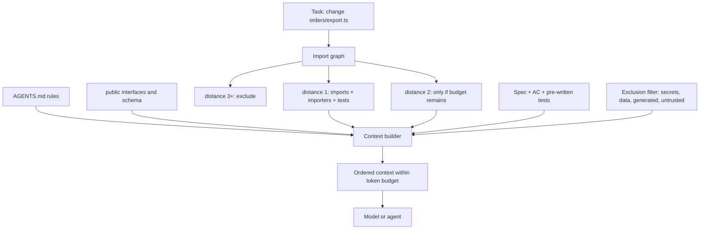

# Module 8.5 — هندسة السياق
## Context Engineering: making AI understand your repository, architecture, conventions, requirements, and constraints — what to include, what to exclude, and in what order

> **المستوى:** Level 8 | **الموقع:** [5 من 11]
> **السابق:** [M8.4 — AI Agents](module-8.4-ai-agents.md) | **التالي:** [M8.6 — AI Delegation](module-8.6-ai-delegation.md)

---

## 1. المتطلبات
> **قبل أن تتعلم هذا، يجب أن تفهم:**
- [ ] نافذة السياق وما يحدث حين تمتلئ — [L8-M8.4](module-8.4-ai-agents.md)
- [ ] الوحدات والاستيراد ورسم الاعتماديات — [L1-M1.8](../level-1-programming/module-1.8-modules.md), [L4-M4.7](../level-4-software-engineering-foundations/module-4.7-coupling-cohesion.md)
- [ ] الرسوم البيانية وBFS (لرسم الاعتماديات) — [L3-M3.6](../level-3-core-computer-science/module-3.6-graphs.md)
- [ ] التوثيق: ADR، README، ما يُكتب وما لا يُكتب — [L6-M6.5](../level-6-professional-engineering/module-6.5-documentation.md)
- [ ] الأسرار وملفات `.env` ولماذا لا تُقرأ ولا تُرسل — [L0-M0.4](../level-0-absolute-foundations/module-04-files-terminal-shell.md), [L5-M5.4](../level-5-building-real-software/module-5.4-security.md)

## 2. أهداف التعلّم
بعد هذه الوحدة ستستطيع:
1. تعريف **هندسة السياق**: تصميم ما يراه النموذج (وما لا يراه) وبأي ترتيب، ضمن ميزانية tokens محدودة — بوصفه **قرارًا هندسيًا** لا تفصيلًا تقنيًا.
2. تمييز **طبقات السياق**: ثابت (قواعد المستودع، المعمارية، الاتفاقيات)، شبه ثابت (الواجهات العامّة، المخطط)، خاص بالمهمّة (المواصفة، الملفات ذات الصلة، الاختبارات كمواصفة)، ديناميكي (مخرجات الأدوات).
3. كتابة **ملف تعليمات مستودع** فعّال (`AGENTS.md`/`CLAUDE.md`/`.cursorrules` وما شابه): قصير، قابل للتنفيذ، يُحدّد "كيف نفعل الأشياء هنا" و"ما لا يُفعل أبدًا".
4. اختيار الملفات ذات الصلة بمهمّة عبر **رسم الاستيراد** (import graph) والمسافة من نقطة التغيير، لا بالتخمين أو "كل المستودع".
5. تطبيق **قواعد الاستبعاد**: أسرار، بيانات حقيقية، ملفات مولَّدة، اعتمادات، مخرجات ضخمة — ولماذا الاستبعاد مسألة أمن وجودة معًا.
6. تشخيص أعراض السياق السيّئ: كود لا يتبع الاتفاقيات، تكرار لدالّة موجودة، كسر قاعدة قيلت سابقًا، "نسيان" وسط المهمّة.

## 3. شرح للمبتدئ
تخيّل أنك تطلب من مهندس ممتاز، بدأ اليوم في شركتك، تنفيذ مهمّة — عبر البريد فقط، ولا يستطيع أن يسألك، وسينسى كل شيء غدًا. ما الذي ستُرفقه بالبريد؟ ليس "المستودع كلّه" (لن يقرأه، وسيضيع)، وليس "المهمّة في سطر" (سيخمّن الباقي). سترفق: **كيف نفعل الأشياء هنا** (صفحة)، **خريطة الأجزاء ذات الصلة** (أين يعيش هذا الشيء، ما يتحدّث معه)، **الواجهات** التي سيستدعيها، **المواصفة** بمعايير قبولها، و**مثالًا** على كود مشابه مقبول. وستتأكّد ألّا تُرفق كلمات مرور الإنتاج. هذا بالضبط هو هندسة السياق — والنموذج اللغوي هو ذلك المهندس: ممتاز، لا يسأل كفاية، ينسى، ولديه حقيبة بريد بحجم محدود.

**لماذا "هندسة"؟** لأن للسياق ميزانية (نافذة محدودة — M8.4)، وتكلفة (ما تُضيفه يُزيح شيئًا آخر ويُشتّت الانتباه: النماذج تُجيد الالتقاط من بداية السياق ونهايته أكثر من وسطه — ظاهرة "الضياع في الوسط")، ومخاطر (ما يُقرأ قد يحوي تعليمات خبيثة — M8.9 — أو أسرارًا تُسرَّب). فالقرار "ماذا أُدخل" له مقايضات كأي قرار تصميم: الدقّة مقابل الحجم، الشمول مقابل التركيز، الحداثة مقابل الاستقرار.

**طبقات السياق.** من الأبطأ تغيّرًا إلى الأسرع:
1. **ثابت — قواعد المستودع.** ملف تعليمات واحد (`AGENTS.md` أو ما يُعادله لأداتك) يُحمَّل في كل جلسة: ما المشروع، كيف يُبنى ويُختبر (الأوامر بالضبط)، الاتفاقيات (أسماء، أخطاء، سجلّات، طبقات)، **المحرّمات** ("لا ORM جديد"، "لا `any`"، "لا تعديل ملفات اختبار"، "الاستعلامات عبر المستودع فقط")، وأين توجد الوثائق الأعمق. **قصير** (صفحة إلى صفحتين): كل سطر هنا يُقرأ في كل جلسة ويُزاحم المهمّة؛ والقواعد الكثيرة تُنسى مثل القليلة ولكنها تُكلّف أكثر.
2. **شبه ثابت — المعمارية والواجهات.** مخطط الوحدات وحدودها (M6.9)، ADRs ذات الصلة، الواجهات العامّة (`public.ts`، أنواع DTO، مخطط DB) — لا التنفيذات. النموذج يحتاج **التوقيعات** ليستدعي صحيحًا، لا 800 سطر من المنطق الداخلي.
3. **خاص بالمهمّة.** المواصفة (M8.6)، الملفات التي ستتغيّر، جيرانها المباشرون في رسم الاستيراد، الاختبارات الموجودة لها (**الاختبارات أفضل مواصفة**: تُبيّن السلوك المتوقّع والأسلوب معًا)، ومثال واحد على ميزة مشابهة منفَّذة "كما نُحبّ".
4. **ديناميكي.** مخرجات الأدوات أثناء العمل (M8.4) — تُقتطع وتُلخَّص كي لا تُزيح الطبقات الأعلى.

**ترتيب السياق.** ضع الأهمّ حيث يُلتقط: القواعد الصلبة والمهمّة **في البداية**، التذكير بالقيود الحرجة ومعايير القبول **في النهاية**، والمواد المرجعية الكبيرة في الوسط. وحين يطول العمل، أعد حقن القواعد الحرجة (أعراض النسيان في M8.4 سببها غالبًا أن القاعدة غرقت في الوسط).

**اختيار الملفات ذات الصلة — بالرسم لا بالتخمين.** مهمّة تلمس `orders/export.ts`؟ ذو الصلة: الملف نفسه، ما يستورده مباشرة (الواجهات التي سيستدعيها)، ما يستورده هو (من سينكسر إن غيّرت توقيعه)، واختباراته. المسافة 1 في رسم الاستيراد شبه إلزامية، المسافة 2 بحسب الميزانية، أبعد من ذلك يُستبعد إلا لسبب. وداخل الملف الكبير، الواجهة العامّة قبل التنفيذ. §7 يبني هذا.

**ما يُستبعد — دائمًا.** (1) **الأسرار** (`.env`, مفاتيح، شهادات، `credentials.json`): حتى لو كانت مفيدة "لفهم الإعداد"؛ ما يدخل السياق قد يخرج في الكود أو في سجلّات المُورّد. استخدم `.env.example`. (2) **بيانات حقيقية** (dumps، سجلّات إنتاج فيها PII): نفس السبب + قانوني. (3) **الملفات المولَّدة والاعتمادات** (`node_modules`, `dist`, lockfiles, ملفات مُجمَّعة): ضخمة وعديمة القيمة. (4) **ملفات ثنائية وبيانات كبيرة**. (5) **ملفات من مصادر غير موثوقة دون فحص** (قضايا، تعليقات PR خارجية، وثائق منسوخة): قد تحوي تعليمات مُوجَّهة للنموذج (M8.9). (6) **المخرجات الضخمة** غير المقتطعة.

**ملف التعليمات الجيّد مقابل السيّئ.** السيّئ: 1,200 سطر من "أفضل الممارسات" العامّة ("اكتب كودًا نظيفًا"، "اتبع SOLID") التي لا تُميّز مستودعك ولا يُمكن التحقّق منها. الجيّد: محدّد، قابل للتحقّق، خاص بك:

```markdown
# AGENTS.md (مثال مُكثَّف)
## Build & test
- Install: `pnpm i` · Test: `pnpm test` (node:test) · Typecheck: `pnpm tsc --noEmit` · Lint: `pnpm lint`
- A task is not done until all four pass. Never edit *.test.ts to make tests pass; stop and report instead.
## Architecture (see docs/architecture.md, ADRs in docs/adr/)
- Modules: orders/, payments/, notifications/, shared/. Import only from a module's `public.ts`.
- DB access only via `*Repository` classes in `<module>/infra/`. No raw SQL outside repositories.
- Errors: throw `AppError` subclasses (shared/errors.ts); never `throw new Error("string")` in domain code.
## Conventions
- TypeScript strict; no `any` (use `unknown` + narrowing). Zod schemas at every boundary (HTTP, queue, DB rows).
- Logging: `logger.info({ ctx }, "msg")` — structured; no console.log.
- Money: integer minor units (`amountMinor: number`), never floats.
## Never
- New dependencies without an ADR. Touch db/migrations/, infra/, src/auth/ (human-owned).
- Read or print .env*, secrets/, or anything matching /(token|secret|key)=/ .
## When unsure
- Ask before guessing: missing AC, ambiguous behavior, or a change outside the listed files.
```

**الاختبارات كمواصفة.** أعلى كثافة معلومات لكل token في مستودعك هي اختباراتك الجيّدة: تُظهر الواجهة، السلوك المتوقّع، الحالات الحدّية، وأسلوب الكود. ميزة جديدة؟ أرفق اختبارات ميزة شقيقة. وعند التفويض (M8.6)، اكتب اختبارات AC **قبل** التوليد وضعها في السياق: الآن "أرخص طريق" للنموذج هو إرضاءها (وهي محمية من التعديل — M8.4).

**أعراض السياق السيّئ** (تُشخّص قبل لوم النموذج): كود يُخالف الاتفاقيات ← القاعدة غير موجودة أو غرقت؛ دالّة مكرّرة لشيء موجود ← الواجهة العامّة لم تُرفق؛ استدعاء بتوقيع خاطئ ← التنفيذ أُرفق بدل الواجهة أو نسخة قديمة؛ "نسيان" قاعدة بعد 30 خطوة ← مخرجات ضخمة أزاحتها، أعد حقنها؛ اقتراح مكتبة لا تستخدمونها ← لا "Never" يمنعها.

## 4. النموذج الذهني
**"السياق هو بريد الإحاطة لمهندس ممتاز سينسى غدًا ولا يستطيع السؤال."** قصير حيث يُقرأ كل مرّة، دقيق حيث يُستدعى، مستبعِد لما يُؤذي، ومرتّب بحيث تكون القواعد الصلبة والـ AC في الأطراف لا في الوسط.

```text
 token budget ─────────────────────────────────────────────────────────────────────────────
 │ [START: high recall]      [MIDDLE: lower recall]                         [END: high recall]
 │  rules (AGENTS.md)        public interfaces · schema · ADR excerpts       task spec + AC
 │  task statement           related files by import distance (1, then 2)    hard constraints reminder
 │                           sibling feature + its tests (as style/spec)      "if unsure, ask"
 │                           tool outputs (truncated, summarized)
 └──────────────────────────────────────────────────────────────────────────────────────────
 EXCLUDED: .env* · secrets · prod data/PII · node_modules/dist/lockfiles · binaries · untrusted text · raw huge logs
```

## 5. الرسم التوضيحي


## 6. مثال بسيط
```typescript
// نفس المهمّة "أضف حقل note إلى الطلب"، بسياقين:
// سياق فقير: "أضف حقل note إلى الطلب" + المستودع مفتوح للوكيل بلا قواعد
//   النتيجة: عدّل جدول DB مباشرة بـ SQL خام في المعالج (لا مستودع)، أضاف `note: any`، كتب console.log،
//   وأنشأ دالّة validateOrder جديدة رغم وجود zod schema في orders/public.ts — كلّها أعراض سياق لا أعراض غباء.
// سياق مهندَس:
const context = [
  readFile("AGENTS.md"),                                   // القواعد: Repository فقط، لا any، zod عند الحدود، لا console.log
  readFile("orders/public.ts"),                            // الواجهة: OrderSchema موجود — سيُمدّده بدل أن يُكرّره
  readFile("orders/infra/order.repository.ts"),            // أين تُكتب الاستعلامات
  readFile("orders/order.test.ts"),                        // الأسلوب + السلوك المتوقّع
  spec({ ac: ["AC1: note ≤ 500 chars, optional", "AC2: rejected with 400 when longer", "AC3: persisted and returned"] }),
  "Reminder: migrations are human-owned — propose the migration SQL in your summary, do not create the file.",
];
// النتيجة: مدّد OrderSchema بـ z.string().max(500).optional()، أضاف العمود عبر اقتراح ترحيل، عدّل المستودع، 3 اختبارات من AC.
```

## 7. مثال كود
**بانٍ للسياق** يعمل على مستودع وهمي (خريطة مسار→محتوى): يبني رسم الاستيراد من عبارات `import`، يُرتّب الملفات بالمسافة من ملفات الهدف، يُطبّق قواعد الاستبعاد (أسرار بالاسم وبالمحتوى، مولَّد، ثنائي، ضخم)، يُقدّم الواجهات العامّة والاختبارات، ويملأ ميزانية tokens بالترتيب (قواعد → مهمّة → واجهات → مسافة 1 → مسافة 2 → تذكير بالقيود في النهاية)، ويُبلّغ ما استُبعد ولماذا — لأن "ما لم يُرَ" يُفسّر معظم الأخطاء لاحقًا.

```text
m85-context-engineering/
├─ src/context-builder.ts
└─ src/context-builder.test.ts
```

```typescript
// src/context-builder.ts
// بناء سياق ضمن ميزانية: رسم استيراد + أولويات + استبعادات + ترتيب الأطراف
export type Repo = Map<string, string>;   // path → content
export interface BuildOptions { targets: string[]; task: string; acceptance: string[]; rulesFile?: string; budgetTokens: number; maxDistance?: number }
export interface Section { kind: "rules" | "task" | "interface" | "file" | "test" | "reminder"; path?: string; distance?: number; tokens: number; text: string }
export interface Excluded { path: string; reason: string }
export interface BuiltContext { sections: Section[]; excluded: Excluded[]; tokensUsed: number; dropped: { path: string; reason: string }[] }

export const estimateTokens = (s: string) => Math.ceil(s.length / 4);

const SECRET_NAME = /(^|\/)(\.env(\..*)?|.*\.(pem|key|p12)|credentials\.json|secrets?\/.*)$/i;
const SECRET_CONTENT = /(api[_-]?key|secret|token|password|key)\s*[:=]\s*["']?[A-Za-z0-9_\-\/+=]{12,}|sk_(live|test)_[A-Za-z0-9]{8,}/i;
const GENERATED = /(^|\/)(node_modules|dist|build|coverage|\.next)\/|(^|\/)(package-lock\.json|pnpm-lock\.yaml|yarn\.lock)$|\.min\.js$|\.generated\./;
const BINARY = /\.(png|jpe?g|gif|pdf|zip|woff2?|ico|mp4)$/i;
const DATA_DUMP = /\.(sql\.gz|dump|csv)$|(^|\/)(fixtures\/prod|data\/exports)\//i;

export function exclusionReason(path: string, content: string, maxFileTokens = 6_000): string | null {
  if (SECRET_NAME.test(path)) return "secret file (by name)";
  if (SECRET_CONTENT.test(content)) return "secret-like content";
  if (GENERATED.test(path)) return "generated/dependency";
  if (BINARY.test(path)) return "binary";
  if (DATA_DUMP.test(path)) return "data dump (possible PII)";
  if (estimateTokens(content) > maxFileTokens) return `too large (${estimateTokens(content)} tokens) — summarize instead`;
  return null;
}

const IMPORT_RE = /from\s+["'](\.{1,2}\/[^"']+)["']/g;
function resolve(from: string, spec: string): string {
  const parts = from.split("/").slice(0, -1);
  for (const seg of spec.split("/")) { if (seg === "..") parts.pop(); else if (seg !== ".") parts.push(seg); }
  const p = parts.join("/"); return p.endsWith(".ts") ? p : `${p}.ts`;
}

// رسم استيراد غير موجَّه (المستوردون والمستورَدون كلاهما ذو صلة)
export function importGraph(repo: Repo): Map<string, Set<string>> {
  const g = new Map<string, Set<string>>();
  const link = (a: string, b: string) => { (g.get(a) ?? g.set(a, new Set()).get(a)!).add(b); (g.get(b) ?? g.set(b, new Set()).get(b)!).add(a); };
  for (const [path, content] of repo) for (const m of content.matchAll(IMPORT_RE)) { const dep = resolve(path, m[1]!); if (repo.has(dep)) link(path, dep); }
  return g;
}

// BFS من ملفات الهدف → مسافة كل ملف
export function distances(graph: Map<string, Set<string>>, targets: string[]): Map<string, number> {
  const dist = new Map<string, number>(); const q: string[] = [];
  for (const t of targets) { dist.set(t, 0); q.push(t); }
  while (q.length) { const cur = q.shift()!; for (const n of graph.get(cur) ?? []) if (!dist.has(n)) { dist.set(n, dist.get(cur)! + 1); q.push(n); } }
  return dist;
}

const isTest = (p: string) => /\.test\.ts$/.test(p);
const isInterface = (p: string) => /(^|\/)public\.ts$|\.types\.ts$|(^|\/)schema\.(ts|sql)$/.test(p);
export const testFor = (p: string) => p.replace(/\.ts$/, ".test.ts");

export function buildContext(repo: Repo, opts: BuildOptions): BuiltContext {
  const maxDistance = opts.maxDistance ?? 2; const excluded: Excluded[] = []; const dropped: { path: string; reason: string }[] = [];
  const dist = distances(importGraph(repo), opts.targets);
  // اختبارات ملفات الهدف تُعامَل كمسافة 0 (مواصفة)
  for (const t of opts.targets) if (repo.has(testFor(t))) dist.set(testFor(t), 0);
  const candidates = [...dist].filter(([, d]) => d <= maxDistance).sort((a, b) => a[1] - b[1] || a[0].localeCompare(b[0]));

  const head: Section[] = []; const body: Section[] = [];
  const rules = opts.rulesFile ? repo.get(opts.rulesFile) : undefined;
  if (rules) head.push({ kind: "rules", path: opts.rulesFile, tokens: estimateTokens(rules), text: rules });
  const taskText = `TASK: ${opts.task}\nACCEPTANCE:\n${opts.acceptance.map((a, i) => `  AC${i + 1}: ${a}`).join("\n")}`;
  head.push({ kind: "task", tokens: estimateTokens(taskText), text: taskText });
  const reminderText = `REMINDER: satisfy every AC above; follow the rules; if a change is needed outside the listed files, stop and ask.`;
  const reminder: Section = { kind: "reminder", tokens: estimateTokens(reminderText), text: reminderText };

  // الترتيب داخل الجسم: واجهات أولًا، ثم اختبارات، ثم ملفات — وكلٌّ بحسب المسافة
  const rank = (p: string, d: number) => d * 10 + (isInterface(p) ? 0 : isTest(p) ? 1 : 2);
  const ordered = candidates.map(([p, d]) => ({ p, d })).sort((a, b) => rank(a.p, a.d) - rank(b.p, b.d));
  let used = head.reduce((s, x) => s + x.tokens, 0) + reminder.tokens;
  for (const { p, d } of ordered) {
    const content = repo.get(p)!; const reason = exclusionReason(p, content);
    if (reason) { excluded.push({ path: p, reason }); continue; }
    const tokens = estimateTokens(content) + 8;
    if (used + tokens > opts.budgetTokens) { dropped.push({ path: p, reason: `budget (distance ${d})` }); continue; }
    body.push({ kind: isInterface(p) ? "interface" : isTest(p) ? "test" : "file", path: p, distance: d, tokens, text: `// ${p}\n${content}` }); used += tokens;
  }
  // الملفات التي لا تصلها الحواف (مسافة ∞) تُستبعد ضمنيًا — نُبلّغ عن الحسّاسة منها فقط إن كانت "تبدو" ذات صلة بالاسم
  for (const [p, c] of repo) if (!dist.has(p) && SECRET_NAME.test(p)) excluded.push({ path: p, reason: exclusionReason(p, c) ?? "secret" });
  return { sections: [...head, ...body, reminder], excluded, tokensUsed: used, dropped };
}

export function render(ctx: BuiltContext): string { return ctx.sections.map((s) => s.text).join("\n\n---\n\n"); }
```

```typescript
// src/context-builder.test.ts
import { test } from "node:test";
import assert from "node:assert/strict";
import { buildContext, importGraph, distances, exclusionReason, render, type Repo } from "./context-builder.ts";

const repo: Repo = new Map([
  ["AGENTS.md", "# Rules\n- DB only via repositories\n- no any\n- never edit *.test.ts"],
  ["orders/public.ts", "export type Order = { id: string; tenantId: string; total: number };\nexport { exportCsv } from './export';"],
  ["orders/export.ts", "import { OrderRepository } from './infra/order.repository';\nimport { escapeCell } from '../shared/csv';\nexport function exportCsv() {}"],
  ["orders/export.test.ts", "test('AC-12.1 tenant isolation');"],
  ["orders/infra/order.repository.ts", "import { db } from '../../shared/db';\nexport class OrderRepository {}"],
  ["shared/csv.ts", "export const escapeCell = (v: string) => v;"],
  ["shared/db.ts", "export const db = {};"],
  ["shared/logger.ts", "export const logger = {};"],
  ["payments/charge.ts", "import { db } from '../shared/db';\nexport function charge() {}"],
  ["notifications/send.ts", "export function send() {}"],
  [".env", "DATABASE_URL=postgres://u:p@h/db\nSTRIPE_SECRET=sk_live_1234567890abcdef"],
  ["config/keys.ts", "export const stripeKey = 'sk_live_ABCDEFGHIJKLMNOP1234';"],
  ["node_modules/zod/index.js", "module.exports = {}"],
  ["docs/logo.png", "PNG..."],
  ["fixtures/prod/customers.csv", "email,name\na@b.c,Ali"],
]);

test("رسم الاستيراد والمسافات: الجيران المباشرون مسافة 1، الأبعد 2، غير المتّصل لا مسافة", () => {
  const d = distances(importGraph(repo), ["orders/export.ts"]);
  assert.equal(d.get("orders/infra/order.repository.ts"), 1);
  assert.equal(d.get("shared/csv.ts"), 1);
  assert.equal(d.get("orders/public.ts"), 1);          // يستورد export (مستورِد)
  assert.equal(d.get("shared/db.ts"), 2);
  assert.equal(d.get("payments/charge.ts"), 3);        // عبر shared/db
  assert.equal(d.get("notifications/send.ts"), undefined);
});

test("الاستبعاد: أسرار بالاسم وبالمحتوى، مولَّد، ثنائي، بيانات؛ وملف كبير يُقترح تلخيصه", () => {
  assert.equal(exclusionReason(".env", "X=1"), "secret file (by name)");
  assert.equal(exclusionReason("config/keys.ts", repo.get("config/keys.ts")!), "secret-like content");
  assert.equal(exclusionReason("node_modules/zod/index.js", ""), "generated/dependency");
  assert.equal(exclusionReason("docs/logo.png", ""), "binary");
  assert.equal(exclusionReason("fixtures/prod/customers.csv", ""), "data dump (possible PII)");
  assert.ok(exclusionReason("big.ts", "x".repeat(40_000))!.startsWith("too large"));
  assert.equal(exclusionReason("orders/export.ts", repo.get("orders/export.ts")!), null);
});

test("البناء: قواعد ومهمّة في البداية، تذكير في النهاية، واجهات واختبارات قبل الملفات، ضمن الميزانية، مع تقرير ما استُبعد/أُسقط", () => {
  const ctx = buildContext(repo, { targets: ["orders/export.ts"], task: "add tenant filter + csv escaping", acceptance: ["tenant isolation", "escaped cells"], rulesFile: "AGENTS.md", budgetTokens: 10_000 });
  assert.equal(ctx.sections[0]!.kind, "rules"); assert.equal(ctx.sections[1]!.kind, "task"); assert.equal(ctx.sections.at(-1)!.kind, "reminder");
  const body = ctx.sections.slice(2, -1).map((s) => `${s.distance}:${s.kind}:${s.path}`);
  assert.deepEqual(body, [
    "0:test:orders/export.test.ts", "0:file:orders/export.ts",
    "1:interface:orders/public.ts", "1:file:orders/infra/order.repository.ts", "1:file:shared/csv.ts",
    "2:file:shared/db.ts",
  ]);
  assert.ok(!render(ctx).includes("sk_live"));                                   // لا سرّ في السياق أبدًا
  assert.ok(ctx.excluded.some((e) => e.path === ".env"));
  assert.ok(!body.some((b) => b.includes("payments")));                          // مسافة 3 خارج maxDistance
  // ميزانية ضيّقة: تُسقط الأبعد أولًا وتُبقي الأطراف
  const tight = buildContext(repo, { targets: ["orders/export.ts"], task: "t", acceptance: ["a"], rulesFile: "AGENTS.md", budgetTokens: 110 });
  assert.equal(tight.sections[0]!.kind, "rules"); assert.equal(tight.sections.at(-1)!.kind, "reminder");
  assert.ok(tight.dropped.some((d) => d.path === "shared/db.ts"));
  assert.ok(tight.tokensUsed <= 110);
});
```

**تشغيل:** `npx tsx --test src/*.test.ts`. وجّه `buildContext` إلى مستودعك الحقيقي (اقرأ الملفات في `Map`) وراقب `excluded` و`dropped` — القائمتان اللتان تُفسّران معظم "لماذا فعل النموذج ذلك؟".

## 8. مثال من العالم الحقيقي
**"النموذج غبي" الذي كان سياقًا سيّئًا.** فريق اشتكى أن مساعد الكود "لا يفهم مستودعنا": يقترح `axios` بينما يستخدمون `fetch` مُغلَّفًا، يكتب استعلامات خام بينما لديهم مستودعات، ويُعيد اختراع `formatMoney` الموجودة في `shared/`. قاسوا ما كان يراه النموذج فعلًا: الأداة كانت تُحمّل الملف المفتوح + بضعة ملفات حديثة الفتح؛ لا قواعد، لا واجهات، لا `shared/`. كتبوا `AGENTS.md` من 60 سطرًا (أوامر، 6 اتفاقيات، 5 محرّمات، "ابحث في shared/ قبل كتابة أداة مساعدة")، وأضافوا `public.ts` لكل وحدة، وجعلوا الأداة تُرفق `shared/index.ts` دائمًا. في أسبوعين انخفضت تعليقات المراجعة من نوع "نملك هذا بالفعل" و"لا نفعل هذا هنا" بأكثر من النصف — **بنفس النموذج**. ثم لاحظوا انتكاسة بعد شهرين: ملف القواعد تضخّم إلى 400 سطر (كل من أزعجه شيء أضاف قاعدة) وعادت الأعراض؛ قلّصوه إلى 80 سطرًا ونقلوا التفاصيل إلى وثائق تُستدعى عند الحاجة. الدرس: السياق **يُصان** كأي كود — له ميزانية ومراجعة وحذف.

## 9. مثال من الإنتاج
**بنية سياق لمستودع متوسّط (monorepo بـ 4 وحدات) كما يُنفّذها فريق ناضج:**

```text
repo/
├─ AGENTS.md                      ← ≤ 100 سطر؛ يُحمَّل دائمًا؛ يُراجَع في كل PR يلمسه (CODEOWNERS: tech leads)
├─ docs/
│  ├─ architecture.md             ← خريطة الوحدات والحدود + رسم؛ يُشار إليه من AGENTS.md ويُرفق عند مهام تصميم
│  ├─ adr/NNNN-*.md               ← يُرفق ADR ذو الصلة فقط (بحث بالوسوم)
│  └─ playbooks/                  ← "كيف نُضيف endpoint" / "كيف نُضيف job" — أمثلة مرجعية مختصرة تُرفق بحسب نوع المهمّة
├─ <module>/public.ts             ← الواجهة العامّة؛ lint يمنع الاستيراد من غيرها؛ تُرفق دائمًا للوحدات ذات الصلة
├─ <module>/README.md             ← 20 سطرًا: مسؤولية الوحدة، ما تملكه من جداول، ما لا تفعله
└─ .agent/
   ├─ context.yml                 ← always: [AGENTS.md, shared/index.ts]; by-task-type: {endpoint: playbooks/endpoint.md, ...}
   └─ exclude                     ← .env* secrets/ fixtures/prod/ **/*.dump coverage/ dist/
```

وفي الأداة: اختيار الملفات بمسافة الاستيراد (كما في §7) مع حدّ 40k token للمهمّة الواحدة، واقتطاع مخرجات الأوامر إلى آخر 150 سطرًا، وإعادة حقن `AGENTS.md` كل 25 خطوة وكيل. مقياس يُراقبونه: نسبة تعليقات المراجعة المصنّفة "convention"/"duplicate" على PRs المولَّدة — ارتفاعها = السياق تعفّن.

## 10. أخطاء شائعة في الفهم
| الخطأ | الصواب |
|---|---|
| "كلّما زاد السياق تحسّنت النتيجة" | السياق الزائد يُشتّت ويُغرق القواعد في الوسط ويُكلّف؛ الصلة والترتيب أهمّ من الحجم. |
| "النموذج يعرف مستودعي لأنه مفتوح أمامه" | يعرف ما أُرفق فعلًا في هذه الجلسة؛ "المستودع مفتوح" يعني غالبًا الملف الحالي وبضعة ملفات حديثة. |
| "ملف القواعد = دليل أفضل الممارسات" | القواعد العامّة لا تُميّز مستودعك ولا تُتحقّق؛ القواعد الجيّدة محدّدة وقابلة للفحص وخاصّة بك. |
| "أرفق التنفيذ كي يفهم" | أرفق الواجهة والاختبارات؛ التنفيذ يُغري بالنسخ ويستهلك الميزانية. |
| "`.env` مفيد كي يفهم الإعداد" | `.env.example` يُعطي الفهم نفسه بلا تسريب. ما يدخل السياق قد يخرج في أي مكان. |
| "النسيان خطأ في النموذج" | غالبًا غرقت القاعدة وسط مخرجات ضخمة؛ اقتطع وأعد الحقن. |

## 11. أخطاء شائعة في التطبيق
1. **ملف قواعد ينمو بلا حدود.** العلاج: ميزانية سطور، مراجعة ربع سنوية، نقل التفاصيل إلى playbooks تُستدعى بحسب نوع المهمّة.
2. **لا `public.ts`/واجهات صريحة.** النموذج يستورد من الأعماق مثل البشر. العلاج: واجهة عامّة لكل وحدة + lint يفرضها (M4.7).
3. **إرفاق مخرجات أوامر كاملة.** العلاج: آخر N سطرًا + أول رسالة خطأ + العدّ.
4. **اختبارات لا تُرفق.** العلاج: اختبارات الهدف وشقيقه دائمًا؛ هي أغلى token في السياق.
5. **سياق واحد لكل أنواع المهام.** العلاج: قوالب بحسب النوع (endpoint, migration proposal, bugfix, refactor) بملفات مرجعية مختلفة.
6. **نسخ وثائق مكتبات خارجية كاملة.** العلاج: المقطع ذو الصلة + الإصدار المستخدم (الوثائق القديمة مصدر APIs مهجورة — M8.8).

## 12. تمرين تصحيح
**الوضع:** وكيل أُعطي مهمّة "أضف endpoint لإلغاء الطلب" بسياق من 90k token (المستودع "كلّه" تقريبًا). النتيجة: endpoint يعمل، لكن: يستخدم `axios` (غير موجود في المشروع)، يكتب `UPDATE orders SET status='cancelled'` خام داخل المعالج، ولا يُطلق حدث `OrderCancelled` الذي تعتمد عليه وحدة الإشعارات.

**المهمّة:**
1. شغّل `buildContext` على المستودع بالهدف `orders/cancel.ts` (ملف جديد → استخدم `orders/public.ts` و`orders/create.ts` كأهداف). قارن ما يُرشّحه بما أُرفق فعلًا: ستجد أن `AGENTS.md` كان موجودًا لكن في الموضع 47 من 120 ملفًا (وسط)، وأن `orders/events.ts` لم يكن ضمن مسافة 2 لأن `create.ts` يستورده عبر ملف وسيط.
2. لكل عرض من الثلاثة، حدّد سبب السياق: `axios` ← لا "Never" ولا مثال على `httpClient` المُغلَّف؛ SQL خام ← المستودع لم يُرفق كواجهة وغرقت القاعدة؛ الحدث المفقود ← `events.ts` غير مرفق ولا AC يذكره.
3. أصلح السياق لا الكود: قاعدة "Never: HTTP clients other than shared/http"، أرفق `orders/infra/order.repository.ts` و`orders/events.ts` كملفات إلزامية لمهام orders، أضف AC "يُطلق OrderCancelled".
4. أعد التفويض بالسياق المُصلَح وقارن.
5. **تأمّل:** لماذا كان السياق الأكبر (90k) أسوأ من سياق 12k مهندَس؟

## 13. تمرين معماري
**الوضع:** شركتك لديها monorepo بـ 30 وحدة و400k سطر، وستُوحّد "طبقة السياق" لكل أدوات AI (محرّر، وكيل CI، مساعد مراجعة).

**المهمّة:**
1. صمّم الطبقات الأربع: ما يُحمَّل دائمًا (وميزانيته)، ما يُحمَّل بحسب الوحدة، بحسب نوع المهمّة، وديناميكيًا.
2. صمّم آلية اختيار الملفات: رسم استيراد مُسبق البناء (يُحدَّث في CI) + مسافة + حجم. كيف تتعامل مع الوحدات العملاقة (ملف 5k سطر)? (تلخيص مُولَّد ومُراجَع؟ تقسيم؟)
3. حوكمة ملفات القواعد: من يملكها؟ كيف تمنع التضخّم؟ كيف تقيس فاعليتها (مقياس "تعليقات convention" في §9)?
4. سياسة الاستبعاد كطبقة أمن: أين تُطبَّق (في الأداة؟ في proxy بين الأداة والمُورّد؟) بحيث لا يستطيع مطوّر تجاوزها بالخطأ؟
5. قدّم كـ Assumption / Constraint / Tradeoff / Risk / Recommendation، مع تقدير تكلفة الصيانة الشهرية ومن يدفعها.

## 14. العلاقة بعصر AI
السياق هو **المدخل** لكل ما يأتي: M8.6 (التفويض) يضع المواصفة داخله، M8.7 (التحقّق) يضع الاختبارات المكتوبة مسبقًا داخله ويحميها، M8.8 يشرح كيف يُنتج السياق الفقير أنماط الفشل (APIs مهجورة من وثائق قديمة، تكرار من واجهات غائبة)، M8.9 يُحذّر من أن ما يدخل السياق قد يكون سلاحًا (حقن عبر ملفات)، وM8.11 يُشغّل بانيَ السياق كخطوة أولى في كل مهمّة. وفي الحياة المهنية، ملف `AGENTS.md` الجيّد صار جزءًا من "وثائق الفريق" بقدر README — وغالبًا أكثر قراءةً.

## 15. ما يجب إتقانه
- طبقات السياق الأربع وما يعيش في كلٍّ منها.
- ملف قواعد فعّال: قصير، محدّد، قابل للتحقّق، فيه "Never" و"When unsure".
- اختيار الملفات بمسافة الاستيراد + الواجهات قبل التنفيذ + الاختبارات كمواصفة.
- قائمة الاستبعاد الستّ ولماذا كلٌّ منها.
- تشخيص أعراض السياق السيّئ قبل لوم النموذج.

## 16. ما يجب فهمه
- ظاهرة "الضياع في الوسط" وأثرها على ترتيب السياق.
- السياق كأصل يُصان (ميزانية، مراجعة، حذف، مقياس تعفّن).
- قوالب سياق بحسب نوع المهمّة.

## 17. ما يمكن تأجيله
- الاسترجاع الدلالي (embeddings/RAG) لاختيار الملفات في مستودعات ضخمة — مكمّل لرسم الاستيراد لا بديل.
- ضغط السياق وتلخيصه آليًا بين الخطوات.
- تفاصيل تنسيق ملفات القواعد لكل أداة تجارية (تتغيّر بسرعة؛ المبادئ ثابتة).

## 18. الخلاصة
النموذج يرى ما تُريه إيّاه فقط، ضمن ميزانية محدودة، ويلتقط من الأطراف أكثر من الوسط. هندسة السياق هي اختيار وترتيب واستبعاد: قواعد قصيرة ومحدّدة دائمًا في البداية، المهمّة ومعايير قبولها، الواجهات لا التنفيذات، الملفات بمسافة الاستيراد، الاختبارات كمواصفة، تذكير بالقيود في النهاية — ولا أسرار ولا بيانات حقيقية ولا ملفات مولَّدة ولا نصوص غير موثوقة أبدًا. معظم ما يبدو "غباءً" من النموذج هو معلومة غائبة أو غارقة؛ أصلح السياق قبل أن تُصلح الكود، وصُن السياق كما تصون الكود.

## 19. المراجع الرسمية
- Liu et al. — "Lost in the Middle: How Language Models Use Long Contexts" (2023) — الدليل على أن موضع المعلومة في السياق يُؤثّر في استرجاعها.
- Anthropic — "Effective context engineering for AI agents" — الطبقات، الميزانية، والاقتطاع.
- AGENTS.md — the open format for repository agent instructions (agents.md) — بنية ملف التعليمات التي تتبنّاها أدوات متعدّدة.
- Google — "Software Engineering at Google", ch. 10 "Documentation" — ما الذي يستحقّ التوثيق ولمن؛ ينطبق حرفيًا على ملفات القواعد.
- OWASP — "Top 10 for LLM Applications", LLM02 Sensitive Information Disclosure — لماذا الاستبعاد مسألة أمن.
- Martin Fowler — "Public versus Published Interfaces" — لماذا تُرفق الواجهة لا التنفيذ.

---

### المصطلحات في هذه الوحدة
| English | العربية |
|---|---|
| Context engineering | هندسة السياق |
| Token budget | ميزانية الرموز (حجم السياق المتاح) |
| Repository instructions file | ملف تعليمات المستودع (AGENTS.md وما شابه) |
| Convention | اتفاقية (طريقة الفريق في فعل شيء) |
| Public interface | الواجهة العامّة للوحدة |
| Import graph | رسم الاستيراد (الاعتماديات بين الملفات) |
| Import distance | مسافة الاستيراد (عدد الحواف من ملف الهدف) |
| Tests as spec | الاختبارات كمواصفة |
| Exclusion rule | قاعدة استبعاد |
| Lost in the middle | الضياع في الوسط (ضعف الاسترجاع من وسط السياق) |
| Context rot | تعفّن السياق (تضخّم القواعد وفقدان فاعليتها) |
| Playbook | دليل عملي لنوع مهمّة |
