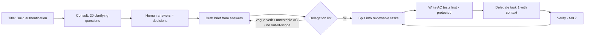

# Module 8.6 — التفويض المنظّم إلى AI
## AI Delegation: from "Build authentication" to a task with requirements, constraints, architecture, acceptance criteria, security requirements, tests, and out-of-scope

> **المستوى:** Level 8 | **الموقع:** [6 من 11]
> **السابق:** [M8.5 — Context Engineering](module-8.5-context-engineering.md) | **التالي:** [M8.7 — AI Verification](module-8.7-ai-verification.md)

---

## 1. المتطلبات
> **قبل أن تتعلم هذا، يجب أن تفهم:**
- [ ] المتطلبات: وظيفية/غير وظيفية، الغموض، "قابل للتحقّق" — [L4-M4.2](../level-4-software-engineering-foundations/module-4.2-requirements.md)
- [ ] قصص المستخدم ومعايير القبول Given/When/Then — [L4-M4.3](../level-4-software-engineering-foundations/module-4.3-user-stories-acceptance-criteria.md)
- [ ] المصادقة والتفويض وأمن كلمات المرور (لمثال "Build authentication") — [L5-M5.2](../level-5-building-real-software/module-5.2-authentication.md), [L5-M5.3](../level-5-building-real-software/module-5.3-authorization.md)
- [ ] نموذج التهديد كمصدر لمتطلبات الأمن — [L5-M5.5](../level-5-building-real-software/module-5.5-threat-modeling.md)
- [ ] السياق: ما يراه النموذج — [L8-M8.5](module-8.5-context-engineering.md)

## 2. أهداف التعلّم
بعد هذه الوحدة ستستطيع:
1. شرح لماذا "**Build authentication**" ليست مهمّة بل **عنوان** — وتعداد القرارات العشرين التي سيتّخذها النموذج نيابةً عنك إن أعطيته إيّاها كما هي.
2. كتابة **موجز مهمّة** (task brief) بسبعة أقسام: السياق والهدف، المتطلبات، القيود، المعمارية/المكان، معايير القبول، متطلبات الأمن، خارج النطاق — مع **الاختبارات المكتوبة مسبقًا** حيث أمكن.
3. تطبيق مبدأ **"القرار قبل التفويض"**: كل غموض في الموجز إمّا تُقرّره أنت الآن أو تطلب من النموذج أن يسأل — لا أن يخمّن.
4. تحجيم المهمّة المفوَّضة: **صغيرة بما يكفي لتُراجَع في جلسة** (≤ 300–400 سطر)، ومستقلّة بما يكفي لتُتحقّق وحدها.
5. تقييم جودة موجز قبل إرساله بـ **lint للتفويض** (§7): يرفض الأفعال الغامضة، ويطلب AC قابلة للاختبار، ويتأكّد من وجود "خارج النطاق" و"عند الشكّ اسأل".
6. التمييز بين **التفويض** (تنفيذ محدّد) و**الاستشارة** (توليد بدائل/أسئلة) واستخدام الثانية لتجهيز الأولى.

## 3. شرح للمبتدئ
في M4.2 تعلّمت أن أغلى الأخطاء تُولد في المتطلبات، وفي M8.3 أن AI يُسرّع وصولها إلى الإنتاج. التفويض هو اللحظة التي تلتقي فيها الحقيقتان: ما تكتبه في الموجز هو **المواصفة الفعلية** للنظام — كل ما لم تكتبه سيُقرّره النموذج بالإجابة الأكثر شيوعًا في بيانات تدريبه، وهي ليست إجابتك بالضرورة، وغالبًا ليست الأحدث ولا الأكثر أمانًا.

**تشريح "Build authentication".** أعطِ هذه الجملة لنموذج وسيُقرّر، دون أن يُخبرك: طريقة المصادقة (جلسات أم JWT؟ أين يُخزَّن الرمز؟)، خوارزمية التجزئة ومعاملاتها (bcrypt بعامل 10 من مثال 2015؟ أم argon2id؟)، سياسة كلمة المرور، هل هناك تأكيد بريد، ماذا يحدث عند 5 محاولات فاشلة (لا شيء؟ قفل؟ تأخير؟)، مدّة الجلسة وتجديدها، تسجيل الخروج من كل الأجهزة، إعادة التعيين (رمز في الرابط — بأي عشوائية وبأي انتهاء؟)، رسائل الخطأ (هل تكشف وجود البريد؟ — M5.2)، أين تعيش الطبقة (middleware؟ خدمة؟)، ما الجداول، ما الأحداث، التسجيل والمراقبة، تعدّد المستأجرين، CSRF، معدّل الطلبات، التوافق مع ما هو موجود… **عشرون قرارًا على الأقلّ**، كلٌّ منها كان في L5 درسًا كاملًا، وكلٌّ منها الآن اتُّخذ في ثانية بلا أثر. ثم يأتيك 900 سطر "يعمل" (M8.2)، وتكتشف القرارات واحدًا واحدًا — في المراجعة إن كنت محظوظًا، وفي حادثة إن لم تكن.

**الموجز بسبعة أقسام.** ليس نموذجًا بيروقراطيًا؛ هو ببساطة **قائمة القرارات التي ستُتّخذ** — إمّا بواسطتك الآن أو بواسطة النموذج عشوائيًا:

1. **السياق والهدف** — لمن؟ لماذا الآن؟ ما الموجود؟ (سطران إلى أربعة.) يُعطي النموذج ما يحتاجه ليختار بين خيارين متكافئين تقنيًا بحسب الغرض.
2. **المتطلبات** — ما يجب أن يفعله؛ وظيفية وغير وظيفية (أداء، حجم، توافق). مرقّمة.
3. **القيود** — ما لا يجوز تغييره: المكتبات المسموحة/الممنوعة، الإصدارات، الأنماط الإلزامية ("عبر المستودع"، "zod عند الحدود")، الملفات التي لا تُمسّ، حدود الحجم. القيود هي أكثر ما يُنسى — وأكثر ما يُنتج "كود جيّد في مشروع آخر".
4. **المعمارية / المكان** — أين يعيش هذا (الوحدة، الطبقة، الملفات المتوقّعة)، ما الواجهات التي يستدعيها (بالاسم)، ما الذي يجب أن يُطلقه/يُسجّله. مع رابط ADR إن وُجد.
5. **معايير القبول** — Given/When/Then، قابلة للاختبار، تُغطّي المسار السعيد **والحالات الحدّية والفشل**. كل AC سيُصبح اختبارًا (M8.3 تتبّع). **الأفضل**: اكتب الاختبارات نفسها الآن وضعها في السياق محمية (M8.4/8.5) — عندها "أرخص طريق" للنموذج هو إرضاءها.
6. **متطلبات الأمن** — مشتقّة من نموذج تهديد المهمّة (M5.5): ما المدخلات غير الموثوقة؟ ما الذي يجب ألّا يُكشف؟ من يُصرَّح له؟ ما الحدود (معدّل، حجم)؟ لا تكتب "اجعله آمنًا"؛ اكتب "لا رسالة خطأ تُميّز بين بريد غير موجود وكلمة مرور خاطئة".
7. **خارج النطاق** — ما **لا** تفعله في هذه المهمّة، صراحةً. بدونه يُضيف النموذج "تحسينات": إعادة هيكلة ملف مجاور، مكتبة جديدة، ميزة لم تُطلب. "خارج النطاق" هو الحدّ الذي يمنع 300 سطر من التحوّل إلى 1,200.

وفي النهاية سطر ثابت: **"إن وجدت غموضًا أو احتجت تغييرًا خارج الملفات المذكورة، توقّف واسأل؛ لا تخمّن."**

**القرار قبل التفويض.** الطريقة الأسرع لكتابة الموجز ليست من الصفر؛ هي **استشارة ثم تفويض**: أعطِ النموذج العنوان والسياق واطلب "20 سؤال استيضاح وقرارًا لكلٍّ منها"، أجب أنت (معظم الإجابات سطر)، ثم اطلب منه صياغة الموجز من إجاباتك، ثم راجعه. الآن القرارات **اتُّخذت بواسطتك وموثّقة** — وهذا هو الفرق كله عن "Build authentication". (M8.3: AI ناقدًا قبل مولّدًا.)

**تحجيم المهمّة.** مهمّة مفوَّضة جيّدة تنتهي بـ diff يمكنك قراءته **كاملًا** بتركيز في جلسة واحدة (300–400 سطر كحدّ عملي — M6.2 الإشباع)، ولها تحقّق مستقلّ (اختباراتها تمرّ وحدها). "Build authentication" تُصبح 6–8 مهام: مخطط + مستودع؛ تجزئة وتسجيل؛ تسجيل دخول + جلسة؛ قفل المحاولات؛ إعادة تعيين؛ تسجيل خروج شامل؛ مراقبة. كلٌّ بموجزها — ومعظم أقسام 1 و3 و4 و6 مشتركة تُكتب مرّة.

**علامات موجز سيّئ** (ما يلتقطه lint §7): فعل غامض بلا مفعول محدّد ("حسّن"، "ابنِ"، "تعامل مع"، "اجعله قويًا")، لا AC أو AC غير قابلة للاختبار ("يعمل بشكل صحيح"، "سريع"، "آمن")، لا قيود، لا خارج نطاق، لا تعليمة "اسأل"، مهمّة بعدّة أهداف ("و" كثيرة في الهدف)، أو موجز أطول من الكود المتوقّع (علامة أنك تكتب التنفيذ نثرًا — اكتبه كودًا إذن).

## 4. النموذج الذهني
**"كل قرار لم تكتبه في الموجز، اتّخذه النموذج نيابةً عنك — عشوائيًا وبلا أثر."** الموجز ليس "تعليمات أطول"؛ هو **قائمة القرارات** التي تملكها، مكتوبة قبل أن تُتّخذ عنك.

```text
"Build authentication"           الموجز
        │                           │
        ▼                           ▼
 ~20 قرارًا غير مرئي          1. السياق والهدف         ◀── لماذا (يرجّح بين الخيارات)
 يتّخذها النموذج              2. المتطلبات             ◀── ماذا
 بالإجابة الأشيع              3. القيود                ◀── ما لا يجوز
        │                     4. المعمارية/المكان       ◀── أين وبماذا يتّصل
        ▼                     5. معايير القبول (+اختبارات مسبقة) ◀── كيف نعرف أنه تمّ
 900 سطر "يعمل"               6. متطلبات الأمن         ◀── من نموذج التهديد
 تكتشف القرارات لاحقًا         7. خارج النطاق           ◀── الحدّ الذي يمنع التمدّد
                              + "إن شككت، اسأل"
```

## 5. الرسم التوضيحي


## 6. مثال بسيط
```markdown
<!-- BAD -->
Build authentication for the app.

<!-- GOOD (مهمّة 3 من 7: تسجيل الدخول + الجلسة) -->
## Context & goal
Web app, server-rendered + JSON API, single tenant, ~5k users. Registration + password hashing already exist (task 2, `auth/register.ts`).
Goal: users log in with email+password and get a server-side session.
## Requirements
R1 POST /auth/login {email, password} → 204 + Set-Cookie session on success; 401 otherwise.
R2 Sessions stored in Redis (existing `shared/redis`), TTL 7d sliding, max 5 concurrent per user (oldest evicted).
R3 Login latency p95 ≤ 150 ms excluding hash verification.
## Constraints
- Use `auth/password.ts#verify` (argon2id) — do not add a hashing library. Zod at the boundary. No new dependencies.
- Files: create `auth/login.ts`, `auth/session.ts`; modify only `auth/routes.ts`. Do not touch `auth/register.ts`.
## Architecture
- `SessionStore` interface in `auth/session.ts` with a Redis impl; handler in `auth/login.ts` uses `UserRepository.findByEmail`.
- Emit `UserLoggedIn {userId, ip, ua}` via `shared/events`. See ADR-0019 (sessions over JWT).
## Acceptance criteria
AC1 Given valid credentials, When POST /auth/login, Then 204 and cookie `sid` HttpOnly; Secure; SameSite=Lax.
AC2 Given wrong password OR unknown email, Then 401 with the SAME body and similar timing (no user enumeration).
AC3 Given 6th concurrent session, Then the oldest session is invalidated.
AC4 Given a valid session, When 7 days pass without requests, Then it is expired.
AC5 Given malformed body, Then 400 with validation errors; no DB call.
## Security
- Rate limit: 10 attempts / 15 min per email+IP → 429 (use `shared/ratelimit`). Log failures with userId hash, never the password.
- Cookie flags as AC1. Session id: 256-bit random from `crypto`. No session fixation: rotate id on login.
## Out of scope
MFA, "remember me", OAuth, password reset (task 5), account lockout UI.
## Tests
`auth/login.test.ts` is pre-written for AC1–AC5 (protected). Make it pass without editing it.
If anything is ambiguous or requires changes outside the listed files, stop and ask.
```

## 7. مثال كود
**lint للتفويض**: يُحلّل موجز مهمّة (Markdown بعناوين الأقسام السبعة أو كائنًا)، يُقيّمه ويُخرج أسبابًا قابلة للتنفيذ: أقسام ناقصة، أفعال غامضة في الهدف، AC غير قابلة للاختبار (كلمات مثل "بشكل صحيح/سريع/آمن" بلا قياس)، AC بلا Given/When/Then، لا قيود على الملفات، لا "خارج النطاق"، لا تعليمة "اسأل"، مهمّة متعدّدة الأهداف، وتقدير حجم. ثم **مولّد أسئلة استيضاح** من المتطلبات: لكل متطلب يذكر مدخلًا/مخرجًا/حالة بلا تحديد حدّه أو فشله يُقترح سؤال — هذا ما تطلبه من النموذج أولًا، ونُحاكيه هنا بقواعد.

```text
m86-ai-delegation/
├─ src/brief.ts
└─ src/brief.test.ts
```

```typescript
// src/brief.ts
// lint لموجز التفويض + مولّد أسئلة استيضاح بالقواعد
export interface Brief {
  goal: string; requirements: string[]; constraints: string[]; architecture: string[];
  acceptance: string[]; security: string[]; outOfScope: string[]; askWhenUnsure: boolean; preWrittenTests?: string[];
}
export interface Finding { severity: "error" | "warn"; code: string; message: string }
export interface LintResult { score: number; findings: Finding[]; verdict: "delegate" | "fix-first" | "not-a-task" }

const VAGUE_VERBS = /(^|\s)(build|improve|handle|optimi[sz]e|make it (robust|better|secure|fast)|implement|add support for|deal with|fix)(\s|$)/i;
const UNTESTABLE = /\b(correctly|properly|fast|quick|secure|robust|user[- ]friendly|good|clean|efficient|scalable|appropriate)\b/i;
const GWT = /\bgiven\b[\s\S]*\bwhen\b[\s\S]*\bthen\b/i;
const HAS_NUMBER = /\d/;
const FILE_SCOPE = /\b(files?|create|modify|only|do not touch|paths?)\b.*[\w\/.-]+\.(ts|js|sql|md)/i;
const MULTI_GOAL = /\b(and|&|plus|also|then)\b/gi;

export function lintBrief(b: Brief): LintResult {
  const f: Finding[] = [];
  const err = (code: string, message: string) => f.push({ severity: "error", code, message });
  const warn = (code: string, message: string) => f.push({ severity: "warn", code, message });

  if (!b.goal.trim()) err("goal.missing", "no goal");
  else {
    if (VAGUE_VERBS.test(b.goal) && !HAS_NUMBER.test(b.goal) && b.goal.split(/\s+/).length < 12) err("goal.vague", `goal is a title, not a task: "${b.goal}" — name the concrete behavior and its boundary`);
    const conj = b.goal.match(MULTI_GOAL)?.length ?? 0; if (conj >= 2) warn("goal.multi", "goal has several objectives — split into separately verifiable tasks");
  }
  if (b.requirements.length === 0) err("requirements.missing", "no requirements");
  if (b.acceptance.length === 0) err("ac.missing", "no acceptance criteria — nothing to verify against");
  b.acceptance.forEach((ac, i) => {
    if (UNTESTABLE.test(ac) && !HAS_NUMBER.test(ac)) err("ac.untestable", `AC${i + 1} uses an unmeasurable word: "${ac}"`);
    if (!GWT.test(ac)) warn("ac.format", `AC${i + 1} is not Given/When/Then — harder to turn into a test`);
  });
  const negative = b.acceptance.filter((ac) => /\b(401|403|400|404|409|429|reject|invalid|fail|expired|not|error|denied)\b/i.test(ac)).length;
  if (b.acceptance.length >= 2 && negative === 0) warn("ac.no-negative", "all AC are happy-path — add failure/edge cases");
  if (b.constraints.length === 0) err("constraints.missing", "no constraints — the model will choose libraries, patterns and files for you");
  else if (!b.constraints.some((c) => FILE_SCOPE.test(c))) warn("constraints.files", "no file scope — expect edits outside the intended area");
  if (b.architecture.length === 0) warn("architecture.missing", "no placement/interfaces — expect duplicated helpers and wrong layers");
  if (b.security.length === 0) err("security.missing", "no security requirements — derive them from the threat model, even if the answer is 'none: internal read-only'");
  else if (b.security.some((s) => /^(make it |be )?secure\.?$/i.test(s.trim()))) err("security.vague", "'make it secure' is not a requirement");
  if (b.outOfScope.length === 0) err("scope.missing", "no out-of-scope — expect 'improvements' you did not ask for");
  if (!b.askWhenUnsure) err("ask.missing", "missing 'if unsure, stop and ask' — the model will guess instead");
  if (!b.preWrittenTests?.length) warn("tests.none", "no pre-written tests — the cheapest path for the model is not yet 'satisfy the spec'");

  const errors = f.filter((x) => x.severity === "error").length; const warns = f.length - errors;
  const score = Math.max(0, 100 - errors * 20 - warns * 5);
  return { score, findings: f, verdict: errors >= 4 ? "not-a-task" : errors > 0 || score < 70 ? "fix-first" : "delegate" };
}

// أسئلة استيضاح بالقواعد: لكل متطلب يذكر مفهومًا بلا حدّه/فشله/مالكه
const PROBES: { re: RegExp; q: (m: string) => string }[] = [
  { re: /\b(password|credential)s?\b/i, q: () => "Password policy? Hashing algorithm and parameters? What happens after N failed attempts?" },
  { re: /\b(session|token|jwt)s?\b/i, q: (m) => `${m}: lifetime? sliding or fixed? storage? revocation on logout-all? max concurrent?` },
  { re: /\b(email|e-mail)\b/i, q: () => "Is email verified? Do error messages reveal whether an email exists?" },
  { re: /\b(upload|file|image|csv|export)s?\b/i, q: (m) => `${m}: max size? allowed types? streaming or buffered? who may access the result?` },
  { re: /\b(list|search|report|export)\b/i, q: () => "Pagination/limits? Tenant scoping? Sort order? What about deleted/archived items?" },
  { re: /\b(delete|remove|cancel)\b/i, q: (m) => `${m}: soft or hard? who is allowed? reversible? what happens to dependent records and events?` },
  { re: /\b(payment|charge|refund|invoice|price|amount)s?\b/i, q: (m) => `${m}: currency and minor units? idempotency key? partial failures? rounding rules?` },
  { re: /\b(notify|notification|email|sms)s?\b/i, q: () => "Mandatory vs preference-controlled notifications? Retry on provider failure? Rate limits?" },
  { re: /\b(fast|performance|latency|scale)\b/i, q: () => "Which percentile, what target, at what load? Measured where?" },
];

export function clarifyingQuestions(b: Pick<Brief, "goal" | "requirements">): string[] {
  const text = [b.goal, ...b.requirements]; const out = new Set<string>();
  for (const t of text) for (const p of PROBES) { const m = t.match(p.re); if (m) out.add(p.q(m[0])); }
  if (!b.requirements.some((r) => /\b(tenant|user|owner|role|permission|admin)\b/i.test(r))) out.add("Who is allowed to do this? Which roles/tenants? What does an unauthorized attempt return?");
  if (!b.requirements.some((r) => /\b(error|fail|invalid|timeout|retry)\b/i.test(r))) out.add("What are the failure modes and what does the user/caller see for each?");
  return [...out];
}
```

```typescript
// src/brief.test.ts
import { test } from "node:test";
import assert from "node:assert/strict";
import { lintBrief, clarifyingQuestions, type Brief } from "./brief.ts";

test("'Build authentication' ليست مهمّة: الـ lint يرفضها بأسباب محدّدة", () => {
  const bad: Brief = { goal: "Build authentication for the app", requirements: [], constraints: [], architecture: [], acceptance: ["It should work correctly and be secure"], security: ["make it secure"], outOfScope: [], askWhenUnsure: false };
  const r = lintBrief(bad);
  assert.equal(r.verdict, "not-a-task");
  const codes = r.findings.map((f) => f.code);
  for (const c of ["goal.vague", "requirements.missing", "ac.untestable", "constraints.missing", "security.vague", "scope.missing", "ask.missing"]) assert.ok(codes.includes(c), c);
  assert.ok(r.score <= 10);
});

test("الموجز الجيّد يُفوَّض؛ إزالة 'خارج النطاق' وحدها تُنزله إلى fix-first", () => {
  const good: Brief = {
    goal: "Users log in with email+password and receive a server-side session cookie (POST /auth/login)",
    requirements: ["R1 POST /auth/login → 204 + Set-Cookie on success; 401 otherwise", "R2 sessions in Redis, TTL 7d sliding, max 5 concurrent per user", "R3 p95 ≤ 150 ms excluding hash verification"],
    constraints: ["Use auth/password.ts#verify; no new dependencies", "Files: create auth/login.ts, auth/session.ts; modify only auth/routes.ts"],
    architecture: ["SessionStore interface + Redis impl", "emit UserLoggedIn via shared/events (ADR-0019)"],
    acceptance: [
      "Given valid credentials, When POST /auth/login, Then 204 and HttpOnly Secure SameSite=Lax cookie",
      "Given wrong password or unknown email, When POST /auth/login, Then 401 with identical body and timing within 20 ms",
      "Given 5 active sessions, When a 6th login succeeds, Then the oldest session is invalid",
      "Given malformed body, When POST /auth/login, Then 400 and no DB call",
    ],
    security: ["rate limit 10/15min per email+IP → 429", "rotate session id on login", "never log passwords"],
    outOfScope: ["MFA", "remember me", "OAuth", "password reset"],
    askWhenUnsure: true, preWrittenTests: ["auth/login.test.ts"],
  };
  const r = lintBrief(good);
  assert.equal(r.verdict, "delegate"); assert.equal(r.findings.filter((f) => f.severity === "error").length, 0); assert.ok(r.score >= 90);
  const noScope = lintBrief({ ...good, outOfScope: [] });
  assert.equal(noScope.verdict, "fix-first"); assert.ok(noScope.findings.some((f) => f.code === "scope.missing"));
  const happyOnly = lintBrief({ ...good, acceptance: good.acceptance.slice(0, 1).concat(["Given a session, When a request arrives, Then it is accepted"]) });
  assert.ok(happyOnly.findings.some((f) => f.code === "ac.no-negative"));
});

test("أسئلة الاستيضاح: تُولَّد من المفاهيم غير المحدّدة في المتطلبات، لا من العدم", () => {
  const qs = clarifyingQuestions({ goal: "Build authentication", requirements: ["users log in with email and password", "sessions expire"] });
  assert.ok(qs.some((q) => q.includes("Hashing algorithm")));
  assert.ok(qs.some((q) => q.startsWith("sessions:") || q.startsWith("session:")));
  assert.ok(qs.some((q) => q.includes("reveal whether an email exists")));
  assert.ok(qs.some((q) => q.startsWith("Who is allowed")));
  assert.ok(qs.some((q) => q.startsWith("What are the failure modes")));
  const specific = clarifyingQuestions({ goal: "export tenant orders as CSV", requirements: ["only the current tenant's orders, 100k row limit, streaming", "on provider error return 503 with retry-after"] });
  assert.ok(specific.some((q) => q.includes("Pagination/limits")));
  assert.ok(!specific.some((q) => q.startsWith("What are the failure modes")));   // الفشل مذكور
  assert.ok(!specific.some((q) => q.startsWith("Who is allowed")));               // tenant مذكور
});
```

**تشغيل:** `npx tsx --test src/*.test.ts`. استخدم `clarifyingQuestions` كقائمة أولية ثم اطلب من النموذج "20 سؤالًا آخر لا تظهر هنا" — وأجب عنها **أنت** قبل التفويض.

## 8. مثال من العالم الحقيقي
**نفس المهندس، نفس النموذج، موجزان.** مهندس في فريق مدفوعات سجّل تجربته: الجولة الأولى — "أضف استرداد جزئي للطلبات" في سطر، وكيل بالمستوى 3. النتيجة بعد 25 دقيقة: 1,100 سطر، 14 ملفًا، "كل الاختبارات تمرّ". في المراجعة: الاسترداد يُحسب بالـ float (0.1 + 0.2)، لا مفتاح idempotency (استرداد مزدوج عند إعادة المحاولة — M7.2)، يسمح باسترداد يتجاوز المبلغ الأصلي عبر طلبين متتاليين (race — M5.6)، أضاف مكتبة `decimal.js` لم يكن مسموحًا بها، وأعاد هيكلة `orders/service.ts` "لتحسين القابلية للقراءة". رُفض الـ PR؛ الوقت الضائع: 25 دقيقة توليد + 3 ساعات مراجعة + النقاش.

الجولة الثانية — 40 دقيقة لكتابة موجز بالأقسام السبعة (بعد 18 سؤال استيضاح أجاب عنها مع مالك المنتج): وحدات صغرى للمال، idempotency key إلزامي من العميل، قفل صفّ الطلب داخل معاملة، حدّ المجموع ≤ المبلغ الأصلي كقيد DB أيضًا، لا مكتبات جديدة، ملفات محدّدة، 7 AC منها 4 سلبية، اختبارات مسبقة محمية، خارج النطاق: الواجهة، الإشعارات، التقارير. النتيجة: 280 سطرًا، 3 ملفات، مراجعة 35 دقيقة، تعليقان، دُمج. الزمن الكلّي أقلّ، والنوم أفضل. ملاحظته: "الـ 40 دقيقة لم تكن 'كتابة prompt'؛ كانت اتّخاذ قرارات كنت سأتّخذها على أي حال — لكن في الوقت الصحيح."

## 9. مثال من الإنتاج
**قالب موجز الفريق + فحص CI للـ PR المرتبط به.** الفريق يُخزّن الموجزات في `tasks/TASK-###.md` ويربط كل PR مولَّد بواحد:

```markdown
---
id: TASK-412
owner: sara            # من يملك القرارات (M8.3)
autonomy: 3            # مستوى الوكيل (M8.4)
size: S                # S ≤ 150 lines · M ≤ 400 · L = split first
---
## Context & goal · ## Requirements · ## Constraints · ## Architecture
## Acceptance criteria   (كل AC بمعرّف AC-412.n ↔ اختبار بوسم @ac)
## Security              (مشتقّة من threat-model.md#refunds)
## Out of scope
## Pre-written tests: payments/refund.test.ts (protected)
## Decisions log: DEC-1 minor units · DEC-2 idempotency from client · DEC-3 DB constraint sum ≤ original
If unsure, stop and ask.
```

وفي CI على الـ PR: (1) `lintBrief` على ملف المهمّة — يفشل إن `fix-first`؛ (2) حجم الـ diff مقابل `size` — `S` مع 600 سطر = فشل مع رسالة "قسّم أو برّر"؛ (3) تتبّع AC ↔ اختبارات (M8.3)؛ (4) الملفات المُعدَّلة ⊆ الملفات المذكورة في Constraints، وإلّا تعليق "تغيير خارج النطاق: برّر أو أزل"؛ (5) قائمة القرارات تُلحق بوصف الـ PR آليًا كي يراها المراجع. النتيجة الملحوظة: صار كاتب الموجز هو عنق الزجاجة الجديد — وهذا مقصود؛ هو الدور الذي ارتفعت قيمته (M8.1).

## 10. أخطاء شائعة في الفهم
| الخطأ | الصواب |
|---|---|
| "الموجز الطويل = بيروقراطية" | الموجز هو القرارات التي ستُتّخذ على أي حال؛ كتابتها مسبقًا أرخص من اكتشافها في المراجعة أو الحادثة. |
| "النموذج ذكي؛ سيختار الصواب" | سيختار الأشيع في تدريبه، وهو ليس خيار مشروعك ولا بالضرورة الأحدث أو الآمن. |
| "AC هي الاختبارات" | AC هي العقد؛ الاختبارات تنفيذه. اكتب AC أولًا، ثم اختباراتها، ثم فوّض. |
| "خارج النطاق واضح من السياق" | ليس للنموذج؛ "التحسينات" غير المطلوبة هي أكثر مصادر تضخّم الـ diff. |
| "الموجز مرّة واحدة" | الأقسام 1 و3 و4 و6 تُعاد في مهام الميزة نفسها؛ اكتبها مرّة في ملف واستورِدها. |
| "أسئلة النموذج مضيعة وقت" | كل سؤال يُجاب الآن بسطر، أو يُجاب لاحقًا بإعادة كتابة. |

## 11. أخطاء شائعة في التطبيق
1. **كتابة التنفيذ نثرًا.** موجز يصف كل سطر. العلاج: إن كنت تعرف الكود بهذه الدقّة فاكتبه؛ الموجز للقرارات والحدود، لا للخطوات.
2. **AC سعيدة فقط.** العلاج: لكل AC سعيدة واحدة على الأقلّ سلبية (رفض/حدّ/فشل).
3. **قيود بلا ملفات.** العلاج: "أنشئ X، عدّل Y فقط، لا تلمس Z".
4. **تفويض مهمّة L.** العلاج: قسّم حتى تصبح كل مهمّة قابلة للمراجعة في جلسة وللتحقّق وحدها.
5. **نسيان "اسأل".** العلاج: سطر ثابت في القالب؛ وعند السؤال، أجب في الموجز لا في الدردشة كي يبقى الأثر.
6. **متطلبات أمن من الذاكرة.** العلاج: من نموذج تهديد الميزة (M5.5)؛ إن لم يكن موجودًا فهو المهمّة الأولى.

## 12. تمرين تصحيح
**الوضع:** موجز لمهمّة "إشعار بالبريد عند شحن الطلب" مرّ من `lintBrief` بدرجة 95، وفُوّض، والنتيجة أرسلت 40,000 بريد في 10 دقائق لنفس 2,000 مستخدم (20 مرّة لكلٍّ).

**المهمّة:**
1. اقرأ الموجز: AC تُغطّي "يُرسَل بريد عند الشحن" و"لا يُرسَل لمن ألغى الاشتراك" و"القالب يحوي رقم التتبّع". لا AC عن **التكرار**: الحدث `OrderShipped` يُعاد تسليمه (at-least-once — M5.9/M7.2)، والمعالج بلا idempotency.
2. لماذا لم يلتقط الـ lint ذلك؟ (يفحص الشكل لا المضمون؛ `clarifyingQuestions` كان سيسأل "Retry on provider failure?" لكن لا أحد سأل عن إعادة تسليم الحدث نفسه.) أضف probe: أي متطلب يذكر `event|queue|webhook|on <X>` ← سؤال "at-least-once? idempotency key? dedupe window?".
3. أضف AC سلبية: "Given نفس الحدث مرّتين، When يُعالَج، Then بريد واحد"، واكتب اختبارها قبل إعادة التفويض.
4. أين كان يجب أن يُلتقط هذا بشريًا؟ (مراجعة الموجز بواسطة شخص ثانٍ يعرف M5.9 — القسم 4 "المعمارية" ذكر `shared/events` ولم يُسأل عن دلالات التسليم.)
5. **تأمّل:** الـ lint يرفع الحدّ الأدنى ولا يُغني عن الخبرة؛ ما الأسئلة التي لا يمكن لقاعدة أن تطرحها؟

## 13. تمرين معماري
**الوضع:** أنت تُصمّم "مكتبة موجزات" لفريق من 15 مهندسًا: قوالب بحسب نوع المهمّة، أقسام مشتركة قابلة للاستيراد، وربط بالتتبّع والـ CI.

**المهمّة:**
1. حدّد 5 أنواع مهام (endpoint، job/worker، migration proposal، bugfix، refactor) واكتب لكلٍّ: ما يختلف في الأقسام السبعة، وما هي AC السلبية الإلزامية فيه (مثل: bugfix يحتاج اختبار تراجع يفشل قبل الإصلاح).
2. صمّم آلية "الأقسام المشتركة" (قيود الوحدة، متطلبات أمنها) بحيث تُحدَّث في مكان واحد ولا تُنسخ.
3. كيف تربط الموجز بالوكيل (M8.4: مستوى وسياسة)، بالسياق (M8.5: ملفات إلزامية)، وبالتحقّق (M8.7: اختبارات مسبقة محمية)?
4. ما الذي يُقاس لمعرفة أن الموجزات تعمل؟ (نسبة PRs مرفوضة لأسباب "خارج النطاق"، متوسّط جولات التفويض لكل مهمّة، تعليقات "لماذا هذا القرار؟").
5. قدّم كـ Assumption / Constraint / Tradeoff / Risk / Recommendation، مع خطر "القالب يُملأ شكليًا" وكيف تُقاومه.

## 14. العلاقة بعصر AI
التفويض هو المهارة التي قال M8.1 إن قيمتها ارتفعت أكثر من غيرها: **المواصفة**. كل ما سبق في الدورة يُغذّيها (M4.2/4.3 تكتب المتطلبات والـ AC، M5.5 تشتقّ الأمن، M6.3 تُقرّر المعمارية، M7.2 تُذكّرك بالتكرار والفشل)، وكل ما يليها يعتمد عليها (M8.7 يتحقّق مقابل AC الموجز، M8.10 يُحدّد أي أقسام تحتاج موافقة، M8.11 يبدأ كل دورة بموجز). وفي L9 المسار B، ستُسلّم موجزاتك مع الكود — وستُقيَّم على جودة القرارات التي اتّخذتها قبل أن يكتب النموذج سطرًا.

## 15. ما يجب إتقانه
- الأقسام السبعة + "اسأل" ولماذا كلٌّ منها يمنع فئة محدّدة من الأخطاء.
- تحويل عنوان إلى قرارات عبر أسئلة الاستيضاح أولًا.
- AC قابلة للاختبار بصيغة Given/When/Then مع حالات سلبية، وربطها باختبارات مسبقة محمية.
- التحجيم: مهمّة = diff يُقرأ في جلسة ويُتحقّق منه وحده.

## 16. ما يجب فهمه
- lint التفويض كحدّ أدنى آلي وحدوده.
- الأقسام المشتركة والقوالب بحسب النوع.
- ربط الموجز بالوكيل والسياق والتحقّق.

## 17. ما يمكن تأجيله
- توليد الموجزات من تذاكر المنتج آليًا ومراجعتها بشريًا.
- قياس أثر جودة الموجز على معدّل العيوب على مستوى المنظّمة.

## 18. الخلاصة
"Build authentication" عنوان لا مهمّة؛ تفويضها كما هي يعني تفويض عشرين قرارًا للإجابة الأشيع في بيانات التدريب. الموجز الجيّد هو قائمة تلك القرارات مكتوبة بواسطتك قبل أن تُتّخذ عنك: السياق والهدف، المتطلبات، القيود، المكان في المعمارية، معايير قبول قابلة للاختبار (بحالات سلبية، ويُفضَّل اختبارات مسبقة محمية)، متطلبات أمن من نموذج التهديد، وخارج النطاق — وفي النهاية "إن شككت، اسأل". اطلب الأسئلة قبل الكود، قسّم حتى يُقرأ كل diff في جلسة، وافحص الموجز قبل إرساله. الوقت الذي تُنفقه هنا ليس تكلفة إضافية؛ هو القرارات نفسها، في وقتها الصحيح.

## 19. المراجع الرسمية
- ISO/IEC/IEEE 29148 — Requirements engineering — خصائص المتطلب (necessary, unambiguous, verifiable, singular).
- Gojko Adzic — "Specification by Example" — الأمثلة القابلة للتنفيذ كمواصفة؛ الأساس لـ"اختبارات مسبقة محمية".
- Dan North — "Introducing BDD" / Given-When-Then — صيغة AC المعتمدة هنا.
- Anthropic — "Claude Code best practices" / OpenAI — "Prompt engineering guide" (sections on specificity, constraints, and asking for clarification) — إرشادات المورّدين تتقاطع مع الأقسام السبعة.
- OWASP — "Application Security Verification Standard (ASVS)" — مصدر جاهز لمتطلبات الأمن القابلة للتحقّق في القسم 6.
- Mike Cohn — "User Stories Applied" — التحجيم والتقسيم (INVEST) الذي ينطبق على المهام المفوَّضة.

---

### المصطلحات في هذه الوحدة
| English | العربية |
|---|---|
| Delegation | تفويض (مهمّة محدّدة للتنفيذ) |
| Task brief | موجز المهمّة (الأقسام السبعة) |
| Consultation | استشارة (توليد أسئلة/بدائل قبل التفويض) |
| Clarifying question | سؤال استيضاح |
| Decision log | سجلّ القرارات (DEC-n) |
| Constraint | قيد (ما لا يجوز تغييره) |
| Out of scope | خارج النطاق |
| Negative acceptance criterion | معيار قبول سلبي (رفض/حدّ/فشل) |
| Pre-written tests | اختبارات مكتوبة مسبقًا (محمية) |
| Delegation lint | فاحص آلي لجودة الموجز |
| Task sizing | تحجيم المهمّة (S/M/L) |
| Scope creep | تمدّد النطاق |
